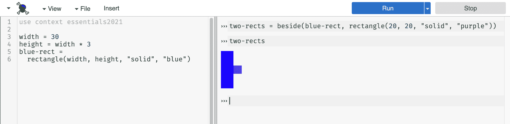

# 3.2 命名值🔗

> 原文：[`dcic-world.org/2025-08-27/Naming_Values.html`](https://dcic-world.org/2025-08-27/Naming_Values.html)

| |   3.2.1 定义面板 |
| --- | --- |
| |   3.2.2 命名值 |
| |     3.2.2.1 名称与字符串 |
| |     3.2.2.2 表达式与语句 |
| |   3.2.3 程序目录 |
| |     3.2.3.1 理解运行按钮 |
| |   3.2.4 使用名称简化图像构建 |

#### 3.2.1 定义面板🔗 "链接至此")

到目前为止，我们只使用了 CPO 屏幕右半部分的交互面板。正如我们所见，这个面板的作用就像计算器：你在提示符下输入一个表达式，CPO 会显示该表达式的计算结果。

左侧面板被称为定义面板。这是你可以放入想要保存到文件中的代码的地方。它还有另一个用途：它可以帮助你组织代码，因为你的表达式变得更大。

#### 3.2.2 命名值🔗 "链接至此")

创建图像的表达式需要一些输入。如果能有一些缩写，以便我们可以“命名”图像并通过其名称来引用它们，那就太好了。这就是定义面板的作用：你可以在定义面板中放入表达式和程序，然后使用 CPO 中的“运行”按钮使定义在交互面板中可用。

> 现在行动！
> 
> > 将以下内容放入定义面板中：
> > 
> > ```py
> > red-circ = circle(30, "solid", "red")
> > ```
> > 
> > 点击运行，然后在交互面板中输入`red-circ`。你应该能看到红色的圆圈。

更普遍地，如果你以以下形式编写代码：

```py
NAME = EXPRESSION
```

Pyret 会将`EXPRESSION`的值与`NAME`关联。任何时候你写下（简写的）`NAME`，Pyret 都会自动（幕后）将其替换为`EXPRESSION`的值。例如，如果你在提示符中写下`x = 5 + 4`，然后写下`x`，CPO 会给你值`9`（而不是原始的`5 + 4`表达式）。

如果你输入了一个尚未与值关联的名称，会怎样？

> 现在行动！
> 
> > 尝试在交互面板提示符中输入`puppy`（›››）。错误信息中有任何你不熟悉的术语吗？

当一个表达式中包含一个尚未与（或绑定到）值关联的名称时，CPO（以及许多编程工具）使用短语“未绑定标识符”。

##### 3.2.2.1 名称与字符串🔗 "链接至此")

到目前为止，我们已经看到在编程中有两种使用单词的方式：(1) 作为字符串中的数据，(2) 作为值的名称（也称为标识符）。这两种用法非常不同，因此值得回顾。

+   语法上（另一种说“我们如何编写它”的方式），我们通过双引号的存在来区分字符串和名称。注意`puppy`和`"puppy"`之间的区别。

+   字符串可以包含空格，但名称不能。例如，`"hot pink"` 是一个有效的数据片段，但 `hot pink` 不是一个单独的名称。当你想要将多个单词组合成一个名称（就像我们上面用 `red-circ` 做的那样）时，使用连字符来分隔单词，同时仍然保持一个名称（作为一个字符序列）。不同的编程语言允许使用不同的分隔符；对于 Pyret，我们将使用连字符。

+   在交互式提示符中将单词作为名称输入或作为字符串输入会改变你要求 Pyret 执行的计算。如果你输入 `puppy`（名称，不带双引号），你是在要求 Pyret 查找你之前存储在该名称下的值。如果你输入 `"puppy"`（字符串，带双引号），你只是在写下一条数据（类似于输入一个数字如 `3`）：Pyret 返回你输入的值作为计算的结果。

+   如果你输入一个你没有之前与之关联值的名称，Pyret 将会给你一个“未绑定标识符”错误信息。相比之下，由于字符串只是数据，所以你不会因为写入一个之前未使用的字符串而得到错误（有一些特殊的字符串情况，比如你想要在字符串内部放置引号，但我们现在先不考虑这种情况）。

新手程序员一开始经常混淆名称和字符串。现在，请记住，你使用 `=` 赋值给值的名称不能包含引号，而基于单词或文本的数据必须用双引号括起来。

##### 3.2.2.2 表达式与语句🔗 "链接至此")

定义和表达式是程序的两个有用方面，每个方面都有其自己的角色。定义告诉 Pyret 将名称与值关联起来。表达式告诉 Pyret 执行计算并返回结果。

> 练习
> 
> > 在交互式提示符中输入以下内容：
> > 
> > +   `5 + 8`
> > +   
> > +   `x = 14 + 16`
> > +   
> > +   `triangle(20, "solid", "purple")`
> > +   
> > +   `blue-circ = circle(x, "solid", "blue")`
> > +   
> > 第一个和第三个是表达式，而第二个和第四个是定义。你观察到输入表达式与输入定义的结果有什么不同？

希望你能注意到 Pyret 似乎没有从定义中返回任何内容，但它确实显示了表达式的一个值。在编程中，我们区分产生值的表达式和不会产生值但向语言提供其他类型指令的语句。到目前为止，定义是我们看到的唯一类型的语句。

> 练习
> 
> > 假设你仍然在交互式面板中有上面提到的 `blue-circ` 定义，请在提示符中输入 `blue-circ`（如果你不再有那个定义，你可以重新输入那个定义）。
> > 
> > 根据 Pyret 的响应，`blue-circ` 是表达式还是定义？

由于`blue-circ`得到了结果，我们推断出仅凭名称本身也是一个表达式。这个练习突出了定义和定义名称使用的区别。一个产生值，而另一个则不产生。但当你运行一个定义时，肯定会在某个地方发生某些事情。否则，你怎么能在以后使用那个名称呢？

#### 3.2.3 程序目录🔗 "链接至此")

编程工具在运行程序时在幕后工作。例如，对于程序`2 + 3`，会进行计算以产生`5`，然后显示在交互面板中。

当你编写一个定义时，Pyret 会在一个内部目录中创建一个条目，将名称与值关联起来。你无法看到目录，但 Pyret 使用它来管理你与名称关联的值。如果你编写：

```py
width = 30
```

Pyret 为`width`创建一个新的目录条目，并记录`width`的值为`30`。如果你然后编写

```py
height = width * 3
```

Pyret 评估右侧的表达式（`width * 3`），然后将产生的值（在这里是`90`）存储在目录中与`height`一起。

Pyret 是如何评估（`width * 3`）的？由于`width`是一个单词（不是一个字符串），Pyret 会在目录中查找它的值。Pyret 将这个值替换为表达式中的名称，结果是`30 * 3`，然后评估为`90`。运行这两个表达式后，目录看起来像：

目录

+   ```py
    width
    ```

    →

    ```py
    30
    ```

+   ```py
    height
    ```

    →

    ```py
    90
    ```

注意，目录中`height`的条目结果是`width * 3`，而不是表达式。当我们使用命名值来防止我们多次进行相同的计算时，这一点将变得很重要。

程序目录是程序评估过程中的一个基本部分。如果你试图跟踪程序的工作情况，有时在一张纸上跟踪目录内容会很有帮助（因为你无法查看 Pyret 的目录）。

> 练习
> 
> > 想象一下，当你按下运行按钮时，在定义面板中有以下代码：
> > 
> > ```py
> > name = "Matthias"
> > "name"
> > ```
> > 
> > 交互面板中显示的是什么？每一行是如何与程序目录交互的？
> > 
> 现在行动！
> 
> > 如果你为同一个名称输入后续的定义，比如`width = 50`，会发生什么？Pyret 将如何响应？如果你然后要求在提示符下查看与该相同名称关联的值，会发生什么？这告诉你关于目录的什么信息？

当你试图给目录中已经存在的名称赋予新值时，Pyret 会响应说新的定义“与同一名称的早期声明冲突”。这是 Pyret 警告你该名称已经在目录中的方式。如果你再次要求查看与该名称关联的值，你会看到它仍然具有原始值。Pyret 不允许你使用`name = value`的表示法更改与现有名称关联的值。虽然有一个表示法可以让你重新分配值，但我们不会在变量修改之前处理这个概念。

##### 3.2.3.1 理解运行按钮🔗 "链接至此")

现在我们已经了解了程序目录，让我们讨论按下运行按钮时会发生什么。假设以下内容在定义面板中：

```py
width = 30
height = width * 3
blue-rect = rectangle(width, height, "solid", "blue")
```

当你按下运行按钮时，Pyret 首先清空程序目录。然后逐行处理你的文件，从顶部开始。如果你有一个 `include` 语句，Pyret 会将包含库的定义添加到目录中。处理完这个程序的每一行后，目录将看起来像：

目录

+   ```py
    circle
    ```

    → 圆形操作

+   ```py
    rectangle
    ```

    → 矩形操作

+   ...

+   ```py
    width
    ```

    →

    ```py
    30
    ```

+   ```py
    height
    ```

    →

    ```py
    90
    ```

+   ```py
    blue-rect
    ```

    → 实际矩形图像

如果你现在在交互式提示符中输入，任何使用标识符（一个不在引号内的字符序列）都会导致 Pyret 咨询目录。

如果你现在输入

```py
beside(blue-rect, rectangle(20, 20, "solid", "purple"))
```

Pyret 将查找与 `blue-rect` 关联的图像。

> 现在行动！
> 
> > 紫色矩形在目录中吗？两个矩形的图像呢？

这两个形状都不在目录中。为什么？我们没有要求 Pyret 用名称将它们存储在那里。如果我们用以下内容（在交互式提示符中）代替，会有什么不同？

```py
two-rects = beside(blue-rect, rectangle(20, 20, "solid", "purple"))
```

现在，两个形状的图像将出现在目录中，与名称 `two-rects` 关联。然而，紫色矩形本身仍然不会被存储在目录中。但是，我们可以通过名称引用两个形状的图像，如下所示：



> 现在行动！
> 
> > 想象我们现在再次按下运行按钮，然后在交互式提示符中输入 `two-rects`。Pyret 将如何响应，为什么？

#### 3.2.4 使用名称简化图像构建🔗 "链接至此")

能够命名值可以使构建复杂表达式更容易。让我们将一个旋转的紫色三角形放入一个绿色正方形中：

```py
overlay(rotate(45, triangle(30, "solid", "purple")),
  rectangle(60, 60, "solid", "green"))
```

然而，这可能会变得相当难以阅读和理解。相反，我们可以在构建整体图像之前给单个形状命名：

```py
purple-tri = triangle(30, "solid", "purple")
green-sqr = rectangle(60, 60, "solid", "green")

overlay(rotate(45, purple-tri),
  green-sqr)
```

在这个版本中，`overlay` 表达式更容易阅读，因为我们为初始形状给出了描述性的名称。

再进一步：让我们在现有图像的顶部添加另一个紫色三角形：

```py
purple-tri = triangle(30, "solid", "purple")
green-sqr = rectangle(60, 60, "solid", "green")

above(purple-tri,
  overlay(rotate(45, purple-tri),
    green-sqr))
```

在这里，我们看到利用名称的一个新好处：我们可以在同一个表达式中使用 `purple-tri` 两次，而无需将较长的 `triangle` 表达式写两次。

> 练习
> 
> > 假设你的定义面板只包含这个最新的代码示例（包括 `purple-tri` 和 `green-sqr` 定义）。如果你按下运行按钮，交互式面板中会出现多少个单独的图像？你是否看到紫色三角形和绿色正方形单独出现，或者只有组合在一起？为什么或为什么不？
> > 
> 练习
> 
> > 重新编写你的亚美尼亚国旗的表达式（来自 制作旗帜），这次给每条条纹都起一个中间名称。

在实践中，当创建更复杂的表达式时，程序员不会为每个单独的图像或表达式结果命名。他们只为那些会多次使用或对理解他们的程序有特殊意义的命名。随着我们的程序变得更加复杂，我们将有更多关于命名的内容要讨论。

#### 3.2.1 定义面板🔗 "链接到这里")

到目前为止，我们只使用了 CPO 屏幕右侧的一半交互面板。正如我们所看到的，这个面板就像一个计算器：你在提示符中输入一个表达式，CPO 就会给出该表达式的评估结果。

左侧面板被称为定义面板。这是你可以放置想要保存到文件中的代码的地方。它还有另一个用途：它可以帮助你组织代码，因为你的表达式变得更大。

#### 3.2.2 命名值🔗 "链接到这里")

创建图像的表达式需要一些输入。如果能有一些缩写，以便我们可以“命名”图像并通过其名称来引用它们，那就太好了。这就是定义面板的作用：你可以在定义面板中放入表达式和程序，然后使用 CPO 中的“运行”按钮使定义在交互面板中可用。

> 现在就做！
> 
> > 在定义面板中放入以下内容：
> > 
> > ```py
> > red-circ = circle(30, "solid", "red")
> > ```
> > 
> > 点击运行，然后在交互面板中输入 `red-circ`。你应该能看到红色的圆圈。

更普遍地，如果你以以下形式编写代码：

```py
NAME = EXPRESSION
```

Pyret 将将 `EXPRESSION` 的值与 `NAME` 关联。任何时候你写下（缩写）`NAME`，Pyret 都会自动（在幕后）将其替换为 `EXPRESSION` 的值。例如，如果你在提示符中写下 `x = 5 + 4`，然后写下 `x`，CPO 将会给你返回值 `9`（而不是原始的 `5 + 4` 表达式）。

如果你输入的名称在提示符中没有与值关联，会怎样呢？

> 现在就做！
> 
> > 尝试在交互面板提示符（›››）中输入 `puppy`。错误信息中有任何你不熟悉的术语吗？

当一个表达式中包含一个尚未与（或绑定到）值关联的名称时，CPO（以及许多编程工具）使用短语“未绑定标识符”。

##### 3.2.2.1 名称与字符串🔗 "链接到这里")

到目前为止，我们在编程中已经看到单词以两种方式被使用：（1）作为字符串中的数据，以及（2）作为值的名称（也称为标识符）。这两种用法非常不同，因此值得回顾。

+   语法上（另一种说法是“根据我们如何书写它”），我们通过双引号的存在来区分字符串和名称。注意 `puppy` 和 `"puppy"` 之间的区别。

+   字符串可以包含空格，但名称不能。例如，`"hot pink"` 是有效数据，但 `hot pink` 不是一个单独的名称。当你想要将多个单词组合成一个名称（就像我们上面用 `red-circ` 做的那样）时，使用连字符来分隔单词，同时仍然保持一个名称（作为字符序列）。不同的编程语言允许不同的分隔符；对于 Pyret，我们将使用连字符。

+   在交互提示符中将单词作为名称与作为字符串输入会改变你要求 Pyret 执行的计算。如果你输入 `puppy`（名称，不带双引号），你是在要求 Pyret 查找你之前存储在该名称下的值。如果你输入 `"puppy"`（字符串，带双引号），你只是在记录一段数据（类似于输入一个数字如 `3`）：Pyret 返回你输入的值作为计算的结果。

+   如果你输入一个你没有之前与之关联值的名称，Pyret 将会给你一个“未绑定标识符”错误信息。相比之下，由于字符串只是数据，所以对于写入之前未使用的字符串，你不会得到错误（有一些特殊的字符串情况，例如当你想在它们内部放置引号时，但我们现在先不考虑这种情况）。

初学者程序员最初经常混淆名称和字符串。现在，请记住，使用 `=` 与值关联的名称不能包含引号，而基于单词或文本的数据必须用双引号括起来。

##### 3.2.2.2 表达式与语句🔗 "链接到此处")

定义和表达式是程序的两个有用方面，每个都有自己的角色。定义告诉 Pyret 将名称与值关联起来。表达式告诉 Pyret 执行计算并返回结果。

> 练习
> 
> > 在交互提示符中输入以下内容：
> > 
> > +   `5 + 8`
> > +   
> > +   `x = 14 + 16`
> > +   
> > +   `triangle(20, "solid", "purple")`
> > +   
> > +   `blue-circ = circle(x, "solid", "blue")`
> > +   
> > 第一和第三是表达式，而第二和第四是定义。你观察到输入表达式与输入定义的结果有什么不同？

希望你能注意到，Pyret 似乎没有从定义中返回任何内容，但它确实显示了表达式中的值。在编程中，我们区分表达式，它们产生值，和语句，它们不产生值，而是向语言提供某种其他类型的指令。到目前为止，定义是我们看到的唯一类型的语句。

> 练习
> 
> > 假设你仍然在你的交互面板中保留了上面的 `blue-circ` 定义，请在提示符中输入 `blue-circ`（如果它不再那里，你可以重新输入该定义）。
> > 
> > 根据 Pyret 的响应，`blue-circ` 是表达式还是定义？

由于 `blue-circ` 得到了结果，我们推断出仅凭名称本身也是一个表达式。这个练习突出了定义和定义名称之间的区别。一个产生值，而另一个不产生。但当你运行一个定义时，肯定会在某个地方发生某些事情。否则，你怎么能在以后使用那个名称呢？

##### 3.2.2.1 名称与字符串🔗 "链接到此处")

到目前为止，我们已经看到在编程中单词被用于两种方式：(1) 作为字符串中的数据，(2) 作为值的名称（也称为标识符）。这两种用法非常不同，所以值得回顾一下。

+   语法上（另一种说法是“根据我们如何书写它”），我们通过双引号的存在来区分字符串和名称。注意 `puppy` 和 `"puppy"` 之间的区别。

+   字符串可以包含空格，但名称不能。例如，`"hot pink"` 是一个有效的数据片段，但 `hot pink` 不是一个单独的名称。当你想要将多个单词组合成一个名称（就像我们上面用 `red-circ` 做的那样）时，使用连字符来分隔单词，同时仍然保持一个单一的名称（作为一个字符序列）。不同的编程语言允许不同的分隔符；对于 Pyret，我们将使用连字符。

+   在交互式提示符中将单词作为名称与作为字符串输入会改变你要求 Pyret 执行的计算。如果你输入 `puppy`（名称，不带双引号），你是在要求 Pyret 查找你之前存储在该名称下的值。如果你输入 `"puppy"`（字符串，带双引号），你只是在写下一条数据（类似于输入一个数字如 `3`）：Pyret 返回你输入的值作为计算的结果。

+   如果你输入了一个你没有之前与之关联值的名称，Pyret 将会给出一个“未绑定标识符”错误信息。相比之下，由于字符串只是数据，所以你不会因为写入一个之前未使用的字符串而得到错误（有一些特殊的字符串情况，比如你想要在字符串内部放置引号，但我们现在先不考虑这个），你不会得到错误。

新手程序员一开始经常混淆名称和字符串。现在，请记住，使用 `=` 赋值给值的名称不能包含引号，而基于单词或文本的数据必须用双引号括起来。

##### 3.2.2.2 表达式与语句🔗 "链接到此处")

定义和表达式是程序的两个有用方面，每个都有自己的角色。定义告诉 Pyret 将名称与值关联起来。表达式告诉 Pyret 执行计算并返回结果。

> 练习
> 
> > 在交互式提示符中输入以下内容：
> > 
> > +   `5 + 8`
> > +   
> > +   `x = 14 + 16`
> > +   
> > +   `triangle(20, "solid", "purple")`
> > +   
> > +   `blue-circ = circle(x, "solid", "blue")`
> > +   
> > 第一和第三是表达式，而第二和第四是定义。你观察到输入表达式与输入定义的结果有什么不同？

希望你能注意到，Pyret 似乎没有从定义中返回任何内容，但它确实从表达式中显示了值。在编程中，我们区分表达式，它们产生值，和语句，它们不产生值，而是向语言提供某种其他类型的指令。到目前为止，定义是我们看到的唯一类型的语句。

> 练习
> 
> > 假设你仍然在交互面板中有上面的 `blue-circ` 定义，在提示符处输入 `blue-circ`（如果你不再有那个定义，可以重新输入）。
> > 
> > 根据 Pyret 的响应，`blue-circ` 是表达式还是定义？

由于 `blue-circ` 产生了结果，我们推断出名称本身也是一个表达式。这个练习突出了创建定义和使用已定义名称之间的区别。一个产生值，而另一个不产生值。但当然，在运行定义时，某处必须发生某些事情。否则，你怎么能在以后使用那个名称呢？

#### 3.2.3 程序目录🔗 "链接到此处")

编程工具在运行程序时在幕后工作。例如，对于程序 `2 + 3`，会进行计算以产生 `5`，然后在该交互面板中显示。

当你编写一个定义时，Pyret 在一个内部目录中创建一个条目，在其中它将名称与值关联起来。你无法看到目录，但 Pyret 使用它来管理你与名称关联的值。如果你编写：

```py
width = 30
```

Pyret 为 `width` 创建一个新的目录条目，并记录 `width` 的值为 `30`。如果你随后写入

```py
height = width * 3
```

Pyret 评估右侧的表达式（`width * 3`），然后将产生的值（此处为 `90`）存储在目录中与 `height` 旁边。

Pyret 如何评估 (`width * 3`)？由于 `width` 是一个词（不是一个字符串），Pyret 在目录中查找其值。Pyret 将该值替换为表达式中的名称，从而得到 `30 * 3`，然后评估为 `90`。运行这两个表达式后，目录看起来如下：

目录

+   ```py
    width
    ```

    →

    ```py
    30
    ```

+   ```py
    height
    ```

    →

    ```py
    90
    ```

注意，目录中 `height` 的条目是 `width * 3` 的结果，而不是表达式。当我们使用命名值来防止我们多次进行相同的计算时，这将成为重要的一点。

程序目录是程序评估的重要组成部分。如果你试图跟踪程序的工作方式，有时在一张纸上跟踪目录内容会很有帮助（因为你无法查看 Pyret 的目录）。

> 练习
> 
> > 想象一下，当你按下运行按钮时，在定义面板中有以下代码：
> > 
> > ```py
> > name = "Matthias"
> > "name"
> > ```
> > 
> > 交互面板中显示的是什么？每一行如何与程序目录交互？
> > 
> 现在就做！
> 
> > 如果你为同一个名称输入后续的定义，例如 `width = 50`，会发生什么？Pyret 如何响应？如果你随后在提示符处要求查看与该名称关联的值，会发生什么？这告诉你关于目录的什么信息？

当你尝试给目录中已经存在的名称赋予新值时，Pyret 会响应说新的定义“与相同名称的早期声明冲突”。这是 Pyret 警告你已经存在该名称的一种方式。如果你再次请求与该名称关联的值，你会看到它仍然具有原始值。Pyret 不允许你使用 `name = value` 语法更改与现有名称关联的值。虽然有一种语法可以让你重新赋值，但我们不会在 变量修改 这一概念上工作。

##### 3.2.3.1 理解运行按钮🔗 "链接至此")

现在我们已经了解了程序目录，让我们讨论当你按下运行按钮时会发生什么。假设以下内容在定义面板中：

```py
width = 30
height = width * 3
blue-rect = rectangle(width, height, "solid", "blue")
```

当你按下运行按钮时，Pyret 首先清空程序目录。然后逐行处理你的文件，从顶部开始。如果你有一个 `include` 语句，Pyret 将包含库中的定义添加到目录中。处理完这个程序的每一行后，目录将看起来像：

目录

+   ```py
    circle
    ```

    → <圆形操作>

+   ```py
    rectangle
    ```

    → <矩形操作>

+   …

+   ```py
    width
    ```

    →

    ```py
    30
    ```

+   ```py
    height
    ```

    →

    ```py
    90
    ```

+   ```py
    blue-rect
    ```

    → <实际的矩形图像>

如果你现在在交互式提示符中输入，任何使用标识符（一个不在引号内的字符序列）的操作都会导致 Pyret 咨询目录。

如果你现在输入

```py
beside(blue-rect, rectangle(20, 20, "solid", "purple"))
```

Pyret 将查找与 `blue-rect` 关联的图像。

> 立刻行动！
> 
> > 紫色矩形在目录中吗？两个矩形的图像呢？

这两个形状都不在目录中。为什么？我们没有要求 Pyret 用名称存储它们。如果我们改为在交互式提示符中写下以下内容会有什么不同？

```py
two-rects = beside(blue-rect, rectangle(20, 20, "solid", "purple"))
```

现在，两个形状的图像将出现在目录中，与名称 `two-rects` 关联。然而，单独的紫色矩形仍然不会被存储在目录中。然而，我们可以像下面这样通过名称引用两个形状的图像：


> 立刻行动！
> 
> > 假设我们现在再次点击运行按钮，然后在交互式提示符中输入 `two-rects`。Pyret 将如何响应，为什么？

##### 3.2.3.1 理解运行按钮🔗 "链接至此")

现在我们已经了解了程序目录，让我们讨论当你按下运行按钮时会发生什么。假设以下内容在定义面板中：

```py
width = 30
height = width * 3
blue-rect = rectangle(width, height, "solid", "blue")
```

当你按下运行按钮时，Pyret 首先清空程序目录。然后逐行处理你的文件，从顶部开始。如果你有一个 `include` 语句，Pyret 将包含库中的定义添加到目录中。处理完这个程序的每一行后，目录将看起来像：

目录

+   ```py
    circle
    ```

    → <圆形操作>

+   ```py
    rectangle
    ```

    → <矩形操作>

+   …

+   ```py
    width
    ```

    →

    ```py
    30
    ```

+   ```py
    height
    ```

    →

    ```py
    90
    ```

+   ```py
    blue-rect
    ```

    → <实际的矩形图像>

如果你现在在交互式提示符中输入，任何使用标识符（一个不在引号内的字符序列）的操作都会导致 Pyret 咨询目录。

如果你现在输入

```py
beside(blue-rect, rectangle(20, 20, "solid", "purple"))
```

Pyret 会查找与 `blue-rect` 关联的图像。

> 现在行动！
> 
> > 目录中是否有紫色矩形？那个有两个矩形的图像呢？

这两个形状都不在目录中。为什么？我们没有要求 Pyret 以名称将它们存储在那里。如果我们改为编写以下内容（在交互式提示符中）会有什么不同？

```py
two-rects = beside(blue-rect, rectangle(20, 20, "solid", "purple"))
```

现在，两个形状的图像会在目录中，与名称 `two-rects` 关联。然而，单独的紫色矩形仍然不会被存储在目录中。但是，我们可以像下面所示的那样通过名称引用两个形状的图像：


> 现在行动！
> 
> > 想象我们现在再次点击运行按钮，然后在交互式提示符中输入 `two-rects`。Pyret 将如何响应，为什么？

#### 3.2.4 使用名称简化构建图像🔗 "链接至此")

命名值的能力可以使构建复杂表达式更容易。让我们将一个旋转的紫色三角形放入绿色正方形中：

```py
overlay(rotate(45, triangle(30, "solid", "purple")),
  rectangle(60, 60, "solid", "green"))
```

然而，这可能会变得相当难以阅读和理解。相反，我们可以在构建整体图像之前为单个形状命名：

```py
purple-tri = triangle(30, "solid", "purple")
green-sqr = rectangle(60, 60, "solid", "green")

overlay(rotate(45, purple-tri),
  green-sqr)
```

在这个版本中，`overlay` 表达式更易于阅读，因为我们为初始形状赋予了描述性的名称。

再进一步：让我们在现有图像的顶部添加另一个紫色三角形：

```py
purple-tri = triangle(30, "solid", "purple")
green-sqr = rectangle(60, 60, "solid", "green")

above(purple-tri,
  overlay(rotate(45, purple-tri),
    green-sqr))
```

在这里，我们看到利用名称的一个新好处：我们可以在同一个表达式中使用两次 `purple-tri`，而无需多次写出较长的 `triangle` 表达式。

> 练习
> 
> > 假设你的定义面板中只包含这个最新的代码示例（包括 `purple-tri` 和 `green-sqr` 的定义）。如果你按下运行，交互式面板中会出现多少个单独的图像？你是否单独看到了紫色三角形和绿色正方形，还是只有组合在一起？为什么或为什么不？
> > 
> 练习
> 
> > 重新编写你的亚美尼亚国旗的表达式（从 制作旗帜），这次为每条条纹赋予中间名称。

实际上，当创建更复杂的表达式时，程序员不会为每个单独的图像或表达式结果命名。他们只为那些会多次使用或对理解他们的程序有特殊意义的命名。随着我们的程序变得更加复杂，我们将有更多关于命名要说的。
