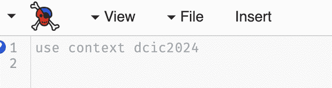
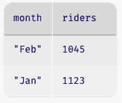

# 4.1 表格数据简介🔗

> 原文：[`dcic-world.org/2025-08-27/intro-tabular-data.html`](https://dcic-world.org/2025-08-27/intro-tabular-data.html)

| |   4.1.1 创建表格数据 |
| --- | --- |
| |   4.1.2 提取行和单元格值 |
| |   4.1.3 行上的函数 |
| |   4.1.4 处理行 |
| |     4.1.4.1 查找行 |
| |     4.1.4.2 排序行 |
| |     4.1.4.3 添加新列 |
| |     4.1.4.4 计算新列值 |
| |   4.1.5 表生成函数的示例 |
| |   4.1.6 Lambda：匿名函数 |

计算机中许多有趣的数据都是表格形式的——即，像表格一样——在形式上。首先，我们将看到它们的一些例子，然后尝试确定它们有什么共同之处。以下是一些例子：

+   一个电子邮件收件箱是一系列消息。对于每条消息，您的收件箱存储一系列信息：发件人、主题行、它所属的对话、正文以及更多。

    

+   一个音乐播放列表。对于每首歌曲，您的音乐播放器维护一系列信息：歌曲名称、歌手、时长、流派等。

    

+   一个文件系统文件夹或目录。对于每个文件，您的文件系统记录一个名称、修改日期、大小和其他信息。

    

> 现在做什么？
> 
> > 你能想出更多例子吗？

怎么样？

+   对派对邀请的回复。

+   一个成绩册。

+   一个日历议程。

你在生活中还能想到更多！

所有这些有什么共同之处？表格数据的特征是：

+   它们包含关于零个或多个具有共同特征的项目（即个人或物品）的信息。每个项目存储在一行中。每一列跟踪行之间的一个共享属性。例如，每首歌曲或电子邮件消息或文件是一行。它们的每个特征——歌曲标题、消息主题、文件名——是一列。虽然一些电子表格可能交换行和列的角色，但我们坚持这种组织方式，因为它与数据科学软件库的设计相一致。这是 Hadley Wickham 所说的[整洁数据](https://vita.had.co.nz/papers/tidy-data.pdf)的一个例子。

+   每一行都有与其他行相同的列，顺序相同。

+   给定的列具有相同的类型，但不同的列可以有不同的类型。例如，一封电子邮件消息有一个发件人姓名，它是一个字符串；一个主题行，它是一个字符串；发送日期，它是一个日期；是否已阅读，它是一个布尔值；等等。

+   行可能按照某种特定的顺序排列。例如，电子邮件是按照最近发送的顺序排列的。

> 练习
> 
> > 在上述其他示例中以及您描述的示例中，找到表格数据的特征。

现在我们将学习如何使用表格编程以及如何分解处理它们的任务。要访问我们将使用的函数，您需要将上下文（在定义窗口的顶部）设置为 dcic2024。本书的早期版本要求您使用`shared-gdrive`来加载文件以访问这些函数。在 dcic2024 上下文中使用时，这不再必要。在 CPO 中，点击屏幕左上角的向下箭头（Pyret 标志的左侧），选择“选择上下文”，然后在框中输入 dcic2024，如图所示：


点击提交按钮后，定义窗口将显示上下文名称，如图所示：



[基于函数的表格操作文档](https://hackmd.io/@cs111/table)可在 Pyret 文档之外的单独页面找到。

#### 4.1.1 创建表格数据🔗 "链接到此处")

Pyret 提供了多种创建表格数据的方法。最简单的是在程序中将数据定义为如下：

```py
table: name, age
  row: "Alicia", 30
  row: "Meihui", 40
  row: "Jamal", 25
end
```

即，一个`table`后面跟着列的名称，按照所需的顺序，然后是一个`row`序列。每一行必须包含与列声明相同数量的数据，并且顺序相同。

> 练习
> 
> > 改变上述示例的不同部分——例如，从一行中删除一个必要的值，添加一个多余的值，删除一个逗号，添加一个额外的逗号，在行末留下一个多余的逗号——然后查看您会得到什么错误。

注意，在表格中，列的顺序很重要：两个在其他方面相同但列顺序不同的表格不被认为是相等的。

```py
check:
  table: name, age
    row: "Alicia", 30
    row: "Meihui", 40
    row: "Jamal", 25
  end
  is-not
  table: age, name
    row: 30, "Alicia"
    row: 40, "Meihui"
    row: 25, "Jamal"
  end
end
```

注意到上面的例子使用了`is-not`，即测试通过，这意味着表格不相等。

这里的`check:`注释是编写关于函数（及其`where`块）上下文之外的表达式的`is`断言的方式。我们将在从示例到测试中了解更多关于`check`的信息。

表达式创建表值。这些可以像数字、字符串和图像一样存储在变量中：

```py
people = table: name, age
  row: "Alicia", 30
  row: "Meihui", 40
  row: "Jamal", 25
end
```

当我们使用`table`创建它们时，我们称这些为字面表格。Pyret 还提供了其他获取表格数据的方法！特别是，您可以从电子表格[导入表格数据](https://www.pyret.org/docs/latest/gdrive-sheets.html)，因此任何允许您创建此类工作表的机制也可以使用。您可能：

+   独自创建工作表，

+   与朋友协作创建工作表，

+   在网络上找到可以导入到工作表中的数据，

+   创建一个 Google 表单，让其他人填写，并从他们的回复中获得工作表。

以此类推。让你的想象力自由驰骋！一旦数据进入 Pyret，它们来自哪里就不再重要了。

使用表格，我们开始探索包含其他（较小）数据片段的数据。我们将此类数据称为结构化数据。结构化数据以结构化的方式组织其内部数据（在这里，行和列）。与图像一样，当我们编写的代码反映了最终图像的结构时，我们会看到与表格一起工作的代码也遵循数据结构。

#### 4.1.2 提取行和单元格值🔗 "链接到此处")

给定一个表格，我们有时想查找特定单元格的值。我们将使用以下表格，显示几个月来穿梭服务的乘客数量：

```py
shuttle = table: month, riders
  row: "Jan", 1123
  row: "Feb", 1045
  row: "Mar", 1087
  row: "Apr", 999
end
```

> 现在行动！
> 
> > 如果你将这个表格放入定义面板并运行，当交互式提示出现时，Pyret 目录中会有什么内容？列名会被列在目录中吗？

提醒一下，目录中只包含我们使用 `name =` 形式赋值的那些名称。这里的目录将包含 `shuttle`，它将绑定到表格上（是的，整个表格都会在目录中！）列名不会在目录中单独列出。在底层，这是因为我们从未编写过 `colname = ...` 形式的内容。在高层，我们通常不会通过创建单个列并将它们并排放置来构建表格。（如果有什么不同的话，创建单个行更为常见，因为行对应于单个观察、事件或实体；然而在这个例子中我们没有这样做）。

从与表格相关的名称开始，我们可以在表格的给定单元格（行和列）中查找值。具体来说，假设我们想提取三月份的乘客数量（`1087`），以便在另一个计算中使用。我们该如何做？

Pyret（以及大多数为数据分析设计的其他编程语言）将表格组织为具有共享列的行集合。鉴于这种组织方式，我们首先隔离我们感兴趣的行，然后检索单元格的内容。

Pyret 从顶部到底部对表格的行进行编号，起始位置为 0（大多数编程语言使用 0 作为数据中的第一个位置，原因我们将在后面看到）。所以如果我们想查看三月份的数据，我们需要隔离行 2。我们写：

```py
shuttle.row-n(2)
```

我们使用点符号来深入探究结构化数据。在这里，我们说的是“深入 `shuttle` 表格，提取行号 `2`”（实际上这是第三行，因为 Pyret 从 0 开始计数位置）。

如果我们在提示符中运行这个表达式，我们会得到


这是一种新的数据类型，称为 `Row`。当 Pyret 显示 `Row` 值时，它会显示行名和行内对应的值。

要提取行中特定列的值，我们写下行名，然后是列名（作为字符串）的方括号。以下是两种获取三月份行中`riders`列值的等效方式：

```py
shuttle.row-n(2)["riders"]
```

```py
march-row = shuttle.row-n(2)
march-row["riders"]
```

> 现在就做！
> 
> > 使用这些方法时，Pyret 目录中会有哪些名称？

一旦我们有了单元格值（这里是一个`Number`），我们就可以将其用于任何其他计算，例如

```py
shuttle.row-n(2)["riders"] >= 1000
```

（检查三月份是否有至少`1000`名乘客）。

> 现在就做！
> 
> > 如果你忘记了引号，而是写了：
> > 
> > ```py
> > shuttle.row-n(2)[riders]
> > ```
> > 
> > Pyret 会做什么，为什么？

#### 4.1.3 行上的函数🔗 "链接到这里")

现在我们有了从表中隔离行的能力，我们可以编写询问单个行的函数。当我们检查三月份的行是否有超过 1000 名乘客时，我们刚刚看到了一个在行数据上执行计算的示例。如果我们想对这个表中的任意行进行这种比较呢？让我们写一个函数！我们将它命名为`cleared-1K`。

让我们从函数头和一些示例开始：

```py
fun cleared-1K(r :: Row) -> Boolean:
  doc: "determine whether given row has at least 1000 riders"
  ...
where:
  cleared-1K(shuttle.row-n(2)) is true
  cleared-1K(shuttle.row-n(3)) is false
end
```

这展示了`Row`函数的示例是什么样的，以及我们如何使用`Row`作为输入类型。

要填写函数的主体，我们提取`"riders"`单元格的内容，并将其与`1000`进行比较：

```py
fun cleared-1K(r :: Row) -> Boolean:
  doc: "determine whether given row has at least 1000 riders"
  r["riders"] >= 1000
where:
  cleared-1K(shuttle.row-n(2)) is true
  cleared-1K(shuttle.row-n(3)) is false
end
```

> 现在就做！
> 
> > 看看这些示例，它们都共享了`shuttle.row-n`部分。是否更好的做法是将`cleared-1K`改为一个只接受行位置作为输入的函数，例如：
> > 
> > ```py
> > fun cleared-1K(row-pos :: Number) -> Boolean:
> >   ...
> > where:
> >   cleared-1K(2) is true
> >   cleared-1K(3) is false
> > end
> > ```
> > 
> > 做这件事有什么好处和局限性？

通常，接受`Row`输入的版本更灵活，因为它可以与任何具有名为`"riders"`的列的表中的行一起工作。我们可能还有包含更多列信息或不同年份的数据表的另一个表。如果我们修改`cleared-1K`以仅接受行位置作为输入，那么该函数将必须固定它所工作的表。相比之下，我们的原始版本将特定的表（`shuttle`）放在函数外部，这带来了灵活性。

> 练习
> 
> > 编写一个函数`is-winter`，它接受一个带有`"month"`列的`Row`作为输入，并产生一个`Boolean`值，指示该行中的月份是否是`"Jan"`、`"Feb"`或`"Mar"`之一。
> > 
> 练习
> 
> > 编写一个函数`low-winter`，它接受带有`"month"`和`"riders"`列的`Row`，并产生一个`Boolean`值，指示该行是否是少于 1050 名乘客的冬季行。
> > 
> 练习
> 
> > 在程序目录中进行练习！取一个`Row`函数及其一个`where`示例，并展示当你评估示例时程序目录是如何演变的。

#### 4.1.4 处理行🔗 "链接到这里")

到目前为止，我们已经探讨了通过在表中的位置提取单个行并对它们进行计算。按位置提取行并不总是方便的：我们可能有数百或数千行，我们甚至不知道我们想要的数据在表中在哪里。我们更愿意能够编写一个小程序来识别满足特定标准的行（或行！）。

Pyret 提供了三种不同的处理表的表示法：一种使用函数，一种使用方法，还有一种使用类似 SQL 的表示法。本章使用基于函数的表示法。类似 SQL 的表示法和基于方法的表示法在 Pyret 文档中展示。要使用基于函数的表示法，你需要包含主叙事中指定的文件。

本节的其余部分假设你已经加载了用于处理表的函数符号。

##### 4.1.4.1 查找行🔗 "链接至此")

假设我们想要编写一个程序来定位 `shuttle` 表中少于 `1000` 名乘客的行。根据我们迄今为止所学的内容，我们如何尝试编写这个程序？我们可以想象使用一个条件，如下所示：

```py
if shuttle.row-n(0)["riders"] < 1000:
  shuttle.row-n(0)
else if shuttle.row-n(1)["riders"] < 1000:
  shuttle.row-n(1)
else if shuttle.row-n(2)["riders"] < 1000:
  shuttle.row-n(2)
else if shuttle.row-n(3)["riders"] < 1000:
  shuttle.row-n(3)
else: ... # not clear what to do here
end
```

> 现在行动起来！
> 
> > 你认为这种方法的优点和局限性是什么？

有几个原因我们可能不喜欢这个解决方案。首先，如果我们有数千行，这将非常痛苦地编写。其次，这里有很多重复（只有行位置在变化）。第三，如果没有任何匹配的行，不清楚该怎么办。此外，如果有多个行符合我们的标准，会发生什么？在某些情况下，我们可能希望能够识别所有符合条件的行，并使用它们进行后续计算（例如，查看是否有几个月的乘客较少的天数比其他月份多）。

然而，这个条件的精神正是我们想要做的：逐行遍历表中的行，识别那些符合某些标准的行。我们只是不想手动检查每一行。幸运的是，Pyret 知道如何做。Pyret 知道给定表中有哪些行。Pyret 可以逐个位置提取这些行，并对每一行检查一个标准。

我们只需要告诉 Pyret 我们想使用什么标准。

与之前一样，我们可以将我们的标准表达为一个函数，该函数接受一个 `Row` 并产生一个 `Boolean`（因为我们的标准在代码草图中的 `if` 表达式的条件部分被用作问题）。在这种情况下，我们想要：

```py
fun below-1K(r :: Row) -> Boolean:
  doc: "determine whether row has fewer than 1000 riders"
  r["riders"] < 1000
where:
  below-1K(shuttle.row-n(2)) is false
  below-1K(shuttle.row-n(3)) is true
end
```

现在，我们只需要一种方法来告诉 Pyret 在搜索行时使用这个标准。我们通过一个名为 `filter-with` 的函数来实现，它接受两个输入：要处理的表和要检查的每行标准。

```py
filter-with(shuttle, below-1K)
```

在底层，`filter-with` 的工作方式大致类似于我们上面概述的 `if` 语句：它逐行处理每一行，并对它调用给定的标准函数。但它对结果做了什么？

如果你运行上面的表达式，你会看到`filter-with`产生了一个包含匹配行的表格，而不是单独的行。如果有多行匹配标准，这种行为会很有用。例如，尝试：

```py
filter-with(shuttle, is-winter)
```

（使用本章早期练习中使用的`is-winter`函数）。现在我们得到了一个包含对应冬季月份的三行表格。如果我们想要在未来的计算中使用这个表格，我们可以用我们通常的命名值的方法来做：

```py
winter = filter-with(shuttle, is-winter)
```

##### 4.1.4.2 行排序🔗 "链接至此")

让我们提出一个新的问题：哪个月份的冬季骑行者人数最少？这个问题要求我们识别特定的一行，即`"riders"`列中值最小的冬季行。

> 现在行动！
> 
> > 我们可以用`filter-with`来做这件事吗？为什么可以或不可以？

回想一下`if`表达式，它是`filter-with`的动机：每一行都是独立于其他行进行评估的。然而，我们当前的问题需要跨行比较。这是一个不同的操作，因此我们需要比`filter-with`更多的东西。

分析数据（无论是编程语言还是电子表格）的工具为用户提供了一种方法，可以根据单列中的值对表格的行进行排序。这在这里会有所帮助：我们可以按`"riders"`列的最小到最大值对冬季行进行排序，然后从第一行提取`"riders"`值。首先，让我们对行进行排序：

```py
order-by(winter, "riders", true)
```

`order-by`函数有三个输入：要排序的表格（`winter`），排序的列（`"riders"`），以及一个`Boolean`值，表示我们是否希望按升序排序。（如果第三个参数是`false`，则行将按列中值的降序排序。）



在排序后的表格中，骑行者人数最少的行位于第一位。我们原来的问题要求我们查找骑行者人数最少的月份。我们之前已经这样做过了。

> 现在行动！
> 
> > 编写代码以提取骑行者人数最少的冬季月份的名称。

这里有两种编写这种计算的方法：

```py
order-by(winter, "riders", true).row-n(0)["month"]
```

```py
sorted = order-by(winter, "riders", true)
least-row = sorted.row-n(0)
least-row["month"]
```

> 现在行动！
> 
> > 你更喜欢这两种方法中的哪一种？为什么？
> > 
> 现在行动！
> 
> > 这些程序中的每一个是如何影响程序目录的？

注意，这个问题要求我们结合我们已经看到的几个关于行的操作：我们在表格内识别行（`filter-with`），排序行（`order-by`），提取特定行（`row-n`），然后提取单元格（使用方括号和列名）。这是我们操作表格的典型方式，结合多个操作来计算结果（就像我们处理图像的程序一样）。

##### 4.1.4.3 添加新列🔗 "链接至此")

有时候，我们想要创建一个新列，其值基于现有列的值。例如，我们的表格可能反映了员工记录，并具有名为 `hourly-wage` 和 `hours-worked` 的列，分别代表相应的数量。我们现在想要扩展这个表格，添加一个新列来反映每位员工的工资总额。假设我们从一个以下表格开始：

```py
employees =
  table: name,   hourly-wage, hours-worked
    row: "Harley",  15,          40
    row: "Obi",     20,          45
    row: "Anjali",  18,          39
    row: "Miyako",  18,          40
  end
```

我们希望最终得到的表格是：

```py
employees =
  table: name, hourly-wage, hours-worked, total-wage
    row: "Harley", 15,         40,         15 * 40
    row: "Obi",    20, 	       45,         20 * 45
    row: "Anjali", 18, 	       39,         18 * 39
    row: "Miyako", 18, 	       40,         18 * 40
  end
```

（将 `total-wage` 列中的表达式计算为它们的数值等效：我们在这里使用表达式来展示我们试图做什么）。

在之前，当我们有一个多次执行的计算时，我们创建了一个辅助函数来执行这个计算。

> 现在行动！
> 
> > 提出一个辅助函数，用于根据时薪和工时计算总工资。

也许你提出了以下想法：

```py
fun compute-wages(wage :: Number, hours :: Number) -> Number:
  wage * hours
end
```

我们可以使用以下方式：

```py
employees =
  table: name, hourly-wage, hours-worked, total-wage
    row: "Harley", 15, 40, compute-wages(15, 40)
    row: "Obi",    20, 45, compute-wages(20, 45)
    row: "Anjali", 18, 39, compute-wages(18, 39)
    row: "Miyako", 18, 40, compute-wages(18, 40)
  end
```

这是一个正确的想法，但实际上我们可以让这个函数为我们做更多的工作。`wage` 和 `hours` 值位于同一行的单元格中。因此，如果我们能够获取当前行作为输入，我们可以编写：

```py
fun compute-wages(r :: Row) -> Number:
  r["hourly-wage"] * r["hours-worked"]
end

employees =
  table: name, hourly-wage, hours-worked, total-wage
    row: "Harley", 15, 40, compute-wages(<row0>)
    row: "Obi",    20, 45, compute-wages(<row1>)
    row: "Anjali", 18, 39, compute-wages(<row2>)
    row: "Miyako", 18, 40, compute-wages(<row3>)
  end
```

但现在，我们不断地在重复调用 `compute-wages`！添加计算列是一个足够常见的操作，Pyret 提供了一个名为 `build-column` 的表格函数来执行此操作。我们通过提供用于填充新列值的函数作为输入来使用它：

```py
fun compute-wages(r :: Row) -> Number:
  doc: "compute total wages based on wage and hours worked"
  r["hourly-wage"] * r["hours-worked"]
end

build-column(employees, "total-wage", compute-wages)
```

这创建了一个名为 `total-wage` 的新列，其中每行的值是那一行中两个命名列的乘积。Pyret 将将新列放在正确的位置。

##### 4.1.4.4 计算新列值🔗 "链接到此处")

有时候，我们只想为现有列计算新值，而不是创建一个全新的列。给员工加薪就是一个例子。假设我们想要给每小时工资少于 `20` 美元的所有员工加薪 `10%`。我们可以编写：

```py
fun new-rate(rate :: Number) -> Number:
  doc: "Raise rates under 20 by 10%"
  if rate < 20:
    rate * 1.1
  else:
    rate
  end
where:
  new-rate(20) is 20
  new-rate(10) is 11
  new-rate(0) is 0
end

fun give-raises(t :: Table) -> Table:
  doc: "Give a 10% raise to anyone making under 20"
  transform-column(t, "hourly-wage", new-rate)
end
```

在这里，`transform-column` 函数接受一个表格、表格中现有列的名称以及一个用于更新值的函数。更新函数接收列中的当前值作为输入，并生成列的新值作为输出。

> 现在行动！
> 
> > 在 `employees` 表格上运行 `give-raises`。在 `give-raises` 完成后，`employees` 表格中 `"Miyako"` 的工资将显示为多少？为什么？

与所有其他 Pyret `Table` 操作一样，`transform-column` 会生成一个新的表格，而保留原始表格不变。编辑原始表格可能会出现问题——如果你犯了错误怎么办？在这种情况下，你将如何恢复原始表格？一般来说，在修改任何表格后生成新的表格，然后在得到你想要的表格后为更新后的表格创建一个新名称，这是一种更不容易出错的工作方式。

#### 4.1.5 表格生成函数的示例🔗 "链接到此处")

我们如何为生成表的函数编写示例？从概念上讲，答案是“确保你得到了预期的输出表”。从实际操作来看，编写表函数的示例似乎更痛苦，因为编写预期的输出表比编写生成数字或字符串的函数的输出要费劲。我们能做些什么来管理这种复杂性？

> 现在就做！
> 
> > 你会如何编写`give-raises`的`where`块？

这里有一些实际编写示例的想法：

+   简化输入表。与其处理包含所有列的大表，不如创建一个只有函数使用的列有足够多样性的小表。以我们的例子来说，我们可能会使用：

    ```py
    wages-test =
      table: hourly-wage
        row: 15
        row: 20
        row: 18
        row: 18
      end
    ```

    > 现在就做！
    > 
    > > 任何包含数字列的表都适用于这里吗？或者表中的行或列有一些约束吗？

    唯一的约束是，你的输入表必须包含函数中使用的列名。

+   记住，你可以在代码中编写计算来构造表。这可以让你避免手动计算。

    ```py
    where:
      give-raises(wages-test) is
      table: hourly-wage
        row: 15 * 1.1
        row: 20
        row: 18 * 1.1
        row: 18 * 1.1
      end
    ```

    这个例子表明，你可以在`where:`块中直接编写输出表——表不需要在函数外部命名。

+   通过从现有表中取行来创建一个新的表。如果你在编写涉及过滤表行的函数的示例，了解如何使用现有表的行创建新表很有帮助。例如，如果我们正在编写一个函数来查找所有员工工作正好 40 小时的行，我们希望确保结果表包含`employees`表的第一行和第四行。而不是编写一个新的`table`表达式来创建这个表，我们可以这样写：

    ```py
    emps-at-40 =
      add-row(
        add-row(employees.empty(),
          employees.row-n(0)),
        employees.row-n(3))
    ```

    在这里，`employees.empty()`创建了一个新的、空的表，其列标题与`employees`相同。我们已经看到了如何使用`row-n`从表中提取行。`add-row`函数将指定的行放置在给定表的末尾。

另一个需要注意的技巧：当你的函数只做调用内置函数（如`transform-column`）的事情时，通常只需要为你的函数编写示例来计算新列的值就足够了。只有当你的代码结合了表操作，或者执行比单个内置表操作更复杂的处理时，你才真的需要向你的代码读者展示自己的示例。

#### 4.1.6 Lambda：匿名函数🔗 "链接到此处")

让我们回顾一下我们在查找行中编写的程序，用于查找表中少于 1000 名乘客的所有月份：

```py
shuttle = table: month, riders
  row: "Jan", 1123
  row: "Feb", 1045
  row: "Mar", 1087
  row: "Apr", 999
end
fun below-1K(r :: Row) -> Boolean:
  doc: "determine whether row has fewer than 1000 riders"
  r["riders"] < 1000
where:
  below-1K(shuttle.row-n(2)) is false
  below-1K(shuttle.row-n(3)) is true
end
filter-with(shuttle, below-1K)
```

这个程序可能感觉有点冗长：我们真的需要写一个辅助函数来执行像`filter-with`这样简单的事情吗？难道直接写点东西不是更容易吗？

```py
filter-with(shuttle, r["riders"] < 1000)
```

> 现在就做！
> 
> > 如果你运行这个表达式，Pyret 会生成什么？

Pyret 在此表达式使用 `r` 时会产生一个 `未绑定标识符` 错误。`r` 是什么？我们的意思是让 `r` 依次代表 `shuttle` 中的元素。从概念上讲，这就是 `filter-with` 所做的，但我们没有正确实现机制。当我们调用一个函数时，我们会先评估函数体之前的参数。因此，关于 `r` 未绑定的错误。`below-1K` 辅助函数的全部目的就是使 `r` 成为函数的一个参数，该函数的函数体只有在 `r` 有值时才会被评估。

为了使符号更紧凑，就像单行 `filter-with` 表达式那样，那么，我们需要找到一种方法告诉 Pyret 创建一个临时函数，该函数将在 `filter-with` 运行时获取其输入。以下符号实现了这一点：

```py
filter-with(shuttle, lam(r): r["riders"] < 1000 end)
```

我们在想要在 `filter-with` 中使用的表达式周围添加了 `lam(r)` 和 `end`。`lam(r)` 表示“创建一个以 `r` 作为输入的临时函数”。`end` 用于结束函数定义，就像我们使用 `fun` 一样。`lam` 是 `lambda` 的简称，这是一种存在于许多语言中但并非所有语言中的函数定义形式。

我们原始表达式（使用 `below-1K` 辅助函数）和这个新表达式（使用 `lam`）之间的主要区别可以通过程序目录来看到。为了解释这一点，我们需要了解一下 `filter-with` 在底层是如何定义的。部分地，它看起来像：

```py
fun filter-with(tbl :: Table, keep :: (Row -> Boolean)) -> Table:
  if keep(<row-from-table>):
    ...
  else:
    ...
  end
end
```

无论我们传递 `below-1K` 还是 `lam` 版本到 `filter-with`，`keep` 参数最终都会引用一个具有相同参数和主体的函数。由于函数实际上是通过 `keep` 名称调用的，因此当它最初定义时，是否与它关联名称并不重要。

实际上，当我们需要将简单的（单行）函数传递给 `filter-with`（或 `transform-column`、`build-column` 等操作）时，我们会使用 `lam`。当然，如果你觉得这样更有意义，你可以继续像我们对 `below-1K` 所做的那样，为辅助函数写出名称。

> 练习
> 
> > 编写程序，使用 `lam` 而不是命名辅助函数，向上面 `shuttle` 表格中的每一行添加 10 名乘客。

#### 4.1.1 创建表格数据🔗 "链接到此处")

Pyret 提供了多种创建表格数据的方法。最简单的是在程序中将数据定义如下：

```py
table: name, age
  row: "Alicia", 30
  row: "Meihui", 40
  row: "Jamal", 25
end
```

即，一个 `table` 后跟列的名称，按照所需的顺序，然后是一个 `row` 的序列。每一行必须包含与列声明相同数量的数据，并且按照相同的顺序。

> 练习
> 
> > 改变上述示例的不同部分——例如，从一行中删除一个必要的值，添加一个多余的值，删除一个逗号，添加一个额外的逗号，在行末留下一个多余的逗号——然后看看你会得到什么错误。

注意，在表格中，列的顺序很重要：两个在其他方面相同但列顺序不同的表格不被认为是相等的。

```py
check:
  table: name, age
    row: "Alicia", 30
    row: "Meihui", 40
    row: "Jamal", 25
  end
  is-not
  table: age, name
    row: 30, "Alicia"
    row: 40, "Meihui"
    row: 25, "Jamal"
  end
end
```

注意到上面的例子使用了 `is-not`，即测试通过，意味着表格不相等。

这里的 `check:` 注释是一种在函数（及其 `where` 块）上下文之外编写关于表达式的 `is` 断言的方式。我们将在从示例到测试中了解更多关于 `check` 的内容。

表达式创建表格值。这些可以像数字、字符串和图像一样存储在变量中：

```py
people = table: name, age
  row: "Alicia", 30
  row: "Meihui", 40
  row: "Jamal", 25
end
```

当我们使用 `table` 创建这些表时，我们称之为文字表格。Pyret 还提供了其他获取表格数据的方法！特别是，你可以[从电子表格中导入表格数据](https://www.pyret.org/docs/latest/gdrive-sheets.html)，因此任何让你创建此类表格的机制也可以使用。你可能：

+   在你自己的表格中创建表格，

+   与朋友协作创建表格，

+   在网络上找到可以导入到表格中的数据，

+   创建一个谷歌表单，让其他人填写，并从他们的回复中获得表格

等等。让你的想象力自由驰骋！一旦数据进入 Pyret，它们来自哪里就不再重要了。

使用表格，我们开始探索包含其他（较小）数据块的数据。我们将此类数据称为结构化数据。结构化数据以结构化的方式组织其内部数据（在这里，行和列）。就像图像一样，当我们编写反映最终图像结构的代码时，我们会看到处理表格的代码也遵循数据结构。

#### 4.1.2 提取行和单元格值🔗 "链接到此处")

给定一个表格，我们有时需要查找特定单元格的值。我们将使用以下表格，展示了几个月份穿梭服务的乘客数量：

```py
shuttle = table: month, riders
  row: "Jan", 1123
  row: "Feb", 1045
  row: "Mar", 1087
  row: "Apr", 999
end
```

> 现在行动！
> 
> > 如果你将这个表格放入定义面板并运行，当交互式提示出现时，Pyret 目录中会有什么？列名会被列在目录中吗？

作为提醒，目录中只包含我们使用 `name =` 形式赋值的那些名称。这里的目录将包含 `shuttle`，它将绑定到表格（是的，整个表格都会在目录中！）！列名不会在目录中有自己的条目。在低级别上，这是因为我们从未编写过 `colname = ...` 形式的任何内容。在高级别上，我们通常不会通过创建单个列并将它们并排放置来构建表格。（如果有什么不同的话，创建单个行更为常见，因为行对应于单个观察、事件或实体；然而，在这个例子中我们没有这样做）。

从与表格关联的名称开始，我们可以在表格中给定单元格（行和列）中查找值。具体来说，假设我们想提取三月份的乘客数量（`1087`），以便在另一个计算中使用。我们如何做到这一点？

Pyret（以及大多数为数据分析设计的其他编程语言）将表格组织为具有共享列的行集合。鉴于这种组织方式，我们首先隔离感兴趣的行，然后检索单元格的内容。

Pyret 从上到下对表格的行进行编号，起始值为 0（大多数编程语言使用 0 作为数据中的第一个位置，原因我们将在后面看到）。因此，如果我们想查看三月份的数据，我们需要隔离第 2 行。我们写下：

```py
shuttle.row-n(2)
```

我们使用点符号来深入结构化数据。这里，我们说的是“深入`shuttle`表，提取行号`2`”（在 Pyret 中，这实际上是第三行，因为 Pyret 从 0 开始计数位置）。

如果我们在提示符中运行这个表达式，我们会得到


这是一种新的数据类型，称为`Row`。当 Pyret 显示`Row`值时，它会显示行中的列名和相应的值。

要提取行中特定列的值，我们可以在方括号中写下行名（作为字符串），然后跟上列名。以下是从三月份的行中获取`riders`列值的两种等效方式：

```py
shuttle.row-n(2)["riders"]
```

```py
march-row = shuttle.row-n(2)
march-row["riders"]
```

> 现在行动！
> 
> > 使用这些方法时，Pyret 目录中会有哪些名称？

一旦我们有了单元格值（这里是一个`Number`），我们就可以将其用于任何其他计算，例如

```py
shuttle.row-n(2)["riders"] >= 1000
```

（这检查三月份是否有至少`1000`名骑手）。

> 现在行动！
> 
> > 如果你忘记了引号，而是这样写，你期望会发生什么？
> > 
> > ```py
> > shuttle.row-n(2)[riders]
> > ```
> > 
> > Pyret 会做什么，为什么？

#### 4.1.3 函数对行🔗 "链接到此处")

现在我们有能力从表中隔离行，我们可以编写询问单个行的函数。我们刚刚看到了一个在行数据上执行计算的例子，当我们检查三月份的行是否有超过 1000 名骑手时。如果我们想对这个表格的任意行进行这种比较，会怎样？让我们写一个函数！我们将它命名为`cleared-1K`。

让我们从函数头和一些示例开始：

```py
fun cleared-1K(r :: Row) -> Boolean:
  doc: "determine whether given row has at least 1000 riders"
  ...
where:
  cleared-1K(shuttle.row-n(2)) is true
  cleared-1K(shuttle.row-n(3)) is false
end
```

这展示了`Row`函数的示例，以及我们如何使用`Row`作为输入类型。

要填充函数的主体，我们提取`"riders"`单元格的内容，并将其与`1000`进行比较：

```py
fun cleared-1K(r :: Row) -> Boolean:
  doc: "determine whether given row has at least 1000 riders"
  r["riders"] >= 1000
where:
  cleared-1K(shuttle.row-n(2)) is true
  cleared-1K(shuttle.row-n(3)) is false
end
```

> 现在行动！
> 
> > 观察示例，它们都共享`shuttle.row-n`部分。是否将`cleared-1K`改为一个只接受行位置作为输入的函数会更好，例如：
> > 
> > ```py
> > fun cleared-1K(row-pos :: Number) -> Boolean:
> >   ...
> > where:
> >   cleared-1K(2) is true
> >   cleared-1K(3) is false
> > end
> > ```
> > 
> > 这样做的优点和局限性是什么？

通常情况下，接受`Row`输入的版本更灵活，因为它可以与任何具有名为`"riders"`的列的表一起工作。我们可能还有另一个包含更多列信息或不同年份的数据表。如果我们修改`cleared-1K`使其只接受行位置作为输入，那么该函数将不得不确定它要使用哪个表。相比之下，我们的原始版本将特定的表（`shuttle`）放在函数外部，这导致了灵活性。

> 练习
> 
> > 编写一个名为`is-winter`的函数，该函数接受一个具有`"month"`列的`Row`作为输入，并产生一个`Boolean`值，指示该行中的月份是否为`"Jan"`、`"Feb"`或`"Mar"`之一。
> > 
> 练习
> 
> > 编写一个名为`low-winter`的函数，该函数接受一个具有`"month"`和`"riders"`列的`Row`，并产生一个`Boolean`值，指示该行是否是拥有少于 1050 名乘客的冬季行。
> > 
> 练习
> 
> > 在程序目录中进行练习！取一个`Row`函数及其`where`示例之一，并展示当你评估示例时程序目录是如何演变的。

#### 4.1.4 处理行🔗 "链接至此")

到目前为止，我们已经研究了通过表中的位置提取单个行并对它们进行计算。通过位置提取行并不总是方便的：我们可能有数百或数千行，我们甚至不知道我们想要的数据在表中在哪里。我们更愿意能够编写一个小程序来识别满足特定标准的行（或行！）。

Pyret 提供了三种不同的处理表的方法：一种使用函数，一种使用方法，还有一种使用类似 SQL 的表示法。本章使用基于函数的表示法。类似 SQL 的表示法和基于方法的表示法在 Pyret 文档中展示。要使用基于函数的表示法，您需要包含主叙事中指定的文件。

本节的其余部分假设你已经加载了用于处理表的函数表示法。

##### 4.1.4.1 查找行🔗 "链接至此")

想象一下，如果我们想要编写一个程序来定位`shuttle`表中少于`1000`名乘客的行。根据我们迄今为止所学的知识，我们该如何尝试编写这个程序呢？我们可以想象使用一个条件语句，如下所示：

```py
if shuttle.row-n(0)["riders"] < 1000:
  shuttle.row-n(0)
else if shuttle.row-n(1)["riders"] < 1000:
  shuttle.row-n(1)
else if shuttle.row-n(2)["riders"] < 1000:
  shuttle.row-n(2)
else if shuttle.row-n(3)["riders"] < 1000:
  shuttle.row-n(3)
else: ... # not clear what to do here
end
```

> 现在行动起来！
> 
> > 你看到这种方法有哪些优点和局限性？

我们可能不希望采用这种解决方案有几个原因。首先，如果我们有成千上万行，这将非常痛苦去编写。其次，这里有很多重复（只有行位置在变化）。第三，如果没有任何匹配的行，不清楚该怎么做。此外，如果有多个行符合我们的标准，会发生什么？在某些情况下，我们可能希望能够识别出所有符合特定条件的行，并使用它们进行后续的计算（例如，查看某些月份是否有比其他月份更多的低乘客日）。

然而，这个条件正是我们想要做的事情的精神：逐行遍历表格，识别那些符合某些标准的行。我们只是不想手动检查每一行。幸运的是，Pyret 知道如何做这件事。Pyret 知道给定表格中的哪些行。Pyret 可以一次拉出一个位置，并对每一行检查一个标准。

我们只需要告诉 Pyret 我们想要使用什么标准。

和之前一样，我们可以将我们的标准表达为一个函数，它接受一个`Row`并产生一个`Boolean`（因为我们的标准在我们的代码草图中的`if`表达式的条件部分被使用）。在这种情况下，我们想要：

```py
fun below-1K(r :: Row) -> Boolean:
  doc: "determine whether row has fewer than 1000 riders"
  r["riders"] < 1000
where:
  below-1K(shuttle.row-n(2)) is false
  below-1K(shuttle.row-n(3)) is true
end
```

现在，我们只需要一种方法来告诉 Pyret 在搜索行时使用这个标准。我们通过一个名为`filter-with`的函数来做这件事，它接受两个输入：要处理的表格和要检查表格每一行的标准。

```py
filter-with(shuttle, below-1K)
```

在底层，`filter-with`的工作方式大致类似于我们上面概述的`if`语句：它一次处理一行，并对它调用给定的标准函数。但它对结果做了什么？

如果你运行上面的表达式，你会看到`filter-with`产生一个包含匹配行的表格，而不是单独的行。如果有多行匹配标准，这种行为很有用。例如，尝试：

```py
filter-with(shuttle, is-winter)
```

（使用本章早期练习中提到的`is-winter`函数）。现在我们得到了一个包含对应冬季月份的三行表格。如果我们想能够在未来的计算中使用这个表格的名称，我们可以使用我们为命名值常用的符号来做这件事：

```py
winter = filter-with(shuttle, is-winter)
```

##### 4.1.4.2 排序行🔗 "链接到此处")

让我们提出一个新的问题：哪个冬季月份的乘客数量最少？这个问题要求我们识别一个特定的行，即`"riders"`列中值最小的冬季行。

> 立刻行动！
> 
> > 我们可以用`filter-with`做这件事吗？为什么或为什么不？

回想一下激励`filter-with`的`if`表达式：每一行都是独立于其他行进行评估的。然而，我们的当前问题需要跨行进行比较。这是一个不同的操作，因此我们需要比`filter-with`更多的东西。

分析数据的工具（无论是编程语言还是电子表格）为用户提供了一种方法，可以根据单列中的值对表格的行进行排序。这在这里会有帮助：我们可以根据`"riders"`列中的值从小到大对冬季行进行排序，然后从第一行中提取`"riders"`值。首先，让我们对行进行排序：

```py
order-by(winter, "riders", true)
```

`order-by`函数接受三个输入：要排序的表格（`winter`）、排序的列（`"riders"`）以及一个`Boolean`值，表示我们是否想要按升序排序。（如果第三个参数是`false`，则行将按列中值的降序排序。）


在排序后的表中，乘客最少的行位于第一位。我们最初的问题要求我们查找乘客最少的月份。我们之前已经这样做过了。

> 现在行动！
> 
> > 编写代码以提取乘客最少的冬季月份的名称。

这里有两种编写这种计算的方法：

```py
order-by(winter, "riders", true).row-n(0)["month"]
```

```py
sorted = order-by(winter, "riders", true)
least-row = sorted.row-n(0)
least-row["month"]
```

> 现在行动！
> 
> > 你更喜欢这两种方法中的哪一种？为什么？
> > 
> 现在行动！
> 
> > 每个程序如何影响程序目录？

注意，这个问题要求我们结合我们已经看到的几个行操作：我们识别表中的行（`filter-with`），对行进行排序（`order-by`），提取特定的行（`row-n`），然后提取单元格（使用方括号和列名）。这是我们操作表格的典型方式，结合多个操作来计算结果（就像我们处理图像的程序一样）。

##### 4.1.4.3 添加新列🔗 "链接到此处")

有时候，我们想要创建一个新列，其值基于现有列的值。例如，我们的表格可能反映了员工记录，并具有名为 `hourly-wage` 和 `hours-worked` 的列，代表相应的数量。我们现在想通过添加一个新列来扩展这个表格，以反映每位员工的工资总额。假设我们开始时的表格如下：

```py
employees =
  table: name,   hourly-wage, hours-worked
    row: "Harley",  15,          40
    row: "Obi",     20,          45
    row: "Anjali",  18,          39
    row: "Miyako",  18,          40
  end
```

我们想要的最终表格如下：

```py
employees =
  table: name, hourly-wage, hours-worked, total-wage
    row: "Harley", 15,         40,         15 * 40
    row: "Obi",    20, 	       45,         20 * 45
    row: "Anjali", 18, 	       39,         18 * 39
    row: "Miyako", 18, 	       40,         18 * 40
  end
```

（在 `total-wage` 列中的表达式计算到它们的数值等效：我们在这里使用表达式来展示我们试图做什么）。

以前，当我们需要多次执行某个计算时，我们会创建一个辅助函数来完成这个计算。

> 现在行动！
> 
> > 提出一个辅助函数，用于根据时薪和工时计算总工资。

你可能想到了类似以下的内容：

```py
fun compute-wages(wage :: Number, hours :: Number) -> Number:
  wage * hours
end
```

我们可以这样使用它：

```py
employees =
  table: name, hourly-wage, hours-worked, total-wage
    row: "Harley", 15, 40, compute-wages(15, 40)
    row: "Obi",    20, 45, compute-wages(20, 45)
    row: "Anjali", 18, 39, compute-wages(18, 39)
    row: "Miyako", 18, 40, compute-wages(18, 40)
  end
```

这是一个正确的想法，但实际上我们可以让这个函数为我们做更多的工作。`wage` 和 `hours` 值位于同一行的单元格中。因此，如果我们能够获取当前行作为输入，我们可以编写：

```py
fun compute-wages(r :: Row) -> Number:
  r["hourly-wage"] * r["hours-worked"]
end

employees =
  table: name, hourly-wage, hours-worked, total-wage
    row: "Harley", 15, 40, compute-wages(<row0>)
    row: "Obi",    20, 45, compute-wages(<row1>)
    row: "Anjali", 18, 39, compute-wages(<row2>)
    row: "Miyako", 18, 40, compute-wages(<row3>)
  end
```

但现在，我们正在反复编写对 `compute-wages` 的调用！添加计算列是一个足够常见的操作，Pyret 提供了一个名为 `build-column` 的表函数来完成此操作。我们通过提供用于填充新列值的函数作为输入来使用它：

```py
fun compute-wages(r :: Row) -> Number:
  doc: "compute total wages based on wage and hours worked"
  r["hourly-wage"] * r["hours-worked"]
end

build-column(employees, "total-wage", compute-wages)
```

这将创建一个新列，`total-wage`，其中每行的值是那一行中两个命名列的乘积。Pyret 将将新列放在右侧。

##### 4.1.4.4 计算新列值🔗 "链接到此处")

有时候，我们只想计算现有列的新值，而不是创建一个全新的列。给员工加薪就是一个例子。假设我们想要给每小时工资少于 `20` 美元的所有员工加 `10%` 的工资。我们可以编写：

```py
fun new-rate(rate :: Number) -> Number:
  doc: "Raise rates under 20 by 10%"
  if rate < 20:
    rate * 1.1
  else:
    rate
  end
where:
  new-rate(20) is 20
  new-rate(10) is 11
  new-rate(0) is 0
end

fun give-raises(t :: Table) -> Table:
  doc: "Give a 10% raise to anyone making under 20"
  transform-column(t, "hourly-wage", new-rate)
end
```

在这里，`transform-column`接受一个表格、表格中现有列的名称以及一个用于更新值的函数。更新函数接受列中的当前值作为输入，并产生列的新值作为输出。

> 现在就做！
> 
> > 在`employees`表上运行`give-raises`。在`give-raises`完成后，`employees`表中`"Miyako"`的工资将显示什么？为什么？

就像所有其他 Pyret `Table`操作一样，`transform-column`生成一个新的表格，保留原始表格不变。编辑原始表格可能会有问题——如果你犯了错误怎么办？在这种情况下，你如何恢复原始表格？一般来说，在修改任何数据集后生成新表格，然后在你得到想要的表格后为更新的表格创建一个新名称，这是一种更不容易出错的操作方式。

##### 4.1.4.1 查找行🔗 "链接到此处")

假设我们想要编写一个程序来定位`shuttle`表中乘客少于`1000`的行。根据我们迄今为止学到的知识，我们如何尝试编写这个程序？我们可以想象使用一个条件，如下所示：

```py
if shuttle.row-n(0)["riders"] < 1000:
  shuttle.row-n(0)
else if shuttle.row-n(1)["riders"] < 1000:
  shuttle.row-n(1)
else if shuttle.row-n(2)["riders"] < 1000:
  shuttle.row-n(2)
else if shuttle.row-n(3)["riders"] < 1000:
  shuttle.row-n(3)
else: ... # not clear what to do here
end
```

> 现在就做！
> 
> > 你看到这个方法有哪些优点和局限性？

我们可能不关心这个解决方案有几个原因。首先，如果我们有数千行，这将非常痛苦地编写。其次，这里有很多重复（只有行位置在变化）。第三，如果没有任何匹配的行，不清楚要做什么。此外，如果有多个行符合我们的标准，会发生什么？在某些情况下，我们可能希望能够识别所有符合条件的行，并使用它们进行后续计算（比如查看是否有几个月的乘客日比其他月份多）。

这个条件实际上是我们想要做的事情的精神：逐行遍历表格，识别那些符合某些标准的行。我们只是不想手动检查每一行。幸运的是，Pyret 知道如何做到这一点。Pyret 知道给定表格中的哪些行。Pyret 可以一次提取一行，并对每一行检查一个标准。

我们只需要告诉 Pyret 我们想要使用什么标准。

和之前一样，我们可以将标准表达为一个函数，该函数接受一个`Row`并产生一个`Boolean`（因为我们的标准在代码草图中的`if`表达式的条件部分被使用）。在这种情况下，我们想要：

```py
fun below-1K(r :: Row) -> Boolean:
  doc: "determine whether row has fewer than 1000 riders"
  r["riders"] < 1000
where:
  below-1K(shuttle.row-n(2)) is false
  below-1K(shuttle.row-n(3)) is true
end
```

现在，我们只需要一种方法来告诉 Pyret 在搜索行时使用这个标准。我们通过一个名为`filter-with`的函数来完成这个操作，该函数接受两个输入：要处理的表格和要检查表格每一行的标准。

```py
filter-with(shuttle, below-1K)
```

在底层，`filter-with`的工作方式大致类似于我们上面概述的`if`语句：它逐行处理每一行，并对它调用给定的标准函数。但它对结果做了什么？

如果你运行上面的表达式，你会看到 `filter-with` 产生一个包含匹配行的表格，而不是单独的行。如果有多行匹配条件，这种行为就很有用。例如，尝试：

```py
filter-with(shuttle, is-winter)
```

（使用本章早期练习中的 `is-winter` 函数）。现在我们得到了一个包含对应冬季月份的三行表格。如果我们想在未来的计算中使用这个表，我们可以用我们命名值的常规符号来做：

```py
winter = filter-with(shuttle, is-winter)
```

##### 4.1.4.2 排序行🔗 "链接到此处")

让我们提出一个新的问题：哪个冬季月份的乘客数量最少？这个问题要求我们识别一个特定的行，即 `"riders"` 列中值最小的冬季行。

> 现在行动！
> 
> > 我们能否用 `filter-with` 来做这件事？为什么可以或不可以？

回想一下激发 `filter-with` 的 `if` 表达式：每一行都是独立于其他行进行评估的。然而，我们当前的问题需要跨行比较。这是一个不同的操作，因此我们需要比 `filter-with` 更多的功能。

分析数据（无论是编程语言还是电子表格）的工具为用户提供了一种方法，可以根据单列中的值对表格的行进行排序。这在这里会很有帮助：我们可以根据 `"riders"` 列中的值从小到大对冬季行进行排序，然后从第一行中提取 `"riders"` 值。首先，让我们对行进行排序：

```py
order-by(winter, "riders", true)
```

`order-by` 函数接受三个输入：要排序的表（`winter`）、排序的列（`"riders"`）以及一个 `Boolean` 值，表示我们是否希望按升序排序。（如果第三个参数是 `false`，则行将按命名列中的值降序排序。）


在排序后的表中，乘客最少的行位于第一个位置。我们原来的问题要求我们查找乘客最少的月份。我们之前已经这样做过了。

> 现在行动！
> 
> > 编写代码以提取乘客最少的冬季月份的名称。

这里有两种编写这种计算的方法：

```py
order-by(winter, "riders", true).row-n(0)["month"]
```

```py
sorted = order-by(winter, "riders", true)
least-row = sorted.row-n(0)
least-row["month"]
```

> 现在行动！
> 
> > 你更喜欢这两种方式中的哪一种？为什么？
> > 
> 现在行动！
> 
> > 这些程序中的每一个如何影响程序目录？

注意，这个问题要求我们组合我们已经看到的几个对行的操作：我们识别表内的行（`filter-with`）、对行进行排序（`order-by`）、提取特定的行（`row-n`），然后提取单元格（使用方括号和列名）。这是我们操作表的方式的典型例子，通过组合多个操作来计算结果（就像我们处理图像的程序一样）。

##### 4.1.4.3 添加新列🔗 "链接到此处")

有时候，我们想要创建一个新列，其值基于现有列的值。例如，我们的表格可能反映了员工的记录，并具有名为`hourly-wage`和`hours-worked`的列，代表相应的数量。我们现在想在这个表格中添加一个新列来反映每位员工的工资总额。假设我们开始时的表格如下：

```py
employees =
  table: name,   hourly-wage, hours-worked
    row: "Harley",  15,          40
    row: "Obi",     20,          45
    row: "Anjali",  18,          39
    row: "Miyako",  18,          40
  end
```

我们希望得到的表格是：

```py
employees =
  table: name, hourly-wage, hours-worked, total-wage
    row: "Harley", 15,         40,         15 * 40
    row: "Obi",    20, 	       45,         20 * 45
    row: "Anjali", 18, 	       39,         18 * 39
    row: "Miyako", 18, 	       40,         18 * 40
  end
```

（`total-wage`列中的表达式计算为它们的数值等价物：我们在这里使用这些表达式来展示我们试图做什么）。

以前，当我们有多次执行的计算时，我们创建了一个辅助函数来完成计算。

> 现在行动！
> 
> > 提出一个辅助函数，用于根据时薪和工时计算总工资。

也许你提出了类似以下的内容：

```py
fun compute-wages(wage :: Number, hours :: Number) -> Number:
  wage * hours
end
```

我们可以这样使用：

```py
employees =
  table: name, hourly-wage, hours-worked, total-wage
    row: "Harley", 15, 40, compute-wages(15, 40)
    row: "Obi",    20, 45, compute-wages(20, 45)
    row: "Anjali", 18, 39, compute-wages(18, 39)
    row: "Miyako", 18, 40, compute-wages(18, 40)
  end
```

这是一个正确的想法，但实际上我们可以让这个函数为我们做更多的工作。`wage`和`hours`值位于同一行的单元格中。所以如果我们能获取当前行作为输入，我们可以这样写：

```py
fun compute-wages(r :: Row) -> Number:
  r["hourly-wage"] * r["hours-worked"]
end

employees =
  table: name, hourly-wage, hours-worked, total-wage
    row: "Harley", 15, 40, compute-wages(<row0>)
    row: "Obi",    20, 45, compute-wages(<row1>)
    row: "Anjali", 18, 39, compute-wages(<row2>)
    row: "Miyako", 18, 40, compute-wages(<row3>)
  end
```

但现在，我们不断地在写`compute-wages`的调用！添加计算列是一个足够常见的操作，Pyret 提供了一个名为`build-column`的表格函数来完成这个目的。我们通过提供用于填充新列值的函数作为输入来使用它：

```py
fun compute-wages(r :: Row) -> Number:
  doc: "compute total wages based on wage and hours worked"
  r["hourly-wage"] * r["hours-worked"]
end

build-column(employees, "total-wage", compute-wages)
```

这创建了一个新的列，名为`total-wage`，其中每行的值是那一行中两个命名列的乘积。Pyret 会将新列放在右侧。

##### 4.1.4.4 计算新列值🔗 "链接到此处")

有时候，我们只想计算现有列的新值，而不是创建一个全新的列。给员工加薪就是一个例子。假设我们想要给每小时工资低于`20`美元的所有员工加`10%`的工资。我们可以这样写：

```py
fun new-rate(rate :: Number) -> Number:
  doc: "Raise rates under 20 by 10%"
  if rate < 20:
    rate * 1.1
  else:
    rate
  end
where:
  new-rate(20) is 20
  new-rate(10) is 11
  new-rate(0) is 0
end

fun give-raises(t :: Table) -> Table:
  doc: "Give a 10% raise to anyone making under 20"
  transform-column(t, "hourly-wage", new-rate)
end
```

在这里，`transform-column`接受一个表格、表格中现有列的名称和一个用于更新值的函数。更新函数接受列中的当前值作为输入，并产生列的新值作为输出。

> 现在行动！
> 
> > 在`employees`表上运行`give-raises`。在`give-raises`完成后，`employees`表中`"Miyako"`的工资是多少？为什么？

与所有其他 Pyret `Table`操作一样，`transform-column`产生一个新的表格，而保留原始表格不变。编辑原始表格可能会有问题——如果你犯了错误怎么办？在这种情况下，你如何恢复原始表格？一般来说，在修改后产生新的表格，然后在得到你想要的表格后为更新后的表格创建一个新的名称，这是一种更不容易出错地处理数据集的方法。

#### 4.1.5 表格生成函数示例🔗 "链接到此处")

我们如何为生成表的函数编写示例？从概念上讲，答案是“确保你得到了预期的输出表”。从实际操作来看，编写表函数的示例似乎更痛苦，因为编写预期的输出表比编写生成数字或字符串的函数的输出要费劲。我们能做些什么来管理这种复杂性？

> 现在就做！
> 
> > 你会如何编写`where`块为`give-raises`？

这里有一些实际编写示例的想法：

+   简化输入表。与其处理包含所有列的大表，不如创建一个只有函数使用的列有足够多样性的小表。在我们的例子中，我们可能使用：

    ```py
    wages-test =
      table: hourly-wage
        row: 15
        row: 20
        row: 18
        row: 18
      end
    ```

    > 现在就做！
    > 
    > > 任何有数字列的表都适用吗？或者表行或列有一些约束吗？

    唯一的约束是您的输入表必须使用您函数中使用的列名。

+   记住，你可以在代码中编写计算来构建表格。这可以让你免于手动计算。

    ```py
    where:
      give-raises(wages-test) is
      table: hourly-wage
        row: 15 * 1.1
        row: 20
        row: 18 * 1.1
        row: 18 * 1.1
      end
    ```

    这个示例表明，你可以在`where:`块中直接编写输出表——表不需要在函数外部命名。

+   通过从现有表中取行来创建一个新表。如果你在编写涉及过滤表行的一个函数的示例，了解如何使用现有表的行创建新表很有帮助。例如，如果我们编写一个查找员工恰好工作 40 小时的函数，我们希望确保结果表包含`employees`表的第一行和第四行。而不是编写一个新的`table`表达式来创建该表，我们可以这样写：

    ```py
    emps-at-40 =
      add-row(
        add-row(employees.empty(),
          employees.row-n(0)),
        employees.row-n(3))
    ```

    在这里，`employees.empty()`创建了一个具有与`employees`相同列标题的新空表。我们已经看到了如何使用`row-n`从表中提取行。`add-row`函数将指定的行放置在给定表的末尾。

另一个需要注意的技巧是：当你的函数只做调用内置函数（如`transform-column`）的事情时，通常只需要为编写计算新列值的函数编写示例。只有当你的代码结合表操作，或者执行比单个内置表操作更复杂的处理时，你才真正需要向你的代码读者展示自己的示例。

#### 4.1.6 Lambda：匿名函数🔗 "链接到此处")

让我们回顾一下在查找行中编写的程序，用于查找表中少于 1000 名乘客的所有月份：

```py
shuttle = table: month, riders
  row: "Jan", 1123
  row: "Feb", 1045
  row: "Mar", 1087
  row: "Apr", 999
end
fun below-1K(r :: Row) -> Boolean:
  doc: "determine whether row has fewer than 1000 riders"
  r["riders"] < 1000
where:
  below-1K(shuttle.row-n(2)) is false
  below-1K(shuttle.row-n(3)) is true
end
filter-with(shuttle, below-1K)
```

这个程序可能感觉有点冗长：我们真的需要编写一个辅助函数来执行像`filter-with`这样简单的事情吗？直接写点像这样的事情不是更容易吗？

```py
filter-with(shuttle, r["riders"] < 1000)
```

> 现在就做！
> 
> > 如果你运行这个表达式，Pyret 会生成什么？

Pyret 将在该表达式中使用`r`时产生一个`未绑定标识符`错误。`r`是什么？我们希望`r`依次是`shuttle`中的元素。从概念上讲，这正是`filter-with`所做的事情，但我们没有正确地处理机制。当我们调用一个函数时，我们会在函数的主体之前评估参数。因此，关于`r`未绑定的错误。`below-1K`辅助函数的全部目的就是让`r`成为函数的参数，该函数的主体只有在`r`的值可用时才会被评估。

为了使符号更加紧凑，就像在一行`filter-with`表达式中那样，我们必须找到一种方法让 Pyret 创建一个临时函数，该函数将在`filter-with`运行时获取其输入。下面的符号实现了这一点：

```py
filter-with(shuttle, lam(r): r["riders"] < 1000 end)
```

我们在`filter-with`中想要使用的表达式周围添加了`lam(r)`和`end`。`lam(r)`表示“创建一个以`r`为输入的临时函数”。`end`的作用是结束函数定义，就像我们使用`fun`时一样。`lam`是`lambda`的简称，这是一种存在于许多语言中（尽管不是所有语言）的函数定义形式。

我们原始表达式（使用`below-1K`辅助函数）和这个新表达式（使用`lam`）之间的主要区别可以通过程序目录来观察。为了解释这一点，我们需要了解一下`filter-with`在底层是如何定义的。部分地，它看起来像：

```py
fun filter-with(tbl :: Table, keep :: (Row -> Boolean)) -> Table:
  if keep(<row-from-table>):
    ...
  else:
    ...
  end
end
```

无论我们传递`below-1K`还是`lam`版本给`filter-with`，`keep`参数最终都会指向一个具有相同参数和主体的函数。由于函数实际上是通过`keep`名称调用的，因此当它最初定义时是否与名称相关联并不重要。

在实践中，当我们需要将简单的（单行）函数传递给`filter-with`（或`transform-column`、`build-column`等）这样的操作时，我们会使用`lam`。当然，如果你觉得这样更有意义，你仍然可以像我们对`below-1K`所做的那样，为辅助函数写出名称。

> 练习
> 
> > 编写程序，使用`lam`而不是命名的辅助函数，向上面的`shuttle`表中的每一行添加 10 名乘客。
