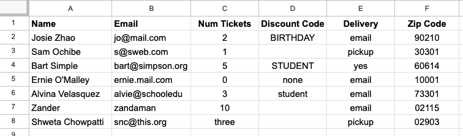
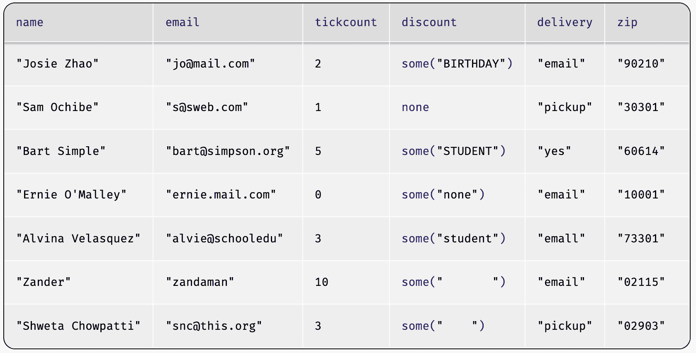
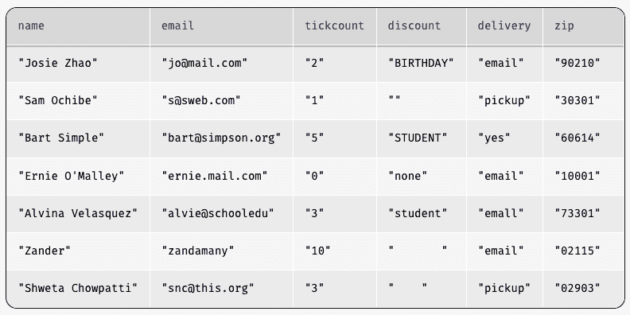
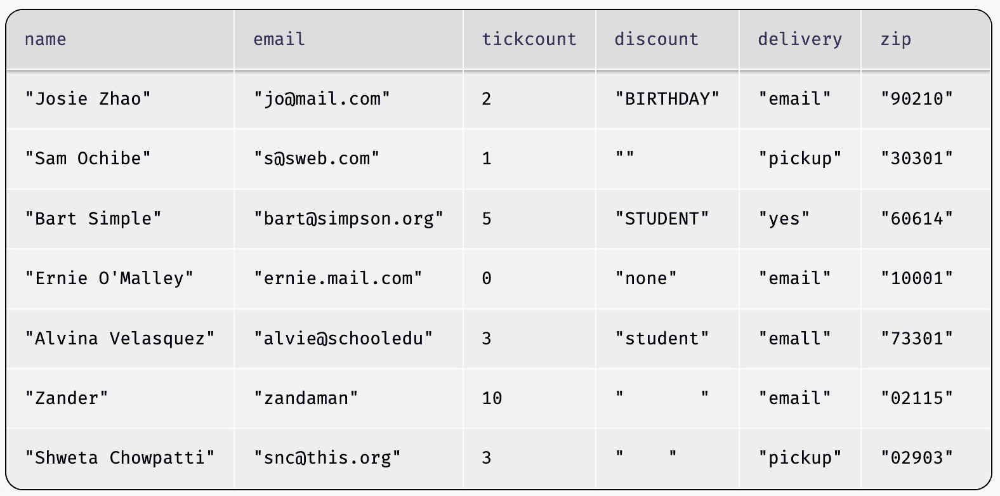
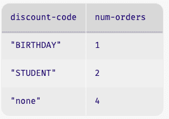
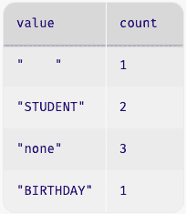
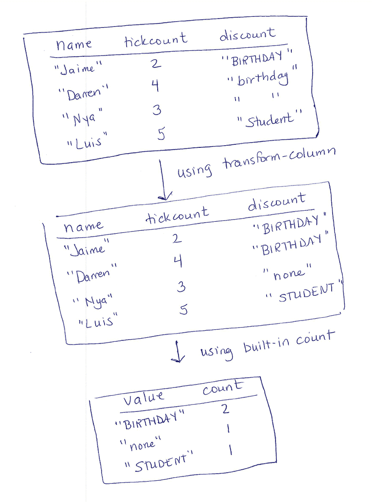
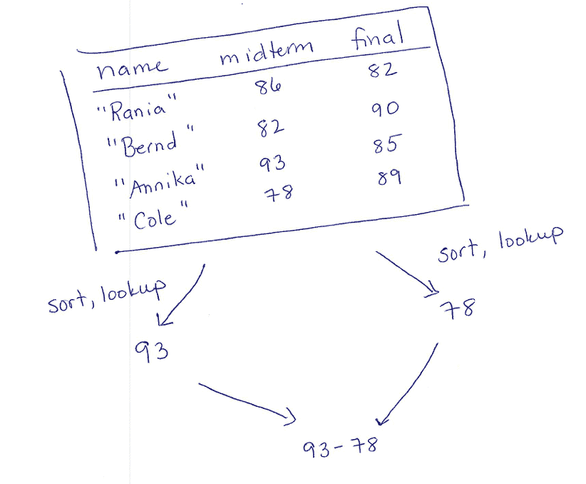
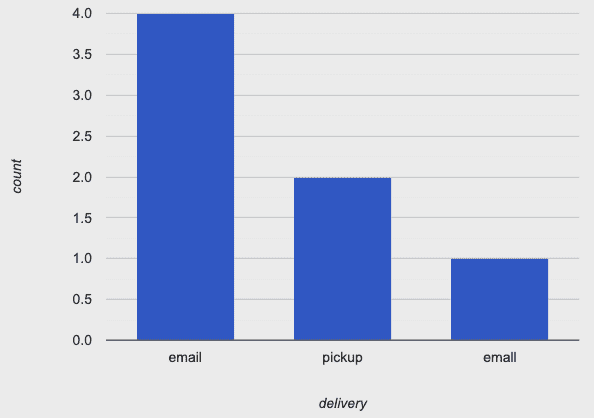

# 4.2 处理表格

> 原文：[`dcic-world.org/2025-08-27/processing-tables.html`](https://dcic-world.org/2025-08-27/processing-tables.html)

| |       4.2.1 清理数据表 |
| --- | --- |
| |     4.2.1.1 加载数据表 |
| |         4.2.1.1.1 在 CPO 中从 Google Sheets 加载表格 |
| |        4.2.1.1.2 在 VSCode 中从 CSV 文件加载表格 |
| |         4.2.1.1.3 处理具有多种数据类型的列 |
| |     4.2.1.2 处理缺失条目 |
| |     4.2.1.3 规范化数据 |
| |     4.2.1.4 系统地规范化 |
| |     4.2.1.5 使用程序检测数据错误 |
| |       4.2.2 任务计划 |
| |       4.2.3 准备数据表 |
| |         4.2.3.1 创建区间 |
| |     4.2.3.2 拆分列 |
| |       4.2.4 管理和命名数据表 |
| |       4.2.5 可视化和图表 |
| |       4.2.6 总结：管理数据分析 |

在数据分析中，我们经常处理大型数据集，其中一些数据是由其他人收集的。数据集不一定以我们可以处理的形式出现。我们可能需要将原始数据拆分或压缩到更粗的粒度。一些数据可能缺失或输入错误。除此之外，我们还需要为数据集或分析程序的长期维护做出规划。最后，我们通常希望使用可视化来传达我们的数据或检查数据中存在的问题。

作为具体例子，假设你正在为一个管理活动票务的公司进行数据分析和支持工作。人们通过在线表单购买门票。表单软件创建了一个包含所有输入数据的电子表格，这就是你需要处理的内容。以下是电子表格的截图 [样本电子表格](https://docs.google.com/spreadsheets/d/1Ks4ll5_8wyYK1zyXMm_21KORhagSMZ59dcr7i3qY6T4):



> 现在行动！
> 
> > 看看这个表格。你注意到什么可能会影响在分析中使用数据？或者对于管理活动的操作？

一些问题很快就会显现出来：`"Num Tickets"` 列中的 `three`，`"Discount Code"` 列中大小写的一致性差异，以及 `"Discount Code"` 列中 `"none"` 和空白空间的使用（你可能已经发现了其他问题）。在我们使用此数据集进行任何分析之前，我们需要对其进行清理，以确保我们的分析是可靠的。此外，有时我们的数据集是干净的，但需要调整或准备以适应我们想要提出的问题。本章将探讨这两个步骤，以及有助于这些步骤的编程技术。

#### 4.2.1 清理数据表格 "链接至此")

##### 4.2.1.1 加载数据表格 "链接至此")

与外部数据源一起工作的第一步是将它加载到你的编程和分析环境中。你使用哪种源取决于你为 Pyret 使用的编程环境：

+   如果你使用 CPO，可以从 Google Sheets 加载表格（如果你想要加载 CSV，首先需要将其导入到 Google Sheets）

+   如果你使用 VSCode，可以直接从 CSV 文件加载表格

两者都使用相同的 Pyret 操作（`load-table`），但方式略有不同。

Google Sheets 和 CSV 文件在单元格中的数据处理方式不同，因此我们在加载后管理 Pyret 列的类型时也存在差异。像 `"Num Tickets"` 这样的列似乎同时包含数字和字符串，这突出了这些差异。我们将在每个源文件的单独部分讨论这些细微差别。

##### 4.2.1.1.1 从 Google Sheets 加载表格到 CPO "链接至此")

```py
include gdrive-sheets

ssid = "1Ks4ll5_8wyYK1zyXMm_21KORhagSMZ59dcr7i3qY6T4"
event-data =
  load-table: name, email, tickcount, discount, delivery, zip
    source: load-spreadsheet(ssid).sheet-by-name("Orig Data", true)
  end
```

+   `ssid` 是我们想要加载的 Google Sheet 的标识符（标识符是 Google Sheet URL 中的长序列字母和数字）。

+   `load-table` 后跟的名称序列用于 Pyret 版本的表格列标题。这些名称**不必**与原始工作表中的名称匹配。

+   `source` 告诉 Pyret 要加载哪个工作表。`load-spreadsheet` 操作接受 Google Sheet 标识符（此处为 `ssid`），以及 Google Sheet 内部命名的工作表（或标签）名称（此处为 `"Orig Data"`）。最后的布尔值表示表格中是否有标题行（`true` 表示有标题行）。

当从 Google Sheets 读取表格时，Pyret 会根据数据的第一行中的值将每个列视为具有类型。因此，Pyret 报告了一个错误，即 `"Num Tickets"` 列中的 `three` 不是一个数字。我们将在 处理具有多种数据类型的列 中讨论如何处理这种情况。

##### 4.2.1.1.2 在 VSCode 中从 CSV 文件加载表格 "链接至此")

我们根据 CSV 文件是在你的电脑上还是通过 URL 可用来配置 `load-table` 操作。

+   通过 URL 从 CSV 文件加载：

    > ```py
    > include csv
    > 
    > # the url for the file
    > url = "https://raw.githubusercontent.com/data-centric-computing/dcic-public/main/materials/datasets/events-orig-f25.csv"
    > 
    > event-data =
    >  load-table: name, email, tickcount, discount, delivery, zip
    >     source: csv-table-url(url, default-options)
    >   end
    > ```

    +   `url` 是我们想要加载的 CSV 数据存在的网页地址（URL）的标识符。

    +   `source` 告诉 Pyret 从哪里加载数据。`csv-table-url` 操作接受网页地址（此处为 `url`），以及选项（例如，指示我们是否期望存在标题行）。

    +   `load-table` 后跟的名称序列用于 Pyret 表格版本中的列标题。这些名称不需要与 CSV 文件第一行（通常是标题行）中使用的名称匹配。

+   从您电脑上的 CSV 文件加载：

    > ```py
    > include csv
    > 
    > # the filesystem path to your CSV file on your computer
    > path = "datasets/events-orig-f25.csv"
    > 
    > event-data =
    >  load-table: name, email, tickcount, discount, delivery, zip
    >     source: csv-table-file(path, default-options)
    >   end
    > ```

当从 CSV 读取表格时，Pyret 将每个单元格视为包含字符串，即使单元格数据看起来是数字。因此，Pyret 不会在 `"Num Tickets"` 列中的 `three` 和数字组合周围报告错误。然而，如果我们假设它们都是数字的字符串，并尝试使用列数据，不一致性将再次出现。如果我们在我们加载数据之前注意到这个问题，我们应该在继续之前修复它。

##### 4.2.1.1.3 处理具有多种数据类型的列 "链接至此")

结构良好的数据不应在单个列中混合数据类型。在某些情况下，我们可能能够编写小程序来纠正这些不一致性。例如，一个程序可以帮助我们删除与预期列类型不一致的数据。然而，这种做法应该在仔细研究数据之后使用，以确保我们不会丢弃由于输入错误而丢失的有用信息。

由于处理此类问题需要谨慎，我们建议在将数据加载到 Pyret（或任何其他编程或分析工具）之前，在源文件中修复此类错误。

如何管理此类修订本身就是一个有趣的数据管理问题。你可能已经从另一个工具接收了数据，或者从包含错误的另一个工作表中导入它。其他人可能也会提供你需要跟踪的数据更新。如果你从其他人那里获得了数据，通常有道理复制源数据并对副本进行清理，这样你仍然可以在需要时访问原始数据。

本课的源数据文件还包含用于本章其余部分的清洁版本。

+   如果你正在使用 Google 表格，请寻找名为 `"Data"` 的单独工作表/标签页，其中 `three` 已被替换为一个数字。如果我们使用 `"Data"` 而不是 `"Orig Data"` 在上面的 `load-spreadsheet` 命令中，事件表将加载到 Pyret 中。

+   如果你正在使用 VSCode 中的 CSV 文件，请将文件路径修改为以 `"events-f25.csv"` 结尾，而不是 `"events-orig-f25.csv"`。

##### 4.2.1.2 处理缺失条目 "链接至此")

当我们在 Pyret 中手动创建表格时，我们必须为每个单元格提供一个值——没有“跳过”单元格的方法。当我们在一个电子表格程序（如 Excel、Google Sheets 或类似程序）中创建表格时，可以完全留空单元格。当我们把包含空单元格的表格加载到 Pyret 中时会发生什么？

原始数据文件在 `discount` 列中有空格。在我们将其加载到 Pyret 后，我们发现在该列中有些有趣的现象（尽管具体内容会根据您是从 Google Sheets 还是 CSV 文件读取而有所不同）。

+   如果您使用 Google Sheets 和 CPO，按照以下方式加载表格：

    ```py
    event-data =
      load-table: name, email, tickcount, discount, delivery
        source: load-spreadsheet(ssid).sheet-by-name("Data", true)
      end
    ```

    `event-data` 将是以下表格：

    

    注意，那些包含折扣代码的单元格现在有一个看起来很奇怪的符号，如 `some("student")`，而一些原本为空的单元格包含 `none`，但 `none` 不是一个字符串。这是怎么回事？

    Pyret 支持一种特殊的数据类型，称为 option。正如其名所示，option 用于可能存在或不存在的数据。`none` 是表示“数据缺失”的值。如果数据存在，它将出现在 `some` 的包装中。

    还要注意最后两行（Zander 和 Shweta 的行）——当在 Google Sheets 中查看时，它们看起来也是空的，但 Pyret 将它们加载为包含空格的字符串（例如，`some(" ")`）。这意味着什么？这意味着那些单元格在 Google Sheets 中实际上并不是空的，而是包含了一些空格。

    > 现在行动起来！
    > 
    > > 看看 Ernie 行的 `discount` 值：它读作 `some("none")`。这意味着什么？这与 `none`（如 Sam 的行中所示）有什么不同？

+   如果您使用 CSV 文件和 VSCode，按照以下方式加载表格：

    > ```py
    > url = "https://raw.githubusercontent.com/data-centric-computing/dcic-public/main/materials/datasets/events-f25.csv"
    > 
    > event-data =
    >   load-table: name, email, tickcount, discount, delivery, zip
    >     source: csv-table-url(url, default-options)
    >   end
    > ```

    `event-data` 将是以下表格：

    

    注意，没有数据的单元格要么是空字符串 (`""`)，要么是包含空格的字符串 (`" "`)。是什么导致了这种差异？在包含空格的字符串单元格中，原始 CSV 中的单元格看起来是空的，但实际上包含了一些空格。在读取 CSV 时，Pyret 保留了单元格的实际内容。只有当 CSV 单元格实际上没有任何数据时，才会使用空字符串。

无论您使用 Google Sheets 还是 CSV 文件，处理缺失数据（以及一般转换）的正确方法是指示如何处理每一列。这保证了在读取数据后，数据将如您预期的那样。我们通过 `load-table` 的附加功能，称为 sanitizers 来实现这一点。以下是修改代码的方式：

```py
include data-source # to get the sanitizers

event-data =
  load-table: name, email, tickcount, discount, delivery, zip
    source: load-spreadsheet(ssid).sheet-by-name("Data", true)
    sanitize name using string-sanitizer
    sanitize email using string-sanitizer
    sanitize tickcount using num-sanitizer
    sanitize discount using string-sanitizer
    sanitize delivery using string-sanitizer
    sanitize zip using string-sanitizer
  end
```

每一行 `sanitize` 指令都告诉 Pyret 在相应列缺少数据时应该做什么。`string-sanitizer` 指令表示将缺失数据加载为一个空字符串 (`""`)。Sanitizers 还可以处理简单的数据转换。如果将 `string-sanitizer` 应用到一个包含数字（如 `3`）的列上，清理器会将该数字转换为字符串（如 `"3"`）。同样，将 `num-sanitizer` 应用到一个列上会将数字字符串（如 `"3"`）转换为实际的数字（`3`）。

使用清理器，`event-data` 表的读取方式如下：



> 现在行动！
> 
> > 你注意到我们没有使用 `num-sanitizer` 而是使用 `string-sanitizer` 清理 `zip` 列了吗？邮编不是数字吗？尝试使用 `string-sanitizer` 和 `num-sanitizer` 分别对 `code` 进行上述代码的测试，看看你是否能发现差异。

邮编是数据以数字形式编写但并不打算用于数值计算的绝佳例子。这意味着什么？如果数据打算用于数值计算，那么标准算术运算应该在这些数据上是有意义的。例如，将邮编乘以 3 有什么意义呢？没有。同样，我们不会用前导零写数字，但邮编可以有意义地以 0 开头。将邮编视为字符串将它们视为标识符而不是数字。我们将在本章的后面部分回到这个话题（可视化和图表）。

关于默认值的说明：与 `string-sanitizer` 不同，`num-sanitizer` 不会将空白单元格转换为默认值（如 0）。对于数字的所有使用方式，没有单一的默认值是有意义的：虽然 `0` 可能是缺失票数的合理默认值，但它对缺失的年龄来说并没有意义。如果将其用作缺失考试成绩的默认值（后来用于计算课程成绩），可能会产生明显的错误。因此，如果单元格中的数据（或其缺失）无法可靠地解释为数字，`num-sanitizer` 会报告错误。Pyret 允许你编写自己的自定义清理器（例如，将缺失数字默认为 0 的清理器）。如果你想这样做，请参阅 Pyret 文档以获取详细信息。

缺少有意义的默认值是 Pyret 不利用列上的类型注解自动清理导入数据的一个原因。自动化会从程序员手中夺走控制权；清理器为程序员提供了对默认值的控制，以及选择是否使用（或不使用）清理器的选项。

常规做法：当你加载一个表时，使用清理器来防止原始表格中某些单元格缺少数据时出现错误。

##### 4.2.1.3 数据标准化 "链接到此处")

接下来，让我们看看 `"折扣代码"` 这一列。我们的目标是能够准确回答“每个折扣代码下有多少订单”。我们希望答案以表格形式总结，其中一列命名折扣代码，另一列给出使用该代码的行数。

> 现在行动！
> 
> > 举例说明！我们希望从这个计算中得到的表格片段是什么？

如果不决定如何标准化名称和处理缺失值，就无法回答这个问题。规范化一词指的是确保数据集合（如列）具有结构和格式。我们的解决方案将旨在生成以下表格，但您可能做出了与我们这里不同的选择：



我们如何得到这个表格？如果我们不确定，我们如何找出答案？

首先，查阅文档中可能有助于此任务的任何库函数。在 [Pyret 的 `dcic2024` 上下文文档](https://hackmd.io/@cs111/table) 中，我们发现：

```py
# count(tab :: Table, colname :: String) -> Table
# Produces a table that summarizes how many rows have
#   each value in the named column.
```

这听起来很有用，只要 `"折扣代码"` 列中的每个列都有值，并且该列中只有我们期望输出表中的那些值。我们需要做什么才能实现这一点？

+   让 `"none"` 出现在当前缺少值的每个单元格中

+   将所有不是 `"none"` 的代码转换为大写

幸运的是，这些任务与我们已经学会使用的函数相一致：每个都是一个列转换的例子，其中第二个涉及到 `String` 库中的大写转换函数。

我们可以在一个函数中捕获这些，该函数接收并生成一个字符串：

```py
fun cell-to-discount-code(str :: String) -> String:
  doc: ```将除了 `"none"` 之外的所有字符串转换为大写，

    将空白单元格转换为包含 `"none"````py
  if (str == "") or (str == "none"):
    "none"
  else:
    string-to-upper(str)
  end
where:
  cell-to-discount-code("") is "none"
  cell-to-discount-code("none") is "none"
  cell-to-discount-code("birthday") is "BIRTHDAY"
  cell-to-discount-code("Birthday") is "BIRTHDAY"
end
```

> 现在行动！
> 
> > 评估 `cell-to-discount-code` 中包含的示例。这是一组好的示例，还是遗漏了任何关键示例？

当前的示例考虑了 `"birthday"` 的不同大小写，但没有考虑 `"none"`。除非您确信数据收集过程不会产生 `"none"` 的不同大小写，否则我们应该包括这一点：

```py
cell-to-discount-code("NoNe") is "none"
```

哎呀！如果我们将这个示例添加到我们的 `where` 块中并运行代码，Pyret 会报告这个示例失败了。

> 现在行动！
> 
> > 为什么 `"NoNe"` 这种情况失败了？

由于我们在 `if` 表达式中检查 `"none"` 字符串，我们需要将输入规范化以匹配我们的 `if` 表达式期望的内容。以下是修改后的代码，所有示例都通过了。

```py
fun cell-to-discount-code(str :: String) -> String:
  doc: ```将除了 `"none"` 之外的所有字符串转换为大写，

    将空白单元格转换为包含 `"none"````py
  if (str == "") or (string-to-lower(str) == "none"):
    "none"
  else:
    string-to-upper(str)
  end
where:
  cell-to-discount-code("") is "none"
  cell-to-discount-code("none") is "none"
  cell-to-discount-code("NoNe") is "none"
  cell-to-discount-code("birthday") is "BIRTHDAY"
  cell-to-discount-code("Birthday") is "BIRTHDAY"
end
```

使用此功能与 `transform-column` 结合，可以得到一个具有标准化格式的折扣代码表格（提醒：您需要在工作在 `dcic2024` 上下文中才能使此功能生效）：

```py
discount-fixed =
  transform-column(event-data, "discount", cell-to-discount-code)
```

> 练习
> 
> > 尝试自己：将 `"配送"` 列规范化，使所有 `"yes"` 值都转换为 `"email"`。

现在我们已经清理了代码，我们可以继续使用`"count"`函数来提取我们的汇总表格：

```py
count(discount-fixed, "discount")
```

这会产生以下表格：



> 现在行动！
> 
> > 那第一行，带有折扣代码`" "`的行是什么意思？它可能来自哪里？

也许你之前没有注意到这一点（或者在更大的表格中不会注意到），但源数据中肯定有一个单元格包含一串空格，而不是缺失的内容。我们如何处理规范化以避免类似这种情况的缺失案例？

##### 4.2.1.4 规范化，系统化 "链接到此处")

如前例所示，我们需要一种系统性地思考潜在规范化的方法。我们关于编写示例的初始讨论给出了一种如何做到这一点的方法。那里的一条指导原则是考虑输入域，以及输入可能的变化方式。如果我们将这一点应用于加载的数据集，我们应该考虑原始数据是如何收集的。

> 现在行动！
> 
> > 根据你对网站的了解，事件代码内容可能来自哪里？它们是如何被输入的？这些信息能告诉你关于数据中不同可能的错误什么？

在这种情况下，对于来自基于网页的表单（如我们最初所揭示的）的数据，数据很可能是以下两种方式之一被输入的：

+   通过下拉菜单

+   在文本输入框中

下拉菜单会自动规范化数据，因此这不是一个可能的数据来源（这就是为什么当你在表单上想要用户从固定选项集合中选择时，你应该使用下拉菜单）。所以让我们假设这是来自文本输入框的。

文本输入框意味着任何典型的人类打字错误都可能会出现在你的数据中：交换的字母，缺失的字母，前导空格，大小写等。你也可能得到一些数据，其中有人只是输入了错误的内容（或者随机输入，看看你的表单会做什么）。

> 现在行动！
> 
> > 你认为程序可以自动纠正交换的字母、缺失错误和随机文本中的哪些？

交换和缺失的字母是拼写检查程序可能能够修复的类型（特别是如果程序知道所有有效的折扣代码）。根据定义，随机垃圾是随机的。在这种情况下，你将不得不与活动公司交谈，以决定他们希望如何处理这些情况（将它们转换为`"none"`，联系客户等——这些问题是政策问题，而不是编程问题）。

但实际上，这个教训就是尽可能使用下拉菜单或其他方法在源头防止错误数据的发生。

随着你对编程经验的积累，你也会学会预判某些类型的错误。例如，一旦你处理过足够多的包含空单元格的表格，这些问题就会变得习以为常。需要预判数据错误是优秀数据科学家必须了解他们所在领域的原因之一。

从这个例子中我们可以学到的是我们如何讨论预期的情况。我们考虑了数据来源，以及在该情况下可能出现的错误。在脑海中有一个清晰的错误模型将有助于你开发更健壮的程序。事实上，这种对抗性思维是安全领域工作的核心技能，但现在我们跑题了。

> 练习
> 
> > 在电子表格中，有时看似空白的单元格实际上包含由空格组成的字符串：当我们查看电子表格时，`""`和`" "`看起来相同，但它们在计算上实际上是不同的值。
> > 
> > 你会如何修改`cell-to-discount-code`函数，以便只包含空格的字符串也被转换为`"none"`？（提示：在字符串库中查找`string-replace`。）

##### 4.2.1.5 使用程序来检测数据错误 "链接至此")

有时，我们也会通过编写函数来检查表格是否包含意外的值来查找错误。让我们考虑一下`"email"`列：这是一个我们可以编写程序来标记任何包含无效电子邮件地址的行的位置。什么构成了一个有效的电子邮件地址？让我们考虑两个规则：

+   有效的电子邮件地址应包含一个`@`符号

+   有效的电子邮件地址应以`".com"`、`".edu"`或`".org"`之一结尾

这确实是一个过时、有限且以美国为中心的电子邮件地址定义，但扩展格式并不从根本上改变本节的目的。

> 练习
> 
> > 编写一个名为`is-email`的函数，该函数接受一个字符串并返回一个布尔值，指示该字符串是否满足上述两个规则以成为有效的电子邮件地址。为了增加一些挑战性，还可以包括一个规则，即在`@`和基于点的结尾之间必须有一些字符。

假设我们有了这样的函数，`filter-with`例程就可以生成一个表格，标识所有需要更正电子邮件地址的行。这里的要点是，程序通常有助于找到需要更正的数据，即使无法编写程序来执行修复。

#### 4.2.2 任务计划 "链接至此")

在我们继续之前，值得回顾一下我们生成折扣摘要表的过程。我们从具体例子开始，检查文档中可能有助于的内置函数，然后操纵我们的数据以使用该函数。这些都是适用于表格之外的数据和问题的更一般过程的一部分。我们将把这个过程称为任务规划。具体来说，任务计划是一系列步骤（任务），将计算问题分解成更小的步骤（子任务）。一个有用的任务计划包含你知道如何实现的子任务，无论是通过使用内置函数还是编写自己的函数。任务计划没有单一的符号或格式。对于某些问题，步骤的列表足以满足。对于其他问题，一个显示数据如何通过问题进行转换的图表可能更有帮助。这是一个针对特定问题的个人选择。目标是简单地将问题分解成某种编程待办事项列表，以帮助你管理这个过程。

> 策略：创建任务计划
> 
> > 1.  开发一个具体的例子，展示在给定输入（你选择输入：一个好的例子是足够大以展示输入的不同特征，但足够小以便在规划期间手动处理。对于表格问题，实践中通常 4-6 行效果很好）上的期望输出。
> > 1.  
> > 1.  心理上识别你已经知道（或你在文档中找到的）可能对将输入数据转换为输出数据有用的函数。
> > 1.  
> > 1.  开发一系列步骤——无论是作为图片、计算文本描述，还是两者的组合——这些步骤可以用来解决问题。如果你使用图片，从具体例子中绘制出中间数据值，并注明可能有助于从一个中间值到下一个中间值进行操作的运算。你在上一步中确定的函数应该出现在这里。
> > 1.  
> > 1.  重复上一步，分解子任务，直到你相信你可以编写表达式或函数来执行每个步骤或数据转换。

这里是一个基于图表的任务计划，用于我们刚刚开发的`discount-summary`程序。我们在纸上绘制了这个图表，以突出任务计划不是在编程环境中编写的。



一旦你有了计划，你就通过编写中间步骤的表达式和函数，将输出传递给下一个步骤，将其转换成一个程序。有时，我们看一个问题，就会立即知道如何编写它的代码（如果你是那种你以前解决过很多次的问题）。当你没有立即看到解决方案时，使用这个过程，通过处理具体的数据例子来分解问题。

> 练习
> 
> > 你被要求开发一个程序，用于识别一门课程中从期中考试到期末考试成绩提升最大的学生。你的输入表将包含每个考试的列以及学生姓名列。为这个问题编写一个任务计划。

有些任务计划不仅仅涉及一系列的表值序列。有时，我们需要对同一张表进行多次转换以提取不同的数据片段，然后对这些数据进行计算。在这种情况下，我们用分支来绘制我们的计划，以展示最终结果中汇集的不同计算。以成绩册为例，你可能被要求编写一个程序来计算期中考试中最高分和最低分之间的差异。这个任务计划可能看起来像：



> 练习
> 
> > 你被提供了一个包含日期、降水量和当天最高温度的天气数据表。你被要求计算一月份的雪天是否比二月份多，其中雪天是指最高温度低于冰点且降水量超过零。

这个策略的要点很容易说明：

如果你不确定如何处理一个问题，不要一开始就尝试编写代码。先计划，直到你理解了问题。

新手程序员经常忽视这个建议，认为编写代码是解决编程问题的最快方式（尤其是如果你看到同学能够直接开始编写代码）。有经验的程序员知道，在理解问题之前尝试编写所有代码会比先退后一步理解问题花费更长的时间。随着你编程技能的发展，你的任务计划的具体格式也会演变（实际上，我们将在本书的后面看到一些这样的例子）。但核心思想是相同的：使用具体的例子来帮助确定需要的中间计算，然后在弄清楚这些中间计算之后或同时将它们转换为代码。

#### 4.2.3 准备数据表 "链接至此")

有时，我们拥有的数据是干净的（即我们已经标准化了数据并处理了错误），但它仍然不是我们想要运行的分析的格式。例如，如果我们想查看小型、中型和大型订单的分布情况怎么办？在我们的当前表中，我们有订单中的票数，但没有该订单规模的明确标签。如果我们想生成某种类型的图表来显示我们的订单规模，我们需要明确这些标签。

##### 4.2.3.1 创建数据区间 "链接至此")

将一组值（如 `tickcounts` 值）减少到更小的类别集合（如订单的小/中/大，或时间戳的上午/下午等）的行为称为分组。分组是类别。为了将行放入分组，我们创建一个函数来计算原始数据值的分组，然后创建一个新分组标签的列。

这里有一个创建用于票务订单规模的分组的例子：

```py
fun order-scale-label(r :: Row) -> String:
  doc: "categorize the number of tickets as small, medium, large"
  numtickets = r["tickcount"]

  if numtickets >= 10: "large"
  else if numtickets >= 5: "medium"
  else: "small"
  end
end

order-bin-data =
  build-column(cleaned-event-data, "order-scale", order-scale-label)
```

##### 4.2.3.2 列分割 "链接至此")

事件表目前使用一个字符串来表示一个人的名字。然而，如果我们想按姓氏排序数据，这个字符串就没什么用了。将一列分割成几列可以在准备数据集进行分析或使用时是一个有用的步骤。编程语言通常提供各种操作来分割字符串：Pyret 有 `string-split` 和 `string-split-all` 这样的操作，可以将一个字符串分割成几个部分，围绕一个给定的字符（如空格）。例如，你可以写 `string-split("Josie Zhao", " ")` 来提取 `"Josie"` 和 `"Zhao"` 作为单独的字符串。

> 练习
> 
> > 为一个函数编写任务计划（不是代码，只是计划），该函数将事件表中的当前 `name` 列替换为两个名为 `last-name` 和 `first-name` 的列。
> > 
> 现在就做！
> 
> > 将你想要测试名称分割函数的具体名称字符串集合写下来。

希望你至少看了一下表格，并注意到我们有一个名叫 `"Zander"` 的人，他的整个名字是一个单独的字符串，而不是由名字和姓氏两部分组成。我们该如何处理中间名呢？或者那些名字中包含父母双方姓氏的文化呢？或者那些将姓氏放在名字前面的文化？或者那些名字不以拉丁字母书写的文化呢？这无疑变得更加复杂了。

> 负责任计算：表示名字
> 
> > 将名字表示为数据是高度依赖于上下文和文化的。仔细思考你的数据集需要包含哪些个体，并据此设计你的表格结构。排除你试图代表的人口之外的名字的表格结构是可以接受的。头疼的地方在于后来意识到你的数据集或程序排除了需要支持的数据。简而言之，检查你的表格结构所做出的关于数据的假设，并在考虑了需要代表哪些观察结果或个体之后选择表格结构。
> > 
> > 要深入了解在程序中表示现实世界名称和日期的复杂性，请搜索“程序员相信的……错误”，这将出现诸如[程序员相信的关于名称的错误](https://www.kalzumeus.com/2010/06/17/falsehoods-programmers-believe-about-names/)和[程序员相信的关于时间的错误](https://infiniteundo.com/post/25509354022/more-falsehoods-programmers-believe-about-time)之类的文章。
> > 
> 练习
> 
> > 编写一个程序，过滤表格，只包含那些名字不是由两个由空格分隔的字符串组成的行。
> > 
> 练习
> 
> > 编写一个程序，该程序接受一个具有`"first-name last-name"`格式的`name`列的表格，并将`name`列替换为两个名为`last-name`和`first-name`的列。要从单个名称字符串中提取首名和姓氏，请使用：
> > 
> > ```py
> > string-split(name-string, " ").get(0)  # get first name
> > string-split(name-string, " ").get(1)  # get last name
> > ```

#### 4.2.4 管理并命名数据表 "链接至此")

在这个阶段，我们已经处理了事件表的不同版本：

+   我们尝试加载的原始数据集

+   具有手动更正的新数据表

+   具有折扣代码规范化的版本

+   另一个规范了配送方式的版本

+   扩展了订单规模列的版本

这些版本中的哪一个应该在代码文件中具有显式的名称？

通常，我们保留原始的原始数据表副本以及我们手动更正的副本。为什么？以防我们以后需要再次查看原始数据，无论是为了识别人们所犯的错误类型还是为了应用不同的修复。

由于类似的原因，我们希望将清洗（规范化）的数据与最初加载的版本分开。幸运的是，Pyret 有助于这一点，因为它创建新的表格，而不是修改先前的表格。然而，如果我们必须规范化多个列，我们真的需要为每个中间表格都创建一个新的名称吗？

作为一般规则，我们通常为最初加载的表、清洗的表以及用于分析目的的显著变体维护不同的名称。在我们的代码中，这可能意味着具有以下名称：

```py
event-data = ... # the loaded table

cleaned-event-data =
  transform-column(
    transform-column(event-data, "discount", cell-to-discount-code),
    "delivery", yes-to-email)

order-bin-data =
  build-column(
    cleaned-event-data, "order-scale", order-scale-label)
```

其中`yes-to-email`是我们尚未编写的函数，但它可能已经将`"delivery"`列中的`"yes"`值进行了规范化。请注意，我们按顺序应用了每种规范化，只命名应用了所有规范化的最终表格。在专业实践中，如果你正在处理一个非常大的数据集，你可能只需将清洗后的数据集写入文件，这样在分析时只需加载清洗后的版本。我们将在稍后查看写入文件。只有少数几个表名将减少你在处理文件时的困惑。如果你从事多个数据分析工作，制定一个一致的命名表策略可能会帮助你更好地在项目之间切换时管理代码。

#### 4.2.5 可视化和绘图 "链接至此")

现在我们已经清理并准备好了数据，我们可以开始分析了。我们可能想知道什么？也许我们想知道哪个折扣代码被使用得最频繁。也许我们想知道购买时间与人们购买的票数之间是否有相关性。人们使用各种不同的可视化图表和图形来总结数据。

使用哪种图表类型取决于问题和手头的数据。数据集中变量的性质有助于确定相关的图表或统计操作。数据集中的属性或变量（即表格的单列）可以归类为几种不同类型之一，包括：

+   定量变量：值是数字且可以按一致间隔排序的变量。它们在计算中是有意义的。

+   分类变量：具有一组固定值的变量。这些值可能有顺序，但除了排序之外，值之间没有有意义的计算操作。这类变量通常对应于样本的特征。

> 现在就做！
> 
> > 姓氏、课程成绩、邮编属于哪种变量类型？

常见的图表及其所需的变量类型包括：

+   散点图显示两个定量变量之间的关系，每个变量位于 2D 图表的一个轴上。

+   频率条形图显示数据集中某一列中每个分类值的频率。

+   直方图将定量数据分割成等大小的区间，显示每个区间内值的分布。

+   饼图显示数据集中某一列的单元格在分类值中的比例。

> 现在就做！
> 
> > 将以下问题映射到图表类型，基于问题中涉及的变量类型：
> > 
> > +   哪个折扣代码被使用得最频繁？
> > +   
> > +   购买订单中的票数与购买时间之间是否存在关系？
> > +   
> > +   每个配送选项被下了多少订单？

例如，我们可能会使用频率条形图来回答第三个问题。根据 `Table` 文档，我们会使用以下代码（其他类型的图表风格类似）：

```py
freq-bar-chart(cleaned-event-data, "delivery")
```

这会产生以下图表（假设我们实际上没有对 `"delivery"` 列的内容进行归一化）：



哇——那个额外的 `"email"` 列是从哪里来的？如果你仔细看，你会注意到错误：在 `"Alvina"` 这一行中，折扣列（下拉菜单，有人吗？）有一个拼写错误（`"emall"` 中的 `l` 应该是 `i`）。

这里的教训是，图表和可视化不仅在分析阶段有价值，而且在早期，当我们试图验证我们的数据是否干净且可用时也非常有用。优秀的数据科学家在确保值有意义之前，永远不会信任一个数据集。在大型数据集中，手动检查所有数据通常是不切实际的。但创建一些图表或其他数据摘要也有助于识别错误。

#### 4.2.6 摘要：管理数据分析 "链接至此")

本章为您提供了一个如何使用编码来管理和处理数据的高级概述。在进行任何数据分析时，优秀的数据从业者都会经历几个步骤：

1.  考虑到每个列中的数据：该列中可能存在的合理值是什么，以及根据你对数据收集方法的了解，该列可能存在哪些类型的错误？

1.  检查数据是否存在错误，结合手动检查表格、图表和`filter-with`表达式来查找意外值。在数据源（如果你能控制的话）或通过小型程序对数据进行归一化或校正。

1.  将归一化/清洗后的数据表存储为程序中的名称，或者将其保存回新文件。保留原始数据（以防你需要稍后参考原始数据）。

1.  根据你想对其提出的问题准备数据：计算新列、对现有列进行分箱，或结合来自不同表格的数据。你可以完成所有准备工作并命名最终表格，或者为每个问题进行单独的准备工作，并为每个问题命名表格。

1.  最后，使用适合问题和涉及变量的统计方法、可视化以及解释来进行分析。在报告数据时，始终存储有关包含分析代码的文件以及文件中哪些部分用于生成报告中每个图表或解释的笔记。

管理数据和执行分析的内容远不止这本书所能涵盖的。在数据管理和其分析方面，有完整的书籍、学位和职业。例如，我们尚未讨论的一个领域是机器学习，其中使用（其他人编写的）程序从数据集中进行预测（相比之下，本章重点介绍了你将使用汇总统计和可视化来执行分析的项目）。本章中涵盖的所有技能都是有效和负责任地使用机器学习的先决条件。但我们还有更多需要探索和理解的数据本身，这将在接下来的章节中展开。继续前进！

> 责任计算：统计预测中的偏差
> 
> > 在一本讨论数据和责任感的书中，如果我们不至少提及使用数据做出预测（通过机器学习等技术）时出现的许多问题，我们将感到疏忽。一些问题源于数据本身的问题（例如，样本是否具有代表性，或变量之间的相关性是否会导致像算法招聘那样的歧视）。其他问题出现在为一种目的收集的数据被误用于另一种目的的预测中。还有更多的问题出现在对结果的解释中。
> > 
> > 这些都是丰富的主题。在这个阶段，你可以阅读大量文章来开始了解算法决策的陷阱（以及好处）。本书将专注于我们从程序中教授你编写的问题，让其他课程或教师的兴趣根据读者的背景适当补充材料。

#### 4.2.1 清洗数据表 "链接至此")

##### 4.2.1.1 加载数据表 "链接至此")

与外部数据源一起工作的第一步是将它加载到你的编程和分析环境中。你使用哪种来源取决于你为 Pyret 使用的编程环境：

+   如果你使用 CPO，你可以从 Google Sheets 加载数据表（如果你要加载 CSV 文件，首先需要将其导入 Google Sheets）

+   如果你使用 VSCode，你可以直接从 CSV 文件加载数据表

两者都使用相同的 Pyret 操作（`load-table`），但方式略有不同。

Google Sheets 和 CSV 文件对单元格中的数据类型处理不同，因此我们在加载后对 Pyret 列的数据类型管理也有所不同。像`"Num Tickets"`这样的列似乎同时包含数字和字符串，突出了这些差异。我们将在每个源文件的不同部分中讨论这些细微差别。

##### 4.2.1.1.1 在 CPO 中从 Google Sheets 加载数据表 "链接至此")

```py
include gdrive-sheets

ssid = "1Ks4ll5_8wyYK1zyXMm_21KORhagSMZ59dcr7i3qY6T4"
event-data =
  load-table: name, email, tickcount, discount, delivery, zip
    source: load-spreadsheet(ssid).sheet-by-name("Orig Data", true)
  end
```

+   `ssid`是我们想要加载的 Google Sheets 的标识符（标识符是 Google Sheets URL 中的长序列字母和数字）。

+   `load-table`后面的名称序列用于 Pyret 版本表中的列标题。这些名称不需要与原始表中的名称匹配。

+   `source`告诉 Pyret 要加载哪个工作表。`load-spreadsheet`操作接受 Google Sheets 标识符（在此处为`ssid`），以及 Google Sheets 内部命名的工作表（或标签）名称（在此处为`"Orig Data"`）。最后的布尔值表示表中是否有标题行（`true`表示有标题行）。

当从 Google Sheets 读取表格时，Pyret 会根据数据第一行的值将每个列视为具有某种类型。因此，Pyret 报告了一个错误，即 `"Num Tickets"` 列中的 `three` 不是一个数字。我们将在 处理具有多种数据类型的列 中讨论如何处理这种情况。

##### 4.2.1.1.2 从 CSV 文件中加载表格在 VSCode 中 "链接至此")

我们根据 CSV 文件是在您的计算机上还是通过 URL 可用来配置 `load-table` 操作。

+   通过 URL 从 CSV 文件加载：

    > ```py
    > include csv
    > 
    > # the url for the file
    > url = "https://raw.githubusercontent.com/data-centric-computing/dcic-public/main/materials/datasets/events-orig-f25.csv"
    > 
    > event-data =
    >  load-table: name, email, tickcount, discount, delivery, zip
    >     source: csv-table-url(url, default-options)
    >   end
    > ```

    +   `url` 是我们想要加载的 CSV 数据存在的网页地址（URL）的标识符。

    +   `source` 告诉 Pyret 从哪里加载数据。`csv-table-url` 操作接受网页地址（此处为 `url`），以及选项（例如，指示我们是否期望存在标题行）。

    +   `load-table` 后跟的名称序列用于表格的 Pyret 版本的列标题。这些名称**不必**与 CSV 文件第一行（通常为标题行）中使用的名称相匹配。

+   从您的计算机上的 CSV 文件加载：

    > ```py
    > include csv
    > 
    > # the filesystem path to your CSV file on your computer
    > path = "datasets/events-orig-f25.csv"
    > 
    > event-data =
    >  load-table: name, email, tickcount, discount, delivery, zip
    >     source: csv-table-file(path, default-options)
    >   end
    > ```

当从 CSV 读取表格时，Pyret 将每个单元格视为包含字符串，即使单元格数据看起来是数字。因此，Pyret 不会在 `"Num Tickets"` 列中的 `three` 和数字组合周围报告错误。然而，如果我们假设这些数据都是数字字符串并尝试使用这些列数据，不一致性将会再次出现。如果我们在我们加载数据之前注意到这个问题，我们应该在继续之前修复它。

##### 4.2.1.1.3 处理具有多种数据类型的列 "链接至此")

结构良好的数据不应在单个列中混合数据类型。在某些情况下，我们可能能够编写小程序来纠正这些不一致性。例如，程序可以帮助我们删除与预期列类型不一致的数据。然而，这种做法应在仔细研究数据后使用，以确保我们不会丢弃由于输入错误而丢失的有用信息。

由于处理此类问题需要谨慎，我们建议在将数据加载到 Pyret（或任何其他编程或分析工具）之前，先在源文件中修复此类错误。

如何管理此类修订本身就是一个有趣的数据管理问题。您可能已从另一个工具接收数据，或从包含错误的另一个工作表导入数据。其他人可能还提供了您需要跟踪的数据更新。如果您从其他人那里获取了数据，通常有道理复制源数据并清理副本，以便在需要时仍能访问原始数据。

本课的源数据文件还包含用于本章其余部分的清洁版本。

+   如果你使用的是 Google Sheet，请查找名为 `"Data"` 的单独工作表/标签页，其中 `three` 已被替换为一个数字。如果我们使用 `"Data"` 而不是 `"Orig Data"` 在上面的 `load-spreadsheet` 命令中，事件表将加载到 Pyret。

+   如果你正在使用 VSCode 中的 CSV 文件，请将文件路径修改为以 `"events-f25.csv"` 结尾，而不是 `"events-orig-f25.csv"`。

##### 4.2.1.2 处理缺失条目 "链接至此")

当我们在 Pyret 中手动创建表格时，我们必须为每个单元格提供一个值——没有“跳过”单元格的方法。当我们在一个电子表格程序（如 Excel、Google Sheets 或类似程序）中创建表格时，可以完全留空单元格。当我们把带有空单元格的表格加载到 Pyret 中时会发生什么？

原始数据文件在 `discount` 列中有空格。在我们将其加载到 Pyret 后，我们发现该列中有些有趣的现象（尽管具体是什么取决于你是从 Google Sheets 还是 CSV 文件中读取的）。

+   如果你使用 Google Sheets 和 CPO，按以下方式加载表格：

    ```py
    event-data =
      load-table: name, email, tickcount, discount, delivery
        source: load-spreadsheet(ssid).sheet-by-name("Data", true)
      end
    ```

    `event-data` 将是以下表格：

    

    注意，那些包含折扣代码的单元格现在有看起来奇怪的符号，如 `some("student")`，而一些原本为空的单元格包含 `none`，但 `none` 不是一个字符串。这是怎么回事？

    Pyret 支持一种特殊类型的数据，称为 option。正如其名所示，option 用于可能存在或不存在的数据。`none` 是表示“数据缺失”的值。如果数据存在，它将包裹在 `some` 中。

    还要注意最后两行（Zander 和 Shweta），在 Google Sheets 中看起来也是空的，但 Pyret 将它们加载为包含空格的字符串（例如，`some(" ")`）。这意味着什么？这意味着那些单元格在 Google Sheets 中实际上不是空的，而是包含了一些空格。

    > 现在行动！
    > 
    > > 看看 Ernie 行的 `discount` 值：它读取为 `some("none")`。这意味着什么？这与 `none`（如 Sam 的行中所示）有什么不同？

+   如果你使用 CSV 文件和 VSCode，按以下方式加载表格：

    > ```py
    > url = "https://raw.githubusercontent.com/data-centric-computing/dcic-public/main/materials/datasets/events-f25.csv"
    > 
    > event-data =
    >   load-table: name, email, tickcount, discount, delivery, zip
    >     source: csv-table-url(url, default-options)
    >   end
    > ```

    `event-data` 将是以下表格：

    

    注意，那些没有数据的单元格要么是空字符串 (`""`)，要么是包含空格的字符串 (`" "`)。是什么导致了这种差异？在包含空格的字符串的单元格中，原始 CSV 中的单元格看起来是空的，但实际上包含了一些空格。在读取 CSV 时，Pyret 保留单元格中的实际内容。只有当 CSV 单元格实际上没有任何数据时，才会使用空字符串。

不论你使用的是 Google Sheets 还是 CSV 文件，处理缺失数据（以及一般转换）的正确方法是指明如何处理每一列。这保证了你在读取数据后，数据将如你所期望的那样。我们通过 `load-table` 的附加功能“清理器”来实现这一点。以下是我们的代码修改方式：

```py
include data-source # to get the sanitizers

event-data =
  load-table: name, email, tickcount, discount, delivery, zip
    source: load-spreadsheet(ssid).sheet-by-name("Data", true)
    sanitize name using string-sanitizer
    sanitize email using string-sanitizer
    sanitize tickcount using num-sanitizer
    sanitize discount using string-sanitizer
    sanitize delivery using string-sanitizer
    sanitize zip using string-sanitizer
  end
```

每个 `sanitize` 行都告诉 Pyret 在相应列中缺失数据时应该做什么。`string-sanitizer` 表示将缺失数据加载为空字符串 (`""`)。清理器还可以处理简单的数据转换。如果 `string-sanitizer` 应用于包含数字（如 `3`）的列，清理器会将该数字转换为字符串（如 `"3"`）。同样，将 `num-sanitizer` 应用到列中会将数字字符串（如 `"3"`) 转换为实际数字 (`3`)。

使用清理器，`event-data` 表的读取方式如下：


> 现在就做！
> 
> > 你注意到我们没有使用 `num-sanitizer` 而是使用 `string-sanitizer` 清理 `zip` 列了吗？邮编不是数字吗？尝试使用 `string-sanitizer` 和 `num-sanitizer` 分别对 `code` 进行上述代码的测试，看看你是否能发现差异。

邮编是数据以数字形式编写但并不打算用于数值的绝佳例子。这意味着什么？如果数据打算用于数值，那么标准算术运算应该在这些数据上是有意义的。例如，将邮编乘以 3 有什么意义呢？没有意义。同样，我们不会用前导零写数字，但邮编可以有意义地以 0 开头。将邮编视为字符串将它们视为标识符而不是数字。我们将在本章的后面回到这个话题（可视化与图表）。

关于默认值的说明：与 `string-sanitizer` 不同，`num-sanitizer` 不会将空白单元格转换为默认值（如 0）。没有单一的默认值对所有使用数字的方式都是有意义的：虽然 `0` 可能是缺失票数的合理默认值，但它对缺失年龄来说并没有意义。如果用作缺失考试成绩的默认值（后来用于计算课程成绩），可能会产生完全错误的结果。因此，如果单元格中的数据（或其缺失）无法可靠地解释为数字，`num-sanitizer` 会报告错误。Pyret 允许你编写自己的自定义清理器（例如，将缺失数字默认为 0 的清理器）。如果你想这样做，请参阅 Pyret 文档以获取详细信息。

缺少有意义的默认值是 Pyret 不利用列上的类型注解自动清理导入数据的一个原因。自动化会从程序员手中夺走控制权；清理器为程序员提供了控制默认值以及选择是否使用（或不使用）清理器的选项。

经验法则：当你加载一个表格时，使用清理器来防止原始表格中某些单元格缺失数据时的错误。

##### 4.2.1.3 标准化数据 "链接至此")

接下来，让我们看看 `"Discount Code"` 列。我们的目标是能够准确回答“有多少订单是在每个折扣代码下进行的”。我们希望答案以表格形式总结，其中一列命名折扣代码，另一列给出使用该代码的行数。

> 现在就做！
> 
> > 例子先行！我们希望从这个表格片段的计算中得到什么样的表格？

不做出一些关于如何标准化名称以及如何处理缺失值的决定，你就无法回答这个问题。规范化这个术语指的是确保数据集合（如列）具有结构和格式。我们的解决方案将致力于产生以下表格，但你可能做出了与我们这里不同的选择：


我们如何得到这个表格？如果我们不确定，我们如何找出这个答案？

首先在文档中查找可能有助于这个任务的任何库函数。在 Pyret 的 `dcic2024` 上下文[文档](https://hackmd.io/@cs111/table)中，我们发现：

```py
# count(tab :: Table, colname :: String) -> Table
# Produces a table that summarizes how many rows have
#   each value in the named column.
```

这听起来很有用，只要 `"Discount code"` 列中的每一列都有值，并且该列中唯一的值是我们想要的输出表中的那些值。我们需要做什么才能实现这一点？

+   让 `"none"` 出现在当前缺少值的每个单元格中

+   将所有不是 `"none"` 的代码转换为大写

幸运的是，这些任务与我们已经学会使用的函数相吻合：每个都是一个列转换的例子，其中第二个涉及到 `String` 库中的大写转换函数。

我们可以在一个函数中一起捕获这些，该函数接收并生成一个字符串：

```py
fun cell-to-discount-code(str :: String) -> String:
  doc: ```将除了 `none` 之外的所有字符串转换为大写，

    将空白单元格转换为包含 `none````py
  if (str == "") or (str == "none"):
    "none"
  else:
    string-to-upper(str)
  end
where:
  cell-to-discount-code("") is "none"
  cell-to-discount-code("none") is "none"
  cell-to-discount-code("birthday") is "BIRTHDAY"
  cell-to-discount-code("Birthday") is "BIRTHDAY"
end
```

> 现在就做！
> 
> > 评估 `cell-to-discount-code` 包含的例子。这是一组好的例子，还是遗漏了任何关键例子？

当前例子考虑了 `"birthday"` 的不同大小写，但没有考虑 `"none"`。除非你确信数据收集过程不会产生 `"none"` 的不同大小写，否则我们也应该包括这一点：

```py
cell-to-discount-code("NoNe") is "none"
```

哎呀！如果我们把这个例子添加到我们的 `where` 块中并运行代码，Pyret 会报告这个例子失败。

> 现在就做！
> 
> > 为什么 `"NoNe"` 的情况失败了？

由于我们在 `if` 表达式中检查字符串 `"none"`，我们需要将输入规范化以匹配我们的 `if` 表达式所期望的内容。以下是修改后的代码，所有例子都通过了。

```py
fun cell-to-discount-code(str :: String) -> String:
  doc: ```将除了 `none` 之外的所有字符串转换为大写，

    将空白单元格转换为包含 `none````py
  if (str == "") or (string-to-lower(str) == "none"):
    "none"
  else:
    string-to-upper(str)
  end
where:
  cell-to-discount-code("") is "none"
  cell-to-discount-code("none") is "none"
  cell-to-discount-code("NoNe") is "none"
  cell-to-discount-code("birthday") is "BIRTHDAY"
  cell-to-discount-code("Birthday") is "BIRTHDAY"
end
```

使用这个函数与 `transform-column` 结合会产生一个具有标准化格式的折扣代码表格（提醒：你需要在这个 `dcic2024` 上下文中工作才能使这生效）：

```py
discount-fixed =
  transform-column(event-data, "discount", cell-to-discount-code)
```

> 练习
> 
> > 试试看：将 `"delivery"` 列规范化，以便所有 `"yes"` 值都转换为 `"email"`。

现在我们已经清理了代码，我们可以继续使用`"count"`函数来提取我们的汇总表：

```py
count(discount-fixed, "discount")
```

这会产生以下表格：


> 现在就做！
> 
> > 那第一行，折扣代码`" "`是怎么回事？它可能来自哪里？

也许您之前没有注意到这一点（或者在更大的表格中不会注意到），但源数据中肯定有一个单元格包含一串空格，而不是缺失的内容。我们如何处理规范化以避免类似这种情况的缺失？

##### 4.2.1.4 规范化，系统化 "链接到这里")

如前例所示，我们需要一种系统性地思考潜在规范化的方法。我们关于编写示例的初始讨论给出了一种如何做到这一点的方法。那里的一个指导原则是考虑输入域，以及输入可能的变化方式。如果我们将这一点应用于加载的数据集，我们应该考虑原始数据是如何收集的。

> 现在就做！
> 
> > 根据您对网站的了解，事件代码内容可能来自哪里？它们是如何输入的？这些信息告诉您关于数据中不同可能的错误什么？

在这种情况下，对于来自基于网页的表单（如我们最初所揭示的）的数据，数据很可能是以下两种方式之一输入的：

+   通过下拉菜单

+   在文本输入框中

一个下拉菜单会自动规范化数据，所以这不是一个合理的来源（这就是为什么当您希望用户从一组固定的选项中选择时，应该在表单上使用下拉菜单）。所以让我们假设这是从一个文本输入框来的。

文本输入框意味着任何典型的人类打字错误都可能出现在您的数据中：交换的字母，缺失的字母，前导空格，大小写等。您也可能得到一些数据，其中有人只是输入了错误的内容（或者随机输入，看看您的表单会做什么）。

> 现在就做！
> 
> > 您认为程序可以自动纠正哪些交换的字母、缺失错误和随机文本？

交换和缺失的字母是拼写检查器可能能够纠正的类型（特别是如果程序知道所有的有效折扣代码）。随机垃圾，按照定义，是随机的。在那里，您需要与活动公司交谈，以决定他们希望如何处理这些情况（将它们转换为`"none"`，联系客户等。这些问题是政策问题，而不是编程问题）。

但实际上，这个教训就是尽可能使用下拉菜单或其他方式来防止在源数据中输入错误。

随着您在编程方面的经验越来越丰富，您也将学会预见某些类型的错误。例如，一旦您处理过足够多的包含这些问题的表格，单元格看起来空的情况就会变得很自然。需要预见数据错误是优秀的数据科学家必须了解他们所在领域的原因之一。

从这个例子中我们可以学到的是我们如何讨论预期内容。我们思考了数据来源，以及在那个情况下可能出现的错误。有一个清晰的错误模型在心中将有助于你开发更健壮的程序。实际上，这种对抗性思维是安全领域工作的核心技能，但现在我们可能有些超前了。

> 练习
> 
> > 在电子表格中，看似空白的单元格有时实际上包含内容，形式为只由空格组成的字符串：当我们查看电子表格时，`""`和`" "`看起来相同，但它们在计算上实际上是不同的值。
> > 
> > 你会如何修改`cell-to-discount-code`函数，以便只包含空格的字符串也被转换为`"none"`？（提示：在字符串库中查找`string-replace`。）

##### 4.2.1.5 使用程序检测数据错误 "链接至此")

有时，我们也会通过编写函数来检查表格是否包含意外的值来查找错误。让我们考虑`"email"`列：这是一个我们应该能够编写程序来标记任何包含无效电子邮件地址的行的位置。什么构成了一个有效的电子邮件地址？让我们考虑两个规则：

+   有效的电子邮件地址应包含一个`@`符号

+   有效的电子邮件地址应以`".com"`、`".edu"`或`".org"`之一结尾

这确实是一个过时、有限且以美国为中心的电子邮件地址定义，但扩展格式并不会从根本上改变本节的主旨。

> 练习
> 
> > 编写一个名为`is-email`的函数，它接受一个字符串并返回一个布尔值，指示该字符串是否满足上述两个规则以成为有效的电子邮件地址。为了增加一些挑战，还可以包括一个规则，即在`@`和基于点的结尾之间必须有一些字符。

假设我们有一个这样的函数，一个`filter-with`例程可以生成一个表格，标识所有需要纠正电子邮件地址的行。这里的要点是程序对于查找需要纠正的数据非常有帮助，即使不能编写程序来执行修复。

##### 4.2.1.1 加载数据表 "链接至此")

与外部数据源一起工作的第一步是将它加载到你的编程和分析环境中。你使用哪种源取决于你为 Pyret 使用的编程环境：

+   如果你使用 CPO，你可以从 Google Sheets 中加载表格（如果你要加载 CSV，首先需要将其导入 Google Sheets）

+   如果你使用 VSCode，你可以直接从 CSV 文件中加载表格

它们都使用相同的 Pyret 操作（`load-table`），但方式略有不同。

Google Sheets 和 CSV 文件对单元格中的数据类型处理不同，因此我们在加载后管理 Pyret 列的类型时也存在差异。像 `"Num Tickets"` 这样的列，看起来同时包含数字和字符串，突出了这些差异。我们将在每个源文件类型的单独部分中讨论这些细微差别。

##### 4.2.1.1.1 在 CPO 中从 Google Sheets 加载表格 "链接到此处")

```py
include gdrive-sheets

ssid = "1Ks4ll5_8wyYK1zyXMm_21KORhagSMZ59dcr7i3qY6T4"
event-data =
  load-table: name, email, tickcount, discount, delivery, zip
    source: load-spreadsheet(ssid).sheet-by-name("Orig Data", true)
  end
```

+   `ssid` 是我们想要加载的 Google Sheet 的标识符（标识符是 Google Sheet URL 中的一长串字母和数字）。

+   `load-table` 后面的名称序列用于 Pyret 版本的表格的列标题。这些名称不需要与原始表格中使用的名称匹配。

+   `source` 告诉 Pyret 要加载哪个工作表。`load-spreadsheet` 操作接受 Google Sheet 标识符（在此处为 `ssid`），以及 Google Sheet 中命名的工作表（或标签）的名称（在此处为 `"Orig Data"`）。最后的布尔值表示表格中是否有标题行（`true` 表示有标题行）。

当从 Google Sheets 读取表格时，Pyret 根据数据第一行的值将每个列视为具有类型。因此，Pyret 报告了一个错误，即 `"Num Tickets"` 列中的 `three` 不是一个数字。我们将在 处理具有多种数据类型的列) 中讨论如何处理这种情况。

##### 4.2.1.1.2 在 VSCode 中从 CSV 文件加载表格 "链接到此处")

我们根据 CSV 文件是在您的计算机上还是通过 URL 可用来配置 `load-table` 操作。

+   通过 URL 从 CSV 文件加载：

    > ```py
    > include csv
    > 
    > # the url for the file
    > url = "https://raw.githubusercontent.com/data-centric-computing/dcic-public/main/materials/datasets/events-orig-f25.csv"
    > 
    > event-data =
    >  load-table: name, email, tickcount, discount, delivery, zip
    >     source: csv-table-url(url, default-options)
    >   end
    > ```

    +   `url` 是我们想要加载的 CSV 数据存在的网页地址（URL）的标识符。

    +   `source` 告诉 Pyret 从哪里加载数据。`csv-table-url` 操作接受网页地址（在此处为 `url`），以及选项（例如，指示我们是否期望有标题行）。

    +   `load-table` 后面的名称序列用于 Pyret 版本的表格的列标题。这些名称不需要与 CSV 文件第一行（通常是标题行）中使用的名称匹配。

+   从您计算机上的 CSV 文件加载：

    > ```py
    > include csv
    > 
    > # the filesystem path to your CSV file on your computer
    > path = "datasets/events-orig-f25.csv"
    > 
    > event-data =
    >  load-table: name, email, tickcount, discount, delivery, zip
    >     source: csv-table-file(path, default-options)
    >   end
    > ```

当从 CSV 文件读取表格时，Pyret 将每个单元格视为包含字符串，即使单元格数据看起来是数字。因此，Pyret 不会在 `"Num Tickets"` 列的 `three` 和数字的组合周围报告错误。然而，如果我们尝试使用假设它们都是数字字符串的列数据，这种不一致性就会再次出现。如果我们在我们加载数据之前注意到这个问题，我们应该在继续之前修复它。

##### 4.2.1.1.3 处理具有多种数据类型的列 "链接到此处")

格式良好的数据不应在单个列中混合数据类型。在某些情况下，我们可能能够编写小程序来纠正这些不一致性。例如，一个程序可以帮助我们删除与预期列类型不一致的数据。然而，这种做法应该在仔细研究数据之后使用，以确保我们不会丢弃由于输入错误而丢失的有用信息。

由于处理此类问题需要谨慎，我们建议在将数据加载到 Pyret（或任何其他编程或分析工具）之前，在源文件中修复此类错误。

如何管理此类修订本身就是一个有趣的数据管理问题。你可能已经从另一个工具接收了数据，或者从包含错误的另一个工作表中导入它。其他人可能也会提供你需要跟踪的数据更新。如果你从其他人那里获得了数据，通常有道理复制源数据并清理副本，这样你仍然可以在需要时访问原始数据。

本课的源数据文件还包含用于本章其余部分的清洁版本。

+   如果你正在使用 Google Sheet，请寻找名为 `"Data"` 的单独工作表/标签页，其中 `three` 已被替换为一个数字。如果我们使用 `"Data"` 而不是 `"Orig Data"` 在上面的 `load-spreadsheet` 命令中，事件表将加载到 Pyret 中。

+   如果你正在使用 VSCode 中的 CSV 文件，请修改文件路径以结束于 `"events-f25.csv"` 而不是 `"events-orig-f25.csv"`。

##### 4.2.1.1.1 从 CPO 中加载 Google Sheets 中的表格 "链接至此")

```py
include gdrive-sheets

ssid = "1Ks4ll5_8wyYK1zyXMm_21KORhagSMZ59dcr7i3qY6T4"
event-data =
  load-table: name, email, tickcount, discount, delivery, zip
    source: load-spreadsheet(ssid).sheet-by-name("Orig Data", true)
  end
```

+   `ssid` 是我们想要加载的 Google Sheet 的标识符（标识符是 Google Sheet URL 中的长序列字母和数字）。

+   `load-table` 后跟的名称序列用于 Pyret 表格版本中的列标题。这些名称不需要与原始工作表中使用的名称匹配。

+   `source` 告诉 Pyret 要加载哪个工作表。`load-spreadsheet` 操作接受 Google Sheet 标识符（在这里，`ssid`），以及 Google Sheet 中命名的工作表（或标签页）的名称（在这里，`"Orig Data"`）。最后的布尔值表示表中是否有标题行（`true` 表示有标题行）。

当从 Google Sheets 读取表格时，Pyret 会根据数据第一行的值将每个列视为具有类型。因此，Pyret 报告了一个错误，即 `"Num Tickets"` 列中的 `three` 不是一个数字。我们将在 处理具有多种数据类型的列 中讨论如何处理这种情况。

##### 4.2.1.1.2 从 VSCode 中的 CSV 文件加载表格 "链接至此")

我们根据 CSV 文件是在您的计算机上还是通过 URL 可用来配置不同的 `load-table` 操作。

+   通过 URL 从 CSV 文件加载：

    > ```py
    > include csv
    > 
    > # the url for the file
    > url = "https://raw.githubusercontent.com/data-centric-computing/dcic-public/main/materials/datasets/events-orig-f25.csv"
    > 
    > event-data =
    >  load-table: name, email, tickcount, discount, delivery, zip
    >     source: csv-table-url(url, default-options)
    >   end
    > ```

    +   `url` 是我们想要加载的 CSV 数据存在的网页地址（URL）的标识符。

    +   `source` 告诉 Pyret 从哪里加载数据。`csv-table-url` 操作接受网页地址（此处为 `url`），以及选项（例如，指示我们是否期望存在标题行）。

    +   `load-table` 后面的名称序列用于 Pyret 表格版本中的列标题。这些名称**不**需要与 CSV 文件第一行中使用的名称（通常是一个标题行）相匹配。

+   从你的电脑上的 CSV 文件加载：

    > ```py
    > include csv
    > 
    > # the filesystem path to your CSV file on your computer
    > path = "datasets/events-orig-f25.csv"
    > 
    > event-data =
    >  load-table: name, email, tickcount, discount, delivery, zip
    >     source: csv-table-file(path, default-options)
    >   end
    > ```

当从 CSV 读取表格时，Pyret 将每个单元格视为包含字符串，即使单元格数据看起来是数字。因此，Pyret 不会在 `"Num Tickets"` 列的 `three` 和数字组合周围报告错误。然而，如果我们假设这些数据都是数字字符串并尝试使用列数据，这种不一致性就会再次出现。如果我们在我们加载数据之前注意到这个问题，我们应该在继续之前修复它。

##### 4.2.1.1.3 处理具有多种数据类型的列 "链接至此")

结构良好的数据不应在单个列中混合数据类型。在某些情况下，我们可能能够编写小程序来纠正这些不一致性。例如，程序可以帮助我们删除与预期列类型不一致的数据。然而，这种做法只能在仔细研究数据后使用，以确保我们不会丢弃由于输入错误而丢失的有用信息。

由于处理此类问题需要谨慎，我们建议在将数据加载到 Pyret（或任何其他编程或分析工具）之前，在源文件中修复此类错误。

如何管理这类修订本身就是一种有趣的数据管理问题。你可能从另一个工具接收到了数据，或者从包含错误的另一个工作表中导入它。其他人可能也会提供你需要跟踪的数据更新。如果你从别人那里获得了数据，那么制作源数据的副本并清理副本，以便在需要时仍然可以访问原始数据，通常是有意义的。

本课的源数据文件还包含用于本章其余部分的清洁版本。

+   如果你正在使用 Google 表格，请查找名为 `"Data"` 的单独工作表/标签页，其中 `three` 已被替换为数字。如果我们使用 `"Data"` 而不是 `"Orig Data"` 在上面的 `load-spreadsheet` 命令中，事件表就会加载到 Pyret 中。

+   如果你正在使用 VSCode 中的 CSV 文件，请将文件路径修改为以 `"events-f25.csv"` 结尾，而不是 `"events-orig-f25.csv"`。

##### 4.2.1.2 处理缺失条目 "链接至此")

当我们在 Pyret 中手动创建表格时，我们必须为每个单元格提供一个值——没有“跳过”单元格的方法。当我们在一个电子表格程序（如 Excel、Google Sheets 或类似程序）中创建表格时，可以完全留空单元格。当我们把包含空单元格的表格加载到 Pyret 中会发生什么？

原始数据文件在 `discount` 列中有空格。在我们将其加载到 Pyret 后，我们会在该列中看到一些有趣的现象（尽管具体内容取决于您是从 Google Sheets 还是 CSV 文件中读取）。

+   如果您使用 Google Sheets 和 CPO，按以下方式加载表格：

    ```py
    event-data =
      load-table: name, email, tickcount, discount, delivery
        source: load-spreadsheet(ssid).sheet-by-name("Data", true)
      end
    ```

    `event-data` 将是以下表格：

    

    注意，那些包含折扣代码的单元格现在有一个看起来很奇怪的符号 `some("student")`，而一些原本为空的单元格包含 `none`，但 `none` 不是一个字符串。这是怎么回事？

    Pyret 支持一种特殊的数据类型，称为选项。正如其名所示，选项用于可能存在或不存在的数据。`none` 是表示“数据缺失”的值。如果数据存在，它将包裹在 `some` 中。

    也看看最后两行（Zander 和 Shweta 的行）——在 Google Sheets 中看起来也是空的，但 Pyret 将它们加载为空格字符串（例如，`some(" ")`）。这意味着什么？这意味着那些单元格在 Google Sheets 中实际上并不是空的，而是包含了一些空格。

    > 现在进行练习！
    > 
    > > 看看 Ernie 行的 `discount` 值：它读作 `some("none")`。这意味着什么？这与 Sam 行中的 `none`（如上所述）有什么不同？

+   如果您使用 CSV 文件和 VSCode，按以下方式加载表格：

    > ```py
    > url = "https://raw.githubusercontent.com/data-centric-computing/dcic-public/main/materials/datasets/events-f25.csv"
    > 
    > event-data =
    >   load-table: name, email, tickcount, discount, delivery, zip
    >     source: csv-table-url(url, default-options)
    >   end
    > ```

    `event-data` 将是以下表格：

    

    注意，没有数据的单元格要么是空字符串 (`""`)，要么是包含空格的字符串 (`" "`)。是什么导致了这种差异？在包含空格的字符串中，原始 CSV 中的单元格看起来是空的，但实际上包含了一些空格。在读取 CSV 时，Pyret 保留单元格的实际内容。空字符串仅在 CSV 单元格实际上没有任何数据时使用。

无论您使用 Google Sheets 还是 CSV 文件，处理缺失数据（以及一般转换）的正确方法是指示如何处理每一列。这保证了您读取数据后，数据将如您预期的那样。我们通过 `load-table` 的附加功能——清理器来实现这一点。以下是我们的代码修改方式：

```py
include data-source # to get the sanitizers

event-data =
  load-table: name, email, tickcount, discount, delivery, zip
    source: load-spreadsheet(ssid).sheet-by-name("Data", true)
    sanitize name using string-sanitizer
    sanitize email using string-sanitizer
    sanitize tickcount using num-sanitizer
    sanitize discount using string-sanitizer
    sanitize delivery using string-sanitizer
    sanitize zip using string-sanitizer
  end
```

每个`sanitize`行告诉 Pyret 在相应列缺失数据时应该做什么。`string-sanitizer`表示将缺失数据加载为空字符串（`""`）。清理器还处理简单的数据转换。如果`string-sanitizer`应用于包含数字（如`3`）的列，清理器会将该数字转换为字符串（如`"3"`）。类似地，将`num-sanitizer`应用于列会将数字字符串（如`"3"`）转换为实际数字（`3`）。

使用清理器，`event-data`表格的读取方式如下：


> 现在行动！
> 
> > 你注意到我们没有用`num-sanitizer`而是用`string-sanitizer`来清理`zip`列了吗？邮编不是数字吗？尝试用`string-sanitizer`和`num-sanitizer`分别对`code`进行上述代码的测试，看看你是否能发现差异。

邮编是一个很好的例子，数据是用数字写的，但并不打算用来进行数值运算。这意味着什么？如果数据打算用来进行数值运算，那么标准算术运算应该在这些数据上是有意义的。例如，将邮编乘以 3 有什么意义呢？没有意义。同样，我们不会用前导零来写数字，但邮编可以有意义地以 0 开头。将邮编视为字符串将它们视为标识符而不是数字。我们将在本章的后面回到这个观点（可视化与图表）。

关于默认值的一个说明：与`string-sanitizer`不同，`num-sanitizer`不会将空白单元格转换为默认值（例如 0）。没有单一的默认值对所有使用数字的方式都是有意义的：虽然`0`可能是缺失票数的合理默认值，但它对缺失年龄来说并没有意义。如果用作缺失考试成绩的默认值（后来用于计算课程成绩），可能会产生明显的错误。因此，如果单元格中的数据（或其缺失）无法可靠地解释为数字，`num-sanitizer`会报告错误。Pyret 允许你编写自己的自定义清理器（例如，将缺失数字默认为 0 的清理器）。如果你想这样做，请参阅 Pyret 文档以获取详细信息。

缺乏有意义的默认值是 Pyret 不利用列上的类型注解自动清理导入数据的一个原因。自动化将控制权从程序员手中夺走；清理器为程序员提供了对默认值的控制权，以及选择使用（或不使用）清理器的选项。

经验法则：当你加载一个表格时，使用清理器来防止原始表格中某些单元格缺失数据时的错误。

##### 4.2.1.3 数据标准化 "链接到此处")

接下来，让我们看看`"Discount Code"`列。我们的目标是能够准确回答“有多少订单是在每个折扣代码下进行的”。我们希望答案以表格形式总结，其中一列命名折扣代码，另一列给出使用该代码的行数。

> 现在行动！
> 
> > 示例先行！我们希望从这个计算中获取哪个表格，针对我们给出的表格片段？

如果不决定如何标准化名称以及如何处理缺失值，你就无法回答这个问题。术语标准化指的是确保数据集合（如列）具有结构和格式。我们的解决方案将旨在生成以下表格，但你可能做出了与我们这里不同的选择：


我们如何得到这个表格？如果我们不确定，我们如何找出这个？

首先，在文档中查找可能有助于此任务的任何库函数。在[Pyret 的`dcic2024`上下文文档](https://hackmd.io/@cs111/table)中，我们发现：

```py
# count(tab :: Table, colname :: String) -> Table
# Produces a table that summarizes how many rows have
#   each value in the named column.
```

这听起来很有用，只要每个列在`"Discount code"`列中都有值，并且该列中只有我们期望输出表中的值。我们需要做什么才能实现这一点？

+   将每个当前没有值的单元格显示为`"none"`

+   将所有不是`"none"`的代码转换为大写

幸运的是，这些任务与我们已经学习如何使用的函数相一致：每个都是一个列转换的例子，其中第二个涉及到`String`库中的大写转换函数。

我们可以在一个函数中捕获这些，该函数接受并生成一个字符串：

```py
fun cell-to-discount-code(str :: String) -> String:
  doc: ```将除了`none`之外的所有字符串转换为大写，

    将空白单元格转换为包含`none````py
  if (str == "") or (str == "none"):
    "none"
  else:
    string-to-upper(str)
  end
where:
  cell-to-discount-code("") is "none"
  cell-to-discount-code("none") is "none"
  cell-to-discount-code("birthday") is "BIRTHDAY"
  cell-to-discount-code("Birthday") is "BIRTHDAY"
end
```

> 现在行动！
> 
> > 评估包含在`cell-to-discount-code`中的示例。这是一组好的示例，还是有任何关键示例缺失？

当前示例考虑了`"birthday"`的不同大小写，但没有考虑`"none"`。除非你确信数据收集过程不会产生`"none"`的不同大小写，否则我们应该将其也包括在内：

```py
cell-to-discount-code("NoNe") is "none"
```

哎呀！如果我们将此示例添加到我们的`where`块中并运行代码，Pyret 会报告此示例失败。

> 现在行动！
> 
> > 为什么`"NoNe"`情况失败了？

由于我们在`if`表达式中检查字符串`"none"`，我们需要将输入标准化以匹配我们的`if`表达式所期望的格式。以下是修改后的代码，所有示例都通过了测试。

```py
fun cell-to-discount-code(str :: String) -> String:
  doc: ```将除了`none`之外的所有字符串转换为大写，

    将空白单元格转换为包含`none````py
  if (str == "") or (string-to-lower(str) == "none"):
    "none"
  else:
    string-to-upper(str)
  end
where:
  cell-to-discount-code("") is "none"
  cell-to-discount-code("none") is "none"
  cell-to-discount-code("NoNe") is "none"
  cell-to-discount-code("birthday") is "BIRTHDAY"
  cell-to-discount-code("Birthday") is "BIRTHDAY"
end
```

使用此函数与`transform-column`一起使用，可以得到一个具有标准化格式的折扣代码表格（提醒：您需要在工作在`dcic2024`上下文中才能使此功能生效）：

```py
discount-fixed =
  transform-column(event-data, "discount", cell-to-discount-code)
```

> 练习
> 
> > 尝试一下：将`"delivery"`列标准化，以便所有`"yes"`值都转换为`"email"`。

现在我们已经清理了代码，我们可以继续使用`"count"`函数来提取我们的摘要表：

```py
count(discount-fixed, "discount")
```

这会产生以下表格：


> 现在就做！
> 
> > 那第一行，带有折扣代码`" "`的行是什么意思？它可能来自哪里？

可能你之前没有注意到这一点（或者在更大的表格中不会注意到），但源数据中肯定有一个单元格包含一串空格，而不是缺失的内容。我们如何处理这种缺失情况以避免类似的问题？

##### 4.2.1.4 归一化，系统化 "链接到此处")

如前例所示，我们需要一种系统性地思考潜在归一化的方法。我们关于编写示例的初步讨论给出了一种如何做到这一点的想法。那里的一个指导原则是考虑输入域以及输入可能的变化方式。如果我们将这一点应用于加载的数据集，我们应该考虑原始数据是如何收集的。

> 现在就做！
> 
> > 根据你对网站的了解，事件代码内容可能来自哪里？它们是如何被输入的？这些信息能告诉你关于数据中不同可能的错误是什么？

在这种情况下，对于来自基于网络的表单（如我们最初所揭示的）的数据，数据很可能是以下两种方式之一输入的：

+   通过下拉菜单

+   在文本输入框中

下拉菜单会自动归一化数据，所以这不是一个可能的数据来源（这就是为什么当你在表单上想要用户从一组固定的选项中选择时，你应该使用下拉菜单）。所以让我们假设这是来自文本输入框的。

文本输入框意味着任何典型的人类打字错误都可能出现在你的数据中：交换的字母，缺失的字母，前导空格，大小写等。你也可能得到一些数据，其中有人只是输入了错误的内容（或者随机输入，看看你的表单会做什么）。

> 现在就做！
> 
> > 你认为程序可以自动纠正哪些交换的字母、缺失错误和随机文本？

交换和缺失的字母是拼写检查程序可能能够修复的类型（特别是如果程序知道所有有效的折扣代码）。随机垃圾，按照定义，是随机的。在那里，你将不得不与事件公司交谈，以决定他们希望如何处理这些问题（将它们转换为`"none"`，联系客户等——这些问题是政策问题，而不是编程问题）。

但实际上，这个教训就是尽可能使用下拉菜单或其他方法来防止在源头出现错误数据。

随着你对编程经验的积累，你也会学会预见某些类型的错误。例如，一旦你处理过足够多的包含空单元格的表格，这些问题就会变得习以为常。需要预见数据错误是为什么优秀的数据科学家必须了解他们正在工作的领域的原因之一。

从这个例子中我们可以学到的是我们如何讨论预期结果。我们思考了数据来源，以及在那个情况下可能出现的错误。有一个清晰的错误模型在心中将有助于你开发出更健壮的程序。实际上，这种对抗性思维是安全领域工作的核心技能，但现在我们可能有些过于超前了。

> 练习
> 
> > 在电子表格中，看似空白的单元格有时实际上包含由空格组成的字符串内容：当我们查看电子表格时，`""`和`" "`看起来相同，但它们在计算上实际上是不同的值。
> > 
> > 你会如何修改`cell-to-discount-code`，以便只包含空格的字符串也被转换为`"none"`？（提示：在字符串库中查找`string-replace`。）

##### 4.2.1.5 使用程序检测数据错误 "链接至此")

有时，我们也会通过编写函数来检查表格是否包含意外的值来寻找错误。让我们考虑一下`"email"`列：这是一个我们应该能够编写程序来标记任何包含无效电子邮件地址的行的位置。什么构成了一个有效的电子邮件地址？让我们考虑两个规则：

+   有效的电子邮件地址应包含一个`@`符号

+   有效的电子邮件地址应以`".com"`, `".edu"`或`".org"`之一结尾

这个定义确实是一个过时、有限且以美国为中心的电子邮件地址定义，但扩展格式并没有从根本上改变本节的目的。

> 练习
> 
> > 编写一个名为`is-email`的函数，它接受一个字符串并返回一个布尔值，指示该字符串是否满足上述两个规则以成为有效的电子邮件地址。为了增加一些挑战，还可以包括一个规则，即在`@`和基于点的结尾之间必须有一些字符。

假设我们有一个这样的函数，一个名为`filter-with`的常规程序可以生成一个表格，标识出所有需要更正电子邮件地址的行。这里的要点是，程序在查找需要更正的数据方面通常很有帮助，即使无法编写程序来执行修复操作。

#### 4.2.2 任务计划 "链接至此")

在我们继续之前，值得回顾一下我们生成折扣摘要表的过程。我们从具体示例开始，检查文档中可能有助于的内置函数，然后操纵我们的数据以使用该函数。这些都是适用于表格之外的数据和问题的更一般过程的一部分。我们将把这个过程称为任务规划。具体来说，任务计划是一系列步骤（任务），将计算问题分解成更小的步骤（子任务）。一个有用的任务计划包含你知道如何实现的子任务，无论是使用内置函数还是编写自己的函数。任务计划没有单一的符号或格式。对于某些问题，步骤的列表就足够了。对于其他问题，显示数据如何通过问题进行转换的图表可能更有帮助。这是一个根据具体问题进行个人选择的决定。目标是简单地分解问题，使其成为某种编程待办事项列表，以帮助你管理这个过程。

> 策略：创建任务计划
> 
> > 1.  开发一个具体的示例，展示在给定输入上的期望输出（你选择输入：一个好的选择是足够大以展示输入的不同特征，但足够小，在规划期间可以手动处理。对于表格问题，实践中通常 4-6 行就足够好了）。
> > 1.  
> > 1.  在心理上识别出你已经知道（或你在文档中找到的）可能对将输入数据转换为输出数据有用的功能。
> > 1.  
> > 1.  开发一系列步骤——无论是作为图片、计算的文字描述，还是两者的结合——这些步骤可以用来解决问题。如果你使用图片，从具体示例中绘制出中间数据值，并记下可能有助于从一个中间值到下一个中间值进行操作的操作。你之前识别出的函数应该会出现在这里。
> > 1.  
> > 1.  重复前面的步骤，分解子任务，直到你相信你可以编写表达式或函数来执行每个步骤或数据转换。

这里是一个基于图表的任务计划，用于我们刚刚开发的`discount-summary`程序。我们在纸上绘制了这个图表，以突出任务计划不是在编程环境中编写的。


一旦你有了计划，你就可以通过编写表示中间步骤的表达式和函数来将其转化为程序，将一个步骤的输出作为下一个步骤的输入。有时，我们看一个问题，马上就知道如何编写代码（如果你之前已经解决过很多次这种问题）。当你没有立即看到解决方案时，使用这个过程，通过处理具体的数据示例来分解问题。

> 练习
> 
> > 你被要求开发一个程序，用于识别课程中从期中考试到期末考试进步最大的学生。你的输入表将包含每个考试的列以及学生姓名。为这个问题编写一个任务计划。

一些任务计划不仅涉及一系列表值。有时，我们对同一张表进行多次转换以提取不同的数据片段，然后对这些数据进行计算。在这种情况下，我们用分支绘制我们的计划，以显示最终结果中结合的不同计算。以成绩簿为例，你可能会被要求编写一个程序来计算期中考试的最高分和最低分之间的差异。这个任务计划可能看起来像：


> 练习
> 
> > 你被提供了一个包含日期、降水量和当天最高温度的天气数据表。你被要求计算一月份的雪天是否比二月份多，其中雪天是指最高温度低于冰点且降水量大于零。

这个策略的要点很容易说明：

如果你不确定如何处理一个问题，不要一开始就尝试编写代码。计划直到你理解了这个问题。

新程序员经常忽略这个建议，认为编写代码是产生编程问题工作代码的最快方式（尤其是如果你看到同学能够直接编写代码）。经验丰富的程序员知道，在理解问题之前尝试编写所有代码会比先退后一步理解问题花费更长的时间。随着你编程技能的发展，你的任务计划的具体格式也会演变（实际上，我们将在本书的后面部分看到一些这样的例子）。但核心思想是相同的：使用具体示例来帮助识别需要的中间计算，然后在理解它们之后或同时将那些中间计算转换为代码。

#### 4.2.3 准备数据表 "链接到此处")

有时候，我们拥有的数据是干净的（也就是说，我们已经标准化了数据并处理了错误），但它仍然不是我们可以用于我们想要运行的分析的格式。例如，如果我们想查看小型、中型和大宗订单的分布情况呢？在我们的当前表中，我们有订单中的票数，但没有该订单规模的明确标签。如果我们想制作某种显示订单规模的图表，我们需要明确这些标签。

##### 4.2.3.1 创建区间 "链接到此处")

将一组值（如`tickcounts`值）减少到更小的类别集合（如订单的小/中/大，或时间戳的上午/下午等）的行为称为分箱。分箱是类别。为了将行放入分箱，我们创建一个函数来计算原始数据值的分箱，然后创建一个新分箱标签的列。

这里有一个创建票订单规模的分箱示例：

```py
fun order-scale-label(r :: Row) -> String:
  doc: "categorize the number of tickets as small, medium, large"
  numtickets = r["tickcount"]

  if numtickets >= 10: "large"
  else if numtickets >= 5: "medium"
  else: "small"
  end
end

order-bin-data =
  build-column(cleaned-event-data, "order-scale", order-scale-label)
```

##### 4.2.3.2 列拆分 "链接到这里")

事件表目前使用一个字符串来表示一个人的名字。然而，如果我们想按姓氏排序数据，这个单一的字符串就不再有用。将一列拆分成几个列可以在准备数据集用于分析或使用时是一个有用的步骤。编程语言通常提供各种操作来拆分字符串：Pyret 有名为 `string-split` 和 `string-split-all` 的操作，可以将一个字符串拆分成几个部分，围绕一个给定的字符（如空格）。例如，你可以编写 `string-split("Josie Zhao", " ")` 来提取 `"Josie"` 和 `"Zhao"` 作为单独的字符串。

> 练习
> 
> > 为一个函数编写一个任务计划（不是代码，只是计划），该函数将替换事件表中的当前`name`列，用两个名为`last-name`和`first-name`的列来代替。
> > 
> 现在行动！
> 
> > 记录下你想要测试姓名拆分函数的一组特定的姓名字符串。

希望你至少查看了一下表格，并注意到我们有一个名为 `"Zander"` 的个人，他的整个名字是一个单一的字符串，而不是既有名字也有姓氏。我们如何处理中间名？或者来自那些一个人的名字包含其父母姓氏的文化中的名字？或者那些将姓氏放在名字前面的文化？或者那些名字不以拉丁字母书写的文化？这肯定变得更加复杂了。

> 负责任计算：表示姓名
> 
> > 将姓名表示为数据是高度依赖于上下文和文化的。仔细思考你的数据集需要包含哪些个人，并相应地设计你的表格结构。排除你试图表示的群体之外的名字的表格结构是可以接受的。头疼的是后来意识到你的数据集或程序排除了需要支持的数据。简而言之，检查你的表格结构对其数据所做的假设，并在考虑它需要表示哪些观察或个人后选择表格结构。
> > 
> > 要深入了解在程序中表示现实世界姓名和日期的复杂性，请搜索“程序员相信的……错误”，这将出现如[程序员相信的关于姓名的错误](https://www.kalzumeus.com/2010/06/17/falsehoods-programmers-believe-about-names/)和[程序员相信的关于时间](https://infiniteundo.com/post/25509354022/more-falsehoods-programmers-believe-about-time)之类的文章。
> > 
> 练习
> 
> > 编写一个程序，以过滤表格，只包括那些名字不是由两个空格分隔的字符串组成的行。
> > 
> 练习
> 
> > 编写一个程序，该程序接受一个具有`name`列的表格，该列以`"first-name last-name"`格式表示，并用两个名为`last-name`和`first-name`的列替换`name`列。要从单个名称字符串中提取首名和姓氏，请使用：
> > 
> > ```py
> > string-split(name-string, " ").get(0)  # get first name
> > string-split(name-string, " ").get(1)  # get last name
> > ```

##### 4.2.3.1 创建分组 "链接到这里")

将一组值（如`tickcounts`值）减少到更小的类别集合（如订单的小/中/大，或时间戳的上午/下午等）的行为被称为分组。分组就是类别。为了将行放入分组，我们创建一个函数来计算原始数据值的分组，然后创建一个新分组标签的列。

这里有一个创建用于票务订单规模的分组的示例：

```py
fun order-scale-label(r :: Row) -> String:
  doc: "categorize the number of tickets as small, medium, large"
  numtickets = r["tickcount"]

  if numtickets >= 10: "large"
  else if numtickets >= 5: "medium"
  else: "small"
  end
end

order-bin-data =
  build-column(cleaned-event-data, "order-scale", order-scale-label)
```

##### 4.2.3.2 分割列 "链接到这里")

事件表目前使用一个字符串来表示一个人的名字。然而，如果我们想按姓氏排序数据，这个字符串就没什么用了。将一列分割成几列可以是准备数据集以供分析或使用的一个有用步骤。编程语言通常提供各种操作来分割字符串：Pyret 有名为`string-split`和`string-split-all`的操作，可以将一个字符串分割成几个部分，每个部分围绕一个给定的字符（如空格）。例如，你可以写`string-split("Josie Zhao", " ")`来提取`"Josie"`和`"Zhao"`作为单独的字符串。

> 练习
> 
> > 为一个函数编写任务计划（不是代码，只是计划），该函数将事件表中的当前`name`列替换为名为`last-name`和`first-name`的两个列。
> > 
> 现在行动！
> 
> > 记录下你想要测试名称分割函数的一组特定名称字符串。

希望你至少看了一下表格，并注意到我们有一个名叫`"Zander"`的个人，他的整个名字是一个单独的字符串，而不是由名字和姓氏两部分组成。我们如何处理中间名？或者来自那些一个人的名字包含其父母姓氏的文化？或者那些将姓氏放在名字前面的文化？或者那些名字不以拉丁字母书写的文化？这无疑变得更加复杂。

> 负责任计算：表示姓名
> 
> > 将名称作为数据表示是高度上下文和 culturally-dependent 的。仔细考虑你的数据集需要包含哪些个人，并据此设计你的表格结构。排除你试图代表的群体之外的名字的表格结构是可以接受的。头疼的是后来意识到你的数据集或程序排除了需要支持的数据。简而言之，检查你的表格结构所做出的关于数据的假设，并在考虑它需要代表哪些观察或个人之后选择表格结构。
> > 
> > 要深入了解在程序中表示现实世界名称和日期的复杂性，请搜索“程序员相信的……错误”，这将出现如[程序员相信的关于名称的错误](https://www.kalzumeus.com/2010/06/17/falsehoods-programmers-believe-about-names/)和[程序员相信的关于时间的错误](https://infiniteundo.com/post/25509354022/more-falsehoods-programmers-believe-about-time/)之类的文章。
> > 
> 练习
> 
> > 编写一个程序，该程序过滤表格，只包括名称不是由两个由空格分隔的字符串组成的行。
> > 
> 练习
> 
> > 编写一个程序，该程序接受一个具有 `"first-name last-name"` 格式的 `name` 列的表格，并将 `name` 列替换为两个名为 `last-name` 和 `first-name` 的列。要从单个名称字符串中提取首字母和姓氏，请使用：
> > 
> > ```py
> > string-split(name-string, " ").get(0)  # get first name
> > string-split(name-string, " ").get(1)  # get last name
> > ```

#### 4.2.4 管理和命名数据表 "链接至此")

到目前为止，我们已经处理了事件表的几个版本：

+   我们尝试加载的原始数据集

+   具有手动更正的新数据表

+   具有标准化折扣代码的版本

+   另一个标准化了配送方式的版本

+   扩展了订单规模列的版本

这些版本中哪一个应该在代码文件中具有显式的名称？

通常，我们会保留原始的原始数据表以及带有我们手动更正的副本。为什么？以防我们以后需要再次查看原始数据，无论是为了识别人们所犯的错误种类，还是为了应用不同的修复措施。

由于类似的原因，我们希望将清洗（标准化）后的数据与最初加载的版本分开。幸运的是，Pyret 有助于这一点，因为它创建新的表格，而不是修改先前的表格。然而，如果我们必须标准化多个列，我们真的需要为每个中间表格取一个新的名字吗？

作为一般规则，我们通常为最初加载的表、清洗表以及用于分析目的的显著变化版本保持不同的名称。在我们的代码中，这可能意味着具有以下名称：

```py
event-data = ... # the loaded table

cleaned-event-data =
  transform-column(
    transform-column(event-data, "discount", cell-to-discount-code),
    "delivery", yes-to-email)

order-bin-data =
  build-column(
    cleaned-event-data, "order-scale", order-scale-label)
```

其中`yes-to-email`是我们尚未编写的函数，但可能已将`"delivery"`列中的`"yes"`值进行了标准化。请注意，我们按顺序应用了每种标准化，只命名了应用了所有标准化的最终表格。在专业实践中，如果您正在处理一个非常大的数据集，您可能只需将清洗后的数据集写入文件，这样在分析时只需加载清洗后的版本。我们将稍后查看写入文件。只有少数几个表名将减少您在处理文件时的困惑。如果您在多个数据分析工作中工作，制定一个一致的命名表策略可能会帮助您在项目之间切换时更好地管理代码。

#### 4.2.5 可视化和图表 "链接至此")

现在我们已经清洗并准备好了数据，我们准备分析它。我们可能想知道什么？也许我们想知道哪个折扣代码使用得最频繁。也许我们想知道购买时间与人们购买的票数之间是否存在相关性。人们使用各种不同的可视化图表来总结数据。

使用哪种图表类型取决于问题和手头的数据。数据集中变量的性质有助于确定相关的图表或统计操作。数据集中的属性或变量（即表格的单列）可以归类为几种不同类型之一，包括：

+   定量：一个数值变量，其值是数字，并且可以在数值之间保持一致间隔进行排序。它们在计算中是有意义的。

+   分类：具有固定值集的变量。值可能有顺序，但除了排序之外，值之间没有有意义的计算操作。此类变量通常对应于样本的特征。

> 现在做什么？
> 
> > 姓氏、课程成绩、邮编属于哪种变量类型？

常见的图表和它们所需的变量类型包括：

+   散点图显示两个定量变量之间的关系，每个变量位于 2D 图表的一个轴上。

+   频率条形图显示了数据集中列中每个分类值的频率。

+   直方图将定量数据分割成等大小的区间，显示每个区间内值的分布。

+   饼图显示了数据集中列中单元格在分类值中的比例。

> 现在做什么？
> 
> > 根据问题中涉及的变量类型，将以下每个问题映射到图表类型：
> > 
> > +   哪个折扣代码使用得最频繁？
> > +   
> > +   购买单中购买的票数与购买时间之间是否存在关系？
> > +   
> > +   每个配送选项已制作了多少订单？

例如，我们可能会使用频率条形图来回答第三个问题。根据 `Table` 文档，我们会使用以下代码生成（其他类型的图表也有类似的风格）：

```py
freq-bar-chart(cleaned-event-data, "delivery")
```

这会产生以下图表（假设我们实际上并没有对 `"delivery"` 列的内容进行标准化）：


哇——那个额外的 `"email"` 列是从哪里来的？如果你仔细看，会发现错误：在 `"Alvina"` 这一行，折扣列（下拉菜单，对吗？）中有一个拼写错误（`"emall"` 中的 `l` 应该是 `i`）。

这里的教训是，图表和可视化不仅对分析阶段有价值，而且在早期，当我们试图验证我们的数据是否干净且可用时也非常有用。优秀的数据科学家在确保值有意义之前，永远不会信任一个数据集。在大型数据集中，手动检查所有数据通常是不切实际的。但是，创建一些图表或其他数据摘要也有助于识别错误。

#### 4.2.6 摘要：管理数据分析 "链接到此处")

本章为您提供了一个关于如何使用编码来管理和处理数据的概述。在进行任何数据分析时，优秀的数据从业者都会经历几个步骤：

1.  考虑到每一列的数据：这一列中可能有哪些合理的值，以及根据你所了解的数据收集方法，这一列可能存在哪些类型的错误？

1.  使用手动检查表格、图表和 `filter-with` 表达式来检查错误，检查数据。在源头（如果你控制那里）或通过小型程序对数据进行标准化或更正。

1.  将标准化/清洗后的数据表存储为程序中的名称，或者将其保存为新的文件。保留原始数据（以防你需要稍后参考原始数据）。

1.  根据你想对其提出的问题准备数据：计算新列、对现有列进行分箱，或从多个表中合并数据。你可以完成所有准备工作并命名最终表，或者你可以为每个问题进行单独的准备，并为每个问题命名表。

1.  最后，使用适合问题的统计方法、可视化和解释来进行分析。当你报告数据时，总是存储有关包含分析代码的文件以及文件中哪些部分用于生成报告中每个图表或解释的笔记。

管理数据和进行分析的内容远不止这本书所能涵盖的。在数据管理和其分析方面，有完整的书籍、学位和职业。例如，我们尚未讨论的一个领域是机器学习，在这个领域中，程序（由他人编写）被用来从数据集中做出预测（相比之下，本章重点介绍了你将使用汇总统计和可视化来进行分析的项目）。本章涵盖的所有技能都是有效和负责任地使用机器学习的先决条件。但我们还有更多需要探索和理解的数据本身，这将在接下来的章节中展开。继续前进！

> 负责任计算：统计预测中的偏差
> 
> > 在一本讨论数据和社交责任的书里，如果我们不至少提及一些在使用数据做出预测（通过机器学习等技术）时出现的问题，那将是我们的失职。一些问题源于数据本身的问题（例如，样本是否具有代表性，或者变量之间的相关性是否会导致像算法招聘那样的歧视）。其他问题出现在为了一个目的收集的数据被错误地用于另一个目的的预测。还有更多的问题出现在对结果的解释上。
> > 
> > 这些都是丰富的主题。在这个时候，你可以阅读无数篇文章来开始理解算法决策的陷阱（以及好处）。本书将专注于由我们教授你编写的程序引发的问题，而将其他课程或教师的兴趣留给适当补充读者背景的材料。 
