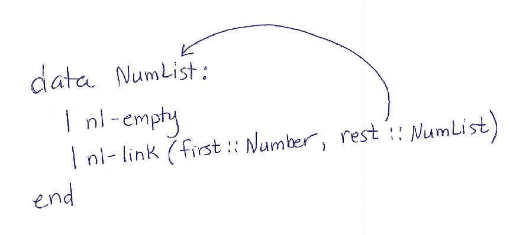

# 5.3 递归数据🔗

> 原文：[`dcic-world.org/2025-08-27/recursive-data.html`](https://dcic-world.org/2025-08-27/recursive-data.html)

|   5.3.1 处理递归数据的功能 |
| --- |
|   5.3.2 处理递归数据的模板 |
|   5.3.3 设计配方 |

在 Telling Apart Variants of Conditional Data 中，我们使用了`cases`来区分不同的条件数据形式。我们之前也使用过`cases`，具体来说，是在 Processing Lists 中区分空列表和非空列表。这表明列表也是一种条件数据形式，只是它是 Pyret 内置的。确实如此。

为了理解列表作为条件数据，让我们为一个新的类型`NumList`创建一个数据定义，它包含一个数字列表（这与内置列表不同，内置列表可以处理任何类型的元素）。为了避免与 Pyret 的内置`empty`值和`link`运算符冲突，我们将使用`nl-empty`作为`NumList`的空值，并使用`nl-link`作为构建新列表的运算符。下面是一个部分定义：

```py
data NumList:
  | nl-empty
  | nl-link( _________ )
end
```

> 现在行动！
> 
> > 在`nl-link`条件中填写相应的字段和类型。空白处可以包含从 0 到多个字段。

从之前处理列表的工作中，希望您还记得列表构造函数需要两个输入：列表的第一个元素和要构建的列表（列表的其余部分）。这表明我们在这里需要两个字段：

```py
data NumList:
  | nl-empty
  | nl-link(first :: _________, rest :: _________ )
end
```

> 现在行动！
> 
> > 如果您还没有填写，请填写`first`和`rest`的类型。

由于我们正在创建一个数字列表，`first`字段应包含类型`Number`。那么`rest`字段呢？它需要是一个数字列表，因此其类型应该是`NumList`。

```py
data NumList:
  | nl-empty
  | nl-link(first :: Number, rest :: NumList)
end
```

注意这里的一个有趣（且新颖）的现象：`rest`字段的类型与我们所定义的条件数据类型相同（`NumList`）。我们可以非常直观地画出表示定义中自引用部分的箭头：



这实际上可行吗？是的。想想我们如何构建一个包含数字 2、7 和 3（按此顺序）的列表。我们从一个有效的`NumList`开始，即`nl-empty`。然后我们使用`nl-link`将数字添加到该列表中，如下所示：

```py
nl-empty
nl-link(3, nl-empty)
nl-link(7, nl-link(3, nl-empty))
nl-link(2, nl-link(7, nl-link(3, nl-empty)))
```

在每种情况下，`rest`参数本身就是一个有效的`NumList`。虽然用自身定义数据可能看起来有问题，但实际上它运行良好，因为为了构建实际的数据，我们必须从`nl-empty`条件开始，它并不引用`NumList`。

建立在相同类型字段之上的数据定义称为递归数据。递归数据定义之所以强大，是因为它们允许我们创建无界或任意大小的数据。给定一个 `NumList`，有一个简单的方法可以创建一个新的更大的 `NumList`：只需使用 `nl-link`。因此，我们需要考虑更大的列表：

```py
nl-link(1,
  nl-link(2,
    nl-link(3,
      nl-link(4,
        nl-link(5,
          nl-link(6,
            nl-link(7,
              nl-link(8,
                nl-empty))))
```

#### 5.3.1 处理递归数据函数🔗 "链接到此处")

让我们尝试编写一个函数 `contains-3`，如果 `NumList` 包含值 `3`，则返回 `true`，否则返回 `false`。

首先，我们的标题：

```py
fun contains-3(nl :: NumList) -> Boolean:
  doc: "Produces true if the list contains 3, false otherwise"
end
```

接下来，一些测试：

```py
fun contains-3(nl :: NumList) -> Boolean:
  doc: "Produces true if the list contains 3, false otherwise"
where:
  contains-3(nl-empty) is false
  contains-3(nl-link(3, nl-empty)) is true
  contains-3(nl-link(1, nl-link(3, nl-empty))) is true
  contains-3(nl-link(1, nl-link(2, nl-link(3, nl-link(4, nl-empty))))) is true
  contains-3(nl-link(1, nl-link(2, nl-link(5, nl-link(4, nl-empty))))) is false
end
```

正如我们在 处理变体字段 中所做的那样，我们将使用 `cases` 来区分变体。此外，由于我们将在那种情况下使用 `nl-link` 的字段来计算结果，我们将在初始代码概要中列出这些字段：

```py
fun contains-3(nl :: NumList) -> Boolean:
  doc: "Produces true if the list contains 3, false otherwise"
  cases (NumList) nl:
    | nl-empty => ...
    | nl-link(first, rest) =>
      ... first ...
      ... rest ...
  end
end
```

按照我们的例子，在 `nl-empty` 的情况下答案必须是 `false`。在 `nl-link` 的情况下，如果 `first` 元素是 `3`，我们就成功地回答了问题。这只剩下一种情况，即参数是一个 `nl-link` 且第一个元素不等于 `3`：

```py
fun contains-3(nl :: NumList) -> Boolean:
  cases (NumList) nl:
    | nl-empty => false
    | nl-link(first, rest) =>
      if first == 3:
        true
      else:
        # handle rest here
      end
  end
end
```

由于我们知道 `rest` 是一个 `NumList`（基于数据定义），我们可以使用 `cases` 表达式来处理它。这有点像再次填写模板的一部分：

```py
fun contains-3(nl :: NumList) -> Boolean:
  cases (NumList) nl:
    | nl-empty => false
    | nl-link(first, rest) =>
      if first == 3:
        true
      else:
        cases (NumList) rest:
          | nl-empty => ...
          | nl-link(first-of-rest, rest-of-rest) =>
            ... first-of-rest ...
            ... rest-of-rest ...
        end
      end
  end
end
```

如果 `rest` 是空的，那么我们没有找到 `3`（就像当我们检查原始参数 `nl` 时一样）。如果 `rest` 是一个 `nl-link`，那么我们需要检查列表剩余部分的第一项是否是 `3`：

```py
fun contains-3(nl :: NumList) -> Boolean:
  cases (NumList) nl:
    | nl-empty => false
    | nl-link(first, rest) =>
      if first == 3:
        true
      else:
        cases (NumList) rest:
          | nl-empty => false
          | nl-link(first-of-rest, rest-of-rest) =>
            if first-of-rest == 3:
              true
            else:
              # fill in here ...
            end
        end
      end
  end
end
```

由于 `rest-of-rest` 是一个 `NumList`，我们可以再次为它填写一个 `cases`：

```py
fun contains-3(nl :: NumList) -> Boolean:
  cases (NumList) nl:
    | nl-empty => false
    | nl-link(first, rest) =>
      if first == 3:
        true
      else:
        cases (NumList) rest:
          | nl-empty => false
          | nl-link(first-of-rest, rest-of-rest) =>
            if first-of-rest == 3:
              true
            else:
              cases (NumList) rest-of-rest:
                | nl-empty => ...
                | nl-link(first-of-rest-of-rest, rest-of-rest-of-rest) =>
                  ... first-of-rest-of-rest ...
                  ... rest-of-rest-of-rest ...
              end
            end
        end
      end
  end
end
```

看看这会走向何方？并不是一个好地方。我们可以像复制 `cases` 表达式一样多次复制，但我们永远无法回答比我们复制代码次数多一个元素的列表的问题。

那我们该怎么办？我们尝试了基于观察 `rest` 是一个 `NumList`，并且 `cases` 提供了一种有意义的方式来分解 `NumList` 的方法，这种方法：实际上，这正是配方自然引导我们走向的方向。

让我们回到问题开始的地方，在用 `3` 的第一次检查填写模板之后：

```py
fun contains-3(nl :: NumList) -> Boolean:
  cases (NumList) nl:
    | nl-empty => false
    | nl-link(first, rest) =>
      if first == 3:
        true
      else:
        # what to do with rest?
      end
  end
end
```

我们需要一种方法来计算值 `3` 是否包含在 `rest` 中。回顾数据定义，我们看到 `rest` 是一个完全有效的 `NumList`，仅仅根据 `nl-link` 的定义。我们有一个函数（或者，大部分是）其任务是确定一个 `NumList` 是否包含 `3`：`contains-3`。这应该是我们可以用 `rest` 作为参数调用的东西，并得到我们想要的结果：

```py
fun contains-3(nl :: NumList) -> Boolean:
  cases (NumList) nl:
    | nl-empty => false
    | nl-link(first, rest) =>
      if first == 3:
        true
      else:
        contains-3(rest)
      end
  end
end
```

看看发生了什么，所有的测试都通过了。当这个函数被调用时，了解正在发生的事情是有用的。让我们看一个例子：

```py
contains-3(nl-link(1, nl-link(3, nl-empty)))
```

首先，我们将参数值替换到 `nl` 出现的所有地方；这只是函数调用的常规规则。

```py
=>  cases (NumList) nl-link(1, nl-link(3, nl-empty)):
       | nl-empty => false
       | nl-link(first, rest) =>
         if first == 3:
           true
         else:
           contains-3(rest)
         end
     end
```

接下来，我们找到与构造函数 `nl-link` 匹配的案例，并将 `nl-link` 值的相应部分替换为 `first` 和 `rest` 标识符。

```py
=>  if 1 == 3:
      true
    else:
      contains-3(nl-link(3, nl-empty))
    end
```

由于 `1` 不等于 `3`，比较评估为 `false`，整个表达式评估为 `else` 分支的内容。

```py
=>  if false:
      true
    else:
      contains-3(nl-link(3, nl-empty))
    end

=>  contains-3(nl-link(3, nl-empty))
```

这又是一个函数调用，所以我们这次将原始输入的 `rest` 字段 `nl-link(3, nl-empty)` 替换到 `contains-3` 的主体中。

```py
=>  cases (NumList) nl-link(3, nl-empty):
      | nl-empty => false
      | nl-link(first, rest) =>
        if first == 3:
          true
        else:
          contains-3(rest)
        end
    end
```

再次，我们将值替换到 `nl-link` 分支中。

```py
=>  if 3 == 3:
      true
    else:
      contains-3(nl-empty)
    end
```

这次，由于 `3` 等于 `3`，我们选择了 `if` 表达式的第一个分支，整个原始调用评估为 `true`。

```py
=>  if true:
      true
    else:
      contains-3(nl-empty)
    end

=> true
```

在这个评估过程中，一个有趣的特点是我们达到了表达式 `contains-3(nl-link(3, nl-empty))`，这是一个对 `contains-3` 的正常调用；它甚至可以作为一个独立的测试用例。实现方式是通过对数据的不递归部分进行某种操作（检查与 `3` 是否相等），并将该结果与对数据递归部分进行相同操作（`contains-3`）的结果相结合。这种在数据类型的自递归部分上使用相同函数进行递归的想法使我们能够扩展我们的模板以处理递归字段。

#### 5.3.2 处理递归数据的模板🔗 "链接到此处")

回顾一下，我们实际上推导出了一种新的方法来编写递归数据上的函数。在 处理列表 中，我们让你通过编写一系列相关示例，使用示例之间的替换来推导出一个调用列表其余部分的函数的程序来编写列表上的函数。在这里，我们是根据数据的形状推导出这种结构的。

尤其是我们可以通过将数据分解为其变体（使用 `cases`），提取每个变体的字段（通过列出字段名称），然后在任何递归字段（同类型的字段）上调用函数本身来开发一个递归数据上的函数。对于 `NumList`，这些步骤产生以下代码概要：

```py
#|
fun num-list-fun(nl :: NumList) -> ???:
  cases (NumList) nl:
    | nl-empty => ...
    | nl-link(first, rest) =>
      ... first ...
      ... num-list-fun(rest) ...
  end
end
|#
```

这里，我们使用一个通用函数名 `num-list-fun` 来说明这是处理 `NumList` 的任何函数的概要。

我们将这个代码概要称为模板。每个 `data` 定义都有一个相应的模板，它捕获了如何将定义的值分解为案例，提取字段，并使用相同的函数处理任何递归字段。

> 策略：为递归数据编写模板
> 
> > 给定一个递归数据定义，使用以下步骤创建该定义的（可重用）模板：
> > 
> > 1.  创建一个函数头（如果你还没有编写特定函数，可以使用通用占位符名称）。
> > 1.  
> > 1.  使用 `cases` 将递归数据输入分解为其变体。
> > 1.  
> > 1.  在每种情况下，列出其答案部分的每个字段。
> > 1.  
> > 1.  在任何递归字段上调用函数本身。

模板的力量在于其通用性。如果你被要求在递归数据（如`NumList`）上编写一个特定函数（例如`contains-3`），你可以复制或复制（如果你已经写下了它）模板，将模板中的通用函数名替换为你的特定函数，然后填写省略号以完成函数。

当你看到递归数据定义（在用 Pyret 编程时会有很多）时，你应该自然而然地开始思考递归调用将返回什么，以及如何将它们的结果与其他非递归的数据类型部分结合起来。

你现在已经看到了两种在递归数据上编写函数的方法：制定一系列相关示例和修改模板。这两种方法都能让你得到相同的最终函数。然而，模板的强大之处在于它能够扩展到更复杂的数据定义（手动编写示例可能会变得繁琐）。随着我们在接下来的章节中数据变得更加复杂，我们将看到这方面的例子。

#### 5.3.3 设计食谱🔗 "链接至此")

我们已经向你展示了在设计程序时可以使用许多技术，包括开发示例、编写测试，以及现在编写和使用数据模板。将这些部分组合起来，我们得到了一个设计食谱，它改编自[如何设计程序](https://htdp.org/)中的食谱，我们可以遵循它来设计递归函数。

> 策略：设计食谱
> 
> > 给定一个关于递归数据的编程问题：
> > 
> > 1.  创建一个函数头，包括函数名和契约。名称对于进行递归调用是必要的，而契约指导着主体的设计。
> > 1.  
> > 1.  在契约的帮助下，它告诉你应该消费和产生什么类型的数据，使用具体数据编写几个说明性的函数输入和输出示例。包括那些一个输入数据扩展另一个输入数据的示例。这将在你填充函数时有所帮助。
> > 1.  
> > 1.  函数的契约告诉你你正在处理什么类型的数据。从数据的定义中，为它编写一个模板。
> > 1.  
> > 1.  将此模板适应于该特定问题的计算需求。使用你的示例来确定如何填充每个案例。你应该为模板中的每个数据案例编写了一个示例。这也是编写扩展其他输入的示例有帮助的地方：输出之间的差异就是函数体。请参见处理列表中的几个此类示例。
> > 1.  
> > 1.  运行你的示例以确保你的函数表现如你所预期。
> > 1.  
> > 1.  现在开始编写更精细的测试来确认你应该对你的函数有信心。特别是，虽然示例（在你编写函数体之前编写）侧重于预期的“输入-输出”行为，但现在你有了具体的实现，你应该编写侧重于其细节的测试。
> > 1.  
> 练习
> 
> > 使用设计配方编写一个函数`contains-n`，该函数接受一个`NumList`和一个`Number`，并返回该数字是否在`NumList`中。
> > 
> 练习
> 
> > 使用设计配方编写一个函数`sum`，该函数接受一个`NumList`，并返回其中所有数字的总和。空列表的总和是`0`。
> > 
> 练习
> 
> > 使用设计配方编写一个函数`remove-3`，该函数接受一个`NumList`，并返回一个新`NumList`，其中任何`3`都被移除。剩余的元素应按输入中的相同顺序排列。
> > 
> 练习
> 
> > 编写一个名为`NumListList`的数据定义，表示`NumList`的列表，并使用设计配方编写一个函数`sum-of-lists`，该函数接受一个`NumListList`并生成一个包含子列表总和的`NumList`。
> > 
> 练习
> 
> > 编写一个名为`StrList`的数据定义及其相应的模板，以捕获字符串列表。

#### 5.3.1 处理递归数据函数🔗 "链接到此处")

让我们尝试编写一个函数`contains-3`，该函数返回`true`如果`NumList`包含值`3`，否则返回`false`。

首先，我们的标题：

```py
fun contains-3(nl :: NumList) -> Boolean:
  doc: "Produces true if the list contains 3, false otherwise"
end
```

接下来，进行一些测试：

```py
fun contains-3(nl :: NumList) -> Boolean:
  doc: "Produces true if the list contains 3, false otherwise"
where:
  contains-3(nl-empty) is false
  contains-3(nl-link(3, nl-empty)) is true
  contains-3(nl-link(1, nl-link(3, nl-empty))) is true
  contains-3(nl-link(1, nl-link(2, nl-link(3, nl-link(4, nl-empty))))) is true
  contains-3(nl-link(1, nl-link(2, nl-link(5, nl-link(4, nl-empty))))) is false
end
```

正如我们在处理变体字段中所做的那样，我们将使用`cases`来区分变体。此外，由于我们将在那种情况下使用`nl-link`的字段来计算结果，我们将在初始代码概要中列出这些字段：

```py
fun contains-3(nl :: NumList) -> Boolean:
  doc: "Produces true if the list contains 3, false otherwise"
  cases (NumList) nl:
    | nl-empty => ...
    | nl-link(first, rest) =>
      ... first ...
      ... rest ...
  end
end
```

按照我们的示例，`nl-empty`情况下的答案必须是错误的。在`nl-link`情况下，如果第一个元素是`3`，我们就成功回答了问题。只剩下一种情况，即参数是一个`nl-link`且第一个元素不等于`3`：

```py
fun contains-3(nl :: NumList) -> Boolean:
  cases (NumList) nl:
    | nl-empty => false
    | nl-link(first, rest) =>
      if first == 3:
        true
      else:
        # handle rest here
      end
  end
end
```

由于我们知道`rest`是一个`NumList`（基于数据定义），我们可以使用一个`cases`表达式来处理它。这有点像再次填写模板的一部分：

```py
fun contains-3(nl :: NumList) -> Boolean:
  cases (NumList) nl:
    | nl-empty => false
    | nl-link(first, rest) =>
      if first == 3:
        true
      else:
        cases (NumList) rest:
          | nl-empty => ...
          | nl-link(first-of-rest, rest-of-rest) =>
            ... first-of-rest ...
            ... rest-of-rest ...
        end
      end
  end
end
```

如果`rest`为空，那么我们没有找到`3`（就像当我们检查原始参数`nl`时一样）。如果`rest`是一个`nl-link`，那么我们需要检查列表剩余部分中的第一个元素是否是`3`：

```py
fun contains-3(nl :: NumList) -> Boolean:
  cases (NumList) nl:
    | nl-empty => false
    | nl-link(first, rest) =>
      if first == 3:
        true
      else:
        cases (NumList) rest:
          | nl-empty => false
          | nl-link(first-of-rest, rest-of-rest) =>
            if first-of-rest == 3:
              true
            else:
              # fill in here ...
            end
        end
      end
  end
end
```

由于`rest-of-rest`是一个`NumList`，我们可以再次为它填写一个`cases`：

```py
fun contains-3(nl :: NumList) -> Boolean:
  cases (NumList) nl:
    | nl-empty => false
    | nl-link(first, rest) =>
      if first == 3:
        true
      else:
        cases (NumList) rest:
          | nl-empty => false
          | nl-link(first-of-rest, rest-of-rest) =>
            if first-of-rest == 3:
              true
            else:
              cases (NumList) rest-of-rest:
                | nl-empty => ...
                | nl-link(first-of-rest-of-rest, rest-of-rest-of-rest) =>
                  ... first-of-rest-of-rest ...
                  ... rest-of-rest-of-rest ...
              end
            end
        end
      end
  end
end
```

看看这是要去哪里？根本不是什么好事。我们可以像我们想要的那样多次复制这个`cases`表达式，但我们永远无法回答比我们复制代码次数多一个元素的列表的问题。

那该怎么办呢？我们尝试了这种方法，即使用另一个基于观察的`cases`副本，观察发现`rest`是一个`NumList`，而`cases`提供了一种有意义的方式来分解一个`NumList`；实际上，这正是配方似乎自然引导的方向。

让我们回到问题开始的地方，在用第一个对`3`的检查填写模板之后：

```py
fun contains-3(nl :: NumList) -> Boolean:
  cases (NumList) nl:
    | nl-empty => false
    | nl-link(first, rest) =>
      if first == 3:
        true
      else:
        # what to do with rest?
      end
  end
end
```

我们需要一种方法来计算值`3`是否包含在`rest`中。回顾数据定义，我们看到`rest`是一个完全有效的`NumList`，仅通过`nl-link`的定义。我们有一个函数（或，大部分是）的职责是确定`NumList`是否包含`3`：`contains-3`。这应该是我们可以用`rest`作为参数调用的东西，并得到我们想要的价值：

```py
fun contains-3(nl :: NumList) -> Boolean:
  cases (NumList) nl:
    | nl-empty => false
    | nl-link(first, rest) =>
      if first == 3:
        true
      else:
        contains-3(rest)
      end
  end
end
```

看看，上面定义的所有测试都通过了。当这个函数被调用时，逐步查看发生的事情是有用的。让我们看看一个例子：

```py
contains-3(nl-link(1, nl-link(3, nl-empty)))
```

首先，我们将参数值替换到`nl`出现的所有地方；这只是函数调用的常规规则。

```py
=>  cases (NumList) nl-link(1, nl-link(3, nl-empty)):
       | nl-empty => false
       | nl-link(first, rest) =>
         if first == 3:
           true
         else:
           contains-3(rest)
         end
     end
```

接着，我们找到与构造函数`nl-link`匹配的情况，并将相应的`nl-link`值的部分替换到`first`和`rest`标识符。

```py
=>  if 1 == 3:
      true
    else:
      contains-3(nl-link(3, nl-empty))
    end
```

由于`1`不等于`3`，比较评估为`false`，整个表达式评估为`else`分支的内容。

```py
=>  if false:
      true
    else:
      contains-3(nl-link(3, nl-empty))
    end

=>  contains-3(nl-link(3, nl-empty))
```

这又是一个函数调用，所以我们这次将原始输入的`rest`字段值`nl-link(3, nl-empty)`代入`contains-3`的主体中。

```py
=>  cases (NumList) nl-link(3, nl-empty):
      | nl-empty => false
      | nl-link(first, rest) =>
        if first == 3:
          true
        else:
          contains-3(rest)
        end
    end
```

再次，我们将值代入`nl-link`分支。

```py
=>  if 3 == 3:
      true
    else:
      contains-3(nl-empty)
    end
```

这次，由于`3`等于`3`，我们取`if`表达式的第一个分支，整个原始调用评估为`true`。

```py
=>  if true:
      true
    else:
      contains-3(nl-empty)
    end

=> true
```

在这个评估过程中的一个有趣特点是，我们得到了表达式`contains-3(nl-link(3, nl-empty))`，这是一个对`contains-3`的正常调用；它甚至可以作为一个单独的测试用例。实现方式是通过对数据的不递归部分进行某种操作（检查与`3`是否相等），并将该结果与对数据递归部分进行相同操作（`contains-3`）的结果相结合。这种在数据类型的自递归部分上使用相同函数进行递归的想法，使我们能够扩展我们的模板来处理递归字段。

#### 5.3.2 处理递归数据的模板🔗 "链接到此处")

回顾一下，我们实际上推导出了一种新的方法来编写递归数据上的函数。在处理列表中，我们让你通过编写一系列相关示例来编写列表上的函数，使用示例之间的替换来推导出一个调用列表其余部分的函数的程序。在这里，我们是根据数据的形状推导出这种结构的。

特别是，我们可以通过将数据分解为其变体（使用`cases`），提取每个变体的字段（通过列出字段名称），然后在任何递归字段（同类型的字段）上调用函数本身来开发递归数据上的函数。对于`NumList`，这些步骤产生以下代码概要：

```py
#|
fun num-list-fun(nl :: NumList) -> ???:
  cases (NumList) nl:
    | nl-empty => ...
    | nl-link(first, rest) =>
      ... first ...
      ... num-list-fun(rest) ...
  end
end
|#
```

在这里，我们使用一个通用的函数名`num-list-fun`来说明，这是任何处理`NumList`的函数的概要。

我们将这个代码轮廓称为模板。每个 `data` 定义都有一个相应的模板，它捕捉了如何将定义的值分解为案例，提取字段，并使用相同的函数处理任何递归字段。

> 策略：为递归数据编写模板
> 
> > 给定一个递归数据定义，使用以下步骤为该定义创建（可重用的）模板：
> > 
> > 1.  创建一个函数头（如果你还没有编写特定的函数，可以使用通用占位符名称）。
> > 1.  
> > 1.  使用 `cases` 将递归数据输入分解为其变体。
> > 1.  
> > 1.  在每种情况下，列出其每个字段在案例的答案部分。
> > 1.  
> > 1.  在任何递归字段上调用函数本身。

模板的力量在于其通用性。如果你被要求编写一个特定的函数（例如 `contains-3`）来处理递归数据（`NumList`），你可以复制或复制（如果你已经写下了它）模板，将模板中的通用函数名称替换为你的特定函数，然后填写省略号来完成函数。

当你看到递归数据定义（在用 Pyret 编程时会有很多）时，你应该自然而然地开始思考递归调用将返回什么，以及如何将它们的结果与其他非递归的数据类型部分结合起来。

你现在已经看到了两种在递归数据上编写函数的方法：制定一系列相关示例和修改模板。这两种方法都会让你得到相同的最终函数。然而，模板的力量在于它可以扩展到更复杂的数据定义（手动编写示例可能会变得繁琐）。随着我们在接下来的章节中数据变得更加复杂，我们将看到这方面的例子。

#### 5.3.3 设计配方🔗 "链接到这里")

我们已经向您展示了在设计程序时可以使用的技术，包括开发示例、编写测试，以及现在编写和使用数据模板。将这些部分组合起来，可以得到一个设计配方，该配方是从 [How to Design Programs](https://htdp.org/) 中的配方改编而来，我们可以遵循它来设计递归函数。

> 策略：设计配方
> 
> > 给定一个关于递归数据的编程问题：
> > 
> > 1.  创建一个函数头，包括函数名称和契约。名称对于进行递归调用是必要的，而契约指导着函数体的设计。
> > 1.  
> > 1.  在契约的帮助下，契约告诉你需要消费和产生哪种类型的数据，使用具体数据编写几个函数输入和输出的说明性示例。包括一个示例，其中一个输入数据扩展了另一个输入数据。这将在以后帮助你填写函数。
> > 1.  
> > 1.  函数的契约告诉你正在处理哪种类型的数据。从数据的定义中，写出它的模板。
> > 1.  
> > 1.  将此模板适应于这个特定问题所需的计算。使用你的示例来确定如何填写每个案例。你应该为模板中的每个数据案例编写一个示例。这也是编写输入扩展其他案例的示例的地方：输出的差异成为函数主体。请参见处理列表中的几个示例。
> > 1.  
> > 1.  运行你的示例以确保你的函数表现如你所预期。
> > 1.  
> > 1.  现在开始编写更精细的测试来确认你应该对你的函数有信心。特别是，虽然示例（在你编写函数主体之前编写的）侧重于预期的“输入-输出”行为，但现在你有了具体的实现，你应该编写侧重于其细节的测试。
> > 1.  
> 练习
> 
> > 使用设计食谱编写一个名为`contains-n`的函数，它接受一个`NumList`和一个`Number`，并返回该数字是否在`NumList`中。
> > 
> 练习
> 
> > 使用设计食谱编写一个名为`sum`的函数，它接受一个`NumList`，并返回其中所有数字的总和。空列表的总和是`0`。
> > 
> 练习
> 
> > 使用设计食谱编写一个名为`remove-3`的函数，它接受一个`NumList`，并返回一个新`NumList`，其中任何`3`都被移除。剩余的元素应按其在输入中的相同顺序在列表中。
> > 
> 练习
> 
> > 编写一个名为`NumListList`的数据定义，它表示`NumList`的列表，并使用设计食谱编写一个名为`sum-of-lists`的函数，它接受一个`NumListList`并生成一个包含子列表总和的`NumList`。
> > 
> 练习
> 
> > 编写一个数据定义和相应的模板，用于`StrList`，它捕获字符串列表。
