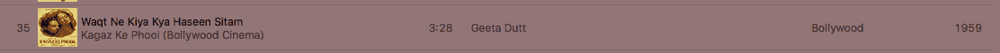

# 6.1 结构化数据简介🔗 "链接到此处")

> 原文：[`dcic-world.org/2025-08-27/intro-struct-data.html`](https://dcic-world.org/2025-08-27/intro-struct-data.html)

| 6.1.1 理解复合数据类型 |
| --- |
| 6.1.1.1 结构化数据的初步了解 |
| 6.1.1.2 条件数据的初步了解 |
| 6.1.2 定义和创建结构化和条件数据 |
| 6.1.2.1 定义和创建结构化数据 |
| 6.1.2.2 结构化数据的注释 |
| 6.1.2.3 定义和创建条件数据 |
| 6.1.3 使用结构化和条件数据进行编程 |
| 6.1.3.1 从结构化数据中提取字段 |
| 6.1.3.2 区分条件数据的变体 |
| 6.1.3.3 处理变体字段 |

之前我们看到了数据类型。到目前为止，我们只看到了 Pyret 为我们提供的类型，这是一个有趣但仍然相当有限的集合。我们编写的多数程序将包含更多种类的数据。

#### 6.1.1 理解复合数据类型🔗 "链接到此处")

##### 6.1.1.1 结构化数据的初步了解🔗 "链接到此处")

有时候一个数据集会有很多属性或部分。我们需要将它们全部保留在一起，有时也需要将它们拆分。例如：

+   一个 iTunes 条目包含关于一首歌曲的大量信息：不仅包括其名称，还包括歌手、时长、流派等。

    

+   您的 GMail 应用包含关于单个消息的大量信息：发件人、主题行、它所属的对话、正文以及更多。

    

在这样的例子中，我们看到结构化数据的必要性：单个数据集具有结构，即它实际上由许多部分组成。这些部分的数量是固定的，但可能属于不同的类型（一些可能是数字，一些是字符串，一些是图像，并且不同类型可能混合在一个数据集中）。甚至可能包含其他结构化数据：例如，日期通常至少包含三部分，即日、月和年。结构化数据集的部分被称为其字段。

##### 6.1.1.2 条件数据的初步了解🔗 "链接到此处")

然而有时我们想要在单一、集体的伞下表示不同类型的数据。这里有一些例子：

+   交通灯可以处于不同的状态：红色、黄色或绿色。是的，在一些国家，有不同或更多的颜色和颜色组合。总体来说，它们代表了一件事：一种新的类型，称为交通灯状态。

+   一个动物园由许多种类的动物组成。总体来说，它们代表了一件事：一种新的类型，即动物。某些条件决定了动物园管理员可能正在处理哪种特定的动物。

+   一个社交网络由不同种类的页面组成。一些页面代表个人，一些地方，一些组织，一些可能代表活动，等等。总体来说，它们代表了一种新的类型：社交媒体页面。

+   一个通知应用可能会报告许多种事件。其中一些是关于电子邮件消息的（正如我们之前讨论的，它们有许多字段），一些是关于提醒的（可能包含时间戳和备注），一些是关于即时消息的（类似于电子邮件消息，但没有主题），一些可能是关于通过实物邮件到达的包裹（包含时间戳、发货人、跟踪号和送货备注）。总体来说，这些都代表了一种新的类型：通知。

我们称这些为“条件”数据，因为它们代表了一个“或”：交通灯是红色、绿色或黄色；社交媒体的页面是为个人、地点或组织；等等。有时我们关心我们确切地正在看哪种类型的东西：驾驶员在不同颜色上的行为不同，动物园管理员对每种动物喂食的方式也不同。在其他时候，我们可能不关心：如果我们只是计算动物园中有多少动物，或者社交网络上有多少页面，或者我们有多少未读通知，它们的细节并不重要。因此，有时我们会忽略条件，将数据视为集体的一部分，而在其他时候，我们会关心条件，并根据个别数据执行不同的操作。当我们开始编写程序时，我们将使所有这些具体化。

#### 6.1.2 定义和创建结构化和条件数据🔗 "链接至此")

我们在上面使用了“数据”这个词，但实际上那有点误导。正如我们之前所说的，数据是我们如何在计算机中表示信息。我们上面讨论的实际上是不同类型的信息，而不是它们的确切表示方式。但为了编写程序，我们必须具体地处理表示方式。这就是我们现在要做的，即实际展示所有这些信息的表示形式。

##### 6.1.2.1 定义和创建结构化数据🔗 "链接至此")

让我们从定义结构化数据开始，比如 iTunes 歌曲记录。这里是一个这样的应用可能存储的信息的简化版本：

+   歌曲的名称，它是一个`String`。

+   歌曲的歌手，它也是一个 `String`。

+   歌曲的年份，它是一个 `Number`。

让我们现在介绍可以教 Pyret 的语法：

```py
data ITunesSong: song(name, singer, year) end
```

这告诉 Pyret 引入一种新的数据类型，在这种情况下称为 `ITunesSong`。我们遵循一个约定，即类型总是以大写字母开头。我们实际上通过调用 `song` 并传递三个参数来创建这些数据之一；例如：值得注意的是，能够区分例如 Dance、Electronica 和 Electronic/Dance 的音乐管理器会将这三首歌曲中的两首归为单一类型：“World”。

<structured-examples> ::=

```py
song("La Vie en Rose", "Édith Piaf", 1945)
song("Stressed Out", "twenty one pilots", 2015)
song("Waqt Ne Kiya Kya Haseen Sitam", "Geeta Dutt", 1959)
```

总是跟随一个数据定义，给出一些具体的数据实例！这确保了你实际上知道如何创建这种形式的数据。实际上，给定义的数据命名不是必需的，但养成一个好习惯，这样我们就可以在以后使用它们：

```py
lver = song("La Vie en Rose", "Édith Piaf", 1945)
so = song("Stressed Out", "twenty one pilots", 2015)
wnkkhs = song("Waqt Ne Kiya Kya Haseen Sitam", "Geeta Dutt", 1959)
```

在目录方面，结构化数据与简单数据并无不同。上述三个定义中的每一个都会在目录中创建一个条目，如下所示：

目录

+   ```py
    lver
    ```

    →

    ```py
    song("La Vie en Rose", "Édith Piaf", 1945)
    ```

+   ```py
    so
    ```

    →

    ```py
    song("Stressed Out", "twenty one pilots", 2015)
    ```

+   ```py
    wnkkhs
    ```

    →

    ```py
    song("Waqt Ne Kiya Kya Haseen Sitam","Geeta Dutt", 1959)
    ```

##### 6.1.2.2 结构化数据的注解🔗 "链接至此")

回想一下，在 [类型注解] 中，我们讨论了如何注解我们的函数。嗯，我们也可以注解我们的数据！特别是，我们可以注解数据的定义及其创建。对于前者，考虑以下数据定义，它将我们以前非正式记录在文本中的注解信息变成了程序的一个正式部分：

```py
data ITunesSong: song(name :: String, singer :: String, year :: Number) end
```

同样，我们可以注解绑定到数据示例的变量。但我们应该在这里写什么？

```py
lver :: ___ = song("La Vie en Rose", "Édith Piaf", 1945)
```

回想一下，注解接受类型的名称，而我们创建的新类型称为 `ITunesSong`。因此，我们应该写

```py
lver :: ITunesSong = song("La Vie en Rose", "Édith Piaf", 1945)
```

> 现在就做！
> 
> > 如果我们改写为这个样子会发生什么？
> > 
> > ```py
> > lver :: String = song("La Vie en Rose", "Édith Piaf", 1945)
> > ```
> > 
> > 我们会遇到什么错误？如果我们改写这些会怎样？
> > 
> > ```py
> > lver :: song = song("La Vie en Rose", "Édith Piaf", 1945)
> > lver :: 1 = song("La Vie en Rose", "Édith Piaf", 1945)
> > ```
> > 
> > 确保你熟悉你得到的错误信息。

##### 6.1.2.3 定义和创建条件数据🔗 "链接至此")

Pyret 中的 `data` 构造也允许我们使用略有不同的语法创建条件数据。例如，假设我们想定义交通灯的颜色：

```py
data TLColor:
  | Red
  | Yellow
  | Green
end
```

传统上，选项的名称以小写字母开头，但如果它们没有额外的结构，我们通常将首字母大写以使它们看起来与普通变量不同：即，`Red` 而不是 `red`。每个 `|`（发音为“stick”）引入另一个选项。您将制作交通灯颜色的实例，如下所示：

```py
Red
Green
Yellow
```

一个更有趣且更常见的例子是，当每个条件都有一些结构时；例如：

```py
data Animal:
  | boa(name :: String, length :: Number)
  | armadillo(name :: String, liveness :: Boolean)
end
```

“在德克萨斯州，路上除了黄色的条纹和一只死犰狳外，什么都没有。”——<wbr>吉姆·海特沃斯 我们可以像预期的那样制作它们的示例：

```py
b1 = boa("Ayisha", 10)
b2 = boa("Bonito", 8)
a1 = armadillo("Glypto", true)
```

我们称不同的条件为变体。

> 现在就做！
> 
> > 你会如何注解这三个变量绑定？

注意，在注释中， boa 和犰狳之间的区别消失了。

```py
b1 :: Animal = boa("Ayisha", 10)
b2 :: Animal = boa("Bonito", 8)
a1 :: Animal = armadillo("Glypto", true)
```

在定义条件数据时，第一根棒实际上是可选的，但添加它可以使变体整齐排列。这有助于我们意识到我们的第一个例子

```py
data ITunesSong: song(name, singer, year) end
```

实际上就是相同的

```py
data ITunesSong:
  | song(name, singer, year)
end
```

即，一个只有一个条件的条件类型，其中那个条件是结构化的。

#### 6.1.3 使用结构和条件数据进行编程🔗 "链接到这里")

到目前为止，我们已经学习了如何创建结构和条件数据，但还没有学习如何拆分它们或编写涉及它们的任何表达式。正如你所预期的，我们需要弄清楚如何

+   拆分结构化数据的字段，并且

+   区分条件数据的变体。

正如我们将看到的，Pyret 还为我们提供了一个方便的方式来一起做这两件事。

##### 6.1.3.1 从结构化数据中提取字段🔗 "链接到这里")

让我们编写一个函数，告诉我们一首歌的年龄。首先，让我们思考一下这个函数需要什么（一个`ITunesSong`）和产生什么（一个`Number`）。这为我们提供了函数的大致框架：

<song-age> ::=

```py
fun song-age(s :: ITunesSong) -> Number:
  <song-age-body>
end
```

我们知道身体的形式必须大致如下：

<song-age-body> ::=

```py
2016 - <get the song year>
```

我们可以通过使用 Pyret 的字段访问来获取歌曲年份，这是一个`.`后跟字段名称——<wbr>在这种情况下，`year`——<wbr>在持有结构化数据的变量之后。因此，我们通过以下方式获取`s`（`song-age`的参数）的`year`字段

```py
s.year
```

因此，整个函数体是：

```py
fun song-age(s :: ITunesSong) -> Number:
  2016 - s.year
end
```

记录一些例子（<structured-examples>)会很好，这为我们提供了函数的全面定义：

```py
fun song-age(s :: ITunesSong) -> Number:
  2016 - s.year
where:
  song-age(lver) is 71
  song-age(so) is 1
  song-age(wnkkhs) is 57
end
```

##### 6.1.3.2 区分条件数据的变体🔗 "链接到这里")

现在我们来看看我们如何区分变体。为此，我们再次使用`cases`，就像我们看到的列表一样。我们为每个变体创建一个分支。因此，如果我们想根据交通灯的状态为驾驶员提供建议，我们可能会写：

```py
fun advice(c :: TLColor) -> String:
  cases (TLColor) c:
    | Red => "wait!"
    | Yellow => "get ready..."
    | Green => "go!"
  end
end
```

> 现在就做！
> 
> > 如果你省略了`=>`会发生什么？
> > 
> 现在就做！
> 
> > 如果你省略了一个变体会怎样？省略`Red`变体，然后尝试`advice(Yellow)`和`advice(Red)`。

##### 6.1.3.3 处理变体的字段🔗 "链接到这里")

在这个例子中，变体没有字段。但如果变体有字段，Pyret 预期你会列出那些字段变量的名称，然后会自动绑定这些变量——<wbr>因此你不需要使用`.`-notation 来获取字段值。

为了说明这一点，假设我们想要获取任何动物的名称：

<animal-name> ::=

```py
fun animal-name(a :: Animal) -> String:
  <animal-name-body>
end
```

由于 `Animal` 是条件定义的，我们知道我们可能需要一个 `cases` 来将其拆分；此外，我们应该为每个字段命名：请注意，变量的名称不必与字段的名称匹配。传统上，我们给字段定义更长的、描述性的名称，给相应的变量较短的名称。

<animal-name-body> ::=

```py
cases (Animal) a:
  | boa(n, l) => ...
  | armadillo(n, l) => ...
end
```

在这两种情况下，我们希望返回字段 `n`，从而得到完整的函数：

```py
fun animal-name(a :: Animal) -> String:
  cases (Animal) a:
    | boa(n, l) => n
    | armadillo(n, l) => n
  end
where:
  animal-name(b1) is "Ayisha"
  animal-name(b2) is "Bonito"
  animal-name(a1) is "Glypto"
end
```

让我们看看 Pyret 如何评估像这样的函数调用

```py
animal-name(boa("Bonito", 8))
```

参数 `boa("Bonito", 8)` 是一个值。正如我们在评估函数时用字符串和数字等简单数据类型替换参数一样，我们在这里也做同样的事情。替换后，我们剩下以下表达式来评估：

```py
cases (Animal) boa("Bonito", 8):
  | boa(n, l) => n
  | armadillo(n, l) => n
end
```

接下来，Pyret 确定哪个情况与数据匹配（在这种情况下，对于 `boa`，是第一个）。然后，它将字段名称替换为匹配情况的对应数据结果表达式的组件。在这种情况下，我们将 `n` 的使用替换为 `"Bonito"`，将 `l` 的使用替换为 `8`。在这个程序中，整个结果表达式是 `n` 的使用，因此在这个情况下程序的结果是 `"Bonito"`。

#### 6.1.1 理解复合数据类型🔗 "链接至此")

##### 6.1.1.1 对结构化数据的初步了解🔗 "链接至此")

有时一个数据项具有许多属性或部分。我们需要将它们全部保留在一起，有时还需要将它们分开。例如：

+   一个 iTunes 条目包含关于一首歌曲的大量信息：不仅包括其名称，还有其演唱者、时长、流派等。

    

+   您的 Gmail 应用程序包含关于单个消息的大量信息：发件人、主题行、它所属的对话、正文以及更多。

    

在这样的例子中，我们看到对结构化数据的需要：单个数据项具有结构，即它实际上由许多部分组成。这些部分的数量是固定的，但可能属于不同的类型（一些可能是数字，一些是字符串，一些是图像，并且在一个数据项中可能混合了不同类型）。甚至可能包含其他结构化数据：例如，日期通常至少包含三部分，即日、月和年。结构化数据项的部分被称为其字段。

##### 6.1.1.2 对条件数据的初步了解🔗 "链接至此")

然而有时我们希望在一个单一的、集体的伞状结构下表示不同类型的数据。以下是一些例子：

+   交通灯可以处于不同的状态：红色、黄色或绿色。是的，在一些国家，有不同或更多的颜色和颜色组合。总的来说，它们代表了一个新类型：交通灯状态。

+   一个动物园由许多种类的动物组成。总的来说，它们代表了一个新类型：动物。某些条件决定了动物园管理员可能正在处理哪种特定的动物。

+   一个社交网络由不同类型的页面组成。有些页面代表个人，有些代表地点，有些代表组织，有些可能代表活动，等等。总的来说，它们代表了一个新类型：社交媒体页面。

+   通知应用程序可能会报告许多类型的事件。有些是关于电子邮件消息的（正如我们之前讨论的，它们有许多字段），有些是关于提醒的（可能包含时间戳和备注），有些是关于即时消息的（类似于电子邮件消息，但没有主题），有些甚至可能是关于通过实物邮件到达的包裹（包含时间戳、发货人、跟踪号和投递备注）。总的来说，这些都代表了一种新的类型：通知。

我们将这些称为“条件”数据，因为它们代表了一个“或”的关系：交通灯是红色、绿色还是黄色；社交媒体的页面是为个人、地点或组织而设；等等。有时我们关心我们正在查看的具体类型：驾驶员在不同颜色的交通灯下表现不同，动物园管理员对每种动物喂食的方式也不同。在其他时候，我们可能并不关心：如果我们只是在统计动物园里有多少动物，或者社交网络上有多少页面，或者有多少未读通知，它们的细节并不重要。因此，有时我们会忽略条件，将数据视为集体的一部分，而在其他时候，我们会关心条件，并根据个别数据执行不同的操作。当我们开始编写程序时，我们将具体说明这一切。

##### 6.1.1.1 首次了解结构化数据🔗 "链接到此处")

有时，一个数据项具有许多属性或部分。我们需要将它们全部保留在一起，有时需要将它们拆分。例如：

+   一个 iTunes 条目包含关于一首歌曲的大量信息：不仅包括其名称，还包括其歌手、时长、流派等。

    

+   您的 Gmail 应用程序包含关于一条消息的大量信息：其发件人、主题行、它所属的对话、正文，以及更多。

    

在这样的例子中，我们看到对结构化数据的需要：单个数据项具有结构，即它实际上由许多部分组成。这些部分的数量是固定的，但可能属于不同的类型（有些可能是数字，有些是字符串，有些是图像，并且不同类型可能混合在一个数据项中）。甚至可能包含其他结构化数据：例如，日期通常至少包含三部分，即日、月和年。结构化数据的部分被称为其字段。

##### 6.1.1.2 首次了解条件数据🔗 "链接到此处")

有时候，我们希望在一个单一的、集体的范畴下表示不同类型的数据。以下是一些例子：

+   交通灯可以处于不同的状态：红色、黄色或绿色。是的，在一些国家，有不同的颜色或颜色组合。总的来说，它们代表了一个新类型：交通灯状态。

+   一个动物园由许多种类的动物组成。总的来说，它们代表了一个新类型：动物。某些条件决定了管理员可能正在处理哪种特定的动物。

+   社交网络由不同类型的页面组成。有些页面代表个人，有些地方，有些组织，有些可能代表活动，等等。总的来说，它们代表了一个新类型：社交媒体页面。

+   通知应用程序可能会报告许多类型的事件。有些是关于电子邮件消息的（正如我们之前讨论的，它们有许多字段），有些是关于提醒的（可能包含时间戳和备注），有些是关于即时消息的（类似于电子邮件消息，但没有主题），有些甚至可能是关于通过实物邮件到达的包裹（包含时间戳、发货人、跟踪号和送货备注）。总的来说，这些都代表了一种新的类型：通知。

我们将这些称为“条件化”数据，因为它们代表了一个“或”：交通灯是红色、绿色或黄色；社交媒体页面是为个人、地点或组织而设；等等。有时我们关心我们正在查看的确切类型：驾驶员在不同颜色上的行为不同，动物园管理员对每种动物喂食的方式也不同。在其他时候，我们可能不关心：如果我们只是计算动物园中有多少动物，或者社交网络上有多少页面，或者我们有多少未读通知，它们的细节并不重要。因此，有时我们会忽略条件，将数据视为集体的一部分，而在其他时候，我们会关心条件，并根据个别数据执行不同的操作。当我们开始编写程序时，我们将使所有这些具体化。

#### 6.1.2 定义和创建结构化和条件化数据🔗 "链接至此")

我们上面使用了“数据”这个词，但实际上这有点误导。正如我们之前所说的，数据是我们如何在计算机中表示信息的方式。我们上面讨论的实际上是不同类型的信息，而不是它们的确切表示方式。但是为了编写程序，我们必须具体地处理这些表示。这就是我们现在要做的，即实际展示所有这些信息的表示形式。

##### 6.1.2.1 定义和创建结构化数据🔗 "链接至此")

让我们从定义结构化数据开始，例如 iTunes 歌曲记录。以下是一个这样的应用程序可能存储的信息的简化版本：

+   歌曲名称，这是一个`String`。

+   这首歌的歌手，它也是一个 `String`。

+   这首歌的年份，它是一个 `Number`。

现在我们介绍一种语法，通过它可以教 Pyret 如何实现这一点：

```py
data ITunesSong: song(name, singer, year) end
```

这告诉 Pyret 引入一种新的数据类型，在这种情况下称为 `ITunesSong`。我们遵循一个约定，即类型总是以大写字母开头。我们实际上通过用三个参数调用 `song` 来创建这些数据之一；例如：值得注意的是，能够区分例如 Dance、Electronica 和 Electronic/Dance 的音乐管理器会将这三首歌曲中的两首归类为单一类型：“World”。

<structured-examples> ::=

```py
song("La Vie en Rose", "Édith Piaf", 1945)
song("Stressed Out", "twenty one pilots", 2015)
song("Waqt Ne Kiya Kya Haseen Sitam", "Geeta Dutt", 1959)
```

总是在数据定义之后附上一些具体的数据实例！这确保了你实际上知道如何创建这种形式的数据。实际上，给定义的数据命名不是必需的，但养成一个好习惯，这样我们就可以在以后使用它们：

```py
lver = song("La Vie en Rose", "Édith Piaf", 1945)
so = song("Stressed Out", "twenty one pilots", 2015)
wnkkhs = song("Waqt Ne Kiya Kya Haseen Sitam", "Geeta Dutt", 1959)
```

在目录方面，结构化数据与简单数据没有区别。上述三个定义中的每一个都会在目录中创建一个条目，如下所示：

目录

+   ```py
    lver
    ```

    →

    ```py
    song("La Vie en Rose", "Édith Piaf", 1945)
    ```

+   ```py
    so
    ```

    →

    ```py
    song("Stressed Out", "twenty one pilots", 2015)
    ```

+   ```py
    wnkkhs
    ```

    →

    ```py
    song("Waqt Ne Kiya Kya Haseen Sitam","Geeta Dutt", 1959)
    ```

##### 6.1.2.2 结构化数据的注解🔗 "链接至此")

记得在 [类型注解] 我们讨论了为我们的函数添加注解。嗯，我们也可以为数据添加注解！特别是，我们可以注解数据的定义及其创建。对于前者，考虑以下数据定义，它将我们在文本中非正式记录的注解信息变成了程序的一个正式部分：

```py
data ITunesSong: song(name :: String, singer :: String, year :: Number) end
```

同样，我们可以注解绑定到数据示例的变量。但这里我们应该写什么？

```py
lver :: ___ = song("La Vie en Rose", "Édith Piaf", 1945)
```

记得注解接受类型名称，而我们创建的新类型称为 `ITunesSong`。因此，我们应该写

```py
lver :: ITunesSong = song("La Vie en Rose", "Édith Piaf", 1945)
```

> 现在就做！
> 
> > 如果我们改写为这样会怎样？
> > 
> > ```py
> > lver :: String = song("La Vie en Rose", "Édith Piaf", 1945)
> > ```
> > 
> > 我们会得到什么错误？如果我们改写为这些又会怎样？
> > 
> > ```py
> > lver :: song = song("La Vie en Rose", "Édith Piaf", 1945)
> > lver :: 1 = song("La Vie en Rose", "Édith Piaf", 1945)
> > ```
> > 
> > 确保你熟悉你得到的错误信息。

##### 6.1.2.3 定义和创建条件数据🔗 "链接至此")

Pyret 中的 `data` 构造也允许我们创建条件数据，语法略有不同。例如，如果我们想定义交通灯的颜色：

```py
data TLColor:
  | Red
  | Yellow
  | Green
end
```

按照惯例，选项的名称以小写字母开头，但如果它们没有额外的结构，我们通常将首字母大写以使它们看起来与普通变量不同：即 `Red` 而不是 `red`。每个 `|`（发音为“stick”）引入另一个选项。您将创建交通灯颜色的实例，如下所示：

```py
Red
Green
Yellow
```

一个更有趣且更常见的例子是，当每个条件都有一些结构时；例如：

```py
data Animal:
  | boa(name :: String, length :: Number)
  | armadillo(name :: String, liveness :: Boolean)
end
```

“在德克萨斯州，路上除了黄色的条纹和一只死甲壳虫外，什么都没有。”——吉姆·海特沃斯 我们可以按照预期的方式制作它们的例子：

```py
b1 = boa("Ayisha", 10)
b2 = boa("Bonito", 8)
a1 = armadillo("Glypto", true)
```

我们称不同的条件为变体。

> 现在就做！
> 
> > 你会如何注解这三个变量绑定？

注意，在注释中， boa 和犰狳之间的区别消失了。

```py
b1 :: Animal = boa("Ayisha", 10)
b2 :: Animal = boa("Bonito", 8)
a1 :: Animal = armadillo("Glypto", true)
```

当定义条件数据时，第一个 stick 实际上是可选的，但添加它可以使变体整齐排列。这有助于我们意识到我们的第一个例子

```py
data ITunesSong: song(name, singer, year) end
```

实际上只是与

```py
data ITunesSong:
  | song(name, singer, year)
end
```

即，一个只有一个条件的条件类型，其中该条件是结构化的。

##### 6.1.2.1 定义和创建结构化数据🔗 "链接至此")

让我们从定义结构化数据开始，例如一个 iTunes 歌曲记录。以下是一个此类应用程序可能存储的信息的简化版本：

+   歌曲的名称，它是一个 `String`。

+   歌曲的歌手，它也是一个 `String`。

+   歌曲的年份，它是一个 `Number`。

让我们现在介绍可以教 Pyret 的语法：

```py
data ITunesSong: song(name, singer, year) end
```

这告诉 Pyret 引入一种新的数据类型，在这种情况下称为 `ITunesSong`。我们遵循一个约定，即类型总是以大写字母开头。我们实际上通过调用 `song` 并传递三个参数来创建这些数据之一；例如：值得注意的是，能够区分例如 Dance、Electronica 和 Electronic/Dance 的音乐管理器会将这三首歌曲中的两首归类为单一类型：“World”。

<structured-examples> ::=

```py
song("La Vie en Rose", "Édith Piaf", 1945)
song("Stressed Out", "twenty one pilots", 2015)
song("Waqt Ne Kiya Kya Haseen Sitam", "Geeta Dutt", 1959)
```

总是跟随数据定义几个具体的数据实例！这确保你实际上知道如何创建这种形式的数据。实际上，给定义的数据命名不是必需的，但这是一个好习惯，这样我们就可以在以后使用它们：

```py
lver = song("La Vie en Rose", "Édith Piaf", 1945)
so = song("Stressed Out", "twenty one pilots", 2015)
wnkkhs = song("Waqt Ne Kiya Kya Haseen Sitam", "Geeta Dutt", 1959)
```

在目录方面，结构化数据与简单数据没有不同。上述三个定义中的每一个都在目录中创建一个条目，如下所示：

目录

+   ```py
    lver
    ```

    →

    ```py
    song("La Vie en Rose", "Édith Piaf", 1945)
    ```

+   ```py
    so
    ```

    →

    ```py
    song("Stressed Out", "twenty one pilots", 2015)
    ```

+   ```py
    wnkkhs
    ```

    →

    ```py
    song("Waqt Ne Kiya Kya Haseen Sitam","Geeta Dutt", 1959)
    ```

##### 6.1.2.2 结构化数据的注释🔗 "链接至此")

记得在 [类型注释] 中，我们讨论了注释我们的函数。嗯，我们也可以注释我们的数据！特别是，我们可以注释数据的定义和它们的创建。对于前者，考虑以下数据定义，它将我们以非正式文本形式记录的注释信息正式纳入程序的一部分：

```py
data ITunesSong: song(name :: String, singer :: String, year :: Number) end
```

同样，我们可以注释绑定到数据示例的变量。但我们应该在这里写什么？

```py
lver :: ___ = song("La Vie en Rose", "Édith Piaf", 1945)
```

记得注释接受类型名称，而我们创建的新类型称为 `ITunesSong`。因此，我们应该写

```py
lver :: ITunesSong = song("La Vie en Rose", "Édith Piaf", 1945)
```

> 现在行动！
> 
> > 如果我们改写为这样会怎样？
> > 
> > ```py
> > lver :: String = song("La Vie en Rose", "Édith Piaf", 1945)
> > ```
> > 
> > 我们会遇到什么错误？如果我们改写为这些又会怎样？
> > 
> > ```py
> > lver :: song = song("La Vie en Rose", "Édith Piaf", 1945)
> > lver :: 1 = song("La Vie en Rose", "Édith Piaf", 1945)
> > ```
> > 
> > 确保你熟悉你遇到的错误信息。

##### 6.1.2.3 定义和创建条件数据🔗 "链接至此")

Pyret 中的 `data` 构造也允许我们创建条件数据，语法略有不同。例如，假设我们想定义交通灯的颜色：

```py
data TLColor:
  | Red
  | Yellow
  | Green
end
```

按惯例，选项的名称以小写字母开头，但如果它们没有额外的结构，我们通常将首字母大写以使它们看起来与普通变量不同：即，`Red`而不是`red`。每个`|`（发音为“stick”）引入另一个选项。你可以创建交通灯颜色的实例

```py
Red
Green
Yellow
```

一个更有趣且更常见的例子是，每个条件都有一些结构；例如：

```py
data Animal:
  | boa(name :: String, length :: Number)
  | armadillo(name :: String, liveness :: Boolean)
end
```

“在德克萨斯州，路上除了黄色的条纹和一只死甲壳虫外，什么都没有。”—<wbr>吉姆·海特沃斯 我们可以按照预期的方式举例：

```py
b1 = boa("Ayisha", 10)
b2 = boa("Bonito", 8)
a1 = armadillo("Glypto", true)
```

我们称不同的条件为变体。

> 现在就做！
> 
> > 你会如何注释三个变量绑定？

注意，在注释中， boa 和 armadillo 之间的区别已经消失了。

```py
b1 :: Animal = boa("Ayisha", 10)
b2 :: Animal = boa("Bonito", 8)
a1 :: Animal = armadillo("Glypto", true)
```

当定义条件性数据时，第一个 stick 实际上是可选的，但添加它可以使变体整齐排列。这有助于我们意识到我们的第一个例子

```py
data ITunesSong: song(name, singer, year) end
```

实际上只是与

```py
data ITunesSong:
  | song(name, singer, year)
end
```

即，只有一个条件且该条件是结构化的条件类型。

#### 6.1.3 使用结构化和条件性数据进行编程🔗 "链接到此处")

到目前为止，我们已经学会了如何创建结构化和条件性数据，但还没有学会如何拆分它们或编写涉及它们的任何表达式。正如你所预期的那样，我们需要弄清楚如何

+   将结构化数据的字段拆分，并

+   区分条件性数据的变体。

正如我们将看到的，Pyret 还为我们提供了一个方便的方式来同时完成这两者。

##### 6.1.3.1 从结构化数据中提取字段🔗 "链接到此处")

让我们编写一个函数，告诉我们一首歌有多老。首先，让我们考虑函数需要什么（一个`ITunesSong`）和产生什么（一个`Number`）。这为我们提供了函数的大致框架：

<song-age> ::=

```py
fun song-age(s :: ITunesSong) -> Number:
  <song-age-body>
end
```

我们知道，主体的形式必须大致如下：

<song-age-body> ::=

```py
2016 - <get the song year>
```

我们可以通过使用 Pyret 的字段访问来获取歌曲年份，字段访问是一个`.`后跟字段名称—<wbr>在这种情况下，`year`—<wbr>在持有结构化数据的变量之后。因此，我们通过

```py
s.year
```

因此，整个函数体是：

```py
fun song-age(s :: ITunesSong) -> Number:
  2016 - s.year
end
```

记录一些例子（<structured-examples>)，给我们一个函数的全面定义：

```py
fun song-age(s :: ITunesSong) -> Number:
  2016 - s.year
where:
  song-age(lver) is 71
  song-age(so) is 1
  song-age(wnkkhs) is 57
end
```

##### 6.1.3.2 区分条件性数据的变体🔗 "链接到此处")

现在，让我们看看我们如何区分变体。为此，我们再次使用`cases`，就像我们为列表所做的那样。我们为每个变体创建一个分支。因此，如果我们想根据交通灯的状态为驾驶员计算建议，我们可能会写：

```py
fun advice(c :: TLColor) -> String:
  cases (TLColor) c:
    | Red => "wait!"
    | Yellow => "get ready..."
    | Green => "go!"
  end
end
```

> 现在就做！
> 
> > 如果你省略了`=>`会发生什么？
> > 
> 现在就做！
> 
> > 如果你省略了一个变体会怎样？省略`Red`变体，然后尝试`advice(Yellow)`和`advice(Red)`。

##### 6.1.3.3 处理变体的字段🔗 "链接至此")

在这个例子中，变体没有字段。但如果变体有字段，Pyret 预期你会列出这些字段的变量名称，然后它会自动绑定这些变量——因此你不需要使用 `.`-notation 来获取字段值。

为了说明这一点，假设我们想要获取任何动物的名字：

`<animal-name> ::=

```py
fun animal-name(a :: Animal) -> String:
  <animal-name-body>
end
```

由于 `Animal` 是条件定义的，我们知道我们可能需要一个 `cases` 来将其拆分；此外，我们应该为每个字段命名：请注意，变量的名称不必与字段的名称匹配。传统上，我们给字段定义使用较长的、描述性的名称，给相应的变量使用较短的名称。

`<animal-name-body> ::=

```py
cases (Animal) a:
  | boa(n, l) => ...
  | armadillo(n, l) => ...
end
```

在这两种情况下，我们想要返回字段 `n`，从而得到完整的函数：

```py
fun animal-name(a :: Animal) -> String:
  cases (Animal) a:
    | boa(n, l) => n
    | armadillo(n, l) => n
  end
where:
  animal-name(b1) is "Ayisha"
  animal-name(b2) is "Bonito"
  animal-name(a1) is "Glypto"
end
```

让我们看看 Pyret 如何评估一个函数调用，例如

```py
animal-name(boa("Bonito", 8))
```

参数 `boa("Bonito", 8)` 是一个值。就像我们在评估函数时用简单的数据类型（如字符串和数字）替换参数一样，我们在这里也做同样的事情。替换后，我们剩下以下表达式来评估：

```py
cases (Animal) boa("Bonito", 8):
  | boa(n, l) => n
  | armadillo(n, l) => n
end
```

接下来，Pyret 确定哪个情况与数据匹配（在这种情况下，对于 `boa`，是第一个）。然后，它将匹配情况的字段名称替换为数据结果表达式的相应组件。在这种情况下，我们将 `n` 的使用替换为 `"Bonito"`，将 `l` 的使用替换为 `8`。在这个程序中，整个结果表达式都是对 `n` 的使用，因此在这个情况下程序的输出结果是 `"Bonito"`。

##### 6.1.3.1 从结构化数据中提取字段🔗 "链接至此")

让我们编写一个函数，告诉我们一首歌有多老。首先，让我们考虑这个函数需要什么（一个 `ITunesSong`）和产生什么（一个 `Number`）。这为我们提供了函数的大致框架：

`<song-age> ::=

```py
fun song-age(s :: ITunesSong) -> Number:
  <song-age-body>
end
```

我们知道身体的形式必须大致如下：

`<song-age-body> ::=

```py
2016 - <get the song year>
```

我们可以通过使用 Pyret 的字段访问来获取歌曲年份，这是一个字段名称（在这种情况下为 `year`）后跟一个点（`.`）的语法，紧随包含结构化数据的变量。因此，我们可以通过以下方式获取 `s`（`song-age` 的参数）的 `year` 字段：

```py
s.year
```

因此，整个函数体如下：

```py
fun song-age(s :: ITunesSong) -> Number:
  2016 - s.year
end
```

这将是一个很好的做法，也记录一些例子 (<structured-examples>)，给我们一个函数的全面定义：

```py
fun song-age(s :: ITunesSong) -> Number:
  2016 - s.year
where:
  song-age(lver) is 71
  song-age(so) is 1
  song-age(wnkkhs) is 57
end
```

##### 6.1.3.2 区分条件数据的变体🔗 "链接至此")

现在，让我们看看我们如何区分变体。为此，我们再次使用 `cases`，就像我们之前在列表中看到的那样。我们为每个变体创建一个分支。因此，如果我们想要根据交通灯的状态为驾驶员提供建议，我们可能会编写：

```py
fun advice(c :: TLColor) -> String:
  cases (TLColor) c:
    | Red => "wait!"
    | Yellow => "get ready..."
    | Green => "go!"
  end
end
```

> 立刻行动！
> 
> > 如果你省略了 `=>` 会发生什么？
> > 
> 立刻行动！
> 
> > 如果你省略了一个变体怎么办？省略 `Red` 变体，然后尝试 `advice(Yellow)` 和 `advice(Red)`。

##### 6.1.3.3 处理变体的字段🔗 "链接到此处")

在这个例子中，变体没有字段。但如果变体有字段，Pyret 预期你会列出这些字段的变量名，然后会自动绑定这些变量——<wbr>因此你不需要使用 `.`-notation 来获取字段值。

为了说明这一点，假设我们想要获取任何动物的名字：

<animal-name> ::=

```py
fun animal-name(a :: Animal) -> String:
  <animal-name-body>
end
```

由于 `Animal` 是条件定义的，我们知道我们可能想要一个 `cases` 来将其拆分；此外，我们应该给每个字段命名：请注意，变量的名称不必与字段的名称匹配。传统上，我们给字段定义更长的、描述性的名称，给相应的变量较短的名称。

<animal-name-body> ::=

```py
cases (Animal) a:
  | boa(n, l) => ...
  | armadillo(n, l) => ...
end
```

在这两种情况下，我们希望返回字段 `n`，从而得到完整的函数：

```py
fun animal-name(a :: Animal) -> String:
  cases (Animal) a:
    | boa(n, l) => n
    | armadillo(n, l) => n
  end
where:
  animal-name(b1) is "Ayisha"
  animal-name(b2) is "Bonito"
  animal-name(a1) is "Glypto"
end
```

让我们看看 Pyret 如何评估一个像

```py
animal-name(boa("Bonito", 8))
```

参数 `boa("Bonito", 8)` 是一个值。就像我们在评估函数时用简单的数据类型（如字符串和数字）替换参数一样，我们在这里也做同样的事情。替换后，我们剩下以下表达式来评估：

```py
cases (Animal) boa("Bonito", 8):
  | boa(n, l) => n
  | armadillo(n, l) => n
end
```

接下来，Pyret 确定哪个情况与数据匹配（在这个例子中是 `boa` 的第一个情况）。然后，它将字段名替换为匹配情况的 datum 结果表达式的相应组件。在这种情况下，我们将 `n` 的使用替换为 `"Bonito"`，将 `l` 的使用替换为 `8`。在这个程序中，整个结果表达式是 `n` 的使用，所以这个情况下程序的结果是 `"Bonito"`。
