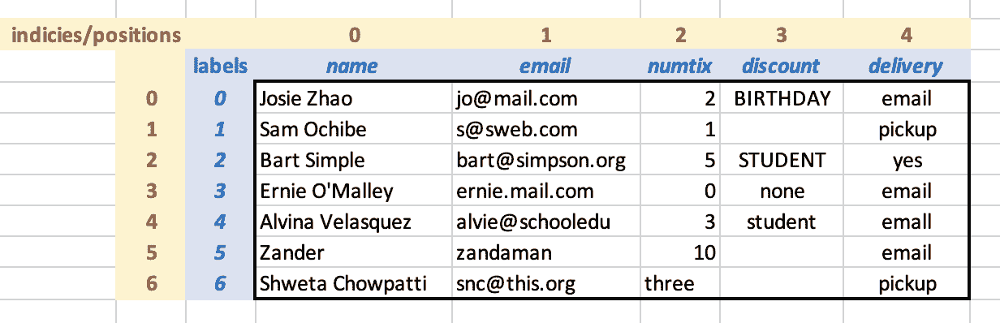
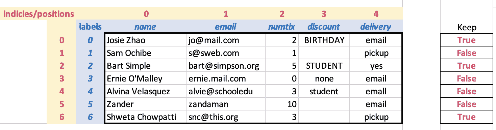
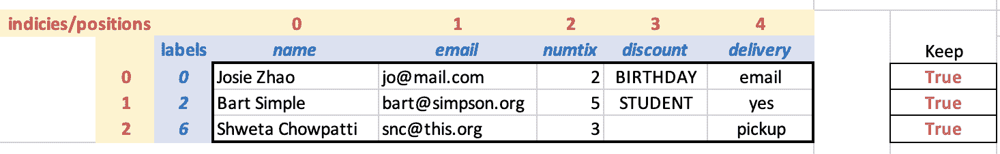
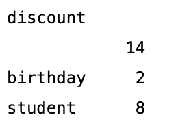
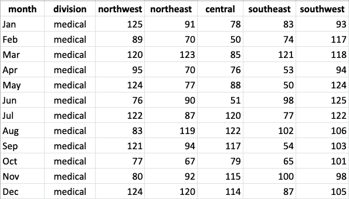
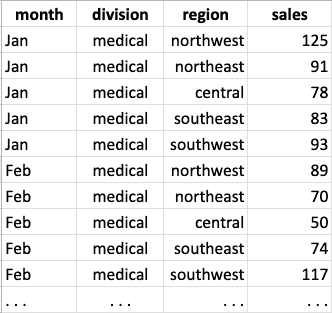
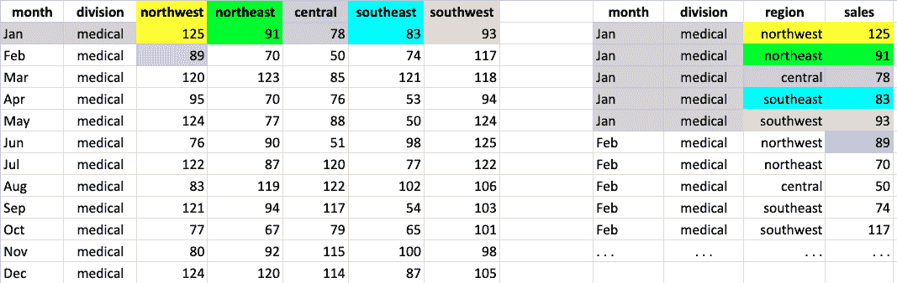

# 10.1 Pandas 简介

> 原文：[`dcic-world.org/2025-08-27/python-tables-Pandas.html`](https://dcic-world.org/2025-08-27/python-tables-Pandas.html)

|   10.1.1 Pandas 表基础 |
| --- |
|   10.1.1.1 核心数据类型：DataFrame 和 Series |
|   10.1.1.2 创建和加载数据帧 |
|   10.1.1.3 使用标签和索引访问单元格 |
|   10.1.2 过滤行 |
|   10.1.3 清理和规范化数据 |
|   10.1.3.1 清除未知值 |
|   10.1.3.2 修复值和列类型 |
|   10.1.4 计算新列 |
|   10.1.5 聚合和分组列 |
|   10.1.6 宽表与长表 |
|   在宽表和长表之间转换 |
|   10.1.7 数据绘图 |
|   10.1.8 要点 |

现在是时候将我们在 Pyret 中学到的关于表格的知识转移到 Python 上。Pandas 是一个流行的包，你可以在网上找到许多关于它的教程和帮助网站。一般来说，Python 通常提供多种方法来处理给定的任务。因此，在 Pandas 中执行常见操作有许多方法。我们选择展示一系列与我们在 Pyret 中介绍的概念相符的方法。

要在 Pandas 中工作，你需要在文件顶部包含以下行：

```py
import pandas as pd
```

#### 10.1.1 Pandas 表基础 "链接到此处")

##### 10.1.1.1 核心数据类型：DataFrame 和 Series "链接到此处")

Pandas 使用 DataFrame 术语来表示具有行和列的表。DataFrame 由两种更基本的数据类型构建：

+   数组是一系列可以通过位置访问的值（例如，0、1、... 直到数组长度减一）。像列表一样，数组捕获了一个线性（有序）的值集合。与列表不同，数组创建时对其包含的元素数量有限制。在实践中，当元素经常被添加或删除时，通常使用列表，而当元素经常通过其位置访问时，通常使用数组。几乎每种编程语言都提供列表和数组；详细的对比超出了本书的范围（这些信息将在数据结构课程中介绍）。

+   系列是一个数组，其位置除了位置数字外还可以有标签。

在 Pandas 中，行是一个带有列标题标签的值数组的 Series（这类似于 Pyret 中的‘Row’数据类型）。DataFrame 是这些行的序列。

##### 10.1.1.2 创建和加载 DataFrames "链接至此")

DataFrames 可以手动创建或从文件中加载，就像我们在 Pyret 中做的那样。以下是一个手动创建 DataFrame 的简单示例：

```py
data = {
    'day': ['mon','tues','wed','thurs','fri'],
    'max temp': [58, 62, 55, 59, 64]
}
temps = pd.DataFrame(data)
```

`data` 是一个将列名映射到值的字典。调用 `pd.DataFrame` 从字典中创建 DataFrame。（还有其他手动创建 DataFrame 的方法，您可以通过在线搜索找到它们。）

要从 CSV 文件加载 DataFrame，您需要计算机上文件的路径或可以在线获取 CSV 文件的 URL。以下是一个 URL 版本的示例。在这个例子中，我们有以下 CSV 内容，并且我们希望在加载文件时更改标题名称：

以下 `read_csv` 命令表示 CSV 文件位于 `url`，第一行有标题（编号为 `0`），并且我们希望使用 `names` 中的值作为列标签（这将忽略 CSV 文件标题行中可能存在的任何内容）。

```py
events_url = "https://raw.githubusercontent.com/data-centric-computing/dcic-public/main/materials/datasets/events.csv"
events = pd.read_csv(events_url, header=0,
                     names=['name','email','numtix','discount','delivery'])
```

如果我们想使用 CSV 文件中的标题作为列标题，我们将省略 `names=[...]` 部分。如果 CSV 没有标题行，我们将写 `header=None` 而不是 `header=0`。（Pandas 文档中有许多其他配置选项，例如 [Pandas 文档](https://Pandas.pydata.org/docs/reference/api/Pandas.read_csv.html)，但您不需要它们来处理本书中的示例。）

从概念上讲，加载的 DataFrame 如下所示，标签以蓝色显示，索引（位置）以黄色显示：



由于我们没有为行指定标签，Pandas 默认使用了数字标签。目前，每行的位置和标签是相同的，但我们会看到这并不总是如此。

（如果您查看实际加载的表格，折扣列中的一些空白单元格将包含 `NaN`，这是 Python 中“缺失信息”的标准值。我们将在稍后处理这些信息。）

##### 10.1.1.3 使用标签和索引访问单元格 "链接至此")

可以使用它们的（数字）位置或标签来访问行、列和单元格。以下是一些示例：

```py
events['numtix']         # extract the numtix column as a series
events['numtix'][2]      # get the value in the numtix column, row 2
events.loc[6]            # extract row with label 6 from the DataFrame
events.loc[6]['numtix']  # get the value in row with label 6, numtix column
events.iloc[6]           # extract the row with index/position 6
```

注意，我们根据是先访问行还是先访问列来使用不同的符号来访问单元格。这是因为我们正在向您展示如何通过位置索引或标签访问数据。使用 `.loc` 告诉 Pandas 您正在使用标签来访问行。如果您想使用位置，则需要使用 `iloc`（`i` 代表“整数”）。如果您正在使用程序员提供的标签，则可以直接使用该标签。

在 DataFrame 中，行和列始终都有位置索引，并且可能具有标签。`.loc`表示法适用于行或列，我们之所以在行上展示这个表示法，是因为我们在加载`events`时已经在列上创建了标签。

#### 10.1.2 过滤行 "链接至此")

在 Pyret 中，我们通过编写一个从`Row`到`Boolean`的函数来从表中过滤行。`filter-with`函数将此函数应用于表中的每一行，返回一个新表，其中包含那些谓词为真的行。

在 Pandas 中，我们通过提供一个与 DataFrame 行数相同的布尔数组来选择行。过滤会保留对应数组条目为`True`的行。例如，这是我们的 DataFrame 图示，这次在右侧有一个数组，表示我们想要保留行 0、2 和 6。



“保留”数组不是 DataFrame 的一部分。以下是相应的代码表示，随后是使用该数组来过滤 DataFrame 的表示法：

```py
# which rows we want
keep = [True, False, True, False, False, False, True]
```

一旦我们有了布尔数组，我们就使用它来提取一组行，使用与之前用于提取列相似的表示法。就像我们写`events['numtix']`来选择`'numtix'`列一样，我们可以写`events[keep]`来选择一组行。过滤后的 DataFrame（以及为了说明而显示的`keep`数组的`True`单元格）如下所示：



Pandas 如何知道我们是要选择行还是列？这取决于我们在方括号中提供了什么：如果我们提供一个标签，我们就得到具有该标签的列或行；如果我们提供一个布尔数组，我们就得到对应行（按位置）为`True`的行。

> 现在行动！
> 
> > 看看返回的 DataFrame。你注意到什么有趣的地方了吗？

看看行标签和索引：标签已从原始 DataFrame（0、2 和 6）保留，而索引是从 0 开始的连续数字序列。拥有这两种引用行的方式——基于原始顺序和基于程序员提供的标签——在我们使用过滤来隔离我们想要工作的表的部分时提供了很大的灵活性。

> 现在行动！
> 
> > 以这种方式在 Python 中过滤行是否会保持原始`events` DataFrame 的完整性？试一试！

用于过滤其他数组的布尔数组被称为掩码。在这里，我们展示了我们手动构建的一个简单掩码。然而，如果我们有一个很长的 DataFrame，我们就不想手动为它构建一个掩码。幸运的是，我们不必这样做。Python 提供了通过表达式构建掩码的符号。

假设我们想要将 `events` 表过滤到那些使用 `'email'` 交付方式的行。为此，我们首先将交付列作为一个序列选择：

```py
events['delivery']
```

接下来，我们在布尔表达式中使用序列，以表示我们想要对序列中每个元素施加的约束：

```py
events['delivery'] == 'email'
```

等等，这里发生了什么？`events['deliver']` 是一个序列（一个标记的字符串数组）。`'email'` 是一个字符串。询问两个不同类型的数据值是否相等有什么意义，尤其是当一个有多个组件值而另一个没有时？

在这种情况下，`==` 并不意味着“它们是否相等”？相反，Python 将 `== 'email'` 应用到 `events['delivery']` 序列的每个元素上，构建一个新的包含结果的序列。将操作应用于数组所有元素的这个想法被称为“提升”。这是 Python 提供给经验丰富的程序员快速轻松完成简单常见任务的快捷方式之一。

现在我们有一个布尔序列（表示哪些事件将通过电子邮件被选中），我们可以使用它来选择 `events` DataFrame 中的这些行：

```py
events[events['delivery'] == 'email']
```

内部使用 `events` 是为了创建掩码，而外部使用是为了使用该掩码过滤表格。

作为警告：如果你在网上搜索有关如何过滤或处理 DataFrame 的信息，你可能会找到使用 for 循环来完成此操作的代码示例。虽然这种方法可行，但并不被认为是好的 Pandas（或通用编程）实践。大多数现代语言都提供了遍历列表和其他序列式数据的内置构造。这些操作比通用循环有更具描述性的名称（这使得其他程序员更容易阅读），并且通常在底层运行得更高效。一般来说，只有在你没有内置运算符来完成你心中的计算时，才默认使用基本循环。

#### 10.1.3 清理和归一化数据 "链接到此处")

我们刚才在从 DataFrame 创建掩码时看到的相同的操作提升想法也适用于数据归一化。回想一下，当我们使用 Pyret 处理 `events` 表时，我们将所有折扣代码转换为小写。以下是 Pandas 中执行此操作的代码：

```py
events['discount'] = events['discount'].str.lower()
```

> 现在行动起来！
> 
> > 看看上面的代码。将其分解并尝试阐述每个部分的作用。是否有任何部分看起来是新的或者与我们在 Pandas 中之前所做的不一样？

在 `=` 的右侧，我们正在提取折扣代码的序列（`events['discount']`），然后使用字符串的 `str.lower()` 操作将每个元素转换为小写，构建一个包含结果的序列。通常，给定一个字符串（如 `'BIRTHDAY'`），我们可以通过简单地编写 `'BIRTHDAY'.lower()` 来获取其小写版本。那里额外的 `str` 是做什么的？

这是提升的一个细微差别。Python 可以评估 `'BIRTHDAY'.lower()`，因为 `lower()` 是直接定义在字符串上的。然而，`lower()` 并不是直接定义在 Series 上的。为了在拥有 Series 数据和想要对其执行字符串操作之间架起桥梁，我们在 `lower()` 前插入 `str`。实际上，这告诉 Python 在哪里可以找到 `lower()` 操作（在定义在字符串上的操作集合中）。

上述代码的左侧看起来像：

```py
events['discount'] = ...
```

这告诉 Pandas 将 `'discount'` 系列的当前内容替换为 `=` 右侧的系列。它与 Pyret 中的 `transform-column` 类似，但有一个基本区别：在 Pyret 中，`transform-column` 保留了旧表并生成了具有新列值的新表。相反，在 Pandas 中，旧列被替换，从而破坏了原始表。有许多关于操作破坏和替换数据的细微差别；关于修改结构的章节详细研究了这些。

##### 10.1.3.1 清除未知值 "链接到此处")

现在，让我们尝试一个不同的清理和归一化问题：我们希望折扣列只包含已知的折扣代码或空字符串。表格第 3 行的 `none` 条目应转换为空字符串，并且我们应该确保所有折扣单元格中的 `NaN` 和看似空白的条目也转换为空字符串（而不是多个空格的字符串）。

> 现在行动起来！
> 
> > 计划如何使用掩码表达式来完成这项任务。即使你不知道所需操作的所有特定符号，你仍然可以为完成这项任务制定一个计划。

如果你制定了任务计划，你可能有一个如下所示的任务清单：

1.  创建一个包含已知折扣代码的行的掩码

1.  反转该掩码（交换假值和真值）

1.  过滤掉具有已知折扣代码的行

1.  将该 DataFrame 中所有折扣列的值替换为空字符串

我们已经看到了如何完成步骤 1 和 3 的部分，但步骤 2 和 4 都没有完成。让我们一步一步地完成这些步骤：

这是步骤 1 的代码，它为具有已知折扣代码的行创建了一个掩码：

```py
codes = ['birthday', 'student']     # a list of valid codes
events['discount'].isin(codes)      # which rows have valid codes
```

在这里，我们使用提升的 `isin` 操作符在列表上计算掩码。

对于第二步，我们必须交换真值和假值。我们可以通过在第一步的掩码上使用否定运算符 `~` 来实现这一点：

```py
~events['discount'].isin(codes)
```

对于第三步，我们想要使用这个掩码来过滤 `events`。为了使代码更容易阅读，我们将给掩码起一个名字，然后执行过滤操作：

```py
mask = ~events['discount'].isin(codes)   # rows with INVALID codes
events[mask]
```

最后，我们使用 `=` 将过滤后的 DataFrame 的折扣列设置为空字符串：

```py
events[mask]['discount'] = ''
```

哎呀——这似乎生成了一个错误消息，说了一些关于“SettingWithCopyWarning”的事情。这是一个与数据在底层更新时发生的事情有关的微妙之处（我们将在可变列表中了解突变微妙之处）。现在，我们将使用这个避免错误的其他形式：

```py
events.loc[mask,'discount'] = ''
```

将所有这些放在一起，整个程序看起来如下：

```py
codes = ['birthday', 'student']
mask = ~events['discount'].isin(codes)
events.loc[mask]['discount'] = ''
```

总结，更新 DataFrame 中某些行列值的代码模式如下：

+   为要更新的行创建一个布尔序列掩码

+   使用掩码仅选择掩码为真的行

+   使用`.loc`和掩码以及列名来选择要更新的单元格序列

+   使用`=`为这些单元格赋予新值

> 练习
> 
> > 按照上述模式将所有交付值`'yes'`转换为`'pickup'`。

##### 10.1.3.2 修复值和列类型 "链接到这里")

`events`表源文件中存在一个错误，有人将字符串`'three'`输入到最后一行的票数`3`的位置。我们可以手动修复这样的错误：

```py
events.loc[6]['numtix'] = 3
```

> 现在就做！
> 
> > 进行此修复，并让您的 Python 环境显示已纠正的表格。

现在由于`'numtix'`列只包含数字，我们可以计算已售出的票数总数：

```py
events['numtix'].sum()
```

> 现在就做！
> 
> > 你得到了什么？为什么？

因为 Python 环境在没有引号的情况下打印字符串，所以`numtix`列看起来包含数字。`sum`失败表明这确实不是情况。我们可以使用`type`操作检查 Python 为`numtix`值确定的类型：

```py
type(events['numtix'].loc[0])  # prints str
type(events['numtix'].loc[6])  # prints int for the corrected value
```

发生了什么？在原始调用`read_csv`时，Python 检测到`numtix`列中既有数字也有字符串数据。因此，它将所有值都读入为字符串。我们手动修复，将字符串`'three'`替换为数字`3`，修复了一行的值和类型，但该列中剩余的值仍然被读入为整数。

幸运的是，Python 提供了一个操作来更改序列中数据的类型。以下代码将`events['numtix']`序列中的值转换为整数，并在过程中更新 DataFrame 中的序列。

```py
events['numtix'] = events['numtix'].astype('int')

events['numtix'].sum()    # now this works
```

#### 10.1.4 计算新列 "链接到这里")

让我们扩展事件表，包括票务的总成本，同时考虑折扣。我们将首先创建一个没有折扣的票价列。这是到目前为止我们所看到的提升应用的直接应用：

```py
ticket_price = 10
events['total'] = events['numtix'] * ticket_price
```

> 现在就做！
> 
> > 使用掩码、提升操作、过滤和序列更新，为拥有“生日”折扣代码的每个人提供 10%的折扣。

我们通过创建一个针对“生日”折扣的掩码，然后只更新 DataFrame 的这一部分来实现这一点。

```py
bday_mask = events['discount'] == 'birthday'
events.loc[bday_mask,'total'] = events['total'] * 0.90
```

注意，计算新列和更新现有列的符号是相同的（与 Pyret 不同，在 Pyret 中我们有不同的操作 `build-column` 和 `transform-column`）。在 Pandas 中，如果给定的列名在 DataFrame 中不存在，则创建新列；否则，将更新具有给定名称的现有列。

#### 10.1.5 聚合和分组列 "链接至此")

Pandas 为在序列上执行标准数学计算提供了内置操作。例如，为了计算销售的票数总数或计算每订单的平均票数，我们可以编写

```py
events['numtix'].sum()   # compute total number of tickets sold
events['numtix'].mean()  # compute average number of tickets per sale
```

这些是应用于 Python 列的内置操作。

假设我们现在想更细致地查看总票务销售情况。而不仅仅是整体销售总数，我们还想按折扣类别查看总销售数。

> 现在行动起来！
> 
> > 你会如何计算这个？

我们可以想象构建一个折扣代码列表，过滤票务销售表以针对每个代码，然后对每个过滤表使用 `sum`。然而，这感觉像是一项大量工作。在数据分析中，围绕另一个值（例如，```py ``numtix'' ```）的值（例如，```py ``discount'' ```）周围生成一个列的摘要（例如）是一种常见技术。电子表格通常提供一种称为“数据透视表”的功能，支持这种数据视图。

在 Pandas 中，我们可以使用一个名为 `groupby` 的操作来进行这样的计算。这里有两个例子。第一个报告了每个折扣代码的销售（行）数量，而第二个总结了按折扣代码销售的票数总数：

```py
events.groupby('discount').count()
events.groupby('discount')['numtix'].sum()
```

`groupby` 接收列名，该列的值将用于聚类行。它返回一种特殊类型的数据（称为 `GroupBy`）。从那里，我们可以选择一个列并对它进行操作。列选择和操作是在 `GroupBy` 的每一行集合上执行的。上述代码中第二个表达式的结果在新的 DataFrame 中报告：



在这个 DataFrame 中，折扣标记了一个列。第一行在折扣列中有一个空字符串，表示没有折扣代码购买了 14 张票。有 2 张票使用了生日折扣，8 张票使用了学生折扣。

Pandas 文档提供了一组可用于 `GroupBy` 数据的操作；这些包括计数、平均值、查找最大和最小值以及执行各种其他统计操作。

#### 10.1.6 宽数据与长数据 "链接至此")

让我们尝试在另一个数据集上对数据进行分组。以下是一个表格，显示了该年度每个月份在不同地区的销售数据：



将以下代码复制下来以加载此表格。

```py
import pandas as pd

sales_url = "https://raw.githubusercontent.com/data-centric-computing/dcic-public/main/materials/datasets/sales-wide.csv"
col_names = ['month','division','northwest','northeast','central','southeast','southwest']
sales = pd.read_csv(sales_url, header=0, names=col_names)
```

> 现在行动起来！
> 
> > 这里有一些我们可能想要从这个数据集中提出的问题。对于每个问题，制定一个计划，说明你会使用哪些 Pandas 操作来回答它。如果一个问题的回答似乎很难用你拥有的操作来完成，解释回答该问题困难的原因。
> > 
> > 1.  在哪个月份，西北地区的销售额最低？
> > 1.  
> > 1.  所有地区每月的总销售额是多少？
> > 1.  
> > 1.  哪个地区在 4 月份的销售额最高？
> > 1.  
> > 1.  哪个地区在全年中的销售额最高？

对于问题 1，我们可以按西北地区的销售额降序排序表格，然后查看第一行列出的月份。

```py
s = sales.sort_values('northwest',ascending=True)
s.iloc[0]['month']
```

> 现在进行时！
> 
> > 如果在上面的代码中使用`loc`而不是`iloc`，我们会得到什么值？
> > 
> 现在进行时！
> 
> > 排序“销售额”表是否永久改变了行顺序？通过运行`sort_values`后让 Python 显示`sales`的值来检查。

对于问题 2，我们可以创建一个新的列来存储每行的销售数据：

```py
# we use parens around the right side to break the expression across
# multiple lines, rather than extend past the window edge
sales['total'] = (sales['northwest'] + sales['northeast'] +
                  sales['central'] + sales['southeast'] +
                  sales['southwest'])
```

> 现在进行时！
> 
> > 计算总计列是否永久改变了行顺序？通过运行代码后让 Python 显示`sales`的值来检查。

（如果你想要删除新的“总计”列，可以使用`sales = sales.drop(columns='total')`来实现。）

问题 3 更具挑战性，因为我们想要根据地区进行排序，而这些地区位于列而不是行。问题 4 的挑战性更大，因为我们想要计算列的总和，然后比较地区。这两个问题都有些像我们可能知道如何解决的，如果行对应地区而不是月份，但我们的数据组织并不是这样。即使我们翻转了表格（我们可以这样做，这个术语叫做“转置”），在计算每个地区的年度销售额并对其进行排序之后，问题 4 仍然会感觉有些复杂。

如果我们的表格看起来像下面这样呢？问题 3 和 4 会变得容易一些吗？



以这种方式组织数据，问题 3 可以通过行选择和`sort_values`的组合来回答。问题 4 可以通过`groupby`轻松回答。甚至问题 2 的代码也变得更简洁。

这两个表格之间的对比突出了我们的数据组织方式可以决定使用像 Pandas 这样的表格处理包提供的标准操作来处理数据是容易还是困难（这里讨论的内容也适用于支持表格的其他语言，如 Pyret 和 R）。

通常，表处理包中的操作被设计为假设每行有一个核心观测值（关于这个观测值我们可能有多个较小的细节或属性），并且我们希望跨行而不是跨列聚合和显示数据。我们的原始数据将每个月视为一个观测值，地区是细节。对于关注月份的问题 1 和 2，内置操作足以处理表格。但对于关注地区或地区和月份组合的问题 3 和 4，将每个月和地区数据放在自己的行中会有所帮助。

像原始`sales`数据这样的表被称为宽表，而第二种形式被称为长表。在极端情况下，宽表中的每个变量都有自己的一列，而长表只有一个列用于感兴趣的单一值，每个变量都贡献了该值，每个变量都有一个单独的行。宽表通常更容易阅读；正如我们通过销售数据所看到的，长表在代码中处理起来可能更容易，这取决于我们的问题与变量的对齐方式。

##### 在宽表和长表之间转换 "链接到此处")

表处理包通常提供内置运算符，用于在宽表和长表数据格式之间进行转换。以下 Pandas 表达式将（原始的）宽格式`sales`表转换为长格式表，同时保留年份的月份和产品部门作为每个数据点的标签：

```py
sales.melt(id_vars=['month','division'])
```

这个基本的`melt`表达式使用默认的列名`variable`和`value`为新列命名。如果我们愿意，可以在`melt`调用中自定义这些名称：

```py
sales_tall = sales.melt(id_vars=['month','division'],var_name='region',value_name='sales')
```

让我们将宽表和长表并排放置，以可视化`melt`操作的效果。



在`id_vars`中命名的列保留在原始表中。对于不在`id_vars`中命名的每个列，都会创建一个包含`id_vars`列、熔化列名称和熔化列值的行。上图用颜色编码了宽表中的单元格如何在熔化后的长表中排列。

拿着长表，我们可以继续回答问题 3 和 4，以及重新解决问题 2：

```py
# Question 2: total sales per month across regions
sales_tall.groupby('region').sum()

# Question 3: which region had the highest sales in April
apr_by_region = sales_tall[sales_tall['month'] == 'Apr']
apr_by_region.sort_values('sales', ascending=False).iloc[0]['region']

# Question 4: which region had the highest sales for the year
tot_sales_region = sales_tall.groupby('region').sum()
tot_sales_region.sort_values('sales',ascending=False).reset_index().iloc[0]['region']
```

问题 4 的解决方案使用了新的 Pandas 运算符`reset_index`，如果你想要将`group-by`的输出作为常规 DataFrame 进行操作，则需要这个运算符。

#### 10.1.7 绘图数据 "链接到此处")

在我们探索 Pandas 中的绘图时，让我们继续使用销售数据。

假设我们现在想从季节性视角而不是月度视角来看，并查看季节内的销售情况。

假设我们想查看夏季销售随年份的变化情况。这是一个使用折线图的好情况。要创建这个图表，我们首先需要加载`matplotlib`，Python 的图形库：

```py
import matplotlib.pyplot as plt
from Pandas.plotting import register_matplotlib_converters
register_matplotlib_converters()
```

接下来，为了生成线形图，我们在构成图表上点的数字序列上调用 `plt.plot` 函数。我们还可以指定轴上的值，如下面的示例所示。

```py
# create a new canvas in which to make the plot
plt.figure()

# plot month column (x-axis) vs northeast sales (y-axis)
plt.plot(sales['month'],sales['northeast'])

# add central sales to the same plot
plt.plot(sales['central'])

# add labels to the y-axis and the chart overall
plt.ylabel('Monthly Sales')
plt.title('Comparing Regional Sales')

# show the plot
plt.show()
```

Pandas 将将两个线形图放在同一个显示窗口中。一般来说，每次你调用 `plt.figure()`，你都会创建一个新的窗口，后续的绘图命令将出现在该窗口中（至少直到你请求一个与先前绘图类型不很好地叠加的绘图）。

`matplotlib` 包提供了许多种类的图表和图形布局的定制。更全面的介绍超出了本书的范围；有关教程和更复杂图表的许多示例，请参阅 [matplotlib 网站](https://matplotlib.org/stable/index.html)。

#### 10.1.8 总结 "链接至此")

本章旨在为你提供一个 Pandas 的概述，同时指出数据科学编程中的关键概念。这绝对不是 Pandas 的全面教程或参考指南：对于这些，请参阅 [Pandas 网站](https://pandas.pydata.org/)。

从概念上讲，我们希望你能从本章中带走三个高级思想：

+   在表格和 DataFrame 中访问特定单元格有两种概念：通过数字位置（例如，第一行，第二列）或通过标签索引（例如，numtix）。两者在专业级数据分析编程中都扮演着各自的角色。类似过滤的操作从表格中提取行时保持标签索引，但重新编号位置索引（因此每个 DataFrame 都有一系列连续编号的行）。

+   专业级编程语言有时会“提升”操作从单个值到值的集合（例如，使用 `+` 在大小相似的序列中添加元素）。提升对于程序员来说可以是一个强大且节省时间的工具，但它们也可能导致新手和经验丰富的程序员产生类型混淆。当你学习新语言和包时，你应该意识到这个功能的存在。

+   对于相同的数据，不同的表格组织在不同的情境下更好。宽表和长表是两种常见的形状，每种形状都有自己的优势。你应该意识到，表格处理包提供了各种工具来帮助你自动重新格式化表格。如果你试图进行的计算感觉太复杂，请停止并考虑是否使用相同数据的不同组织方式会使问题更容易解决。

#### 10.1.1 Pandas 表基础 "链接至此")

##### 10.1.1.1 核心数据类型：DataFrame 和 Series "链接至此")

Pandas 使用 DataFrame 术语来表示具有行和列的表格。DataFrame 由两种更基本的数据类型构建：

+   数组是一系列可以通过位置访问的值（例如，0、1、... 直到数组长度减一）。像列表一样，数组捕获了一个线性（有序）的值集合。与列表不同，数组创建时对其包含的元素数量有限制。在实践中，当元素经常被添加或删除时，更常用列表；而当元素经常按位置访问时，更常用数组。几乎每种编程语言都提供了列表和数组；详细的对比超出了本书的范围（这些信息将在数据结构课程中介绍）。

+   Series 是一个数组，其位置除了位置数字外，还可以有可选的标签。

在 Pandas 中，一行是一个 Series，其中单元格值的数组被列标题标记（这与 Pyret 中的‘Row’数据类型类似）。DataFrame 是这些行的序列。

##### 10.1.1.2 创建和加载 DataFrame "链接至此")

DataFrame 可以手动创建或从文件加载，就像我们在 Pyret 中做的那样。以下是一个手动创建 DataFrame 的简单示例：

```py
data = {
    'day': ['mon','tues','wed','thurs','fri'],
    'max temp': [58, 62, 55, 59, 64]
}
temps = pd.DataFrame(data)
```

`data` 是一个将列名称映射到值的字典。调用 `pd.DataFrame` 从字典创建 DataFrame。（还有其他创建 DataFrame 的手动方法，你可以在网上搜索找到。）

要从 CSV 文件加载 DataFrame，你需要电脑上的文件路径或可以在线获取 CSV 文件的网址。以下是一个网址版本的示例。在这个例子中，我们有以下 CSV 内容，我们希望在加载文件时更改标题名称：

以下 `read_csv` 命令表示 CSV 文件位于 `url`，第一行有标题（编号为 `0`），并且我们希望使用 `names` 中的值作为列标签（这将忽略 CSV 文件标题行中可能存在的任何内容）。

```py
events_url = "https://raw.githubusercontent.com/data-centric-computing/dcic-public/main/materials/datasets/events.csv"
events = pd.read_csv(events_url, header=0,
                     names=['name','email','numtix','discount','delivery'])
```

如果我们想使用 CSV 文件中的标题作为列标题，我们可以省略 `names=[...]` 部分。如果 CSV 没有标题行，我们将写 `header=None` 而不是 `header=0`。（Pandas 文档中有许多其他配置选项，例如 [Pandas 文档](https://Pandas.pydata.org/docs/reference/api/Pandas.read_csv.html)，但你在本书的示例中不需要它们。）

从概念上讲，加载的 DataFrame 如下所示，标签以蓝色显示，索引（位置）以黄色显示：


由于我们没有为行指定标签，Pandas 默认使用了数字标签。目前，每行的位置和标签是相同的，但我们将看到这并不总是如此。

（如果你查看实际加载的表格，折扣列中的一些空白单元格将包含 `NaN`，这是 Python 中表示“缺失信息”的标准值。我们将在稍后处理这些信息。）

##### 10.1.1.3 使用标签和索引访问单元格 "链接到此处")

可以使用它们的（数字）位置或标签来访问行、列和单元格。以下是一些示例：

```py
events['numtix']         # extract the numtix column as a series
events['numtix'][2]      # get the value in the numtix column, row 2
events.loc[6]            # extract row with label 6 from the DataFrame
events.loc[6]['numtix']  # get the value in row with label 6, numtix column
events.iloc[6]           # extract the row with index/position 6
```

注意到，我们根据是先访问行还是先访问列来使用不同的符号来访问单元格。这是因为我们正在向您展示如何通过位置索引或标签来访问数据。使用 `.loc` 告诉 Pandas 您正在使用标签来访问行。如果您想使用位置，则需要使用 `iloc`（其中的 `i` 代表“整数”）。如果您使用的是程序员提供的标签，则可以直接使用该标签。

在 DataFrame 中，行和列始终都有位置索引，并且可能还有标签。`.loc` 符号适用于行或列，我们只是碰巧在行上说明了这个符号，因为我们已经在加载 `events` 时为列创建了标签。

##### 10.1.1.1 核心数据类型：DataFrame 和 Series "链接到此处")

Pandas 使用 DataFrame 术语来表示具有行和列的表格。DataFrame 由两种更基本的数据类型组成：

+   数组是一系列可以通过位置访问的值（例如，0、1、... 直到数组长度减一）。像列表一样，数组捕获了一个线性（有序）的值集合。与列表不同，数组创建时对其包含的元素数量有限制。在实践中，当元素经常被添加或删除时，更常用列表；而当元素经常按位置访问时，更常用数组。几乎每种编程语言都提供列表和数组；详细的对比超出了本书的范围（这些信息将在数据结构课程中介绍）。

+   Series 是一个数组，其位置除了位置数字外，还可以有标签。

在 Pandas 中，行是一个 Series，其中单元格值的数组被列标题标记（这与 Pyret 中的“Row”数据类型类似）。DataFrame 是这些行的序列。

##### 10.1.1.2 创建和加载 DataFrame "链接到此处")

DataFrame 可以手动创建或从文件中加载，就像我们在 Pyret 中做的那样。以下是一个手动创建 DataFrame 的简单示例：

```py
data = {
    'day': ['mon','tues','wed','thurs','fri'],
    'max temp': [58, 62, 55, 59, 64]
}
temps = pd.DataFrame(data)
```

`data` 是一个将列名映射到值的字典。调用 `pd.DataFrame` 从字典中创建 DataFrame。（还有其他创建 DataFrame 的方法，您可以通过在线搜索找到它们。）

要从 CSV 文件中加载 DataFrame，您需要您的计算机上的文件路径或可以在线获取 CSV 文件的 URL。以下是一个 URL 版本的示例。在这个例子中，我们有以下 CSV 内容，我们希望在加载文件时更改标题名称：

以下 `read_csv` 命令说明 CSV 文件位于 `url`，第一行有标题（编号为 `0`），并且我们希望使用 `names` 中的值作为列标签（这将忽略 CSV 文件标题行中可能存在的任何内容）。

```py
events_url = "https://raw.githubusercontent.com/data-centric-computing/dcic-public/main/materials/datasets/events.csv"
events = pd.read_csv(events_url, header=0,
                     names=['name','email','numtix','discount','delivery'])
```

如果我们想使用 CSV 文件中的标题作为列标题，我们将省略 `names=[...]` 部分。如果 CSV 没有标题行，我们将写 `header=None` 而不是 `header=0`。（在 [Pandas 文档](https://Pandas.pydata.org/docs/reference/api/Pandas.read_csv.html) 中有更多配置选项，但您不需要这些选项来处理本书中的示例。）

从概念上讲，加载的 DataFrame 如下所示，标签以蓝色显示，索引（位置）以黄色显示：


由于我们没有为行指定标签，Pandas 默认使用了数字标签。目前，每行的位置和标签是相同的，但我们将看到这并不总是如此。

（如果您查看实际加载的表格，折扣列中的一些空白单元格将包含 `NaN`，这是 Python 中“缺失信息”的标准值。我们将在稍后处理这些信息。）

##### 10.1.1.3 使用标签和索引访问单元格 "链接至此")

行、列和单元格可以通过它们的（数字）位置或标签来访问。以下是一些示例：

```py
events['numtix']         # extract the numtix column as a series
events['numtix'][2]      # get the value in the numtix column, row 2
events.loc[6]            # extract row with label 6 from the DataFrame
events.loc[6]['numtix']  # get the value in row with label 6, numtix column
events.iloc[6]           # extract the row with index/position 6
```

注意，我们根据是先访问行还是先访问列来使用不同的符号来访问单元格。这是因为我们正在向您展示如何通过位置索引或标签来访问数据。使用 `.loc` 告诉 Pandas 您正在使用标签来访问行。如果您想使用位置，则需要使用 `iloc`（`i` 代表“整数”）。如果您正在使用程序员提供的标签，则可以直接使用该标签。

在 DataFrame 中，行和列始终都有位置索引，并且可能具有标签。`.loc` 符号适用于行或列，我们只是碰巧在行上说明了这个符号，因为我们加载 `events` 时已经在列上创建了标签。

#### 10.1.2 过滤行 "链接至此")

在 Pyret 中，我们通过编写从 `Row` 到 `Boolean` 的函数来过滤表格中的行。`filter-with` 函数将该函数应用于表格中的每一行，返回一个新表格，其中包含那些谓词为真的行。

在 Pandas 中，我们通过提供一个与 DataFrame 中行数相同的布尔数组来选择行。过滤保留那些对应数组条目为 `True` 的行。例如，这是之前我们的 DataFrame 图表，这次右侧有一个数组表示我们希望保留行 0、2 和 6。


“保留”数组不是 DataFrame 的一部分。以下是相应的数组在代码中的表示，后面跟着使用该数组来过滤 DataFrame 的符号：

```py
# which rows we want
keep = [True, False, True, False, False, False, True]
```

一旦我们有了布尔数组，我们就使用它来提取一系列行，使用与之前用于提取列相似的符号。就像我们写 `events['numtix']` 来选择 `'numtix'` 列一样，我们可以写 `events[keep]` 来选择一系列行。过滤后的 DataFrame（以及 `keep` 数组的 `True` 单元用于说明）如下所示：


Pandas 如何知道我们想要选择行还是列？这取决于我们在方括号中提供了什么：如果我们提供一个单个标签，我们就得到具有该标签的列或行；如果我们提供一个布尔数组，我们就得到那些对应行（按位置）为 `True` 的行。

> 现在就做！
> 
> > 看看返回的 DataFrame。你注意到什么有趣的地方吗？

看看行标签和索引：标签已经保留自原始 DataFrame（0、2 和 6），而索引是从 0 开始的连续数字序列。拥有两种引用行的方式——基于原始顺序的一个和基于程序员提供的标签的一个——在我们使用过滤器隔离我们想要工作的表的部分时提供了很大的灵活性。

> 现在就做！
> 
> > 在 Python 中这样过滤行是否会保持原始的 `events` DataFrame 完整？试一试！

用于过滤其他数组的布尔数组被称为掩码。在这里，我们展示了我们手动构建的一个简单掩码。然而，如果我们有一个很长的 DataFrame，我们就不想手动构建一个掩码。幸运的是，我们不必这样做。Python 提供了通过序列上的表达式构建掩码的符号。

假设我们想要将 `events` 表过滤到那些使用 `'email'` 交付方式行的。为此，我们首先将交付列作为一个序列选择：

```py
events['delivery']
```

接下来，我们使用这个序列在布尔表达式中声明我们想要对序列中每个元素施加的约束：

```py
events['delivery'] == 'email'
```

等等，这里发生了什么？`events['deliver']` 是一个序列（一个标记的字符串数组）。`'email'` 是一个字符串。询问两个不同类型的值是否相等有什么意义，尤其是当其中一个有多个组件值而另一个没有时？

在这种情况下，`==` 并不意味着“它们相等”？相反，Python 将 `== 'email'` 应用到 `events['delivery']` 序列的每个元素上，构建一个新的结果序列。将操作应用于数组所有元素的想法被称为“提升”。这是 Python 提供的快捷方式之一，以帮助经验丰富的程序员快速轻松地完成简单常见任务。

现在我们有一个布尔值序列（用于通过电子邮件选择事件），我们可以用它来选择 `events` DataFrame 中的这些行：

```py
events[events['delivery'] == 'email']
```

内部的`events`用于创建掩码，而外部的`events`用于使用该掩码过滤表格。

作为警告：如果你在网上搜索有关如何过滤或处理 DataFrame 的信息，你可能会找到使用循环进行此操作的代码示例。虽然这种方法可行，但并不被认为是好的 Pandas（或通用编程）实践。大多数现代语言都提供了用于遍历列表和其他序列式数据的内置构造。这些操作具有比通用循环更具有描述性的名称（这使得其他程序员更容易阅读），并且通常在底层运行得更高效。一般来说，只有在你没有内置运算符来完成你心中的计算时，才默认使用基本循环。

#### 10.1.3 清理和归一化数据 "链接至此")

我们刚才在从 DataFrame 创建掩码时看到的相同的操作符提升想法也适用于数据归一化。回想一下，当我们使用 Pyret 中的`events`表时，我们将所有的折扣代码转换为小写。以下是 Pandas 中执行此操作的代码：

```py
events['discount'] = events['discount'].str.lower()
```

> 现在行动起来！
> 
> > 看看上面的代码。分解它并尝试阐述每个部分的作用。是否有任何部分看起来是新的或与我们在 Pandas 中迄今为止所做的东西不同？

在等号`=`的右侧，我们正在提取折扣代码的序列(`events['discount']`)，然后使用字符串的`str.lower()`小写操作将每个代码转换为小写，从而构建一个结果的序列。通常，给定一个字符串（例如`'BIRTHDAY'`），我们可以通过简单地编写`'BIRTHDAY'.lower()`来获取它的小写版本。那么，这里的额外`str`有什么作用呢？

这是一个提升的细微差别。Python 可以评估`'BIRTHDAY'.lower()`，因为`lower()`是在字符串上直接定义的。然而，`lower()`并不是在 Series 上直接定义的。为了在拥有 Series 数据和想要对其执行字符串操作之间架起桥梁，我们在`lower()`之前插入`str`。实际上，这告诉 Python 在哪里可以找到`lower()`操作（在定义在字符串上的操作集合中）。

上述代码的左侧看起来像：

```py
events['discount'] = ...
```

这告诉 Pandas 用等号右侧的序列替换`'discount'`序列的当前内容。这与 Pyret 中的`transform-column`类似，但有一个基本区别：在 Pyret 中，`transform-column`保留了旧表并生成了具有新列值的新表。相反，在 Pandas 中，旧列被替换，从而破坏了原始表。操作破坏和替换数据有许多细微差别；关于修改结构的章节详细研究了这些。

##### 10.1.3.1 清除未知值 "链接至此")

现在让我们尝试一个不同的清理和归一化问题：我们希望折扣列只包含已知的折扣代码或空字符串。表格第 3 行的`none`条目应转换为空字符串，并且我们应确保将所有折扣单元格中的`NaN`和看似空白的条目也转换为空字符串（而不是多个空格的字符串）。

> 现在行动！
> 
> > 计划如何使用掩码表达式来完成这项任务。即使你不知道所需操作的所有特定符号，你仍然可以制定一个完成任务的计划。

如果你已经规划了任务，你可能有一个如下所示的待办事项列表：

1.  创建一个包含已知折扣代码的行的掩码

1.  取消该掩码（交换假和真值）

1.  过滤掉具有已知折扣代码的行

1.  将该 DataFrame 中的所有折扣列值替换为空字符串

我们已经看到了如何执行步骤 1 和 3 的部分，但步骤 2 和 4 都没有执行。让我们一步一步地完成这些步骤：

这是步骤 1 的代码，它创建了一个包含已知折扣代码的行的掩码：

```py
codes = ['birthday', 'student']     # a list of valid codes
events['discount'].isin(codes)      # which rows have valid codes
```

这里，我们使用提升的`isin`运算符在列表上计算掩码。

对于步骤 2，我们必须交换真和假值。我们可以通过在步骤 1 的掩码上使用否定运算符`~`来完成此操作：

```py
~events['discount'].isin(codes)
```

对于第 3 步，我们希望使用这个掩码来过滤`事件`。为了使代码更容易阅读，我们将给掩码起一个名字，然后执行过滤操作：

```py
mask = ~events['discount'].isin(codes)   # rows with INVALID codes
events[mask]
```

最后，我们使用`=`来将过滤后的 DataFrame 的折扣列设置为空字符串：

```py
events[mask]['discount'] = ''
```

哎呀——这似乎生成了一个错误消息，提到了“SettingWithCopyWarning”。这是一个与数据在底层更新时发生的事情有关的微妙之处（我们将在可变列表中学习突变性的微妙之处）。现在，我们将使用这个避免错误的替代形式：

```py
events.loc[mask,'discount'] = ''
```

将所有这些放在一起，整个程序看起来如下：

```py
codes = ['birthday', 'student']
mask = ~events['discount'].isin(codes)
events.loc[mask]['discount'] = ''
```

总结，更新 DataFrame 中某些行列值的代码模式如下：

+   为要更新的行创建一个布尔系列掩码

+   使用掩码选择仅当掩码为真的行

+   使用`.loc`和掩码以及列名来选择要更新的单元格系列

+   使用`=`为这些单元格赋予新的值

> 练习
> 
> > 按照上述模式将所有`'yes'`的交付值转换为`'pickup'`。

##### 10.1.3.2 修复值和列类型 "链接到这里")

`events`表的源文件中存在一个错误，有人将字符串`'three'`错误地输入到最后一行的票数`3`的位置。我们可以手动修复这样的错误：

```py
events.loc[6]['numtix'] = 3
```

> 现在行动！
> 
> > 进行这次修复，并让 Python 环境显示修正后的表格。

现在，`'numtix'`列只包含数字，我们可以计算已售出的票数总和：

```py
events['numtix'].sum()
```

> 现在行动！
> 
> > 你得到了什么？为什么？

由于 Python 环境在打印字符串时不使用引号，因此看起来 numtix 列包含数字。`sum` 函数的失败表明这确实不是情况。我们可以使用 `type` 操作来检查 Python 为 numtix 值确定的类型：

```py
type(events['numtix'].loc[0])  # prints str
type(events['numtix'].loc[6])  # prints int for the corrected value
```

这里发生了什么？在原始调用 `read_csv` 时，Python 在 numtix 列中检测到数字和字符串数据。因此，它将所有值作为字符串读入。我们手动修复将字符串 `'three'` 替换为数字 `3` 的操作修复了一行的值和类型，但该列中剩余的值仍然被读入为整数。

幸运的是，Python 提供了一个操作来更改序列中的数据类型。以下代码将 `events['numtix']` 序列中的值转换为整数，并在过程中更新 DataFrame 中的序列。

```py
events['numtix'] = events['numtix'].astype('int')

events['numtix'].sum()    # now this works
```

##### 10.1.3.1 清除未知值 "链接至此")

现在让我们尝试一个不同的清理和归一化问题：我们希望折扣列只包含已知的折扣代码或空字符串。表格第 3 行的 `none` 条目应转换为空字符串，并且我们应确保折扣单元格中所有 `NaN` 和看似空白的条目也转换为空字符串（而不是多个空格的字符串）。

> 现在行动！
> 
> > 计划如何使用掩码表达式来完成此任务。即使你不知道所需操作的所有特定符号，你仍然可以制定一个完成此任务的计划。

如果你制定了任务计划，你可能会有以下待办事项列表：

1.  创建一个具有已知折扣代码的行的掩码

1.  逆转该掩码（交换假值和真值）

1.  过滤 DataFrame，以去除具有已知折扣代码的行

1.  将该 DataFrame 中所有折扣列的值替换为空字符串

我们已经看到了如何执行步骤 1 和 3 的部分，但步骤 2 和 4 都没有执行。让我们一步一步地完成这些步骤：

这是步骤 1 的代码，它为具有已知折扣代码的行创建了一个掩码：

```py
codes = ['birthday', 'student']     # a list of valid codes
events['discount'].isin(codes)      # which rows have valid codes
```

这里，我们使用提升的 `isin` 操作符在列表上计算掩码。

对于步骤 2，我们必须交换真值和假值。我们可以通过在步骤 1 的掩码上使用否定运算符 `~` 来实现这一点：

```py
~events['discount'].isin(codes)
```

对于步骤 3，我们想要使用这个掩码过滤 `events`。为了使代码更容易阅读，我们将给掩码起一个名字，然后执行过滤操作：

```py
mask = ~events['discount'].isin(codes)   # rows with INVALID codes
events[mask]
```

最后，我们使用 `=` 将过滤后的 DataFrame 的折扣列设置为空字符串：

```py
events[mask]['discount'] = ''
```

哎呀——这似乎生成了一个错误消息，提到了“SettingWithCopyWarning”。这是一个与底层数据更新时发生的事情有关的微妙之处（我们将在 可变列表 中了解突变微妙之处）。现在，我们将使用避免错误的其他形式：

```py
events.loc[mask,'discount'] = ''
```

将所有内容组合起来，整个程序看起来像这样：

```py
codes = ['birthday', 'student']
mask = ~events['discount'].isin(codes)
events.loc[mask]['discount'] = ''
```

总结，更新 DataFrame 中某些行的列值的代码模式如下：

+   为要更新的行创建一个布尔序列掩码

+   使用掩码选择仅当掩码为真的行

+   使用`.loc`和掩码以及列名来选择要更新的单元格序列

+   使用`=`为这些单元格赋予新的值

> 练习
> 
> > 按照上述模式将所有 `'yes'` 的配送值转换为 `'pickup'`。

##### 10.1.3.2 修复值和列类型 "链接至此")

`events`表的源文件中存在一个错误，有人在最后一行将字符串`'three'`输入代替了票数的数字`3`。我们可以手动修复此类错误：

```py
events.loc[6]['numtix'] = 3
```

> 立刻行动！
> 
> > 进行此修复并让您的 Python 环境显示修正后的表格。

现在，`'numtix'`列只包含数字，我们可以计算售出的票数总数：

```py
events['numtix'].sum()
```

> 立刻行动！
> 
> > 你得到了什么？为什么？

因为 Python 环境在打印字符串时不使用引号，所以`numtix`列看起来包含数字。`sum`操作失败表明这确实不是情况。我们可以使用`type`操作检查 Python 为`numtix`值确定的类型：

```py
type(events['numtix'].loc[0])  # prints str
type(events['numtix'].loc[6])  # prints int for the corrected value
```

这里发生了什么？在原始调用`read_csv`时，Python 检测到`numtix`列中既有数字也有字符串数据。因此，它将所有值都读入为字符串。我们手动修复将字符串`'three'`替换为数字`3`的操作修复了一个行的值和类型，但该列中剩余的值仍然被读入为整数。

幸运的是，Python 提供了一个操作来更改序列中的数据类型。以下代码将`events['numtix']`序列中的值转换为整数，并在过程中更新 DataFrame 中的序列。

```py
events['numtix'] = events['numtix'].astype('int')

events['numtix'].sum()    # now this works
```

#### 10.1.4 计算新列 "链接至此")

让我们通过添加票务总成本以及考虑折扣来扩展`events`表。我们将首先创建一个没有折扣的票价列，这是我们所见到的提升的直接应用：

```py
ticket_price = 10
events['total'] = events['numtix'] * ticket_price
```

> 立刻行动！
> 
> > 使用掩码、操作提升、过滤和序列更新，为拥有“生日折扣代码”的每个人提供 10%的折扣。

我们通过创建一个“生日折扣”的掩码，然后只更新 DataFrame 的这部分来实现这一点。

```py
bday_mask = events['discount'] == 'birthday'
events.loc[bday_mask,'total'] = events['total'] * 0.90
```

注意，计算新列和更新现有列的表示法是相同的（与 Pyret 不同，在 Pyret 中我们使用了不同的操作`build-column`和`transform-column`）。在 Pandas 中，如果给定的列名在 DataFrame 中不存在，则会创建一个新列；否则，将更新具有给定名称的现有列。

#### 10.1.5 聚合和分组列 "链接至此")

Pandas 具有用于在序列上执行标准数学计算的内置操作。例如，为了计算销售的总票数或计算每订单的平均票数，我们可以编写

```py
events['numtix'].sum()   # compute total number of tickets sold
events['numtix'].mean()  # compute average number of tickets per sale
```

这些是适用于 Python 列表的相同内置操作。

假设我们现在想要更细致地查看总票务销售额。而不仅仅是整体的总销售额，我们还想看到每个折扣类别的总销售额。

> 现在行动！
> 
> > 你会如何计算这个？

我们可以想象构建一个折扣代码列表，过滤票务销售表以每个代码，然后对每个过滤后的表使用`sum`。然而，这感觉像是一项大量工作。在数据分析中，围绕另一个值（例如```py ``discount'' ```）的值（例如```py ``numtix'' ```）周围生成一个列的摘要是一种常见技术。电子表格通常提供一种称为“数据透视表”的功能，它支持这种数据视图。

在 Pandas 中，我们可以使用一个名为`groupby`的操作来进行这样的计算。这里有两组示例。第一组报告了使用每个折扣代码的销售（行）数量，而第二组总结了按折扣代码销售的总票数：

```py
events.groupby('discount').count()
events.groupby('discount')['numtix'].sum()
```

`groupby`接受一个列名，该列的值将用于聚类行。它返回一种特殊类型的数据（称为`GroupBy`）。从那里，我们可以选择一个列并对它执行操作。列选择和操作在`GroupBy`中的每一行集合上执行。上述代码中第二个表达式的结果报告在一个新的 DataFrame 中：


在这个 DataFrame 中，折扣标签了一个列。第一行在折扣列中有一个空字符串，表示没有折扣代码购买了 14 张票。有 2 张票使用了生日折扣，8 张使用了学生折扣。

Pandas 文档提供了一大批可以在`GroupBy`数据上使用的操作；这些操作包括计数、求平均值、查找最大和最小值以及执行各种其他统计操作。

#### 10.1.6 宽数据与长数据 "链接至此")

让我们尝试在另一个数据集上对数据进行分组。以下是一个显示每年每月几个地区销售数据的表格：


复制以下代码以加载此表供自己使用。

```py
import pandas as pd

sales_url = "https://raw.githubusercontent.com/data-centric-computing/dcic-public/main/materials/datasets/sales-wide.csv"
col_names = ['month','division','northwest','northeast','central','southeast','southwest']
sales = pd.read_csv(sales_url, header=0, names=col_names)
```

> 现在行动！
> 
> > 这里有一些我们可能想要从这个数据集中提出的问题。对于每一个问题，制定一个计划，说明你会使用哪些 Pandas 操作来回答它。如果一个问题似乎使用你现有的操作难以回答，解释回答该问题困难的原因。
> > 
> > 1.  在哪个月份西北地区的销售额最低？
> > 1.  
> > 1.  所有地区按月总销售额是多少？
> > 1.  
> > 1.  哪个地区在 4 月份的销售额最高？
> > 1.  
> > 1.  哪个地区在全年销售额最高？

对于问题 1，我们可以按西北部的销售额降序对表格进行排序，然后查看第一行列出的月份。

```py
s = sales.sort_values('northwest',ascending=True)
s.iloc[0]['month']
```

> 现在行动！
> 
> > 如果在上面的代码中使用`loc`而不是`iloc`，我们会得到什么值？
> > 
> 现在行动！
> 
> > 排序`sales`表格是否永久改变了行顺序？通过运行`sort_values`后让 Python 显示`sales`的值来检查。

对于问题 2，我们可以构建一个新的列来存储每行的销售额数据：

```py
# we use parens around the right side to break the expression across
# multiple lines, rather than extend past the window edge
sales['total'] = (sales['northwest'] + sales['northeast'] +
                  sales['central'] + sales['southeast'] +
                  sales['southwest'])
```

> 现在行动！
> 
> > 计算总列是否永久改变了行顺序？通过运行代码后让 Python 显示`sales`的值来检查。

（如果你想要删除新的`total`列，可以使用`sales = sales.drop(columns='total')`。）

第 3 个问题更具挑战性，因为我们想要按地区排序，这些地区位于列而不是行。第 4 个问题更具挑战性，因为我们想要生成列的总和，然后比较地区。这两个问题都有些像我们可能知道如何解决的，如果行对应地区而不是月份，但我们的数据组织并不是这样。即使我们翻转了表格（我们可以这样做，这个术语是“转置”），在计算每个地区的年度销售额并对其进行排序后，问题 4 仍然会感觉有些复杂。

如果我们的表格看起来像以下这样，问题 3 和问题 4 会变得容易一些吗？


以这种方式组织数据后，问题 3 可以通过行选择和`sort_values`的组合来回答。问题 4 可以通过`groupby`轻松回答。甚至问题 2 的代码也变得更简洁。

这两个表格之间的对比突出了我们的数据组织方式可以决定使用表格处理软件包（如 Pandas）提供的标准操作处理数据的难易程度（这里讨论的内容也适用于支持表格的其他语言，如 Pyret 和 R）。

通常情况下，表格处理软件中的操作被设计为假设每行只有一个核心观测值（关于这个观测值我们可能有多个更小的细节或属性），并且我们希望跨行而不是跨列汇总和显示数据。我们的原始处理方法将每个月视为一个观测值，地区作为细节。对于第 1 和第 2 个问题，它们关注月份，内置操作足以处理表格。但对于第 3 和第 4 个问题，它们关注地区或地区和月份的组合，将每个月和地区数据放在各自的行中会有所帮助。

让我们将宽格式表和长格式表并排放置，以可视化 `melt` 的操作。

##### 

表处理软件通常提供内置运算符，用于在宽格式和长格式数据之间进行转换。以下 Pandas 表达式将（原始的）宽格式 `sales` 表转换为长格式表，同时保留年份的月份和产品部门作为每个数据点的标签：

```py
sales.melt(id_vars=['month','division'])
```

这个基本的 `melt` 表达式使用默认的列名 `variable` 和 `value` 为新列命名。如果我们愿意，可以在 `melt` 调用中自定义这些名称：

```py
sales_tall = sales.melt(id_vars=['month','division'],var_name='region',value_name='sales')
```

让我们将宽格式表和长格式表并排放置，以可视化 `melt` 的操作。

像原始 `sales` 数据这样的表被称为宽表，而第二种形式被称为长表。在极端情况下，宽表中的每个变量都有自己的一列，而长表只有一个列用于感兴趣的单一值，每个变量都贡献了一个单独的行。宽表通常更容易阅读；正如我们通过销售数据所看到的，长表在代码中可能更容易处理，这取决于我们的问题与变量的对齐方式。

在宽格式和长格式数据之间转换 "链接到此处")

拥有长格式表后，我们可以继续回答问题 3 和 4，以及重新解答问题 2：

```py
# Question 2: total sales per month across regions
sales_tall.groupby('region').sum()

# Question 3: which region had the highest sales in April
apr_by_region = sales_tall[sales_tall['month'] == 'Apr']
apr_by_region.sort_values('sales', ascending=False).iloc[0]['region']

# Question 4: which region had the highest sales for the year
tot_sales_region = sales_tall.groupby('region').sum()
tot_sales_region.sort_values('sales',ascending=False).reset_index().iloc[0]['region']
```

问题 4 的解决方案使用了 Pandas 的新运算符 `reset_index`，如果您想将 `group-by` 的输出作为常规 DataFrame 进行操作，则需要使用它。

##### 在宽格式和长格式数据之间转换 "链接到此处")

表处理软件通常提供内置运算符，用于在宽格式和长格式数据之间进行转换。以下 Pandas 表达式将（原始的）宽格式 `sales` 表转换为长格式表，同时保留年份的月份和产品部门作为每个数据点的标签：

```py
sales.melt(id_vars=['month','division'])
```

这个基本的 `melt` 表达式使用默认的列名 `variable` 和 `value` 为新列命名。如果我们愿意，可以在 `melt` 调用中自定义这些名称：

```py
sales_tall = sales.melt(id_vars=['month','division'],var_name='region',value_name='sales')
```

在 `id_vars` 中命名的列保持原表中的状态。对于不在 `id_vars` 中命名的每个列，将创建一个包含 `id_vars` 列、熔化列名称和 `id_vars` 的熔化列值的行。上图用颜色编码了宽表中的单元格如何在熔化后的长表中排列。


问题 4 的解决方案使用了 Pandas 的新运算符 `reset_index`，如果您想将 `group-by` 的输出作为常规 DataFrame 进行操作，则需要使用它。

拥有长格式表后，我们可以继续回答问题 3 和 4，以及重新解答问题 2：

```py
# Question 2: total sales per month across regions
sales_tall.groupby('region').sum()

# Question 3: which region had the highest sales in April
apr_by_region = sales_tall[sales_tall['month'] == 'Apr']
apr_by_region.sort_values('sales', ascending=False).iloc[0]['region']

# Question 4: which region had the highest sales for the year
tot_sales_region = sales_tall.groupby('region').sum()
tot_sales_region.sort_values('sales',ascending=False).reset_index().iloc[0]['region']
```

问题 4 的解决方案使用了 Pandas 中的一个新操作符 `reset_index`，如果你想要将 `group-by` 的输出作为一个常规 DataFrame 进行操作，这个操作符是必需的。

#### 10.1.7 绘制数据 "链接到此处")

让我们继续使用销售数据，在我们探索 Pandas 中的绘图时。

假设我们现在想从季节的角度而不是从月度的角度来查看，并查看季节内的销售情况。

假设我们想看看夏季销售随年份的变化情况。这是一个使用线形图的好情况。为了创建这个图表，我们首先需要加载 `matplotlib`，Python 的图形库：

```py
import matplotlib.pyplot as plt
from Pandas.plotting import register_matplotlib_converters
register_matplotlib_converters()
```

接下来，为了生成线形图，我们在想要在图上形成点的数值序列上调用 `plt.plot` 函数。我们还可以指定轴上的值，如下面的示例所示。

```py
# create a new canvas in which to make the plot
plt.figure()

# plot month column (x-axis) vs northeast sales (y-axis)
plt.plot(sales['month'],sales['northeast'])

# add central sales to the same plot
plt.plot(sales['central'])

# add labels to the y-axis and the chart overall
plt.ylabel('Monthly Sales')
plt.title('Comparing Regional Sales')

# show the plot
plt.show()
```

Pandas 会将两个线形图都放在同一个显示窗口中。一般来说，每次你调用 `plt.figure()`，你都会创建一个新的窗口，后续的绘图命令将出现在这个窗口中（至少直到你请求一个与之前绘图类型不完美叠加的绘图）。

`matplotlib` 包提供了许多种类的图表和图形布局的定制。更全面的介绍超出了本书的范围；有关教程和更复杂图表的许多示例，请参阅 [matplotlib 网站](https://matplotlib.org/stable/index.html)。

#### 10.1.8 总结 "链接到此处")

本章旨在为你提供一个 Pandas 的概览，同时指出数据科学编程中的关键概念。这绝对不是一本全面的 Pandas 教程或参考指南：对于这些，请参阅 [Pandas 网站](https://pandas.pydata.org/)。

从概念上讲，我们希望你能从这个章节中带走三个高级想法：

+   有两种方法可以访问表格和 DataFrame 中的特定单元格：通过数字位置（例如，第一行，第二列）或通过标签索引（例如，numtix）。两者在专业级别的数据分析编程中都有其作用。类似于过滤的操作可以提取表格中的行，但会保持标签索引，同时重新编号位置索引（因此每个 DataFrame 都有一个连续编号的行序列）。

+   专业级别的编程语言有时会从单个值“提升”到值的集合中的操作（例如，使用 `+` 来添加同样大小的序列中的元素）。提升对于程序员来说可以是一个强大且节省时间的工具，但它们也可能导致新手和经验丰富的程序员产生类型混淆。当你学习新的语言和包时，你应该意识到这个功能的存在。

+   不同的表格组织方式（针对相同的数据）在不同情况下表现更佳。宽表和长表是两种常见的形状，每种都有其自身的优势。你应该意识到，表格处理软件包提供了各种工具来帮助你自动重新格式化表格。如果你正在尝试的计算感觉过于复杂，请停下来考虑，是否使用相同数据的不同组织方式会使问题更容易解决。
