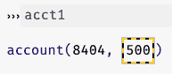

# 12.1 修改结构

> 原文：[`dcic-world.org/2025-08-27/mutating-structures.html`](https://dcic-world.org/2025-08-27/mutating-structures.html)

|     12.1.1 示例：银行账户 |
| --- |
| |   12.1.2 测试修改结构的函数 |
|     12.1.3 别名 |
|     12.1.4 结构修改和目录 |
|       12.1.4.1 堆的介绍 |
|       12.1.4.2 基本数据和堆 |

我们现在将研究一种新的数据类型及其伴随的编程风格。这将赋予我们巨大的力量和责任。我们将在 Pyret 和 Python 中发展这一想法，一方面因为核心概念在这两种语言（实际上在几乎所有语言中）中都会出现，另一方面因为它们的对比具有教育意义。

#### 12.1.1 示例：银行账户 "链接到此处")

想象一下，我们想要表示银行账户，每个账户都有一个（唯一的）id 号码和余额：

| Python | Pyret |
| --- | --- |


```py
@dataclass
class Account:
    id: int
    balance: float
```


```py
data Account:
    account(id :: Number,
    balance :: Number)
end
```


现在让我们创建一个账户：

| Python | Pyret |
| --- | --- |


```py
acct1 = Account(8404, 500)
```


```py
acct1 = account(8404, 500)
```


现在假设我们得知该账户刚刚赚了另外 200 元。我们可以始终按照以下方式反映结果账户：

| Python |  |
| --- | --- |
|  |

```py
Account(acct1.id, acct1.balance + 200)
```


| Pyret |  |
| --- | --- |
|  |

```py
account(acct1.id, acct1.balance + 200)
```


然而，这创建了一个新的账户；如果我们查看 `acct1` 的当前 `balance`，通过编写 `acct1.balance`，它仍然是 `500`。如果这是我们自己的账户，我们会非常难过！

而是我们想要更改现有账户的余额。这需要一种我们至今未遇到过的编程功能：可以更改的数据。这种数据被称为可变数据，我们将在下面探讨它们。相比之下，到目前为止，我们一直在处理不可变数据：无法更改的数据。

首先，我们必须声明数据可以更改。在 Python 中，这始终是自动的，所以没有任何变化。然而，在 Pyret 中，字段默认情况下不能更改——它们是不可变的——我们必须明确地说它们可以更改：

| Python | Pyret |
| --- | --- |


```py
@dataclass
class Account:
    id: int
    balance: float
```


```py
data Account:
    account(id :: Number,
      ref balance :: Number)
end
```


这个 Pyret 定义说明 `id` 不能被更改，而 `balance` 可以。这确保了没有程序员会意外地更改银行账户号码。在 Python 中，每个程序员都必须确保他们不会意外地更改它。（如果我们想在 Pyret 中使 `id` 可变，我们也会在其前面添加一个 `ref`。）

使用这个定义，创建账户看起来是一样的（在 Python 中不出所料，因为没有任何变化）：

| Python | Pyret |
| --- | --- |


```py
acct1 = Account(8404, 500)
```


```py
acct1 = account(8404, 500)
```


当我们在 Pyret 中查看账户时，我们会看到一些特别的东西：

> 

黄色和黑色的“警戒带”指示器是一个提醒，表示值可能会改变，因此屏幕上显示的值可能不是当前值。

在 Pyret 中访问不可变字段的方式保持不变：

| Python | Pyret |
| --- | --- |


```py
acct1.id
```


```py
acct1.id
```


然而，在 Pyret 中访问可变字段的方式不同：

| Python | Pyret |
| --- | --- |


```py
acct1.balance
```


```py
acct1!balance
```


`!` 存在是为了提醒你得到的是 `balance` 的当前值，它可能稍后会不同。Python 没有提供类似的语法警告，但再次提醒，每个字段始终是可变的。

因此，现在让我们看看如何更改账户余额。为了简单起见，让我们首先看看如何将账户余额设置为零。在两种语言中，我们使用稍微不同的语法来完成这个操作：

| Python | Pyret |
| --- | --- |
| `acct1.balance = 0` | `acct1!{balance: 0}` |

在 Pyret 中，再次使用 `!` 来表示语法中更改字段的操作：读作“立即更改值！”

> 现在行动起来！
> 
> > 你现在知道了所有你需要用来找出如何将 `balance` 设置为其先前值多 `200` 的部分。你能想出如何编写这个吗？

这就是我们将这些部分组合起来的方法——访问值然后设置它：

| Python |  |
| --- | --- |
|  | `acct1.balance = acct1.balance + 200` |
| Pyret |  |
|  | `acct1!{balance: acct1!balance + 200}` |

虽然 Pyret 的语法在更改单个字段值时可能稍微繁琐一些，但如果我们要更改多个字段，它就证明是更轻量级的。在 Python 中，我们不得不为每个字段编写 `acct1.`，而在 Pyret 中我们只需要一个 `acct1!`。因此，这两种语法之间存在权衡。

我们在上面还没有编写任何测试。假设我们已经编写了：我们可能已经注意到一些有点奇怪的事情。比如说，如果我们已经编写了

| Python | Pyret |
| --- | --- |


```py
def test_balance():
    assert acct1.balance == 500
```


```py
check:
  acct1!balance is 500
end
```


在我们执行更新之前，这会通过，但在更新执行之后会失败。在 Python 中，测试是在我们调用测试函数时运行的，我们通常在加载完整文件后这样做（通过在提示符中运行它们或在我们的测试中放入一个单独的文件）。

在 Pyret 中，测试就像它们被写在定义的底部一样运行。因此，即使程序在 Pyret 中看起来像这样：

```py
acct1 = account(8404, 500)

check:
  acct1!balance is 500
end

acct1!{balance: acct1!balance + 200}
```

测试失败。或者，我们可以这样写

```py
acct1 = account(8404, 500)

check:
  acct1!balance is 700
end

acct1!{balance: acct1!balance + 200}
```

它会通过，但如果我们注释掉更新，则不会通过。

在这两种语言中，我们看到了一个新现象：有时为真有时不为真的测试。这种现象被称为状态。有一个“状态”（定义名称的值的集合），其中余额是 `500`，另一个是 `700`。这不仅仅局限于测试！测试只是反映了程序运行时发生的事情。从现在开始，每个编程指令都将在一个状态中运行，其操作将取决于该状态中的其他值。如果这些值发生变化，相同的指令——即，相同的程序文本——可能会产生不同的答案。这使得编程变得更加困难，我们将不得不习惯随之而来的微妙之处。

#### 12.1.2 测试修改结构的函数 "链接到此处")

我们向账户添加资金的例子相当于向银行账户存款。让我们将我们的余额更新表达式转换成一个函数（命名为 `deposit`），该函数接受存款金额作为输入。然后，我们将查看如何为该函数编写测试。首先，函数定义如下：

| Python |  |
| --- | --- |
|  |

```py
def deposit(ac: Account, amt: float):
    '''add amt to the account's balance'''
    ac.balance = ac.balance + amt
```


| Pyret |  |
| --- | --- |
|  |

```py
fun deposit(ac :: Account, amt :: Number):
  doc: "add amt to the account's balance"
  ac!{balance: ac!balance + amt}
end
```


我们该如何测试这个？

在 Python 中，此函数不返回任何内容。在 Pyret 中，更新操作确实返回正在更新的值，但在更大的函数中，我们并不能总是假设它将返回该值。因此，我们必须设置我们的测试，假设情况并非如此。

通常，包含突变的函数的测试需要三到四个部分：

1.  设置：设置提供函数所需的价值。

1.  调用：调用函数。

1.  检查：检查函数是否具有期望的行为。

1.  清理：将数据恢复到预期状态。

| Python | Pyret |
| --- | --- |


```py
def test_deposit():
    # Setup
    a1 = Account(8200, 150)

    # Call
    deposit(a1, 100)

    # Check
    assert a1.balance == 250
```


```py
check:
  # Setup
  a1 = account(8200, 150)

  # Call
  deposit(a1, 100)

  # Check
  a1!balance is 250
end
```


在这种情况下，我们不需要执行清理步骤，因为我们只为测试函数创建了数据。但如果我们，例如，在一个值很重要的数据集上运行了测试，我们就需要恢复这些更改。

类似地，设置阶段需要确保所有数据都有正确的值。到目前为止，一旦创建，数据不会改变。但现在，数据可能已经被某些其他突变所更改，这可能会导致测试失败。因此，设置阶段不仅需要创建必要的数据，还需要将之前创建的数据的值设置为测试所期望的。 (再次提醒，在 Python 中，很难知道哪些字段可能已经被更改，而在 Pyret 中，我们只需要重置可变字段的值。)

> 练习
> 
> > 为以下添加利息到账户余额的函数编写测试：
> > 
> > | Python |  |
> > | --- | --- |
> > |  |
> > 
> > ```py
> > def add_interest(ac: Account):
> >     '''increases the account value by 2 percent'''
> >     ac.balance = ac.balance * 1.02
> > ```
> > 
> > |
> > 
> > | Pyret |  |
> > | --- | --- |
> > |  |
> > 
> > ```py
> > fun add-interest(ac :: Account):
> >   doc: "increases the account value by 2 percent"
> >   ac!{balance: ac!balance * 1.02}
> > end
> > ```
> > 
> > |

#### 12.1.3 别名 "链接到此处")

现在假设我们的银行允许多个客户共享账户。因此，我们应该将客户信息与账户信息分开：

| Python | Pyret |
| --- | --- |


```py
@dataclass
class Customer:
    name: str
    acct: Account
```


```py
data Customer:
    cust(name :: String,
      acct :: Account)
end
```


具体来说，假设我们有两个账户（`acct1` 和 `acct2`），其中 `acct1` 由 Elena 和 Jorge 共同拥有：

| Python | Pyret |
| --- | --- |


```py
acct1 = Account(8404, 500)
acct2 = Account(8405, 350)
elena = Customer("Elena", acct1)
jorge = Customer("Jorge", acct1)
```


```py
acct1 = account(8404, 500)
acct2 = account(8405, 350)
elena = cust("Elena", acct1)
jorge = cust("Jorge", acct1)
```


现在假设 Elena 获得了额外的 `150`。我们想要更新账户以反映这一点。我们该如何做？首先，我们必须访问账户本身：`elena.acct`（在两种语言中）。然后，我们会使用上述语法来更新它：

| Python | Pyret |
| --- | --- |


```py
a = elena.acct
a.balance = a.balance + 150
```


```py
a = elena.acct
a!{balance: a!balance + 150}
```


果然，Elena 的账户现在将具有 `850` 的值（原始的 `500`，奖金 `200`，现在额外的 `150`）：

| Python |  |
| --- | --- |
|  |

```py
assert elena.acct.balance == 850
```


| Pyret |  |
| --- | --- |
|  |

```py
check:
  elena.acct!balance is 850
end
```


注意，在 Pyret 中，我们使用 `.` 来获取账户，但使用 `!` 来获取余额：这是一个提醒，Elena 的账户永远不会改变（按照我们定义的数据结构），但账户的余额可能会改变，实际上确实如此。在 Python 和 Pyret 的设计之间，存在着便利性和精确性之间的权衡。

现在的关键问题是：豪尔赫的余额是多少？换句话说，这个测试会通过还是失败？

| Python |  |
| --- | --- |
|  |

```py
assert jorge.acct.balance == 850
```


| Pyret |  |
| --- | --- |
|  |

```py
check:
  jorge.acct!balance is 850
end
```


或者更简单地说：这个程序的价值是什么？

| Python | Pyret |
| --- | --- |


```py
jorge.acct.balance
```


```py
jorge.acct!balance
```


这里有两个非常合理的答案：

1.  根据我们的文本，豪尔赫的账户也应该有`850`，因为“共享”账户的含义就是如此。

1.  根据可见的代码，豪尔赫的账户仍然应该有`700`，因为更新是通过`elena.acct`而不是`jorge.acct`进行的。

> 现在行动！
> 
> > 运行上面的代码并查看你得到的结果。

你会发现上述测试通过了：豪尔赫的账户也有`850`。我们说`elena.acct`和`jorge.acct`是别名：它们是同一数据的两个不同的“名称”。

这并不是我们第一次遇到共享数据。然而，直到现在，数据被别名化并没有关系。但现在我们有突变，别名很重要：`jorge.acct`中的余额已经改变，尽管我们从未使用该名称进行显式更改。这就像`elena.acct`展示了超距作用。

再次，这里存在一个语言上的差异。因为所有字段在 Python 中都是可变的，你必须始终保持警惕。因为在 Pyret 中只有`ref`字段是可变的，你可以确信通过`.`访问的字段其值在时间上不会改变，即使有别名也是如此，但通过`!`访问的字段可能会随时间改变（以及通过别名）。

#### 12.1.4 结构突变和目录 "链接到这里")

现在我们有了修改数据内容的能力，我们需要展示并修改我们对目录的理解。Pyret 和 Python 之间的目录基本上是相同的，只有一个例外：我们在两种语言中有不同的命名约定。例如，我们在 Python 中写`Account(8404, 500)`，而在 Pyret 中写`account(8404, 500)`。写这些两次会很烦人，唯一的区别就是大小写。因此，只有在命名上有区别的地方，我们将忽略这种区别，只展示一个版本（在这种情况下，Python 版本）；你应该假设 Pyret 中除了大小写之外，完全相同。

作为提醒，这里再次列出我们的初始定义：

```py
acct1 = Account(8404, 500)
acct2 = Account(8405, 325)
elena = Customer("Elena", acct1)
jorge = Customer("Jorge", acct1)
```

> 现在行动！
> 
> > 在运行初始定义之后，请审查以下目录内容的提案。这是你期望看到的吗？
> > 
> > 目录
> > 
> > +   ```py
> >     acct1
> >     ```
> > +   
> >     →
> >     
> >     ```py
> >     Account(8404, 500)
> >     ```
> >     
> > +   ```py
> >     acct2
> >     ```
> > +   
> >     →
> >     
> >     ```py
> >     Account(8404, 500)
> >     ```
> >     
> > +   ```py
> >     elena
> >     ```
> > +   
> >     →
> >     
> >     ```py
> >     Customer("Elena", acct1)
> >     ```
> >     
> > +   ```py
> >     jorge
> >     ```
> > +   
> >     →
> >     
> >     ```py
> >     Customer("Jorge", acct1)
> >     ```

这个版本存在问题，即与`elena`和`jorge`关联的值中使用了`acct1`。记住，目录中的值不能引用目录中的名称：Pyret 和 Python 在评估表达式时都会用它们的值替换名称。以下是使用`acct1`值的目录的对应版本：

目录

+   ```py
    acct1
    ```

    →

    ```py
    Account(8404, 500)
    ```

+   ```py
    acct2
    ```

    →

    ```py
    Account(8405, 325)
    ```

+   ```py
    elena
    ```

    →

    ```py
    Customer("Elena", Account(8404, 500))
    ```

+   ```py
    jorge
    ```

    →

    ```py
    Customer("Jorge", Account(8404, 500))
    ```

注意，如果你评估相应的变量名，你也会看到这个结果。

现在，让我们向伊莲娜的账户添加资金：

| Python |  |
| --- | --- |
|  |

```py
elena.acct.balance = elena.acct.balance + 150
```


| Pyret |  |
| --- | --- |
|  |

```py
elena.acct!{balance: elena.acct!balance + 150}
```


> 现在行动！
> 
> > 展示运行上述代码时目录如何变化。

如果我们精确地遵循代码，我们可能会期望以下目录，其中只有 Elena 账户版本中的余额发生变化。

目录

+   ```py
    acct1
    ```

    →

    ```py
    Account(8404, 500)
    ```

+   ```py
    acct2
    ```

    →

    ```py
    Account(8405, 325)
    ```

+   ```py
    elena
    ```

    →

    ```py
    Customer("Elena", Account(8404, 650))
    ```

+   ```py
    jorge
    ```

    →

    ```py
    Customer("Jorge", Account(8404, 500))
    ```

然而，从运行代码我们知道，该账户已被别名化，因此从`acct`、`elena.acct`和`jorge.acct`每个账户可访问的余额都反映了更新。这表明实际的目录应该看起来像这样

目录

+   ```py
    acct1
    ```

    →

    ```py
    Account(8404, 650)
    ```

+   ```py
    acct2
    ```

    →

    ```py
    Account(8405, 325)
    ```

+   ```py
    elena
    ```

    →

    ```py
    Customer("Elena", Account(8404, 650))
    ```

+   ```py
    jorge
    ```

    →

    ```py
    Customer("Jorge", Account(8404, 650))
    ```

但这也很奇怪。目录代表了 Pyret 或 Python 维护的关于你定义的名称及其值的信息。目录中有什么表明这三个余额应该改变，但`acct2`的余额不改变呢？换句话说，什么反映了别名化？什么都没有！

我们至今使用的目录对于没有突变的程序来说工作得很好。但一旦我们有了突变和别名化，这种简单的将名称映射到值的思想就会崩溃，因为它没有捕捉到别名。我们需要一个更精细的表示名称和值之间连接的表示，它能捕捉到别名化。

##### 12.1.4.1 介绍堆 "链接到此处")

→

每次你使用构造函数创建数据时，你的编程环境都会将其存储在电脑的内存中。内存由大量槽位组成。你新创建的数据将进入这些槽位中的一个。每个槽位都标有地址。就像街道地址指代特定的建筑一样，内存地址指代存储数据的特定槽位。内存槽位是物理实体，而不是概念性的。一个拥有 500GB 硬盘的电脑大约有 5000 亿个槽位可以存储数据。并非所有这些内存都对编程环境可用：你的网络浏览器、应用程序、操作系统等都被存储在内存中。你的编程环境确实获得了一部分内存来用于存储其数据。这部分被称为堆。

当你编写如下语句时

```py
acct1 = Account(8404, 500)
```

你的编程环境将新的`Account`放入堆中的物理槽位，然后将该槽位的地址与目录中的变量名称关联。目录中的名称不映射到值本身，而是映射到存储值的地址。地址在物理存储位置和您想要与之关联的概念名称之间架起桥梁。换句话说，我们的目录实际上看起来像这样：

目录

+   ```py
    acct1
    ```

    → 1001

堆

+   1001: `Account(8404, 500)`

我们修订的版本有两个独立区域：目录（将名称映射到地址）和堆（显示存储在地址中的值）。我们将使用四位数字作为地址，前面加上一个@符号（为数据值保留更少数字的数字）。初始地址的具体数字（这里为 1001）是任意的。后续存储结构化数据值将按顺序使用地址。让我们以这种新格式记录目录和堆的内容，以查看它如何支持我们预期的别名功能。

首先，我们按照以下顺序创建了`acct1`和`acct2`。请注意，与名称`acct2`关联的`Account`位于地址 1002。

目录

+   ```py
    acct1
    ```

    → 1001

+   ```py
    acct2
    ```

    → 1002

堆

+   1001: `Account(8404, 500)`

+   1002: `Account(8404, 500)`

当我们运行

| Python | Pyret |
| --- | --- |


```py
elena = Customer("Elena", acct1)
```


```py
elena = customer("Elena", acct1)
```


发生了什么？和之前一样，我们在目录中查找名称`acct1`所引用的内容，并用结果替换`Customer`数据中的名称。现在，`acct1`评估为地址，1001。因此，堆中的`Customer`值包含一个地址：

目录

+   ```py
    acct1
    ```

    → 1001

+   ```py
    elena
    ```

    → 1002

堆

+   1001: `Account(8404, 500)`

+   1002: `Customer("Elena", 1001)`

类似地，当我们运行

| Python | Pyret |
| --- | --- |


```py
jorge = Customer("Jorge", acct1)
```


```py
jorge = customer("Jorge", acct1)
```


目录和堆看起来像这样：

目录

+   ```py
    acct1
    ```

    → 1001

+   ```py
    acct2
    ```

    → 1002

+   ```py
    elena
    ```

    → 1003

+   ```py
    jorge
    ```

    → 1004

堆

+   1001: `Account(8404, 500)`

+   1002: `Account(8405, 3250)`

+   1003: `Customer("Elena", 1001)`

+   1004: `Customer("Jorge", 1001)`

> 现在行动！
> 
> > 书的 Web 版本中的有趣事实：你尝试将鼠标悬停在地址上吗？现在试试！

将堆与目录分开阐述后，我们现在看到两个客户的`acct`字段与名称`acct1`之间的关系：它们引用了相同的地址，这反过来又意味着它们引用了相同的值。相比之下，名称`acct2`（在原始代码中没有别名），引用了一个没有在其他地方引用的地址。这就是别名的心脏：这就是为什么通过一个名称所做的更改也会影响通过另一个名称查看的值。

> 现在行动！
> 
> > 编写三个不同的表达式，每个表达式使用目录中的不同名称来返回账户`acct1`的余额。
> > 
> 现在行动！
> 
> > 以下语句能否用于更新 Elena 和 Jorge 共享账户的余额？
> > 
> > | Python |  |
> > | --- | --- |
> > |  |
> > 
> > ```py
> > elena.acct.balance = jorge.acct.balance - 50
> > ```
> > 
> > |
> > 
> > | Pyret |  |
> > | --- | --- |
> > | |
> > 
> > ```py
> > elena.acct!{balance: jorge.acct!balance - 50}
> > ```
> > 
> > |
> > 
> > 这种计算方式看起来是好是坏？为什么？
> > 
> 现在行动！
> 
> > 将最新的目录和堆内容扩展到反映运行以下语句：
> > 
> > ```py
> > acct3 = acct1
> > ```
> > 
> > 你在之前的练习中更改了堆吗？你应该更改吗？

三条规则指导了目录和堆在程序运行过程中的影响：

1.  如果代码构建一个新的结构化数据块，则在堆中的下一个地址放置新的结构化数据块。

1.  如果代码将一个名称与结构化数据相关联，目录应将名称映射到堆中数据的地址。

1.  如果代码修改了结构化数据中的字段，则修改堆中的数据。

在上面的示例中，我们没有以任何方式更改堆；只需修改目录以反映`acct3`和`acct1`现在是别名即可。

##### 12.1.4.2 基本数据和堆 "链接至此")

上述规则没有说明当我们有基本数据，如数字或字符串，与目录中的名称相关联时会发生什么。这些值也会在堆中获得地址吗？

它们并不。正如我们用共享账户的示例所展示的，我们需要堆以便更新共享数据的字段会影响所有别名（指向这些数据的名称）。基本数据没有字段，因此没有必要将它们放在堆中。以下是一个具体的示例：

```py
x = 4
prof = "Dr. Kumar"
```

对应的目录和堆内容如下：

目录

+   ```py
    x
    ```

    →

    ```py
    4
    ```

+   ```py
    prof
    ```

    → `"Dr. Kumar"`

注意，这个特定的程序没有在堆中放置任何内容：根据我们上面的规则，只有结构化数据才会进入堆。现在假设我们的程序也有一个用于`Office`s 的数据类（Python）或数据类型（Pyret），包含教授的姓名和房间号。以下是一个展示基本数据和结构化数据组合的示例：

```py
x = 4
prof = "Dr. Kumar"
office1 = Office("Dr. Lakshmi", 311)
office2 = Office(prof, 310 + x)
```

目录

+   ```py
    x
    ```

    →

    ```py
    4
    ```

+   ```py
    prof
    ```

    → `"Dr. Kumar"`

+   ```py
    office1
    ```

    → 1005

+   ```py
    office2
    ```

    → 1006

堆

+   1005: `Office("Dr. Lakshmi", 311)`

+   1006: `Office("Dr. Kumar", 314)`

虽然具体的语言实现可能有所不同，但这表明将基本数据视为位于目录而不是堆中是足够的。结构化数据的核心在于它们既有自己的身份，又有多个组件。堆提供了访问这两个概念的方式。基本数据不能被分解（按定义）。因此，将它们仅放在目录中并不会丢失任何东西。

但字符串怎么办？我们一直将它们称为基本数据，但它们不是有“组件”，即构成字符串的字符吗？是的，这在技术上来说是准确的。然而，我们将字符串视为基本数据，因为我们没有使用修改这些字符序列的操作。这是一个微妙的问题，通常在计算机科学中稍后才会出现。这本书将字符串留在目录中，但如果你正在编写修改内部字符的程序，请将它们放在堆中。

#### 12.1.1 示例：银行账户 "链接至此")

想象一下，我们想要表示银行账户，每个账户都有一个（唯一的）id 号和余额：

| Python | Pyret |
| --- | --- |


```py
@dataclass
class Account:
    id: int
    balance: float
```


```py
data Account:
    account(id :: Number,
    balance :: Number)
end
```


让我们现在创建一个账户：

| Python | Pyret |
| --- | --- |


```py
acct1 = Account(8404, 500)
```


```py
acct1 = account(8404, 500)
```


现在假设我们得知账户刚刚又赚了 200 元。我们可以始终按照以下方式反映结果账户：

| Python |  |
| --- | --- |
|  |

```py
Account(acct1.id, acct1.balance + 200)
```


| Pyret |  |
| --- | --- |
|  |

```py
account(acct1.id, acct1.balance + 200)
```


然而，这会创建一个新的账户；如果我们查看 `acct1` 的当前 `balance`，通过写入 `acct1.balance`，它仍然是 `500`。如果这是我们自己的账户，我们将会非常沮丧！

相反，我们想要更改现有账户的余额。这需要我们迄今为止尚未遇到的一种编程功能：可变数据。这种数据被称为可变，我们将在下面探讨它们。相比之下，到目前为止，我们一直在处理不可变数据：无法更改的数据。

首先，我们必须声明数据可以被更改。在 Python 中，这始终是自动成立的，所以没有任何变化。然而，在 Pyret 中，字段不能被更改——默认情况下是不可变的——我们必须明确表示它们可以被更改：

| Python | Pyret |
| --- | --- |


```py
@dataclass
class Account:
    id: int
    balance: float
```


```py
data Account:
    account(id :: Number,
      ref balance :: Number)
end
```


这个 Pyret 定义说明 `id` 不能被更改，而 `balance` 可以。这确保了没有程序员会意外更改银行账户号码。在 Python 中，每个程序员都必须确保他们不会意外更改它。（如果我们想在 Pyret 中使 `id` 可变，我们也会在其前面添加一个 `ref`。）

使用这个定义，创建账户看起来是一样的（在 Python 中不出所料，因为没有任何变化）：

| Python | Pyret |
| --- | --- |


```py
acct1 = Account(8404, 500)
```


```py
acct1 = account(8404, 500)
```


当我们在 Pyret 中查看账户时，我们会看到一些特别之处：

> 

黄色和黑色的“警告带”指示器是一个提醒，表明值可以更改，因此屏幕上显示的可能是当前值。

在 Pyret 中访问不可变字段的方式保持不变：

| Python | Pyret |
| --- | --- |


```py
acct1.id
```


```py
acct1.id
```


然而，在 Pyret 中访问可变字段的方式不同：

| Python | Pyret |
| --- | --- |


```py
acct1.balance
```


```py
acct1!balance
```


`!` 的存在是为了提醒你得到的是 `balance` 的当前值，并且它可能稍后会不同。Python 不提供类似的语法警告，但再次提醒，每个字段始终是可变的。

因此，现在让我们看看如何更改账户余额。为了简单起见，让我们首先看看如何将账户余额设置为零。在两种语言中，我们使用稍微不同的语法来完成它：

| Python | Pyret |
| --- | --- |
| `acct1.balance = 0` | `acct1!{balance: 0}` |

在 Pyret 中，我们再次在语法中使用 `!` 来更改字段：把它读作“现在更改值！”

> 现在行动起来！
> 
> > 你现在知道了所有需要用来将 `balance` 设置为其先前值多 200 元的组成部分。你能想出如何编写这个吗？

这是我们将这些部分组合起来的方法——访问值然后设置它：

| Python |  |
| --- | --- |
|  | `acct1.balance = acct1.balance + 200` |
| Pyret |  |
|  | `acct1!{balance: acct1!balance + 200}` |

虽然 Pyret 的语法在更改单个字段的值时稍微有些繁琐，但如果我们要更改多个字段，它就显得更轻量级。在 Python 中，我们不得不为每个字段都写 `acct1.`，而在 Pyret 中，我们只需要一个 `acct1!`。因此，这两种语法之间存在权衡。

我们在上面没有编写任何测试。假设我们已经编写了：我们可能会注意到一些有点奇怪的事情。比如说，如果我们已经编写了

| Python | Pyret |
| --- | --- |


```py
def test_balance():
    assert acct1.balance == 500
```


```py
check:
  acct1!balance is 500
end
```


这在我们执行更新之前会通过，但在执行更新之后会失败。在 Python 中，测试是在我们调用测试函数时运行的，我们通常在加载完整文件后这样做（通过在提示符中运行它们或在我们的测试中放入一个单独的文件）。

在 Pyret 中，测试就像它们被编写在定义的底部一样运行。因此，即使程序在 Pyret 中看起来像这样：

```py
acct1 = account(8404, 500)

check:
  acct1!balance is 500
end

acct1!{balance: acct1!balance + 200}
```

测试失败。或者，我们可以编写

```py
acct1 = account(8404, 500)

check:
  acct1!balance is 700
end

acct1!{balance: acct1!balance + 200}
```

并且它通过了，但如果我们注释掉更新操作，则不会通过。

在这两种语言中，我们都会看到一种新的现象：只有有时才为真的测试。这种现象被称为状态。有一个“状态”（定义名称的值的集合）其中余额是 `500`，另一个是 `700`。这不仅仅局限于测试！测试只是反映了程序运行时发生的事情。从现在开始，每个编程指令都将在一个状态中运行，其行为将取决于该状态中的其他值。如果这些值发生变化，相同的指令——即，相同的程序文本——可能会产生不同的答案。这使得编程变得更加困难，我们将不得不习惯随之而来的微妙之处。

#### 12.1.2 测试修改结构的函数 "链接到此处")

我们添加资金到账户的例子相当于在银行账户中存钱。让我们将更新余额的表达式转换成一个函数（命名为 `deposit`），该函数接受存款金额作为输入。然后，我们将看看如何为该函数编写测试。首先，函数定义如下：

| Python |  |
| --- | --- |
|  |

```py
def deposit(ac: Account, amt: float):
    '''add amt to the account's balance'''
    ac.balance = ac.balance + amt
```


| Pyret |  |
| --- | --- |
|  |

```py
fun deposit(ac :: Account, amt :: Number):
  doc: "add amt to the account's balance"
  ac!{balance: ac!balance + amt}
end
```


我们如何测试这个？

在 Python 中，这个函数不返回任何内容。在 Pyret 中，更新操作确实返回被更新的值，但在更大的函数中，我们并不能总是假设它将返回这个值。因此，我们必须设置我们的测试，假设情况并非如此。

通常，对包含修改的函数的测试需要包含三到四个部分：

1.  设置：设置必要的值以提供给函数。

1.  调用：调用函数。

1.  检查：检查函数是否具有预期的行为。

1.  拆卸：将数据恢复到预期状态。

| Python | Pyret |
| --- | --- |


```py
def test_deposit():
    # Setup
    a1 = Account(8200, 150)

    # Call
    deposit(a1, 100)

    # Check
    assert a1.balance == 250
```


```py
check:
  # Setup
  a1 = account(8200, 150)

  # Call
  deposit(a1, 100)

  # Check
  a1!balance is 250
end
```


在这种情况下，我们不需要执行拆卸步骤，因为我们只为测试函数创建了数据。但如果，例如，我们在一个值很重要的数据集上运行了测试，我们就需要恢复这些更改。

同样，设置阶段需要确保所有数据都有正确的值。到目前为止，一旦创建，数据就不会改变。但现在，数据可能已经被其他突变所更改，这可能会导致测试失败。因此，设置阶段不仅需要创建必要的数据，还需要将先前创建的数据的值设置为测试所期望的。 （再次注意，在 Python 中很难知道哪些字段可能已经被更改，而在 Pyret 中，我们只需要重置可变字段的值。）

> 练习
> 
> > 为以下添加利息的账户余额函数编写测试：
> > 
> > | Python |  |
> > | --- | --- |
> > |  |
> > 
> > ```py
> > def add_interest(ac: Account):
> >     '''increases the account value by 2 percent'''
> >     ac.balance = ac.balance * 1.02
> > ```
> > 
> > |
> > 
> > | Pyret |  |
> > | --- | --- |
> > |  |
> > 
> > ```py
> > fun add-interest(ac :: Account):
> >   doc: "increases the account value by 2 percent"
> >   ac!{balance: ac!balance * 1.02}
> > end
> > ```
> > 
> > |

#### 12.1.3 别名 "链接到这里")

现在假设我们的银行允许多个客户共享账户。因此，我们应该将客户信息与账户信息分开：

| Python | Pyret |
| --- | --- |


```py
@dataclass
class Customer:
    name: str
    acct: Account
```


```py
data Customer:
    cust(name :: String,
      acct :: Account)
end
```


具体来说，假设我们有两个账户（`acct1`和`acct2`），其中`acct1`由 Elena 和 Jorge 共同拥有：

| Python | Pyret |
| --- | --- |


```py
acct1 = Account(8404, 500)
acct2 = Account(8405, 350)
elena = Customer("Elena", acct1)
jorge = Customer("Jorge", acct1)
```


```py
acct1 = account(8404, 500)
acct2 = account(8405, 350)
elena = cust("Elena", acct1)
jorge = cust("Jorge", acct1)
```


现在假设 Elena 额外赚取了`150`。我们想要更新账户以反映这一点。我们该如何做？首先，我们必须访问账户本身：`elena.acct`（在两种语言中）。然后我们会使用上面的语法来更新它：

| Python | Pyret |
| --- | --- |


```py
a = elena.acct
a.balance = a.balance + 150
```


```py
a = elena.acct
a!{balance: a!balance + 150}
```


果然，Elena 的账户现在将具有`850`的值（原始的`500`，奖金`200`，现在额外的`150`）：

| Python |  |
| --- | --- |
|  |

```py
assert elena.acct.balance == 850
```


| Pyret |  |
| --- | --- |
|  |

```py
check:
  elena.acct!balance is 850
end
```


注意，在 Pyret 中，我们使用`.`来获取账户，但使用`!`来获取余额：这是一个提醒，Elena 的账户永远不会改变（按照我们定义的数据结构），但账户的余额可能会改变，事实上确实如此。在 Python 和 Pyret 的设计之间，存在着便利性和精确性之间的权衡。

现在的关键问题是：豪尔赫的余额是多少？换句话说，这个测试会通过还是失败？

| Python |  |
| --- | --- |
|  |

```py
assert jorge.acct.balance == 850
```


| Pyret |  |
| --- | --- |
|  |

```py
check:
  jorge.acct!balance is 850
end
```


或者更简单地说：这个程序的价值是什么？

| Python | Pyret |
| --- | --- |


```py
jorge.acct.balance
```


```py
jorge.acct!balance
```


这里有两个非常合理的答案：

1.  根据我们的文字描述，豪尔赫的账户也应该有`850`，因为这就是“共享”账户的含义。

1.  根据可见的代码，豪尔赫的账户应该仍然是`700`，因为更新是通过`elena.acct`而不是`jorge.acct`进行的。

> Do Now!
> 
> > 运行上面的代码，看看你得到什么。

你会发现上述测试通过了：豪尔赫的账户也有`850`。我们说`elena.acct`和`jorge.acct`是别名：它们是同一数据的两个不同的“名称”。

这不是我们第一次遇到共享数据。然而，直到现在，数据被别名化并没有关系。但现在我们有突变，别名很重要：`jorge.acct`中的余额已经改变，尽管我们从未使用该名称进行过明确更改。这就像`elena.acct`在距离上展示了超距作用。

再次强调，这里也存在语言上的差异。因为在 Python 中所有字段都是可变的，你必须始终保持警惕。因为在 Pyret 中只有 `ref` 字段是可变的，你可以确信通过 `.` 访问的字段在时间上永远不会改变值，即使有别名也是如此，但通过 `!` 访问的字段可能会随时间改变（以及通过别名）。

#### 12.1.4 结构修改和目录 "链接到这里")

现在我们有了修改数据内容的能力，我们需要展示并修订我们对目录的理解。在 Pyret 和 Python 中，目录基本上是相同的，只有一个例外：两种语言有不同的命名约定。例如，我们在 Python 中写 `Account(8404, 500)`，而在 Pyret 中写 `account(8404, 500)`。每次都写两次，唯一的区别只是大小写，这会让人感到烦恼。因此，当唯一的区别是命名时，我们将忽略这种差异，只展示一个版本（在这种情况下，是 Python 版本）；你应该假设 Pyret 中也是这样，除了大小写之外。

作为提醒，以下是我们最初的定义再次：

```py
acct1 = Account(8404, 500)
acct2 = Account(8405, 325)
elena = Customer("Elena", acct1)
jorge = Customer("Jorge", acct1)
```

> 现在让我们看看！
> 
> > 在运行初始定义后，回顾以下目录内容的提案。这是你预期的结果吗？
> > 
> > 目录
> > 
> > +   ```py
> >     acct1
> >     ```
> > +   
> >     →
> >     
> >     ```py
> >     Account(8404, 500)
> >     ```
> >     
> > +   ```py
> >     acct2
> >     ```
> > +   
> >     →
> >     
> >     ```py
> >     Account(8404, 500)
> >     ```
> >     
> > +   ```py
> >     elena
> >     ```
> > +   
> >     →
> >     
> >     ```py
> >     Customer("Elena", acct1)
> >     ```
> >     
> > +   ```py
> >     jorge
> >     ```
> > +   
> >     →
> >     
> >     ```py
> >     Customer("Jorge", acct1)
> >     ```

这个版本有一个问题，即与 `elena` 和 `jorge` 相关的值中使用了 `acct1`。记住，目录中的值不能引用目录中的名称：Pyret 和 Python 在评估表达式时都会用它们的值替换名称。以下是使用 `acct1` 值的目录的对应版本：

目录

+   ```py
    acct1
    ```

    →

    ```py
    Account(8404, 500)
    ```

+   ```py
    acct2
    ```

    →

    ```py
    Account(8405, 325)
    ```

+   ```py
    elena
    ```

    →

    ```py
    Customer("Elena", Account(8404, 500))
    ```

+   ```py
    jorge
    ```

    →

    ```py
    Customer("Jorge", Account(8404, 500))
    ```

注意，如果你评估相应的变量名称，你也会看到这个结果。

现在，让我们给 Elena 的账户增加资金：

| Python |  |
| --- | --- |
|  |

```py
elena.acct.balance = elena.acct.balance + 150
```


| Pyret |  |
| --- | --- |
|  |

```py
elena.acct!{balance: elena.acct!balance + 150}
```


> 现在让我们看看！
> 
> > 展示运行上述代码后目录的变化。

如果我们严格按照代码执行，我们可能会期望以下目录，其中只有 Elena 版本的账户余额发生变化。

目录

+   ```py
    acct1
    ```

    →

    ```py
    Account(8404, 500)
    ```

+   ```py
    acct2
    ```

    →

    ```py
    Account(8405, 325)
    ```

+   ```py
    elena
    ```

    →

    ```py
    Customer("Elena", Account(8404, 650))
    ```

+   ```py
    jorge
    ```

    →

    ```py
    Customer("Jorge", Account(8404, 500))
    ```

然而，从运行代码我们知道账户是别名的，所以从 `acct`、`elena.acct` 和 `jorge.acct` 中可访问的余额都反映了更新。这表明实际的目录应该看起来像这样

目录

+   ```py
    acct1
    ```

    →

    ```py
    Account(8404, 650)
    ```

+   ```py
    acct2
    ```

    →

    ```py
    Account(8405, 325)
    ```

+   ```py
    elena
    ```

    →

    ```py
    Customer("Elena", Account(8404, 650))
    ```

+   ```py
    jorge
    ```

    →

    ```py
    Customer("Jorge", Account(8404, 650))
    ```

但这也很奇怪。目录代表了 Pyret 或 Python 维护的关于你定义的名称及其值的信息。目录中有什么表明这三个余额应该改变，但 `acct2` 的余额不应该改变？换句话说，什么反映了别名？什么都没有！

我们至今使用的目录对没有发生变化的程序来说工作得很好。但一旦我们有了变异和别名，这种将名称映射到值的简单想法就会崩溃，因为它没有捕捉到别名。我们需要一个精细的表示，它能够捕捉到名称和值之间的连接，包括别名。

##### 12.1.4.1 介绍堆 "链接到此处")

我们最初对目录的描述反映了通过重复使用名称`acct1`来引用单个`Account`的别名。当我们设置 Elena 和 Jorge 的数据时，用其值替换`acct1`，我们才失去了这种共享。名称不能出现在值中的规则仍然很重要，尤其是在存在变异的情况下（我们将在内存中的变异变量中稍后回到这一点）。但有一个单一术语可以重复使用来反映共享的想法是好的。实际上，它反映了你计算机内部发生的事情。

每次你使用构造函数创建数据时，你的编程环境都会将其存储在你的计算机内存中。内存由许多槽位组成。你新创建的数据将进入这些槽位中的一个。每个槽位都有一个地址标签。就像街道地址指向特定的建筑一样，内存地址指向存储数据的特定槽位。内存槽位是物理实体，而不是概念性的。一个拥有 500GB 硬盘的计算机大约有 5000 亿个槽位可以用来存储数据。并非所有这些内存都对你的编程环境可用：你的网络浏览器、应用程序、操作系统等等都存储在内存中。你的编程环境确实获得了一部分内存来存储其数据。这部分内存被称为堆。

当你编写如下语句时

```py
acct1 = Account(8404, 500)
```

你的编程环境会将新的`Account`放入堆中的一个物理槽位，然后将该槽位的地址与目录中的变量名称关联起来。目录中的名称并不映射到值本身，而是映射到持有值的地址。地址在物理存储位置和想要关联的新数据的概念名称之间架起桥梁。换句话说，我们的目录实际上看起来是这样的：

目录

+   ```py
    acct1
    ```

    → 1001

堆

+   1001: `Account(8404, 500)`

我们修订的版本有两个独立的区域：目录（将名称映射到地址）和堆（显示存储在地址中的值）。我们将使用四位数字作为地址，前面加上一个@符号（为数据值保留更少数字的数字）。初始地址的特定数字（这里为 1001）是任意的。随后的结构化数据值存储将按顺序使用地址。让我们以这种新格式编写目录和堆的内容，并看看它如何支持我们打算的别名。

首先，我们按照以下顺序创建`acct1`和`acct2`。请注意，与名字`acct2`关联的`Account`存储在地址 1002。

目录

+   ```py
    acct1
    ```

    → 1001

+   ```py
    acct2
    ```

    → 1002

堆

+   1001: `Account(8404, 500)`

+   1002: `Account(8404, 500)`

当我们运行

| Python | Pyret |
| --- | --- |


```py
elena = Customer("Elena", acct1)
```


```py
elena = customer("Elena", acct1)
```


发生了什么？和之前一样，我们在目录中查找`acct1`这个名字所指向的内容，并用结果替换`Customer`数据中的名字。现在，`acct1`评估为一个地址，1001。因此，堆中的`Customer`值包含一个地址：

目录

+   ```py
    acct1
    ```

    → 1001

+   ```py
    elena
    ```

    → 1002

堆

+   1001: `Account(8404, 500)`

+   1002: `Customer("Elena", 1001)`

类似地，当我们运行

| Python | Pyret |
| --- | --- |


```py
jorge = Customer("Jorge", acct1)
```


```py
jorge = customer("Jorge", acct1)
```


目录和堆看起来是这样的：

目录

+   ```py
    acct1
    ```

    → 1001

+   ```py
    acct2
    ```

    → 1002

+   ```py
    elena
    ```

    → 1003

+   ```py
    jorge
    ```

    → 1004

堆

+   1001: `Account(8404, 500)`

+   1002: `Account(8405, 3250)`

+   1003: `Customer("Elena", 1001)`

+   1004: `Customer("Jorge", 1001)`

> 现在行动！
> 
> > 书的网页版本中的有趣事实：你尝试将鼠标悬停在地址上吗？现在试试！

由于堆与目录分开阐述，我们现在可以看到两个客户的`acct`字段与名字`acct1`之间的关系：它们指向相同的地址，这反过来又意味着它们指向相同的值。相比之下，名字`acct2`在原始代码中没有别名，它指向的地址在别处没有引用。这就是别名的心脏：这就是为什么通过一个名字所做的更改也会影响通过另一个名字看到的值。

> 现在行动！
> 
> > 编写三个不同的表达式，每个表达式使用目录中的不同名字来返回账户`acct1`的余额。
> > 
> 现在行动！
> 
> > 以下语句是否可以用来更新 Elena 和 Jorge 共享账户的余额？
> > 
> > | Python |  |
> > | --- | --- |
> > |  |
> > 
> > ```py
> > elena.acct.balance = jorge.acct.balance - 50
> > ```
> > 
> > |
> > 
> > | Pyret |  |
> > | --- | --- |
> > |  |
> > 
> > ```py
> > elena.acct!{balance: jorge.acct!balance - 50}
> > ```
> > 
> > |
> > 
> > 这看起来像是一种好方法还是坏方法来做这个计算？为什么？
> > 
> 现在行动！
> 
> > 将最新的目录和堆内容扩展以反映运行以下语句：
> > 
> > ```py
> > acct3 = acct1
> > ```
> > 
> > 你在之前的练习中改变了堆吗？你应该改变吗？

三个规则指导目录和堆如何被运行程序所影响：

1.  如果代码构建一个新的结构化数据块，将新的结构化数据块放在堆中的下一个地址。

1.  如果代码将一个名字与一个结构化数据块关联起来，目录应该将名字映射到堆中数据的地址。

1.  如果代码修改结构化数据中的字段，则修改堆中的数据。

在上面的示例中，我们没有以任何方式改变堆；只需修改目录以反映`acct3`和`acct1`现在是别名。

##### 12.1.4.2 基本数据和堆 "链接至此")

上述规则没有说明当我们有基本数据，如数字或字符串，与目录中的名字关联时会发生什么。这些值也会在堆中获得地址吗？

它们并不。正如我们通过共享账户的示例所展示的，我们需要堆以便更新共享数据的字段会影响所有别名（引用这些数据的名称）。基本数据没有字段，因此没有必要将它们放在堆中。以下是一个具体的示例：

```py
x = 4
prof = "Dr. Kumar"
```

对应的目录和堆内容如下：

目录

+   ```py
    x
    ```

    →

    ```py
    4
    ```

+   ```py
    prof
    ```

    → `"Dr. Kumar"`

注意，这个特定的程序没有在堆中放置任何内容：根据我们上面的规则，只有结构化数据才会进入堆。现在假设我们的程序还有一个用于`Office`的数据类（Python）或数据类型（Pyret），包含教授的姓名和房间号。以下是一个展示基本数据和结构化数据组合的另一个示例：

```py
x = 4
prof = "Dr. Kumar"
office1 = Office("Dr. Lakshmi", 311)
office2 = Office(prof, 310 + x)
```

目录

+   ```py
    x
    ```

    →

    ```py
    4
    ```

+   ```py
    prof
    ```

    → `"Dr. Kumar"`

+   ```py
    office1
    ```

    → 1005

+   ```py
    office2
    ```

    → 1006

堆

+   1005: `Office("Dr. Lakshmi", 311)`

+   1006: `Office("Dr. Kumar", 314)`

尽管具体的语言实现可能有所不同，但这表明将基本数据视为位于目录而非堆中是足够的。结构化数据的全部意义在于它们既有自己的标识符，又有多个组成部分。堆提供了访问这两个概念的能力。基本数据不能被分解（按定义）。因此，将它们仅放在目录中并不会丢失任何东西。

但字符串怎么办？我们一直将它们视为基本数据，但它们不是有“组件”，即构成字符串的字符吗？是的，这在技术上准确。然而，我们将字符串视为基本数据，因为我们没有使用修改这些字符序列的操作。这是一个微妙的问题，通常在计算机科学中稍后出现。这本书将字符串留在目录中，但如果你正在编写修改内部字符的程序，请将它们放在堆中。

##### 12.1.4.1 介绍堆 "链接至此")

我们最初对目录的展示反映了通过重复使用名称`acct1`来引用单个`Account`的别名。当我们设置 Elena 和 Jorge 的数据时，用其值替换`acct1`时，我们失去了这种共享。名称不能出现在值中的规则仍然很重要，尤其是在存在突变的情况下（我们将在内存中的突变变量中稍后回到这一点）。但是，有一个可以重复使用来反映共享的单个术语的想法是好的。确实，它反映了计算机内部发生的事情。

每次你使用构造函数创建数据时，你的编程环境都会将其存储在计算机的内存中。内存由大量槽位组成。你新创建的数据将放入这些槽位中的一个。每个槽位都标有地址。就像街道地址指向特定的建筑一样，内存地址指向存储数据的特定槽位。内存槽位是物理实体，而不是概念性的。具有 500GB 硬盘的计算机大约有 5000 亿个槽位可以存储数据。并非所有这些内存都对编程环境可用：你的网络浏览器、应用程序、操作系统等都会存储在内存中。编程环境确实获得了一部分内存来存储其数据。这部分称为堆。

当你编写如下语句时

```py
acct1 = Account(8404, 500)
```

你的编程环境将新的 `Account` 放入堆中的一个物理槽位，然后将该槽位的地址与目录中的变量名称关联起来。目录中的名称并不映射到值本身，而是映射到包含值的地址。地址在物理存储位置和想要与之关联的概念性名称之间架起桥梁。换句话说，我们的目录实际上看起来是这样的：

目录

+   ```py
    acct1
    ```

    → 1001

堆

+   1001: `Account(8404, 500)`

我们修改后的版本有两个独立区域：目录（将名称映射到地址）和堆（显示存储在地址中的值）。我们将使用带前缀 @ 符号的四位数作为地址（为数据值保留位数较少的数字）。初始地址的具体数字（这里为 1001）是任意的。后续存储结构化数据值将按顺序使用地址。让我们以这种新格式编写目录和堆的内容，以查看它如何支持我们预期的别名功能。

首先，我们按如下顺序创建 `acct1` 和 `acct2`。注意，与名称 `acct2` 关联的 `Account` 存储在地址 1002。

目录

+   ```py
    acct1
    ```

    → 1001

+   ```py
    acct2
    ```

    → 1002

堆

+   1001: `Account(8404, 500)`

+   1002: `Account(8404, 500)`

当我们运行

| Python | Pyret |
| --- | --- |


```py
elena = Customer("Elena", acct1)
```


```py
elena = customer("Elena", acct1)
```


发生了什么？和之前一样，我们在目录中查找名称 `acct1` 所指的内容，并用结果替换 `Customer` 数据中的名称。现在，`acct1` 计算结果为一个地址，1001\. 因此，堆中的 `Customer` 值包含一个地址：

目录

+   ```py
    acct1
    ```

    → 1001

+   ```py
    elena
    ```

    → 1002

堆

+   1001: `Account(8404, 500)`

+   1002: `Customer("Elena", 1001)`

类似地，当我们运行

| Python | Pyret |
| --- | --- |


```py
jorge = Customer("Jorge", acct1)
```


```py
jorge = customer("Jorge", acct1)
```


目录和堆看起来是这样的：

目录

+   ```py
    acct1
    ```

    → 1001

+   ```py
    acct2
    ```

    → 1002

+   ```py
    elena
    ```

    → 1003

+   ```py
    jorge
    ```

    → 1004

堆

+   1001: `Account(8404, 500)`

+   1002: `Account(8405, 3250)`

+   1003: `Customer("Elena", 1001)`

+   1004: `Customer("Jorge", 1001)`

> 现在行动！
> 
> > 书的网页版本中的有趣事实：你尝试将鼠标悬停在地址上吗？现在试试！

将堆与目录分开表述后，我们现在可以看到两个客户的`acct`字段与名称`acct1`之间的关系：它们指向相同的地址，这反过来又意味着它们指向相同的值。相比之下，名称`acct2`（在原始代码中没有别名），指向一个在其他地方没有引用的地址。这就是别名的心脏：这就是为什么通过一个名称所做的更改也会影响通过另一个名称查看的值。

> 现在行动！
> 
> > 编写三个不同的表达式，每个表达式使用目录中的不同名称来返回账户`acct1`的余额。
> > 
> 现在行动！
> 
> > 以下语句是否可以用来更新 Elena 和 Jorge 的共享账户的余额？
> > 
> > | Python |  |
> > | --- | --- |
> > |  |
> > 
> > ```py
> > elena.acct.balance = jorge.acct.balance - 50
> > ```
> > 
> > |
> > 
> > | Pyret |  |
> > | --- | --- |
> > |  |
> > 
> > ```py
> > elena.acct!{balance: jorge.acct!balance - 50}
> > ```
> > 
> > |
> > 
> > 这看起来是一种好方法还是坏方法来做这个计算？为什么？
> > 
> 现在行动！
> 
> > 将最新的目录和堆内容扩展到反映运行以下语句：
> > 
> > ```py
> > acct3 = acct1
> > ```
> > 
> > 你在之前的练习中更改了堆吗？你应该这样做吗？

三条规则指导目录和堆如何受到程序运行的影响：

1.  如果代码构建一个新的结构化数据，则在堆的下一个地址放置新的结构化数据。

1.  如果代码将一个名称与结构化数据相关联，则目录应将名称映射到堆中数据的地址。

1.  如果代码修改了结构化数据中的字段，则应在堆中修改数据。

在上面的例子中，我们没有以任何方式修改堆；只需修改目录以反映`acct3`和`acct1`现在是别名。

##### 12.1.4.2 基本数据和堆 "链接到此处")

上述规则没有说明当我们有基本数据（如数字或字符串）与目录中的名称相关联时会发生什么。这些值也会在堆中获得地址吗？

他们并不这样做。正如我们用共享账户的例子所展示的，我们需要堆以便更新共享数据的字段会影响所有别名（指那些数据的名称）。基本数据没有字段，因此不需要将它们放入堆中。以下是一个具体的例子：

```py
x = 4
prof = "Dr. Kumar"
```

对应的目录和堆内容如下：

目录

+   ```py
    x
    ```

    →

    ```py
    4
    ```

+   ```py
    prof
    ```

    → `"Dr. Kumar"`

注意，这个特定的程序没有在堆中放置任何内容：根据我们上面的规则，只有结构化数据才会进入堆。现在假设我们的程序还有一个用于`Office`s 的数据类（Python）或数据类型（Pyret），包含教授的姓名和房间号。以下是一个展示基本数据和结构化数据组合的例子：

```py
x = 4
prof = "Dr. Kumar"
office1 = Office("Dr. Lakshmi", 311)
office2 = Office(prof, 310 + x)
```

目录

+   ```py
    x
    ```

    →

    ```py
    4
    ```

+   ```py
    prof
    ```

    → `"Dr. Kumar"`

+   ```py
    office1
    ```

    → 1005

+   ```py
    office2
    ```

    → 1006

堆

+   1005: `Office("Dr. Lakshmi", 311)`

+   1006: `Office("Dr. Kumar", 314)`

虽然具体语言实现可能有所不同，但这表明将基本数据视为位于目录而不是堆中是足够的。结构化数据的核心在于它们既有自己的身份，又有多个组件。堆提供了访问这两个概念的能力。基本数据不能被分解（按定义）。因此，将它们仅放在目录中并不会丢失任何东西。

但字符串呢？我们之前一直把它们当作基本数据，但它们不是由“组件”组成的吗？即构成字符串的字符？是的，从技术上讲这是准确的。然而，我们将字符串视为基本数据，因为我们没有使用修改这些字符序列的操作。这是一个微妙的问题，通常在计算机科学中出现在较晚的阶段。这本书会将字符串放在目录中，但如果你正在编写修改内部字符的程序，请将它们放在堆中。
