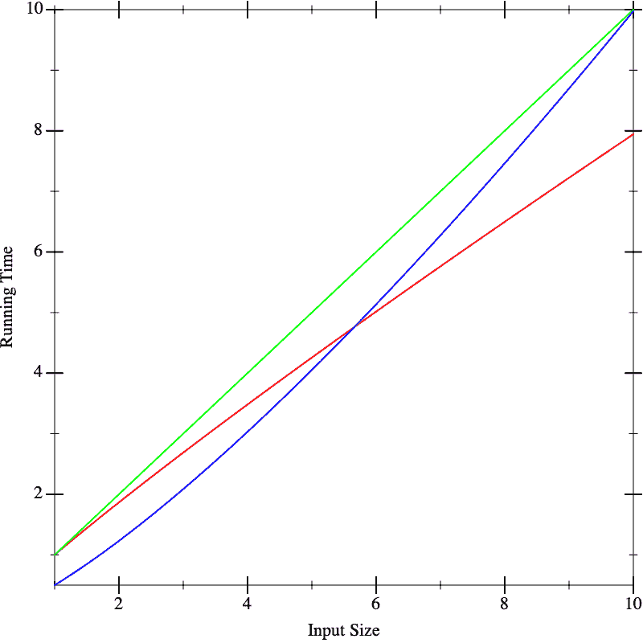
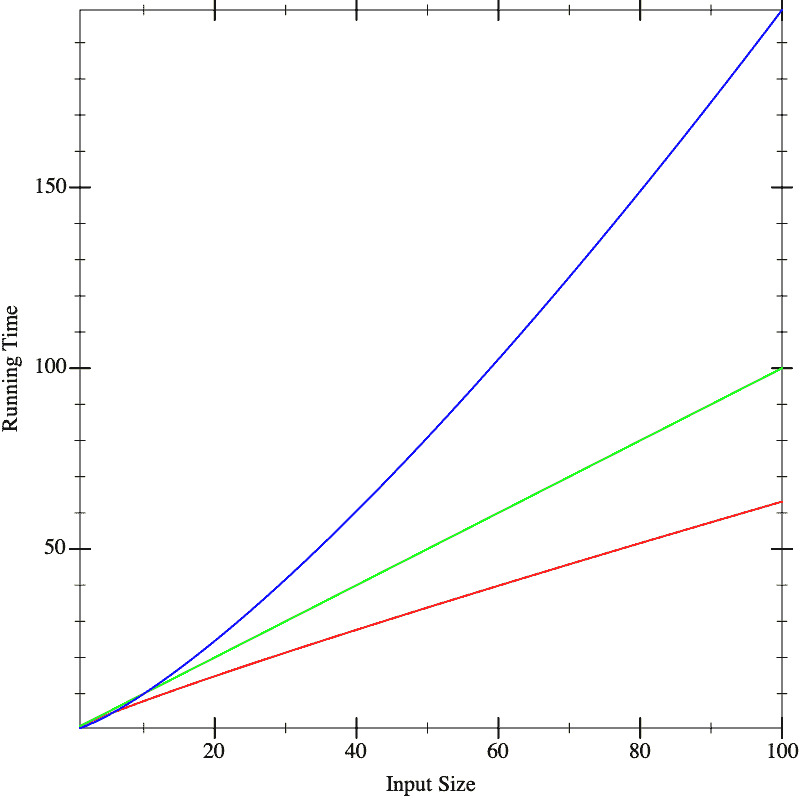
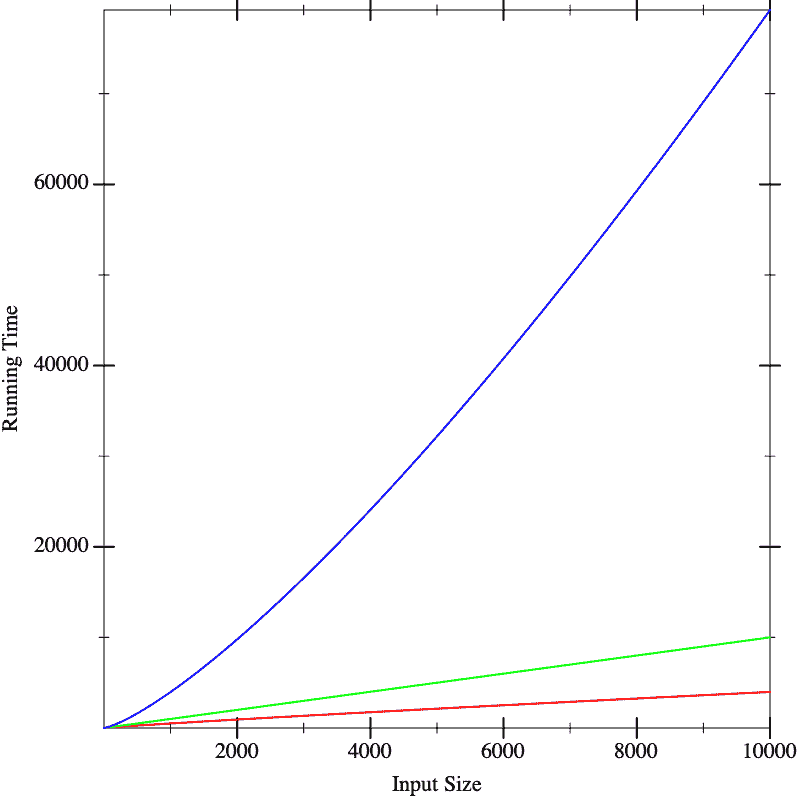

# 14 预测增长🔗

> 原文：[`dcic-world.org/2025-08-27/predicting-growth.html`](https://dcic-world.org/2025-08-27/predicting-growth.html)

| |   14.1 一个简短（真实）的故事 |
| --- | --- |
| |   14.2 分析思想 |
| |   14.3 Pyret 运行时间的成本模型 |
| |   14.4 输入的大小 |
| |   14.5 单结构递归函数的表格方法 |
| |   14.6 创建递归 |
| |   14.7 函数的表示法 |
| |   14.8 比较函数 |
| |   14.9 在不带烦恼的情况下组合 Big-Oh |
| |   14.10 解决递归 |

我们现在将开始研究确定计算所需时间的方法。我们将从一个简短（真实）的故事开始。

### 14.1 一个简短（真实）的故事🔗 "链接到这里")

我的学生 Debbie 最近为一家初创公司编写了分析数据的工具。该公司收集有关在手机上进行的商品扫描的信息，Debbie 的分析工具按产品、地区、时间等对这些信息进行分类。作为一名优秀的程序员，Debbie 首先编写了合成测试用例，然后开发了她的程序并进行了测试。之后，她从公司获得了实际测试数据，将这些数据分解成小块，手动计算出预期答案，并再次用这些真实（但规模较小）的数据集测试她的程序。在完成这些工作后，她宣布程序准备就绪。

然而，此时她只测试了它们的功能正确性。仍然有一个问题，即她的分析工具产生答案的速度有多快。这提出了两个问题：

+   公司正确地不愿意与外界分享整个数据集，而我们也无意承担仔细保管他们所有数据的责任。

+   即使我们可以获取他们的数据样本，随着更多用户使用他们的产品，他们拥有的数据量肯定会增长。

因此，我们只能获取他们全部数据的样本，并据此预测分析子集（例如，仅对应一个区域的数据）或全部数据集所需的时间，无论是今天还是随着时间的推移。

Debbie 被分配了 100,000 个数据点。她将它们分解成包含 10、100、1,000、10,000 和 100,000 个数据点的输入集，对每个输入大小运行她的工具，并绘制结果。

从这张图中，我们可以很好地猜测在包含 50,000 个数据集的工具上需要多长时间。然而，要确定在 1.5 百万、3 百万或 1 千万规模的数据集上需要多长时间就困难多了。这些过程分别被称为内插和外推。我们已经解释了为什么我们无法从公司获取更多数据。那么我们能做什么呢？

作为另一个问题，假设我们有多个实现可用。当我们绘制它们的运行时间时，比如图表看起来像这样，红色、绿色和蓝色分别代表不同的实现。在小输入上，假设运行时间看起来是这样的：



这似乎不能帮助我们区分这些实现。现在假设我们在更大的输入上运行算法，我们得到以下图表：



现在我们似乎有一个明显的赢家（红色），尽管不清楚其他两个（蓝色和绿色）之间有什么区别。但如果我们对更大的输入进行计算，我们开始看到明显的差异：



实际上，导致这些线条的函数在三个图表中都是相同的。这些图片告诉我们，从小输入的性能中过度外推是危险的。如果我们能获得计算性能的闭式描述，如果能更好地比较它们就太好了。这就是我们将在下一节中要做的。

> 负责任计算：明智地选择分析工件
> 
> > 随着越来越多的决策由数据（由人类进行的统计分析）指导，认识到数据可能无法很好地代表我们试图理解的实际情况至关重要。在这里，Debbie 有关于程序行为的资料，这导致了关于哪个程序最好的误解。但 Debbie 也有生成这些数据的程序本身。分析程序，而不是数据，是评估程序性能的直接方法。
> > 
> > 虽然本章的其余部分是关于分析代码中编写的程序，但这个观点也适用于非程序。例如，你可能想了解医院中分级患者流程的有效性。在这种情况下，你既有政策文件（可能或可能没有转化为支持管理患者的软件程序）以及使用该流程的有效性数据。负责任计算告诉我们，要分析流程及其行为数据，与关于患者护理最佳实践的知识相对比，以评估系统的有效性。

### 14.2 分析思想🔗 "链接到此处")

对于许多物理过程，我们能做的最好的事情就是尽可能多地获取数据点，进行外推，并应用统计学来推理最可能的结果。有时在计算机科学中我们也能这样做，但幸运的是，我们计算机科学家在大多数其他科学中拥有巨大的优势：我们不是测量一个黑盒过程，而是完全访问其内部，即源代码。这使得我们可以应用分析方法。“分析”意味着应用代数和其他数学方法来对过程做出预测性陈述，而不需要运行它。我们这样计算出的答案是上述实验分析得到的答案的补充，在实践中，我们通常希望结合使用这两种方法，以获得对程序行为的深入理解。

分析思想非常简单。我们查看程序的源代码，并列出它执行的操作。对于每个操作，我们查找它的成本。我们将关注一种成本，即运行时间。还有许多其他类型的成本可以计算。我们可能自然会对空间（内存）消耗感兴趣，这告诉我们需要购买多大机器。我们也可能关心电力，这告诉我们电费的成本，或者带宽，这告诉我们需要什么样的互联网连接。总的来说，我们感兴趣的是资源消耗。简而言之，不要犯将“性能”等同于“速度”的错误：相关的成本取决于应用程序运行的环境。我们将所有操作的成本加起来。这给出了程序的总成本。

自然地，对于大多数程序，答案不会是一个常数。相反，它将取决于诸如输入大小等因素。因此，我们的答案可能是一个关于参数（如输入的大小）的表达式。换句话说，我们的答案将是一个函数。

有许多函数可以描述一个函数的运行时间。通常我们希望有一个运行时间的上界：即实际的操作数将永远不会超过函数预测的数量。这告诉我们需要分配的最大资源。另一个函数可能提供一个下界，这告诉我们需要的最少资源。有时我们想要平均情况分析。等等。在这篇文章中，我们将重点关注上界，但请记住，所有这些其他分析也非常有价值。

> 练习
> 
> > 讨论所谓的“上界函数”是不正确的，因为并不只有一个。给定一个上界函数，你能构造出另一个吗？

### 14.3 Pyret 运行时间的成本模型🔗 "链接到此处")

我们首先提出一个用于 Pyret 程序运行时间的成本模型。我们对程序运行的成本感兴趣，这相当于研究程序的表达式。仅仅定义一个东西并不需要花费任何成本；只有在使用定义时才会产生成本。

我们将使用一个非常简单（但足够准确）的成本模型：每个操作除了需要评估其子表达式的所需时间外，还需要额外一单位的时间。因此，查找一个变量或分配一个常量需要一单位的时间。应用原始函数也需要一单位的时间。其他所有东西都是包含子表达式的复合表达式。复合表达式的成本是其子表达式成本的总和加一。例如，表达式 `e1 + e2`（对于某些子表达式 `e1` 和 `e2`）的运行时间成本是 `e1` 的运行时间加上 `e2` 的运行时间再加一。因此，表达式 `17 + 29` 的成本是 3（每个子表达式一个，加法操作一个）；表达式 `1 + (7 * (2 / 9))` 的成本是 7。

如您所见，这里有两个大的近似：

+   首先，我们使用的是抽象的时间概念，而不是具体的时间概念。在估计程序的所谓“实际运行时间”方面，这并不有帮助，但话又说回来，这个数字取决于许多因素——<wbr>不仅仅是你的处理器类型和内存大小，甚至还有你电脑上同时运行的其他任务。相比之下，抽象时间单位更具有可移植性。

+   其次，并非每个操作都需要相同数量的机器周期，而我们已经对所有操作收取了相同数量的抽象时间单位。只要每个操作实际需要的周期数是另一个操作所需周期数的常数倍，这就不会对数学上造成任何问题，原因我们很快就会理解 [比较函数]).

当然，在仔细设置实验条件之后——<wbr>对程序的行为进行解析预测，然后验证其实际实现，这是很有教育意义的。如果解析预测是准确的，我们就可以重建计算中隐藏的常数因子，从而获得程序非常精确的实际运行时间界限。

有一种特别棘手的表达式类型：`if`（以及它更复杂的亲戚，如 `cases` 和 `ask`）。我们如何考虑 `if` 的成本？它总是评估条件。之后，它只评估其分支中的一个。但我们感兴趣的是最坏情况下的时间，即它可能需要多长时间？对于条件表达式，这是条件的成本加上两个分支中最大分支的成本。

### 14.4 输入的大小🔗 "链接到此处")

我们忽略了数字的大小，将其视为常数。观察到一个数字的值比其大小指数级大：以\(b\)为底\(n\)位可以表示\(b^n\)个数字。虽然在这里不相关，但当数字是核心时——例如，在测试素数时——差异变得至关重要！我们将在稍后简要回顾 [数字的复杂性].

定义参数的大小可能很微妙。假设一个函数消耗一个数字列表；定义其参数的大小为列表的长度，即列表中的`link`数量，似乎是自然的。我们也可以将其定义为两倍大小，以考虑到`link`和单个数字（但正如我们将看到的 [比较函数]），常数通常并不重要）。但是，假设一个函数消耗一个音乐专辑列表，并且每个音乐专辑本身又是一个包含歌手等信息的歌曲列表。那么我们如何衡量大小取决于被分析函数实际检查的输入部分。如果，比如说，它只返回专辑列表的长度，那么它对每个列表元素的内容无关紧要 [单态列表和多态类型]，只有专辑列表的长度才是重要的。然而，如果函数返回每个专辑上的所有歌手的列表，那么它将遍历到单个歌曲，我们必须考虑到所有这些数据。简而言之，我们关心函数可能访问的数据的大小。

### 14.5 单结构递归函数的表格法🔗 "链接到此处")

给定参数的大小后，我们只需检查函数体并累加各个操作的代价。然而，大多数有趣的函数都是条件定义的，甚至可能递归。在这里，我们将假设只有一个结构化递归调用。我们将在稍后讨论更一般的情况 [创建递归]).

当我们有一个只有一个递归调用的函数，并且它是结构化的，我们可以使用一种方便的技术来处理条件。这个想法归功于 Prabhakar Ragde。我们将建立一个表格。听到表格将有与条件相同的行数，你不会感到惊讶。但与两列不同，它有七列！这听起来很吓人，但很快你就会看到它们从何而来以及为什么存在。

对于每一行，按照以下方式填写列：

1.  |Q|：问题中的操作数

1.  #Q：问题将执行次数

1.  TotQ：问题的总成本（乘以前两个值）

1.  |A|：答案中的操作数

1.  #A：答案将执行次数

1.  TotA：答案的总成本（乘以前两个值）

1.  总计：将两个总计相加，以获得子句的答案

最后，通过将单个行的总计列相加，获得`cond`表达式的总成本。

在计算这些成本的过程中，我们可能会在答案表达式中遇到递归调用。只要整个答案中只有一个递归调用，就可以忽略它。

> 练习
> 
> > 一旦你阅读了关于创建递归的材料，请回到这里并解释为什么可以简单地跳过递归调用。在整体表格方法的背景下进行解释。
> > 
> 练习
> 
> > 排除递归处理的处理，证明（a）这些列各自准确（例如，使用加法和乘法是合适的），并且（b）足够（即，结合在一起，它们可以解释将由该`cond`子句执行的所有操作）。

通过应用几个例子来理解这一点是最容易的。首先，让我们考虑`len`函数，在继续之前要注意它确实满足只有一个结构化参数的递归调用的标准：

```py
fun len(l):
  cases (List) l:
    | empty => 0
    | link(f, r) => 1 + len(r)
  end
end
```

让我们计算在长度为\(k\)的列表上运行`len`的成本（在这里我们只计算列表中的`link`数量，并忽略每个第一个元素的内容（`f`），因为`len`也忽略它们）。

因为`len`函数的主体完全由一个条件表达式给出，我们可以直接开始构建表格。

让我们考虑第一行。问题花费三个单位（每个元素评估隐含的`empty`-ness 谓词`l`，并将前者应用于后者）。这是对列表中的每个元素评估一次，当列表为空时再评估一次，即\(k+1\)次。因此，问题的总成本是\(3(k+1)\)。答案的计算需要一单位时间，并且只评估一次（当列表为空时）。因此，总共需要一单位时间，总成本为\(3k+4\)单位。

现在来看第二行。问题再次花费三个单位，评估\(k\)次。答案涉及两个单位来评估列表`l.rest`的其余部分，这部分被`r`的命名隐含地隐藏，还需要两个单位来评估和执行`1 +`，还需要一个单位来评估`len`...等等，因为我们忽略了递归调用本身所花费的时间。简而言之，它需要五个单位的时间（除了我们选择忽略的递归时间）。

以表格形式：

| &#124;Q&#124; |  | #Q |  | TotQ |  | &#124;A&#124; |  | #A |  | TotA |  | Total |
| --- | --- | --- | --- | --- | --- | --- | --- | --- | --- | --- | --- | --- |
| \(3\) |  | \(k+1\) |  | \(3(k+1)\) |  | \(1\) |  | \(1\) |  | \(1\) |  | \(3k+4\) |
| \(3\) |  | \(k\) |  | \(3k\) |  | \(5\) |  | \(k\) |  | \(5k\) |  | \(8k\) |

相加，我们得到\(11k + 4\)。因此，在\(k\)个元素的列表上运行`len`需要\(11k+4\)单位时间。

> 练习
> 
> > 这个估计有多准确？如果你尝试将`len`应用于不同大小的列表，你是否获得了对\(k\)的一致估计？

### 14.6 创建递归🔗 "链接到此处")

我们现在将看到一种系统化的方法来分析计算程序的时间。假设我们只有一个函数 `f`。我们将定义一个函数，\(T\)，来计算 `f` 的时间上界。一般来说，我们将在程序中的每个函数都有一个这样的成本函数。在这种情况下，为每个函数给出不同的名字以方便区分是有用的。由于我们现在只关注一个函数，我们将通过只有一个 \(T\) 来减少记号开销。\(T\) 有与 `f` 相同数量的参数。\(T\) 的参数代表 `f` 对应参数的大小。最终，我们希望得到一个封闭形式的解 \(T\)，即不引用 \(T\) 自身的解。但到达那里的最简单方法是写一个允许引用 \(T\) 的解，称为递归关系，然后看看如何消除自我引用 [解决递归关系)]。

我们将依次对程序中的每个函数重复此过程。如果有许多函数，首先解决那些不依赖于其他函数的函数，然后使用其解来解决仅依赖于它的函数，并沿着依赖链向上推进。这样，当我们到达一个引用其他函数的函数时，我们已经有了一个关于被引用函数运行时间的封闭形式解，可以简单地插入参数以获得一个解。

> 练习
> 
> > 当有函数相互依赖时，上述策略不起作用。你将如何泛化它以处理这种情况？

设置递归的过程很简单。我们只需将 \(T\) 的右侧定义为在 `f` 的主体中执行的操作的总和。这很简单，除了条件和递归。我们将在稍后详细说明对条件的处理。如果我们对 `f` 的参数 `a` 进行递归调用，在递归中，我们将此转换为对 `a` 大小上的 \(T\) 的（自我）引用。

对于条件语句，我们只使用对应表格中的 |Q| 和 |A| 列。我们不是通过乘以输入的大小来计算，而是将 `f` 的一次调用中除递归调用之外的操作累加起来，然后加上递归调用的成本，即对 \(T\) 的引用。因此，如果我们对上面的 `len` 进行这样的操作，我们将 \(T(k)\)——即输入长度为 \(k\) 时所需的时间——定义为两部分：\(T(0)\) 的值（当列表为空时）和 \(k\) 不为零时的值。我们知道 \(T(0) = 4\)（第一个条件及其对应答案的成本）。如果列表不为空，成本为 \(T(k) = 3 + 3 + 5 + T(k-1)\)（分别来自第一个问题、第二个问题、第二个答案中的剩余操作，以及列表中一个元素更小的递归调用）。这给出了以下递归关系：

\begin{equation*}T(k) = \begin{cases} 4 & \text{when } k = 0 \\ 11 + T(k-1) & \text{when } k > 0\\ \end{cases}\end{equation*}

对于一个长度为 \(p\) 的给定列表（注意 \(p \geq 0\)），第一个元素需要 \(11\) 步，第二个元素需要 \(11\) 更多步，第三个元素需要 \(11\) 更多步，以此类推，直到我们用完列表元素并需要额外的 \(4\) 步：总共 \(11p + 4\) 步。注意，这正是我们通过表格方法得到的结果！

> 练习
> 
> > 为什么我们可以假设对于一个长度为 \(p\) 的列表，\(p \geq 0\)？为什么我们费心在上述内容中明确地声明这一点？

经过一些思考，你可以看到，当存在多个递归调用，并且调用参数在结构上更小的时候，构建递归关系的想法也是可行的。然而，我们没有看到一种解决这类关系的一般方法。这就是我们接下来要讨论的 [求解递归关系]。

### 14.7 函数的表示法🔗 "链接到这里")

我们在上面已经看到，我们可以通过一个函数来描述 `len` 的运行时间。我们没有特别好的符号来编写这样的（匿名）函数。等等，我们确实有——<wbr>`lam(k): (11 * k) + 4 end`—<wbr>但如果你在同事的考试中写下这个，他们可能会很震惊。因此，我们将引入以下符号来精确地表达相同的意思：

\begin{equation*}[k \rightarrow 11k + 4]\end{equation*}

括号表示匿名函数，箭头前的参数和箭头后的函数体。

### 14.8 比较函数🔗 "链接到这里")

让我们回到 `len` 的运行时间。我们已经写下了一个非常精确的函数：11! 4! 这是有道理的吗？

在细粒度层面上，不，并不是这样。我们已经将许多具有不同实际运行时间的操作合并为一个成本。因此，也许我们不必过于担心，比如 \([k \rightarrow 11k + 4]\) 和 \([k \rightarrow 4k + 10]\) 之间的差异。如果我们分别给出了具有这些运行时间的两个实现，我们很可能会选择其他特征来区分它们。

这实际上意味着能够比较两个函数（代表实现的性能），看其中一个是否在某些有意义的意义上比另一个定量地更好：即，这种定量差异是否如此之大，以至于可能导致定性差异。上面的例子表明，常数之间的微小差异可能并不重要。

也就是说，我们想要一种方法来比较两个函数 \(f_1\) 和 \(f_2\)。\(f_1\) 比 \(f_2\) “小”意味着什么，而不必担心常数？我们得到以下定义：

\begin{equation*}\exists c . \forall n \in \mathbb{N}, f_1(n) \leq c \cdot f_2(n) \Rightarrow f_1 \leq f_2\end{equation*}

这意味着对于所有自然数 (\(N\))，\(f_1\) 的值将始终小于 \(f_2\) 的值。然而，为了适应我们关于乘法常数无关紧要的直觉，定义允许将 \(f_2\) 在所有点的值乘以某个常数 \(c\) 以达到不等式。然而，请注意，\(c\) 与 \(n\) 无关：它只选择一次，然后必须适用于无限多个值。在实践中，这意味着 \(c\) 的存在使我们能够绕过一些早期值，在这些值中 \(f_1\) 可能比 \(f_2\) 大，只要在某个点之后 \(f_2\) 主导 \(f_1\)。

这个定义比我们最初想象的要灵活。例如，考虑我们的运行示例与 \([k \rightarrow k²]\) 的比较。显然，后者函数最终会主导前者：即，

\begin{equation*}[k \rightarrow 11k+4] \leq [k \rightarrow k²]\end{equation*}

我们只需要选择一个足够大的常数，我们就会找到这是真的。

> 练习
> 
> > 什么是最小的常数，足以满足条件？

你将在文献中找到更复杂的定义，它们都有优点，因为它们使我们能够比这个定义允许的做出更精细的区分。然而，对于本书的目的，上述定义就足够了。

> 现在进行！
> 
> > 为什么量词的写法是这个顺序而不是相反的顺序？如果我们交换它们，那么我们能为每个 \(n\) 选择一个 \(c\) 呢？

如果我们交换了顺序，这意味着在数轴上的每一个点，都必须存在一个常数——实际上几乎总是存在！因此，交换后的定义将毫无用处。重要的是，无论参数有多大，我们都能识别出这个常数。这就是它真正成为常数的原因。

注意，对于给定的函数 \(f\)，有无数个函数的值都小于它。我们使用 \(O(\cdot)\) 符号来描述这个函数族。在计算机科学中，这通常读作“大 O”，尽管有些人更喜欢将其称为其创始人 Bachmann-Landau 的符号。因此，如果 \(g \leq f\)，我们可以写成 \(g \in O(f)\)，我们可以读作“\(f\) 是 \(g\) 的上界”。因此，例如，

\begin{equation*}[k \rightarrow 3k] \in O([k \rightarrow 4k+12])\end{equation*}

\begin{equation*}[k \rightarrow 4k+12] \in O([k \rightarrow k²])\end{equation*}

以及等等。显然，“更大的”函数可能比“更紧的”函数作为一个界限不那么有用。然而，传统上写一个“最小”界限对于函数，这意味着避免不必要的常数、求和项等等。这种做法的合理性将在下面给出 [无烦恼地结合大 O 符号]。

特别注意我们的符号。我们写 \(\in\) 而不是 \(=\) 或其他符号，因为 \(O(f)\) 描述了一个函数族，其中 \(g\) 是一个成员。我们也不写 \(f\) 而写 \(f(x)\)，因为我们比较的是函数——\(f\)——而不是它们在特定点的值——\(f(x)\)，这将是普通数字！大多数书籍和网站上的大多数符号都存在一个或两个缺陷。然而，我们知道函数是值，函数可以是匿名的。我们实际上利用了这两个事实来能够写出

\begin{equation*}[k \rightarrow 3k] \in O([k \rightarrow 4k+12])\end{equation*}

这不是我们能有的唯一函数比较的概念。例如，给定上述的 \(\leq\) 定义，我们可以定义一个自然的关系 `<`。这样，我们就能够询问，给定一个函数 \(f\)，所有满足 \(g \leq f\) 但不满足 \(g < f\) 的函数 \(g\) 是什么，即那些“等于” \(f\) 的函数。注意！我们使用引号，因为这与普通函数的等价性不同，普通函数的等价性定义为在所有输入上给出相同的答案。在这里，两个“等价”的函数可能在任何输入上都不给出相同的答案。这是由常数分隔的函数族；当函数表示程序的运行时间时，“等价”的函数表示以相同速度增长（到常数）的程序。我们使用符号 \(\Theta(\cdot)\) 来谈论这个函数族，所以如果 \(g\) 通过这个概念与 \(f\) 等价，我们可以写 \(g \in \Theta(f)\)（并且这也意味着 \(f \in \Theta(g)\)）。

> 练习
> 
> > 说服自己这个函数等价的概念是一个等价关系，因此值得称为“等价”。它需要是（a）自反的（即，每个函数都与自己相关）；（b）反对称的（如果 \(f \leq g\) 且 \(g \leq f\)，则 \(f\) 和 \(g\) 是相等的）；以及（c）传递的（\(f \leq g\) 和 \(g \leq h\) 意味着 \(f \leq h\)）。

### 14.9 在不烦恼的情况下组合大 O🔗 "链接到此处")

现在我们已经引入了这个符号，我们应该询问它的闭包属性：即这些函数族是如何组合的？为了引导你的直觉，假设在所有情况下我们都在讨论函数的运行时间。我们将考虑三种情况：

+   假设我们有一个函数 `f`（其运行时间是）在 \(O(F)\) 内。假设我们运行它 \(p\) 次，对于某个给定的常数。那么，产生的代码的运行时间就是 \(p \times O(F)\)。然而，请注意，这实际上与 \(O(F)\) 没有区别：我们只需在 \(O(\cdot)\) 的定义中使用更大的常数 \(c\)——特别是，我们可以使用 \(pc\)。反过来，那么，\(O(pF)\) 等价于 \(O(F)\)。这正是“乘法常数无关紧要”这一直觉的核心。

+   假设我们有两个函数，`f` 在 \(O(F)\) 中，`g` 在 \(O(G)\) 中。如果我们先运行 `f` 再运行 `g`，我们预计组合的运行时间将是它们各自运行时间的总和，即 \(O(F) + O(G)\)。你应该让自己相信这仅仅是 \(O(max(F, G))\)。

+   假设我们有两个函数，`f` 在 \(O(F)\) 中，`g` 在 \(O(G)\) 中。如果 `f` 在每一步都调用 `g`，我们预计组合的运行时间将是它们各自运行时间的乘积，即 \(O(F) \times O(G)\)。你应该让自己相信这仅仅是 \(O(F \times G)\)。

这三个操作——<wbr>加法、常数乘法和函数乘法——<wbr>涵盖了几乎所有的情况。为了确保表格适合合理的宽度，我们将滥用符号。例如，我们可以用这个来重新解释上面的 表格操作（假设一切都是 \(k\) 的函数）：

| &#124;Q&#124; |  | #Q |  | TotQ |  | &#124;A&#124; |  | #A |  | TotA |  | Total |
| --- | --- | --- | --- | --- | --- | --- | --- | --- | --- | --- | --- | --- |
| \(O(1)\) |  | \(O(k)\) |  | \(O(k)\) |  | \(O(1)\) |  | \(O(1)\) |  | \(O(1)\) |  | \(O(k)\) |
| \(O(1)\) |  | \(O(k)\) |  | \(O(k)\) |  | \(O(1)\) |  | \(O(k)\) |  | \(O(k)\) |  | \(O(k)\) |

由于常数乘法并不重要，我们可以将 \(3\) 替换为 \(1\)。由于常数加法并不重要（反向运行加法规则），\(k+1\) 可以变成 \(k\)。加上这些，我们得到 \(O(k) + O(k) = 2 \times O(k) \in O(k)\)。这证明了在 \(k\) 元素列表上运行 `len` 的时间是 \(O([k \rightarrow k])\)，这比 \(O([k \rightarrow 11k + 4])\) 描述其界限的方式简单得多。特别是，它为我们提供了必要的信息，没有其他信息：随着输入（列表）的增长，运行时间成比例增长，即如果我们向输入添加一个元素，我们应该期望向运行时间添加一个常数的时间。

### 14.10 解决递归🔗 "链接到此处")

关于解决递归方程的文献非常丰富。在本节中，我们不会深入探讨一般技术，也不会讨论很多不同的递归方程。相反，我们将专注于仅有的几类应该属于每位计算机科学家的技能库中的内容。你会反复看到这些内容，因此你应该本能地识别它们的递归模式，并知道它们描述的复杂度（或者知道如何快速推导它）。

之前我们看到了一个有两个情况的递归：一个用于空输入，另一个用于所有其他情况。一般来说，我们应该期望为每个非递归调用找到一个情况，为每个递归调用找到一个情况，即大约每个 `cases` 子句一个。在以下内容中，只要输入的大小是常数（如零或一），我们就将忽略基本情况，因为在这些情况下，所做的工作量也将是常数，我们可以一般地忽略 [比较函数]。

+   | \(T(k)\) | = | \(T(k-1) + c\) |
+   | --- | --- | --- |
    |  | = | \(T(k-2) + c + c\) |
    |  | = | \(T(k-3) + c + c + c\) |
    |  | = | ... |
    |  | = | \(T(0) + c \times k\) |
    |  | = | \(c_0 + c \times k\) |

    因此 \(T \in O([k \rightarrow k])\)。直观上，每次我们丢弃一个元素（\(k-1\)）时，我们都会做一定量的工作（\(c\)），因此总体上我们做了线性量的工作。

+   | \(T(k)\) | = | \(T(k-1) + k\) |
+   | --- | --- | --- |
    |  | = | \(T(k-2) + (k-1) + k\) |
    |  | = | \(T(k-3) + (k-2) + (k-1) + k\) |
    |  | = | ... |
    |  | = | \(T(0) + (k-(k-1)) + (k-(k-2)) + \cdots + (k-2) + (k-1) + k\) |
    |  | = | \(c_0 + 1 + 2 + \cdots + (k-2) + (k-1) + k\) |
    |  | = | \(c_0 + {\frac{k \cdot (k+1)}{2}}\) |

    因此 \(T \in O([k \rightarrow k²])\)。这来自于前 \(k\) 个数的和的解。我们称具有这种运行时间的算法为二次算法。在编程软件中，避免制作出[意外二次的](https://accidentallyquadratic.tumblr.com/)算法是其中一个最困难的算法问题。正如你所见，即使是严肃的专业软件也会陷入这个陷阱，它会影响真实系统，甚至导致它们崩溃。

    我们也可以从几何的角度看待这个递归。想象下面每个 x 都代表一个工作量单位，我们开始时有 \(k\) 个它们。然后第一行有 \(k\) 个工作量单位：

    | xxxxxxxx |
    | --- |

    然后是对 \(k-1\) 个元素的递归：

    | xxxxxxx |
    | --- |

    这随后又引出对较小元素的一个递归，等等，直到我们最终得到：

    | xxxxxxxx |
    | --- |
    | xxxxxxx |
    | xxxxxx |
    | xxxxx |
    | xxxx |
    | xxx |
    | xx |
    | x |

    那么总工作量基本上是这个三角形的面积，其底和高都是 \(k\)：或者，如果你更喜欢，是 \(k \times k\) 正方形的一半：

    | xxxxxxxx |
    | --- |
    | xxxxxxx. |
    | xxxxxx.. |
    | xxxxx... |
    | xxxx.... |
    | xxx..... |
    | xx...... |
    | x....... |

    对于所有这些递归，都可以进行类似的几何论证。

+   | \(T(k)\) | = | \(T(k/2) + c\) |
+   | --- | --- | --- |
    |  | = | \(T(k/4) + c + c\) |
    |  | = | \(T(k/8) + c + c + c\) |
    |  | = | ... |
    |  | = | \(T(k/2^{\log_2 k}) + c \cdot \log_2 k\) |
    |  | = | \(c_1 + c \cdot \log_2 k\) |

    因此 \(T \in O([k \rightarrow \log k])\)。直观上，我们能够在每个级别上只做常数工作量（\(c\)），然后丢弃一半的输入。在以对数数量级的步骤中，我们将耗尽输入，每次只做常数工作量。因此，整体复杂度是对数的。

+   | \(T(k)\) | = | \(T(k/2) + k\) |
+   | --- | --- | --- |
    |  | = | \(T(k/4) + k/2 + k\) |
    |  | = | ... |
    |  | = | \(T(1) + k/2^{\log_2 k} + \cdots + k/4 + k/2 + k\) |
    |  | = | \(c_1 + k(1/2^{\log_2 k} + \cdots + 1/4 + 1/2 + 1)\) |
    |  | = | \(c_1 + 2k\) |

    因此 \(T \in O([k \rightarrow k])\)。直观上，第一次你的过程查看所有元素，第二次查看其中的一半，第三次查看四分之一，以此类推。这种连续减半相当于再次扫描输入中的所有元素。因此，这导致了一个线性过程。

+   | \(T(k)\) | = | \(2T(k/2) + k\) |
+   | --- | --- | --- |
    |  | = | \(2(2T(k/4) + k/2) + k\) |
    |  | = | \(4T(k/4) + k + k\) |
    |  | = | \(4(2T(k/8) + k/4) + k + k\) |
    |  | = | \(8T(k/8) + k + k + k\) |
    |  | = | ... |
    |  | = | \(2^{\log_2 k} T(1) + k \cdot \log_2 k\) |
    |  | = | \(k \cdot c_1 + k \cdot \log_2 k\) |

    因此 \(T \in O([k \rightarrow k \cdot \log k])\)。直观地说，每次我们都在处理每个递归调用中的所有元素（\(k\)），同时将其分解为两个子问题。这种分解给我们一个对数高度的递归树，在每一层我们都在做线性工作。

+   | \(T(k)\) | = | \(2T(k-1) + c\) |
+   | --- | --- | --- |
    |  | = | \(2T(k-1) + (2-1)c\) |
    |  | = | \(2(2T(k-2) + c) + (2-1)c\) |
    |  | = | \(4T(k-2) + 3c\) |
    |  | = | \(4T(k-2) + (4-1)c\) |
    |  | = | \(4(2T(k-3) + c) + (4-1)c\) |
    |  | = | \(8T(k-3) + 7c\) |
    |  | = | \(8T(k-3) + (8-1)c\) |
    |  | = | ... |
    |  | = | \(2^k T(0) + (2^k-1)c\) |

    因此 \(T \in O([k \rightarrow 2^k])\)。处理每个元素需要为其做一定量的工作，然后将其余工作加倍。这种连续加倍导致指数增长。

> 练习
> 
> > 使用归纳法证明上述推导。

### 14.1 一点（真实）故事🔗 "链接到此处")

我的学生黛比最近为一家初创公司编写了分析数据的工具。该公司收集有关在手机上进行的商品扫描的信息，黛比的分析工具将这些信息按产品、地区、时间等进行分类。作为一名优秀的程序员，黛比首先编写了合成测试用例，然后开发了她的程序并进行了测试。然后，她从公司获得了实际测试数据，将它们分解成小块，手动计算出预期答案，并再次用这些真实（但规模较小）的数据集测试她的程序。在完成这些工作后，她宣布程序准备就绪。

然而，此时她只测试了它们的功能正确性。仍然有一个问题，即她的分析工具产生答案的速度有多快。这提出了两个问题：

+   公司有理由不愿意与外界分享整个数据集，相应地，我们也不想负责仔细保护他们的所有数据。

+   即使我们已经得到了他们数据的样本，随着更多用户使用他们的产品，他们拥有的数据量肯定会增长。

因此，我们只能获取他们全部数据的一部分，并据此预测分析子集（例如，仅对应一个区域的数据）或整个数据集所需的时间，无论是现在还是随着时间的推移。

黛比得到了 10 万个数据点。她将这些数据点分解成 10、100、1,000、10,000 和 100,000 个数据点的输入集，对每个输入大小运行她的工具，并绘制了结果。

从这张图中，我们可以很好地猜测工具在 5 万个数据集上的运行时间。然而，要确定在 150 万、300 万或 1000 万个数据集上的运行时间就困难得多。这些过程分别被称为内插和外推。我们已经解释了为什么我们无法从公司获取更多数据。那么我们能做什么呢？

作为另一个问题，假设我们有多个实现可用。当我们绘制它们的运行时间时，比如图表看起来像这样，红色、绿色和蓝色分别代表不同的实现。在小的输入上，假设运行时间看起来像这样：


这似乎并不能帮助我们区分不同的实现。现在假设我们在更大的输入上运行算法，我们得到以下图表：


现在我们似乎有一个明显的赢家（红色），尽管不清楚其他两个（蓝色和绿色）之间有什么区别。但是，如果我们对更大的输入进行计算，我们开始看到明显的差异：


事实上，导致这些行出现的函数在三个图中都是相同的。这些图片告诉我们，从小的输入性能中过度外推是危险的。如果我们能获得计算性能的封闭形式描述，那么能够更好地比较它们将是件好事。这就是我们将在下一节中要做的。

> 负责任计算：明智地选择分析工具
> 
> > 随着越来越多的决策由数据（由人类执行）的统计分析指导，认识到数据可能无法很好地代表我们试图理解的实际情况至关重要。在这里，Debbie 有关于程序行为的数据，这导致了关于哪个程序最好的误解。但 Debbie 也有生成这些数据的程序本身。分析程序而不是数据是评估程序性能的直接方法。
> > 
> > 尽管本章的其余部分是关于分析以代码形式编写的程序，但这一点也适用于非程序。例如，你可能想了解在医院对病人进行分类处理流程的有效性。在这种情况下，你既有政策文件（可能或可能没有转化为支持管理病人的软件程序的规定），也有关于该流程有效性的数据。负责任计算告诉我们，要分析流程及其行为数据，与关于病人护理最佳实践的知识相对比，以评估系统的有效性。

### 14.2 分析思想🔗 "链接到此处")

对于许多物理过程，我们所能做的就是尽可能多地获得数据点，进行外推，并应用统计学来推断最可能的结果。有时在计算机科学中我们也能这样做，但幸运的是，我们计算机科学家在大多数其他科学中拥有巨大的优势：我们不是测量一个黑盒过程，而是完全访问其内部，即源代码。这使得我们能够应用分析方法。“分析”意味着应用代数和其他数学方法来对过程做出预测性陈述，而无需运行它。我们这样计算出的答案是上述实验分析得到的补充，在实践中，我们通常希望结合使用这两种方法，以获得对程序行为的深入理解。

分析的想法非常简单。我们查看程序的源代码，并列出它执行的操作。对于每个操作，我们查找它的成本。我们将专注于一种成本，即运行时间。还有许多其他类型的成本可以计算。我们可能自然会对空间（内存）消耗感兴趣，这告诉我们需要购买多大型的机器。我们也可能关心电力，这告诉我们电费的成本，或者带宽，这告诉我们需要什么样的互联网连接。总的来说，我们感兴趣的是资源消耗。简而言之，不要犯将“性能”等同于“速度”的错误：重要的成本取决于应用程序运行的环境。我们将所有操作的成本加起来。这给出了程序的总成本。

自然地，对于大多数程序，答案不会是一个常数。相反，它将取决于诸如输入大小等因素。因此，我们的答案可能是一个关于参数的表达式（例如输入的大小）。换句话说，我们的答案将是一个函数。

有许多函数可以描述一个函数的运行时间。通常我们希望有一个运行时间的上界：即实际的操作数将永远不会超过函数预测的数量。这告诉我们需要分配的最大资源。另一个函数可能提供一个下界，这告诉我们需要的最少资源。有时我们想要平均情况分析。等等。在这篇文章中，我们将重点关注上界，但请记住，所有这些其他分析也非常有价值。

> 练习
> 
> > 说到“上界函数”，这是不正确的，因为并不只有一个。给定一个上界函数，你能构造另一个吗？

### 14.3 Pyret 运行时间的成本模型🔗 "链接至此")

我们首先介绍 Pyret 程序运行时间的成本模型。我们对程序运行的成本感兴趣，这相当于研究程序的表达式。仅仅定义一个表达式并不需要任何成本；只有在使用定义时才会产生成本。

我们将使用一个非常简单（但足够准确）的成本模型：每个操作除了需要评估其子表达式的所需时间外，还需要额外一单位的时间。因此，查找一个变量或分配一个常量需要一单位的时间。应用原始函数也需要一单位的时间。其他所有内容都是包含子表达式的复合表达式。复合表达式的成本是其子表达式成本的总和加一。例如，表达式 `e1 + e2`（对于某些子表达式 `e1` 和 `e2`）的运行时间成本是 `e1` 的运行时间加上 `e2` 的运行时间再加一。因此，表达式 `17 + 29` 的成本是 3（每个子表达式一个，加法操作一个）；表达式 `1 + (7 * (2 / 9))` 的成本是 7。

如您所见，这里有两个大的近似：

+   首先，我们使用的是时间的抽象概念而不是具体概念。这在估计程序所谓的“墙钟”运行时间方面并不 helpful，但话又说回来，这个数字取决于许多因素——不仅仅是你的处理器类型和内存大小，甚至还包括你电脑上同时运行的其他任务。相比之下，抽象时间单位更易于移植。

+   第二，不是每个操作都需要相同数量的机器周期，而我们给所有操作都计入了相同数量的抽象时间单位。只要每个操作实际需要的周期数被另一个操作所需周期数的常数因子所限制，这就不会对数学造成任何问题，原因我们很快就会理解 [比较函数]。

当然，在仔细设置实验条件之后，对程序的行为进行解析预测，然后验证其实际实现，这是很有教育意义的。如果解析预测是准确的，我们就可以重建我们计算中隐藏的常数因子，从而获得程序非常精确的墙钟时间界限。

有一种特别棘手的表达式类型：`if`（以及它更复杂的亲戚，如 `cases` 和 `ask`）。我们如何考虑 `if` 的成本？它总是评估条件。之后，它只评估其分支中的一个。但我们感兴趣的是最坏情况下的时间，即它可能需要多长时间？对于条件表达式，这是条件的成本加上两个分支中最大分支的成本。

### 14.4 输入大小🔗 "链接到此处")

我们忽略了数字的大小，将其视为常数。请注意，数字的值比其大小指数级地大：以\(b\)为底\(n\)位可以表示\(b^n\)个数字。虽然在这里不相关，但当数字是核心时——例如，在测试素数时——这种差异变得至关重要！我们稍后会简要地回到这一点 [数字的复杂性]。

定义参数的大小可能有些微妙。假设一个函数消耗一个数字列表；自然地，我们可以定义其参数的大小为列表的长度，即列表中`链接`的数量。我们也可以将其定义为两倍大，以考虑到`链接`和单个数字（但正如我们将看到的 [比较函数]），常数通常并不重要）。但是，假设一个函数消耗一个音乐专辑列表，并且每个音乐专辑本身又是一个歌曲列表，每个歌曲都有关于歌手等信息。那么我们如何衡量大小就取决于被分析函数实际检查的输入部分。如果，比如说，它只返回专辑列表的长度，那么它对每个列表元素的内容就无关紧要 [单态列表和多态类型]，只有专辑列表的长度才是重要的。然而，如果函数返回每个专辑上所有歌手的列表，那么它将遍历到单个歌曲，我们必须考虑到所有这些数据。简而言之，我们关注的是函数可能访问的数据的大小。

### 14.5 单结构递归函数的表格法🔗 "链接到此处")

给定参数的大小，我们只需检查函数的主体并累加单个操作的成本。然而，大多数有趣的函数都是条件定义的，甚至可能递归。在这里，我们将假设只有一个结构递归调用。我们将在稍后讨论更一般的情况 [创建递归]。

当我们有一个只有一个递归调用的函数，并且它是结构性的，我们可以使用一种方便的技术来处理条件。这个想法归功于 Prabhakar Ragde。我们将建立一个表格。听到表格将有与条件相同的行数，你不会感到惊讶。但是，它不是两列，而是七列！这听起来可能有些吓人，但很快你就会看到它们从何而来以及为什么存在。

对于每一行，按照以下方式填写列：

1.  |Q|：问题中的操作数

1.  #Q：问题将执行的次数

1.  TotQ：问题的总成本（乘以前两个）

1.  |A|：答案中的操作数

1.  #A：答案将执行的次数

1.  TotA：答案的总成本（乘以前两个）

1.  总计：将两个总计相加以获得子句的答案

最后，通过将各个行的总计列相加，得到 `cond` 表达式的总成本。

在计算这些成本的过程中，我们可能会在答案表达式中遇到递归调用。只要整个答案中只有一个递归调用，就可以忽略它。

> 练习
> 
> > 读完关于 创建递归 的材料后，回到这里并解释为什么可以简单地跳过递归调用。在整体表格方法的背景下进行解释。
> > 
> 练习
> 
> > 排除递归处理，证明（a）这些列各自是准确的（例如，使用加法和乘法是合适的），并且（b）足够充分（即，结合在一起，它们解释了 `cond` 子句将执行的所有操作）。

通过应用它到几个例子中，最容易理解这一点。首先，让我们考虑 `len` 函数，在继续之前请注意它确实满足只有一个递归调用且参数是结构性的标准：

```py
fun len(l):
  cases (List) l:
    | empty => 0
    | link(f, r) => 1 + len(r)
  end
end
```

让我们计算在长度为 \(k\) 的列表上运行 `len` 函数的成本（在这里我们只计算列表中 `link` 的数量，而忽略每个第一个元素（`f`）的内容，因为 `len` 也会忽略它们）。

因为 `len` 的整个主体由一个条件给出，所以我们可以直接开始构建表格。

让我们考虑第一行。问题花费三个单位（每个元素评估隐含的 `empty`-ness 谓词 `l` 和将前者应用于后者各一个单位）。这是对列表中的每个元素评估一次，当列表为空时再评估一次，即 \(k+1\) 次。因此，问题的总成本是 \(3(k+1)\)。答案需要一单位时间来计算，并且只评估一次（当列表为空时）。因此，总共需要一单位时间，总成本为 \(3k+4\) 个单位。

现在考虑第二行。问题再次花费三个单位，并且被评估 \(k\) 次。答案涉及两个单位来评估剩余的列表 `l.rest`，这是通过 `r` 的命名隐含的，另外两个单位来评估和应用 `1 +`，一个单位来评估 `len`...等等，因为我们忽略了递归调用本身所花费的时间。简而言之，它需要五个单位的时间（除了我们选择忽略的递归之外）。

以表格形式：

| &#124;Q&#124; |  | #Q |  | TotQ |  | &#124;A&#124; |  | #A |  | TotA |  | Total |
| --- | --- | --- | --- | --- | --- | --- | --- | --- | --- | --- | --- | --- |
| \(3\) |  | \(k+1\) |  | \(3(k+1)\) |  | \(1\) |  | \(1\) |  | \(1\) |  | \(3k+4\) |
| \(3\) |  | \(k\) |  | \(3k\) |  | \(5\) |  | \(k\) |  | \(5k\) |  | \(8k\) |

加起来，我们得到 \(11k + 4\)。因此，在 \(k\) 个元素的列表上运行 `len` 函数需要 \(11k+4\) 个时间单位。

> 练习
> 
> > 这个估计有多准确？如果你尝试将 `len` 应用于不同大小的列表，你是否获得了对 \(k\) 的一致估计？

### 14.6 创建递归🔗 "链接到此处")

我们现在将看到一种系统性的分析方法来计算程序的时间。假设我们只有一个函数 `f`。我们将定义一个函数，\(T\)，来计算 `f` 时间的上界。一般来说，对于程序中的每个函数，我们都会有一个这样的成本函数。在这种情况下，给每个函数起一个不同的名字以便于区分会很有用。由于我们现在只关注一个函数，我们将通过只有一个 \(T\) 来减少符号的负担。\(T\) 的参数数量与 `f` 相同。\(T\) 的参数代表 `f` 对应参数的大小。最终，我们希望得到 \(T\) 的封闭形式解，即不直接引用 \(T\) 本身的解。但达到这一点的最简单方法是写出一个允许引用 \(T\) 的解，称为递归关系，然后看看如何消除自引用 [解决递归)]。

我们依次对程序中的每个函数重复此过程。如果有许多函数，首先解决没有其他函数依赖的函数，然后使用其解来解决只依赖于它的函数，并沿着依赖链向上推进。这样，当我们到达一个引用其他函数的函数时，我们已经有了一个封闭形式的解，可以简单地插入参数来获得一个解。

> 练习
> 
> > 当有函数相互依赖时，上述策略不起作用。你将如何泛化它以处理这种情况？

设置递归的过程很简单。我们只需定义 \(T\) 的右侧来累加 `f` 体中执行的操作。这很简单，除了条件语句和递归。我们稍后会详细说明对条件语句的处理。如果我们对参数 `a` 的 `f` 进行递归调用，在递归中，我们将这转换为对 `a` 大小上的 \(T\) 的（自我）引用。

对于条件语句，我们只使用相应表格的 |Q| 和 |A| 列。我们不是通过乘以输入的大小来累加操作，而是累加 `f` 的一次调用中除了递归调用之外发生的操作，然后加上递归调用的成本，以 \(T\) 的引用来表示。因此，如果我们对上面的 `len` 做这件事，我们将 \(T(k)\)——即输入长度为 \(k\) 时所需的时间——定义为两部分：\(T(0)\) 的值（当列表为空时）和 \(k\) 非零值时的值。我们知道 \(T(0) = 4\)（第一个条件语句及其对应答案的成本）。如果列表不为空，成本是 \(T(k) = 3 + 3 + 5 + T(k-1)\)（分别来自第一个问题、第二个问题、第二个答案中的剩余操作和对长度小一个元素的列表的递归调用）。这给出了以下递归关系：

\begin{equation*}T(k) = \begin{cases} 4 & \text{when } k = 0 \\ 11 + T(k-1) & \text{when } k > 0\\ \end{cases}\end{equation*}

对于一个长度为 \(p\) 的给定列表（注意 \(p \geq 0\)），第一个元素需要 \(11\) 步，第二个元素需要 \(11\) 更多步，第三个元素需要 \(11\) 更多步，以此类推，直到我们用完列表元素并需要 \(4\) 更多步：总共 \(11p + 4\) 步。注意，这正是我们通过表格方法得到的结果！

> 练习
> 
> > 为什么我们可以假设对于一个长度为 \(p\) 的列表，\(p \geq 0\)？为什么我们费心在上文中明确地声明这一点？

经过一些思考，你可以看到，即使存在多个递归调用，并且调用参数结构上更小，构造递归的想法也是可行的。然而，我们还没有看到一种解决此类关系的一般方法。这就是我们接下来要讨论的 [求解递归关系]）。

### 14.7 函数的符号🔗 "链接到这里")

我们在上面看到，我们可以通过一个函数来描述 `len` 的运行时间。我们没有特别好的符号来编写这样的（匿名）函数。等等，我们确实有——<wbr>`lam(k): (11 * k) + 4 end`—<wbr>但如果你在同事的考试上写下这个，他们可能会很震惊。因此，我们将引入以下符号，其含义与上述内容完全相同：

\begin{equation*}[k \rightarrow 11k + 4]\end{equation*}

方括号表示匿名函数，箭头前的参数和箭头后的主体。

### 14.8 比较函数🔗 "链接到这里")

让我们回到 `len` 的运行时间。我们已经写下了一个非常精确的函数：\(11!\) 和 \(4!\)。这是否合理？

在细粒度层面上，不，并不是这样。我们已经将许多具有不同实际运行时间的操作合并为一个成本。因此，也许我们不必过于担心，比如 \([k \rightarrow 11k + 4]\) 和 \([k \rightarrow 4k + 10]\) 之间的差异。如果我们被提供了具有这些运行时间的两个实现，我们很可能会选择其他特征来区分它们。

这归结为能够比较两个函数（代表实现的性能），以判断一个在某种意义上是否比另一个定量地更好：即，这种定量差异是否如此之大，以至于可能导致定性差异。上面的例子表明，常数之间的微小差异可能并不重要。

即，我们想要一种比较两个函数 \(f_1\) 和 \(f_2\) 的方法。\(f_1\) 比 \(f_2\) “小”意味着什么，而不必担心常数？我们得到以下定义：

\begin{equation*}\exists c . \forall n \in \mathbb{N}, f_1(n) \leq c \cdot f_2(n) \Rightarrow f_1 \leq f_2\end{equation*}

这意味着对于所有自然数 (\(N\))，\(f_1\) 的值将始终小于 \(f_2\) 的值。然而，为了适应我们关于乘法常数无关紧要的直觉，定义允许在所有点上将 \(f_2\) 的值乘以某个常数 \(c\) 以达到不等式。然而，请注意，\(c\) 与 \(n\) 无关：它只选择一次，然后必须适用于无限多个值。在实践中，这意味着 \(c\) 的存在使我们能够绕过一些早期值，在这些值中 \(f_1\) 可能比 \(f_2\) 大，只要在某个点上 \(f_2\) 优于 \(f_1\)。

这个定义比我们最初想象的要灵活得多。例如，考虑我们的运行示例与 \([k \rightarrow k²]\) 的比较。显然，后者函数最终会主导前者：即，

\begin{equation*}[k \rightarrow 11k+4] \leq [k \rightarrow k²]\end{equation*}

我们只需要选择一个足够大的常数，我们就会找到这是真的。

> 练习
> 
> > 最小的常数是多少才能满足条件？

你将在文献中找到更复杂的定义，并且它们都有优点，因为它们使我们能够做出比这个定义更精细的区分。然而，对于本书的目的，上述定义就足够了。

> 现在行动起来！
> 
> > 为什么量词被写成这种顺序而不是相反的顺序？如果我们交换它们，那么我们是否可以为每个 \(n\) 选择一个 \(c\)？

如果我们交换了顺序，这意味着对于数轴上的每一个点，都必须存在一个常数——实际上，这几乎总是成立的！因此，交换后的定义将变得毫无用处。重要的是，无论参数有多大，我们都能识别出这个常数。这就是它真正成为常数的原因。

注意，对于给定的函数 \(f\)，存在许多比它小的函数。我们使用 \(O(\cdot)\) 符号来描述这个函数族。在计算机科学中，这通常读作“大-O”，尽管有些人更喜欢将其称为其创始人 Bachmann-Landau 的符号。因此，如果 \(g \leq f\)，我们可以写成 \(g \in O(f)\)，我们可以读作“\(f\) 是 \(g\) 的上界”。因此，例如，

\begin{equation*}[k \rightarrow 3k] \in O([k \rightarrow 4k+12])\end{equation*}

\begin{equation*}[k \rightarrow 4k+12] \in O([k \rightarrow k²])\end{equation*}

以此类推。显然，“更大”的函数可能比“更紧”的函数作为界限不那么有用。尽管如此，传统上为函数写一个“最小”界限，这意味着避免不必要的常数、求和项等。这种做法的合理性将在以下部分给出 [无烦恼地合并大-O)]。

特别注意我们的符号。我们写 \(\in\) 而不是 \(=\) 或其他符号，因为 \(O(f)\) 描述了一族函数，其中 \(g\) 是成员之一。我们也写 \(f\) 而不是 \(f(x)\)，因为我们是在比较函数——<wbr>\(f\)——<wbr>而不是它们在特定点的值——<wbr>\(f(x)\)—<wbr>这将是普通数字！大多数书籍和网站上的大多数符号都存在一个或两个缺陷。然而，我们知道函数是值，函数可以是匿名的。我们实际上利用了这两个事实来能够写出

\begin{equation*}[k \rightarrow 3k] \in O([k \rightarrow 4k+12])\end{equation*}

这不是我们可以拥有的唯一函数比较概念。例如，给定上述的 \(\leq\) 定义，我们可以定义一个自然关系 \(<\)。这样，我们就可以问，给定一个函数 \(f\)，所有满足 \(g \leq f\) 但不满足 \(g < f\) 的函数 \(g\) 是什么，即那些“等于” \(f\) 的函数。注意！我们使用引号，因为这不同于普通函数的等价性，普通函数的等价性定义为在所有输入上给出相同答案的两个函数。在这里，两个“相等”的函数可能在任何输入上都不给出相同答案。这是由最多一个常数分隔的函数族；当函数表示程序的阶增长时，“相等”的函数表示以相同速度（最多常数）增长的程序。我们使用符号 \(\Theta(\cdot)\) 来谈论这个函数族，所以如果 \(g\) 通过这个概念与 \(f\) 等价，我们可以写 \(g \in \Theta(f)\)（并且那时 \(f \in \Theta(g)\) 也成立）。

> 练习
> 
> > 说服自己这个函数等价性的概念是一个等价关系，因此值得称为“等价”。它需要是（a）自反的（即，每个函数都与自身相关）；（b）反对称的（如果 \(f \leq g\) 且 \(g \leq f\)，则 \(f\) 和 \(g\) 是相等的）；（c）传递的（\(f \leq g\) 和 \(g \leq h\) 意味着 \(f \leq h\)）。

### 14.9 无忧结合大 O🔗 "链接至此")

现在我们已经引入了这个符号，我们应该探究它的闭包性质：即这些函数族是如何组合的？为了引导你的直觉，假设在所有情况下我们都在讨论函数的运行时间。我们将考虑三种情况：

+   假设我们有一个函数 `f`（其运行时间是）在 \(O(F)\) 内。假设我们运行它 \(p\) 次，对于某个给定的常数。那么，产生的代码的运行时间就是 \(p \times O(F)\)。然而，请注意，这实际上与 \(O(F)\) 没有区别：我们只需在 \(O(\cdot)\) 的定义中使用更大的常数 \(c\)——<wbr>特别是，我们可以使用 \(pc\)。反过来，那么，\(O(pF)\) 等价于 \(O(F)\)。这正是“乘法常数无关紧要”这一直觉的核心。

+   假设我们有两个函数，`f` 在 \(O(F)\) 中，`g` 在 \(O(G)\) 中。如果我们先运行 `f`，然后运行 `g`，我们预计组合的运行时间是它们各自运行时间的总和，即 \(O(F) + O(G)\)。你应该确信这仅仅是 \(O(max(F, G))\)。

+   假设我们有两个函数，`f` 在 \(O(F)\) 中，`g` 在 \(O(G)\) 中。如果 `f` 在每一步都调用 `g`，我们预计组合的运行时间是它们各自运行时间的乘积，即 \(O(F) \times O(G)\)。你应该确信这仅仅是 \(O(F \times G)\)。

这三种操作——<wbr>加法、乘以常数和乘以函数——<wbr>涵盖了几乎所有的情况。为了确保表格适合合理的宽度，我们将滥用符号。例如，我们可以用这个来重新解释上面的 表格操作（假设一切都是 \(k\) 的函数）：

| &#124;Q&#124; |  | #Q |  | TotQ |  | &#124;A&#124; |  | #A |  | TotA |  | Total |
| --- | --- | --- | --- | --- | --- | --- | --- | --- | --- | --- | --- | --- |
| \(O(1)\) |  | \(O(k)\) |  | \(O(k)\) |  | \(O(1)\) |  | \(O(1)\) |  | \(O(1)\) |  | \(O(k)\) |
| \(O(1)\) |  | \(O(k)\) |  | \(O(k)\) |  | \(O(1)\) |  | \(O(k)\) |  | \(O(k)\) |  | \(O(k)\) |

由于常数乘法并不重要，我们可以将 \(3\) 替换为 \(1\)。由于常数加法并不重要（反向运行加法规则），\(k+1\) 可以变为 \(k\)。加上这些，我们得到 \(O(k) + O(k) = 2 \times O(k) \in O(k)\)。这证明了在 \(k\) 元素列表上运行 `len` 所需的时间是 \(O([k \rightarrow k])\)，这是一种比 \(O([k \rightarrow 11k + 4])\) 更简单的描述其界限的方法。特别是，它为我们提供了必要的信息，而没有其他信息：随着输入（列表）的增长，运行时间也成比例增长，即如果我们向输入添加一个元素，我们应该预期运行时间增加一个常数。

### 14.10 求解递归🔗 "链接至此")

关于求解递归方程的文献非常丰富。在本节中，我们不会深入探讨一般技术，甚至不会讨论很多不同的递归方程。相反，我们将专注于仅有的几类应该包含在每个计算机科学家技能库中的递归方程。你将反复遇到这些方程，因此你应该本能地识别它们的递归模式，并了解它们描述的复杂度（或者知道如何快速推导它）。

之前我们看到了一个有两个情况的递归方程：一个用于空输入，另一个用于所有其他情况。一般来说，我们应该期望对于每个非递归调用找到一个情况，对于每个递归调用找到一个情况，即大约每个 `cases` 子句一个。在以下内容中，只要输入的大小是常数（如零或一），我们将忽略基本案例，因为在这些情况下所做的工作量也将是常数，我们可以一般地忽略 [比较函数]。

+   | \(T(k)\) | = | \(T(k-1) + c\) |
+   | --- | --- | --- |
    |  | = | \(T(k-2) + c + c\) |
    |  | = | \(T(k-3) + c + c + c\) |
    |  | = | ... |
    |  | = | \(T(0) + c \times k\) |
    |  | = | \(c_0 + c \times k\) |

    因此 \(T \in O([k \rightarrow k])\). 直观地说，每次我们丢弃一个元素 (\(k-1\)) 时，我们都会做常数工作量 (\(c\))，所以总体上我们做了线性工作量。

+   | \(T(k)\) | = | \(T(k-1) + k\) |
+   | --- | --- | --- |
    |  | = | \(T(k-2) + (k-1) + k\) |
    |  | = | \(T(k-3) + (k-2) + (k-1) + k\) |
    |  | = | ... |
    |  | = | \(T(0) + (k-(k-1)) + (k-(k-2)) + \cdots + (k-2) + (k-1) + k\) |
    |  | = | \(c_0 + 1 + 2 + \cdots + (k-2) + (k-1) + k\) |
    |  | = | \(c_0 + {\frac{k \cdot (k+1)}{2}}\) |

    因此 \(T \in O([k \rightarrow k²])\). 这是从前 \(k\) 个数的和的解中得出的。我们称具有这种运行时间的算法为二次算法。在编程软件中，避免程序[意外地成为二次的](https://accidentallyquadratic.tumblr.com/)是算法中一个最困难的问题之一。正如你所见，即使是严肃的专业软件也可能陷入这个陷阱，它会影响真实系统，甚至可能使它们崩溃。

    我们也可以从几何的角度看待这个递归。想象每个下面的 x 都代表一个工作量单位，我们开始时有 \(k\) 个。然后第一行有 \(k\) 个工作量单位：

    | xxxxxxxx |
    | --- |

    然后是关于 \(k-1\) 的递归：

    | xxxxxxx |
    | --- |

    这随后是另一个关于较小规模的递归，以此类推，直到我们最终得到：

    | xxxxxxxx |
    | --- |
    | xxxxxxx |
    | xxxxxx |
    | xxxxx |
    | xxxx |
    | xxx |
    | xx |
    | x |

    总工作量实际上是这个三角形的面积，其底边和高度都是 \(k\)：或者，如果你更喜欢，是 \(k \times k\) 正方形的一半：

    | xxxxxxxx |
    | --- |
    | xxxxxxx. |
    | xxxxxx.. |
    | xxxxx... |
    | xxxx.... |
    | xxx..... |
    | xx...... |
    | x....... |

    对于所有这些递归，都可以进行类似的几何论证。

+   | \(T(k)\) | = | \(T(k/2) + c\) |
+   | --- | --- | --- |
    |  | = | \(T(k/4) + c + c\) |
    |  | = | \(T(k/8) + c + c + c\) |
    |  | = | ... |
    |  | = | \(T(k/2^{\log_2 k}) + c \cdot \log_2 k\) |
    |  | = | \(c_1 + c \cdot \log_2 k\) |

    因此 \(T \in O([k \rightarrow \log k])\). 直观地说，我们在每个级别上只能做常数工作量 (\(c\))，然后丢弃一半的输入。在以对数数量级的步骤中，我们将耗尽输入，每次只做常数工作量。因此，整体复杂度是对数的。

+   | \(T(k)\) | = | \(T(k/2) + k\) |
+   | --- | --- | --- |
    |  | = | \(T(k/4) + k/2 + k\) |
    |  | = | ... |
    |  | = | \(T(1) + k/2^{\log_2 k} + \cdots + k/4 + k/2 + k\) |
    |  | = | \(c_1 + k(1/2^{\log_2 k} + \cdots + 1/4 + 1/2 + 1)\) |
    |  | = | \(c_1 + 2k\) |

    因此 \(T \in O([k \rightarrow k])\). 直观地说，第一次你的过程查看所有元素，第二次查看其中的一半，第三次查看四分之一，以此类推。这种连续减半相当于再次扫描输入中的所有元素。因此，这导致了一个线性过程。

+   | \(T(k)\) | = | \(2T(k/2) + k\) |
+   | --- | --- | --- |
    |  | = | \(2(2T(k/4) + k/2) + k\) |
    |  | = | \(4T(k/4) + k + k\) |
    |  | = | \(4(2T(k/8) + k/4) + k + k\) |
    |  | = | \(8T(k/8) + k + k + k\) |
    |  | = | ... |
    |  | = | \(2^{\log_2 k} T(1) + k \cdot \log_2 k\) |
    |  | = | \(k \cdot c_1 + k \cdot \log_2 k\) |

    因此 \(T \in O([k \rightarrow k \cdot \log k])\)。直观上，每次我们都在处理每个递归调用中的所有元素（即 \(k\)），同时将其分解为两个子问题。这种分解给我们一个对数高度的递归树，在每一层我们都在进行线性工作。

+   | \(T(k)\) | = | \(2T(k-1) + c\) |
+   | --- | --- | --- |
    |  | = | \(2T(k-1) + (2-1)c\) |
    |  | = | \(2(2T(k-2) + c) + (2-1)c\) |
    |  | = | \(4T(k-2) + 3c\) |
    |  | = | \(4T(k-2) + (4-1)c\) |
    |  | = | \(4(2T(k-3) + c) + (4-1)c\) |
    |  | = | \(8T(k-3) + 7c\) |
    |  | = | \(8T(k-3) + (8-1)c\) |
    |  | = | ... |
    |  | = | \(2^k T(0) + (2^k-1)c\) |

    因此 \(T \in O([k \rightarrow 2^k])\)。处理每个元素需要为其执行一个常量工作量，然后将其余工作量加倍。这种连续加倍导致指数增长。

> 练习
> 
> > 使用归纳法，证明上述每个推导。
