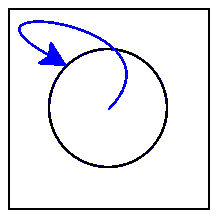

# 16.1 共享与等价性)

> 原文：[`dcic-world.org/2025-08-27/Sharing_and_Equality.html`](https://dcic-world.org/2025-08-27/Sharing_and_Equality.html)

| |   16.1.1 重新审视等价性 |
| --- | --- |
| |   16.1.2 评估引用的成本 |
| |   16.1.3 等价性的表示法 |
| |   16.1.4 在互联网上，没有人知道你是一个有向无环图 |
| |   16.1.5 它一直是 DAG |
| |   16.1.6 从无环到环 |

#### 16.1.1 重新审视等价性 "链接到此处")

考虑以下数据定义和示例值：

```py
data BT:
  | leaf
  | node(v, l :: BT, r :: BT)
end

a-tree =
  node(5,
    node(4, leaf, leaf),
    node(4, leaf, leaf))

b-tree =
  block:
    four-node = node(4, leaf, leaf)
    node(5,
      four-node,
      four-node)
  end
```

特别是，我们可能觉得我们编写的 `b-tree` 与我们编写的 `a-tree` 在道德上是等价的，但我们创建了一个有用的绑定来避免代码重复。

因为 `a-tree` 和 `b-tree` 都绑定到根值为 `5` 且左右子节点各包含 `4` 的树，所以我们确实可以合理地认为这些树是等价的。确实如此：

<equal-tests> ::=

```py
check:
  a-tree   is b-tree
  a-tree.l is a-tree.l
  a-tree.l is a-tree.r
  b-tree.l is b-tree.r
end
```

然而，这些树在另一种意义上并不等价。具体来说，`a-tree` 为每个子节点构建了一个不同的节点，而 `b-tree` 使用相同的节点为两个子节点服务。当然，这种差异应该以某种方式体现出来，但我们还没有看到一种编写程序来区分这些的方法。

默认情况下，`is` 操作符使用与 Pyret 的 `==` 相同的等价性测试。然而，Pyret 中还有其他等价性测试。特别是，我们可以通过使用 Pyret 的 `identical` 函数来区分这些数据，该函数实现了引用等价性。这不仅检查两个值在结构上是否等价，还检查它们是否是相同的值构造行为的结果。有了这个，我们现在可以编写额外的测试：

```py
check:
  identical(a-tree, b-tree)     is false
  identical(a-tree.l, a-tree.l) is true
  identical(a-tree.l, a-tree.r) is false
  identical(b-tree.l, b-tree.r) is true
end
```

让我们暂时退一步，考虑给我们这个结果的行为。我们可以通过将每个不同的值放置在运行程序旁边的单独位置来可视化不同的值。我们可以将第一步绘制为创建一个值为 `4` 的 `node`：

```py

```

a-tree =

node(5,

    1001,

    node(4, leaf, leaf))

b-tree =

block:

    four-node = node(4, leaf, leaf)

    node(5,

    four-node,

    four-node)

end

```py

```

Heap

+   1001:

    ```py
    node(4, leaf, leaf)
    ```

下一步创建了一个具有值 `4` 的另一个节点，与第一个节点不同：

```py

```

a-tree =

node(5, 1001, 1002)

b-tree =

block:

    four-node = node(4, leaf, leaf)

    node(5,

    four-node,

    four-node)

end

```py

```

Heap

+   1001:

    ```py
    node(4, leaf, leaf)
    ```

+   1002:

    ```py
    node(4, leaf, leaf)
    ```

然后创建了 `a-tree` 的 `node`：

```py

```

a-tree = 1003

b-tree =

block:

    four-node = node(4, leaf, leaf)

    node(5,

    four-node,

    four-node)

end

```py

```

Heap

+   1001:

    ```py
    node(4, leaf, leaf)
    ```

+   1002:

    ```py
    node(4, leaf, leaf)
    ```

+   1003:

    ```py
    node(5, 1001, 1002)
    ```

当评估 `b-tree` 的 `block` 时，首先为 `four-node` 绑定创建一个单独的节点：

```py

```

a-tree = 1003

b-tree =

block:

    four-node = 1004

    node(5,

    four-node,

    four-node)

end

```py

```

Heap

+   1001:

    ```py
    node(4, leaf, leaf)
    ```

+   1002:

    ```py
    node(4, leaf, leaf)
    ```

+   1003:

    ```py
    node(5, 1001, 1002)
    ```

+   1004:

    ```py
    node(4, leaf, leaf)
    ```

这些位置值可以像任何其他值一样替换，因此它们被替换为`four-node`以继续块的评估。我们暂时跳过了替换`a-tree`，这将在稍后出现。

```py

```

a-tree = 1003

b-tree =

block:

    node(5, 1004, 1004)

end

```py

```

堆

+   1001:

    ```py
    node(4, leaf, leaf)
    ```

+   1002:

    ```py
    node(4, leaf, leaf)
    ```

+   1003:

    ```py
    node(5, 1001, 1002)
    ```

+   1004:

    ```py
    node(4, leaf, leaf)
    ```

最后，创建了`b-tree`的节点：

```py

```

a-tree = 1003

b-tree = 1005

```py

```

堆

+   1001:

    ```py
    node(4, leaf, leaf)
    ```

+   1002:

    ```py
    node(4, leaf, leaf)
    ```

+   1003:

    ```py
    node(5, 1001, 1002)
    ```

+   1004:

    ```py
    node(4, leaf, leaf)
    ```

+   1005:

    ```py
    node(5, 1004, 1004)
    ```

这种可视化可以帮助我们解释使用`identical`编写的测试。让我们考虑用适当的引用位置替换`a-tree`和`b-tree`的测试：

```py

```

check:

identical(1003, 1005)

    is false

identical(1003.l, 1003.l)

    is true

identical(1003.l, 1003.r)

    is false

identical(1005.l, 1005.r)

    is true

end

```py

```

堆

+   1001:

    ```py
    node(4, leaf, leaf)
    ```

+   1002:

    ```py
    node(4, leaf, leaf)
    ```

+   1003:

    ```py
    node(5, 1001, 1002)
    ```

+   1004:

    ```py
    node(4, leaf, leaf)
    ```

+   1005:

    ```py
    node(5, 1004, 1004)
    ```

```py

```

check:

identical(1003, 1005)

    is false

identical(1001, 1001)

    is true

identical(1001, 1004)

    is false

identical(1004, 1004)

    is true

end

```py

```

堆

+   1001:

    ```py
    node(4, leaf, leaf)
    ```

+   1002:

    ```py
    node(4, leaf, leaf)
    ```

+   1003:

    ```py
    node(5, 1001, 1002)
    ```

+   1004:

    ```py
    node(4, leaf, leaf)
    ```

+   1005:

    ```py
    node(5, 1004, 1004)
    ```

实际上，在 Pyret 中还有另一种编写这些测试的方法：`is`运算符也可以通过不同的相等性谓词来参数化，而不是默认的`==`。因此，上述块可以等价地写成：我们可以使用`is-not`来检查预期的相等性失败。

```py
check:
  a-tree   is-not%(identical) b-tree
  a-tree.l is%(identical)     a-tree.l
  a-tree.l is-not%(identical) a-tree.r
  b-tree.l is%(identical)     b-tree.r
end
```

我们将从此使用这种相等性测试风格。

观察这些值是否与之前比较的相同(<equal-tests>)，但结果现在不同：一些之前为真的值现在为假。特别是，

```py
check:
  a-tree   is                 b-tree
  a-tree   is-not%(identical) b-tree
  a-tree.l is                 a-tree.r
  a-tree.l is-not%(identical) a-tree.r
end
```

之后，我们将回到`identical`真正意味着什么[理解相等性]（Pyret 有一系列适用于不同情况的相等性操作）。

> 练习
> 
> > 即使使用上述基本数据，我们还可以进行更多甚至应该进行的相等性测试，以确保我们真正理解了相等性以及相关地，数据在内存中的存储。我们应该进行哪些其他测试？在运行它们之前预测它们应该产生什么结果！

#### 16.1.2 评估引用的成本 "链接到此处")

从复杂性的角度来看，了解这些引用的工作方式对我们来说很重要。正如我们暗示的，`four-node`只计算一次，并且每次使用都引用相同的值：如果每次引用`four-node`时都进行评估，那么`a-tree`和`b-tree`之间就没有真正的区别，上述测试也无法区分它们。

这在理解函数评估成本时尤其相关。我们将构建两个简单的示例来说明这一点。我们将从一个虚构的数据结构开始：

```py
L = range(0, 100)
```

假设我们现在定义

```py
L1 = link(1, L)
L2 = link(-1, L)
```

显然，构建列表需要的时间至少与长度成比例；因此，我们预计计算`L`所需的时间将远大于单个`link`操作所需的时间。因此，问题是计算`L`之后`L1`和`L2`需要多长时间：常数时间，还是与`L`的长度成比例的时间？

对于 Pyret 以及大多数其他当代语言（包括 Java、C#、OCaml、Racket 等），答案是这些额外的计算需要常数时间。也就是说，绑定到`L`的值只计算一次并绑定到`L`；后续的表达式引用这个值（因此称为“引用相等”），而不是重建它，正如引用相等所显示的：

```py
check:
  L1.rest is%(identical) L
  L2.rest is%(identical) L
  L1.rest is%(identical) L2.rest
end
```

同样，我们可以定义一个函数，将`L`传递给它，并查看生成的参数是否与原始参数`identical`。

```py
fun check-for-no-copy(another-l):
  identical(another-l, L)
end

check:
  check-for-no-copy(L) is true
end
```

或者，等价地，

```py
check:
  L satisfies check-for-no-copy
end
```

因此，既不是内置操作（如`.rest`）也不是用户定义的操作（如`check-for-no-copy`）会复制它们的参数。严格来说，我们无法得出没有复制发生的结论。Pyret 可能会创建一个副本，然后丢弃它，仍然传递原始参数的引用。鉴于这种情况是多么荒谬，我们可以假设——<wbr>并且相信语言创造者的说法——<wbr>这种情况实际上并没有发生。通过创建极其大的列表，我们还可以使用计时信息来观察构建列表的时间与列表长度成比例增长，而传递它作为参数的时间保持不变。这里要观察的重要事情是，我们不是简单地依赖权威，而是使用了语言本身中的操作来理解语言的行为。

#### 16.1.3 相等的表示法 "链接到此处")

到目前为止，我们一直使用`==`来表示相等。现在我们了解到它只是多个相等运算符中的一个，而且还有一个叫做`identical`的运算符。然而，这两个运算符在语法属性上略有不同。`identical`是一个函数的名称，因此可以像任何其他函数一样使用它来引用（例如，当我们需要在`is-not`子句中提及它时）。相比之下，`==`是一个二元运算符，它只能用在表达式的中间。

这自然会让我们对其他两种可能性感到好奇：`identical`的二元表达式版本和`==`的函数名等价版本。实际上，它们确实存在！`==`执行的操作称为`equal-always`。因此，我们可以将第一个测试块等价地、但更明确地写出：

```py
check:
  a-tree   is%(equal-always) b-tree
  a-tree.l is%(equal-always) a-tree.l
  a-tree.l is%(equal-always) a-tree.r
  b-tree.l is%(equal-always) b-tree.r
end
```

相反，对于`identical`的二元运算符表示是`<=>`。因此，我们可以等价地写出`check-for-no-copy`为

```py
fun check-for-no-copy(another-l):
  another-l <=> L
end
```

#### 16.1.4 在互联网上，没有人知道你是一个 DAG "链接到此处")

尽管我们给它取了这个名字，但`b-tree`实际上并不是一棵树。在定义上，树中没有共享的节点，而在`b-tree`中，名为`four-node`的节点被树的两个部分共享。尽管如此，遍历`b-tree`仍然会终止，因为它中没有循环引用：如果你从一个节点开始并访问它的“子节点”，你不可能回到那个节点。对于具有这种形状的值有一个特殊的名称：有向无环图（DAG）。

许多重要的数据结构实际上在下面是一个 DAG（有向无环图）。例如，考虑网站。通常认为一个网站是一棵页面树：顶级引用几个部分，每个部分又引用子部分，依此类推。然而，有时一个条目需要被多个部分编目。例如，一个学术部门可能会按人员、教学和研究组织页面。在第一个这样的页面中，它列出了在那里工作的人员；在第二个中，列出课程列表；在第三个中，列出研究小组。反过来，课程可能包含对教授这些课程的教师的引用，而研究小组由这些相同的人员组成。由于我们只想为每个人（为了维护和搜索索引的目的）保留一个页面，所以所有这些人员链接都回指同一页的人员。

让我们构建这个简单形式的例子。首先是一个表示站点内容的`datatype`（数据类型）：

```py
data Content:
  | page(s :: String)
  | section(title :: String, sub :: List<Content>)
end
```

现在我们定义几个人物：

```py
people-pages :: Content =
  section("People",
    [list: page("Church"),
      page("Dijkstra"),
      page("Hopper") ])
```

以及提取特定个人页面的方法：

```py
fun get-person(n): get(people-pages.sub, n) end
```

现在我们可以定义理论和系统部分：

```py
theory-pages :: Content =
  section("Theory",
    [list: get-person(0), get-person(1)])
systems-pages :: Content =
  section("Systems",
    [list: get-person(1), get-person(2)])
```

这些作为整体集成到网站中：

```py
site :: Content =
  section("Computing Sciences",
    [list: theory-pages, systems-pages])
```

现在我们可以确认，这些杰出人物只需要保持一个网页最新；例如：

```py
check:
  theory  = get(site.sub, 0)
  systems = get(site.sub, 1)
  theory-dijkstra  = get(theory.sub, 1)
  systems-dijkstra = get(systems.sub, 0)
  theory-dijkstra is             systems-dijkstra
  theory-dijkstra is%(identical) systems-dijkstra
end
```

#### 16.1.5 它始终是一个 DAG "链接到这里")

我们可能没有意识到，实际上我们创建 DAG（有向无环图）的时间比我们想象的要长。为了看到这一点，考虑一下`a-tree`，它非常明显地看起来像一棵树。但更仔细地看，不是看`node`（节点），而是看`leaf`(s)（叶子）。我们实际上创建了多少个实际的`leaf`（叶子）？

一个提示是我们似乎在创建`leaf`时没有调用函数：数据定义没有列出任何字段，在构建`BT`值时，我们简单地写`leaf`，而不是（比如说）`leaf()`。尽管如此，了解幕后发生的事情仍然很好。为了检查，我们可以简单地询问 Pyret：

```py
check:
  leaf is%(identical) leaf
end
```

在这里我们不应该写`leaf <=> leaf`，因为这只是一个结果被忽略的表达式。我们必须写`is`来注册这个作为需要检查和报告的结果的测试。并且这个检查通过了。也就是说，当我们写一个没有任何字段的变体时，Pyret 会自动创建一个单例：它只创建一个实例，并在所有地方使用这个实例。这导致了一种更有效的内存表示，因为没有理由让很多不同的`leaf`（叶子）各自占用自己的内存。然而，这个微妙的结果是，我们一直在创建一个 DAG（有向无环图）。

如果我们真的想让每个`leaf`（叶子）都是独特的，这很容易：我们可以写

```py
data BTDistinct:
  | leaf()
  | node(v, l :: BTDistinct, r :: BTDistinct)
end
```

然后我们可能需要在每个地方使用`leaf`函数：

```py
c-tree :: BTDistinct =
  node(5,
    node(4, leaf(), leaf()),
    node(4, leaf(), leaf()))
```

确实如此：

```py
check:
  leaf() is-not%(identical) leaf()
end
```

#### 16.1.6 从无环到循环 "链接到这里")

这里还有一个在网络上出现的例子。假设我们正在构建一个网页中的输出表。我们希望表格的行在白色和灰色之间交替。如果表格只有两行，我们可以将这些颜色映射到一个包含这两个颜色的列表上。然而，由于我们不知道它将有多少行，所以我们希望列表尽可能长。实际上，我们希望编写：

```py
web-colors = link("white", link("grey", web-colors))
```

以获得一个无限长的列表，这样我们最终可以编写

```py
map2(color-table-row, table-row-content, web-colors)
```

它将`color-table-row`函数应用于两个参数：来自`table-row-content`的当前行和来自`web-colors`的当前颜色，在两个列表中同步进行。

不幸的是，这个尝试的定义有很多问题。

> 现在行动起来！
> 
> > 你看懂了吗？

下面是一些问题：

+   这甚至无法解析。标识符`web-colors`在`=`的右侧没有绑定。

+   之前，我们看到了这样一个问题的解决方案：使用`rec` [从函数中流出的数据]。如果我们编写

    ```py
    rec web-colors = link("white", link("grey", web-colors))
    ```

    而不是？

    > 练习
    > 
    > > 为什么`rec`在`ones`的定义中工作，但在上面不工作？

+   假设我们已经解决了上述问题，那么将发生以下两种情况之一。这取决于`web-colors`的初始值。因为它是一个占位符值，所以我们不会得到一个任意长的颜色列表，而是一个包含两个颜色然后是占位符值的列表。实际上，这个程序甚至无法通过类型检查。

    假设，然而，`web-colors`被编写成一个函数定义来延迟其创建：

    ```py
    fun web-colors(): link("white", link("grey", web-colors())) end
    ```

    单独来看，这仅仅定义了一个函数。如果我们使用它——<wbr>`web-colors()`——<wbr>它将进入一个无限循环构建`link`。

+   即使所有这些都工作，`map2`要么（a）因为其第二个参数是无限长的而不会终止，要么（b）报告错误，因为两个参数的长度不同。

所有这些问题都是更大问题的症状。我们在这里试图做的不仅仅是创建一个共享的数据（如 DAG），而是更丰富的东西：一个循环数据，即它引用自身：

> 

当你到达循环时，甚至定义数据本身都变得困难，因为它的定义依赖于自身，因此它（表面上）需要在定义过程中已经定义。我们将在 Cyclic Data 中稍后回到循环数据，并在从突变中的递归和循环中回到这个特定示例。

#### 16.1.1 重新审视等式 "链接到此处")

考虑以下数据定义和示例值：

```py
data BT:
  | leaf
  | node(v, l :: BT, r :: BT)
end

a-tree =
  node(5,
    node(4, leaf, leaf),
    node(4, leaf, leaf))

b-tree =
  block:
    four-node = node(4, leaf, leaf)
    node(5,
      four-node,
      four-node)
  end
```

尤其是当我们编写`b-tree`的方式似乎与编写`a-tree`的方式在道德上是等价的时候，我们可能会觉得这是正确的，但我们创建了一个有用的绑定来避免代码重复。

因为`a-tree`和`b-tree`都绑定到根值为`5`且左右子节点各包含`4`的树，所以我们确实可以合理地认为这些树是等价的。确实如此：

<equal-tests> ::=

```py
check:
  a-tree   is b-tree
  a-tree.l is a-tree.l
  a-tree.l is a-tree.r
  b-tree.l is b-tree.r
end
```

然而，从另一个角度来看，这些树并不等价。具体来说，`a-tree`为每个子节点构建一个不同的节点，而`b-tree`使用相同的节点为两个子节点。当然，这种差异应该以某种方式显示出来，但我们还没有看到一种编写程序来区分这些的方法。

默认情况下，`is`运算符使用与 Pyret 的`==`相同的相等性测试。然而，Pyret 中还有其他相等性测试。特别是，我们可以通过使用 Pyret 的`identical`函数来区分这些数据，该函数实现了引用相等性。这不仅检查两个值在结构上是否等效，还检查它们是否是相同的值构造行为的结果。有了这个，我们现在可以编写额外的测试：

```py
check:
  identical(a-tree, b-tree)     is false
  identical(a-tree.l, a-tree.l) is true
  identical(a-tree.l, a-tree.r) is false
  identical(b-tree.l, b-tree.r) is true
end
```

让我们暂时退一步，考虑产生这个结果的行为。我们可以通过将每个不同的值放在运行程序旁边的单独位置来可视化不同的值。我们可以将第一步绘制为创建一个值为`4`的`节点`：

```py

```

a-tree =

节点(5,

    1001,

    节点(4, 叶子, 叶子))

b-tree =

块：

    four-node = 节点(4, 叶子, 叶子)

    节点(5,

    four-node,

    four-node)

结束

```py

```

堆

+   1001:

    ```py
    node(4, leaf, leaf)
    ```

下一步创建另一个值为`4`的节点，与第一个不同：

```py

```

a-tree =

节点(5, 1001, 1002)

b-tree =

块：

    four-node = 节点(4, 叶子, 叶子)

    节点(5,

    four-node,

    four-node)

结束

```py

```

堆

+   1001:

    ```py
    node(4, leaf, leaf)
    ```

+   1002:

    ```py
    node(4, leaf, leaf)
    ```

然后创建`a-tree`的`节点`：

```py

```

a-tree = 1003

b-tree =

块：

    four-node = 节点(4, 叶子, 叶子)

    节点(5,

    four-node,

    four-node)

结束

```py

```

堆

+   1001:

    ```py
    node(4, leaf, leaf)
    ```

+   1002:

    ```py
    node(4, leaf, leaf)
    ```

+   1003:

    ```py
    node(5, 1001, 1002)
    ```

当评估`b-tree`的`块`时，首先为`four-node`绑定创建一个单独的节点：

```py

```

a-tree = 1003

b-tree =

块：

    four-node = 1004

    节点(5,

    four-node,

    four-node)

结束

```py

```

堆

+   1001:

    ```py
    node(4, leaf, leaf)
    ```

+   1002:

    ```py
    node(4, leaf, leaf)
    ```

+   1003:

    ```py
    node(5, 1001, 1002)
    ```

+   1004:

    ```py
    node(4, leaf, leaf)
    ```

这些位置值可以像任何其他值一样替换，因此它们被替换为`four-node`以继续块的评估。我们暂时跳过了替换`a-tree`，稍后会有所涉及。

```py

```

a-tree = 1003

b-tree =

块：

    节点(5, 1004, 1004)

结束

```py

```

堆

+   1001:

    ```py
    node(4, leaf, leaf)
    ```

+   1002:

    ```py
    node(4, leaf, leaf)
    ```

+   1003:

    ```py
    node(5, 1001, 1002)
    ```

+   1004:

    ```py
    node(4, leaf, leaf)
    ```

最后，创建`b-tree`的节点：

```py

```

a-tree = 1003

b-tree = 1005

```py

```

堆

+   1001:

    ```py
    node(4, leaf, leaf)
    ```

+   1002:

    ```py
    node(4, leaf, leaf)
    ```

+   1003:

    ```py
    node(5, 1001, 1002)
    ```

+   1004:

    ```py
    node(4, leaf, leaf)
    ```

+   1005:

    ```py
    node(5, 1004, 1004)
    ```

这种可视化可以帮助我们解释使用`identical`编写的测试。让我们考虑将适当的引用替换为`a-tree`和`b-tree`的测试：

```py

```

检查：

相同(1003, 1005)

    是假的

相同(1003.l, 1003.l)

    是真的

相同(1003.l, 1003.r)

    是假的

相同(1005.l, 1005.r)

    是真的

结束

```py

```

堆

+   1001:

    ```py
    node(4, leaf, leaf)
    ```

+   1002:

    ```py
    node(4, leaf, leaf)
    ```

+   1003:

    ```py
    node(5, 1001, 1002)
    ```

+   1004:

    ```py
    node(4, leaf, leaf)
    ```

+   1005:

    ```py
    node(5, 1004, 1004)
    ```

```py

```

检查：

相同(1003, 1005)

    是假的

相同(1001, 1001)

    是真的

相同(1001, 1004)

    是假的

相同(1004, 1004)

    是真的

结束

```py

```

堆

+   1001:

    ```py
    node(4, leaf, leaf)
    ```

+   1002:

    ```py
    node(4, leaf, leaf)
    ```

+   1003:

    ```py
    node(5, 1001, 1002)
    ```

+   1004:

    ```py
    node(4, leaf, leaf)
    ```

+   1005:

    ```py
    node(5, 1004, 1004)
    ```

实际上，我们还有另一种在 Pyret 中编写这些测试的方法：`is` 操作符也可以通过一个不同于默认 `==` 的等式谓词进行参数化。因此，上述块可以等价地写成：我们可以使用 `is-not` 来检查预期的等式失败。

```py
check:
  a-tree   is-not%(identical) b-tree
  a-tree.l is%(identical)     a-tree.l
  a-tree.l is-not%(identical) a-tree.r
  b-tree.l is%(identical)     b-tree.r
end
```

从现在起，我们将使用这种风格的等式测试。

观察这些值与之前比较的是相同的 (<equal-tests>)，但结果现在不同：之前为真的某些值现在为假。特别是，

```py
check:
  a-tree   is                 b-tree
  a-tree   is-not%(identical) b-tree
  a-tree.l is                 a-tree.r
  a-tree.l is-not%(identical) a-tree.r
end
```

后续我们将回到 `identical` 的真正含义 [理解等式]（Pyret 有适用于不同情况的全套等式操作）。

> 练习
> 
> > 即使在基本数据之上，我们还可以进行许多更多的等式测试，以确保我们真正理解等式以及相关的内存中数据存储。我们应该进行哪些其他测试？在运行它们之前预测它们应该产生什么结果！

#### 16.1.2 评估引用的成本 "链接至此")

从复杂性的角度来看，了解这些引用是如何工作的是非常重要的。正如我们暗示的，`four-node` 只计算一次，并且每次使用它都引用相同的值：如果我们每次引用 `four-node` 时都对其进行评估，那么 `a-tree` 和 `b-tree` 之间就没有真正的区别，上述测试也不会区分它们。

这在理解函数评估的成本时尤其相关。我们将构建两个简单的例子来说明这一点。我们将从一个虚构的数据结构开始：

```py
L = range(0, 100)
```

假设我们现在定义

```py
L1 = link(1, L)
L2 = link(-1, L)
```

构建一个列表显然需要的时间至少与长度成比例；因此，我们预计计算 `L` 的时间将远大于单个 `link` 操作的时间。因此，问题是计算 `L` 后 `L1` 和 `L2` 的计算需要多长时间：是常数时间，还是与 `L` 的长度成比例的时间？

对于 Pyret 以及大多数其他当代语言（包括 Java、C#、OCaml、Racket 等），答案是这些额外的计算需要常数时间。也就是说，绑定到 `L` 的值只计算一次并绑定到 `L`；后续表达式引用这个值（因此称为“引用”），而不是重建它，正如引用等式所示：

```py
check:
  L1.rest is%(identical) L
  L2.rest is%(identical) L
  L1.rest is%(identical) L2.rest
end
```

同样，我们可以定义一个函数，将 `L` 传递给它，并查看结果参数是否与原始参数 `identical`：

```py
fun check-for-no-copy(another-l):
  identical(another-l, L)
end

check:
  check-for-no-copy(L) is true
end
```

或者，等价地，

```py
check:
  L satisfies check-for-no-copy
end
```

因此，既不是内置操作（如`.rest`）也不是用户定义的操作（如`check-for-no-copy`）会复制它们的参数。严格来说，我们无法得出没有复制结论。Pyret 可能会复制它，然后丢弃它，同时仍然传递原始对象的引用。鉴于这将是多么荒谬，我们可以假设——当然，并相信语言创造者的说法——这实际上并没有发生。通过创建极其大的列表，我们还可以使用计时信息来观察列表构建的时间与列表长度成正比，而传递参数作为参数的时间保持不变。这里要观察的重要事情是，我们不是仅仅依赖权威，而是使用了语言本身的操作来了解语言的行为。

#### 16.1.3 等式表示法 "链接至此")

到目前为止，我们一直使用`==`来表示等式。现在我们已经了解到，它只是多个等式运算符中的一个，还有一个叫做`identical`。然而，这两个在语法属性上有些微妙的不同。`identical`是一个函数的名称，因此可以像任何其他函数一样使用它来引用它（例如，当我们需要在`is-not`子句中提到它时）。相比之下，`==`是一个二元运算符，它只能用于表达式的中间部分。

这自然会让我们对其他两种可能性感到好奇：一个是`identical`的二进制表达式版本，另一个是`==`的函数名等价。实际上，它们确实存在！`==`执行的操作被称为`equal-always`。因此，我们可以将第一个测试块等价地、但更明确地写成：

```py
check:
  a-tree   is%(equal-always) b-tree
  a-tree.l is%(equal-always) a-tree.l
  a-tree.l is%(equal-always) a-tree.r
  b-tree.l is%(equal-always) b-tree.r
end
```

相反，`identical`的二进制运算符表示法是`<=>`。因此，我们可以等价地写出`check-for-no-copy`：

```py
fun check-for-no-copy(another-l):
  another-l <=> L
end
```

#### 16.1.4 在互联网上，没有人知道你是一个 DAG "链接至此")

尽管我们给它取了`b-tree`这个名字，但实际上它并不是一棵树。在树的定义中，没有共享的节点，而在`b-tree`中，名为`four-node`的节点被树的两个部分共享。尽管如此，遍历`b-tree`仍然会终止，因为它没有循环引用：如果你从一个节点开始，访问它的“子节点”，你不可能回到那个节点。对于具有这种形状的值有一个特殊的名称：有向无环图（DAG）。

许多重要的数据结构实际上是有向无环图。例如，考虑网站。通常认为网站是一棵页面树：顶级页面指的是几个部分，每个部分又指明子部分，依此类推。然而，有时一个条目需要被归入多个部分。例如，一个学术部门可能会按人员、教学和研究组织页面。在第一个页面中，它列出了在那里工作的人员；在第二个页面中，列出了课程列表；在第三个页面中，列出了研究小组。反过来，课程可能包含对教授这些课程的教师的引用，而研究小组由这些相同的人员组成。由于我们只想为每个人创建一个页面（无论是维护还是搜索索引的目的），所有这些人员链接都回指到同一页面上的人员。

让我们构建这种形式的一个简单例子。首先是一个表示站点内容的数据类型：

```py
data Content:
  | page(s :: String)
  | section(title :: String, sub :: List<Content>)
end
```

现在我们定义一些人物：

```py
people-pages :: Content =
  section("People",
    [list: page("Church"),
      page("Dijkstra"),
      page("Hopper") ])
```

以及提取特定个人页面的方法：

```py
fun get-person(n): get(people-pages.sub, n) end
```

现在我们可以定义理论和系统部分：

```py
theory-pages :: Content =
  section("Theory",
    [list: get-person(0), get-person(1)])
systems-pages :: Content =
  section("Systems",
    [list: get-person(1), get-person(2)])
```

这些人物作为一个整体集成到站点中：

```py
site :: Content =
  section("Computing Sciences",
    [list: theory-pages, systems-pages])
```

现在我们可以确认，这些杰出人物只需要保持一个网页最新；例如：

```py
check:
  theory  = get(site.sub, 0)
  systems = get(site.sub, 1)
  theory-dijkstra  = get(theory.sub, 1)
  systems-dijkstra = get(systems.sub, 0)
  theory-dijkstra is             systems-dijkstra
  theory-dijkstra is%(identical) systems-dijkstra
end
```

#### 16.1.5 它始终是一个有向无环图 "链接至此")

我们可能没有意识到，实际上我们已经比我们想象的更长时间在创建有向无环图。为了看到这一点，考虑`a-tree`，它非常明显地看起来像一棵树。但更仔细地看看，不是`节点`而是`叶子`(s)。我们实际上创建了多少个`叶子`？

一个提示是，我们似乎在创建`叶子`时没有调用函数：数据定义没有列出任何字段，在构建`BT`值时，我们简单地写`leaf`，而不是（比如说）`leaf()`。尽管如此，了解幕后发生的事情仍然很好。为了检查，我们可以简单地询问 Pyret：

```py
check:
  leaf is%(identical) leaf
end
```

在这里我们不应该写`leaf <=> leaf`，因为这只是一个结果被忽略的表达式。我们必须写`is`来注册这个作为结果被检查和报告的测试。并且这个检查通过了。也就是说，当我们写一个没有任何字段的变体时，Pyret 自动创建一个单例：它只创建一个实例并在所有地方使用该实例。这导致了一种更有效的内存表示，因为没有理由让许多不同的`叶子`各自占用内存。然而，这个微妙的结果是，我们一直在创建有向无环图。

如果我们真的想让每个`叶子`都是独特的，这很简单：我们可以写出

```py
data BTDistinct:
  | leaf()
  | node(v, l :: BTDistinct, r :: BTDistinct)
end
```

然后我们就需要在每个地方使用`leaf`函数：

```py
c-tree :: BTDistinct =
  node(5,
    node(4, leaf(), leaf()),
    node(4, leaf(), leaf()))
```

确实如此：

```py
check:
  leaf() is-not%(identical) leaf()
end
```

#### 16.1.6 从无环性到环 "链接至此")

这里还有一个在网络上出现的例子。假设我们正在构建一个网页中的输出表格。我们希望表格的行在白色和灰色之间交替。如果表格只有两行，我们可以将行生成函数映射到这两个颜色的列表上。然而，由于我们不知道它会有多少行，所以我们希望列表尽可能长。实际上，我们希望写：

```py
web-colors = link("white", link("grey", web-colors))
```

以获得一个无限长的列表，这样我们最终可以写：

```py
map2(color-table-row, table-row-content, web-colors)
```

这将应用一个 `color-table-row` 函数到两个参数上：来自 `table-row-content` 的当前行和来自 `web-colors` 的当前颜色，在两个列表上同步进行。

很不幸，这个尝试定义中存在许多错误。

> 现在就做！
> 
> > 你看懂了吗？

这里有一些问题依次出现：

+   这甚至无法解析。标识符 `web-colors` 在 `=` 的右侧没有绑定。

+   之前，我们看到了这样一个问题的解决方案：使用 `rec` [从函数生成流]。如果我们这样写会发生什么？

    ```py
    rec web-colors = link("white", link("grey", web-colors))
    ```

    而不是？

    > 练习
    > 
    > > 为什么 `rec` 在 `ones` 的定义中起作用，但在上面不起作用？

+   假设我们解决了上述问题，那么将发生两件事之一。这取决于 `web-colors` 的初始值。因为它是一个占位符值，所以我们不会得到一个任意长的颜色列表，而是一个包含两个颜色然后是占位符值的列表。实际上，这个程序甚至无法通过类型检查。

    假设，然而，`web-colors` 被写成函数定义来延迟其创建：

    ```py
    fun web-colors(): link("white", link("grey", web-colors())) end
    ```

    单独来看，这仅仅定义了一个函数。然而，如果我们使用它——<wbr>`web-colors()`——<wbr>它将进入一个无限循环构建 `link`s。

+   即使所有这些都工作，`map2` 要么（a）因为它的第二个参数无限长而不会终止，要么（b）报告错误，因为两个参数的长度不同。

所有这些问题都是更大问题的症状。我们在这里试图做的不仅仅是创建一个共享的数据（如 DAG），而是一种更丰富的数据：循环数据，即它指回自身的：

> 

当你遇到循环时，甚至定义数据本身都变得困难，因为它的定义依赖于自身，因此（表面上）它似乎需要在定义的过程中就已经被定义。我们将在 循环数据 中稍后回到循环数据，以及在这个特定示例中在 递归与循环从突变 中。
