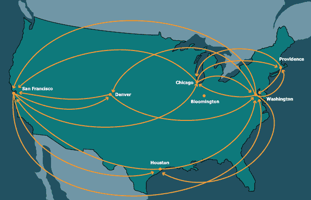

# 17.1 介绍图

> 原文：[`dcic-world.org/2025-08-27/intro-graphs.html`](https://dcic-world.org/2025-08-27/intro-graphs.html)

|   17.1.1 理解图 |
| --- |
|   17.1.2 表示 |
|   17.1.2.1 通过名称的链接 |
|   17.1.2.2 通过索引的链接 |
|   17.1.2.3 边的列表 |
|   17.1.2.4 抽象表示 |
|   17.1.3 图的复杂性度量 |

在从无环到循环中，我们介绍了一种特殊的共享方式：当数据变为循环时，即存在这样的值，从它们遍历其他可到达的值最终会回到你开始的地方。具有这种特征的数据被称为图。技术上，循环不是成为图的必要条件；树或 DAG 也被视为（退化的）图。然而，在本节中，我们感兴趣的图是有循环潜力的图。

许多非常重要的数据都是图表。例如，社交媒体中的人和联系构成了一个图：人是节点或顶点，联系（如友谊）是链接或边。它们形成了一个图，因为对于许多人来说，如果你跟随他们的朋友，然后是朋友的朋友，你最终会回到你开始的地方。（最简单的情况是，当两个人互为朋友时发生这种情况。）互联网同样是一个图：节点是页面，边是页面之间的链接。互联网是一个图：节点是机器，边是机器之间的链接。交通网络是一个图：例如，城市是节点，它们之间的边是交通链接。等等。因此，理解图对于表示和处理大量有趣的真实世界数据至关重要。

图不仅从实用角度而且从原则角度来看都重要且有趣。遍历可以结束在开始的地方这一性质意味着传统的处理方法将不再适用：如果它盲目地处理它访问的每个节点，它可能会陷入无限循环。因此，我们需要为我们的程序提供更好的结构化方案。此外，图具有非常丰富的结构，这使得它们适合进行几个有趣的计算。我们将在下面研究图的这两个方面。

#### 17.1.1 理解图 "链接至此")

再次考虑我们之前看到的二叉树 [重新审视相等性]。现在让我们通过创建具有循环的“树”来扭曲“树”的定义，即具有指向自身的节点的树（在 `identical` 的意义上）。正如我们之前所看到的 [从无环到循环]，创建这样的结构并不完全直接，但之前所看到的 [从函数中流出的流] 可以帮助我们在这里，通过允许我们挂起循环链接的评估。也就是说，我们不仅要使用 `rec`，还必须使用一个函数来延迟评估。反过来，我们必须更新字段的注释。由于这些将不再是“树”，我们将使用一个暗示性但并非完全错误的名称：

```py
data BinT:
  | leaf
  | node(v, l :: ( -> BinT), r :: ( -> BinT))
end
```

现在我们尝试构造一些循环值。这里有一些例子：

```py
rec tr = node("rec", lam(): tr end, lam(): tr end)
t0 = node(0, lam(): leaf end, lam(): leaf end)
t1 = node(1, lam(): t0 end, lam(): t0 end)
t2 = node(2, lam(): t1 end, lam(): t1 end)
```

现在我们尝试计算 `BinT` 的大小。这里有一个明显的程序：

```py
fun sizeinf(t :: BinT) -> Number:
  cases (BinT) t:
    | leaf => 0
    | node(v, l, r) =>
      ls = sizeinf(l())
      rs = sizeinf(r())
      1 + ls + rs
  end
end
```

（我们稍后会看到为什么我们称之为 `sizeinf`。）

> 现在行动起来！
> 
> > 当我们调用 `sizeinf(tr)` 时会发生什么？

它进入了一个无限循环：因此其名称中的 `inf`。

“大小”有两个非常不同的含义。一个是，“我们可以遍历一条边多少次？”另一个是，“作为数据结构一部分构建了多少个不同的节点？”在树的定义中，这两个是相同的。在有向无环图（DAG）中，前者超过后者，但只是有限的。在一般图中，前者可以无限超过后者。在像 `tr` 这样的数据的情况下，我们实际上可以无限次遍历边。但构建的节点总数只有一个！让我们用 `size` 函数的测试用例来写这个，该函数将被定义：

```py
check:
  size(tr) is 1
  size(t0) is 1
  size(t1) is 2
  size(t2) is 3
end
```

很明显，我们需要以某种方式记住我们之前访问过的节点：也就是说，我们需要一个带有“记忆”的计算。原则上这很简单：我们只需创建一个额外的数据结构来检查一个节点是否已经被计数。只要我们正确更新这个数据结构，我们就应该一切就绪。下面是一个实现。

```py
fun sizect(t :: BinT) -> Number:
  fun szacc(shadow t :: BinT, seen :: List<BinT>) -> Number:
    if has-id(seen, t):
      0
    else:
      cases (BinT) t:
        | leaf => 0
        | node(v, l, r) =>
          ns = link(t, seen)
          ls = szacc(l(), ns)
          rs = szacc(r(), ns)
          1 + ls + rs
      end
    end
  end
  szacc(t, empty)
end
```

额外的参数 `seen` 被称为累加器，因为它“累积”了已看到的节点列表。请注意，这也可以是一个集合；它不一定要是一个列表。它需要的支持函数检查给定的节点是否已经被看到：

```py
fun has-id<A>(seen :: List<A>, t :: A):
  cases (List) seen:
    | empty => false
    | link(f, r) =>
      if f <=> t: true
      else: has-id(r, t)
      end
  end
end
```

这怎么做？嗯，`sizect(tr)` 确实是 `1`，但 `sizect(t1)` 是 `3`，而 `sizect(t2)` 是 `7`！

> 现在行动起来！
> 
> > 解释为什么这些答案是这样的。

基本问题是我们没有做好记忆工作！看看这两行：

```py
ls = szacc(l(), ns)
rs = szacc(r(), ns) 
```

在遍历左分支时看到的节点实际上被忘记了，因为我们遍历右分支时唯一记住的节点是 `ns` 中的那些：即当前节点和那些“更高”访问过的节点。因此，任何“跨边”的节点都被计算了两次。

因此，补救措施是记住我们访问过的每个节点。然后，当我们没有更多节点要处理时，而不是只返回大小，我们应该返回到目前为止访问的所有节点。这确保了具有多个路径到达的节点只在一个路径上被访问，而不是多次。这个逻辑是从每次遍历中返回两个值——大小和所有已访问的节点——而不是只返回一个。

```py
fun size(t :: BinT) -> Number:
  fun szacc(shadow t :: BinT, seen :: List<BinT>)
    -> {n :: Number, s :: List<BinT>}:
    if has-id(seen, t):
      {n: 0, s: seen}
    else:
      cases (BinT) t:
        | leaf => {n: 0, s: seen}
        | node(v, l, r) =>
          ns = link(t, seen)
          ls = szacc(l(), ns)
          rs = szacc(r(), ls.s)
          {n: 1 + ls.n + rs.n, s: rs.s}
      end
    end
  end
  szacc(t, empty).n
end
```

确实，这个函数满足上述测试。

#### 17.1.2 表示 "链接到这里")

我们上面看到的图的表示确实是为创建循环数据迈出的第一步，但它并不优雅。在所有地方都写 `lam`，并记住将函数应用到 `()` 上以获得实际值，既容易出错又不够优雅。因此，在这里我们探索了其他更传统且更容易操作的图的表示。

存在许多表示图的方法，选择哪种表示取决于几个因素：

1.  图的结构，特别是，其密度。我们将在稍后进一步讨论这个问题 [图的复杂性测量]).

1.  由外部源提供数据的表示。有时简单地适应他们的表示可能更容易；特别是，在某些情况下可能甚至没有选择。

1.  编程语言提供的特性，使得某些表示比其他表示更难使用。

在 [集合的多种变体] 中，我们探讨了为一种数据类型拥有许多不同表示的想法。正如我们将看到的，这对于图来说也是正确的。因此，如果我们能够达到一个通用的接口来处理图，那么所有后续的程序都可以用这个接口来编写，而不需要过度依赖于底层表示。

在表示方面，我们需要三个主要的东西：

1.  构建图的一种方法。

1.  一种识别（即区分）图中的节点或顶点的方法。

1.  给定一种识别节点的方法，一种获取该节点在图中的邻居的方法。

任何满足这些属性的接口都足够。为了简单起见，我们将专注于其中的第二和第三个，并且不会抽象化构建图的过程。

我们的运行示例将是一个图，其节点是美国的城市，边是它们之间的直飞连接：



##### 17.1.2.1 通过名称链接 "链接到这里")

这是我们的第一种表示。我们将假设每个节点都有一个独特的名称（当使用该名称在数据存储库中查找信息时，有时被称为键）。然后，一个节点就是一个键，一些关于该节点的信息，以及一个引用其他节点的键列表：

```py
type Key = String

data KeyedNode:
  | keyed-node(key :: Key, content, adj :: List<Key>)
end

type KNGraph = List<KeyedNode>

type Node = KeyedNode
type Graph = KNGraph
```

（这里我们假设我们的键是字符串。）

这是一个此类图的实例：前缀 `kn-` 代表“键节点”。

```py
kn-cities :: Graph = block:
  knWAS = keyed-node("was", "Washington", [list: "chi", "den", "saf", "hou", "pvd"])
  knORD = keyed-node("chi", "Chicago", [list: "was", "saf", "pvd"])
  knBLM = keyed-node("bmg", "Bloomington", [list: ])
  knHOU = keyed-node("hou", "Houston", [list: "was", "saf"])
  knDEN = keyed-node("den", "Denver", [list: "was", "saf"])
  knSFO = keyed-node("saf", "San Francisco", [list: "was", "den", "chi", "hou"])
  knPVD = keyed-node("pvd", "Providence", [list: "was", "chi"])
  [list: knWAS, knORD, knBLM, knHOU, knDEN, knSFO, knPVD]
end
```

给定一个键，以下是查找其邻居的方法：

```py
fun find-kn(key :: Key, graph :: Graph) -> Node:
  matches = for filter(n from graph):
    n.key == key
  end
  matches.first # there had better be exactly one!
end
```

> 练习
> 
> > 将函数中的注释转换为关于数据的不变量。将这个不变量作为细化并添加到图的声明中。

有这个支持，我们可以轻松地查找邻居：

```py
fun kn-neighbors(city :: Key,  graph :: Graph) -> List<Key>:
  city-node = find-kn(city, graph)
  city-node.adj
end
```

当涉及到测试时，一些测试很容易编写。然而，其他测试可能需要描述整个节点，这可能很麻烦，因此为了检查我们的实现，只需检查结果的一部分就足够了：

```py
check:
  ns = kn-neighbors("hou", kn-cities)

  ns is [list: "was", "saf"]

  map(_.content, map(find-kn(_, kn-cities), ns)) is
    [list: "Washington", "San Francisco"]
end
```

##### 17.1.2.2 通过索引链接 "链接至此")

在某些语言中，使用数字作为名称是很常见的。当数字可以用来在恒定时间内访问一个元素时（以限制可访问元素的数量为代价），这尤其有用。在这里，我们使用一个列表——<wbr>它不提供对任意元素的恒定时间访问——<wbr>来展示这个概念。大部分内容将与我们之前看到的内容非常相似；我们将在最后讨论一个关键差异。

首先，数据类型：前缀 `ix-` 代表“索引”。

```py
data IndexedNode:
  | idxed-node(content, adj :: List<Number>)
end

type IXGraph = List<IndexedNode>

type Node = IndexedNode
type Graph = IXGraph
```

我们现在的图看起来是这样的：

```py
ix-cities :: Graph = block:
  inWAS = idxed-node("Washington", [list: 1, 4, 5, 3, 6])
  inORD = idxed-node("Chicago", [list: 0, 5, 6])
  inBLM = idxed-node("Bloomington", [list: ])
  inHOU = idxed-node("Houston", [list: 0, 5])
  inDEN = idxed-node("Denver", [list: 0, 5])
  inSFO = idxed-node("San Francisco", [list: 0, 4, 3])
  inPVD = idxed-node("Providence", [list: 0, 1])
  [list: inWAS, inORD, inBLM, inHOU, inDEN, inSFO, inPVD]
end
```

其中我们假设索引从 `0` 开始。要找到一个节点：

```py
fun find-ix(idx :: Key, graph :: Graph) -> Node:
  lists.get(graph, idx)
end
```

然后，我们可以几乎像以前一样找到邻居：

```py
fun ix-neighbors(city :: Key,  graph :: Graph) -> List<Key>:
  city-node = find-ix(city, graph)
  city-node.adj
end
```

最后，我们的测试也看起来相似：

```py
check:
  ns = ix-neighbors(3, ix-cities)

  ns is [list: 0, 5]

  map(_.content, map(find-ix(_, ix-cities), ns)) is
    [list: "Washington", "San Francisco"]
end
```

这里发生了一些更深入的事情。键节点具有内在键：键是数据本身的一部分。因此，给定一个节点，我们可以确定其键。相比之下，索引节点表示外在键：键是在数据外部确定的，特别是通过某些其他数据结构中的位置。给定一个节点而不是整个图，我们无法知道其键是什么。即使给定整个图，我们也只能通过使用 `identical` 来确定其键，这是一个相当不令人满意的方法来恢复基本信息。这突出了使用外在键表示信息的一个弱点。（作为回报，外在键表示更容易重新组装成新的数据集合，因为没有键冲突的危险：没有内在键可以冲突。）

##### 17.1.2.3 边的列表 "链接至此")

我们之前看到的表示优先考虑了节点，使得边只是节点信息的一部分。相反，我们可以使用一个使边成为主要部分的表示，节点只是位于其端点的实体：前缀 `le-` 代表“边的列表”。

```py
data Edge:
  | edge(src :: String, dst :: String)
end

type LEGraph = List<Edge>

type Graph = LEGraph
```

然后，我们的航班网络变为：

```py
le-cities :: Graph =
  [list:
    edge("Washington", "Chicago"),
    edge("Washington", "Denver"),
    edge("Washington", "San Francisco"),
    edge("Washington", "Houston"),
    edge("Washington", "Providence"),
    edge("Chicago", "Washington"),
    edge("Chicago", "San Francisco"),
    edge("Chicago", "Providence"),
    edge("Houston", "Washington"),
    edge("Houston", "San Francisco"),
    edge("Denver", "Washington"),
    edge("Denver", "San Francisco"),
    edge("San Francisco", "Washington"),
    edge("San Francisco", "Denver"),
    edge("San Francisco", "Houston"),
    edge("Providence", "Washington"),
    edge("Providence", "Chicago") ]
```

注意，在这个表示中，没有连接到图中其他节点的节点根本不会出现！因此，你需要一个辅助数据结构来跟踪所有节点。

要获得邻居集：

```py
fun le-neighbors(city :: Key, graph :: Graph) -> List<Key>:
  neighboring-edges = for filter(e from graph):
    city == e.src
  end
  names = for map(e from neighboring-edges): e.dst end
  names
end
```

当然：

```py
check:
  le-neighbors("Houston", le-cities) is
    [list: "Washington", "San Francisco"]
end
```

然而，这种表示方法使得在不复制的情况下存储关于节点的复杂信息变得困难。因为节点通常具有丰富的信息，而边的相关信息往往较弱，所以我们通常更喜欢以节点为中心的表示。当然，另一种方法是认为节点名称是通向其他数据结构的键，我们可以从中检索关于节点的丰富信息。

##### 17.1.2.4 抽象表示 "链接至此")

我们希望有一个通用的表示方法，使我们能够抽象出具体的实现。我们将假设我们广泛地有一个具有`content`的`Node`概念，一个`Key`的概念（无论是否内在），以及根据一个键和图获取邻居——<wbr>一个键的列表——<wbr>的方法。这对于接下来的内容是足够的。然而，我们仍然需要选择具体的键来编写示例和测试。为了简单起见，我们将使用字符串键 [通过名称链接]。

#### 17.1.3 图复杂度的度量 "链接至此")

在我们开始定义图上的算法之前，我们应该考虑如何衡量图的大小。一个图有两个组成部分：它的节点和它的边。一些算法将专注于节点（例如，访问每一个节点），而其他算法将专注于边，还有一些将两者都考虑在内。那么我们使用哪个作为计数操作的基础：节点还是边？

如果我们可以将这两个度量简化为一个，那将很有帮助。为了看看这是否可能，假设一个图有 \(k\) 个节点。那么它的边数有一个很大的范围，有两个极端：

+   没有两个节点是相连的。因此，没有任何边。

+   每两个节点都是相连的。因此，边的数量本质上与节点对的数量相同。

因此，节点的数量可以显著少于甚至显著多于边的数量。如果这种差异是一个常数的问题，我们可以忽略它；但事实并非如此。当图趋向于前一种极限时，节点与边的比率接近 \(k\)（或者在没有任何边的奇怪情况下甚至超过它，但这种图并不很有趣）；当它趋向于后一种极限时，是边与节点的比率接近 \(k²\)。换句话说，这两种度量都不能通过一个与图无关的常数来包含另一种度量。

因此，当我们想要讨论图上算法的复杂性时，我们必须考虑节点和边的数量。在一个连通图中 A graph is connected if, from every node, we can traverse edges to get to every other node.，然而，必须至少有与节点一样多的边，这意味着边的数量支配了节点的数量。由于我们通常一次处理一个连通图，或者一次处理图的连通部分，我们可以通过边的数量来限制节点的数量。

#### 17.1.1 理解图 "链接至此")

再次考虑我们之前看到的二叉树 [重新审视相等性]。现在让我们尝试通过创建具有循环的“树”来扭曲“树”的定义，即具有指向自身的节点的树（在 `identical` 的意义上）。正如我们之前看到的 [从无环到循环]，创建这样的结构并不完全直接，但之前看到的 [从函数中流出的流] 可以帮助我们，通过允许我们挂起循环链接的评估。也就是说，我们不仅要使用 `rec`，还必须使用一个函数来延迟评估。反过来，我们必须更新字段的注释。由于这些将不再是“树”，我们将使用一个暗示性但并非完全错误的名称：

```py
data BinT:
  | leaf
  | node(v, l :: ( -> BinT), r :: ( -> BinT))
end
```

现在我们尝试构造一些循环值。这里有一些例子：

```py
rec tr = node("rec", lam(): tr end, lam(): tr end)
t0 = node(0, lam(): leaf end, lam(): leaf end)
t1 = node(1, lam(): t0 end, lam(): t0 end)
t2 = node(2, lam(): t1 end, lam(): t1 end)
```

现在我们尝试计算 `BinT` 的大小。这里有一个明显的程序：

```py
fun sizeinf(t :: BinT) -> Number:
  cases (BinT) t:
    | leaf => 0
    | node(v, l, r) =>
      ls = sizeinf(l())
      rs = sizeinf(r())
      1 + ls + rs
  end
end
```

（我们稍后会看到为什么我们称之为 `sizeinf`。）

> 现在行动！
> 
> > 当我们调用 `sizeinf(tr)` 时会发生什么？

它进入了一个无限循环：因此它的名字中有 `inf`。

“大小”有两个非常不同的含义。一个是，“我们可以遍历一条边多少次？”另一个是，“作为数据结构一部分构建了多少个不同的节点？”在树的情况下，根据定义，这两个是相同的。在有向无环图（DAG）的情况下，前者超过后者，但只是有限的数量。在一般图的情况下，前者可以无限地超过后者。在像 `tr` 这样的数据的情况下，我们实际上可以无限次地遍历边。但构建的节点总数只有一个！让我们用 `size` 函数的测试用例来写这个，该函数尚未定义：

```py
check:
  size(tr) is 1
  size(t0) is 1
  size(t1) is 2
  size(t2) is 3
end
```

很明显，我们需要以某种方式记住我们之前访问过的节点：也就是说，我们需要一个带有“记忆”的计算。原则上这是很容易的：我们只需创建一个额外的数据结构来检查一个节点是否已经被计数。只要我们正确更新这个数据结构，我们就应该一切就绪。这里是一个实现。

```py
fun sizect(t :: BinT) -> Number:
  fun szacc(shadow t :: BinT, seen :: List<BinT>) -> Number:
    if has-id(seen, t):
      0
    else:
      cases (BinT) t:
        | leaf => 0
        | node(v, l, r) =>
          ns = link(t, seen)
          ls = szacc(l(), ns)
          rs = szacc(r(), ns)
          1 + ls + rs
      end
    end
  end
  szacc(t, empty)
end
```

额外的参数 `seen` 被称为累加器，因为它“累加”了已访问节点的列表。请注意，这也可以是一个集合；它不一定要是一个列表。它需要的支持函数检查给定的节点是否已经被看到：

```py
fun has-id<A>(seen :: List<A>, t :: A):
  cases (List) seen:
    | empty => false
    | link(f, r) =>
      if f <=> t: true
      else: has-id(r, t)
      end
  end
end
```

这是如何工作的？嗯，`sizect(tr)` 确实是 `1`，但 `sizect(t1)` 是 `3`，而 `sizect(t2)` 是 `7`！

> 现在行动！
> 
> > 解释为什么这些答案是这样出现的。

基本问题是我们没有做好记住的工作！看看这两行：

```py
ls = szacc(l(), ns)
rs = szacc(r(), ns) 
```

在遍历左分支时看到的节点实际上被遗忘，因为我们遍历右分支时唯一记住的节点是那些在 `ns` 中的：即当前节点和那些“更高”访问过的节点。因此，任何“跨边”的节点都被计算了两次。

因此，补救措施是记住我们访问过的每个节点。然后，当我们没有更多节点要处理时，而不仅仅是返回大小，我们还应该返回到目前为止访问的所有节点。这确保了具有多个路径到达的节点只在一个路径上被访问，而不是多次访问。这个逻辑是从每次遍历中返回两个值——大小和所有已访问的节点——而不是只返回一个。

```py
fun size(t :: BinT) -> Number:
  fun szacc(shadow t :: BinT, seen :: List<BinT>)
    -> {n :: Number, s :: List<BinT>}:
    if has-id(seen, t):
      {n: 0, s: seen}
    else:
      cases (BinT) t:
        | leaf => {n: 0, s: seen}
        | node(v, l, r) =>
          ns = link(t, seen)
          ls = szacc(l(), ns)
          rs = szacc(r(), ls.s)
          {n: 1 + ls.n + rs.n, s: rs.s}
      end
    end
  end
  szacc(t, empty).n
end
```

当然，这个函数满足上述测试。

#### 17.1.2 表示法 "链接至此")

我们上面看到的图的表示法当然是为创建循环数据迈出的第一步，但它并不非常优雅。在所有地方都写`lam`，并记得将函数应用到`()`以获得实际值，这既容易出错又不够优雅。因此，在这里，我们将探索其他更传统且更容易操作的图表示法。

表示图的方法有很多，选择哪种表示方式取决于多个因素：

1.  图的结构，特别是其密度。我们将在后面进一步讨论这个问题 [图的复杂性度量]。

1.  由外部来源提供数据的数据表示法。有时简单地适应它们的表示可能更容易；特别是，在某些情况下，甚至可能没有选择。

1.  编程语言提供的特性，这些特性使得某些表示法比其他表示法更难使用。

在[集合的几种变体]中，我们探讨了为一种数据类型拥有许多不同表示法的思想。正如我们将看到的，这一点对图来说同样适用。因此，如果能找到一个通用的接口来处理图，那么所有后续的程序都可以用这个接口来编写，而不需要过度依赖底层表示。

在表示方面，我们需要三个主要的东西：

1.  构建图的方法。

1.  识别（即区分）图中节点或顶点的方法。

1.  给定识别节点的方法，获取该节点在图中的邻居的方法。

任何满足这些属性的接口都足够了。为了简单起见，我们将关注这些属性中的第二和第三个，而不是抽象化构建图的过程。

我们的运行示例将是一个图，其节点是美国的城市，边是它们之间的直飞连接：


##### 17.1.2.1 按名称链接 "链接至此")

这是我们的第一个表示法。我们将假设每个节点都有一个唯一的名称（当这种名称用于在数据存储库中查找信息时，有时被称为键）。然后，一个节点就是一个键，一些关于该节点的信息，以及一个指向其他节点的键列表：

```py
type Key = String

data KeyedNode:
  | keyed-node(key :: Key, content, adj :: List<Key>)
end

type KNGraph = List<KeyedNode>

type Node = KeyedNode
type Graph = KNGraph
```

（这里我们假设我们的键是字符串。）

这是一个此类图的实例：前缀 `kn-` 代表“键节点”。

```py
kn-cities :: Graph = block:
  knWAS = keyed-node("was", "Washington", [list: "chi", "den", "saf", "hou", "pvd"])
  knORD = keyed-node("chi", "Chicago", [list: "was", "saf", "pvd"])
  knBLM = keyed-node("bmg", "Bloomington", [list: ])
  knHOU = keyed-node("hou", "Houston", [list: "was", "saf"])
  knDEN = keyed-node("den", "Denver", [list: "was", "saf"])
  knSFO = keyed-node("saf", "San Francisco", [list: "was", "den", "chi", "hou"])
  knPVD = keyed-node("pvd", "Providence", [list: "was", "chi"])
  [list: knWAS, knORD, knBLM, knHOU, knDEN, knSFO, knPVD]
end
```

给定一个键，这是查找其邻居的方法：

```py
fun find-kn(key :: Key, graph :: Graph) -> Node:
  matches = for filter(n from graph):
    n.key == key
  end
  matches.first # there had better be exactly one!
end
```

> 练习
> 
> > 将函数中的注释转换为关于数据的不变量。将这个不变量作为细化并添加到图的声明中。

有这个支持，我们可以轻松地查找邻居：

```py
fun kn-neighbors(city :: Key,  graph :: Graph) -> List<Key>:
  city-node = find-kn(city, graph)
  city-node.adj
end
```

当涉及到测试时，有些测试很容易编写。然而，其他测试可能需要描述整个节点，这可能很麻烦，因此为了检查我们的实现，只需检查结果的一部分就足够了：

```py
check:
  ns = kn-neighbors("hou", kn-cities)

  ns is [list: "was", "saf"]

  map(_.content, map(find-kn(_, kn-cities), ns)) is
    [list: "Washington", "San Francisco"]
end
```

##### 17.1.2.2 通过索引的链接 "链接至此")

在某些语言中，使用数字作为名称是常见的。当数字可以用来在常数时间内访问一个元素时（以限制可以访问的元素数量为代价），这特别有用。在这里，我们使用一个列表——<wbr>它不提供对任意元素的常数时间访问——<wbr>来展示这个概念。大部分内容将与我们之前看到的内容非常相似；我们将在最后讨论一个关键差异。

首先，数据类型：前缀 `ix-` 代表“索引”。

```py
data IndexedNode:
  | idxed-node(content, adj :: List<Number>)
end

type IXGraph = List<IndexedNode>

type Node = IndexedNode
type Graph = IXGraph
```

我们现在的图看起来是这样的：

```py
ix-cities :: Graph = block:
  inWAS = idxed-node("Washington", [list: 1, 4, 5, 3, 6])
  inORD = idxed-node("Chicago", [list: 0, 5, 6])
  inBLM = idxed-node("Bloomington", [list: ])
  inHOU = idxed-node("Houston", [list: 0, 5])
  inDEN = idxed-node("Denver", [list: 0, 5])
  inSFO = idxed-node("San Francisco", [list: 0, 4, 3])
  inPVD = idxed-node("Providence", [list: 0, 1])
  [list: inWAS, inORD, inBLM, inHOU, inDEN, inSFO, inPVD]
end
```

其中我们假设索引从 `0` 开始。要找到一个节点：

```py
fun find-ix(idx :: Key, graph :: Graph) -> Node:
  lists.get(graph, idx)
end
```

我们可以像以前一样几乎找到邻居：

```py
fun ix-neighbors(city :: Key,  graph :: Graph) -> List<Key>:
  city-node = find-ix(city, graph)
  city-node.adj
end
```

最后，我们的测试看起来也很相似：

```py
check:
  ns = ix-neighbors(3, ix-cities)

  ns is [list: 0, 5]

  map(_.content, map(find-ix(_, ix-cities), ns)) is
    [list: "Washington", "San Francisco"]
end
```

这里正在进行一些更深入的事情。键节点具有内在键：键是数据本身的一部分。因此，给定一个节点，我们可以确定其键。相比之下，索引节点表示外部的键：键是在数据外部确定的，特别是在某些其他数据结构的位置。给定一个节点而不是整个图，我们无法知道其键是什么。即使给定整个图，我们也只能通过使用 `identical` 来确定其键，这是一个相当不令人满意的方法来恢复基本信息。这突出了使用信息的外部键表示的弱点。（作为回报，外部键表示更容易重新组装成新的数据集合，因为没有键冲突的危险：没有内在键可以冲突。）

##### 17.1.2.3 边列表 "链接至此")

我们之前看到的表示优先考虑了节点，使得边只是节点信息的一部分。相反，我们可以使用一个使边成为主要部分的表示，节点只是位于其末端的实体：前缀 `le-` 代表“边列表”。

```py
data Edge:
  | edge(src :: String, dst :: String)
end

type LEGraph = List<Edge>

type Graph = LEGraph
```

然后，我们的航班网络变成：

```py
le-cities :: Graph =
  [list:
    edge("Washington", "Chicago"),
    edge("Washington", "Denver"),
    edge("Washington", "San Francisco"),
    edge("Washington", "Houston"),
    edge("Washington", "Providence"),
    edge("Chicago", "Washington"),
    edge("Chicago", "San Francisco"),
    edge("Chicago", "Providence"),
    edge("Houston", "Washington"),
    edge("Houston", "San Francisco"),
    edge("Denver", "Washington"),
    edge("Denver", "San Francisco"),
    edge("San Francisco", "Washington"),
    edge("San Francisco", "Denver"),
    edge("San Francisco", "Houston"),
    edge("Providence", "Washington"),
    edge("Providence", "Chicago") ]
```

观察到在这个表示中，没有连接到图中其他节点的节点根本不会显示出来！因此，你需要一个辅助数据结构来跟踪所有节点。

要获得邻居的集合：

```py
fun le-neighbors(city :: Key, graph :: Graph) -> List<Key>:
  neighboring-edges = for filter(e from graph):
    city == e.src
  end
  names = for map(e from neighboring-edges): e.dst end
  names
end
```

并且为了确保：

```py
check:
  le-neighbors("Houston", le-cities) is
    [list: "Washington", "San Francisco"]
end
```

然而，这种表示法使得在不复制的情况下存储关于节点的复杂信息变得困难。因为节点通常具有丰富的信息，而边的信息往往较弱，所以我们通常更喜欢以节点为中心的表示。当然，另一种方法是认为节点名称是通向其他数据结构的键，我们可以从中检索有关节点的丰富信息。

##### 17.1.2.4 抽象表示 "链接到这里")

我们希望有一个通用的表示法，使我们能够抽象出具体的实现。我们将假设我们广泛地有一个名为 `Node` 的概念，它具有 `content`，一个名为 `Key`s（是否内禀）的概念，以及给定一个键和图时获取邻居——<wbr>键的列表——<wbr>的方法。这对于以下内容是足够的。然而，我们仍然需要选择具体的键来编写示例和测试。为了简单起见，我们将使用字符串键 [通过名称链接]。

##### 17.1.2.1 通过名称链接 "链接到这里")

这是我们的第一个表示。我们将假设每个节点都有一个唯一的名称（当这种名称用于在数据存储库中查找信息时，有时被称为键）。然后，一个节点就是一个键，一些关于该节点的信息，以及指向其他节点的键的列表：

```py
type Key = String

data KeyedNode:
  | keyed-node(key :: Key, content, adj :: List<Key>)
end

type KNGraph = List<KeyedNode>

type Node = KeyedNode
type Graph = KNGraph
```

（这里我们假设我们的键是字符串。）

这里是一个此类图的实例：前缀 `kn-` 代表“键节点”。

```py
kn-cities :: Graph = block:
  knWAS = keyed-node("was", "Washington", [list: "chi", "den", "saf", "hou", "pvd"])
  knORD = keyed-node("chi", "Chicago", [list: "was", "saf", "pvd"])
  knBLM = keyed-node("bmg", "Bloomington", [list: ])
  knHOU = keyed-node("hou", "Houston", [list: "was", "saf"])
  knDEN = keyed-node("den", "Denver", [list: "was", "saf"])
  knSFO = keyed-node("saf", "San Francisco", [list: "was", "den", "chi", "hou"])
  knPVD = keyed-node("pvd", "Providence", [list: "was", "chi"])
  [list: knWAS, knORD, knBLM, knHOU, knDEN, knSFO, knPVD]
end
```

给定一个键，以下是查找其邻居的方法：

```py
fun find-kn(key :: Key, graph :: Graph) -> Node:
  matches = for filter(n from graph):
    n.key == key
  end
  matches.first # there had better be exactly one!
end
```

> 练习
> 
> > 将函数中的注释转换为关于数据的不变量。将这个不变量作为细化并添加到图的声明中。

有了这个支持，我们可以轻松地查找邻居：

```py
fun kn-neighbors(city :: Key,  graph :: Graph) -> List<Key>:
  city-node = find-kn(city, graph)
  city-node.adj
end
```

当涉及到测试时，有些测试很容易编写。然而，其他测试可能需要描述整个节点，这可能很麻烦，因此为了检查我们的实现，只需检查结果的一部分就足够了：

```py
check:
  ns = kn-neighbors("hou", kn-cities)

  ns is [list: "was", "saf"]

  map(_.content, map(find-kn(_, kn-cities), ns)) is
    [list: "Washington", "San Francisco"]
end
```

##### 17.1.2.2 通过索引链接 "链接到这里")

在某些语言中，使用数字作为名称是很常见的。当数字可以用来在恒定时间内访问元素时（以限制可访问元素的数量为代价），这特别有用。在这里，我们使用一个列表——<wbr>它不提供对任意元素的恒定时间访问——<wbr>来阐述这个概念。大部分内容将与我们之前的内容非常相似；我们将在最后讨论一个关键差异。

首先，数据类型：前缀 `ix-` 代表“索引”。

```py
data IndexedNode:
  | idxed-node(content, adj :: List<Number>)
end

type IXGraph = List<IndexedNode>

type Node = IndexedNode
type Graph = IXGraph
```

我们现在的图看起来是这样的：

```py
ix-cities :: Graph = block:
  inWAS = idxed-node("Washington", [list: 1, 4, 5, 3, 6])
  inORD = idxed-node("Chicago", [list: 0, 5, 6])
  inBLM = idxed-node("Bloomington", [list: ])
  inHOU = idxed-node("Houston", [list: 0, 5])
  inDEN = idxed-node("Denver", [list: 0, 5])
  inSFO = idxed-node("San Francisco", [list: 0, 4, 3])
  inPVD = idxed-node("Providence", [list: 0, 1])
  [list: inWAS, inORD, inBLM, inHOU, inDEN, inSFO, inPVD]
end
```

其中我们假设索引从 `0` 开始。要找到一个节点：

```py
fun find-ix(idx :: Key, graph :: Graph) -> Node:
  lists.get(graph, idx)
end
```

我们可以像以前一样找到邻居：

```py
fun ix-neighbors(city :: Key,  graph :: Graph) -> List<Key>:
  city-node = find-ix(city, graph)
  city-node.adj
end
```

最后，我们的测试看起来也相似：

```py
check:
  ns = ix-neighbors(3, ix-cities)

  ns is [list: 0, 5]

  map(_.content, map(find-ix(_, ix-cities), ns)) is
    [list: "Washington", "San Francisco"]
end
```

这里正在进行一些更深入的事情。带键的节点具有内在键：键是数据本身的一部分。因此，仅给定一个节点，我们就可以确定其键。相比之下，索引节点代表外在键：键是在数据之外确定的，特别是在某些其他数据结构中的位置。给定一个节点而不是整个图，我们无法知道其键的用途。即使给定整个图，我们也只能通过使用`identical`来确定其键，这是一种相当令人不满意的方法来恢复基本信息。这突出了使用外在键表示信息的一个弱点。（作为回报，外在键表示更容易重新组装成新的数据集合，因为没有键冲突的危险：没有内在键可以冲突。）

##### 17.1.2.3 边的列表 "链接至此")

我们到目前为止所看到的表示优先考虑了节点，使得边只是节点信息的一部分。我们也可以使用一个使边成为主要的表示，节点只是位于其端点的实体：前缀`le-`代表“边的列表”。

```py
data Edge:
  | edge(src :: String, dst :: String)
end

type LEGraph = List<Edge>

type Graph = LEGraph
```

然后，我们的航班网络变为：

```py
le-cities :: Graph =
  [list:
    edge("Washington", "Chicago"),
    edge("Washington", "Denver"),
    edge("Washington", "San Francisco"),
    edge("Washington", "Houston"),
    edge("Washington", "Providence"),
    edge("Chicago", "Washington"),
    edge("Chicago", "San Francisco"),
    edge("Chicago", "Providence"),
    edge("Houston", "Washington"),
    edge("Houston", "San Francisco"),
    edge("Denver", "Washington"),
    edge("Denver", "San Francisco"),
    edge("San Francisco", "Washington"),
    edge("San Francisco", "Denver"),
    edge("San Francisco", "Houston"),
    edge("Providence", "Washington"),
    edge("Providence", "Chicago") ]
```

注意，在这个表示中，与图中其他节点不相连的节点根本不会出现！因此，你需要一个辅助数据结构来跟踪所有节点。

要获得邻居集：

```py
fun le-neighbors(city :: Key, graph :: Graph) -> List<Key>:
  neighboring-edges = for filter(e from graph):
    city == e.src
  end
  names = for map(e from neighboring-edges): e.dst end
  names
end
```

并且为了确保：

```py
check:
  le-neighbors("Houston", le-cities) is
    [list: "Washington", "San Francisco"]
end
```

然而，这种表示法使得在不复制的情况下存储关于节点的复杂信息变得困难。因为节点通常具有丰富的信息，而边的相关信息往往较弱，所以我们通常更喜欢以节点为中心的表示。当然，另一种方法是认为节点名称是通向某些其他数据结构的键，我们可以从中检索有关节点的丰富信息。

##### 17.1.2.4 抽象表示 "链接至此")

我们希望有一个通用的表示，使我们能够抽象出具体的实现。我们将假设我们广泛地有一个具有`content`的`Node`概念，一个`Key`s（是否内在）的概念，以及给定一个键和一个图时获取邻居——<wbr>键的列表——<wbr>的方法。这对于以下内容是足够的。然而，我们仍然需要选择具体的键来编写示例和测试。为了简单起见，我们将使用字符串键 [通过名称链接]。

#### 17.1.3 为图测量复杂性 "链接至此")

在我们开始定义图上的算法之前，我们应该考虑如何衡量图的大小。一个图有两个组成部分：它的节点和它的边。一些算法将专注于节点（例如，访问每一个节点），而其他算法将专注于边，还有一些将两者都考虑在内。那么，我们以什么作为计数操作的基础：节点还是边？

如果我们可以将这两个度量简化为一个，那就好了。为了看看这是否可能，假设一个图有 \(k\) 个节点。那么它的边数有一个很大的范围，这两个极端是：

+   没有两个节点是连接的。那么根本就没有边。

+   每两个节点都相互连接。那么边的数量实际上与节点对的数量相同。

因此，节点的数量可以显著少于甚至显著多于边的数量。如果这种差异只是常数的问题，我们可以忽略它；但事实并非如此。当图趋向于前一种极端时，节点与边的比率接近 \(k\)（甚至在没有边的奇特情况下，边的数量甚至超过 \(k\)，但这种图并不很有趣）；当它趋向于后一种极端时，是边与节点的比率接近 \(k²\)。换句话说，这两种度量都不能通过一个与图无关的常数来包含另一种度量。

因此，当我们想要讨论图上的算法复杂性时，我们必须考虑节点数和边数的规模。在一个连通图中（如果从每个节点出发，我们可以通过边到达图中的每个其他节点，则称该图为连通图），然而，边的数量必须至少与节点的数量一样多，这意味着边的数量决定了节点的数量。由于我们通常一次处理一个连通图或图的连通部分，我们可以通过边的数量来限制节点的数量。
