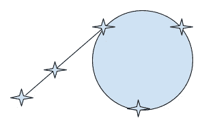

# 21 检测循环🔗

> 原文：[`dcic-world.org/2025-08-27/cycle-detection.html`](https://dcic-world.org/2025-08-27/cycle-detection.html)

| |   21.1 一个运行示例 |
| --- | --- |
| |   21.2 类型 |
| |   21.3 第一个检查器 |
| |   21.4 复杂性 |
| |   21.5 一个惊人的改进 |
| |   21.6 测试 |

### 21.1 一个运行示例🔗 "链接到这里")

如你所注意到的，Pyret 将检查并打印循环。例如，

```py
import lists as L

data Pair: p(hd, ref tl) end

p0 = p(0, 0)
p1 = p(1, 1)

p2 = p(2, 3)
p3 = p(3, 4)
p2!{tl: p3}
p3!{tl: p2}

p4 = p(4, p3)
p5 = p(5, p4)

p6 = p(6, "dummy")
p6!{tl: p6}
```

> 现在进行！
> 
> > 绘制上述对，以确保你能看到所有的循环。

因此，我们有两个不参与任何循环行为（`p0` 和 `p1`），两个（`p2` 和 `p3` 是相互循环的），一个（`p6` 是自循环的），以及两个（`p4` 和 `p5` 导致循环）。

### 21.2 类型🔗 "链接到这里")

作为另一个旁白，想象我们尝试对这个程序进行类型检查。我们必须为 `tl` 提供一个类型，但这个类型是什么并不清楚：有时它是一个 `Number`，有时它是一个 `Pair`。然而，我们可能会观察到，如果我们的目标是创建循环数据，那么我们希望 `tl` 指向一个 `Pair` 或者什么都没有。这表明一个有用的类型是：

```py
data Pair: p(hd :: Number, ref tl :: Option<Pair>) end
```

这样我们就可以写

```py
p0 = p(0, none)
p1 = p(1, none)

p2 = p(2, none)
p3 = p(3, none)
p2!{tl: some(p3)}
p3!{tl: some(p2)}
p4 = p(4, some(p3))
p5 = p(5, some(p4))

p6 = p(6, none)
p6!{tl: some(p6)}
```

这可以工作，但我们不得不在所有地方处理 `Option`。由于我们的目标是关注循环，而且这会变得难以管理，所以我们从现在开始忽略有类型的版本。

### 21.3 第一个检查器🔗 "链接到这里")

好的，回到无类型的版本。

所以，让我们来尝试弄清楚，给定一个对，它是否会导致一个循环。类型应该是什么？

```py
cc :: Pair -> Boolean
```

其中 `cc` 代表“检查循环”。

关键的是，这应该是一个全函数：即，它总是终止。

所以让我们写出最明显的解决方案：

```py
fun cc(e):
  fun loop(cur, hist):
    if is-p(cur):
      if L.member-identical(hist, cur):
        true
      else:
        loop(cur!tl, link(cur, hist))
      end
    else:
      false
    end
  end
  loop(e, empty)
end
```

首先，这甚至能终止吗？访问所有节点可能需要一段时间，但循环要求我们在某个地方重新访问之前已经看到的节点。由于我们跟踪这一点，所以我们不能不终止。因此，终止是保证的，函数是全的。确实，所有这些测试都通过了：

```py
check:
  cc(p0) is false
  cc(p1) is false
  cc(p2) is true
  cc(p3) is true
  cc(p4) is true
  cc(p5) is true
  cc(p6) is true
end
```

作为另一个旁白，注意我们本来可以像这样编写这些测试

```py
check:
  p0 violates cc
  p2 satisfies cc
end
```

这将更简洁，但这也可能是误导性的：它可能会暗示 `cc` 是一个期望的特性，所以 `p2` 是一个“好”的实例，而 `p0` 是一个“坏”的实例。然而，`cc` 并不是对质量的判断——它的两个响应具有相等的权重——所以这对后来的读者来说可能会造成困惑。

### 21.4 复杂性🔗 "链接到这里")

现在我们已经确定它将终止，我们可以询问其时间和空间复杂度。首先我们必须决定我们在计算复杂度时到底在计算什么。如果序列是有限的，那么大小显然是序列的大小。但如果它是无限的，我们不想遍历“整个序列”：我们指的是它的有限部分（排除任何重复）。所以两种情况下有意义的度量是`p`节点的数量，即有限的大小。可能只是其中一些会回到自己，所以一个简单的遍历会永远进行下去。

好吧，所以我们要访问每个节点一次。我们跟踪所有节点，以防我们回头，直到我们用完节点或重复一个。因此，空间复杂度是前缀（从起始节点）和循环长度的线性。时间复杂度是那个，但在每个点上，我们都要检查成员资格，所以它是前缀+循环长度的二次。所以：线性空间，二次时间，在前缀+循环的大小上。

现在，一定程度的线性行为是不可避免的：我们显然必须继续前进，直到我们用完或遇到一个循环，所以为了检测循环，让某物与前缀的大小成线性关系（把它去掉）+ 循环的长度（找到循环）似乎是必要的。但我们能改进这个复杂度吗？这似乎不太可能：按照定义，如果我们不记得我们所看到的一切，我们怎么能检查循环呢？

我们的第一直觉可能是，“也许还有另一种时空权衡！”但在这里并不那么清楚。我们的空间是线性的，时间是二次的，所以我们可能认为我们可以把它们颠倒过来。但时间不能小于空间！例如，如果我们有线性时间和二次空间，那就没有意义了，因为我们至少需要二次时间来填充空间。所以这不会很好用。

相反，似乎最好的改进方法是有更好的查找数据结构。我们仍然会占用线性空间——正如我们所说的，线性是不可避免的（我们也不能只是在线性循环的大小上保持线性，因为整个点是我们甚至不知道我们有一个循环，更不用说哪些部分是前缀和哪些部分是循环了）——时间复杂度有望从二次降低到线性乘以某个亚线性。

### 21.5 一个了不起的改进🔗 "链接到此处")

结果证明我们可以做得更好！这被称为乌龟和兔子算法。

我们从两个对序列的引用开始，一个叫做乌龟，另一个叫做兔子。

在每一步，乌龟尝试前进一个节点。如果它不能前进，我们就用完了序列，这就结束了。兔子，作为一个兔子而不是乌龟，尝试前进两个节点。再次，如果它不能前进，我们就用完了序列，这就结束了。否则，两者都前进，并检查它们是否在同一位置。如果它们在同一位置，因为它们最初是在不同的节点上，我们就找到了一个循环！如果它们不在同一位置，那么我们就迭代。

这为什么甚至能工作呢？在有限情况下这是明确的，因为兔子会耗尽下一个节点。我们只需要考虑无限情况。在那里，通常我们有这种情况：



有一些节点前缀，后面跟着一个循环。现在，我们不知道前缀有多长，所以我们不知道兔子比乌龟领先多远。尽管如此，总有一个乌龟进入循环的第一个点。（一定有，因为乌龟总是有进步，前缀只能是有限的。）从这一点开始，我们知道在每一步，两只动物的相对速度是 1。这意味着兔子每一步都会比乌龟“领先”1。我们可以看到，最终，兔子必须追上乌龟——或者，换句话说，乌龟追上兔子！

现在我们来分析一下。乌龟在完成循环的一圈时就会被抓住。因为乌龟每次移动一步，所以总时间是前缀长度加上循环长度。然而，在空间方面，我们不再需要任何历史记录；我们只需要乌龟和兔子的当前位置。因此，我们的时间复杂度是线性的，但空间复杂度现在显著更小：降至常数！

这里是代码：

```py
fun th(e):
  fun loop(tt, hr):
    if tt <=> hr:
      true
    else:
      if is-p(tt) and is-p(hr):
        new-tt = tt!tl
        int-hr = hr!tl
        if is-p(int-hr):
          new-hr = int-hr!tl
          loop(new-tt, new-hr)
        else:
          false
        end
      else:
        false
      end
    end
  end
  loop(e, e!tl)
end
```

### 21.6 测试🔗 "链接到此处")

虽然编写测试可能很有吸引力，

```py
check:
  cc(p0) is false
  cc(p2) is true
end
```

（即与之前相同，但将`cc`替换为`ph`），我们应将其写为以下内容：

```py
check:
  cc(p0) is th(p0)
  cc(p1) is th(p1)
  cc(p2) is th(p2)
  cc(p3) is th(p3)
  cc(p4) is th(p4)
  cc(p5) is th(p5)
  cc(p6) is th(p6)
end
```

这带来了两个优点。首先，如果我们更改示例，我们不需要更新两个测试，只需要一个。但更重要的是，我们希望`pr`是`cc`的优化版本。也就是说，我们期望两者产生相同的结果。我们可以将`cc`视为我们的清晰、参考实现。也就是说，这是基于模型测试的另一个实例。

作为旁白，这个算法并不完全等同于 Pyret 所做的工作，因为我们需要检查任意图性质，而不仅仅是循环。由于用户定义的函数等原因，这也变得复杂起来。

### 21.1 运行示例🔗 "链接到此处")

如您可能已经注意到的，Pyret 会检查并打印循环。例如，

```py
import lists as L

data Pair: p(hd, ref tl) end

p0 = p(0, 0)
p1 = p(1, 1)

p2 = p(2, 3)
p3 = p(3, 4)
p2!{tl: p3}
p3!{tl: p2}

p4 = p(4, p3)
p5 = p(5, p4)

p6 = p(6, "dummy")
p6!{tl: p6}
```

> 现在行动起来！
> 
> > 绘制上述对以确认您看到了所有循环。

因此，我们有两种不参与循环行为的（`p0`和`p1`），两种互相循环的（`p2`和`p3`），一种自循环的（`p6`），以及两种导致循环的（`p4`和`p5`）。

### 21.2 类型🔗 "链接到此处")

作为旁白，想象我们尝试对这个程序进行类型检查。我们必须为`tl`提供一个类型，但这个类型并不明确：有时它是一个`Number`，有时它是一个`Pair`。然而，我们可能会观察到，如果我们的目标是创建循环数据，那么我们希望`tl`指向一个`Pair`或者什么都没有。这表明一个有用的类型是：

```py
data Pair: p(hd :: Number, ref tl :: Option<Pair>) end
```

因此我们可以编写

```py
p0 = p(0, none)
p1 = p(1, none)

p2 = p(2, none)
p3 = p(3, none)
p2!{tl: some(p3)}
p3!{tl: some(p2)}
p4 = p(4, some(p3))
p5 = p(5, some(p4))

p6 = p(6, none)
p6!{tl: some(p6)}
```

这行得通，但我们必须在每个地方处理`Option`。由于我们的目标是关注循环，而且这会变得难以管理，所以我们从现在起忽略有类型的版本。

### 21.3 第一个检查器🔗 "链接至此")

好吧，回到无类型版本。

那么，让我们来弄清楚，给定一个对（Pair），它是否会导致一个循环。类型应该是什么？

```py
cc :: Pair -> Boolean
```

其中`cc`代表“检查循环”。

关键的是，这个函数必须是全称的：即，它总是终止。

所以让我们写下最明显的解决方案：

```py
fun cc(e):
  fun loop(cur, hist):
    if is-p(cur):
      if L.member-identical(hist, cur):
        true
      else:
        loop(cur!tl, link(cur, hist))
      end
    else:
      false
    end
  end
  loop(e, empty)
end
```

首先，这甚至能终止吗？访问所有节点可能需要一段时间，但循环要求我们在某个地方重新访问之前已经看到的节点。由于我们跟踪这一点，我们不可能不终止。因此，终止是保证的，函数是全称的。事实上，所有这些测试都通过了：

```py
check:
  cc(p0) is false
  cc(p1) is false
  cc(p2) is true
  cc(p3) is true
  cc(p4) is true
  cc(p5) is true
  cc(p6) is true
end
```

作为另一个旁白，请注意，我们可以将这些测试写成这样

```py
check:
  p0 violates cc
  p2 satisfies cc
end
```

这将更加简洁，但也会造成误导：它似乎表明`cc`是一个期望的特性，因此`p2`是一个“好”的实例，而`p0`是一个“坏”的实例。然而，`cc`并不是对质量的判断——它的两个响应具有相等的权重——因此这对后来的读者来说可能会造成困惑。

### 21.4 复杂性🔗 "链接至此")

现在我们已经确定它能够终止，我们可以询问其时间和空间复杂度。首先我们必须决定我们在计算复杂度时到底在计算什么。如果序列是有限的，那么大小显然是序列的大小。但如果它是无限的，我们不想遍历“整个序列”：我们指的是它的有限部分（排除任何重复）。因此，在两种情况下，有意义的度量是`p`节点的数量，即有限的尺寸。可能只是其中一些会回到自己，这样简单的遍历就会永远进行下去。

好吧，所以我们会访问每个节点一次。我们跟踪所有节点，以防我们回头，要么直到用完节点，要么重复一个。因此，空间复杂度与前缀（从起始节点开始）和循环长度的总和成线性关系。时间复杂度是线性的，但在每个点上，我们都要检查成员资格，所以它在那个前缀+循环的长度上是二次的。所以：线性空间，二次时间，在前缀+循环的大小上。

现在，一定程度上的线性行为是不可避免的：我们显然必须继续进行，直到用完或遇到一个循环，因此为了检测循环，让某个东西与前缀的大小（将其移除）+ 循环长度（找到循环）似乎至关重要。但我们能否改进这个复杂性？这似乎不太可能：按照定义，如果我们没有记住我们所看到的一切，我们如何检查循环呢？

我们的第一反应可能是，“也许还有另一种时空权衡！”但在这里并不那么清楚。我们的空间是线性的，时间是二次的，所以我们可能认为我们可以互换它们。但时间不能小于空间！例如，如果我们有线性时间和二次空间，那就没有意义了，因为我们至少需要二次时间来填充空间。所以这不会很好用。

相反，提高效率的最佳方式似乎是有更好的查找数据结构。我们仍然会占用线性空间——正如我们所说的，线性空间是不可避免的（而且我们不能仅仅在循环的大小上是线性的，因为整个问题的关键是我们甚至不知道我们有一个循环，更不用说哪些部分是前缀，哪些部分是循环了）——时间复杂度有望从二次降低到线性乘以某个亚线性。

### 21.5 一个惊人的改进🔗 "链接到此处")

结果，我们可以做得更好！这被称为龟兔算法。

我们从两个对序列的引用开始，一个叫做乌龟，另一个叫做兔子。

在每一步，乌龟尝试前进一个节点。如果它不能前进，我们就用完了序列，这就结束了。兔子，作为一个兔子而不是乌龟，尝试前进两个节点。再次，如果它不能前进，我们就用完了序列，这就结束了。否则，两者都前进，并检查它们是否在同一位置。如果它们在同一位置，因为它们最初是在不同的节点上，我们就找到了一个循环！如果它们不在同一位置，那么我们就迭代。

这为什么甚至有效呢？在有限的情况下这是明确的，因为兔子会耗尽下一个节点。我们只需要考虑无限的情况。在那里，通常我们有这种情况：


有一些节点的前缀，然后是一个循环。现在，我们不知道前缀有多长，所以我们不知道兔子比乌龟领先多远。尽管如此，总有一个乌龟进入循环的第一个点。（一定有，因为乌龟总是会有进步，前缀只能是有限的。）从这个点开始，我们知道在每一步，两只动物的相对速度是 1。这意味着兔子每一步“领先”乌龟 1 个节点。我们可以看到，最终，兔子必须追上乌龟——或者，换句话说，乌龟追上兔子！

现在我们来分析一下。乌龟将在完成循环的一圈后被抓住。因为乌龟每次移动一步，所以总时间是前缀长度加上循环长度。然而，在空间方面，我们不再需要任何历史记录；我们只需要乌龟和兔子的当前位置。因此，我们的时间复杂度是线性的，但空间复杂度现在显著减小：降至常数！

这里是代码：

```py
fun th(e):
  fun loop(tt, hr):
    if tt <=> hr:
      true
    else:
      if is-p(tt) and is-p(hr):
        new-tt = tt!tl
        int-hr = hr!tl
        if is-p(int-hr):
          new-hr = int-hr!tl
          loop(new-tt, new-hr)
        else:
          false
        end
      else:
        false
      end
    end
  end
  loop(e, e!tl)
end
```

### 21.6 测试🔗 "链接到此处")

虽然写测试可能很有吸引力，例如

```py
check:
  cc(p0) is false
  cc(p2) is true
end
```

（即，与之前相同，但将 `cc` 替换为 `ph`），我们应将其写为如下所示：

```py
check:
  cc(p0) is th(p0)
  cc(p1) is th(p1)
  cc(p2) is th(p2)
  cc(p3) is th(p3)
  cc(p4) is th(p4)
  cc(p5) is th(p5)
  cc(p6) is th(p6)
end
```

这带来了两个优势。首先，如果我们更改示例，我们不需要更新两个测试，只需一个即可。但更重要的是，我们希望 `pr` 是 `cc` 的优化版本。也就是说，我们期望这两个能产生相同的结果。我们可以将 `cc` 视为我们清晰的、参考的实现。也就是说，这是基于模型测试的另一个实例。

作为补充，这个算法并不完全等同于 Pyret 所做的，因为我们需要检查任意图性质，而不仅仅是循环。由于用户定义的函数等原因，它也很复杂。
