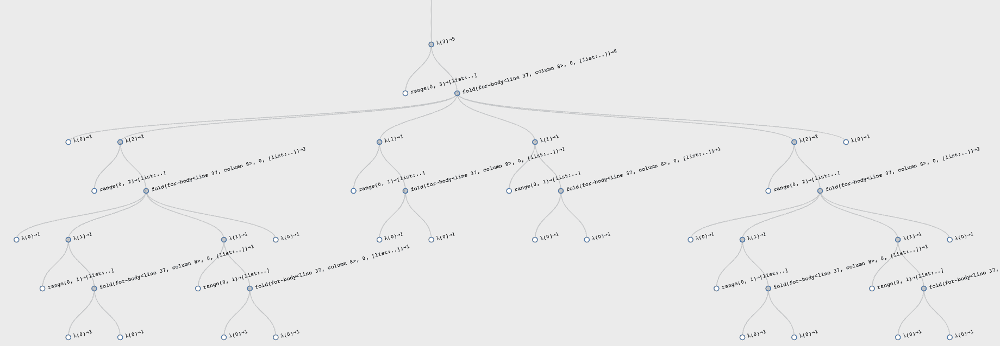
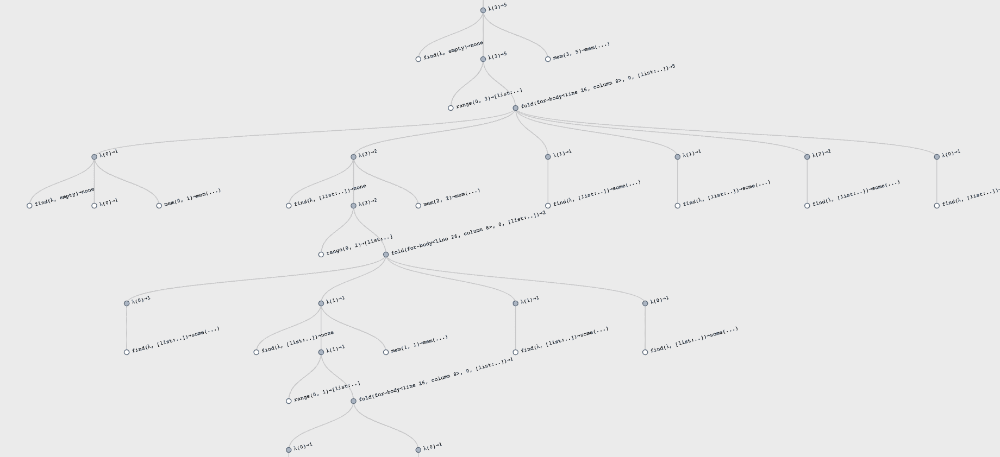

# 22 避免重复计算通过记住答案🔗

> 原文：[`dcic-world.org/2025-08-27/avoid-recomp.html`](https://dcic-world.org/2025-08-27/avoid-recomp.html)

| 22.1 一个有趣的数字序列 |
| --- |
| 22.1.1 使用状态来记住过去的答案 |
| 22.1.2 从计算树到有向无环图 |
| 22.1.3 数字复杂性 |
| 22.1.4 抽象记忆化 |
| 22.2 编辑距离用于拼写纠正 |
| 22.3 自然作为笨拙的打字员 |
| 22.4 动态规划 |
| 22.4.1 使用动态规划的 Catalan 数 |
| 22.4.2 Levenshtein 距离与动态规划 |
| 22.5 对比记忆化和动态规划 |

我们已经在几个实例中提到了☛ 空间-时间权衡。最明显的权衡是在计算“记住”先前结果的情况下，而不是重新计算它们，而是查找并返回答案。这是一个权衡的例子，因为它使用空间（记住先前答案）来代替时间（重新计算答案）。让我们看看我们如何编写这样的计算。

### 22.1 一个有趣的数字序列🔗 "链接到此处")

假设我们想要创建正确括号的表达式，并忽略所有非括号符号。给定一定数量的开括号（等价于闭括号），有多少种创建括号表达式的可能性？

如果我们没有任何开括号，我们能创建的唯一表达式是空表达式。如果我们有一个开括号，我们能构造的只有“()”（由于我们只对正确括号的表达式感兴趣，所以必须有闭括号）。如果我们有两个开括号，我们可以构造“(())”和“()()”。给定三个，我们可以构造“((()))”，“(())()”，“()(())”，“()()()”和“(()())”，总共五种。以此类推。观察每个级别的解决方案都使用了较低一级别所有可能的解决方案，并以所有可能的方式组合。

实际上有一个著名的数学序列对应于这种表达式的数量，称为[加泰罗尼亚数列](http://en.wikipedia.org/wiki/Catalan_number)。它具有快速增长的特性：从上面不起眼的起源开始，第十个加泰罗尼亚数（即加泰罗尼亚数列的第十个元素）是 16796。一个简单的递归公式给出了加泰罗尼亚数，我们可以将其转化为一个简单的程序：

```py
fun catalan(n):
  if n == 0: 1
  else if n > 0:
    for fold(acc from 0, k from range(0, n)):
      acc + (catalan(k) * catalan(n - 1 - k))
    end
  end
end
```

这个函数的测试看起来如下——<wbr>

<catalan-tests> ::=

```py
check:
  catalan(0) is 1
  catalan(1) is 1
  catalan(2) is 2
  catalan(3) is 5
  catalan(4) is 14
  catalan(5) is 42
  catalan(6) is 132
  catalan(7) is 429
  catalan(8) is 1430
  catalan(9) is 4862
  catalan(10) is 16796
  catalan(11) is 58786
end
```

但要小心！当我们计时函数的执行时，我们发现前几个测试运行得非常快，但大约在`10`到`20`之间——<wbr>这取决于你的机器和编程语言实现——<wbr>你应该看到事情开始变慢，先是稍微慢一些，然后效果非常明显。

> 现在就做！
> 
> > 检查在什么值时你开始观察到机器上的显著减速。绘制运行时间与输入大小的图表。这表明了什么？

加泰罗尼亚计算之所以耗时如此之长，正是因为我们之前提到的：在每一级，我们依赖于计算所有较小级别的加泰罗尼亚数；这一计算反过来又需要所有较小级别的数；以此类推。

> 练习
> 
> > 将`catalan`的子计算映射，以了解为什么计算时间会如此爆炸。这个函数的最坏情况时间复杂度是多少？

这里是加泰罗尼亚函数为输入`3`所做的所有子计算的图形表示：

> 

观察到非常对称的计算，反映了公式。

#### 22.1.1 使用状态来记住过去的答案🔗 "链接到此处")

因此，这显然是一个通过以空间换时间可能有所帮助的案例。我们如何做到这一点？我们需要一个记录所有先前答案的记忆概念，在随后的尝试计算它们时，检查它们是否已知，如果是，则直接返回它们而不是重新计算。

> 现在就做！
> 
> > 这个假设基于什么关键假设？

自然地，这假设对于给定的输入，答案总是相同的。正如我们所见，具有状态的函数会自由地违反这一假设，因此典型的状态函数无法利用这种优化。讽刺的是，我们将使用状态来实现这种优化，因此我们将有一个在给定输入上总是返回相同答案的状态函数——并且因此在一个状态函数中使用状态来模拟一个无状态函数。Groovy，伙计！

首先，我们需要一些内存的表示。我们可以想象几个，但这里有一个简单的：

```py
data MemoryCell:
  | mem(in, out)
end

var memory :: List<MemoryCell> = empty
```

现在如何修改`catalan`？我们必须首先查找该值是否已经在`memory`中；如果是，我们返回它而无需任何进一步的计算，但如果没有，那么我们计算结果，将其存储在`memory`中，然后返回它：

```py
fun catalan(n :: Number) -> Number:
  answer = find(lam(elt): elt.in == n end, memory)
  cases (Option) answer block:
    | none =>
      result =
        if n == 0: 1
        else if n > 0:
          for fold(acc from 0, k from range(0, n)):
            acc + (catalan(k) * catalan(n - 1 - k))
          end
        end
      memory := link(mem(n, result), memory)
      result
    | some(v) => v.out
  end
end
```

就这样！现在运行我们之前的测试将揭示答案计算得更快，但除此之外，我们还可以大胆地运行更大的计算，例如`catalan(50)`。

> 现在行动！
> 
> > 追踪这个修改后的函数的调用，看看它执行了多少次调用。

这里是输入`3`的修改后的计算可视化：

> 

观察非对称计算：早期的调用执行计算，而后续的调用只是简单地查找结果。

这个过程，将一个函数转换成一个能够记住其过去答案的版本，被称为记忆化。

#### 22.1.2 从计算树到 DAG🔗 "链接至此")

我们微妙地做的是将计算树转换为同一计算的 DAG，其中等效调用被重用。以前每个调用都会生成大量的递归调用，这又引发了更多的递归调用，而现在我们正在重用之前的递归调用——即，共享之前计算的结果。这实际上是指向之前发生过的递归调用。因此，计算的形状从树转换为调用 DAG。

这有一个重要的复杂度优势。以前我们执行的是超指数数量的调用，而现在我们只对每个输入执行一个调用，并共享所有之前的调用——因此将`catalan(n)`的调用次数减少到与`n`成比例。查找之前调用的结果需要与`memory`的大小成比例的时间（因为我们将其表示为列表；更好的表示会改进这一点），但这只增加了一个线性乘法因子，将整体复杂度降低到输入大小的二次方。这是整体复杂度的显著降低。相比之下，其他记忆化的应用可能只会带来不那么显著的改进，使这种技术的使用成为一个真正的工程权衡。

#### 22.1.3 数字的复杂度🔗 "链接至此")

然而，当我们开始运行更大的计算时，我们可能会开始注意到我们的计算开始比线性增长更长。这是因为我们的数字正在任意增大——例如，`catalan(100)`是`896519947090131496687170070074100632420837521538745909320`——计算数字不再能是常数时间，这与我们之前所说的相反 [输入的大小]。实际上，在处理密码学问题时，操作数字不花费常数时间是基本复杂度结果的关键（例如，现代密码学的假设不可破解性）。（另见 因数分解数字）

#### 22.1.4 抽象记忆化🔗 "链接至此")

现在我们已经实现了所需的复杂性改进，但我们的`catalan`修订定义的结构仍然有些令人不满意：记忆化的行为与卡塔兰数的定义紧密交织在一起，尽管这些在智力上应该是不同的。让我们接下来做这件事。

实际上，我们希望将我们的程序分成两部分。一部分定义了一个通用的记忆化概念，而另一部分则根据这个通用概念定义`catalan`。

前者是什么意思？我们希望封装“记忆”的概念（因为我们可能不希望将其存储在任何旧程序部分都可以修改的变量中）。这应该导致一个函数，它接受我们想要检查的输入；如果它在记忆中找到，我们返回那个答案，否则我们计算答案，存储它，并返回它。为了计算答案，我们需要一个函数来确定如何做到这一点。将这些部分组合起来：

```py
data MemoryCell:
  | mem(in, out)
end

fun memoize-1<T, U>(f :: (T -> U)) -> (T -> U):

  var memory :: List<MemoryCell> = empty

  lam(n):
    answer = find(lam(elt): elt.in == n end, memory)
    cases (Option) answer block:
      | none =>
        result = f(n)
        memory := link(mem(n, result), memory)
        result
      | some(v) => v.out
    end
  end
end
```

我们使用`memoize-1`这个名字来表示这是一个为单参数函数设计的记忆化器。观察上面的代码几乎与我们之前的一样，除了我们之前有卡塔兰数计算的逻辑，我们现在有参数`f`决定要做什么。

现在，我们可以定义`catalan`如下：

```py
rec catalan :: (Number -> Number) =
  memoize-1(
    lam(n):
      if n == 0: 1
      else if n > 0:
        for fold(acc from 0, k from range(0, n)):
          acc + (catalan(k) * catalan(n - 1 - k))
        end
      end
    end)
```

注意这个定义的几个方面：

1.  我们不写`fun catalan(...): ...;`，因为绑定到`catalan`的过程是由`memoize-1`产生的。

1.  仔细注意，对`catalan`的递归调用必须是对绑定到记忆化结果的函数的调用，因此表现得像一个对象。未能引用这个相同的共享过程意味着递归调用将不会被记忆化，从而失去了这个过程的好处。

1.  我们需要使用`rec`的原因是我们之前看到的 [从函数中获取流]。

1.  每次调用`memoize-1`都会创建一个新的存储结果表。因此，不同函数的记忆化将各自获得自己的表，而不是共享表，这是一个坏主意！

> 练习
> 
> > 为什么共享记忆化表是一个坏主意？请具体说明。

### 22.2 拼写纠正的编辑距离🔗 "链接到这里")

文本编辑器、文字处理器、移动电话以及各种其他设备现在通常都会实现拼写检查或提供拼写（误）建议。它们是如何做到这一点的呢？这样做需要两种能力：计算单词之间的距离，以及根据这个度量标准找到附近的单词。在本节中，我们将研究这些问题的第一个。 （为了讨论的目的，我们不会深入探讨“单词”的确切定义，而是只处理字符串。一个真正的系统需要相当详细地关注这个定义。）

> 现在行动！
> 
> > 想想你是如何定义“两个单词之间的距离”的。它定义了一个[度量空间](http://en.wikipedia.org/wiki/Metric_space)吗？
> > 
> 练习
> 
> > 我们给出的定义将定义一个关于单词集的度量空间吗？

尽管定义单词之间距离的合法方式可能有很多，但在这里我们关注的是拼写错误的具体情境中的距离。给定距离度量，一个可能的用途是计算给定单词与字典中所有单词的距离，并提供最接近的单词（即距离最小的单词）作为建议的更正。显然，我们无法在每次输入单词时都计算大型字典中每个单词的距离。使此过程高效构成了此问题的一半。简而言之，我们需要快速排除大多数不太可能足够接近的单词，为此，一种如[词袋模型](http://en.wikipedia.org/wiki/Bag-of-words_model)（在此，为字符袋）的表示可以大大帮助。考虑到这种预期用途，我们希望至少以下条件成立：

+   单词到自身的距离为零。

+   单词到任何非自身的单词的距离必须是严格正的。（否则，给定一个已经在字典中的单词，“更正”可能是一个不同的字典单词。）

+   两个单词之间的距离是对称的，即传递参数的顺序不应该影响结果。

> 练习
> 
> > 注意，我们没有包括与度量性质相关的三角不等式。为什么？如果我们不需要三角不等式，这难道让我们能够定义更多有趣的非度量距离函数吗？

给定一对单词，假设我们本意想输入一个单词但实际上输入了另一个单词。在这里，也有几种可能的定义，但一种流行的定义考虑了三种打字错误的情况：

1.  我们漏掉了一个字符；

1.  我们输入了一个字符两次；

1.  当我们本意想输入一个字符却输入了另一个字符时。

尤其是我们对将一个单词转换成另一个单词所需的最少编辑次数感兴趣。由于自然原因，这种距离的概念被称为编辑距离，或者为了纪念其创造者，被称为莱文斯坦距离。更多内容请参阅[Wikipedia](http://en.wikipedia.org/wiki/Levenshtein_distance)。

这种定义有几种可能的变体。现在，我们将考虑最简单的一种，它假设这些错误中的每一个都有相同的成本。对于某些输入设备，我们可能想要为这些错误分配不同的成本；我们可能还会根据输入了哪个错误的字符分配不同的成本（键盘上相邻的两个字符比相距较远的两个字符更有可能是合法的错误）。我们将在稍后简要回顾一些这些考虑[自然作为笨拙的打字员]。

在这个度量下，“kitten”和“sitting”之间的距离是 3，因为我们必须将“k”替换为“s”，将“e”替换为“i”，并插入“g”（或者对称地，执行相反的替换并删除“g”）。以下是一些更多示例：

`<levenshtein-tests>` ::= 

```py
check:
  levenshtein(empty, empty) is 0
  levenshtein([list: "x"], [list: "x"]) is 0
  levenshtein([list: "x"], [list: "y"]) is 1
  # one of about 600
  levenshtein(
    [list: "b", "r", "i", "t", "n", "e", "y"],
    [list: "b", "r", "i", "t", "t", "a", "n", "y"])
    is 3
  # http://en.wikipedia.org/wiki/Levenshtein_distance
  levenshtein(
    [list: "k", "i", "t", "t", "e", "n"],
    [list: "s", "i", "t", "t", "i", "n", "g"])
    is 3
  levenshtein(
    [list: "k", "i", "t", "t", "e", "n"],
    [list: "k", "i", "t", "t", "e", "n"])
    is 0
  # http://en.wikipedia.org/wiki/Levenshtein_distance
  levenshtein(
    [list: "S", "u", "n", "d", "a", "y"],
    [list: "S", "a", "t", "u", "r", "d", "a", "y"])
    is 3
  # http://www.merriampark.com/ld.htm
  levenshtein(
    [list: "g", "u", "m", "b", "o"],
    [list: "g", "a", "m", "b", "o", "l"])
    is 2
  # http://www.csse.monash.edu.au/~lloyd/tildeStrings/Alignment/92.IPL.html
  levenshtein(
    [list: "a", "c", "g", "t", "a", "c", "g", "t", "a", "c", "g", "t"],
    [list: "a", "c", "a", "t", "a", "c", "t", "t", "g", "t", "a", "c", "t"])
    is 4
  levenshtein(
    [list: "s", "u", "p", "e", "r", "c", "a", "l", "i",
      "f", "r", "a", "g", "i", "l", "i", "s", "t" ],
    [list: "s", "u", "p", "e", "r", "c", "a", "l", "y",
      "f", "r", "a", "g", "i", "l", "e", "s", "t" ])
    is 2
end
```

基本算法实际上非常简单：

`<levenshtein>` ::= 

```py
rec levenshtein :: (List<String>, List<String> -> Number) =
  <levenshtein-body>
```

其中，由于有两个列表输入，有四种情况，其中两种是对称的：

`<levenshtein-body>` ::= 

```py
lam(s, t):
  <levenshtein-both-empty>
  <levenshtein-one-empty>
  <levenshtein-neither-empty>
end
```

如果两个输入都为空，答案很简单：

`<levenshtein-both-empty>` ::= 

```py
if is-empty(s) and is-empty(t): 0
```

当其中一个为空时，编辑距离对应于另一个的长度，需要完整地插入（或删除）到其中（因此我们按每个字符计费一个成本）：

`<levenshtein-one-empty>` ::= 

```py
else if is-empty(s): t.length()
else if is-empty(t): s.length()
```

如果两者都不为空，那么每个都有第一个字符。如果它们相同，那么与这个字符相关的编辑成本为零（我们通过递归处理剩余的单词而不增加编辑成本来反映这一点）。如果它们不相同，然而，我们考虑每种可能的编辑：

`<levenshtein-neither-empty>` ::= 

```py
else:
  if s.first == t.first:
    levenshtein(s.rest, t.rest)
  else:
    min3(
      1 + levenshtein(s.rest, t),
      1 + levenshtein(s, t.rest),
      1 + levenshtein(s.rest, t.rest))
  end
end
```

在第一种情况下，我们假设`s`有多一个字符，所以我们计算成本就像我们在删除它并找到剩余字符串的最低成本一样（但为此删除计费一个成本）；在第二种情况下，我们对称地假设`t`有多一个字符；在第三种情况下，我们假设一个字符被另一个字符替换，所以我们计费一个，但考虑两个单词的其余部分（例如，假设`s`被误输入为“k”，然后继续使用“itten”和“itting”）。这使用了以下辅助函数：

```py
fun min3(a :: Number, b :: Number, c :: Number):
  num-min(a, num-min(b, c))
end
```

这个算法确实会通过我们上面编写的所有测试，但有一个问题：运行时间呈指数增长。这是因为，每次我们找到一个不匹配，我们都会在三个子问题上进行递归。因此，从原则上讲，算法的时间与较短单词长度的三次方成正比。在实践中，任何匹配的词缀都不会导致分支，因此是匹配导致分支（这证实了单词与其自身距离为零的计算仅需要与单词大小成线性时间的计算）。

然而，观察发现，许多这些子问题实际上是相同的。例如，给定“kitten”和“sitting”，初始字符的不匹配将导致算法计算“itten”与“itting”的距离，但也会计算“itten”与“sitting”以及“kitten”与“itting”的距离。后两个距离计算也将涉及将“itten”与“itting”进行匹配。因此，我们再次希望计算树变成一个实际评估的表达式的 DAG（有向无环图）。

因此，解决方案自然是使用记忆化。首先，我们需要一个可以处理两个参数而不是一个的记忆化器：

```py
data MemoryCell2<T, U, V>:
  | mem(in-1 :: T, in-2 :: U, out :: V)
end

fun memoize-2<T, U, V>(f :: (T, U -> V)) -> (T, U -> V):

  var memory :: List<MemoryCell2<T, U, V>> = empty

  lam(p, q):
    answer = find(
      lam(elt): (elt.in-1 == p) and (elt.in-2 == q) end,
      memory)
    cases (Option) answer block:
      | none =>
        result = f(p, q)
        memory :=
        link(mem(p, q, result), memory)
        result
      | some(v) => v.out
    end
  end
end
```

大部分代码没有变化，除了我们存储两个参数而不是一个，并且相应地查找两个。

因此，我们可以重新定义`levenshtein`以使用记忆化：

`<levenshtein-memo>` ::= 

```py
rec levenshtein :: (List<String>, List<String> -> Number) =
  memoize-2(
    lam(s, t):
      if is-empty(s) and is-empty(t): 0
      else if is-empty(s): t.length()
      else if is-empty(t): s.length()
      else:
        if s.first == t.first:
          levenshtein(s.rest, t.rest)
        else:
          min3(
            1 + levenshtein(s.rest, t),
            1 + levenshtein(s, t.rest),
            1 + levenshtein(s.rest, t.rest))
        end
      end
    end)
```

其中，`memoize-2`的参数正是我们之前看到的 <levenshtein-body>（现在你知道为什么我们定义`levenshtein`有些奇怪，没有使用`fun`）。

这个算法的复杂度仍然是非平凡的。首先，让我们介绍术语后缀：一个字符串的后缀是从字符串中的任何点开始到字符串末尾的所有字符。（因此，“kitten”，“itten”，“ten”，“n”，和“”都是“kitten”的后缀。）现在，观察在最坏的情况下，从第一个单词的每个后缀开始，我们可能需要与第二个单词的每个后缀进行比较。幸运的是，对于这些后缀中的每一个，我们相对于递归执行一个常量计算。因此，计算长度为 \(m\) 和 \(n\) 的字符串之间距离的整体时间复杂度是 \(O([m, n \rightarrow m \cdot n])\)。（我们稍后会回到空间消耗[对比记忆化和动态规划]。）。

> 练习
> 
> > 修改上述算法以生成实际的（最优）编辑操作序列。这有时被称为回溯。

### 22.3 自然界作为一个粗心的打字员🔗 "链接到此处")

我们已经讨论了如何处理人类犯的错误。然而，人类并非唯一的糟糕打字员：自然界也是其中之一！

在研究生物物质时，我们获得由氨基酸和其他类似化学物质组成的序列，这些化学物质构成了分子，如 DNA，它们包含有关生物体的重要和可能决定性的信息。这些序列由我们希望识别的相似片段组成，因为这些片段代表了生物体行为或进化的关系。本节在某些州和国家可能需要跳过[一些州和国家](http://en.wikipedia.org/wiki/Creation_and_evolution_in_public_education)。不幸的是，这些序列永远不会完全相同：就像所有低级程序员一样，自然界也会犯错，有时在复制过程中（称为——<wbr>等一下——<wbr>突变）。因此，寻找严格的相等性会排除太多几乎肯定等效的序列。相反，我们必须执行一个对齐步骤来找到这些等效序列。正如你可能已经猜到的，这个过程非常类似于计算编辑距离，并使用某个阈值来确定编辑是否足够小。为了精确起见，我们正在执行局部[序列对齐](http://en.wikipedia.org/wiki/Sequence_alignment)。这个算法以它的创造者命名，称为 Smith-Waterman，因为它本质上相同，具有与 Levenshtein 算法相同的复杂度。

Levenshtein 和 Smith-Waterman 的传统表述之间的唯一区别是我们之前提到的：为什么每个编辑都给了一个距离为一的值？相反，在 Smith-Waterman 的表述中，我们假设有一个函数可以给我们间隙分数，即分配给每个字符对齐的值，即匹配和编辑的分数，分数由生物考虑驱动。当然，正如我们之前已经指出的，这种需求并不局限于生物学；我们同样可以使用“间隙分数”来反映基于键盘特性的替换可能性。

### 22.4 动态规划🔗 "链接至此")

我们已经使用记忆化作为我们保存过去计算值以供以后重用的标准方法。还有一种称为动态规划的流行技术来做这件事。这种技术与记忆化密切相关；实际上，它可以被视为实现相同目标的对偶方法。首先，我们将看到动态规划是如何工作的，然后讨论它与记忆化的区别。

动态规划也是通过构建答案的记忆来进行的，并查找它们而不是重新计算。因此，它也是一个将计算形状从树转换为实际调用有向无环图（DAG）的过程。关键的区别是，它不是从最大的计算开始，递归到较小的计算，而是从最小的计算开始，向外扩展到较大的计算。

我们将根据这种方法重新审视我们之前的例子。

#### 22.4.1 使用动态规划的 Catalan 数🔗 "链接至此")

首先，我们需要定义一个数据结构来存储答案。按照惯例，我们将使用数组。当我们用完空间时会发生什么？我们可以使用我们为万圣节分析学习过的加倍技术。

```py
MAX-CAT = 11

answers :: Array<Option<Number>> = array-of(none, MAX-CAT + 1)
```

然后，`catalan`函数简单地在这个数组中查找答案：

```py
fun catalan(n):
  cases (Option) array-get-now(answers, n):
    | none => raise("looking at uninitialized value")
    | some(v) => v
  end
end
```

但我们如何填充这个数组呢？我们初始化一个已知的值，并使用公式按增量顺序计算其余部分。因为我们在主体中要做很多事情，所以我们使用`block`：

```py
fun fill-catalan(upper) block:
  array-set-now(answers, 0, some(1))
  when upper > 0:
    for each(n from range(1, upper + 1)):
      block:
        cat-at-n =
          for fold(acc from 0, k from range(0, n)):
            acc + (catalan(k) * catalan(n - 1 - k))
          end
        array-set-now(answers, n, some(cat-at-n))
      end
    end
  end
end

fill-catalan(MAX-CAT)
```

生成的程序遵循<catalan-tests>中的测试。

注意，我们不得不撤销自然的递归定义——<wbr>它从较大的值开始递减到较小的值——<wbr>而是使用一个从较小的值递增到较大的值的循环。原则上，程序存在这样的危险：当我们对某个值应用 `catalan` 时，`answers` 的那个索引可能尚未初始化，从而导致错误。然而，实际上，我们知道因为我们是在计算下一个较大的值之前填充 `answers` 中所有较小的索引，所以我们实际上永远不会遇到这个错误。请注意，这需要我们对程序进行仔细的推理，而在使用记忆化时我们不需要这样做，因为在那里我们做了精确的递归调用，要么查找值，要么重新计算。

#### 22.4.2 Levenshtein 距离与动态规划🔗 "链接至此")

现在让我们着手重写 Levenshtein 距离计算：

<levenshtein-dp> ::=

```py
fun levenshtein(s1 :: List<String>, s2 :: List<String>) block:
  <levenshtein-dp/1>
end
```

我们将使用一个表来表示每个单词每个前缀的编辑距离。也就是说，我们将有一个二维表，行数与 `s1` 的长度相同，列数与 `s2` 的长度相同。在每一个位置，我们将记录 `s1` 和 `s2` 的前缀的编辑距离，直到由表中该位置表示的索引。

注意，索引运算将是一个恒定的负担：如果一个单词的长度为 \(n\)，我们必须记录其 \(n + 1\) 个位置的编辑距离，额外的那个对应于空单词。这适用于两个单词：

<levenshtein-dp/1> ::=

```py
s1-len = s1.length()
s2-len = s2.length()
answers = array2d(s1-len + 1, s2-len + 1, none)
<levenshtein-dp/2>
```

注意，通过在 `levenshtein` 中创建 `answers`，我们可以根据输入确定其确切大小，而不是必须进行过度分配或动态增长数组。

> 练习
> 
> > 定义函数
> > 
> > ```py
> > array2d :: Number, Number, A -> Array<A>
> > set-answer :: Array<A>, Number, Number, A -> Nothing
> > get-answer :: Array<A>, Number, Number -> A
> > ```

我们已经用 `none` 初始化了表，所以如果我们不小心尝试使用未初始化的条目，将会得到错误。这在编写和调试此代码时被证明是必要的！因此，创建辅助函数来让我们假装表只包含数字将会很方便：

<levenshtein-dp/2> ::=

```py
fun put(s1-idx :: Number, s2-idx :: Number, n :: Number):
  set-answer(answers, s1-idx, s2-idx, some(n))
end
fun lookup(s1-idx :: Number, s2-idx :: Number) -> Number block:
  a = get-answer(answers, s1-idx, s2-idx)
  cases (Option) a:
    | none => raise("looking at uninitialized value")
    | some(v) => v
  end
end
```

现在我们必须填充数组。首先，我们初始化表示当 `s2` 为空时的编辑距离的行，以及当 `s1` 为空时的列。在 \((0, 0)\)，编辑距离为零；在此之后每个位置，它都是该位置与零的距离，因为必须向一个单词添加那么多字符或从另一个单词中删除那么多字符，以便两个单词相匹配：

<levenshtein-dp/3> ::=

```py
for each(s1i from range(0, s1-len + 1)):
  put(s1i, 0, s1i)
end
for each(s2i from range(0, s2-len + 1)):
  put(0, s2i, s2i)
end
<levenshtein-dp/4>
```

现在我们终于到达了计算的精髓。我们需要遍历每个单词中的每个字符。这些字符的索引是 `0` 到 `s1-len - 1` 和 `s2-len - 1`，这正是 `range(0, s1-len)` 和 `range(0, s2-len)` 生成的值的范围。

<levenshtein-dp/4> ::=

```py
for each(s1i from range(0, s1-len)):
  for each(s2i from range(0, s2-len)):
  <levenshtein-dp/compute-dist>
  end
end
<levenshtein-dp/get-result>
```

注意，我们是以从小到大构建的方式，而不是从大输入开始，递归地向下工作到小输入。

> 现在行动起来！
> 
> > 这严格正确吗？

不，不是这样的。我们首先为表格的“边界”填充了值。这是因为在中途进行<levenshtein-dp/compute-dist>会非常麻烦。通过初始化所有已知值，我们使核心计算更加清晰。但这确实意味着我们填充表格的顺序相当复杂。

现在，让我们回到计算距离。对于每一对位置，我们想要计算这两个单词之间的编辑距离，包括并到达这些位置。这个距离是通过检查这对位置上的字符是否相同来给出的。如果它们相同，那么距离与之前的前缀对相同；否则，我们必须尝试三种不同的编辑方式：

<levenshtein-dp/compute-dist> ::=

```py
dist =
  if get(s1, s1i) == get(s2, s2i):
    lookup(s1i, s2i)
  else:
    min3(
      1 + lookup(s1i, s2i + 1),
      1 + lookup(s1i + 1, s2i),
      1 + lookup(s1i, s2i))
  end
put(s1i + 1, s2i + 1, dist)
```

作为旁注，这种“偏移一位”的坐标算术在表格表示法中是传统的，因为我们用不固有的元素来编写代码，因此必须创建填充表格来保存边界条件的值。另一种选择是允许表格从 `-1` 开始寻址，这样主要计算看起来更传统。

无论如何，当这个计算完成时，整个表格已经填充了值。我们仍然需要读取答案，位于表格的末尾：

<levenshtein-dp/get-result> ::=

```py
lookup(s1-len, s2-len)
```

即使抛开我们编写的辅助函数来满足我们对使用未定义值的担忧，我们最终得到：截至本文写作时，[维基百科页面](http://en.wikipedia.org/w/index.php?title=Levenshtein_distance&oldid=581406185#Iterative_with_full_matrix)上的 Levenshtein 距离的当前版本提供了一个与上述代码非常相似的动态规划版本。通过编写伪代码，它避免了地址算术问题（观察单词是如何从 1 开始索引而不是 0，这使得代码的主体看起来更“正常”），并且通过将所有元素初始化为零，它允许微妙的错误，因为未初始化的表格元素与编辑距离为零的有效条目无法区分。该页面还展示了[递归](http://en.wikipedia.org/w/index.php?title=Levenshtein_distance&oldid=581406185#Recursive)解决方案并暗示了记忆化，但并未在代码中展示。

```py
fun levenshtein(s1 :: List<String>, s2 :: List<String>) block:
  s1-len = s1.length()
  s2-len = s2.length()
  answers = array2d(s1-len + 1, s2-len + 1, none)

  fun put(s1-idx :: Number, s2-idx :: Number, n :: Number):
    set-answer(answers, s1-idx, s2-idx, some(n))
  end
  fun lookup(s1-idx :: Number, s2-idx :: Number) -> Number block:
    a = get-answer(answers, s1-idx, s2-idx)
    cases (Option) a:
      | none => raise("looking at uninitialized value")
      | some(v) => v
    end
  end

  for each(s1i from range(0, s1-len + 1)):
    put(s1i, 0, s1i)
  end
  for each(s2i from range(0, s2-len + 1)):
    put(0, s2i, s2i)
  end

  for each(s1i from range(0, s1-len)):
    for each(s2i from range(0, s2-len)):
      dist =
        if get(s1, s1i) == get(s2, s2i):
          lookup(s1i, s2i)
        else:
          min3(
            1 + lookup(s1i, s2i + 1),
            1 + lookup(s1i + 1, s2i),
            1 + lookup(s1i, s2i))
        end
      put(s1i + 1, s2i + 1, dist)
    end
  end

  lookup(s1-len, s2-len)
end
```

这与记忆化版本(<levenshtein-memo>)值得对比。更多经典的动态规划问题示例，请参阅[这个页面](http://people.csail.mit.edu/bdean/6.046/dp/)，并思考每个问题如何直接递归表达。

### 22.5 对比记忆化和动态规划🔗 "链接到此处")

现在我们已经看到了两种避免重复计算的不同技术，值得对比它们。需要注意的是，记忆化是一个更简单的技术：写出自然的递归定义；确定其时间复杂度；判断这是否足够成问题，需要权衡时间和空间；如果是的话，应用记忆化。代码保持整洁，后续的阅读者和维护者会为此感到感激。相比之下，动态规划需要重新组织算法以自底向上工作，这通常会使代码更难以理解，并充满关于边界条件和计算顺序的微妙不变量。

话虽如此，动态规划解决方案有时可能更高效。例如，在 Levenshtein 的情况下，观察每个表元素，我们（最多）只使用来自上一行和列的元素。这意味着我们永远不需要存储整个表；我们只需保留表的边缘，这样空间就与单词长度的和成比例，而不是乘积。在计算生物学环境中（例如使用 Smith-Waterman），这种节省可能是实质性的。这种优化对于记忆化来说基本上是不可能的。

更详细地说，这里是对比：

| 记忆化 |  | 动态规划 |
| --- | --- | --- |
| 自顶向下 |  | 自底向上 |
| 深度优先 |  | 广度优先 |
| 黑盒 |  | 需要代码重构 |
| 所有存储的调用都是必要的 |  | 可能进行不必要的计算 |
| 无法轻易去除不必要的数据 |  | 可以更轻易地去除不必要的数据 |
| 永远不会意外使用未初始化的答案 |  | 可能意外使用未初始化的答案 |
| 需要检查答案的存在 |  | 可以设计为不需要检查答案的存在 |

如此表格应清楚地表明，这些基本上是两种对偶方法。在大多数动态规划描述中可能没有明确指出的是，它也基于对于给定输入总是产生相同答案的计算——即，它是一个纯函数。

从软件设计的角度来看，还有两个额外的考虑因素。

首先，当记忆化解决方案使用通用数据结构来存储记忆表时，其性能可能低于动态规划解决方案，而动态规划解决方案将不可避免地使用自定义数据结构（因为代码需要针对它进行重写）。因此，在出于性能原因切换到动态规划之前，尝试为问题创建一个自定义的记忆化器是有意义的：动态规划版本中体现的相同知识通常可以编码在这个自定义记忆化器中（例如，使用数组而不是列表来提高访问时间）。这样，程序可以享受与动态规划相当的速度，同时保持可读性和可维护性。

第二，假设空间是一个重要的考虑因素，并且动态规划版本可以显著减少空间使用。那么，使用动态规划是有意义的。这意味着记忆化版本就无用了吗？

> 现在就做！
> 
> > 你认为呢？我们是否仍然需要记忆化版本？

当然，我们确实需要！它可以作为动态规划版本的占位符[测试的占位符]，因为这两个版本应该产生相同的答案——<wbr>而且记忆化版本将是一个更高效的占位符，比纯递归实现更高效，因此可以用于测试动态规划版本在更大的输入上。

简而言之，首先产生记忆化版本。如果你需要更多的性能，考虑定制记忆化器的数据结构。如果你需要节省空间，并且可以到达一个更节省空间的动态规划解决方案，那么保留两个版本，使用前者测试后者（继承你代码并需要修改它的人会感谢你！）。

> 练习
> 
> > 我们将记忆化与动态规划之间的基本区别描述为自顶向下、深度优先与自底向上、广度优先计算的差异。这自然会引发一个问题，那么：
> > 
> > +   自顶向下，广度优先
> > +   
> > +   自底向上，深度优先
> > +   
> > 计算顺序。它们也有特殊名称，我们只是不知道吗？它们是否无趣？或者是因为某种原因没有讨论？

### 22.1 一个有趣的数字序列🔗 "链接到此处")

假设我们想要创建正确括号的表达式，并忽略所有非括号符号。给定一定数量的开括号（等价于闭括号），有多少种创建括号表达式的可能性？

如果我们没有任何开括号，我们能创建的唯一表达式是空表达式。如果我们有一个开括号，我们能构造的只有“()”（由于我们只对正确括号的表达式感兴趣，所以必须有闭括号）。如果我们有两个开括号，我们可以构造“(())”和“()()”。给定三个，我们可以构造“((()))”，“(())()”，“()(())”，“()()()”和“(()())”，总共五个。以此类推。观察每个级别的解决方案都使用了较低级别所有可能的解决方案，以所有可能的方式组合。

实际上存在一个著名的数学序列，对应于这种表达式的数量，称为[Catalan 序列](http://en.wikipedia.org/wiki/Catalan_number)。它具有增长非常快的特性：从上述不起眼的起源开始，第十个 Catalan 数（即 Catalan 序列的第十个元素）是 16796。一个简单的递归公式给出了 Catalan 数，我们可以将其转化为一个简单的程序：

```py
fun catalan(n):
  if n == 0: 1
  else if n > 0:
    for fold(acc from 0, k from range(0, n)):
      acc + (catalan(k) * catalan(n - 1 - k))
    end
  end
end
```

这个函数的测试如下——<wbr>

<catalan-tests> ::=

```py
check:
  catalan(0) is 1
  catalan(1) is 1
  catalan(2) is 2
  catalan(3) is 5
  catalan(4) is 14
  catalan(5) is 42
  catalan(6) is 132
  catalan(7) is 429
  catalan(8) is 1430
  catalan(9) is 4862
  catalan(10) is 16796
  catalan(11) is 58786
end
```

但要小心！当我们测量函数的执行时间时，我们发现前几个测试运行得非常快，但大约在`10`到`20`之间——这取决于你的机器和编程语言实现——你应该看到事情开始变慢，先是稍微慢一些，然后效果非常明显。

> 立刻行动！
> 
> > 检查在什么值时你开始在你的机器上观察到显著的减速。绘制运行时间与输入大小的图表。这表明了什么？

卡塔兰计算之所以耗时如此之长，正是因为我们之前提到的：在每一级，我们都依赖于计算所有较小级别的卡塔兰数；这个计算反过来又需要所有较小级别的数字；以此类推。

> 练习
> 
> > 将`catalan`的子计算映射出来，看看为什么计算时间会如此爆炸。这个函数的最坏情况时间复杂度是多少？

这里是卡塔兰函数为输入`3`所做的所有子计算的图形表示：

> 

观察非常对称的计算，它反映了公式。

#### 22.1.1 使用状态来记住过去的答案🔗 "链接到此处")

因此，这显然是一个通过牺牲空间来换取时间可能有所帮助的案例。我们如何做到这一点？我们需要一个能够记录所有先前答案的记忆概念，并在随后的尝试计算它们时，检查它们是否已经知道，如果是这样，就只需返回它们而不是重新计算。

> 立刻行动！
> 
> > 这个假设基于什么关键假设？

自然，这假设对于给定的输入，答案总是相同的。正如我们所见，具有状态的函数会自由地违反这一假设，因此典型的有状态函数无法利用这种优化。具有讽刺意味的是，我们将使用状态来实现这种优化，因此我们将有一个在给定输入上总是返回相同答案的有状态函数——并且因此在一个有状态函数中使用状态来模拟一个无状态函数。Groovy，伙计！

首先，我们需要某种形式的记忆表示。我们可以想象几种，但这里有一个简单的例子：

```py
data MemoryCell:
  | mem(in, out)
end

var memory :: List<MemoryCell> = empty
```

现在如何修改`catalan`？我们首先需要查找值是否已经在`memory`中；如果是，我们无需进一步计算就返回它，但如果没有，我们就计算结果，将其存储在`memory`中，然后返回它：

```py
fun catalan(n :: Number) -> Number:
  answer = find(lam(elt): elt.in == n end, memory)
  cases (Option) answer block:
    | none =>
      result =
        if n == 0: 1
        else if n > 0:
          for fold(acc from 0, k from range(0, n)):
            acc + (catalan(k) * catalan(n - 1 - k))
          end
        end
      memory := link(mem(n, result), memory)
      result
    | some(v) => v.out
  end
end
```

就这样！现在运行我们之前的测试将揭示答案计算得更快，但除此之外，我们还可以大胆地运行更大的计算，例如`catalan(50)`。

> 立刻行动！
> 
> > 跟踪这个改进函数的调用，看看它调用了多少次。

这里是针对输入`3`的改进后的计算可视化：

> 

观察不对称的计算：早期的调用执行计算，而后续的调用只是查找结果。

这个过程，将一个函数转换为一个能够记住其过去答案的版本，被称为记忆化。

#### 22.1.2 从计算树到有向无环图🔗 "链接至此")

我们巧妙地做的是将计算树转换为同一计算上的有向无环图（DAG），其中等效调用被重复使用。而之前每个调用都会生成大量的递归调用，这又引发了更多的递归调用，现在我们正在重复使用之前的递归调用——即，共享之前计算的结果。实际上，这指向了之前发生过的递归调用。因此，计算的形状从树转换为调用图的有向无环图。

这带来了重要的复杂性优势。之前我们执行的是超指数数量的调用，而现在我们只对每个输入执行一个调用并共享所有之前的调用——因此将`catalan(n)`的调用次数减少到与`n`成比例的新调用。查找之前调用的结果需要与`memory`的大小成比例的时间（因为我们已经将其表示为列表；更好的表示会改进这一点），但这只额外贡献了一个线性乘法因子，将整体复杂性降低到输入大小的二次方。这是一个在整体复杂性上的显著降低。相比之下，其他记忆化的应用可能只会带来不那么显著的改进，使这种技术的使用成为一个真正的工程权衡。

#### 22.1.3 数字复杂性🔗 "链接至此")

然而，当我们开始运行更大的计算时，我们可能会开始注意到我们的计算开始比线性增长花费更长的时间。这是因为我们的数字正在任意增大——例如，`catalan(100)`是`896519947090131496687170070074100632420837521538745909320`——并且数字上的计算不再能是常数时间，这与我们之前所说的相反 [输入大小]。实际上，在处理密码学问题时，操作数字不花费常数时间的事实对于基本复杂性结果至关重要（例如，现代密码学的假设不可破解性）。（参见分解数字。）

#### 22.1.4 抽象化记忆化🔗 "链接至此")

现在我们已经实现了所需的复杂性改进，但关于我们修订的`catalan`定义的结构，仍然有一些令人不满意的地方：记忆化的行为与 Catalan 数的定义紧密相连，尽管它们在智力上应该是不同的。让我们接下来做这件事。

实际上，我们希望将我们的程序分成两部分。一部分定义了一个通用的记忆化概念，而另一部分则使用这个通用概念来定义`catalan`。

前者是什么意思？我们想要封装“记忆”的概念（因为我们可能不希望它存储在任何旧的部分程序都可以修改的变量中）。这应该导致一个函数，它接受我们想要检查的输入；如果它在内存中找到，我们返回那个答案，否则我们计算答案，存储它，然后返回它。为了计算答案，我们需要一个函数来确定如何做到这一点。将这些部分放在一起：

```py
data MemoryCell:
  | mem(in, out)
end

fun memoize-1<T, U>(f :: (T -> U)) -> (T -> U):

  var memory :: List<MemoryCell> = empty

  lam(n):
    answer = find(lam(elt): elt.in == n end, memory)
    cases (Option) answer block:
      | none =>
        result = f(n)
        memory := link(mem(n, result), memory)
        result
      | some(v) => v.out
    end
  end
end
```

我们使用名称 `memoize-1` 来表示这是一个针对单参数函数的缓存器。观察上面的代码，它与之前的代码几乎相同，只是在之前有计算 Catalan 数的逻辑的地方，我们现在有了参数 `f` 来确定要做什么。

因此，我们现在可以定义 `catalan` 如下：

```py
rec catalan :: (Number -> Number) =
  memoize-1(
    lam(n):
      if n == 0: 1
      else if n > 0:
        for fold(acc from 0, k from range(0, n)):
          acc + (catalan(k) * catalan(n - 1 - k))
        end
      end
    end)
```

注意这个定义中的几个要点：

1.  我们不写 `fun catalan(...): ...;` 因为绑定到 `catalan` 的过程是由 `memoize-1` 生成的。

1.  仔细注意，对 `catalan` 的递归调用必须是对绑定到缓存结果的函数的调用，因此表现得像一个对象。未能引用这个相同的共享过程意味着递归调用将不会被缓存，从而失去了这个过程的好处。

1.  我们需要使用 `rec` 是因为我们之前看到的原因 [从函数中获取流]。

1.  每次调用 `memoize-1` 都会创建一个新的存储结果表。因此，不同函数的缓存将各自获得自己的表，而不是共享表，这是一个坏主意！

> 练习
> 
> > 为什么共享缓存表是一个坏主意？要具体说明。

#### 22.1.1 使用状态来记住过去的答案🔗 "链接到此处")

因此，这显然是一个通过牺牲空间来换取时间可能有所帮助的情况。我们如何做到这一点？我们需要一个记录所有先前答案的内存概念，在随后的尝试计算它们时，检查它们是否已知，如果是，则直接返回它们而不是重新计算。

> 现在就做！
> 
> > 这个定义基于什么关键假设？

自然地，这假设对于给定的输入，答案总是相同的。正如我们所看到的，具有状态的函数会自由地违反这一假设，因此典型的状态函数无法利用这种优化。讽刺的是，我们将使用状态来实现这种优化，因此我们将有一个在给定输入上总是返回相同答案的状态函数——并且因此在一个状态函数中使用状态来模拟一个无状态函数。Groovy，伙计！

首先，我们需要一些内存的表示。我们可以想象几个，但这里有一个简单的例子：

```py
data MemoryCell:
  | mem(in, out)
end

var memory :: List<MemoryCell> = empty
```

现在如何修改 `catalan`？我们必须首先查找值是否已经在 `memory` 中；如果是，我们返回它而无需任何进一步的计算，但如果没有，那么我们计算结果，将其存储在 `memory` 中，然后返回它：

```py
fun catalan(n :: Number) -> Number:
  answer = find(lam(elt): elt.in == n end, memory)
  cases (Option) answer block:
    | none =>
      result =
        if n == 0: 1
        else if n > 0:
          for fold(acc from 0, k from range(0, n)):
            acc + (catalan(k) * catalan(n - 1 - k))
          end
        end
      memory := link(mem(n, result), memory)
      result
    | some(v) => v.out
  end
end
```

就这样！现在运行我们之前的测试将揭示答案计算得更快，但除此之外，我们还可以尝试运行更大的计算，例如`catalan(50)`。

> 现在行动！
> 
> > 跟踪这个修改后的函数的调用过程，看看它调用了多少次。

这里是针对输入`3`的修改后的计算可视化：

> 

观察不对称的计算：早期的调用执行计算，而后续的调用只是查找结果。

这个过程，即将函数转换为记住其过去答案的版本，被称为记忆化。

#### 22.1.2 从计算树到有向无环图🔗 "链接至此")

我们微妙地做的是将计算树转换为同一计算上的有向无环图，其中等效的调用被重用。以前每次调用都会生成大量的递归调用，这又引发了更多的递归调用，而现在我们正在重用之前的递归调用——即，共享之前计算的结果。这实际上是指向之前发生过的递归调用。因此，计算的形状从树转换为调用有向无环图。

这有一个重要的复杂度优势。以前我们执行了超级指数级的调用次数，而现在我们只对每个输入执行一次调用，并共享所有之前的调用——因此将`catalan(n)`的调用次数减少到与`n`成比例。查找之前调用的结果需要与`memory`的大小成比例的时间（因为我们将其表示为列表；更好的表示会改进这一点），但这只额外贡献了一个线性乘法因子，将整体复杂度降低到输入大小的二次方。这是整体复杂度的显著降低。相比之下，其他记忆化的应用可能只会带来不那么显著的改进，使这种技术的使用成为一个真正的工程权衡。

#### 22.1.3 数字复杂度🔗 "链接至此")

然而，当我们开始运行更大的计算时，我们可能会开始注意到我们的计算时间开始超过线性增长。这是因为我们的数字变得任意大——例如，`catalan(100)`是`896519947090131496687170070074100632420837521538745909320`——并且对数字的计算不再能是常数时间，这与我们之前所说的相反 [输入大小]。实际上，在处理密码学问题时，操作数字不花费常数时间的事实对于基本复杂度结果至关重要（例如，现代密码学的假设不可破解性）。（参见分解数字。）

#### 22.1.4 抽象化记忆化🔗 "链接至此")

现在我们已经实现了期望的复杂度改进，但我们对`catalan`修订定义的结构仍有一些不满意的地方：记忆化的行为与 Catalan 数的定义紧密相连，尽管它们在智力上应该是不同的。让我们接下来做这件事。

实际上，我们想要将我们的程序分成两部分。一部分定义一个通用的记忆化概念，而另一部分则用这个通用概念来定义`catalan`。

前者是什么意思？我们想要封装“记忆”的概念（因为我们可能不希望它存储在可以被程序任何部分修改的变量中）。这应该导致一个函数，它接受我们想要检查的输入；如果它在记忆中找到，我们返回那个答案，否则我们计算答案，存储它，并返回它。为了计算答案，我们需要一个函数来确定如何做到这一点。将这些部分组合起来：

```py
data MemoryCell:
  | mem(in, out)
end

fun memoize-1<T, U>(f :: (T -> U)) -> (T -> U):

  var memory :: List<MemoryCell> = empty

  lam(n):
    answer = find(lam(elt): elt.in == n end, memory)
    cases (Option) answer block:
      | none =>
        result = f(n)
        memory := link(mem(n, result), memory)
        result
      | some(v) => v.out
    end
  end
end
```

我们使用`memoize-1`这个名字来表示这是一个针对单参数函数的记忆化器。观察上面的代码，它与之前的代码几乎相同，只是在之前有 Catalan 数计算的逻辑，我们现在有参数`f`来决定要做什么。

现在，我们可以如下定义`catalan`：

```py
rec catalan :: (Number -> Number) =
  memoize-1(
    lam(n):
      if n == 0: 1
      else if n > 0:
        for fold(acc from 0, k from range(0, n)):
          acc + (catalan(k) * catalan(n - 1 - k))
        end
      end
    end)
```

注意这个定义的几个方面：

1.  我们不写`fun catalan(...): ...;`，因为绑定到`catalan`的过程是由`memoize-1`产生的。

1.  仔细注意，对`catalan`的递归调用必须是对绑定到记忆化结果的功能的调用，从而表现得像一个对象。未能引用这个相同的共享过程意味着递归调用将不会被记忆化，从而失去了这个过程的好处。

1.  我们需要使用`rec`的原因是我们之前看到的 [从函数中获取流]。

1.  每次调用`memoize-1`都会创建一个新的存储结果表。因此，不同函数的记忆化将各自得到它们自己的表，而不是共享表，这是一个坏主意！

> 练习
> 
> > 为什么共享记忆化表是一个坏主意？请具体说明。

### 22.2 拼写纠正的编辑距离🔗 "链接到此处")

文本编辑器、文字处理器、移动电话和各种其他设备现在通常实现拼写检查或提供（误）拼写的建议。他们是如何做到这一点的？这样做需要两种能力：计算单词之间的距离，以及根据这个度量找到附近的单词。在本节中，我们将研究这些问题的第一个。 (为了讨论的目的，我们不会深入探讨“单词”的确切定义，而是只处理字符串。一个真正的系统需要相当详细地关注这个定义。)

> 现在行动！
> 
> > 思考一下你如何定义“两个单词之间的距离”。它定义了一个[度量空间](http://en.wikipedia.org/wiki/Metric_space)吗？
> > 
> 练习
> 
> > 我们给出的定义将定义单词集上的度量空间吗？

虽然可能有几种合法的方式来定义单词之间的距离，但在这里我们关注的是拼写错误的具体上下文中的距离。给定距离度量，一种用途可能是计算给定单词与字典中所有单词的距离，并提供最接近的单词（即距离最小的单词）作为建议的纠正。显然，我们无法在每次输入时计算大型字典中每个单词的距离。使此过程高效构成了此问题的一半。简而言之，我们需要快速排除大多数不太可能足够接近的单词，为此，如[词袋模型](http://en.wikipedia.org/wiki/Bag-of-words_model)（在这里是一个字符袋）这样的表示可以大大帮助。鉴于这种预期用途，我们希望至少以下条件成立：

+   从一个单词到它自身的距离必须是零。

+   从一个单词到除自身以外的任何单词的距离必须是严格正的。（否则，给定一个已经在字典中的单词，"纠正"可能是一个不同的字典单词。）

+   两个单词之间的距离是对称的，即传递参数的顺序不应该影响结果。

> 练习
> 
> > 注意，我们没有包括与度量性质相关的三角不等式。为什么？如果我们不需要三角不等式，这难道让我们能够定义更多有趣的非度量距离函数吗？

给定一对单词，假设我们本想输入一个单词，但实际上输入了另一个。在这里，也有几种可能的定义，但流行的一种认为有三种方式会被误打：

1.  我们漏掉了一个字符；

1.  我们输入了一个字符两次；或者，

1.  我们输入了一个字符，而本意是想输入另一个。

尤其是我们对完成从一单词到另一单词所需的最少编辑形式感兴趣。由于自然原因，这种距离的概念被称为编辑距离，或者为了纪念其创造者，称为莱文斯坦距离。更多内容请参阅[Wikipedia](http://en.wikipedia.org/wiki/Levenshtein_distance)。

这个定义有几种可能的变体。现在，我们将考虑最简单的一种，它假设这些错误中的每一个都有相同的成本。对于某些输入设备，我们可能想要为这些错误分配不同的成本；我们可能还会根据输入了哪个错误的字符分配不同的成本（键盘上相邻的两个字符比相距较远的两个字符更有可能是合法的错误）。我们将在稍后简要回到这些考虑[自然作为误打打字员]。

在这个度量下，“kitten”和“sitting”之间的距离是 3，因为我们必须将“k”替换为“s”，将“e”替换为“i”，并插入“g”（或者对称地，执行相反的替换并删除“g”）。以下是一些更多示例：

<levenshtein-tests> ::=

```py
check:
  levenshtein(empty, empty) is 0
  levenshtein([list: "x"], [list: "x"]) is 0
  levenshtein([list: "x"], [list: "y"]) is 1
  # one of about 600
  levenshtein(
    [list: "b", "r", "i", "t", "n", "e", "y"],
    [list: "b", "r", "i", "t", "t", "a", "n", "y"])
    is 3
  # http://en.wikipedia.org/wiki/Levenshtein_distance
  levenshtein(
    [list: "k", "i", "t", "t", "e", "n"],
    [list: "s", "i", "t", "t", "i", "n", "g"])
    is 3
  levenshtein(
    [list: "k", "i", "t", "t", "e", "n"],
    [list: "k", "i", "t", "t", "e", "n"])
    is 0
  # http://en.wikipedia.org/wiki/Levenshtein_distance
  levenshtein(
    [list: "S", "u", "n", "d", "a", "y"],
    [list: "S", "a", "t", "u", "r", "d", "a", "y"])
    is 3
  # http://www.merriampark.com/ld.htm
  levenshtein(
    [list: "g", "u", "m", "b", "o"],
    [list: "g", "a", "m", "b", "o", "l"])
    is 2
  # http://www.csse.monash.edu.au/~lloyd/tildeStrings/Alignment/92.IPL.html
  levenshtein(
    [list: "a", "c", "g", "t", "a", "c", "g", "t", "a", "c", "g", "t"],
    [list: "a", "c", "a", "t", "a", "c", "t", "t", "g", "t", "a", "c", "t"])
    is 4
  levenshtein(
    [list: "s", "u", "p", "e", "r", "c", "a", "l", "i",
      "f", "r", "a", "g", "i", "l", "i", "s", "t" ],
    [list: "s", "u", "p", "e", "r", "c", "a", "l", "y",
      "f", "r", "a", "g", "i", "l", "e", "s", "t" ])
    is 2
end
```

基本算法实际上非常简单：

<levenshtein> ::=

```py
rec levenshtein :: (List<String>, List<String> -> Number) =
  <levenshtein-body>
```

其中，由于有两个列表输入，因此有四种情况，其中两种是对称的：

<levenshtein-body> ::=

```py
lam(s, t):
  <levenshtein-both-empty>
  <levenshtein-one-empty>
  <levenshtein-neither-empty>
end
```

如果两个输入都为空，答案很简单：

<levenshtein-both-empty> ::=

```py
if is-empty(s) and is-empty(t): 0
```

当其中一个为空时，编辑距离对应于另一个的长度，需要完整地插入（或删除）它（因此我们按每个字符计费一个成本）：

<levenshtein-one-empty> ::=

```py
else if is-empty(s): t.length()
else if is-empty(t): s.length()
```

如果两者都不为空，那么每个都有一个第一个字符。如果它们相同，那么与这个字符相关的编辑成本为零（我们通过递归处理剩余的单词而不增加编辑成本来反映这一点）。如果它们不同，那么我们考虑每种可能的编辑：

<levenshtein-neither-empty> ::=

```py
else:
  if s.first == t.first:
    levenshtein(s.rest, t.rest)
  else:
    min3(
      1 + levenshtein(s.rest, t),
      1 + levenshtein(s, t.rest),
      1 + levenshtein(s.rest, t.rest))
  end
end
```

在第一种情况下，我们假设`s`有多一个字符，所以我们计算成本，就像我们在删除它并找到剩余字符串的最低成本一样（但为此删除计费一个成本）；在第二种情况下，我们对称地假设`t`有多一个字符；在第三种情况下，我们假设一个字符被另一个字符替换，所以我们计费一个成本，但考虑两个单词的其余部分（例如，假设`s`被误输入为“k”，然后继续使用“itten”和“itting”）。这使用了以下辅助函数：

```py
fun min3(a :: Number, b :: Number, c :: Number):
  num-min(a, num-min(b, c))
end
```

这个算法确实会通过我们上面编写的所有测试，但有一个问题：运行时间呈指数增长。这是因为，每次我们找到一个不匹配，我们都会在三个子问题上递归。因此，从原则上讲，算法的时间与较短单词长度的三次方成正比。在实践中，任何匹配的词前缀都不会导致分支，因此是匹配导致分支（因此，确认一个单词与自身的距离为零只需与单词大小成线性时间）。

然而，观察这些子问题中的许多是相同的。例如，给定“kitten”和“sitting”，初始字符的不匹配将导致算法计算“itten”与“itting”的距离，但也会计算“itten”与“sitting”和“kitten”与“itting”的距离。后两个距离计算也将涉及将“itten”与“itting”匹配。因此，再次，我们希望计算树变成一个实际评估的表达式的 DAG（有向无环图）。

因此，解决方案自然是记忆化。首先，我们需要一个可以处理两个参数而不是一个参数的记忆化器：

```py
data MemoryCell2<T, U, V>:
  | mem(in-1 :: T, in-2 :: U, out :: V)
end

fun memoize-2<T, U, V>(f :: (T, U -> V)) -> (T, U -> V):

  var memory :: List<MemoryCell2<T, U, V>> = empty

  lam(p, q):
    answer = find(
      lam(elt): (elt.in-1 == p) and (elt.in-2 == q) end,
      memory)
    cases (Option) answer block:
      | none =>
        result = f(p, q)
        memory :=
        link(mem(p, q, result), memory)
        result
      | some(v) => v.out
    end
  end
end
```

代码的大部分内容没有变化，除了我们现在存储两个参数而不是一个，并且相应地查找两个参数。

因此，我们可以重新定义`levenshtein`以使用记忆化：

<levenshtein-memo> ::=

```py
rec levenshtein :: (List<String>, List<String> -> Number) =
  memoize-2(
    lam(s, t):
      if is-empty(s) and is-empty(t): 0
      else if is-empty(s): t.length()
      else if is-empty(t): s.length()
      else:
        if s.first == t.first:
          levenshtein(s.rest, t.rest)
        else:
          min3(
            1 + levenshtein(s.rest, t),
            1 + levenshtein(s, t.rest),
            1 + levenshtein(s.rest, t.rest))
        end
      end
    end)
```

其中`memoize-2`的参数正是我们之前看到的<levenshtein-body>（现在你知道为什么我们定义`levenshtein`有些奇怪，没有使用`fun`）。

该算法的复杂度仍然是非平凡的。首先，让我们引入术语后缀：一个字符串的后缀是从字符串中的任何一点开始到字符串末尾的部分。（因此，“kitten”，“itten”，“ten”，“n”和“”都是“kitten”的后缀。）现在，观察在最坏的情况下，从第一个单词的每个后缀开始，我们可能需要与第二个单词的每个后缀进行比较。幸运的是，对于这些后缀中的每一个，我们执行的计算相对于递归是常数级的。因此，计算长度为 \(m\) 和 \(n\) 的字符串之间距离的整体时间复杂度是 \(O([m, n \rightarrow m \cdot n])\)。（我们稍后会回到空间消耗问题 [对比记忆化和动态规划]).）

> 练习
> 
> > 修改上述算法以生成实际的（最优）编辑操作序列。这有时被称为回溯。

### 22.3 自然界的“大拇指打字员”🔗 "链接到此处")

我们已经讨论了如何解决人类犯的错误。然而，人类并不是唯一打字错误的：自然界也是！

当研究生物物质时，我们获得由氨基酸和其他类似化学物质组成的序列，这些化学物质构成了分子，如 DNA，它们包含有关生物体的重要和可能决定性的信息。这些序列由我们希望识别的相似片段组成，因为它们代表了生物体行为或进化的关系。本节在某些州和国家可能需要跳过 [[公共教育中的创造与进化](http://en.wikipedia.org/wiki/Creation_and_evolution_in_public_education)]. 不幸的是，这些序列永远不会完全相同：就像所有低级程序员一样，自然界也会出错，有时在复制时（称为——<wbr>等一下——<wbr>突变）犯错误。因此，寻找严格的相等性会排除太多几乎肯定等效的序列。相反，我们必须执行一个对齐步骤来找到这些等效序列。正如你可能已经猜到的，这个过程非常类似于计算编辑距离，并使用某个阈值来确定编辑是否足够小。为了精确起见，我们正在执行局部 [序列对齐](http://en.wikipedia.org/wiki/Sequence_alignment)。这个算法以其创造者的名字命名为 Smith-Waterman，因为它本质上相同，具有与 Levenshtein 算法相同的复杂度。

Levenshtein 和 Smith-Waterman 的传统表述之间的唯一区别是我们之前提到的：为什么每个编辑都赋予一个距离为 1？相反，在 Smith-Waterman 的表述中，我们假设有一个函数可以给我们提供间隙分数，即分配给每个字符对齐的值，即匹配和编辑的分数，分数由生物学考虑驱动。当然，正如我们之前已经指出的，这种需求并不特指生物学；我们同样可以使用“间隙分数”来反映基于键盘特性的替换可能性。

### 22.4 动态规划🔗 "链接至此")

我们已经使用记忆化作为保存过去计算值的规范手段，以便稍后重用。还有一种称为动态规划的流行技术来做这件事。这种技术与记忆化密切相关；实际上，它可以被视为达到相同目的的互补方法。首先，我们将看到动态编程是如何工作的，然后讨论它与记忆化的区别。

动态编程也是通过构建答案的记忆来进行的，并查找它们而不是重新计算。因此，它也是一个将计算形状从树转换为实际调用有向无环图（DAG）的过程。关键区别在于，它不是从最大的计算开始，然后递归到较小的计算，而是从最小的计算开始，向外扩展到较大的计算。

我们将根据这种方法重新审视我们之前的例子。

#### 22.4.1 使用动态规划计算卡塔兰数🔗 "链接至此")

首先，我们需要定义一个数据结构来存储答案。按照惯例，我们将使用数组。当空间用尽时会发生什么？我们可以使用我们为万圣节分析学习过的加倍技术。

```py
MAX-CAT = 11

answers :: Array<Option<Number>> = array-of(none, MAX-CAT + 1)
```

然后，`catalan`函数只需在这个数组中查找答案：

```py
fun catalan(n):
  cases (Option) array-get-now(answers, n):
    | none => raise("looking at uninitialized value")
    | some(v) => v
  end
end
```

但我们如何填充这个数组呢？我们初始化一个已知值，并使用公式按增量顺序计算其余部分。因为我们在主体中要做多件事，所以我们使用`block`：

```py
fun fill-catalan(upper) block:
  array-set-now(answers, 0, some(1))
  when upper > 0:
    for each(n from range(1, upper + 1)):
      block:
        cat-at-n =
          for fold(acc from 0, k from range(0, n)):
            acc + (catalan(k) * catalan(n - 1 - k))
          end
        array-set-now(answers, n, some(cat-at-n))
      end
    end
  end
end

fill-catalan(MAX-CAT)
```

生成的程序遵循<catalan-tests>中的测试。

注意，我们不得不撤销自然的递归定义——<wbr>它从较大的值开始递归到较小的值——<wbr>而是使用一个从较小的值递归到较大的值的循环。原则上，程序有危险，当我们应用`catalan`到某个值时，`answers`中那个索引可能还没有被初始化，从而导致错误。然而，实际上，我们知道因为我们先填充`answers`中所有较小的索引，然后再计算下一个较大的索引，所以我们实际上永远不会遇到这个错误。注意，这需要我们仔细推理我们的程序，当我们使用记忆化时，我们不需要这样做，因为在那里我们做了精确的递归调用，要么查找值，要么重新计算。

#### 22.4.2 Levenshtein 距离与动态规划🔗 "链接到此处")

现在让我们着手重写 Levenshtein 距离的计算：

<levenshtein-dp> ::=

```py
fun levenshtein(s1 :: List<String>, s2 :: List<String>) block:
  <levenshtein-dp/1>
end
```

我们将使用一个表来表示每个单词每个前缀的编辑距离。也就是说，我们将有一个二维表，行数与`s1`的长度相同，列数与`s2`的长度相同。在每一个位置，我们将记录`s1`和`s2`的前缀的编辑距离，这些距离由表中该位置所表示的索引。

注意，索引运算将是一个恒定的负担：如果一个单词的长度为\(n\)，我们必须记录其到\(n + 1\)个位置的编辑距离，额外的那个对应于空单词。这对两个单词都适用：

<levenshtein-dp/1> ::=

```py
s1-len = s1.length()
s2-len = s2.length()
answers = array2d(s1-len + 1, s2-len + 1, none)
<levenshtein-dp/2>
```

观察到通过在`levenshtein`内部创建`answers`，我们可以根据输入确定它确切需要的大小，而不是必须过度分配或动态增长数组。

> 练习
> 
> > 定义函数
> > 
> > ```py
> > array2d :: Number, Number, A -> Array<A>
> > set-answer :: Array<A>, Number, Number, A -> Nothing
> > get-answer :: Array<A>, Number, Number -> A
> > ```

我们已经用`none`初始化了表，所以如果我们不小心尝试使用未初始化的条目，将会得到一个错误。这在编写和调试此代码时被证明是必要的！因此，创建辅助函数来让我们假装表只包含数字将会很方便：

<levenshtein-dp/2> ::=

```py
fun put(s1-idx :: Number, s2-idx :: Number, n :: Number):
  set-answer(answers, s1-idx, s2-idx, some(n))
end
fun lookup(s1-idx :: Number, s2-idx :: Number) -> Number block:
  a = get-answer(answers, s1-idx, s2-idx)
  cases (Option) a:
    | none => raise("looking at uninitialized value")
    | some(v) => v
  end
end
```

现在我们必须填充数组。首先，我们初始化表示当`s2`为空时的编辑距离的行，以及`s1`为空时的列。在\((0, 0)\)，编辑距离为零；在此之后每个位置，它都是该位置与零的距离，因为必须向其中一个单词添加那么多字符或从另一个单词中删除那么多字符，以便两个单词相匹配：

<levenshtein-dp/3> ::=

```py
for each(s1i from range(0, s1-len + 1)):
  put(s1i, 0, s1i)
end
for each(s2i from range(0, s2-len + 1)):
  put(0, s2i, s2i)
end
<levenshtein-dp/4>
```

现在我们终于到达了计算的精髓。我们需要遍历每个单词中的每个字符。这些字符位于索引`0`到`s1-len - 1`和`s2-len - 1`之间，这正是`range(0, s1-len)`和`range(0, s2-len)`产生的值的范围。

<levenshtein-dp/4> ::=

```py
for each(s1i from range(0, s1-len)):
  for each(s2i from range(0, s2-len)):
  <levenshtein-dp/compute-dist>
  end
end
<levenshtein-dp/get-result>
```

注意，我们正在从小案例“向外”构建到大型案例，而不是从大型输入开始，然后递归地“向下”工作到小案例。

> 现在行动起来！
> 
> > 这是否严格正确？

不，这不是。我们首先填写了表格的“边界”值。这是因为在中途进行 <levenshtein-dp/compute-dist>) 会非常麻烦。通过初始化所有已知值，我们保持了核心计算的简洁性。但这确实意味着我们填写表格的顺序相当复杂。

现在，让我们回到计算距离的问题。对于每一对位置，我们想要计算这两个位置之间的单词对的编辑距离，包括这些位置。这个距离是通过检查这对位置上的字符是否相同来给出的。如果它们相同，那么距离与之前的前缀对相同；否则，我们必须尝试三种不同的编辑方式：

<levenshtein-dp/compute-dist> ::=

```py
dist =
  if get(s1, s1i) == get(s2, s2i):
    lookup(s1i, s2i)
  else:
    min3(
      1 + lookup(s1i, s2i + 1),
      1 + lookup(s1i + 1, s2i),
      1 + lookup(s1i, s2i))
  end
put(s1i + 1, s2i + 1, dist)
```

作为旁注，这种“偏移一位”的坐标算术在表格表示法中是传统的，因为我们用不固有的元素来编写代码，因此必须创建一个填充的表格来保存边界条件的值。另一种选择是允许表格从 `-1` 开始寻址，这样主要计算看起来更传统。

无论如何，当这个计算完成时，整个表格已经填满了值。我们仍然需要读取表格末尾的答案：

<levenshtein-dp/get-result> ::=

```py
lookup(s1-len, s2-len)
```

即使不考虑我们编写的辅助函数来满足我们对使用未定义值的担忧，我们最终得到：截至本文写作时，[Wikipedia 页面](http://en.wikipedia.org/w/index.php?title=Levenshtein_distance&oldid=581406185#Iterative_with_full_matrix)上的 Levenshtein 距离的当前版本与上面的代码非常相似。通过编写伪代码，它避免了地址算术问题（观察单词是如何从 1 而不是 0 开始索引的，这使得代码的主体看起来更“正常”），并且通过将所有元素初始化为零，它允许出现微妙的错误，因为未初始化的表格元素与编辑距离为零的有效条目无法区分。该页面还展示了[递归](http://en.wikipedia.org/w/index.php?title=Levenshtein_distance&oldid=581406185#Recursive)解决方案并提到了记忆化，但并未在代码中展示。

```py
fun levenshtein(s1 :: List<String>, s2 :: List<String>) block:
  s1-len = s1.length()
  s2-len = s2.length()
  answers = array2d(s1-len + 1, s2-len + 1, none)

  fun put(s1-idx :: Number, s2-idx :: Number, n :: Number):
    set-answer(answers, s1-idx, s2-idx, some(n))
  end
  fun lookup(s1-idx :: Number, s2-idx :: Number) -> Number block:
    a = get-answer(answers, s1-idx, s2-idx)
    cases (Option) a:
      | none => raise("looking at uninitialized value")
      | some(v) => v
    end
  end

  for each(s1i from range(0, s1-len + 1)):
    put(s1i, 0, s1i)
  end
  for each(s2i from range(0, s2-len + 1)):
    put(0, s2i, s2i)
  end

  for each(s1i from range(0, s1-len)):
    for each(s2i from range(0, s2-len)):
      dist =
        if get(s1, s1i) == get(s2, s2i):
          lookup(s1i, s2i)
        else:
          min3(
            1 + lookup(s1i, s2i + 1),
            1 + lookup(s1i + 1, s2i),
            1 + lookup(s1i, s2i))
        end
      put(s1i + 1, s2i + 1, dist)
    end
  end

  lookup(s1-len, s2-len)
end
```

这与记忆化的版本(<levenshtein-memo>))形成鲜明对比。更多关于经典动态规划问题的例子，请参阅[这个页面](http://people.csail.mit.edu/bdean/6.046/dp/)，并思考每个问题如何直接递归地表达。

#### 22.4.1 使用动态规划计算 Catalan 数🔗 "链接到此处")

首先，我们需要定义一个数据结构来存储答案。按照惯例，我们将使用数组。当我们用完空间时会发生什么？我们可以使用我们为 万圣节分析 研究的加倍技术。

```py
MAX-CAT = 11

answers :: Array<Option<Number>> = array-of(none, MAX-CAT + 1)
```

然后，`catalan` 函数只需在数组中查找答案：

```py
fun catalan(n):
  cases (Option) array-get-now(answers, n):
    | none => raise("looking at uninitialized value")
    | some(v) => v
  end
end
```

但我们如何填充这个数组？我们初始化一个已知值，并使用公式按增量顺序计算其余值。因为我们在主体中要做很多事情，所以我们使用 `block`：

```py
fun fill-catalan(upper) block:
  array-set-now(answers, 0, some(1))
  when upper > 0:
    for each(n from range(1, upper + 1)):
      block:
        cat-at-n =
          for fold(acc from 0, k from range(0, n)):
            acc + (catalan(k) * catalan(n - 1 - k))
          end
        array-set-now(answers, n, some(cat-at-n))
      end
    end
  end
end

fill-catalan(MAX-CAT)
```

生成的程序遵循 <catalan-tests> 中的测试。

注意，我们不得不撤销自然的递归定义——<wbr>它从较大的值开始到较小的值——<wbr>而是使用一个从较小的值到较大的值的循环。原则上，程序有危险，当我们对某个值应用 `catalan` 时，`answers` 中的那个索引可能尚未初始化，从而导致错误。然而，实际上，我们知道因为我们填充了 `answers` 中所有较小的索引，在计算下一个较大的一个之前，我们实际上永远不会遇到这个错误。注意，这需要对我们程序进行仔细的推理，当我们使用记忆化时，我们不需要执行这种推理，因为在那里我们做了精确的递归调用，要么查找值，要么重新计算。

#### 22.4.2 Levenshtein 距离与动态规划🔗 "链接至此")

现在，让我们着手重写 Levenshtein 距离计算：

<levenshtein-dp> ::=

```py
fun levenshtein(s1 :: List<String>, s2 :: List<String>) block:
  <levenshtein-dp/1>
end
```

我们将使用一个表示每个单词每个前缀的编辑距离的表格。也就是说，我们将有一个二维表格，行数与 `s1` 的长度相同，列数与 `s2` 的长度相同。在每一个位置，我们将记录 `s1` 和 `s2` 的前缀直到由表格中该位置表示的索引的编辑距离。

注意，索引算术将是一个持续的负担：如果一个单词的长度为 \(n\)，我们必须记录它与 \(n + 1\) 个位置的编辑距离，其中额外的一个对应于空单词。这适用于两个单词：

<levenshtein-dp/1> ::=

```py
s1-len = s1.length()
s2-len = s2.length()
answers = array2d(s1-len + 1, s2-len + 1, none)
<levenshtein-dp/2>
```

注意，通过在 `levenshtein` 中创建 `answers`，我们可以根据输入确定其确切大小，而无需过度分配或动态增长数组。

> 练习
> 
> > 定义函数
> > 
> > ```py
> > array2d :: Number, Number, A -> Array<A>
> > set-answer :: Array<A>, Number, Number, A -> Nothing
> > get-answer :: Array<A>, Number, Number -> A
> > ```

我们已经用 `none` 初始化了表格，所以如果我们不小心尝试使用未初始化的条目，将会得到错误。这在编写和调试此代码时被证明是必要的！因此，创建辅助函数来让我们假装表格只包含数字将会很方便：

<levenshtein-dp/2> ::=

```py
fun put(s1-idx :: Number, s2-idx :: Number, n :: Number):
  set-answer(answers, s1-idx, s2-idx, some(n))
end
fun lookup(s1-idx :: Number, s2-idx :: Number) -> Number block:
  a = get-answer(answers, s1-idx, s2-idx)
  cases (Option) a:
    | none => raise("looking at uninitialized value")
    | some(v) => v
  end
end
```

现在我们必须填充数组。首先，我们初始化表示当 `s2` 为空时的编辑距离的行，以及 `s1` 为空时的列。在 \((0, 0)\)，编辑距离是零；在此之后每个位置，它就是该位置与零的距离，因为必须向一个单词添加这么多字符或从另一个单词中删除这么多字符，以便两个单词能够匹配：

<levenshtein-dp/3> ::=

```py
for each(s1i from range(0, s1-len + 1)):
  put(s1i, 0, s1i)
end
for each(s2i from range(0, s2-len + 1)):
  put(0, s2i, s2i)
end
<levenshtein-dp/4>
```

现在我们终于到达了计算的精髓。我们需要遍历每个单词中的每个字符。这些字符的索引是 `0` 到 `s1-len - 1` 和 `s2-len - 1`，这正是由 `range(0, s1-len)` 和 `range(0, s2-len)` 生成的值的范围。

<levenshtein-dp/4> ::=

```py
for each(s1i from range(0, s1-len)):
  for each(s2i from range(0, s2-len)):
  <levenshtein-dp/compute-dist>
  end
end
<levenshtein-dp/get-result>
```

注意，我们是从小案例“向外”构建到大型案例，而不是从大输入开始，递归地“向下”工作到小案例。

> 现在行动起来！
> 
> > 这严格正确吗？

不，并不正确。我们首先填充了表格的“边界”值。这是因为如果在 `levenshtein-dp/compute-dist` 中这样做会非常麻烦。通过初始化所有已知值，我们使核心计算更加清晰。但这确实意味着我们填充表格的顺序相当复杂。

现在，让我们回到计算距离。对于每一对位置，我们想要计算这两个单词在包括这些位置在内的编辑距离。这个距离是通过检查这对位置上的字符是否相同来给出的。如果它们相同，那么距离与之前那对前缀的距离相同；否则，我们必须尝试三种不同的编辑方式：

<levenshtein-dp/compute-dist> ::=

```py
dist =
  if get(s1, s1i) == get(s2, s2i):
    lookup(s1i, s2i)
  else:
    min3(
      1 + lookup(s1i, s2i + 1),
      1 + lookup(s1i + 1, s2i),
      1 + lookup(s1i, s2i))
  end
put(s1i + 1, s2i + 1, dist)
```

作为旁注，这种“偏移一个”的坐标算术在表格表示法中是传统的，因为我们用不固有的元素来编写代码，因此必须创建一个填充的表格来保存边界条件的值。另一种选择是允许表格从 `-1` 开始寻址，这样主要的计算看起来就更加传统。

无论如何，当这个计算完成时，整个表格已经被填充了值。我们仍然需要读取答案，它在表格的末尾：

<levenshtein-dp/get-result> ::=

```py
lookup(s1-len, s2-len)
```

即使不考虑我们编写的辅助函数来满足我们对使用未定义值的担忧，我们最终得到：截至本文写作时，[维基百科页面](http://en.wikipedia.org/w/index.php?title=Levenshtein_distance&oldid=581406185#Iterative_with_full_matrix)上的 Levenshtein 距离的当前版本包含一个与上述代码非常相似的动态规划版本。通过编写伪代码，它避免了地址算术问题（观察单词是如何从 1 开始索引而不是 0，这使得代码的主体看起来更“正常”），并且通过将所有元素初始化为零，它允许微妙的错误，因为未初始化的表元素与编辑距离为零的有效条目无法区分。该页面还显示了[递归](http://en.wikipedia.org/w/index.php?title=Levenshtein_distance&oldid=581406185#Recursive)解决方案并提到了记忆化，但没有在代码中展示。

```py
fun levenshtein(s1 :: List<String>, s2 :: List<String>) block:
  s1-len = s1.length()
  s2-len = s2.length()
  answers = array2d(s1-len + 1, s2-len + 1, none)

  fun put(s1-idx :: Number, s2-idx :: Number, n :: Number):
    set-answer(answers, s1-idx, s2-idx, some(n))
  end
  fun lookup(s1-idx :: Number, s2-idx :: Number) -> Number block:
    a = get-answer(answers, s1-idx, s2-idx)
    cases (Option) a:
      | none => raise("looking at uninitialized value")
      | some(v) => v
    end
  end

  for each(s1i from range(0, s1-len + 1)):
    put(s1i, 0, s1i)
  end
  for each(s2i from range(0, s2-len + 1)):
    put(0, s2i, s2i)
  end

  for each(s1i from range(0, s1-len)):
    for each(s2i from range(0, s2-len)):
      dist =
        if get(s1, s1i) == get(s2, s2i):
          lookup(s1i, s2i)
        else:
          min3(
            1 + lookup(s1i, s2i + 1),
            1 + lookup(s1i + 1, s2i),
            1 + lookup(s1i, s2i))
        end
      put(s1i + 1, s2i + 1, dist)
    end
  end

  lookup(s1-len, s2-len)
end
```

这与记忆化版本(<levenshtein-memo>)值得对比。更多关于典型动态规划问题的例子，请参阅[这个页面](http://people.csail.mit.edu/bdean/6.046/dp/)，并思考每个如何直接递归表示。

### 22.5 对比记忆化和动态规划🔗 "链接到此处")

现在我们已经看到了两种避免重复计算的不同技术，值得对比它们。需要注意的是，记忆化是一个更简单的技术：写出自然的递归定义；确定其时间复杂度；判断这是否足够成问题，以至于需要权衡时间和空间；如果是的话，应用记忆化。代码保持简洁，后续的阅读者和维护者会为此感到感激。相比之下，动态规划需要重新组织算法以自底向上工作，这通常会使代码更难以理解，并充满关于边界条件和计算顺序的微妙不变量。

话虽如此，动态规划解决方案有时可能更有效。例如，在 Levenshtein 的情况下，观察每个表元素，我们（最多）只使用来自上一行和前一列的元素。这意味着我们永远不需要存储整个表；我们只需保留表的边缘，这样空间就与单词长度的和成比例，而不是乘积。例如，在计算生物学环境中（使用 Smith-Waterman），这种节省可能是巨大的。这种优化对于记忆化来说是基本上不可能的。

更详细地说，以下是对比：

| 记忆化 |  | 动态规划 |
| --- | --- | --- |
| 自顶向下 |  | 自底向上 |
| 深度优先 |  | 广度优先 |
| 黑盒 |  | 需要代码重构 |
| 所有存储的调用都是必要的 |  | 可能进行不必要的计算 |
| 无法轻易去除不必要的数据 |  | 可以更轻易地去除不必要的数据 |
| 永远不会意外使用未初始化的答案 |  | 可能意外使用未初始化的答案 |
| 需要检查答案的存在 |  | 可以设计为不需要检查答案的存在 |

如此表格所示，这些基本上是两种对偶方法。在大多数动态规划描述中可能没有明确指出的是，它也基于对于给定输入总是产生相同答案的计算——<wbr>即，它是一个纯函数。

从软件设计的角度来看，还有两个额外的考虑因素。

首先，当记忆化解决方案使用通用数据结构来存储记忆表时，其性能可能会落后于动态规划，而动态规划解决方案将不可避免地使用自定义数据结构（因为代码需要针对它重写）。因此，在出于性能原因切换到动态规划之前，尝试为问题创建一个自定义的记忆化器是有意义的：动态规划版本中体现的知识通常可以编码在这个自定义的记忆化器中（例如，使用数组而不是列表来提高访问时间）。这样，程序可以享受到与动态规划相当的速度，同时保持可读性和可维护性。

其次，假设空间是一个重要的考虑因素，并且动态规划版本可以利用显著更少的空间。那么，使用动态规划是有意义的。这意味着记忆化的版本就无用了吗？

> 现在行动！
> 
> > 你怎么看？我们是否仍然需要记忆化的版本？

当然，我们确实可以！它可以作为一个动态规划版本的先知 [测试的先知]，因为这两个版本本应产生相同的答案——<wbr>而且记忆化的版本将是一个比纯递归实现更高效的先知，因此可以用来测试动态规划版本在更大的输入上。

简而言之，首先产生记忆化的版本。如果你需要更多的性能，考虑定制记忆化器的数据结构。如果你需要节省空间，并且可以找到一个更节省空间的动态规划解决方案，那么保留两个版本，使用前者来测试后者（继承你的代码并需要修改它的人会感谢你！）。

> 练习
> 
> > 我们将记忆化和动态编程之间的基本区别描述为自顶向下、深度优先和自底向上、广度优先计算的差异。这自然会引发一个问题，关于：
> > 
> > +   自顶向下，广度优先
> > +   
> > +   自底向上，深度优先
> > +   
> > 计算的顺序。它们也有特殊的名称，我们只是不知道吗？它们是否不有趣？或者是因为某种原因没有讨论？
