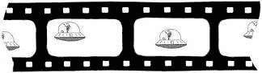
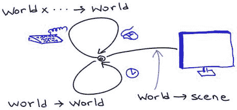

# 27 交互式游戏作为反应性系统

> 原文：[`dcic-world.org/2025-08-27/games-reactive.html`](https://dcic-world.org/2025-08-27/games-reactive.html)

|     27.1 关于反应性动画 |
| --- |
|     27.2 预备知识 |
|     27.3 版本：飞机在屏幕上移动 |
|     27.3.1 更新世界状态 |
|       27.3.2 显示世界状态 |
|     27.3.3 观察时间（以及组合部件） |
|     27.4 版本：环绕 |
|     27.5 版本：下降 |
|       27.5.1 移动飞机 |
|       27.5.2 绘制场景 |
|       27.5.3 完成细节 |
|     27.6 版本：响应按键 |
|     27.7 版本：降落 |
|     27.8 版本：固定气球 |
|     27.9 版本：注意油箱 |
|     27.10 版本：气球也在移动 |
|     27.11 版本：一个、两个、……、九十九个气球！ |

在这个教程中，我们将编写一个小型的交互式游戏。这个游戏不会很复杂，但它将包含你构建自己更丰富游戏所需的所有元素。

> 
> 
> 阿尔伯克基热气球节

想象一下，我们有一架飞机正在降落。不幸的是，它试图在一个热气球节中降落，因此它自然想要避免与任何（移动的）气球相撞。此外，还有陆地和水，飞机需要降落在陆地上。我们还可能给它配备有限的燃料来完成它的任务。以下是游戏的几个动画：

+   [飞机成功降落。](https://drive.google.com/file/d/1RyDtWXnodN1rzUwwe79InaVUTfIW5GC8/view?usp=share_link)

+   哎呀——<wbr>飞机与气球相撞了！[查看链接](https://drive.google.com/file/d/1N8H8T4ssaIlzGfL8XD99QruxLlrIAnAu/view?usp=sharing)

+   哎呀——<wbr>飞机落在水里了！[查看链接](https://drive.google.com/file/d/1zdlxGY8InPkyYRWi3ROWDHLZPtuj2KZu/view?usp=share_link)

到最后，你将编写这个程序的所有相关部分。你的程序将：

+   使飞机自主移动；

+   检测按键并相应地调整飞机；

+   有多个移动的热气球；

+   检测飞机与气球之间的碰撞；

+   检查飞机是否降落在水上和陆地上；

+   考虑燃料的使用。

呼吁：事情太多了！因此，我们不会一次性写完；相反，我们将逐步构建。但最终我们会达到目标。

### 27.1 关于反应性动画 "链接到此处")

我们正在编写一个包含两个重要交互元素的程序：它是一个动画，意味着它给人一种运动的感觉，它是反应性的，意味着它对用户输入做出响应。这两个元素编程起来都可能具有挑战性，但 Pyret 提供了一种简单的机制，它既适应了这两个元素，又与其他编程原则（如测试）很好地集成。我们将随着学习的深入了解这一点。

创建动画的关键是电影原理。即使在最复杂的电影中，你也能看到没有运动（实际上，“电影”——<wbr>简称“移动图片”——<wbr>是一则巧妙的虚假广告）。相反，只是一系列静止的图像以快速连续的方式显示，依靠人类大脑创造出运动的感觉：

> 

我们将利用同样的想法：我们的动画将包含一系列单独的图像，我们将要求 Pyret 以快速连续的方式显示这些图像。然后我们将看到反应性如何融入同样的过程。

### 27.2 前置知识 "链接到此处")

首先，我们应该通知 Pyret 我们计划使用图像和动画。我们按照以下方式加载库：

```py
import image as I
import reactors as R
```

这告诉 Pyret 加载这两个库并将结果绑定到相应的名称，`I` 和 `R`。因此，所有图像操作都来自 `I`，动画操作来自 `R`。

### 27.3 版本：飞机在屏幕上移动 "链接到此处")

我们将从最简单的版本开始：飞机在屏幕上水平移动。观看[这个视频](https://drive.google.com/file/d/1rbDJJJEQV2z-FZT3R1c15xelLsCwhaLI/view?usp=share_link)。

首先，这是一张飞机的图片：享受寻找你喜欢的飞机图片的过程！但不要花太多时间，因为我们还有很多工作要做。

[`world.cs.brown.edu/1/clipart/airplane-small.png`](http://world.cs.brown.edu/1/clipart/airplane-small.png)

我们可以告诉 Pyret 加载这张图片并给它起一个名字，如下所示：

```py
AIRPLANE-URL =
  "http://world.cs.brown.edu/1/clipart/airplane-small.png"
AIRPLANE = I.image-url(AIRPLANE-URL)
```

从此以后，当我们提到 `AIRPLANE` 时，它将始终指代这张图像。（在交互区域试试看！）

现在再次观看视频。观察在不同时间点发生了什么。什么保持不变，什么发生了变化？共同点是水和陆地保持不变。发生变化的是飞机的（水平）位置。

注意

> 世界状态包括所有会发生变化的东西。保持不变的事物不需要记录在世界状态中。

我们现在可以定义我们的第一个世界状态：

世界定义

> 世界状态是一个数字，表示飞机的 x 位置。

注意上面的一些重要内容：

注意

> 当我们记录世界状态时，我们不仅捕获值的类型，还捕获它们的预期含义。

现在我们有了核心数据的表现，但要生成上面的动画，我们仍然需要做几件事情：

1.  请求通知时间的流逝。

1.  随着时间的推移，相应地更新世界状态。

1.  给定一个更新的世界状态，生成相应的视觉显示。

这听起来好像很多！幸运的是，Pyret 使这比听起来容易得多。我们将按照与上面列出的不同顺序来做这些。

#### 27.3.1 更新世界状态 "链接到此处")

正如我们所注意到的，飞机实际上并没有“移动”。相反，我们可以要求 Pyret 在每次时钟滴答时通知我们。如果在每个滴答时我们将飞机放置在适当不同的位置，并且滴答发生得足够频繁，我们将得到运动的感觉。

因为世界状态只包含飞机的 x 位置，要将它向右移动，我们只需增加其值。首先，让我们给这个常数距离起个名字：

```py
AIRPLANE-X-MOVE = 10
```

我们需要编写一个反映这种移动的函数。让我们首先编写一些测试用例：

```py
check:
  move-airplane-x-on-tick(50) is 50 + AIRPLANE-X-MOVE
  move-airplane-x-on-tick(0) is 0 + AIRPLANE-X-MOVE
  move-airplane-x-on-tick(100) is 100 + AIRPLANE-X-MOVE
end
```

函数的定义现在很清晰：

```py
fun move-airplane-x-on-tick(w):
  w + AIRPLANE-X-MOVE
end
```

并且确实如此，Pyret 将确认这个函数通过了所有的测试。

注意

> 如果你以前有编程动画和响应式程序的经验，你将立即注意到一个重要的区别：在 Pyret 中测试程序的部分很容易！

#### 27.3.2 显示世界状态 "链接到此处")

现在我们已经准备好绘制游戏的视觉输出。我们生成一个包含所有必要组件的图像。首先，定义一些表示视觉输出的常量是有帮助的：

```py
WIDTH = 800
HEIGHT = 500

BASE-HEIGHT = 50
WATER-WIDTH = 500
```

使用这些，我们可以创建一个空白画布，并在其上叠加表示水和陆地的矩形：

```py
BLANK-SCENE = I.empty-scene(WIDTH, HEIGHT)

WATER = I.rectangle(WATER-WIDTH, BASE-HEIGHT, "solid", "blue")
LAND = I.rectangle(WIDTH - WATER-WIDTH, BASE-HEIGHT, "solid", "brown")

BASE = I.beside(WATER, LAND)

BACKGROUND =
  I.place-image(BASE,
    WIDTH / 2, HEIGHT - (BASE-HEIGHT / 2),
    BLANK-SCENE)
```

检查交互区域中的`BACKGROUND`值，以确认它看起来正确。

> 现在行动起来！
> 
> > 我们在放置`BASE`时除以二的原因是 Pyret 将图像的中间位置放在给定位置。去掉除法，看看结果图像会发生什么变化。

现在我们知道了如何获取我们的背景，我们就可以将飞机放置在上面。执行此操作的表达式看起来大致如下：

```py
I.place-image(AIRPLANE,
  # some x position,
  50,
  BACKGROUND)
```

但我们使用什么 x 位置呢？实际上，这正是世界状态所代表的！因此，我们从这个表达式创建一个函数：

```py
fun place-airplane-x(w):
  I.place-image(AIRPLANE,
    w,
    50,
    BACKGROUND)
end
```

#### 27.3.3 观察时间（并组合部件） "链接到此处")

最后，我们准备好将这些部件组合在一起。

我们创建了一种特殊的 Pyret 值，称为反应器，用于创建动画。我们将从创建一种相当简单的反应器开始，然后随着程序的复杂化逐渐扩展它。

以下代码创建了一个名为`anim`的反应器：

```py
anim = reactor:
  init: 0,
  on-tick: move-airplane-x-on-tick,
  to-draw: place-airplane-x
end
```

一个反应器需要被赋予一个初始世界状态以及告诉它如何反应的处理程序。指定 `on-tick` 告诉 Pyret 运行一个时钟，并且每当时钟滴答（大约每秒三十次）时，调用相关处理程序。`to-draw` 处理程序被 Pyret 用于刷新视觉显示。

定义了这个反应器后，我们可以以几种有用的方式运行它，比如查找错误、运行科学实验等等。我们在这里的需求很简单；我们要求 Pyret 交互式地在屏幕上运行程序：

```py
R.interact(anim)
```

这创建了一个飞机在背景中飞行的运行程序！

就这样！我们创建了我们的第一个动画。现在我们已经解决了所有初步问题，我们可以着手增强它。

> 练习
> 
> > 如果你想让飞机看起来移动得更快，你可以改变什么？

### 27.4 版本：绕圈 "链接到此处")

当你运行前面的程序时，你会注意到过了一段时间后，飞机就消失了。这是因为飞机已经飞过了屏幕的右边缘；它仍然在“绘制”，但位置是你看不到的。这并不太有用！此外，过一段时间后，你可能会得到一个错误，因为计算机被要求在图形系统无法管理的位置绘制飞机。相反，当飞机即将飞过屏幕的右边缘时，我们希望它以相应的量在左侧重新出现：“绕圈”，就像那样。

[这里是这个版本的视频。](https://drive.google.com/file/d/1zL4PY1vOWgFMBuPmMvr8wixh5VE9Pg_r/view?usp=share_link)

> 现在就做！
> 
> > 需要改变什么？

显然，我们需要修改更新飞机位置的函数，因为现在它必须反映我们绕圈的决定。但绘制飞机的任务根本不需要改变！同样，世界状态的定义也不需要改变。

因此，我们只需要修改 `move-airplane-x-on-tick`。函数 `num-modulo` 正好是我们需要的。也就是说，我们希望 x 位置始终是场景宽度的模数：

```py
fun move-airplane-wrapping-x-on-tick(x):
  num-modulo(x + AIRPLANE-X-MOVE, WIDTH)
end
```

注意，我们不必复制上一个定义的内容，可以直接重用它：

```py
fun move-airplane-wrapping-x-on-tick(x):
  num-modulo(move-airplane-x-on-tick(x), WIDTH)
end
```

这使得我们的意图更清晰：计算我们原本会有的任何位置，但调整坐标以保持在场景宽度内。

好吧，这是一个提议的重新定义。务必彻底测试这个函数：它比你想象的要复杂！你考虑过所有的情况吗？例如，如果飞机的一半在屏幕的右边缘之外会发生什么？

> 练习
> 
> > 定义 `move-airplane-wrapping-x-on-tick` 的质量测试。

注意

> 有可能保持 `move-airplane-x-on-tick` 不变，并在 `place-airplane-x` 中执行模运算。我们选择不这样做的原因如下。在这个版本中，我们真的认为飞机是围绕圆形飞行并从左侧边缘重新开始（想象世界是一个圆柱体...）。因此，飞机的 x 位置确实会不断下降。如果我们允许世界状态单调增加，那么它将真正代表总行程距离，这与我们对世界状态的定义相矛盾。
> 
> 立刻行动！
> 
> > 添加此函数后，再次运行你的程序。你看到任何行为上的变化吗？

如果你没有……你记得更新你的反应堆以使用新的飞机移动函数吗？

### 27.5 版本：下降 "链接至此")

当然，我们需要我们的飞机在不止一个维度上移动：为了达到最终的游戏，它必须既能上升也能下降。现在，我们将专注于这个最简单的版本，即一个持续下降的飞机。[这里有一个视频。](https://drive.google.com/file/d/1fJ7eJ7Uv-YCXm87OKH5obAYFXp1pAnZo/view?usp=share_link)

让我们再次考虑这个视频的单独帧。什么保持不变？再次，水和陆地。什么在变化？飞机的位置。但是，与之前飞机只在 x 轴上移动不同，现在它在 x 和 y 轴上移动。这立即告诉我们，我们对世界状态的定义是不充分的，必须进行修改。

因此，我们定义一个新的结构来保存这个数据对：

```py
data Posn:
  | posn(x, y)
end
```

因此，我们可以修订我们的定义：

世界定义

> 世界状态是一个 `posn`，表示飞机在屏幕上的 x 位置和 y 位置。

#### 27.5.1 移动飞机 "链接至此")

首先，让我们考虑 `move-airplane-wrapping-x-on-tick`。之前我们的飞机只在 x 方向上移动；现在我们希望它也能下降，这意味着我们必须向当前的 y 值添加一些内容：

```py
AIRPLANE-Y-MOVE = 3
```

让我们为这个新函数编写一些测试用例。这里有一个例子：

```py
check:
  move-airplane-xy-on-tick(posn(10, 10)) is posn(20, 13)
end
```

另一种编写测试的方法是：

```py
check:
  p = posn(10, 10)
  move-airplane-xy-on-tick(p) is
    posn(move-airplane-wrapping-x-on-tick(p.x),
      move-airplane-y-on-tick(p.y))
end
```

注意

> 哪种编写测试的方法更好？两者都好！它们各自提供了不同的优点：
> 
> +   前者方法的好处是它非常具体：你期望的没有疑问，并且它证明了你可以从第一原理计算出所需的答案。
> +   
> +   后者方法的优点在于，如果你更改程序中的常数（例如下降速率），看似正确的测试不会突然失败。也就是说，这种测试形式更多地关注事物之间的关系，而不是它们的精确值。
> +   
> 还有一个可用的选择，它通常结合了两种方法的优点：尽可能具体地写出答案（前者风格），但使用常数来计算答案（后者风格的优势）。例如：
> 
> ```py
> check:
>   p = posn(10, 10)
>   move-airplane-xy-on-tick(p) is
>    posn(num-modulo(p.x + AIRPLANE-X-MOVE, WIDTH),
>     p.y + AIRPLANE-Y-MOVE)
> end
> ```
> 
> 练习
> 
> > 在你继续之前，你是否已经编写了足够的测试用例？你确定了吗？例如，你是否测试了当飞机在屏幕边缘附近时，在任一或两个维度上应该发生什么？我们认为你没有——在继续之前，回去编写更多的测试！

使用设计配方，现在定义 `move-airplane-xy-on-tick`。你应该得到类似以下的内容：

```py
fun move-airplane-xy-on-tick(w):
  posn(move-airplane-wrapping-x-on-tick(w.x),
    move-airplane-y-on-tick(w.y))
end
```

注意，我们已经重用了现有的 x 维度的函数，并相应地为 y 维度创建了一个辅助函数：

```py
fun move-airplane-y-on-tick(y):
  y + AIRPLANE-Y-MOVE
end
```

目前这可能有点过度，但它确实导致了关注点的更清晰分离，并使得每个维度中运动的复杂性可以独立演变，同时保持代码相对可读。

#### 27.5.2 绘制场景 "链接至此")

我们还必须检查和更新 `place-airplane-x`。我们之前的定义将飞机放置在任意的 y 坐标上；现在我们必须从世界状态中获取 y 坐标：

```py
fun place-airplane-xy(w):
  I.place-image(AIRPLANE,
    w.x,
    w.y,
    BACKGROUND)
end
```

注意，我们实际上不能重用之前的定义，因为它硬编码了 y 坐标，而我们现在必须将其作为一个参数。

#### 27.5.3 完美收尾 "链接至此")

我们完成了吗？看起来是这样的：我们已经检查了所有消耗和产生世界状态的程序，并相应地更新了它们。实际上，我们忽略了一件事：给反应堆提供的初始世界状态！如果我们已经改变了世界状态的定义，那么我们也需要更新这个定义。（我们还需要使用新函数而不是旧函数。）

```py
INIT-POS = posn(0, 0)

anim = reactor:
  init: INIT-POS,
  on-tick: move-airplane-xy-on-tick,
  to-draw: place-airplane-xy
end

R.interact(anim)
```

> 练习
> 
> > 飞机被屏幕截断有点令人不满意。你可以使用 `I.image-width` 和 `I.image-height` 来获取图像的尺寸，例如飞机。使用这些尺寸确保飞机在初始场景中完全位于屏幕内，在 `move-airplane-xy-on-tick` 中也是如此。

### 27.6 版本：响应按键 "链接至此")

现在我们有了飞机下降，没有理由它不能上升。 [这里有一个视频。](https://drive.google.com/file/d/1IZw4NrmXsJ-KRaE1GNRhL2Cl3kU27whu/view?usp=share_link)

我们将使用键盘来控制其运动：具体来说，上键会使它向上移动，而下键会使它下降得更快。这很容易支持，因为我们已经知道如何做到这一点：我们只需要使用 `on-key` 提供一个额外的处理程序。这个处理程序接受两个参数：第一个是世界的当前值，第二个是按下的键的表示。对于这个程序，我们唯一关心的键值是 `"up"` 和 `"down"`。

这为我们提供了一个相当全面的反应堆核心功能视图：

> 

我们只定义了一组函数来执行所有我们希望执行的操作，反应器将它们连接起来。一些函数更新世界值（有时需要关于刺激物的额外信息，例如按下的键），而其他函数将它们转换成输出（例如我们在屏幕上看到的内容）。

返回我们的程序，让我们定义一个表示一个键代表多少距离的常量：

```py
KEY-DISTANCE = 10
```

现在我们可以定义一个函数，根据按下的哪个键，通过这个距离改变飞机的位置：

```py
fun alter-airplane-y-on-key(w, key):
  ask:
    | key == "up"   then: posn(w.x, w.y - KEY-DISTANCE)
    | key == "down" then: posn(w.x, w.y + KEY-DISTANCE)
    | otherwise: w
  end
end
```

> 现在行动！
> 
> > 为什么这个函数定义包含
> > 
> > ```py
> > | otherwise: w
> > ```
> > 
> > 作为其最后一个条件？

注意，如果我们收到除我们期望的两个键以外的任何键，我们将 World State 保持不变；从用户的视角来看，这相当于只是忽略了按键。移除这个最后的条款，按下一个其他键，看看会发生什么！

无论你选择什么，一定要测试这个！飞机能否从屏幕顶部漂移出去？底部呢？它能与陆地或水面重叠吗？

一旦我们编写并彻底测试了这个函数，我们只需要要求 Pyret 使用它来处理按键：

```py
anim = reactor:
  init: INIT-POS,
  on-tick: move-airplane-xy-on-tick,
  on-key: alter-airplane-y-on-key,
  to-draw: place-airplane-xy
end
```

现在飞机不仅随着时间流逝而移动，还会根据你的按键而移动。你可以让它永远保持在空中！

### 27.7 版本：降落 "链接到这里")

记住，我们游戏的目标是降落飞机，而不是让它无限期地停留在空中。这意味着我们需要检测飞机何时达到陆地或水面，当它达到时，[终止动画](https://drive.google.com/file/d/1XbO-FHQIveD0f3KCvVlUZPjVLNpHW9NT/view?usp=share_link)。

首先，让我们尝试描述动画何时应该停止。这意味着编写一个函数，它消耗当前的 World State 并产生一个布尔值：如果动画应该停止，则为`true`，否则为`false`。这需要基于飞机大小的少量算术运算：

```py
fun is-on-land-or-water(w):
  w.y >= (HEIGHT - BASE-HEIGHT)
end
```

我们只需要通知 Pyret 使用这个谓词来自动停止反应器：

```py
anim = reactor:
  init: INIT-POS,
  on-tick: move-airplane-xy-on-tick,
  on-key: alter-airplane-y-on-key,
  to-draw: place-airplane-xy,
  stop-when: is-on-land-or-water
end
```

> 练习
> 
> > 当你测试时，你会发现它并不完全正确，因为它没有考虑到飞机图像的大小。结果，飞机只在它进入陆地或水的一半时停止，而不是第一次接触地面时。调整公式，使其在第一次接触时停止。
> > 
> 练习
> 
> > 扩展这个功能，使得飞机在接触陆地后滚动一段时间，根据物理定律减速。
> > 
> 练习
> 
> > 假设飞机实际上是在一个秘密的地下机场降落。实际的跑道实际上在地下水平面以下，只有在飞机进入降落时才会打开。这意味着，降落之后，只有飞机露出地面的部分才会可见。实现这一点。作为一个提示，考虑修改`place-airplane-xy`。

### 27.8 版本：固定气球 "链接到这里")

现在我们给场景添加一个气球。[这是动作的视频。](https://drive.google.com/file/d/1QLt9tdt2sSPWR90-mmMLCDW4ZklgR_lN/view?usp=share_link)

注意，当飞机移动时，其他所有东西——包括气球——都保持静止。因此，我们不需要改变世界状态来记录气球的位置。我们只需要改变程序停止的条件：实际上，又增加了一种终止情况，那就是与气球的碰撞。

游戏何时停止？现在有两种情况：一种是接触陆地或水，另一种是接触气球。前者与之前保持不变，因此我们可以专注于后者。

气球在哪里，我们如何表示它的位置？后者很容易回答：这正是 `posn` 的用途。至于前者，我们可以决定它的位置：

```py
BALLOON-LOC = posn(600, 300)
```

或者我们可以让 Pyret 选择一个随机位置：

```py
BALLOON-LOC = posn(random(WIDTH), random(HEIGHT))
```

> 练习
> 
> > 改进气球的随机放置，使其位于可信的空间中（例如，不要浸没）。

给定气球的位置，我们只需要检测碰撞。一种简单的方法如下：确定飞机和气球之间的距离是否在某个阈值之内：

```py
fun are-overlapping(airplane-posn, balloon-posn):
  distance(airplane-posn, balloon-posn)
    < COLLISION-THRESHOLD
end
```

其中 `COLLISION-THRESHOLD` 是基于飞机和气球图像大小计算的一个合适的常数。（对于这些特定的图像，`75` 工作得相当好。）

`distance` 是什么？它消耗两个 `posn` 并确定它们之间的欧几里得距离：

```py
fun distance(p1, p2):
  fun square(n): n * n end
  num-sqrt(square(p1.x - p2.x) + square(p1.y - p2.y))
end
```

最后，我们必须将两个终止条件编织在一起：

```py
fun game-ends(w):
  ask:
    | is-on-land-or-water(w)          then: true
    | are-overlapping(w, BALLOON-LOC) then: true
    | otherwise: false
  end
end
```

并使用它代替：

```py
anim = reactor:
  init: INIT-POS,
  on-tick: move-airplane-xy-on-tick,
  on-key: alter-airplane-y-on-key,
  to-draw: place-airplane-xy,
  stop-when: game-ends
end
```

> 现在行动！
> 
> > 你对任何事情感到惊讶吗？游戏看起来是你预期的样子吗？

概率上，你屏幕上没有看到气球！那是因为我们没有更新我们的显示。

你需要定义气球的形象：

```py
BALLOON-URL =
  "http://world.cs.brown.edu/1/clipart/balloon-small.png"
BALLOON = I.image-url(BALLOON-URL)
```

并更新绘图函数：

```py
BACKGROUND =
  I.place-image(BASE,
    WIDTH / 2, HEIGHT - (BASE-HEIGHT / 2),
    I.place-image(BALLOON,
      BALLOON-LOC.x, BALLOON-LOC.y,
      BLANK-SCENE))
```

> 现在行动！
> 
> > 你看到如何更简洁地编写 `game-ends` 吗？

这里是另一个版本：

```py
fun game-ends(w):
  is-on-land-or-water(w) or are-overlapping(w, BALLOON-LOC)
end
```

### 27.9 版本：密切关注油箱 "链接到这里")

现在我们将引入燃料的概念。在我们的简化世界中，下降不需要燃料——重力会自动完成——但上升则需要。我们将假设燃料以整数单位计数，每次上升消耗一个燃料单位。当你用完燃料时，程序不再对上箭头做出响应，因此你不能再避开气球或水。

在过去，我们通过查看游戏视频的静态图像来确定什么是变化的，什么是不变的。对于这个版本，我们可以在屏幕上轻松放置一个小仪表来显示剩余的燃料量。然而，我们故意不这样做，以说明一个原则。

注意

> 你不能仅仅通过观察图像来确定什么是固定的，什么是变化的。你必须仔细阅读问题陈述，并深入思考。

从我们的描述中可以看出，有两件事情在变化：飞机的位置和剩余燃料量。因此，世界状态必须捕捉这两个当前值。燃料最好用一个单一的数字来表示。然而，我们确实需要创建一个新的结构来表示这两个的组合。

世界定义

> 世界状态是一个表示飞机当前位置和剩余燃料量的结构。

具体来说，我们将使用这个结构：

```py
data World:
  | world(p, f)
end
```

> 练习
> 
> > 我们也可以定义世界为一个由三个组件组成的结构：飞机的 x 位置、飞机的 y 位置和燃料量。为什么我们选择使用上面的表示法？

我们可以再次查看程序的每个部分，以确定哪些可以保持不变，哪些需要改变。具体来说，我们必须关注消耗和产生`World`的函数。

在每个时钟周期，我们消耗一个世界并计算一个。时间的流逝不会消耗任何燃料，所以除了需要创建一个包含当前燃料量的结构之外，这段代码可以保持不变。具体来说：

```py
fun move-airplane-xy-on-tick(w :: World):
  world(
    posn(
      move-airplane-wrapping-x-on-tick(w.p.x),
      move-airplane-y-on-tick(w.p.y)),
    w.f)
end
```

同样，响应按键的函数显然需要考虑到剩余的燃料量：

```py
fun alter-airplane-y-on-key(w, key):
  ask:
    | key == "up"   then:
      if w.f > 0:
        world(posn(w.p.x, w.p.y - KEY-DISTANCE), w.f - 1)
      else:
        w # there's no fuel, so ignore the keystroke
      end
    | key == "down" then:
      world(posn(w.p.x, w.p.y + KEY-DISTANCE), w.f)
    | otherwise: w
  end
end
```

> 练习
> 
> > 更新渲染场景的函数。回想一下，世界有两个字段；其中一个对应于我们之前用来绘制的内容，另一个则没有在输出中绘制。
> > 
> 现在行动！
> 
> > 你还需要更改什么才能得到一个可工作的程序？

你应该已经注意到，你的初始世界值也是不正确的，因为它没有考虑到燃料。尝试哪些有趣的燃料值？

> 练习
> 
> > 扩展你的程序以绘制燃料表。

### 27.10 版本：气球也移动了 "链接到这里")

到目前为止，我们让气球保持静止。现在，让我们通过让气球移动来使游戏更有趣，正如[这个视频所示。](https://drive.google.com/file/d/19kxqArza5y72V9xIezUtPi8PNV33KsG3/view?usp=share_link)

显然，气球的定位也需要成为世界状态的一部分。

世界定义

> 世界状态是一个表示飞机当前位置、气球当前位置和剩余燃料量的结构。

这里是世界状态的一个表示。随着这些状态变得更加复杂，添加注释以跟踪每个部分是很重要的。

```py
data World:
  | world(p :: Posn, b :: Posn, f :: Number)
end
```

使用这个定义，我们显然需要重写我们之前的所有定义。大部分与之前看到的内容相比相当常规。唯一我们没有真正指定的是气球应该如何移动：移动的方向、速度以及边缘时应该做什么。我们将让你发挥想象力来解决这个问题！（记住，气球离地面越近，安全降落飞机就越困难。）

因此，我们必须修改：

+   背景图像（用于移除静态气球）。

+   绘图处理程序（用于在气球的位置绘制气球）。

+   计时处理程序（移动气球以及飞机）。

+   关键处理程序（构建世界数据，使气球保持不变）。

+   终止条件（以考虑气球的动态位置）。

> 练习
> 
> > 修改上述每个函数及其测试用例。

### 27.11 版本：一个，两个，……，九十九个气球 "链接到这里")

最后，我们没有必要将自己限制在只有一个气球上。多少个是正确的？两个？三个？十个？...为什么固定一个数字？这可以是一个气球节！

类似地，许多游戏都有难度逐渐增加的关卡；我们可以这样做，让气球的数量成为关卡变化的一部分。然而，在概念上，有两个气球和五个气球之间没有太大的区别；控制每个气球的代码基本上是相同的。

我们需要表示一组气球。我们可以使用列表来表示它们。因此：

世界定义

> 世界状态是一个表示飞机当前位置、气球位置列表和剩余燃料量的结构。

你现在应该使用结构列表的设计配方来重写函数。注意，你已经编写了移动一个气球的函数。剩下什么？

1.  将相同的函数应用于列表中的每个气球。

1.  确定如果两个气球相撞时应该做什么。

目前，你可以通过在 x 轴上足够分散地放置每个气球并让它们只上下移动来避免后一个问题。

> 练习
> 
> > 引入风的概念，它影响气球但不影响飞机。在随机的时段后，风以随机速度和方向吹拂，导致气球横向移动。

### 27.1 关于反应性动画 "链接到这里")

我们正在编写一个包含两个重要交互元素的程序：它是一个动画，意味着它给人一种运动的感觉，它是反应性的，意味着它对用户输入做出响应。这两个都很难编程，但 Pyret 提供了一个简单机制，它既适应了这两个，又与其他编程原则如测试很好地集成。我们将随着学习的深入了解这一点。

创建动画的关键是电影原理。即使在最复杂的电影中，也没有运动（实际上，“电影”——<wbr>简称“移动图片”——<wbr>是一则巧妙的虚假广告）。相反，只是一系列静止图像的快速连续显示，依靠人类大脑创造出运动的感觉：

> 

我们将利用同样的想法：我们的动画将包括一系列单独的图像，我们将要求 Pyret 快速连续地显示这些图像。然后我们将看到反应性如何融入同样的过程。

### 27.2 前提 "链接到这里")

首先，我们应该通知 Pyret 我们计划同时使用图像和动画。我们按照以下方式加载库：

```py
import image as I
import reactors as R
```

这告诉 Pyret 加载这两个库并将结果绑定到相应的名称，`I` 和 `R`。因此，所有图像操作都来自 `I`，动画操作来自 `R`。

### 27.3 版本：飞机在屏幕上移动 "链接到此处")

我们将从最简单的版本开始：其中飞机在屏幕上水平移动。观看[这个视频](https://drive.google.com/file/d/1rbDJJJEQV2z-FZT3R1c15xelLsCwhaLI/view?usp=share_link)。

首先，这是一张飞机的图片：享受寻找你喜欢的飞机图片的过程！但不要花太多时间在这上面，因为我们还有很多工作要做。

[`world.cs.brown.edu/1/clipart/airplane-small.png`](http://world.cs.brown.edu/1/clipart/airplane-small.png)

我们可以告诉 Pyret 加载这张图片并给它起一个名字，如下所示：

```py
AIRPLANE-URL =
  "http://world.cs.brown.edu/1/clipart/airplane-small.png"
AIRPLANE = I.image-url(AIRPLANE-URL)
```

从此以后，当我们提到 `AIRPLANE` 时，它将始终指代这张图片。（在交互区域尝试一下！）

现在再次观看视频。观察在不同时间点发生的事情。什么保持不变，什么发生变化？共同的是水和陆地保持不变，而变化的是飞机的（水平）位置。

注意

> 世界状态包括所有变化的东西。保持不变的东西不需要记录在世界状态中。

我们现在可以定义我们的第一个世界状态：

世界定义

> 世界状态是一个数字，表示飞机的 x 位置。

注意以下重要事项：

注意

> 当我们记录世界状态时，我们不仅捕获值的类型，还捕获它们的预期含义。

现在我们有了核心数据的表现形式，但要生成上面的动画，我们仍然需要做几件事情：

1.  请求通知时间的流逝。

1.  随着时间的推移，相应地更新世界状态。

1.  给定一个更新的世界状态，生成相应的视觉显示。

这听起来好像很多！幸运的是，Pyret 使这比听起来容易得多。我们将按照与上面列出的不同顺序来做这些。

#### 27.3.1 更新世界状态 "链接到此处")

正如我们所提到的，飞机实际上并没有“移动”。相反，我们可以要求 Pyret 在每次时钟滴答时通知我们。如果在每次滴答时我们将飞机放置在适当不同的位置，并且滴答发生得足够频繁，我们就会产生运动的感觉。

因为世界状态只包含飞机的 x 位置，为了将其向右移动，我们只需增加其值。让我们首先给这个常数距离起一个名字：

```py
AIRPLANE-X-MOVE = 10
```

我们需要编写一个反映这种移动的函数。让我们首先编写一些测试用例：

```py
check:
  move-airplane-x-on-tick(50) is 50 + AIRPLANE-X-MOVE
  move-airplane-x-on-tick(0) is 0 + AIRPLANE-X-MOVE
  move-airplane-x-on-tick(100) is 100 + AIRPLANE-X-MOVE
end
```

函数的定义现在很清晰：

```py
fun move-airplane-x-on-tick(w):
  w + AIRPLANE-X-MOVE
end
```

确实，Pyret 将确认这个函数通过了所有的测试。

注意

> 如果你之前有编程动画和反应程序的经验，你将立即注意到一个重要的区别：在 Pyret 中测试程序的部分很容易！

#### 27.3.2 显示世界状态 "链接到此处")

现在我们准备绘制游戏的视觉输出。我们生成一个包含所有必要组件的图像。首先，定义一些代表视觉输出的常量是有帮助的：

```py
WIDTH = 800
HEIGHT = 500

BASE-HEIGHT = 50
WATER-WIDTH = 500
```

使用这些，我们可以创建一个空白画布，并在其上叠加代表水和陆地的矩形：

```py
BLANK-SCENE = I.empty-scene(WIDTH, HEIGHT)

WATER = I.rectangle(WATER-WIDTH, BASE-HEIGHT, "solid", "blue")
LAND = I.rectangle(WIDTH - WATER-WIDTH, BASE-HEIGHT, "solid", "brown")

BASE = I.beside(WATER, LAND)

BACKGROUND =
  I.place-image(BASE,
    WIDTH / 2, HEIGHT - (BASE-HEIGHT / 2),
    BLANK-SCENE)
```

检查交互区域中 `BACKGROUND` 的值，以确认它看起来正确。

> 现在行动起来！
> 
> > 我们在放置 `BASE` 时除以二的原因是 Pyret 将图像的中间位置放置在给定位置。去掉除法，看看结果图像会发生什么变化。

现在我们知道了如何获取背景，我们就可以将飞机放置在上面了。这样做的方法大致如下：

```py
I.place-image(AIRPLANE,
  # some x position,
  50,
  BACKGROUND)
```

但我们应该使用什么 x 位置呢？实际上，这正是世界状态所代表的！因此，我们从这个表达式中创建一个函数：

```py
fun place-airplane-x(w):
  I.place-image(AIRPLANE,
    w,
    50,
    BACKGROUND)
end
```

#### 27.3.3 观察时间（以及组合各个部分） "链接到此处")

最后，我们准备将这些部分组合在一起。

我们创建了一种特殊的 Pyret 值，称为反应器，用于创建动画。我们将从创建一种相当简单的反应器开始，然后随着程序的复杂化而扩展它。

以下代码创建了一个名为 `anim` 的反应器：

```py
anim = reactor:
  init: 0,
  on-tick: move-airplane-x-on-tick,
  to-draw: place-airplane-x
end
```

一个反应器需要提供一个初始的世界状态以及告诉它如何反应的处理程序。指定 `on-tick` 告诉 Pyret 运行一个时钟，并且每当时钟滴答（大约每秒三十次）时，调用相关处理程序。`to-draw` 处理程序被 Pyret 用于刷新视觉显示。

定义了这个反应器之后，我们可以以几种有用的方式运行它，比如查找错误、运行科学实验等等。我们在这里的需求很简单；我们要求 Pyret 交互式地仅将程序运行在屏幕上：

```py
R.interact(anim)
```

这创建了一个运行中的程序，飞机在背景上飞行！

那就是全部了！我们已经创建了我们的第一个动画。现在我们已经处理完所有初步工作，我们可以着手增强它了。

> 练习
> 
> > 如果你想让飞机看起来移动得更快，你可以改变什么？

#### 27.3.1 更新世界状态 "链接到此处")

正如我们所提到的，飞机实际上并没有“移动”。相反，我们可以要求 Pyret 每当时钟滴答时通知我们。如果每次滴答我们都将飞机放置在适当不同的位置，并且滴答发生得足够频繁，我们就会产生运动的印象。

由于世界状态仅由飞机的 x 位置组成，要将它向右移动，我们只需增加其值。让我们首先给这个常数距离起一个名字：

```py
AIRPLANE-X-MOVE = 10
```

我们需要编写一个反映这种移动的函数。让我们首先编写一些测试用例：

```py
check:
  move-airplane-x-on-tick(50) is 50 + AIRPLANE-X-MOVE
  move-airplane-x-on-tick(0) is 0 + AIRPLANE-X-MOVE
  move-airplane-x-on-tick(100) is 100 + AIRPLANE-X-MOVE
end
```

函数的定义现在很清晰：

```py
fun move-airplane-x-on-tick(w):
  w + AIRPLANE-X-MOVE
end
```

确实，Pyret 将确认这个函数通过了所有的测试。

注意

> 如果你之前有编程动画和响应式程序的经验，你将立即注意到一个重要的区别：在 Pyret 中测试程序的部分很容易！

#### 27.3.2 显示世界状态 "链接到此处")

现在我们已经准备好绘制游戏的视觉输出。我们生成一个包含所有必要组件的图像。首先，我们需要定义一些代表视觉输出的常量：

```py
WIDTH = 800
HEIGHT = 500

BASE-HEIGHT = 50
WATER-WIDTH = 500
```

使用这些常量，我们可以创建一个空白画布，并在其上叠加代表水和陆地的矩形：

```py
BLANK-SCENE = I.empty-scene(WIDTH, HEIGHT)

WATER = I.rectangle(WATER-WIDTH, BASE-HEIGHT, "solid", "blue")
LAND = I.rectangle(WIDTH - WATER-WIDTH, BASE-HEIGHT, "solid", "brown")

BASE = I.beside(WATER, LAND)

BACKGROUND =
  I.place-image(BASE,
    WIDTH / 2, HEIGHT - (BASE-HEIGHT / 2),
    BLANK-SCENE)
```

检查交互区域中 `BACKGROUND` 的值，以确认它看起来正确。

> 现在行动起来！
> 
> > 我们在放置 `BASE` 时将值除以二的原因是 Pyret 将图像的中间位置放在给定位置。移除除法并看看结果图像会发生什么变化。

现在我们知道了如何获取背景，我们就可以将飞机放置在其上了。执行此操作的表达式看起来大致如下：

```py
I.place-image(AIRPLANE,
  # some x position,
  50,
  BACKGROUND)
```

但我们使用什么 x 坐标？实际上，这正是世界状态所代表的！因此，我们从这个表达式中创建一个函数：

```py
fun place-airplane-x(w):
  I.place-image(AIRPLANE,
    w,
    50,
    BACKGROUND)
end
```

#### 27.3.3 观察时间（以及组合各个部分） "链接到此处")

最后，我们准备将这些部分组合在一起。

我们创建了一种特殊的 Pyret 值，称为反应器，它用于创建动画。我们将从创建一种相当简单的反应器开始，然后随着程序的复杂化而扩展它。

以下代码创建了一个名为 `anim` 的反应器：

```py
anim = reactor:
  init: 0,
  on-tick: move-airplane-x-on-tick,
  to-draw: place-airplane-x
end
```

反应器需要提供一个初始世界状态以及告诉它如何反应的处理程序。指定 `on-tick` 告诉 Pyret 运行一个时钟，并且每当时钟滴答（大约每秒三十次）时，调用相关处理程序。`to-draw` 处理程序由 Pyret 用于刷新视觉显示。

定义了这种反应器后，我们可以以几种有用的方式运行它，例如查找错误、运行科学实验等。我们在这里的需求很简单；我们要求 Pyret 交互式地在屏幕上运行程序：

```py
R.interact(anim)
```

这创建了一个运行中的程序，飞机在背景中飞行！

就这样！我们已经创建了我们的第一个动画。现在我们已经完成了所有初步工作，我们可以着手增强它。

> 练习
> 
> > 如果你想让飞机看起来移动得更快，你可以改变什么？

### 27.4 版本：循环 "链接到此处")

当你运行前面的程序时，你会注意到过一段时间后，飞机就消失了。这是因为它已经超过了屏幕的右侧边缘；它仍然在“绘制”，但位置是你看不到的。这并不太有用！此外，经过一段时间后，你可能会遇到错误，因为计算机被要求在图形系统无法管理的位置绘制飞机。相反，当飞机即将超过屏幕的右侧边缘时，我们希望它以相应的量在左侧重新出现：“环绕”，就像那样。

[这是这个版本的演示视频。](https://drive.google.com/file/d/1zL4PY1vOWgFMBuPmMvr8wixh5VE9Pg_r/view?usp=share_link)

> 立即行动！
> 
> > 需要改变什么？

显然，我们需要修改更新飞机位置的函数，因为这个函数现在必须反映我们的环绕决策。但绘制飞机的任务根本不需要改变！同样，世界状态的定义也不需要改变。

因此，我们只需要修改`move-airplane-x-on-tick`。`num-modulo`函数正好是我们需要的。也就是说，我们希望 x 位置始终是场景宽度的模数：

```py
fun move-airplane-wrapping-x-on-tick(x):
  num-modulo(x + AIRPLANE-X-MOVE, WIDTH)
end
```

注意，我们不必复制上一个定义的内容，可以直接重用它：

```py
fun move-airplane-wrapping-x-on-tick(x):
  num-modulo(move-airplane-x-on-tick(x), WIDTH)
end
```

这使得我们的意图更清晰：计算我们原本会有的任何位置，但调整坐标以保持在场景宽度内。

好吧，这是一个提议的重新定义。务必彻底测试这个函数：它比你想象的要复杂！你考虑过所有的情况吗？例如，如果飞机在屏幕右侧边缘的一半位置会发生什么？

> 练习
> 
> > 为`move-airplane-wrapping-x-on-tick`定义质量测试。

备注

> 可以保持`move-airplane-x-on-tick`不变，并在`place-airplane-x`中执行模运算。我们选择不这样做的原因如下。在这个版本中，我们真的把飞机想象成在绕圈并从左侧边缘重新开始（想象世界是一个圆柱体...）。因此，飞机的 x 位置确实会不断下降。如果我们允许世界状态单调增加，那么它实际上会代表总行程距离，这与我们对世界状态的定义相矛盾。
> 
> 立即行动！
> 
> > 添加这个函数后，再次运行你的程序。你看到任何行为上的变化了吗？

如果你没有...你记得更新你的反应堆以使用新的飞机移动函数吗？

### 27.5 版本：下降 "链接到此处")

当然，我们的飞机需要在不止一个维度上移动：为了到达最终的游戏，它必须既能上升也能下降。现在，我们将关注这个最简单的版本，即飞机持续下降。[这里有一个视频。](https://drive.google.com/file/d/1fJ7eJ7Uv-YCXm87OKH5obAYFXp1pAnZo/view?usp=share_link)

让我们再次考虑这个视频的单独帧。什么保持不变？再次，是水和陆地。什么在变化？飞机的位置。但是，与之前飞机只在 x 维度移动不同，现在它在 x 和 y 两个维度上移动。这立即告诉我们，我们对世界状态的定义是不充分的，必须进行修改。

因此，我们定义一个新的结构来保存这组数据：

```py
data Posn:
  | posn(x, y)
end
```

给定这个，我们可以修改我们的定义：

世界定义

> 世界状态是一个`posn`，表示飞机在屏幕上的 x 位置和 y 位置。

#### 27.5.1 移动飞机 "链接到此处")

首先，让我们考虑`move-airplane-wrapping-x-on-tick`。之前我们的飞机只在 x 方向移动；现在我们希望它也能下降，这意味着我们必须向当前的 y 值添加一些内容：

```py
AIRPLANE-Y-MOVE = 3
```

让我们为这个新函数编写一些测试用例。这里有一个：

```py
check:
  move-airplane-xy-on-tick(posn(10, 10)) is posn(20, 13)
end
```

编写测试的另一种方式是：

```py
check:
  p = posn(10, 10)
  move-airplane-xy-on-tick(p) is
    posn(move-airplane-wrapping-x-on-tick(p.x),
      move-airplane-y-on-tick(p.y))
end
```

注意

> 哪种测试编写方法更好？两者都好！它们各自提供了不同的优势：
> 
> +   前者方法的好处是它非常具体：你不会对期望的内容有疑问，并且它证明了你可以从第一原理计算出所需的答案。
> +   
> +   后者方法的好处是，如果你更改程序中的常数（例如下降速率），看似正确的测试不会突然失败。也就是说，这种测试形式更多地关注事物之间的关系，而不是它们的精确值。
> +   
> 还有一个选择可用，它通常结合了两种方法的优点：尽可能具体地编写答案（前者风格），但使用常数来计算答案（后者风格的优势）。例如：
> 
> ```py
> check:
>   p = posn(10, 10)
>   move-airplane-xy-on-tick(p) is
>    posn(num-modulo(p.x + AIRPLANE-X-MOVE, WIDTH),
>     p.y + AIRPLANE-Y-MOVE)
> end
> ```
> 
> 练习
> 
> > 在你继续之前，你是否已经编写了足够的测试用例？你确定吗？例如，你是否测试了当飞机在屏幕边缘附近时会发生什么？我们认为你没有——在你继续之前，回去编写更多的测试！

使用设计配方，现在定义`move-airplane-xy-on-tick`。你应该得到类似这样的结果：

```py
fun move-airplane-xy-on-tick(w):
  posn(move-airplane-wrapping-x-on-tick(w.x),
    move-airplane-y-on-tick(w.y))
end
```

注意，我们已经重用了现有的 x 维度的函数，并相应地为 y 维度创建了一个辅助函数：

```py
fun move-airplane-y-on-tick(y):
  y + AIRPLANE-Y-MOVE
end
```

目前这可能是有点过度，但它确实导致了关注点的更清晰分离，并使得每个维度的运动复杂性可以独立发展，同时保持代码相对可读。

#### 27.5.2 绘制场景 "链接到此处")

我们还必须检查并更新`place-airplane-x`。我们之前的定义将飞机放置在任意的 y 坐标上；现在我们必须从世界状态中获取 y 坐标：

```py
fun place-airplane-xy(w):
  I.place-image(AIRPLANE,
    w.x,
    w.y,
    BACKGROUND)
end
```

注意，我们实际上不能重用之前的定义，因为它硬编码了 y 位置，我们现在必须将其作为一个参数。

#### 27.5.3 完成细节 "链接到此处")

我们完成了吗？看起来是这样：我们已经检查了所有消耗和产生世界状态的程序，并相应地更新了它们。实际上，我们忽略了一件事：给反应器的初始世界状态！如果我们已经改变了世界状态的定义，那么我们也需要更新这个。（我们还需要使用新函数而不是旧函数。）

```py
INIT-POS = posn(0, 0)

anim = reactor:
  init: INIT-POS,
  on-tick: move-airplane-xy-on-tick,
  to-draw: place-airplane-xy
end

R.interact(anim)
```

> 练习
> 
> > 飞机被屏幕截断有点令人不满意。你可以使用 `I.image-width` 和 `I.image-height` 来获取图像的尺寸，例如飞机。使用这些来确保飞机在初始场景中完全位于屏幕内，同样在 `move-airplane-xy-on-tick` 中也是如此。

#### 27.5.1 移动飞机 "链接到此处")

首先，让我们考虑 `move-airplane-wrapping-x-on-tick`。之前我们的飞机只在 x 方向移动；现在我们希望它也能下降，这意味着我们必须向当前的 y 值添加一些东西：

```py
AIRPLANE-Y-MOVE = 3
```

让我们为这个新函数编写一些测试用例。这里有一个：

```py
check:
  move-airplane-xy-on-tick(posn(10, 10)) is posn(20, 13)
end
```

编写测试的另一种方式是：

```py
check:
  p = posn(10, 10)
  move-airplane-xy-on-tick(p) is
    posn(move-airplane-wrapping-x-on-tick(p.x),
      move-airplane-y-on-tick(p.y))
end
```

注意

> 哪种测试编写方法更好？两者都好！它们各自提供了不同的优势：
> 
> +   前者方法的好处是它非常具体：没有疑问你期望什么，并且它证明了你可以从第一原理计算出所需的答案。
> +   
> +   后者方法的优势在于，如果你更改程序中的常量（例如下降速度），看似正确的测试不会突然失败。也就是说，这种测试形式更多地关注事物之间的关系，而不是它们的精确值。
> +   
> 还有一个选择可用，它通常结合了两种方法的优点：尽可能具体地写出答案（前者风格），但使用常量来计算答案（后者风格的优势）。例如：
> 
> ```py
> check:
>   p = posn(10, 10)
>   move-airplane-xy-on-tick(p) is
>    posn(num-modulo(p.x + AIRPLANE-X-MOVE, WIDTH),
>     p.y + AIRPLANE-Y-MOVE)
> end
> ```
> 
> 练习
> 
> > 在你继续之前，你是否已经编写了足够的测试用例？你确定吗？例如，你是否测试了当飞机在屏幕边缘附近时会发生什么？我们认为你没有——在你继续之前，回去编写更多的测试！

使用设计配方，现在定义 `move-airplane-xy-on-tick`。你应该得到类似以下的内容：

```py
fun move-airplane-xy-on-tick(w):
  posn(move-airplane-wrapping-x-on-tick(w.x),
    move-airplane-y-on-tick(w.y))
end
```

注意，我们重用了现有的 x 维度的函数，并相应地创建了一个 y 维度的辅助函数：

```py
fun move-airplane-y-on-tick(y):
  y + AIRPLANE-Y-MOVE
end
```

目前这可能是有点过度，但它确实导致了关注点的更清晰分离，并使得每个维度的运动复杂性可以独立演变，同时保持代码相对可读。

#### 27.5.2 绘制场景 "链接到此处")

我们还必须检查和更新 `place-airplane-x`。我们之前的定义将飞机放置在任意的 y 坐标上；现在我们必须从世界状态中获取 y 坐标：

```py
fun place-airplane-xy(w):
  I.place-image(AIRPLANE,
    w.x,
    w.y,
    BACKGROUND)
end
```

注意，我们实际上无法重用之前的定义，因为它硬编码了 y 坐标，而我们现在必须将其作为一个参数。

#### 27.5.3 完美收尾 "链接到此处")

我们完成了吗？看起来是这样的：我们已经检查了所有消耗和产生世界状态的过程，并相应地更新了它们。实际上，我们忽略了一件事：给反应堆提供的初始世界状态！如果我们已经改变了世界状态的定义，那么我们也需要更新这个。（我们还需要使用新函数而不是旧函数。）

```py
INIT-POS = posn(0, 0)

anim = reactor:
  init: INIT-POS,
  on-tick: move-airplane-xy-on-tick,
  to-draw: place-airplane-xy
end

R.interact(anim)
```

> 练习
> 
> > 飞机被屏幕截断，这有点令人不满意。你可以使用 `I.image-width` 和 `I.image-height` 来获取图像的尺寸，例如飞机。使用这些尺寸来确保飞机在初始场景中完全位于屏幕内，同样在 `move-airplane-xy-on-tick` 中也是如此。

### 27.6 版本：响应按键 "链接到此处")

既然飞机正在下降，就没有理由它不能上升。[这里有一个视频。](https://drive.google.com/file/d/1IZw4NrmXsJ-KRaE1GNRhL2Cl3kU27whu/view?usp=share_link)

我们将使用键盘来控制其运动：具体来说，上键会使它向上移动，而下键会使它下降得更快。这很容易支持，因为我们已经知道如何做到这一点：我们只需要使用 `on-key` 提供一个额外的处理程序。这个处理程序接受两个参数：第一个是当前世界的值，而第二个是哪个键被按下的表示。对于这个程序的目的，我们唯一关心的键值是 `"up"` 和 `"down"`。

这为我们提供了对反应堆核心功能的相当全面的了解：

> 

我们只是定义了一组函数来执行我们所有的期望操作，反应堆将它们串联起来。一些函数更新世界值（有时需要关于刺激物的额外信息，例如按下的键），而其他函数将它们转换成输出（例如我们在屏幕上看到的内容）。

回到我们的程序，让我们定义一个表示按键代表多少距离的常量：

```py
KEY-DISTANCE = 10
```

现在我们可以定义一个函数，根据按下的键改变飞机的位置：

```py
fun alter-airplane-y-on-key(w, key):
  ask:
    | key == "up"   then: posn(w.x, w.y - KEY-DISTANCE)
    | key == "down" then: posn(w.x, w.y + KEY-DISTANCE)
    | otherwise: w
  end
end
```

> 现在行动起来！
> 
> > 为什么这个函数定义包含
> > 
> > ```py
> > | otherwise: w
> > ```
> > 
> > 作为其最后一个条件？

注意，如果我们收到除我们期望之外的任何键，我们将保持世界状态不变；从用户的角度来看，这相当于只是忽略了按键。移除最后一个子句，按下一个其他键，看看会发生什么！

无论你选择什么，一定要测试这个！飞机能否从屏幕顶部漂移出去？底部呢？它能与陆地或水面重叠吗？

一旦我们编写并彻底测试了这个函数，我们只需要让 Pyret 使用它来处理按键：

```py
anim = reactor:
  init: INIT-POS,
  on-tick: move-airplane-xy-on-tick,
  on-key: alter-airplane-y-on-key,
  to-draw: place-airplane-xy
end
```

现在飞机不仅随着时间流逝而移动，而且还会根据你的按键响应。你可以让它永远保持在空中！

### 27.7 版本：着陆 "链接到这里")

记住，我们游戏的目标是让飞机降落，而不是让它无限期地保持在空中。这意味着我们需要检测飞机何时达到陆地或水面，当它达到时，[终止动画](https://drive.google.com/file/d/1XbO-FHQIveD0f3KCvVlUZPjVLNpHW9NT/view?usp=share_link)。

首先，让我们尝试描述动画何时应该停止。这意味着编写一个函数，它消耗当前世界状态并产生一个布尔值：如果动画应该停止，则为`true`，否则为`false`。这需要基于飞机大小的少量算术运算：

```py
fun is-on-land-or-water(w):
  w.y >= (HEIGHT - BASE-HEIGHT)
end
```

我们只需要通知 Pyret 使用这个谓词来自动停止反应器：

```py
anim = reactor:
  init: INIT-POS,
  on-tick: move-airplane-xy-on-tick,
  on-key: alter-airplane-y-on-key,
  to-draw: place-airplane-xy,
  stop-when: is-on-land-or-water
end
```

> 练习
> 
> > 当你测试这个时，你会发现它并不完全正确，因为它没有考虑到飞机图像的大小。因此，飞机只有在进入陆地或水的一半时才会停止，而不是第一次接触地面时。调整公式，使其在第一次接触时停止。
> > 
> 练习
> 
> > 将此扩展到飞机在接触地面后滚动一段时间，根据物理定律减速。
> > 
> 练习
> 
> > 假设飞机实际上是在一个秘密的地下机场降落。实际的跑道实际上在地下水平面以下，只有当飞机进入降落时才会打开。这意味着，降落之后，只有飞机露出地面的部分才会可见。实现这一点。作为一个提示，考虑修改`place-airplane-xy`。

### 27.8 版本：固定气球 "链接到这里")

现在让我们向场景中添加一个气球。[这里是动作的视频。](https://drive.google.com/file/d/1QLt9tdt2sSPWR90-mmMLCDW4ZklgR_lN/view?usp=share_link)

注意，当飞机移动时，其他所有东西——包括气球——都保持静止。因此，我们不需要修改世界状态来记录气球的位置。我们只需要改变程序停止的条件：实际上，又增加了一种终止情况，那就是与气球的碰撞。

游戏何时停止？现在有两种情况：一种是接触地面或水，另一种是接触气球。前者与之前相比没有变化，因此我们可以专注于后者。

气球在哪里，我们如何表示它的位置？后者容易回答：这正是`posn`s 的作用所在。至于前者，我们可以决定它的位置：

```py
BALLOON-LOC = posn(600, 300)
```

或者我们可以让 Pyret 随机选择位置：

```py
BALLOON-LOC = posn(random(WIDTH), random(HEIGHT))
```

> 练习
> 
> > 改善气球的随机放置，使其位于可信的空间中（例如，不要被淹没）。

给定气球的位置，我们只需要检测碰撞。一种简单的方法如下：确定飞机和气球之间的距离是否在某个阈值之内：

```py
fun are-overlapping(airplane-posn, balloon-posn):
  distance(airplane-posn, balloon-posn)
    < COLLISION-THRESHOLD
end
```

其中 `COLLISION-THRESHOLD` 是基于飞机和气球图像大小计算的一个合适的常数。（对于这些特定的图像，`75` 工作得相当好。）

什么是 `distance`？它消耗两个 `posn` 并确定它们之间的欧几里得距离：

```py
fun distance(p1, p2):
  fun square(n): n * n end
  num-sqrt(square(p1.x - p2.x) + square(p1.y - p2.y))
end
```

最后，我们必须将两个终止条件编织在一起：

```py
fun game-ends(w):
  ask:
    | is-on-land-or-water(w)          then: true
    | are-overlapping(w, BALLOON-LOC) then: true
    | otherwise: false
  end
end
```

并使用它代替：

```py
anim = reactor:
  init: INIT-POS,
  on-tick: move-airplane-xy-on-tick,
  on-key: alter-airplane-y-on-key,
  to-draw: place-airplane-xy,
  stop-when: game-ends
end
```

> 立即行动！
> 
> > 你对任何事情感到惊讶吗？游戏看起来是你预期的样子吗？

概率上，你可能没有在屏幕上看到气球！这是因为我们没有更新我们的显示。

你需要定义气球图像：

```py
BALLOON-URL =
  "http://world.cs.brown.edu/1/clipart/balloon-small.png"
BALLOON = I.image-url(BALLOON-URL)
```

并更新绘图函数：

```py
BACKGROUND =
  I.place-image(BASE,
    WIDTH / 2, HEIGHT - (BASE-HEIGHT / 2),
    I.place-image(BALLOON,
      BALLOON-LOC.x, BALLOON-LOC.y,
      BLANK-SCENE))
```

> 立即行动！
> 
> > 你看到如何更简洁地编写 `game-ends` 吗？

这是另一个版本：

```py
fun game-ends(w):
  is-on-land-or-water(w) or are-overlapping(w, BALLOON-LOC)
end
```

### 27.9 版本：关注油箱 "链接到此处")

现在我们将引入燃料的概念。在我们的简化世界中，下降不需要燃料——重力会自动完成——但上升则需要。我们将假设燃料以整数单位计算，每次上升消耗一个燃料单位。当你耗尽燃料时，程序不再对上箭头做出响应，因此你将无法避开气球或水。

在过去，我们查看游戏视频的静态图像来确定哪些在变化，哪些没有变化。对于这个版本，我们可以在屏幕上轻松放置一个小仪表来显示剩余的燃料量。然而，我们故意不这样做，以说明一个原理。

注意

> 你不能仅仅通过观察图像就总是确定什么是固定的，什么是变化的。你必须仔细阅读问题陈述，并深入思考。

从我们的描述中可以看出，有两件事情在变化：飞机的位置和剩余的燃料量。因此，世界状态必须捕捉这两个当前值。燃料最好用一个单一的数字来表示。然而，我们确实需要创建一个新的结构来表示这两个的组合。

世界定义

> 世界状态是一个结构，表示飞机的当前位置和剩余的燃料量。

具体来说，我们将使用以下结构：

```py
data World:
  | world(p, f)
end
```

> 练习
> 
> > 我们也可以将世界定义为包含三个组件的结构：飞机的 x 位置、飞机的 y 位置和燃料量。我们为什么选择使用上面的表示法？

我们可以再次查看程序的各个部分，以确定哪些可以保持不变，哪些需要改变。具体来说，我们必须关注消耗和产生 `World` 的函数。

在每个时钟周期，我们消耗一个世界并计算一个。时间的流逝不消耗任何燃料，因此这段代码可以保持不变，除了需要创建一个包含当前燃料量的结构。具体来说：

```py
fun move-airplane-xy-on-tick(w :: World):
  world(
    posn(
      move-airplane-wrapping-x-on-tick(w.p.x),
      move-airplane-y-on-tick(w.p.y)),
    w.f)
end
```

同样，响应按键的函数显然需要考虑剩余的燃油量：

```py
fun alter-airplane-y-on-key(w, key):
  ask:
    | key == "up"   then:
      if w.f > 0:
        world(posn(w.p.x, w.p.y - KEY-DISTANCE), w.f - 1)
      else:
        w # there's no fuel, so ignore the keystroke
      end
    | key == "down" then:
      world(posn(w.p.x, w.p.y + KEY-DISTANCE), w.f)
    | otherwise: w
  end
end
```

> 练习
> 
> > 更新渲染场景的函数。回想一下，世界有两个字段；其中一个对应于我们之前用来绘制的内容，另一个在输出中没有被绘制。
> > 
> 现在就做！
> 
> > 你还需要更改什么才能得到一个可工作的程序？

你应该已经注意到你的初始世界值也是不正确的，因为它没有考虑到燃油。尝试哪些有趣的燃油值？

> 练习
> 
> > 扩展你的程序以绘制一个燃油表。

### 27.10 版本：气球也在移动 "链接到此处")

到目前为止，我们让气球保持静止。现在，让我们通过让气球移动来使游戏更有趣，正如[这个视频所示。](https://drive.google.com/file/d/19kxqArza5y72V9xIezUtPi8PNV33KsG3/view?usp=share_link)

显然，气球的定位也需要成为世界状态的一部分。

世界定义

> 世界状态是一个表示飞机当前位置、气球当前位置以及剩余燃油量的结构。

这里是世界状态的一个表示。随着这些状态变得更加复杂，添加注释变得很重要，这样我们才能跟踪每个状态。

```py
data World:
  | world(p :: Posn, b :: Posn, f :: Number)
end
```

根据这个定义，我们显然需要重写我们之前所有的定义。大部分内容与之前看到的内容相比相当常规。唯一我们没有真正指定的是气球应该如何移动：朝哪个方向，以什么速度，以及边缘时应该做什么。我们将让你发挥想象力来解决这个问题！（记住，气球离地面越近，安全降落飞机就越困难。）

因此，我们必须修改：

+   背景图像（移除静态气球）。

+   绘图处理程序（在气球的位置绘制气球）。

+   计时处理程序（移动气球以及飞机）。

+   关键处理程序（用于构建不改变气球的全球数据）。

+   终止条件（考虑到气球的动态位置）。

> 练习
> 
> > 修改上述每个函数及其测试用例。

### 27.11 版本：一个，两个，……，九十九个气球 "链接到此处")

最后，我们没有必要将自己限制在只有一个气球上。多少个是合适的？两个？三个？十个？...为什么固定一个数字？这可以是一个气球节！

类似地，许多游戏都有难度逐渐增加的关卡；我们可以这样做，让气球的数量成为关卡之间变化的一部分。然而，在概念上，有两个气球和五个气球之间没有太大的区别；控制每个气球的代码基本上是相同的。

我们需要表示一组气球。我们可以使用列表来表示它们。因此：

世界定义

> 世界状态是一个表示飞机当前位置、气球位置列表以及剩余燃油量的结构。

你现在应该使用结构列表的设计食谱来重写函数。注意，你已经编写了移动一个气球的功能。剩下什么？

1.  将相同的功能应用于列表中的每个气球。

1.  确定如果两个气球相撞时应该怎么做。

目前，你可以通过在 x 轴方向上足够分散地放置每个气球并让它们只上下移动来避免后一个问题。

> 练习
> 
> > 介绍一个风的概念，它影响气球但不影响飞机。在随机的时段后，风以随机的速度和方向吹拂，导致气球横向移动。
