# 1 查看数据

> 原文：[`socviz.co/lookatdata.html`](https://socviz.co/lookatdata.html)

一些数据可视化比其他的好。本章讨论了这是为什么。虽然简单地列出什么有效、什么无效的规定很有诱惑力，但制作真正优秀或真正有用的图表的过程不能简化为一系列在任何情况下都必须无例外地遵循的简单规则。你制作的图表是给某人看的。任何特定图表的有效性不仅取决于它在抽象意义上的外观，而且还取决于谁在观看它，以及为什么。为专家读者群设计的图像可能不会被普通公众轻易理解。你正在探索的数据集的快速可视化可能对你的同行或学生没有太大帮助。

一些图表之所以有效，部分原因在于它们基于对哪些因素将有效的一些强烈的美学判断。这种良好的判断很难系统化。然而，数据可视化不仅仅是关于良好品味标准之间的竞争。一些方法之所以更有效，与个人对什么看起来好的感觉关系不大，而更多地与人类视觉感知的工作方式有关。在开始时，理解数据可视化的这些感知方面比获得可靠、基于品味的感觉要容易得多。因此，最好从考虑你的数据结构与你的图形感知特征之间的关系开始。养成这种习惯将使你在发展基于品味做出良好判断的能力方面走得更远。

正如我们稍后将会看到的，当我们在 R 和 ggplot 中处理数据时，我们能够免费获得许多可视化优点。一般来说，ggplot 图形的默认布局和外观都是精心选择的。这使得正确操作变得更加容易。这也意味着，如果你**真的**只想立即学习如何制作一些图表，你可以完全跳过这一章，直接进入下一章。但尽管在接下来的几页中我们不会编写任何代码，我们仍将讨论图形构建、感知和解释方面的内容，这些内容对于你将要编写的代码至关重要。因此，我敦促你们留下来，并跟随本章的论点。在制作图表时，你的软件能做的只是让你保持在正确的轨道上。它不能强迫你对自己、你的数据和你的观众诚实。你使用的工具可以帮助你达到正确的标准。但它们不能让你做正确的事情。这意味着立即开始培养自己对图表的良好判断力是有意义的。

我们首先会探讨为什么我们应该费心去查看数据的图片，而不是依赖于表格或数值摘要。然后我们将讨论一些例子，首先是糟糕的可视化实践，然后是看起来（并且确实是）更好的工作。我们将研究可视化中一般性经验法则的有用性和局限性，并展示即使是品味高雅、结构良好的图形也可能误导我们。从那里，我们将简要地考察一些关于形状、颜色和物体之间关系感知的知识。核心观点是，我们确实能够比其他事物更容易地看到一些东西。数据可视化的这些认知方面使得某些类型的图表对人们来说更难以解读。认知和感知在其他方面也相关。我们倾向于以影响我们对图形数据解释的方式推断我们看到的物体之间的关系。例如，页面上点和线的排列可能会鼓励我们——有时是无意识地——做出关于相似性、聚类、区分和可能或可能不存在于数字中的因果关系的推断。有时，这些感知倾向可以诚实地利用来使我们的图形更有效。在其他时候，它们可能会引导我们误入歧途，我们必须小心不要过分依赖它们。

简而言之，良好的可视化方法提供了极其宝贵的工具，我们应该在探索、理解和解释数据的过程中使用它们。但它们并不是某种神奇的手段，可以让我们看到世界的真实面目。如果你想要这样做，它们不会阻止你试图欺骗他人；它们也可能不会阻止你欺骗自己。

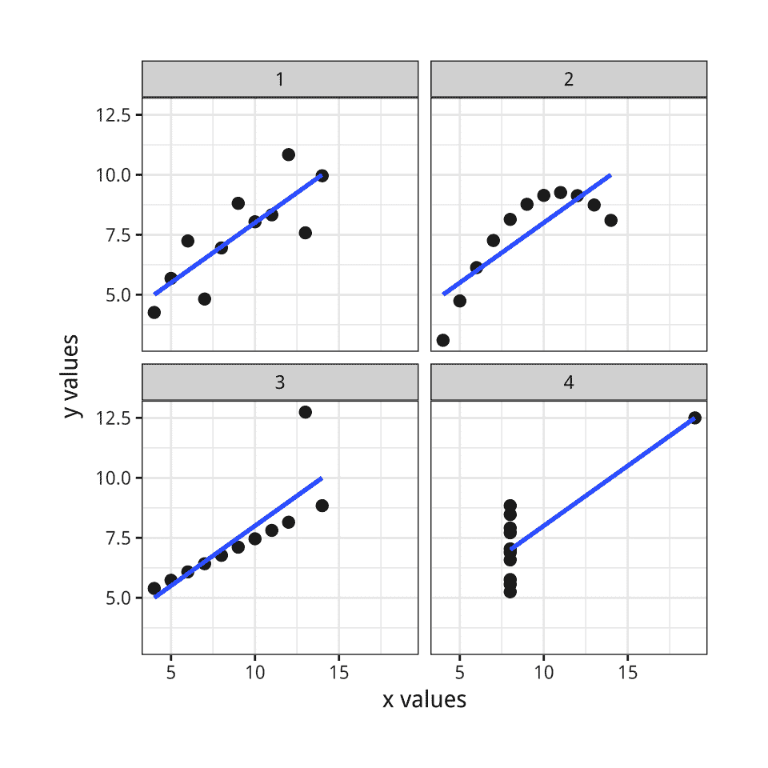 图 1.1：Anscombe 的四重奏图。

 图 1.2：看到异常值对回归线的影响。

## 1.1 为什么看数据？

安斯康姆四重奏（Anscombe, 1973; Chatterjee & Firat, 2007），如图 1.1 所示，提出了以视觉形式查看数据的论点。它使用了一系列四个 *散点图*。散点图显示了两个数量之间的关系，例如身高和体重、年龄和收入，或时间和失业率。散点图是社会科学数据可视化的主要工具，我们将看到很多这样的图表。安斯康姆图表的数据与 R 软件捆绑在一起。您可以在命令提示符中输入 `anscombe` 来查看它。这四个虚构的“数据集”包含了 x 和 y 两个变量的十一个观测值。通过构造，每对 x 和 y 变量的数值属性，如它们的均值，几乎完全相同。此外，每对 x 和 y 之间的关联的标准度量也相匹配。相关系数可以从 -1 到 1 变化，其中零表示没有关联。得分为 -1 表示两个变量之间完美的负关联，得分为 1 表示完美的正关联。因此，0.81 被视为强烈的正关联。在所有情况下，相关系数都是 0.81。但是，当以散点图的形式可视化时，将 x 变量绘制在横轴上，y 变量绘制在纵轴上，它们之间的差异就很容易显现出来。

安斯康姆四重奏是一个极端、人为的例子。但可视化数据的益处可以在实际案例中体现出来。图 1.2 展示了杰克曼（1980）的一幅图表，这是一篇对休伊特（1977）的简短评论。原始论文基于对十八个国家的定量分析，提出了选民投票率和收入不平等之间存在显著关联的观点。然而，更仔细的定量方法也可能发现这个问题，例如通过适当的敏感性分析。但是，当这种关系以散点图的形式表示时，它立即变得明显，这种定量关联完全取决于样本中包含南非。

图 1.3：什么数据模式可能隐藏在相关性背后？所有这些图表的相关系数为 0.6。图由 Jan Vanhove 的代码改编。

Jan Vanhove（2016）的一项练习展示了同时查看模型拟合和数据的有用性。图 1.3 展示了一系列散点图。与安斯康姆的四重奏一样，每个面板显示了两个变量之间的关系。在每个面板内，x 和 y 变量之间的相关性被设置为 0.6，这是一个相当好的关联程度。但实际的数据点分布是由每种情况中不同的过程创建的。在左上角的面板中，每个变量“正常”地围绕其平均值分布。在其他面板中，有一个远离某个方向的孤立点。其他是通过更微妙规则产生的。但每个都产生了相同的基本线性关联。

这样的插图展示了为什么查看数据是值得的。但这并不意味着查看数据就是所有需要做的事情。真实的数据集很混乱，虽然以图形方式展示它们非常有用，但这样做也会带来它自己的问题。正如我们下面将要看到的，关于哪种视觉工作最有效、何时可能过于冗余以及它有时如何对研究人员和观众都造成误导，存在相当大的争议。就像看似清醒和权威的数字表格一样，数据可视化也有其可信性的修辞。尽管安斯康姆的四重奏除外，尤其是对于大量数据，总结统计量和模型估计应被视为我们用来*故意*以某种方式简化事物，使我们能够看到图表中显示的数据点云的工具。仅仅通过查看，我们并不能自动得到我们问题的正确答案。

## 1.2 什么因素使图表变得糟糕？

传统的做法是以“糟糕的展示”开始对数据可视化的讨论，以期激励后续的良好行为。然而，这些负面例子通常结合了几种不同的坏处，这些坏处最好分开来看。为了方便起见，我们可以这样说，我们的问题通常有三种类型。一些是严格*美学*的。我们正在查看的图表在某种程度上很俗气、没有品味，或者是由丑陋或不一致的设计选择拼凑而成的。一些是*实质*的。在这里，我们的图表存在的问题是由于展示的数据造成的。良好的品味可能会使事物看起来更好，但我们需要真正做的是更好地利用我们已有的数据，或者获取新的信息并绘制这些信息。还有一些问题是*感知*的。在这些情况下，即使图表具有良好的美学品质和良好的数据，由于人们如何感知和处理他们所看到的内容，图表可能会让人困惑或误导。重要的是要理解，尽管这些元素经常同时出现，但它们彼此之间是不同的。

图 1.4：一个包含大量杂项的图表。

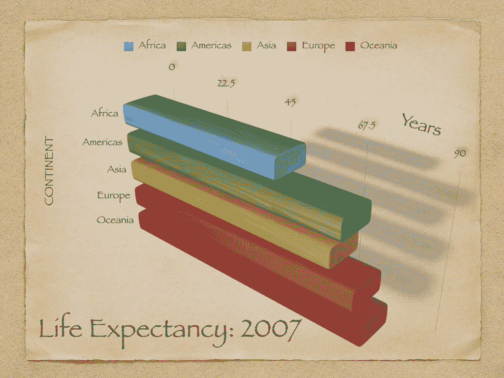

### 1.2.1 坏品味

让我们从糟糕的品味开始。图 1.4 展示了一个既相当无味又包含过多内容的图表，考虑到它展示的信息量是如此之少。条形图难以阅读和比较。它不必要地重复标签，并毫无意义地使用了三维效果、阴影和其他不必要的装饰性设计。

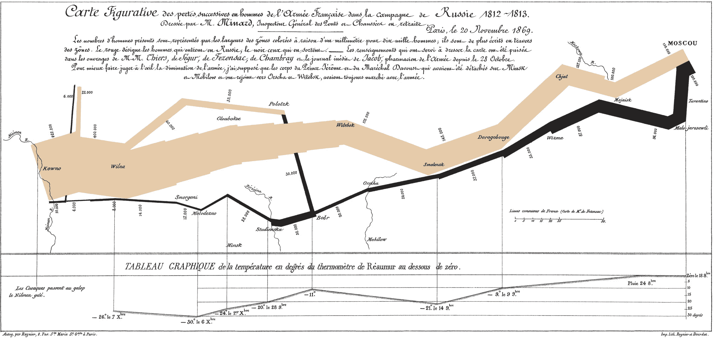 图 1.5：Minard 对拿破仑从莫斯科撤退的视觉化。公正地被引用为经典，但在具体方面也非典型，难以模仿。

对这种可视化风格批评最多，同时也是该领域最著名的品味塑造者，是爱德华·R·图费。他的著作《定量信息的视觉展示》（1983 年）是一部经典，其续集也广受欢迎（Tufte，1990，1997）。这部作品的大部分内容是一系列关于好与坏可视化的例子，以及从中提取的一些更普遍的原则（或经验法则）。它更像是一本关于已完成菜肴的参考书，而不是厨房日常使用的烹饪书。同时，图费在政治学领域的早期学术工作表明，他将自己的思想有效地应用于研究问题。他的《经济政治控制》（1978 年）将表格、图表和文本结合在一起，这种做法在四十年后仍然显得非常新颖。

图费的言论有时会让人感到沮丧，但它是连贯的：

> 图形卓越是精心设计的有趣数据的展示——涉及实质、统计学和设计……[它]通过清晰、精确和高效的方式传达复杂的思想……[它]在尽可能短的时间内，用最少的墨水，在最小的空间内向观众传达最多的想法……[它]几乎总是多变量的……并且图形卓越需要讲述关于数据的真相。（Tufte，1983，第 51 页）。

图费用查尔斯·约瑟夫·米纳德对拿破仑莫斯科之行的著名视觉化来说明这一点，如图 1.5 所示。他指出，这幅图像“可能是绘制过的最好的统计图形”，并认为它“通过其多变量数据讲述了一个丰富、连贯的故事，比仅仅一个随时间跳动的数字更有启发性。绘制了六个变量：军队的大小、其在二维表面上的位置、军队的移动方向以及撤退期间不同日期的温度”。

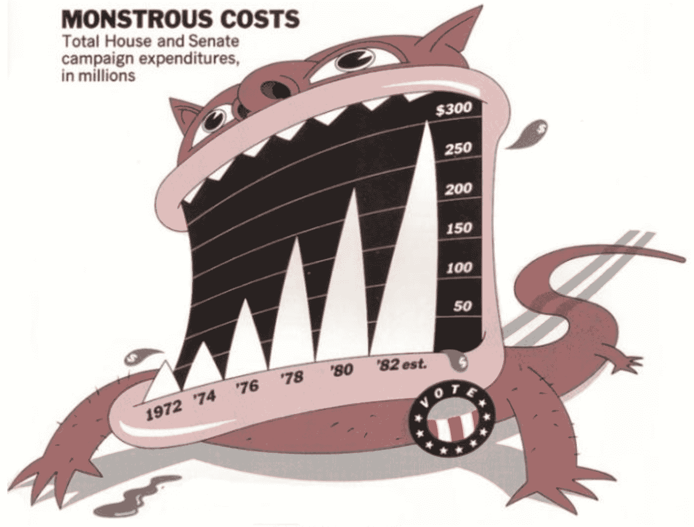 图 1.6：Nigel Holmes 的‘巨大成本’。也是其类别的经典。

值得注意的是，Minard 的图像与大多数当代统计图形相去甚远。至少直到最近，这些图形往往都是散点图和条形图的运用或推广，要么是为了看到更多的原始数据，要么是为了看到从统计模型中得出的结果。前者寻找增加可见数据量、一个面板内显示的变量数量或一个图表内显示的面板数量的方法。后者寻找以易于理解的方式看到点估计、置信区间和预测概率的方法。Tufte 承认，像 Minard 的“Tour de force”这样的作品“可以描述和赞赏，但没有关于如何创建那百万分之一精彩图形的组合原则”。对于“更常规、日常的设计”，最好的办法是提出一些指导方针，例如“选择合适的格式和设计”，“将文字、数字和绘图结合起来”，“展示易于理解的细节复杂性”和“避免无内容的装饰，包括图表垃圾”（Tufte，1983 年，第 177 页）。

在实践中，这些组合原则已经演变成鼓励最大化“数据到墨水”的比例。这是实用的建议。摒弃无味的垃圾内容并不难，如果我们再仔细一点，可能会发现图表也可以不需要其他视觉支撑。我们通常可以清理字体，去除多余的色彩和背景，并简化、减弱或删除网格线、多余的坐标轴标记或不需要的键和图例。考虑到所有这些，我们可能会认为“简化，再简化”的坚定规则几乎是我们确保图表无垃圾、因此有效的全部所需。但不幸的是，情况并非如此。一方面，有些令人烦恼的是，有证据表明，像 Nigel Holmes 的“Monstrous Costs”这样的高度装饰性的图表往往比它们的简单替代品更容易被记住（Bateman 等人，2010 年）。观众并不觉得它们更容易理解，但它们更容易被记住，而且看起来也更令人愉快。它们还更直接地与价值判断相关联，而不是仅仅试图传达信息。Borkin 等人（2013 年）还发现，视觉独特的“信息图表”风格的图表比更标准的统计可视化更容易记住。（“似乎新颖和意外的可视化比我们从小学以来就接触到的有限变异性可视化更容易记住”，他们评论道。）

 图 1.7：六种总结箱线图。类型（c）来自 Tufte。

更糟糕的是，真正最大化数据与墨水比率的图形可能比稍微放松一点的图形更难解释。Anderson 等人（2011）发现，在图 1.7 中展示的四种类型的箱线图中，Tufte 自己工作中的简约版本（选项 C）被证明是最难让观众解释的。像标签和网格线这样的线索，以及一些严格多余的修饰数据点或其他设计元素，通常可能是解释的辅助而不是障碍。

虽然“图表垃圾”并非完全没有优点，但请记住，对于图形来说，易于回忆只是众多优点中的一个。几乎可以肯定的是，像“巨大成本”这样的图表的系统构建并不比复制拿破仑撤退的 Minard 图表更容易。事实上，关于“图表垃圾”的文献表明，这两者可能有一些共同的质量。当然，Minard 的图表在数据上非常丰富，而 Holmes 的则不然。但两者在视觉上都有鲜明的特点，使得它们令人难忘，两者都展示了大量的定制设计，而且它们与大多数你将看到的或制作的统计图表都相当不同。

### 1.2.2 坏数据

在你的日常工作中，你很少会制作出“巨大成本”或“拿破仑撤退”这样的图表。你更有可能制作出看起来很好、设计得很好的图表，但由于你用它来展示了一些糟糕的数据，所以会误导人们。组成部分中几乎没有或没有垃圾的精心设计的图表本身并不能防止你挑选数据或以误导的方式呈现信息。实际上，在一个人们警惕垃圾信息图表的世界里，一个精心制作的图表可能反而“更容易”误导某些受众。或者，可能更常见的是，良好的美学并不使你在查看数据时更容易误导自己。

2016 年 11 月，*《纽约时报》*报道了一些关于人们对民主制度信心的研究。这项研究是由政治学家 Yasha Mounk 在学术期刊上发表的。*《时报》*的标题是，“民主有多稳定？‘警告信号正在闪烁红灯’”（Taub，2016）。文章中附带的图表，如图 1.8 所示，显然显示出令人担忧的下降趋势。

图 1.8：对民主的信仰危机？（《纽约时报》）

这个图表在社交媒体上广泛传播。它制作得非常出色。它是一个优雅的小型图表，除了它识别的点范围外，还显示了误差范围（对于可能不知道这是什么的人有标签），并且每个国家面板上讲述的故事相当一致。

这个图表的解读有点棘手。正如 x 轴标签所示，基础数据来自对不同年龄段人群的横断面调查，而不是测量不同时间点每个人的纵向研究。因此，这些线条并不显示从 1930 年代开始的每十年测量的趋势，而是不同年代出生的人在同一时间被问及问题时给出的答案差异。考虑到这一点，条形图可能更适合展示结果。

我选择这个例子还有一个原因，那就是在写作的时候，对一些西方国家人民对民主政府的承诺稳定性表示担忧并不无道理。或许 Mounk 的论点是正确的。但在这种情况下，问题是我们有多少是让数据说话，而不是安排数据来说出我们基于其他原因已经认为的事情。重要的是，随着故事的传播，得益于引人入胜的图形，了解图表背后世界价值观调查数据的学者们注意到了其他事情。图表看起来像是人们被问及是否认为生活在民主国家是至关重要的，而绘制的结果显示了说“是”的受访者的百分比，这可能是与说“否”的人相对的。但实际上，调查问题要求受访者在 10 点量表上对生活在民主国家的重要性进行评分，其中 1 表示“一点也不重要”，10 表示“绝对重要”。图表显示了只给出“10”分的人的年龄差异，而不是问题平均评分的变化。结果证明，尽管出生年份有一些变化，但大多数人在这些国家倾向于非常重视生活在民主国家的重要性，即使他们并不都将其评为“绝对重要”。政治学家埃里克·沃滕基于平均响应重新绘制了图表。结果如图 1.9 所示。

图 1.9：或许危机被夸大了。（埃里克·沃滕。）

这里变化的原因**不是**由于 y 轴绘制方式的不同。这是图表中常见的问题，我们将在下面讨论。在这种情况下，**《纽约时报》**的图表和 Voeten 的替代图表都有覆盖可能值全范围的刻度（前者是从 0 到 100%，后者是从 1 到 10）。相反，展示的是不同的度量。我们现在正在查看平均分数的趋势，而不是最高可能答案的趋势。实质上，似乎平均分数按年龄组下降的趋势仍然存在，大约在十分之一半到一点五分之间。这可能是一个对民主信念崩溃的早期预警信号，或者它可能由其他因素解释。甚至可以说（正如我们将在稍后的不同例子中看到的那样），用 Voeten 版本的数据展示，y 轴仅覆盖下降的范围，而不是从 0 到 10 的全范围，是合理的。但似乎公平地说，如果原始研究文章展示了 Voeten 版本的数据，而不是报纸上出现的那一个版本，这个故事可能就不会出现在**《纽约时报》**上。

### 1.2.3 错误的感知

我们第三类的不良之处存在于数据和美学之间的差距。可视化将数字编码在线条、形状和颜色中。这意味着我们对这些编码的解释部分取决于我们如何感知几何形状和关系。我们早已知道，编码不良的数据可能会误导。Tufte（1983）和 Wainer（1984）都包含了许多例子。他们引用的许多实例都围绕着在图表中无谓地增加显示维度的数量。例如，用面积来表示长度，可以使观察之间的差异看起来比实际更大。

图 1.10：在 Mac 版 Microsoft Excel 中创建的 3-D 柱状图。尽管这可能难以置信，但条形图中显示的值是 1、2、3 和 4。

尽管最严重的滥用现在比以前少见，但向图表添加额外维度仍然是一个常见的诱惑。例如，图 1.10 是一个使用微软 Excel 最新版本制作的 3D 条形图。这样的图表在商业演示和流行新闻中很常见，有时也会出现在学术期刊文章中。在这里，我们通过使用 Excel 的默认设置来避免过多的杂质。公平地说，3D 格式并不是 Excel 的默认条形图类型。正如您可以从图表左侧显示的单元格中看到的那样，我们试图绘制的这些数据并不复杂。图表甚至试图通过在 y 轴（和 z 轴）上绘制和标注网格线来帮助我们。然而，3D 柱状图与图表的默认视角角度相结合，使得显示的值与实际单元格中的值有显著差异。每一列似乎都低于其实际值。如果您用心灵之眼眯起眼睛，可能会看到如果视角移动到使条形图正面朝向轴线的位置，这些柱状会如何与轴指南线对齐。但就目前而言，任何被问及图表显示什么值的人都会给出错误的答案。

到目前为止，许多统计图形的常规用户已经足够了解如何避免图表过度装饰。他们通常也会对简单趋势的过度精致呈现保持警惕，例如使用三维带状图来显示简单趋势线。此外，大多数当前图形软件的默认设置往往使得用户需要付出更多努力才能将这些功能添加到图表中。

图 1.11：一个无杂质的图表，但仍然难以解读。虽然堆积条形图使整体趋势清晰，但它可能会使条形图内各分类的趋势更难以观察。这部分是由于趋势的性质。但如果附加数据难以理解，也许一开始就不应该包含在内。

即使底层数字是合理的，软件的默认设置很好，图表的展示也大多是垃圾信息-free，但有些图表仍然比其他图表更难解读。它们以观众难以理解的方式编码数据。图 1.11 展示了一个堆叠柱状图，其中 x 轴表示年份，y 轴表示某些值。柱子显示了总价值，通过不同类别对每年观察的相对贡献进行细分。当展示各种产品随时间对总销售的绝对贡献，例如，或一个变化的人口中不同群体的人数时，这种图表很常见。同样，对于 x 轴上有许多观察点的数据，如十年内的季度观察，显示类似趋势的堆叠线图也很常见。

在这样的图表中，整体趋势很容易解读，而且也很容易跟随最接近 x 轴基线的类别随时间变化的模式（在这种情况下，类型 D，用紫色着色）。但其他类别的命运并不那么容易掌握。无论是比较类型内的趋势，还是比较它们之间的趋势，比较类型 B 或 C 的绝对和相对份额都更加困难。相对比较需要一个稳定的基线。在这种情况下，那就是 x 轴，这就是为什么整体趋势和类型 D 的趋势比任何其他趋势都更容易看到。

图 1.12：纵横比影响我们对变化率的感知。（威廉·S·克利夫兰的例子。）

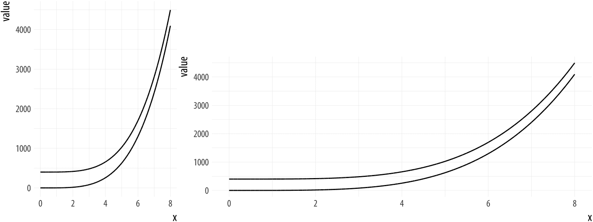

图 1.12 展示了另一种类型的问题。在左侧面板中，乍一看，随着 x 值的增加，线条似乎在汇聚。它们似乎甚至可能会相交，如果我们进一步扩展图表的话。在右侧面板中，曲线从一开始就明显等距。然而，每个面板中绘制的数据是相同的。左侧面板中明显的汇聚只是由于图形的纵横比。

这些问题并不是通过应用良好的品味或遵循一个最大化数据到墨水比率的通用规则就能轻易解决的，尽管这是一个值得遵循的好规则。相反，我们需要更多地了解感知在图表解释中的作用。幸运的是，在过去二十五年中，这个领域已经产生了大量研究。

 图 1.13：赫尔曼网格效应。

## 1.3 感知与数据可视化

尽管对视觉感知的详细讨论远远超出了本书的范围，但即使是对我们如何看到事物的非常简单的理解，也会帮助我们理解为什么有些图形有效，而有些则无效。对于这些主题的更深入探讨，Colin Ware 关于信息设计的书籍是关于视觉感知研究的优秀概述，这些研究是从设计图表、图形和表示数据的系统的人的视角进行的（Ware，2008，2013）。

### 1.3.1 边缘、对比度和颜色

观察数据图片意味着观察线条、形状和颜色。我们的视觉系统以一种使某些事物比其他事物更容易看到的方式工作。我在这里说得稍微含糊一些，因为背后的细节是视觉科学的研究范围，而负责的具体机制往往是持续研究的话题。我不会假装总结或评估这些材料。无论如何，独立于详细解释，感知现象的存在本身通常可以通过各种视觉效应或“光学错觉”直接证明。这些效应表明，感知并不是直接视觉输入产生其内容的简单心理表征的问题。相反，我们的视觉系统调整得非常好以完成某些任务，这以其他方式为代价。

图 1.14：马赫带。在左侧，五个灰色条带从暗到亮排列，条带之间有间隔。在右侧，条带之间没有间隔。相应条带的亮度和亮度是相同的。然而，当条带接触时，暗区似乎更暗，亮区更亮。

感知活动的活跃性质早已被认可。赫尔曼网格效应，如图 1.13 所示，是在 1870 年被发现的。幽灵般的块状物似乎出现在网格的交叉处，但只有在没有直接注视它们时才会出现。一个相关效应如图 1.14 所示。这些是**马赫带**。当灰色条带共享边界时，它们之间的明显对比度似乎增加了。说得通俗一点，我们可以这样说，我们的视觉系统试图根据条带的亮度（或亮度）的**相对**差异来构建它所看到的表示，而不是它们的绝对值。同样，赫尔曼网格效应中的幽灵般块状物可以被视为视觉系统为不同任务调整时的副作用。

这种效果还扩展到背景对比度在其中的作用。相同的灰色阴影在不同的背景上会被感知得非常不同。我们区分亮度阴影的能力也不是均匀的。我们更擅长区分较深的阴影，而不是较浅的阴影。而且这些效果还会相互作用。当它们被设置在浅色背景上时，我们将更好地区分非常浅的灰色阴影。当设置在深色背景上时，光暗光谱中段的变化更容易被区分。

图 1.15：棋盘阴影错觉（爱德华·H·阿德尔森）。

我们的大脑视觉系统会被边缘吸引，并且我们评估对比度和亮度是基于相对值而不是绝对值。一些更壮观的可视效果利用了我们基于所见构建表面、形状和物体表示的大多数成功努力。爱德华·阿德尔森的棋盘阴影错觉，如图 1.15 所示，是一个很好的例子。

为了确定地板上方格的颜色，我们将其与附近的方格进行比较，并且我们还抵消了其他物体投下的阴影。尽管在阴影中的浅色表面可能反射的光线比直接光照下的深色表面少，但通常推断阴影中的表面实际上是较深的颜色是错误的。棋盘图像是精心构建的，以利用基于亮度局部对比和阴影提供的信息的这些视觉推断。正如阿德尔森所说：“视觉系统并不擅长成为一个物理光度计，但这不是它的目的”。因为它已经进化得擅长感知其环境中的真实物体，我们需要意识到在我们在使用它来做其他事情时，如将变量键控到某种灰度值光谱时，它是如何工作的。

关于这类视觉效果的要点是，它们并不是像魔术一样是错觉。如果一个魔术师一步一步地引导你进入错觉，并展示其是如何实现的，那么下次你观看这个魔术时，你会看穿它，并注意到用来达到效果的各个误导和手法。但最有趣的视觉错觉并不像这样。即使它们已经解释给你听，你仍然无法停止看到它们，因为它们利用的感知过程并不在你的意识控制之下。这使得它们很容易误导你，例如（例如）当我们高估地图或网格上两个相邻阴影区域之间的对比度大小时，仅仅因为它们共享一个边界。

 图 1.16：单色和彩色中的边缘对比，根据 Ware（2008）。

我们在单色图像中看到边缘对比的能力比在彩色图像中更强。图 1.16，来自 Ware（2008，第 71 页），展示了一幅沙丘的图像。在红绿版本中，景观的结构难以感知。在灰度版本中，沙丘和脊更加容易看到。

在数据可视化中使用颜色会引入许多其他复杂问题（Zeileis & Hornik, 2006）。其中最关键的是与亮度感知的相对性相关。正如我们一直在讨论的，我们对物体亮度的感知在很大程度上是相对的，而不是绝对的。一个表面看起来有多亮部分取决于其附近物体的亮度。除了亮度之外，一个物体的颜色可以被认为有两个其他组成部分。首先，一个物体的*色调*是我们使用“颜色”这个词时传统上所指的：红色、蓝色、绿色、紫色等等。在物理术语中，它可以被认为是物体表面反射的光的主波长。第二个组成部分是*色度*或*色相*。这是颜色的*强度*或*鲜明度*。

为了在屏幕或打印中产生彩色输出，我们使用各种*颜色模型*，这些模型将颜色成分混合在一起以获得特定的输出。使用 RGB 模型，计算机可能用红色、绿色和蓝色成分的混合来表示颜色，每个成分都可以取从 0 到 255 的范围内的一系列值。当在图表中使用颜色时，我们正在将数据中的某些数量或类别映射到人们看到的一种颜色。我们希望这种映射在某种意义上是“准确”的，与数据相关。这部分是因为映射在严格数值意义上的正确性。例如，我们希望数据中两个数值之间的差距在定义显示的颜色所使用的数值中能够得到有意义的保留。但这也部分取决于当我们查看图表时，这种映射将被如何感知。

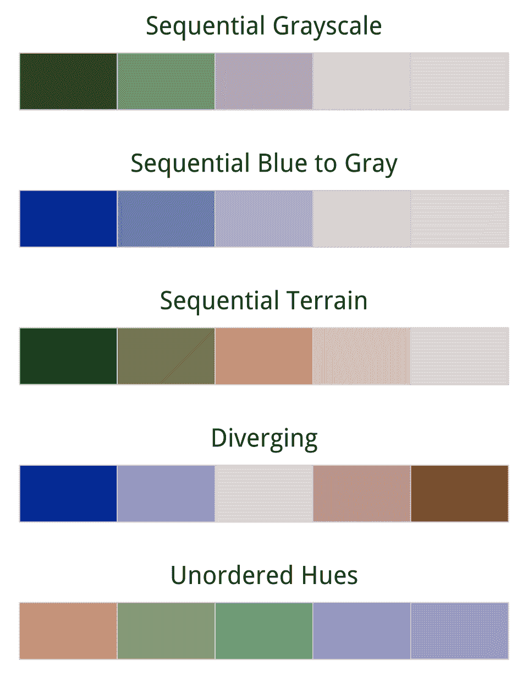 图 1.17：从 R 的色彩空间库生成的五种调色板。从上到下，顺序灰度调色板仅在亮度或亮度上变化。顺序蓝色调色板在亮度和色相（或强度）上变化。第三个顺序调色板在亮度、色相和色调上变化。第四个调色板是发散的，有一个中性中间点。第五个调色板具有平衡的色调，适用于无序类别。

例如，假设我们有一个变量，它可以以 1 的增量从 0 到 5 取值，其中 0 是最小值。将这个变量映射到一组在色彩空间中在数值上彼此等距的 RGB 颜色是非常直接的。问题是，在这个意义上彼此等距的许多点，人们看图时并不会觉得它们等距。这是因为我们对可能颜色的感知在空间上并不均匀。例如，我们能够看到的色相范围强烈依赖于亮度。如果我们选择了错误的颜色调色板来表示我们的数据，对于任何特定的渐变，从一个值到另一个值的相同大小的跳跃（例如，从 0 到 1，与从 3 到 4 相比）可能会被观众感知为不同。这种差异也因颜色而异，例如，在红色序列（例如）中数值相等的间隔与映射到蓝色中的相同间隔感知是不同的。

在选择颜色方案时，我们希望数据到颜色的映射不仅在数值上，而且在**感知上**也是均匀的。R 提供了颜色模型和颜色空间，试图实现这一点。图 1.17 显示了一系列使用 HCL（或色调-饱和度-亮度）颜色模型的顺序渐变。顶部的灰度渐变只按亮度变化。蓝色调色板按亮度和色度变化，因为颜色的亮度和强度在整个光谱中变化。其余三个调色板按亮度、色度和色调变化。在每个例子中，目标是生成一个感知上均匀的方案，其中从一个级别到下一个级别的跳跃被视为具有相同的幅度。

从低到高的渐变或**顺序**尺度是三种颜色调色板中的一种。当我们用中性中点来表示一个尺度（例如，当我们展示温度，或者从零点或平均值向任一方向的变异性时），我们希望有一个**发散**的尺度，其中从中间点向两方向的步骤在感知上是均匀的。图 1.17 中的蓝色到红色的调色板显示了这样一个例子。最后，感知上的均匀性对于无序的分类变量也很重要。我们经常使用颜色来表示不同国家、政党或人群类型等数据。在这些情况下，我们希望我们的**定性**调色板中的颜色易于区分，同时对于观众来说具有相同的效价。除非我们故意为之，否则我们不希望一种颜色在感知上主导其他颜色。图 1.17 底部的调色板显示了这样一个定性调色板的例子，其感知上是一致的。

结果是，我们通常不应该随意选择颜色。很容易走错方向。除了我们一直在讨论的考虑因素之外，我们还可能希望避免制作让色盲人士困惑的图表。幸运的是，几乎所有的工作都已经为我们完成了。不同的颜色空间已经以考虑人类颜色感知的不均匀或非线性方面的方式被定义和标准化。负责这一工作的机构是听起来相当权威的国际照明委员会（Commission Internationale de l’Eclairage）或国际照明委员会。R 和 ggplot 免费为我们提供了这些功能。我们在 ggplot 中将使用的默认调色板在正确的方式上是感知上均匀的。如果我们想以后更加大胆，工具也可用于生成具有期望的感知特性的自定义调色板。我们关于颜色的决定将更多地关注何时以及如何使用它。正如我们即将看到的，颜色是挑选出感兴趣视觉元素的有力渠道。

### 1.3.2 注意力先行的搜索和“弹出”的内容

我们视野中的某些物体比其他物体更容易看到。它们从它们周围的环境中“跳”出来。对于某些类型的物体或通过特定的通道，这可能会很快发生。确实，从我们的角度来看，这发生在有意识地看或寻找某物之前或几乎之前。这个现象的一般术语是“无意识突显”，在心理学和视觉科学领域有大量的实验和理论文献。与其他我们讨论过的感知过程一样，对所发生现象的解释一直是或一直是争论的话题，包括这种现象是否真的是“无意识的”，例如 Treisman & Gormican (1988)或 Nakayama & Joseph (1998)所讨论的。但对我们来说，与突显的存在相关，而不是它的解释。突显使得数据图形上的某些事物比其他事物更容易看到或找到。

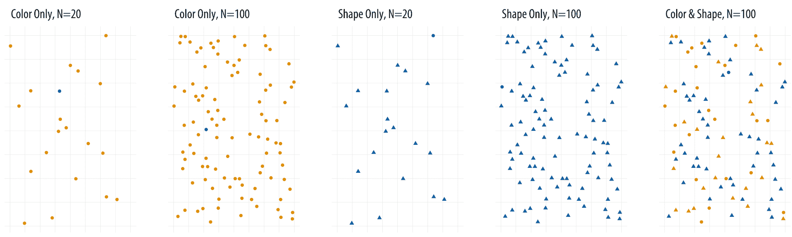

图 1.18：寻找蓝色圆圈变得越来越困难。

考虑 1.18 中的面板。每一个面板都包含一个单独的蓝色圆圈。将其视为一个感兴趣的观察对象。从左到右阅读，第一个面板包含二十个圆圈，其中十九个是黄色，一个是蓝色。蓝色圆圈很容易找到，因为要扫描的观察数量相对较少，而且它们的颜色是唯一变化的。观众几乎不需要有意识地搜索就能看到感兴趣的点。

在第二个面板中，搜索变得更困难，但并不是特别困难。现在有一百个点，是之前的五倍，但蓝色圆圈仍然很容易找到。第三个面板再次只有二十个观察值。但这次没有颜色上的变化。相反，有十九个观察值是三角形，一个是圆圈。平均来看，寻找蓝色圆圈比在第一个面板中搜索它要困难得多，甚至可能比第二个面板还要困难，尽管观察值要少得多。

图 1.19：多个通道很快就会变得难以解释（左侧），除非你的数据具有大量的结构（右侧）。

将形状和颜色视为两个可以用来视觉编码信息的独立*通道*。似乎在颜色通道上的突出效果比在形状通道上更强。在第四个面板中，观察的数量再次增加到一百。找到单个蓝色点可能需要明显更长的时间。如果你在第一次或第二次遍历中没有看到它，可能需要有意识地系统地扫描区域才能找到它。似乎在形状通道上的搜索性能比在颜色通道上下降得更快。

最后，第五个面板将颜色和形状混合，用于大量观察。再次，图表上只有一个蓝色点，但令人烦恼的是有许多蓝色三角形和黄色点，这使得寻找我们想要的东西变得更加困难。对大量观察进行双通道或多通道搜索可能会非常缓慢。

类似的效果可以在其他通道（例如大小、角度、伸长和运动）的搜索中演示，以及通道内的特定类型搜索中。例如，某些类型的角度对比比其他类型更容易看到，某些类型的颜色对比也是如此。Ware（2008，第 27-33 页）有更多的讨论和例子。对数据可视化的影响是显而易见的。如图 1.19 所示，向图表中添加多个通道可能会很快耗尽观众的容量。即使我们的软件允许我们这样做，我们在同时通过形状、颜色和位置来表示不同的变量及其值之前，也应该仔细思考。可能会有例外。特别是（如图 1.19 的第二面板所示），如果数据一开始就显示出大量的结构。但即使在这里，在大多数不是最简单的情况下，不同的可视化策略可能做得更好。

 图 1.20：每个面板显示模拟数据。上面的面板显示由泊松过程生成的随机点模式。下面的面板来自 Matérn 模型，其中新点随机放置，但不能离已存在的点太近。大多数人认为泊松生成的模式比 Matérn 模式具有更多的结构，或者更少的‘随机性’，而实际情况正好相反。

### 1.3.3 格式塔规则

初看图 1.18 中的“突出”示例中的点，似乎在每个面板内随机分布。实际上，它们并不完全是随机分布的。相反，我写了一段小代码，将它们布局在绘图区域周围，但防止任何两个点完全或部分重叠。我这样做是因为我想让散点图是程序生成的，但不想冒蓝色点最终被画在其他点或三角形下面的风险。仔细观察这个案例是值得的，因为这里有一个关于我们如何感知模式的教训。

图 1.20 中的每个面板都显示了一组点。它们之间的结构差异很明显。第一个面板是由二维泊松点过程生成的，是“正确”的随机分布。（定义随机性，或者确保一个过程确实是随机的，实际上比你想象的要困难得多。但我们在这里略过这些困难。）第二个面板是由 Matérn 模型生成的，这种模型在空间统计学和生态学中经常被使用。在这种模型中，点再次随机分布，但受到一些局部约束。在这种情况下，在随机生成一系列候选点之后，该区域被修剪以消除任何看起来太靠近之前生成的点的点。我们可以调整模型来决定“太靠近”是什么意思。结果是，一组点均匀地分布在可用空间中。

如果你问人们哪个面板的结构更多，他们往往会说泊松场。我们将随机性与空间上的相对均匀分布联系起来。但实际上，像这样的随机过程比我们通常认为的要“密集”得多。我第一次看到这种对比是在斯蒂芬·杰·古尔德（1991 年）的一篇文章中。在那里，Matérn-like 模型被用作新西兰洞穴墙上萤火虫的表示。对于这种情况来说，这是一个很好的模型，因为如果一只萤火虫离另一只太近，它很可能会被吃掉。因此，结果是相对均匀但并非随机的分布。

图 1.21：格式塔推断：邻近性、相似性、连接、共同命运。该图的布局采用了这些原则中的一些，同时在显示它们

我们一直在寻找结构。我们如此擅长此道，以至于在给定的时间内，我们甚至会在随机数据中找到它。（这也是数据可视化几乎不能替代统计建模的原因之一。）我们从相对稀疏的视觉信息中做出的关于视觉元素之间关系的强烈推断被称为“格式塔规则”。它们不是像棋盘错觉那样的纯粹感知效应，而是描述了我们以超越严格可见性的方式推断我们所看对象之间关系的倾向。图 1.21 提供了一些例子。

在什么情况下，以及如何推断出这些关系？一般来说，我们希望识别出可以被视为同一事物或同一事物一部分的分组、分类或实体：

+   *邻近性*：空间上彼此靠近的事物似乎有关联。

+   *相似性*：看起来相似的事物似乎有关联。

+   *连接*：彼此视觉上相连的事物似乎有关联。

+   *连续性*：部分隐藏的物体被补充成熟悉的形状。

+   *封闭性*：不完整的形状被视为完整的。

+   *图形与背景*：视觉元素被视为前景或背景。

+   *共同命运*：共享运动方向的元素被视为一个整体。

一些视觉线索比其他线索更重要。例如，在图 1.21 的左上角，圆圈水平排列成行，但它们在列上的邻近性优先级更高，我们看到三组圆圈。在右上角，三组仍然突出，但蓝色圆圈的行现在被视为一个分组实体。在中间行的图中，左侧显示了形状、大小和颜色的混合分组。同时，该行的右侧显示了直接连接比形状更重要。最后，底部两行的示意图说明了连接和共同命运，因为连接形状的线条倾向于从左到右作为一系列的一部分来读取。注意右下角图中的交叉点。连接圆圈的线条段有间隙，但我们感知为它们“穿过”连接三角形的线条。

## 1.4 视觉任务和解码图

我们视觉系统的工作原理以及我们推断可见元素之间关系的能力构成了我们解读数据图表能力的基础。然而，除了感知的核心问题之外，还有解读和理解特定类型图表的问题。能够阅读并正确解读散点图的人数可能比你想象的要少。在感知和解读的交汇处，人们需要执行特定的视觉任务，以便正确地看到他们面前的图表。例如，要理解散点图，观众需要了解很多一般信息，比如什么是变量，x-y 坐标平面是什么样子，为什么我们可能想要在一个平面上比较两个变量，以及将所谓的“原因”或“独立”变量放在 x 轴上的惯例。即使观众理解了所有这些，他们仍然必须执行解读图表的视觉任务。散点图是数据的视觉*表示*，而不是神奇地传递纯粹理解的方式。即使信息丰富的观众在将图像与底层数据联系起来时，也可能表现得比我们想象的要差（Doherty, Anderson, Angott, & Klopfer, 2007; Rensink & Baldridge, 2010）。

图 1.22：九种图表类型的基本感知任务示意图，由 Heer 和 Bostock 根据 Cleveland 和 McGill 的研究绘制。在这两项研究中，参与者被要求比较每种图表类型中突出显示的部分，并说出哪个更小。

在 20 世纪 80 年代，William S. Cleveland 和 Robert McGill 进行了一些实验，确定了不同类型图形的任务并对其进行了排名（Cleveland & McGill, 1984, 1987）。最常见的是，研究人员要求受试者在图表中估计两个值（例如，条形图中的两个条形，或饼图中的两个部分），或者比较图表之间的值（例如，相邻堆叠条形图中的两个区域）。Cleveland 继续应用这项工作的结果，开发了 S 语言中的树状图显示系统，S 是贝尔实验室开发的统计编程语言。（R 是 S 的后续实现。）他还写了两本优秀的书籍，描述并应用了这些原则（Cleveland, 1993, 1994）。

在 2010 年，Heer & Bostock（2010）复现了克利夫兰的早期实验，并增加了一些额外的评估，包括对矩形面积图的评估，这些图表在近年来变得更加流行。这包括树状图，其中正方形或矩形被进一步细分为代表总比例或百分比的进一步矩形区域。它看起来有点像带有多个列的堆叠条形图。他们的研究受试者所做的比较和图表类型在图 1.22 中以示意图的形式展示。对于每种图表类型，受试者被要求识别图表上标记的两个段中较小的一个，然后“快速进行视觉判断”估计较小的一个占较大的一个的百分比。从图中可以看出，测试的图表以不同的方式编码数据。类型 1-3 使用沿共同尺度的位置编码，而类型 4 和 5 使用长度编码。饼图将值编码为角度，其余图表则将值编码为面积，要么使用圆形、分开的矩形（如人口散点图），要么使用子矩形（如树状图）。

图 1.23：克利夫兰和麦吉尔的原有结果（顶部）以及 Heer 和 Bostock 的带有补充的复现结果（底部）针对九种图表类型。

他们的结果展示在图 1.23 中，并与克利夫兰和麦吉尔的原有结果进行了比较。复现效果相当不错。结果的总体模式似乎很清晰，随着我们从基于共同尺度的比较转向基于长度的比较，再到角度和最终面积的比较，性能显著下降。面积比较的表现甚至比（理应受到广泛批评的）饼图还要差。

这些发现以及这一传统中的其他工作强烈表明，当用户必须执行的任务涉及在图表内估计和比较值时，有更好的和更差的方式来视觉表示数据。把这看作是观众为了理解内容必须执行的“解码”操作。数据值被编码或映射到图表中，现在我们必须将它们再次提取出来。在这样做的时候，我们最好判断元素在共同尺度上的*相对位置*，例如当我们比较条形图上的柱高，或以固定的 x 或 y 轴为参考点的点的位置。当元素没有对齐但仍然共享一个尺度时，比较会稍微困难一些，但仍然相当不错。在没有共同基线的情况下比较线的长度则更加困难。

除了位置和长度编码之外，事情通常变得更难，解码过程更容易出错。我们倾向于错误地判断编码为*角度*的数量。锐角的尺寸往往被低估，而钝角的尺寸被高估。这也是饼图通常不是一个好主意的原因之一。我们也对*面积*的判断很差。我们早已知道，基于面积的数量比较很容易被误解或夸大。例如，数据中的值可能被编码为长度，然后平方以在图表上形成形状。结果是，正方形或矩形面积之间的差异将远大于它们所代表的两个数字之间的差异。

比较圆的面积又容易出错，原因相同。可以通过选择一种更复杂的方法来编码数据作为面积，在一定程度上缓解这些问题。例如，不是让数据值代表正方形的边长或圆的半径，而是直接将值映射到面积，然后反向计算边长或半径。然而，比较通常不如其他方法好。对于像块、圆柱或球体这样的“三维”形状，问题会进一步加剧，这些形状似乎代表体积。正如我们在图 1.10 中看到的 3-D 柱状图，这些图表的视角或隐含的观察角度在读取 y 轴上的刻度时会产生其他问题。

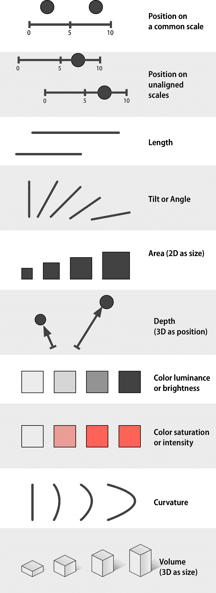 图 1.24：映射有序数据（连续或其他定量度量）的通道，从上到下按从有效到无效排列，根据 Munzer（2014，102）。

最后，我们发现很难判断*斜率的变化*。对线条或趋势变化率的估计强烈受到图表的宽高比的影响，正如我们在图 1.12 中看到的。我们相对较弱的对斜率的判断也与数据的立体表示相互作用不好。我们扫描深度“远离”维度（沿 z 轴）的能力比扫描 x 轴和 y 轴的能力弱。因此，解释点云或使用三个轴显示的表面的数据显示可能不成比例地困难。它们可能看起来很令人印象深刻，但它们也更难理解。

## 1.5 表示数据的通道

图形元素以我们能够看到的方式表示我们的数据。不同类型的变量属性可以通过不同类型的视觉标记或表示来表示，例如点、线、形状、颜色等。我们的任务是提出编码或映射变量的正确方法。在这个过程中，我们会面临几个约束。首先，我们选择的通道或映射需要能够表示我们所拥有的数据类型。例如，如果我们想挑选无序的分类，选择一个连续的渐变来表示它们将不会很有意义。如果我们的变量是连续的，将其表示为一系列形状也不会有帮助。

其次，鉴于数据可以通过我们选择的视觉元素进行可理解的表示，我们想知道这种表示的有效性如何。这正是克利夫兰研究的目标。根据 Munzer（2014，第 101-103 页），图 1.24 和 1.25 分别展示了不同通道对有序和无序数据有效性的近似排名。如果我们有有序数据，并且希望观众能够有效地进行比较，那么我们应该尝试将其编码为公共尺度上的位置。将数字编码为长度（没有尺度）也是可行的，但效果不如编码为位置有效。将它们编码为面积将使比较不那么准确，依此类推。

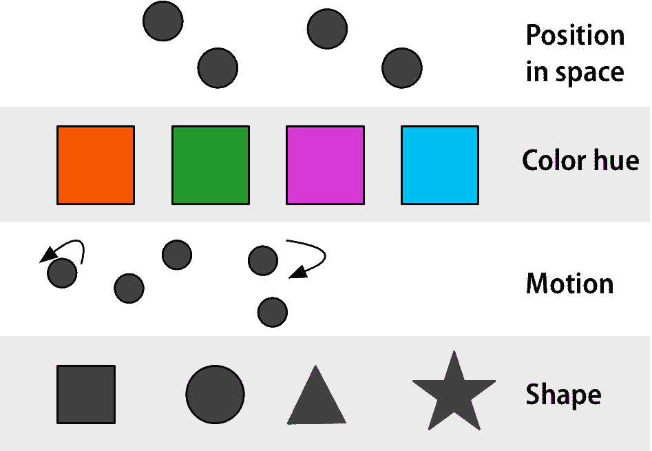 图 1.25：映射无序分类数据的通道，从上到下按有效性从高到低排列，根据 Munzer（2014，第 102 页）。

第三，我们图形的有效性不仅取决于我们选择的通道，还取决于我们实施时的感知细节。因此，如果我们有一个从低到高排序的四个类别的度量，我们可能会正确决定使用顺序渐变来表示它。但如果我们选择了错误的渐变颜色序列，数据仍然难以解释，或者可能具有误导性。以类似的方式，如果我们为无序分类变量选择了一个糟糕的色调集，结果可能不仅看起来不愉快，而且可能具有误导性。

最后，请记住，这些不同的数据通道或映射本身并不是图表的类型。它们只是图表的元素或构建块。当我们选择如何将变量编码为位置、长度、面积、灰色阴影或颜色时，我们已经做出了一个重要的决定，这限制了最终图表可能看起来是什么样子。但这并不等同于决定图表的类型，即选择是否制作点图或条形图、直方图或频率多边形等。

## 1.6 诚信和良好判断的问题

图 1.26 展示了重新绘制我们预期寿命图表的两种方法。这些图表中的每一个都比我们最初充满垃圾的怪物图表要安静得多。但它们也具有可能引起争议的设计特点，并且根据情况可能具有实质性的影响。例如，考虑图 1.26 中每个案例的 x 轴刻度。图 1.26 的左侧面板是一个条形图，条形的长度代表每个大洲“2007 年预期寿命”变量的值。刻度从零开始，延伸到最大值之上。同时，右侧面板是一个克利夫兰点图。每个观察值由一个点表示，刻度限制在数据范围，如图所示。

图 1.26：我们垃圾图表的两个简化版本。条形图版本的刻度延伸到零，而点图版本的刻度则限制在观察值所取的范围内。

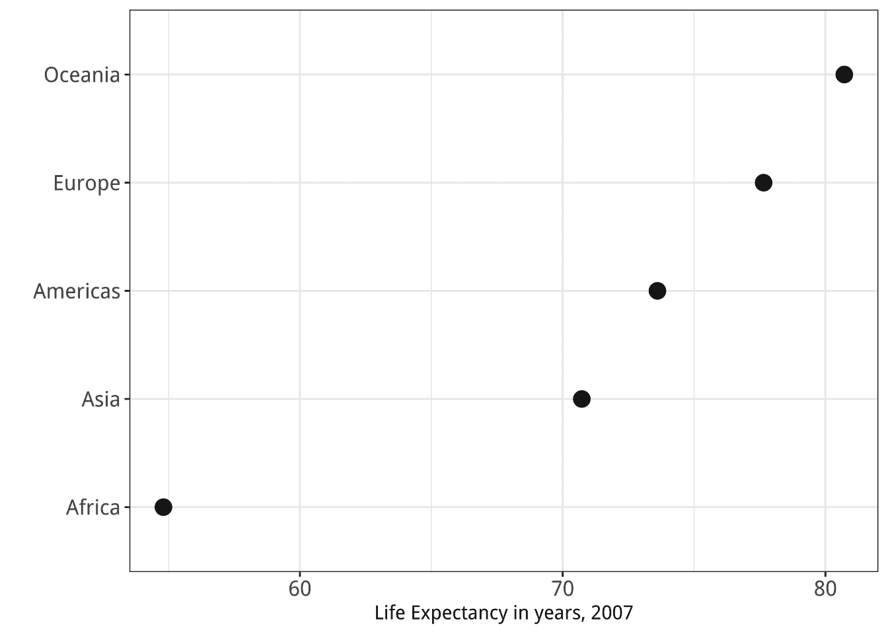

人们可能会倾向于制定关于如何制作图表的僵化规则，并将不遵循这些规则的人视为制作垃圾图表或用统计数据撒谎的人。但是，对你的数据诚实是一个比仅仅依靠图表制作的经验法则更大的问题。在这种情况下，有一种适度的一致意见认为，鉴于条形图将变量编码为长度，条形图通常应包括一个零基线（或等效）。但认为点图故意误导，仅仅因为它保持在自己的数据范围内，这是错误的。

哪一个更可取？给出一个明确的答案很棘手，因为选择一种缩放方式而不是另一种方式的原因部分取决于人们有多频繁地通过偏好一种表示方式而不是另一种方式来主动试图误导他人。一方面，有很多理由支持在观察到的数据范围内展示数据，而不是强迫每个刻度都包含其最低和最高的理论值。如果强制在 x 轴或 y 轴上包含零点，许多本应提供信息的可视化将变得无用。另一方面，事实也是，人们有时会不遗余力地限制他们显示的刻度，使他们的论点看起来更好。有时这是出于主动的恶意，有时是出于被动的偏见，甚至只是希望看到你想要看到的数据。记住，你的可视化作品的主要受众往往是你自己。在这些情况下，产生的图形确实具有误导性。

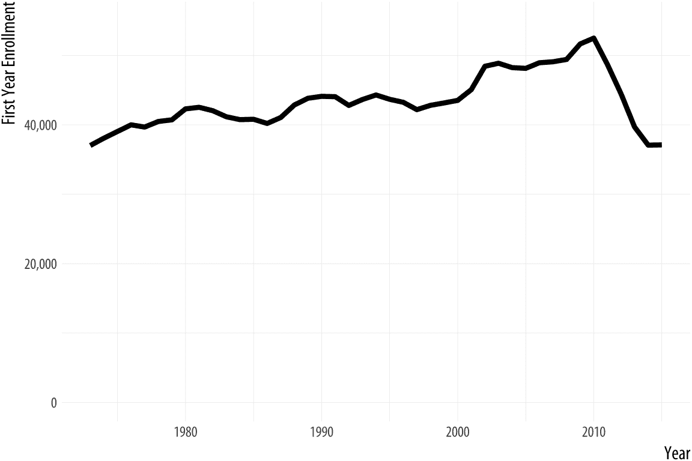

图 1.27：2010 年代中期法学学位招生人数的快速下降的两个视角。

草率、花哨、故意具有煽动性或误导性的图形是社交媒体分享和有线电视新闻周期的标准配置。但这个问题在日常实践中也会出现，如果你的作品出现在公众面前，这两个方面可能会相交。例如，让我们看看一些关于法学学位招生历史数据的例子。招生人数的下降导致了一些关于自 20 世纪 70 年代初以来的趋势的报道。结果如图 1.27 所示。

第一张图展示了自 1973 年以来每年开始攻读法学学位的学生人数趋势。y 轴从低于该系列最低值的位置开始。第二张图显示了相同的数据，但将 y 轴的最小值设置为零。专栏作家和作家贾斯汀·福克斯看到了第一个版本，并评论说它多么令人惊叹。然后他对那些坚持认为 y 轴应该包含零的人的强烈反应感到非常惊讶。一位对话者说，原始图表“可能是……我见过的最糟糕的图表之一”。另一位评论说，“不达到零的图表是一种思想犯罪”（Fox，2014）。

我个人的观点是，没有零基线的图表显示，在经历了近四十年的主要入学人数增长之后，法学院入学人数在 2011 年突然急剧下降，降至自 20 世纪 70 年代初以来未曾见过的水平。这些水平被清晰地标注，下降趋势看起来确实令人惊讶且意义重大。在一个结构良好的图表中，坐标轴标签是读者必要的指南，我们应期待读者会关注它们。而带有零基线的图表，除了以牺牲一些空间为代价提醒你 35,000 是一个远大于零的数字之外，并没有提供多少额外的信息。

话虽如此，我对那些对第一个图表感到不满的人表示同情。至少，它表明他们知道如何阅读图表上的坐标轴标签。这比你想象的要少见。这也可能表明他们知道干扰坐标轴是使图表误导的一种方式，而且这种事情被故意做出来的并不罕见。

## 1.7 明确思考图表

我将假设你的目标是以一种诚实且可重复的方式绘制有效的图表。默认设置和良好的实践规则对阻止你做错事情的能力有限。但它们能做的一件事是，不仅提供制作图表的工具，还提供了一个框架或一系列概念，帮助你更清晰地思考你想要产生的良好工作。当学习图形系统或工具包时，人们通常会开始思考他们想要图表呈现的具体方式。他们很快就开始提出请求。他们想知道如何制作某种特定的图表，或者如何更改整个图表的字体，或者如何调整刻度，或者如何移动标题，如何自定义标签，或者更改点的颜色。

这些请求涉及图表的不同特征。一些与图表结构的非常基本特征有关，即哪些数据被编码为或映射到形状、线条或颜色等元素。一些与这些元素表示的细节有关。如果一个变量被映射到形状，将选择哪些形状，确切地说？如果另一个变量通过颜色表示，将使用哪些特定的颜色？一些与图表的框架或引导特征有关。如果 x 轴上有刻度线，我能决定它们应该画在哪里吗？如果图表有图例，它将出现在图表的右侧还是顶部？如果数据点在形状和颜色中都有编码信息，我们是否需要为每个编码单独的图例，或者可以将它们合并成一个单一的统一图例？还有一些与图表的主题特征有关，这些特征可能会极大地影响最终结果的外观，但它们与表示的数据结构在逻辑上并不相连。我能将标题字体从 Times New Roman 改为 Helvetica 吗？我能在所有图表中都有浅蓝色背景吗？

ggplot 的一个真正优势是它实现了一种*图形语法*来组织和理解这些不同的元素（Wilkinson，2005）。ggplot 不是一次性设置图表外观的每个方面的巨大、概念上扁平的选项列表，而是将制作图表的任务分解为一系列不同的任务，每个任务都与图表的结构有明确的关联。当你编写代码时，你通过使用控制该部分工作的函数来完成每个任务。一开始，ggplot 会为你做大部分工作。只需要两个步骤。首先，你必须向`ggplot()`函数提供一些信息。这通过说明你使用的数据以及哪些变量将被链接或*映射*到图表的特征来建立图表的核心。其次，你必须选择一个`geom_`函数。这将决定绘制哪种类型的图表，例如散点图、条形图或箱线图。

随着你不断进步，你将逐渐使用其他功能来获取对图表其他特征的更精细的控制，例如刻度、图例和主题元素。这也意味着，在学习 ggplot 时，首先掌握核心步骤非常重要，然后再考虑调整和润色。这就是我们将如何进行下去。在下一章中，我们将学习如何在 R 中开始使用并制作我们的第一个图表。从那里开始，我们将通过示例介绍 ggplot 的工作方式中的每个元素。我们将很快制作出复杂的图表，并且我们会继续工作，直到完全掌握我们所做的一切。在这个过程中，我们将了解一些想法和相关的技术技巧，以便让 R 做我们想要的事情。

## 1.8 接下来去哪里

要了解各种视觉效果和光学“错觉”的有趣且信息丰富的概述，请查看 Michael Bach 的网站`michaelbach.de`。如果你想了解更多关于感知与数据可视化之间关系的信息，请参考本章中的某些参考文献。Munzer（2014）、Ware（2008）和 Few（2009）是开始的好地方。William Cleveland 的书籍是清晰性和良好建议的典范（Cleveland，1993，1994）。正如我们将在下一章中看到的，Wilkinson（2005）中提出的思想是 ggplot 可视化方法的核心。最后，Bertin（2010）的基础性工作为大量关于数据与视觉元素之间关系的研究提供了理论基础。

## 1.1 为什么看数据？

安斯康姆四重奏（Anscombe, 1973; Chatterjee & Firat, 2007），如图 1.1 所示，展示了其以视觉形式查看数据的论点。它使用了一系列四个*散点图*。散点图显示了两个数量之间的关系，例如身高和体重、年龄和收入，或时间和失业率。散点图是社会科学数据可视化的主要工具，我们将看到很多这样的图表。安斯康姆图表的数据与 R 软件捆绑在一起。您可以在命令提示符中输入`anscombe`来查看它。这四个虚构的“数据集”包含 x 和 y 两个变量的十一项观测值。通过构造，每对 x 和 y 变量的数值属性，如它们的平均值，几乎完全相同。此外，每对 x 和 y 之间的关联的标准度量也相匹配。相关系数可以从-1 到 1，其中 0 表示没有关联。得分为-1 表示两个变量之间完美的负关联，得分为 1 表示完美的正关联。因此，0.81 被视为强烈的正关联。在所有情况下，相关系数都是 0.81。但是，当以散点图的形式可视化时，将 x 变量绘制在水平轴上，y 变量绘制在垂直轴上，它们之间的差异就很容易显现出来。

安斯康姆四重奏是一个极端、人为的例子。但可视化数据的益处可以在实际案例中体现出来。图 1.2 展示了杰克曼（1980 年）的一张图表，对休伊特（1977 年）的简要评论。原始论文基于对十八个国家的定量分析，主张选民投票率和收入不平等之间存在显著关联。如果采用更细致的定量方法，例如进行适当的敏感性分析，同样可以找到这个问题。但是，图表直接展示了这一关系。然而，当将这种关系以散点图的形式表示出来时，立即变得明显，这种定量关联完全取决于样本中包含南非。

图 1.3：背后可能隐藏的数据模式是什么？所有这些图表的相关系数均为 0.6。图由 Jan Vanhove 改编自代码。

Jan Vanhove（2016）的一项练习展示了同时观察模型拟合和数据的有用性。图 1.3 展示了一系列散点图。与 Anscombe 的四重奏类似，每个面板显示了两个变量之间的关系。在每个面板中，x 和 y 变量之间的相关性被设置为 0.6，这是一个相当好的关联程度。但实际点的分布是由每个案例中不同的过程创建的。在左上角的面板中，每个变量都“正常”地围绕其平均值分布。在其他面板中，有一个单独的异常点远离一个方向或另一个方向。其他则是通过更微妙的规则产生的。但每个都产生了相同的基本线性关联。

这样的插图说明了为什么查看数据是值得的。但这并不意味着查看数据就是所有需要做的事情。真实的数据集很杂乱，虽然以图形方式展示它们非常有用，但这样做也带来了它自己的问题。正如我们下面将要看到的，关于什么样的视觉工作最有效，何时可能过于冗余，以及它有时如何对研究人员和观众都造成误导，存在相当大的争议。就像看似清醒和权威的数字表格一样，数据可视化也有其可信度的修辞。尽管 Anscombe 的四重奏如此，尤其是对于大量数据，总结统计量和模型估计应被视为我们用来*故意*以某种方式简化事物，使我们能够*超越*图表中显示的数据点云的工具。我们仅仅通过查看数据并不能自动得到我们问题的正确答案。

## 1.2 什么使图表变得糟糕？

传统的做法是以“糟糕的展示”开始数据可视化的讨论，以期激发后续的良好行为。然而，这些负面例子通常结合了多种不良因素，这些因素最好分开考虑。为了方便起见，我们可以这样说，我们的问题通常分为三种类型。一些是纯粹的美学问题。我们正在看的图表在某些方面很俗气，没有品味，或者是由丑陋或不一致的设计选择拼凑而成的。一些是实质性的。在这里，我们的图表存在的问题是由于展示的数据造成的。良好的品味可能会使事物看起来更好，但我们需要真正做的是更好地利用我们已有的数据，或者获取新的信息并将其绘制出来。还有一些问题是感知性的。在这些情况下，即使图表具有良好的美学品质和良好的数据，由于人们如何感知和处理他们所看到的内容，图表可能会令人困惑或误导。重要的是要理解，尽管这些元素经常同时出现，但它们彼此之间是不同的。

图 1.4：一张包含大量杂乱信息的图表。

### 1.2.1 坏品味

让我们从不良品味开始。图 1.4 显示的图表既相当无品味，又包含太多内容，考虑到它展示的信息量有限。条形图难以阅读和比较。它不必要地重复标签，并毫无意义地使用了三维效果、阴影和其他不必要的装饰性设计。

 图 1.5：Minard 对拿破仑从莫斯科撤退的视觉化。公正地说，它被引用为经典，但在具体方面也非典型，难以模仿。

到目前为止，这种可视化风格的知名批评家和该领域的知名品味制作者是爱德华·R·图费。他的著作《定量信息的视觉展示》（1983 年）是一部经典，其续集也广受欢迎（图费，1990 年，1997 年）。这部作品的大部分内容是一系列关于良好和不良可视化的例子，以及从中提取的一些更普遍的原则（或经验法则）。它更像是一本关于已完成菜肴的参考书，而不是厨房日常使用的烹饪书。同时，图费在政治学领域的早期学术工作表明，他将自己的观点有效地应用于研究问题。他的《经济政治控制》（1978 年）以表格、图形和文本相结合的方式，即使在四十年后仍然显得非常新颖。

图费的信息有时会让人感到沮丧，但它是连贯的：

> 图形卓越是精心设计的有趣数据的展示——这是一个关于实质、统计学和设计的问题……[它]通过清晰、精确和高效的方式传达复杂的思想……[它]在尽可能短的时间内，用最少的墨水在最小的空间内向观众传达最多的想法……[它]几乎总是多变量的……并且图形卓越需要讲述数据的真相。（图费，1983 年，第 51 页）。

图费用查尔斯·约瑟夫·米纳德对拿破仑莫斯科之行的著名视觉化来说明这一点，如图 1.5 所示。他指出，这幅图像“可能是绘制过的最好的统计图形”，并认为它“用其多变量数据讲述了一个丰富、连贯的故事，比仅仅一个随时间跳动的数字更有启发性。绘制了六个变量：军队的大小、其在二维表面上的位置、军队的移动方向以及撤退过程中不同日期的温度”。

 图 1.6：Nigel Holmes 的‘巨大成本’。也是其类别的经典。

值得注意的是，Minard 的图像与大多数当代统计图形相去甚远。至少直到最近，这些图形往往都是散点图和条形图的运用或推广，要么是为了看到更多的原始数据，要么是为了看到从统计模型中得出的结果。前者寻找增加可见数据量、一个面板内显示的变量数量或一个图表内显示的面板数量的方法。后者寻找以易于理解的方式看到点估计、置信区间和预测概率的方法。Tufte 承认，像 Minard 的“Tour de force”这样的作品“可以描述和赞赏，但并没有关于如何创作那百万分之一张精彩图形的组合原则”。对于“更常规、日常的设计”，他建议一些指南，例如“选择合适的格式和设计”，“将文字、数字和绘图结合起来”，“展示易于理解的细节复杂性”和“避免无内容的装饰，包括图表垃圾”（Tufte，1983 年，第 177 页）。

在实践中，这些组合原则已经演变成鼓励最大化“数据到墨水”的比例。这是实用的建议。摒弃无味的垃圾内容并不难，如果我们再仔细一点，可能会发现图表也可以不需要其他视觉支撑。我们通常可以清理字体，去除多余的色彩和背景，并简化、减弱或删除网格线、多余的坐标轴标记或不需要的键和图例。考虑到所有这些，我们可能会认为“简化，再简化”的坚定规则几乎是我们确保图表无垃圾、因此有效的全部所需。但不幸的是，情况并非如此。一方面，有些令人烦恼的是，有证据表明，像 Nigel Holmes 的“Monstrous Costs”这样的高度装饰性的图表往往比它们的简单替代品更容易被记住（Bateman 等人，2010 年）。观众并不觉得它们更容易理解，但它们更容易被记住，而且看起来也更令人愉快。它们还更直接地与价值判断相关联，而不是仅仅试图传达信息。Borkin 等人（2013 年）还发现，视觉独特的“信息图表”风格的图表比更标准的统计可视化更容易记住。（“似乎新颖和意外的可视化比我们从小学以来就接触到的有限变异性可视化更容易记住”，他们评论道。）

 图 1.7：六种总结箱线图。类型（c）来自 Tufte。

更糟糕的是，真正最大化数据到墨水比率的图形可能比那些稍微放松一点的图形更难解释。Anderson 等人（2011）发现，在图 1.7 中展示的四种类型的箱线图中，Tufte 自己作品中的简约版本（选项 C）被证明是最难让观众理解的。像标签和网格线这样的线索，以及一些严格多余的数据点或其他设计元素的装饰，通常是对解释的辅助而不是障碍。

虽然图表垃圾并非完全没有价值，但请记住，易于回忆只是图形的许多优点之一。事实上，几乎可以说，构建像“巨大成本”这样的图表与复制拿破仑撤退图表的影响一样困难。实际上，关于图表垃圾的文献表明，两者可能有一些共同的特点。当然，Minard 的图表在数据上非常丰富，而 Holmes 的图表则不然。但两者在视觉上都有独特的特点，使得它们令人难忘，两者都展示了大量的定制设计，而且它们与大多数你将看到的或制作的统计图表都大不相同。

### 1.2.2 错误数据

在你的日常工作中，你很少会遇到制作出“巨大成本”或“拿破仑撤退”这样的风险。你更有可能制作出看起来很好看、设计得很好的图表，但由于你用它来展示了一些错误的数据，所以会误导人们。设计精良的图表，其组成部分几乎没有或没有垃圾信息，本身并不能防止你挑选数据或以误导的方式呈现信息。实际上，在一个人们警惕垃圾信息图表的世界里，一个制作精良的图表所伴随的“光环效应”可能会使误导某些受众变得更加容易。或者，也许更常见的是，良好的美学设计并不会使你在查看数据时更容易误导自己。

2016 年 11 月，*纽约时报*报道了一项关于人们对民主制度信心度的研究。这项研究是由政治学家 Yasha Mounk 发表在学术期刊上的。*时报*的标题是：“民主的稳定性如何？‘警告信号正在闪烁红灯’”（Taub，2016）。文章中附带的图表，如图 1.8 所示，显然显示出令人担忧的下降趋势。

图 1.8：对民主的信仰危机？（纽约时报。）

这个图表在社交媒体上广泛传播。它制作得非常出色。它是一个优雅的小型多重图，除了它识别的点范围外，还显示了误差范围（对可能不知道的人来说有标签），并且每个国家的面板讲述的故事相当一致。

这个图示有点难以解读。正如 x 轴标签所示，基础数据来自对不同年龄段人群的横断面调查，而不是测量不同时间点每个人的纵向研究。因此，这些线条并不显示从 1930 年代开始的每十年测量的趋势，而是不同年代出生的人在同一时间被问及问题时的回答差异。考虑到这一点，条形图可能更适合展示结果。

更重要的是，我选择这个例子是因为，在写作的时候，对一些西方国家人民对民主政府承诺的稳定性表示担忧并不无道理。或许蒙克的观点是正确的。但在这种情况下，问题是我们让数据对我们说了多少话，而不是安排数据来说出我们基于其他原因已经认为的事情。重要的是，随着这个故事流传开来，得益于引人入胜的图形，了解图表背后世界价值观调查数据的学者们注意到了其他事情。这个图表看起来像是人们被问及是否认为生活在民主国家是至关重要的，而绘制的结果显示了说“是”的受访者的百分比，这可能是与说“否”的人相对的。但实际上，调查问题要求受访者在 10 点量表上对生活在民主国家的重要性进行评分，其中 1 表示“一点也不重要”，10 表示“绝对重要”。图表显示了只给出“10”分的人的年龄差异，而不是问题平均评分的变化。结果证明，尽管出生年份存在一些差异，但大多数人在这些国家倾向于非常重视生活在民主国家的重要性，即使他们并不都将其评为“绝对重要”。政治学家艾瑞克·沃腾基于平均响应重新绘制了图表。结果如图 1.9 所示。

图 1.9：或许这场危机被夸大了。（艾瑞克·沃腾。）

这里的变化**不是**由于 y 轴绘制方式的不同造成的。这是图表中常见的问题，我们将在下面讨论。在这种情况下，**《纽约时报》**的图表和 Voeten 的替代图表都有覆盖可能值全范围的刻度（前者是从零到 100%，后者是从 1 到 10）。相反，展示的是不同的度量。我们现在正在查看平均分数的趋势，而不是最高可能答案的趋势。实质上，似乎仍然存在平均分数随年龄群体下降的趋势，大约在十分之一半到一点五分之间。这可能是一个民主信念崩溃的早期预警信号，或者它可能由其他因素解释。甚至可以说（正如我们将在稍后的不同例子中看到的那样），用 Voeten 版本的数据展示，y 轴仅覆盖下降范围，而不是从零到十的全范围，是合理的。但如果我们假设原始研究文章展示了 Voeten 版本的数据，而不是报纸上出现的那一个版本，那么这个故事似乎就不会出现在**《纽约时报》**上。

### 1.2.3 坏的感知

我们第三类的不良之处存在于数据和美学之间的差距。可视化将数字编码在线条、形状和颜色中。这意味着我们对这些编码的解释部分取决于我们如何感知几何形状和关系。我们早已知道，编码不良的数据可能会误导。Tufte（1983）和 Wainer（1984）都包含了许多例子。他们引用的许多实例都围绕着在图表中无谓地增加显示的维度数量。例如，用面积来表示长度，可以使观察之间的差异看起来比实际更大。

图 1.10：在 Mac 版 Microsoft Excel 中创建的 3-D 柱状图。尽管这可能难以相信，但条形图中显示的值是 1、2、3 和 4。

尽管最严重的滥用行为不如以前常见，但为图表添加额外维度仍然是一个常见的诱惑。例如，图 1.10 是一个使用微软 Excel 最新版本制作的 3D 柱状图。这类图表在商业演示和流行新闻中很常见，有时也会出现在学术期刊文章中。在这里，我们通过使用 Excel 的默认设置来避免过多的垃圾信息。公平地说，3D 格式并不是 Excel 默认的柱状图类型。正如您可以从图表左侧显示的单元格中看到的那样，我们试图绘制的这些数据并不复杂。图表甚至试图通过在 y 轴（和 z 轴）上绘制和标注网格线来帮助我们。然而，3D 柱状图与图表的默认视角角度相结合，使得显示的值与实际单元格中的值相差很大。每一根柱子似乎都低于其实际值。如果您用心灵之眼眯起眼睛看，可以想象如果视角移动到柱子正对面，这些柱子将如何与轴指南线对齐。但就目前而言，任何被问及图表显示什么值的人都会给出错误的答案。

到现在为止，许多统计图形的常规用户已经足够了解如何避免图表过度装饰。他们通常也会对简单趋势的过度详尽展示保持警惕，例如使用三维带状图来显示简单的趋势线。此外，大多数当前图形软件的默认设置往往使得用户在图表中添加这些功能时需要付出更多努力。

图 1.11：一个无垃圾信息的图表，但仍然难以解读。虽然堆积柱状图使整体趋势清晰，但它可能会使看到柱内类别趋势变得更难。这部分是由于趋势的性质。但如果附加数据难以理解，也许一开始就不应该包含在内。

即使基础数据合理，软件的默认设置良好，图表的展示也大多是垃圾信息-free，但有些图表仍然比其他图表更难解读。它们以观众难以理解的方式编码数据。图 1.11 展示了一个堆叠柱状图，其中 x 轴表示年份，y 轴表示某些值。柱子显示了总价值，通过不同类别对每年观察值的相对贡献进行细分。当展示各种产品随时间对总销售额的绝对贡献，例如，或一个变化的人口中不同人群的数量时，这种图表很常见。同样，对于 x 轴上有许多观察点的数据，如十年内的季度观察，显示类似趋势的堆叠线图也很常见。

在这样的图表中，整体趋势很容易解读，而且也很容易跟随最接近 x 轴基线的类别随时间变化的模式（在这种情况下，类型 D，用紫色着色）。但其他类别的命运并不那么容易掌握。无论是比较类型内的趋势，还是比较它们之间的趋势，对类型 B 或 C 的绝对和相对份额的比较都更加困难。相对比较需要一个稳定的基线。在这种情况下，那就是 x 轴，这就是为什么整体趋势和类型 D 的趋势比任何其他趋势都更容易看到。

图 1.12：比例影响我们对变化速率的感知。（根据威廉·S·克利夫兰的例子。）

图 1.12 展示了不同类型的问题。在左侧面板中，乍一看，随着 x 值的增加，线条似乎在汇聚。它们似乎甚至可能相交，如果我们进一步扩展图表的话。在右侧面板中，曲线从一开始就明显等距。然而，每个面板中绘制的数据是相同的。左侧面板中明显的汇聚只是由于图形的纵横比。

这些问题并不是通过应用良好的品味或遵循一个最大化数据到墨水比率的通用规则就能轻易解决的，尽管这是一个值得遵循的好规则。相反，我们需要更多地了解感知在图表解释中的作用。幸运的是，在过去二十五年中，这个领域已经产生了大量研究。

 图 1.13：赫尔曼网格效应。

### 1.2.1 坏品味

让我们从糟糕的品味开始。图 1.4 展示了一个既相当无品味，又因为显示的信息量有限而包含过多内容的图表。条形图难以阅读和比较。它不必要地重复标签，并毫无意义地使用了三维效果、阴影和其他不必要的视觉设计元素。

 图 1.5：米纳德对拿破仑从莫斯科撤退的视觉化。公正地说，它是一个经典，但在具体方面也非典型，难以模仿。

对这种可视化风格批评最著名的人，也是该领域最著名的品味塑造者，是爱德华·R·图费。他的著作《定量信息的视觉展示》（1983 年）是一部经典，其续集也广受欢迎（Tufte，1990，1997）。这部作品的大部分内容是一系列关于好与坏可视化的例子，以及从中提取的一些更普遍的原则（或经验法则）。它更像是一本关于已完成菜肴的参考书，而不是厨房日常使用的烹饪书。同时，图费在政治科学领域的早期学术工作表明，他将自己的思想有效地应用于研究问题。他的《经济政治控制》（1978 年）将表格、图形和文本结合在一起，这种做法在近四十年的时间里仍然显得非常新颖。

图费的信息有时会让人感到沮丧，但它是连贯的：

> 图形卓越是对有趣数据的精心设计呈现——这是一个关于实质、统计学和设计的问题……[它]通过清晰、精确和高效的方式传达复杂的思想……[它]在尽可能短的时间内，用最少的墨水，在最小的空间内向观众传达最多的想法……[它]几乎总是多变量的……而且图形卓越需要讲述数据的真相。（Tufte，1983，第 51 页）。

Tufte 用查尔斯·约瑟夫·米纳德著名的拿破仑莫斯科战役可视化来阐述这个观点，如图 1.5 所示。他指出这幅图像“可能是绘制过的最好的统计图形”，并认为它“通过其多变量数据讲述了一个丰富、连贯的故事，远比仅仅一个随时间跳动的数字更有启发性。图中绘制了六个变量：军队的大小、其在二维表面上的位置、军队的移动方向以及从莫斯科撤退期间不同日期的温度”。

 图 1.6：`Nigel Holmes 的‘巨大成本’”。也是其类别的经典。

值得注意的是，米纳德（Minard）的图像与大多数当代统计图形相去甚远。至少直到最近，这些图形往往都是散点图和条形图的扩展或推广，要么是为了看到更多的原始数据，要么是为了看到从统计模型中得出的输出。前者寻求增加可见数据量，或者在一个面板中显示的变量数量，或者在一个图形中显示的面板数量。后者寻求以易于理解的方式查看点估计、置信区间和预测概率。图夫特（Tufte）承认，像米纳德的“杰作”这样的作品“可以描述和赞赏，但并没有关于如何创作那百万分之一张精彩图形的构图原则”。对于“更常规、日常的设计”，最好的建议是提出一些指导方针，例如“选择合适的格式和设计”，“将文字、数字和绘图结合在一起”，“展示易于理解的细节复杂性”，以及“避免无内容的装饰，包括图表垃圾”（图夫特，1983，第 177 页）。

实际上，这些构图原则已经转化为最大化“数据到墨水”比率的鼓励。这是一条实用的建议。摒弃无味的垃圾并不难，如果我们再仔细一点，可能会发现图表也可以不需要其他视觉支撑。我们经常可以清理字体，去除多余的色彩和背景，简化、减弱或删除网格线、多余的轴标记或无用的键和图例。考虑到所有这些，我们可能会认为“简化，再简化”的坚定规则几乎是我们确保图表无垃圾、因此有效的全部所需。但不幸的是，情况并非如此。一方面，有些令人烦恼的是，有证据表明，像尼尔·霍姆斯（Nigel Holmes）的“巨大成本”这样的高度装饰性图表往往比它们的简单替代品更容易被记住（Bateman 等人，2010）。观众并不觉得它们更容易理解，但它们更容易被记住，而且看起来也更令人愉快。它们还更直接地与价值判断相关联，而不是仅仅试图传达信息。Borkin 等人（2013）也发现，视觉独特的“信息图表”风格的图表比更标准的统计可视化更容易记住。（“似乎新颖和意外的可视化比我们从小学以来就接触到的有限变异性可视化更容易记住”，他们评论道。）

 图 1.7：六种总结箱线图。类型（c）来自图夫特。

更糟糕的是，那些真正最大化数据与墨水比率的图表可能比那些稍微宽松一点的图表更难解读。安德森等人（2011 年）发现，在图 1.7 中展示的四种箱线图中，图 1.7 中 Tufte 自己工作的简约版本（选项 C）被证明是最难让观众解读的。像标签和网格线这样的提示，以及一些严格多余的数据点或其他设计元素的装饰，通常可能是解读的辅助而不是障碍。

虽然图表垃圾并不是完全没有价值，但请记住，对于图形来说，易于回忆只是众多优点中的一个。事实上，几乎可以肯定的是，构建一个像“巨大成本”这样的图表与复制 Minard 的拿破仑撤退图表的影响一样困难。确实，Minard 的图表在数据上非常丰富，而 Holmes 的图表则不然。但两者都以一种使它们难忘的方式在视觉上与众不同，两者都展示了大量的定制设计，并且都与大多数你将看到的或制作的统计图表大相径庭。

### 1.2.2 坏数据

在你的日常工作中，你很少会陷入“巨大成本”或“拿破仑的撤退”这样的危险。你更有可能制作出看起来很好看、设计精良的图表，但由于你用它来展示了一些错误的数据，所以会误导人们。设计精良且组件部分几乎没有杂质的图表本身并不能防止你挑选数据或以误导方式呈现信息。实际上，在一个人们警惕垃圾信息图表的世界里，一个制作精良的图表可能反而“更容易”误导某些观众。或者，更常见的是，良好的美学设计并不会使你在查看数据时更容易误导自己。

2016 年 11 月，*《纽约时报》*报道了关于人们对民主制度信心的一些研究。这项研究是由政治学家 Yasha Mounk 在学术期刊上发表的。*《时报》*的标题是：“民主有多稳定？‘警告信号正在闪烁红灯’”（Taub，2016）。文章中附带的图表，如图 1.8 所示，确实似乎显示了一个令人担忧的下降趋势。

图 1.8：对民主的信仰危机？（《纽约时报》）

这张图表在社交媒体上被广泛传播。它的制作非常出色。这是一个优雅的小型图表，除了它所识别的点范围外，还显示了误差范围（为可能不知道其含义的人标注了），并且每个国家在图板上的故事讲述相当一致。

这个图表的解读有点棘手。正如 x 轴标签所示，基础数据来自对不同年龄段人群的横断面调查，而不是测量不同时间每个人的纵向研究。因此，线条并不显示从 1930 年代开始的每十年测量的趋势，而是不同年代出生的人给出的答案之间的差异，他们都是在同一时间被问及问题的。考虑到这一点，条形图可能更适合展示结果。

我选择这个例子的一个原因是，在写作的时候，对一些西方国家人民对民主政府承诺的稳定性表示担忧并不无道理。或许 Mounk 的论点是正确的。但在这种情况下，问题是我们让数据对我们说了多少话，而不是安排它说我们基于其他原因已经认为的事情。重要的是，随着故事的传播，得益于引人入胜的图形，了解图表背后世界价值观调查数据的学者们注意到了其他事情。图表看起来像是人们被要求说他们认为生活在民主国家是否是必要的，并且绘制的结果显示了说“是”的受访者的百分比，这可能是与说“否”的人相对的。但实际上，调查问题要求受访者在 10 点量表上对生活在民主国家的重要性进行评分，其中 1 表示“一点也不重要”，10 表示“绝对重要”。图表显示了只给出“10”分的人的年龄差异，而不是问题的平均评分的变化。结果证明，尽管出生年份有一些变化，但大多数人在这些国家倾向于非常高度评价生活在民主国家的重要性，即使他们并不都将其评为“绝对重要”。政治学家埃里克·沃滕基于平均响应重新绘制了图表。结果如图 1.9 所示。

图 1.9：或许危机被夸大了。（埃里克·沃滕。）

这里的变化**不是**由于 y 轴绘制方式的不同。这是图表中常见的问题，我们将在下面讨论。在这种情况下，**《纽约时报》**的图表和 Voeten 的替代图表都有覆盖可能值全范围的刻度（在前者中是从零到 100%，在后者中是从 1 到 10）。相反，这里展示的是不同的度量。我们现在正在查看平均分数的趋势，而不是最高可能答案的趋势。实质上，似乎平均分数按年龄群体下降的趋势仍然存在，大约在十分之一半到一点五分之间。这可能是一个对民主信念崩溃的早期预警信号，或者它可能由其他因素解释。甚至可能（正如我们将在稍后的不同例子中看到的那样）合理地用 Voeten 版本的数据展示，其中 y 轴仅覆盖下降的范围，而不是从零到十的全范围。但似乎公平地说，如果原始研究文章展示了 Voeten 版本的数据，而不是报纸上出现的那一个版本，那么这个故事可能就不会出现在**《纽约时报》**上。

### 1.2.3 错误的感知

我们第三类的不良感知存在于数据与美学之间的差距。可视化通过线条、形状和颜色编码数字。这意味着我们对这些编码的解释部分取决于我们如何感知几何形状和关系。我们早已知道，编码不良的数据可能会误导。Tufte（1983）和 Wainer（1984）都包含了许多例子。他们引用的许多实例都围绕着在图表中无谓地增加显示维度的数量。例如，用面积来表示长度，可以使观察结果之间的差异看起来比实际更大。

图 1.10：在 Mac 版 Microsoft Excel 中创建的 3-D 柱状图。尽管这可能难以置信，但条形图中显示的值是 1、2、3 和 4。

尽管最严重的滥用现在比以前少，但向图表添加额外维度仍然是一个常见的诱惑。例如，图 1.10 是一个使用微软 Excel 最新版本制作的 3D 柱状图。这类图表在商业演示和流行新闻中很常见，有时也会出现在学术期刊文章中。在这里，我们通过使用 Excel 的默认设置来避免过多的杂质。公平地说，3D 格式并不是 Excel 的默认柱状图类型。正如您可以从图表左侧显示的单元格中看到，我们试图绘制的并非非常复杂的数据。图表甚至试图通过在 y 轴（和 z 轴）上绘制和标注网格线来帮助我们。然而，3D 柱子与图表的默认视角角度相结合，使得显示的值与实际单元格中的值有显著差异。每一根柱子看起来似乎都低于其实际值。如果您用心灵之眼眯起眼睛看，可能会看到如果视角移动到柱子正面，柱子将如何与轴指南线对齐。但就目前而言，任何被问及图表显示什么值的人都会给出错误的答案。

到目前为止，许多统计图表的常规用户已经足够了解，知道避免图表过度装饰性修饰。他们通常也会对简单趋势的过度详尽展示保持警惕，例如使用三维带状图来显示简单的趋势线。此外，大多数当前图形软件的默认设置往往使得用户需要付出更多努力才能将这些功能添加到图表中。

图 1.11：一个无杂质的图表，但仍然难以解读。虽然堆积柱状图使整体趋势清晰，但它可能会使看到柱状图内各分类的趋势更困难。这部分是由于趋势的性质。但如果附加数据难以理解，也许一开始就不应该包含在内。

即使基础数据合理，软件的默认设置良好，图表的展示也大多是垃圾信息，一些图表仍然比其他图表更难解读。它们以观众难以理解的方式编码数据。图 1.11 展示了一个堆叠柱状图，x 轴是按年划分的时间，y 轴是某个值。柱子显示了总价值，通过不同类别对每年观察值的相对贡献进行细分。当展示各种产品随时间对总销售额的绝对贡献，例如，或一个不断变化的人口中不同群体的数量时，这种图表很常见。同样，对于 x 轴上有许多观察点的数据，如十年内的季度观察，也常见类似的堆叠线图。

在这样的图表中，整体趋势很容易解读，也可以轻松地跟随最接近 x 轴基线的类别随时间变化的模式（在本例中，类型 D，紫色）。但其他类别的命运并不容易把握。无论是比较类型内的趋势，还是类型之间的比较，比较类型 B 或 C 的绝对和相对份额都更加困难。相对比较需要一个稳定的基线。在这种情况下，那就是 x 轴，这就是为什么整体趋势和类型 D 的趋势比其他任何趋势都更容易看到。

图 1.12：纵横比影响我们对变化率的感知。（根据威廉·S·克利夫兰的例子。）

图 1.12 展示了另一种类型的问题。在左侧面板中，乍一看，随着 x 值的增加，线条似乎在汇聚。它们似乎甚至可能会相交，如果我们进一步扩展图表的话。在右侧面板中，曲线从一开始就明显等距。然而，每个面板中绘制的数据是相同的。左侧面板中明显的汇聚只是由于图形的纵横比造成的。

这些问题并不是通过应用良好的品味或遵循一个旨在最大化数据到墨水比率的通用规则就能轻易解决的，尽管这是一个值得遵循的好规则。相反，我们需要更多地了解感知在图表解读中的作用。幸运的是，在过去二十五年中，这个领域已经产生了大量研究。

 图 1.13：赫尔曼网格效应。

## 1.3 感知与数据可视化

尽管对视觉感知的详细讨论远远超出了本书的范围，但即使是对我们如何看到事物的非常简单的理解，也会帮助我们理解为什么有些图形有效，而有些则无效。对于这些主题的更深入探讨，Colin Ware 关于信息设计的书籍是关于视觉感知研究的优秀概述，这些研究是从设计图表、图形和表示数据的系统的人的视角进行的（Ware，2008，2013）。

### 1.3.1 边缘、对比度和颜色

观察数据图片意味着观察线条、形状和颜色。我们的视觉系统以一种使某些事物比其他事物更容易看到的方式工作。我在这里说得稍微含糊一些，因为背后的细节是视觉科学的研究范围，而负责的具体机制通常是持续研究的话题。我不会假装总结或评估这些材料。无论如何，独立于详细解释，感知现象本身的存在通常可以通过视觉效果或各种类型的“光学错觉”直接证明。这些效应表明，感知并不是直接视觉输入产生其内容的简单心理表征的问题。相反，我们的视觉系统调整得非常好以完成某些任务，这以其他方式为代价。

图 1.14：马赫带。左侧，五条灰色条带从暗到亮排列，条带之间有间隔。右侧，条带之间没有间隔。相应条带的亮度和亮度相同。然而，当条带接触时，暗区似乎更暗，亮区更亮。

感知活动的活跃性质早已被认可。赫尔曼网格效应，如图 1.13 所示，是在 1870 年被发现的。幽灵般的块状物似乎出现在网格的交叉处，但只有在没有直接注视它们时才会出现。一个相关效应如图 1.14 所示。这些是**马赫带**。当灰色条带共享边界时，它们之间的明显对比度似乎会增加。说得通俗一点，我们可以这样说，我们的视觉系统试图根据条带的亮度（或亮度）的**相对**差异来构建它所看到的表示，而不是它们的绝对值。同样，赫尔曼网格效应中的幽灵般的块状物可以被视为视觉系统为不同任务调整时的副作用。

这种效果也扩展到了背景对比度的作用。同样的灰色阴影，根据其是置于较暗的背景还是较亮的背景，会被感知得非常不同。我们区分亮度阴影的能力也不是均匀的。我们更擅长区分较深的阴影，而不是较浅的阴影。而且这些效果还会相互作用。当它们置于浅色背景上时，我们会更好地区分非常浅的灰色阴影。当置于深色背景上时，光暗光谱中段的变化更容易被区分。

图 1.15：棋盘阴影错觉（爱德华·H·阿德尔森）。

我们的大脑视觉系统会被边缘吸引，并且我们评估对比度和亮度是基于相对值而不是绝对值。一些更引人注目的视觉效果利用了我们的努力，基于我们所看到的来构建表面、形状和物体的表示。爱德华·阿德尔森的棋盘阴影错觉，如图 1.15 所示，是一个很好的例子。

为了确定地板上方格的颜色，我们将其与附近的方格进行比较，并且还会扣除其他物体投射的阴影。尽管在阴影中的浅色表面可能反射的光线比直接光照下的深色表面少，但通常推断阴影中的表面实际上是较深的颜色是错误的。棋盘图像是精心构建的，以利用基于亮度局部对比和阴影提供的信息所做出的这些视觉推断。正如阿德尔森所说：“视觉系统并不擅长作为物理光度计，但这不是它的目的”。因为它已经进化得擅长感知其环境中的真实物体，所以我们需要意识到在我们在使用它做其他事情时，如将变量键控到某种灰度值谱时，它是如何工作的。

关于这类视觉效果的要点是，它们并不是以魔术表演那样的方式产生错觉。如果一个魔术师一步一步地引导你通过一个错觉并展示它是如何完成的，那么下次你观看这个魔术表演时，你会看穿它，并注意到用来实现效果的误导和手法。但最有趣的视觉错觉并不像这样。即使它们已经解释给你听，你也无法停止看到它们，因为它们所利用的感知过程并不在你的意识控制之下。这使得它们很容易误导你，例如，当我们（例如）高估地图或网格上相邻阴影区域之间的对比度大小时，仅仅因为它们共享一个边界。

 图 1.16：单色和彩色中的边缘对比，根据 Ware（2008）。

我们在单色图像中看到边缘对比的能力比在彩色图像中更强。图 1.16，来自 Ware（2008，第 71 页），展示了一幅沙丘的图像。在红绿版本中，景观的结构难以感知。在灰度版本中，沙丘和脊更容易看到。

在数据可视化中使用颜色引入了许多其他复杂问题（Zeileis & Hornik, 2006）。其中最重要的是与亮度感知的相对性相关。正如我们一直在讨论的，我们对物体亮度感知在很大程度上是相对判断而不是绝对判断的问题。一个表面看起来有多亮部分取决于附近物体的亮度。除了亮度之外，一个物体的颜色可以被认为有两个其他成分。首先，一个物体的**色调**是我们使用“颜色”这个词时传统上所指的：红色、蓝色、绿色、紫色等等。在物理术语中，它可以被认为是物体表面反射的光的主波长。第二个成分是**色度**或**色相**。这是颜色的**强度**或**鲜明度**。

要在屏幕或打印品上产生彩色输出，我们使用各种**颜色模型**，这些模型将颜色成分混合在一起以获得特定的输出。使用 RGB 模型，计算机可能用红色、绿色和蓝色成分的混合来表示颜色，每种成分可以取从 0 到 255 的范围内的一系列值。在图表中使用颜色时，我们正在将数据中的某些数量或类别映射到人们看到的颜色上。我们希望这种映射在某种意义上是“准确”的，与数据相关。这部分是因为映射在严格数值意义上的正确性。例如，我们希望数据中两个数值之间的差距在定义显示颜色所使用的数值中得到有意义的保留。但这也部分取决于当我们查看图表时，这种映射将被如何感知。

 图 1.17：从 R 的颜色空间库生成的五种调色板。从上到下，顺序灰度调色板仅在亮度或亮度上变化。顺序蓝色调色板在亮度和色度（或强度）上都有变化。第三个顺序调色板在亮度、色度和色调上都有变化。第四个调色板是发散的，有一个中性中间点。第五个调色板具有平衡的色调，适合无序类别。

例如，假设我们有一个变量，它可以以 1 的增量从 0 到 5 取值，其中 0 是最低值。将这个变量映射到一组 RGB 颜色上，这些颜色在颜色空间中在纯数值上彼此等距，这是直截了当的。问题是，在这个意义上彼此等距的许多点，人们看图时不会觉得它们等距。这是因为我们对可能颜色的感知在空间上不是均匀的。例如，我们能够看到的色度范围强烈依赖于亮度。如果我们选择错误的颜色调色板来表示我们的数据，对于任何特定的渐变，从一个值到另一个值的相同大小的跳跃（例如，从 0 到 1，与从 3 到 4 相比）可能会被观众感知为不同。这一点也因颜色而异，在数值上相等的红色序列（例如）之间的间隔与映射到蓝色上的相同间隔感知是不同的。

在选择颜色方案时，我们将希望从数据到颜色的映射不仅在数值上，而且在*感知上*是一致的。R 提供了颜色模型和颜色空间，试图实现这一点。图 1.17 显示了一系列使用 HCL（或色调-饱和度-亮度）颜色模型的顺序渐变。顶部的灰度渐变只按亮度变化。蓝色调色板按亮度和色度变化，因为颜色的亮度和强度在整个光谱中变化。其余三个调色板按亮度、色度和色调变化。在每个情况下，目标是生成一个感知上均匀的方案，其中从一个级别到下一个级别的跳跃被视为具有相同的幅度。

从低到高的渐变或*顺序性*尺度是三种颜色调色板之一。当我们表示具有中性中点的尺度（例如，当我们展示温度或从零点或平均值出发的任何方向的方差时），我们希望有一个*发散性*尺度，其中从中间点向两边的步骤在感知上是均匀的。图 1.17 中的蓝色到红色的调色板显示了这样一个例子。最后，感知一致性对无序分类变量也很重要。我们经常使用颜色来表示不同国家、政党或人群类型等的数据。在这些情况下，我们希望我们的*定性*调色板中的颜色易于区分，同时对于观众来说具有相同的效价。除非我们故意为之，否则我们不希望一种颜色在感知上主导其他颜色。图 1.17 底部的调色板显示了这样一个定性调色板的例子，其方式在感知上是一致的。

结果是，我们通常不应该以*临时性*的方式挑选颜色。很容易走错方向。除了我们一直在讨论的考虑因素外，我们可能还想避免制作出会让人群中色盲者感到困惑的图表，例如。幸运的是，几乎所有的工作都已经为我们完成了。不同的颜色空间已经以考虑人类颜色感知中这些不均匀或非线性方面的方式被定义和标准化。负责这一工作的机构是听起来相当权威的国际照明委员会，或称国际照明委员会。R 和 ggplot 免费为我们提供了这些功能。我们在 ggplot 中将使用的默认调色板在感知上是一致的。如果我们想以后更加大胆，工具也可供我们使用来制作仍然具有理想感知质量的定制调色板。我们关于颜色的决定将更多地关注何时以及如何使用。正如我们即将看到的，颜色是挑选出感兴趣视觉元素的有力渠道。

### 1.3.2 预注意搜索和“突出”的内容

我们视野中的某些物体比其他物体更容易看到。它们从周围环境中“跳”出来吸引我们的注意。对于某些类型的物体或通过特定的渠道，这种情况可能发生得非常快。实际上，从我们的角度来看，这种情况发生在我们意识到看或寻找某物之前或几乎之前。这个现象的通用术语是“预先注意的突显”，在心理学和视觉科学领域有大量的实验和理论文献。与其他我们讨论过的感知过程一样，对所发生现象的解释一直是或一直是争论的话题，包括这种现象是否真的是“预先注意的”，例如 Treisman & Gormican (1988)或 Nakayama & Joseph (1998)所讨论的程度。但对我们来说，重要的是突显的存在，而不是其解释。突显使得数据图形上的某些事物比其他事物更容易看到或找到。

图 1.18：寻找蓝色圆圈变得越来越困难。

考虑 1.18 中的面板。每个面板都包含一个单独的蓝色圆圈。将其视为一个感兴趣的观察。从左到右阅读，第一个面板包含二十个圆圈，其中十九个是黄色的，一个是蓝色的。蓝色圆圈很容易找到，因为要扫描的观察数量相对较少，而且它们的颜色是唯一变化的。观众几乎不需要有意识地搜索就能看到感兴趣的点。

在第二个面板中，搜索变得更困难，但不是特别困难。现在有一百个点，是原来的五倍，但蓝色点仍然很容易找到。第三个面板再次只有二十个观察值。但这次颜色没有变化。相反，十九个观察值是三角形，一个是圆圈。平均来看，寻找蓝色点比在第一个面板中搜索它要困难得多，甚至可能比第二个面板还要困难，尽管观察值要少得多。

图 1.19：多个通道很快变得无法解释（左），除非你的数据有大量的结构（右）。

将形状和颜色视为两个可以用来视觉编码信息的独立*通道*。似乎在颜色通道上的突出效果比在形状通道上更强。在第四个面板中，观察的数量再次增加到一百。找到单个蓝色点可能需要明显更长的时间。如果你在第一次或第二次遍历时没有看到它，可能需要有意识地系统地扫描区域才能找到它。似乎在形状通道上的搜索性能比在颜色通道上下降得更快。

最后，第五个面板将颜色和形状混合用于大量观察。图上仍然只有一个蓝色点，但令人烦恼的是有许多蓝色三角形和黄色点，这使得找到我们想要的东西变得更难。对大量观察的双通道或多通道搜索可能非常慢。

类似的效果也可以在其他通道（例如，大小、角度、伸长和运动）的搜索中以及通道内的特定搜索中演示。例如，某些角度对比比其他角度对比更容易看到，某些颜色对比也是如此。Ware（2008，第 27-33 页）有更多的讨论和例子。对数据可视化的影响是显而易见的。如图 1.19 所示，向图表中添加多个通道可能会很快耗尽观众的容量。即使我们的软件允许我们这样做，我们在同时通过形状、颜色和位置来表示不同的变量及其值之前也应该仔细思考。可能会有例外。特别是（如图 1.19 的第二面板所示），如果数据一开始就显示出大量的结构。但即使在这里，在大多数不是最简单的情况下，不同的可视化策略可能做得更好。

 图 1.20：每个面板显示模拟数据。上面面板显示由泊松过程生成的随机点模式。下面面板来自 Matérn 模型，其中新点随机放置，但不能离已存在的点太近。大多数人认为泊松生成的模式比 Matérn 模式更有结构，或者“随机性”更少，而实际情况正好相反。

### 1.3.3 格式塔规则

初看图 1.18 中的“突出”示例中的点，可能会觉得它们在每个面板内是随机分布的。实际上，它们的位置并不完全随机。相反，我写了一段小代码，将它们布局在绘图区域周围，但防止任何两个点完全或部分重叠。我这样做是因为我想让散点图是程序生成的，但不想冒蓝色点最终被画在其他点或三角形下面的风险。仔细观察这个案例是值得的，因为这里有一个关于我们如何感知模式的教训。

图 1.20 中的每个面板都显示了一个点场。它们之间的结构差异很明显。第一个面板是由二维泊松点过程生成的，是“正确”的随机。 （定义随机性，或确保一个过程确实是随机的，实际上比你想象的要困难得多。但我们在这里略过了这些困难。）第二个面板是由 Matérn 模型生成的，这种模型在空间统计学和生态学中经常被使用。在这种模型中，点再次随机分布，但受到一些局部约束。在这种情况下，在随机生成一系列候选点之后，该区域被修剪以消除任何看起来太靠近之前生成的点的点。我们可以调整模型来决定“太近”是什么意思。结果是点在可用空间中均匀分布的一组点。

如果你问人们哪个面板的结构更多，他们往往会说泊松场。我们将随机性与空间上的相对均匀分布联系起来。但实际上，像这样的随机过程比我们通常认为的要“密集”得多。我第一次看到这种对比是在斯蒂芬·杰·古尔德（1991 年）的一篇文章中。在那里，Matérn-like 模型被用作新西兰洞穴墙上萤火虫的表示。对于这种情况来说，这是一个很好的模型，因为如果一个萤火虫离另一个太近，它很可能会被吃掉。因此，结果是相对均匀但并非随机的分布。

图 1.21：格式塔推断：邻近性、相似性、连接、共同命运。该图的布局采用了这些原则中的一些，同时展示了它们

我们一直在寻找结构。我们如此擅长此道，以至于在给定的时间内，我们甚至会在随机数据中找到它。（这也是数据可视化几乎不能替代统计建模的原因之一。）我们从相对稀疏的视觉信息中做出的关于视觉元素之间关系的强烈推断被称为“格式塔规则”。它们不是像棋盘错觉那样的纯粹感知效应，而是描述了我们以超越严格可见性的方式推断我们观察到的物体之间关系的倾向。图 1.21 提供了一些例子。

在什么情况下，以及如何推断出这些关系？一般来说，我们希望识别出可以被视为同一事物或同一事物一部分的分组、分类或实体：

+   *邻近性*：空间上彼此靠近的事物似乎有关联。

+   *相似性*：看起来相似的事物似乎有关联。

+   *连接性*：视觉上相互连接的事物似乎有关联。

+   *连续性*：部分隐藏的物体被补充成熟悉的形状。

+   *封闭性*：不完整的形状被视为完整的。

+   *图形与背景*：视觉元素被视为前景或背景。

+   *共同命运*：运动方向相同的元素被视为一个整体。

一些视觉线索比其他线索更重要。例如，在图 1.21 的左上角，圆圈水平排列成行，但它们在列上的邻近性优先级更高，我们看到三个圆圈组。在右上角，三个组仍然突出，但蓝色圆圈的行现在被视为一个分组实体。在中间行的图中，左侧显示了形状、大小和颜色的混合分组。同时，该行的右侧显示了直接连接胜过形状。最后，底部两行的示意图说明了连接和共同命运，因为连接形状的线条倾向于从左到右作为系列的一部分来读取。注意，在右下角的图中，线条交叉的点。连接圆圈的线段有间隙，但我们将其感知为它们“穿过”连接三角形的线条。

### 1.3.1 边缘、对比和颜色

观察数据图片意味着观察线条、形状和颜色。我们的视觉系统以一种方式工作，使得某些事物比其他事物更容易被我们看到。我在这里说得稍微模糊一些，因为背后的细节是视觉科学的范畴，而负责的具体机制往往是持续研究的话题。我不会假装总结或评估这些材料。无论如何，独立于详细解释，感知现象的存在往往可以通过视觉效果或各种类型的“光学错觉”直接证明。这些效应表明，感知并不是直接视觉输入产生其内容的简单心理表征的问题。相反，我们的视觉系统调整得非常好以完成某些任务，这以其他方式为代价。

图 1.14：马赫带。在左侧，五个灰色条带从暗到亮排列，它们之间有间隔。在右侧，条带之间没有间隔。相应条带的亮度和亮度是相同的。然而，当条带接触时，暗区似乎更暗，亮区更亮。

感知活动的主动性早已被认可。赫尔曼网格效应，如图 1.13 所示，是在 1870 年发现的。幽灵般的团块似乎出现在网格的交叉处，但只有在没有直接注视它们时才会出现。相关效应如图 1.14 所示。这些是 *马赫带*。当灰色条带共享边界时，它们之间的明显对比度似乎增加。说得通俗一点，我们可以这样说，我们的视觉系统试图根据条带亮度的 *相对* 差异来构建它所看到的表示，而不是它们的绝对值。同样，赫尔曼网格效应中的幽灵般团块可以被视为视觉系统为不同任务调整时的副作用。

这种效果也扩展到了背景对比度在其中的作用。同样的灰色阴影，根据它是否在较暗或较亮的背景上，会被感知得非常不同。我们区分亮度阴影的能力也不是均匀的。我们更擅长区分较暗的阴影，而不是较亮的阴影。而且这些效果还会相互作用。当它们在浅色背景上时，我们更擅长区分非常浅的灰色阴影。当它们在深色背景上时，光暗光谱中段的变化更容易被区分。

图 1.15：棋盘阴影错觉 (爱德华·H·阿德尔森)。

我们的大脑视觉系统会被边缘吸引，并且我们在评估对比度和亮度时，是基于相对值而非绝对值。一些更为壮观的视觉效果利用了我们主要成功构建基于我们所看到的表面、形状和物体表征的努力。爱德华·阿德尔森的棋盘阴影错觉，如图 1.15 所示，是一个很好的例子。

为了确定地板上方格的颜色，我们将其与附近的方格进行比较，并且我们还抵消了其他物体投下的阴影。尽管在阴影中的浅色表面可能反射的光线比直接光照下的深色表面少，但通常推断阴影中的表面实际上是一种较暗的颜色是错误的。棋盘图像是精心构建的，以利用基于亮度局部对比和阴影提供的信息所做出的这些视觉推断。正如阿德尔森所说，“视觉系统并不擅长作为一个物理光度计，但这不是它的目的”。因为它已经进化得擅长感知其环境中的真实物体，我们需要意识到它在其他情况下如何工作，比如将变量键控到某种灰度值光谱中。

关于这类视觉效果的要点是，它们并不是以魔术表演那样的方式产生错觉。如果一个魔术师一步一步地引导你通过一个错觉并展示它是如何完成的，那么下次你观看这个魔术表演时，你会看穿它，并注意到用来实现效果的各个误导和手法。但最有趣的视觉错觉并不像这样。即使它们已经解释给你听，你也不能停止看到它们，因为它们所利用的感知过程并不在你的意识控制之下。这使得它们很容易误导你，例如，当我们（例如）高估地图或网格上相邻阴影区域之间的对比度大小时，仅仅因为它们共享一个边界。

 图 1.16：单色和彩色中的边缘对比，根据 Ware（2008）。

我们在单色图像中看到边缘对比的能力比在彩色图像中更强。图 1.16，来自 Ware（2008，第 71 页），展示了一幅沙丘的图像。在红绿版本中，景观的结构难以感知。在灰度版本中，沙丘和脊更加容易看到。

在数据可视化中使用颜色引入了许多其他复杂问题（Zeileis & Hornik，2006）。其中最重要的是与亮度感知的相对性相关。正如我们一直在讨论的，我们对某物看起来有多亮的感觉在很大程度上是相对判断而不是绝对判断的问题。表面看起来有多亮部分取决于附近物体的亮度。除了亮度之外，物体的颜色可以被认为有两个其他成分。首先，一个物体的**色调**是我们使用“颜色”这个词时传统上所指的：红色、蓝色、绿色、紫色等等。在物理术语中，它可以被认为是物体表面反射的光的主波长。第二个成分是**色度**或**色相**。这是颜色的**强度**或**鲜明度**。

要在屏幕或打印品上产生彩色输出，我们使用各种**颜色模型**，这些模型将颜色成分混合在一起以获得特定的输出。使用 RGB 模型，计算机可能用红色、绿色和蓝色成分的混合来表示颜色，每种成分可以取从 0 到 255 的范围内的一系列值。在图表中使用颜色时，我们正在将数据中的某些数量或类别映射到人们看到的一种颜色。我们希望这种映射在某种意义上是“准确”的，与数据相关。这部分是因为映射在严格数值意义上的正确性。例如，我们希望数据中两个数值之间的差距在定义显示颜色所使用的数值中得到有意义的保留。但这也部分取决于当我们查看图表时，这种映射将被如何感知。

 图 1.17：从 R 的颜色空间库生成的五种调色板。从上到下，顺序灰度调色板仅在亮度或亮度上变化。顺序蓝色调色板在亮度和色度（或强度）上都有变化。第三个顺序调色板在亮度、色度和色调上都有变化。第四个调色板是发散的，有一个中性中间点。第五个调色板具有平衡的色调，适合无序类别。

例如，假设我们有一个变量，它可以以 1 的增量从 0 到 5 取值，其中 0 是最低值。将这个变量映射到一组 RGB 颜色上，这些颜色在颜色空间中在纯数值上彼此等距，这是直截了当的。问题是，在这个意义上彼此等距的许多点，人们看图时不会觉得它们等距。这是因为我们对可能颜色的感知在空间上不是均匀的。例如，我们能够看到的色度范围强烈依赖于亮度。如果我们选择错误的颜色调色板来表示我们的数据，对于任何特定的渐变，从一个值到另一个值的相同大小的跳跃（例如，从 0 到 1，与从 3 到 4 相比）可能会被观众感知为不同。这一点也因颜色而异，在数值上相等的红色序列（例如）之间的间隔与映射到蓝色上的相同间隔感知是不同的。

在选择配色方案时，我们希望从数据到颜色的映射不仅在数值上统一，而且在**感知上**也统一。R 提供了颜色模型和颜色空间，试图实现这一点。图 1.17 展示了一系列使用 HCL（或色调-饱和度-亮度）颜色模型的顺序渐变。顶部的灰度渐变仅由亮度变化。蓝色调由亮度和色度变化，因为颜色的亮度和强度在整个光谱中变化。其余三个调色板由亮度和色度以及色调变化。在每个情况下，目标都是生成一个**感知上统一**的方案，其中从一个级别跳到下一个级别被视为具有相同的幅度。

从低到高的渐变或**顺序**尺度是三种颜色调色板之一。当我们用中性中点表示一个尺度（例如，当我们展示温度或从零点或平均值向任一方向的方差时），我们希望有一个**发散**的尺度，其中从中间点向两个方向的步骤在感知上是均匀的。图 1.17 中的蓝色到红色的调色板显示了这样一个例子。最后，感知上的统一对于无序的分类变量也很重要。我们经常使用颜色来表示不同国家、政党或人群类型等数据。在这些情况下，我们希望我们的**定性**调色板中的颜色易于区分，同时对于观众来说具有相同的效价。除非我们故意这样做，否则我们不想让一种颜色在感知上主导其他颜色。图 1.17 底部的调色板显示了这样一个定性调色板的例子，其方式是感知上统一的。

结果是，我们通常不应该以**随意**的方式选择颜色。很容易走错方向。除了我们一直在讨论的考虑因素之外，我们可能还想避免制作让色盲人士困惑的图表。幸运的是，几乎所有的工作都已经为我们完成了。不同的颜色空间已经以考虑人类颜色感知的不均匀或非线性方面的方式被定义和标准化。负责这一工作的机构是听起来相当权威的国际照明委员会，或国际照明委员会。R 和 ggplot 免费为我们提供了这些功能。我们在 ggplot 中将使用的默认调色板在正确的意义上是**感知上统一**的。如果我们想以后更加大胆，工具也可用于制作具有可取感知特性的自定义调色板。我们关于颜色的决定将更多地关注何时以及如何使用。正如我们即将看到的，颜色是挑选出感兴趣视觉元素的有力渠道。

### 1.3.2 预注意搜索和“突出”的内容

我们视野中的某些物体比其他物体更容易看到。它们从它们周围的环境中“跳”出来。对于某些类型的物体或通过特定的通道，这可能会发生得非常快。实际上，从我们的角度来看，这发生在有意识地看或寻找某物之前或几乎之前。这个现象的一般术语是“无意识突显”，在心理学和视觉科学领域有大量的实验和理论文献。与其他我们讨论过的感知过程一样，对所发生现象的解释一直是或一直是争论的话题，包括这一现象是否真的是“无意识的”，例如 Treisman & Gormican (1988)或 Nakayama & Joseph (1998)所讨论的。但对我们来说，重要的是突显的存在，而不是其解释。突显使得数据图形上的某些事物比其他事物更容易看到或找到。

图 1.18：寻找蓝色圆圈变得越来越困难。

考虑 1.18 中的面板。每个面板都包含一个单独的蓝色圆圈。将其视为一个感兴趣的观察。从左到右阅读，第一个面板包含二十个圆圈，其中十九个是黄色的，一个是蓝色的。蓝色圆圈很容易找到，因为要扫描的观察数量相对较少，而且它们的颜色是唯一变化的。观众几乎不需要有意识地搜索就能看到感兴趣的点。

在第二个面板中，搜索变得更困难，但不是特别困难。现在有一百个点，是原来的五倍，但蓝色点仍然很容易找到。第三个面板再次只有二十个观察值。但这次颜色没有变化。相反，十九个观察值是三角形，一个是圆圈。平均来看，寻找蓝色点比在第一个面板中搜索它要困难得多，甚至可能比第二个面板还要困难，尽管观察值要少得多。

图 1.19：多通道很快就会变得难以理解（左侧），除非你的数据具有大量的结构（右侧）。

将形状和颜色视为两个可以用来视觉编码信息的独立**渠道**。似乎在颜色渠道上的突出效果比在形状渠道上更强。在第四面板中，观察的数量再次增加到一百。找到单个蓝色点可能需要明显更长的时间。如果你在第一次或第二次遍历时没有看到它，可能需要有意识地系统地扫描区域才能找到它。似乎在形状渠道上的搜索性能比在颜色渠道上下降得更快。

最后，第五面板混合了颜色和形状来表示大量观察结果。在图表上，只有一个蓝色点，但令人烦恼的是有许多蓝色三角形和黄色点，这使得找到我们想要的东西变得更难。对大量观察结果进行双渠道或多渠道搜索可能会非常慢。

在其他渠道（例如，大小、角度、长度和运动）的搜索以及渠道内的特定搜索中，也可以观察到类似的效果。例如，某些角度对比比其他角度更容易看到，颜色对比也是如此。Ware（2008，第 27-33 页）有更多的讨论和例子。对数据可视化的影响是显而易见的。如图 1.19 所示，向图表中添加多个渠道可能会很快耗尽观众的容量。即使我们的软件允许我们这样做，我们在一次同时通过形状、颜色和位置来表示不同的变量及其值之前，也应该仔细思考。可能会有例外。特别是（如图 1.19 的第二面板所示），如果数据一开始就显示出大量的结构。但即使在这里，在大多数不是最简单的情况下，不同的可视化策略可能做得更好。

 图 1.20：每个面板显示模拟数据。上面的面板显示由泊松过程生成的随机点模式。下面的面板来自 Matérn 模型，其中新点随机放置，但不能太靠近已存在的点。大多数人认为泊松生成的模式比 Matérn 模式具有更多的结构，或更少的‘随机性’，而实际情况正好相反。

### 1.3.3 格式塔规则

初看图 1.18 中的“突出”示例中的点，似乎在每个面板内随机分布。实际上，它们并不完全是随机分布的。相反，我写了一段小代码，将它们布局在绘图区域周围，但防止任何两个点完全或部分重叠。我这样做是因为我想让散点图是程序生成的，但不想承担蓝色点最终被绘制在其他点或三角形之下的风险。仔细观察这个案例是值得的，因为这里有一个关于我们如何感知模式的教训。

图 1.20 中的每个面板都显示了一组点。它们之间的结构差异很明显。第一个面板是由二维泊松点过程生成的，是“正确”的随机分布。（定义随机性，或者确保一个过程确实是随机的，实际上比你想象的要困难得多。但我们在这里略过这些困难。）第二个面板是由 Matérn 模型生成的，这种模型在空间统计学和生态学中经常被使用。在这种模型中，点再次随机分布，但受到一些局部约束。在这种情况下，在随机生成一系列候选点之后，该区域被修剪以消除任何看起来太靠近之前生成的点的点。我们可以调整模型来决定“太靠近”是什么意思。结果是，一组点均匀地分布在可用空间中。

如果你问人们哪个面板的结构更多，他们往往会说泊松场。我们将随机性与空间上的相对均匀分布联系起来。但实际上，像这样的随机过程比我们通常认为的要“密集”得多。我第一次看到这种对比是在斯蒂芬·杰·古尔德（1991 年）的一篇文章中。在那里，Matérn 类模型被用作新西兰洞穴墙上萤火虫的表示。对于这种情况来说，这是一个很好的模型，因为如果一个萤火虫离另一个太近，它很可能会被吃掉。因此，结果是相对均匀但并非随机的分布。

图 1.21：格式塔推断：邻近性、相似性、连接、共同命运。该图的布局采用了这些原则中的一些，除了显示它们之外

我们一直在寻找结构。我们如此擅长此道，以至于在给定的时间内，我们甚至能在随机数据中找到它。（这也是数据可视化几乎不能替代统计建模的原因之一。）我们从相对稀疏的视觉信息中做出的关于视觉元素之间关系的强烈推断被称为“格式塔规则”。它们不是像棋盘错觉那样的纯粹感知效应，而是描述了我们以超越严格可见性的方式推断我们所观察到的物体之间关系的一种倾向。图 1.21 提供了一些例子。

在什么情况下，以及推断出什么样的关系？一般来说，我们希望识别分组、分类或实体，它们可以被当作同一事物或同一事物的部分来处理：

+   *邻近性*：空间上彼此靠近的物体似乎有关联。

+   *相似性*：看起来相似的物体似乎有关联。

+   *连接性*：彼此视觉上相连的物体似乎有关联。

+   *连续性*：部分隐藏的物体被补充成熟悉的形状。

+   *封闭性*：不完整的形状被感知为完整的。

+   *图形与背景*：视觉元素被视为前景或背景。

+   *共同命运*：共享运动方向的元素被视为一个单元。

一些视觉线索比其他线索更重要。例如，在图 1.21 的左上角，圆圈水平排列成行，但它们在列上的邻近性优先级更高，我们看到三个圆圈组。在右上角，三个组仍然突出，但蓝色圆圈的行现在被视为一个组合实体。在图的中行，左侧显示了形状、大小和颜色的混合分组。同时，该行的右侧显示了直接连接胜过形状。最后，底行中的两个示意图说明了连接和共同命运，因为连接形状的线条倾向于从左到右作为系列的一部分来读取。注意，在右下角的图中，线条交叉的点。连接圆圈的线条段有间隙，但我们感知为它们“穿过”连接三角形的线条。

## 1.4 视觉任务和解码图

我们视觉系统的工作原理以及我们推断可见元素之间关系的能力构成了我们解读数据图表能力的基础。然而，除了感知的核心问题之外，还有解读和理解特定类型图表的问题。能够阅读并正确解读散点图的人数可能比你想象的要少。在感知和解读的交汇处，人们需要执行特定的视觉任务，以便正确地看到他们面前的图表。例如，要理解散点图，观众需要了解很多一般信息，比如什么是变量，x-y 坐标平面是什么样子，为什么我们可能想要在一个平面上比较两个变量，以及将所谓的“原因”或“独立”变量放在 x 轴上的惯例。即使观众理解了所有这些，他们仍然必须执行解读图表的视觉任务。散点图是数据的视觉*表示*，而不是神奇地传递纯粹理解的方式。即使信息丰富的观众在将图像与底层数据联系起来时，也可能表现得比我们想象的要差（Doherty, Anderson, Angott, & Klopfer, 2007; Rensink & Baldridge, 2010）。

图 1.22：九种图表类型的基本感知任务示意图，由 Heer 和 Bostock 根据 Cleveland 和 McGill 的研究绘制。在这两项研究中，参与者被要求比较每种图表类型中突出显示的部分，并说出哪个更小。

在 20 世纪 80 年代，William S. Cleveland 和 Robert McGill 进行了一些实验，确定了不同类型图形的任务并对其进行排名（Cleveland & McGill, 1984, 1987）。通常，研究人员要求受试者在图表中估计两个值（例如，条形图中的两个条或饼图中的两个部分），或者比较图表之间的值（例如，相邻堆叠条形图中的两个区域）。Cleveland 继续应用这项工作的结果，开发了 S 语言中的 trellis 显示系统，用于数据可视化，S 语言是在贝尔实验室开发的统计编程语言。（R 是 S 的后续实现。）他还写了两本优秀的书籍，描述并应用了这些原则（Cleveland, 1993, 1994）。

在 2010 年，希尔和博斯托克（2010）复制了克利夫兰早期的实验，并增加了一些额外的评估，包括对矩形面积图的评估，这些图表在近年来变得更加流行。这包括树状图，其中正方形或矩形被进一步细分为代表总量的某些比例或百分比的进一步矩形区域。它看起来有点像有多列的堆叠柱状图。他们的研究受试者所做的比较和图表类型在图 1.22 中以示意图的形式展示。对于每种图表类型，受试者被要求识别图表上标记的两个段中较小的一个，然后“快速进行视觉判断”估计较小的一个占较大的百分比。从图中可以看出，测试的图表以不同的方式编码数据。类型 1-3 使用共同尺度上的位置编码，而类型 4 和 5 使用长度编码。饼图将值编码为角度，其余图表则编码为面积，要么使用圆形、分开的矩形（如人口图），要么使用子矩形（如树状图）。

图 1.23：克利夫兰和麦吉尔的原有结果（顶部）和希尔与博斯托克的复制添加（底部）九种图表类型。

他们的结果展示在图 1.23 中，与克利夫兰和麦吉尔的原有结果进行了比较。复制的质量相当高。结果的总体模式似乎很清晰，随着我们离开基于共同尺度的比较，转向基于长度的比较，最后到角度和面积的比较，性能显著下降。面积比较的表现甚至比（合理地）受到广泛批评的饼图还要差。

这些发现以及这一传统中的其他工作强烈表明，当用户必须执行的任务涉及在图表中估计和比较值时，有更好的和更差的方式来视觉表示数据。把这看作是观众必须执行的一个“解码”操作，以便理解内容。数据值被编码或映射到图表中，现在我们必须将它们再次提取出来。在这样做的时候，我们最好判断元素在共同尺度上的*相对位置*，例如，当我们比较柱状图上柱子的高度，或者以固定的 x 或 y 轴为参考点的点的位置。当元素没有对齐但仍然共享一个尺度时，比较会稍微困难一些，但仍然相当不错。在没有共同基线的情况下比较线的长度则更加困难。

除了位置和长度编码之外，事情通常变得更难，解码过程更容易出错。我们倾向于错误地判断编码为*角度*的数量。锐角的尺寸往往被低估，而钝角的尺寸被高估。这也是饼图通常不是一个好主意的原因之一。我们也对*面积*的判断很差。我们长期以来就知道，基于面积的数量比较很容易被误解或夸大。例如，数据中的值可能被编码为长度，然后平方以在图表上形成形状。结果是，正方形或矩形面积的大小差异将远大于它们所代表的两个数字之间的差异。

比较圆的面积又容易出错，原因相同。可以通过选择一种更复杂的方法来编码数据作为面积，在一定程度上缓解这些问题。例如，不是让数据值代表正方形的边长或圆的半径，而是直接将值映射到面积，然后回算边长或半径。然而，比较通常不如其他方法好。对于“三维”形状，如方块、圆柱或球体，它们似乎代表体积，这些问题会进一步加剧。正如我们在图 1.10 中看到的 3-D 柱状图，这些图表的视角或隐含的观察角度在读取 y 轴上的刻度时会产生其他问题。

 图 1.24：映射有序数据（连续或其他定量度量）的通道，从上到下按从更有效到更无效排列，根据 Munzer（2014，102）。

最后，我们很难判断*斜率的变化*。在直线或趋势中变化率的估计强烈受到图表的宽高比的影响，正如我们在图 1.12 中看到的。我们相对较弱的对斜率的判断也与数据的立体表示相互作用不良。我们扫描深度“远离”维度（沿着 z 轴）的能力比扫描 x 轴和 y 轴的能力弱。因此，解释点云或使用三个轴显示的表面的数据显示可能不成比例地困难。它们可能看起来很令人印象深刻，但同时也更难理解。

## 1.5 表示数据的通道

图形元素以我们可以看到的方式表示我们的数据。不同类型的变量属性可以通过不同类型的视觉标记或表示来表示，例如点、线、形状、颜色等。我们的任务是提出编码或映射变量的正确方法。在这个过程中，我们面临几个约束。首先，我们选择的渠道或映射需要能够表示我们拥有的数据类型。例如，如果我们想挑选无序类别，选择连续渐变来表示它们将没有太多意义。如果我们的变量是连续的，将其表示为一系列形状将没有帮助。

第二，鉴于数据可以通过我们选择的视觉元素进行可理解的表示，我们将想知道这种表示的有效性。这是 Cleveand 研究的目标。根据 Munzer (2014, pp. 101–103)，图 1.24 和 1.25 分别展示了有序和无序数据不同渠道有效性的近似排名。如果我们有有序数据，并且希望观众能够有效地进行比较，那么我们应该尝试将其编码为公共尺度上的位置。将数字编码为长度（没有尺度）也是可行的，但效果不如前者。将它们编码为面积将使比较不够准确，等等。

 图 1.25：映射无序分类数据的渠道，从上到下按从更有效到更无效排列，根据 Munzer (2014, 102)整理。

第三，我们图形的有效性不仅取决于我们选择的渠道，还取决于我们实施时的感知细节。因此，如果我们有一个从低到高排序的四个类别的度量，我们可能会正确决定使用顺序渐变来表示它。但如果我们选择了错误的渐变颜色顺序，数据仍然难以解释，或者可能产生误导。以类似的方式，如果我们为无序分类变量选择了一组糟糕的色调，结果可能不仅看起来不愉快，而且可能产生误导。

最后，请记住，这些不同的数据渠道或映射本身并不是图表的类型。它们只是图表的元素或构建块。当我们选择如何将变量编码为位置、长度、面积、灰色阴影或颜色时，我们已经做出了一个重要的决定，这限制了最终图表可能的样子。但这并不等同于决定图表的类型，即选择是否制作点图或条形图、直方图或频率多边形等。

## 1.6 诚信和良好判断的问题

图 1.26 展示了重新绘制我们预期寿命图表的两种方法。这些图表中的每一个都比我们最初充满垃圾的怪物图表要安静得多。但它们也有可能引起争议的设计特征，并且可能根据具体情况有实质性影响。例如，考虑图 1.26 中每个案例的 x 轴刻度。图 1.26 的左侧面板是一个条形图，条形的长度代表每个大洲“2007 年平均预期寿命”的变量值。刻度从零开始，延伸到略大于最大值。同时，右侧面板是一个克利夫兰点图。每个观察值由一个点表示，刻度限制在如图所示的数据范围内。

图 1.26：我们垃圾图表的两个更简单版本。条形图版本的刻度延伸到零，而点图版本的刻度限制在观察值所取的值范围内。

很容易制定一些关于如何制作图表的僵化规则，并将不遵循这些规则的人视为制作垃圾图表或用统计数据撒谎的人。但对自己的数据诚实是一个比仅仅依靠图表制作的经验法则更大的问题。在这种情况下，人们普遍认为，鉴于条形图将变量编码为长度，条形图通常应包括一个零基线（或等效值）。但认为点图故意误导，仅仅因为它只限于数据的范围，这是错误的。

哪一种更可取？给出一个明确的答案很棘手，因为选择一种缩放方式而不是另一种的原因部分取决于人们主动试图通过偏好一种表示方式而不是另一种来误导他人的频率。一方面，有很多理由支持在观察到的范围内展示数据，而不是强迫每个比例尺都包含其最低和最高的理论值。如果强制在 x 轴或 y 轴上包含零点，许多本应提供信息的可视化将变得无用。另一方面，事实也确实如此，人们有时会不遗余力地限制他们显示的比例尺，使他们的论点看起来更好。有时这是出于主动的恶意，有时是出于被动的偏见，甚至只是希望看到你想要看到的数据。（记住，你的可视化作品的主要受众往往是你自己。）在这些情况下，产生的图形确实会具有误导性。

图 1.27：2010 年代中期法学院入学人数急剧下降的两个视角。

赶时间、花哨且故意具有煽动性或误导性的图形是社交媒体分享和有线电视新闻周期的常态。但在日常实践中也会出现这个问题，如果你的作品出现在公众面前，两者可能会交叉。例如，让我们看看一些关于法学院入学人数的历史数据。自 20 世纪 70 年代初以来，入学人数的下降导致了一些趋势报道。结果如图 1.27 所示。

第一部分显示了自 1973 年以来每年开始上法学院的学生人数趋势。y 轴从系列中的最低值略低的位置开始。第二部分显示了相同的数据，但将 y 轴的最小值设置为零。专栏作家和作家贾斯汀·福克斯看到了第一个版本，并评论说这真是太神奇了。然后他对那些坚持认为 y 轴应该包含零点的人的强烈反应感到非常惊讶。一位对话者说，原始图表“可能是……我见过的最糟糕的图表之一”。另一位评论说，“不达到零的图表是一种思想犯罪”（福克斯，2014）。

我个人的观点是，没有零基线的图表表明，在经历了近四十年的主要入学人数上升之后，法学院入学人数在 2011 年突然急剧下降，降至自 20 世纪 70 年代初以来未见过的水平。这些水平被清楚地标注，下降趋势看起来确实令人惊讶且意义重大。在一个结构良好的图表中，轴标签是读者必要的指南，我们应该期待读者会关注它们。与此同时，带有零基线的图表并没有提供很多额外的信息，除了以牺牲一些空间为代价提醒你，35000 是一个比零大得多的数字。

话虽如此，我对那些对第一个图表感到不满的人表示同情。至少，它表明他们知道如何阅读图表的轴标签。这比你想象的要少见。这也可能表明他们知道干扰轴是使图表误导的一种方式，而且这种事情被故意做出来的并不罕见。

## 1.7 明智地思考图表

我将假设你的目标是以一种诚实和可重复的方式绘制有效的图表。默认设置和良好的实践规则对阻止你做错事的能力有限。但它们能做的一件事是，不仅提供制作图表的工具，还提供一种框架或概念集，帮助你更清晰地思考你想要产生的良好工作。当学习图形系统或工具包时，人们通常会开始思考他们想要图表呈现的具体方式。他们很快就开始提出请求。他们想知道如何制作特定类型的图表，或者如何更改整个图表的字体，或者如何调整刻度，或者如何移动标题，如何自定义标签，或者更改点的颜色。

这些请求涉及图表的不同特性。一些与图表结构的非常基本特性有关，其中数据片段被编码为或映射到形状、线条或颜色等元素。一些与这些元素表示的细节有关。如果一个变量被映射到形状，将选择哪些形状，确切地说？如果另一个变量通过颜色表示，将使用哪些特定的颜色？一些与图表的框架或引导特性有关。如果 x 轴上有刻度线，我能决定它们应该画在哪里吗？如果图表有图例，它将出现在图表的右侧还是顶部？如果数据点在形状和颜色中都编码了信息，我们是否需要为每个编码单独的图例，或者可以将它们组合成一个单一的统一图例？还有一些与图表的主题特性有关，这些特性可能会极大地影响最终结果的外观，但它们与表示的数据结构在逻辑上并不相连。我能将标题字体从 Times New Roman 改为 Helvetica 吗？我能在所有图表中都有浅蓝色背景吗？

ggplot 的一个真正优势是它实现了一种*图形语法*来组织和理解这些不同的元素（Wilkinson，2005）。ggplot 不是一次性设置图表外观的每个方面的巨大、概念上扁平的选项列表，而是将制作图表的任务分解为一系列不同的任务，每个任务都与图表的结构有明确的关联。当你编写代码时，你通过使用控制该部分工作的函数来完成每个任务。一开始，ggplot 会为你做大部分工作。只需要两个步骤。首先，你必须向`ggplot()`函数提供一些信息。这通过说明你使用的数据以及哪些变量将被链接或*映射*到图表的特征来建立图表的核心。其次，你必须选择一个`geom_`函数。这将决定绘制哪种类型的图表，例如散点图、条形图或箱线图。

随着你不断进步，你将逐渐使用其他功能来获取对图表其他特征的更精细的控制，例如刻度、图例和主题元素。这也意味着，在学习 ggplot 时，首先掌握核心步骤非常重要，然后再考虑调整和润色。这就是我们将如何进行下去。在下一章中，我们将学习如何在 R 中开始使用并制作我们的第一个图表。从那里，我们将通过示例介绍 ggplot 的工作方式的每个元素。我们将很快制作出复杂的图表，并且我们会继续工作，直到完全掌握我们所做的一切。在这个过程中，我们将了解一些想法和相关的技术技巧，以便让 R 做我们想要的事情。

## 1.8 接下来去哪里

要了解各种视觉效果和光学“错觉”的有趣且信息丰富的概述，请查看 Michael Bach 的网站`michaelbach.de`。如果你想了解更多关于感知与数据可视化之间关系的信息，请参考本章中的某些参考文献。Munzer（2014）、Ware（2008）和 Few（2009）是开始的好地方。William Cleveland 的书籍是清晰性和良好建议的典范（Cleveland，1993，1994）。正如我们将在下一章开始看到的那样，Wilkinson（2005）中提出的思想是 ggplot 可视化方法的核心。最后，Bertin（2010）的基础性工作为大量关于数据与视觉元素之间关系的研究提供了理论基础。
