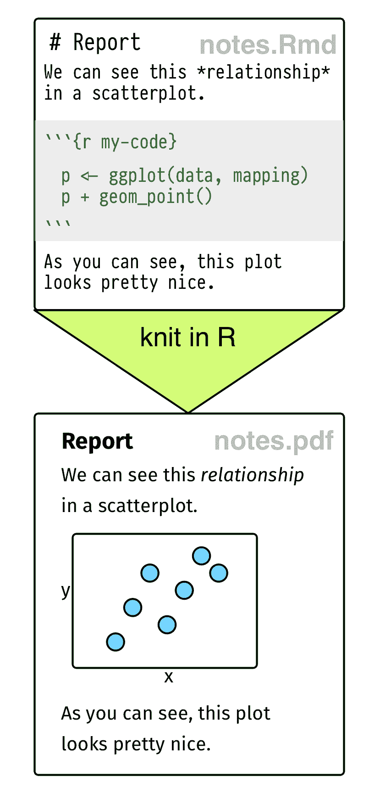
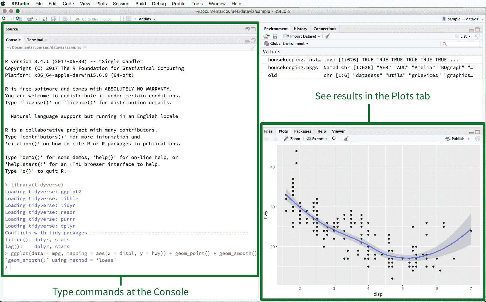
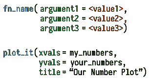
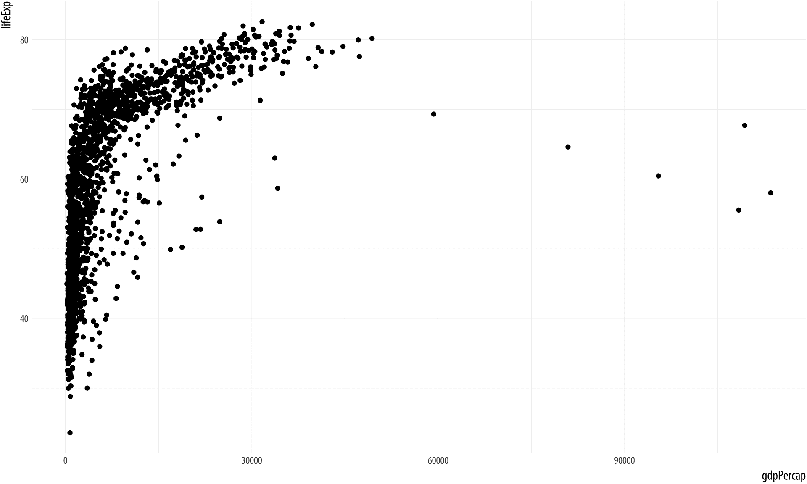

# 2 开始学习

> 原文：[`socviz.co/gettingstarted.html`](https://socviz.co/gettingstarted.html)

在本章中，我们将开始学习如何创建人们，包括我们自己，可以查看并从中学习的数据图片。我们将使用 R 和 ggplot 作为工具。学习它们的最佳方式是跟随并反复编写代码。本书中的材料旨在具有交互性和实践性。如果你按照下面描述的方法与我一起工作，你最终会得到一本与这本书非常相似的书，其中包含了大量的代码示例和你的笔记，以及由该代码产生的图表或其他输出。

我强烈建议你亲自输入代码，而不是从文本中复制粘贴示例。亲自输入代码将帮助你学习。一开始可能会感觉像是一种乏味的转录，你并不完全理解。但它会以某种方式让你放慢速度，适应 R 的语法和结构，这是一种非常有效的学习语言的方法。对于 ggplot 来说，特别有用，因为我们图表的代码将反复具有非常相似的结构，逐步构建而成。

## 2.1 使用纯文本和 RMarkdown 进行工作

在做笔记和编写自己的代码时，你应该在文本编辑器中编写纯文本。不要使用 Microsoft Word 或其他文字处理软件。你可能习惯于将你的最终输出（例如 Word 文件、PDF 文档、演示文稿或你制作的表格和图表）视为你项目中的“真实”内容。相反，最好是认为数据和代码才是真实的内容，连同你写的文本一起。想法是，你所有的最终输出——你的图表、表格和文本等——都可以通过代码、数据和存储在简单纯文本格式中的书面材料按程序和可重复地生成。

 图 2.1：顶部：RMarkdown 语法的一些元素。底部：从纯文本 RMarkdown 文件到 PDF 输出。

以这种方式重现你的工作对于科学过程来说非常重要。但你也应该将其视为一个实用性的选择，这将使你未来的生活更加轻松。对我们大多数人来说，最希望轻松重现你工作的人是六个月或一年后的你自己。这对于图形和图形尤其如此。由于对图形细节进行了大量的调整和修改，它们往往具有“完成”的品质。这可能会使它们在以后难以重现。虽然图形在发表之前进行大量的打磨是正常的，但我们的目标是尽可能通过编程的方式，在我们的代码中完成这些工作，而不是以事后不可见的方式，例如在 Adobe Illustrator 等应用程序中编辑图像。

在学习 ggplot 以及后来进行数据分析时，你会发现自己在三个事物之间不断来回切换：

1.  *编写代码*。你将编写大量代码来生成图形。你还将编写代码来加载数据，快速查看数据的表格。有时你可能想要总结、重新排列、子集或增强你的数据，或者用统计模型与之一起运行。你希望能够尽可能轻松有效地编写这些代码。

1.  *查看输出*。你的代码是一组指令，当执行时，会产生你想要的输出：一个表格、一个模型或一个图形。能够看到这个输出及其部分结果通常很有帮助。在我们工作的过程中，如果可能的话，将代码及其产生的结果保持在一起也是很实用的。

1.  *做笔记*。你还将记录我们所做的工作以及你的结果意味着什么。例如，在学习如何使用 ggplot 时，你将想要为自己做笔记，记录你做了什么，为什么这样写而不是那样写，或者这个新的概念、函数或指令是什么。后来，在数据分析制作图形时，你将撰写报告或起草论文。

如何有效地完成所有这些工作？最简单的方法是将代码和注释写在一起。所有编程语言都有一种方式来标记注释行，通常是在行首放置一个特殊字符（如`#`）。我们可以创建一个名为，例如，`notes.r`的纯文本脚本文件，其中包含代码和我们对它的注释。就目前而言，这是可以的。但对于非常短的文件，使用我们写的注释来做任何有用的事情都会很困难。如果我们想要一份分析报告，例如，我们必须单独编写。虽然脚本文件可以将注释和代码保持在一起，但它失去了代码与其输出之间的联系，例如我们想要生成的图形。但有一个更好的选择：我们可以使用 RMarkdown 来写我们的笔记。

RMarkdown 文件只是一个普通的文本文档，其中文本（如笔记或讨论）与 R 代码的片段或*块*交织在一起。当你将文档输入到 R 中时，它会通过逐个运行 R 代码片段，按顺序将文件*编织*成一个新的文档，并用它们的输出补充或替换代码块。生成的文件随后被转换成格式为 HTML、PDF 或 Word 的更易于阅读的文档。文档的非代码部分是纯文本，但它们可以包含简单的格式化指令。这些指令使用 [Markdown](http://en.wikipedia.org/wiki/Markdown) 设置，这是一套标记纯文本的约定，指示其格式化方式。Markdown 的基本元素显示在图 2.1 的上半部分。当你使用 R Studio 创建 markdown 文档时，它会包含一些示例文本以帮助你开始。

RMarkdown 文档看起来就像图 2.1 的下半部分所示。你的笔记或文本，根据需要使用 Markdown 格式化，与代码交织在一起。代码块有一个固定的格式。它们看起来像这样：

```r
```{r}

```r
```

三个反引号（在美国键盘上，这是位于 Esc 键下的字符）后跟一对大括号，包含我们正在使用的语言名称。这个格式是语言无关的，可以与 Python 和其他语言一起使用。反引号和大括号部分表示一个代码块即将开始。你根据需要编写代码，然后在一个只包含三个反引号的新行中结束代码块。

如果你以这种方式保存笔记，你将能够方便地看到你编写的代码、它产生的输出以及你对它的评论或说明。此外，你还可以立即将其转换成一个看起来不错的文档。

## 2.2 使用 RStudio 中的 R

### 2.2.1 RStudio 环境

R 本身是一个相对较小的应用程序，几乎没有用户界面。所有操作都通过命令行或*控制台*进行。最基本的，你可以通过在终端应用程序（在 Mac 上）或命令提示符（在 Windows 上）中输入 `R` 来启动它。一旦启动，R 就会在自己的命令行上等待你的指令，由右箭头符号 `>` 表示。当你输入指令并按回车键时，R 会解释它并将任何结果输出返回到控制台。

图 2.2：从终端运行的裸骨 R。


除了与控制台交互外，你还可以在文本文件中编写你的代码，并将整个文件一次性发送给 R。你可以使用任何好的文本编辑器来编写你的`.r`脚本。但是，尽管纯文本文件和命令行是使用 R 所需的绝对最小配置，但它是一种相当简朴的安排。我们可以通过使用[RStudio](https://rstudio.com)来使生活变得更简单。RStudio 是一个“集成开发环境”，或 IDE。它是一个与 R 本身分开的应用程序。当启动时，它会在自身内部启动 R 控制台的一个实例。它还方便地汇集了各种其他元素来帮助你完成工作。这些包括你编写代码的文档、它产生的输出以及 R 的帮助系统。RStudio 还了解 RMarkdown，并且对 R 语言和你的项目组织有深入了解。当你启动 RStudio 时，它应该看起来与图 2.3 非常相似。



图 2.3：RStudio IDE。

### 2.2.2 创建项目

首先，创建一个项目。从菜单中选择文件 > 新建项目 … 从菜单栏中选择新建目录选项，并创建项目。你可以将新项目创建在任何你喜欢的位置——最常见的是它会在你的文档文件夹中。一旦设置好，在该目录中创建一个 RMarkdown 文件，方法是文件 > 新建文件 > RMarkdown。这将为你提供一系列选择，包括默认的“文档”。`socviz`库附带了一个小型 RMarkdown 模板，该模板遵循本书的结构。要使用它而不是默认文档，在选择了文件 > 新建文件 > RMarkdown 之后，在出现的对话框侧边栏中选择“从模板”选项。然后从结果选项列表中选择“数据可视化笔记”。当 RMarkdown 文档出现时，立即使用文件 > 保存将其保存在你的项目文件夹中。`socviz`模板包含了一些关于 RMarkdown 如何工作的信息，以及一些帮助你开始的头信息。阅读它所说的话。查看代码块和 RMarkdown 格式。尝试编织文档，并将输出与纯文本文档的内容进行比较。

RMarkdown 不是 R 的必需品。一个替代方案是使用 R 脚本，它只包含 R 命令。你可以通过 File > New File > R Script 创建一个 R 脚本。R 脚本文件通常有 `.r` 或 `.R` 的扩展名。（RMarkdown 文件通常以 `.Rmd` 结尾。）一个非常简单的项目可能只需要一个 `.r` 文件。但 RMarkdown 对于任何长度和内容的文档、笔记或报告都非常有用，尤其是当你需要做笔记时。如果你使用 `.r` 文件，你可以通过在行首使用井号字符 `#` 来给自己留下注释或笔记。你也可以以这种方式在行尾添加注释，就像对于任何特定的行，R 会忽略 `#` 之后出现的任何代码或文本。

RStudio 有各种键盘和菜单快捷键来帮助你快速编辑代码和文本。例如，你可以使用键盘快捷键在 RMarkdown 文档中插入代码块。在 MacOS 上是 `Command+Option+I`，在 Windows 上是 `Ctrl+Alt+I`。这样可以节省你每次都要写反引号和大括号的时间。你也可以使用快捷键运行当前行代码，在 MacOS 上是 `Command+Enter`，在 Windows 上是 `Alt+Enter`。还有一个快捷键会给你一个弹出显示，其中包含许多其他有用的按键组合的摘要。在 MacOS 上是 `Option+Shift+K`，在 Windows 上是 `Alt-Shift-K`。RMarkdown 文档可以包含所有种类的其他选项和格式化元素，从文本格式到交叉引用到参考文献信息。但现在不必担心这些。

图 2.4：在 R Studio 中打开的 RMarkdown 文件。每个代码块右上角的小图标可以用来设置选项（齿轮图标），运行所有代码块直到当前一个（向下三角形），或者只运行当前代码块（向右三角形）。


为了确保你已准备好开始，请加载 `tidyverse` 库。tidyverse 是由 Hadley Wickham 和其他人开发的一系列相关 R 库。`ggplot2` 库是其组成部分之一。其他部分使将数据导入 R 和处理变得更容易。你可以从 socviz 模板创建的笔记文件中编织，或者手动在控制台中加载库：

```r
library(tidyverse)

library(socviz)
```

我们在 tidyverse 之后加载 `socviz` 库。这个库包含了本书中我们将要使用的所有数据集，以及一些会使生活变得轻松的其他工具。如果你收到一个错误信息，说找不到任何一个库，那么请重新阅读本书前言中的“开始之前”部分，并按照那里的说明操作。

你只需要安装一次库，但如果你想要使用它包含的工具，你需要在每个 R 会话的开始使用`library()`来加载它。实际上这意味着你工作文件中的第一行应该包含一个代码块，用于加载文件中需要的库。如果你忘记这样做，那么 R 将无法找到你稍后想要使用的函数。

## 2.3 关于 R 的注意事项

任何新的软件都需要一段时间来适应。当你使用 IDE 在像 R 这样的语言中工作时，这一点尤其正确。你正在适应语言本身（控制台发生的事情），同时学习在可能看起来很奇怪的形式（代码块与纯文本注释交织）中做笔记，在一个旨在长期使你的生活更轻松的 IDE 中，但一开始可能很难理解。以下是一些关于 R 设计的通用要点，它们可能有助于你了解语言的工作方式。

### 2.3.1 所有的东西都有一个名字

在 R 中，你处理的所有东西都有一个名字。你通过名字来引用事物，无论是检查、使用还是修改它们。命名实体包括变量（如`x`或`y`）、你加载的数据（如`my_data`）以及你使用的函数。（关于函数的更多信息稍后提供。）你将花费大量时间讨论、创建、引用和修改带有名字的事物。

一些名字是被禁止的。这包括像`FALSE`和`TRUE`这样的保留词，像`Inf`、`for`、`else`、`break`、`function`这样的核心编程词，以及像`NA`和`NaN`这样的特殊实体词。（最后两个是表示缺失数据和“不是一个数字”的代码。）你可能不会意外地使用这些名字，但了解它们是不被允许的是好的。

一些名字你不应该使用，即使它们在技术上是被允许的。这些名字大多已经用于构成 R 核心部分的物体或函数。这包括像`q()`或`c()`这样的基本函数，像`mean()`、`range()`或`var()`这样的常见统计函数，以及像`pi`这样的内置数学常数。

R 中的名字是区分大小写的。对象`my_data`与对象`My_Data`不同。在为事物选择名字时，要简洁、一致且具有信息性。根据 tidyverse 的风格，将事物命名为小写，根据需要使用下划线字符`_`分隔单词。在命名事物时不要使用空格，包括你的数据中的变量。

### 2.3.2 所有的东西都是对象

一些对象是 R 内置的，一些是通过库添加的，还有一些是由用户创建的。但几乎一切都是某种对象。你编写的代码将创建、操作和使用命名对象，这是理所当然的。我们可以立即开始。让我们创建一个数字向量。`c()`是一个函数。它代表“组合”或“连接”。它将括号内以逗号分隔的一系列事物连接起来，形成一个向量，其中每个元素仍然可以单独访问。

```r
c(1, 2, 3, 1, 3, 5, 25)
```

```r
## [1]  1  2  3  1  3  5 25
```

我们可以将结果发送到控制台，而不是将其*分配*给我们创建的对象。你可以使用`<`和`-`来输入箭头：

```r
my_numbers <-  c(1, 2, 3, 1, 3, 5, 25)
your_numbers <-  c(5, 31, 71, 1, 3, 21, 6)
```

要查看你创建的内容，请输入对象的名称并按回车键：

```r
my_numbers
```

```r
## [1]  1  2  3  1  3  5 25
```

我们的所有数字仍然在那里，如果我们想直接访问它们，也是可以的。现在它们只是新对象，即向量`my_numbers`的一部分。

你通过将对象分配给名称来创建对象。*赋值运算符*是`<-`。将赋值看作是“得到”这个动词，从左到右读取。因此，上面的代码片段可以读作：“对象`my_numbers`得到了以下数字连接的结果：1, 2, …”赋值运算符是键盘上的两个独立键：`<`键和`-`（减号）键。因为你在 R 中经常输入这个，R Studio 中有一个快捷键。要一步写出赋值运算符，请按住`option`键并敲击`-`。在 Windows 上，请按住`alt`键并敲击`-`。你将不断地以这种方式创建对象，单独输入这两个字符既麻烦又容易出错。你可能会犯一些难以察觉的错误，比如输入`< -`（字符之间有空格）而不是`<-`。

当你通过将事物分配给名称来创建对象时，它们在 R 的*工作区*或*环境*中存在。你可以最直接地将其视为你的项目目录。你的工作区是特定于你的当前项目的。它是你启动 R 的文件夹。除非你有特殊需求（例如，非常大的数据集或需要非常长时间的分析口味），你不需要考虑对象“真正”在哪里。只需将你的代码和数据文件视为项目的永久特征。当你启动一个 R 项目时，你通常首先加载数据。也就是说，你会从磁盘读取它并将其分配给一个名为`my_data`的命名对象。你其余的代码将是一系列指令，用于操作和创建更多的命名对象。

### 2.3.3 使用函数进行操作

 图 2.5：上图：函数的外观，非常简略。下图：一个想象中的函数，它接受两个向量并将它们以标题的形式绘制出来。我们向函数提供它想要使用的特定向量以及标题。向量是对象，所以直接给出。标题不是对象，所以我们用引号括起来。

你几乎在 R 中使用函数做所有事情。将函数视为一种可以为你执行动作的特殊类型的对象。它根据接收到的输入产生输出。像一只好狗一样，当我们想让函数为我们做某事时，我们 *调用* 它。它不像狗那么少，它会可靠地执行我们告诉它的事情。我们给函数一些信息，它根据这些信息行动，然后从另一边产生一些结果。函数可以通过其名称末尾的括号来识别。这使它们与其他对象区分开来，例如单个数字、命名向量、数据表等。

括号允许你向函数发送信息。大多数函数接受一个或多个命名 *参数*。函数的参数是它需要知道以便执行某事的东西。它们可以是你的数据的一部分（`data = my_numbers`），或特定的指令（`title = "GDP per Capita"`），或你想要选择的选项（`smoothing = "splines", show = FALSE`）。例如，对象 `my_numbers` 是一个数值向量：

```r
my_numbers
```

```r
## [1]  1  2  3  1  3  5 25
```

但我们用来创建它的东西，`c()`，是一个函数。它将项目连接成一个由你给出的逗号分隔的元素序列组成的向量。同样，`mean()` 是一个计算数字向量简单平均值的函数。如果我们只输入 `mean()` 而不提供任何括号内的参数，会发生什么？

```r
mean()
# Error in mean.default() : argument "x" is missing, with no default
```

错误信息简洁但信息丰富。函数需要一个参数来工作，而我们没有提供。在这种情况下，‘x’，是另一个`mean()`可以执行其计算的对象的名称：

```r
mean(x = my_numbers)
```

```r
## [1] 5.714286
```

```r
mean(x = your_numbers)
```

```r
## [1] 19.71429
```

虽然函数参数有内部使用的名称（这里，`x`），但你并不严格需要指定名称来使函数工作：

```r
mean(my_numbers)
```

```r
## [1] 5.714286
```

如果你省略了参数的名称，R 会假设你正在按照默认顺序提供函数所需的参数。函数的文档会告诉你任何特定函数所需参数的顺序。参见附录，了解如何阅读函数的帮助页面。对于只需要一个或两个参数的简单函数，省略它们的名称通常不会造成混淆。对于更复杂的函数，你通常会希望使用参数的名称，而不是试图记住它们的顺序。

通常，在向函数提供参数时，语法是 `<argument> = <value>`。如果 `<value>` 是已经存在于你的工作空间中的命名 *对象*，比如数字向量或数据表，那么你提供它时不需要引号，例如 `mean(my_numbers)`。如果 `<value>` 不是一个对象、一个数字或像 `TRUE` 这样的逻辑值，那么你通常需要用引号括起来，例如 `labels(x = "X Axis Label")`。

函数通过它们的参数接收输入，执行某些操作，并返回输出。输出的内容取决于函数执行的操作。`c()` 函数接收一系列以逗号分隔的元素，并返回一个包含这些相同元素的向量。`mean()` 函数接收一个数字向量，并返回一个单一数字，即它们的平均值。函数可以返回比单一数字更多的内容。函数返回的输出可以是数据表，或者是一个复杂对象，如线性模型的输出，或者是在屏幕上绘制图形所需的指令（我们将会看到）。它们甚至可以是其他函数。例如，`summary()` 函数对一个向量执行一系列计算，并生成一个实际上带有命名元素的简表。

函数的参数名称是该函数内部的。比如说，你在你的环境中创建了一个名为 `x` 的对象，例如。像 `mean()` 这样的函数也有一个名为 `x` 的命名参数，但 R 不会因此混淆。它不会错误地使用你的 `x` 对象。

正如我们已经通过 `c()` 和 `mean()` 看到的，你可以将函数的结果赋值给一个对象：

```r
my_summary <-  summary(my_numbers)
```

当你这样做时，控制台没有输出。R 只是将结果放入你指定的新的对象中。要查看对象的内容，你可以输入它的名字并按回车键：

```r
my_summary
```

```r
##    Min. 1st Qu.  Median    Mean 3rd Qu.    Max. 
##    1.00    1.50    3.00    5.71    4.00   25.00
```

### 2.3.4 函数来自库

你编写的代码的复杂程度将取决于你想要完成的任务。一旦你习惯了在 R 中工作，你可能会最终编写自己的函数来生成你需要的输出。但与其他编程语言一样，你不必事事亲力亲为。有用的函数系列被打包成库，你可以安装这些库，将它们加载到你的 R 会话中，并在工作中使用它们。库可以帮助你避免重复造轮子。它们使得你不必，例如，从头开始编写代码来在屏幕上绘制形状，或加载数据文件到内存中。库还允许你利用他人的努力来开展自己的工作。Ggplot 是一个函数库。还有许多其他这样的库，我们将在本书中多次使用它们，要么通过使用`library()`函数加载它们，要么“深入”到它们中直接提取有用的函数。编写自己的代码和函数是了解投入 R 及其相关工具包中的惊人工作量的一种好方法，这是多年来许多人的自由贡献，任何人都可以使用。

我们将要做的所有可视化都将涉及选择正确的函数或函数集，然后通过一系列命名参数给这些函数提供正确的指令。我们将会犯的大多数错误，以及我们将要修复的错误，将涉及我们没有选择正确的函数，或者没有向函数提供正确的参数，或者没有以函数可以理解的形式提供信息。

现在，只需记住，你在 R 中通过创建和操作命名对象来完成事情。你通过向函数提供有关对象的信息来操作对象。函数会使用这些信息做些有用的事情（计算平均值、重新编码变量、拟合模型）并将结果返回给你。

```r
table(my_numbers)
```

```r
## my_numbers
##  1  2  3  5 25 
##  2  1  2  1  1
```

```r
sd(my_numbers)
```

```r
## [1] 8.6
```

```r
my_numbers *  5
```

```r
## [1]   5  10  15   5  15  25 125
```

```r
my_numbers +  1
```

```r
## [1]  2  3  4  2  4  6 26
```

```r
my_numbers +  my_numbers
```

```r
## [1]  2  4  6  2  6 10 50
```

这里前两个函数给我们提供了一个简单的计数表，并计算了`my_numbers`的标准差。值得注意的是 R 在最后三个案例中的行为。首先，我们将`my_numbers`乘以二。R 解释为你要它逐个乘以`my_numbers`中的每个*元素*。它对指令`my_numbers + 1`也做了同样的事情。单个值被“回收”到向量的长度。相比之下，在最后一个案例中，我们将`my_numbers`加到它自己上。因为被加的两个对象长度相同，R 将第一个向量中的每个元素加到第二个向量中相应的元素上。这是一个*向量化*操作的例子。

### 2.3.5 如果你不确定一个对象是什么，可以询问它的类别

每个对象都有一个*类别*。这是它的类型，无论是向量、字符字符串、函数、列表等等。了解一个对象的类别可以告诉你很多关于你可以用它做什么，不能做什么的信息。

```r
class(my_numbers)
```

```r
## [1] "numeric"
```

```r
class(my_summary)
```

```r
## [1] "summaryDefault" "table"
```

```r
class(summary)
```

```r
## [1] "function"
```

您采取的某些操作可能会改变对象的类别。例如，再次考虑`my_numbers`：

```r
my_new_vector <-  c(my_numbers, "Apple")
my_new_vector
```

```r
## [1] "1"     "2"     "3"     "1"     "3"     "5"     "25"   
## [8] "Apple"
```

```r
class(my_new_vector)
```

```r
## [1] "character"
```

该函数按照我们的要求，在我们的数字向量中添加了单词“Apple”。但在这样做的时候，结果是新的对象也获得了一个新的类别，从“numeric”切换到“character”。所有的数字现在都被引号包围。它们已经被转换成了字符字符串。以这种形式，它们不能用于计算。

我们将要进行的多数工作不会直接从向量或其他实体中挑选出这个或那个值。相反，我们将尝试在一个稍微高一点的水平上工作，这将更容易也更安全。但了解如何引用向量元素的基础知识是值得的，因为 c()函数尤其是一个有用的工具。

在这本书中，我们将花费大量时间处理一系列数据集。这些数据集通常最初是存储在您的计算机本地或您可以远程访问的地方的文件。一旦它们被导入到 R 中，它们就像所有其他事物一样，以某种类型的对象存在。R 有几种用于存储数据的对象类别。最基本的一种是矩阵，它由数字的行和列组成。但在 R 中最常见的数据对象类型是*数据框*，您可以将它想象成一个由行（观测值）和列（变量）组成的矩形表格。在数据框中，列可以是不同的类别。有些可能是字符字符串，有些是数值，等等。例如，这里是从`socviz`库中的一个非常小的数据集：

```r
titanic
```

```r
##       fate    sex    n percent
## 1 perished   male 1364    62.0
## 2 perished female  126     5.7
## 3 survived   male  367    16.7
## 4 survived female  344    15.6
```

```r
class(titanic)
```

```r
## [1] "data.frame"
```

在这个`titanic`数据中，有两列是数值的，有两列不是。您可以通过各种方式访问行和列。例如，`$`运算符允许您选择数据框的命名列：

```r
titanic$percent
```

```r
## [1] 62.0  5.7 16.7 15.6
```

在附录 A.1.2 中有更多关于从不同类型的对象中选择特定元素的信息。

我们还将经常遇到数据框的一个稍微增强的版本，称为*tibble*。tidyverse 库广泛使用了 tibbles。像数据框一样，它们用于将不同类别的变量全部存储在单个数据表中。它们还做了一些额外的工作，让我们了解它们包含的内容，并且在与控制台交互时更加友好。如果我们想，我们可以将数据框转换为 tibble：

```r
titanic_tb <-  as_tibble(titanic)
titanic_tb
```

```r
## # A tibble: 4 x 4
##   fate     sex        n percent
##   <fct>    <fct>  <dbl>   <dbl>
## 1 perished male    1364   62.0 
## 2 perished female   126    5.70
## 3 survived male     367   16.7 
## 4 survived female   344   15.6
```

仔细查看输出顶部和底部，以了解 tibble 类别相对于数据框版本提供了哪些额外信息。

### 2.3.6 查看对象内部结构

`str()`函数有时很有用。它让您可以看到对象内部的内容。

```r
str(my_numbers)
```

```r
##  num [1:7] 1 2 3 1 3 5 25
```

```r
str(my_summary)
```

```r
## Classes 'summaryDefault', 'table'  Named num [1:6] 1 1.5 3 5.71 4 ...
##   ..- attr(*, "names")= chr [1:6] "Min." "1st Qu." "Median" "Mean" ...
```

提醒：虽然有些对象相对简单（向量只是一串数字的序列），但其他对象更复杂，所以询问它们的`str()`可能会在控制台输出大量的信息。一般来说，复杂对象是简单对象的有序集合，通常作为一个大列表组装，有时具有嵌套结构。例如，考虑一个复杂活动（如搬家）的主待办事项列表。它可能被组织成不同种类的子任务，其中一些子任务本身可能有单独项目的列表。一个任务列表可能与调度搬家卡车有关，另一个可能涉及要捐赠的东西，第三个任务列表可能与在新房子里设置公用事业有关。以类似的方式，我们创建用于制作图表的对象将有许多部分和子部分，因为绘制图表的整体任务有许多单独的待办事项。但我们将能够通过一系列定义良好的步骤从简单形式构建这些对象。而且与搬家不同，计算机将为我们执行实际的任务。我们只需要确保待办事项列表正确。

## 2.4 对 R 和对自己要有耐心

就像所有编程语言一样，R 会按照您告诉它的去做，而不是按照您希望它做的去做。这可能会让人感到沮丧。这就像有一个永无止境的、强大的、但同时也非常字面意思的机器人来指挥。请记住，没有人总是第一次就能写出流畅且无错误的代码。从简单的打字错误到大的误解，错误是编程活动中的标准部分。这就是为什么错误检查、调试和测试也是编程的核心部分。所以，当您使用 R 时，请尽量对自己和 R 有耐心。预期会犯错误，当这种情况发生时，不要担心。您不会破坏任何东西。每次您弄清楚为什么一段代码出了问题，您就会对语言的工作方式有新的了解。

这里有三件非常具体的事情需要注意：

+   确保括号平衡，并且每个开头的“`(`”都有一个相应的结尾“`)`”。

+   确保您完成了表达式。如果您认为您已经完成了代码的输入，但在控制台看到的是`>`命令提示符而不是`+`字符，这可能意味着 R 认为您还没有写完一个完整的表达式。您可以按`Esc`或`Ctrl-C`强制回到控制台并再次尝试输入代码。

+   在 ggplot 中特别地，正如您将看到的，我们将通过一次添加一个表达式来逐步构建图表。在这个过程中，请确保您的`+`字符位于行尾，而不是行首。也就是说，这样写：

```r
ggplot(data = mpg, aes(x = displ, y = hwy)) +
 geom_point()
```

而不是这样：

```r
ggplot(data = mpg, aes(x = displ, y = hwy))
+  geom_point()
```

R Studio 会尽其所能帮助你完成编写代码的任务。它会通过语法高亮你的代码；它会尝试匹配需要平衡的字符（如括号）；它会尝试缩小代码运行失败时的错误来源；它会尝试自动完成你输入的对象名称，这样你可以减少输入错误；它会使得帮助文件更容易访问，并且函数的参数直接可用。慢慢来，看看软件是如何试图帮助你解决问题的。

## 2.5 将数据导入 R

在我们能够绘制任何东西之前，我们必须将数据以 R 能够使用的形式导入到 R 中。清洗和读取数据是分析中最不令人满意的部分之一，无论你使用 R、Stata、SAS、SPSS 还是任何其他统计软件。这也是为什么本书中的许多数据集都是通过`socviz`库以预准备的形式提供的，而不是作为你必须手动读取的数据文件。然而，这是你必须面对的事情，也是你想要尽早而不是晚些时候去做的事情，如果你想要使用本书中学到的技能。我们不妨现在就看看如何操作。即使在学习 R 的过程中，尝试使用自己的数据而不是样本数据集来运行代码也是非常有用和鼓舞人心的。

使用`read_csv()`函数读取以逗号分隔的数据。这个函数位于`tidyverse`的一部分，即`readr`库中。R 和`tidyverse`还有直接导入各种 Stata、SAS 和 SPSS 格式的函数。这些可以在`haven`库中找到。我们只需要将`read_csv()`指向一个文件。这可以是一个本地文件，例如在名为`data/`的子目录中，或者它可以是远程文件。如果`read_csv()`被赋予一个 URL 或 ftp 地址，它将自动跟随。在这个例子中，我们有一个名为`organdonation.csv`的 CSV 文件，存储在远程位置。当在线时，我们将文件的 URL 分配给一个对象，以便方便，然后告诉`read_csv()`为我们获取它并将其放入名为`organs`的对象中。

```r
url <- "https://cdn.rawgit.com/kjhealy/viz-organdata/master/organdonation.csv"

organs <-  read_csv(file = url)
```

```r
## Parsed with column specification:
## cols(
##   .default = col_character(),
##   year = col_integer(),
##   donors = col_double(),
##   pop = col_integer(),
##   pop.dens = col_double(),
##   gdp = col_integer(),
##   gdp.lag = col_integer(),
##   health = col_double(),
##   health.lag = col_double(),
##   pubhealth = col_double(),
##   roads = col_double(),
##   cerebvas = col_integer(),
##   assault = col_integer(),
##   external = col_integer(),
##   txp.pop = col_double()
## )
```

```r
## See spec(...) for full column specifications.
```

控制台输出的结果告诉我们，`read_csv()` 函数已经将一个类别分配给了从 CSV 文件创建的对象的每一列。这些列包含整数值，一些是字符字符串，等等。（`double` 类用于非整数的数字。）`read_csv()` 告诉你这些信息的一部分原因是因为知道每一列或变量的类别是有帮助的。一个变量的类别决定了可以对其执行的操作类型。你也能看到这些信息，因为 tidyverse 的 `read_csv()`（其名称中间有一个下划线字符）比一个较老且仍然非常广泛使用的函数 `read.csv()`（其名称中间有一个点字符）更有观点。新的 `read_csv()` 除非你明确告诉它，否则不会将变量分类为因子。这与较老的函数形成对比，后者除非明确告知，否则将任何字符向量视为因子。因子在 R 中有一些非常有用的特性（尤其是在表示实验中的各种处理组和对照组时），但它们经常让那些不完全了解它们的人感到困惑。因此，`read_csv()` 除非你明确表示，否则会避免使用因子。

R 可以读取多种不同格式的数据文件。`haven` 包是 tidyverse 的一部分。它提供了读取由各种商业软件包创建的文件的函数。R 还可以直接与数据库通信，这不是本节的内容。例如，如果你的数据集是一个 Stata `.dta` 文件，你可以像我们上面使用 `read_csv()` 一样使用 `read_dta()` 函数。这个函数可以读取和写入存储为逻辑值、整数、数字、字符和因子的变量。Stata 还有一个 *标记的* 数据类别，haven 库部分支持。有关更多详细信息，请参阅 haven 的文档。通常，你最终会将标记变量转换为 R 的基本类别之一。Stata 还支持一个广泛的数据编码方案，用于缺失数据。这通常在 R 中不直接使用，在 R 中缺失数据简单地编码为 `NA`。同样，你需要注意，任何导入到 R 中的标记变量都应正确编码，以免在分析中错误地使用缺失数据。

当你准备在 R 中使用数据，特别是使用 `ggplot` 进行绘图时，请记住，最好以“整洁”格式表示。本质上这意味着你的数据应该以 *长* 格式而不是 *宽* 格式，每个观测值一行，每个变量一列。我们将在第三章节中更详细地讨论这个问题，你还可以参考附录中关于整洁数据的讨论。

## 2.6 制作你的第一个图表

现在的准备工作已经足够了。编写代码可能会让人沮丧，但它也允许你快速完成有趣的事情。由于这本书的目标不是教你所有关于 R 的知识，而是教你如何制作好的图形，我们可以将很多细节推迟到以后（或者实际上无限期地忽略它们）。我们将从使用一个函数来创建一个命名对象，并绘制结果开始，这样我们就可以继续前进。我们将使用 Gapminder 数据集，你应该已经在你的电脑上准备好了。我们用`library()`加载数据，并查看一下。

```r
library(gapminder)
gapminder
```

```r
## # A tibble: 1,704 x 6
##    country     continent  year lifeExp      pop gdpPercap
##    <fct>       <fct>     <int>   <dbl>    <int>     <dbl>
##  1 Afghanistan Asia       1952    28.8  8425333       779
##  2 Afghanistan Asia       1957    30.3  9240934       821
##  3 Afghanistan Asia       1962    32.0 10267083       853
##  4 Afghanistan Asia       1967    34.0 11537966       836
##  5 Afghanistan Asia       1972    36.1 13079460       740
##  6 Afghanistan Asia       1977    38.4 14880372       786
##  7 Afghanistan Asia       1982    39.9 12881816       978
##  8 Afghanistan Asia       1987    40.8 13867957       852
##  9 Afghanistan Asia       1992    41.7 16317921       649
## 10 Afghanistan Asia       1997    41.8 22227415       635
## # ... with 1,694 more rows
```

这是一个关于大量国家数据的表格，每个国家观察了数年。让我们用这个数据制作一个散点图。输入下面的代码，并尝试感受一下正在发生的事情。现在不必过于担心细节。

```r
p <-  ggplot(data = gapminder,
 mapping = aes(x = gdpPercap, y = lifeExp))
p +  geom_point()
```

图 2.6：为大量国家-年数据绘制的预期寿命与人均 GDP 的关系图。



这是个不错的开始。我们的图表相当清晰，它的轴上有信息性的标签，并且显示了我们所选择的两个变量之间的一些关系。它还可以做得更好。让我们学习更多关于如何改进它的方法。

## 2.7 接下来去哪里

你应该直接进入下一章。然而，你也可以花更多的时间熟悉 R 和 RStudio。这本书附录中的一些信息可能已经值得浏览，特别是关于 R 的额外入门材料，以及其中关于在读取自己的数据时可能遇到的一些常见问题的讨论。在`swirlstats.com`有多个`tryr.codeschool.com`免费或最初免费的在线 R 语言介绍`datacamp.com`，值得一试。你不需要了解他们涵盖的材料才能继续阅读这本书，但你可能会发现其中之一或多个对你有帮助。如果你在其中的任何一个上遇到了困难，或者发现他们选择的例子与你不太相关，不要担心。这些介绍倾向于介绍你一系列编程概念和工具，而我们目前并不需要它们。

也有必要熟悉一下 RStudio 的工作方式和它能为你做什么。RStudio 网站`rstudio.com`提供了大量的入门材料来帮助你。你还可以在那里找到许多实用的速查表，总结了 RStudio、RMarkdown 以及我们将在整本书中使用的各种 tidyverse 包的不同部分.`rstudio.com/resources/cheatsheets`这些速查表不是为了教你材料，但一旦你开始使用，它们是很有帮助的参考资料。

## 2.1 使用纯文本，通过 RMarkdown 进行工作

在做笔记和编写自己的代码时，你应该在文本编辑器中编写纯文本。不要使用 Microsoft Word 或其他文字处理软件。你可能习惯于将最终输出（例如 Word 文件、PDF 文档、演示文稿或你制作的表格和图形）视为你项目中的“真实”内容。相反，最好是认为数据和代码才是“真实”的，连同你写的文本一起。想法是，你所有的最终输出——你的图形、表格和文本等——都可以通过存储在简单纯文本格式中的代码、数据和书面材料按程序和可重复地生成。

 图 2.1：顶部：RMarkdown 语法的一些元素。底部：从纯文本 RMarkdown 文件到 PDF 输出的转换。

以这种方式重现你的工作对于科学过程来说非常重要。但你也应该将其视为一个实用性的选择，这将使你未来的生活更加轻松。对我们大多数人来说，最希望轻松重现你工作的人是*你*，六个月或一年后的你。这对于图形和图形尤其如此。由于对图形细节进行了大量的调整和修改，它们往往具有“完成”的外观。这可能会使它们在以后难以重现。虽然图形在出版过程中进行大量润色是正常的，但我们的目标是尽可能通过编写代码以编程方式来完成这项工作，而不是以事后不可见的方式，例如在 Adobe Illustrator 等应用程序中编辑图像。

在学习 ggplot 以及后来进行数据分析的过程中，你会发现自己在三个事物之间不断来回切换：

1.  *编写代码*。你将编写大量代码来生成图形。你还将编写代码来加载数据，快速查看数据的表格。有时你可能想要总结、重新排列、子集化或增强你的数据，或者用统计模型来处理它。你希望能够尽可能轻松有效地编写这些代码。

1.  *查看输出*。你的代码是一组指令，当执行时，会产生你想要的输出：一个表格、一个模型或一个图形。能够看到那个输出及其部分结果通常很有帮助。在我们工作的过程中，如果可能的话，将代码和代码产生的结果保持在一起也是很有用的。

1.  *记录笔记*。你还将撰写关于我们在做什么以及你的结果意味着什么的内容。例如，当你学习如何使用 ggplot 时，你将想要记录下你所做的操作，为什么你这样写而不是那样写，或者这个新概念、函数或指令的作用。稍后，当你进行数据分析并制作图表时，你将撰写报告或起草论文。

如何有效地完成所有这些？将代码和笔记放在一起的最简单方法是编写代码并在其中穿插注释。所有编程语言都有一种方式来标记行作为注释，通常是在行的开头放置一个特殊字符（如`#`）。我们可以创建一个名为，例如，`notes.r`的纯文本脚本文件，其中包含代码和我们对它的注释。就目前而言，这是可以的。但对于非常短的文件，使用我们写的注释来做任何有用的事情都会很困难。如果我们想要一份分析报告，例如，我们必须单独编写它。虽然脚本文件可以将注释和代码放在一起，但它失去了代码与其输出之间的联系，例如我们想要生成的图表。但有一个更好的选择：我们可以使用 RMarkdown 来编写我们的笔记。

RMarkdown 文件只是一个纯文本文档，其中文本（如笔记或讨论）与 R 代码片段或*块*交织在一起。当你将文档输入 R 时，它会通过逐个、按顺序运行 R 代码块来*编织*这个文件，并用它们的输出补充或替换代码块。生成的文件随后被转换成格式为 HTML、PDF 或 Word 的更易于阅读的文档。文档的非代码部分是纯文本，但它们可以包含简单的格式化指令。这些指令使用[Markdown](http://en.wikipedia.org/wiki/Markdown)设置，这是一套标记纯文本的约定，指示其格式化方式。Markdown 的基本元素如图 2.1 上部分所示。当你使用 R Studio 创建 Markdown 文档时，它包含一些示例文本以帮助你开始。

RMarkdown 文档看起来就像图 2.1 下部分所示的那样。你的笔记或文本，根据需要使用 Markdown 格式，与代码交织在一起。代码块有一个固定的格式。它们看起来像这样：

```r
```{r}

```r
```

三个反引号（在美国键盘上，这是位于 Esc 键下的字符）后面跟着一对花括号，其中包含我们正在使用的语言名称。这种格式是语言无关的，可以与 Python 和其他语言一起使用。反引号和花括号部分表示即将开始一段代码。你需要根据需要编写代码，然后使用包含仅三个反引号的新行来结束代码块。

如果你以这种方式保存你的笔记，你将能够以方便的方式看到你编写的代码、它产生的输出以及你对其的评论或解释。此外，你还可以立即将其转换成一个看起来不错的文档。

## 2.2 使用 RStudio 中的 R

### 2.2.1 RStudio 环境

R 本身是一个相对较小的应用程序，几乎没有用户界面。所有操作都通过命令行或*控制台*进行。在最基本的情况下，你通过在 Mac 的终端应用程序或 Windows 的命令提示符中键入`R`来启动它。一旦启动，R 就会在它自己的命令行中等待你的指令，该命令行由右尖括号符号`>`表示。当你输入指令并按回车键时，R 会解释它并将任何产生的输出发送回控制台。

图 2.2：从终端运行的基本 R。


除了与控制台交互外，你还可以将你的代码写入一个文本文件，并将该文件一次性发送给 R。你可以使用任何好的文本编辑器来编写你的`.r`脚本。尽管纯文本文件和命令行是使用 R 所需的最基本工具，但这种安排相当简朴。我们可以通过使用[RStudio](https://rstudio.com)来使生活变得更简单。RStudio 是一个“集成开发环境”，或 IDE。它是一个与 R 本身分开的应用程序。当启动时，它会在自身内部启动 R 控制台的一个实例。它还方便地汇集了各种其他元素来帮助你完成工作。这些包括你编写代码的文档、它产生的输出以及 R 的帮助系统。RStudio 还了解 RMarkdown，并且对 R 语言和你的项目组织有深入了解。当你启动 RStudio 时，它应该看起来与图 2.3 非常相似。


图 2.3：RStudio IDE。

### 2.2.2 创建项目

首先，创建一个项目。从菜单中选择文件 > 新建项目 … 从菜单栏中选择新建目录选项，并创建项目。你可以将新项目创建在任何你喜欢的位置——最常见的是它会在你的文档文件夹中。一旦设置好，在该目录中创建一个 RMarkdown 文件，方法是文件 > 新建文件 > RMarkdown。这将为你提供一组选择，包括默认的“文档”。`socviz`库附带了一个小型 RMarkdown 模板，该模板遵循本书的结构。要使用它而不是默认文档，在选择了文件 > 新建文件 > RMarkdown 之后，在出现的对话框侧边栏中选择“从模板”选项。然后从结果选项列表中选择“数据可视化笔记”。当 RMarkdown 文档出现时，立即使用文件 > 保存将其保存在你的项目文件夹中。`socviz`模板包含了一些关于 RMarkdown 如何工作的信息，以及一些帮助你开始的标题。阅读它所说的话。查看代码块和 RMarkdown 格式。通过实验性地编织文档，并将输出与纯文本文档的内容进行比较。

RMarkdown 不是 R 的必需品。一个替代方案是使用 R 脚本，它只包含 R 命令。你可以通过文件 > 新建文件 > R Script 创建一个 r 脚本。R 脚本文件通常有`.r`或`.R`的扩展名。（RMarkdown 文件通常以`.Rmd`结尾。）一个非常简短的项目可能只需要一个`.r`文件。但 RMarkdown 对于任何长度文档、笔记或报告都非常有用，尤其是当你需要做笔记时。如果你使用`.r`文件，你可以通过在行首使用井号字符`#`来给自己留下注释或笔记。你也可以以这种方式在行尾添加注释，就像 R 对任何特定行之后的代码或文本都会忽略一样。

RStudio 有各种键盘和菜单快捷键来帮助你快速编辑代码和文本。例如，你可以使用键盘快捷键在 RMarkdown 文档中插入代码块。在 MacOS 上为`Command+Option+I`。在 Windows 上为`Ctrl+Alt+I`。这样可以避免每次都写背引号和大括号。你也可以使用快捷键运行当前行代码，`Command+Enter`在 MacOS 上。`Alt+Enter`在 Windows 上。第三个快捷键为你提供了一个弹出显示，其中包含许多其他有用的按键组合的摘要。`Option+Shift+K`在 MacOS 上。`Alt-Shift-K`在 Windows 上。RMarkdown 文档可以包含所有种类的其他选项和格式化工具，从文本格式到交叉引用到参考文献信息。但现在不必担心这些。

图 2.4：在 R Studio 中打开的 RMarkdown 文件。每个代码块右上角的小图标可以用来设置选项（齿轮图标），运行到当前代码块的所有代码块（向下三角形），以及仅运行当前代码块（向右三角形）。


为了确保您已准备好开始，请加载 `tidyverse` 库。tidyverse 是由 Hadley Wickham 和其他人开发的一系列相关 R 库的集合。`ggplot2` 库是其组成部分之一。其他部分使将数据导入 R 并在导入后对其进行操作变得更加容易。您可以通过从 socviz 模板创建的笔记文件进行编织，或者手动在控制台中加载库：

```r
library(tidyverse)

library(socviz)
```

我们在 tidyverse 之后加载 `socviz` 库。这个库包含我们在整本书中都会使用的数据集，以及一些会使生活变得更轻松的其他工具。如果您收到错误消息，说明任一库找不到，那么请重新阅读本书序言中的“开始之前”部分，并遵循那里的说明。

您只需要 *安装* 库一次，但如果您想使用其中包含的工具，则在每个 R 会话开始时需要使用 `library()` 来 *加载* 它。实际上，这意味着您的工作文件中的第一行应该包含一个代码块，用于加载文件中需要的库。如果您忘记这样做，那么 R 将无法找到您稍后想要使用的函数。

### 2.2.1 RStudio 环境

R 本身是一个相对较小的应用程序，几乎没有用户界面。所有操作都通过命令行或 *控制台* 完成。在最基本的情况下，您可以通过在终端应用程序（在 Mac 上）或命令提示符（在 Windows 上）中输入 `R` 来启动它。一旦启动，R 就会在自己的命令行上等待您的指令，该命令行以右箭头符号 `>` 表示。当您输入指令并按回车键时，R 会解释它并将任何结果输出返回到控制台。

图 2.2：从终端运行的基础 R。


除了与控制台交互外，你还可以在文本文件中编写你的代码，并将整个文件一次性发送给 R。你可以使用任何好的文本编辑器来编写你的`.r`脚本。尽管纯文本文件和命令行是使用 R 所需的最基本工具，但这种安排相当简朴。我们可以通过使用[RStudio](https://rstudio.com)来使生活变得更简单。RStudio 是一个“集成开发环境”，或 IDE。它是一个与 R 本身分开的应用程序。当启动时，它会在自身内部启动 R 控制台的一个实例。它还方便地汇集了各种其他元素来帮助你完成工作。这些包括你编写代码的文档、它产生的输出以及 R 的帮助系统。RStudio 还了解 RMarkdown，并对 R 语言和你的项目组织有深入了解。当你启动 RStudio 时，它应该看起来与图 2.3 非常相似。


图 2.3：RStudio 集成开发环境。

### 2.2.2 创建项目

首先，创建一个项目。从菜单中选择文件 > 新建项目…从菜单栏中选择新建目录选项，并创建项目。你可以将你的新项目放在任何你喜欢的位置——最常见的是它会在你的文档文件夹中。一旦设置好，在该目录中创建一个 RMarkdown 文件，方法是选择文件 > 新建文件 > RMarkdown。这将为你提供一组选择，包括默认的“文档”。`socviz`库附带了一个小型 RMarkdown 模板，它遵循本书的结构。要使用它而不是默认文档，在选择了文件 > 新建文件 > RMarkdown 之后，选择对话框侧边栏中的“从模板”选项。然后从结果选项列表中选择“数据可视化笔记”。当 RMarkdown 文档出现时，立即使用文件 > 保存将其保存在你的项目文件夹中。`socviz`模板包含了一些关于 RMarkdown 如何工作的信息，以及一些帮助你开始的标题。阅读它的说明。查看代码块和 RMarkdown 格式。尝试编织文档，并将输出与纯文本文档的内容进行比较。

RMarkdown 不是 R 语言必需的。一个替代方案是使用 R 脚本，它只包含 R 命令。你可以通过文件 > 新建文件 > R 脚本创建一个 r 脚本。R 脚本文件通常有`.r`或`.R`的扩展名。（RMarkdown 文件通常以`.Rmd`结尾。）一个非常简短的项目可能只需要一个`.r`文件。但 RMarkdown 对于任何长度文档、笔记或报告都非常有用，尤其是当你需要做笔记时。如果你使用`.r`文件，你可以通过在行首使用井号字符`#`来给自己留下注释或笔记。你也可以以这种方式在行尾添加注释，就像 R 会忽略任何在`#`之后出现的代码或文本一样。

RStudio 提供了各种键盘和菜单快捷键来帮助你快速编辑代码和文本。例如，你可以使用键盘快捷键在 RMarkdown 文档中插入代码块。在 MacOS 上为`Command+Option+I`，在 Windows 上为`Ctrl+Alt+I`。这样可以避免每次都输入反引号和花括号。你也可以使用快捷键运行当前行代码，MacOS 上为`Command+Enter`，Windows 上为`Alt+Enter`。还有一个快捷键可以给你一个弹出显示，其中包含许多其他有用的按键组合的摘要。在 MacOS 上为`Option+Shift+K`，在 Windows 上为`Alt-Shift-K`。RMarkdown 文档可以包含所有种类的其他选项和格式化工具，从文本格式到交叉引用到参考文献信息。但现在不必担心这些。

图 2.4：在 R Studio 中打开的 RMarkdown 文件。每个代码块右上角的小图标可以用来设置选项（齿轮图标），运行所有代码块直到当前一个（向下三角形），以及只运行当前代码块（向右三角形）。


为了确保你已准备好出发，请加载`tidyverse`库。tidyverse 是由 Hadley Wickham 和其他人开发的一系列相关库，用于 R 语言。`ggplot2`库是其组成部分之一。其他部分使得将数据导入 R 并对其进行操作变得更加容易。你可以从 socviz 模板创建的笔记文件中编织，或者手动在控制台中加载库：

```r
library(tidyverse)

library(socviz)
```

我们在加载 tidyverse 之后加载`socviz`库。这个库包含我们在整本书中都会使用的数据集，以及一些会使生活变得轻松一些的其他工具。如果你收到错误消息，说找不到任何一个库，那么请重新阅读本书序言中的“开始之前”部分，并遵循那里的说明。

你只需要安装一次库，但如果你想要使用它包含的工具，你需要在每个 R 会话的开始使用 `library()` 来加载它。在实践中，这意味着你的工作文件中的第一行应该包含一个代码块，用于加载文件中需要的库。如果你忘记这样做，那么 R 将无法找到你稍后想要使用的函数。

## 2.3 关于 R 的须知事项

任何新的软件都需要一段时间来适应。当使用 IDE 在像 R 这样的语言中工作时，这一点尤其正确。你正在适应语言本身（控制台发生的事情），同时学习在可能看起来很奇怪的形式（代码块与纯文本注释交织）中做笔记，在 IDE 中，它具有许多旨在使你的生活长期更轻松的功能，但一开始可能很难理解。以下是一些关于 R 设计的一般要点，它们可能有助于你了解语言的工作方式。

### 2.3.1 一切都有名称

在 R 中，你处理的一切都有名称。你通过名称来引用事物，无论是检查、使用还是修改它们。命名实体包括变量（如 `x` 或 `y`）、你加载的数据（如 `my_data`）以及你使用的函数。（关于函数的更多内容稍后介绍。）你将花费大量时间讨论、创建、引用和修改具有名称的事物。

有些名称是禁止使用的。这包括像 `FALSE` 和 `TRUE` 这样的保留词，像 `Inf`、`for`、`else`、`break`、`function` 这样的核心编程词，以及像 `NA` 和 `NaN` 这样的特殊实体词。（最后两个是表示缺失数据和“不是一个数字”的代码。）你可能不会意外地使用这些名称，但了解它们是不被允许的总是好的。

有些名称你不应该使用，即使技术上允许。这些主要是已经用于 R 核心对象或函数的单词。这包括像 `q()` 或 `c()` 这样的基本函数名称，像 `mean()`、`range()` 或 `var()` 这样的常见统计函数，以及像 `pi` 这样的内置数学常数。

R 中的名称是区分大小写的。对象 `my_data` 与对象 `My_Data` 不相同。在为事物选择名称时，要简洁、一致且具有信息性。遵循 tidyverse 的风格，以小写命名事物，根据需要使用下划线字符 `_` 分隔单词。在命名事物时不要使用空格，包括你的数据中的变量。

### 2.3.2 一切都是对象

一些对象是 R 内置的，一些是通过库添加的，还有一些是由用户创建的。但几乎一切都是某种对象。你编写的代码将创建、操作和使用命名对象，这是理所当然的。我们可以立即开始。让我们创建一个数字向量。命令`c()`是一个函数。它代表“组合”或“连接”。它将括号内以逗号分隔的一系列事物连接起来，形成一个向量，其中每个元素仍然可以单独访问。

```r
c(1, 2, 3, 1, 3, 5, 25)
```

```r
## [1]  1  2  3  1  3  5 25
```

我们可以将结果发送到控制台，而不是将其分配给我们创建的对象。你可以使用`<`和`-`来输入箭头：

```r
my_numbers <-  c(1, 2, 3, 1, 3, 5, 25)
your_numbers <-  c(5, 31, 71, 1, 3, 21, 6)
```

要查看你创建的内容，输入对象的名称并按回车键：

```r
my_numbers
```

```r
## [1]  1  2  3  1  3  5 25
```

我们的所有数字仍然在那里，如果我们想直接访问它们，也是可以的。现在它们只是新对象，即向量`my_numbers`的一部分。

你通过将对象分配给名称来创建对象。赋值运算符是`<-`。将赋值看作动词“得到”，从左到右读取。因此，上面的代码片段可以读作：“对象`my_numbers`得到了以下数字连接的结果：1, 2, …”赋值运算符是键盘上的两个独立键：`<`键和`-`（减号）键。因为你在 R 中经常输入这个，R Studio 中有一个快捷键。要一步输入赋值运算符，按住`option`键并敲击`-`。在 Windows 上，按住`alt`键并敲击`-`。你将不断地以这种方式创建对象，单独输入这两个字符既麻烦又容易出错。你可能会犯一些难以察觉的错误，比如输入`< -`（字符之间有空格）而不是`<-`。

当你通过将事物分配给名称来创建对象时，它们在 R 的*工作区*或*环境*中存在。你可以最直接地将其视为你的项目目录。你的工作区是特定于你的当前项目的。它是你启动 R 的文件夹。除非你有特殊需求（例如非常大的数据集或需要很长时间的分析口味），你不需要考虑对象“真正”在哪里。只需将你的代码和数据文件视为项目的永久特征。当你启动一个 R 项目时，你通常首先加载数据。也就是说，你会从磁盘读取它并将其分配给一个名为`my_data`的命名对象。你其余的代码将是一系列操作和创建更多命名对象的指令。

### 2.3.3 使用函数进行操作

 图 2.5：上图：函数的外观，非常简略。下图：一个想象中的函数，它接受两个向量并将它们绘制成带有标题的图表。我们向函数提供我们想要它使用的特定向量以及标题。向量是对象，所以直接给出。标题不是对象，所以我们用引号括起来。

你几乎在 R 中用函数做所有事情。将函数视为一种特殊的对象，它可以为你执行操作。它根据接收到的输入产生输出。就像一只好狗，当我们想让函数为我们做某事时，我们*调用*它。多少有点不像狗，它会可靠地执行我们告诉它的事情。我们给函数一些信息，它根据这些信息行动，然后从另一边产生一些结果。函数可以通过其名称末尾的括号来识别。这使它们与其他对象区分开来，例如单个数字、命名向量、数据表等。

括号允许你向函数发送信息。大多数函数接受一个或多个命名*参数*。函数的参数是它需要知道才能执行某事的东西。它们可以是你的数据的一部分（`data = my_numbers`），或特定的指令（`title = "GDP per Capita"`），或你想要选择的选项（`smoothing = "splines", show = FALSE`）。例如，对象`my_numbers`是一个数值向量：

```r
my_numbers
```

```r
## [1]  1  2  3  1  3  5 25
```

但我们用来创建它的东西，`c()`，是一个函数。它将项目连接成一个由你给出的逗号分隔元素组成的向量。同样，`mean()`是一个计算数字向量简单平均值的函数。如果我们只是键入`mean()`而不在括号内提供任何参数会发生什么？

```r
mean()
# Error in mean.default() : argument "x" is missing, with no default
```

错误信息简洁但信息丰富。该函数需要一个参数才能工作，而我们还没有给它提供。在这种情况下，“x”，另一个名为`mean()`可以执行其计算的物体的名称：

```r
mean(x = my_numbers)
```

```r
## [1] 5.714286
```

```r
mean(x = your_numbers)
```

```r
## [1] 19.71429
```

虽然函数参数有内部使用的名称（这里，`x`），但你并不严格需要指定名称才能使函数工作：

```r
mean(my_numbers)
```

```r
## [1] 5.714286
```

如果你省略了参数的名称，R 会假设你正在按照默认顺序提供函数所需的内容。函数的文档会告诉你任何特定函数所需参数的顺序。参见附录，了解如何阅读函数的帮助页面。对于只需要一个或两个参数的简单函数，省略它们的名称通常不会造成混淆。对于更复杂的函数，你通常会希望使用参数的名称，而不是试图记住它们的顺序。

通常，在向函数提供参数时，语法是 `<argument> = <value>`。如果 `<value>` 是一个已经存在于你的工作空间中的命名 *对象*，例如数字向量或数据表，那么你提供它时不需要引号，例如 `mean(my_numbers)`。如果 `<value>` 不是一个对象、一个数字或像 `TRUE` 这样的逻辑值，那么你通常需要将其放在引号中，例如 `labels(x = "X Axis Label")`。

函数通过它们的参数接收输入，执行某些操作，并返回输出。输出的内容取决于函数执行的操作。`c()` 函数接收一系列以逗号分隔的元素，并返回一个包含这些相同元素的向量。`mean()` 函数接收一个数字向量，并返回一个单一数字，即它们的平均值。函数可以返回比单一数字更多的内容。函数返回的输出可以是一个数据表，或者是一个复杂对象，如线性模型的输出，或者是在屏幕上绘制图形所需的指令（我们将看到）。它们甚至可以是其他函数。例如，`summary()` 函数对一个向量执行一系列计算，并产生一个实际上带有命名元素的简表。

函数的参数名称是该函数内部的。比如说，你在你的环境中创建了一个名为 `x` 的对象。像 `mean()` 这样的函数也有一个名为 `x` 的命名参数，但 R 不会因此混淆。它不会错误地使用你的 `x` 对象。

正如我们已经通过 `c()` 和 `mean()` 看到的，你可以将函数的结果分配给一个对象：

```r
my_summary <-  summary(my_numbers)
```

当你这样做时，控制台没有输出。R 只是将结果放入新的对象中，正如你所指示的。要查看对象的内容，你可以输入其名称并按回车键：

```r
my_summary
```

```r
##    Min. 1st Qu.  Median    Mean 3rd Qu.    Max. 
##    1.00    1.50    3.00    5.71    4.00   25.00
```

### 2.3.4 函数来自库

你编写的代码的复杂程度将取决于你想要完成的任务。一旦你习惯了在 R 中工作，你可能会最终编写自己的函数来生成你需要的输出。但与其他编程语言一样，你不必自己完成所有事情。有用的函数系列被打包成库，你可以安装这些库，将它们加载到你的 R 会话中，并在工作中使用它们。库可以让你避免重复造轮子。它们使得你不必，例如，从头开始编写代码来在屏幕上绘制形状，或加载数据文件到内存中。库还允许你利用他人的努力来开展自己的工作。Ggplot 是一个函数库。还有许多其他这样的库，我们将在本书中多次使用它们，要么通过使用 `library()` 函数加载它们，要么“深入”到它们中直接提取有用的函数。编写自己的代码和函数是了解投入 R 及其相关工具包中的惊人工作量的一种好方法，这是多年来许多人的自由贡献，任何人都可以使用。

我们将要做的所有可视化都将涉及选择正确的函数或函数集，然后通过一系列命名参数给这些函数提供正确的指令。我们将会犯的大多数错误和我们将要修复的错误，将涉及我们没有选择正确的函数，或者没有向函数提供正确的参数，或者没有以函数可以理解的形式提供信息。

现在，只需记住，你在 R 中通过创建和操作命名对象来完成事情。你通过向函数提供有关它们的信息来操作对象。函数使用这些信息做些有用的事情（计算平均值、重新编码变量、拟合模型）并将结果返回给你。

```r
table(my_numbers)
```

```r
## my_numbers
##  1  2  3  5 25 
##  2  1  2  1  1
```

```r
sd(my_numbers)
```

```r
## [1] 8.6
```

```r
my_numbers *  5
```

```r
## [1]   5  10  15   5  15  25 125
```

```r
my_numbers +  1
```

```r
## [1]  2  3  4  2  4  6 26
```

```r
my_numbers +  my_numbers
```

```r
## [1]  2  4  6  2  6 10 50
```

这里给出的前两个函数给我们提供了一个简单的计数表，并计算了 `my_numbers` 的标准差。值得注意的是 R 在最后三个案例中的行为。首先，我们将 `my_numbers` 乘以二。R 解释为你要它逐个乘以 `my_numbers` 的每个 *元素*。它对指令 `my_numbers + 1` 也做了同样的事情。单个值被“回收”到向量的长度。相比之下，在最后一个案例中，我们将 `my_numbers` 加到它自己上。因为被加的两个对象长度相同，R 将第一个向量中的每个元素加到第二个向量中相应的元素上。这是一个 *向量化* 操作的例子。

### 2.3.5 如果你不确定一个对象是什么，可以询问它的类

每个对象都有一个 *类*。这是它所属的类型，无论是向量、字符字符串、函数、列表等等。了解一个对象的类可以让你知道很多关于你可以用它做什么和不能做什么的信息。

```r
class(my_numbers)
```

```r
## [1] "numeric"
```

```r
class(my_summary)
```

```r
## [1] "summaryDefault" "table"
```

```r
class(summary)
```

```r
## [1] "function"
```

你采取的某些操作可能会改变一个对象的类别。例如，再次考虑 `my_numbers`：

```r
my_new_vector <-  c(my_numbers, "Apple")
my_new_vector
```

```r
## [1] "1"     "2"     "3"     "1"     "3"     "5"     "25"   
## [8] "Apple"
```

```r
class(my_new_vector)
```

```r
## [1] "character"
```

添加单词“Apple”到我们的数字向量中，正如我们所请求的。但在这样做的时候，结果是新的对象也获得了一个新的类别，从“numeric”切换到“character”。所有的数字现在都被引号包围。它们已经被转换成了字符字符串。以这种形式，它们不能用于计算。

我们将要做的许多工作将不会直接从向量或其他实体中挑选出这个或那个值。相反，我们将尝试在一个稍微高一点的水平上工作，这将更容易也更安全。但了解如何引用向量元素的基础知识是值得的，因为 `c()` 函数特别是一个有用的工具。

在这本书中，我们将花费大量时间处理一系列数据集。这些数据集通常最初存储在你的计算机本地或你远程可访问的地方的文件中。一旦它们被导入到 R 中，它们就像所有其他事物一样，以某种类型的对象存在。R 有几个用于存储数据的对象类别。一个基本的是矩阵，它由数字的行和列组成。但 R 中最常见的数据对象类型是 *数据框*，你可以将其想象为一个由行（观测值）和列（变量）组成的矩形表。在数据框中，列可以是不同的类别。一些可能是字符字符串，一些是数值型，等等。例如，这里是从 `socviz` 库中的一个非常小的数据集：

```r
titanic
```

```r
##       fate    sex    n percent
## 1 perished   male 1364    62.0
## 2 perished female  126     5.7
## 3 survived   male  367    16.7
## 4 survived female  344    15.6
```

```r
class(titanic)
```

```r
## [1] "data.frame"
```

在这个 `titanic` 数据中，有两列是数值型的，有两列不是。你可以以各种方式访问行和列。例如，`$` 运算符允许你选择数据框的一个命名列：

```r
titanic$percent
```

```r
## [1] 62.0  5.7 16.7 15.6
```

在附录 A.1.2 中，有更多关于从不同类型的对象中选择特定元素的基础知识的讨论。

我们还将经常遇到数据框的一个稍微增强的版本，称为 *tibble*。tidyverse 库广泛使用 tibbles。像数据框一样，它们用于将不同类别的变量一起存储在单个数据表中。它们还做了一些额外的工作，让我们了解它们包含的内容，并且在与控制台交互时更加友好。如果我们想，我们可以将数据框转换为 tibble：

```r
titanic_tb <-  as_tibble(titanic)
titanic_tb
```

```r
## # A tibble: 4 x 4
##   fate     sex        n percent
##   <fct>    <fct>  <dbl>   <dbl>
## 1 perished male    1364   62.0 
## 2 perished female   126    5.70
## 3 survived male     367   16.7 
## 4 survived female   344   15.6
```

仔细查看输出顶部和底部，以了解 tibble 类比数据框版本提供了哪些额外信息。

### 2.3.6 要查看对象内部，请请求其结构

`str()` 函数有时很有用。它让你可以看到对象内部的内容。

```r
str(my_numbers)
```

```r
##  num [1:7] 1 2 3 1 3 5 25
```

```r
str(my_summary)
```

```r
## Classes 'summaryDefault', 'table'  Named num [1:6] 1 1.5 3 5.71 4 ...
##   ..- attr(*, "names")= chr [1:6] "Min." "1st Qu." "Median" "Mean" ...
```

提醒一下：虽然有些对象相对简单（向量只是一系列数字的序列），但其他对象则更复杂，所以询问它们的 `str()` 可能会在控制台输出大量的信息。一般来说，复杂对象是由更简单的对象组成的组织集合，通常是一个大列表，有时具有嵌套结构。例如，考虑一个复杂活动（如搬家）的主待办事项列表。它可能被组织成不同种类的子任务，其中一些子任务本身可能有自己的项目列表。一个任务列表可能与安排搬家卡车的时间表相关，另一个可能与捐赠物品相关，而第三个任务列表可能与在新家中设置公用事业相关。以类似的方式，我们创建用于制作图表的对象将具有许多部分和子部分，因为绘制图表的整体任务有许多单独的待办事项。但我们将能够通过一系列定义良好的步骤从简单形式构建这些对象。而且与搬家不同，计算机将为我们实际执行任务。我们只需要确保待办事项列表正确无误。

### 2.3.1 所有的东西都有一个名字

在 R 中，你处理的所有东西都有一个名字。你通过名字来引用它们，无论是检查、使用还是修改它们。命名实体包括变量（如 `x` 或 `y`）、你加载的数据（如 `my_data`）以及你使用的函数。（关于函数的更多信息稍后提供。）你将花费大量时间讨论、创建、引用和修改带有名字的事物。

有些名字是禁止使用的。这些包括像 `FALSE` 和 `TRUE` 这样的保留字，像 `Inf`、`for`、`else`、`break`、`function` 这样的核心编程词汇，以及像 `NA` 和 `NaN` 这样的特殊实体名称。（最后两个是表示缺失数据和“不是一个数字”的代码。）你可能不会意外地使用这些名字，但了解它们是不被允许的总是好的。

有些名字你不应该使用，即使技术上允许。这些主要是已经用于构成 R 核心的对象或函数的单词。这包括像 `q()` 或 `c()` 这样的基本函数名称，像 `mean()`、`range()` 或 `var()` 这样的常见统计函数，以及像 `pi` 这样的内置数学常数。

R 中的名字是区分大小写的。对象 `my_data` 与对象 `My_Data` 不相同。在为事物选择名字时，要简洁、一致且具有信息性。遵循 tidyverse 风格，用小写字母命名事物，根据需要用下划线字符 `_` 分隔单词。在命名事物时不要使用空格，包括数据中的变量。

### 2.3.2 所有的东西都是一个对象

一些对象是 R 内置的，一些是通过库添加的，还有一些是由用户创建的。但几乎一切都是某种对象。你编写的代码将创建、操作和使用命名对象，这是理所当然的。我们可以立即开始。让我们创建一个数字向量。`c()` 命令是一个函数。它代表“组合”或“连接”。它将括号内以逗号分隔的一系列事物连接起来，形成一个向量，其中每个元素仍然可以单独访问。

```r
c(1, 2, 3, 1, 3, 5, 25)
```

```r
## [1]  1  2  3  1  3  5 25
```

我们可以将结果发送到控制台，也可以将其**分配**给我们创建的对象。你可以使用 `<` 和 `-` 来输入箭头：

```r
my_numbers <-  c(1, 2, 3, 1, 3, 5, 25)
your_numbers <-  c(5, 31, 71, 1, 3, 21, 6)
```

要查看你创建的内容，请输入对象的名称并按回车键：

```r
my_numbers
```

```r
## [1]  1  2  3  1  3  5 25
```

我们的所有数字仍然在那里，如果我们想直接访问它们也是可以的。它们现在只是新对象，一个向量，称为 `my_numbers` 的组成部分。

你通过将它们分配给名称来创建对象。**赋值运算符**是 `<-`。将赋值想象成动词“得到”，从左到右读取。因此，上面的代码片段可以读作“对象 `my_numbers` 得到了以下数字连接的结果：1, 2, …”。如果你只在 RStudio 中学习一个键盘快捷键，那就让它成为这个吧！在 MacOS 上始终使用 `Option+minus`，在 Windows 上使用 `Alt+minus` 来输入赋值运算符。赋值运算符在键盘上是两个单独的键：`<` 键和 `-`（减号）键。因为你在 R 中输入这个符号如此频繁，R Studio 中有一个快捷键。要一步写出赋值运算符，请按住 `option` 键并敲击 `-`。在 Windows 上，请按住 `alt` 键并敲击 `-`。你将不断地以这种方式创建对象，单独输入这两个字符既麻烦又容易出错。你可能会犯一些难以察觉的错误，比如输入 `< -`（字符之间有空格）而不是 `<-`。

当你通过将事物分配给名称来创建对象时，它们在 R 的**工作区**或**环境**中存在。你可以最直接地将其想象成你的项目目录。你的工作区仅针对你的当前项目。它是你启动 R 的文件夹。除非你有特殊需求（例如非常大的数据集或需要很长时间的分析偏好），否则你不需要考虑对象“真正”在哪里。只需将你的代码和数据文件视为你项目的永久特征。当你启动一个 R 项目时，你通常首先加载数据。也就是说，你会从磁盘读取它并将其分配给一个名为 `my_data` 的命名对象。你代码的其余部分将是一系列指令，用于操作和创建更多的命名对象。

### 2.3.3 使用函数做事

 图 2.5：上图：函数的外观，非常简略。下图：一个想象中的函数，它接受两个向量并以标题的形式绘制它们。我们向函数提供我们想要它使用的特定向量以及标题。向量是对象，所以直接给出。标题不是对象，所以我们用引号括起来。

在 R 中，你几乎用函数做所有事情。将函数视为一种特殊类型的对象，它可以为你执行操作。它根据接收到的输入产生输出。就像一只好狗，当我们想让函数为我们做某事时，我们*调用*它。多少有点不像狗，它会可靠地执行我们告诉它的事情。我们给函数一些信息，它根据这些信息行动，然后从另一边产生一些结果。函数可以通过其名称末尾的括号来识别。这使它们与其他对象区分开来，例如单个数字、命名向量、数据表等。

括号允许你向函数发送信息。大多数函数接受一个或多个命名*参数*。函数的参数是它需要知道以执行某事的东西。它们可以是你的数据的一部分（`data = my_numbers`），或特定的指令（`title = "人均 GDP"`），或你想要选择的选项（`smoothing = "splines", show = FALSE`）。例如，对象`my_numbers`是一个数值向量：

```r
my_numbers
```

```r
## [1]  1  2  3  1  3  5 25
```

但我们用来创建它的东西，`c()`，是一个函数。它将项目连接成一个由逗号分隔的元素组成的向量。同样，`mean()`是一个函数，它计算数字向量的简单平均值。如果我们只是键入`mean()`而不在括号内提供任何参数会发生什么？

```r
mean()
# Error in mean.default() : argument "x" is missing, with no default
```

错误信息简洁但信息丰富。该函数需要一个参数才能工作，而我们还没有给它提供。在这种情况下，“x”，另一个名为`mean()`可以执行其计算的物体的名称：

```r
mean(x = my_numbers)
```

```r
## [1] 5.714286
```

```r
mean(x = your_numbers)
```

```r
## [1] 19.71429
```

虽然函数参数有内部使用的名称（这里，`x`），但你并不严格需要指定名称以使函数工作：

```r
mean(my_numbers)
```

```r
## [1] 5.714286
```

如果你省略了参数的名称，R 会假设你正在按照默认顺序提供函数所需的参数。函数的文档会告诉你特定函数所需参数的顺序。参见附录，了解如何阅读函数的帮助页面。对于只需要一个或两个参数的简单函数，省略它们的名称通常不会造成混淆。对于更复杂的函数，你通常会希望使用参数的名称，而不是试图记住它们的顺序。

通常情况下，向函数提供参数时，语法是 `<argument> = <value>`。如果 `<value>` 是一个已经存在于你工作空间中的命名 *对象*，比如数字向量或数据表，那么你可以不使用引号提供它，例如 `mean(my_numbers)`。如果 `<value>` 不是一个对象、一个数字或像 `TRUE` 这样的逻辑值，那么你通常需要用引号括起来，例如，`labels(x = "X Axis Label")`。

函数通过它们的参数接收输入，执行某些操作，并返回输出。输出的内容取决于函数执行的操作。`c()` 函数接收一系列以逗号分隔的元素，并返回一个包含这些相同元素的向量。`mean()` 函数接收一个数字向量，并返回一个单一数字，即它们的平均值。函数可以返回比单一数字更多的内容。函数返回的输出可以是一个数据表，或者是一个复杂对象，如线性模型的输出，或者是在屏幕上绘制图形所需的指令（我们将会看到）。它们甚至可以是其他函数。例如，`summary()` 函数对一个向量执行一系列计算，并生成一个实际上带有命名元素的简表。

函数的参数名称是该函数内部的。比如说，你在你的环境中创建了一个名为 `x` 的对象。像 `mean()` 这样的函数也有一个名为 `x` 的命名参数，但 R 不会因此混淆。它不会错误地使用你的 `x` 对象。

正如我们已经通过 `c()` 和 `mean()` 看到的，你可以将函数的结果赋给一个对象：

```r
my_summary <-  summary(my_numbers)
```

当你这样做时，控制台不会有输出。R 只是将结果放入你指定的新的对象中。要查看对象的内容，你可以输入它的名字并按回车键：

```r
my_summary
```

```r
##    Min. 1st Qu.  Median    Mean 3rd Qu.    Max. 
##    1.00    1.50    3.00    5.71    4.00   25.00
```

### 2.3.4 函数来自库

你编写的代码的复杂程度将取决于你想要完成的任务。一旦你习惯了在 R 中工作，你可能会最终编写自己的函数来生成你需要的输出。但与其他编程语言一样，你不必事事亲力亲为。有用的函数系列被打包成库，你可以安装这些库，将它们加载到你的 R 会话中，并在工作中使用它们。库可以帮助你避免重复造轮子。它们使得你不必，例如，从头开始编写代码来在屏幕上绘制形状，或加载数据文件到内存中。库还允许你利用他人的努力来开展自己的工作。Ggplot 是一个函数库。还有许多其他这样的库，我们将在本书中多次使用它们，要么通过使用`library()`函数加载它们，要么“深入”到它们中直接提取有用的函数。编写自己的代码和函数是了解投入 R 及其相关工具包中的惊人工作量的一种好方法，这是多年来许多人的自由贡献，任何人都可以使用。

我们将要做的所有可视化都将涉及选择正确的函数或函数集，然后通过一系列命名参数向这些函数提供正确的指令。我们将会犯的大部分错误和我们将要修复的错误，将涉及我们没有选择正确的函数，或者没有向函数提供正确的参数，或者没有以函数能够理解的形式提供信息。

现在，只需记住，你在 R 中通过创建和操作命名对象来完成事情。你通过向函数提供有关对象的信息来操作对象。函数使用这些信息做些有用的事情（计算平均值、重新编码变量、拟合模型）并将结果返回给你。

```r
table(my_numbers)
```

```r
## my_numbers
##  1  2  3  5 25 
##  2  1  2  1  1
```

```r
sd(my_numbers)
```

```r
## [1] 8.6
```

```r
my_numbers *  5
```

```r
## [1]   5  10  15   5  15  25 125
```

```r
my_numbers +  1
```

```r
## [1]  2  3  4  2  4  6 26
```

```r
my_numbers +  my_numbers
```

```r
## [1]  2  4  6  2  6 10 50
```

这里前两个函数为我们提供了一个简单的计数表，并计算了`my_numbers`的标准差。值得注意的是 R 在最后三个案例中的行为。首先，我们将`my_numbers`乘以二。R 将其解释为你要求它逐个乘以`my_numbers`中的每个*元素*。它对指令`my_numbers + 1`也做了同样的事情。单个值被“回收”到向量的长度。相比之下，在最后一个案例中，我们将`my_numbers`加到它自己上。因为被加的两个对象长度相同，R 将第一个向量中的每个元素加到第二个向量中相应的元素上。这是一个*向量化*操作的例子。

### 2.3.5 如果你不确定一个对象是什么，可以询问它的类

每个对象都有一个*类*。这是它的对象类型，无论是向量、字符字符串、函数、列表等等。了解一个对象的类可以告诉你很多关于你可以用它做什么和不能做什么的信息。

```r
class(my_numbers)
```

```r
## [1] "numeric"
```

```r
class(my_summary)
```

```r
## [1] "summaryDefault" "table"
```

```r
class(summary)
```

```r
## [1] "function"
```

您采取的某些操作可能会改变对象的类别。例如，再次考虑`my_numbers`：

```r
my_new_vector <-  c(my_numbers, "Apple")
my_new_vector
```

```r
## [1] "1"     "2"     "3"     "1"     "3"     "5"     "25"   
## [8] "Apple"
```

```r
class(my_new_vector)
```

```r
## [1] "character"
```

该函数按照我们的要求，将单词“Apple”添加到了我们的数字向量中。但在这样做的同时，结果是新的对象也获得了一个新的类别，从“numeric”切换到“character”。所有的数字现在都被引号包围。它们已经被转换成了字符字符串。以这种形式，它们不能用于计算。

我们将要做的的大部分工作将不会涉及直接从向量或其他实体中挑选这个或那个值。相反，我们将尝试在一个稍微高一级的水平上工作，这将更容易也更安全。但了解元素如何引用的非常基础的知识是值得的，因为 c()函数特别是一个有用的工具。附录中对选择对象内元素的基本知识有一些讨论。

在本书中，我们将花费大量时间处理一系列数据集。这些数据集通常最初存储在您的计算机本地或您可以远程访问的地方的文件中。一旦它们被导入到 R 中，就像所有其他事物一样，它们都作为某种类型的对象存在。R 有几种用于存储数据的对象类别。其中一个是矩阵，它由数字的行和列组成。但在 R 中最常见的数据对象类型是*数据框*，您可以将它想象成一个由行（观测值）和列（变量）组成的矩形表格。在数据框中，列可以是不同的类别。有些可能是字符字符串，有些是数值，等等。例如，这里是从`socviz`库中一个非常小的数据集：

```r
titanic
```

```r
##       fate    sex    n percent
## 1 perished   male 1364    62.0
## 2 perished female  126     5.7
## 3 survived   male  367    16.7
## 4 survived female  344    15.6
```

```r
class(titanic)
```

```r
## [1] "data.frame"
```

在这个`titanic`数据中，有两列是数值的，有两列不是。您可以通过各种方式访问行和列。例如，`$`运算符允许您从数据框中挑选出命名的列：

```r
titanic$percent
```

```r
## [1] 62.0  5.7 16.7 15.6
```

在附录 A.1.2 中，有更多关于从不同类型的对象中选择特定元素的信息。

我们还将经常遇到一种稍微增强的数据框版本，称为*tibble*。tidyverse 库广泛使用了 tibbles。与数据框一样，它们用于将不同类别的变量全部存储在单个数据表中。它们还做了一些额外的工作，让我们了解它们包含的内容，并且在与控制台交互时更加友好。如果我们想，可以将数据框转换为 tibble：

```r
titanic_tb <-  as_tibble(titanic)
titanic_tb
```

```r
## # A tibble: 4 x 4
##   fate     sex        n percent
##   <fct>    <fct>  <dbl>   <dbl>
## 1 perished male    1364   62.0 
## 2 perished female   126    5.70
## 3 survived male     367   16.7 
## 4 survived female   344   15.6
```

仔细查看输出顶部和底部，以了解 tibble 类别相对于数据框版本提供了哪些额外信息。

### 2.3.6 要查看对象内部，请请求其结构

`str()`函数有时很有用。它让您可以看到对象内部的内容。

```r
str(my_numbers)
```

```r
##  num [1:7] 1 2 3 1 3 5 25
```

```r
str(my_summary)
```

```r
## Classes 'summaryDefault', 'table'  Named num [1:6] 1 1.5 3 5.71 4 ...
##   ..- attr(*, "names")= chr [1:6] "Min." "1st Qu." "Median" "Mean" ...
```

警告：虽然有些对象相对简单（向量只是一系列数字的序列），但其他对象则更为复杂，因此询问它们的 `str()` 可能会在控制台输出大量令人望而生畏的信息。一般来说，复杂对象是由更简单的对象组成的组织集合，通常作为一个大列表，有时具有嵌套结构。例如，考虑一个复杂活动如搬家的大任务待办清单。它可能被组织成不同种类的子任务，其中一些子任务本身可能有自己的项目列表。一个任务列表可能与调度搬家卡车有关，另一个可能与捐赠物品有关，而第三个任务列表可能与在新家中设置公用事业有关。以类似的方式，我们创建用于制作图表的对象将具有许多部分和子部分，因为绘制图表的整体任务有许多单独的任务项。但我们将能够通过一系列定义良好的步骤从简单形式构建这些对象。而且与搬家不同，计算机将为我们执行实际的任务。我们只需要确保待办清单正确无误。

## 2.4 对 R 和自己要有耐心

就像所有编程语言一样，R 完全按照你告诉它的去做，而不是按照你想要它做的去做。这可能会让人感到沮丧。这就像有一个永无止境的、强大的、但同时也非常字面意思的机器人来指挥。记住，没有人总是第一次就能写出流畅且无错误的代码。从简单的打字错误到大的误解，错误是编程活动中的标准部分。这就是为什么错误检查、调试和测试也是编程的核心部分。所以，在使用 R 的过程中，请对自己和 R 保持耐心。预期会出错，当这种情况发生时，不要担心。你不会破坏任何东西。每次你弄清楚为什么一段代码出了问题，你都会对语言的工作方式有新的了解。

这里有三件非常具体的事情需要注意：

+   确保括号平衡，并且每个开头的 “`(`” 都有一个相应的结尾 “`)`”。

+   确保你完成了你的表达式。如果你认为你已经完成了代码的输入，但在控制台看到的是 `>` 命令提示符而不是 `+` 字符，这可能意味着 R 认为你还没有写完完整的表达式。你可以按 `Esc` 或 `Ctrl-C` 强制回到控制台并再次尝试输入你的代码。

+   在 ggplot 中，正如你将看到的，我们将通过将表达式添加到一起逐步构建图表。当你这样做时，确保你的 `+` 字符位于行的末尾，而不是开头。也就是说，这样写：

```r
ggplot(data = mpg, aes(x = displ, y = hwy)) +
 geom_point()
```

而不是这样：

```r
ggplot(data = mpg, aes(x = displ, y = hwy))
+  geom_point()
```

R Studio 将尽力帮助你完成编写代码的任务。它将通过语法突出显示你的代码；它将尝试匹配需要平衡的字符（如括号）；它将尝试缩小无法运行的代码中的错误来源；它将尝试自动完成你输入的对象名称，这样你就可以减少输入错误；它将使帮助文件更容易访问，并使函数的参数直接可用。慢慢来，看看软件是如何试图帮助你解决问题的。

## 2.5 将数据导入 R

在我们能够绘制任何东西之前，我们必须将数据以 R 可以使用的形式导入到 R 中。清理和读取数据是分析中最不令人满意的部分之一，无论你使用 R、Stata、SAS、SPSS 或任何其他统计软件。这也是本书中的许多数据集通过 `socviz` 库以预准备的形式提供而不是作为必须手动读取的数据文件的原因。然而，这是你必须面对的，也是你想要尽早而不是更晚完成的事情，如果你想要使用本书中学到的技能。我们不妨现在看看如何操作。即使在学习 R 时，尝试使用自己的数据而不是样本数据集来运行代码也是非常有用和鼓舞人心的。

使用 `read_csv()` 函数读取以逗号分隔的数据。此函数位于 `readr` 库中，它是 tidyverse 的一部分。R 和 tidyverse 还提供了直接导入各种 Stata、SAS 和 SPSS 格式的函数。这些函数可以在 `haven` 库中找到。我们只需要将 `read_csv()` 函数指向一个文件。这可以是一个本地文件，例如在名为 `data/` 的子目录中，或者它也可以是一个远程文件。如果 `read_csv()` 被提供了一个 URL 或 ftp 地址，它将自动跟随。在这个例子中，我们有一个名为 `organdonation.csv` 的 CSV 文件，存储在远程位置。当在线时，我们为文件分配 URL 并将其分配给一个对象以方便使用，然后告诉 `read_csv()` 为我们获取它并将其放入名为 `organs` 的对象中。

```r
url <- "https://cdn.rawgit.com/kjhealy/viz-organdata/master/organdonation.csv"

organs <-  read_csv(file = url)
```

```r
## Parsed with column specification:
## cols(
##   .default = col_character(),
##   year = col_integer(),
##   donors = col_double(),
##   pop = col_integer(),
##   pop.dens = col_double(),
##   gdp = col_integer(),
##   gdp.lag = col_integer(),
##   health = col_double(),
##   health.lag = col_double(),
##   pubhealth = col_double(),
##   roads = col_double(),
##   cerebvas = col_integer(),
##   assault = col_integer(),
##   external = col_integer(),
##   txp.pop = col_double()
## )
```

```r
## See spec(...) for full column specifications.
```

控制台输出的结果消息告诉我们，`read_csv()` 函数已经为其从 CSV 文件创建的对象的每一列分配了一个类别。有一些列包含整数值，一些是字符字符串，等等。（`double` 类别用于非整数的数字。）`read_csv()` 告诉你这些信息的一部分原因是了解每一列或变量的类别是有帮助的。变量的类别决定了可以对其执行的操作类型。你还看到这些信息，因为 tidyverse 的 `read_csv()`（其名称中间有一个下划线字符）比一个较老但仍然非常广泛使用的函数 `read.csv()`（其名称中间有一个点字符）更有意见。较新的 `read_csv()` 除非你明确告诉它，否则不会将变量分类为因子。这与较老的函数形成对比，后者除非明确告知，否则将任何字符向量视为因子。因子在 R 中有一些非常有用的特性（尤其是在表示实验中的各种处理和控制组时），但它们经常让那些不完全了解它们的人陷入困境。因此，`read_csv()` 除非你明确表示，否则会避免使用因子。

R 可以读取多种不同格式的数据文件。`haven` 包是 tidyverse 的一部分。它提供了读取由各种商业软件包创建的文件的函数。R 还可以直接与数据库通信，但这不是本文讨论的主题。例如，如果你的数据集是一个 Stata 的 `.dta` 文件，你可以使用 `read_dta()` 函数，其使用方式与上面我们使用的 `read_csv()` 几乎相同。这个函数可以读取和写入存储为逻辑值、整数、数字、字符和因子的变量。Stata 还有一个 `labelled` 数据类别，haven 库部分支持。有关更多详细信息，请参阅 haven 的文档。通常，你最终会将标签变量转换为 R 的基本类别之一。Stata 还支持一个广泛的缺失数据编码方案。这通常在 R 中不直接使用，在 R 中缺失数据简单地编码为 `NA`。同样，你需要注意，任何导入到 R 中的标签变量都应正确编码，以免在分析中错误地使用缺失数据。

当你准备在 R 中使用数据，特别是使用 `ggplot` 进行绘图时，请记住，最好以“整洁”格式表示。本质上这意味着你的数据应该以 *长* 格式而不是 *宽* 格式，每个观测值一行，每个变量一列。我们将在第三章节中更详细地讨论这个问题，你还可以参考附录中关于整洁数据的讨论。

## 2.6 制作你的第一个图表

现在已经足够清理场地了。编写代码可能会让人感到沮丧，但它也允许你快速完成有趣的事情。由于本书的目标不是教你所有关于 R 的知识，而是仅仅教你如何制作好的图形，我们可以将很多细节推迟到以后（或者实际上无限期地忽略它们）。我们将从使用一个函数来创建一个命名对象并绘制结果开始，这样我们就可以继续前进。我们将使用 Gapminder 数据集，你应该已经在你的电脑上准备好了。我们使用`library()`来加载数据，并查看一下。

```r
library(gapminder)
gapminder
```

```r
## # A tibble: 1,704 x 6
##    country     continent  year lifeExp      pop gdpPercap
##    <fct>       <fct>     <int>   <dbl>    <int>     <dbl>
##  1 Afghanistan Asia       1952    28.8  8425333       779
##  2 Afghanistan Asia       1957    30.3  9240934       821
##  3 Afghanistan Asia       1962    32.0 10267083       853
##  4 Afghanistan Asia       1967    34.0 11537966       836
##  5 Afghanistan Asia       1972    36.1 13079460       740
##  6 Afghanistan Asia       1977    38.4 14880372       786
##  7 Afghanistan Asia       1982    39.9 12881816       978
##  8 Afghanistan Asia       1987    40.8 13867957       852
##  9 Afghanistan Asia       1992    41.7 16317921       649
## 10 Afghanistan Asia       1997    41.8 22227415       635
## # ... with 1,694 more rows
```

这是一个关于大量国家数据的表格，每个国家都被观察了多年。让我们用这个数据制作一个散点图。输入下面的代码，并尝试理解正在发生的事情。现在不必太担心细节。

```r
p <-  ggplot(data = gapminder,
 mapping = aes(x = gdpPercap, y = lifeExp))
p +  geom_point()
```

图 2.6：大量国家-年数据中人均 GDP 与预期寿命的关系。


这是个不错的开始。我们的图表相当清晰，它的轴被信息性地标注，并且显示了我们所选择的两个变量之间的一些关系。它还可以做得更好。让我们学习更多关于如何改进它的方法。

## 2.7 去哪里继续

你应该直接跳到下一章。然而，你也可以花更多的时间熟悉 R 和 RStudio。本书附录中的一些信息可能已经值得浏览，特别是关于 R 的额外入门材料，以及那里关于在读取自己的数据时经常出现的一些常见问题的讨论。`swirlstats.com`和`tryr.codeschool.com`有几个免费或最初免费的在线 R 语言介绍`datacamp.com`，值得一试。你不需要知道他们涵盖的材料才能继续阅读本书，但你可能会发现其中之一或多个对你有帮助。如果你在其中的任何一个中遇到了困难，或者发现他们选择的例子与你不太相关，不要担心。这些介绍倾向于介绍你一系列编程概念和工具，而我们不需要立即使用它们。

也有必要熟悉一下 RStudio 的工作方式和它能为你做什么。RStudio 网站`rstudio.com`有很多入门材料可以帮助你。你还可以在那里找到许多实用的速查表，总结了我们将全书使用的不同 RStudio、RMarkdown 和各种 tidyverse 包的内容.`rstudio.com/resources/cheatsheets`这些速查表不是为了教你材料，但一旦你开始使用，它们是很有帮助的参考资料。
