# 3 制作图表

> [`socviz.co/makeplot.html`](https://socviz.co/makeplot.html)

本章将教会你如何使用 ggplot 的核心函数来生成一系列散点图。从一个角度来看，我们将缓慢而细致地进行，花时间理解你所输入的命令背后的逻辑。这样做的原因是，使用 ggplot 可视化数据的核心活动或多或少总是涉及相同的步骤序列。因此，了解这些步骤是值得的。

然而，从另一个角度来看，我们将快速前进。一旦你掌握了基本的步骤序列，并理解了 ggplot 如何将图表的各个部分组装成最终的图像，那么你会发现，在分析和美学上复杂的图表很快就会变得触手可及。例如，到本章结束时，我们将学习如何为大量国家生成时间序列数据的小型图，每个面板中都有平滑的回归线。所以从另一个意义上说，我们也将快速前进。

## 3.1 ggplot 的工作原理

正如我们在第一章中看到的，可视化涉及使用线条、形状或颜色等来表示你的数据。你的数据中的变量和它们在屏幕或页面上的图表表示之间存在某种结构化的关系，某种*映射*。我们还看到，并非所有映射都适用于所有类型的变量，而且（独立于此），一些表示比其他表示更难解释。ggplot 为你提供了一套工具，将数据映射到图表上的视觉元素，指定你想要的图表类型，然后随后控制其显示的细节。图 3.1 展示了从顶部数据开始到底部完成图表的流程图概要。现在不必担心细节。在接下来的几章中，我们将逐个深入探讨这些细节。

 图 3.1：ggplot 图形语法的主体元素。本章将详细讲解这些步骤。

使用 ggplot 最重要的习惯是学会如何用它来思考你图表的逻辑结构。你写的代码指定了数据中变量之间的联系，以及你在屏幕上看到的颜色、点和形状。在 ggplot 中，这些数据与图表元素之间的逻辑联系被称为*美学映射*或简称*美学*。你开始每一个图表时，先告诉`ggplot()`函数你的数据是什么，然后这些数据中的变量如何逻辑地映射到图表的美学上。然后，你用结果来描述你想要的通用图表类型，比如散点图、箱线图或柱状图。在 ggplot 中，图表的整体类型被称为*geom*。每个 geom 都有一个创建它的函数。例如，`geom_point()`创建散点图，`geom_bar()`创建柱状图，`geom_boxplot()`创建箱线图，等等。你通过在表达式中实际地将它们相加，使用“`+`”符号，将这两个部分——`ggplot()`对象和`geom`——结合起来。

到这个时候，ggplot 将拥有足够的信息来为你绘制图表。剩下的只是关于你确切想要看到的具体细节。如果你没有进一步指定，ggplot 将使用一组默认设置，试图在绘制时尽可能合理。但更常见的情况是，你将想要指定确切的内容，包括关于刻度、图例和坐标轴标签以及其他帮助人们阅读图表的指南的信息。这些额外的部分是以与`geom_`函数相同的方式添加到图表中的。每个组件都有自己的函数，你提供给它参数来指定要做什么，然后你实际上将其添加到指令序列中。通过这种方式，你可以系统地一块一块地构建你的图表。

在本章中，我们将逐步介绍这个过程的主要步骤。我们将通过示例进行，反复构建一系列图表。正如之前所提到的，我强烈建议你手动完成这个练习，亲自输入（而不是复制粘贴）代码。这可能会显得有些繁琐，但这是迄今为止最有效的方法，可以帮助你习惯正在发生的事情，并更好地掌握 R 的语法。虽然你不可避免地会犯一些错误，但你也会很快发现自己能够诊断自己的错误，同时更好地理解图表的高级结构。你应该打开你的笔记的 RMarkdown 文件，记得加载 tidyverse 库`library(tidyverse)`，并以块的形式编写代码，在过程中穿插你的笔记和注释。

表 3.1：宽格式下的预期寿命数据。

| 国家 | 1952 | 1957 | 1962 | 1967 | 1972 | 1977 | 1982 | 1987 | 1992 | 1997 | 2002 | 2007 |
| :-- | --: | --: | --: | --: | --: | --: | --: | --: | --: | --: | --: | --: |
| 阿富汗 | 29 | 30 | 32 | 34 | 36 | 38 | 40 | 41 | 42 | 42 | 42 | 44 |
| 阿尔巴尼亚 | 55 | 59 | 65 | 66 | 68 | 69 | 70 | 72 | 72 | 73 | 76 | 76 |
| 阿尔及利亚 | 43 | 46 | 48 | 51 | 55 | 58 | 61 | 66 | 68 | 69 | 71 | 72 |
| 安哥拉 | 30 | 32 | 34 | 36 | 38 | 39 | 40 | 40 | 41 | 41 | 41 | 43 |
| 阿根廷 | 62 | 64 | 65 | 66 | 67 | 68 | 70 | 71 | 72 | 73 | 74 | 75 |
| 澳大利亚 | 69 | 70 | 71 | 71 | 72 | 73 | 75 | 76 | 78 | 79 | 80 | 81 |

## 3.2 整洁数据

我们将要使用的 tidyverse 工具希望看到你的数据以特定的形状呈现，通常被称为“整洁数据”（Wickham, 2014）。社会科学家可能会熟悉 *宽格式* 和 *长格式* 数据之间的区别。在长格式表格中，每个变量都是一个列，每个观测值都是一个行。在宽格式表格中，一些变量分布在列中。例如，表 3.1 展示了一系列国家随时间推移的生命预期的一部分表格。这是宽格式，因为其中一个变量，年份，分布在表格的列中。

相比之下，表 3.2 展示了相同数据的开始部分，以长格式呈现。ggplot 所需要的整洁数据就是这种长格式。在相关的术语中，在这个表格中，`year` 变量有时被称为 *键*，而 `lifeExp` 变量是那个键对于任何特定行的 *值*。这些术语在将表格从宽格式转换为长格式时很有用。我这里说得相当宽松。在这些术语之下，有一个关于表格数据可以存储的形式的详细理论，但现阶段我们不需要知道这些额外的细节。关于整洁数据背后的想法，请参阅附录中的讨论。你还会找到一个示例，展示你需要从杂乱无章的形状转换为整洁形状的 R 代码，对于常见的“宽”情况，其中一些变量分布在表格的列中。

表 3.2：长格式生命预期数据。

| 国家 | 年份 | 生命预期 |
| :-- | --: | --: |
| 阿富汗 | 1952 | 29 |
| 阿富汗 | 1957 | 30 |
| 阿富汗 | 1962 | 32 |
| 阿富汗 | 1967 | 34 |
| 阿富汗 | 1972 | 36 |
| 阿富汗 | 1977 | 38 |

如果你比较表 3.1 和 3.2，很明显，整洁表格并没有以最紧凑的形式呈现数据。实际上，如果你只想向人们展示数字，通常你不会选择以这种方式呈现你的数据。杂乱无章的数据也不一定是“杂乱”或以某种通用意义上“错误”的方式布局数据。它只是，即使其长格式形状使得表格更大，但在指定你需要用来连贯描述图表的映射时，整洁数据要简单得多。

## 3.3 映射将数据与所见事物联系起来

每次我们想要制作一个图表时，考虑一个食谱或模板是有用的。这如图 3.2 所示。我们从自己的一个对象开始，即我们的数据，它应该以 ggplot 能够理解的形式存在。通常这将是 *data frame* 或其增强版本，如 *tibble*。我们告诉核心 `ggplot` 函数我们的数据是什么。在这本书中，我们将通过创建一个名为 `p` 的对象来完成此操作，该对象将包含图表的核心信息。（名称 `p` 只是一个便利的名称。）然后我们选择一个图表类型，或 *geom* 并将其添加到 `p` 中。从那里，根据需要添加更多功能到图表中，例如额外的元素、调整的刻度、标题或其他所需的标签。

 图 3.2：制作图表的示意图。

我们将使用 gapminder 数据来制作我们的第一个图表。请确保包含数据的库已加载。如果您正在同一个 RStudio 会话或 RMarkdown 文档中跟随上一章，您就无需再次加载它。否则，使用 `library()` 使其可用。

```r
library(gapminder)
```

我们可以通过在控制台中输入对象名称来再次提醒自己它的样子：

```r
gapminder
```

```r
## # A tibble: 1,704 x 6
##    country     continent  year lifeExp      pop gdpPercap
##    <fct>       <fct>     <int>   <dbl>    <int>     <dbl>
##  1 Afghanistan Asia       1952    28.8  8425333       779
##  2 Afghanistan Asia       1957    30.3  9240934       821
##  3 Afghanistan Asia       1962    32.0 10267083       853
##  4 Afghanistan Asia       1967    34.0 11537966       836
##  5 Afghanistan Asia       1972    36.1 13079460       740
##  6 Afghanistan Asia       1977    38.4 14880372       786
##  7 Afghanistan Asia       1982    39.9 12881816       978
##  8 Afghanistan Asia       1987    40.8 13867957       852
##  9 Afghanistan Asia       1992    41.7 16317921       649
## 10 Afghanistan Asia       1997    41.8 22227415       635
## # ... with 1,694 more rows
```

假设我们想要绘制数据中所有国家-年份的预期寿命与人均 GDP 的关系图。我们将通过创建一个包含一些必要信息的对象来完成此操作，并从那里构建它。首先，我们必须告诉 `ggplot()` 函数我们使用的数据。记住，在 MacOS 上使用 `Option+minus` 或在 Windows 上使用 `Alt+minus` 来输入赋值运算符。

```r
p <-  ggplot(data = gapminder)
```

到目前为止，ggplot 知道我们的数据，但不知道 *mapping*。也就是说，您不需要明确命名传递给函数的参数，只要您按照预期的顺序提供它们，即函数帮助页面上的列表顺序。如果我们省略 `data = ` 和 `mapping =`，此代码仍然有效。在这本书中，我命名所有参数以提高清晰度。

```r
p <-  ggplot(data = gapminder,
 mapping = aes(x = gdpPercap,
 y = lifeExp))
```

在这里，我们给 `ggplot()` 函数提供了两个参数而不是一个：`data` 和 `mapping`。`data` 参数告诉 ggplot 它将使用哪些变量。这使我们免去了繁琐地挖掘每个变量完整名称的麻烦。相反，任何变量的提及都将首先在这里查找。

接下来是映射。`mapping` 参数不是一个数据对象，也不是一个字符字符串。相反，它是一个函数。（记住，函数可以嵌套在其他函数内部。）我们提供给 `aes` 函数的参数是一系列定义，`ggplot` 将稍后使用这些定义。这里它们说，“x 轴上的变量将是 `gdpPercap`，y 轴上的变量将是 `lifeExp`。”`aes()` 函数并没有说明具有这些名称的变量在哪里可以找到。这是因为 `ggplot()` 将假设具有该名称的事物在提供给 `data` 参数的对象中。

`mapping = aes(...)` 参数将变量与图表上显示的**事物**相**链接**。`x` 和 `y` 值是最明显的。其他美学映射可以包括，例如，颜色、形状、大小和线型（线条是实线、虚线还是其他图案）。我们将在下一分钟看到示例。映射并不直接说明图表上会有哪些特定的，例如，颜色或形状。相反，它们说明数据中的哪些**变量**将通过视觉元素，如颜色、形状或图表区域上的点来**表示**。

如果我们现在在控制台中只输入 `p` 并按回车键会发生什么？

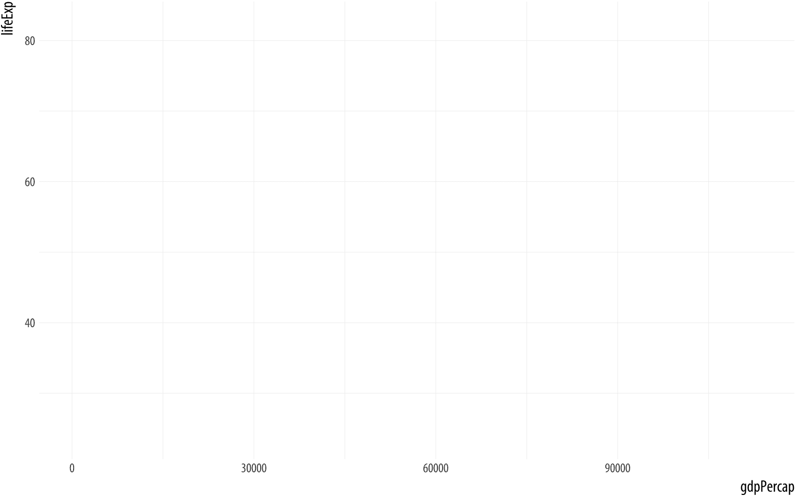 图 3.3：这是一个没有几何图形的空图表。

```r
p
```

`p` 对象是由 `ggplot()` 函数创建的，其中已经包含了关于我们想要的映射的信息，以及默认添加的大量其他信息。（如果你想看看 `p` 对象中已经有多少信息，可以尝试请求 `str(p)`。）然而，我们还没有给它任何关于绘制何种图表的指令。我们需要向图表添加一个**层**。这意味着选择一个 `geom_` 函数。我们将使用 `geom_point()`。它知道如何将 `x` 和 `y` 值绘制成散点图。

```r
p +  geom_point() 
```

图 3.4：寿命预期与 GDP 的散点图

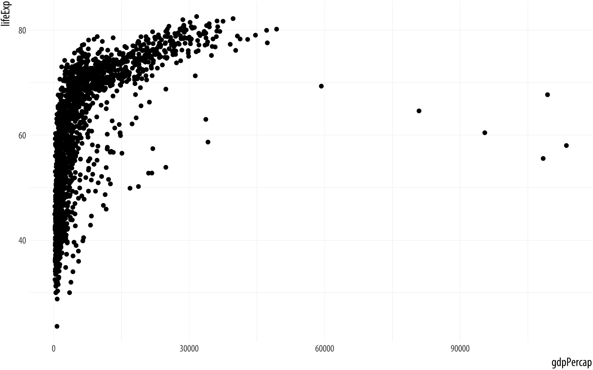

成功！

## 3.4 分层构建你的图表

虽然我们在第二章节末尾简要了解了 ggplot，但我们花了更多的时间在那个章节中为制作这个第一个合适的图表做准备。我们设置了我们的软件 IDE，并确保我们可以重现我们的工作。然后我们学习了 R 的基本工作原理，以及 ggplot 期望的整洁数据类型。刚才我们了解了 ggplot 主要思想的逻辑，即以系统且可预测的方式逐步构建图表，从变量与美学元素之间的映射开始。我们已经做了很多工作，并生成了一张图表。

好消息是，从现在开始，我们在概念上所做的事情不会有太大的变化。这更多是关于更详细地了解如何告诉 ggplot 做什么。我们将了解更多关于不同 geoms（或图表类型）的信息，并了解控制坐标系、刻度、引导元素（如标签和刻度线）以及图表主题功能的函数。这将使我们能够以惊人的速度制作更复杂的图表。然而，在概念上，我们始终在做同样的事情。我们将从一个整理过的数据表开始，然后我们将：

1.  告诉 `ggplot()` 函数我们的数据是什么。`data = …` 步骤。

1.  告诉 `ggplot()` 我们想要看到哪些关系。`mapping = aes(…)` 步骤。为了方便，我们将前两步的结果放入一个名为 `p` 的对象中。

1.  告诉 `ggplot` 我们想要如何看到数据中的关系。选择一个 geom。

1.  根据需要逐层添加 geoms，通过将它们逐个添加到 `p` 对象中。

1.  使用 `scale_`、`family`、`labs()` 和 `guides()` 函数以及一些额外的函数来调整刻度、标签、刻度线、标题。我们将在不久的将来了解更多关于这些函数的信息。

首先，我们将让 ggplot 使用其默认值来设置这些元素中的许多。在图表中使用的坐标系通常是笛卡尔坐标系，例如。这是一个由 x 轴和 y 轴定义的平面。这是 ggplot 的假设，除非你告诉它否则。但我们将很快开始做一些调整。请再次记住，向图表添加层的过程实际上是 *累加的*。实际上，我们创建了一个大对象，它是一个嵌套列表，包含了如何绘制图表每一部分的指令。通常在 R 中，函数不能简单地添加到对象中。相反，它们以对象作为输入，并产生对象作为输出。但 ggplot() 创建的对象是特殊的。这使得我们可以逐个组装图表，并在每一步检查它们的外观。例如，让我们尝试使用不同的 `geom_` 函数来修改我们的图表。

 图 3.5：寿命与 GDP 的对比，使用平滑器。

```r
p <-  ggplot(data = gapminder,
 mapping = aes(x = gdpPercap,
 y=lifeExp))
p +  geom_smooth()
```

你可以立即看出，一些 geoms 执行的操作远不止在网格上放置点。在这里，`geom_smooth()` 为我们计算了一条平滑线，并用阴影条带显示了线的标准误差。如果我们想同时看到数据点和线，我们只需再次添加 `geom_point()`：

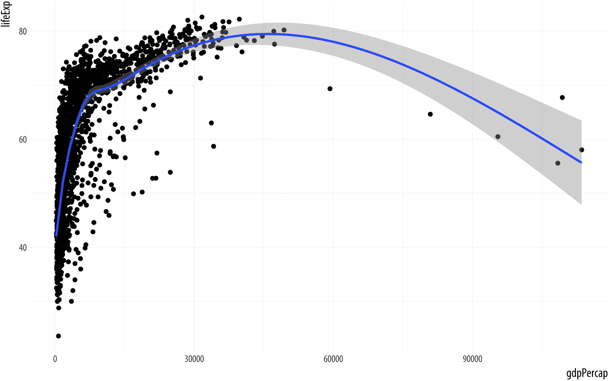 图 3.6：寿命与 GDP 的对比，显示点和 GAM 平滑器。

```r
p <-  ggplot(data = gapminder,
 mapping = aes(x = gdpPercap,
 y=lifeExp))
p +  geom_point() +  geom_smooth() 
```

```r
## `geom_smooth()` using method = 'gam' and formula 'y ~ s(x, bs = "cs")'
```

控制台信息 R 告诉你 `geom_smooth()` 函数正在使用一个名为 `gam` 的 `method`，在这种情况下意味着它已经拟合了一个广义加性模型。这表明可能还有其他 `geom_smooth()` 能够理解的方法，我们可以指示它使用这些方法。函数的指令是通过它们的参数给出的，因此我们可以尝试将 `method = "lm"`（代表“线性模型”）作为参数添加到 `geom_smooth()` 中：

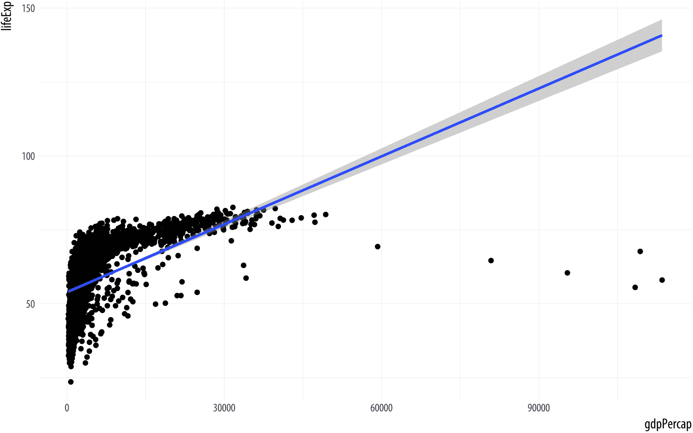 图 3.7：寿命与 GDP 的对比，点与不恰当的线性拟合。

```r
p <-  ggplot(data = gapminder,
 mapping = aes(x = gdpPercap,
 y=lifeExp))
p +  geom_point() +  geom_smooth(method = "lm") 
```

我们不必告诉 `geom_point()` 或 `geom_smooth()` 它们的数据来源，或它们应该使用哪些映射。它们*继承*了来自原始 `p` 对象的信息。正如我们稍后将会看到的，可以给 geoms 提供单独的指令，它们将遵循这些指令。但在没有其他信息的情况下，geoms 将在 `ggplot()` 函数或它创建的对象中寻找所需的指令。

在我们的图表中，数据在左侧非常密集。人均国内生产总值在我们的国家年份中不是正态分布的。如果 x 轴的刻度从线性刻度转换为对数刻度，可能会看起来更好。为此，我们可以使用一个名为 `scale_x_log10()` 的函数。正如你所期望的，这个函数将图表的 x 轴缩放到以 10 为底的对数基础上。要使用它，我们只需将其添加到图表中：

 图 3.8：寿命与 GDP 散点图，带有 GAM 平滑器和 x 轴上的对数刻度。

```r
p <-  ggplot(data = gapminder,
 mapping = aes(x = gdpPercap,
 y=lifeExp))
p +  geom_point() +
 geom_smooth(method = "gam") +
 scale_x_log10()
```

x 轴的转换重新定位了点，同时也改变了平滑线的形状。（我们已从 `lm` 切换回 `gam`。）虽然 `ggplot()` 及其相关函数没有对我们的基础数据框做出任何更改，但缩放转换是在平滑层添加到图表之前应用于数据的。你可以使用各种缩放转换，每种转换都是以你想要应用转换的名称命名的，以及你想要应用转换的轴。在这种情况下，我们使用 `scale_x_log10()`。

在这一点上，如果我们的目标只是使用合理的尺度绘制预期寿命与 GDP 的图表，并添加一个平滑器，我们可能会考虑通过更漂亮的轴标签和标题来润色这个图表。也许我们还想将 x 轴上的科学记数法替换为它实际代表的美元价值。我们可以非常容易地完成这两件事。首先，让我们处理一下尺度。刻度线上的标签可以通过`scale_`函数来控制。虽然你可以自己编写一个函数来标记轴（或者像我们稍后将要看到的那样，手动提供标签），但还有一个方便的`scales`库，其中包含一些有用的预定义格式化函数。我们可以通过`library(scales)`加载整个库，或者更方便地，直接从库中获取我们想要的特定格式化器。这里是我们需要的`dollar()`函数。要从尚未加载的库中直接获取一个函数，我们使用语法`thelibrary::thefunction`。因此，我们可以这样做：

 图 3.9：预期寿命与 GDP 散点图，带有 GAM 平滑器和 x 轴上的对数尺度，以及更好的刻度线标签。

```r
p <-  ggplot(data = gapminder, mapping = aes(x = gdpPercap, y=lifeExp))
p +  geom_point() +
 geom_smooth(method = "gam") +
 scale_x_log10(labels = scales::dollar)
```

我们将在稍后学习更多关于尺度变换的内容。现在，只需记住关于它们的两点。首先，你可以通过添加类似`scale_x_log10()`或`scale_y_log10()`的东西直接转换你的 x 或 y 轴。当你这样做的时候，x 或 y 轴将被转换，并且默认情况下，轴上的刻度线将使用科学记数法进行标记。其次，你可以给这些`scale_`函数一个`labels`参数，该参数会重新格式化轴下方的刻度线上的文本。例如，在`scale_x_log10()`函数中尝试`labels=scales::comma`。

## 3.5 映射美学与设置它们

一种*美学映射*指定了一个变量将通过可用的视觉元素之一来表示，例如大小、颜色、形状等。正如我们所看到的，我们将变量映射到美学上，如下所示：

```r
p <-  ggplot(data = gapminder,
 mapping = aes(x = gdpPercap,
 y = lifeExp,
 color = continent))
```

这段代码并没有给出像“将点染成紫色”这样的直接指令。相反，它说，“属性‘颜色’将代表变量`continent`”，或者“颜色将映射`continent`”。如果我们想将图中的所有点都染成紫色，我们不是通过映射函数来做的。看看当我们尝试这样做时会发生什么：

```r
p <-  ggplot(data = gapminder,
 mapping = aes(x = gdpPercap,
 y = lifeExp,
 color = "purple"))
p +  geom_point() +
 geom_smooth(method = "loess") +
 scale_x_log10()
```

图 3.10：这里出了什么问题？

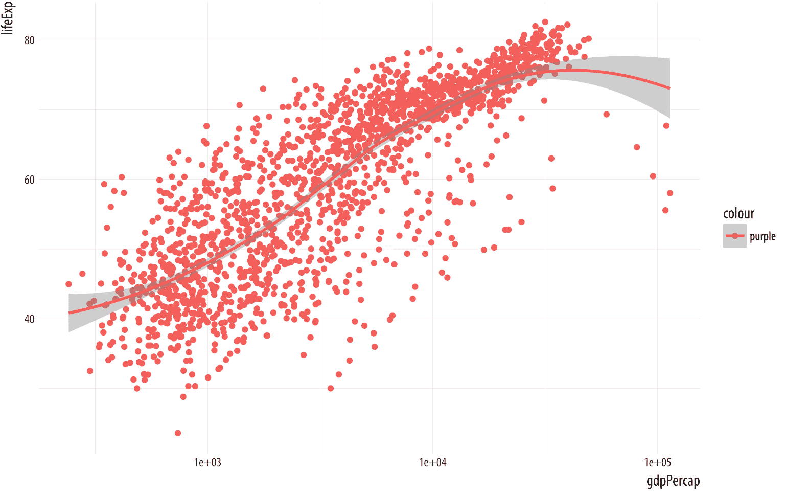

这里发生了什么？为什么有一个传说说是“紫色”？而且为什么点都变成了粉红色而不是紫色？记住，美学是将你的数据中的变量映射到你在图上可以看到的属性。`aes()`函数就是在这里指定映射的地方，这个函数正在尽力完成它的任务。它想要将一个变量映射到颜色美学，所以它假设你给它的是一个变量。就像第一章中我们能够写‘`my_numbers + 1`’来给向量的每个元素加一一样。尽管如此，我们只给了它一个单词——“紫色”。然而，`aes()`仍然会尽力将这个单词当作一个变量来处理。一个变量应该有与数据行数一样多的观测值，所以`aes()`会回退到 R 的回收规则，以便使不同长度的向量匹配。

实际上，这为你的数据创建了一个新的分类变量。字符串“紫色”被循环用于你的数据中的每一行。现在你有一个新列。它里面的每个元素都有相同的值，“紫色”。然后 ggplot 按照你要求的方式在图上绘制结果，通过将其映射到`color`美学。它尽职尽责地为这个新变量制作了一个图例。默认情况下，ggplot 使用其默认的第一类别色调显示属于“紫色”类别（即所有点）的点……这个色调是红色。

`aes()`函数仅用于映射。不要用它来将属性设置为特定值。如果我们想要*设置*一个属性，我们就在我们使用的`geom_`中做，并且在`mapping = aes(...)`步骤*之外*做。试试这个：

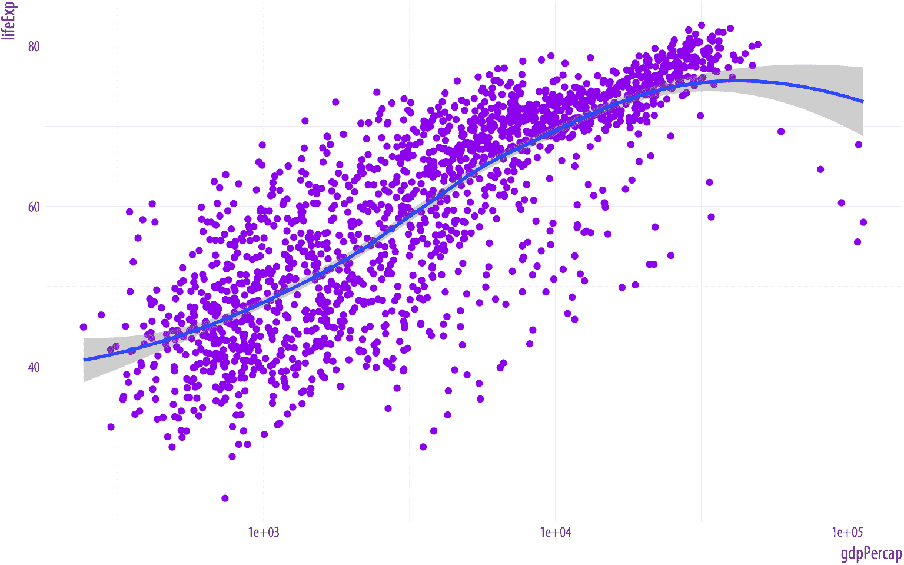 图 3.11：直接设置点的颜色属性。

```r
p <-  ggplot(data = gapminder,
 mapping = aes(x = gdpPercap,
 y = lifeExp))
p +  geom_point(color = "purple") +
 geom_smooth(method = "loess") +
 scale_x_log10()
```

`geom_point()`函数可以直接接受`color`参数，R 知道“紫色”是什么颜色。这并不是定义图形基本结构的审美映射的一部分。从图形的语法或逻辑角度来看，点被涂成紫色的事实没有任何意义。紫色并没有以相关的方式代表或映射数据中的变量或特征。

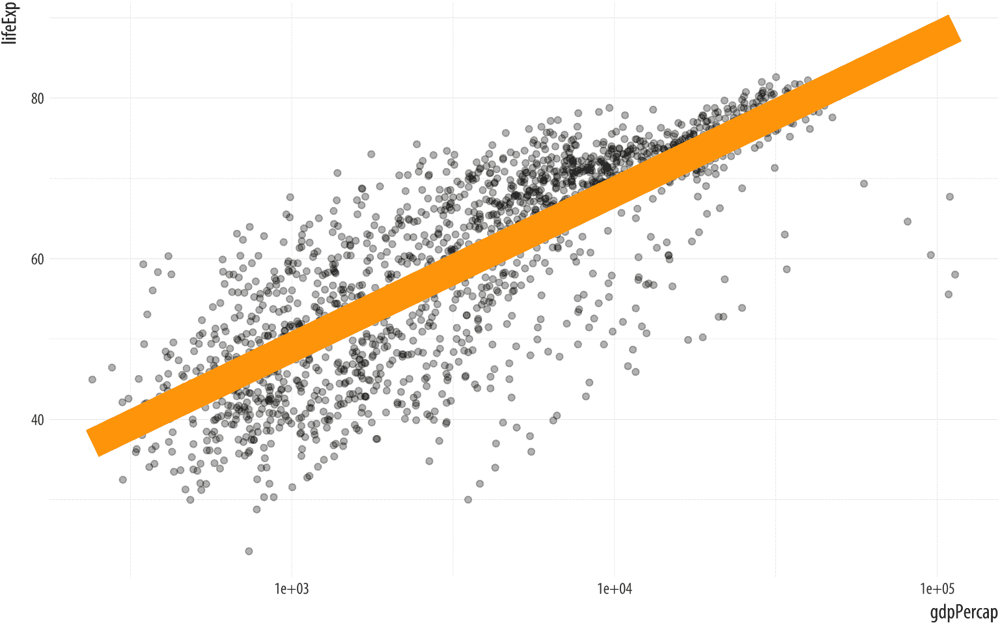 图 3.12：设置一些其他参数。

```r
p <-  ggplot(data = gapminder,
 mapping = aes(x = gdpPercap,
 y = lifeExp)) 
p +  geom_point(alpha = 0.3) +
 geom_smooth(color = "orange", se = FALSE, size = 8, method = "lm") +
 scale_x_log10()
```

各种`geom_`函数可以接受许多其他会影响图表外观的参数，但不涉及将变量映射到美学元素。因此，这些参数永远不会放入`aes()`函数中。我们想要设置的一些事情，如颜色或大小，与可映射元素具有相同的名称。其他，如`geom_smooth()`中的`method`或`se`参数，影响图表的其他方面。在图 3.12 的代码中，`geom_smooth()`调用将线条颜色设置为橙色，并将其大小（即厚度）设置为 8，这是一个不合理的较大值。我们还通过将其从默认值`TRUE`切换到`FALSE`来关闭`se`选项。结果是标准误差带不会显示。

同时，也可以直接将连续变量映射到`alpha`属性，就像人们可能会将连续变量映射到单色渐变一样。然而，这通常不是精确传达数量变化的有效方式。在`geom_smooth()`调用中，我们将`alpha`参数设置为 0.3。和颜色、大小和形状一样，`alpha`是点（以及一些其他图表元素）具有的美学属性，并且可以将变量映射到它。它控制着绘制对象时的透明度。它是在零到一的比例上测量的。alpha 值为零的对象将完全透明。将其设置为零将使对象可能具有的其他映射（如颜色或大小）也变得不可见。alpha 值为一的对象将完全不透明。当有大量重叠数据需要绘制时，选择中间值可能很有用，因为它使得观察到的主体位置更容易看到。

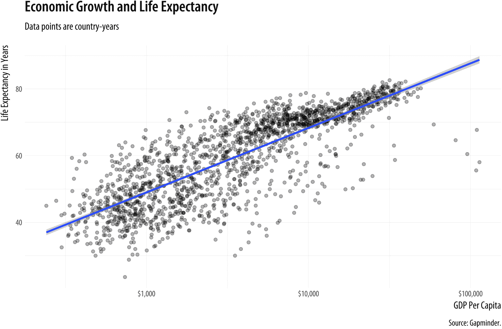

图 3.13：寿命与 GDP 对比的更加精致的图表。

```r
p <-  ggplot(data = gapminder, mapping = aes(x = gdpPercap, y=lifeExp))
p +  geom_point(alpha = 0.3) +
 geom_smooth(method = "gam") +
 scale_x_log10(labels = scales::dollar) +
 labs(x = "GDP Per Capita", y = "Life Expectancy in Years",
 title = "Economic Growth and Life Expectancy",
 subtitle = "Data points are country-years",
 caption = "Source: Gapminder.")
```

我们现在可以制作一个相当精致的图表。我们将点的`alpha`值设置为低值，使 x 轴和 y 轴的标签更加美观，并添加了标题、副标题和图注。如上代码所示，除了`x`、`y`以及你图表中可能的其他美学映射（如`size`、`fill`或`color`）之外，`labs()`函数还可以设置`title`、`subtitle`和`caption`的文本。它控制着刻度的主要标签。诸如轴刻度标记等事物的外观是各种`scale_`函数的责任，例如这里使用的`scale_x_log10()`函数。我们很快就会了解到`scale_`函数可以做什么。

在我们的数据中，是否有任何变量可以合理地映射到`颜色`美学？考虑`大陆`。在图 3.14 中，各个数据点已经根据`大陆`进行了着色，并且自动添加了一个带有颜色键的图例。此外，现在我们不再只有一条平滑线，而是有五条。每一条对应于`大陆`变量的唯一值。这是美学映射继承方式的结果。除了`x`和`y`之外，`颜色`美学映射是在调用`ggplot()`时设置的，我们用它来创建`p`对象。除非另有说明，否则所有叠加在原始绘图对象上的几何对象都将继承该对象的映射。在这种情况下，我们得到了既有点又有根据大陆着色的平滑线。

```r
p <-  ggplot(data = gapminder,
 mapping = aes(x = gdpPercap,
 y = lifeExp,
 color = continent))
p +  geom_point() +
 geom_smooth(method = "loess") +
 scale_x_log10()
```

 图 3.14：将大陆变量映射到颜色美学。

如果这正是我们想要的，那么我们还可以考虑将每条线的标准误差带阴影，以匹配其主导颜色。标准误差带的颜色由`fill`美学控制。而`color`美学影响线条和点的外观，`fill`用于条形、多边形以及在这种情况下平滑线标准误差带的内部填充区域。

```r
p <-  ggplot(data = gapminder,
 mapping = aes(x = gdpPercap,
 y = lifeExp,
 color = continent,
 fill = continent))
p +  geom_point() +
 geom_smooth(method = "loess") +
 scale_x_log10()
```

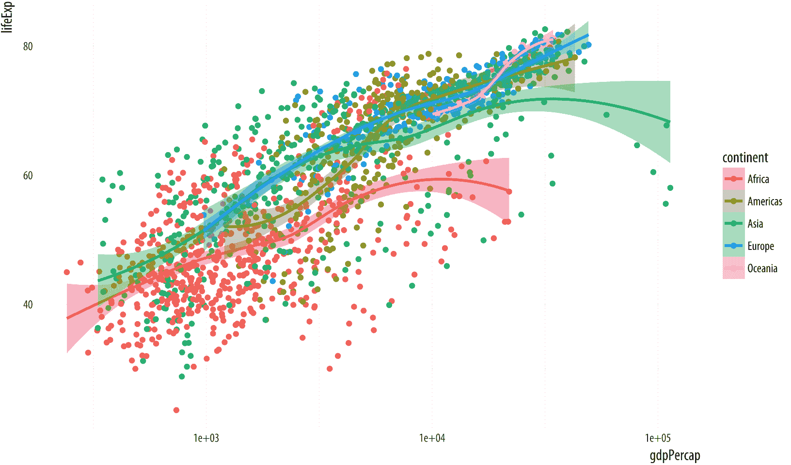 图 3.15：将大陆变量映射到颜色美学，并使用填充美学更正误差条。

确保颜色和填充美学以这种方式一致匹配，可以改善整个图表的外观。为了实现这一点，我们只需要指定每种情况下的映射都指向相同的变量。

## 3.6 每个几何对象可以映射美学

也许五个单独的平滑线太多了，我们只想有一条线。但我们仍然希望点根据大陆进行着色。默认情况下，几何对象从`ggplot()`函数继承它们的映射。我们可以通过只映射我们想要应用于特定`geom_`函数的美学来改变这一点。我们使用与初始`ggplot()`调用相同的`mapping = aes(...)`表达式，但现在在`geom_`函数中也使用它，只指定我们想要应用于每个对象的映射。仅在初始`ggplot()`函数中指定的映射——这里，`x`和`y`——将传递到所有后续的几何对象中。

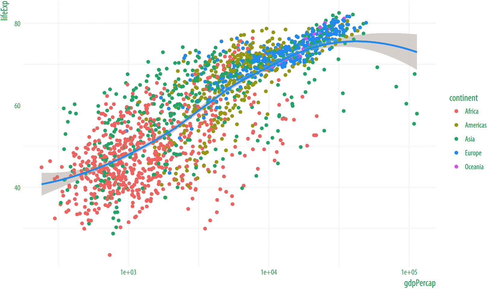 图 3.16：基于每个几何对象映射美学。这里颜色映射到大陆用于点，但不用于平滑线。

```r
p <-  ggplot(data = gapminder, mapping = aes(x = gdpPercap, y = lifeExp))
p +  geom_point(mapping = aes(color = continent)) +
 geom_smooth(method = "loess") +
 scale_x_log10()
```

将连续变量映射到`颜色`美学也是可能的。例如，我们可以将每个国家-年份的人口（`pop`）的对数映射到`颜色`。（我们可以在`aes()`语句中直接对人口取对数，使用`log()`函数。R 会非常乐意为我们评估这个值。）当我们这样做时，ggplot 会产生一个渐变刻度。它是连续的，但在图例中以间隔标记。根据具体情况，将人口等数量映射到连续的颜色渐变可能比将其切割成从低到高的分类变量更有效或更无效。一般来说，总是值得首先查看数据的连续形式，而不是将其切割或分箱到类别中。

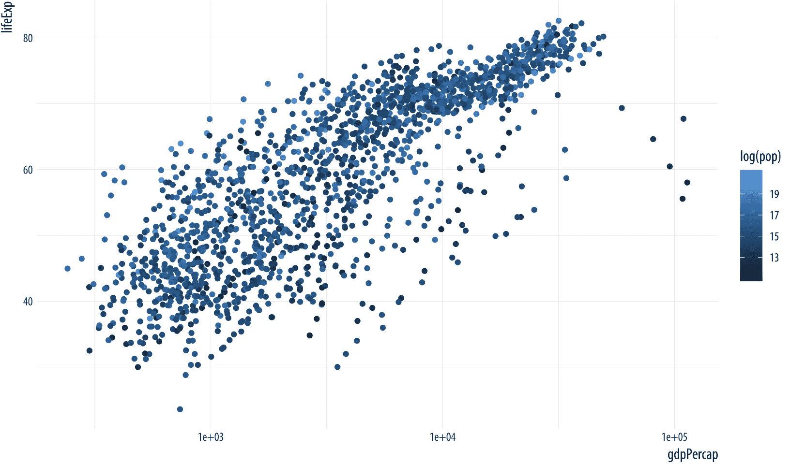 图 3.17：将连续变量映射到颜色。

```r
p <-  ggplot(data = gapminder,
 mapping = aes(x = gdpPercap,
 y = lifeExp))
p +  geom_point(mapping = aes(color = log(pop))) +
 scale_x_log10() 
```

最后，值得稍微更多关注 ggplot 绘制刻度的方法。因为每个映射的变量都有一个刻度，通过观察图例的样式，我们可以了解很多关于图表是如何构建的，以及它包含哪些映射的信息。例如，仔细观察图 3.15[makeplot.html#fig:ch-03-fig-lexp-gdp-12]和图 3.16[makeplot.html#fig:ch-03-fig-lexp-gdp-13]生成的图例。

图 3.18：指南和图例忠实反映它们所代表的映射。


在第一个图形的图例中，如图左所示，我们可以看到几个视觉元素。每个大陆的关键显示一个点、一条线和阴影背景。第二个图形的图例，如图右所示，每个大陆只有一个点，没有阴影背景或线条。如果您再次查看图形 3.15 和 3.16 的代码，您将看到在第一种情况下，我们将`continent`变量映射到`color`和`fill`。然后我们使用`geom_point()`绘制图形，并使用`geom_smooth()`为每个大陆拟合一条线。点有`color`，但平滑器理解`color`（用于线条本身）和`fill`（用于阴影标准误差带）。这些元素都在图例中有所表示：点的颜色、线的颜色和带子的填充。在第二个图形中，我们决定通过仅让点根据`continent`着色来简化事情。然后我们只为整个图形绘制了一个单一的平滑器。因此，在该图形的图例中，彩色线条和阴影框都消失了。我们只看到了`geom_point()`中`color`到`continent`映射的图例。同时，在图形本身中，`geom_smooth()`绘制的线条默认设置为明亮的蓝色，与刻度上的任何东西都不同，其阴影误差带默认设置为灰色。这样的小细节并非偶然。这是 ggplot 直接从数据背后的关系和表示它的视觉元素之间的语法方式思考的直接后果。

## 3.7 保存您的作品

现在您已经开始制作自己的图形，您可能想知道如何保存它们，也许还想知道如何控制它们的大小和格式。如果您在 RMarkdown 文档中工作，那么您制作的图形将嵌入其中，正如我们之前看到的。您可以通过设置第一个代码块中的选项来设置`.Rmd`文档中图形的默认大小。这个选项告诉 R 制作 8x5 的图形：

```r
knitr::opts_chunk$set(fig.width=8, fig.height=5) 
```

由于您将制作不同大小和形状的图形，有时您可能想要控制特定图形的大小，而不改变默认设置。为此，您可以在开头花括号内添加相同的选项到任何特定的块中。记住，每个块以三个反引号开头，然后是一对花括号，包含语言名称（对我们来说总是`r`）和一个可选的标签：

```r
```{r example}

p + geom_point()

```r
```

您可以在标签后跟一个逗号，并在需要时提供一系列选项。它们将仅适用于该块。例如，要制作一个 12 英寸宽、9 英寸高的图形，我们在花括号部分说 `{r example, fig.width = 12, fig.height = 9}`。

你通常会需要单独保存你的图表，因为它们最终会被放入幻灯片或发表在未使用 RMarkdown 生成的论文中。将图表保存到文件中可以通过几种不同的方式完成。当使用`ggplot`时，最简单的方法是使用`ggsave()`函数。为了保存最近显示的图表，我们提供我们想要保存的名称：

```r
ggsave(filename = "my_figure.png")
```

这将把图表保存为 PNG 文件，这是一种适合在网页上显示的格式。如果你想要 PDF 格式，请更改文件的扩展名：

```r
ggsave(filename = "my_figure.pdf")
```

记住，为了方便，只要文件的名称是你提供给`ggsave()`的第一个参数，你就不需要写`filename =`。你还可以将绘图对象传递给`ggsave()`。例如，我们可以将我们的最新绘图放入一个名为`p_out`的对象中，然后告诉`ggave()`我们想要保存该对象。

```r
p_out <-  p +  geom_point() +
 geom_smooth(method = "loess") +
 scale_x_log10()

ggsave("my_figure.pdf", plot = p_out)
```

当保存你的工作的时候，有一个只保存图表的子文件夹（或者根据项目需要，可以有一个以上的子文件夹）是明智的。你还应该注意以合理的方式命名你保存的图表。`fig_1.pdf`或`my_figure.pdf`都不是好的名字。图表的名称应该是紧凑且描述性的，并且在项目内的图表之间保持一致。此外，尽管在当今时代这真的不应该发生，但为了避免文件名包含未来可能导致你的代码出错的字符，采取安全措施也是明智的。这些包括撇号、反引号、空格、前后斜杠和引号。

附录中简要讨论了如何在项目文件夹内组织你的文件。将项目文件夹视为你撰写论文或进行工作的基地，并将你的数据和图表放在项目文件夹内的子文件夹中。首先，使用你的文件管理器，在项目文件夹内创建一个名为“figures”的文件夹。当保存图表时，你可以使用 Kirill Müller 的便捷的`here`库来使处理文件和子文件夹变得更加容易，而无需输入完整的文件路径。在 RMarkdown 文档的设置块中加载该库。当你这样做时，它会告诉你当前项目中的`here`在哪里。你会看到一个类似的消息，用你的文件路径和用户名代替我的：

```r
# here() starts at /Users/kjhealy/projects/socviz
```

然后，你可以使用`here()`函数使加载和保存你的工作更加直接和安全。假设在你的项目文件夹中存在一个名为“figures”的文件夹，你可以这样做：

```r
ggsave(here("figures", "lifexp_vs_gdp_gradient.pdf"), plot = p_out)
```

这将在`figures`目录*此处*保存`p_out`为名为`lifeexp_vs_gdp_gradient.pdf`的文件，即在你的当前项目文件夹中。

根据你的需求（以及在一定程度上，你的特定计算机系统），你可以以多种不同的格式保存你的图形。需要记住的最重要区别是 *矢量* 格式和 *栅格* 格式。具有 *矢量* 格式的文件，如 PDF 或 SVG，存储为关于线条、形状、颜色及其关系的指令集。然后查看软件（如 Adobe Acrobat 或苹果的预览应用用于 PDF）解释这些指令并显示图形。以这种方式表示图形允许它轻松地调整大小而不会变形。PDF 格式的底层语言是 Postscript，这也是现代排版和印刷的语言。这使得基于矢量的格式如 PDF 成为提交给期刊的最佳选择。

相反，基于 *栅格* 的格式将图像基本上存储为具有预定义大小的像素网格，以及关于网格中每个像素的位置、颜色、亮度等信息。这使得存储更加高效，尤其是在与利用图像冗余来节省空间的压缩方法结合使用时。像 JPG 这样的格式是压缩的栅格格式。PNG 文件是一种支持无损压缩的栅格图像格式。对于包含大量数据的图形，PNG 文件通常比相应的 PDF 文件小得多。然而，栅格格式不能轻易调整大小。特别是，它们不能在不像素化或出现颗粒感的情况下扩大尺寸。像 JPG 和 PNG 这样的格式是图像在网络上显示的标准方式。较新的 SVG 格式是基于矢量的格式，但仍然被许多网络浏览器支持。

通常，你应该以几种不同的格式保存你的工作。当你以不同的格式和大小保存时，你可能需要尝试调整图形的缩放和字体的大小，以获得良好的结果。`ggsave()` 函数的 `scale` 参数可以在这里帮助你（你可以尝试不同的值，如 `scale=1.3`、`scale=5` 等）。你也可以使用 `ggave()` 显式设置你的图形的高度和宽度，使用你选择的单位。

```r
ggsave(here("figures", "lifexp_vs_gdp_gradient.pdf"),
 plot = p_out, height = 8, width = 10, units = "in")
```

现在你已经知道如何做到这一点，让我们回到制作更多图形。

## 3.8 接下来去哪里

首先，尝试对 `gapminder` 数据进行更多探索。你可以尝试使用 `geom_point()` 和 `geom_smooth()` 进行每个探索，或者两者一起使用。

+   当你在 `geom_point()` 之前而不是之后放置 `geom_smooth()` 函数时会发生什么？这会告诉你关于绘图方式的哪些信息？考虑一下这可能在绘制图形时如何有用。

+   在 `aes()` 函数中更改映射，以便你绘制预期寿命与人口（`pop`）之间的关系，而不是人均 GDP。这看起来会是什么样子？这会告诉你关于数据集中观测单位的哪些信息？

+   尝试一些不同的尺度映射。除了`scale_x_log10()`之外，你还可以尝试`scale_x_sqrt()`和`scale_x_reverse()`。对于 y 轴变换也有相应的函数。只需将`y`而不是`x`写入即可。实验它们以查看它们对图表有什么样的影响，以及它们是否值得使用。

+   如果你将`颜色`映射到`年份`而不是`大陆`，会发生什么？结果是你预期的吗？思考一下`年份`是哪种类型的对象。记住，你可以通过输入`gapminder`来快速查看数据的顶部，这包括一些关于每个变量类别的简短信息。

+   如果你尝试`color = factor(year)`而不是`color = year`，会发生什么？

+   当你查看这些不同的散点图时，更批判性地思考一下图 3.13。我们把它做到相当精致的程度，但这是否真的是展示这种国家-年份数据的最佳方式？通过忽略数据的时序和国家层面结构，我们得到了什么，失去了什么？我们如何做得更好？勾勒出一种可能的替代可视化可能的样子。

当你开始尝试时，请记住两件事。首先，尝试任何事情总是值得的，即使你不确定会发生什么。不要害怕控制台。这个许可证不适用于，例如，错误地覆盖或删除你的数据。你仍然应该负责任地管理你的项目，至少要保留良好的备份。但在 R 中，在控制台进行图形实验的层面上，你有很多自由。通过代码制作图形的好处是，你不会破坏你无法重现的东西。如果某件事不起作用，你可以找出发生了什么，修复问题，然后重新运行代码来再次生成图形。

其次，记住 ggplot 的主要操作流程始终如一。你从一个数据表开始，将你想要显示的变量映射到美学属性，如位置、颜色或形状，并选择一个或多个几何对象来绘制图形。在你的代码中，这是通过创建一个包含基本数据信息和映射信息的对象来实现的，然后根据需要添加或叠加额外的信息。一旦你习惯了这种思考图表的方式，特别是美学映射部分，绘制它们就会变得更容易。你不需要考虑如何在屏幕上绘制特定的形状或颜色，许多`geom_`函数会为你处理这些。同样，一旦你将它们视为显示你指定的美学映射的方式，学习新的几何对象也会变得更容易。ggplot 的大部分学习曲线都涉及习惯以这种方式思考你的数据和它在图表中的表示。在下一章中，我们将更详细地阐述这些观点，讨论一些常见的绘图错误（即它们最终看起来很奇怪的情况），并学习如何识别和避免这些问题。

## 3.1 ggplot 的工作原理

正如我们在第一章中看到的，可视化涉及使用线条、形状或颜色等来表示你的数据。数据中的变量与它们在屏幕上或页面显示的图表中的表示之间存在某种结构化的关系，某种*映射*。我们还看到，并非所有映射都适用于所有类型的变量，而且（独立于此），一些表示比其他表示更难解释。ggplot 为你提供了一套工具，可以将数据映射到图表上的视觉元素，指定你想要的图表类型，然后随后控制其显示的详细细节。图 3.1 展示了从顶部开始的数据到下面完成的图表的过程的示意图。现在不必担心细节。在接下来的几章中，我们将逐个部分地深入研究它们。

 图 3.1：ggplot 图形语法的主要元素。本章将详细讲解这些步骤。

使用 ggplot 最重要的习惯是学会如何用它来思考你图表的逻辑结构。你编写的代码指定了数据中变量之间的联系，以及你在屏幕上看到的颜色、点和形状。在 ggplot 中，这些数据与图表元素之间的逻辑联系被称为*美学映射*或简称*美学*。你开始每一个图表时，先告诉`ggplot()`函数你的数据是什么，然后这些数据中的变量如何逻辑地映射到图表的美学上。然后你将结果告诉你想得到什么类型的图表，比如散点图、箱线图或柱状图。在 ggplot 中，整体图表类型被称为*geom*。每个 geom 都有一个创建它的函数。例如，`geom_point()`创建散点图，`geom_bar()`创建柱状图，`geom_boxplot()`创建箱线图，等等。你通过在表达式中实际地将它们相加，使用“`+`”符号，将这两个部分，即`ggplot()`对象和`geom`结合起来。

到目前为止，ggplot 将拥有足够的信息来为你绘制一个图表。其余的只是关于你确切想看到的具体细节。如果你没有进一步指定，ggplot 将使用一组默认设置，试图在绘制时尽可能合理。但更常见的情况是，你将想要精确指定你想要的内容，包括关于刻度、图例和坐标轴标签以及其他帮助人们阅读图表的指南的信息。这些额外的部分是以与`geom_`函数相同的方式添加到图表中的。每个组件都有自己的函数，你提供给它参数来指定要做什么，然后你实际上将其添加到指令序列中。通过这种方式，你可以系统地一块一块地构建你的图表。

在本章中，我们将通过实例来介绍这个过程的主要步骤。我们将通过构建一系列图表来逐步进行。如前所述，我强烈建议你手动完成这个练习，亲自输入（而不是复制粘贴）代码。这可能会显得有些繁琐，但这是迄今为止最有效的方法，可以让你习惯正在发生的事情，并感受到 R 语法的感觉。虽然你不可避免地会犯一些错误，但你也会很快发现自己能够诊断自己的错误，并且对图表的高级结构有更好的把握。你应该打开你的笔记的 RMarkdown 文件，记得加载 tidyverse 库`library(tidyverse)`，并以块的形式编写代码，在编写过程中穿插自己的笔记和注释。

表 3.1：宽格式的生活预期数据。

| 国家 | 1952 | 1957 | 1962 | 1967 | 1972 | 1977 | 1982 | 1987 | 1992 | 1997 | 2002 | 2007 |
| :-- | --: | --: | --: | --: | --: | --: | --: | --: | --: | --: | --: | --: |
| 阿富汗 | 29 | 30 | 32 | 34 | 36 | 38 | 40 | 41 | 42 | 42 | 42 | 44 |
| 阿尔巴尼亚 | 55 | 59 | 65 | 66 | 68 | 69 | 70 | 72 | 72 | 73 | 76 | 76 |
| 阿尔及利亚 | 43 | 46 | 48 | 51 | 55 | 58 | 61 | 66 | 68 | 69 | 71 | 72 |
| 安哥拉 | 30 | 32 | 34 | 36 | 38 | 39 | 40 | 40 | 41 | 41 | 41 | 43 |
| 阿根廷 | 62 | 64 | 65 | 66 | 67 | 68 | 70 | 71 | 72 | 73 | 74 | 75 |
| 澳大利亚 | 69 | 70 | 71 | 71 | 72 | 73 | 75 | 76 | 78 | 79 | 80 | 81 |

## 3.2 整洁数据

我们将要使用的 tidyverse 工具希望看到你的数据以特定的形状，通常被称为“整洁数据”（Wickham，2014）。社会科学家可能会熟悉宽格式数据与长格式数据之间的区别。在长格式表格中，每个变量都是一个列，每个观测值都是一个行。在宽格式表格中，一些变量散布在列中。例如，表 3.1 展示了一系列国家随时间推移的生活预期表的一部分。这是宽格式，因为其中一个变量，即年份，散布在表格的列中。

与此相反，表 3.2 展示了相同数据的开始部分，以长格式呈现。ggplot 所需的整洁数据就是这种长格式。在相关的术语中，在这个表中，`year` 变量有时被称为 *键*，而 `lifeExp` 变量是该键对于任何特定行的 *值*。这些术语在将表格从宽格式转换为长格式时很有用。我在这里说得相当宽松。在这些术语之下，有一个关于表格数据可以存储的形式的详细理论，但现阶段我们不需要知道这些额外的细节。有关整洁数据背后的理念的更多信息，请参阅附录中的讨论。你还将找到一个示例，展示你需要从杂乱无章的形状转换为整洁形状的 R 代码，对于常见的“宽”情况，其中一些变量散布在表格的列中。

表 3.2：长格式寿命预期数据。

| 国家 | 年份 | 寿命预期 |
| :-- | --: | --: |
| 阿富汗 | 1952 | 29 |
| 阿富汗 | 1957 | 30 |
| 阿富汗 | 1962 | 32 |
| 阿富汗 | 1967 | 34 |
| 阿富汗 | 1972 | 36 |
| 阿富汗 | 1977 | 38 |

如果你比较表 3.1 和 3.2，很明显，整洁的表格并没有以最紧凑的形式呈现数据。事实上，如果你只想向人们展示数字，这通常不是你选择展示数据的方式。同样，杂乱无章的数据也不一定是“杂乱”或以某种通用意义上“错误”的方式布局数据。只是，即使其长格式形状使表格更大，整洁数据在指定你需要用来连贯描述图表的映射时，要简单得多。

## 3.3 映射将数据链接到你所看到的事物

每次我们想要制作一个图表时，思考一个食谱或模板是非常有用的。这如图 3.2 所示。我们从自己的一个对象开始，即我们的数据，这些数据应该以 ggplot 能够理解的形式存在。通常这将是 *data frame* 或其增强版本，如 *tibble*。我们告诉核心 `ggplot` 函数我们的数据是什么。在这本书中，我们将通过创建一个名为 `p` 的对象来完成这项工作，该对象将包含我们图表的核心信息。（名称 `p` 只是一个便利的名称。）然后我们选择一个图表类型，或 *geom*，并将其添加到 `p` 中。从那里，根据需要添加更多功能到图表中，例如额外的元素、调整的刻度、标题或其他所需的标签。

 图 3.2：制作图表的示意图。

我们将使用 gapminder 数据来制作我们的第一个图表。确保包含数据的库已加载。如果你是在同一 RStudio 会话或 RMarkdown 文档中跟随上一章，你就不需要再次加载它。否则，使用 `library()` 使其可用。

```r
library(gapminder)
```

我们可以通过在控制台中键入对象的名称来再次提醒自己它的样子：

```r
gapminder
```

```r
## # A tibble: 1,704 x 6
##    country     continent  year lifeExp      pop gdpPercap
##    <fct>       <fct>     <int>   <dbl>    <int>     <dbl>
##  1 Afghanistan Asia       1952    28.8  8425333       779
##  2 Afghanistan Asia       1957    30.3  9240934       821
##  3 Afghanistan Asia       1962    32.0 10267083       853
##  4 Afghanistan Asia       1967    34.0 11537966       836
##  5 Afghanistan Asia       1972    36.1 13079460       740
##  6 Afghanistan Asia       1977    38.4 14880372       786
##  7 Afghanistan Asia       1982    39.9 12881816       978
##  8 Afghanistan Asia       1987    40.8 13867957       852
##  9 Afghanistan Asia       1992    41.7 16317921       649
## 10 Afghanistan Asia       1997    41.8 22227415       635
## # ... with 1,694 more rows
```

假设我们想要绘制所有国家-年份的数据中寿命预期与人均 GDP 的关系图。我们将通过创建一个包含一些必要信息的对象来完成这项工作，并从那里构建它。首先，我们必须告诉 `ggplot()` 函数我们使用的数据。记住，在 MacOS 上使用 `Option+minus` 或在 Windows 上使用 `Alt+minus` 来输入赋值运算符。

```r
p <-  ggplot(data = gapminder)
```

到目前为止，ggplot 知道我们的数据，但不知道*映射*。也就是说，您不需要明确命名传递给函数的参数，只要您按照预期的顺序提供它们，即函数帮助页面上的顺序。如果我们省略`data = `和`mapping =`，此代码仍然可以工作。在这本书中，我命名所有参数以增加清晰度。我们需要告诉它数据中的哪些变量应该由图表中的哪些视觉元素表示。它也不知道我们想要什么类型的图表。在 ggplot 中，映射是通过`aes()`函数指定的。就像这样：

```r
p <-  ggplot(data = gapminder,
 mapping = aes(x = gdpPercap,
 y = lifeExp))
```

在这里，我们给`ggplot()`函数提供了两个参数而不是一个：`data`和`mapping`。`data`参数告诉 ggplot 在哪里找到它将要使用的变量。这使我们免去了繁琐地挖掘每个变量完整名称的麻烦。相反，任何变量的提及都将首先在这里查找。

接下来是映射。`mapping`参数不是一个数据对象，也不是一个字符字符串。相反，它是一个函数。（记住，函数可以嵌套在其他函数内部。）我们提供给`aes`函数的参数是一系列定义，ggplot 稍后会使用这些定义。这里它们说，“x 轴上的变量将是`gdpPercap`，y 轴上的变量将是`lifeExp`。”`aes()`函数并没有说明具有这些名称的变量在哪里可以找到。这是因为`ggplot()`将假设具有该名称的事物在提供给`data`参数的对象中。

`mapping = aes(...)`参数将*变量*与*图表上的元素*相连接。`x`和`y`值是最明显的。其他美学映射可以包括，例如，颜色、形状、大小和线型（线条是实线、虚线还是其他图案）。我们将在下一分钟看到示例。映射不会直接说明图表上特定的颜色或形状，而是说明数据中的哪些*变量*将被*视觉元素*（如颜色、形状或图表区域上的点）所表示。

如果我们现在在控制台输入`p`并按回车键会发生什么？

 图 3.3：这个空图表没有任何几何形状。

```r
p
```

`p`对象是由`ggplot()`函数创建的，并且已经包含了我们想要映射的信息，以及默认添加的很多其他信息。（如果你想看看`p`对象中已经包含了多少信息，可以尝试调用`str(p)`。）然而，我们还没有给它任何关于绘制何种图表的指令。我们需要向图表添加一个*层*。这意味着选择一个`geom_`函数。我们将使用`geom_point()`。它知道如何根据`x`和`y`值在散点图中进行绘图。

```r
p +  geom_point() 
```

图 3.4：预期寿命与 GDP 的散点图


成功！

## 3.4 逐层构建你的图表

尽管我们在第二章的结尾对 ggplot 有了一个短暂的了解，但我们花了更多的时间在那个章节中为制作这个第一个合适的图表做准备。我们设置了我们的软件 IDE 并确保我们可以重现我们的工作。然后我们学习了 R 的基本工作原理，以及 ggplot 期望的整洁数据类型。刚才我们了解了 ggplot 主要思想的逻辑，即以系统且可预测的方式逐个构建图表，从变量与美学元素之间的映射开始。我们已经做了很多工作并产生了一个图表。

好消息是，从现在开始，我们在概念上所做的事情不会发生太多变化。这更多是一个关于更详细地了解如何告诉 ggplot 做什么的问题。我们将了解更多关于不同 geom（或图表类型）的信息，以及控制坐标系、刻度、引导元素（如标签和刻度线）和图表主题功能的函数。这将使我们能够以惊人的速度制作更复杂的图表。然而，在概念上，我们始终在做同样的事情。我们将从一个整洁的数据表开始，然后我们将：

1.  告诉`ggplot()`函数我们的数据是什么。`data = …`步骤。

1.  告诉`ggplot()`我们想要看到哪些关系。`mapping = aes(…)`步骤。为了方便，我们将前两个步骤的结果放入一个名为`p`的对象中。

1.  告诉`ggplot`我们想要如何看到数据中的关系。选择一个 geom。

1.  根据需要逐层添加 geom，通过一次添加一个到`p`对象中。

1.  使用`scale_`、`family`、`labs()`和`guides()`函数等一些额外的函数来调整刻度、标签、刻度线和标题。我们将在不久的将来了解更多关于这些函数的信息。

首先，我们将让 ggplot 为其许多元素使用默认设置。在图表中使用的坐标系通常是笛卡尔坐标系，例如。这是一个由 x 轴和 y 轴定义的平面。这就是 ggplot 的假设，除非你告诉它否则。但我们将很快开始做一些调整。请再次记住，向图表中添加层的过程实际上是*累加的*。实际上，我们创建了一个大对象，它是一个嵌套列表，包含了如何绘制图表每一部分的指令。通常在 R 中，函数不能简单地添加到对象中。相反，它们以对象作为输入并产生对象作为输出。但 ggplot()创建的对象是特殊的。这使得我们可以逐个组装图表，并在每一步检查它们的外观。例如，让我们尝试使用不同的`geom_`函数来修改我们的图表。

 图 3.5：使用平滑器显示预期寿命与 GDP 的关系。

```r
p <-  ggplot(data = gapminder,
 mapping = aes(x = gdpPercap,
 y=lifeExp))
p +  geom_smooth()
```

你可以立即看到这些几何图形做的工作远不止在网格上放置点。在这里，`geom_smooth()`为我们计算了一条平滑线，并用阴影表示了线的标准误差。如果我们想同时看到数据点和线，我们只需再次添加`geom_point()`：

 图 3.6：预期寿命与 GDP 对比，显示点和 GAM 平滑器。

```r
p <-  ggplot(data = gapminder,
 mapping = aes(x = gdpPercap,
 y=lifeExp))
p +  geom_point() +  geom_smooth() 
```

```r
## `geom_smooth()` using method = 'gam' and formula 'y ~ s(x, bs = "cs")'
```

控制台信息 R 告诉你`geom_smooth()`函数正在使用一个名为`gam`的方法，在这种情况下意味着它已经拟合了一个广义加性模型。这表明可能还有其他`geom_smooth()`理解的方法，我们可以告诉它使用这些方法。通过函数的参数给出指令，因此我们可以尝试将`method = "lm"`（表示“线性模型”）作为参数添加到`geom_smooth()`中：

 图 3.7：预期寿命与 GDP 对比，显示点和不当的线性拟合。

```r
p <-  ggplot(data = gapminder,
 mapping = aes(x = gdpPercap,
 y=lifeExp))
p +  geom_point() +  geom_smooth(method = "lm") 
```

我们不必告诉`geom_point()`或`geom_smooth()`它们的数据来源，或它们应该使用什么映射。它们*继承*了来自原始`p`对象的信息。正如我们稍后将会看到的，我们可以为几何图形提供单独的指令，它们将遵循这些指令。但在没有其他信息的情况下，几何图形将在`ggplot()`函数或它创建的对象中寻找它们需要的指令。

在我们的图表中，数据在左侧非常密集。人均国内生产总值在我们的国家年份中不是正态分布的。如果 x 轴的刻度从线性刻度转换为对数刻度，看起来可能会更好。为此，我们可以使用一个名为`scale_x_log10()`的函数。正如你所期望的，这个函数将图表的 x 轴缩放到以 10 为底的对数。要使用它，我们只需将其添加到图表中：

 图 3.8：预期寿命与 GDP 散点图，带有 GAM 平滑器和 x 轴上的对数刻度。

```r
p <-  ggplot(data = gapminder,
 mapping = aes(x = gdpPercap,
 y=lifeExp))
p +  geom_point() +
 geom_smooth(method = "gam") +
 scale_x_log10()
```

x 轴的转换重新定位了点，同时也改变了平滑线的形状。（我们已从`lm`切换回`gam`。）虽然`ggplot()`及其相关函数没有对我们的基础数据框做出任何更改，但缩放转换是在平滑器层叠到图表之前应用于数据的。你可以使用各种缩放转换，每种转换都是以你想要应用的转换和轴来命名的。在这种情况下，我们使用`scale_x_log10()`。

在这一点上，如果我们的目标只是使用合理的尺度绘制寿命预期与 GDP 的图表，并添加一个平滑器，我们可能会考虑用更漂亮的轴标签和标题来润色图表。也许我们还想用实际代表的美元价值替换 x 轴上的科学记数法。我们可以非常容易地完成这两件事。让我们首先处理尺度问题。刻度标记的标签可以通过 `scale_` 函数来控制。虽然你可以编写自己的函数来标注轴（或者像我们稍后将要看到的那样手动提供标签），但还有一个方便的 `scales` 库，其中包含一些有用的预制格式化函数。我们可以通过 `library(scales)` 加载整个库，或者更方便地，直接从该库中获取我们想要的特定格式化器。这里是我们需要的 `dollar()` 函数。要从尚未加载的库中直接获取一个函数，我们使用语法 `thelibrary::thefunction`。因此，我们可以这样做：

 图 3.9：寿命预期与 GDP 散点图，带有 GAM 平滑器和 x 轴上的对数尺度，以及更好的刻度标记标签。

```r
p <-  ggplot(data = gapminder, mapping = aes(x = gdpPercap, y=lifeExp))
p +  geom_point() +
 geom_smooth(method = "gam") +
 scale_x_log10(labels = scales::dollar)
```

我们将在稍后学习更多关于尺度变换的内容。现在，只需记住关于它们的两件事。首先，你可以通过在图表中添加类似 `scale_x_log10()` 或 `scale_y_log10()` 这样的函数来直接转换你的 x 或 y 轴。当你这样做时，x 或 y 轴将被转换，并且默认情况下，轴上的刻度标记将使用科学记数法进行标注。其次，你可以给这些 `scale_` 函数提供一个 `labels` 参数，该参数可以重新格式化轴上刻度标记下方的文本。在 `scale_x_log10()` 函数中，尝试 `labels=scales::comma`，例如。

## 3.5 映射美学与设置它们

一种 *美学映射* 指定了一个变量将通过可用的视觉元素之一来表达，例如大小、颜色、形状等等。正如我们所看到的，我们是这样将变量映射到美学的：

```r
p <-  ggplot(data = gapminder,
 mapping = aes(x = gdpPercap,
 y = lifeExp,
 color = continent))
```

这段代码并没有给出像“将点涂成紫色”这样的直接指令。相反，它说，“属性‘color’将代表变量 `continent`”，或者“颜色将映射 `continent`”。如果我们想将图中的所有点都变成紫色，我们不是通过映射函数来做的。看看当我们尝试这样做时会发生什么：

```r
p <-  ggplot(data = gapminder,
 mapping = aes(x = gdpPercap,
 y = lifeExp,
 color = "purple"))
p +  geom_point() +
 geom_smooth(method = "loess") +
 scale_x_log10()
```

图 3.10：这里出了什么问题？


这里发生了什么？为什么会有一个图例说“紫色”？为什么点都变成了粉红色而不是紫色？记住，美学是将你的数据中的变量映射到你在图上可以看到的属性。`aes()` 函数就是在这里指定映射的地方，该函数正在尽力完成其工作。它想要将一个变量映射到颜色美学，因此它假设你给它的是一个变量。就像在第一章中，我们能够写‘`my_numbers + 1`’来给向量的每个元素加一。尽管如此，我们只给了它一个单词——“紫色”。然而，`aes()` 仍然会尽力将这个单词当作一个变量来处理。一个变量应该有与数据行数一样多的观测值，所以 `aes()` 会回退到 R 的回收规则，以使不同长度的向量匹配。

实际上，这为你的数据创建了一个新的分类变量。字符串“紫色”被循环用于你的数据中的每一行。现在你有一个新列。它里面的每个元素都有相同的值，“紫色”。然后 ggplot 按照你要求的方式在图上绘制结果，通过将其映射到 `color` 美学。它尽职尽责地为这个新变量制作了一个图例。默认情况下，ggplot 使用其默认的第一类别色调显示属于“紫色”类别的点（即所有点）……这个色调是红色。

`aes()` 函数仅用于映射。不要用它来将属性更改为特定值。如果我们想 *设置* 一个属性，我们就在使用的 `geom_` 中进行，并且在 `mapping = aes(...)` 步骤 *之外* 进行。试试这样做：

 图 3.11：直接设置点的颜色属性。

```r
p <-  ggplot(data = gapminder,
 mapping = aes(x = gdpPercap,
 y = lifeExp))
p +  geom_point(color = "purple") +
 geom_smooth(method = "loess") +
 scale_x_log10()
```

`geom_point()` 函数可以直接接受 `color` 参数，R 知道“紫色”是什么颜色。这并不是定义图形基本结构的美学映射的一部分。从图形的语法或逻辑角度来看，点被涂成紫色的事实没有任何意义。紫色并没有以相关的方式表示或映射数据中的变量或特征。

 图 3.12：设置一些其他参数。

```r
p <-  ggplot(data = gapminder,
 mapping = aes(x = gdpPercap,
 y = lifeExp)) 
p +  geom_point(alpha = 0.3) +
 geom_smooth(color = "orange", se = FALSE, size = 8, method = "lm") +
 scale_x_log10()
```

各种`geom_`函数可以接受许多其他会影响图表外观的参数，但它们不涉及将变量映射到美学元素。因此，这些参数永远不会放入`aes()`函数中。我们想要设置的一些事情，如颜色或大小，与可映射元素具有相同的名称。其他，如`geom_smooth()`中的`method`或`se`参数，影响图表的其他方面。在图 3.12 的代码中，`geom_smooth()`调用将线条颜色设置为橙色，并将其大小（即厚度）设置为 8，这是一个不合理的较大值。我们还通过将其从默认值`TRUE`切换到`FALSE`来关闭`se`选项。结果是标准误差带不会显示。

同时，直接将连续变量映射到 alpha 属性也是可能的，就像将连续变量映射到单色渐变一样。然而，这通常不是精确传达数量变化的有效方式。在`geom_smooth()`调用中，我们将`alpha`参数设置为 0.3。像颜色、大小和形状一样，`alpha`是点（以及一些其他图表元素）具有的美学属性，并且可以将变量映射到它。它控制绘制对象时的透明度。它在零到一的比例上测量。alpha 值为零的对象将完全透明。将其设置为零将使对象可能具有的其他映射（如颜色或大小）也变得不可见。alpha 值为一的对象将完全不透明。当有大量重叠数据要绘制时，选择中间值可能很有用，因为它使得更容易看到观察值的主体位置。


图 3.13：寿命与 GDP 的更光滑的图表。

```r
p <-  ggplot(data = gapminder, mapping = aes(x = gdpPercap, y=lifeExp))
p +  geom_point(alpha = 0.3) +
 geom_smooth(method = "gam") +
 scale_x_log10(labels = scales::dollar) +
 labs(x = "GDP Per Capita", y = "Life Expectancy in Years",
 title = "Economic Growth and Life Expectancy",
 subtitle = "Data points are country-years",
 caption = "Source: Gapminder.")
```

我们现在可以制作一个相当光滑的图表。我们将点的`alpha`值设置为低值，使 x 轴和 y 轴的标签更美观，并添加标题、副标题和图注。如上代码所示，除了`x`、`y`以及你图表中的任何其他美学映射（如`size`、`fill`或`color`）之外，`labs()`函数还可以设置`title`、`subtitle`和`caption`的文本。它控制着刻度的*主要标签*。诸如轴刻度标记等事物的外观是各种`scale_`函数的责任，例如这里使用的`scale_x_log10()`函数。我们很快就会了解`scale_`函数可以做什么。

我们的数据中是否有任何变量可以合理地映射到`颜色`美学？考虑`大陆`。在图 3.14 中，各个数据点已经根据`大陆`进行了着色，并且自动添加了一个带有颜色键的图例。此外，现在我们不再只有一条平滑线，而是有五条。每一条对应于`大陆`变量的唯一值。这是美学映射继承方式的结果。除了`x`和`y`之外，`颜色`美学映射是在调用`ggplot()`时设置的，我们用它来创建`p`对象。除非另有说明，否则所有堆叠在原始绘图对象之上的几何对象都将继承该对象的映射。在这种情况下，我们得到了根据大陆着色的点和平滑线。

```r
p <-  ggplot(data = gapminder,
 mapping = aes(x = gdpPercap,
 y = lifeExp,
 color = continent))
p +  geom_point() +
 geom_smooth(method = "loess") +
 scale_x_log10()
```

 图 3.14：将大陆变量映射到颜色美学。

如果这是我们想要的，我们还可以考虑将每条线的标准误差带阴影，以匹配其主导颜色。标准误差带的颜色由`填充`美学控制。而`颜色`美学影响线条和点的外观，`填充`则是用于条形、多边形以及在这种情况下平滑线标准误差带的内部区域。

```r
p <-  ggplot(data = gapminder,
 mapping = aes(x = gdpPercap,
 y = lifeExp,
 color = continent,
 fill = continent))
p +  geom_point() +
 geom_smooth(method = "loess") +
 scale_x_log10()
```

 图 3.15：将大陆变量映射到颜色美学，并使用填充美学来纠正误差带。

确保颜色和填充美学以这种方式一致匹配，可以提升整个图表的外观。为了实现这一点，我们只需指定每种情况下的映射都指向相同的变量。

## 3.6 每个几何对象可以单独映射美学

也许五个单独的平滑线太多了，我们只想有一条线。但我们仍然希望点根据大陆进行颜色编码。默认情况下，几何对象从`ggplot()`函数继承其映射。我们可以通过只映射我们想要应用于特定`geom_`函数的美学来改变这一点。我们使用与初始`ggplot()`调用相同的`mapping = aes(...)`表达式，但现在在`geom_`函数中使用它，并指定我们想要应用于每个对象的映射。仅在初始`ggplot()`函数中指定的映射——这里为`x`和`y`——将传递到所有后续的几何对象中。

 图 3.16：基于每个几何对象映射美学。这里颜色映射到点上的大陆，但不是平滑线。

```r
p <-  ggplot(data = gapminder, mapping = aes(x = gdpPercap, y = lifeExp))
p +  geom_point(mapping = aes(color = continent)) +
 geom_smooth(method = "loess") +
 scale_x_log10()
```

将连续变量映射到`颜色`美学也是可能的。例如，我们可以将每个国家-年份的人口（`pop`）的对数映射到`颜色`。（我们可以在`aes()`语句中直接对人口取对数，使用`log()`函数。R 会非常乐意为我们评估这个表达式。）当我们这样做时，ggplot 会生成一个渐变刻度。它是连续的，但在图例中以间隔标记。根据具体情况，将人口等数量映射到连续的颜色渐变可能比将其切割成从低到高的分类区间更有效或更无效。一般来说，首先查看数据的连续形式而不是将其切割或分箱到类别中总是值得的。

 图 3.17：将连续变量映射到颜色。

```r
p <-  ggplot(data = gapminder,
 mapping = aes(x = gdpPercap,
 y = lifeExp))
p +  geom_point(mapping = aes(color = log(pop))) +
 scale_x_log10() 
```

最后，值得稍微注意 ggplot 绘制刻度的方法。因为每个映射的变量都有一个刻度，我们可以通过观察图例的样式来了解图表是如何构建的，以及它包含哪些映射。例如，仔细观察图 3.153.15 和图 3.163.16 生成的图例。

图 3.18：指南和图例忠实地反映了它们所代表的映射。


在第一个图表的图例中，如图左所示，我们可以看到几个视觉元素。每个大陆的键显示一个点、一条线和阴影背景。第二个图表的图例，如图右所示，每个大陆只有一个点，没有阴影背景或线条。如果你再次查看图表 3.15 和 3.16 的代码，你会看到在第一种情况下，我们将`continent`变量映射到`color`和`fill`。然后我们使用`geom_point()`绘制图表，并使用`geom_smooth()`为每个大陆拟合一条线。点有`color`属性，但平滑器理解`color`（用于线条本身）和`fill`（用于阴影标准误差带）。这些元素都在图例中有表示：点的颜色、线的颜色和带子的填充。在第二个图表中，我们决定通过只让点根据`continent`着色来简化事情。然后我们只为整个图表绘制了一个单一的平滑器。因此，在该图表的图例中，彩色线条和阴影框都消失了。我们只看到了`geom_point()`中`color`到`continent`映射的图例。同时，在图表本身中，`geom_smooth()`绘制的线条默认设置为明亮的蓝色，与刻度上的任何东西都不同，其阴影误差带默认设置为灰色。这样的小细节并非偶然。这是 ggplot 直接从数据背后的关系和表示它的视觉元素之间的语法方式思考的直接结果。

## 3.7 保存你的工作

现在你已经开始制作自己的图表，你可能想知道如何保存它们，也许还想知道如何控制它们的大小和格式。如果你在一个 RMarkdown 文档中工作，那么你制作的图表将嵌入其中，正如我们之前看到的。你可以在你的`.Rmd`文档中通过设置第一个代码块中的选项来设置图表的默认大小。这个选项告诉 R 制作 8x5 的图表：

```r
knitr::opts_chunk$set(fig.width=8, fig.height=5) 
```

由于你将制作不同大小和形状的图表，有时你可能想控制特定图表的大小，而不改变默认设置。为此，你可以在开头花括号内的任何特定块中添加相同的选项。记住，每个块以三个反引号开头，然后是一对花括号，包含语言名称（对我们来说总是`r`）和一个可选的标签：

```r
```{r example}

p + geom_point()

```r
```

你可以在标签后跟一个逗号，并在需要时提供一系列选项。它们将仅适用于该块。例如，要在花括号部分创建一个宽度为 12 英寸、高度为 9 英寸的图表，我们可以说`{r example, fig.width = 12, fig.height = 9}`。

你通常会需要单独保存你的图表，因为它们最终会被放入幻灯片或发表在不是使用 RMarkdown 生成的论文中。将图表保存到文件可以通过几种不同的方式完成。当使用 `ggplot` 时，最简单的方式是使用 `ggsave()` 函数。为了保存最近显示的图表，我们提供我们想要保存的名称：

```r
ggsave(filename = "my_figure.png")
```

这将把图表保存为 PNG 文件，这是一种适合在网页上显示的格式。如果你想要 PDF 格式，只需更改文件的扩展名：

```r
ggsave(filename = "my_figure.pdf")
```

记住，为了方便，只要文件的名称是你提供给 `ggsave()` 函数的第一个参数，你就不需要写 `filename =`。你也可以将绘图对象传递给 `ggsave()`。例如，我们可以将我们最近的绘图放入一个名为 `p_out` 的对象中，然后告诉 `ggave()` 我们想要保存该对象。

```r
p_out <-  p +  geom_point() +
 geom_smooth(method = "loess") +
 scale_x_log10()

ggsave("my_figure.pdf", plot = p_out)
```

保存你的工作的时候，有一个子文件夹（或者根据项目需要，可以有一个以上的子文件夹）专门保存图表是明智的。你还应该注意以合理的方式命名你保存的图表。`fig_1.pdf` 或 `my_figure.pdf` 这样的名字并不好。图表名称应该是紧凑且描述性的，并且在项目中的图表之间保持一致。此外，尽管在当今时代这实际上不应该发生，但为了安全起见，避免使用可能在未来使你的代码崩溃的字符也是明智的。这些包括撇号、反引号、空格、前后斜杠和引号。

附录简要讨论了如何在项目文件夹中组织你的文件。将项目文件夹视为你正在进行的论文或工作的家基地，并将你的数据和图表放在项目文件夹内的子文件夹中。首先，使用你的文件管理器，在你的项目文件夹内创建一个名为“figures”的文件夹。当保存图表时，你可以使用 Kirill Müller 的便捷 `here` 库来使处理文件和子文件夹更容易，而无需输入完整的文件路径。在 RMarkdown 文档的设置块中加载库。当你这样做时，它会告诉你`here`对于当前项目在哪里。你会看到一个类似的消息，用你的文件路径和用户名代替我的：

```r
# here() starts at /Users/kjhealy/projects/socviz
```

然后，你可以使用 `here()` 函数使加载和保存你的工作更加直接和安全。假设你的项目文件夹中存在一个名为“figures”的文件夹，你可以这样做：

```r
ggsave(here("figures", "lifexp_vs_gdp_gradient.pdf"), plot = p_out)
```

这样，`p_out` 就会被保存为名为 `lifeexp_vs_gdp_gradient.pdf` 的文件，在 `figures` 目录下，即在你的当前项目文件夹中。

根据你的需求（以及在一定程度上，你的特定计算机系统），你可以以多种不同的格式保存你的图形。需要记住的最重要区别是*矢量*格式和*栅格*格式。具有矢量格式的文件，如 PDF 或 SVG，存储为关于线条、形状、颜色及其关系的指令集。然后查看软件（如 Adobe Acrobat 或苹果的预览应用用于 PDF）解释这些指令并显示图形。以这种方式表示图形允许它轻松地调整大小而不会变形。PDF 格式的底层语言是 Postscript，这也是现代排版和印刷的语言。这使得基于矢量的格式如 PDF 成为提交给期刊的最佳选择。

相反，基于栅格的格式将图像基本上存储为具有预定义大小的像素网格，以及关于网格中每个像素的位置、颜色、亮度等信息。这使得存储更高效，尤其是在与利用图像冗余来节省空间的压缩方法结合使用时。像 JPG 这样的格式是压缩的栅格格式。PNG 文件是一种支持无损压缩的栅格图像格式。对于包含大量数据的图形，PNG 文件通常比相应的 PDF 文件小得多。然而，栅格格式不能轻易调整大小。特别是，它们不能在不像素化或出现颗粒感的情况下扩大尺寸。像 JPG 和 PNG 这样的格式是网页上显示图像的标准方式。较新的 SVG 格式是基于矢量的格式，但仍然被许多网络浏览器支持。

通常情况下，你应该以几种不同的格式保存你的工作。当你以不同的格式和大小保存时，你可能需要尝试调整图表的缩放和字体大小，以获得良好的结果。`ggsave()`函数的`scale`参数可以在这里帮助你（你可以尝试不同的值，如`scale=1.3`、`scale=5`等）。你也可以使用`ggave()`来明确设置你的图表的高度和宽度，使用你选择的单位。

```r
ggsave(here("figures", "lifexp_vs_gdp_gradient.pdf"),
 plot = p_out, height = 8, width = 10, units = "in")
```

现在你已经知道如何做了，让我们回到制作更多图表的任务上来。

## 3.8 接下来去哪里

首先，尝试对`gapminder`数据做一些更多的探索。你可以尝试使用`geom_point()`和`geom_smooth()`，或者两者一起进行这些探索。

+   当你在`geom_smooth()`函数之前而不是之后放置`geom_point()`函数时会发生什么？这告诉你关于绘图方式的信息是什么？考虑一下这可能在绘图时是有用的。

+   在`aes()`函数中更改映射，以便你绘制的是预期寿命与人口（`pop`）之间的关系，而不是人均 GDP。这看起来是什么样子？这告诉你关于数据集中观测单位的信息是什么？

+   尝试一些不同的尺度映射。除了 `scale_x_log10()`，你还可以尝试 `scale_x_sqrt()` 和 `scale_x_reverse()`。对于 y 轴的变换也有相应的函数。只需将 `x` 替换为 `y`。通过实验它们对图表的影响，看看它们是否合理。

+   如果你将 `color` 映射为 `year` 而不是 `continent`，会发生什么？结果是你预期的吗？考虑一下 `year` 是哪种类型的对象。记住，你可以通过输入 `gapminder` 来快速查看数据的顶部，其中包括一些关于每个变量类别的简短信息。

+   如果你尝试将 `color` 映射为 `factor(year)` 而不是 `year`，会发生什么？

+   当你查看这些不同的散点图时，更批判性地思考一下图 3.13。我们将其完善到相当光鲜的程度，但它真的是展示这种国家-年份数据的最佳方式吗？通过忽略数据的时序和国家级别结构，我们得到了什么，失去了什么？我们如何做得更好？勾勒出一种可能的替代可视化可能看起来是什么样子。

当你开始实验时，请记住两件事。首先，尝试任何事情总是值得的，即使你不确定会发生什么。不要害怕控制台。这个许可证不适用于，例如，错误地覆盖或删除你的数据。你仍然应该负责任地管理你的项目，至少要保留良好的备份。但在 R 中，在控制台进行图形实验的层面上，你有很多自由。通过代码制作图形的好处是，你不会破坏你无法重现的东西。如果某些东西不起作用，你可以找出发生了什么，修复问题，然后重新运行代码以再次生成图表。

其次，记住 ggplot 中的主要操作流程始终相同。你从一个数据表开始，将你想要显示的变量映射到美学属性，如位置、颜色或形状，并选择一个或多个几何形状来绘制图表。在你的代码中，这是通过创建一个包含数据基本信息和映射的基本对象来完成的，然后根据需要添加或分层额外的信息。一旦你习惯了这种思考图表的方式，特别是美学映射的部分，绘制它们就会变得更容易。你不需要考虑如何在屏幕上绘制特定的形状或颜色，许多 `geom_` 函数会为你处理这些。同样，一旦你将它们视为显示你指定的美学映射的方式，学习新的几何形状就会变得更容易。ggplot 的大部分学习曲线都涉及习惯以这种方式思考你的数据和它在图表中的表示。在下一章中，我们将更详细地阐述这些想法，涵盖一些常见的图表“出错”方式（即它们最终看起来很奇怪），并学习如何识别和避免这些问题。
