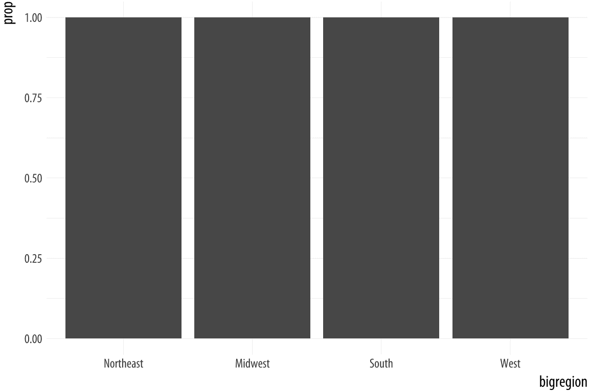
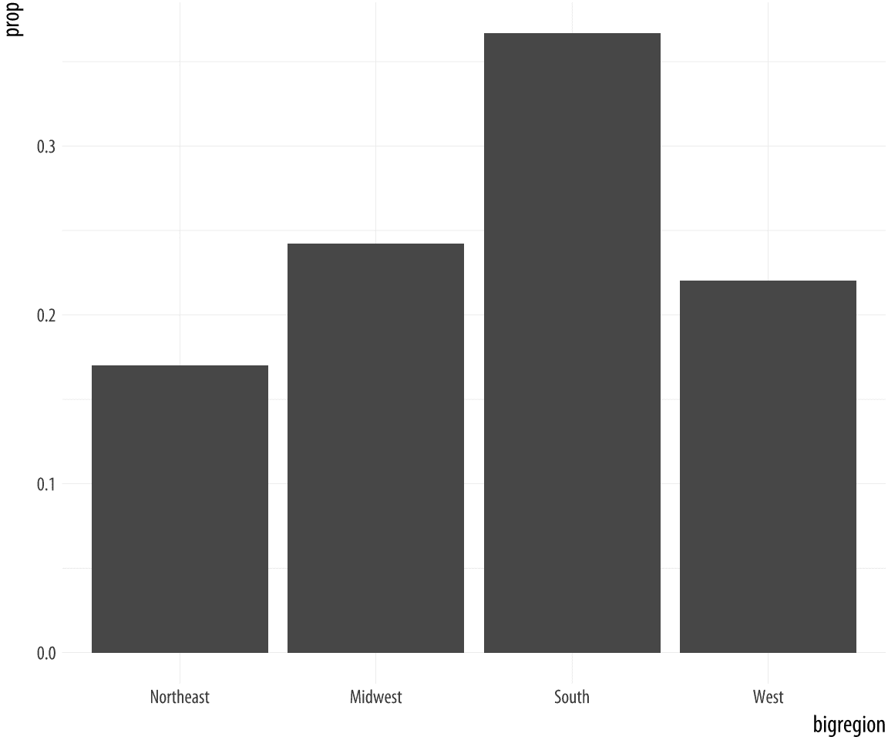
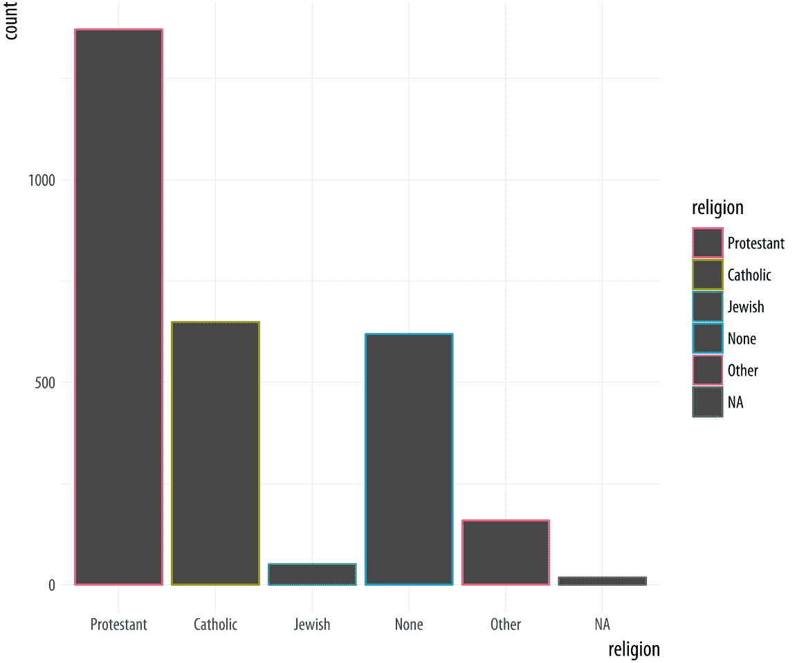
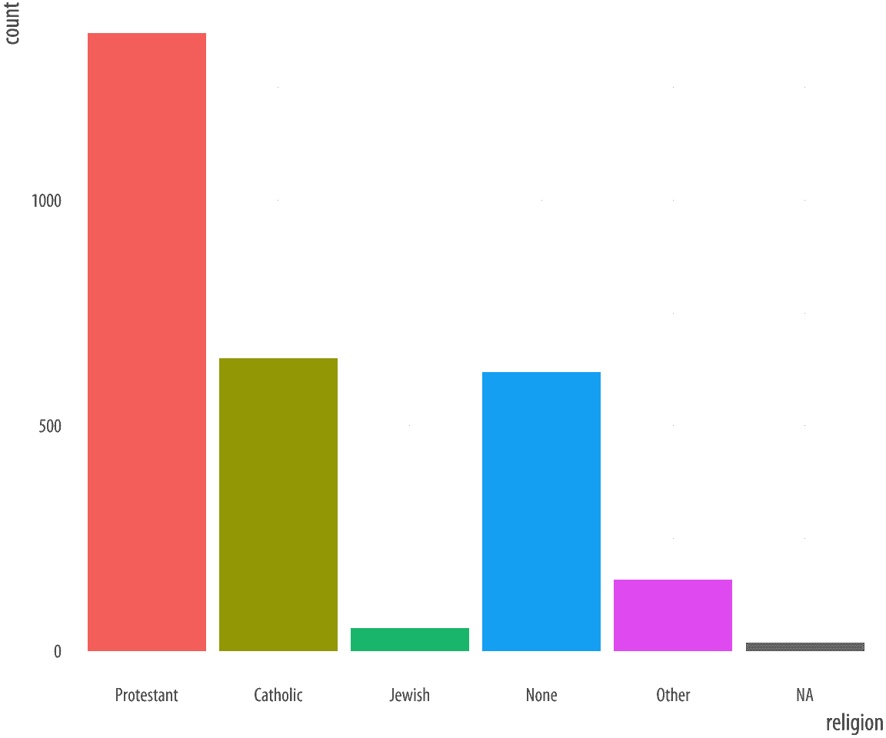
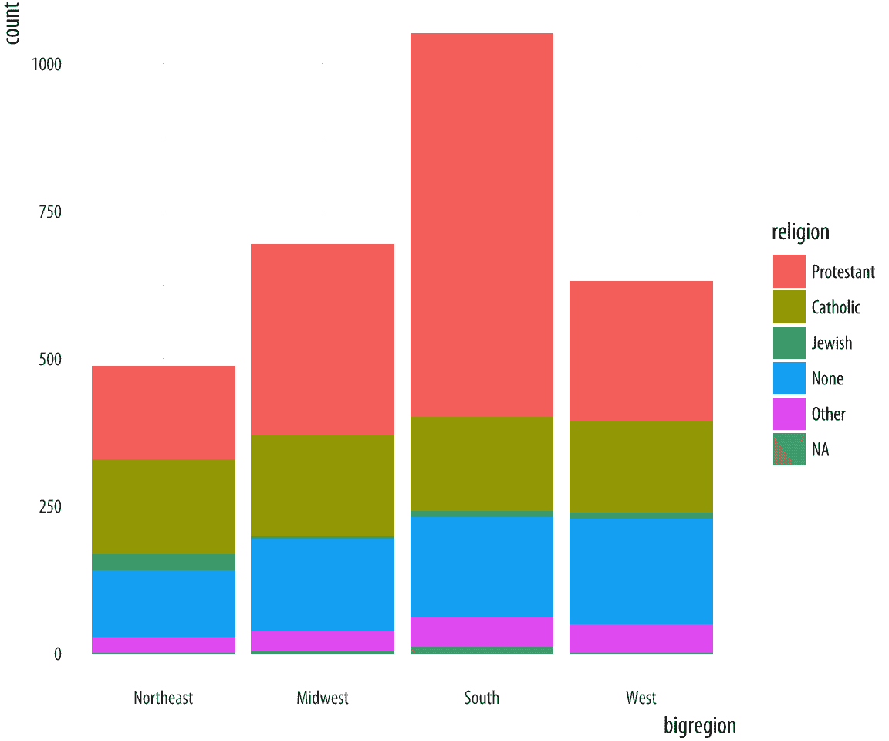
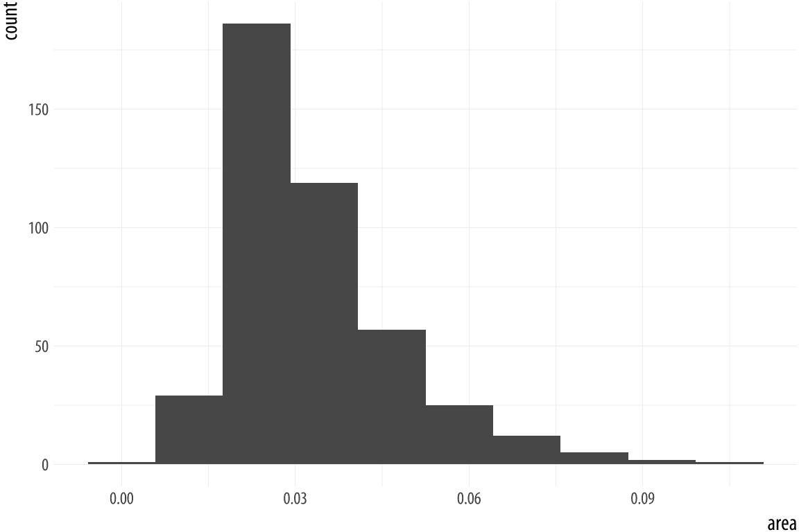
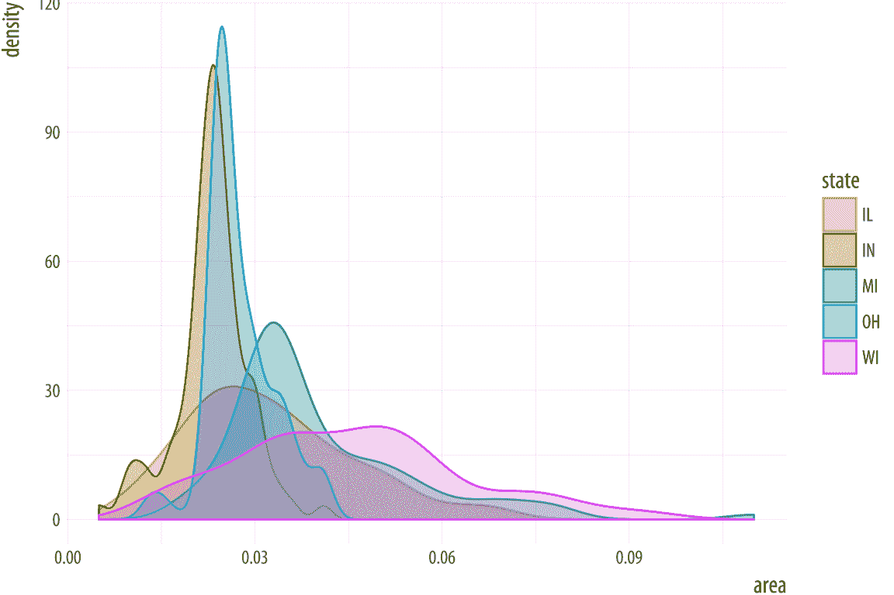
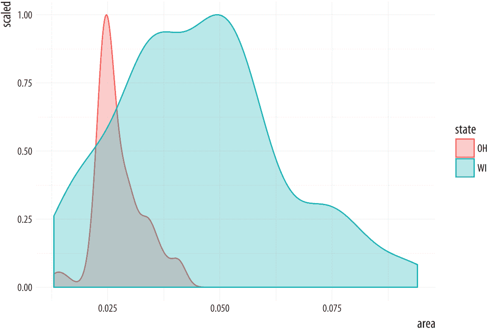
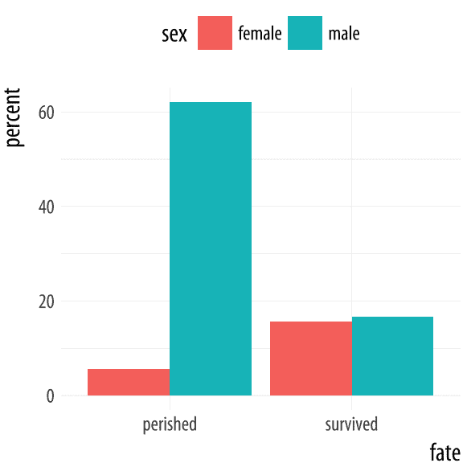

# 4 显示正确的数字

> 原文：[`socviz.co/groupfacettx.html`](https://socviz.co/groupfacettx.html)

本章将继续提高您使用 ggplot 核心工作流程的流畅度，同时扩展您可以使用它完成的事情的范围。我们的一个目标就是学习如何制作新的图表类型。这意味着需要学习一些新的几何对象（geoms），即制作特定类型图表的函数。但我们也将对 ggplot 在绘制图表时所做的操作有更好的理解，并学习更多关于如何编写准备数据以便绘制的代码。

代码几乎永远不会在第一次编写时就正确无误。这就是在学习一门新语言时，重要的是要手动输入练习并跟随操作的原因。这能让你更好地理解语言语法的工作方式，你可能会犯的错误，以及当这种情况发生时计算机做了什么。遇到错误和故障是令人沮丧的，但这也是学习更多知识的机会。错误可能很隐蔽，但通常它们并不是恶意的或随机的。如果出了问题，你可以找出原因。

在 R 和 ggplot 中，代码中的错误可能导致看起来不正确的图形。我们已经看到了最常见问题之一的结果，即当美学错误地设置为常量值而不是映射到变量时。在本章中，我们将讨论 ggplot 的一些有用特性，这些特性也经常引起麻烦。它们与如何让 ggplot 更多地了解你数据的内部结构（*分组*），如何将数据拆分成用于图表的片段（*分面*），以及如何在生成图表之前让 ggplot 对数据进行一些计算或汇总有关。其中一些任务属于 ggplot 本身，因此我们将学习更多关于如何通过其关联的*统计*函数，geoms 在绘图之前对数据进行操作。正如我们也将看到的，虽然直接在 ggplot 中进行大量转换是可能的，但可能会有更方便的方法来完成相同的任务。

## 4.1 无色的绿色数据疯狂地睡觉

当你在 R 中编写 ggplot 代码时，实际上是在尝试“表达”某种视觉上的东西。通常需要多次迭代才能准确地表达你的意图。这里不仅仅是一个比喻。ggplot 库是 Wilkinson（2005）提出的“图形语法”的实现。语法是一套从数据生成图形的规则，它将数据片段映射到具有美学属性（如位置、颜色和大小）的几何对象（如点和线），以及如果需要的话，对数据进行进一步转换的规则（例如，转换为平滑线），调整刻度（例如，对数刻度），我们将在稍后看到一些替代笛卡尔坐标的方法，并将结果投影到不同的坐标系（通常是笛卡尔坐标系）。

一个关键点是，就像其他语法规则一样，语法限制了你可以说的结构的范围，但它不会自动使你说的话变得合理或有意义。它允许你产生以将数据映射到视觉元素开始的“长句子”，并添加关于它是何种图表、坐标轴如何缩放等子句。但是这些句子很容易被搞乱。有时你的代码在 R 中会因为一些语法错误而根本无法生成图表。你可能会忘记在 `geom_` 函数之间加上 `+` 符号，或者丢失某个括号，使得你的函数声明变得不平衡。在这些情况下，R 会抱怨（可能以某种晦涩的方式）说出了些问题。在其他时候，你的代码可能会成功生成图表，但它看起来并不是你预期的样子。有时结果看起来确实非常奇怪。在这些情况下，很可能你给了 ggplot 一系列语法上正确的指令，但这些指令在某些方面可能是无意义的，或者意外地扭曲了你原本想要表达的意思。这些问题通常出现在 ggplot 没有完全获得它需要的信息来制作你想要它说的图形时。

## 4.2 分组数据和“group”美学

让我们从 Gapminder 数据集重新开始。想象一下，我们想要绘制每个国家在数据中生命预期随时间变化的轨迹。我们将 `year` 映射到 `x` 轴，将 `lifeExp` 映射到 `y` 轴。我们快速查看文档，发现 `geom_line()` 会按照 x 轴上变量的顺序连接观察值来绘制线条，这似乎是正确的。我们编写了以下代码：

 图 4.1：尝试按国家绘制数据随时间的变化。

```r
p <-  ggplot(data = gapminder,
 mapping = aes(x = year,
 y = gdpPercap))
p +  geom_line() 
```

出了些问题。发生了什么？虽然 ggplot 会根据数据结构做出相当好的猜测，但它并不知道数据中的年度观察值是按国家分组的。我们必须告诉它。因为我们没有这样做，`geom_line()` 仍然努力按照数据集中出现的顺序连接每个特定年份的所有线条，正如它所承诺的那样。它从数据的第一行中的 1952 年观察值开始。它不知道这属于阿富汗。它没有去阿富汗 1953 年，而是发现有一系列 1952 年的观察值，所以它首先将这些观察值按国家字母顺序连接起来，一直到最后属于津巴布韦的 1952 年观察值。然后它移动到下一年的第一个观察值，即 1957 年。如果数据集中只有一个国家，这本来是可以工作的。

当绘制时，结果是毫无意义的。在 ggplot 中，看起来奇怪的输出很常见，因为每个人都是一点一点地解决他们的图表，犯错误只是弄清楚你想要图表看起来怎样的一个特征。当 ggplot 成功制作了一个图表，但结果看起来疯狂时，几乎总是因为数据与用于几何对象的美学之间的映射出了问题。这种情况很常见，以至于甚至有一个[推特账号](https://twitter.com/accidental__art)专门用于“意外艺术”的结果。所以不要绝望！

在这种情况下，我们可以使用`group`美学明确告诉 ggplot 关于这种国家级别结构的信息。

 图 4.2：按国家时间序列绘制数据，再次。

```r
p <-  ggplot(data = gapminder,
 mapping = aes(x = year,
 y = gdpPercap))
p +  geom_line(aes(group=country)) 
```

这里的图表仍然相当粗糙，但它正确地显示了数据，每条线代表一个国家随时间变化的轨迹。如果你感兴趣的话，巨大的异常值是科威特。

`group`美学通常只在需要告诉 ggplot 的分组信息不是映射变量的内置信息时才需要。例如，当我们按大陆绘制点时，将`color`映射到`continent`就足以得到正确答案，因为`continent`已经是一个分类变量，所以分组是清晰的。然而，当我们将`x`映射到`year`时，`year`变量本身没有信息让 ggplot 知道它按国家分组以绘制线条。因此，我们需要明确地说明这一点。

## 4.3 分面以制作小倍数图表

我们刚刚制作的图表上有许多线条。虽然整体趋势大致清晰，但看起来有些杂乱。一个选择是使用某个第三变量对数据进行*分面*，制作一个“小倍数”图表。这是一种非常强大的技术，它允许以紧凑和一致可比的方式展示大量信息。为分面变量的每个值绘制一个单独的面板。分面不是一种几何对象，而是一种组织一系列几何对象的方式。在这种情况下，我们有`continent`变量可用。我们将使用`facet_wrap()`按`continent`拆分我们的图表。

`facet_wrap()`函数可以接受一系列参数，但最重要的是第一个参数，它使用 R 的“公式”语法指定，该语法使用波浪字符`~`。分面通常是一个单侧公式。大多数时候，你只需要在公式的右侧有一个变量。但是，如果数据足够复杂，需要多向列联表的图形等效，分面足够强大以适应这种情况。在我们的第一个例子中，我们将在公式中使用一个单一术语，这是我们想要数据按其拆分的变量：`facet_wrap(~ continent)`。

 图 4.3：按大陆分面。

```r
p <-  ggplot(data = gapminder,
 mapping = aes(x = year,
 y = gdpPercap))
p +  geom_line(aes(group = country)) +  facet_wrap(~  continent)
```

每个分面都在顶部进行了标注。整体布局最小化了轴标签和其他刻度的重复。记住，我们仍然可以像之前一样包含其他几何形状，并且它们将在每个分面内分层。我们还可以使用`facet_wrap()`函数的`ncol`参数来控制用于布局分面的列数。因为我们只有五个大陆，所以看看我们是否可以将它们放在一行上（这意味着我们将有五列）可能是有意义的。此外，我们可以添加一个平滑器，以及一些使图表更有效的美化增强。特别是，我们将使国家趋势的颜色为浅灰色。我们需要编写更多的代码来实现所有这些。如果你不确定每段代码的作用，可以利用 ggplot 的累加特性。从底部向上，逐个移除每个`+ some_function(...)`语句，以查看图表如何变化。

```r
p <-  ggplot(data = gapminder, mapping = aes(x = year, y = gdpPercap))
p +  geom_line(color="gray70", aes(group = country)) +
 geom_smooth(size = 1.1, method = "loess", se = FALSE) +
 scale_y_log10(labels=scales::dollar) +
 facet_wrap(~  continent, ncol = 5) +
 labs(x = "Year",
 y = "GDP per capita",
 title = "GDP per capita on Five Continents")
```


图 4.4：按大陆进行分面，再次。

这个图表我们可以通过国家进行分面，这将使分组映射变得多余。但那样会有近一百五十个面板。它将`x`和`y`变量的美学映射、分组美学（`country`）、两个几何形状（线图和平滑器）、对数变换的 y 轴和适当的刻度标签、分面变量（`continent`）以及最终的轴标签和标题结合在一起。

当你想根据单个分类变量得到一系列小倍数时，`facet_wrap()`函数使用得最好。你的面板将按顺序排列，然后包裹成一个网格。如果你愿意，你可以指定结果的行数或列数。分面可以比这更复杂。例如，你可能想通过两个分类变量交叉分类一些数据。在这种情况下，你应该尝试使用`facet_grid()`。这个函数将以真正的二维排列来布局你的图表，而不是一系列包裹在网格中的面板。

为了看到差异，让我们引入`gss_sm`，这是一个新的数据集，我们将在接下来的几节中以及本书的后续部分使用。它是 2016 年综合社会调查（GSS）中问题的一个小子集。GSS 是对美国成年人进行的一项长期调查，调查了社会科学家感兴趣的一系列主题。首先，我们将以略带天真的方式使用 GSS 数据。特别是，在制作本章中的图表时，我们不会考虑样本权重。在第六章中，我们将学习如何从具有复杂或加权调查设计的数据中计算频率和其他统计量。`gapminder`数据主要由各国按年份测量的*连续*变量组成。如人均 GDP 这样的度量可以在一个很大的范围内取任何值，并且它们变化平滑。唯一的*分类*分组变量是`continent`。它是一个无序分类变量。每个国家属于一个大陆，但大陆本身没有自然的顺序。

在社会科学工作中，尤其是在分析个体层面的调查数据时，我们经常处理各种类型的分类数据。有时类别是无序的，如种族或性别。但它们也可能是有序的，例如当我们测量从小学到研究生学位的最高教育水平时。意见问题可能以是或否的形式提出，或者在一个五点或七点量表上，中间有一个中性值。同时，许多数值度量，如孩子数量，可能仍然只在相对较窄的范围内取整数值。在实践中，这些也可以被视为从零到某些上限值（如“六或以上”）的有序分类变量。即使是适当的连续度量，如收入，也很少按美元报告，并且通常只能作为有序类别获得。`gss_sm`中的 GSS 数据包含许多此类度量。您可以通过在控制台中输入其名称来查看它，或者尝试`glimpse(gss_sm)`，这将给出数据中所有变量的非常紧凑的摘要。

我们将绘制一个平滑的散点图，展示受访者年龄与他们拥有的孩子数量之间的关系。在`gss_sm`中，`childs`变量是受访者孩子数量的数值计数。（还有一个名为`kids`的变量，它与`childs`变量是相同的度量，但其类别是一个有序因子而不是数字。）然后我们将通过受访者的性别和种族来细分这种关系。我们在`facet_grid`函数中使用 R 的公式表示法来细分性别和种族。这次，因为我们正在进行交叉分类，所以公式是双向的：`facet_grid(sex ~ race)`。

```r
p <-  ggplot(data = gss_sm,
 mapping = aes(x = age, y = childs))
p +  geom_point(alpha = 0.2) +
 geom_smooth() +
 facet_grid(sex ~  race)
```

图 4.5：基于两个分类变量的细分。每个面板绘制了年龄与孩子数量的关系，细分部分通过性别（行）和种族（列）来划分数据。


这种多面板布局在用于总结两个或更多分类变量上的连续变化（如散点图）时特别有效，其中类别（以及因此的面板）以某种合理的方式排序。我们不仅限于双向比较。还可以将更多的分类变量添加到公式中（例如，`sex ~ race + degree`）以创建更复杂的多向图。然而，如果每个变量有多个类别，这种图的多个维度会变得非常复杂。

## 4.4 几何对象可以转换数据

我们已经看到了几个例子，其中`geom_smooth()`被包括在内，作为向图中添加趋势线的一种方式。有时我们绘制了 LOESS 线，有时是 OLS 回归的直线，有时是广义加性模型的结果。我们不必对这三种方法之间的差异有强烈的认识。我们也不必编写任何代码来指定底层模型，除了告诉`geom_smooth()`中的`method`参数我们想要使用哪个。`geom_smooth()`函数完成了其余的工作。

因此，一些几何对象直接在图上绘制我们的数据，就像`geom_point()`一样，它接受被指定为`x`和`y`的变量，并在网格上绘制点。但其他几何对象在绘图之前对数据进行更多的处理。例如尝试`p + stat_smooth()`。每个`geom_`函数都有一个关联的`stat_`函数，它默认使用。反之亦然：每个`stat_`函数都有一个关联的`geom_`函数，如果你要求它，它将默认绘制。这本身并不是特别重要，但正如我们将在下一节中看到的，我们有时希望从几何对象计算不同的统计量，而不是默认的。

有时，与`geom_`函数一起工作的`stat_`函数所进行的计算可能并不立即明显。例如，考虑由新的`geom`函数`geom_bar()`生成的这个图。

 图 4.6：条形图。

```r
p <-  ggplot(data = gss_sm,
 mapping = aes(x = bigregion))
p +  geom_bar()
```

在这里，我们只指定了一个映射，`aes(x = bigregion)`。生成的条形图给出了美国各地区（个体）观测值的数量。这似乎是合理的。但这里有一个不在数据中的 y 轴变量，`count`，它已经为我们计算过了。在幕后，`geom_bar`调用了与之关联的默认`stat_`函数，`stat_count()`。此函数计算了两个新变量，`count`和`prop`（比例的简称）。`count`统计量是`geom_bar()`默认使用的。

 图 4.7：一个带有比例的条形图的初次尝试。

```r
p <-  ggplot(data = gss_sm,
 mapping = aes(x = bigregion))
p +  geom_bar(mapping = aes(y = ..prop..))
```

如果我们想要一个相对频率而不是计数的图表，我们需要获取`prop`统计量。当 ggplot 计算计数或比例时，它返回临时变量，我们可以将其用作绘图中的映射。相关的统计量称为`..prop..`而不是`prop`。为了确保这些临时变量不会与其他我们正在使用的变量混淆，它们的名称以两个点开始和结束。（这是因为我们可能已经在数据集中有一个名为`count`或`prop`的变量。）因此，我们从`aes()`函数对其的调用将普遍看起来像这样：`<mapping> = <..statistic..>`。在这种情况下，我们希望`y`使用计算出的比例，所以我们说`aes(y = ..prop..)`。

结果图仍然不正确。我们不再在 y 轴上有计数，但所有条形的比例值都是 1，因此所有条形的高度都相同。我们希望它们*总和*为 1，这样我们就能得到每个大洲的观察数占总观察数的比例。这又是一个分组问题。从某种意义上说，这是我们在需要告诉 ggplot 我们的年度数据按国家分组时所面临的早期分组问题的反面。在这种情况下，我们需要告诉 ggplot 在计算比例的分母时*忽略*x 类别，并使用总观察数。为此，我们在`aes()`调用中指定`group = 1`。`1`只是一个“虚拟分组”的值，告诉 ggplot 在建立其`prop`计算的分母时使用整个数据集。 

 图 4.8：一个正确的比例条形图。

```r
p <-  ggplot(data = gss_sm,
 mapping = aes(x = bigregion))
p +  geom_bar(mapping = aes(y = ..prop.., group = 1)) 
```

让我们看看调查中的另一个问题。`gss_sm`数据包含一个由问题“你的宗教偏好是什么？是基督教徒、天主教徒、犹太教徒、其他宗教，还是没有宗教？”派生出的`religion`变量。

```r
table(gss_sm$religion)
```

```r
## 
## Protestant   Catholic     Jewish       None      Other 
##       1371        649         51        619        159
```

要回忆起`$`字符是访问数据框或 tibble 中单个列的一种方式，我们想要一个条形图，其中`religion`在 x 轴上（作为一个分类变量），并且条形图中的条形也按`religion`着色。如果灰色条形看起来很无聊，我们想要用颜色填充它们而不是灰色，我们可以将`religion`变量映射到`fill`，除了映射到`x`。记住，`fill`是用来填充形状内部的。如果我们把宗教映射到`color`，只有条形的边框线会被分配颜色，内部将保持灰色。

```r
p <-  ggplot(data = gss_sm,
 mapping = aes(x = religion, color = religion))
p +  geom_bar()

p <-  ggplot(data = gss_sm,
 mapping = aes(x = religion, fill = religion))
p +  geom_bar() +  guides(fill = FALSE) 
```

图 4.9：GSS 宗教偏好映射到颜色（左侧）以及颜色和填充（右侧）。



通过这种方式，我们将两个美学映射到同一个变量。`x`和`fill`都映射到`religion`。这并没有什么问题。然而，这仍然是两种独立的映射，因此它们各自有不同的刻度。默认情况下，会显示颜色变量的图例。这个图例是多余的，因为`religion`的类别已经在 x 轴上分开。在其最简单的使用中，`guides()`函数控制是否显示任何特定映射的引导信息。如果我们设置`guides(fill = FALSE)`，则图例将被移除，实际上表示观众不需要看到关于此映射的任何引导信息。将某些映射的引导设置为`FALSE`只有在最初有图例可以关闭的情况下才有效。尝试`x = FALSE`或`y = FALSE`将不会有任何效果，因为这些映射没有除其刻度之外的其他引导或图例。有可能完全关闭 x 和 y 刻度，但这是通过不同的函数完成的，该函数来自`scale_`家族。

## 4.5 频率图以略感尴尬的方式呈现

使用`geom_bar()`的`fill`美学进行更合适的用途是交叉分类两个分类变量。这是计数频率表或比例频率表的图形等价物。例如，使用 GSS 数据，我们可能想检查美国不同地区的宗教偏好分布。在接下来的几段中，我们将看到如何仅使用 ggplot 来完成这项工作。然而，正如我们将发现的，这通常不是制作此类频率表最透明的方式。下一章介绍了一种更简单、更不易出错的简单方法，我们首先计算表，然后将结果传递给 ggplot 进行绘图。在阅读这一部分时，请记住，如果你觉得事情有点尴尬或困惑，那正是因为它们确实如此。

假设我们想按人口普查区域查看宗教偏好。也就是说，我们希望`religion`变量在`bigregion`内按比例分解。当我们对条形图中的类别进行交叉分类时，有几种方式来展示结果。使用`geom_bar()`时，输出由`position`参数控制。让我们首先将`fill`映射到`religion`。

 图 4.10：按人口普查区域宗教偏好的堆叠条形图。

```r
p <-  ggplot(data = gss_sm,
 mapping = aes(x = bigregion, fill = religion))
p +  geom_bar()
```

`geom_bar()`的默认输出是一个堆叠条形图，y 轴上显示计数（因此条形的堆叠部分内的计数也显示）。国家地区在 x 轴上，宗教偏好的计数在条形内堆叠。正如我们在第一章中看到的，对于图表的读者来说，在未对齐的刻度上比较长度和面积有些困难。因此，尽管底部类别的相对位置相当清晰（多亏它们都在 x 轴上对齐），但例如“天主教”类别的相对位置就难以评估。另一种选择是将`position`参数设置为`"fill"`。（这与`fill`美学不同。）

 图 4.11：使用填充位置调整来显示类别间的相对比例。

```r
p <-  ggplot(data = gss_sm,
 mapping = aes(x = bigregion, fill = religion))
p +  geom_bar(position = "fill")
```

现在条形的高度都相同，这使得比较组间的比例更容易。但我们失去了看到每个切割相对于总体总量的相对大小的能力。如果我们想展示国家地区内宗教的比例或百分比，就像图 4.11 中那样，但我们不想堆叠条形，而是想使用单独的条形呢？作为一个初步尝试，我们可以使用`position="dodge"`来使国家每个地区的条形并排出现。然而，如果我们这样做（试试看），我们会发现 ggplot 将条形并排放置，正如预期的那样，但将 y 轴改回每个类别的案例 *count* 而不是显示比例。我们在图 4.8 中看到，为了显示比例，我们需要映射`y = ..prop..`，所以正确的统计量会被计算。让我们看看这行不行。

 图 4.12：第一次尝试使用并排条形图和比例条形。

```r
p <-  ggplot(data = gss_sm,
 mapping = aes(x = bigregion, fill = religion))
p +  geom_bar(position = "dodge",
 mapping = aes(y = ..prop..))
```

结果当然很丰富多彩，但不是我们想要的。就像图 4.7 一样，似乎存在分组问题。当我们只想得到一个变量的总体比例时，我们映射`group = 1`来告诉 ggplot 根据总体 N 计算比例。在这种情况下，我们的分组变量是`religion`，所以我们可能会尝试将其映射到`group`美学。

```r
p <-  ggplot(data = gss_sm,
 mapping = aes(x = bigregion, fill = religion))
p +  geom_bar(position = "dodge",
 mapping = aes(y = ..prop.., group = religion))
```

这为我们提供了一个条形图，其中`religion`的值按地区分解，y 轴上显示比例。如果你检查图 4.13 中的条形，你会发现它们在每个地区内并不相加至一。相反，任何特定宗教的条形在地区间相加至一 *across*。

 图 4.13：第二次尝试绘制带有比例条的错位条形图。

这让我们看到，例如，几乎一半声称自己是新教徒的人居住在南方。与此同时，只有超过十 percent 的人说他们是新教徒，居住在东北部。同样，它显示说他们是犹太人的超过一半的人居住在东北部，相比之下，大约四分之一的人居住在南方。GSS 中较小子群体的比例往往每年都会上下波动。

我们仍然没有达到最初想要的位置。我们的目标是取图 4.10 中的堆叠条形图，但比例是并排显示而不是重叠在一起。

```r
p <-  ggplot(data = gss_sm,
 mapping = aes(x = religion))
p +  geom_bar(position = "dodge",
 mapping = aes(y = ..prop.., group = bigregion)) +
 facet_wrap(~  bigregion, ncol = 1)
```

结果表明，最容易做的事情就是停止试图在单一步骤中强迫`geom_bar()`完成所有工作。相反，我们可以要求 ggplot 给我们一个宗教归属的比例条形图，然后按地区进行细分。比例是在每个面板内计算的，这正是我们想要的结果。此外，这种方法还有一个优点，就是不会在每个类别中产生过多的条形。

图 4.14：按地区细分比例。


我们可以进一步润色这个图表，但暂时就到这里为止。在 ggplot 中直接构建频率图时，很容易陷入一个循环，即无法得到你想要的边际比较，而且几乎是在随机地尝试映射，试图偶然找到正确的细分。在下一章中，我们将学习如何使用 tidyverse 的`dplyr`库在尝试绘图之前生成我们想要的表格。这是一个更可靠的方法，并且更容易检查错误。它还将为我们提供可用于许多更多任务的工具。

## 4.6 直方图和密度图

不同的几何形状以不同的方式转换数据，但 ggplot 对这些几何形状的词汇是一致的。例如，当我们使用直方图总结连续变量时，我们可以看到类似的转换在起作用。直方图是一种通过将其切割成段或“箱”并计算每个箱内找到的观测值数量来总结连续变量的方法。在条形图中，类别是预先给出的（例如，国家的地区或宗教归属）。在直方图中，我们必须决定如何精细地划分数据。

例如，ggplot 附带一个数据集`midwest`，其中包含美国几个中西部的县信息。县的大小各不相同，因此我们可以制作一个直方图来显示它们的地理面积分布。面积以平方英里为单位。因为我们正在使用一系列条形来总结连续变量，所以我们需要将观测值分成组，或称为箱，并计算每个箱中有多少个。默认情况下，`geom_histogram()`函数将根据经验规则为我们选择箱大小。

```r
p <-  ggplot(data = midwest,
 mapping = aes(x = area))
p +  geom_histogram()
```

```r
## `stat_bin()` using `bins = 30`. Pick better value with
## `binwidth`.
```

```r
p <-  ggplot(data = midwest,
 mapping = aes(x = area))
p +  geom_histogram(bins = 10)
```

图 4.15：使用不同数量的箱的同一变量的直方图。



与条形图一样，新计算出的变量`count`出现在 x 轴上。R 的通知告诉我们，在幕后`stat_bin()`函数选择了 30 个箱，但我们可能想尝试其他方法。在绘制直方图时，尝试`bins`和可选的 x 轴`origin`是值得的。每个，尤其是`bins`，都会对最终图形的外观产生重大影响。

当直方图总结单个变量时，也可以同时使用多个直方图来比较分布。我们可以通过感兴趣的某个变量对直方图进行分面，或者像这里一样，我们可以使用`fill`映射在同一张图上比较它们。

 图 4.16：比较两个直方图。

```r
oh_wi <-  c("OH", "WI")

p <-  ggplot(data = subset(midwest, subset = state %in%  oh_wi),
 mapping = aes(x = percollege, fill = state))
p +  geom_histogram(alpha = 0.4, bins = 20)
```

我们在这里对数据进行子集化，以挑选出仅两个州。为此，我们创建了一个包含两个元素的字符向量，“OH”和“WI”。然后我们使用`subset()`函数来获取我们的数据，并过滤它，以便我们只选择`state`名称在这个向量中的行。`%in%`运算符是使用`subset()`在变量中过滤多个术语的一种方便方式。

当处理连续变量时，除了对数据进行分箱并制作直方图外，还可以计算底层分布的核密度估计。`geom_density()`函数会为我们做这件事。

 图 4.17：县面积的核密度估计。

```r
p <-  ggplot(data = midwest,
 mapping = aes(x = area))
p +  geom_density()
```

我们也可以在这里使用`color`（用于线条）和`fill`（用于密度曲线的主体）。这些图形通常看起来相当不错。但是，当图表上有多个填充区域时，如本例所示，重叠可能会变得难以阅读。如果您想使密度曲线的基线消失，可以使用`geom_line(stat = "density")`代替。这也会移除使用`fill`美学的可能性。但这在某些情况下可能是一个改进。尝试使用州面积图来查看它们的比较。

```r
p <-  ggplot(data = midwest,
 mapping = aes(x = area, fill = state, color = state))
p +  geom_density(alpha = 0.3)
```

图 4.18：比较分布。



就像 `geom_bar()` 一样，`geom_histogram()` 和 `geom_density()` 中使用的 `stat_` 函数基于计数的默认计算会在我们要求时返回比例度量。对于 `geom_density()`，`stat_density()` 函数可以返回其默认的 `..density..` 统计量，或者 `..scaled..`，这将给出比例密度估计。它还可以返回一个名为 `..count..` 的统计量，这是密度乘以点的数量。这可以用于堆叠密度图。

 图 4.19：缩放密度图。

```r
p <-  ggplot(data = subset(midwest, subset = state %in%  oh_wi),
 mapping = aes(x = area, fill = state, color = state))
p +  geom_density(alpha = 0.3, mapping = (aes(y = ..scaled..)))
```

## 4.7 在必要时避免变换

正如我们从一开始看到的，ggplot 通常从完整的数据集开始制作图表。当我们调用 `geom_bar()` 时，它会在后台使用 `stat_count()` 进行即时计算，以产生它显示的计数或比例。在上一节中，我们查看了一个我们希望在将数据交给 ggplot 之前自己进行分组和汇总的案例。但通常，我们的数据实际上已经是汇总表。这可能会发生在我们已经从原始数据中计算出了边际频率或百分比表的情况下。从统计模型中得到的绘图结果也会使我们处于这种位置，我们将在后面看到。或者，可能我们只是有一个完成的数据表（例如，来自人口普查或官方报告），我们希望将其制作成图表。例如，我们可能没有关于谁在 *泰坦尼克号* 灾难中幸存下来的个体级数据，但我们确实有一个按性别划分的幸存者计数的小表：

```r
titanic
```

```r
##       fate    sex    n percent
## 1 perished   male 1364    62.0
## 2 perished female  126     5.7
## 3 survived   male  367    16.7
## 4 survived female  344    15.6
```

由于我们直接在汇总表中处理百分比值，我们不再需要 ggplot 为我们计数或执行任何其他计算。也就是说，我们不需要 `geom_bar()` 通常会调用的任何 `stat_` 函数的服务。我们可以告诉 `geom_bar()` 在绘图之前不要对变量进行任何操作。为此，我们在 `geom_bar()` 调用中指定 `stat = 'identity'`。我们还将图例移动到图表的顶部。

 图 4.20：泰坦尼克号上的生存情况，按性别划分。

```r
p <-  ggplot(data = titanic,
 mapping = aes(x = fate, y = percent, fill = sex))
p +  geom_bar(position = "dodge", stat = "identity") +  theme(legend.position = "top")
```

为了方便起见，ggplot 还提供了一个相关的 geom，`geom_col()`，它具有完全相同的效果，但假设 `stat = "identity"`。当我们不需要在图表上进行任何计算时，我们将使用这种形式。

`geom_bar()`和`geom_col()`中的`position`参数也可以取值为`"identity"`。正如`stat = "identity"`意味着“不进行任何汇总计算”，`position = "identity"`意味着“仅按给定值绘制”。这允许我们做一些事情，例如，在柱状图中绘制正负值的流动。这种图表是线图的替代品，通常在公共政策环境中可以看到，其中对相对于某个阈值水平或基线的变化感兴趣。例如，`socviz`中的`oecd_sum`表包含了美国及其他经合组织国家平均预期寿命的信息。

```r
oecd_sum
```

```r
## # A tibble: 57 x 5
## # Groups:   year [57]
##     year other   usa  diff hi_lo
##    <int> <dbl> <dbl> <dbl> <chr>
##  1  1960  68.6  69.9 1.30  Below
##  2  1961  69.2  70.4 1.20  Below
##  3  1962  68.9  70.2 1.30  Below
##  4  1963  69.1  70.0 0.900 Below
##  5  1964  69.5  70.3 0.800 Below
##  6  1965  69.6  70.3 0.700 Below
##  7  1966  69.9  70.3 0.400 Below
##  8  1967  70.1  70.7 0.600 Below
##  9  1968  70.1  70.4 0.300 Below
## 10  1969  70.1  70.6 0.500 Below
## # ... with 47 more rows
```

`other`列是经合组织国家在给定年份的平均预期寿命，不包括美国。`usa`列是美国预期寿命，`diff`是两个值的差异，而`hi_lo`表示美国那一年的值是高于还是低于经合组织平均水平。我们将绘制随时间的变化差异，并使用`hi_lo`变量来为图表中的柱子着色。

```r
p <-  ggplot(data = oecd_sum,
 mapping = aes(x = year, y = diff, fill = hi_lo))
p +  geom_col() +  guides(fill = FALSE) +
 labs(x = NULL, y = "Difference in Years",
 title = "The US Life Expectancy Gap",
 subtitle = "Difference between US and OECD
 average life expectancies, 1960-2015",
 caption = "Data: OECD. After a chart by Christopher Ingraham,
 Washington Post, December 27th 2017.")
```


图 4.21：使用`geom_col()`在柱状图中绘制负值和正值。

与`titanic`图表一样，`geom_col()`的默认操作是设置`stat`和`position`都为“`identity`”。要使用`geom_bar()`获得相同的效果，我们需要说`geom_bar(position = "identity")`。与之前一样，最后的`guides(fill=FALSE)`指令告诉 ggplot 不要生成与`fill`映射一起自动生成的不必要的图例。

到目前为止，我们已经对必须采取的核心步骤来可视化我们的数据有了相当好的理解。实际上，多亏了 ggplot 的默认设置，我们现在有能力制作出既美观又富有信息量的图表。从整洁的数据集开始，我们知道如何将变量映射到美学上，从各种几何形状中选择，并对图表的尺度进行一些调整。我们还了解如何选择合适的计算统计量来显示在图上，如果需要的话，以及如何通过一个或多个变量对核心图表进行分面。我们知道如何为坐标轴设置描述性标签，并撰写标题、副标题和图注。现在我们能够更流畅地运用这些技能。

## 4.8 接下来去哪里

+   回顾本章开头提到的`gapminder`图表，并尝试不同的数据分面方式。尝试在按年份或甚至按国家分面时绘制人口和人均 GDP。在后一种情况下，你会得到很多面板，直接在屏幕上绘制它们可能需要很长时间。相反，将图表分配给一个对象，并将其保存为 PDF 文件到您的`figures/`文件夹中。尝试调整图形的高度和宽度。

+   调查将公式写成`facet_grid(sex ~ race)`与写成`facet_grid(~ sex + race)`之间的区别。

+   通过使用更复杂的公式，如`facet_wrap(~ sex + race)`而不是`facet_grid`，来实验一下会发生什么。与`facet_grid()`类似，`facet_wrap()`函数可以同时根据两个或多个变量进行分面。但它将通过将结果布局在一个包裹的一维表中而不是一个完全交叉分类的网格中来实现这一点。

+   频率多边形与直方图密切相关。它们不是用条形显示观察值的计数，而是用一系列连接的线来显示。你可以尝试使用`geom_freqpoly()`代替本章中的各种`geom_histogram()`调用。

+   直方图将一个变量的观察值进行分箱，并显示每个箱中的计数。我们也可以同时为两个变量这样做。`geom_bin2d()`函数接受两个映射，`x`和`y`。它将你的绘图分成一个网格，并通过箱中观察值的计数来着色这些箱。尝试使用`gapminder`数据来绘制预期寿命与人均 GDP 的关系。与直方图一样，你可以为`x`或`y`的箱数或宽度进行调整。而不是说`bins = 30`或`binwidth = 1`，你可以为`x`和`y`都提供一个数字，例如`bins = c(20, 50)`。如果你指定`binwidth`，你需要选择与你要映射的变量相同的比例的值。

+   密度估计也可以在二维中绘制。`geom_density_2d()`函数绘制等高线，估计两个变量的联合分布。例如，尝试使用`midwest`数据，绘制贫困线以下百分比（`percbelowpoverty`）与受过大学教育百分比（`percollege`）的关系。尝试添加和删除`geom_point()`层。

## 4.1 无色的绿色数据疯狂地睡觉

当你在 R 中编写 ggplot 代码时，实际上你是在尝试“表达”某种视觉上的信息。通常需要多次迭代才能准确表达你的意图。这里不仅仅是一个比喻。ggplot 库是对图形“语法”的实现，这是一个由 Wilkinson（2005）提出的概念。语法是一套从数据生成图形的规则，它将数据片段映射到具有美学属性（如位置、颜色和大小）的几何对象（如点和线），以及进一步的数据转换规则（例如，转换为平滑线），调整比例（例如，对数比例），我们稍后会看到一些与笛卡尔坐标不同的替代方案，并将结果投影到不同的坐标系上（通常是笛卡尔坐标系）。

一个关键点是，与其他语法规则一样，语法限制了你可以说的结构的范围，但它不会自动使你说的话变得合理或有意义。它允许你产生长的“句子”，这些句子以将数据映射到视觉元素开始，并添加关于它是何种图表、坐标轴如何缩放等内容的子句。但是这些句子很容易被搞乱。有时你的代码在 R 中可能根本不会生成图表，因为存在一些语法错误。你可能会忘记在`geom_`函数之间加上一个`+`符号，或者丢失某个地方的括号，使得你的函数声明变得不平衡。在这些情况下，R 会抱怨（可能以一种晦涩的方式）说出了问题。在其他时候，你的代码可能会成功生成图表，但它看起来并不是你预期的样子。有时结果看起来确实非常奇怪。在这些情况下，很可能是你给了 ggplot 一系列语法上正确的指令，但这些指令在某些方面可能是无意义的，或者意外地扭曲了你想要表达的意思。这些问题通常发生在 ggplot 没有足够的信息来制作你想要它表达的信息的图形时。

## 4.2 分组数据和“group”美学

让我们从我们的 Gapminder 数据集重新开始。想象一下，我们想要绘制数据中每个国家随时间推移的生命期望轨迹。我们将`year`映射到`x`轴，将`lifeExp`映射到`y`轴。我们快速查看文档，发现`geom_line()`将按照 x 轴上变量的顺序连接观测值来绘制线条，这似乎是正确的。我们编写了我们的代码：

 图 4.1：尝试按国家绘制数据随时间的变化。

```r
p <-  ggplot(data = gapminder,
 mapping = aes(x = year,
 y = gdpPercap))
p +  geom_line() 
```

发生了某些问题。发生了什么？虽然 ggplot 会根据数据结构做出一个相当好的猜测，但它并不知道数据中的年度观测值是按国家分组的。我们必须告诉它。因为我们没有这样做，`geom_line()`就勇敢地试图按照数据集中出现的顺序将每个特定年份的所有线条连接起来，就像它承诺的那样。它从数据的第一行中的 1952 年的观测值开始。它不知道这属于阿富汗。它没有去阿富汗 1953 年，而是发现有一系列 1952 年的观测值，所以它首先将它们全部连接起来，按国家字母顺序排列，一直到最后属于津巴布韦的 1952 年观测值。然后它移动到下一年第一行的第一个观测值，即 1957 年。如果数据集中只有一个国家，这本来是可以工作的。

当绘制时，结果是毫无意义的。在 ggplot 中，看起来奇怪的输出很常见，因为每个人都是一步一步地解决他们的图表，犯错误只是弄清楚你想要图表看起来怎样的一个特征。当 ggplot 成功制作了一个图表，但结果看起来疯狂时，几乎总是因为数据与用于 geom 的美学之间的映射出了问题。这种情况很常见，以至于甚至有一个[推特账号](https://twitter.com/accidental__art)专门用于“意外艺术”的结果。所以不要绝望！

在这种情况下，我们可以使用`group`美学来明确告诉 ggplot 这个国家层面的结构。

 图 4.2：再次按国家绘制数据的时间图。

```r
p <-  ggplot(data = gapminder,
 mapping = aes(x = year,
 y = gdpPercap))
p +  geom_line(aes(group=country)) 
```

这里的图表仍然相当粗糙，但它正确地显示了数据，每条线代表一个国家随时间变化的轨迹。如果你感兴趣的话，巨大的异常值是科威特。

通常只有在需要告诉 ggplot 的分组信息不是映射变量的内置信息时，才需要`group`美学。例如，当我们按大陆绘制点时，将`color`映射到`continent`就足以得到正确答案，因为`continent`已经是一个分类变量，所以分组是清晰的。然而，当我们将`x`映射到`year`时，`year`变量本身没有信息可以让 ggplot 知道它按国家分组以绘制线条。因此，我们需要明确地说明这一点。

## 4.3 分面以制作小倍数图

我们刚刚制作的图表上有许多线条。虽然整体趋势或多或少是清晰的，但它看起来有点杂乱。一个选择是按某个第三个变量分面数据，制作一个“小倍数”图。这是一种非常强大的技术，允许以紧凑和一致可比的方式展示大量信息。为分面变量的每个值绘制一个单独的面板。分面不是 geom，而是一种组织一系列 geom 的方式。在这种情况下，我们有`continent`变量可用。我们将使用`facet_wrap()`按`continent`拆分我们的图表。

`facet_wrap()`函数可以接受一系列参数，但最重要的是第一个参数，它使用 R 的“公式”语法指定，该语法使用波浪线字符`~`。分面通常是一个单侧公式。大多数情况下，你只需要在公式的右侧有一个变量。但是，分面足够强大，可以容纳实际上是多向列联表图形等价物的数据，如果你的数据足够复杂，需要这样做的话。在我们的第一个例子中，我们将在公式中使用一个单一术语，这是我们想要数据按其拆分的变量：`facet_wrap(~ continent)`。

 图 4.3：按大陆分面。

```r
p <-  ggplot(data = gapminder,
 mapping = aes(x = year,
 y = gdpPercap))
p +  geom_line(aes(group = country)) +  facet_wrap(~  continent)
```

每个分面在顶部都有标签。整体布局最小化了轴标签和其他刻度的重复。记住，我们仍然可以像以前一样包含其他 geom，它们将在每个分面内分层。我们还可以使用 `facet_wrap()` 的 `ncol` 参数来控制用于布局分面的列数。因为我们只有五个大陆，所以可能值得看看我们是否可以将它们放在一行上（这意味着我们将有五列）。此外，我们可以添加一个平滑器，以及一些使图表更有效的美学增强。特别是，我们将使国家趋势的颜色为浅灰色。我们需要编写更多的代码来实现这一切。如果你不确定每段代码的作用，可以利用 ggplot 的累加特性。从底部向上，逐个移除每个 `+ some_function(...)` 语句，以查看图表如何变化。

```r
p <-  ggplot(data = gapminder, mapping = aes(x = year, y = gdpPercap))
p +  geom_line(color="gray70", aes(group = country)) +
 geom_smooth(size = 1.1, method = "loess", se = FALSE) +
 scale_y_log10(labels=scales::dollar) +
 facet_wrap(~  continent, ncol = 5) +
 labs(x = "Year",
 y = "GDP per capita",
 title = "GDP per capita on Five Continents")
```


图 4.4：再次按大陆分面。

这个图表我们可以通过国家来分面，这样就会使分组映射变得多余。但那样会有近一百五十个面板。它将 `x` 和 `y` 变量的美学映射、分组美学（`country`）、两个 geom（线图和平滑器）、带有适当刻度标签的对数变换的 y 轴、分面变量（`continent`）以及最终的轴标签和标题结合在一起。

`facet_wrap()` 函数最适合当你想要基于单个分类变量的一系列小倍数时使用。你的面板将按顺序排列，然后包裹成一个网格。如果你愿意，你可以指定结果的行数或列数。Facets 可以比这更复杂。例如，你可能想要通过两个分类变量交叉分类一些数据。在这种情况下，你应该尝试使用 `facet_grid()`。这个函数将你的图表布局在一个真正的二维排列中，而不是一系列包裹在网格中的面板。

要看到差异，让我们介绍 `gss_sm`，这是一个新数据集，我们将在接下来的几节中使用它，以及本书后面的部分。它是 2016 年一般社会调查（GSS）中问题的一个小子集。GSS 是对美国成年人进行的一项长期调查，涉及社会科学家感兴趣的各种主题。首先，我们将以略带天真的方式使用 GSS 数据。具体来说，在制作本章的图表时，我们不会考虑样本权重。在第六章中，我们将学习如何从具有复杂或加权调查设计的数据中计算频率和其他统计量。`gapminder` 数据主要由按年份在各国测量的 *连续* 变量组成。如人均 GDP 这样的度量可以跨越很大范围取任何值，并且变化平滑。唯一的 *分类* 分组变量是 `continent`。它是一个无序分类变量。每个国家属于一个大陆，但大陆本身没有自然顺序。

在社会科学工作中，尤其是在分析个体层面的调查数据时，我们经常处理各种类型的分类数据。有时类别是无序的，如种族或性别。但它们也可能是有序的，例如当我们测量从小学到研究生学位的学历最高水平时。意见问题可能以是或否的形式提出，或者在一个五点或七点量表上，中间有一个中性值。同时，许多数值度量，如孩子的数量，可能仍然只在相对较窄的范围内取整数值。在实践中，这些也可以被视为从零到某些上限值（如“六或更多”）的有序分类变量。即使是适当的连续度量，如收入，也很少按美元报告，通常只能作为有序类别获得。`gss_sm` 中的 GSS 数据包含许多此类度量。您可以通过在控制台中输入其名称来查看它，或者尝试 `glimpse(gss_sm)`，这将给出数据中所有变量的非常紧凑的摘要。

我们将绘制受访者年龄和所拥有的孩子数量之间关系的平滑散点图。在 `gss_sm` 中，`childs` 变量是受访者的孩子数量的数值计数。（还有一个名为 `kids` 的变量，其度量与 `childs` 相同，但其类别是一个有序因子而不是数字。）然后我们将通过受访者的性别和种族来细分这种关系。我们在 `facet_grid` 函数中使用 R 的公式表示法来细分性别和种族。这次，因为我们正在交叉分类我们的结果，所以公式是双向的：`facet_grid(sex ~ race)`。

```r
p <-  ggplot(data = gss_sm,
 mapping = aes(x = age, y = childs))
p +  geom_point(alpha = 0.2) +
 geom_smooth() +
 facet_grid(sex ~  race)
```

图 4.5：基于两个分类变量的细分。每个面板绘制了年龄和孩子的数量之间的关系，细分通过性别（行）和种族（列）来划分数据。


这种类型的多面板布局在用于总结两个或更多分类变量之间的连续变化（如散点图）时特别有效，其中类别（以及因此的面板）以某种合理的方式排序。我们不仅限于双向比较。还可以将更多的分类变量添加到公式中，以创建更复杂的多向图（例如，`sex ~ race + degree`）。然而，如果每个变量都有很多类别，那么这种图表的多维性会变得非常复杂。

## 4.4 几何对象可以转换数据

我们已经看到几个例子，其中`geom_smooth()`被包括在内，作为向图中添加趋势线的一种方式。有时我们绘制了 LOESS 线，有时是从 OLS 回归得到的直线，有时是广义加性模型的结果。我们不必对这几种方法之间的差异有强烈的认识。我们也不必编写任何代码来指定底层模型，只需在`geom_smooth()`中的`method`参数中指定我们想要使用的方法即可。`geom_smooth()`函数会完成剩下的工作。

因此，一些几何对象直接在图上绘制我们的数据，就像`geom_point()`一样，它接受被指定为`x`和`y`的变量，并在网格上绘制点。但其他几何对象在数据被绘制之前会进行更多的工作。例如尝试`p + stat_smooth()`。每个`geom_`函数都有一个相关的`stat_`函数，它默认使用。反之亦然：每个`stat_`函数都有一个相关的`geom_`函数，如果你要求它绘制，它将默认绘制。这本身并不是特别重要，但正如我们将在下一节中看到的，我们有时希望从几何对象计算不同的统计量。

有时，与`geom_`函数一起工作的`stat_`函数所进行的计算可能并不立即明显。例如，考虑由新的`geom`，`geom_bar()`生成的这个图。

 图 4.6：条形图。

```r
p <-  ggplot(data = gss_sm,
 mapping = aes(x = bigregion))
p +  geom_bar()
```

在这里，我们只指定了一个映射，`aes(x = bigregion)`。生成的条形图给出了数据集中每个（个体）观测值的数量，按美国地区的划分。这似乎是合理的。但这里有一个不在数据中的 y 轴变量，`count`，它已经被计算出来了。在幕后，`geom_bar`调用了与之关联的默认`stat_`函数，`stat_count()`。此函数计算了两个新变量，`count`和`prop`（简称比例）。`count`统计量是`geom_bar()`默认使用的。

 图 4.7：第一次尝试绘制带有比例的柱状图。

```r
p <-  ggplot(data = gss_sm,
 mapping = aes(x = bigregion))
p +  geom_bar(mapping = aes(y = ..prop..))
```

如果我们想要一个相对频率而不是计数的图表，我们需要获取`prop`统计量。当 ggplot 计算计数或比例时，它返回临时变量，我们可以将其用作绘图中的映射。相关的统计量称为`..prop..`而不是`prop`。为了确保这些临时变量不会与其他我们正在使用的变量混淆，它们的名称以两个点开始和结束。（这是因为我们可能已经在数据集中有一个名为`count`或`prop`的变量。）因此，我们从`aes()`函数对其的调用将普遍看起来像这样：`<mapping> = <..statistic..>`。在这种情况下，我们希望`y`使用计算出的比例，所以我们说`aes(y = ..prop..)`。

结果图仍然不正确。我们不再有 y 轴上的计数，但所有柱子的比例值都是 1，所以所有柱子的高度都相同。我们希望它们*总和*为 1，这样我们就能得到每个大洲的观测数占总观测数的比例。这又是一个分组问题。从某种意义上说，这是我们在需要告诉 ggplot 我们的年度数据按国家分组时所面临的早期分组问题的反面。在这种情况下，我们需要告诉 ggplot 在计算比例的分母时忽略 x 类别，并使用总观测数。为此，我们在`aes()`调用中指定`group = 1`。`1`只是一个“虚拟分组”的值，告诉 ggplot 在建立其`prop`计算的分母时使用整个数据集。 

 图 4.8：带有正确比例的柱状图。

```r
p <-  ggplot(data = gss_sm,
 mapping = aes(x = bigregion))
p +  geom_bar(mapping = aes(y = ..prop.., group = 1)) 
```

让我们看看调查中的另一个问题。`gss_sm`数据包含一个由问题“你的宗教偏好是什么？是基督教徒、天主教徒、犹太教徒、其他宗教，还是无宗教？”派生出的`religion`变量。

```r
table(gss_sm$religion)
```

```r
## 
## Protestant   Catholic     Jewish       None      Other 
##       1371        649         51        619        159
```

为了回忆如何绘制图表，我们想要一个柱状图，其中`religion`位于 x 轴上（作为一个分类变量），并且图表中的柱子也按`religion`着色。如果灰色柱子看起来很无聊，我们想要用颜色填充它们而不是灰色，我们可以将`religion`变量映射到`fill`，除了映射到`x`。记住，`fill`是用来填充形状内部的。如果我们把宗教映射到`color`，只有柱子的边框线会被分配颜色，内部将保持灰色。

```r
p <-  ggplot(data = gss_sm,
 mapping = aes(x = religion, color = religion))
p +  geom_bar()

p <-  ggplot(data = gss_sm,
 mapping = aes(x = religion, fill = religion))
p +  geom_bar() +  guides(fill = FALSE) 
```

图 4.9：GSS 宗教偏好映射到颜色（左侧）和颜色及填充（右侧）。


通过这样做，我们将两个美学映射到同一个变量。`x`和`fill`都映射到`religion`。这并没有什么问题。然而，这些仍然是两个独立的映射，因此它们各自有不同的比例。默认情况下，会显示颜色变量的图例。这个图例是多余的，因为`religion`的类别已经在 x 轴上分开。在其最简单的使用中，`guides()`函数控制是否显示任何特定映射的引导信息。如果我们设置`guides(fill = FALSE)`，则移除图例，实际上表示观众不需要看到关于此映射的任何引导信息。将某些映射的引导设置为`FALSE`只有当最初有图例可以关闭时才有效。尝试`x = FALSE`或`y = FALSE`将没有效果，因为这些映射没有除其比例之外的其他额外的引导或图例。可以完全关闭 x 和 y 比例，但这是通过一个不同的函数，即`scale_`家族中的一个函数来完成的。

## 4.5 以略尴尬的方式绘制频率图

使用`geom_bar()`的`fill`美学属性的一个更合适的用途是交叉分类两个分类变量。这在图形上等同于计数或比例的频率表。例如，使用 GSS 数据，我们可能想检查美国不同地区的宗教偏好分布。在接下来的几段中，我们将看到如何仅使用 ggplot 来完成这项工作。然而，正如我们将发现的，这通常不是制作此类频率表最透明的方式。下一章介绍了一种更简单、更不易出错的办法，我们首先计算表格，然后将结果传递给 ggplot 进行绘图。当你阅读这一部分时，请记住，如果你觉得事情有些尴尬或困惑，那正是因为它们确实如此。

假设我们想按人口普查区域查看宗教偏好。也就是说，我们希望`religion`变量在`bigregion`内按比例分解。当我们用条形图交叉分类类别时，有几种方式来展示结果。使用`geom_bar()`时，输出由`position`参数控制。让我们首先将`fill`映射到`religion`。

 图 4.10：按人口普查区域宗教偏好的堆叠条形图。

```r
p <-  ggplot(data = gss_sm,
 mapping = aes(x = bigregion, fill = religion))
p +  geom_bar()
```

`geom_bar()`的默认输出是堆叠条形图，y 轴上显示计数（因此条形图的堆叠部分内的计数也是）。国家地区在 x 轴上，宗教偏好的计数在条形图内堆叠。正如我们在第一章中看到的，对于图表的读者来说，在未对齐的刻度上比较长度和面积有些困难。因此，尽管底部类别的相对位置非常清晰（多亏它们都在 x 轴上对齐），但例如“天主教”类别的相对位置就难以评估。另一种选择是将`position`参数设置为`"fill"`。（这与`fill`美学不同。）

 图 4.11：使用填充位置调整来显示类别间的相对比例。

```r
p <-  ggplot(data = gss_sm,
 mapping = aes(x = bigregion, fill = religion))
p +  geom_bar(position = "fill")
```

现在条形图的高度都一样，这使得比较组间的比例更容易。但我们失去了看到每个切割相对于整体总量的相对大小的能力。如果我们想展示国家不同地区的宗教比例，就像图 4.11 所示，但我们不想堆叠条形图，而是想使用单独的条形图呢？作为一个初步尝试，我们可以使用`position="dodge"`来使国家每个地区的条形图并排显示。然而，如果我们这样做（试试看），我们会发现 ggplot 将条形图并排放置，但将 y 轴改回每个类别的案例数，而不是显示比例。我们在图 4.8 中看到，要显示比例，我们需要将`y = ..prop..`映射，因此正确的统计量将被计算。让我们看看这行不行。

 图 4.12：第一次尝试绘制带有比例条的避让条形图。

```r
p <-  ggplot(data = gss_sm,
 mapping = aes(x = bigregion, fill = religion))
p +  geom_bar(position = "dodge",
 mapping = aes(y = ..prop..))
```

结果当然很丰富多彩，但并非我们想要的效果。正如图 4.7 所示，似乎存在分组问题。当我们只想得到一个变量的整体比例时，我们将`group = 1`映射到 ggplot，以告诉 ggplot 根据整体 N 计算比例。在这种情况下，我们的分组变量是`religion`，所以我们可能会尝试将其映射到`group`美学。

```r
p <-  ggplot(data = gss_sm,
 mapping = aes(x = bigregion, fill = religion))
p +  geom_bar(position = "dodge",
 mapping = aes(y = ..prop.., group = religion))
```

这给我们一个条形图，其中`religion`的值按地区分解，y 轴上显示比例。如果你检查图 4.13 中的条形图，你会发现它们在每个地区内并不总和为 1。相反，任何特定宗教的条形图在地区间总和为 1。

 图 4.13：第二次尝试制作带有比例条的错位条形图。

这让我们可以看到，例如，几乎一半声称自己是新教徒的人居住在南方。与此同时，只有超过十 percent 的声称自己是新教徒的人居住在东北部。同样，它显示说他们是犹太人的超过一半的人居住在东北部，相比之下，大约四分之一的人居住在南方。GSS 中较小子群体比例往往每年都会上下波动。

我们还没有完全达到最初想要的位置。我们的目标是使用图 4.10 中的堆叠条形图，但将比例并排显示而不是重叠在一起。

```r
p <-  ggplot(data = gss_sm,
 mapping = aes(x = religion))
p +  geom_bar(position = "dodge",
 mapping = aes(y = ..prop.., group = bigregion)) +
 facet_wrap(~  bigregion, ncol = 1)
```

结果表明，最容易做的事情是停止尝试强迫 `geom_bar()` 在一个步骤中完成所有工作。相反，我们可以要求 ggplot 给我们一个宗教归属的比例条形图，然后按地区细分。比例是在每个面板内计算的，这正是我们想要的分解。这还有一个额外的优点，即不会在每个类别中产生过多的条形。

图 4.14：在区域内细分比例。


我们可以进一步润色这个图表，但暂时我们先到这里。当直接在 ggplot 中构建频率图时，很容易陷入一个循环，即无法得到你想要的边际比较，并且或多或少随机地戳映射以试图偶然发现正确的分解。在下一章中，我们将学习如何使用 tidyverse 的 `dplyr` 库在尝试绘图之前生成我们想要的表格。这是一个更可靠的方法，并且更容易检查错误。它还将为我们提供可用于许多更多任务的工具。

## 4.6 直方图和密度图

不同的几何形状以不同的方式转换数据，但 ggplot 对它们的词汇是一致的。例如，当我们使用直方图总结连续变量时，我们可以看到类似的转换在起作用。直方图是一种通过将其切割成段或“箱”并计算每个箱中找到的观测值的数量来总结连续变量的方法。在条形图中，类别是预先给出的（例如，国家的地区或宗教归属）。在直方图中，我们必须决定如何精细地划分数据。

例如，ggplot 附带一个数据集`midwest`，其中包含美国几个中西部的县信息。县的大小各不相同，因此我们可以制作一个直方图来显示它们地理面积的分部。面积以平方英里为单位。因为我们正在使用一系列条形来总结连续变量，所以我们需要将观测值分成组，或称为区间，并计算每个区间中有多少个。默认情况下，`geom_histogram()`函数将根据经验规则为我们选择一个区间大小。

```r
p <-  ggplot(data = midwest,
 mapping = aes(x = area))
p +  geom_histogram()
```

```r
## `stat_bin()` using `bins = 30`. Pick better value with
## `binwidth`.
```

```r
p <-  ggplot(data = midwest,
 mapping = aes(x = area))
p +  geom_histogram(bins = 10)
```

图 4.15：使用不同数量的区间绘制同一变量的直方图。


与条形图一样，一个新的变量`count`出现在 x 轴上。R 的通知告诉我们，在幕后`stat_bin()`函数选择了 30 个区间，但我们可能想尝试其他方法。在绘制直方图时，尝试不同的`bins`以及可选的 x 轴的`origin`是值得的。每一个，尤其是`bins`，都会对最终图形的外观产生重大影响。

虽然直方图总结了单个变量，但也可以同时使用几个来比较分布。我们可以通过感兴趣的某个变量对直方图进行分面，或者像这里一样，我们可以使用`fill`映射在同一张图上比较它们。

图 4.16：比较两个直方图。

```r
oh_wi <-  c("OH", "WI")

p <-  ggplot(data = subset(midwest, subset = state %in%  oh_wi),
 mapping = aes(x = percollege, fill = state))
p +  geom_histogram(alpha = 0.4, bins = 20)
```

在这里，我们通过创建只包含两个元素“OH”和“WI”的字符向量来对数据进行子集化，以选择仅两个州。为此，我们使用`subset()`函数来获取我们的数据，并过滤它，以便我们只选择`state`名称在这个向量中的行。`%in%`运算符是使用`subset()`在变量中过滤多个术语的一种方便方法。

当处理连续变量时，除了对数据进行分箱并制作直方图外，还可以计算底层分布的核密度估计。`geom_density()`函数会为我们做这件事。

图 4.17：县面积核密度估计。

```r
p <-  ggplot(data = midwest,
 mapping = aes(x = area))
p +  geom_density()
```

我们也可以在这里使用`color`（用于线条）和`fill`（用于密度曲线的主体）。这些图形通常看起来相当不错。但当图表上有多个填充区域时，如本例所示，重叠可能会变得难以阅读。如果你想让密度曲线的基线消失，可以使用`geom_line(stat = "density")`代替。这也排除了使用`fill`美学的可能性。但这在某些情况下可能是一个改进。尝试使用州面积图来查看它们如何比较。

```r
p <-  ggplot(data = midwest,
 mapping = aes(x = area, fill = state, color = state))
p +  geom_density(alpha = 0.3)
```

图 4.18：比较分布。


就像 `geom_bar()` 一样，`geom_histogram()` 和 `geom_density()` 中使用的 `stat_` 函数基于计数的默认计算将返回比例度量，如果我们要求它们这样做。对于 `geom_density()`，`stat_density()` 函数可以返回其默认的 `..density..` 统计量，或者 `..scaled..`，这将给出一个比例密度估计。它还可以返回一个名为 `..count..` 的统计量，这是密度乘以点的数量。这可以用于堆叠密度图。

 图 4.19：缩放密度。

```r
p <-  ggplot(data = subset(midwest, subset = state %in%  oh_wi),
 mapping = aes(x = area, fill = state, color = state))
p +  geom_density(alpha = 0.3, mapping = (aes(y = ..scaled..)))
```

## 4.7 在必要时避免转换

正如我们从一开始看到的，ggplot 通常从完整的数据集开始制作图表。当我们调用 `geom_bar()` 时，它会即时计算，在幕后使用 `stat_count()` 来产生它显示的计数或比例。在前一节中，我们查看了一个我们想要在将数据交给 ggplot 之前自己分组和汇总数据的例子。但通常，我们的数据实际上已经是一个汇总表。这可能会发生在我们已经从原始数据中计算出了边际频率或百分比表的情况下。绘制统计模型的结果也会使我们处于这种位置，正如我们稍后将会看到的。或者，可能我们只是有一个完成的数据表（例如，来自人口普查或官方报告），我们想要将其制作成图表。例如，我们可能没有关于谁在 *泰坦尼克号* 灾难中幸存下来的个体级数据，但我们有一个按性别划分的幸存者计数的小表：

```r
titanic
```

```r
##       fate    sex    n percent
## 1 perished   male 1364    62.0
## 2 perished female  126     5.7
## 3 survived   male  367    16.7
## 4 survived female  344    15.6
```

由于我们直接在汇总表中使用百分比值，我们不再需要 ggplot 为我们计数或执行任何其他计算。也就是说，我们不需要 `geom_bar()` 通常会调用的任何 `stat_` 函数的服务。我们可以告诉 `geom_bar()` 在绘图之前不要对变量进行任何操作。为此，我们在 `geom_bar()` 调用中指定 `stat = 'identity'`。我们还将图例移动到图表的顶部。

 图 4.20：按性别划分的泰坦尼克号幸存率。

```r
p <-  ggplot(data = titanic,
 mapping = aes(x = fate, y = percent, fill = sex))
p +  geom_bar(position = "dodge", stat = "identity") +  theme(legend.position = "top")
```

为了方便起见，ggplot 还提供了一个相关的几何对象 `geom_col()`，它具有完全相同的效果，但假设 `stat = "identity"`。在将来，当我们不需要在图表上执行任何计算时，我们将使用这种形式。

`geom_bar()`和`geom_col()`中的`position`参数也可以取值为`"identity"`。正如`stat = "identity"`意味着“不进行任何汇总计算”，`position = "identity"`意味着“仅按给定值绘制”。这允许我们做一些事情，例如，在柱状图中绘制正负值的流动。这种图表是线图的替代品，通常在公共政策环境中可以看到，其中对相对于某个阈值水平或基线的变化感兴趣。例如，`socviz`中的`oecd_sum`表包含美国及其他 OECD 国家出生时平均预期寿命的信息。

```r
oecd_sum
```

```r
## # A tibble: 57 x 5
## # Groups:   year [57]
##     year other   usa  diff hi_lo
##    <int> <dbl> <dbl> <dbl> <chr>
##  1  1960  68.6  69.9 1.30  Below
##  2  1961  69.2  70.4 1.20  Below
##  3  1962  68.9  70.2 1.30  Below
##  4  1963  69.1  70.0 0.900 Below
##  5  1964  69.5  70.3 0.800 Below
##  6  1965  69.6  70.3 0.700 Below
##  7  1966  69.9  70.3 0.400 Below
##  8  1967  70.1  70.7 0.600 Below
##  9  1968  70.1  70.4 0.300 Below
## 10  1969  70.1  70.6 0.500 Below
## # ... with 47 more rows
```

`other`列表示 OECD 国家在特定年份的平均预期寿命，不包括美国。`usa`列表示美国的预期寿命，`diff`表示这两个值的差异，而`hi_lo`表示美国那一年的值是高于还是低于 OECD 的平均值。我们将绘制随时间变化的差异，并使用`hi_lo`变量来为图表中的列着色。

```r
p <-  ggplot(data = oecd_sum,
 mapping = aes(x = year, y = diff, fill = hi_lo))
p +  geom_col() +  guides(fill = FALSE) +
 labs(x = NULL, y = "Difference in Years",
 title = "The US Life Expectancy Gap",
 subtitle = "Difference between US and OECD
 average life expectancies, 1960-2015",
 caption = "Data: OECD. After a chart by Christopher Ingraham,
 Washington Post, December 27th 2017.")
```


图 4.21：使用`geom_col()`在柱状图中绘制负值和正值。

与`titanic`图表一样，`geom_col()`的默认操作是设置`stat`和`position`都为“`identity`”。要使用`geom_bar()`获得相同的效果，我们需要说`geom_bar(position = "identity")`。与之前一样，最后的`guides(fill=FALSE)`指令告诉 ggplot 不要生成不必要的图例，否则会自动生成以伴随`fill`映射。

到目前为止，我们对必须采取的核心步骤以可视化我们的数据有了相当好的认识。事实上，多亏了 ggplot 的默认设置，我们现在有能力制作出既美观又富有信息量的图表。从整洁的数据集开始，我们知道如何将变量映射到美学，从各种 geom 中选择，并对图表的尺度进行一些调整。我们还了解更多关于选择正确的计算统计量在图上显示，如果需要的话，以及如何通过一个或多个变量分面我们的核心图表。我们知道如何设置轴的描述性标签，并编写标题、副标题和图注。现在我们能够更流畅地运用这些技能。

## 4.8 接下来去哪里

+   回顾章节开头的`gapminder`图表，并尝试不同的数据分面方式。尝试在按年份或甚至按国家分面时绘制人口和人均 GDP。在后一种情况下，您将得到很多面板，直接绘制到屏幕上可能需要很长时间。相反，将图表分配给一个对象，并将其保存为 PDF 文件到您的`figures/`文件夹。尝试调整图形的高度和宽度。

+   调查将公式写成 `facet_grid(sex ~ race)` 与写成 `facet_grid(~ sex + race)` 之间的差异。

+   通过使用更复杂的公式，如 `facet_wrap(~ sex + race)` 而不是 `facet_grid`，来实验一下会发生什么。与 `facet_grid()` 一样，`facet_wrap()` 函数可以同时根据两个或多个变量进行分面。但它将通过将结果布局在一个包裹的一维表中而不是一个完全交叉分类的网格中来实现这一点。

+   频率多边形与直方图密切相关。它们不是使用条形显示观测值的计数，而是使用一系列连接的线条来显示。你可以尝试使用 `geom_freqpoly()` 替代本章中的各种 `geom_histogram()` 调用。

+   直方图将一个变量的观测值进行分组，并显示每个分组中的计数。我们也可以同时为两个变量这样做。`geom_bin2d()` 函数接受两个映射，`x` 和 `y`。它将你的绘图分成一个网格，并通过每个分组中的观测值计数来着色。尝试使用 `gapminder` 数据来绘制预期寿命与人均 GDP 的对比图。与直方图一样，你可以改变 `x` 或 `y` 的分组数量或宽度。而不是说 `bins = 30` 或 `binwidth = 1`，你可以为 `x` 和 `y` 提供一个数字，例如 `bins = c(20, 50)`。如果你指定 `binwidth`，你需要选择与你要映射的变量相同尺度的值。

+   密度估计也可以在二维中进行。`geom_density_2d()` 函数绘制等高线，估计两个变量的联合分布。例如，尝试使用 `midwest` 数据，绘制贫困线以下百分比（`percbelowpoverty`）与受过大学教育百分比（`percollege`）的对比图。尝试添加和移除 `geom_point()` 层。
