# 5 图表表格，添加标签，做笔记

> 原文：[`socviz.co/workgeoms.html`](https://socviz.co/workgeoms.html)

本章建立在我们已经奠定的基础之上。在三个方面，事情将变得更加复杂。首先，我们将学习在将数据发送到 ggplot 进行转换为图形之前如何转换数据。正如我们在第四章中看到的，ggplot 的几何形状通常会为我们汇总数据。虽然方便，但有时可能会有些尴尬，甚至有些不透明。通常，在将任何内容发送到 ggplot 之前，将事物整理到正确的形状会更好。这是一项 tidyverse 组件`dplyr`的工作。我们将学习如何使用其中的一些“动作动词”来选择、分组、汇总和转换我们的数据。

第二，我们将扩展我们所知道的几何形状的数量，并学习更多关于如何在这之间进行选择。我们了解 ggplot 的几何形状越多，根据我们拥有的数据和想要的可视化选择正确的几何形状就越容易。随着我们了解新的几何形状，我们也将变得更加大胆，并偏离一些 ggplot 的默认参数和设置。我们将学习如何重新排列我们图表中显示的变量，以及在我们显示之前如何对使用的数据进行子集化。

第三，这个逐步定制的过程将给我们提供机会，让我们更多地了解我们至今为止大多视为理所当然的刻度、指南和主题函数。这些将给我们更多的控制权，以控制图表的内容和外观。这些技术共同使用可以使图表对读者来说更加易于阅读。它们允许我们以更结构化和易于理解的方式呈现我们的数据，并挑选出其中特别感兴趣的部分。我们将开始使用这些技术将几何形状叠加在一起，这种技术将使我们能够以系统化和可理解的方式制作非常复杂的图表。

我们的基本方法不会改变。无论我们的图表多么复杂，或者我们为了叠加和调整它们的特征而采取多少个单独的步骤，在底层我们始终在做同样的事情。我们想要一个整洁的数据表，一个变量到美学元素的映射，以及特定类型的图表。如果你能保持这一点，这将使你更有信心地处理任何特定图表看起来恰到好处的工作。

表 5.1：列边际。 (列中的数字总和为 100。)

|  | 新教徒 | 天主教徒 | 犹太教徒 | 无 | 其他 | NA |
| --- | --: | --: | --: | --: | --: | --: |
| 东北部 | 12 | 25 | 53 | 18 | 18 | 6 |
| 中部 | 24 | 27 | 6 | 25 | 21 | 28 |
| 南部 | 47 | 25 | 22 | 27 | 31 | 61 |
| 西部 | 17 | 24 | 20 | 29 | 30 | 6 |

## 5.1 使用管道来汇总数据

在第四章中，我们开始绘制变量分布和相对频率的图表。通过一个度量值对另一个度量值进行交叉分类是数据分析中的基本描述性任务之一。表 5.1 和 5.2 展示了两种总结我们 GSS 数据中宗教归属和地区分布的常见方法。表 5.1 显示了列边际，其中数字按列相加总和为一百，例如显示不同地区新教徒的分布。同时，在表 5.2 中，数字按行相加总和为一百，例如显示任何特定地区内宗教归属的分布。

我们在第四章中看到，`geom_bar()`可以根据我们对其的要求绘制计数和相对频率。然而，在实践中，让几何图形（及其`stat_`函数）做工作有时可能会有些混乱。很容易失去对是否已经计算了行边际、列边际或整体相对频率的跟踪。实时计算的计算代码最终会被塞入映射函数中，变得难以阅读。更好的策略是首先计算你想要的频率表，然后绘制该表。这样做的好处是允许你快速检查你的表格，以确保你没有犯任何错误。

表 5.2：行边际。（行中的数字总和为 100。）

|  | 新教徒 | 天主教徒 | 犹太教徒 | 无 | 其他 | NA |
| --- | --: | --: | --: | --: | --: | --: |
| 东北部 | 32 | 33 | 6 | 23 | 6 | 0 |
| 中部地区 | 47 | 25 | 0 | 23 | 5 | 1 |
| 南部 | 62 | 15 | 1 | 16 | 5 | 1 |
| 西部 | 38 | 25 | 2 | 28 | 8 | 0 |

假设我们想要绘制宗教在地区内的行边际图。我们将利用这个机会进行一些数据处理，以便从我们的 GSS 数据基础表到我们想要绘制的汇总表。为此，我们将使用`dplyr`提供的工具，它是 tidyverse 库的一个组成部分，它提供了实时操作和重塑数据表的功能。我们从包含`bigregion`和`religion`变量的个人级`gss_sm`数据框开始。我们的目标是创建一个汇总表，其中包含按地区分组的宗教偏好的百分比。

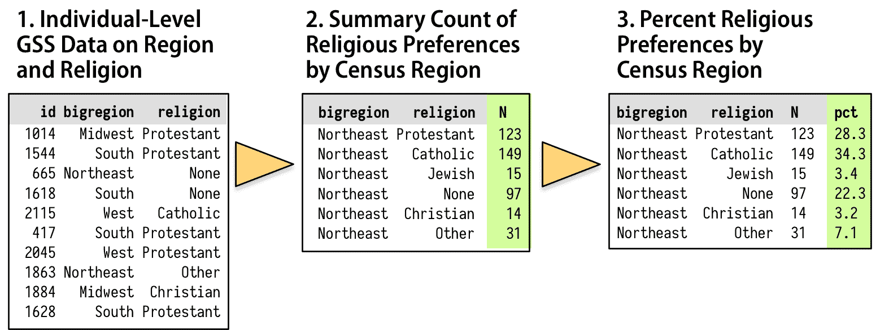

图 5.1：我们想要如何转换个人级数据。

如图 5.1 所示，我们将从大约 2,500 名 GSS 被调查者的个体级表格开始。然后我们想要将它们汇总到一个新的表格中，该表格显示了按地区分组的每种宗教偏好的计数。最后，我们将这些地区内的计数转换为百分比，分母是每个地区内受访者的总数。`dplyr` 库提供了一些工具，使这个过程变得简单且易于阅读。我们将使用一个特殊操作符 `%>%` 来完成我们的工作。这是 *管道* 操作符。它在图 5.1 中的作用类似于黄色三角形，它帮助我们执行从一张表到另一张表的转换操作。

我们一直在以 *累加* 的方式构建我们的图表，从一个 `ggplot` 对象开始，并添加新的元素。通过类比，将 `%>%` 操作符视为允许我们从数据框开始，执行一系列操作，将其转换成另一张表，通常是更小且更聚合的表。数据从管道的一侧进入，通过函数执行操作，结果从另一侧出来。管道通常是一系列操作，执行以下四件事情之一或多个：

+   *分组* 使用 `group_by()` 将数据分组到我们想要的汇总的嵌套结构中，例如“按地区划分的宗教”或“按出版物划分的作者按年份”。

+   *过滤* 使用 `filter()` 过滤行；`select()` 列或通过行、列或两者来 *选择* 数据的某些部分。这使我们能够得到我们想要工作的表格部分。

+   *转换* 使用 `mutate()` 通过在 *当前* 分组级别创建新变量来转换数据。这会在不聚合表格的情况下向表格中添加新列。

+   *汇总* 使用 `summarize()` 或聚合分组数据。这会在 *更高* 的分组级别创建新变量。例如，我们可能使用 `mean()` 计算平均值或使用 `n()` 计算计数。这会产生一个更小、更汇总的表格，如果我们想进行更多操作，我们可以使用它。

我们使用 `dplyr` 函数 `group_by()`、`filter()`、`select()`、`mutate()` 和 `summarize()` 在管道中执行这些任务。它们被编写成易于管道化的方式。也就是说，它们理解如何从管道操作符的左侧获取输入，并通过右侧传递结果。dplyr 文档中包含一些有用的示例，介绍了这些分组、过滤、选择和转换函数。Wickham & Grolemund (2016) 中对这些工具进行了更详细的讨论，并提供了许多更多示例。

我们将创建一个名为 `rel_by_region` 的新表格。以下是代码：

```r
rel_by_region <-  gss_sm %>%
 group_by(bigregion, religion) %>%
 summarize(N = n()) %>%
 mutate(freq = N /  sum(N),
 pct = round((freq*100), 0))
```

这些行在做什么？首先，我们像往常一样使用熟悉的赋值运算符`<-`创建一个对象。接下来，在右侧的步骤中。从左到右读取对象和函数，使用管道运算符“`%>%`”将它们连接起来，意味着“然后……”。左侧的对象“通过”管道，管道右侧指定的内容被应用于该对象。然后结果对象再次通过管道，依此类推，直到管道的末端。

从左到右阅读代码，它表示：

+   创建`rel_by_region <- gss_sm %>%`一个新的对象`rel_by_region`。它将获取以下一系列操作的成果：从`gss_sm`数据开始，然后

+   使用`group_by(bigregion, religion) %>%`对行进行按`bigregion`分组，并在其中按`religion`分组。

+   将此表`summarize(N = n()) %>%`汇总以创建一个新的、更小的表格，包含三列：`bigregion`、`religion`和一个新的汇总变量`N`，它是每个地区每个宗教群体内观测数的计数。

+   使用这个新表格，`mutate(freq = N / sum(N), pct = round((freq*100), 0))`使用`N`变量计算两个新的列：每个宗教类别的相对比例（`freq`）和百分比（`pct`），仍然按地区分组。将结果四舍五入到最接近的百分点。

在这种做事方式中，沿着管道传递的对象以及作用于它们的功能对其上下文有一些假设。首先，你不必始终指定你正在工作的底层数据框对象的名称。所有内容都隐式地从`gss_sm`传递而来。在管道内，从你的摘要和其他转换中创建的临时或隐式对象也会传递下去。

其次，`group_by()`函数设置了在`summarize()`步骤中如何处理分组或嵌套数据。在`summarize()`内创建新变量的任何函数，如`mean()`、`sd()`或`n()`，将首先应用于最内层的分组级别。分组级别从`group_by()`的外层到内层按从左到右命名。因此，函数调用`summarize(N = n())`计算`bigregion`内每个`religion`值的观测数，并将它们放入一个名为`N`的新变量中。从 dplyr 函数的角度来看，汇总操作一次“剥离”一个分组级别，因此生成的汇总是在下一个级别上。在这种情况下，我们以个体级别的观测值开始，并在地区内按宗教进行分组。`summarize()`操作将个体观测值聚合为每个地区每个宗教群体的观察人数。

第三，`mutate()`步骤使用`N`变量来创建`freq`，即每个区域内部子组的相对频率，最终转换为四舍五入的百分比`pct`。这些`mutate()`操作会在表中添加或删除列，但不会改变分组级别。

在`mutate()`和`summarize()`内部，我们能够以我们之前未见过的这种方式创建新变量。通常，当我们在一个函数内部看到类似`name = value`的语句时，`name`是一个通用的命名参数，函数期望我们从它那里获取关于特定值的信息。例如，在`aes(x = gdpPercap, y = lifeExp)`的情况下。通常，如果我们给一个函数一个它不认识的命名参数（如`aes(chuckles = year)`），它将忽略它、抱怨或崩溃。然而，使用`summarize()`和`mutate()`，我们可以发明命名参数。我们仍然在将特定值分配给`N`、`freq`和`pct`，但我们也在选择名称。这些名称是新创建的汇总表变量的名称。`summarize()`和`mutate()`函数不需要提前知道它们将是什么。

最后，当我们使用`mutate()`创建`freq`变量时，不仅可以在函数内部指定该名称，`mutate()`还足够聪明，允许我们在同一函数调用的下一行立即使用该名称来创建`pct`变量。这意味着我们不需要为每个新创建的变量重复编写单独的`mutate()`调用。

我们的流程将`gss_sm`数据框（包含 2867 行和 32 列）转换成`rel_by_region`，这是一个包含 24 行和 5 列的汇总表，部分如下所示：

```r
rel_by_region
```

```r
## # A tibble: 24 x 5
## # Groups:   bigregion [4]
##    bigregion religion       N    freq   pct
##    <fct>     <fct>      <int>   <dbl> <dbl>
##  1 Northeast Protestant   158 0.324   32.0 
##  2 Northeast Catholic     162 0.332   33.0 
##  3 Northeast Jewish        27 0.0553   6.00
##  4 Northeast None         112 0.230   23.0 
##  5 Northeast Other         28 0.0574   6.00
##  6 Northeast <NA>           1 0.00205  0   
##  7 Midwest   Protestant   325 0.468   47.0 
##  8 Midwest   Catholic     172 0.247   25.0 
##  9 Midwest   Jewish         3 0.00432  0   
## 10 Midwest   None         157 0.226   23.0 
## # ... with 14 more rows
```

在`group_by()`中指定的变量保留在新汇总表中；使用`summarize()`和`mutate()`创建的变量被添加，而原始数据集中的所有其他变量都被删除。

我们之前说过，在尝试理解`ggplot()`序列中的每个附加步骤的作用时，逆向工作，一次移除一个部分，看看当该步骤不包括时图表看起来如何，可能会有所帮助。同样，在查看管道代码时，从行的末尾开始，一次移除一个“`%>%`”步骤，看看结果中间对象看起来如何，可能会有所帮助。例如，如果我们从上面的代码中移除`mutate()`步骤会怎样？`rel_by_region`看起来会怎样？如果我们移除`summarize()`步骤呢？每一步返回的表有多大？它处于什么分组级别？添加或删除了哪些变量？

不需要在对数据进行显示前的顺序聚合和转换的图表通常可以直接在 ggplot 中编写，因为布局的细节是由映射变量和层叠几何的组合来处理的。对数据进行一步过滤或聚合（如计算比例或特定观察子集）也很直接。但是，当我们想要显示的结果与数据相隔几个步骤，尤其是当我们想要对表格进行分组或聚合并在绘制任何内容之前进行一些计算时，使用 dplyr 的工具来首先生成这些汇总表是有意义的。即使也可以在`ggplot()`调用内完成，这也是正确的。除了使我们的代码更容易阅读外，它还让我们更容易对我们的结果进行合理性检查，以确保我们以正确的顺序对事物进行了分组和汇总。例如，如果我们正确地使用了`rel_by_region`，与`religion`相关的`pct`值在每个区域内应该总和为 100，可能有一些舍入误差。我们可以使用一个非常短的管道快速检查这一点：

```r
rel_by_region %>%  group_by(bigregion) %>%
 summarize(total = sum(pct))
```

```r
## # A tibble: 4 x 2
##   bigregion total
##   <fct>     <dbl>
## 1 Northeast   100
## 2 Midwest     101
## 3 South       100
## 4 West        101
```

这看起来不错。像之前一样，现在我们直接在汇总表中使用百分比值，我们可以使用`geom_col()`而不是`geom_bar()`。

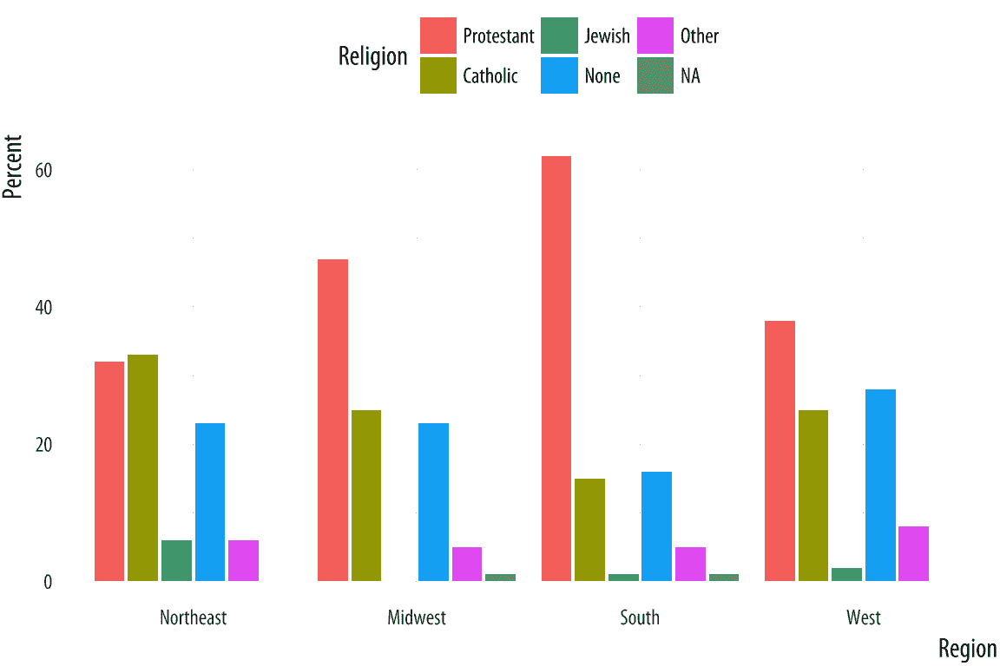 图 5.2：按地区划分的宗教偏好。

```r
p <-  ggplot(rel_by_region, aes(x = bigregion, y = pct, fill = religion))
p +  geom_col(position = "dodge2") +
 labs(x = "Region",y = "Percent", fill = "Religion") +
 theme(legend.position = "top")
```

我们在这里使用了一个不同的`position`参数，`dodge2`而不是`dodge`。这使条形并排放置。当处理`geom_col()`中的预计算值时，默认的`position`是制作一个成比例堆叠的柱状图。如果你使用`dodge`，它们将在列内堆叠，但结果将读起来不正确。使用`dodge2`将子类别（宗教归属）在组（地区）内并排放置。

此条形图中的数值是图 4.10 中堆叠计数百分比等价。宗教归属在区域内总和为 100%。问题是，尽管我们现在知道如何干净地生成频率表，但这仍然是一个糟糕的图表。它太拥挤了，有很多条形并排在一起。我们可以做得更好。

通常情况下，跳过图表可以更清晰地表达为分面图。这样可以消除对图例的需求，从而使图表更易于阅读。我们还引入了一个新功能。如果我们把宗教映射到 x 轴，标签将重叠并变得难以辨认。手动调整刻度标签以使其以角度打印是可能的，但这也不容易阅读。将宗教放在 y 轴上，百分比得分放在 x 轴上更有意义。由于`geom_bar()`内部的工作方式，简单地交换`x`和`y`映射将不起作用。（试一试看看会发生什么。）我们采取的做法是转换结果所绘制的*坐标系*，使 x 轴和 y 轴颠倒。我们使用`coord_flip()`来实现这一点。

```r
p <-  ggplot(rel_by_region, aes(x = religion, y = pct, fill = religion))
p +  geom_col(position = "dodge2") +
 labs(x = NULL, y = "Percent", fill = "Religion") +
 guides(fill = FALSE) + 
 coord_flip() + 
 facet_grid(~  bigregion)
```

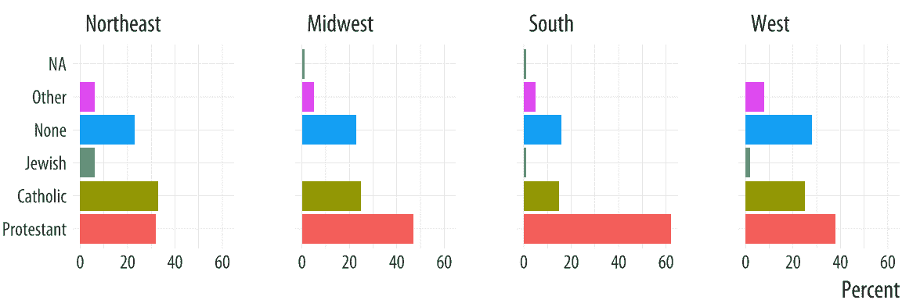

图 5.3：按地区划分的宗教偏好，分面版本。

对于大多数图表，坐标系是笛卡尔坐标系，在由 x 轴和 y 轴定义的平面上显示图表。`coord_cartesian()`函数管理这一点，但我们不需要调用它。`coord_flip()`函数在绘制图表后切换 x 轴和 y 轴。它不会重新映射变量到美学。在这种情况下，`religion`仍然映射到`x`，`pct`映射到`y`。由于宗教名称不需要轴标签就能理解，我们在`labs()`调用中设置`x = NULL`。

我们将在稍后看到 dplyr 的分组和过滤操作能做什么。它是一个灵活且强大的框架。现在，将其视为一种快速总结数据表的方法，而无需在我们的`ggplot()`或`geom_`函数的主体中编写代码。

## 5.2 按组或类别划分的连续变量

让我们转到一个新的数据集，即`organdata`表。就像`gapminder`一样，它具有国家-年份结构。它包含 17 个经合组织国家器官移植捐赠信息超过十年的数据。器官采购率是衡量用于移植手术的遗体器官捐赠者获得的人体器官数量的指标。除了捐赠数据外，该数据集还包含各种数值人口统计指标，以及健康和福利政策与法律的几个分类指标。与`gapminder`数据不同，一些观测值缺失。这些观测值被指定为`NA`，这是 R 中缺失数据的标准代码。`organdata`表包含在`socviz`库中。加载它并快速查看。这次我们不用`head()`，为了变化，我们将创建一个简短的管道来选择数据集的前六列，然后使用名为`sample_n()`的函数随机选择五行。这个函数有两个主要参数。首先，我们提供我们想要从中抽取数据的表格。因为我们使用的是管道，所以这隐式地从管道的开始传递下来。然后我们提供我们想要抽取的抽取次数。在`select()`中使用这种方式选择数字，可以选择数据框的编号列。你也可以直接选择变量名。

```r
organdata %>%  select(1:6) %>%  sample_n(size = 10)
```

```r
## # A tibble: 10 x 6
##    country        year       donors   pop pop_dens   gdp
##    <chr>          <date>      <dbl> <int>    <dbl> <int>
##  1 Switzerland    NA           NA      NA    NA       NA
##  2 Switzerland    1997-01-01   14.3  7089    17.2  27675
##  3 United Kingdom 1997-01-01   13.4 58283    24.0  22442
##  4 Sweden         NA           NA    8559     1.90 18660
##  5 Ireland        2002-01-01   21.0  3932     5.60 32571
##  6 Germany        1998-01-01   13.4 82047    23.0  23283
##  7 Italy          NA           NA   56719    18.8  17430
##  8 Italy          2001-01-01   17.1 57894    19.2  25359
##  9 France         1998-01-01   16.5 58398    10.6  24044
## 10 Spain          1995-01-01   27.0 39223     7.75 15720
```

让我们先天真地绘制一些数据。我们可以查看捐赠者与年份的散点图。

 图 5.4：信息量不大。

```r
p <-  ggplot(data = organdata,
 mapping = aes(x = year, y = donors))
p +  geom_point()
```

```r
## Warning: Removed 34 rows containing missing values
## (geom_point).
```

ggplot 发出了一条关于缺失值的警告。从现在起，我们将抑制此警告，以免输出混乱，但一般来说，阅读和理解 R 给出的警告是明智的，即使代码看起来运行正常。如果有大量警告，R 将收集它们，并邀请你使用`warnings()`函数查看它们。

我们可以使用`geom_line()`来绘制每个国家的时间序列，就像我们在 gapminder 数据中做的那样。要做到这一点，记住，我们需要告诉 ggplot 分组变量是什么。这次我们也可以按国家分面图，因为我们没有太多国家。

 图 5.5：一个分面线图。

```r
p <-  ggplot(data = organdata,
 mapping = aes(x = year, y = donors))
p +  geom_line(aes(group = country)) +  facet_wrap(~  country)
```

默认情况下，分面图是按国家字母顺序排序的。我们将稍后展示如何更改这一点。

让我们专注于国家层面的变化，但不要关注时间趋势。我们可以使用`geom_boxplot()`来获取各国按年份变化的分布图。就像`geom_bar()`默认情况下根据你映射到`x`的类别计算观测值的计数一样，与`geom_boxplot()`一起工作的`stat_boxplot()`函数将计算一些统计量，这些统计量允许绘制箱线和胡须。我们告诉`geom_boxplot()`我们想要按什么变量分类（在这里，`country`）和想要总结的连续变量（在这里，`donors`）

 图 5.6：按国家尝试的第一次箱线图。

```r
p <-  ggplot(data = organdata,
 mapping = aes(x = country, y = donors))
p +  geom_boxplot()
```

箱线图看起来很有趣，但有两个问题可以解决。首先，正如我们在上一章中看到的，在 x 轴上有国家名称是不方便的，因为标签会重叠。我们再次使用`coord_flip()`来切换轴（但不切换映射）。

 图 5.7：将国家移动到 y 轴。

```r
p <-  ggplot(data = organdata,
 mapping = aes(x = country, y = donors))
p +  geom_boxplot() +  coord_flip()
```

这样看起来更易读，但仍然不是理想的。我们通常希望我们的图表以某种有意义的方式呈现数据。一个明显的方法是将国家按平均捐赠率从高到低列出。我们通过按`donors`的平均值重新排序`country`变量来实现这一点。`reorder()`函数会为我们完成这项工作。它需要两个必需的参数。第一个是我们想要重新排序的分类变量或因子。在这种情况下，那就是`country`。第二个是我们想要按其重新排序的变量。这里就是捐赠率，`donors`。`reorder()`的第三个和可选参数是你想要用作汇总统计函数的函数。如果你只给`reorder()`提供前两个必需参数，那么默认情况下，它将按第二个变量的平均值重新排序第一个变量的类别。你可以命名任何合理的函数来重新排序分类变量（例如，`median`或`sd`）。还有一个额外的细节。在 R 中，如果变量中有缺失值，默认的`mean`函数将因错误而失败。你必须说明在计算平均值时可以删除缺失值。这是通过向`reorder()`提供`na.rm=TRUE`参数来完成的，该参数内部将此参数传递给`mean()`。我们正在重新排序映射到`x`美学的变量，因此我们在代码中使用`reorder()`：

```r
p <-  ggplot(data = organdata,
 mapping = aes(x = reorder(country, donors, na.rm=TRUE),
 y = donors))
p +  geom_boxplot() +
 labs(x=NULL) +
 coord_flip()
```

 图 5.8：按平均捐赠率重新排序的箱线图。

因为国家名称很明显，在`labs()`调用中，我们将它们的轴标签设置为空，使用`labs(x=NULL)`。Ggplot 提供了基本的箱线图的一些变体，包括小提琴图。尝试使用`geom_violin()`。还有许多参数可以控制箱子和胡须的更精细的细节，包括它们的宽度。箱线图也可以像其他几何对象一样接受`color`和`fill`美学映射。

```r
p <-  ggplot(data = organdata,
 mapping = aes(x = reorder(country, donors, na.rm=TRUE),
 y = donors, fill = world))
p +  geom_boxplot() +  labs(x=NULL) +
 coord_flip() +  theme(legend.position = "top")
```

图 5.9：一个将填充美学映射到箱线图上的箱线图。


将分类变量放在 y 轴上以比较它们的分布是一个非常实用的技巧。这使得在更多类别上有效地展示总结数据变得容易。这些图可以相当紧凑，并且可以通过行来容纳相对大量的案例。这种方法的优势在于将比较的变量放在 x 轴上，这有时会使得跨类别比较更容易。如果每个类别中的观察值数量相对较小，我们可以跳过（或补充）箱线图，并显示个别观察值。在下一个例子中，我们将 `world` 变量映射到 `color` 而不是 `fill`，因为默认的 `geom_point()` 图形形状有一个颜色属性，但没有填充属性。

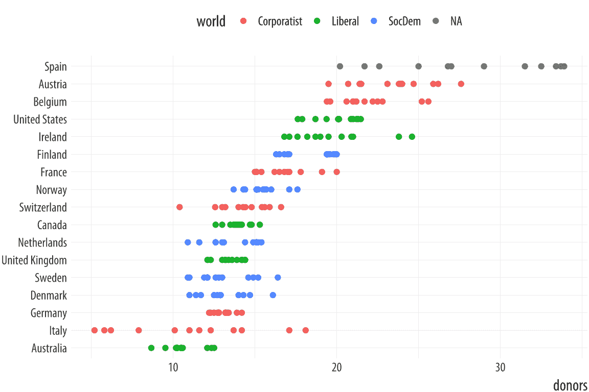 图 5.10：使用点而不是箱线图。

```r
p <-  ggplot(data = organdata,
 mapping = aes(x = reorder(country, donors, na.rm=TRUE),
 y = donors, color = world))
p +  geom_point() +  labs(x=NULL) +
 coord_flip() +  theme(legend.position = "top")
```

当我们像这样使用 `geom_point()` 时，观察值会有一些重叠。在这些情况下，稍微扰动一下数据可能会有助于更好地了解在不同值上有多少观察值。我们使用 `geom_jitter()` 来做这件事。这个 geom 与 `geom_point()` 非常相似，但它会随机将每个观察值微调一小段距离。

 图 5.11：抖动点。

```r
p <-  ggplot(data = organdata,
 mapping = aes(x = reorder(country, donors, na.rm=TRUE),
 y = donors, color = world))
p +  geom_jitter() +  labs(x=NULL) +
 coord_flip() +  theme(legend.position = "top")
```

默认的抖动量对于我们的目的来说有点太多。我们可以通过在 geom 中的 `position_jitter()` 函数中使用 `height` 和 `width` 参数来控制它。因为我们在这里制作的是一维总结，所以我们只需要 `width`。你能看出我们为什么没有使用 `height` 吗？如果不能，试着做一下，看看会发生什么。

```r
p <-  ggplot(data = organdata,
 mapping = aes(x = reorder(country, donors, na.rm=TRUE),
 y = donors, color = world))
p +  geom_jitter(position = position_jitter(width=0.15)) +
 labs(x=NULL) +  coord_flip() +  theme(legend.position = "top")
```

图 5.12：一个抖动图。

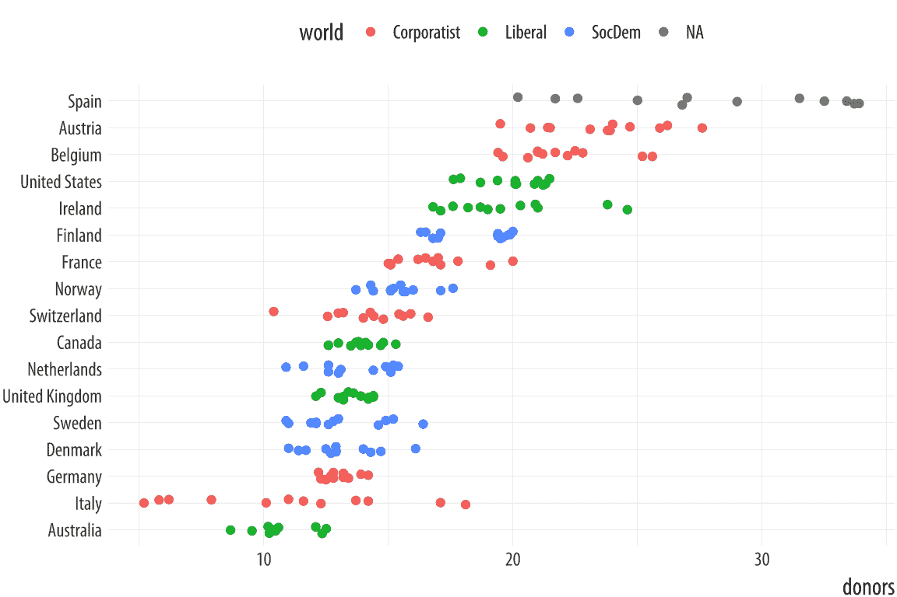

当我们想要总结一个每个类别只有一个点的分类变量时，我们也应该使用这种方法。结果将是一个克利夫兰点图，这是一种简单且极其有效的数据展示方法，通常比条形图或表格都要好。例如，我们可以制作一个平均捐赠率的克利夫兰点图。

这也给了我们另一个机会使用 dplyr 管道进行一些数据整理。我们将使用一个管道来将较大的国家-年数据框聚合到一个较小的按国家汇总统计的表中。完成这个任务的方法不止一种。我们可以选择我们想要汇总的变量，然后反复使用 `mean()` 和 `sd()` 函数来计算我们想要的变量的平均值和标准差。我们再次使用管道操作符 `%>%` 来完成我们的工作：

```r
by_country <-  organdata %>%  group_by(consent_law, country) %>%
 summarize(donors_mean= mean(donors, na.rm = TRUE),
 donors_sd = sd(donors, na.rm = TRUE),
 gdp_mean = mean(gdp, na.rm = TRUE),
 health_mean = mean(health, na.rm = TRUE),
 roads_mean = mean(roads, na.rm = TRUE),
 cerebvas_mean = mean(cerebvas, na.rm = TRUE))
```

管道由两个步骤组成。首先，我们按 `consent_law` 和 `country` 对数据进行分组，然后使用 `summarize()` 创建六个新变量，每个变量都是每个国家在原始 `organdata` 数据框中相应变量的平均值或标准差。为了获得不同的视角，在分组语句中将 `country` 改为 `year`，看看会发生什么。

如同往常，`summarize()` 步骤将继承有关原始数据和分组的信息，然后在最内层的分组级别上进行计算。在这种情况下，它为每个国家取所有观测值，并按请求计算平均值或标准差。以下是结果对象的外观：

```r
by_country
```

```r
## # A tibble: 17 x 8
## # Groups:   consent_law [?]
##    consent_law country        donors_mean donors_sd gdp_mean health_mean roads_mean cerebvas_mean
##    <chr>       <chr>                <dbl>     <dbl>    <dbl>       <dbl>      <dbl>         <dbl>
##  1 Informed    Australia             10.6     1.14     22179        1958      105             558
##  2 Informed    Canada                14.0     0.751    23711        2272      109             422
##  3 Informed    Denmark               13.1     1.47     23722        2054      102             641
##  4 Informed    Germany               13.0     0.611    22163        2349      113             707
##  5 Informed    Ireland               19.8     2.48     20824        1480      118             705
##  6 Informed    Netherlands           13.7     1.55     23013        1993       76.1           585
##  7 Informed    United Kingdom        13.5     0.775    21359        1561       67.9           708
##  8 Informed    United States         20.0     1.33     29212        3988      155             444
##  9 Presumed    Austria               23.5     2.42     23876        1875      150             769
## 10 Presumed    Belgium               21.9     1.94     22500        1958      155             594
## 11 Presumed    Finland               18.4     1.53     21019        1615       93.6           771
## 12 Presumed    France                16.8     1.60     22603        2160      156             433
## 13 Presumed    Italy                 11.1     4.28     21554        1757      122             712
## 14 Presumed    Norway                15.4     1.11     26448        2217       70.0           662
## 15 Presumed    Spain                 28.1     4.96     16933        1289      161             655
## 16 Presumed    Sweden                13.1     1.75     22415        1951       72.3           595
## 17 Presumed    Switzerland           14.2     1.71     27233        2776       96.4           424
```

和之前一样，`group_by()` 中指定的变量保留在新数据框中，使用 `summarize()` 创建的变量被添加，原始数据中的所有其他变量都被删除。国家也在 `consent_law` 中按字母顺序汇总，这是管道开始时 `group_by()` 语句中最外层的分组变量。

以这种方式使用我们的管道是合理的，但代码值得再次审视。一方面，我们必须反复输入 `mean()` 和 `sd()` 函数的名称，并且每次都要为每个函数提供我们想要汇总的变量的名称以及 `na.rm = TRUE` 参数，以确保函数不会对缺失值发出抱怨。我们同样反复以相同的方式命名我们的新汇总变量，即在原始变量名称的末尾添加 `_mean` 或 `_sd`。如果我们想计算 `organdata` 中所有数值变量的平均值和标准差，我们的代码将会更长。此外，在这个版本中，我们失去了我们未按其分组的其他时间不变的分类变量，例如 `world`。当我们看到代码中这种重复的操作时，我们可以问自己是否有更好的处理方式。

确实有。我们想要做的是将 `mean()` 和 `sd()` 函数应用于 `organdata` 中的每个数值变量，但**仅**是数值变量。然后我们希望以一致的方式命名结果，并返回一个包括所有分类变量（如 `world`）的汇总表。我们可以使用一点 R 的函数式编程能力来创建一个更好的 `by_country` 对象版本。以下是代码：

```r
by_country <-  organdata %>%  group_by(consent_law, country) %>%
 summarize_if(is.numeric, funs(mean, sd), na.rm = TRUE) %>%
 ungroup()
```

管道开始的方式和之前一样，先取 `organdata`，然后按 `consent_law` 和 `country` 进行分组。然而，在下一步中，我们不是手动取变量子集的均值和标准差，而是使用 `summarize_if()` 函数。正如其名称所暗示的，它检查我们数据中的每一列，并对它进行测试。只有当测试通过时，即返回值为 `TRUE` 时，它才会进行汇总。我们不需要在 `summarize_if()` 内部命名函数时使用括号。这里的测试是函数 `is.numeric()`，它检查一个向量是否是数值值。如果是，那么 `summarize_if()` 将应用我们想要的汇总函数或函数到 `organdata`。因为我们同时取均值和标准差，所以我们使用 `funs()` 列出我们想要使用的函数。并且我们以 `na.rm = TRUE` 参数结束，这个参数将被传递给 `mean()` 和 `sd()` 的每次使用。在管道的最后一步中，我们 `ungroup()` 数据，有时绘图函数会混淆分组 tibbles，其中我们没有在图中明确使用组，所以结果是普通的 tibble。

这是管道返回的内容：

```r
by_country 
```

```r
## # A tibble: 17 x 28
##    consent_law country        donors_mean pop_mean pop_dens_mean gdp_mean gdp_lag_mean health_mean
##    <chr>       <chr>                <dbl>    <dbl>         <dbl>    <dbl>        <dbl>       <dbl>
##  1 Informed    Australia             10.6    18318         0.237    22179        21779        1958
##  2 Informed    Canada                14.0    29608         0.297    23711        23353        2272
##  3 Informed    Denmark               13.1     5257        12.2      23722        23275        2054
##  4 Informed    Germany               13.0    80255        22.5      22163        21938        2349
##  5 Informed    Ireland               19.8     3674         5.23     20824        20154        1480
##  6 Informed    Netherlands           13.7    15548        37.4      23013        22554        1993
##  7 Informed    United Kingdom        13.5    58187        24.0      21359        20962        1561
##  8 Informed    United States         20.0   269330         2.80     29212        28699        3988
##  9 Presumed    Austria               23.5     7927         9.45     23876        23415        1875
## 10 Presumed    Belgium               21.9    10153        30.7      22500        22096        1958
## 11 Presumed    Finland               18.4     5112         1.51     21019        20763        1615
## 12 Presumed    France                16.8    58056        10.5      22603        22211        2160
## 13 Presumed    Italy                 11.1    57360        19.0      21554        21195        1757
## 14 Presumed    Norway                15.4     4386         1.35     26448        25769        2217
## 15 Presumed    Spain                 28.1    39666         7.84     16933        16584        1289
## 16 Presumed    Sweden                13.1     8789         1.95     22415        22094        1951
## 17 Presumed    Switzerland           14.2     7037        17.0      27233        26931        2776
## # ... with 20 more variables: health_lag_mean <dbl>, pubhealth_mean <dbl>, roads_mean <dbl>,
## #   cerebvas_mean <dbl>, assault_mean <dbl>, external_mean <dbl>, txp_pop_mean <dbl>,
## #   donors_sd <dbl>, pop_sd <dbl>, pop_dens_sd <dbl>, gdp_sd <dbl>, gdp_lag_sd <dbl>,
## #   health_sd <dbl>, health_lag_sd <dbl>, pubhealth_sd <dbl>, roads_sd <dbl>, cerebvas_sd <dbl>,
## #   assault_sd <dbl>, external_sd <dbl>, txp_pop_sd <dbl>
```

所有数值变量都已汇总。它们使用原始变量名，并附加函数名来命名：`donors_mean` 和 `donors_sd` 等。这是一种快速以各种方式转换我们数据的紧凑方式。有一系列 `summarize_` 函数用于各种任务，以及一组互补的 `mutate_` 函数，用于当我们想要向数据中添加列而不是聚合它时。

通过按国家汇总我们的数据，我们可以使用 `geom_point()` 绘制散点图。让我们也根据每个国家的同意法来着色结果。

 图 5.13：克利夫兰散点图，带有彩色点。

```r
p <-  ggplot(data = by_country,
 mapping = aes(x = donors_mean, y = reorder(country, donors_mean),
 color = consent_law))
p +  geom_point(size=3) +
 labs(x = "Donor Procurement Rate",
 y = "", color = "Consent Law") +
 theme(legend.position="top")
```

或者，如果我们愿意，我们可以使用面版而不是着色点。使用 `facet_wrap()`，我们可以将 `consent_law` 变量拆分为两个面板，然后在每个面板内按捐赠率对国家进行排名。因为我们 y 轴上有一个分类变量，有两个值得注意的细节。首先，如果我们让 `facet_wrap()` 保持默认设置，面板将并排绘制。这将使得比较同一尺度上的两组变得困难。相反，图表将从左到右读取，这并不有用。为了避免这种情况，我们将通过说我们只想有一个列来让面板一个接一个地出现。这是 `ncol=1` 参数。其次，再次因为我们在 y 轴上有一个分类变量，默认的面版图将在两个面板的 y 轴上显示每个国家的名称。（如果 y 轴是一个连续变量，这将是我们想要的。）在这种情况下，每个面板的每一行中只有一半的行会有点。

为了避免这种情况，我们允许 y 轴的刻度是自由的。这是 `scales="free_y"` 参数。同样，对于具有两个连续变量的分面图，我们通常不希望刻度是自由的，因为这允许每个面板的 x 或 y 轴仅根据该面板内部的数据范围变化，而不是整个数据集的范围。通常，小多倍分面图的目的是能够在面板之间进行比较。这意味着自由刻度通常不是一个好主意，因为每个面板都得到自己的 x 或 y 轴范围，这破坏了可比性。但是，当一个轴是分类的，就像这里一样，我们可以使分类轴自由，而将连续轴固定。结果是每个面板共享相同的 x 轴，并且它们之间很容易进行比较。

 图 5.14：一个具有自由 y 轴刻度的分面点图。

```r
p <-  ggplot(data = by_country,
 mapping = aes(x = donors_mean,
 y = reorder(country, donors_mean)))

p +  geom_point(size=3) +
 facet_wrap(~  consent_law, scales = "free_y", ncol = 1) +
 labs(x= "Donor Procurement Rate",
 y= "") 
```

克利夫兰点图通常比条形图或柱状图更受欢迎。在制作它们时，将类别放在 y 轴上，并按与您提供的数值摘要最相关的顺序排列。这种图表也是总结模型结果或任何带有误差范围的数据的绝佳方式。我们使用 `geom_point()` 来绘制点图。有一个名为 `geom_dotplot()` 的几何对象，但它旨在生成不同类型的图形。它是一种直方图，通过将单个观测值表示为点，并将这些点堆叠在一起以显示它们的数量。

克利夫兰风格的点图可以扩展到我们需要在图中包含一些关于方差或误差信息的情形。使用 `geom_pointrange()`，我们可以告诉 ggplot 显示一个点估计及其周围的范围。在这里，我们将使用我们上面计算出的捐赠率的平均值的标准差。但这也是以自然的方式呈现，例如，带有置信区间的模型系数估计的方法。使用 `geom_pointrange()`，我们像往常一样映射 `x` 和 `y` 变量，但该函数需要比 `geom_point()` 更多一点的信息。它需要知道在点两侧绘制线的范围，由 `ymax` 和 `ymin` 参数定义。这是由 y 值（捐赠者平均值）加上或减去其标准差（捐赠者标准差）给出的。如果一个函数参数期望一个数字，你可以给它一个数学表达式，该表达式解析为所需的数字。R 会为你计算结果。

```r
p <-  ggplot(data = by_country, mapping = aes(x = reorder(country,
 donors_mean), y = donors_mean))

p +  geom_pointrange(mapping = aes(ymin = donors_mean -  donors_sd,
 ymax = donors_mean +  donors_sd)) +
 labs(x= "", y= "Donor Procurement Rate") +  coord_flip()
```

图 5.15：一个点-须图，其范围由测量变量的标准差定义。

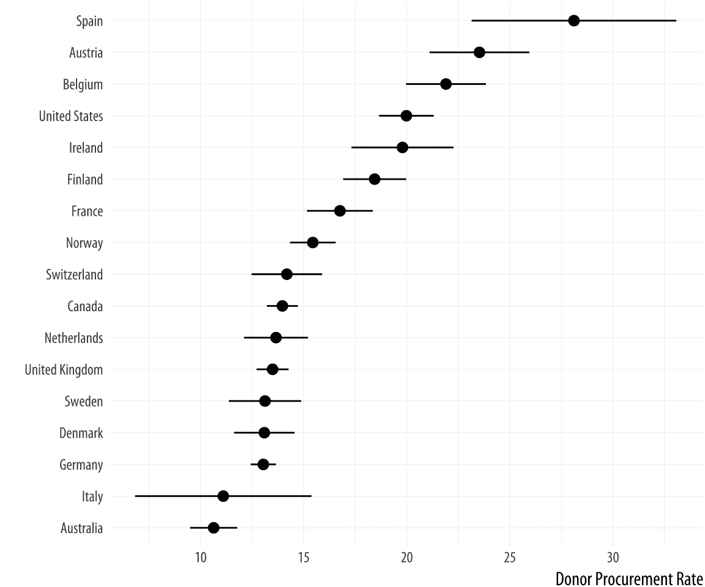

因为 `geom_pointrange()` 期望 `y`、`ymin` 和 `ymax` 作为参数，所以我们把 `donors_mean` 映射到 `y`，把 `ccode` 变量映射到 `x`，然后在最后使用 `coord_flip()` 翻转坐标轴。

## 5.3 直接绘制图表文本

有时在散点图中将标签与点一起绘制，或者直接绘制信息标签，这可能会很有用。我们可以使用`geom_text()`来实现这一点。

 图 5.16：绘制标签和文本。

```r
p <-  ggplot(data = by_country,
 mapping = aes(x = roads_mean, y = donors_mean))
p +  geom_point() +  geom_text(mapping = aes(label = country))
```

文本直接绘制在点上方，因为它们都使用相同的 x 和 y 映射进行定位。处理这个问题的一种方法，通常是最有效的方法，如果我们不太担心图形中的过度精确，就是通过从图中删除`geom_point()`来移除点。第二种选择是调整文本的位置。我们可以使用`geom_text()`的`hjust`参数来左对齐或右对齐标签。将`hjust=0`设置为左对齐标签，而`hjust=1`将右对齐它。

```r
p <-  ggplot(data = by_country,
 mapping = aes(x = roads_mean, y = donors_mean))

p +  geom_point() +  geom_text(mapping = aes(label = country), hjust = 0)
```

你可能会想尝试不同的`hjust`值来微调你的标签。但这并不是一个稳健的方法。它通常会失败，因为空间是按标签长度成比例增加的。结果是，较长的标签会移动到比预期更远的位置。有其他方法可以解决这个问题，但它们会引入其他问题。

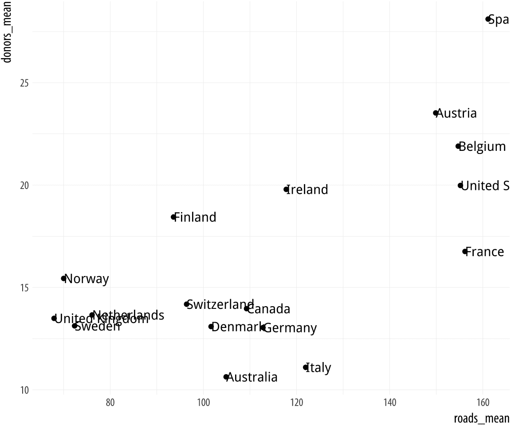 图 5.17：绘制点和文本标签，并进行水平位置调整。

我们不再与`geom_text()`纠缠，而是使用`ggrepel`。这个非常有用的库为 ggplot 添加了一些新的几何对象。正如`ggplot`扩展了 R 的绘图功能一样，有许多小型库通过提供一些新的`geom`类型来扩展`ggplot`的功能。`ggrepel`库提供了`geom_text_repel()`和`geom_label_repel()`，这两种几何对象可以比默认的`geom_text()`更灵活地选择标签。首先，确保库已安装，然后以通常的方式加载它：

```r
library(ggrepel)
```

我们将使用`geom_text_repel()`而不是`geom_text()`。为了展示`geom_text_repel()`的一些功能，我们将切换数据集，并使用`socviz`库中提供的一些历史美国总统选举数据进行分析。

```r
elections_historic %>%  select(2:7) 
```

```r
## # A tibble: 49 x 6
##     year winner                 win_party ec_pct popular_pct popular_margin
##    <int> <chr>                  <chr>      <dbl>       <dbl>          <dbl>
##  1  1824 John Quincy Adams      D.-R.      0.322       0.309        -0.104 
##  2  1828 Andrew Jackson         Dem.       0.682       0.559         0.122 
##  3  1832 Andrew Jackson         Dem.       0.766       0.547         0.178 
##  4  1836 Martin Van Buren       Dem.       0.578       0.508         0.142 
##  5  1840 William Henry Harrison Whig       0.796       0.529         0.0605
##  6  1844 James Polk             Dem.       0.618       0.495         0.0145
##  7  1848 Zachary Taylor         Whig       0.562       0.473         0.0479
##  8  1852 Franklin Pierce        Dem.       0.858       0.508         0.0695
##  9  1856 James Buchanan         Dem.       0.588       0.453         0.122 
## 10  1860 Abraham Lincoln        Rep.       0.594       0.396         0.101 
## # ... with 39 more rows
```

```r
p_title <- "Presidential Elections: Popular & Electoral College Margins"
p_subtitle <- "1824-2016"
p_caption <- "Data for 2016 are provisional."
x_label <- "Winner's share of Popular Vote"
y_label <- "Winner's share of Electoral College Votes"

p <-  ggplot(elections_historic, aes(x = popular_pct, y = ec_pct,
 label = winner_label))

p +  geom_hline(yintercept = 0.5, size = 1.4, color = "gray80") +
 geom_vline(xintercept = 0.5, size = 1.4, color = "gray80") +
 geom_point() +
 geom_text_repel() +
 scale_x_continuous(labels = scales::percent) +
 scale_y_continuous(labels = scales::percent) +
 labs(x = x_label, y = y_label, title = p_title, subtitle = p_subtitle,
 caption = p_caption)
```

图 5.18 显示了自 1824 年（首次记录普选投票规模的那一年）以来的每一届美国总统选举，并绘制了获胜者的普选票份额与获胜者的选举人团投票份额。这些份额在数据中作为比例（从 0 到 1）存储，而不是百分比，因此我们需要使用 `scale_x_continuous()` 和 `scale_y_continuous()` 调整刻度标签。鉴于我们对特定的总统任期感兴趣，我们还想标记这些点。但通常来说，像我们在这里做的那样在图表上标记每个点并不是一个好主意。一个更好的方法可能是选择一些特别感兴趣的点。因为许多数据点绘制得相当接近，我们需要确保标签之间不重叠，或者不遮挡其他点。`geom_text_repel()` 函数很好地处理了这个问题。这个图表有相当长的标签。我们本可以直接将它们放入代码中，但为了使事情更整洁，我们将其分配给一些命名的对象。然后我们在绘图公式中使用这些对象。

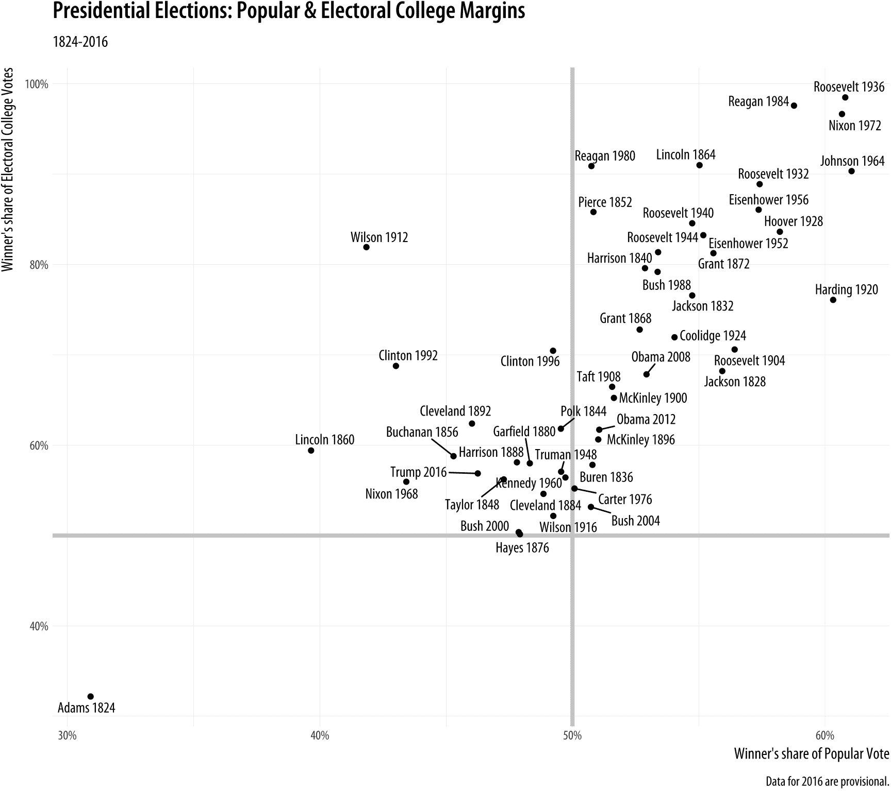

图 5.18：使用 ggrepel 的文本标签。

在这个图表中，任何特定点的有趣之处在于它所在的 x-y 平面的象限，以及它距离 x 轴（以得票率份额）和 y 轴（以选举人团投票份额）上的百分之五十阈值有多远。为了强调这一点，我们在每个方向上的百分之五十线上画了两条参考线。它们在绘图过程的开始时画出，以便点标签可以叠加在上面。我们使用两个新的几何形状，`geom_hline()` 和 `geom_vline()` 来画线。它们分别接受 `yintercept` 和 `xintercept` 参数，并且线也可以根据您的喜好调整大小和颜色。还有一个 `geom_abline()` 几何形状，它根据提供的斜率和截距绘制直线。这在绘制散点图中的 45 度参考线时非常有用。

ggrepel 包含其他几个有用的几何形状和选项，有助于有效地在点旁边绘制标签。其标签算法的性能始终非常好。对于许多用途来说，它将比 `geom_text()` 更好的第一个选择。

## 5.4 标记异常值

有时我们想要在数据中挑选出一些感兴趣的点，而不需要对每个单独的项目进行标记。我们仍然可以使用 `geom_text()` 或 `geom_text_repel()`。我们只需要挑选出我们想要标记的点。在上面的代码中，我们通过告诉 `geom_text_repel()` 使用与 `geom_point()` 不同的数据集来实现这一点。我们使用 `subset()` 函数来完成这个操作。

 图 5.19：顶部：根据单个标准标注文本。底部：根据多个标准标注。

```r
p <-  ggplot(data = by_country,
 mapping = aes(x = gdp_mean, y = health_mean))

p +  geom_point() +
 geom_text_repel(data = subset(by_country, gdp_mean >  25000),
 mapping = aes(label = country))

p <-  ggplot(data = by_country,
 mapping = aes(x = gdp_mean, y = health_mean))

p +  geom_point() +
 geom_text_repel(data = subset(by_country,
 gdp_mean >  25000 |  health_mean <  1500 |
 country %in% "Belgium"),
 mapping = aes(label = country))
```

在第一幅图中，我们指定了文本几何的新`data`参数，并使用`subset()`动态创建了一个小数据集。`subset()`函数接受`by_country`对象，并仅选择`gdp_mean`超过 25,000 的案例，结果是在图中仅标注了这些点。我们使用的标准可以是任何我们喜欢的，只要我们能编写一个定义它的逻辑表达式。例如，在下面的图中，我们挑选出`gdp_mean`大于 25,000、*或者*`health_mean`小于 1,500、*或者*国家是比利时的案例。在所有这些图中，因为我们使用了`geom_text_repel()`，所以我们不再需要担心之前国家标签被图边缘裁剪的问题。

或者，我们可以通过在数据集中创建一个仅为此目的的虚拟变量来挑选出特定的点。在这里，我们在`organdata`中添加了一个名为`ind`的列。如果一个观察值被编码为`TRUE`，那么`ccode`是“Ita”或“Spa”，*并且*如果`year`大于 1998 年。我们在绘图代码中使用这个新的`ind`变量两种方式。首先，我们按照常规方式将其映射到`color`美学。其次，我们使用它来子集化文本几何将标签化的数据。然后，我们使用`guides()`函数抑制了原本会出现在`label`和`color`美学上的图例。

 图 5.20：使用虚拟变量进行标注。

```r
organdata$ind <-  organdata$ccode %in%  c("Ita", "Spa") &
 organdata$year >  1998

p <-  ggplot(data = organdata,
 mapping = aes(x = roads,
 y = donors, color = ind))
p +  geom_point() +
 geom_text_repel(data = subset(organdata, ind),
 mapping = aes(label = ccode)) +
 guides(label = FALSE, color = FALSE)
```

## 5.5 在绘图区域书写和绘制

有时我们想要直接在图中标注。也许我们需要指出一些没有映射到变量的重要信息。我们使用`annotate()`来完成这个目的。它并不完全是一个几何对象，因为它不接受来自我们数据的任何变量映射。相反，它可以使用几何对象，临时利用它们的特性来在图上放置某些内容。最明显的用例是在图上放置任意文本。

我们将告诉`annotate()`使用文本几何。它将绘图任务交给`geom_text()`，这意味着我们可以在`annotate()`调用中使用该几何的所有参数。这包括`x`、`y`和`label`参数，正如预期的那样，还包括`size`、`color`以及允许文本对齐的`hjust`和`vjust`设置。当我们的标签有几行时，这特别有用。我们通过使用特殊的“换行”代码`\n`来包含额外的行，我们使用`\n`而不是空格来强制换行，以满足需要。

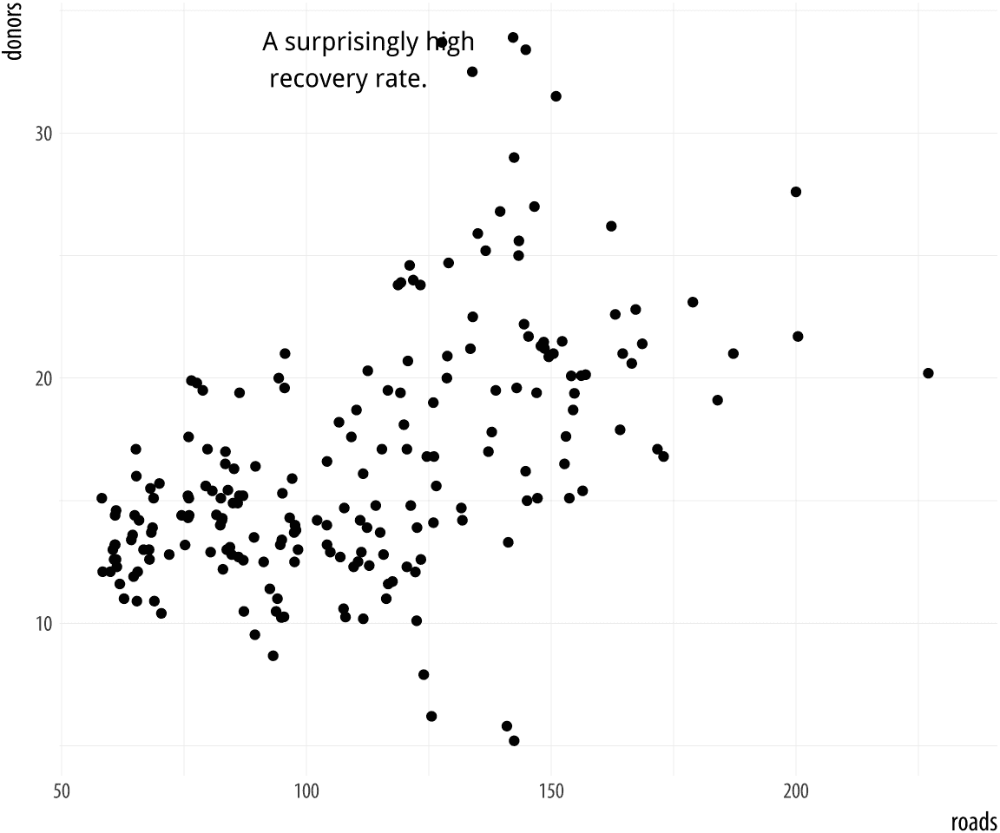 图 5.21：使用 `annotate()` 添加任意文本。

```r
p <-  ggplot(data = organdata, mapping = aes(x = roads, y = donors))
p +  geom_point() +  annotate(geom = "text", x = 91, y = 33,
 label = "A surprisingly high \n recovery rate.",
 hjust = 0)
```

`annotate()` 函数也可以与其他 geom 一起使用。使用它来绘制矩形、线段和箭头。只需确保传递给所使用的 geom 正确的参数即可。例如，我们可以通过对该函数的第二次调用向此图添加一个矩形。

```r
p <-  ggplot(data = organdata,
 mapping = aes(x = roads, y = donors))
p +  geom_point() +
 annotate(geom = "rect", xmin = 125, xmax = 155,
 ymin = 30, ymax = 35, fill = "red", alpha = 0.2) + 
 annotate(geom = "text", x = 157, y = 33,
 label = "A surprisingly high \n recovery rate.", hjust = 0)
```

图 5.22：使用 `annotate()` 与两个不同的 geom。


## 5.6 理解尺度、指南和主题

本章以两种方式逐渐扩展了我们的 ggplot 词汇。首先，我们引入了一些新的 `geom_` 函数，使我们能够绘制新的图表类型。其次，我们利用了控制我们图表外观的一些新函数。我们使用 `scale_x_log10()`、`scale_x_continuous()` 和其他 `scale_` 函数来调整轴标签。我们使用 `guides()` 函数移除 `color` 映射和 `label` 映射的图例。我们还使用了 `theme()` 函数将图例的位置从侧面移动到图形的顶部。

了解新的 geom 扩展了我们已经看到的内容。每个 geom 都绘制不同类型的图表。不同的图表需要不同的映射才能工作，因此每个 `geom_` 函数都采用针对其绘制的图表类型的映射。例如，您不能在没有提供 `x` 和 `y` 映射的情况下使用 `geom_point()` 来制作散点图。使用 `geom_histogram()` 只需要提供 `x` 映射。同样，`geom_pointrange()` 需要提供 `ymin` 和 `ymax` 映射，以便知道在哪里绘制它所创建的线性范围。`geom_` 函数也可能接受可选参数。当使用 `geom_boxplot()` 时，您可以使用 `outlier.shape` 和 `outlier.color` 等参数指定异常值的外观。

第二种扩展引入了一些新函数，以及一些新概念。`scale_` 函数、`guides()` 函数和 `theme()` 函数之间的区别是什么？您何时知道使用其中一个而不是另一个？为什么在线帮助中列出了这么多 `scale_` 函数？您如何确定您需要哪一个？

这里是一个粗略的起点：

+   每个美学映射都有一个尺度。如果您想调整该尺度如何标记或分级，则使用 `scale_` 函数。

+   许多尺度都附带图例或键，以帮助读者解释图表。这些被称为 *指南*。您可以使用 `guides()` 函数对它们进行调整。最常见的情况可能是使图例消失，因为有时它可能是多余的。另一种情况是调整图例和颜色条中键的排列。

+   图表还有其他一些特征，它们与显示的数据的逻辑结构没有严格的联系。这些包括诸如背景颜色、用于标签的字体类型，或者图例在图上的位置等。要调整这些，请使用 `theme()` 函数。

与 ggplot 的整体方法一致，调整图表的一些可见特征意味着首先考虑该特征与底层数据之间的关系。大致来说，如果你想要进行的更改将影响任何特定几何图形的实质性解释，那么你很可能会使用该几何图形的 `aes()` 函数将美学映射到变量，或者通过某个 `scale_` 函数指定更改。如果你想要进行的更改不会影响给定几何图形的解释，那么你很可能会在 `geom_` 函数内部设置变量，或者通过 `theme()` 函数进行外观上的更改。

 图 5.23：每个映射的变量都有一个尺度。

尺度和指南紧密相连，这可能会让人感到困惑。指南提供了有关尺度的信息，例如图例或颜色条。因此，可以从各种 `scale_` 函数内部调整指南。通常，直接使用 `guides()` 函数会更简单。

```r
p <-  ggplot(data = organdata,
 mapping = aes(x = roads,
 y = donors,
 color = world))
p +  geom_point()
```

图 5.23 展示了一个具有三个美学映射的图表。变量 `roads` 映射到 `x`；`donors` 映射到 `y`；而 `world` 映射到 `color`。`x` 和 `y` 尺度都是 *连续的*，从略低于变量的最低值平滑运行到略高于变量的最高值。各种标记的刻度线引导读者了解每个轴上的值。`color` 映射也有一个尺度。`world` 测量是一个无序的分类变量，因此其尺度是 *离散的*。它取四个值之一，每个值由不同的颜色表示。

除了 `color` 之外，像 `fill`、`shape` 和 `size` 这样的映射也将具有我们可能想要自定义或调整的尺度。我们本可以将 `world` 映射到 `shape` 而不是 `color`。在这种情况下，我们的四分类变量将有一个由四个不同形状组成的尺度。这些映射的尺度可能包含标签、特定位置的轴刻度线或特定的颜色或形状。如果我们想要调整它们，我们使用一个 `scale_` 函数。

可以将许多不同类型的变量映射到图表中。通常情况下，`x`和`y`是连续的度量。但它们也可能很容易地是离散的，就像我们在箱形图和点图中将国家名称映射到`y`轴时那样。`x`或`y`映射也可以定义为对数比例的转换，或者定义为特殊的数值类型，如日期。同样，`color`或`fill`映射可以是离散的且*无序的*，就像我们的`world`变量一样，或者离散的且*有序的*，就像考试中的字母等级一样。`color`或`fill`映射也可以是连续的数量，表示为从低值到高值平滑过渡的渐变。最后，连续渐变和有序离散值可能都有一个定义的中性中间点，两端向相反方向发散。

 图 5.24：命名`scale`函数的架构。

因为我们有几个潜在的映射，每个映射可能对应于几个不同的比例之一，所以我们最终会有很多个单独的`scale_`函数。每个函数处理一种映射和比例的组合。它们根据一致的逻辑命名，如图 5.24 所示。首先是`scale_`名称，然后是它应用的*映射*，最后是比例将显示的*类型*。因此，`scale_x_continuous()`函数控制连续变量的`x`比例；`scale_y_discrete()`调整离散变量的`y`比例；而`scale_x_log10()`将`x`映射转换为对数比例。大多数时候，ggplot 会正确猜测你的映射所需的类型。然后它会计算出比例的一些默认特征（如标签和刻度标记的位置）。在许多情况下，你不需要进行任何比例调整。如果`x`映射到连续变量，那么在绘图语句中添加`+ scale_x_continuous()`而没有其他参数将没有任何效果。它已经隐含地存在了。另一方面，添加`+ scale_x_log10()`将转换你的比例，因为你已经替换了默认的连续 x 变量的处理方式。

如果你想要调整比例上的标签或刻度标记，你需要知道它是针对哪个映射以及它是哪种类型的比例。然后你提供适当的比例函数的参数。例如，我们可以将之前图表的 x 轴更改为对数比例，然后也可以更改 y 轴上刻度标记的位置和标签。

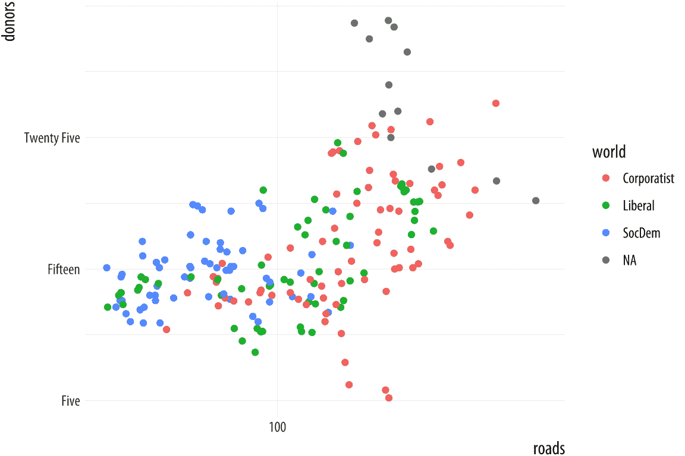 图 5.25：进行一些比例调整。

```r
p <-  ggplot(data = organdata,
 mapping = aes(x = roads,
 y = donors,
 color = world))
p +  geom_point() +
 scale_x_log10() +
 scale_y_continuous(breaks = c(5, 15, 25),
 labels = c("Five", "Fifteen", "Twenty Five"))
```

同样适用于 `color` 和 `fill` 这样的映射。这里可用的 `scale_` 函数包括处理连续、发散和离散变量的函数，以及我们稍后将在更详细地讨论颜色和颜色调色板的使用时遇到的函数。当与生成图例的缩放一起工作时，我们也可以使用这个 `scale_` 函数来指定键中的标签。然而，要更改图例的 *标题*，我们使用 `labs()` 函数，它允许我们标记所有映射。

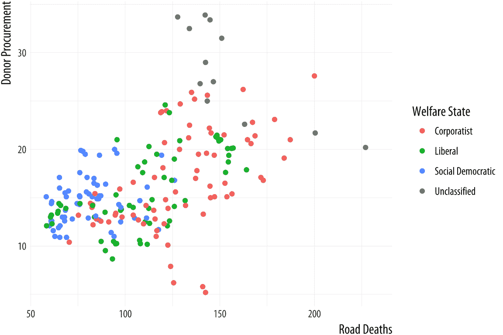 图 5.26：通过缩放函数进行重命名。

```r
p <-  ggplot(data = organdata,
 mapping = aes(x = roads,
 y = donors,
 color = world))
p +  geom_point() +
 scale_color_discrete(labels =
 c("Corporatist", "Liberal",
 "Social Democratic", "Unclassified")) +
 labs(x = "Road Deaths",
 y = "Donor Procurement",
 color = "Welfare State")
```

如果我们想将图例移动到图表的另一个位置，我们只是在做一项纯粹的外观决定，这是 `theme()` 函数的工作。正如我们已经看到的，添加 `+ theme(legend.position = "top")` 将按照指示移动图例。最后，为了使图例完全消失，我们告诉 ggplot 我们不希望对该缩放有指南。这通常不是好的做法，但有时有很好的理由这样做。我们稍后会看到一些例子。

```r
p <-  ggplot(data = organdata,
 mapping = aes(x = roads,
 y = donors,
 color = world))
p +  geom_point() +
 labs(x = "Road Deaths",
 y = "Donor Procurement") +
 guides(color = FALSE)
```

 图 5.27：移除缩放指南。

我们将在第八章节中更详细地探讨 `scale_` 和 `theme()` 函数，那时我们将讨论如何润色我们准备展示或发布的图表。在此之前，我们将相当频繁地使用 `scale_` 函数来对图表的标签和坐标轴进行微调。偶尔，我们也会使用 `theme()` 函数在这里和那里做一些外观上的调整。所以，你不必过于担心它们的工作细节，直到稍后。但在此阶段，了解 `scale_` 函数的用途及其命名逻辑是值得的。理解 `scale_<mapping>_<kind>()` 规则可以使我们更容易看到当调用这些函数之一来调整图表时发生了什么。

## 5.7 接下来去哪里

在本章中，我们介绍了几个新的函数和数据聚合技术。你应该练习使用它们。

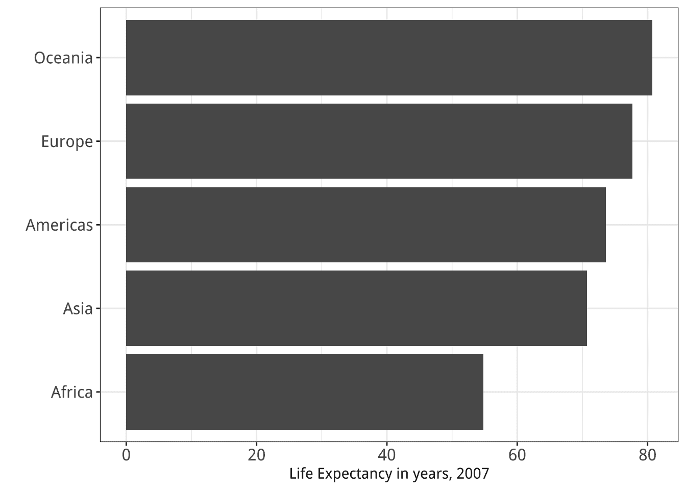  图 5.28：第一章的两个图。

+   当与一系列分层几何对象一起使用时，`subset()` 函数非常有用。回到你为总统选举图（图 5.18）编写的代码，并重新编写它，以便显示所有数据点，但只标记自 1992 年以来的选举。你可能需要再次查看 `elections_historic` 数据，以了解可用的变量。你也可以通过政党进行子集化实验，或者改变点的颜色以反映获胜的政党。

+   使用 `geom_point()` 和 `reorder()` 创建一个按得票率排序的所有总统选举的克利夫兰点图。

+   尝试使用 `annotate()` 添加一个矩形，轻轻着色图 5.18 的整个左上象限。

+   `dplyr` 库中的主要动作动词是 `group_by()`、`filter()`、`select()`、`summarize()` 和 `mutate()`。通过重新访问 `gapminder` 数据来练习它们，看看你是否能重现第一章中的一对图表，这里再次在图 5.28 中展示。在开始绘图过程之前，你需要过滤一些行，按大陆分组数据，并计算按大陆的平均预期寿命。

+   在管道中熟悉分组、变异和汇总数据。当你处理数据时，这将变成一项常规任务。表格可以以多种方式聚合和转换。记住 `group_by()` 从左到右分组你的数据，最右边或最内层的组是将在其上进行计算的级别；`mutate()` 在当前分组级别添加一列；而 `summarize()` 聚合到下一个级别。尝试从 GSS 数据中创建一些分组对象，计算频率，就像你在本章中学到的那样，然后检查总数是否符合你的预期。例如，首先按 `race` 对 `degree` 进行分组，如下所示：

```r
gss_sm %>%  group_by(race, degree) %>%
 summarize(N = n()) %>%
 mutate(pct = round(N /  sum(N)*100, 0)) 
```

```r
## # A tibble: 18 x 4
## # Groups:   race [3]
##    race  degree             N   pct
##    <fct> <fct>          <int> <dbl>
##  1 White Lt High School   197  9.00
##  2 White High School     1057 50.0 
##  3 White Junior College   166  8.00
##  4 White Bachelor         426 20.0 
##  5 White Graduate         250 12.0 
##  6 White <NA>               4  0   
##  7 Black Lt High School    60 12.0 
##  8 Black High School      292 60.0 
##  9 Black Junior College    33  7.00
## 10 Black Bachelor          71 14.0 
## 11 Black Graduate          31  6.00
## 12 Black <NA>               3  1.00
## 13 Other Lt High School    71 26.0 
## 14 Other High School      112 40.0 
## 15 Other Junior College    17  6.00
## 16 Other Bachelor          39 14.0 
## 17 Other Graduate          37 13.0 
## 18 Other <NA>               1  0
```

+   这段代码与之前看到的大致相同，但稍微紧凑一些。（我们直接计算 `pct` 值。）通过按 `race` 分组并汇总百分比来检查结果是否符合你的预期。尝试通过 `sex` 或 `region` 进行相同的分组练习。

+   尝试使用除 `sum` 之外的其他函数进行汇总计算。你能按 `degree` 计算平均和中等儿童数量吗？（提示：`gss_sm` 中的 `childs` 变量表示儿童的数量为数值。）

+   `dplyr` 有许多辅助函数，可以让你以许多不同的方式汇总数据。`dplyr` 文档中包含的关于 *窗口函数* 的示例是一个开始学习这些函数的好地方。你还应该查看 Wickham & Grolemund (2016) 的第三章，以获取有关使用 `dplyr` 转换数据的更多信息。

+   尝试使用 `gapminder` 数据来练习我们学到的一些新 geom。尝试使用一系列箱线图来检查人口或预期寿命随时间的变化。（提示：你可能需要在 `aes()` 调用中使用 `group` 美学。）你能按大陆分面这个箱线图吗？如果你首先从 `gapminder` 创建一个明确按 `year` 和 `continent` 分组的 tibble，然后使用它来创建图表，会有什么不同吗？

+   阅读关于 `geom_boxplot()` 的帮助页面，并查看 `notch` 和 `varwidth` 选项。尝试使用它们来观察它们如何改变图表的外观。

+   作为 `geom_boxplot()` 的替代方案，尝试使用 `geom_violin()` 来创建类似的图表，但使用镜像密度分布而不是箱线和胡须。

+   `geom_pointrange()` 是一系列相关几何图形之一，根据您的具体需求产生不同类型的误差线和范围。它们包括 `geom_linerange()`、`geom_crossbar()` 和 `geom_errorbar()`。尝试使用 `gapminder` 或 `organdata` 来试用它们，看看它们有何不同。

## 5.1 使用管道总结数据

在第四章中，我们开始绘制变量的分布和相对频率的图表。通过另一个度量标准对某一度量标准进行交叉分类是数据分析中的基本描述性任务之一。表 5.1 和 5.2 展示了两种总结我们 GSS 数据中宗教归属和地区分布的常见方法。表 5.1 显示了列边际，其中数字按列相加总和为一百，例如，显示新教徒在各个地区的分布。同时，在表 5.2 中，数字按行相加总和为一百，例如，显示任何特定地区内宗教归属的分布。

我们在第四章中看到，`geom_bar()` 可以根据我们的要求绘制计数和相对频率。然而，在实践中，让几何图形（及其 `stat_` 函数）做工作有时可能会有些混乱。很容易失去对是否已经计算了行边际、列边际或整体相对频率的跟踪。实时计算的计算代码最终会被塞入映射函数中，变得难以阅读。更好的策略是首先计算你想要的频率表，然后绘制该表。这有一个好处，就是允许你快速检查你的表格，以确保你没有犯任何错误。

表 5.2：行边际。 (行中的数字总和为 100。)

|  | 新教徒 | 天主教徒 | 犹太教徒 | 无 | 其他 | NA |
| --- | --: | --: | --: | --: | --: | --: |
| 东北部 | 32 | 33 | 6 | 23 | 6 | 0 |
| 中部 | 47 | 25 | 0 | 23 | 5 | 1 |
| 南部 | 62 | 15 | 1 | 16 | 5 | 1 |
| 西部 | 38 | 25 | 2 | 28 | 8 | 0 |

假设我们想要一个显示地区内宗教的行边际的图表。我们将利用这个机会进行一些数据整理，以便从我们的 GSS 数据基础表到我们想要绘制的汇总表。为此，我们将使用`dplyr`提供的工具，它是 tidyverse 库的一个组成部分，它提供了一些函数，用于实时操作和重塑数据表。我们从包含`bigregion`和`religion`变量的个体级`gss_sm`数据框开始。我们的目标是创建一个汇总表，其中包含按地区分组宗教偏好的百分比。


图 5.1：我们希望如何转换个体级数据。

如图 5.1 所示，我们将从大约 2,500 名 GSS 被调查者的个体级表格开始。然后我们想要将它们汇总到一个新的表格中，该表格显示了按地区分组的每种宗教偏好的计数。最后，我们将这些地区内的计数转换为百分比，分母是每个地区内受访者的总数。`dplyr` 库提供了一些工具，使这个过程变得简单且易于阅读。我们将使用一个特殊操作符 `%>%` 来完成我们的工作。这是 *管道* 操作符。它在图 5.1 中的作用类似于黄色三角形，它帮助我们执行从一张表到下一张表的转换操作。

我们一直在以 *累加* 的方式构建我们的图形，从 `ggplot` 对象开始，并添加新的元素。通过类比，将 `%>%` 操作符视为允许我们从数据框开始，执行一系列操作，将其转换成另一张表，通常是更小、更汇总的表。数据从管道的一侧进入，通过函数执行操作，结果从另一侧出来。管道通常是一系列操作，执行以下四件事情之一或多个：

+   *分组* 使用 `group_by()` 将数据分组到我们想要的汇总的嵌套结构中，例如“宗教按地区”或“作者按出版物按年份”。

+   *过滤* `filter()` 行；`select()` 列或通过行、列或两者选择数据的一部分。这使我们能够得到我们想要工作的表格部分。

+   *转换* 使用 `mutate()` 通过在 *当前* 分组级别创建新变量来转换数据。这向表格中添加新列，而不进行聚合。

+   *汇总* 使用 `summarize()` 或聚合分组数据。这会在 *更高* 的分组级别创建新变量。例如，我们可能使用 `mean()` 计算平均值或使用 `n()` 计算计数。这会产生一个更小、更简洁的汇总表，如果我们想进行更多操作，我们可以在此基础上进行。

我们使用 `dplyr` 函数 `group_by()`、`filter()`、`select()`、`mutate()` 和 `summarize()` 在我们的管道中执行这些任务。它们被编写成易于管道化的方式。也就是说，它们理解如何从管道操作符的左侧获取输入，并通过右侧传递结果。dplyr 文档中包含一些有用的示例，介绍了这些分组、过滤、选择和转换函数。在 Wickham & Grolemund (2016) 中，对这些工具进行了更详细的讨论，并提供了许多更多示例。

我们将创建一个名为 `rel_by_region` 的新表格。以下是代码：

```r
rel_by_region <-  gss_sm %>%
 group_by(bigregion, religion) %>%
 summarize(N = n()) %>%
 mutate(freq = N /  sum(N),
 pct = round((freq*100), 0))
```

这些行在做什么？首先，我们像往常一样创建一个对象，使用熟悉的赋值运算符`<-`。接下来，在右侧的步骤中。从左到右读取对象和函数，使用管道运算符“`%>%`”将它们连接起来，意味着“然后……”。左侧的对象“通过”管道，管道右侧指定的任何内容都会应用于该对象。结果对象然后再次通过管道，依此类推，直到管道的末端。

从左到右读取，代码表示：

+   创建一个新对象`rel_by_region <- gss_sm %>%`，名为`rel_by_region`。它将获取以下一系列操作的结果：从`gss_sm`数据开始，然后

+   `group_by(bigregion, religion) %>%`按`bigregion`分组行，并在其中按`religion`分组。

+   将此表`summarize(N = n()) %>%`汇总以创建一个新表，包含三列：`bigregion`、`religion`和一个新的汇总变量`N`，它是每个地区每个宗教群体内观测数的计数。

+   使用这个新表，`mutate(freq = N / sum(N), pct = round((freq*100), 0))`使用`N`变量计算两个新列：每个宗教类别的相对比例（`freq`）和百分比（`pct`），仍然按地区分组。将结果四舍五入到最接近的百分点。

在这种做事方式中，沿着管道传递的对象和作用于它们的函数对其上下文有一些假设。一方面，你不必始终指定你正在工作的底层数据框对象的名称。一切都被隐式地从`gss_sm`传递。在管道内，从你的汇总和其他转换中创建的临时或隐式对象也被传递。

其次，`group_by()`函数设置了在`summarize()`步骤中如何处理分组或嵌套数据。在`summarize()`内部创建新变量的任何函数，例如`mean()`、`sd()`或`n()`，将首先应用于最内层的分组级别。分组级别在`group_by()`中从最外层到最内层按从左到右命名。因此，函数调用`summarize(N = n())`计算每个`bigregion`内每个`religion`值的观测数，并将它们放入一个名为`N`的新变量中。在 dplyr 的函数看来，汇总操作“逐层剥离”一个分组级别，因此结果汇总是在下一个级别上。在这种情况下，我们开始于个体级别的观测值，并在地区内按宗教进行分组。`summarize()`操作将个体观测值聚合为每个地区每个宗教群体的人数计数。

第三，`mutate()`步骤使用`N`变量来创建`freq`，即每个区域内的子组的相对频率，最后创建`pct`，即转换为四舍五入百分比的相对频率。这些`mutate()`操作向表中添加或移除列，但不会改变分组级别。

在`mutate()`和`summarize()`内部，我们能够以我们之前未见过的这种方式创建新变量。通常，当我们在一个函数内部看到类似`name = value`的东西时，`name`是一个通用的命名参数，函数期望我们从它那里获取关于特定值的信息。例如，在`aes(x = gdpPercap, y = lifeExp)`的情况下。通常，如果我们给一个函数一个它不知道的命名参数（`aes(chuckles = year)`），它将忽略它、抱怨或崩溃。然而，在`summarize()`和`mutate()`的情况下，我们可以发明命名参数。我们仍然在将特定的值分配给`N`、`freq`和`pct`，但我们也在选择名称。它们是新创建的汇总表中的变量的名称。`summarize()`和`mutate()`函数不需要提前知道它们会是什么。

最后，当我们使用`mutate()`创建`freq`变量时，我们不仅可以在函数内部命名这个变量，`mutate()`还足够聪明，允许我们在同一函数调用的下一行立即使用这个名称来创建`pct`变量。这意味着我们不需要为每个想要创建的新变量重复编写单独的`mutate()`调用。

我们的管道将`gss_sm`数据框（有 2867 行和 32 列）转换成`rel_by_region`，这是一个包含 24 行和 5 列的汇总表，部分如下所示：

```r
rel_by_region
```

```r
## # A tibble: 24 x 5
## # Groups:   bigregion [4]
##    bigregion religion       N    freq   pct
##    <fct>     <fct>      <int>   <dbl> <dbl>
##  1 Northeast Protestant   158 0.324   32.0 
##  2 Northeast Catholic     162 0.332   33.0 
##  3 Northeast Jewish        27 0.0553   6.00
##  4 Northeast None         112 0.230   23.0 
##  5 Northeast Other         28 0.0574   6.00
##  6 Northeast <NA>           1 0.00205  0   
##  7 Midwest   Protestant   325 0.468   47.0 
##  8 Midwest   Catholic     172 0.247   25.0 
##  9 Midwest   Jewish         3 0.00432  0   
## 10 Midwest   None         157 0.226   23.0 
## # ... with 14 more rows
```

在`group_by()`中指定的变量保留在新的汇总表中；使用`summarize()`和`mutate()`创建的变量被添加，原始数据集中的所有其他变量都被删除。

我们之前说过，在尝试理解`ggplot()`序列中的每个添加步骤时，逆向工作，一次移除一个部分，看看当这一步不包括在内时，图表看起来像什么，这可能会很有帮助。同样，在查看管道代码时，从行的末尾开始，然后一次移除一个“`%>%`”步骤，看看结果的中介对象看起来像什么，这可能会很有帮助。例如，如果我们从上面的代码中移除`mutate()`步骤会怎样？那时`rel_by_region`看起来会怎样？如果我们移除`summarize()`步骤呢？每一步返回的表格有多大？它处于哪个分组级别？哪些变量被添加或移除了？

不需要在进行显示之前对数据进行顺序聚合和转换的图表通常可以直接在 ggplot 中编写，因为布局的细节是由映射变量和层叠 geom 的组合来处理的。对数据进行一步过滤或聚合（例如计算比例或特定观察值的子集）也是直接的。但是，当我们想要显示的结果与数据相隔几个步骤，尤其是当我们想要对表格进行分组或聚合并在绘制任何内容之前进行一些计算时，使用 dplyr 的工具来首先生成这些汇总表是有意义的。即使我们也可以在`ggplot()`调用中完成它。除了使我们的代码更容易阅读外，它还让我们更容易对我们的结果进行合理性检查，以确保我们以正确的顺序对事物进行了分组和汇总。例如，如果我们正确地使用了`rel_by_region`，与`religion`相关的`pct`值在每个地区内应该总和为 100，可能有一些舍入误差。我们也可以使用一个非常短的管道快速检查这一点：

```r
rel_by_region %>%  group_by(bigregion) %>%
 summarize(total = sum(pct))
```

```r
## # A tibble: 4 x 2
##   bigregion total
##   <fct>     <dbl>
## 1 Northeast   100
## 2 Midwest     101
## 3 South       100
## 4 West        101
```

这看起来不错。和之前一样，现在我们直接在汇总表中工作，使用百分比值，我们可以使用`geom_col()`而不是`geom_bar()`。

 图 5.2：按地区划分的宗教偏好。

```r
p <-  ggplot(rel_by_region, aes(x = bigregion, y = pct, fill = religion))
p +  geom_col(position = "dodge2") +
 labs(x = "Region",y = "Percent", fill = "Religion") +
 theme(legend.position = "top")
```

我们在这里使用了一个不同的`position`参数，`dodge2`而不是`dodge`。这使条形并排放置。当处理`geom_col()`中的预计算值时，默认的`position`是制作一个成比例堆叠的柱状图。如果你使用`dodge`，它们将在列内堆叠，但结果将读起来不正确。使用`dodge2`将子类别（宗教归属）在组（地区）内并排放置。

此条形图中的值是图 4.10 中堆叠计数百分比等价。宗教归属在每个地区内总和为 100%。问题是，尽管我们现在知道如何干净地生成频率表，但这仍然是一个糟糕的图表。它太拥挤了，有太多的条形并排。我们可以做得更好。

通常情况下，错位图表可以更清晰地表达为分面图。这消除了对图例的需求，因此使图表更易于阅读。我们还引入了一个新函数。如果我们把宗教映射到 x 轴，标签将重叠并变得难以辨认。手动调整刻度标签以使其以角度打印是可能的，但这也不容易阅读。将宗教放在 y 轴上，将百分比分数放在 x 轴上更有意义。由于`geom_bar()`内部的工作方式，简单地交换`x`和`y`映射将不起作用。（试一试，看看会发生什么。）我们实际上是对结果绘制在其中的*坐标系*进行转换，以便 x 轴和 y 轴翻转。我们使用`coord_flip()`来完成这项工作。

```r
p <-  ggplot(rel_by_region, aes(x = religion, y = pct, fill = religion))
p +  geom_col(position = "dodge2") +
 labs(x = NULL, y = "Percent", fill = "Religion") +
 guides(fill = FALSE) + 
 coord_flip() + 
 facet_grid(~  bigregion)
```


图 5.3：宗教偏好按地区划分，分面版本。

对于大多数图表，坐标系是笛卡尔坐标系，显示由 x 轴和 y 轴定义的平面上的图表。`coord_cartesian()`函数管理这一点，但我们不需要调用它。`coord_flip()`函数在绘制图表后切换 x 轴和 y 轴。它不会重新映射变量到美学。在这种情况下，`religion`仍然映射到`x`，`pct`映射到`y`。由于宗教名称不需要轴标签就能理解，我们在`labs()`调用中设置`x = NULL`。

我们将在稍后看到 dplyr 的分组和过滤操作能做什么。它是一个灵活且强大的框架。目前，将其视为一种快速总结数据表的方法，而无需在我们的`ggplot()`或`geom_`函数的主体中编写代码。

## 5.2 按组或类别划分的连续变量

让我们转到一个新的数据集，`organdata` 表。像 `gapminder` 一样，它有一个国家-年份结构。它包含关于十七个 OECD 国家器官移植捐赠超过十年的信息。器官采购率是衡量从尸体器官捐赠者获得的人体器官数量，用于移植手术的指标。除了捐赠数据外，该数据集还包含各种数值人口统计指标，以及健康和福利政策与法律的几个分类指标。与 `gapminder` 数据不同，一些观察值是缺失的。这些用 `NA` 值表示，这是 R 的标准缺失数据代码。`organdata` 表包含在 `socviz` 库中。加载它并快速查看。这次我们不会使用 `head()`，为了变化，我们将制作一个简短的管道来选择数据集的前六列，然后使用一个名为 `sample_n()` 的函数随机选择五行。这个函数有两个主要参数。首先，我们提供我们想要从中抽取数据的表格。因为我们使用管道，所以这隐式地从管道的开始传递下来。然后我们提供我们想要抽取的数字。在 `select()` 中使用这种方式选择数据框的编号列。你还可以直接选择变量名。

```r
organdata %>%  select(1:6) %>%  sample_n(size = 10)
```

```r
## # A tibble: 10 x 6
##    country        year       donors   pop pop_dens   gdp
##    <chr>          <date>      <dbl> <int>    <dbl> <int>
##  1 Switzerland    NA           NA      NA    NA       NA
##  2 Switzerland    1997-01-01   14.3  7089    17.2  27675
##  3 United Kingdom 1997-01-01   13.4 58283    24.0  22442
##  4 Sweden         NA           NA    8559     1.90 18660
##  5 Ireland        2002-01-01   21.0  3932     5.60 32571
##  6 Germany        1998-01-01   13.4 82047    23.0  23283
##  7 Italy          NA           NA   56719    18.8  17430
##  8 Italy          2001-01-01   17.1 57894    19.2  25359
##  9 France         1998-01-01   16.5 58398    10.6  24044
## 10 Spain          1995-01-01   27.0 39223     7.75 15720
```

让我们先天真地绘制一些数据。我们可以查看捐赠者与年份的散点图。

 图 5.4：信息量不大。

```r
p <-  ggplot(data = organdata,
 mapping = aes(x = year, y = donors))
p +  geom_point()
```

```r
## Warning: Removed 34 rows containing missing values
## (geom_point).
```

ggplot 发出一个消息，警告你关于缺失值。从现在开始，我们将抑制这个警告，以免输出混乱，但一般来说，阅读和理解 R 给出的警告是明智的，即使代码看起来运行正常。如果有大量警告，R 将收集它们，并邀请你使用 `warnings()` 函数查看。

我们可以使用 `geom_line()` 来绘制每个国家的时间序列，就像我们在 gapminder 数据中做的那样。要做到这一点，记住，我们需要告诉 ggplot 分组变量是什么。这次我们也可以按国家分面图，因为我们没有太多国家。

 图 5.5：分面线图。

```r
p <-  ggplot(data = organdata,
 mapping = aes(x = year, y = donors))
p +  geom_line(aes(group = country)) +  facet_wrap(~  country)
```

默认情况下，分面图是按国家字母顺序排序的。我们将稍后展示如何更改这一点。

让我们关注国家层面的变化，但不要关注时间趋势。我们可以使用 `geom_boxplot()` 来获取各国年度变化的图像。正如 `geom_bar()` 默认情况下会根据你映射到 `x` 的类别计算观察值的数量一样，与 `geom_boxplot()` 一起工作的 `stat_boxplot()` 函数将计算一系列统计量，这些统计量允许绘制箱线和须线。我们告诉 `geom_boxplot()` 我们想要按什么变量进行分类（在这里，`country`）以及我们想要汇总的连续变量（在这里，`donors`）

 图 5.6：按国家绘制箱线图的第一尝试。

```r
p <-  ggplot(data = organdata,
 mapping = aes(x = country, y = donors))
p +  geom_boxplot()
```

箱线图看起来很有趣，但有两个问题可以解决。首先，正如我们在上一章看到的，将国家名称放在 x 轴上显得有些尴尬，因为标签会重叠。我们再次使用`coord_flip()`来切换坐标轴（但不切换映射）。

 图 5.7：将国家移动到 y 轴。

```r
p <-  ggplot(data = organdata,
 mapping = aes(x = country, y = donors))
p +  geom_boxplot() +  coord_flip()
```

这样看起来更清晰，但仍然不是理想的。我们通常希望我们的图表以某种有意义的方式呈现数据。一种明显的方法是将国家按平均捐赠率从高到低列出。我们通过按`donors`的平均值重新排序`country`变量来实现这一点。`reorder()`函数会为我们完成这项工作。它需要两个必需的参数。第一个是我们想要重新排序的分类变量或因子。在这种情况下，那就是`country`。第二个是我们想要按其重新排序的变量。这里就是捐赠率，`donors`。`reorder()`的第三个和可选参数是你想要用作汇总统计函数的函数。如果你只给`reorder()`提供前两个必需参数，那么默认情况下，它将按第二个变量的平均值重新排序第一个变量的类别。你可以命名任何合理的函数来重新排序分类变量（例如，`median`或`sd`）。还有一个额外的细节。在 R 中，如果变量中有缺失值，默认的`mean`函数将因错误而失败。你必须说明在计算平均值时可以删除缺失值。这是通过向`reorder()`提供`na.rm=TRUE`参数来完成的，该参数内部将此参数传递给`mean()`。我们正在重新排序映射到`x`美学的变量，因此我们在代码中使用`reorder()`：

```r
p <-  ggplot(data = organdata,
 mapping = aes(x = reorder(country, donors, na.rm=TRUE),
 y = donors))
p +  geom_boxplot() +
 labs(x=NULL) +
 coord_flip()
```

 图 5.8：按平均捐赠率重新排序的箱线图。

由于国家名称很明显，在`labs()`调用中，我们将它们的轴标签设置为空，使用`labs(x=NULL)`。Ggplot 提供了基本的箱线图的一些变体，包括小提琴图。尝试使用`geom_violin()`。还有许多参数可以控制箱子和胡须的更精细的细节，包括它们的宽度。箱线图也可以像其他几何对象一样接受`color`和`fill`美学映射。

```r
p <-  ggplot(data = organdata,
 mapping = aes(x = reorder(country, donors, na.rm=TRUE),
 y = donors, fill = world))
p +  geom_boxplot() +  labs(x=NULL) +
 coord_flip() +  theme(legend.position = "top")
```

图 5.9：具有填充美学的箱线图。


将分类变量放在 y 轴上以比较它们的分布是一个非常实用的技巧。这使得有效地展示更多类别的汇总数据变得容易。这些图可以相当紧凑，并且可以通过行来容纳相对大量的案例。这种方法的优势在于将比较的变量放在 x 轴上，这有时会使得跨类别比较更容易。如果每个类别内的观察值数量相对较小，我们可以跳过（或补充）箱线图，并显示个别观察值。在下一个例子中，我们将 `world` 变量映射到 `color` 而不是默认的 `geom_point()` 图形形状的 `fill`，因为默认的 `geom_point()` 图形具有颜色属性，但没有填充属性。

 图 5.10：使用点而不是箱线图。

```r
p <-  ggplot(data = organdata,
 mapping = aes(x = reorder(country, donors, na.rm=TRUE),
 y = donors, color = world))
p +  geom_point() +  labs(x=NULL) +
 coord_flip() +  theme(legend.position = "top")
```

当我们使用 `geom_point()` 如此操作时，观察值之间会有一些重叠。在这些情况下，对数据进行一点微小的扰动可能会有助于更好地了解在不同值上存在多少观察值。我们使用 `geom_jitter()` 来实现这一点。这个几何形状与 `geom_point()` 非常相似，但它会随机地将每个观察值微调一小段距离。

 图 5.11：抖动点。

```r
p <-  ggplot(data = organdata,
 mapping = aes(x = reorder(country, donors, na.rm=TRUE),
 y = donors, color = world))
p +  geom_jitter() +  labs(x=NULL) +
 coord_flip() +  theme(legend.position = "top")
```

默认的抖动量对于我们的目的来说有点过多。我们可以通过在几何形状中的 `position_jitter()` 函数中使用 `height` 和 `width` 参数来控制它。因为我们在这里制作的是一维汇总，所以我们只需要 `width`。你能看出为什么我们没有使用 `height` 吗？如果不能，试着试试看会发生什么。

```r
p <-  ggplot(data = organdata,
 mapping = aes(x = reorder(country, donors, na.rm=TRUE),
 y = donors, color = world))
p +  geom_jitter(position = position_jitter(width=0.15)) +
 labs(x=NULL) +  coord_flip() +  theme(legend.position = "top")
```

图 5.12：一个抖动图。


当我们想要汇总一个每个类别只有一个点的分类变量时，我们也应该使用这种方法。结果将是一个克利夫兰点图，这是一种简单而极其有效的展示数据的方法，通常比条形图或表格更好。例如，我们可以制作一个平均捐赠率的克利夫兰点图。

这也给了我们另一个机会，使用 dplyr 管道进行一点数据整理。我们将使用一个管道来将较大的国家-年份数据框聚合到一个较小的按国家汇总的统计表。完成这个管道任务的方法不止一种。我们可以选择要汇总的变量，然后反复使用 `mean()` 和 `sd()` 函数来计算我们想要的变量的平均值和标准差。我们再次使用管道操作符 `%>%` 来完成我们的工作：

```r
by_country <-  organdata %>%  group_by(consent_law, country) %>%
 summarize(donors_mean= mean(donors, na.rm = TRUE),
 donors_sd = sd(donors, na.rm = TRUE),
 gdp_mean = mean(gdp, na.rm = TRUE),
 health_mean = mean(health, na.rm = TRUE),
 roads_mean = mean(roads, na.rm = TRUE),
 cerebvas_mean = mean(cerebvas, na.rm = TRUE))
```

该流程包括两个步骤。首先，我们按 `consent_law` 和 `country` 对数据进行分组，然后使用 `summarize()` 创建六个新变量，每个变量都是每个国家在原始 `organdata` 数据框中对应变量的平均值或标准差。为了获得不同的视角，在分组语句中将 `country` 改为 `year`，看看会发生什么。

通常，`summarize()` 步骤将继承有关原始数据和分组的信息，然后在最内层的分组级别进行计算。在这种情况下，它为每个国家取所有观测值，并按请求计算平均值或标准差。以下是结果对象的外观：

```r
by_country
```

```r
## # A tibble: 17 x 8
## # Groups:   consent_law [?]
##    consent_law country        donors_mean donors_sd gdp_mean health_mean roads_mean cerebvas_mean
##    <chr>       <chr>                <dbl>     <dbl>    <dbl>       <dbl>      <dbl>         <dbl>
##  1 Informed    Australia             10.6     1.14     22179        1958      105             558
##  2 Informed    Canada                14.0     0.751    23711        2272      109             422
##  3 Informed    Denmark               13.1     1.47     23722        2054      102             641
##  4 Informed    Germany               13.0     0.611    22163        2349      113             707
##  5 Informed    Ireland               19.8     2.48     20824        1480      118             705
##  6 Informed    Netherlands           13.7     1.55     23013        1993       76.1           585
##  7 Informed    United Kingdom        13.5     0.775    21359        1561       67.9           708
##  8 Informed    United States         20.0     1.33     29212        3988      155             444
##  9 Presumed    Austria               23.5     2.42     23876        1875      150             769
## 10 Presumed    Belgium               21.9     1.94     22500        1958      155             594
## 11 Presumed    Finland               18.4     1.53     21019        1615       93.6           771
## 12 Presumed    France                16.8     1.60     22603        2160      156             433
## 13 Presumed    Italy                 11.1     4.28     21554        1757      122             712
## 14 Presumed    Norway                15.4     1.11     26448        2217       70.0           662
## 15 Presumed    Spain                 28.1     4.96     16933        1289      161             655
## 16 Presumed    Sweden                13.1     1.75     22415        1951       72.3           595
## 17 Presumed    Switzerland           14.2     1.71     27233        2776       96.4           424
```

如同以往，`group_by()` 中指定的变量将保留在新数据框中，使用 `summarize()` 创建的变量将被添加，原始数据中的所有其他变量将被删除。国家在 `consent_law` 内按字母顺序汇总，这是管道开始时的 `group_by()` 语句中最外层的分组变量。

以这种方式使用我们的流程是合理的，但代码值得再次审视。一方面，我们必须反复输入 `mean()` 和 `sd()` 函数的名称，并且每次都要给出我们想要汇总的变量的名称以及 `na.rm = TRUE` 参数，以确保函数不会对缺失值发出抱怨。我们同样以相同的方式反复命名我们的新汇总变量，即在原始变量名称的末尾添加 `_mean` 或 `_sd`。如果我们想要计算 `organdata` 中所有数值变量的平均值和标准差，我们的代码将会更长。此外，在这个版本中，我们失去了那些我们没有按其分组的其他时间不变的分类变量，例如 `world`。当我们看到代码中这种重复的操作时，我们可以问自己是否有更好的处理方式。

确实存在。我们想要做的是将 `mean()` 和 `sd()` 函数应用于 `organdata` 中的每一个数值变量，但**仅限**数值变量。然后我们希望以一致的方式命名结果，并返回一个包含所有分类变量，如 `world` 的汇总表。我们可以利用一点 R 的函数式编程能力来创建一个更好的 `by_country` 对象版本。以下是代码：

```r
by_country <-  organdata %>%  group_by(consent_law, country) %>%
 summarize_if(is.numeric, funs(mean, sd), na.rm = TRUE) %>%
 ungroup()
```

管道开始的方式与之前相同，先取 `organdata`，然后按 `consent_law` 和 `country` 进行分组。然而，在下一步中，我们不是手动取一组变量的均值和标准差，而是使用 `summarize_if()` 函数。正如其名称所暗示的，它检查我们数据中的每一列，并对它进行测试。只有当测试通过时，即返回值为 `TRUE` 时，才会进行汇总。我们不需要在 `summarize_if()` 内部命名函数时使用括号。这里测试是函数 `is.numeric()`，它检查一个向量是否是数值值。如果是，那么 `summarize_if()` 将应用我们想要的汇总函数或函数到 `organdata`。因为我们同时取均值和标准差，所以我们使用 `funs()` 列出我们想要使用的函数。并且我们以 `na.rm = TRUE` 参数结束，这个参数将被传递给 `mean()` 和 `sd()` 的每次使用。在管道的最后一步中，我们 `ungroup()` 数据，有时绘图函数会混淆分组 tibbles，其中我们没有在图表中明确使用组，因此结果是普通的 tibble。

这是管道返回的内容：

```r
by_country 
```

```r
## # A tibble: 17 x 28
##    consent_law country        donors_mean pop_mean pop_dens_mean gdp_mean gdp_lag_mean health_mean
##    <chr>       <chr>                <dbl>    <dbl>         <dbl>    <dbl>        <dbl>       <dbl>
##  1 Informed    Australia             10.6    18318         0.237    22179        21779        1958
##  2 Informed    Canada                14.0    29608         0.297    23711        23353        2272
##  3 Informed    Denmark               13.1     5257        12.2      23722        23275        2054
##  4 Informed    Germany               13.0    80255        22.5      22163        21938        2349
##  5 Informed    Ireland               19.8     3674         5.23     20824        20154        1480
##  6 Informed    Netherlands           13.7    15548        37.4      23013        22554        1993
##  7 Informed    United Kingdom        13.5    58187        24.0      21359        20962        1561
##  8 Informed    United States         20.0   269330         2.80     29212        28699        3988
##  9 Presumed    Austria               23.5     7927         9.45     23876        23415        1875
## 10 Presumed    Belgium               21.9    10153        30.7      22500        22096        1958
## 11 Presumed    Finland               18.4     5112         1.51     21019        20763        1615
## 12 Presumed    France                16.8    58056        10.5      22603        22211        2160
## 13 Presumed    Italy                 11.1    57360        19.0      21554        21195        1757
## 14 Presumed    Norway                15.4     4386         1.35     26448        25769        2217
## 15 Presumed    Spain                 28.1    39666         7.84     16933        16584        1289
## 16 Presumed    Sweden                13.1     8789         1.95     22415        22094        1951
## 17 Presumed    Switzerland           14.2     7037        17.0      27233        26931        2776
## # ... with 20 more variables: health_lag_mean <dbl>, pubhealth_mean <dbl>, roads_mean <dbl>,
## #   cerebvas_mean <dbl>, assault_mean <dbl>, external_mean <dbl>, txp_pop_mean <dbl>,
## #   donors_sd <dbl>, pop_sd <dbl>, pop_dens_sd <dbl>, gdp_sd <dbl>, gdp_lag_sd <dbl>,
## #   health_sd <dbl>, health_lag_sd <dbl>, pubhealth_sd <dbl>, roads_sd <dbl>, cerebvas_sd <dbl>,
## #   assault_sd <dbl>, external_sd <dbl>, txp_pop_sd <dbl>
```

所有数值变量都已汇总。它们使用原始变量命名，并附加函数名称：`donors_mean` 和 `donors_sd` 等。这是一种快速以各种方式转换我们数据的方法。有一系列 `summarize_` 函数用于各种任务，以及一组互补的 `mutate_` 函数，当我们想要向数据中添加列而不是聚合它时使用。

通过按国家汇总我们的数据，我们可以使用 `geom_point()` 绘制点图。让我们也按每个国家的同意法对结果进行着色。

 图 5.13：克利夫兰点图，带有彩色点。

```r
p <-  ggplot(data = by_country,
 mapping = aes(x = donors_mean, y = reorder(country, donors_mean),
 color = consent_law))
p +  geom_point(size=3) +
 labs(x = "Donor Procurement Rate",
 y = "", color = "Consent Law") +
 theme(legend.position="top")
```

或者，如果我们愿意的话，我们可以使用面元而不是给点着色。使用 `facet_wrap()` 我们可以将 `consent_law` 变量分成两个面板，然后在每个面板内按捐赠率对国家进行排名。因为我们 y 轴上有一个分类变量，有两个值得注意的细节。首先，如果我们让 `facet_wrap()` 保持默认设置，面板将并排绘制。这将使得比较同一尺度上的两组变得困难。相反，图表将从左到右读取，这并不实用。为了避免这种情况，我们将面板设置为一个叠在另一个上面，通过说我们只想有一列。这是 `ncol=1` 参数。其次，同样因为我们在 y 轴上有一个分类变量，默认的面元图将在两个面板的 y 轴上显示每个国家的名称。（如果 y 轴是一个连续变量，这将是我们想要的。）在这种情况下，我们图表的每个面板中只有一半的行会有点。

为了避免这种情况，我们允许 y 轴的刻度自由。这是 `scales="free_y"` 参数。同样，对于面图，其中两个变量都是连续的，我们通常不希望刻度是自由的，因为这允许每个面板的 x 或 y 轴仅根据该面板内部的数据范围变化，而不是整个数据集的范围。通常，小面板的目的是能够跨面板进行比较。这意味着自由刻度通常不是一个好主意，因为每个面板都会得到自己的 x 或 y 轴范围，这会破坏可比性。但是，当其中一个轴是分类的，就像这里一样，我们可以使分类轴自由，而将连续轴固定。结果是每个面板共享相同的 x 轴，并且很容易在它们之间进行比较。

 图 5.14：一个具有自由 y 轴刻度的面图点状图。

```r
p <-  ggplot(data = by_country,
 mapping = aes(x = donors_mean,
 y = reorder(country, donors_mean)))

p +  geom_point(size=3) +
 facet_wrap(~  consent_law, scales = "free_y", ncol = 1) +
 labs(x= "Donor Procurement Rate",
 y= "") 
```

Cleveland 点状图通常比条形图或柱状图更受欢迎。在制作它们时，将类别放在 y 轴上，并按与您提供的数值摘要最相关的顺序排列。这种图表也是总结模型结果或任何具有误差范围的数据的绝佳方式。我们使用 `geom_point()` 来绘制我们的点状图。还有一个名为 `geom_dotplot()` 的几何对象，但它被设计成产生不同类型的图形。它是一种直方图，通过将点堆叠在一起来表示单个观测值，以显示有多少个这样的点。

Cleveland 风格的点状图可以扩展到我们想要在图中包含关于方差或误差的一些信息的情况。使用 `geom_pointrange()`，我们可以告诉 ggplot 显示给我们一个点估计及其周围的范围。这里我们将使用我们上面计算出的捐赠率的方差。但这也是以置信区间呈现模型系数估计的自然方式。使用 `geom_pointrange()`，我们像往常一样映射 `x` 和 `y` 变量，但该函数需要比 `geom_point()` 更多一点信息。它需要知道在点两侧绘制线的范围，由参数 `ymax` 和 `ymin` 定义。这由 y 值（`donors_mean`）加减其标准差（`donors_sd`）给出。如果一个函数参数期望一个数字，你可以给它一个数学表达式，该表达式解析为你想要的数字。R 会为你计算结果。

```r
p <-  ggplot(data = by_country, mapping = aes(x = reorder(country,
 donors_mean), y = donors_mean))

p +  geom_pointrange(mapping = aes(ymin = donors_mean -  donors_sd,
 ymax = donors_mean +  donors_sd)) +
 labs(x= "", y= "Donor Procurement Rate") +  coord_flip()
```

图 5.15：一个点状和须状图，其范围由测量变量的标准差定义。


因为 `geom_pointrange()` 需要参数 `y`、`ymin` 和 `ymax`，所以我们把 `donors_mean` 映射到 `y`，把 `ccode` 变量映射到 `x`，然后在最后使用 `coord_flip()` 翻转坐标轴。

## 5.3 直接绘制文本

有时在散点图中绘制标签与点一起，或者直接绘制信息标签可能会有用。我们可以使用`geom_text()`来实现这一点。

 图 5.16：绘制标签和文本。

```r
p <-  ggplot(data = by_country,
 mapping = aes(x = roads_mean, y = donors_mean))
p +  geom_point() +  geom_text(mapping = aes(label = country))
```

文本直接绘制在点上方，因为它们都是使用相同的 x 和 y 映射来定位的。处理这个问题的一种方法，通常在不太担心图形中过度精确的情况下是最有效的，就是通过从图形中删除`geom_point()`来移除点。第二种选择是调整文本的位置。我们可以使用`geom_text()`的`hjust`参数来左对齐或右对齐标签。将`hjust=0`设置为左对齐标签，而`hjust=1`将右对齐它。

```r
p <-  ggplot(data = by_country,
 mapping = aes(x = roads_mean, y = donors_mean))

p +  geom_point() +  geom_text(mapping = aes(label = country), hjust = 0)
```

你可能会想尝试不同的`hjust`值来微调你的标签。但这并不是一个稳健的方法。它通常会失败，因为空间是按标签长度的比例添加的。结果是，较长的标签会比你想的更远离它们对应的点。有绕过这个问题的方法，但它们会引入其他问题。

 图 5.17：绘制点和文本标签，并进行水平位置调整。

我们将不再与`geom_text()`纠缠，而是使用`ggrepel`。这个非常有用的库为 ggplot 添加了一些新的几何形状。就像`ggplot`扩展了 R 的绘图功能一样，有许多小型库通过提供某种新的`geom`类型来扩展`ggplot`的功能。`ggrepel`库提供了`geom_text_repel()`和`geom_label_repel()`，这两种几何形状可以比默认的`geom_text()`更灵活地挑选出标签。首先，确保库已安装，然后以通常的方式加载它：

```r
library(ggrepel)
```

我们将使用`geom_text_repel()`而不是`geom_text()`。为了展示`geom_text_repel()`能做什么，我们将切换数据集，并使用`socviz`库中提供的一些历史美国总统选举数据。

```r
elections_historic %>%  select(2:7) 
```

```r
## # A tibble: 49 x 6
##     year winner                 win_party ec_pct popular_pct popular_margin
##    <int> <chr>                  <chr>      <dbl>       <dbl>          <dbl>
##  1  1824 John Quincy Adams      D.-R.      0.322       0.309        -0.104 
##  2  1828 Andrew Jackson         Dem.       0.682       0.559         0.122 
##  3  1832 Andrew Jackson         Dem.       0.766       0.547         0.178 
##  4  1836 Martin Van Buren       Dem.       0.578       0.508         0.142 
##  5  1840 William Henry Harrison Whig       0.796       0.529         0.0605
##  6  1844 James Polk             Dem.       0.618       0.495         0.0145
##  7  1848 Zachary Taylor         Whig       0.562       0.473         0.0479
##  8  1852 Franklin Pierce        Dem.       0.858       0.508         0.0695
##  9  1856 James Buchanan         Dem.       0.588       0.453         0.122 
## 10  1860 Abraham Lincoln        Rep.       0.594       0.396         0.101 
## # ... with 39 more rows
```

```r
p_title <- "Presidential Elections: Popular & Electoral College Margins"
p_subtitle <- "1824-2016"
p_caption <- "Data for 2016 are provisional."
x_label <- "Winner's share of Popular Vote"
y_label <- "Winner's share of Electoral College Votes"

p <-  ggplot(elections_historic, aes(x = popular_pct, y = ec_pct,
 label = winner_label))

p +  geom_hline(yintercept = 0.5, size = 1.4, color = "gray80") +
 geom_vline(xintercept = 0.5, size = 1.4, color = "gray80") +
 geom_point() +
 geom_text_repel() +
 scale_x_continuous(labels = scales::percent) +
 scale_y_continuous(labels = scales::percent) +
 labs(x = x_label, y = y_label, title = p_title, subtitle = p_subtitle,
 caption = p_caption)
```

图 5.18 展示了自 1824 年（首次记录普选票大小的年份）以来的每一届美国总统选举，并绘制了获胜者的普选票得票率与获胜者的选举人团票得票率之间的关系。这些份额在数据中存储为比例（从 0 到 1），而不是百分比，因此我们需要使用 `scale_x_continuous()` 和 `scale_y_continuous()` 调整刻度标签。鉴于我们对特定的总统任期感兴趣，我们还想标记这些点。但通常来说，像我们在这里做的那样在图表上标记每一个点并不是一个好主意。一个更好的方法可能是选择一些特别感兴趣的点。由于许多数据点非常接近，我们需要确保标签之间不重叠，或者不遮挡其他点。`geom_text_repel()` 函数很好地解决了这个问题。这个图表的标签相对较长。我们本可以直接将它们放入代码中，但为了使事情更整洁，我们将其分配给一些命名的对象，然后在图表公式中使用这些对象。


图 5.18：使用 ggrepel 的文本标签。

在这个图表中，任何特定点的有趣之处在于它位于 x-y 平面的哪个象限，以及它距离 x 轴（普选票份额）和 y 轴（选举人团票份额）上的百分之五十阈值有多远。为了强调这一点，我们在每个方向上的百分之五十线上画了两条参考线。它们在绘图过程的开始时画出，以便点标签可以叠加在其上。我们使用两个新的 geom，`geom_hline()` 和 `geom_vline()` 来画线。它们分别接受 `yintercept` 和 `xintercept` 参数，并且线也可以根据您的喜好调整大小和颜色。还有一个 `geom_abline()` geom，它根据提供的斜率和截距绘制直线。这在绘制散点图中的 45 度参考线时非常有用。

ggrepel 包含其他几个有用的 geom 和选项，有助于有效地在点旁边绘制标签。其标签算法的性能始终非常好。对于许多用途，它将比 `geom_text()` 成为更好的首选。

## 5.4 标记异常值

有时我们想在数据中挑选出一些感兴趣的点，而不必标记每一个项目。我们仍然可以使用 `geom_text()` 或 `geom_text_repel()`。我们只需要挑选出我们想要标记的点。在上面的代码中，我们通过告诉 `geom_text_repel()` 使用与 `geom_point()` 不同的数据集来实现这一点。我们使用 `subset()` 函数来完成这个操作。

 图 5.19：顶部：根据单一标准进行文本标记。底部：根据多个标准进行标记。

```r
p <-  ggplot(data = by_country,
 mapping = aes(x = gdp_mean, y = health_mean))

p +  geom_point() +
 geom_text_repel(data = subset(by_country, gdp_mean >  25000),
 mapping = aes(label = country))

p <-  ggplot(data = by_country,
 mapping = aes(x = gdp_mean, y = health_mean))

p +  geom_point() +
 geom_text_repel(data = subset(by_country,
 gdp_mean >  25000 |  health_mean <  1500 |
 country %in% "Belgium"),
 mapping = aes(label = country))
```

在第一幅图中，我们为文本几何形状指定了一个新的`data`参数，并使用`subset()`动态创建一个小数据集。`subset()`函数接受`by_country`对象，并选择`gdp_mean`超过 25,000 的案例，结果是在图中只标记了这些点。我们使用的标准可以是任何我们喜欢的，只要我们能编写一个定义它的逻辑表达式。例如，在下面的图中，我们挑选出`gdp_mean`大于 25,000、`health_mean`小于 1,500 或国家是比利时的案例。在所有这些图中，因为我们使用了`geom_text_repel()`，所以我们不再需要担心之前的问题，即国家标签被裁剪在图的边缘。

或者，我们可以通过在数据集中创建一个仅为此目的的虚拟变量来挑选特定的点。在这里，我们在`organdata`中添加了一个名为`ind`的列。如果一个观察值`ccode`是“Ita”或“Spa”，并且`year`大于 1998，则将其编码为`TRUE`。我们在绘图代码中使用这个新的`ind`变量两种方式。首先，我们按照常规方式将其映射到`color`美学。其次，我们使用它来选择文本几何形状将要标记的数据子集。然后，我们使用`guides()`函数抑制了本应出现在`label`和`color`美学上的图例。

 图 5.20：使用虚拟变量进行标记。

```r
organdata$ind <-  organdata$ccode %in%  c("Ita", "Spa") &
 organdata$year >  1998

p <-  ggplot(data = organdata,
 mapping = aes(x = roads,
 y = donors, color = ind))
p +  geom_point() +
 geom_text_repel(data = subset(organdata, ind),
 mapping = aes(label = ccode)) +
 guides(label = FALSE, color = FALSE)
```

## 5.5 在绘图区域书写和绘制

有时我们想要直接在图中进行注释。也许我们需要指出一些没有映射到变量的重要信息。我们使用`annotate()`来完成这个目的。它并不完全是一个几何形状，因为它不接受来自我们数据的任何变量映射。相反，它可以使用几何形状，暂时利用它们的特性来在图中放置某些内容。最明显的用例是在图中放置任意文本。

我们将告诉`annotate()`使用文本几何形状。它将绘图任务交给`geom_text()`，这意味着我们可以在`annotate()`调用中使用该几何形状的所有参数。这包括`x`、`y`和`label`参数，正如预期的那样，还包括`size`、`color`以及允许文本对齐的`hjust`和`vjust`设置。当我们的标签包含多行时，这尤其有用。我们通过使用特殊的“换行”代码`\n`来包含额外的行，我们使用这个代码而不是空格来强制换行，以满足需要。

 图 5.21：使用 `annotate()` 的任意文本。

```r
p <-  ggplot(data = organdata, mapping = aes(x = roads, y = donors))
p +  geom_point() +  annotate(geom = "text", x = 91, y = 33,
 label = "A surprisingly high \n recovery rate.",
 hjust = 0)
```

`annotate()` 函数也可以与其他 geom 一起使用。使用它来绘制矩形、线段和箭头。只需确保传递给所使用的 geom 正确的参数即可。例如，我们可以通过对该函数的第二次调用向此图添加一个矩形。

```r
p <-  ggplot(data = organdata,
 mapping = aes(x = roads, y = donors))
p +  geom_point() +
 annotate(geom = "rect", xmin = 125, xmax = 155,
 ymin = 30, ymax = 35, fill = "red", alpha = 0.2) + 
 annotate(geom = "text", x = 157, y = 33,
 label = "A surprisingly high \n recovery rate.", hjust = 0)
```

图 5.22：使用 `annotate()` 与两种不同的 geom。


## 5.6 理解尺度、指南和主题

本章以两种方式逐渐扩展了我们的 ggplot 词汇。首先，我们介绍了一些新的 `geom_` 函数，使我们能够绘制新的图表类型。其次，我们利用了新的函数来控制图表外观的一些方面。我们使用了 `scale_x_log10()`、`scale_x_continuous()` 和其他 `scale_` 函数来调整坐标轴标签。我们使用了 `guides()` 函数来移除 `color` 映射和 `label` 映射的图例。我们还使用了 `theme()` 函数将图例的位置从侧面移动到图的上部。

了解新的 geom 扩展了我们已经看到的内容。每个 geom 都绘制不同类型的图表。不同的图表需要不同的映射才能工作，因此每个 `geom_` 函数都包含针对其绘制的图表类型的定制映射。例如，不提供 `x` 和 `y` 映射，就不能使用 `geom_point()` 来制作散点图。使用 `geom_histogram()` 只需要提供 `x` 映射。同样，`geom_pointrange()` 需要提供 `ymin` 和 `ymax` 映射，以便知道在哪里绘制它所绘制的线段范围。`geom_` 函数也可能接受可选参数。在使用 `geom_boxplot()` 时，你可以使用 `outlier.shape` 和 `outlier.color` 等参数指定异常值的外观。

第二种扩展引入了一些新函数，以及一些新概念。`scale_` 函数、`guides()` 函数和 `theme()` 函数之间的区别是什么？何时知道使用其中一个而不是另一个？为什么在线帮助中列出了这么多 `scale_` 函数？你如何判断你需要哪一个？

这里有一个粗略的起点：

+   每个美学映射都有一个尺度。如果你想要调整该尺度如何标记或分级，那么你使用一个 `scale_` 函数。

+   许多尺度都附带图例或键，以帮助读者解释图表。这些被称为 *指南*。你可以使用 `guides()` 函数对这些进行调整。最常见的情况可能是使图例消失，因为有时它是多余的。另一种情况是调整图例和颜色条中键的排列。

+   图形还有一些与显示数据的逻辑结构不严格相关的特征。这些包括背景颜色、用于标签的字体类型，或者图例在图上的位置。要调整这些，请使用`theme()`函数。

与 ggplot 的整体方法一致，调整图形的一些可见特征意味着首先思考该特征与底层数据之间的关系。大致来说，如果你想要进行的更改将影响任何特定几何图形的实质性解释，那么你很可能会使用该几何图形的`aes()`函数将美学映射到变量，或者通过某个`scale_`函数指定更改。如果你想要进行的更改不会影响给定几何图形的解释，那么你很可能会在`geom_`函数内部设置变量，或者通过`theme()`函数进行外观上的更改。

 图 5.23：每个映射的变量都有一个刻度。

刻度和指南紧密相关，这可能会让人感到困惑。指南提供了有关刻度的信息，例如在图例或颜色条中。因此，从各种`scale_`函数内部调整指南是可能的。更常见的是，直接使用`guides()`函数更容易。

```r
p <-  ggplot(data = organdata,
 mapping = aes(x = roads,
 y = donors,
 color = world))
p +  geom_point()
```

图 5.23 展示了一个具有三个美学映射的图表。变量`roads`映射到`x`；`donors`映射到`y`；而`world`映射到`颜色`。`x`和`y`刻度都是*连续的*，从略低于变量的最低值平滑运行到略高于变量的最高值。各种带有标签的刻度标记使读者能够定位到每个轴的值。`颜色`映射也有一个刻度。`world`度量是一个无序的分类变量，因此其刻度是*离散的*。它取四个值之一，每个值由不同的颜色表示。

除了`颜色`之外，像`填充`、`形状`和`大小`这样的映射也将具有我们可能想要自定义或调整的刻度。我们本可以将`世界`映射到`形状`而不是`颜色`。在这种情况下，我们的四分类变量将包含四种不同的形状的刻度。这些映射的刻度可能包含标签、特定位置的轴刻度标记，或者特定的颜色或形状。如果我们想要调整它们，我们可以使用`scale_`函数中的一个。

可以将多种不同类型的变量映射到图表中。通常情况下，`x`和`y`是连续的度量。但它们也可能是离散的，就像我们在箱线图和点图中将国家名称映射到`y`轴时那样。`x`或`y`映射也可以定义为对数刻度的转换，或者定义为特殊类型的数值，如日期。同样，`color`或`fill`映射可以是离散的且*无序的*，就像我们的`world`变量那样，或者离散的且*有序的*，就像考试中的字母等级那样。`color`或`fill`映射也可以是连续的数量，表示从低值到高值平滑过渡的渐变。最后，连续渐变和有序离散值可能都有一个定义的中性中间点，两端向相反方向发散。

 图 5.24：命名`scale`函数的方案。

由于我们有几种潜在的映射，每种映射可能对应几种不同的刻度，所以我们最终会有很多个单独的`scale_`函数。每个函数处理一种映射和刻度的组合。它们的命名遵循一致的逻辑，如图 5.24 所示。首先是`scale_`名称，然后是它应用的*映射*，最后是刻度将显示的*类型*。因此，`scale_x_continuous()`函数控制连续变量的`x`刻度；`scale_y_discrete()`调整离散变量的`y`刻度；`scale_x_log10()`将`x`映射转换为对数刻度。大多数时候，ggplot 会正确猜测你的映射需要哪种刻度。然后它会计算出刻度的默认特征（如标签和刻度标记的位置）。在许多情况下，你不需要进行任何刻度调整。如果`x`映射到连续变量，那么在绘图语句中添加`+ scale_x_continuous()`而没有其他参数将不会有任何效果。它已经隐含地存在了。另一方面，添加`+ scale_x_log10()`将转换你的刻度，因为你已经替换了连续 x 变量的默认处理方式。

如果你想要调整刻度上的标签或刻度标记，你需要知道它是哪种映射以及它属于哪种刻度类型。然后，你为相应的刻度函数提供参数。例如，我们可以将之前图表的 x 轴改为对数刻度，然后也可以改变 y 轴上刻度标记的位置和标签。

 图 5.25：进行一些刻度调整。

```r
p <-  ggplot(data = organdata,
 mapping = aes(x = roads,
 y = donors,
 color = world))
p +  geom_point() +
 scale_x_log10() +
 scale_y_continuous(breaks = c(5, 15, 25),
 labels = c("Five", "Fifteen", "Twenty Five"))
```

同样适用于 `color` 和 `fill` 这样的映射。这里可用的 `scale_` 函数包括处理连续、发散和离散变量的函数，以及我们在更详细地讨论颜色和调色板的使用时将遇到的其它函数。当与产生图例的比例一起工作时，我们也可以使用这个 `scale_` 函数来指定键中的标签。然而，要更改图例的 *标题*，我们使用 `labs()` 函数，它允许我们为所有映射添加标签。

 图 5.26：通过比例函数重新标记。

```r
p <-  ggplot(data = organdata,
 mapping = aes(x = roads,
 y = donors,
 color = world))
p +  geom_point() +
 scale_color_discrete(labels =
 c("Corporatist", "Liberal",
 "Social Democratic", "Unclassified")) +
 labs(x = "Road Deaths",
 y = "Donor Procurement",
 color = "Welfare State")
```

如果我们想将图例移动到图表的另一个位置，我们只是在做一项纯粹的外观决定，这是 `theme()` 函数的工作。正如我们已经看到的，添加 `+ theme(legend.position = "top")` 将按照指示移动图例。最后，为了使图例完全消失，我们告诉 ggplot 我们不希望对该比例有指南。这通常不是好的做法，但有时有很好的理由这样做。我们稍后会看到一些例子。

```r
p <-  ggplot(data = organdata,
 mapping = aes(x = roads,
 y = donors,
 color = world))
p +  geom_point() +
 labs(x = "Road Deaths",
 y = "Donor Procurement") +
 guides(color = FALSE)
```

 图 5.27：移除比例的指南。

我们将在第八章节中更详细地探讨 `scale_` 和 `theme()` 函数，那时我们将讨论如何润色我们准备展示或发布的图表。在此之前，我们将相当频繁地使用 `scale_` 函数来对图表的标签和坐标轴进行微调。偶尔，我们也会使用 `theme()` 函数在这里和那里做一些外观上的调整。所以，你不必过于担心它们的工作细节，直到稍后。但在此阶段，了解 `scale_` 函数的用途及其命名逻辑是值得的。理解 `scale_<mapping>_<kind>()` 规则可以使我们更容易看到当调用这些函数之一来调整图表时发生了什么。

## 5.7 接下来去哪里

在本章中，我们介绍了几个新的函数和数据聚合技术。你应该练习使用它们。

 图 5.28：第一章的两个图表。

+   当与一系列分层几何图形一起使用时，`subset()` 函数非常有用。回到你的总统选举图（图 5.18）的代码，重新做一下，使其显示所有数据点，但只标记自 1992 年以来的选举。你可能需要再次查看 `elections_historic` 数据，看看有哪些变量可供使用。你还可以通过政党进行子集划分实验，或者改变点的颜色以反映获胜的政党。

+   使用 `geom_point()` 和 `reorder()` 创建所有总统选举的克利夫兰点图，按得票率排序。

+   尝试使用 `annotate()` 添加一个矩形，轻轻着色图 5.18 的整个左上象限。

+   `dplyr` 库中的主要动作动词是 `group_by()`、`filter()`、`select()`、`summarize()` 和 `mutate()`。通过重新访问 `gapminder` 数据来练习它们，看看您是否能重现第一章中的一对图表，如图 5.28 所示。在开始绘图过程之前，您需要过滤一些行，按大陆分组数据，并计算按大陆的平均预期寿命。

+   在管道中熟悉分组、变异和汇总数据。随着您与数据一起工作，这将成为一项常规任务。表格可以以多种方式聚合和转换。记住 `group_by()` 从左到右分组您的数据，最右边或最内层的组是将在其上进行计算的级别；`mutate()` 在当前分组级别添加一列；而 `summarize()` 聚合到下一个级别。尝试从 GSS 数据中创建一些分组对象，计算您在本章中学到的频率，然后检查总数是否符合您的预期。例如，首先按 `degree` 分组 `race`，如下所示：

```r
gss_sm %>%  group_by(race, degree) %>%
 summarize(N = n()) %>%
 mutate(pct = round(N /  sum(N)*100, 0)) 
```

```r
## # A tibble: 18 x 4
## # Groups:   race [3]
##    race  degree             N   pct
##    <fct> <fct>          <int> <dbl>
##  1 White Lt High School   197  9.00
##  2 White High School     1057 50.0 
##  3 White Junior College   166  8.00
##  4 White Bachelor         426 20.0 
##  5 White Graduate         250 12.0 
##  6 White <NA>               4  0   
##  7 Black Lt High School    60 12.0 
##  8 Black High School      292 60.0 
##  9 Black Junior College    33  7.00
## 10 Black Bachelor          71 14.0 
## 11 Black Graduate          31  6.00
## 12 Black <NA>               3  1.00
## 13 Other Lt High School    71 26.0 
## 14 Other High School      112 40.0 
## 15 Other Junior College    17  6.00
## 16 Other Bachelor          39 14.0 
## 17 Other Graduate          37 13.0 
## 18 Other <NA>               1  0
```

+   这段代码与您之前看到的类似，但更加紧凑。（我们直接计算 `pct` 值。）通过按 `race` 分组并汇总百分比来检查结果是否符合您的预期。尝试按 `sex` 或 `region` 分组进行相同的练习。

+   尝试使用除 `sum` 之外的其他函数进行汇总计算。您能否按 `degree` 计算儿童的平均数和中位数？（提示：`gss_sm` 中的 `childs` 变量将儿童表示为数值。）

+   `dplyr` 包含大量辅助函数，让您以多种方式汇总数据。`dplyr` 文档中包含的关于 *窗口函数* 的示例是一个开始学习这些函数的好地方。您还应该查看 Wickham & Grolemund (2016) 的第三章，以获取更多关于使用 `dplyr` 转换数据的信息。

+   通过 `gapminder` 数据进行实验，以练习我们学习到的一些新几何形状。尝试使用一系列箱线图来检查人口或预期寿命随时间的变化。（提示：您可能需要在 `aes()` 调用中使用 `group` 美学。）您能否通过大陆来细分这个箱线图？如果您首先从 `gapminder` 创建一个明确按 `year` 和 `continent` 分组的 tibble，然后使用它来创建图表，会有什么不同？

+   阅读关于 `geom_boxplot()` 的帮助页面，并查看 `notch` 和 `varwidth` 选项。尝试使用它们来观察它们如何改变图表的外观。

+   作为 `geom_boxplot()` 的替代方案，尝试使用 `geom_violin()` 来创建类似的图表，但使用镜像密度分布而不是箱线和胡须。

+   `geom_pointrange()` 是一系列相关 geoms 中的一个，根据您的具体需求，它可以生成不同类型的误差条和范围。它们包括 `geom_linerange()`、`geom_crossbar()` 和 `geom_errorbar()`。使用 `gapminder` 或 `organdata` 尝试它们，看看它们之间的区别。
