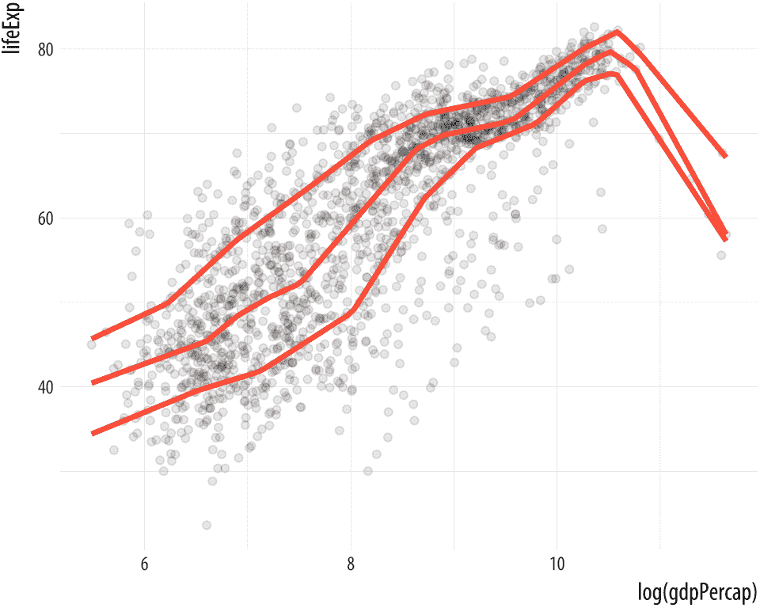
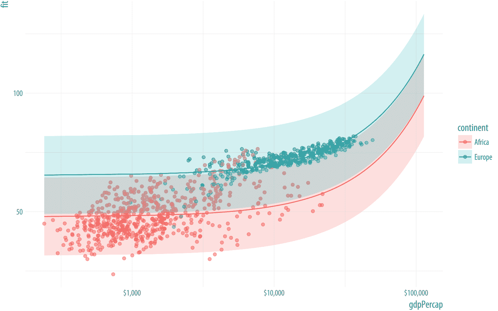
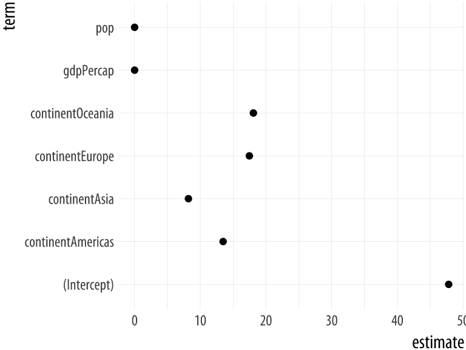
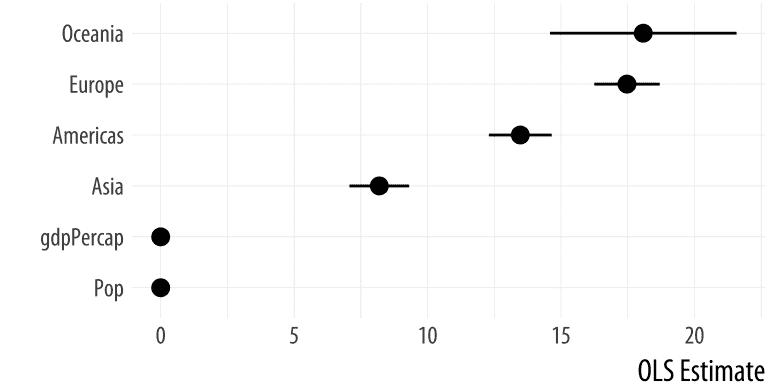
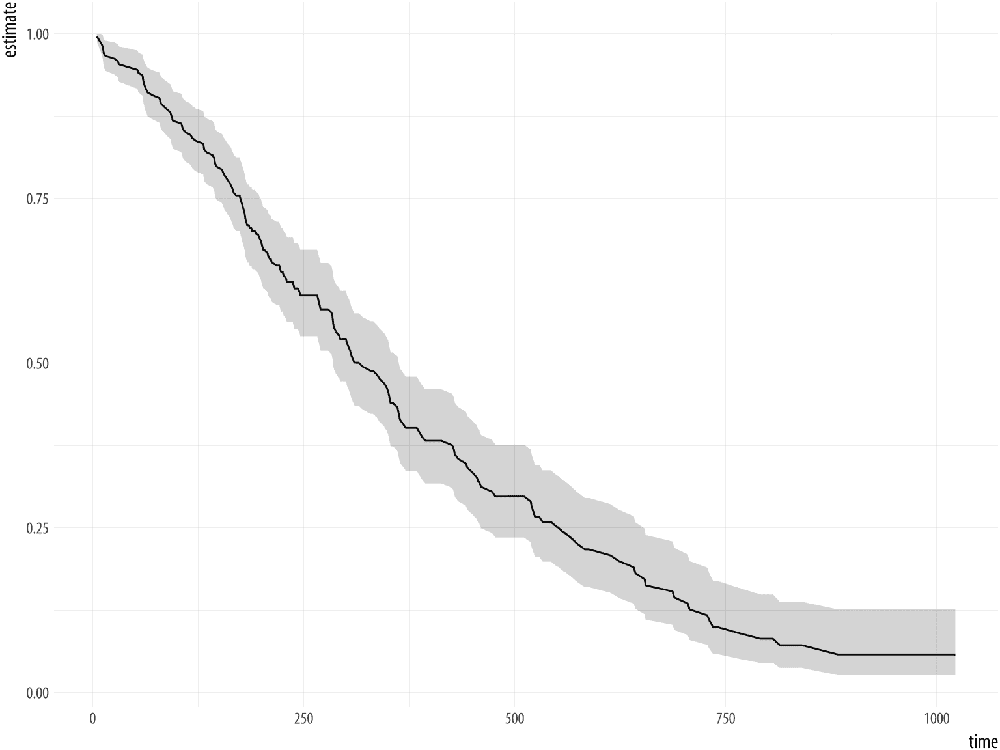
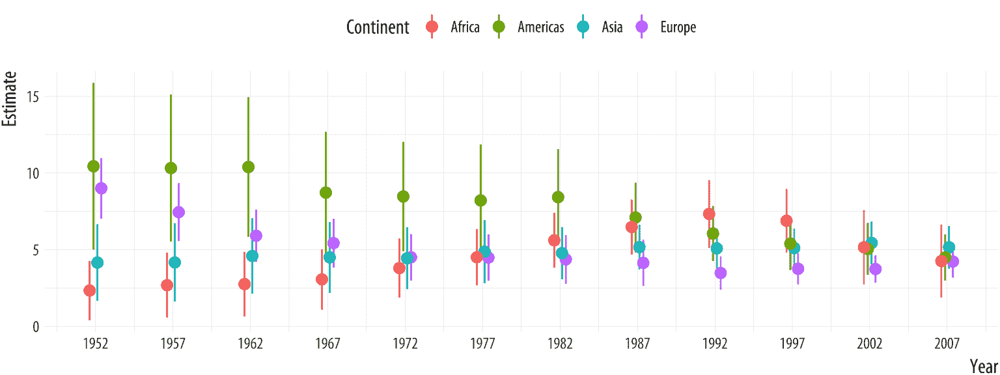
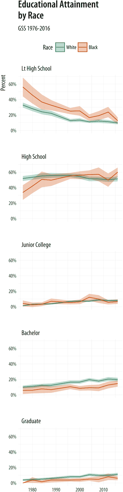

# 6 与模型一起工作

> 原文：[`socviz.co/modeling.html`](https://socviz.co/modeling.html)

数据可视化不仅仅是生成显示数据表中原始数字的图表。从一开始，它就涉及到总结或转换数据的一部分，然后绘制结果。统计模型是这个过程的核心部分。在本章中，我们将首先简要地看看 ggplot 如何直接在 geoms 中使用各种建模技术。然后我们将看到如何使用`broom`和`margins`库整洁地提取和绘制我们自行拟合的模型的估计值。

```r
p <-  ggplot(data = gapminder,
 mapping = aes(x = log(gdpPercap), y = lifeExp))

p +  geom_point(alpha=0.1) +
 geom_smooth(color = "tomato", fill="tomato", method = MASS::rlm) +
 geom_smooth(color = "steelblue", fill="steelblue", method = "lm")

p +  geom_point(alpha=0.1) +
 geom_smooth(color = "tomato", method = "lm", size = 1.2, 
 formula = y ~  splines::bs(x, 3), se = FALSE)

p +  geom_point(alpha=0.1) +
 geom_quantile(color = "tomato", size = 1.2, method = "rqss",
 lambda = 1, quantiles = c(0.20, 0.5, 0.85))
```

直方图、密度图、箱线图和其他 geoms 在绘图之前计算单个数字或新变量。正如我们在 4.4 节中看到的，这些计算是通过`stat_`函数完成的，每个函数都与它的默认`geom_`函数紧密合作，反之亦然。此外，从我们几乎从第一张图开始就绘制的平滑线中，我们已经看到`stat_`函数可以在飞行中进行相当数量的计算甚至模型估计。`geom_smooth()`函数可以接受一系列`method`参数来拟合 LOESS、OLS 和稳健回归线等。

 图 6.1：从上到下：OLS 与稳健回归的比较；多项式拟合；以及分位数回归。

`geom_smooth()`和`geom_quantile()`函数也可以被指示使用不同的公式来生成它们的拟合。在图 6.1 的上半部分，我们访问了`MASS`库的`rlm`函数来拟合稳健回归线。在第二部分，`bs`函数直接从`splines`库中调用，以拟合数据的多项式曲线。这是与我们之前多次使用`scales`库中的函数时直接访问函数而不加载整个库相同的方法。同时，`geom_quantile()`函数类似于`geom_smooth()`的专用版本，可以使用各种方法拟合分位数回归线。`quantiles`参数接受一个向量，指定拟合线的分位数。

## 6.1 同时展示多个拟合，并带有图例

正如我们在图 6.1 的第一个面板中看到的，我们绘制了 OLS 和稳健回归线，我们可以通过在 `geom_smooth()` 上叠加新的平滑器来同时查看同一图上的几个拟合。只要我们为每个拟合设置不同的 `color` 和 `fill` 美学值，我们就可以轻松地通过视觉来区分它们。然而，ggplot 不会绘制一个引导我们了解哪个拟合是哪个的图例。这是因为平滑器之间没有逻辑上的联系。它们作为单独的层存在。如果我们正在比较几个不同的拟合并希望有一个描述它们的图例怎么办？

事实上，`geom_smooth()` 可以通过将 `color` 和 `fill` 美学映射到描述我们正在拟合的模型的字符串的稍微不寻常的路线来实现这一点，然后使用 `scale_color_manual()` 和 `scale_fill_manual()` 来创建图例。首先，我们使用 RColorBrewer 库中的 `brewer.pal()` 从更大的调色板中提取三个质量上不同的颜色。颜色以十六进制值表示。像以前一样，使用 `::` 习惯用法来使用函数而不加载整个库：

```r
model_colors <-  RColorBrewer::brewer.pal(3, "Set1")
model_colors
```

```r
## [1] "#E41A1C" "#377EB8" "#4DAF4A"
```

然后，我们创建一个包含三个不同平滑器的图表，将颜色和填充映射到 `aes()` 函数内的平滑器名称：

```r
p0 <-  ggplot(data = gapminder,
 mapping = aes(x = log(gdpPercap), y = lifeExp))

p1 <-  p0 +  geom_point(alpha = 0.2) +
 geom_smooth(method = "lm", aes(color = "OLS", fill = "OLS")) +
 geom_smooth(method = "lm", formula = y ~  splines::bs(x, df = 3),
 aes(color = "Cubic Spline", fill = "Cubic Spline")) +
 geom_smooth(method = "loess",
 aes(color = "LOESS", fill = "LOESS"))

p1 +  scale_color_manual(name = "Models", values = model_colors) +
 scale_fill_manual(name = "Models", values = model_colors) +
 theme(legend.position = "top")
```

图 6.2：使用图例拟合平滑器。


在某种程度上，我们在这里稍微作弊了一点，让图表工作。到目前为止，我们总是将美学映射到变量的名称，而不是像“OLS”或“Cubic Splines”这样的字符串。在第三章，当我们讨论映射与设置美学时，我们看到了当我们尝试通过在 `aes()` 函数内部将它们设置为“紫色”来更改散点图中点的颜色时发生了什么。结果是，点变成了红色，因为 ggplot 实际上创建了一个新变量并将其标记为“紫色”。我们了解到 `aes()` 函数是用来将变量映射到美学的。

在这里，我们利用这种行为，为我们的每个模型创建一个新的单值变量来命名。如果我们调用 `scale_color_manual()` 和 `scale_fill_manual()`，Ggplot 将正确构建相关的指南。记住，我们必须调用两个缩放函数，因为我们有两个映射。结果是包含我们的三个平滑器，以及一个适当的图例来引导读者的单个图表。

这些模型拟合功能使 ggplot 非常适用于探索性工作，并且使生成和比较基于模型的趋势和其他摘要作为描述性数据可视化过程的一部分变得简单直接。各种 `stat_` 函数是向图表添加各种类型总结估计的灵活方式。但我们也希望得到更多，包括展示我们拟合的模型的结果。

## 6.2 查看模型对象内部

在本书中，涵盖 R 中拟合统计模型的细节超出了范围。对于该主题的全面、现代介绍，你应该阅读（Gelman & Hill, 2018）。（Harrell, 2016）在建模与绘图数据之间的许多实际联系方面也非常出色。同样，（Gelman, 2004）详细讨论了将图形作为模型检查和验证工具的使用。在这里，我们将讨论一些方法，通过这些方法可以从你拟合的模型中提取出易于在 ggplot 中处理的信息。我们的目标，一如既往，是从对象存储的任何方式到我们可以绘制的整洁数字表。R 中大多数统计模型类都将包含我们需要的信息，或者将有一组特殊的函数或方法，用于提取它。

我们可以先了解一下在 R 中模型输出是如何存储的。记住，我们始终在处理对象，而对象具有由命名部分组成的内部结构。有时这些是单个数字，有时是向量，有时是向量、矩阵或公式等类似列表的事物。

我们一直在广泛地使用 tibbles 和数据框。这些存储具有命名列的数据表，可能包含不同类型的变量，如整数、字符、日期或因子。模型对象又更复杂一些。

```r
gapminder
```

```r
## # A tibble: 1,704 x 6
##    country     continent  year lifeExp      pop gdpPercap
##    <fct>       <fct>     <int>   <dbl>    <int>     <dbl>
##  1 Afghanistan Asia       1952    28.8  8425333       779
##  2 Afghanistan Asia       1957    30.3  9240934       821
##  3 Afghanistan Asia       1962    32.0 10267083       853
##  4 Afghanistan Asia       1967    34.0 11537966       836
##  5 Afghanistan Asia       1972    36.1 13079460       740
##  6 Afghanistan Asia       1977    38.4 14880372       786
##  7 Afghanistan Asia       1982    39.9 12881816       978
##  8 Afghanistan Asia       1987    40.8 13867957       852
##  9 Afghanistan Asia       1992    41.7 16317921       649
## 10 Afghanistan Asia       1997    41.8 22227415       635
## # ... with 1,694 more rows
```

记住，我们可以使用 `str()` 函数来了解任何对象的内部结构。例如，我们可以获取一些关于 `gapminder` 对象属于哪个类（或哪些类），它有多大，以及它包含哪些组件的信息。`str(gapminder)` 的输出有些密集：

```r
## Classes 'tbl_df', 'tbl' and 'data.frame':    1704 obs. of  6 variables:
## $ country : Factor w/ 142 levels "Afghanistan",..: 1 1 ...
## $ continent: Factor w/ 5 levels "Africa","Americas",..: 3 3
##    ...
## $ year : int 1952 1957 ...
## $ lifeExp : num 28.8 ...
## $ pop : int 8425333 9240934 ...
## $ gdpPercap: num 779 ...
```

这里有很多关于整个对象及其每个变量的信息。同样，R 中的统计模型也有内部结构。但由于模型比数据表更复杂，其结构也相应地更复杂。有更多的信息片段，以及更多种类的信息，我们可能希望使用。所有这些信息通常都存储在模型对象的部分中，或者可以从模型对象的部分计算得出。

我们可以使用 `gapminder` 数据创建一个线性模型，一个普通的 OLS 回归。这个数据集具有国家-年结构，使得像这样的 OLS 规定是错误的。但现在先不要管这个。我们使用 `lm()` 函数运行模型，并将其存储在一个名为 `out` 的对象中：

```r
out <-  lm(formula = lifeExp ~  gdpPercap +  pop +  continent,
 data = gapminder)
```

第一个参数是模型的公式。`lifeExp` 是因变量，波浪号 `~` 操作符用于指定模型的左右两侧（包括在 `facet_wrap()` 中，我们看到的模型只有右侧的情况。）

让我们通过让 R 打印模型摘要来查看结果。

```r
summary(out)
```

```r
## 
## Call:
## lm(formula = lifeExp ~ gdpPercap + pop + continent, data = gapminder)
## 
## Residuals:
##    Min     1Q Median     3Q    Max 
## -49.16  -4.49   0.30   5.11  25.17 
## 
## Coefficients:
##                   Estimate Std. Error t value Pr(>|t|)    
## (Intercept)       4.78e+01   3.40e-01  140.82   <2e-16 ***
## gdpPercap         4.50e-04   2.35e-05   19.16   <2e-16 ***
## pop               6.57e-09   1.98e-09    3.33    9e-04 ***
## continentAmericas 1.35e+01   6.00e-01   22.46   <2e-16 ***
## continentAsia     8.19e+00   5.71e-01   14.34   <2e-16 ***
## continentEurope   1.75e+01   6.25e-01   27.97   <2e-16 ***
## continentOceania  1.81e+01   1.78e+00   10.15   <2e-16 ***
## ---
## Signif. codes:  0 '***' 0.001 '**' 0.01 '*' 0.05 '.' 0.1 ' ' 1
## 
## Residual standard error: 8.37 on 1697 degrees of freedom
## Multiple R-squared:  0.582,  Adjusted R-squared:  0.581 
## F-statistic:  394 on 6 and 1697 DF,  p-value: <2e-16
```

当我们对`out`使用`summary()`函数时，我们并没有得到模型对象内容的简单反馈。相反，像任何函数一样，`summary()`接收其输入，执行一些操作，并产生输出。在这种情况下，打印到控制台的信息部分是存储在模型对象中的信息，部分是`summary()`函数计算并格式化以在屏幕上显示的信息。幕后，`summary()`从其他函数那里获得帮助。不同类的对象都有与之关联的默认*方法*，因此当通用的`summary()`函数应用于线性模型对象时，该函数知道将工作传递给一个更专业的函数，该函数执行一系列适合线性模型对象的计算和格式化。我们也在数据框上使用相同的通用`summary()`函数，如`summary(gapminder)`，但在那种情况下，应用了一个不同的默认方法。

 图 6.3：线性模型对象的示意图。

`summary()`函数的输出提供了模型的一个摘要，但直接使用它进行进一步分析是不可能的。例如，如果我们想从模型中绘制某些内容呢？制作图表所需的信息包含在`out`对象中，但如何使用它并不明显。

如果我们用`str(out)`查看模型对象的内部结构，会发现其中包含大量信息。像 R 中的大多数复杂对象一样，`out`被组织成一个由组件或元素组成的列表。其中一些元素本身也是列表。图 6.3 展示了线性模型对象的内容。在这个项目列表中，元素可以是单个值，有的是数据框，有的是更简单项目的附加列表。再次提醒，根据我们之前的讨论，对象可以被看作是像文件系统一样组织：柜子包含抽屉，抽屉可能包含文件夹，文件夹可能包含信息页、整个文档或包含更多文档的文件夹组。作为另一个类比，保持列表的形象，你可以想象一个项目的总待办事项列表，其中顶级标题引导到包含不同类型任务的附加列表。

由 `lm` 创建的 `out` 对象包含几个不同的命名元素。其中一些，例如模型中的残差自由度，只是一个单一的数字。在控制台中尝试 `out$df.residual`。其他的是更大的实体，例如用于拟合模型的 DataFrame，默认情况下被保留。尝试 `out$model`，但要做好准备，因为控制台会打印出很多内容。其他元素是由 R 计算并存储的，例如模型的系数和其他量。例如，你可以尝试 `out$coefficients`、`out$residuals` 和 `out$fitted.values`。其他是一些列表本身（如 `qr`）。所以你可以看到，与存储在模型对象中的信息相比，`summary()` 函数只选择并打印了一小部分核心信息。

就像我们在第 A.1.3 节中看到的早期数据表一样，`summary()` 的输出以一种在传达信息方面*紧凑*和*高效*的方式呈现，但从进一步操作的角度来看，它也是*杂乱无章*的。有一个系数表，但变量名在行中。列名很尴尬，一些信息（例如输出底部）已经被计算并打印出来，但并未存储在模型对象中。

## 6.3 正确获取基于模型的图形

基于统计模型的图形面临着所有有效数据可视化的普通挑战，甚至更多。这是因为模型结果通常携带相当多的额外解释负担和必要的背景知识。模型越复杂，有效地传达这些信息就越困难，而且更容易引导听众或自己陷入错误。在社会科学领域，我们过去十年或十五年来在清晰和诚实地展示基于模型的图形方面的能力有了很大提高。在同样的时期，人们越来越清楚地认识到，某些类型的模型很难理解，即使它们以前被视为建模工具包中的简单元素（Ai & Norton, 2003; Brambor, Clark, & Golder, 2006）。

绘制模型估计与正确估计模型本身密切相关。这意味着学习统计学是没有替代品的。你不应该将图形方法作为理解产生它们的模型的一种替代。虽然这本书不能教你那些材料，但我们可以提出一些关于好的基于模型图形看起来像什么的一般观点，并探讨一些 ggplot 和一些附加库如何使获得好结果更容易的例子。

### 6.3.1 用实质性术语呈现你的发现

有用的基于模型的图表以实质性有意义的方式展示结果，并且可以直接根据分析试图回答的问题进行解释。这意味着在分析中其他变量保持合理值（如均值或中位数）的背景下展示结果。对于连续变量，生成覆盖分布中实质性有意义变化的预测值通常很有用，例如从第 25 百分位数到第 75 百分位数，而不是对感兴趣变量的单单位增量。对于无序分类变量，预测值可能根据数据中的众数类别或对理论上有兴趣的特定类别进行展示。展示实质性可解释的发现通常还意味着使用（有时转换为）读者容易理解的量表。例如，如果你的模型报告的是对数优势，将估计值转换为预测概率将使其更容易解释。所有这些建议都非常通用。这些观点同样适用于在表格而不是图表中展示总结结果。将重点放在你发现的实际意义上并没有什么特别图形化的地方。

### 6.3.2 展示你的信心程度

类似的情况也适用于展示你对结果的不确定性或信心程度。模型估计伴随着各种精确度、置信度、可信度或显著性的度量。展示和解释这些度量通常容易误解，或者过度解释，因为研究人员和观众对置信区间和 p 值等东西的要求超过了这些统计量所能提供的。至少，在决定适当的模型拟合度量或正确的置信度评估后，你应该在展示结果时展示它们的范围。一系列相关的 ggplot geoms 允许你展示由 x 轴上的位置定义的范围或区间，然后在 y 轴上展示`ymin`和`ymax`的范围。这些 geoms 包括`geom_pointrange()`和`geom_errorbar()`，我们很快就会看到它们的应用。相关 geom，`geom_ribbon()`使用相同的参数来绘制填充区域，并且对于在某个连续变化的 x 轴上绘制 y 轴值范围很有用。

### 6.3.3 在可能的情况下展示你的数据

绘制多元模型的成果通常意味着两种情况之一。首先，我们可以展示一个系数表，其中包含相关的置信度度量，可能将系数组织成有意义的组，或按预测关联的大小，或者两者兼而有之。其次，我们可以展示某些变量（而不仅仅是模型的系数）在感兴趣的范围内的预测值。后一种方法允许我们在需要时展示原始数据点。ggplot 通过层层构建图形的方式使我们能够轻松地将模型估计（例如，回归线和相关的范围）与底层数据结合起来。实际上，这些是我们从本书开始就一直在使用 `geom_smooth()` 产生的自动生成的图形的手动构建版本。

## 6.4 生成预测图形

因此，在拟合了一个模型之后，我们可能想要了解它在某些特定变量的范围内产生的估计值，同时将其他协变量保持在其合理的值上。`predict()` 函数是使用模型对象产生此类预测的一种通用方式。在 R 中，“通用”函数接收它们的输入并将它们传递给后台的更具体函数，这些函数适合与我们所拥有的特定类型的模型对象一起工作。例如，从 OLS 模型中获取预测值的细节将会有所不同，从逻辑回归中获取预测值。但在每种情况下，我们都可以使用相同的 `predict()` 函数，同时注意检查文档以了解我们正在使用的模型类型的结果返回形式。R 中许多最常用的函数都是这种通用方式。例如，`summary()` 函数可以处理许多不同类别的对象，从向量到数据框和统计模型，通过后台的特定类函数产生适当的输出。

为了让 `predict()` 为我们计算新值，它需要一些新数据来拟合模型。我们将生成一个新的数据框，其列与模型原始数据中的变量具有相同的名称，但行具有新的值。一个非常有用的函数 `expand.grid()` 将帮助我们完成这项工作。我们将给它一个变量列表，指定我们想要每个变量取的值范围。然后 `expand.grid()` 将计算给定变量的笛卡尔积，从而生成所有给定值组合的全范围值，创建一个包含所需新数据的新数据框。

在下面的代码片段中，我们使用 `min()` 和 `max()` 获取人均 GDP 的最小值和最大值，然后创建一个在最小值和最大值之间有 100 个等间距元素的向量。我们保持人口数量恒定在其中位数，并让大洲变量取其五个可用的值。

```r
min_gdp <-  min(gapminder$gdpPercap)
max_gdp <-  max(gapminder$gdpPercap)
med_pop <-  median(gapminder$pop)

pred_df <-  expand.grid(gdpPercap = (seq(from = min_gdp,
 to = max_gdp,
 length.out = 100)),
 pop = med_pop,
 continent = c("Africa", "Americas",
 "Asia", "Europe", "Oceania"))

dim(pred_df)
```

```r
## [1] 500   3
```

```r
head(pred_df)
```

```r
##   gdpPercap     pop continent
## 1   241.166 7023596    Africa
## 2  1385.428 7023596    Africa
## 3  2529.690 7023596    Africa
## 4  3673.953 7023596    Africa
## 5  4818.215 7023596    Africa
## 6  5962.477 7023596    Africa
```

现在我们可以使用`predict()`。如果我们给函数提供我们的新数据和模型，而不提供任何其他参数，它将为数据框中的每一行计算拟合值。如果我们指定`interval = 'predict'`作为参数，它将除了点估计外，还会计算 95%的预测区间。

```r
pred_out <-  predict(object = out,
 newdata = pred_df,
 interval = "predict")
head(pred_out)
```

```r
##       fit     lwr     upr
## 1 47.9686 31.5477 64.3895
## 2 48.4830 32.0623 64.9037
## 3 48.9973 32.5767 65.4180
## 4 49.5117 33.0909 65.9325
## 5 50.0260 33.6050 66.4471
## 6 50.5404 34.1189 66.9619
```

因为我们知道，根据构造，`pred_df`和`pred_out`中的案例是行与行对应的，我们可以通过列将这两个数据框绑定在一起。当你处理数据时，这种方法连接或合并表**绝对不推荐**。

```r
pred_df <-  cbind(pred_df, pred_out)
head(pred_df)
```

```r
##   gdpPercap     pop continent  fit  lwr  upr
## 1       241 7023596    Africa 48.0 31.5 64.4
## 2      1385 7023596    Africa 48.5 32.1 64.9
## 3      2530 7023596    Africa 49.0 32.6 65.4
## 4      3674 7023596    Africa 49.5 33.1 65.9
## 5      4818 7023596    Africa 50.0 33.6 66.4
## 6      5962 7023596    Africa 50.5 34.1 67.0
```

最终结果是整洁的数据框，包含模型对我们指定的值范围的预测值。现在我们可以绘制结果。因为我们生成了完整的预测值范围，我们可以决定是否使用所有这些值。在这里，我们进一步将预测子集为仅针对欧洲和非洲的预测。

```r
p <-  ggplot(data = subset(pred_df, continent %in%  c("Europe", "Africa")),
 aes(x = gdpPercap,
 y = fit, ymin = lwr, ymax = upr,
 color = continent,
 fill = continent,
 group = continent))

p +  geom_point(data = subset(gapminder,
 continent %in%  c("Europe", "Africa")),
 aes(x = gdpPercap, y = lifeExp,
 color = continent),
 alpha = 0.5,
 inherit.aes = FALSE) + 
 geom_line() +
 geom_ribbon(alpha = 0.2, color = FALSE) +
 scale_x_log10(labels = scales::dollar)
```

图 6.4：OLS 预测。



我们在这里使用一个新的几何形状来绘制预测区间所覆盖的区域：`geom_ribbon()`。它像线条一样接受一个`x`参数，但还需要一个`ymin`和`ymax`参数，这些参数在`ggplot()`的美学映射中指定。这定义了预测区间的上下限。

在实践中，你可能不会经常直接使用`predict()`。相反，你可能会编写使用额外库的代码，这些库封装了从模型生成预测和绘图的过程。这些库特别有用，当你模型稍微复杂一些，系数的解释变得困难时。例如，当你有一个二元结果变量，需要将逻辑回归的结果转换为预测概率，或者当你预测中有交互项时。我们将在下一节讨论一些这些辅助库。然而，请记住，`predict()`及其与不同类别的模型安全交互的能力是许多这些库的基础。因此，首先亲自了解它的实际操作是有用的。

## 6.5 使用 broom 整理模型对象

`predict`方法非常有用，但我们可能还想用我们的模型输出做很多其他事情。我们将使用 David Robinson 的`broom`包来帮助我们。这是一个函数库，帮助我们从 R 生成的模型结果中得到我们可以用于绘图的数字。它将模型对象的一些部分转换成你可以轻松与 ggplot 一起使用的数据框。

```r
library(broom)
```

Broom 库采用了 ggplot 对整洁数据的处理方法，并将其扩展到 R 生成的模型对象。其方法可以整洁地提取三种类型的信息。首先，我们可以看到模型本身的*组件级*信息，例如系数和 t 统计量。其次，我们可以获得模型与底层数据连接的*观测级*信息。这包括数据中每个观测值的拟合值和残差。最后，我们可以获取*模型级*信息，它总结了整个拟合，例如 F 统计量、模型偏差或 r 平方。对于这些任务，每个都有`broom`函数。

### 6.5.1 使用 tidy()获取组件级统计量

`tidy()`函数接受一个模型对象，并返回一个包含组件级信息的 DataFrame。我们可以用这种方式工作，以熟悉的方式制作图表，比在模型对象内部提取各种项要容易得多。以下是一个示例，使用刚刚返回的默认结果。为了更方便地显示结果，我们将使用`tidy()`创建的对象通过一个函数进行管道处理，该函数将 DataFrame 的数值列四舍五入到两位小数。当然，这不会改变对象本身。

```r
out_comp <-  tidy(out)
out_comp %>%  round_df()
```

```r
##                term estimate std.error statistic p.value
## 1       (Intercept)    47.81      0.34    140.82       0
## 2         gdpPercap     0.00      0.00     19.16       0
## 3               pop     0.00      0.00      3.33       0
## 4 continentAmericas    13.48      0.60     22.46       0
## 5     continentAsia     8.19      0.57     14.34       0
## 6   continentEurope    17.47      0.62     27.97       0
## 7  continentOceania    18.08      1.78     10.15       0
```

现在我们能够将这个数据框当作我们迄今为止看到的所有其他数据来处理。

 图 6.5：OLS 估计的基本图表。

```r
p <-  ggplot(out_comp, mapping = aes(x = term,
 y = estimate))

p +  geom_point() +  coord_flip() 
```

我们可以用各种方式扩展和清理这个图表。例如，我们可以告诉`tidy()`使用 R 的`confint()`函数计算估计值的置信区间。

```r
out_conf <-  tidy(out, conf.int = TRUE)
out_conf %>%  round_df()
```

```r
##                term estimate std.error statistic p.value conf.low conf.high
## 1       (Intercept)    47.81      0.34    140.82       0    47.15     48.48
## 2         gdpPercap     0.00      0.00     19.16       0     0.00      0.00
## 3               pop     0.00      0.00      3.33       0     0.00      0.00
## 4 continentAmericas    13.48      0.60     22.46       0    12.30     14.65
## 5     continentAsia     8.19      0.57     14.34       0     7.07      9.31
## 6   continentEurope    17.47      0.62     27.97       0    16.25     18.70
## 7  continentOceania    18.08      1.78     10.15       0    14.59     21.58
```

通过`socviz`库提供的便利“不在”操作符`%nin%`，我们可以选择仅包含在第一个字符向量中且不在第二个中的项目。我们将使用它从表中删除截距项。我们还想对标签做一些处理。当用分类变量拟合模型时，R 会根据变量名和类别名创建系数名称，例如`continentAmericas`。通常，我们希望在绘图之前清理这些名称。最常见的情况是我们只想去除系数标签开头的变量名。为此，我们可以使用`socviz`库中的便利函数`prefix_strip()`。我们告诉它要去除哪些前缀，使用它来在`out_conf`中创建一个新列变量，该变量对应于`terms`列，但具有更好的标签。

```r
out_conf <-  subset(out_conf, term %nin% "(Intercept)")
out_conf$nicelabs <-  prefix_strip(out_conf$term, "continent")
```

现在，我们可以使用`geom_pointrange()`制作一个显示我们对变量估计的信心信息的图表，而不仅仅是系数。与之前的箱线图一样，我们使用`reorder()`按`estimate`变量对模型的项名进行排序，从而按效应的大小从大到小排列我们的图表。

 图 6.6：OLS 估计和置信区间的更漂亮的图。

```r
p <-  ggplot(out_conf, mapping = aes(x = reorder(nicelabs, estimate),
 y = estimate, ymin = conf.low, ymax = conf.high))
p +  geom_pointrange() +  coord_flip() +  labs(x="", y="OLS Estimate")
```

这种类型的点图可以非常紧凑。垂直轴通常可以压缩很多，而不会影响理解。事实上，它们通常在行与行之间有更少的间隔时更容易阅读，比默认的方形形状给出的间隔要小得多。

### 6.5.2 使用 augment() 获取观测级统计信息

`augment()` 返回的值都是计算在原始观测水平上的统计数据。因此，它们可以添加到模型基于的数据框中。从 `augment()` 的调用开始工作将返回一个数据框，其中包含用于模型估计的所有原始观测值，以及以下列：

+   `.fitted` — 模型的拟合值。

+   `.se.fit` — 拟合值的标准误差。

+   `.resid` — 残差。

+   `.hat` — 帽矩阵的对角线。

+   `.sigma` — 当从模型中删除相应的观测值时，残差标准差的估计。

+   `.cooksd` — Cook 距离，一个常见的回归诊断；以及

+   `.std.resid` — 标准化残差。

每个这些变量都以一个前置点命名，例如 `.hat` 而不是 `hat`，依此类推。这样做是为了防止意外将其与（或意外覆盖）具有相同名称的现有变量混淆。返回的值列将根据所拟合的模型类别略有不同。

```r
out_aug <-  augment(out)
head(out_aug) %>%  round_df()
```

```r
##   lifeExp gdpPercap      pop continent .fitted .se.fit .resid .hat .sigma .cooksd .std.resid
## 1    28.8       779  8425333      Asia    56.4    0.47  -27.6    0   8.34    0.01      -3.31
## 2    30.3       821  9240934      Asia    56.4    0.47  -26.1    0   8.34    0.00      -3.13
## 3    32.0       853 10267083      Asia    56.5    0.47  -24.5    0   8.35    0.00      -2.93
## 4    34.0       836 11537966      Asia    56.5    0.47  -22.4    0   8.35    0.00      -2.69
## 5    36.1       740 13079460      Asia    56.4    0.47  -20.3    0   8.35    0.00      -2.44
## 6    38.4       786 14880372      Asia    56.5    0.47  -18.0    0   8.36    0.00      -2.16
```

默认情况下，`augment()` 将从模型对象中提取可用的数据。这通常包括模型本身使用的变量，但不包括原始数据框中包含的任何附加变量。有时这些变量是有用的。我们可以通过指定 `data` 参数来添加它们：

```r
out_aug <-  augment(out, data = gapminder)
head(out_aug) %>%  round_df()
```

```r
##       country continent year lifeExp      pop gdpPercap .fitted .se.fit .resid .hat .sigma .cooksd
## 1 Afghanistan      Asia 1952    28.8  8425333       779    56.4    0.47  -27.6    0   8.34    0.01
## 2 Afghanistan      Asia 1957    30.3  9240934       821    56.4    0.47  -26.1    0   8.34    0.00
## 3 Afghanistan      Asia 1962    32.0 10267083       853    56.5    0.47  -24.5    0   8.35    0.00
## 4 Afghanistan      Asia 1967    34.0 11537966       836    56.5    0.47  -22.4    0   8.35    0.00
## 5 Afghanistan      Asia 1972    36.1 13079460       740    56.4    0.47  -20.3    0   8.35    0.00
## 6 Afghanistan      Asia 1977    38.4 14880372       786    56.5    0.47  -18.0    0   8.36    0.00
##   .std.resid
## 1      -3.31
## 2      -3.13
## 3      -2.93
## 4      -2.69
## 5      -2.44
## 6      -2.16
```

如果为了拟合模型而删除了一些包含缺失数据的行，那么这些行将不会传递到增强数据框中。

`augment()` 创建的新列可以用来创建一些标准的回归图。例如，我们可以绘制残差与拟合值的关系图。图 6.7 建议的是，不出所料，我们的国家-年数据比我们的 OLS 模型所捕捉的结构要复杂得多。

 图 6.7：残差与拟合值。

```r
p <-  ggplot(data = out_aug,
 mapping = aes(x = .fitted, y = .resid))
p +  geom_point()
```

### 6.5.3 使用 glance() 获取模型级统计信息

此函数组织通常在模型 `summary()` 输出底部呈现的信息。它本身通常只返回一个包含单行的表格。但正如我们很快将看到的，`broom` 方法真正的力量在于它能够扩展到我们对数据进行分组或子采样的情况。

```r
glance(out) %>%  round_df()
```

```r
##   r.squared adj.r.squared sigma statistic p.value df
## 1      0.58          0.58  8.37    393.91       0  7
##     logLik     AIC     BIC deviance df.residual
## 1 -6033.83 12083.6 12127.2   118754        1697
```

Broom 能够整理（以及增强和浏览）广泛的模型类型。并非所有函数都适用于所有模型类别。有关可用性的更多详细信息，请参阅 broom 的文档。例如，这里是一个从事件历史分析的整理输出创建的图表。首先，我们生成一些生存数据的 Cox 比例风险模型。

```r
library(survival)

out_cph <-  coxph(Surv(time, status) ~  age +  sex, data = lung)
out_surv <-  survfit(out_cph)
```

在这里，拟合的细节并不重要，但在第一步中，`Surv()` 函数创建了比例风险模型的响应或结果变量，然后由 `coxph()` 函数进行拟合。然后，`survfit()` 函数从模型中创建生存曲线，就像我们之前使用 `predict()` 生成预测值一样。尝试 `summary(out_cph)` 来查看模型，以及 `summary(out_surv)` 来查看将构成我们绘图基础的预测值表。接下来，我们将 `out_surv` 整理成数据框，并绘制它。

 图 6.8：Kaplan-Meier 图。

```r
out_tidy <-  tidy(out_surv)

p <-  ggplot(data = out_tidy, mapping = aes(time, estimate))
p +  geom_line() +
 geom_ribbon(mapping = aes(ymin = conf.low, ymax = conf.high), alpha = .2)
```

## 6.6 分组分析和列表列

Broom 使得能够快速将模型拟合到数据的不同子集，并从另一端获得一致且可用的结果表。例如，假设我们想通过检查预期寿命和 GDP 之间的关系来查看 gapminder 数据，对于数据中的每一年，按大陆进行。

`gapminder` 数据在底部按国家-年份组织。这是行中的观测单位。如果我们愿意，我们可以手动截取数据的一部分，例如“1962 年观察到的所有亚洲国家”或“2002 年的所有非洲国家”。这里是“欧洲，1977 年”：

```r
eu77 <-  gapminder %>%  filter(continent == "Europe", year ==  1977)
```

我们可以查看该大陆-年份组预期寿命和 GDP 之间的关系：

```r
fit <-  lm(lifeExp ~  log(gdpPercap), data = eu77)
summary(fit)
```

```r
## 
## Call:
## lm(formula = lifeExp ~ log(gdpPercap), data = eu77)
## 
## Residuals:
##    Min     1Q Median     3Q    Max 
## -7.496 -1.031  0.093  1.176  3.712 
## 
## Coefficients:
##                Estimate Std. Error t value Pr(>|t|)    
## (Intercept)      29.489      7.161    4.12  0.00031 ***
## log(gdpPercap)    4.488      0.756    5.94  2.2e-06 ***
## ---
## Signif. codes:  
## 0 '***' 0.001 '**' 0.01 '*' 0.05 '.' 0.1 ' ' 1
## 
## Residual standard error: 2.11 on 28 degrees of freedom
## Multiple R-squared:  0.557,  Adjusted R-squared:  0.541 
## F-statistic: 35.2 on 1 and 28 DF,  p-value: 2.17e-06
```

使用 `dplyr` 和 `broom`，我们可以以紧凑和整洁的方式对数据中的每个大陆-年份切片进行操作。我们从一个数据表开始，然后使用 `group_by()` 函数按 `continent` 和 `year` 对国家进行分组。我们在第四章节中介绍了这种分组操作。我们的数据首先按大陆重新组织，然后在大陆内部按年份。这里我们将采取进一步的一步，*嵌套* 构成每个组的数据：

```r
out_le <-  gapminder %>%
 group_by(continent, year) %>%
 nest()

out_le
```

```r
## # A tibble: 60 x 3
##    continent  year data             
##    <fct>     <int> <list>           
##  1 Asia       1952 <tibble [33 × 4]>
##  2 Asia       1957 <tibble [33 × 4]>
##  3 Asia       1962 <tibble [33 × 4]>
##  4 Asia       1967 <tibble [33 × 4]>
##  5 Asia       1972 <tibble [33 × 4]>
##  6 Asia       1977 <tibble [33 × 4]>
##  7 Asia       1982 <tibble [33 × 4]>
##  8 Asia       1987 <tibble [33 × 4]>
##  9 Asia       1992 <tibble [33 × 4]>
## 10 Asia       1997 <tibble [33 × 4]>
## # ... with 50 more rows
```

将 `nest()` 的作用视为 `group_by()` 的更加强化的版本。结果对象具有我们期望的表格形式（它是一个 tibble），但看起来有些不寻常。前两列是熟悉的 `continent` 和 `year`。但我们现在还有一个新的列，`data`，它包含对应于每个 continent-year 组的小型数据表。这是一个 *列表列*，我们之前没有见过。它被证明在将复杂对象（在这种情况下，作为 tibbles 的列表，每个都是一个 33x4 的数据表）捆绑到我们的数据行（保持表格形式）中非常有用。我们的“欧洲 1977”拟合就在其中。如果我们愿意，可以通过过滤数据然后 *解包* 列表列来查看它。

```r
out_le %>%  filter(continent == "Europe" &  year ==  1977) %>%  unnest()
```

```r
## # A tibble: 30 x 6
##    continent  year country         lifeExp    pop gdpPercap
##    <fct>     <int> <fct>             <dbl>  <int>     <dbl>
##  1 Europe     1977 Albania            68.9 2.51e⁶      3533
##  2 Europe     1977 Austria            72.2 7.57e⁶     19749
##  3 Europe     1977 Belgium            72.8 9.82e⁶     19118
##  4 Europe     1977 Bosnia and Her…    69.9 4.09e⁶      3528
##  5 Europe     1977 Bulgaria           70.8 8.80e⁶      7612
##  6 Europe     1977 Croatia            70.6 4.32e⁶     11305
##  7 Europe     1977 Czech Republic     70.7 1.02e⁷     14800
##  8 Europe     1977 Denmark            74.7 5.09e⁶     20423
##  9 Europe     1977 Finland            72.5 4.74e⁶     15605
## 10 Europe     1977 France             73.8 5.32e⁷     18293
## # ... with 20 more rows
```

列表列是有用的，因为我们可以在紧凑且整洁的方式上对其采取行动。特别是，我们可以将函数传递给列表列的每一行，并使其发生一些事情。例如，刚才我们运行了 1977 年欧洲国家的预期寿命和对数 GDP 的回归。我们可以对数据中的每个大陆-年份组合都这样做。我们首先创建了一个名为`fit_ols()`的便利函数，它接受一个单一参数`df`（代表数据框）并拟合我们感兴趣的线性模型。然后，映射操作是函数式编程中的一个重要思想。如果你在其他更命令式的语言中编写过代码，你可以将其视为编写 for … next 循环的紧凑替代方案。当然，你可以在 R 中编写这样的循环。在计算上，它们通常并不比它们的函数式替代方案效率低。但是，将函数映射到数组中更容易集成到一系列数据转换中。我们将该函数依次映射到我们的列表列的每一行。回想一下，在第四章中，`mutate`函数在管道中动态创建新变量或列。

```r
fit_ols <-  function(df) {
 lm(lifeExp ~  log(gdpPercap), data = df)
}

out_le <-  gapminder %>%
 group_by(continent, year) %>%
 nest() %>% 
 mutate(model = map(data, fit_ols)) 

out_le
```

```r
## # A tibble: 60 x 4
##    continent  year data              model   
##    <fct>     <int> <list>            <list>  
##  1 Asia       1952 <tibble [33 × 4]> <S3: lm>
##  2 Asia       1957 <tibble [33 × 4]> <S3: lm>
##  3 Asia       1962 <tibble [33 × 4]> <S3: lm>
##  4 Asia       1967 <tibble [33 × 4]> <S3: lm>
##  5 Asia       1972 <tibble [33 × 4]> <S3: lm>
##  6 Asia       1977 <tibble [33 × 4]> <S3: lm>
##  7 Asia       1982 <tibble [33 × 4]> <S3: lm>
##  8 Asia       1987 <tibble [33 × 4]> <S3: lm>
##  9 Asia       1992 <tibble [33 × 4]> <S3: lm>
## 10 Asia       1997 <tibble [33 × 4]> <S3: lm>
## # ... with 50 more rows
```

在开始管道之前，我们创建了一个新函数：这是一个便利函数，它的唯一任务是估计某些数据上的特定 OLS 模型。像 R 中的几乎所有东西一样，函数是一种对象。要创建一个新的函数，我们使用稍微特殊的`function()`函数。（极客们喜欢这类东西。）附录中有更多关于创建函数的细节。要查看创建后的`fit_ols()`函数的样子，请在控制台输入`fit_ols`而不带括号。要查看它做什么，尝试`fit_ols(df = gapminder)`或`summary(fit_ols(gapminder))`。

现在我们有两个列表列：`data`和`model`。后者是通过将`fit_ols()`函数映射到`data`的每一行创建的。`model`中的每个元素都是该大陆-年份的线性模型。因此，我们现在有六十个 OLS 拟合，每个大陆-年份分组一个。将模型放入列表列本身对我们并没有太大的帮助。但我们可以提取我们想要的信息，同时保持整洁的表格形式。为了清晰起见，我们将从开始再次运行管道，这次添加一些新步骤。

首先，我们通过将`tidy()`函数从 broom 映射到模型列表列，从每个模型中提取汇总统计量。然后，我们展开结果，在此过程中删除其他列。最后，我们过滤掉所有截距项，并删除来自大洋洲的所有观测值。在截距的情况下，我们这样做只是为了方便。我们删除大洋洲的数据，只是因为那里观测值很少。我们将结果放入一个名为`out_tidy`的对象中。

```r
fit_ols <-  function(df) {
 lm(lifeExp ~  log(gdpPercap), data = df)
}

out_tidy <-  gapminder %>%
 group_by(continent, year) %>%
 nest() %>% 
 mutate(model = map(data, fit_ols),
 tidied = map(model, tidy)) %>%
 unnest(tidied, .drop = TRUE) %>%
 filter(term %nin% "(Intercept)" &
 continent %nin% "Oceania")

out_tidy %>%  sample_n(5)
```

```r
## # A tibble: 5 x 7
##   continent  year term           estimate std.error statistic      p.value
##   <fct>     <int> <chr>             <dbl>     <dbl>     <dbl>        <dbl>
## 1 Europe     1987 log(gdpPercap)     4.14     0.752      5.51 0.00000693  
## 2 Asia       1972 log(gdpPercap)     4.44     1.01       4.41 0.000116    
## 3 Europe     1972 log(gdpPercap)     4.51     0.757      5.95 0.00000208  
## 4 Americas   1952 log(gdpPercap)    10.4      2.72       3.84 0.000827    
## 5 Asia       1987 log(gdpPercap)     5.17     0.727      7.12 0.0000000531
```

我们现在有了整洁的回归输出，其中包含了每年大陆间人均 GDP 对寿命的关联估计。我们可以以利用其分组特性的方式绘制这些估计值。

```r
p <-  ggplot(data = out_tidy,
 mapping = aes(x = year, y = estimate,
 ymin = estimate -  2*std.error,
 ymax = estimate +  2*std.error,
 group = continent, color = continent))

p +  geom_pointrange(position = position_dodge(width = 1)) +
 scale_x_continuous(breaks = unique(gapminder$year)) + 
 theme(legend.position = "top") +
 labs(x = "Year", y = "Estimate", color = "Continent")
```



图 6.9：按大洲汇总的 GDP 与预期寿命之间的年度估计。

在`geom_pointrange()`中调用`position_dodge()`允许每个大洲的点范围在年份内彼此靠近，而不是直接重叠在一起。我们本可以通过大洲进行分面，但这样做可以让我们更容易地看到年度估计的差异。这种技术不仅对这种案例非常有用，而且在你想比较不同类型的统计模型给出的系数时也非常有用。当我们对比较，比如说，OLS 与其他模型规格的表现感兴趣时，这种情况有时会发生。

## 6.7 绘制边际效应

我们之前关于`predict()`的讨论是关于获得模型中某些系数的平均效应估计，扣除模型中的其他项。在过去十年中，从模型中估计和绘制*部分*或*边际效应*已成为一种越来越常见的准确和具有解释性预测的展示方式。边际效应图的热潮是由意识到逻辑回归模型中的项的解释比看起来要复杂得多的认识所激发的——特别是在模型中有交互项时（Ai & Norton, 2003）。托马斯·利珀的`margins`包可以为我们绘制这些图。

```r
library(margins)
```

要看到它的实际应用，我们将再次查看`gss_sm`中的综合社会调查数据，这次重点关注二元变量`obama`。与选举的回顾性问题一样，声称投票给奥巴马的人数比他在选举中获得的选票份额要多得多。如果受访者表示他们在 2012 年总统选举中投票给了巴拉克·奥巴马，则编码为`1`，否则为`0`。在这种情况下，主要是为了方便，零编码包括所有其他问题的答案，包括表示他们投票给了米特·罗姆尼的人，表示他们没有投票的人，拒绝回答的人，以及表示他们不知道自己投给了谁的人。我们将对`obama`进行逻辑回归，以`age`、`polviews`、`race`和`sex`作为预测变量。`age`变量是受访者的年龄（以年为单位）。`sex`变量编码为“Male”或“Female”，其中“Male”为参考类别。`race`变量编码为“White”、“Black”或“Other”，其中“White”为参考类别。`polviews`衡量标准是受访者政治倾向的自我报告量表，从“极端保守”到“极端自由”，中间为“Moderate”。我们使用`polviews`并创建一个新的变量`polviews_m`，使用`relevel()`函数将“Moderate”重新编码为参考类别。我们使用`glm()`函数拟合模型，并指定`race`和`sex`之间的交互作用。

```r
gss_sm$polviews_m <-  relevel(gss_sm$polviews, ref = "Moderate")

out_bo <-  glm(obama ~  polviews_m +  sex*race,
 family = "binomial", data = gss_sm)
summary(out_bo)
```

```r
## 
## Call:
## glm(formula = obama ~ polviews_m + sex * race, family = "binomial", 
##     data = gss_sm)
## 
## Deviance Residuals: 
##    Min      1Q  Median      3Q     Max  
## -2.905  -0.554   0.177   0.542   2.244  
## 
## Coefficients:
##                                  Estimate Std. Error z value Pr(>|z|)    
## (Intercept)                       0.29649    0.13409    2.21   0.0270 *  
## polviews_mExtremely Liberal       2.37295    0.52504    4.52  6.2e-06 ***
## polviews_mLiberal                 2.60003    0.35667    7.29  3.1e-13 ***
## polviews_mSlightly Liberal        1.29317    0.24843    5.21  1.9e-07 ***
## polviews_mSlightly Conservative  -1.35528    0.18129   -7.48  7.7e-14 ***
## polviews_mConservative           -2.34746    0.20038  -11.71  < 2e-16 ***
## polviews_mExtremely Conservative -2.72738    0.38721   -7.04  1.9e-12 ***
## sexFemale                         0.25487    0.14537    1.75   0.0796 .  
## raceBlack                         3.84953    0.50132    7.68  1.6e-14 ***
## raceOther                        -0.00214    0.43576    0.00   0.9961    
## sexFemale:raceBlack              -0.19751    0.66007   -0.30   0.7648    
## sexFemale:raceOther               1.57483    0.58766    2.68   0.0074 ** 
## ---
## Signif. codes:  0 '***' 0.001 '**' 0.01 '*' 0.05 '.' 0.1 ' ' 1
## 
## (Dispersion parameter for binomial family taken to be 1)
## 
##     Null deviance: 2247.9  on 1697  degrees of freedom
## Residual deviance: 1345.9  on 1686  degrees of freedom
##   (1169 observations deleted due to missingness)
## AIC: 1370
## 
## Number of Fisher Scoring iterations: 6
```

摘要报告了系数和其他信息。我们现在可以用几种方式中的任何一种来绘制数据。使用`margins()`我们计算每个变量的边际效应：

```r
bo_m <-  margins(out_bo)
summary(bo_m)
```

```r
##                            factor     AME     SE        z      p   lower   upper
##            polviews_mConservative -0.4119 0.0283 -14.5394 0.0000 -0.4674 -0.3564
##  polviews_mExtremely Conservative -0.4538 0.0420 -10.7971 0.0000 -0.5361 -0.3714
##       polviews_mExtremely Liberal  0.2681 0.0295   9.0996 0.0000  0.2103  0.3258
##                 polviews_mLiberal  0.2768 0.0229  12.0736 0.0000  0.2319  0.3218
##   polviews_mSlightly Conservative -0.2658 0.0330  -8.0596 0.0000 -0.3304 -0.2011
##        polviews_mSlightly Liberal  0.1933 0.0303   6.3896 0.0000  0.1340  0.2526
##                         raceBlack  0.4032 0.0173  23.3568 0.0000  0.3694  0.4371
##                         raceOther  0.1247 0.0386   3.2297 0.0012  0.0490  0.2005
##                         sexFemale  0.0443 0.0177   2.5073 0.0122  0.0097  0.0789
```

`margins`库自带几种绘图方法。如果你愿意，现在你可以尝试`plot(bo_m)`来查看平均边际效应的图，其外观类似于 Stata 图形。`margins`库中的其他绘图方法包括`cplot()`，它根据第二个变量可视化边际效应，以及`image()`，它显示预测或边际效应作为填充热图或等高线图。

或者，我们可以自己绘制`margins()`的结果。为了稍微整理一下摘要，我们将其转换为 tibble，然后使用`prefix_strip()`和`prefix_replace()`来整理标签。我们想要去除`polviews_m`和`sex`的前缀，并且（为了避免关于“Other”的歧义），调整`race`的前缀。

```r
bo_gg <-  as_tibble(summary(bo_m))
prefixes <-  c("polviews_m", "sex")
bo_gg$factor <-  prefix_strip(bo_gg$factor, prefixes)
bo_gg$factor <-  prefix_replace(bo_gg$factor, "race", "Race: ")

bo_gg %>%  select(factor, AME, lower, upper) 
```

```r
## # A tibble: 9 x 4
##   factor                     AME    lower   upper
## * <chr>                    <dbl>    <dbl>   <dbl>
## 1 Conservative           -0.412  -0.467   -0.356 
## 2 Extremely Conservative -0.454  -0.536   -0.371 
## 3 Extremely Liberal       0.268   0.210    0.326 
## 4 Liberal                 0.277   0.232    0.322 
## 5 Slightly Conservative  -0.266  -0.330   -0.201 
## 6 Slightly Liberal        0.193   0.134    0.253 
## 7 Race: Black             0.403   0.369    0.437 
## 8 Race: Other             0.125   0.0490   0.200 
## 9 Female                  0.0443  0.00967  0.0789
```

现在我们有一个表格，我们可以像我们学过的那样绘制：

```r
p <-  ggplot(data = bo_gg, aes(x = reorder(factor, AME),
 y = AME, ymin = lower, ymax = upper))

p +  geom_hline(yintercept = 0, color = "gray80") +
 geom_pointrange() +  coord_flip() +
 labs(x = NULL, y = "Average Marginal Effect") 
```

图 6.10：平均边际效应图。


如果我们只想获取特定变量的条件效应，那么方便的是我们可以要求 margins 库中的绘图方法为我们计算效应，但不需要绘制它们的图。相反，它们可以以我们可以在 ggplot 中轻松使用的格式返回结果，并且不需要太多清理工作。例如，使用`cplot()`：

 图 6.11：条件效应图。

```r
pv_cp <-  cplot(out_bo, x = "sex", draw = FALSE)

p <-  ggplot(data = pv_cp, aes(x = reorder(xvals, yvals),
 y = yvals, ymin = lower, ymax = upper))

p +  geom_hline(yintercept = 0, color = "gray80") +
 geom_pointrange() +  coord_flip() +
 labs(x = NULL, y = "Conditional Effect") 
```

`margins`包正在积极开发中。它能够做到比这里描述的更多。该包附带的小节提供了更广泛的讨论和许多示例。

## 6.8 复杂调查的图

社会科学家经常使用复杂调查设计收集的数据。调查工具可能按地区或其他特征分层，包含复杂数据以使其与参考人口可比，具有集群结构，等等。在第四章中，我们学习了如何使用来自综合社会调查（GSS）的一些数据计算并绘制分类变量的频率表。然而，如果我们想从 GSS 中获得美国家庭的准确估计，我们需要考虑调查的设计，并使用数据集中提供的调查权重。托马斯·卢米利的`survey`库提供了一套全面的工具来解决这些问题。这些工具及其背后的理论在卢米利（2010）中进行了详细讨论，而在卢米利（2004）中提供了该包的概述。虽然`survey`包中的函数使用简单，并以整洁的形式返回结果，但该包比 tidyverse 及其惯例早几年。这意味着我们不能直接使用`survey`函数与`dplyr`一起使用。然而，格雷格·弗里德曼·埃利斯编写了一个辅助包`srvyr`，为我们解决了这个问题，并允许我们在熟悉的数据分析管道中使用`survey`库的函数。

例如，`gss_lon`数据包含自 1972 年成立以来 GSS 每一波次的一小部分测量值。它还包含几个描述调查设计并提供各种年份观测值复杂数据的变量。这些技术细节在 GSS 文档中有描述。类似的信息通常由其他复杂调查提供。在这里，我们将使用这些设计信息来计算 1976 年至 2016 年选定调查年份的教育成就分布的加权估计。

首先，我们加载`survey`和`srvyr`库。

```r
library(survey)
library(srvyr)
```

接下来，我们使用`gss_lon`数据集，并利用`survey`工具创建一个新的对象，其中包含数据，就像之前一样，但增加了关于调查设计的额外信息：

```r
options(survey.lonely.psu = "adjust")
options(na.action="na.pass")

gss_wt <-  subset(gss_lon, year >  1974) %>%
 mutate(stratvar = interaction(year, vstrat)) %>%
 as_survey_design(ids = vpsu,
 strata = stratvar,
 weights = wtssall,
 nest = TRUE)
```

在开始时设置的两种 `options` 为 `survey` 库提供了有关如何行为的一些信息。您应该查阅 Lumley (2010) 和 `survey` 包文档以获取详细信息。后续操作创建了一个名为 `gss_wt` 的对象，它有一个额外的列（`stratvar`），描述了每年的抽样层。我们使用 `interaction()` 函数来完成此操作。它将 `vstrat` 变量乘以 `year` 变量，以获取每年层信息的向量。我们必须这样做，因为 GSS 对其层信息进行编码的方式。在下一步中，我们使用 `as_survey_design()` 函数添加有关调查设计的关键信息。它添加有关抽样标识符（`ids`）、层（`strata`）和重复权重（`weights`）的信息。有了这些信息，我们可以利用 `survey` 库中的大量专用函数，这些函数允许我们正确计算加权调查均值或使用正确的抽样规范估计模型。例如，我们可以轻松地计算从 1976 年到 2016 年的一系列年份中按种族划分的教育分布。我们使用 `survey_mean()` 来完成此操作：

```r
out_grp <-  gss_wt %>%
 filter(year %in%  seq(1976, 2016, by = 4)) %>%
 group_by(year, race, degree) %>%
 summarize(prop = survey_mean(na.rm = TRUE))

out_grp
```

```r
## # A tibble: 150 x 5
##     year race  degree           prop prop_se
##    <dbl> <fct> <fct>           <dbl>   <dbl>
##  1  1976 White Lt High School 0.328  0.0160 
##  2  1976 White High School    0.518  0.0162 
##  3  1976 White Junior College 0.0129 0.00298
##  4  1976 White Bachelor       0.101  0.00960
##  5  1976 White Graduate       0.0393 0.00644
##  6  1976 Black Lt High School 0.562  0.0611 
##  7  1976 Black High School    0.337  0.0476 
##  8  1976 Black Junior College 0.0426 0.0193 
##  9  1976 Black Bachelor       0.0581 0.0239 
## 10  1976 Black Graduate       0      0      
## # ... with 140 more rows
```

返回到 `out_grp` 的结果包括标准误差。如果我们愿意，也可以要求 `survey_mean()` 为我们计算置信区间。

使用 `group_by()` 进行分组允许我们计算最内层变量的计数或平均值，按下一个变量“向上”或“向外”分组，在这种情况下，按 `degree` 和 `race` 分组，这样 `degree` 的比例将对于 `race` 中的每个组加起来等于一，并且对于 `year` 的每个值都将单独完成。如果我们想要边际频率，即所有 `race` 和 `degree` 组合的值在每年内加起来等于一，我们首先必须交叉分类变量。然后按新的交互变量进行分组，并像以前一样进行计算：

```r
out_mrg <-  gss_wt %>%
 filter(year %in%  seq(1976, 2016, by = 4)) %>%
 mutate(racedeg = interaction(race, degree)) %>%
 group_by(year, racedeg) %>%
 summarize(prop = survey_mean(na.rm = TRUE))

out_mrg
```

```r
## # A tibble: 150 x 4
##     year racedeg                 prop prop_se
##    <dbl> <fct>                  <dbl>   <dbl>
##  1  1976 White.Lt High School 0.298   0.0146 
##  2  1976 Black.Lt High School 0.0471  0.00840
##  3  1976 Other.Lt High School 0.00195 0.00138
##  4  1976 White.High School    0.471   0.0160 
##  5  1976 Black.High School    0.0283  0.00594
##  6  1976 Other.High School    0.00325 0.00166
##  7  1976 White.Junior College 0.0117  0.00268
##  8  1976 Black.Junior College 0.00357 0.00162
##  9  1976 Other.Junior College 0       0      
## 10  1976 White.Bachelor       0.0919  0.00888
## # ... with 140 more rows
```

这为我们提供了我们想要的数字，并以整洁的数据框形式返回。`interaction()` 函数生成的变量标签是由我们交互的两个变量的复合体，每个类别的组合由一个句点分隔（例如 `White.Graduate`。然而，也许我们希望将这些类别视为两个单独的列，一个用于种族，一个用于教育，就像之前一样。因为变量标签是有序组织的，我们可以使用 tidyverse 的 `tidyr` 库中的一个方便的函数将单个变量分离成两列，同时正确地保留行值。恰当地，这个函数被称为 `separate()`。在 `separate` 函数调用中，句点前的两个反斜杠对于 R 将其字面地解释为句点来说是必要的。在默认的搜索和替换操作中，搜索项是正则表达式。句点作为一个特殊字符，一种通配符，意味着“任何字符”。为了使正则表达式引擎将其字面地处理，我们在其前面添加一个反斜杠。反斜杠是一个“转义”字符。它的意思是“下一个字符将被以不同于通常的方式处理”。然而，因为反斜杠本身也是一个特殊字符，我们需要添加第二个反斜杠以确保解析器正确地看到它。

```r
out_mrg <-  gss_wt %>%
 filter(year %in%  seq(1976, 2016, by = 4)) %>%
 mutate(racedeg = interaction(race, degree)) %>%
 group_by(year, racedeg) %>%
 summarize(prop = survey_mean(na.rm = TRUE)) %>%
 separate(racedeg, sep = "\\.", into = c("race", "degree"))

out_mrg
```

```r
## # A tibble: 150 x 5
##     year race  degree            prop prop_se
##    <dbl> <chr> <chr>            <dbl>   <dbl>
##  1  1976 White Lt High School 0.298   0.0146 
##  2  1976 Black Lt High School 0.0471  0.00840
##  3  1976 Other Lt High School 0.00195 0.00138
##  4  1976 White High School    0.471   0.0160 
##  5  1976 Black High School    0.0283  0.00594
##  6  1976 Other High School    0.00325 0.00166
##  7  1976 White Junior College 0.0117  0.00268
##  8  1976 Black Junior College 0.00357 0.00162
##  9  1976 Other Junior College 0       0      
## 10  1976 White Bachelor       0.0919  0.00888
## # ... with 140 more rows
```

`separate()` 函数的调用表示取 `racedeg` 列，在看到句点时分割每个值，并将结果重新组织成两列，`race` 和 `degree`。这给我们一个整洁的表格，类似于 `out_grp`，但用于边际频率。

合理的人可以在如何最好地通过按年份分面来绘制频率表的小倍数上存在分歧，尤其是在有一些不确定性度量附加的情况下。条形图对于单个案例来说是一个明显的途径，但当有很多年时，比较面板中的条形可能会变得困难。这尤其当标准误差或置信区间与条形一起使用时。有时，可能更倾向于显示基础变量是分类的，就像条形图所清楚显示的那样，而不是连续的，就像线图所暗示的那样。在这里，权衡有利于线图，因为条形在分面之间很难比较。这有时被称为“炸药图”，不是因为它看起来很棒，而是因为柱顶的 T 形误差条使它们看起来像卡通炸药筒。一个替代方案是使用线图连接时间观察结果，分面在教育类别而不是年份上。图 6.12 显示了我们的 GSS 数据以炸药图形式的结果，其中误差条定义为点估计周围两个方向的标准误差的两倍。

```r
p <-  ggplot(data = subset(out_grp, race %nin% "Other"),
 mapping = aes(x = degree, y = prop,
 ymin = prop -  2*prop_se,
 ymax = prop +  2*prop_se,
 fill = race,
 color = race,
 group = race))

dodge <-  position_dodge(width=0.9)

p +  geom_col(position = dodge, alpha = 0.2) +
 geom_errorbar(position = dodge, width = 0.2) +
 scale_x_discrete(labels = scales::wrap_format(10)) +
 scale_y_continuous(labels = scales::percent) +
 scale_color_brewer(type = "qual", palette = "Dark2") +
 scale_fill_brewer(type = "qual", palette = "Dark2") +
 labs(title = "Educational Attainment by Race",
 subtitle = "GSS 1976-2016",
 fill = "Race",
 color = "Race",
 x = NULL, y = "Percent") +
 facet_wrap(~  year, ncol = 2) +
 theme(legend.position = "top")
```

图 6.12：白人和黑人的教育成就加权估计，GSS 选定年份 1976-2016。分面条形图通常不是一个好主意，分面越多，这个主意就越糟糕。在小倍数图中，观众想要比较各面板之间的差异（在这种情况下，随时间变化），但当面板内的数据是作为条形图显示的类别比较时（在这种情况下，按群体划分的教育水平），这很难做到。


这个图表有一些外观细节和调整，我们将在第八章中了解更多。和之前一样，我鼓励你逐条指令从底部剥开图表，看看发生了什么变化。一个有用的调整是新的对`scales`库的调用，以调整 x 轴上的标签。y 轴的调整是熟悉的，`scales::percent`将比例转换为百分比。在 x 轴上，问题是几个标签相当长。如果我们不调整它们，它们将相互打印。`scales::wrap_format()`函数会将长标签拆分成多行。它接受一个单一的数值参数（这里为`10`），这是字符串在换行之前可以有的最大长度。

 图 6.13：通过教育进行分面。

这种图表忠实于数据的类别性质，同时显示了每年内各群体的分解情况。但你应该尝试一些替代方案。例如，我们可能会决定，按学位类别分面会更好，并将年份放在每个面板的 x 轴上。如果我们这样做，那么我们可以使用`geom_line()`来显示时间趋势，这更自然，并使用`geom_ribbon()`来显示误差范围。这可能是一种更好的展示数据的方式，特别是因为它突出了每个学位类别中的时间趋势，并允许我们同时看到种族分类的相似性和差异性。

```r
p <-  ggplot(data = subset(out_grp, race %nin% "Other"),
 mapping = aes(x = year, y = prop, ymin = prop -  2*prop_se,
 ymax = prop +  2*prop_se, fill = race, color = race,
 group = race))

p +  geom_ribbon(alpha = 0.3, aes(color = NULL)) +
 geom_line() + 
 facet_wrap(~  degree, ncol = 1) +
 scale_y_continuous(labels = scales::percent) +
 scale_color_brewer(type = "qual", palette = "Dark2") +
 scale_fill_brewer(type = "qual", palette = "Dark2") +
 labs(title = "Educational Attainment\nby Race",
 subtitle = "GSS 1976-2016", fill = "Race",
 color = "Race", x = NULL, y = "Percent") +
 theme(legend.position = "top")
```

## 6.9 接下来去哪里

通常，当你估计模型并想要绘制结果时，困难之处不在于绘图，而在于计算和提取正确的数字。从模型中生成预测值和置信度或不确定性的度量需要你理解你正在拟合的模型，以及你用来拟合它的函数，特别是当它涉及交互、跨级效应或预测变量或响应尺度的转换时。这些细节可能从模型类型到模型类型，以及任何特定分析的目标，都有很大的不同。机械地处理它们是不明智的。话虽如此，存在一些工具可以帮助你处理模型对象并从中生成一组默认的绘图。

### 6.9.1 模型的默认绘图

正如 R 中的模型对象通常有一个默认的`summary()`方法，打印出针对模型类型的概述一样，它们通常也有一个默认的`plot()`方法。`plot()`函数生成的图形通常不是通过 ggplot 生成的，但通常值得探索。它们通常使用 R 的基础图形或`lattice`库（Sarkar，2008）。这两个绘图系统我们在这本书中没有涉及。默认绘图方法很容易检查。让我们再次看看我们的简单 OLS 模型。

```r
out <-  lm(formula = lifeExp ~  log(gdpPercap) +  pop +  continent, data = gapminder)
```

要查看此模型的一些 R 默认绘图，请使用`plot()`函数。

```r
# Plot not shown
plot(out, which = c(1,2), ask=FALSE)
```

在这里，`which()`语句选择了这种模型四种默认图中的前两个。如果你想要轻松地使用 ggplot 重现基础 R 的默认模型图形，那么`ggfortify`库值得检查。它在某些方面与`broom`相似，因为它整理了模型对象的输出，但它专注于为各种模型类型生成标准图（或图组）。它是通过定义一个名为`autoplot()`的函数来做到这一点的。其想法是能够使用`autoplot()`与许多不同类型的模型输出一起使用。

值得一看的第二个选项是`coefplot`库。它提供了一种快速生成点估计和置信区间高质量图形的方法。它具有管理交互效应和其他偶尔棘手计算的优势。

 图 6.14：coefplot 的一个图形。

```r
library(coefplot)
out <-  lm(formula = lifeExp ~  log(gdpPercap) +  log(pop) +  continent, data = gapminder)

coefplot(out, sort = "magnitude", intercept = FALSE)
```

### 6.9.2 开发中的工具

Tidyverse 建模和模型探索工具正在积极开发中。`broom`和`margins`库继续变得越来越有用。还有其他一些项目值得关注。`infer`包`infer.netlify.com`处于早期阶段，但已经可以通过管道友好的方式做些有用的事情。你可以通过 CRAN 使用`install.packages("infer")`来安装它。

### 6.9.3 ggplot 的扩展

GGally 包提供了一套旨在使生成标准但相对复杂的图表变得稍微容易一些的函数。例如，它可以生成广义配对图，这是一种快速检查几个不同变量之间可能关系的有用方法。这种图表类似于相关矩阵的视觉版本。它显示了数据中所有变量对的二元图。当所有变量都是连续测量时，这种情况相对简单。当，正如社会科学中经常发生的那样，某些或所有变量是分类的或其值的范围受到限制时，事情会变得更加复杂。广义配对图可以处理这些情况。例如，图 **??** 展示了 `organdata` 数据集中五个变量的广义配对图。

```r
library(GGally)

organdata_sm <-  organdata %>%
 select(donors, pop_dens, pubhealth,
 roads, consent_law)

ggpairs(data = organdata_sm,
 mapping = aes(color = consent_law),
 upper = list(continuous = wrap("density"), combo = "box_no_facet"),
 lower = list(continuous = wrap("points"), combo = wrap("dot_no_facet")))
```

类似这样的多面板图在信息上本质上是极其丰富的。当与多个面板内的表示类型相结合，或者变量数量超过适度数量时，它们可以变得相当复杂。它们应该用于展示已完成的工作较少，尽管这是可能的。更常见的是，它们是研究工作者快速调查数据集方面的有用工具。目标不是简洁地总结已知的一个点，而是为进一步的探索打开大门。

## 6.1 同时展示多个拟合，并带有图例

正如我们在图 6.1 的第一个面板中看到的那样，我们绘制了 OLS 和稳健回归线，我们可以在同一个图表上同时查看多个拟合，通过在 `geom_smooth()` 上叠加新的平滑器。只要我们为每个拟合设置不同的 `color` 和 `fill` 美学值，我们就可以很容易地通过视觉来区分它们。然而，ggplot 不会绘制一个引导我们了解哪个拟合是哪个的图例。这是因为平滑器之间没有逻辑上的联系。它们作为单独的层存在。如果我们正在比较几个不同的拟合并希望有一个描述它们的图例怎么办？

实际上，`geom_smooth()` 可以通过将 `color` 和 `fill` 美学映射到描述我们正在拟合的模型的字符串的稍微不寻常的路线来实现这一点，然后使用 `scale_color_manual()` 和 `scale_fill_manual()` 来创建图例。首先，我们使用 RColorBrewer 库中的 `brewer.pal()` 函数从更大的调色板中提取三种质量上不同的颜色。颜色以十六进制值表示。与之前一样，使用 `::` 习惯用法来使用函数而不加载整个库：

```r
model_colors <-  RColorBrewer::brewer.pal(3, "Set1")
model_colors
```

```r
## [1] "#E41A1C" "#377EB8" "#4DAF4A"
```

然后，我们创建一个包含三个不同平滑器的图表，将颜色和填充映射到 `aes()` 函数内的平滑器名称：

```r
p0 <-  ggplot(data = gapminder,
 mapping = aes(x = log(gdpPercap), y = lifeExp))

p1 <-  p0 +  geom_point(alpha = 0.2) +
 geom_smooth(method = "lm", aes(color = "OLS", fill = "OLS")) +
 geom_smooth(method = "lm", formula = y ~  splines::bs(x, df = 3),
 aes(color = "Cubic Spline", fill = "Cubic Spline")) +
 geom_smooth(method = "loess",
 aes(color = "LOESS", fill = "LOESS"))

p1 +  scale_color_manual(name = "Models", values = model_colors) +
 scale_fill_manual(name = "Models", values = model_colors) +
 theme(legend.position = "top")
```

图 6.2：带有图例的平滑拟合。


在某种程度上，我们在这里稍微作弊了一下，以便让图例工作。到目前为止，我们总是将美学映射到变量的名称上，而不是像“OLS”或“Cubic Splines”这样的字符串。在第三章节中，当我们讨论映射与设置美学时，我们看到了当我们尝试通过在 `aes()` 函数内部将其设置为“紫色”来改变散点图中点的颜色时发生了什么。结果是，点变成了红色，因为 ggplot 实际上创建了一个新变量，并用“紫色”这个词来标记它。我们当时了解到 `aes()` 函数是用来将变量映射到美学的。

我们利用这种行为，为每个模型创建一个新的单值变量。如果我们调用 `scale_color_manual()` 和 `scale_fill_manual()`，ggplot 将正确构建相关的指南。记住，我们必须调用两个尺度函数，因为我们有两个映射。结果是包含我们的三个平滑器，以及一个适当的图例来引导读者的单个图。

这些模型拟合功能使 ggplot 在探索性工作中非常有用，并且使生成和比较基于模型的趋势和其他摘要作为描述性数据可视化过程的一部分变得简单直接。各种 `stat_` 函数是向图中添加各种类型总结估计的灵活方式。但我们也希望得到更多，包括展示我们拟合的模型的结果。

## 6.2 查看模型对象内部

在 R 中详细说明拟合统计模型的细节超出了本书的范围。对于该主题的全面、现代介绍，你应该阅读 (Gelman & Hill, 2018)。(Harrell, 2016) 在建模与绘图数据之间的许多实际联系方面也非常出色。同样，(Gelman, 2004) 详细讨论了将图形作为模型检查和验证工具的使用。在这里，我们将讨论一些方法，从你拟合的模型中提取信息，这些信息在 ggplot 中易于处理。我们的目标，一如既往，是从对象存储的任何方式到我们可以绘制的整洁数字表。R 中大多数统计模型类别将包含我们所需的信息，或者将有一个特殊的函数集或方法，专门用于提取它。

我们可以先了解一些关于模型输出在 R 中如何存储的更多信息。记住，我们始终在处理对象，而对象具有由命名部分组成的内部结构。有时这些是单个数字，有时是向量，有时是向量、矩阵或公式等事物的列表。

我们一直在广泛地使用 tibbles 和数据框。这些存储具有命名列的数据表，可能由不同类别的变量组成，例如整数、字符、日期或因子。模型对象又复杂一些。

```r
gapminder
```

```r
## # A tibble: 1,704 x 6
##    country     continent  year lifeExp      pop gdpPercap
##    <fct>       <fct>     <int>   <dbl>    <int>     <dbl>
##  1 Afghanistan Asia       1952    28.8  8425333       779
##  2 Afghanistan Asia       1957    30.3  9240934       821
##  3 Afghanistan Asia       1962    32.0 10267083       853
##  4 Afghanistan Asia       1967    34.0 11537966       836
##  5 Afghanistan Asia       1972    36.1 13079460       740
##  6 Afghanistan Asia       1977    38.4 14880372       786
##  7 Afghanistan Asia       1982    39.9 12881816       978
##  8 Afghanistan Asia       1987    40.8 13867957       852
##  9 Afghanistan Asia       1992    41.7 16317921       649
## 10 Afghanistan Asia       1997    41.8 22227415       635
## # ... with 1,694 more rows
```

记住，我们可以使用 `str()` 函数来了解任何对象的内部结构。例如，我们可以获取一些关于 `gapminder` 对象属于哪个类（或哪些类），它有多大，以及它包含哪些组件的信息。`str(gapminder)` 的输出有些密集：

```r
## Classes 'tbl_df', 'tbl' and 'data.frame':    1704 obs. of  6 variables:
## $ country : Factor w/ 142 levels "Afghanistan",..: 1 1 ...
## $ continent: Factor w/ 5 levels "Africa","Americas",..: 3 3
##    ...
## $ year : int 1952 1957 ...
## $ lifeExp : num 28.8 ...
## $ pop : int 8425333 9240934 ...
## $ gdpPercap: num 779 ...
```

这里有很多关于整个对象及其每个变量的信息。同样，R 中的统计模型也有内部结构。但由于模型比数据表更复杂，因此其结构也相应更复杂。有更多的信息片段和更多种类的信息，我们可能希望使用。所有这些信息通常存储在模型对象的部分中，或者可以从模型对象的部分计算得出。

我们可以使用 `gapminder` 数据创建一个线性模型，一个普通的最小二乘回归。这个数据集有一个国家-年结构，使得像这样的 OLS 规定是错误的。但现在先不要管这个。我们使用 `lm()` 函数运行模型，并将其存储在一个名为 `out` 的对象中：

```r
out <-  lm(formula = lifeExp ~  gdpPercap +  pop +  continent,
 data = gapminder)
```

第一个参数是模型的公式。`lifeExp` 是因变量，波浪号 `~` 操作符用于指定模型的左右两侧（包括在 `facet_wrap()` 中我们看到的情况，其中模型只有右侧。）

让我们通过让 R 打印模型摘要来查看结果。

```r
summary(out)
```

```r
## 
## Call:
## lm(formula = lifeExp ~ gdpPercap + pop + continent, data = gapminder)
## 
## Residuals:
##    Min     1Q Median     3Q    Max 
## -49.16  -4.49   0.30   5.11  25.17 
## 
## Coefficients:
##                   Estimate Std. Error t value Pr(>|t|)    
## (Intercept)       4.78e+01   3.40e-01  140.82   <2e-16 ***
## gdpPercap         4.50e-04   2.35e-05   19.16   <2e-16 ***
## pop               6.57e-09   1.98e-09    3.33    9e-04 ***
## continentAmericas 1.35e+01   6.00e-01   22.46   <2e-16 ***
## continentAsia     8.19e+00   5.71e-01   14.34   <2e-16 ***
## continentEurope   1.75e+01   6.25e-01   27.97   <2e-16 ***
## continentOceania  1.81e+01   1.78e+00   10.15   <2e-16 ***
## ---
## Signif. codes:  0 '***' 0.001 '**' 0.01 '*' 0.05 '.' 0.1 ' ' 1
## 
## Residual standard error: 8.37 on 1697 degrees of freedom
## Multiple R-squared:  0.582,  Adjusted R-squared:  0.581 
## F-statistic:  394 on 6 and 1697 DF,  p-value: <2e-16
```

当我们在 `out` 上使用 `summary()` 函数时，我们并没有得到模型对象中内容的简单反馈。相反，就像任何函数一样，`summary()` 函数接收其输入，执行一些操作，并产生输出。在这种情况下，打印到控制台的信息部分是存储在模型对象中的信息，部分是 `summary()` 函数计算并格式化以在屏幕上显示的信息。幕后，`summary()` 函数得到了其他函数的帮助。不同类的对象都有与之关联的默认 *方法*，因此当通用的 `summary()` 函数应用于线性模型对象时，该函数知道将工作传递给一个更专业的函数，该函数执行一系列针对线性模型对象的计算和格式化。我们在数据框上也使用相同的通用 `summary()` 函数，如 `summary(gapminder)`，但在那种情况下，应用了一个不同的默认方法。

 图 6.3：线性模型对象的示意图。

`summary()` 函数的输出提供了模型的摘要，但直接使用它进行进一步分析是不可能的。例如，如果我们想从模型中绘制一些内容呢？制作图表所需的信息在 `out` 对象中，但并不明显如何使用它。

如果我们用 `str(out)` 查看模型对象的结构，我们会发现其中有很多信息。像 R 中的大多数复杂对象一样，`out` 是由组件或元素组成的列表。其中一些元素本身也是列表。图 6.3 给出了线性模型对象内容的示意图。在这个项目列表中，元素是单个值，一些是 DataFrame，一些是更简单项目的附加列表。再次提醒，回想我们之前的讨论，我们说对象可以被看作是像文件系统一样组织：柜子包含抽屉，抽屉可能包含文件夹，文件夹可能包含信息页、整个文档或包含更多文档的文件夹组。作为一个替代的类比，并继续使用列表的图像，你可以想象一个项目的总待办事项列表，其中顶级标题引导到包含不同类型任务的附加列表。

由 `lm` 创建的 `out` 对象包含几个不同的命名元素。其中一些，如模型中的残差自由度，只是一个单一的数字。在控制台中尝试 `out$df.residual`。其他的是更大的实体，例如用于拟合模型的 DataFrame，默认情况下被保留。尝试 `out$model`，但要做好准备，因为控制台会打印出很多内容。其他元素是由 R 计算并存储的，例如模型的系数和其他量。例如，你可以尝试 `out$coefficients`、`out$residuals` 和 `out$fitted.values`。其他元素本身是列表（如 `qr`）。所以你可以看到，与存储在模型对象中的信息相比，`summary()` 函数只选择并打印了一小部分核心信息。

就像我们在第 A.1.3 节中看到的早期数据表一样，`summary()` 的输出以一种在传达信息方面既 *紧凑* 又 *高效* 的方式呈现，但从进一步操作的角度来看，它又是 *杂乱无章* 的。有一个系数表，但变量名在行中。列名不合适，一些信息（例如输出底部）已经被计算并打印出来，但并未存储在模型对象中。

## 6.3 正确获取基于模型的图形

基于统计模型的图表面临着所有有效数据可视化的普通挑战，甚至更多。这是因为模型结果通常带有相当大的额外解释负担和必要的背景知识。模型越复杂，有效地传达这些信息就越困难，而且更容易引导听众或自己犯错误。在社会科学领域，我们过去十年或十五年来在清晰和诚实地展示基于模型的图形方面的能力有了很大提高。在相同时期内，也变得清楚，某些类型的模型很难理解，即使它们以前被视为建模工具包中的直接元素（Ai & Norton, 2003; Brambor, Clark, & Golder, 2006）。

绘制模型估计值与正确估计模型本身密切相关。这意味着学习统计学没有替代品。你不应该将图形方法作为理解产生它们的模型的一种替代。虽然这本书不能教你那些材料，但我们可以提出一些关于好的基于模型的图形看起来像什么的一般观点，并通过一些 ggplot 和一些附加库如何使获得好结果更容易的例子来进行分析。

### 6.3.1 以实质性的术语展示你的发现

有用的基于模型的图表以实质上有意义的方式展示结果，并且可以直接根据分析试图回答的问题进行解释。这意味着在分析中其他变量保持合理值的情况下展示结果，例如它们的平均值或中位数。对于连续变量，生成覆盖分布中一些实质上有意义的移动的预测值可能很有用，例如从第 25 百分位数到第 75 百分位数，而不是对感兴趣变量的单单位增量。对于无序分类变量，预测值可能根据数据中的众数类别或对理论上有兴趣的特定类别进行展示。展示实质上可解释的发现通常还意味着使用（有时转换为）读者容易理解的量表。例如，如果你的模型报告的是对数优势，将估计值转换为预测概率将使其更容易解释。所有这些建议都非常普遍。这些观点同样适用于在表格而不是图表中展示总结结果。将重点放在你发现的实际意义上并没有什么特别图形化的地方。

### 6.3.2 展示你的置信度

类似的情况也适用于呈现你对结果的不确定性或置信度的程度。模型估计伴随着各种精确度、置信度、可信度或显著性的度量。呈现和解释这些度量通常容易产生误解，或者过度解读，因为研究人员和听众都期望从诸如置信区间和 p 值等事物中获得比这些统计数据所能提供的更多。至少，在决定适当的模型拟合度量或正确的置信度评估后，你在呈现结果时应展示其范围。一系列相关的 ggplot 几何对象允许你展示由 x 轴上的位置定义的范围或区间，然后在 y 轴上定义`ymin`和`ymax`范围。这些几何对象包括`geom_pointrange()`和`geom_errorbar()`，我们很快就会看到它们的应用。另一个相关的几何对象`geom_ribbon()`使用相同的参数来绘制填充区域，这对于在某个连续变化的 x 轴上绘制 y 轴值的范围非常有用。

### 6.3.3 当可能时展示你的数据

绘制多元模型的成果通常意味着以下两种情况之一。首先，我们可以展示一个包含相关置信度措施的系数表，可能将这些系数组织成有意义的组，或者根据预测关联的大小，或者两者兼而有之。其次，我们可以展示一些变量的预测值（而不仅仅是模型的系数）在某个感兴趣范围内的值。后者允许我们在需要时展示原始数据点。ggplot 通过层层构建图形的方式，使我们能够轻松地结合模型估计（例如回归线和相关的范围）以及底层数据。实际上，这些是手动构建的自动生成的图形版本，自从本书开始我们就一直在使用`geom_smooth()`生成这些图形。

### 6.3.1 以实质性术语呈现你的发现

有用的基于模型的图表以实质上有意义且可以直接解释的方式展示结果，这些方式与分析试图回答的问题直接相关。这意味着在分析中其他变量保持合理值（如均值或中位数）的上下文中展示结果。对于连续变量，生成覆盖分布中一些实质上有意义的移动的预测值通常很有用，例如从第 25 百分位数到第 75 百分位数，而不是对感兴趣变量的单单位增量。对于无序分类变量，预测值可能根据数据中的众数类别或对理论上有兴趣的特定类别来展示。展示实质上可解释的发现通常还意味着使用（有时转换为）读者容易理解的量表。例如，如果你的模型报告的是对数优势，将估计值转换为预测概率将使其更容易解释。所有这些建议都非常普遍。这些观点同样适用于在表格而不是图表中展示总结结果。将重点放在你发现的实际意义上，并没有什么特别图形化的地方。

### 6.3.2 展示你的置信度程度

类似的情况也适用于展示你对结果的不确定性或置信度。模型估计伴随着各种精确度、置信度、可信度或显著性的度量。展示和解释这些度量通常容易误解，或者过度解释，因为研究人员和观众对诸如置信区间和 p 值等事物的期望超过了这些统计数据所能提供的。至少，在决定适当的模型拟合度量或正确的置信度评估后，你应该在展示结果时展示它们的范围。一系列相关的 ggplot geoms 允许你展示由 x 轴上的位置定义的范围或区间，然后在 y 轴上展示`ymin`和`ymax`的范围。这些 geoms 包括`geom_pointrange()`和`geom_errorbar()`，我们很快就会看到它们的应用。一个相关的 geom，`geom_ribbon()`使用相同的参数来绘制填充区域，这对于在某个连续变化的 x 轴上绘制 y 轴值的范围很有用。

### 6.3.3 当可能时展示你的数据

绘制多元模型的成果通常意味着两种情况之一。首先，我们可以展示一个实际上包含系数及其相关置信度措施的表格，也许将这些系数组织成有意义的组，或者根据预测关联的大小，或者两者兼而有之。其次，我们可以展示一些变量的预测值（而不仅仅是模型的系数）在某个感兴趣的范围。后一种方法允许我们在需要时展示原始数据点。ggplot 通过层层构建图形的方式允许我们轻松地将模型估计（例如回归线和相关的范围）与底层数据结合起来。实际上，这些是我们从本书开始就一直在使用 `geom_smooth()` 生成自动生成的图形的手动构建版本。

## 6.4 生成用于绘图的预测

因此，在拟合了一个模型之后，我们可能想要了解它在某个特定变量的范围内产生的估计值，同时将其他协变量保持在其合理的值上。`predict()` 函数是一种通用的使用模型对象来产生此类预测的方法。在 R 中，“通用”函数将它们的输入传递给后台的更具体函数，这些函数适合与我们所拥有的特定类型的模型对象一起工作。例如，从 OLS 模型获取预测值的细节将与其他类型的逻辑回归有所不同。但在每种情况下，我们都可以使用相同的 `predict()` 函数，同时注意检查文档以了解我们正在使用的模型类型的结果返回形式。R 中许多最常用的函数都是通用的。例如，`summary()` 函数可以处理许多不同类别的对象，从向量到数据框和统计模型，通过在后台使用特定类别的函数来产生适当的输出。

为了让 `predict()` 函数为我们计算新的值，它需要一些新的数据来拟合模型。我们将生成一个新的数据框，其列名与模型原始数据中的变量名称相同，但行中包含新的值。一个非常有用的函数叫做 `expand.grid()` 将帮助我们完成这项工作。我们将给它一个变量列表，指定我们希望每个变量取值的范围。然后 `expand.grid()` 将生成所有给定值的组合的全范围，从而创建一个包含所需新数据的新数据框。

在下面的代码片段中，我们使用 `min()` 和 `max()` 获取人均 GDP 的最小值和最大值，然后创建一个在最小值和最大值之间有 100 个等间距元素的向量。我们保持人口数量恒定在其中位数，并让大陆变量取其五个可用值。

```r
min_gdp <-  min(gapminder$gdpPercap)
max_gdp <-  max(gapminder$gdpPercap)
med_pop <-  median(gapminder$pop)

pred_df <-  expand.grid(gdpPercap = (seq(from = min_gdp,
 to = max_gdp,
 length.out = 100)),
 pop = med_pop,
 continent = c("Africa", "Americas",
 "Asia", "Europe", "Oceania"))

dim(pred_df)
```

```r
## [1] 500   3
```

```r
head(pred_df)
```

```r
##   gdpPercap     pop continent
## 1   241.166 7023596    Africa
## 2  1385.428 7023596    Africa
## 3  2529.690 7023596    Africa
## 4  3673.953 7023596    Africa
## 5  4818.215 7023596    Africa
## 6  5962.477 7023596    Africa
```

现在我们可以使用`predict()`。如果我们给函数提供我们的新数据和模型，而不需要任何其他参数，它将为数据框中的每一行计算拟合值。如果我们指定`interval = 'predict'`作为参数，它将除了计算点估计值外，还会计算 95%预测区间。

```r
pred_out <-  predict(object = out,
 newdata = pred_df,
 interval = "predict")
head(pred_out)
```

```r
##       fit     lwr     upr
## 1 47.9686 31.5477 64.3895
## 2 48.4830 32.0623 64.9037
## 3 48.9973 32.5767 65.4180
## 4 49.5117 33.0909 65.9325
## 5 50.0260 33.6050 66.4471
## 6 50.5404 34.1189 66.9619
```

因为我们知道，根据构造，`pred_df`和`pred_out`中的案例是行对行对应的，所以我们可以通过列将这两个数据框绑定在一起。当你处理数据时，这种方法连接或合并表**绝对不推荐**。

```r
pred_df <-  cbind(pred_df, pred_out)
head(pred_df)
```

```r
##   gdpPercap     pop continent  fit  lwr  upr
## 1       241 7023596    Africa 48.0 31.5 64.4
## 2      1385 7023596    Africa 48.5 32.1 64.9
## 3      2530 7023596    Africa 49.0 32.6 65.4
## 4      3674 7023596    Africa 49.5 33.1 65.9
## 5      4818 7023596    Africa 50.0 33.6 66.4
## 6      5962 7023596    Africa 50.5 34.1 67.0
```

最终结果是包含我们指定范围内模型预测值的整洁数据框。现在我们可以绘制结果。因为我们生成了完整的预测值范围，我们可以决定是否使用所有这些值。在这里，我们进一步将预测子集为仅针对欧洲和非洲的预测。

```r
p <-  ggplot(data = subset(pred_df, continent %in%  c("Europe", "Africa")),
 aes(x = gdpPercap,
 y = fit, ymin = lwr, ymax = upr,
 color = continent,
 fill = continent,
 group = continent))

p +  geom_point(data = subset(gapminder,
 continent %in%  c("Europe", "Africa")),
 aes(x = gdpPercap, y = lifeExp,
 color = continent),
 alpha = 0.5,
 inherit.aes = FALSE) + 
 geom_line() +
 geom_ribbon(alpha = 0.2, color = FALSE) +
 scale_x_log10(labels = scales::dollar)
```

图 6.4：OLS 预测。


我们在这里使用一个新的几何对象来绘制预测区间的覆盖区域：`geom_ribbon()`。它像线条一样接受一个`x`参数，但还接受一个`ymin`和`ymax`参数，这些参数在`ggplot()`美学映射中指定。这定义了预测区间的下限和上限。

在实践中，你可能不会经常直接使用`predict()`。相反，你可能会编写使用额外库的代码，这些库封装了从模型生成预测和绘图的过程。这些库特别有用，当你模型稍微复杂一些，系数的解释变得困难时。例如，当你有一个二元结果变量，需要将逻辑回归的结果转换为预测概率，或者当你预测中有交互项时。我们将在下一节讨论一些这些辅助库。然而，请记住，`predict()`及其与不同类别的模型安全工作的能力是许多这些库的基础。因此，首先亲自看到它的实际操作是有用的，以便了解它在做什么。

## 6.5 使用 broom 整理模型对象

`predict`方法非常有用，但我们可能还想用我们的模型输出做很多其他事情。我们将使用 David Robinson 的`broom`包来帮助我们。这是一个函数库，帮助我们从 R 生成的模型结果中得到我们可以绘制的数字。它将模型对象的一些部分转换为你可以轻松与 ggplot 一起使用的数据框。

```r
library(broom)
```

Broom 扩展了 ggplot 对整洁数据的处理方法，并将其应用于 R 生成的模型对象。它的方法可以整洁地提取三种类型的信息。首先，我们可以看到模型本身的方面（如系数和 t 统计量）的*组件级*信息。其次，我们可以获得模型与底层数据连接的*观测级*信息。这包括数据中每个观测值的拟合值和残差。最后，我们可以获取总结整个拟合的*模型级*信息，如 F 统计量、模型偏差或 r 平方。对于这些任务，都有一个`broom`函数。

### 6.5.1 使用 tidy()获取组件级统计量

`tidy()`函数接受一个模型对象，并返回一个包含组件级信息的 data frame。我们可以通过这种方式以熟悉的方式制作图表，比在模型对象内部提取各种项要容易得多。以下是一个示例，使用刚刚返回的默认结果。为了更方便地显示结果，我们将使用`tidy()`创建的对象通过一个函数进行管道处理，该函数将数据框的数值列四舍五入到两位小数。当然，这不会改变对象本身的内容。

```r
out_comp <-  tidy(out)
out_comp %>%  round_df()
```

```r
##                term estimate std.error statistic p.value
## 1       (Intercept)    47.81      0.34    140.82       0
## 2         gdpPercap     0.00      0.00     19.16       0
## 3               pop     0.00      0.00      3.33       0
## 4 continentAmericas    13.48      0.60     22.46       0
## 5     continentAsia     8.19      0.57     14.34       0
## 6   continentEurope    17.47      0.62     27.97       0
## 7  continentOceania    18.08      1.78     10.15       0
```

我们现在可以像对待迄今为止看到的所有其他数据一样处理这个 data frame。

 图 6.5：OLS 估计的基本图示。

```r
p <-  ggplot(out_comp, mapping = aes(x = term,
 y = estimate))

p +  geom_point() +  coord_flip() 
```

我们可以通过多种方式扩展和清理这个图。例如，我们可以告诉`tidy()`使用 R 的`confint()`函数计算估计的置信区间。

```r
out_conf <-  tidy(out, conf.int = TRUE)
out_conf %>%  round_df()
```

```r
##                term estimate std.error statistic p.value conf.low conf.high
## 1       (Intercept)    47.81      0.34    140.82       0    47.15     48.48
## 2         gdpPercap     0.00      0.00     19.16       0     0.00      0.00
## 3               pop     0.00      0.00      3.33       0     0.00      0.00
## 4 continentAmericas    13.48      0.60     22.46       0    12.30     14.65
## 5     continentAsia     8.19      0.57     14.34       0     7.07      9.31
## 6   continentEurope    17.47      0.62     27.97       0    16.25     18.70
## 7  continentOceania    18.08      1.78     10.15       0    14.59     21.58
```

方便的“不在”操作符`%nin%`通过`socviz`库提供。它与`%in%`相反，只选择第一个字符向量中不在第二个向量中的项。我们将使用它从表中删除截距项。我们还想对标签做一些处理。当用分类变量拟合模型时，R 将根据变量名和类别名创建系数名称，例如`continentAmericas`。通常我们希望在绘图之前清理这些名称。最常见的是，我们只想去除系数标签开头的变量名。为此，我们可以使用`prefix_strip()`，这是`socviz`库中的一个方便函数。我们告诉它要删除哪些前缀，使用它来在`out_conf`中创建一个新列变量，该变量对应于`terms`列，但具有更好的标签。

```r
out_conf <-  subset(out_conf, term %nin% "(Intercept)")
out_conf$nicelabs <-  prefix_strip(out_conf$term, "continent")
```

现在我们可以使用`geom_pointrange()`来制作一个图，显示关于我们对变量估计的信心等信息，而不仅仅是系数。与之前的箱线图一样，我们使用`reorder()`按`estimate`变量对模型的项进行排序，从而将我们的效应图从大到小排列。

 图 6.6：OLS 估计和置信区间的更漂亮的图。

```r
p <-  ggplot(out_conf, mapping = aes(x = reorder(nicelabs, estimate),
 y = estimate, ymin = conf.low, ymax = conf.high))
p +  geom_pointrange() +  coord_flip() +  labs(x="", y="OLS Estimate")
```

这种类型的点图可以非常紧凑。垂直轴通常可以压缩很多，而不会损失理解力。事实上，它们通常在行与行之间有更少的间隔时更容易阅读，而不是默认的方形形状。

### 6.5.2 使用 augment()获取观测级统计信息

`augment()`返回的值都是计算在原始观测水平上的统计数据。因此，它们可以添加到模型基于的数据框中。从对`augment()`的调用开始，将返回一个数据框，其中包含用于模型估计的所有原始观测值，以及以下列：

+   `.fitted` — 模型的拟合值。

+   `.se.fit` — 拟合值的标准误差。

+   `.resid` — 残差。

+   `.hat` — 帽矩阵的对角线。

+   `.sigma` — 当从模型中删除相应的观测值时，残差标准差的估计。

+   `.cooksd` — 库克距离，一个常见的回归诊断；以及

+   `.std.resid` — 标准化残差。

这些变量都是以一个前缀点命名的，例如`.hat`而不是`hat`，等等。这是为了防止意外地将其与（或意外地覆盖）具有此名称的现有变量混淆。返回的值列将根据拟合的模型类别略有不同。

```r
out_aug <-  augment(out)
head(out_aug) %>%  round_df()
```

```r
##   lifeExp gdpPercap      pop continent .fitted .se.fit .resid .hat .sigma .cooksd .std.resid
## 1    28.8       779  8425333      Asia    56.4    0.47  -27.6    0   8.34    0.01      -3.31
## 2    30.3       821  9240934      Asia    56.4    0.47  -26.1    0   8.34    0.00      -3.13
## 3    32.0       853 10267083      Asia    56.5    0.47  -24.5    0   8.35    0.00      -2.93
## 4    34.0       836 11537966      Asia    56.5    0.47  -22.4    0   8.35    0.00      -2.69
## 5    36.1       740 13079460      Asia    56.4    0.47  -20.3    0   8.35    0.00      -2.44
## 6    38.4       786 14880372      Asia    56.5    0.47  -18.0    0   8.36    0.00      -2.16
```

默认情况下，`augment()`将从模型对象中提取可用的数据。这通常包括模型本身使用的变量，但不包括原始数据框中包含的任何附加变量。有时这些变量是有用的。我们可以通过指定`data`参数来添加它们：

```r
out_aug <-  augment(out, data = gapminder)
head(out_aug) %>%  round_df()
```

```r
##       country continent year lifeExp      pop gdpPercap .fitted .se.fit .resid .hat .sigma .cooksd
## 1 Afghanistan      Asia 1952    28.8  8425333       779    56.4    0.47  -27.6    0   8.34    0.01
## 2 Afghanistan      Asia 1957    30.3  9240934       821    56.4    0.47  -26.1    0   8.34    0.00
## 3 Afghanistan      Asia 1962    32.0 10267083       853    56.5    0.47  -24.5    0   8.35    0.00
## 4 Afghanistan      Asia 1967    34.0 11537966       836    56.5    0.47  -22.4    0   8.35    0.00
## 5 Afghanistan      Asia 1972    36.1 13079460       740    56.4    0.47  -20.3    0   8.35    0.00
## 6 Afghanistan      Asia 1977    38.4 14880372       786    56.5    0.47  -18.0    0   8.36    0.00
##   .std.resid
## 1      -3.31
## 2      -3.13
## 3      -2.93
## 4      -2.69
## 5      -2.44
## 6      -2.16
```

如果为了拟合模型而删除了一些包含缺失数据的行，那么这些数据将不会传递到增强数据框中。

`augment()`创建的新列可以用来创建一些标准的回归图。例如，我们可以绘制残差与拟合值的对比图。图 6.7 表明，不出所料，我们的国家-年数据比我们的 OLS 模型所捕捉的结构要复杂得多。

 图 6.7：残差与拟合值对比图。

```r
p <-  ggplot(data = out_aug,
 mapping = aes(x = .fitted, y = .resid))
p +  geom_point()
```

### 6.5.3 使用 glance()获取模型级统计信息

此函数组织了通常在模型`summary()`输出底部的信息。单独使用时，它通常只返回一个包含单行的表格。但正如我们一会儿将要看到的，`broom`方法的真正力量在于它能够扩展到我们分组或子采样数据的情况。

```r
glance(out) %>%  round_df()
```

```r
##   r.squared adj.r.squared sigma statistic p.value df
## 1      0.58          0.58  8.37    393.91       0  7
##     logLik     AIC     BIC deviance df.residual
## 1 -6033.83 12083.6 12127.2   118754        1697
```

Broom 能够整理（以及增强，以及浏览）广泛的模型类型。并非所有函数都适用于所有模型类别。有关可用性的详细信息，请参阅 broom 的文档。例如，这里是一个从事件历史分析的整理输出创建的图。首先，我们生成一些生存数据的 Cox 比例风险模型。

```r
library(survival)

out_cph <-  coxph(Surv(time, status) ~  age +  sex, data = lung)
out_surv <-  survfit(out_cph)
```

适配的细节在这里并不重要，但在第一步中，`Surv()`函数为比例风险模型创建响应或结果变量，然后由`coxph()`函数进行拟合。然后，`survfit()`函数从模型创建生存曲线，就像我们之前使用`predict()`生成预测值一样。尝试`summary(out_cph)`来查看模型，以及`summary(out_surv)`来查看将构成我们图表基础的预测值表。接下来，我们将`out_surv`整理为一个 data frame，并绘制它。

 图 6.8：Kaplan-Meier 图。

```r
out_tidy <-  tidy(out_surv)

p <-  ggplot(data = out_tidy, mapping = aes(time, estimate))
p +  geom_line() +
 geom_ribbon(mapping = aes(ymin = conf.low, ymax = conf.high), alpha = .2)
```

### 6.5.1 使用 tidy()获取组件级统计信息

`tidy()`函数接受一个模型对象，并返回一个包含组件级信息的 data frame。我们可以用这种方式与之交互，以熟悉的方式制作图表，比在模型对象内部提取各种术语要容易得多。以下是一个示例，使用刚刚返回的默认结果。为了更方便地显示结果，我们将使用`tidy()`创建的对象通过一个函数进行管道处理，该函数将 data frame 的数值列四舍五入到两位小数。当然，这不会改变对象本身的内容。

```r
out_comp <-  tidy(out)
out_comp %>%  round_df()
```

```r
##                term estimate std.error statistic p.value
## 1       (Intercept)    47.81      0.34    140.82       0
## 2         gdpPercap     0.00      0.00     19.16       0
## 3               pop     0.00      0.00      3.33       0
## 4 continentAmericas    13.48      0.60     22.46       0
## 5     continentAsia     8.19      0.57     14.34       0
## 6   continentEurope    17.47      0.62     27.97       0
## 7  continentOceania    18.08      1.78     10.15       0
```

现在，我们可以像对待迄今为止看到的所有其他数据一样处理这个 data frame。

 图 6.5：OLS 估计的基本图示。

```r
p <-  ggplot(out_comp, mapping = aes(x = term,
 y = estimate))

p +  geom_point() +  coord_flip() 
```

我们可以通过多种方式扩展和清理这个图表。例如，我们可以告诉`tidy()`使用 R 的`confint()`函数计算估计的置信区间。

```r
out_conf <-  tidy(out, conf.int = TRUE)
out_conf %>%  round_df()
```

```r
##                term estimate std.error statistic p.value conf.low conf.high
## 1       (Intercept)    47.81      0.34    140.82       0    47.15     48.48
## 2         gdpPercap     0.00      0.00     19.16       0     0.00      0.00
## 3               pop     0.00      0.00      3.33       0     0.00      0.00
## 4 continentAmericas    13.48      0.60     22.46       0    12.30     14.65
## 5     continentAsia     8.19      0.57     14.34       0     7.07      9.31
## 6   continentEurope    17.47      0.62     27.97       0    16.25     18.70
## 7  continentOceania    18.08      1.78     10.15       0    14.59     21.58
```

“不在”运算符`%nin%`通过`socviz`库提供。它与`%in%`相反，仅选择第一个字符向量中不在第二个向量中的项。我们将使用它从表中删除截距项。我们还想对标签做一些处理。当拟合包含分类变量的模型时，R 将根据变量名和类别名创建系数名称，例如`continentAmericas`。通常，我们在绘图之前会清理这些名称。最常见的是，我们只想从系数标签的开头去除变量名。为此，我们可以使用`prefix_strip()`，这是`socviz`库中的一个便利函数。我们告诉它要删除哪些前缀，使用它来在`out_conf`中创建一个新列变量，该变量对应于`terms`列，但具有更好的标签。

```r
out_conf <-  subset(out_conf, term %nin% "(Intercept)")
out_conf$nicelabs <-  prefix_strip(out_conf$term, "continent")
```

现在我们可以使用 `geom_pointrange()` 来制作一个显示我们对变量估计的信心信息的图形，而不是仅仅系数。与前面的箱线图一样，我们使用 `reorder()` 按照估计变量对模型的项进行排序，从而将我们的效应图从大到小排列。

 图 6.6：OLS 估计和置信区间的更漂亮的图形。

```r
p <-  ggplot(out_conf, mapping = aes(x = reorder(nicelabs, estimate),
 y = estimate, ymin = conf.low, ymax = conf.high))
p +  geom_pointrange() +  coord_flip() +  labs(x="", y="OLS Estimate")
```

这种类型的点图可以非常紧凑。垂直轴通常可以压缩很多，而不会影响理解。事实上，它们通常在行与行之间有更少的间隔时更容易阅读，而不是默认的方形形状。

### 6.5.2 使用 augment() 获取观测级统计信息

`augment()` 返回的值都是计算在原始观测水平上的统计数据。因此，它们可以添加到模型基于的数据框中。从对 `augment()` 的调用开始，将返回一个包含用于模型估计的所有原始观测值的数据框，以及以下列之类的列：

+   `.fitted` — 模型的拟合值。

+   `.se.fit` — 拟合值的标准误差。

+   `.resid` — 残差。

+   `.hat` — 帽子矩阵的对角线。

+   `.sigma` — 当从模型中删除相应的观测值时，残差标准差的估计。

+   `.cooksd` — 库克距离，一个常见的回归诊断；以及

+   `.std.resid` — 标准化残差。

每个这些变量都以一个前置点命名，例如 `.hat` 而不是 `hat`，依此类推。这样做是为了防止意外将其与（或意外覆盖）具有相同名称的现有变量混淆。返回的值列将根据所拟合模型的类别略有不同。

```r
out_aug <-  augment(out)
head(out_aug) %>%  round_df()
```

```r
##   lifeExp gdpPercap      pop continent .fitted .se.fit .resid .hat .sigma .cooksd .std.resid
## 1    28.8       779  8425333      Asia    56.4    0.47  -27.6    0   8.34    0.01      -3.31
## 2    30.3       821  9240934      Asia    56.4    0.47  -26.1    0   8.34    0.00      -3.13
## 3    32.0       853 10267083      Asia    56.5    0.47  -24.5    0   8.35    0.00      -2.93
## 4    34.0       836 11537966      Asia    56.5    0.47  -22.4    0   8.35    0.00      -2.69
## 5    36.1       740 13079460      Asia    56.4    0.47  -20.3    0   8.35    0.00      -2.44
## 6    38.4       786 14880372      Asia    56.5    0.47  -18.0    0   8.36    0.00      -2.16
```

默认情况下，`augment()` 将从模型对象中提取可用的数据。这通常包括模型本身使用的变量，但不包括原始数据框中包含的任何附加变量。有时这些变量是有用的。我们可以通过指定 `data` 参数来添加它们：

```r
out_aug <-  augment(out, data = gapminder)
head(out_aug) %>%  round_df()
```

```r
##       country continent year lifeExp      pop gdpPercap .fitted .se.fit .resid .hat .sigma .cooksd
## 1 Afghanistan      Asia 1952    28.8  8425333       779    56.4    0.47  -27.6    0   8.34    0.01
## 2 Afghanistan      Asia 1957    30.3  9240934       821    56.4    0.47  -26.1    0   8.34    0.00
## 3 Afghanistan      Asia 1962    32.0 10267083       853    56.5    0.47  -24.5    0   8.35    0.00
## 4 Afghanistan      Asia 1967    34.0 11537966       836    56.5    0.47  -22.4    0   8.35    0.00
## 5 Afghanistan      Asia 1972    36.1 13079460       740    56.4    0.47  -20.3    0   8.35    0.00
## 6 Afghanistan      Asia 1977    38.4 14880372       786    56.5    0.47  -18.0    0   8.36    0.00
##   .std.resid
## 1      -3.31
## 2      -3.13
## 3      -2.93
## 4      -2.69
## 5      -2.44
## 6      -2.16
```

如果为了拟合模型而删除了一些包含缺失数据的行，那么这些行将不会传递到增强数据框中。

`augment()` 创建的新列可以用来创建一些标准的回归图。例如，我们可以绘制残差与拟合值的对比图。图 6.7 表明，不出所料，我们的国家-年数据比我们的 OLS 模型所捕捉的结构要多得多。

 图 6.7：残差与拟合值对比图。

```r
p <-  ggplot(data = out_aug,
 mapping = aes(x = .fitted, y = .resid))
p +  geom_point()
```

### 6.5.3 使用 glance() 获取模型级统计信息

此函数组织了通常在模型`summary()`输出底部的信息。它本身通常只返回一个包含单行的表格。但正如我们一会儿将看到的，`broom`方法的真正力量在于它能够扩展到我们分组或子采样数据的情况。

```r
glance(out) %>%  round_df()
```

```r
##   r.squared adj.r.squared sigma statistic p.value df
## 1      0.58          0.58  8.37    393.91       0  7
##     logLik     AIC     BIC deviance df.residual
## 1 -6033.83 12083.6 12127.2   118754        1697
```

Broom 能够整理（以及增强、浏览）广泛的模型类型。并非所有函数都适用于所有模型类别。有关可用性的更多详细信息，请参阅 broom 的文档。例如，这里是一个从事件历史分析整理输出创建的图表。首先，我们生成一些生存数据的 Cox 比例风险模型。

```r
library(survival)

out_cph <-  coxph(Surv(time, status) ~  age +  sex, data = lung)
out_surv <-  survfit(out_cph)
```

适配的细节在这里并不重要，但在第一步中，`Surv()`函数为比例风险模型创建响应或结果变量，然后由`coxph()`函数进行拟合。然后，`survfit()`函数从模型中创建生存曲线，就像我们之前使用`predict()`生成预测值一样。尝试`summary(out_cph)`来查看模型，以及`summary(out_surv)`来查看将构成我们绘图基础的预测值表格。接下来，我们将`out_surv`整理成数据框，并绘制它。

 图 6.8：一个 Kaplan-Meier 图。

```r
out_tidy <-  tidy(out_surv)

p <-  ggplot(data = out_tidy, mapping = aes(time, estimate))
p +  geom_line() +
 geom_ribbon(mapping = aes(ymin = conf.low, ymax = conf.high), alpha = .2)
```

## 6.6 分组分析和列表列

Broom 使得快速将模型拟合到数据的不同子集，并从另一端获得一致且可用的结果表格成为可能。例如，假设我们想通过检查寿命预期和 GDP 之间的*大陆*关系来查看 gapminder 数据，对于数据中的每一年的情况。

`gapminder`数据在底部按国家-年份组织。这是行中的观测单位。如果我们想的话，我们可以手动切取数据的一部分，例如“1962 年观察到的所有亚洲国家”或“2002 年的所有非洲国家”。这里是“1977 年的欧洲”：

```r
eu77 <-  gapminder %>%  filter(continent == "Europe", year ==  1977)
```

我们可以接着看到该大陆-年份组中寿命预期和 GDP 之间的关系：

```r
fit <-  lm(lifeExp ~  log(gdpPercap), data = eu77)
summary(fit)
```

```r
## 
## Call:
## lm(formula = lifeExp ~ log(gdpPercap), data = eu77)
## 
## Residuals:
##    Min     1Q Median     3Q    Max 
## -7.496 -1.031  0.093  1.176  3.712 
## 
## Coefficients:
##                Estimate Std. Error t value Pr(>|t|)    
## (Intercept)      29.489      7.161    4.12  0.00031 ***
## log(gdpPercap)    4.488      0.756    5.94  2.2e-06 ***
## ---
## Signif. codes:  
## 0 '***' 0.001 '**' 0.01 '*' 0.05 '.' 0.1 ' ' 1
## 
## Residual standard error: 2.11 on 28 degrees of freedom
## Multiple R-squared:  0.557,  Adjusted R-squared:  0.541 
## F-statistic: 35.2 on 1 and 28 DF,  p-value: 2.17e-06
```

使用`dplyr`和`broom`，我们可以以紧凑和整洁的方式对数据中的每个大陆-年份切片进行此操作。我们从一个数据表开始，然后使用`group_by()`函数按`continent`和`year`对国家进行分组。我们在第四章中介绍了这种分组操作。我们的数据首先按大陆重新组织，然后在大陆内部按年份组织。这里我们将进一步一步，并将构成每个组的数据*嵌套*：

```r
out_le <-  gapminder %>%
 group_by(continent, year) %>%
 nest()

out_le
```

```r
## # A tibble: 60 x 3
##    continent  year data             
##    <fct>     <int> <list>           
##  1 Asia       1952 <tibble [33 × 4]>
##  2 Asia       1957 <tibble [33 × 4]>
##  3 Asia       1962 <tibble [33 × 4]>
##  4 Asia       1967 <tibble [33 × 4]>
##  5 Asia       1972 <tibble [33 × 4]>
##  6 Asia       1977 <tibble [33 × 4]>
##  7 Asia       1982 <tibble [33 × 4]>
##  8 Asia       1987 <tibble [33 × 4]>
##  9 Asia       1992 <tibble [33 × 4]>
## 10 Asia       1997 <tibble [33 × 4]>
## # ... with 50 more rows
```

将`nest()`函数的作用想象成是`group_by()`函数的更加强化的版本。结果对象具有我们预期的表格形式（它是一个 tibble），但看起来有点不寻常。前两列是熟悉的`continent`和`year`。但现在我们还有一个新的列`data`，它包含与每个大陆-年份组对应的小型数据表。这是一个列表列，我们之前没有见过。它实际上在将复杂对象（在这种情况下，作为 tibbles 的列表，每个都是一个 33x4 的数据表）捆绑到我们的数据行中（数据仍然保持表格形式）时非常有用。我们的“欧洲 1977”拟合就在那里。如果我们愿意，可以通过过滤数据然后*解包*列表列来查看它。

```r
out_le %>%  filter(continent == "Europe" &  year ==  1977) %>%  unnest()
```

```r
## # A tibble: 30 x 6
##    continent  year country         lifeExp    pop gdpPercap
##    <fct>     <int> <fct>             <dbl>  <int>     <dbl>
##  1 Europe     1977 Albania            68.9 2.51e⁶      3533
##  2 Europe     1977 Austria            72.2 7.57e⁶     19749
##  3 Europe     1977 Belgium            72.8 9.82e⁶     19118
##  4 Europe     1977 Bosnia and Her…    69.9 4.09e⁶      3528
##  5 Europe     1977 Bulgaria           70.8 8.80e⁶      7612
##  6 Europe     1977 Croatia            70.6 4.32e⁶     11305
##  7 Europe     1977 Czech Republic     70.7 1.02e⁷     14800
##  8 Europe     1977 Denmark            74.7 5.09e⁶     20423
##  9 Europe     1977 Finland            72.5 4.74e⁶     15605
## 10 Europe     1977 France             73.8 5.32e⁷     18293
## # ... with 20 more rows
```

列表列非常有用，因为我们可以在紧凑和整洁的方式下对它们进行操作。特别是，我们可以将函数传递给列表列的每一行，并使其发生某些变化。例如，刚才我们运行了 1977 年欧洲国家的预期寿命和 GDP 的对数回归。我们可以对数据中的每个大陆-年份组合都这样做。我们首先创建了一个方便的函数`fit_ols()`，它接受一个参数`df`（代表数据框）并拟合我们感兴趣的线性模型。然后，映射操作是函数式编程中的一个重要概念。如果你在其他更命令式的语言中编写过代码，你可以将其视为编写 for … next 循环的紧凑替代方案。当然，你可以在 R 中编写这样的循环。在计算上，它们通常并不比它们的函数式替代方案效率低。但是，将函数映射到数组中更容易集成到一系列数据转换中。我们依次将这个函数映射到我们的列表列的每一行。回想一下第四章，`mutate`函数可以在管道中动态创建新变量或列。

```r
fit_ols <-  function(df) {
 lm(lifeExp ~  log(gdpPercap), data = df)
}

out_le <-  gapminder %>%
 group_by(continent, year) %>%
 nest() %>% 
 mutate(model = map(data, fit_ols)) 

out_le
```

```r
## # A tibble: 60 x 4
##    continent  year data              model   
##    <fct>     <int> <list>            <list>  
##  1 Asia       1952 <tibble [33 × 4]> <S3: lm>
##  2 Asia       1957 <tibble [33 × 4]> <S3: lm>
##  3 Asia       1962 <tibble [33 × 4]> <S3: lm>
##  4 Asia       1967 <tibble [33 × 4]> <S3: lm>
##  5 Asia       1972 <tibble [33 × 4]> <S3: lm>
##  6 Asia       1977 <tibble [33 × 4]> <S3: lm>
##  7 Asia       1982 <tibble [33 × 4]> <S3: lm>
##  8 Asia       1987 <tibble [33 × 4]> <S3: lm>
##  9 Asia       1992 <tibble [33 × 4]> <S3: lm>
## 10 Asia       1997 <tibble [33 × 4]> <S3: lm>
## # ... with 50 more rows
```

在开始管道之前，我们创建了一个新的函数：这是一个方便的函数，它的唯一任务是估计某些数据上的特定 OLS 模型。像 R 中的几乎所有东西一样，函数是一种对象。要创建一个新的函数，我们使用稍微特殊的`function()`函数。（极客们喜欢这类东西。）附录中有更多关于创建函数的细节。要查看创建后的`fit_ols()`函数的样子，请在控制台中输入`fit_ols`而不带括号。要查看它做了什么，尝试`fit_ols(df = gapminder)`，或者`summary(fit_ols(gapminder))`。

现在我们有两个列表列：`data`和`model`。后者是通过将`fit_ols()`函数映射到`data`的每一行来创建的。`model`中的每个元素都是该大陆-年份的线性模型。因此，我们现在有六十个 OLS 拟合，每个大陆-年份分组一个。仅仅在列表列中拥有模型对我们来说并没有太大的用处。但我们可以提取我们想要的信息，同时保持整洁的表格形式。为了清晰起见，我们将从开始再次运行管道，这次添加了一些新步骤。

首先，我们通过将 broom 中的`tidy()`函数映射到模型列表列来从每个模型中提取汇总统计信息。然后我们解包结果，在这个过程中删除了其他列。最后，我们过滤掉所有截距项，并且也删除了所有来自大洋洲的观测值。在截距的情况下，我们这样做只是为了方便。我们删除大洋洲是因为那里观测值很少。我们将结果放入一个名为`out_tidy`的对象中。

```r
fit_ols <-  function(df) {
 lm(lifeExp ~  log(gdpPercap), data = df)
}

out_tidy <-  gapminder %>%
 group_by(continent, year) %>%
 nest() %>% 
 mutate(model = map(data, fit_ols),
 tidied = map(model, tidy)) %>%
 unnest(tidied, .drop = TRUE) %>%
 filter(term %nin% "(Intercept)" &
 continent %nin% "Oceania")

out_tidy %>%  sample_n(5)
```

```r
## # A tibble: 5 x 7
##   continent  year term           estimate std.error statistic      p.value
##   <fct>     <int> <chr>             <dbl>     <dbl>     <dbl>        <dbl>
## 1 Europe     1987 log(gdpPercap)     4.14     0.752      5.51 0.00000693  
## 2 Asia       1972 log(gdpPercap)     4.44     1.01       4.41 0.000116    
## 3 Europe     1972 log(gdpPercap)     4.51     0.757      5.95 0.00000208  
## 4 Americas   1952 log(gdpPercap)    10.4      2.72       3.84 0.000827    
## 5 Asia       1987 log(gdpPercap)     5.17     0.727      7.12 0.0000000531
```

现在我们有了整洁的回归输出，其中包含了每个年份、大陆内部每 capita GDP 的对数与预期寿命之间的关联估计。我们可以以利用它们分组性的方式绘制这些估计。

```r
p <-  ggplot(data = out_tidy,
 mapping = aes(x = year, y = estimate,
 ymin = estimate -  2*std.error,
 ymax = estimate +  2*std.error,
 group = continent, color = continent))

p +  geom_pointrange(position = position_dodge(width = 1)) +
 scale_x_continuous(breaks = unique(gapminder$year)) + 
 theme(legend.position = "top") +
 labs(x = "Year", y = "Estimate", color = "Continent")
```


图 6.9：按大陆汇总的 GDP 与预期寿命之间的年度估计关联。

在`geom_pointrange()`中的`position_dodge()`调用允许每个大陆的点范围在年份内彼此靠近，而不是直接绘制在彼此之上。我们本可以通过大陆进行分面，但这样做可以让我们更容易地看到年度估计的差异。这种技术不仅对这种情况很有用，而且在你想比较不同类型的统计模型给出的系数时也非常有用。当我们对比较，比如说 OLS 与其他模型规范的表现感兴趣时，这种情况有时会发生。

## 6.7 绘制边缘效应图

我们之前关于`predict()`的讨论是关于从模型中获取某些系数的平均效应的估计，扣除模型中的其他项。在过去十年中，从模型中估计和绘制*部分*或*边缘效应*已成为一种越来越常见的准确且具有解释性预测的展示方式。边缘效应图的热潮是由这样一个认识引发的，即逻辑回归模型中项的解释比看起来要复杂——特别是在模型中有交互项时（Ai & Norton, 2003）。托马斯·利珀的`margins`包可以为我们制作这些图表。

```r
library(margins)
```

要看到它的实际应用，我们将再次查看`gss_sm`中的综合社会调查数据，这次重点关注二元变量`obama`。与选举的回顾性问题一样，声称投票给奥巴马的人数比他在选举中获得的选票份额要多得多。如果受访者表示他们在 2012 年总统选举中投票给了巴拉克·奥巴马，则编码为`1`，否则为`0`。在这种情况下，主要是为了方便，零编码包括所有其他问题的答案，包括那些表示他们投票给了米特·罗姆尼的人，那些表示他们没有投票的人，那些拒绝回答的人，以及那些表示他们不知道自己投给了谁的人。我们将对`obama`进行逻辑回归，以`age`、`polviews`、`race`和`sex`作为预测变量。`age`变量是受访者的年龄（以年为单位）。`sex`变量编码为“Male”或“Female”，其中“Male”为参照类别。`race`变量编码为“White”、“Black”或“Other”，其中“White”为参照类别。`polviews`衡量标准是受访者政治倾向的自我报告量表，从“极端保守”到“极端自由”，中间为“Moderate”。我们使用`polviews`并创建一个新变量`polviews_m`，使用`relevel()`函数将“Moderate”重新编码为参照类别。我们使用`glm()`函数拟合模型，并指定`race`和`sex`之间的交互作用。

```r
gss_sm$polviews_m <-  relevel(gss_sm$polviews, ref = "Moderate")

out_bo <-  glm(obama ~  polviews_m +  sex*race,
 family = "binomial", data = gss_sm)
summary(out_bo)
```

```r
## 
## Call:
## glm(formula = obama ~ polviews_m + sex * race, family = "binomial", 
##     data = gss_sm)
## 
## Deviance Residuals: 
##    Min      1Q  Median      3Q     Max  
## -2.905  -0.554   0.177   0.542   2.244  
## 
## Coefficients:
##                                  Estimate Std. Error z value Pr(>|z|)    
## (Intercept)                       0.29649    0.13409    2.21   0.0270 *  
## polviews_mExtremely Liberal       2.37295    0.52504    4.52  6.2e-06 ***
## polviews_mLiberal                 2.60003    0.35667    7.29  3.1e-13 ***
## polviews_mSlightly Liberal        1.29317    0.24843    5.21  1.9e-07 ***
## polviews_mSlightly Conservative  -1.35528    0.18129   -7.48  7.7e-14 ***
## polviews_mConservative           -2.34746    0.20038  -11.71  < 2e-16 ***
## polviews_mExtremely Conservative -2.72738    0.38721   -7.04  1.9e-12 ***
## sexFemale                         0.25487    0.14537    1.75   0.0796 .  
## raceBlack                         3.84953    0.50132    7.68  1.6e-14 ***
## raceOther                        -0.00214    0.43576    0.00   0.9961    
## sexFemale:raceBlack              -0.19751    0.66007   -0.30   0.7648    
## sexFemale:raceOther               1.57483    0.58766    2.68   0.0074 ** 
## ---
## Signif. codes:  0 '***' 0.001 '**' 0.01 '*' 0.05 '.' 0.1 ' ' 1
## 
## (Dispersion parameter for binomial family taken to be 1)
## 
##     Null deviance: 2247.9  on 1697  degrees of freedom
## Residual deviance: 1345.9  on 1686  degrees of freedom
##   (1169 observations deleted due to missingness)
## AIC: 1370
## 
## Number of Fisher Scoring iterations: 6
```

摘要报告了系数和其他信息。我们现在可以用几种方式中的任何一种来绘制数据。使用`margins()`，我们计算每个变量的边际效应：

```r
bo_m <-  margins(out_bo)
summary(bo_m)
```

```r
##                            factor     AME     SE        z      p   lower   upper
##            polviews_mConservative -0.4119 0.0283 -14.5394 0.0000 -0.4674 -0.3564
##  polviews_mExtremely Conservative -0.4538 0.0420 -10.7971 0.0000 -0.5361 -0.3714
##       polviews_mExtremely Liberal  0.2681 0.0295   9.0996 0.0000  0.2103  0.3258
##                 polviews_mLiberal  0.2768 0.0229  12.0736 0.0000  0.2319  0.3218
##   polviews_mSlightly Conservative -0.2658 0.0330  -8.0596 0.0000 -0.3304 -0.2011
##        polviews_mSlightly Liberal  0.1933 0.0303   6.3896 0.0000  0.1340  0.2526
##                         raceBlack  0.4032 0.0173  23.3568 0.0000  0.3694  0.4371
##                         raceOther  0.1247 0.0386   3.2297 0.0012  0.0490  0.2005
##                         sexFemale  0.0443 0.0177   2.5073 0.0122  0.0097  0.0789
```

`margins`库自带几种绘图方法。如果你愿意，现在你可以尝试`plot(bo_m)`来查看平均边际效应的图形，其外观类似于 Stata 图形。`margins`库中的其他绘图方法包括`cplot()`，它根据第二个变量可视化边际效应，以及`image()`，它显示预测或边际效应作为填充热图或等高线图。

或者，我们可以从`margins()`获取结果并自行绘制。为了稍微整理一下摘要，我们将其转换为 tibble，然后使用`prefix_strip()`和`prefix_replace()`整理标签。我们想要去除`polviews_m`和`sex`的前缀，并且（为了避免关于“Other”的歧义），调整`race`的前缀。

```r
bo_gg <-  as_tibble(summary(bo_m))
prefixes <-  c("polviews_m", "sex")
bo_gg$factor <-  prefix_strip(bo_gg$factor, prefixes)
bo_gg$factor <-  prefix_replace(bo_gg$factor, "race", "Race: ")

bo_gg %>%  select(factor, AME, lower, upper) 
```

```r
## # A tibble: 9 x 4
##   factor                     AME    lower   upper
## * <chr>                    <dbl>    <dbl>   <dbl>
## 1 Conservative           -0.412  -0.467   -0.356 
## 2 Extremely Conservative -0.454  -0.536   -0.371 
## 3 Extremely Liberal       0.268   0.210    0.326 
## 4 Liberal                 0.277   0.232    0.322 
## 5 Slightly Conservative  -0.266  -0.330   -0.201 
## 6 Slightly Liberal        0.193   0.134    0.253 
## 7 Race: Black             0.403   0.369    0.437 
## 8 Race: Other             0.125   0.0490   0.200 
## 9 Female                  0.0443  0.00967  0.0789
```

现在我们有一个可以绘制的表格，就像我们学过的那样：

```r
p <-  ggplot(data = bo_gg, aes(x = reorder(factor, AME),
 y = AME, ymin = lower, ymax = upper))

p +  geom_hline(yintercept = 0, color = "gray80") +
 geom_pointrange() +  coord_flip() +
 labs(x = NULL, y = "Average Marginal Effect") 
```

图 6.10：平均边际效应图。


如果我们只想获取特定变量的条件效应，那么方便的是，我们可以要求 `margins` 库中的绘图方法为我们计算效应，但不需要绘制它们的图。相反，它们可以以我们可以轻松使用的格式返回结果，并且需要较少的清理工作。例如，使用 `cplot()`：

 图 6.11：条件效应图。

```r
pv_cp <-  cplot(out_bo, x = "sex", draw = FALSE)

p <-  ggplot(data = pv_cp, aes(x = reorder(xvals, yvals),
 y = yvals, ymin = lower, ymax = upper))

p +  geom_hline(yintercept = 0, color = "gray80") +
 geom_pointrange() +  coord_flip() +
 labs(x = NULL, y = "Conditional Effect") 
```

`margins` 包正在积极开发中。它可以做比这里描述的更多的事情。随包提供的示例提供了更广泛的讨论和许多示例。

## 6.8 复杂调查的图

社会科学家通常使用复杂调查设计收集的数据。调查工具可能按地区或其他特征分层，包含重复权重以使其与参考人群可比，具有集群结构，等等。在第四章节中，我们学习了如何使用来自一般社会调查（GSS）的一些数据计算并绘制分类变量的频率表。然而，如果我们想从 GSS 中获得准确的美国家庭估计值，我们需要考虑调查的设计，并使用数据集中提供的调查权重。Thomas Lumley 的 `survey` 库提供了一套全面的工具来解决这些问题。这些工具及其背后的理论在 Lumley (2010) 中有详细讨论，而在 Lumley (2004) 中提供了包的概述。虽然 `survey` 包中的函数使用简单，并以整洁的形式返回结果，但该包比 tidyverse 及其惯例早几年。这意味着我们无法直接使用 `survey` 函数与 `dplyr` 一起使用。然而，Greg Freedman Ellis 编写了一个辅助包 `srvyr`，它为我们解决了这个问题，并允许我们以熟悉的方式在数据分析管道中使用 `survey` 库的函数。

例如，`gss_lon` 数据包含自 1972 年 GSS 成立以来的每一波次的一小部分测量值。它还包含几个描述调查设计和为不同年份的观测值提供重复权重的变量。这些技术细节在 GSS 文档中有描述。类似的信息通常由其他复杂调查提供。在这里，我们将使用这些设计信息来计算 1976 年至 2016 年选定调查年份的教育成就分布的加权估计值。

首先，我们加载 `survey` 和 `srvyr` 库。

```r
library(survey)
library(srvyr)
```

接下来，我们使用 `survey` 工具将我们的 `gss_lon` 数据集创建为一个新对象，就像之前一样，但包含有关调查设计的一些附加信息：

```r
options(survey.lonely.psu = "adjust")
options(na.action="na.pass")

gss_wt <-  subset(gss_lon, year >  1974) %>%
 mutate(stratvar = interaction(year, vstrat)) %>%
 as_survey_design(ids = vpsu,
 strata = stratvar,
 weights = wtssall,
 nest = TRUE)
```

在开始时设置的 `two options` 为 `survey` 库提供了有关如何行为的一些信息。您应该查阅 Lumley (2010) 和 `survey` 包文档以获取详细信息。后续操作创建了一个名为 `gss_wt` 的对象，它有一个额外的列（`stratvar`），描述了每年的抽样层。我们使用 `interaction()` 函数来完成此操作。它将 `vstrat` 变量乘以 `year` 变量，以获取每年层信息的向量。我们必须这样做，因为 GSS 以这种方式编码层信息。在下一步中，我们使用 `as_survey_design()` 函数添加有关调查设计的关键信息。它添加有关抽样标识符（`ids`）、层（`strata`）和重复权重（`weights`）的信息。有了这些信息，我们可以利用 `survey` 库中的大量专用函数，这些函数允许我们正确计算加权调查均值或使用正确的抽样规范估计模型。例如，我们可以轻松地计算从 1976 年到 2016 年的一系列年份中按种族划分的教育分布。我们使用 `survey_mean()` 来完成此操作：

```r
out_grp <-  gss_wt %>%
 filter(year %in%  seq(1976, 2016, by = 4)) %>%
 group_by(year, race, degree) %>%
 summarize(prop = survey_mean(na.rm = TRUE))

out_grp
```

```r
## # A tibble: 150 x 5
##     year race  degree           prop prop_se
##    <dbl> <fct> <fct>           <dbl>   <dbl>
##  1  1976 White Lt High School 0.328  0.0160 
##  2  1976 White High School    0.518  0.0162 
##  3  1976 White Junior College 0.0129 0.00298
##  4  1976 White Bachelor       0.101  0.00960
##  5  1976 White Graduate       0.0393 0.00644
##  6  1976 Black Lt High School 0.562  0.0611 
##  7  1976 Black High School    0.337  0.0476 
##  8  1976 Black Junior College 0.0426 0.0193 
##  9  1976 Black Bachelor       0.0581 0.0239 
## 10  1976 Black Graduate       0      0      
## # ... with 140 more rows
```

返回到 `out_grp` 的结果包括标准误差。如果我们希望，我们还可以要求 `survey_mean()` 为我们计算置信区间。

使用 `group_by()` 进行分组允许我们计算最内层变量的计数或平均值，按下一个“向上”或“向外”的变量分组，在这种情况下，按 `degree` 和 `race` 分组，这样 `degree` 的比例将对于 `race` 中的每个组加起来等于一，并且对于 `year` 的每个值都将单独完成。如果我们想得到 *边缘* 频率，即所有 `race` 和 `degree` 组合的值在每年内加起来等于一，我们首先必须交叉分类变量。然后按新的交互变量进行分组，并像以前一样进行计算：

```r
out_mrg <-  gss_wt %>%
 filter(year %in%  seq(1976, 2016, by = 4)) %>%
 mutate(racedeg = interaction(race, degree)) %>%
 group_by(year, racedeg) %>%
 summarize(prop = survey_mean(na.rm = TRUE))

out_mrg
```

```r
## # A tibble: 150 x 4
##     year racedeg                 prop prop_se
##    <dbl> <fct>                  <dbl>   <dbl>
##  1  1976 White.Lt High School 0.298   0.0146 
##  2  1976 Black.Lt High School 0.0471  0.00840
##  3  1976 Other.Lt High School 0.00195 0.00138
##  4  1976 White.High School    0.471   0.0160 
##  5  1976 Black.High School    0.0283  0.00594
##  6  1976 Other.High School    0.00325 0.00166
##  7  1976 White.Junior College 0.0117  0.00268
##  8  1976 Black.Junior College 0.00357 0.00162
##  9  1976 Other.Junior College 0       0      
## 10  1976 White.Bachelor       0.0919  0.00888
## # ... with 140 more rows
```

这给我们想要的数字，并以整洁的数据框形式返回。`interaction()`函数产生变量标签，它是我们所交互的两个变量的复合，每个类别的组合由句点分隔（例如`White.Graduate`）。然而，我们可能希望将这些类别作为两个单独的列来查看，一个用于种族，一个用于教育，就像之前一样。由于变量标签以可预测的方式组织，我们可以使用 tidyverse 的`tidyr`库中的一个方便的函数将单个变量分离成两列，同时正确保留行值。恰当地，这个函数被称为`separate()`。在`separate`调用中句点前的两个反斜杠对于 R 将其字面地解释为句点来说是必要的。在默认的搜索和替换操作中，搜索项是正则表达式。句点作为特殊字符，是一种通配符，意味着“任何字符”。为了使正则表达式引擎将其字面地处理，我们在其前面添加一个反斜杠。反斜杠是一个“转义”字符。它的意思是“下一个字符将被以不同于通常的方式处理”。然而，因为反斜杠本身也是一个特殊字符，我们需要添加第二个反斜杠以确保解析器正确地看到它。

```r
out_mrg <-  gss_wt %>%
 filter(year %in%  seq(1976, 2016, by = 4)) %>%
 mutate(racedeg = interaction(race, degree)) %>%
 group_by(year, racedeg) %>%
 summarize(prop = survey_mean(na.rm = TRUE)) %>%
 separate(racedeg, sep = "\\.", into = c("race", "degree"))

out_mrg
```

```r
## # A tibble: 150 x 5
##     year race  degree            prop prop_se
##    <dbl> <chr> <chr>            <dbl>   <dbl>
##  1  1976 White Lt High School 0.298   0.0146 
##  2  1976 Black Lt High School 0.0471  0.00840
##  3  1976 Other Lt High School 0.00195 0.00138
##  4  1976 White High School    0.471   0.0160 
##  5  1976 Black High School    0.0283  0.00594
##  6  1976 Other High School    0.00325 0.00166
##  7  1976 White Junior College 0.0117  0.00268
##  8  1976 Black Junior College 0.00357 0.00162
##  9  1976 Other Junior College 0       0      
## 10  1976 White Bachelor       0.0919  0.00888
## # ... with 140 more rows
```

`separate()`函数的调用表示取`racedeg`列，当遇到句点时分割每个值，并将结果重新组织为两列，`race`和`degree`。这给我们一个整洁的表格，类似于`out_grp`，但用于边际频率。

合理的人可能会对如何在按年份分面时如何最好地绘制频率表的小倍数产生分歧，尤其是在存在某种不确定性的情况下。对于单个案例，条形图是一种明显的方法，但当有很多年时，比较各面板之间的条形可能会变得困难。这尤其在使用标准误差或置信区间与条形结合时更为明显。有时，可能更倾向于显示基础变量是分类的，正如条形图所清楚显示的，而不是连续的，如折线图所暗示的。在这里，权衡倾向于折线图，因为条形在分面之间很难比较。这有时被称为“炸药图”，不是因为它的外观惊人，而是因为柱顶上的 T 形误差条使它们看起来像卡通炸药筒。一种替代方法是使用折线图连接时间观察结果，而不是按年份分面，而是按教育类别分面。图 6.12 显示了我们的 GSS 数据以炸药图形式的结果，其中误差条定义为点估计周围标准误差的两倍。

```r
p <-  ggplot(data = subset(out_grp, race %nin% "Other"),
 mapping = aes(x = degree, y = prop,
 ymin = prop -  2*prop_se,
 ymax = prop +  2*prop_se,
 fill = race,
 color = race,
 group = race))

dodge <-  position_dodge(width=0.9)

p +  geom_col(position = dodge, alpha = 0.2) +
 geom_errorbar(position = dodge, width = 0.2) +
 scale_x_discrete(labels = scales::wrap_format(10)) +
 scale_y_continuous(labels = scales::percent) +
 scale_color_brewer(type = "qual", palette = "Dark2") +
 scale_fill_brewer(type = "qual", palette = "Dark2") +
 labs(title = "Educational Attainment by Race",
 subtitle = "GSS 1976-2016",
 fill = "Race",
 color = "Race",
 x = NULL, y = "Percent") +
 facet_wrap(~  year, ncol = 2) +
 theme(legend.position = "top")
```

图 6.12：白人和黑人的加权教育成就估计，GSS 选定年份 1976-2016。分面条形图通常不是一个好主意，分面越多，这个主意就越糟糕。在小倍数图中，观众想要比较各面板（在这种情况下，按时间）之间的差异，但当面板内的数据是作为条形图显示的类别比较时，这很难做到。


这个图表有一些外观细节和调整，我们将在第八章中了解更多。和之前一样，我鼓励你从底部开始，一次调整一个指令，看看发生了什么变化。一个有用的调整是新的`scales`库调用，用于调整 x 轴上的标签。y 轴的调整是熟悉的，使用`scales::percent`将比例转换为百分比。在 x 轴上，问题是几个标签相当长。如果我们不调整它们，它们将相互重叠。`scales::wrap_format()`函数会将长标签拆分成多行。它接受一个单一的数值参数（这里为`10`），这是字符串在换行之前可以有的最大长度。

 图 6.13：按教育程度分面。

这样的图表忠实于数据的类别性质，同时展示了每年内各组的分解。但你应该尝试一些替代方案。例如，我们可能会决定按学位类别分面更好，并在每个面板中将年份放在 x 轴上。如果我们这样做，那么我们可以使用`geom_line()`来显示时间趋势，这更自然，并使用`geom_ribbon()`来显示误差范围。这可能是一种更好的展示数据的方式，特别是因为它突出了每个学位类别中的时间趋势，并允许我们同时看到种族分类的相似性和差异性。

```r
p <-  ggplot(data = subset(out_grp, race %nin% "Other"),
 mapping = aes(x = year, y = prop, ymin = prop -  2*prop_se,
 ymax = prop +  2*prop_se, fill = race, color = race,
 group = race))

p +  geom_ribbon(alpha = 0.3, aes(color = NULL)) +
 geom_line() + 
 facet_wrap(~  degree, ncol = 1) +
 scale_y_continuous(labels = scales::percent) +
 scale_color_brewer(type = "qual", palette = "Dark2") +
 scale_fill_brewer(type = "qual", palette = "Dark2") +
 labs(title = "Educational Attainment\nby Race",
 subtitle = "GSS 1976-2016", fill = "Race",
 color = "Race", x = NULL, y = "Percent") +
 theme(legend.position = "top")
```

## 6.9 接下来去哪里

通常，当你估计模型并想要绘制结果时，困难之处不在于绘图，而在于计算和提取正确的数字。从模型中生成预测值和置信度或不确定性的度量需要你理解你正在拟合的模型，以及你用来拟合它的函数，尤其是在涉及交互、跨级效应或预测变量或响应尺度变换的情况下。这些细节可能因模型类型而异，也因任何特定分析的目标而异。机械地处理它们是不明智的。话虽如此，仍有一些工具可以帮助你处理模型对象并从中生成默认的图表集。

### 6.9.1 模型的默认图表

正如 R 中的模型对象通常有一个默认的 `summary()` 方法，打印出针对模型类型的概述一样，它们通常也有一个默认的 `plot()` 方法。`plot()` 生成的图表通常不是通过 ggplot 生成的，但通常值得探索。它们通常使用 R 的基础图形或 `lattice` 库（Sarkar，2008）。这两个绘图系统我们在这本书中没有涉及。默认绘图方法很容易检查。让我们再次看看我们的简单 OLS 模型。

```r
out <-  lm(formula = lifeExp ~  log(gdpPercap) +  pop +  continent, data = gapminder)
```

要查看此模型的一些 R 的默认图表，请使用 `plot()` 函数。

```r
# Plot not shown
plot(out, which = c(1,2), ask=FALSE)
```

此处的 `which()` 语句选择了此类模型的前两个默认图表。如果你想要轻松地使用 ggplot 重新生成 base R 的默认模型图形，那么 `ggfortify` 库值得检查。它在某些方面与 `broom` 类似，因为它整理了模型对象的输出，但它专注于为各种模型类型生成标准图表（或图表组）。它是通过定义一个名为 `autoplot()` 的函数来做到这一点的。想法是能够使用 `autoplot()` 与许多不同类型的模型输出一起使用。

值得一看的第二个选项是 `coefplot` 库。它提供了一种快速生成高质量点估计和置信区间图表的方法。它具有管理交互效应和其他偶尔棘手计算的优势。

 图 6.14：coefplot 中的一个图表。

```r
library(coefplot)
out <-  lm(formula = lifeExp ~  log(gdpPercap) +  log(pop) +  continent, data = gapminder)

coefplot(out, sort = "magnitude", intercept = FALSE)
```

### 6.9.2 开发中的工具

Tidyverse 的建模和模型探索工具正在积极开发中。`broom` 和 `margins` 库继续变得越来越有用。还有其他一些项目值得关注。`infer` 包（`infer.netlify.com`）处于早期阶段，但已经可以通过管道友好的方式完成一些有用的事情。你可以通过 CRAN 使用 `install.packages("infer")` 安装它。

### 6.9.3 ggplot 的扩展

GGally 包提供了一套旨在使生成标准但相对复杂的图表变得更容易的函数。例如，它可以生成广义配对图，这是一种快速检查几个不同变量之间可能关系的有用方法。这种图表类似于相关矩阵的视觉版本。它显示了数据中所有变量对的二元图表。当所有变量都是连续测量时，这相对简单。当，正如社会科学中经常发生的那样，某些或所有变量是分类的或以其他方式限制了它们可以取的值的范围时，事情会变得更加复杂。广义配对图可以处理这些情况。例如，图**??**显示了 `organdata` 数据集中五个变量的广义配对图。

```r
library(GGally)

organdata_sm <-  organdata %>%
 select(donors, pop_dens, pubhealth,
 roads, consent_law)

ggpairs(data = organdata_sm,
 mapping = aes(color = consent_law),
 upper = list(continuous = wrap("density"), combo = "box_no_facet"),
 lower = list(continuous = wrap("points"), combo = wrap("dot_no_facet")))
```

类似这样的多面板图表在信息上本质上是丰富的。当与多个面板内类型的表现方式相结合，或者变量数量超过适度时，它们可以变得相当复杂。虽然它们也可以用于展示已完成的工作，但通常它们是研究工作者快速调查数据集方面的有用工具。目标不是简洁地总结已知的一个点，而是为进一步的探索打开大门。

### 6.9.1 模型的默认图表

正如 R 中的模型对象通常有一个默认的 `summary()` 方法，打印出针对模型类型的概述一样，它们通常也有一个默认的 `plot()` 方法。`plot()` 生成的图表通常不是通过 ggplot 生成的，但通常值得探索。它们通常使用 R 的基础图形或 `lattice` 库（Sarkar，2008）。这两个绘图系统我们在这本书中没有涉及。默认图表方法很容易检查。让我们再次看看我们的简单 OLS 模型。

```r
out <-  lm(formula = lifeExp ~  log(gdpPercap) +  pop +  continent, data = gapminder)
```

要查看此模型的一些 R 的默认图表，请使用 `plot()` 函数。

```r
# Plot not shown
plot(out, which = c(1,2), ask=FALSE)
```

这里的 `which()` 语句选择了此类模型四个默认图表中的前两个。如果您想轻松地使用 ggplot 重新生成基础 R 的默认模型图形，那么 `ggfortify` 库值得检查。它在某些方面与 `broom` 类似，因为它整理了模型对象的输出，但它专注于为各种模型类型生成标准图表（或图表组）。它是通过定义一个名为 `autoplot()` 的函数来做到这一点的。想法是能够使用 `autoplot()` 与许多不同类型的模型输出一起使用。

值得一看的第二个选项是 `coefplot` 库。它提供了一种快速生成高质量点估计和置信区间的图表的方法。它具有管理交互效应和其他偶尔棘手计算的优势。

 图 6.14：coefplot 中的一个图表。

```r
library(coefplot)
out <-  lm(formula = lifeExp ~  log(gdpPercap) +  log(pop) +  continent, data = gapminder)

coefplot(out, sort = "magnitude", intercept = FALSE)
```

### 6.9.2 开发中的工具

Tidyverse 工具正在积极开发中，用于建模和模型探索。`broom` 和 `margins` 库继续变得越来越有用。还有其他值得注意的项目。`infer` 包（`infer.netlify.com`）处于早期阶段，但已经可以通过管道友好的方式完成一些有用的工作。您可以从 CRAN 使用 `install.packages("infer")` 命令进行安装。

### 6.9.3 ggplot 的扩展

GGally 包提供了一套旨在使生成标准但相对复杂的图表变得更容易的函数。例如，它可以生成广义配对图，这是一种快速检查几个不同变量之间可能关系的有用方法。这种图表类似于相关矩阵的视觉版本。它显示了数据中所有变量对的二元图。当所有变量都是连续测量时，这相对简单。当，正如社会科学中经常发生的那样，某些或所有变量是分类的或其值的范围有限时，事情会变得更加复杂。广义配对图可以处理这些情况。例如，图 **??** 展示了来自 `organdata` 数据集的五个变量的广义配对图。

```r
library(GGally)

organdata_sm <-  organdata %>%
 select(donors, pop_dens, pubhealth,
 roads, consent_law)

ggpairs(data = organdata_sm,
 mapping = aes(color = consent_law),
 upper = list(continuous = wrap("density"), combo = "box_no_facet"),
 lower = list(continuous = wrap("points"), combo = wrap("dot_no_facet")))
```

类似这样的多面板图在信息上本质上是十分丰富的。当与多个面板内的表示类型结合，或者变量数量超过适度时，它们可以变得相当复杂。虽然它们也可以用于展示已完成的工作，但它们更常作为工作研究者快速调查数据集方面的有用工具。目标不是简洁地总结已知的一个点，而是为进一步的探索打开空间。
