# 7 绘制地图

> 原文：[`socviz.co/maps.html`](https://socviz.co/maps.html)

着色图（Choropleth maps）根据某些变量对地理区域进行着色、阴影或分级。它们视觉上引人注目，尤其是当地图的空间单元是熟悉的实体时，例如欧盟的国家或美国的州。但这样的地图有时也可能具有误导性。尽管它不是一个专门的地理信息系统（GIS），R 可以与地理数据一起工作，ggplot 可以制作着色图。但我们也会考虑其他表示此类数据的方法。

图 7.1 展示了一系列 2012 年美国大选结果的地图。从左上角开始阅读，我们首先看到的是一个州级别的双色地图，胜利的差距可以是很大的（较深的蓝色或红色）或很小的（较浅的蓝色或红色）。颜色方案没有中间点。其次，我们看到的是根据获胜者着色为红色或蓝色的县级别地图。第三是县级别的地图，红色和蓝色县的着色根据选票份额的大小进行分级。同样，颜色刻度没有中间点。第四是县级别的地图，从蓝色到红色的连续颜色渐变，但通过紫色中间点穿过选票平衡接近均等的地区。左下角的地图通过挤压或膨胀地理边界来扭曲地理边界，以反映显示的县的人口。最后在右下角我们看到的是人口图，州使用方形瓷砖绘制，每个州获得的瓷砖数量与该州拥有的选举人票数成比例（这反过来又与该州的人口成比例）。

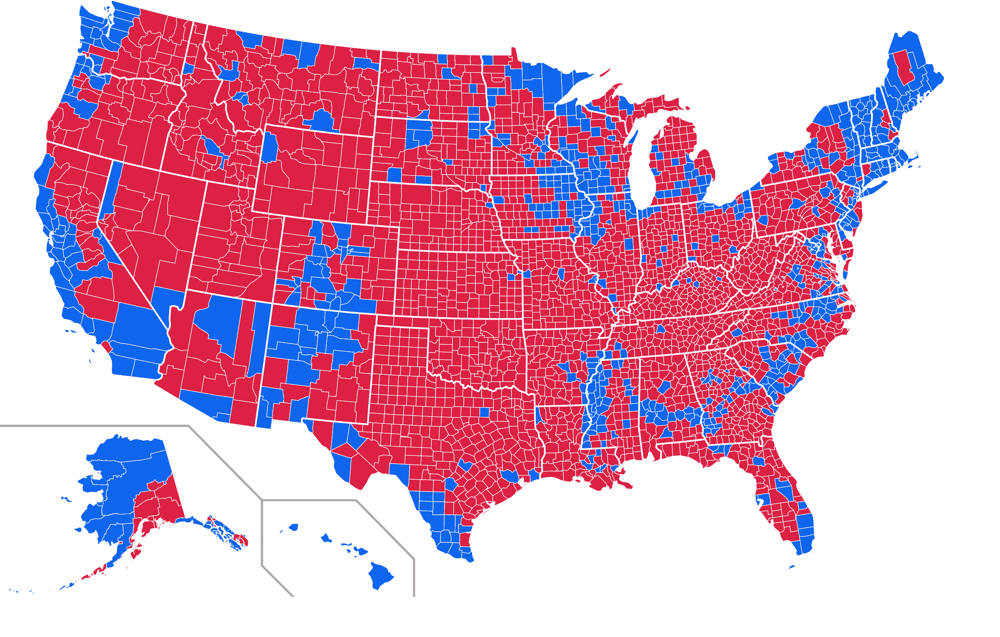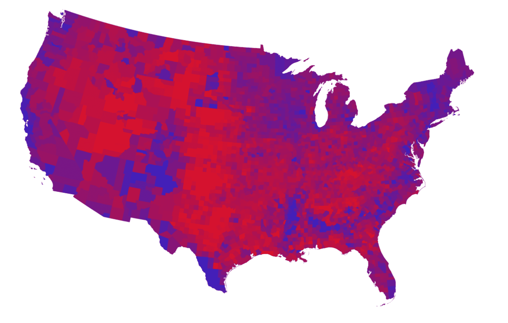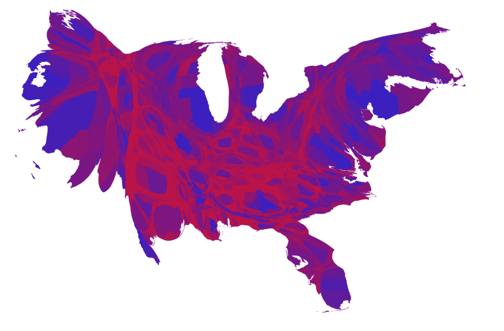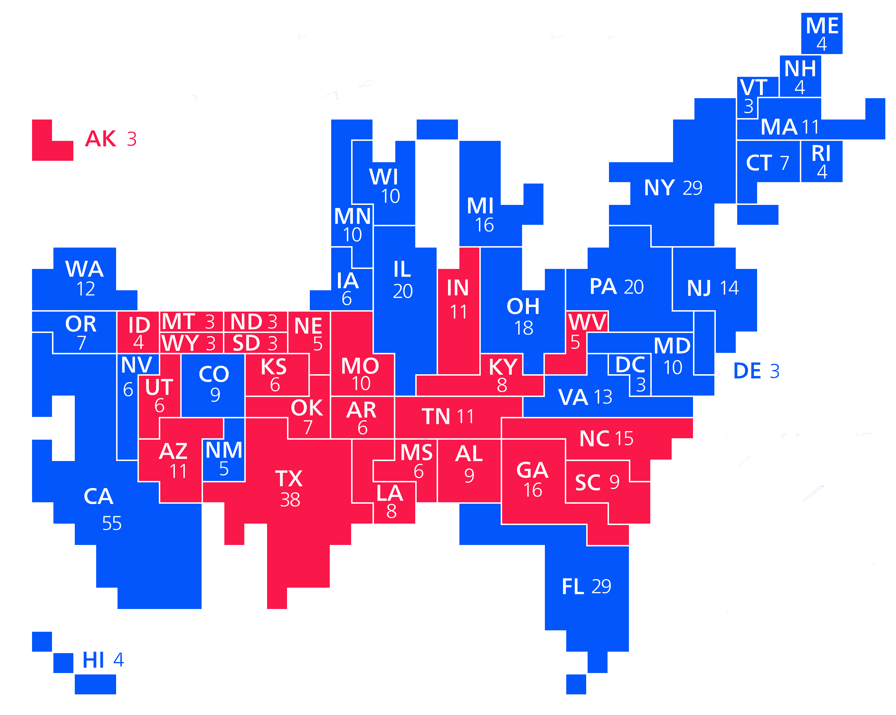

图 7.1：2012 年美国不同类型的选举结果地图。

这些地图展示了同一事件的数据，但它们传达的印象却非常不同。每个地图都面临两个主要问题。首先，我们感兴趣的底层数量只有部分是空间性的。赢得的选举人票数和州或县内投出的选票份额是以空间术语表达的，但最终重要的是这些区域中的人数。其次，这些区域本身的大小差异很大，并且它们的大小与底层投票的规模之间没有很好的相关性。地图制作者还面临许多其他数据表示中会出现的选择。我们只想显示每个州谁赢得了绝对优势（这最终是实际结果中唯一重要的事情）吗？或者我们想表明比赛有多接近？我们想在比结果相关的更细的分辨率级别上显示结果，比如县而不是州计数吗？我们如何传达不同数据点可以携带非常不同的权重，因为它们代表的人数差异很大？用不同的颜色和形状大小在简单的散点图上诚实地传达这些选择已经足够棘手。通常，地图就像一个奇怪的网格，你被迫遵守它，即使你知道它系统地歪曲了你想要展示的内容。

当然，情况并不总是如此。有时我们的数据确实是纯粹的空间数据，我们可以在足够细的细节水平上观察到它，从而以诚实和非常有说服力的方式表示空间分布。但许多社会科学的空间特征是通过诸如选区、邻里、大都市区、人口普查区、县、州和国家等实体收集的。这些本身可能就是社会相关的。大量使用社会科学变量的制图工作既涉及利用这种任意性，也涉及对抗这种任意性。

## 7.1 绘制美国州级数据地图

让我们来看看 2016 年美国总统选举的一些数据，并看看我们如何在 R 中绘制它。`election`数据集包含了各州投票和投票份额的各种度量。在这里，我们挑选了一些列并随机抽取了几行样本。

```r
election %>%  select(state, total_vote,
 r_points, pct_trump, party, census) %>%
 sample_n(5)
```

```r
## # A tibble: 5 x 6
##   state          total_vote r_points pct_trump party      census   
##   <chr>               <dbl>    <dbl>     <dbl> <chr>      <chr>    
## 1 Kentucky          1924149     29.8      62.5 Republican South    
## 2 Vermont            315067    -26.4      30.3 Democrat   Northeast
## 3 South Carolina    2103027     14.3      54.9 Republican South    
## 4 Wyoming            255849     46.3      68.2 Republican West     
## 5 Kansas            1194755     20.4      56.2 Republican Midwest
```

 图 7.2：2016 选举结果。与这个相比，双色渐变图会更具有信息量吗，还是更少？

FIPS 代码是一个联邦代码，用于编号美国的州和领地。它扩展到县级，增加四位数字，因此美国每个县都有一个唯一的六位数字标识符，其中前两位数字代表州。此数据集还包含每个州的普查区域。

```r
# Hex color codes for Dem Blue and Rep Red
party_colors <-  c("#2E74C0", "#CB454A") 

p0 <-  ggplot(data = subset(election, st %nin% "DC"),
 mapping = aes(x = r_points,
 y = reorder(state, r_points),
 color = party))

p1 <-  p0 +  geom_vline(xintercept = 0, color = "gray30") +
 geom_point(size = 2)

p2 <-  p1 +  scale_color_manual(values = party_colors)

p3 <-  p2 +  scale_x_continuous(breaks = c(-30, -20, -10, 0, 10, 20, 30, 40),
 labels = c("30\n (Clinton)", "20", "10", "0",
 "10", "20", "30", "40\n(Trump)"))

p3 +  facet_wrap(~  census, ncol=1, scales="free_y") +
 guides(color=FALSE) +  labs(x = "Point Margin", y = "") +
 theme(axis.text=element_text(size=8))
```

关于空间数据，你应该记住的第一件事是，你不必以空间形式表示它。我们一直在处理国家层面的数据，但还没有制作出它的地图。当然，空间表示可以非常有用，有时甚至绝对必要。但我们可以从州级别的散点图开始，按区域进行分面。这个图汇集了我们迄今为止所做的一些绘图构建方面，包括数据子集、按第二个变量重新排序结果和使用刻度格式化器。它还引入了一些新选项，例如允许轴上有自由刻度，以及手动设置美学的颜色。我们通过在过程中创建中间对象（`p0`、`p1`、`p2`）将构建过程分解成几个步骤，这使得代码更易于阅读。记住，你始终可以尝试绘制这些中间对象（只需在控制台中输入它们的名称并按回车键）以查看它们的外观。如果你从`facet_wrap()`中移除`scales="free_y"`参数会发生什么？如果你删除了`scale_color_manual()`的调用会发生什么？

如同往常，绘制地图的第一步是获取包含正确信息且顺序正确的数据框。首先，我们加载 R 的`maps`包，它为我们提供了一些预先绘制的地图数据。

```r
library(maps)
us_states <-  map_data("state")
head(us_states)
```

```r
##       long     lat group order  region subregion
## 1 -87.4620 30.3897     1     1 alabama      <NA>
## 2 -87.4849 30.3725     1     2 alabama      <NA>
## 3 -87.5250 30.3725     1     3 alabama      <NA>
## 4 -87.5308 30.3324     1     4 alabama      <NA>
## 5 -87.5709 30.3267     1     5 alabama      <NA>
## 6 -87.5881 30.3267     1     6 alabama      <NA>
```

```r
dim(us_states)
```

```r
## [1] 15537     6
```

这只是一个数据框。它有超过 15,000 行，因为绘制一张好看的地图需要很多线条。我们可以立即使用`geom_polygon()`函数用这些数据制作一个空白州地图。

```r
p <-  ggplot(data = us_states,
 mapping = aes(x = long, y = lat,
 group = group))

p +  geom_polygon(fill = "white", color = "black")
```

该地图使用经纬度点绘制，这些点作为比例元素映射到 x 轴和 y 轴。毕竟，地图只是在一组网格上按正确顺序绘制的一系列线条。

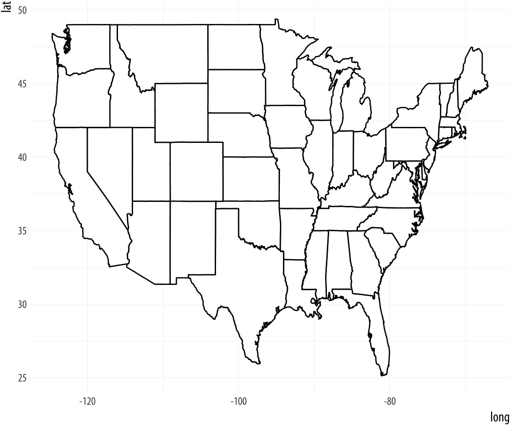 图 7.3：第一张美国地图

我们可以将`fill`美学映射到`region`，并将`color`映射更改为浅灰色，同时将线条变细以使州边界看起来更美观。我们还会告诉 R 不要绘制图例。

 图 7.4：着色各州

```r
p <-  ggplot(data = us_states,
 aes(x = long, y = lat,
 group = group, fill = region))

p +  geom_polygon(color = "gray90", size = 0.1) +  guides(fill = FALSE)
```

接下来，让我们处理投影问题。默认情况下，地图使用的是备受尊敬的墨卡托投影。它看起来并不好。如果我们不打算横渡大西洋，这个投影的实用优点对我们来说也没有多大用处。如果你再次浏览图 7.1 中的地图，你会注意到它们看起来更漂亮。这是因为它们使用了 Albers 投影。（看看，例如，美国和加拿大边界是如何沿着华盛顿州到明尼苏达州的第 49 平行线略微弯曲，而不是一条直线。）地图投影的技术是一个迷人的领域，但到目前为止，只需记住我们可以通过`coord_map()`函数转换`geom_polygon()`默认使用的投影。你还记得我们说过，将投影到坐标系是任何数据绘图过程中的必要部分。通常情况下，它是隐含的。我们通常不需要指定`coord_`函数，因为我们大多数时候都是在简单的笛卡尔平面上绘制我们的图表。地图更复杂。我们的位置和边界定义在一个或多或少是球形的物体上，这意味着我们必须有一种方法将我们的点和线从圆形表面转换到平面。这样做的方式有很多，给我们提供了一系列的制图选项。

Albers 投影需要两个纬度参数，`lat0`和`lat1`。在这里，我们为美国地图给出了它们的传统值。（尝试调整它们的值，看看当你重新绘制地图时会发生什么。）

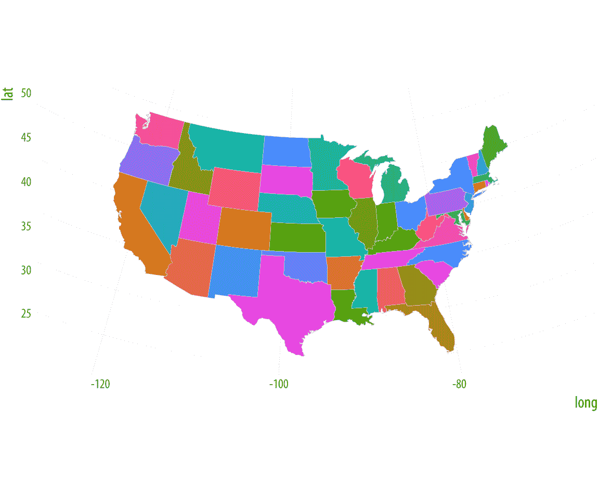 图 7.5：改进投影

```r
p <-  ggplot(data = us_states,
 mapping = aes(x = long, y = lat,
 group = group, fill = region))

p +  geom_polygon(color = "gray90", size = 0.1) +
 coord_map(projection = "albers", lat0 = 39, lat1 = 45) +
 guides(fill = FALSE)
```

现在我们需要将我们自己的数据放到地图上。记住，在那张地图下面只是一个大型的数据框，指定了需要绘制的大量线条。我们必须将我们的数据与该数据框合并。有些令人烦恼的是，在地图数据中，州名（在名为`region`的变量中）都是小写的。我们可以使用`tolower()`函数将`state`名称转换为小写，在我们的数据框中创建一个对应的变量。然后我们使用`left_join`进行合并，但你也可以使用`merge(..., sort = FALSE)`。这个合并步骤很重要！你需要确保你匹配的关键变量的值确实完全对应。如果不对应，你的合并中将会引入缺失值（`NA`代码），你的地图上的线条将不会连接起来。这将导致当 R 尝试填充多边形时，你的地图看起来会非常奇怪地“碎片化”。在这里，`region`变量是我们连接的两个数据集中唯一具有相同名称的列，因此`left_join()`函数默认使用它。如果每个数据集中的键名不同，你可以指定，如果需要的话。

重申一遍，了解你的数据和变量非常重要，以确保它们已经正确合并。不要盲目操作。例如，如果你的`election`数据框中的`region`变量中对应华盛顿特区的行被命名为“washington dc”，但在地图数据中相应的`region`变量中为“district of columbia”，那么基于`region`的合并意味着`election`数据框中的任何行都不会匹配地图数据中的“washington dc”，并且这些行的合并变量都将被编码为缺失。当你绘制地图时看起来破损的地图通常是由合并错误引起的。但错误也可能是微妙的。例如，可能由于数据最初是从其他地方导入且未完全清理，导致某个州名不小心有一个前导（或者更糟糕的是，一个尾随）空格。这意味着，例如，`california`和`california␣`是不同的字符串，匹配将失败。在普通使用中，你可能不容易看到额外的空格（在此处用`␣`表示）。因此，要小心。

```r
election$region <-  tolower(election$state)
us_states_elec <-  left_join(us_states, election)
```

我们现在已经合并了数据。用`head(us_states_elec)`查看对象。现在，由于所有内容都在一个大的数据框中，我们可以在地图上绘制它。

 图 7.6：映射结果

```r
p <-  ggplot(data = us_states_elec,
 aes(x = long, y = lat,
 group = group, fill = party))

p +  geom_polygon(color = "gray90", size = 0.1) +
 coord_map(projection = "albers", lat0 = 39, lat1 = 45) 
```

为了完成地图，我们将使用我们的党派颜色进行填充，将图例移动到底部，并添加一个标题。最后，我们将通过定义一个特殊的地图主题来移除大多数我们不需要的元素，从而删除网格线和轴标签，这些实际上并不需要。（我们将在第八章中了解更多关于主题的内容。你还可以在附录中查看地图主题的代码。）

```r
p0 <-  ggplot(data = us_states_elec,
 mapping = aes(x = long, y = lat,
 group = group, fill = party))
p1 <-  p0 +  geom_polygon(color = "gray90", size = 0.1) +
 coord_map(projection = "albers", lat0 = 39, lat1 = 45) 
p2 <-  p1 +  scale_fill_manual(values = party_colors) +
 labs(title = "Election Results 2016", fill = NULL)
p2 +  theme_map() 
```

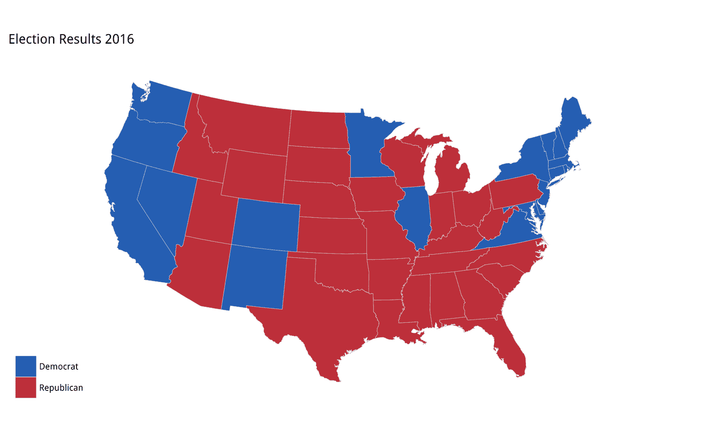

图 7.7：按州划分的 2016 年选举

在地图数据框已经就绪的情况下，如果我们愿意，可以映射其他变量。让我们尝试一个连续度量，比如唐纳德·特朗普收到的选票百分比。首先，我们只需将我们想要的变量（`pct_trump`）映射到`fill`美学，看看`geom_polygon()`默认情况下会做什么。

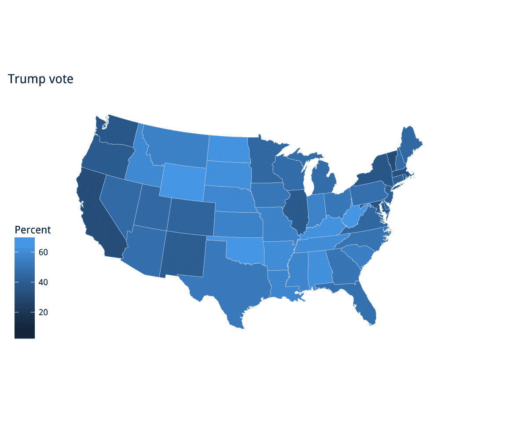  图 7.8：按州划分的特朗普百分比的两个版本

```r
p0 <-  ggplot(data = us_states_elec,
 mapping = aes(x = long, y = lat, group = group, fill = pct_trump))

p1 <-  p0 +  geom_polygon(color = "gray90", size = 0.1) +
 coord_map(projection = "albers", lat0 = 39, lat1 = 45) 

p1 +  labs(title = "Trump vote") +  theme_map() +  labs(fill = "Percent")

p2 <-  p1 +  scale_fill_gradient(low = "white", high = "#CB454A") +
 labs(title = "Trump vote") 
p2 +  theme_map() +  labs(fill = "Percent")
```

`p1`对象中使用的默认颜色是蓝色。仅仅出于惯例，这并不是我们想要的。此外，渐变的方向也是错误的。在我们的情况下，标准的解释是更高的投票份额对应着更深的颜色。我们通过直接指定`scale`来修复`p2`对象中的这两个问题。我们将使用之前在`party_colors`中创建的值。

对于选举结果，我们可能更倾向于一个从中点发散的梯度。`scale_gradient2()` 函数为我们提供了一个默认通过白色的蓝-红光谱。或者，我们可以重新指定中点颜色以及高色和低色。我们将紫色作为中点，并使用 `scales` 库中的 `muted()` 函数稍微降低一下颜色。

 图 7.9：特朗普对克林顿共享的两个视图：一个白色中点，和一个紫色美国版本。

```r
p0 <-  ggplot(data = us_states_elec,
 mapping = aes(x = long, y = lat, group = group, fill = d_points))

p1 <-  p0 +  geom_polygon(color = "gray90", size = 0.1) +
 coord_map(projection = "albers", lat0 = 39, lat1 = 45) 

p2 <-  p1 +  scale_fill_gradient2() +  labs(title = "Winning margins") 
p2 +  theme_map() +  labs(fill = "Percent")

p3 <-  p1 +  scale_fill_gradient2(low = "red", mid = scales::muted("purple"),
 high = "blue", breaks = c(-25, 0, 25, 50, 75)) +
 labs(title = "Winning margins") 
p3 +  theme_map() +  labs(fill = "Percent")
```

如果你看看这张第一张“紫色美国”地图的渐变尺度，如图 7.9 所示，你会发现它在蓝色端非常高。这是因为华盛顿特区包含在数据中，因此也在尺度中。尽管它在地图上几乎看不见，但华盛顿特区在数据中任何观察单位中，对民主党支持率的优势都远远高于其他任何单位。如果我们省略它，我们会看到我们的尺度发生了变化，这不仅影响了蓝色端的顶部，而且使整个梯度重新居中，并使红色端更加鲜明。图 7.10 展示了结果。

```r
p0 <-  ggplot(data = subset(us_states_elec,
 region %nin% "district of columbia"),
 aes(x = long, y = lat, group = group, fill = d_points))

p1 <-  p0 +  geom_polygon(color = "gray90", size = 0.1) +
 coord_map(projection = "albers", lat0 = 39, lat1 = 45) 

p2 <-  p1 +  scale_fill_gradient2(low = "red",
 mid = scales::muted("purple"),
 high = "blue") +
 labs(title = "Winning margins") 
p2 +  theme_map() +  labs(fill = "Percent")
```

图 7.10：排除华盛顿特区结果的特朗普对克林顿的紫色美国版本。


这揭示了熟悉的渐变问题，即地理区域只部分代表我们正在映射的变量。在这种情况下，我们展示的是选票的空间分布，但真正重要的是投票的人数。

## 7.2 美国的原始渐变图

在美国的情况下，行政区域的地理面积和人口规模差异很大。正如我们所见，这个问题在州一级很明显，在县一级更是如此。县一级的美国地图在美学上可能很吸引人，因为它们为全国地图增添了额外的细节。但它们也使得展示地理分布以暗示解释变得容易。结果可能很难处理。在制作县地图时，重要的是要记住，新罕布什尔州、罗德岛州、马萨诸塞州和康涅狄格州的面积都小于十个最大的西部**县**。其中许多县的人口少于十万人。有些县的人口甚至少于一万。

结果是，大多数美国按变量划分的分级色地图实际上更多地显示了人口密度。在美国的情况下，另一个重要变量是黑人百分比。让我们看看如何在 R 中绘制这两张地图。这个过程基本上与州级地图相同。我们需要两个数据框，一个包含地图数据，另一个包含我们想要绘制的填充变量。由于美国有超过三千个县，这两个数据框将比州级地图大得多。

这些数据集包含在 `socviz` 库中。县级地图数据框已经经过一些处理，以便将其转换为 Albers 投影，并且重新定位（并缩放）阿拉斯加和夏威夷，以便它们适合图的下左角区域。这比从数据中丢弃两个州要好。这个转换和重新定位的步骤在这里没有展示。如果你想了解如何完成，请参阅补充材料以获取详细信息。让我们先看看我们的县级地图数据：

```r
county_map %>%  sample_n(5)
```

```r
##            long      lat  order  hole piece             group    id
## 116977  -286097 -1302531 116977 FALSE     1  0500000US35025.1 35025
## 175994  1657614  -698592 175994 FALSE     1  0500000US51197.1 51197
## 186409   674547   -65321 186409 FALSE     1  0500000US55011.1 55011
## 22624    619876 -1093164  22624 FALSE     1  0500000US05105.1 05105
## 5906   -1983421 -2424955   5906 FALSE    10 0500000US02016.10 02016
```

它看起来和我们的州地图数据框一样，但规模要大得多，几乎有 200,000 行。`id` 字段是县的 FIPS 代码。接下来，我们有一个包含县级人口、地理和选举数据的数据框：

```r
county_data %>%
 select(id, name, state, pop_dens, pct_black) %>%
 sample_n(5)
```

```r
##         id                name state      pop_dens   pct_black
## 3029 53051 Pend Oreille County    WA [    0,   10) [ 0.0, 2.0)
## 1851 35041    Roosevelt County    NM [    0,   10) [ 2.0, 5.0)
## 1593 29165       Platte County    MO [  100,  500) [ 5.0,10.0)
## 2363 45009      Bamberg County    SC [   10,   50) [50.0,85.3]
## 654  17087      Johnson County    IL    10,   50) [ 5.0,10.0)
```

这个数据框包含了除县以外实体的信息，但并非所有变量都有。如果你用 `head()` 函数查看对象顶部，你会注意到第一行的 `id` 为 `0`。零是整个美国的 FIPS 代码，因此这一行的数据代表整个国家。同样，第二行的 `id` 为 01000，对应的是阿拉巴马州的州 FIPS 代码 01。当我们把 `county_data` 合并到 `county_map` 中时，这些州行以及国家行都会被删除，因为 `county_map` 只包含县级数据。

我们使用共享的 FIPS `id` 列合并数据框：

```r
county_full <-  left_join(county_map, county_data, by = "id")
```

数据合并后，我们可以绘制每平方英里的人口密度图。

```r
p <-  ggplot(data = county_full,
 mapping = aes(x = long, y = lat,
 fill = pop_dens, 
 group = group))

p1 <-  p +  geom_polygon(color = "gray90", size = 0.05) +  coord_equal()

p2 <-  p1 +  scale_fill_brewer(palette="Blues",
 labels = c("0-10", "10-50", "50-100", "100-500",
 "500-1,000", "1,000-5,000", ">5,000"))

p2 +  labs(fill = "Population per\nsquare mile") +
 theme_map() +
 guides(fill = guide_legend(nrow = 1)) + 
 theme(legend.position = "bottom")
```

图 7.11：按县划分的美国人口密度。

![按县划分的美国人口密度。如果你尝试使用 `p1` 对象，你会看到 ggplot 生成了一个可读的地图，但默认情况下它选择了一个无序的分类布局。这是因为 `pop_dens` 变量没有排序。我们可以重新编码它，让 R 知道排序。或者，我们可以使用 `scale_fill_brewer()` 函数手动提供正确的排序，同时提供一组更好的标签。我们将在下一章中学习更多关于这个缩放函数的内容。我们还使用 `guides()` 函数调整图例的绘制方式，以确保关键元素出现在同一行上。我们将在下一章中更详细地看到 `guides()` 的这种用法。使用 `coord_equal()` 确保即使我们改变整个图表的尺寸，地图的相对比例也不会改变。现在，我们可以为按县划分的黑人人口百分比地图做完全相同的事情。再次，我们使用 `scale_fill_brewer()` 为 `fill` 映射指定调色板，这次选择地图的不同色调范围。```rp <-  ggplot(data = county_full, mapping = aes(x = long, y = lat, fill = pct_black,  group = group))p1 <-  p +  geom_polygon(color = "gray90", size = 0.05) +  coord_equal()p2 <-  p1 +  scale_fill_brewer(palette="Greens")p2 +  labs(fill = "US Population, Percent Black") + guides(fill = guide_legend(nrow = 1)) +  theme_map() +  theme(legend.position = "bottom")```图 7.12：按县划分的黑人人口百分比。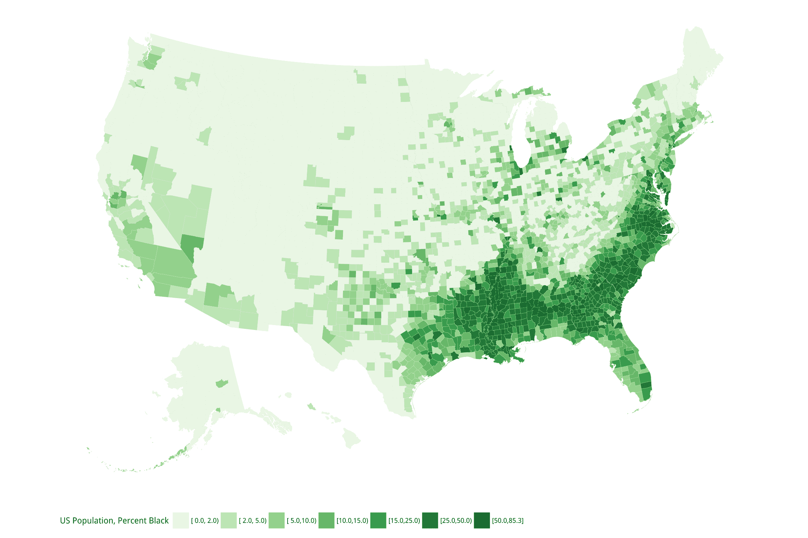

图 7.11 和 7.12 是美国的“原始 choropleths”。在这两个变量之间，人口密度和黑人百分比将对消除许多具有暗示性图案的美国地图产生很大影响。这两个变量在孤立的情况下并不是任何事物的*解释*，但如果发现知道其中一个或两个变量比你要绘制的图表更有用，你可能需要重新考虑你的理论。

作为问题实际作用的例子，让我们绘制两个新的县级 choropleths。第一个是试图复制一个来源不明但广泛传播的美国枪支相关自杀率县级地图。`county_data`（和 `county_full`）中的 `su_gun6` 变量是衡量 1999 年至 2015 年间所有枪支相关自杀率的指标。这些比率被分为六个类别。我们还有一个 `pop_dens6` 变量，它将人口密度也分为六个类别。

我们首先使用 `su_gun6` 变量绘制地图。我们将匹配地图之间的颜色调色板，但对于人口地图，我们将翻转颜色比例，以便人口较少的地区以较深的色调显示。我们通过使用 RColorBrewer 库中的函数手动创建两个调色板来完成此操作。这里使用的 `rev()` 函数反转了向量的顺序。

```r
orange_pal <-  RColorBrewer::brewer.pal(n = 6, name = "Oranges")
orange_pal
```

```r
## [1] "#FEEDDE" "#FDD0A2" "#FDAE6B" "#FD8D3C" "#E6550D"
## [6] "#A63603"
```

```r
orange_rev <-  rev(orange_pal)
orange_rev
```

```r
## [1] "#A63603" "#E6550D" "#FD8D3C" "#FDAE6B" "#FDD0A2"
## [6] "#FEEDDE"
```

`brewer.pal()` 函数产生均匀间隔的颜色方案，可以从几个命名调色板中的任何一个进行排序。颜色以十六进制格式指定。再次强调，我们将在第八章节中学习更多关于颜色规范以及如何操纵映射变量的调色板。

```r
gun_p <-  ggplot(data = county_full,
 mapping = aes(x = long, y = lat,
 fill = su_gun6, 
 group = group))

gun_p1 <-  gun_p +  geom_polygon(color = "gray90", size = 0.05) +  coord_equal()

gun_p2 <-  gun_p1 +  scale_fill_manual(values = orange_pal)

gun_p2 +  labs(title = "Gun-Related Suicides, 1999-2015",
 fill = "Rate per 100,000 pop.") +
 theme_map() +  theme(legend.position = "bottom")
```

绘制完枪支图表后，我们使用几乎完全相同的代码绘制反向编码的人口密度地图。

```r
pop_p <-  ggplot(data = county_full, mapping = aes(x = long, y = lat,
 fill = pop_dens6, 
 group = group))

pop_p1 <-  pop_p +  geom_polygon(color = "gray90", size = 0.05) +  coord_equal()

pop_p2 <-  pop_p1 +  scale_fill_manual(values = orange_rev)

pop_p2 +  labs(title = "Reverse-coded Population Density",
 fill = "People per square mile") +
 theme_map() +  theme(legend.position = "bottom")
```

很明显，这两张地图并不完全相同。然而，第一张地图的视觉影响与第二张有很多共同之处。西部（除了加利福尼亚州）的深色带子突出，并向国家中心逐渐变淡。地图上其他地方也有一些强烈的相似之处，例如在东北部。

枪支相关自杀的指标已经表示为比率。这是在县内符合条件的死亡人数除以该县的人口数。通常，我们以这种方式进行标准化，以“控制”较大的人口数量会导致更多枪支相关自杀的事实。然而，这种标准化有其局限性。特别是，当感兴趣的事件不太常见，且单位的基本规模差异很大时，分母（例如，人口规模）开始越来越多地以标准化测量的形式表达。

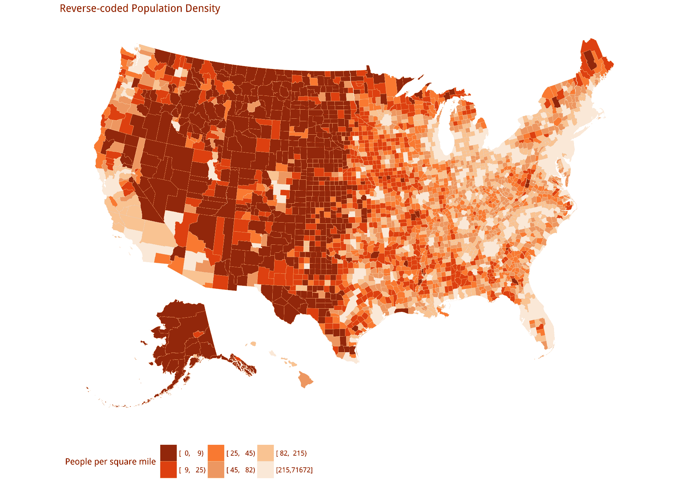

图 7.13：按县分的枪支相关自杀；按县分反向编码的人口密度。在转发这张图片之前，请阅读关于其问题的讨论文本。

第三，而且更为微妙的是，数据受到与人口规模相关的报告限制。如果每年因某种原因死亡的事件少于十个，疾病控制中心（CDC）将不会在县一级报告这些事件，因为这可能有可能识别特定的死者。将此类数据分配到区间会为渐变图创建一个阈值问题。再次查看图 7.13。枪支相关自杀部分似乎显示了一条从达科他州向南穿过内布拉斯加州、堪萨斯州直至西德克萨斯州的北南走向的县带，自杀率最低。奇怪的是，这条带子与西部自杀率极高的县相邻，从新墨西哥州一直向上。然而，从密度图上我们可以看到，这两个地区的许多县人口密度都很低。它们在枪支相关自杀率上真的有那么大的差异吗？

很可能不是。更有可能的是，我们正在看到的是数据编码方式产生的一个伪象。例如，想象一个有 10 万居民的县在一年中发生了九起枪支相关的自杀事件。CDC 不会报告这个数字。相反，它会被编码为“压制”，并附上一条说明，指出任何标准化的估计或比率也将是不可靠的。但是，如果我们决心制作一个所有县都被着色的地图，我们可能会倾向于将任何被压制的调查结果放入最低的类别。毕竟，我们知道这个数字在零到十之间。为什么不直接将其编码为零呢？不要这样做。一个标准的替代方案是使用计数模型来估计被压制的观察值。这种方法可能会自然地导致对数据进行更广泛、更合适的空间建模。同时，一个有 10 万居民的县在一年中发生十二起枪支相关的自杀事件*将会*被数值报告。CDC 是一个负责任的组织，因此尽管它为所有超过阈值的县提供了死亡绝对数，但数据文件中的注释仍会警告你，使用这个数字计算出的任何比率都将是不可靠的。如果我们坚持这样做，那么在小人口中 12 人死亡可能会将一个人口稀少的县归类为自杀率最高的类别。同时，低于该阈值的低人口县将被编码为最低（最轻）的类别。但在现实中，它们可能并没有那么不同，而且在任何情况下，试图量化这种差异的努力将是不可靠的。如果无法直接获得这些县的估计值或使用良好的模型进行估计，那么最好是将其作为缺失值删除，即使这会牺牲你那美丽的地图，也不应该用不可靠的数字来绘制大片国家的颜色。

报告中的小差异，加上错误编码，会产生在空间上误导性和实质上错误的结果。看起来，关注这个特定案例中变量编码的细节可能对于一般介绍来说有点过于繁琐。但正是这些细节会极大地改变任何图表，尤其是地图的外观，而这种改变在事后可能很难察觉。

## 7.3 Statebins

作为州级渐变色的替代方案，我们可以考虑使用 Bob Rudis 开发的包来创建*州级分类箱*。我们将用它再次查看我们的州级选举结果。Statebins 与 ggplot 类似，但其语法与我们习惯的不同。它需要几个参数，包括基本数据框（`state_data`参数）、州名向量（`state_col`）和要显示的值（`value_col`）。此外，我们可以选择性地告诉它我们想要的调色板和用于标注州框的文本颜色。对于连续变量，我们可以使用`statebins_continuous()`，如下所示：

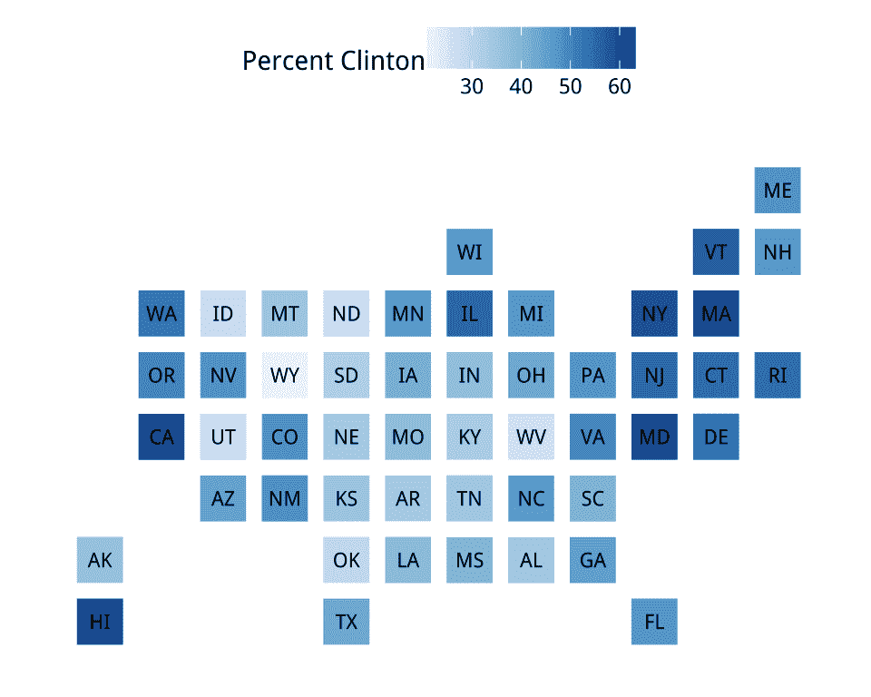 图 7.14：选举结果的状态箱。为了防止比例失衡，我们从克林顿地图中省略了华盛顿特区。

```r
library(statebins)

statebins_continuous(state_data = election, state_col = "state",
 text_color = "white", value_col = "pct_trump",
 brewer_pal="Reds", font_size = 3,
 legend_title="Percent Trump")

statebins_continuous(state_data = subset(election, st %nin% "DC"),
 state_col = "state",
 text_color = "black", value_col = "pct_clinton",
 brewer_pal="Blues", font_size = 3,
 legend_title="Percent Clinton")
```

有时候，我们可能想要展示分类数据。如果我们的变量已经被切割成类别，我们可以使用`statebins_manual()`来表示它。在这里，向`election`数据中添加一个名为`color`的新变量，用两个合适的颜色名称来反映党派名称。我们这样做是因为我们需要通过数据框中的变量来指定我们使用的颜色，而不是作为正确的映射。我们告诉`statebins_manual()`函数颜色包含在名为`color`的列中。

或者，我们可以使用`statebins()`函数通过`breaks`参数帮我们切割数据，就像第二个图表中展示的那样。

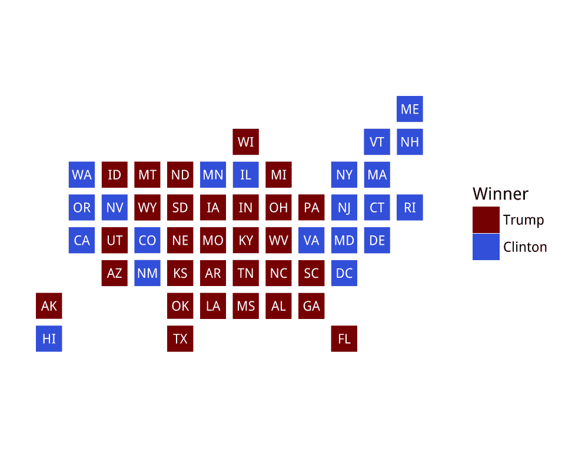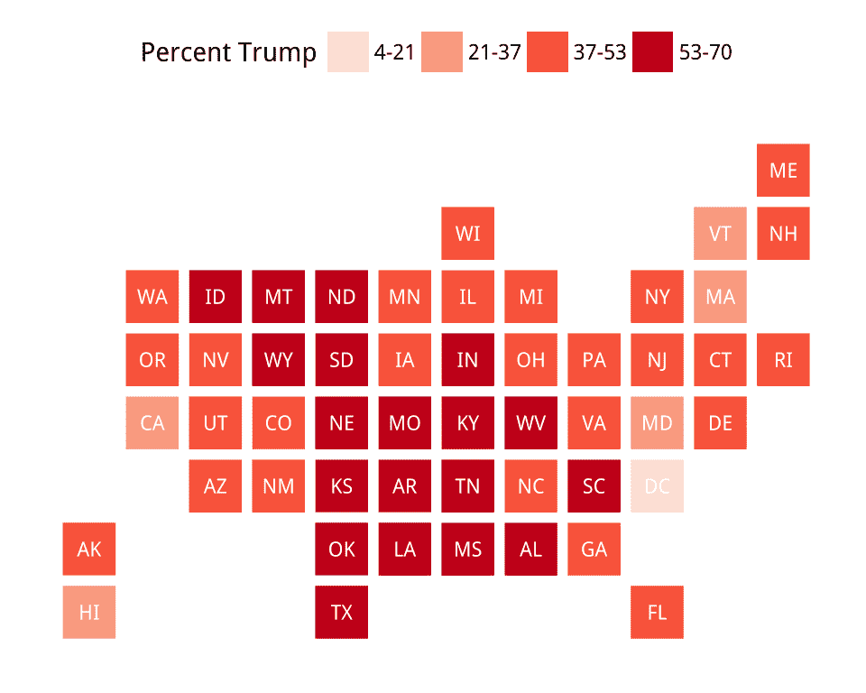 图 7.15：手动指定状态箱的颜色。

```r
election <-  election %>%  mutate(color = recode(party, Republican = "darkred",
 Democrat = "royalblue"))

statebins_manual(state_data = election, state_col = "st",
 color_col = "color", text_color = "white",
 font_size = 3, legend_title="Winner",
 labels=c("Trump", "Clinton"), legend_position = "right")

statebins(state_data = election, 
 state_col = "state", value_col = "pct_trump",
 text_color = "white", breaks = 4,
 labels = c("4-21", "21-37", "37-53", "53-70"),
 brewer_pal="Reds", font_size = 3, legend_title="Percent Trump")
```

## 7.4 小倍数地图

有时候，我们会有带有时间重复观察的地理数据。一个常见的例子是在几年内对国家或州级指标进行观察。在这些情况下，我们可能想要制作一个小倍数地图来展示随时间的变化。例如，`opiates`数据包含了 1999 年至 2014 年间州级因阿片类药物（如海洛因或芬太尼过量）导致的死亡率指标。

```r
opiates
```

```r
## # A tibble: 800 x 11
##     year state        fips deaths population crude adjusted
##    <int> <chr>       <int>  <int>      <int> <dbl>    <dbl>
##  1  1999 Alabama         1     37    4430141 0.800    0.800
##  2  1999 Alaska          2     27     624779 4.30     4.00 
##  3  1999 Arizona         4    229    5023823 4.60     4.70 
##  4  1999 Arkansas        5     28    2651860 1.10     1.10 
##  5  1999 California      6   1474   33499204 4.40     4.50 
##  6  1999 Colorado        8    164    4226018 3.90     3.70 
##  7  1999 Connecticut     9    151    3386401 4.50     4.40 
##  8  1999 Delaware       10     32     774990 4.10     4.10 
##  9  1999 District o…    11     28     570213 4.90     4.90 
## 10  1999 Florida        12    402   15759421 2.60     2.60 
## # ... with 790 more rows, and 4 more variables:
## #   adjusted_se <dbl>, region <ord>, abbr <chr>,
## #   division_name <chr>
```

如前所述，我们可以将包含州级地图详细信息的`us_states`对象与我们的`opiates`数据集合并。同样，我们首先将`opiates`数据中的`State`变量转换为小写，以确保匹配正确。

```r
opiates$region <-  tolower(opiates$state)
opiates_map <-  left_join(us_states, opiates)
```

因为`opiates`数据中包含了`Year`变量，我们现在可以制作一个分面小多倍图，每个年份对应一个地图。以下代码块与迄今为止我们绘制的单个州级地图类似。我们像往常一样指定地图数据，向其中添加`geom_polygon()`和`coord_map()`，并传入这些函数所需的参数。我们不会将数据切割成箱，而是直接绘制调整后的死亡率变量（`adjusted`）的连续值。如果你想在运行时动态地将数据切割成组，可以查看`cut_interval()`函数。为了有效地绘制这个变量，我们将使用来自`viridis`库的新比例函数。viridis 颜色按从低到高的顺序排列，并在其比例上很好地结合了感知上均匀的颜色和易于看到、易于对比的色调。`viridis`库提供了连续和离散版本，都有几种选择。一些平衡的调色板在其低端可能会显得有点淡化，尤其是，但 viridis 调色板避免了这一点。在这段代码中，`scale_fill_viridis_c()`函数中的`_c_`后缀表示它是连续数据的比例。对于离散数据，有一个等效的`scale_fill_viridis_d()`。

我们使用`facet_wrap()`函数像其他任何小多倍图一样分面地图。我们使用`theme()`函数将图例放在底部，并从年份标签中移除默认的阴影背景。我们将在第八章中了解更多关于`theme()`函数的用法。最终的地图如图 7.16 所示。

```r
library(viridis)

p0 <-  ggplot(data = subset(opiates_map, year >  1999),
 mapping = aes(x = long, y = lat,
 group = group,
 fill = adjusted))

p1 <-  p0 +  geom_polygon(color = "gray90", size = 0.05) +
 coord_map(projection = "albers", lat0 = 39, lat1 = 45) 

p2 <-  p1 +  scale_fill_viridis_c(option = "plasma")

p2 +  theme_map() +  facet_wrap(~  year, ncol = 3) +
 theme(legend.position = "bottom",
 strip.background = element_blank()) +
 labs(fill = "Death rate per 100,000 population ",
 title = "Opiate Related Deaths by State, 2000-2014") 
```

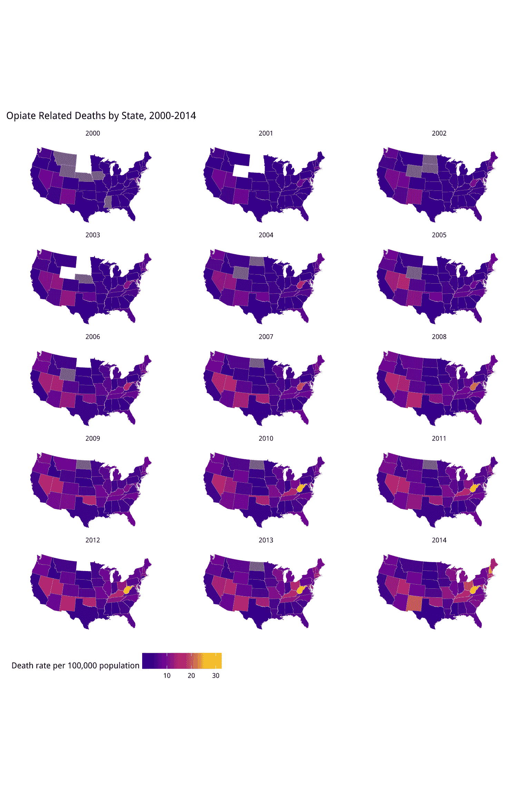

图 7.16：一个小多倍地图。当年死亡人数太少，无法进行可靠的估计时，用灰色表示的州。当年没有数据报告的州用白色表示。

这是一种好的数据可视化方法吗？尝试重新审视你的原始 choropleths 代码，但使用连续而不是分箱的度量，以及`viridis`调色板。用`black`变量代替`pct_black`。对于人口密度，将`pop`除以`land_area`。你需要调整`scale_`函数。地图与分箱版本相比如何？人口密度地图发生了什么变化，为什么？正如我们上面所讨论的，美国的 choropleth 地图往往首先追踪当地人口规模，其次是非洲裔美国人口百分比。各州地理规模的差异使得发现变化变得更加困难。而且，在不同空间区域之间反复比较相当困难。重复的度量确实意味着可以进行一些比较，并且此数据的强烈趋势使得事情稍微容易一些看到。在这种情况下，一个偶然的观众可能会认为，例如，与该国的许多其他地区相比，阿巴拉契亚地区鸦片危机最严重，尽管似乎阿巴拉契亚地区也发生了严重的事情。

## 7.5 你的数据真的是空间性的吗？

正如我们在本章开头所提到的，即使我们的数据是通过或分组到空间单元收集的，询问是否地图是展示它的最佳方式总是值得的。许多县、州和国家数据实际上并不是真正空间性的，因为它们真正关注的是个人（或感兴趣的某些其他单位）而不是这些单位的地理分布本身。让我们以我们的州级鸦片数据为例，将其重新绘制成时间序列图。我们将保持州级焦点（毕竟，这些都是州级比率），但尝试使趋势更直接地可见。

我们可以像最初用`gapminder`数据所做的那样，为每个州绘制趋势。但五十个州同时绘制太多的线条难以跟踪。

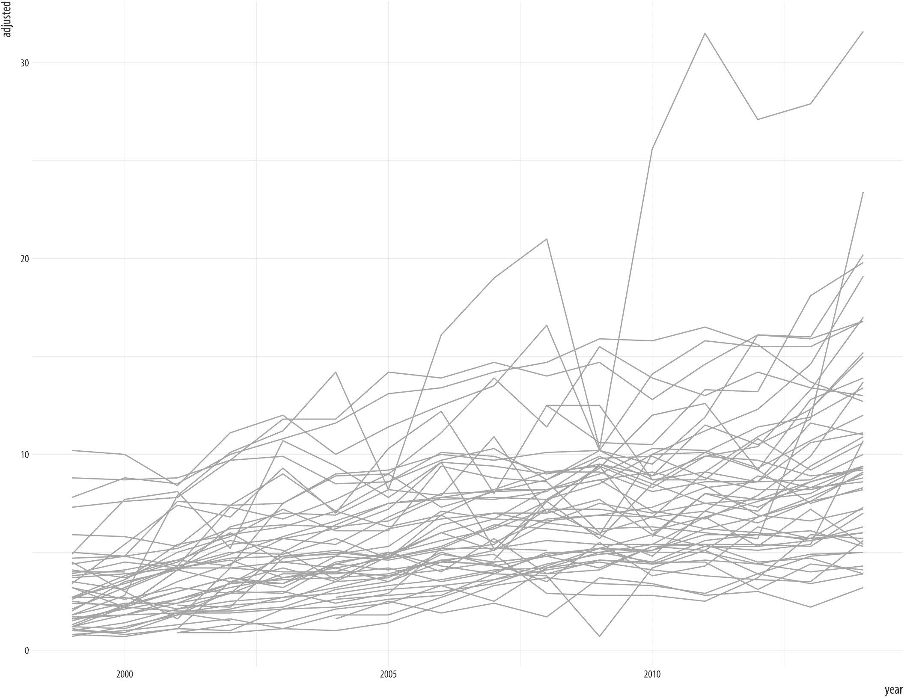 图 7.17：所有状态同时展示。

```r
p <-  ggplot(data = opiates,
 mapping = aes(x = year, y = adjusted,
 group = state))
p +  geom_line(color = "gray70") 
```

一种更信息化的方法是利用数据的地理结构，通过使用人口普查区域来分组各州。想象一下一个分面图，展示国家每个区域内的州级趋势，也许每个区域都有一个趋势线。为此，我们将利用 ggplot 的能力将 geoms 层层叠加，每个情况下使用不同的数据集。我们首先取`opiates`数据（移除华盛顿特区，因为它不是一个州），并绘制调整后的死亡率随时间的变化。

```r
p0 <-  ggplot(data = drop_na(opiates, division_name),
 mapping = aes(x = year, y = adjusted))

p1 <-  p0 +  geom_line(color = "gray70", 
 mapping = aes(group = state)) 
```

`drop_na()`函数删除了在指定变量上缺失观测值的行，在这种情况下，只是`division_name`，因为华盛顿特区不属于任何人口普查区。我们在`geom_line()`中将`group`美学映射到`state`，这为我们每个州提供了一个线形图。我们使用`color`参数将线条设置为浅灰色。接下来，我们添加一个平滑器：

```r
p2 <-  p1 +  geom_smooth(mapping = aes(group = division_name),
 se = FALSE)
```

对于这个几何图形，我们将`group`美学设置为`division_name`。（Division 是比 Region 更小的普查分类。）如果我们将其设置为`state`，我们除了五十条趋势线外，还会得到五十个单独的平滑器。然后，利用我们在第四章中学到的知识，我们添加了一个`geom_text_repel()`对象，将每个州的标签放置在序列的末尾。因为我们是在标记线而不是点，所以我们只希望州标签出现在线的末尾。技巧是子集数据，以便只使用最后一年观察到的点（因此标记）。我们还必须记住再次删除华盛顿特区，因为新的`data`参数取代了`p0`中的原始参数。

```r
p3 <-  p2 +  geom_text_repel(data = subset(opiates,
 year ==  max(year) &  abbr !="DC"),
 mapping = aes(x = year, y = adjusted, label = abbr),
 size = 1.8, segment.color = NA, nudge_x = 30) +
 coord_cartesian(c(min(opiates$year), 
 max(opiates$year)))
```

默认情况下，`geom_text_repel`会在表示标签的短线段上。但在这里这并不有帮助，因为我们已经处理了线的终点。因此，我们使用`segment.color = NA`参数将其关闭。我们还使用`nudge_x`参数将标签稍微向线的右侧移动，并使用`coord_cartesian()`设置轴限制，以便有足够的空间。

最后，我们按普查区划分结果，并添加我们的标签。一个有用的调整是按平均死亡率重新排序面板。我们在`adjusted`前放一个减号，以便具有最高平均率的分区首先出现在图表中。

```r
p3 +  labs(x = "", y = "Rate per 100,000 population",
 title = "State-Level Opiate Death Rates by Census Division, 1999-2014") +
 facet_wrap(~  reorder(division_name, -adjusted, na.rm = TRUE), nrow  = 3)
```

我们的新图表突出了地图中的大部分整体故事，但也稍微改变了重点。更容易清楚地看到国家某些地区正在发生的事情。特别是你可以看到新罕布什尔州、罗德岛、马萨诸塞州和康涅狄格州的数字在上升。你更容易看到西部各州在州一级的差异，例如亚利桑那州与另一方面的新墨西哥州或犹他州之间的差异。而且正如地图上所显示的，西弗吉尼亚州死亡率惊人地快速上升也是显而易见的。最后，时间序列图更好地传达了区域内各州的不同轨迹。在序列的末尾比开头有更多的方差，尤其是在东北部、中西部和南部，虽然这可以从地图中推断出来，但在趋势图中更容易看到。


图 7.18：阿片类药物数据作为一个分面时间序列。

在这个图表中，观察的单位仍然是州-年。数据的地理属性永远不会消失。我们绘制的线条仍然代表各州。因此，表示的基本任意性无法消失。在某种程度上，一个理想的数据库应该是在更精细的单位、时间和空间特定性层面上收集的。想象一下具有关于个人特征、时间和死亡地点的任意精确信息的个体级数据。在这种情况下，我们可以将数据聚合到我们喜欢的任何分类、空间或时间单位。但这样的数据极为罕见，通常有很好的理由，从收集的实用性到个人的隐私。在实践中，我们需要注意不要犯一种将观察单位误认为是真正实质性或理论兴趣对象的错误具体化谬误。这是大多数社会科学数据的问题。但它们的显著视觉特征使得地图可能比其他类型的可视化更容易受到这个问题的影响。

## 7.6 接下来去哪里

在本章中，我们学习了如何使用 FIPS 代码组织州级和县级数据开始工作。但这对可视化领域来说只是触及了皮毛，因为空间特征和分布是可视化中的主要焦点。空间数据的分析和可视化是一个独立的研究领域，在地理学和制图学中拥有自己的研究学科。表示空间特征的概念和方法都得到了很好的发展和标准化。直到最近，大多数此类功能只能通过专门的地理信息系统访问。它们的制图和空间分析功能并未很好地连接。或者至少，它们并没有方便地连接到面向表格数据分析的软件。

这正在迅速变化。Brundson 和 Comber（2015）介绍了 R 的一些制图功能。同时，最近这些工具通过 tidyverse 变得更加容易访问。对社会科学工作者来说，特别感兴趣的是`r-spatial.github.io/sf/`。还可以查看`r-spatial.org`上的新闻和更新。这是 Edzer Pebesma 对`sf`包的持续开发，该包以 tidyverse 友好的方式实现了空间特征的标准化简单特征数据模型。相关地，Kyle Walker 和 Bob Rudis 的`tigris`包`github.com/walkerke/tigris`允许（sf 库兼容）访问美国人口普查局的 TIGER/Line 形状文件，这些文件允许您绘制美国许多不同地理、行政和人口普查相关子区域的地图，以及道路和水域等特征。最后，Kyle Walker 的`tidycensus`包`walkerke.github.io/tidycensus`（Walker，2018）使得从美国人口普查和美国社区调查中获取实质性数据和空间特征数据变得更加容易。

## 7.1 绘制美国州级数据地图

让我们看看 2016 年美国总统选举的一些数据，并看看我们如何在 R 中绘制它。`election`数据集包含了按州划分的投票和投票份额的各种度量。这里我们挑选了一些列，并随机抽取了几行样本。

```r
election %>%  select(state, total_vote,
 r_points, pct_trump, party, census) %>%
 sample_n(5)
```

```r
## # A tibble: 5 x 6
##   state          total_vote r_points pct_trump party      census   
##   <chr>               <dbl>    <dbl>     <dbl> <chr>      <chr>    
## 1 Kentucky          1924149     29.8      62.5 Republican South    
## 2 Vermont            315067    -26.4      30.3 Democrat   Northeast
## 3 South Carolina    2103027     14.3      54.9 Republican South    
## 4 Wyoming            255849     46.3      68.2 Republican West     
## 5 Kansas            1194755     20.4      56.2 Republican Midwest
```

 图 7.2：2016 选举结果。这种双色渐变地图是否比这个更有信息量，或者更少？

FIPS 代码是一个联邦代码，用于编号美国的州和领地。它扩展到县级，增加四位数字，因此美国每个县都有一个唯一的六位数字标识符，其中前两位数字代表州。这个数据集还包含了每个州的普查区域。

```r
# Hex color codes for Dem Blue and Rep Red
party_colors <-  c("#2E74C0", "#CB454A") 

p0 <-  ggplot(data = subset(election, st %nin% "DC"),
 mapping = aes(x = r_points,
 y = reorder(state, r_points),
 color = party))

p1 <-  p0 +  geom_vline(xintercept = 0, color = "gray30") +
 geom_point(size = 2)

p2 <-  p1 +  scale_color_manual(values = party_colors)

p3 <-  p2 +  scale_x_continuous(breaks = c(-30, -20, -10, 0, 10, 20, 30, 40),
 labels = c("30\n (Clinton)", "20", "10", "0",
 "10", "20", "30", "40\n(Trump)"))

p3 +  facet_wrap(~  census, ncol=1, scales="free_y") +
 guides(color=FALSE) +  labs(x = "Point Margin", y = "") +
 theme(axis.text=element_text(size=8))
```

关于空间数据，你应该记住的第一件事是，你不必以空间形式表示它。我们一直在处理国家层面的数据，并且还没有制作出它的地图。当然，空间表示可以非常有用，有时甚至绝对必要。但我们可以从州级别的散点图开始，按区域进行分面。这个图汇集了我们迄今为止所做的一些绘图构建方面，包括数据子集、按第二个变量重新排序结果和使用刻度格式化器。它还引入了一些新选项，如允许轴上有自由刻度，以及手动设置美学的颜色。我们通过在过程中创建中间对象（`p0`、`p1`、`p2`）将构建过程分解成几个步骤。这使得代码更易于阅读。记住，你始终可以尝试绘制这些中间对象（只需在控制台中输入它们的名称并按回车键）以查看它们的外观。如果你从`facet_wrap()`中移除`scales="free_y"`参数会发生什么？如果你删除了`scale_color_manual()`的调用会发生什么？

和往常一样，绘制地图的第一步是获取包含正确信息且顺序正确的数据框。首先，我们加载 R 的`maps`包，它为我们提供了一些预先绘制的地图数据。

```r
library(maps)
us_states <-  map_data("state")
head(us_states)
```

```r
##       long     lat group order  region subregion
## 1 -87.4620 30.3897     1     1 alabama      <NA>
## 2 -87.4849 30.3725     1     2 alabama      <NA>
## 3 -87.5250 30.3725     1     3 alabama      <NA>
## 4 -87.5308 30.3324     1     4 alabama      <NA>
## 5 -87.5709 30.3267     1     5 alabama      <NA>
## 6 -87.5881 30.3267     1     6 alabama      <NA>
```

```r
dim(us_states)
```

```r
## [1] 15537     6
```

这只是一个数据框。因为它需要很多线条来绘制一个好看的地图，所以它有超过 15,000 行。我们可以使用`geom_polygon()`立即用这些数据制作一个空白州地图。

```r
p <-  ggplot(data = us_states,
 mapping = aes(x = long, y = lat,
 group = group))

p +  geom_polygon(fill = "white", color = "black")
```

地图使用经纬度点绘制，这些点作为映射到 x 轴和 y 轴的刻度元素。毕竟，地图只是在一组网格上按正确顺序绘制的一系列线条。

 图 7.3：第一张美国地图

我们可以将`fill`美学映射到`region`，将`color`映射改为浅灰色，并将线条变细以使州边界看起来更美观。我们还将告诉 R 不要绘制图例。

 图 7.4：给州上色

```r
p <-  ggplot(data = us_states,
 aes(x = long, y = lat,
 group = group, fill = region))

p +  geom_polygon(color = "gray90", size = 0.1) +  guides(fill = FALSE)
```

接下来，让我们处理投影问题。默认情况下，地图使用的是备受尊敬的墨卡托投影。它看起来并不好。如果你再次看图 7.1 中的地图（maps.html#fig:ch-07-maps1），你会注意到它们看起来更好。这是因为它们使用了 Albers 投影。（例如，看看美国-加拿大边界是如何沿着华盛顿州到明尼苏达州的第 49 平行线略微弯曲，而不是一条直线。）地图投影的技术是一个迷人的领域，但就现在而言，只需记住我们可以通过`coord_map()`函数转换`geom_polygon()`默认使用的投影。你还记得我们说过，将投影到坐标系是任何数据绘图过程中的必要部分。通常它是隐含的。我们通常不需要指定`coord_`函数，因为我们大多数时候都是在简单的笛卡尔平面上绘制我们的图表。地图更复杂。我们的位置和边界定义在一个或多或少是球形的物体上，这意味着我们必须有一种方法来转换或投影我们的点和线条，从圆形表面到平面表面。做这件事的许多方法给我们提供了一系列的制图选项。

Albers 投影需要两个纬度参数，`lat0`和`lat1`。在这里，我们为美国地图给出了它们的传统值。（试着调整它们的值，看看当你重新绘制地图时会发生什么。）

 图 7.5：改进投影

```r
p <-  ggplot(data = us_states,
 mapping = aes(x = long, y = lat,
 group = group, fill = region))

p +  geom_polygon(color = "gray90", size = 0.1) +
 coord_map(projection = "albers", lat0 = 39, lat1 = 45) +
 guides(fill = FALSE)
```

现在我们需要将我们自己的数据添加到地图上。记住，地图下面只是一个大型的数据框，它指定了需要绘制的大量线条。我们必须将我们的数据与这个数据框合并。有些令人烦恼的是，在地图数据中，州名（在名为`region`的变量中）都是小写的。我们可以在自己的数据框中创建一个变量来对应这个，使用`tolower()`函数将`state`名称转换为小写。然后我们使用`left_join`来合并，但你也可以使用`merge(..., sort = FALSE)`。这个合并步骤很重要！你需要确保你匹配的关键变量的值确实完全对应。如果它们不对应，你的合并中将会引入缺失值（`NA`代码），你的地图上的线条将无法连接。当 R 尝试填充多边形时，这会导致你的地图出现奇怪的分片外观。在这里，`region`变量是我们连接的两个数据集中唯一具有相同名称的列，因此`left_join()`函数默认使用它。如果每个数据集中的键有不同的名称，你可以指定，如果需要的话。

重申一遍，了解你的数据和变量非常重要，以确保它们已经正确合并。不要盲目操作。例如，如果你的`election`数据框中的`region`变量中对应华盛顿特区的行被命名为“washington dc”，但在相应的地图数据中的`region`变量中命名为“district of columbia”，那么基于`region`的合并意味着`election`数据框中的所有行都不会匹配地图数据中的“washington dc”，并且这些行的合并变量都将被编码为缺失值。当你绘制地图时看起来破损的地图通常是由合并错误引起的。但错误也可能是微妙的。例如，可能由于数据最初是从其他地方导入且未完全清理，导致某个州名不小心有一个前导（或更糟，尾随）空格。这意味着，例如，`california`和`california␣`是不同的字符串，匹配将失败。在普通使用中，你可能不容易看到额外的空格（在此处由`␣`表示）。因此，要小心。

```r
election$region <-  tolower(election$state)
us_states_elec <-  left_join(us_states, election)
```

我们现在已经合并了数据。查看`head(us_states_elec)`对象。现在所有数据都在一个大的数据框中，我们可以在地图上绘制它。

 图 7.6：映射结果

```r
p <-  ggplot(data = us_states_elec,
 aes(x = long, y = lat,
 group = group, fill = party))

p +  geom_polygon(color = "gray90", size = 0.1) +
 coord_map(projection = "albers", lat0 = 39, lat1 = 45) 
```

为了完成地图，我们将使用我们的党派颜色进行填充，将图例移动到底部，并添加一个标题。最后，我们将通过定义一个特殊的地图主题来删除我们不需要的大部分元素，从而移除网格线和轴标签，这些实际上并不需要。（我们将在第八章中了解更多关于主题的内容。你还可以在附录中查看地图主题的代码。）

```r
p0 <-  ggplot(data = us_states_elec,
 mapping = aes(x = long, y = lat,
 group = group, fill = party))
p1 <-  p0 +  geom_polygon(color = "gray90", size = 0.1) +
 coord_map(projection = "albers", lat0 = 39, lat1 = 45) 
p2 <-  p1 +  scale_fill_manual(values = party_colors) +
 labs(title = "Election Results 2016", fill = NULL)
p2 +  theme_map() 
```


图 7.7：2016 年各州选举

在地图数据框就绪后，如果我们愿意，可以映射其他变量。让我们尝试一个连续的度量，比如唐纳德·特朗普获得的选票百分比。首先，我们只需将我们想要的变量（`pct_trump`）映射到`fill`美学，并看看`geom_polygon()`默认情况下会做什么。

 图 7.8：各州特朗普得票百分比的两个版本

```r
p0 <-  ggplot(data = us_states_elec,
 mapping = aes(x = long, y = lat, group = group, fill = pct_trump))

p1 <-  p0 +  geom_polygon(color = "gray90", size = 0.1) +
 coord_map(projection = "albers", lat0 = 39, lat1 = 45) 

p1 +  labs(title = "Trump vote") +  theme_map() +  labs(fill = "Percent")

p2 <-  p1 +  scale_fill_gradient(low = "white", high = "#CB454A") +
 labs(title = "Trump vote") 
p2 +  theme_map() +  labs(fill = "Percent")
```

在`p1`对象中使用的默认颜色是蓝色。仅仅出于惯例，这并不是我们想要的。此外，渐变的方向也是错误的。在我们的情况下，标准的解释是更高的得票份额对应着更深的颜色。我们通过直接指定`scale`来修复`p2`对象中的这两个问题。我们将使用之前在`party_colors`中创建的值。

对于选举结果，我们可能更喜欢从中点发散的渐变。`scale_gradient2()`函数为我们提供了一个默认通过白色的蓝-红光谱。或者，我们可以重新指定中点颜色以及高色和低色。我们将紫色作为中点，并使用` scales`库中的`muted()`函数稍微降低颜色饱和度。

 图 7.9：特朗普对克林顿共享的两个视图：白色中点和紫色美国版本。

```r
p0 <-  ggplot(data = us_states_elec,
 mapping = aes(x = long, y = lat, group = group, fill = d_points))

p1 <-  p0 +  geom_polygon(color = "gray90", size = 0.1) +
 coord_map(projection = "albers", lat0 = 39, lat1 = 45) 

p2 <-  p1 +  scale_fill_gradient2() +  labs(title = "Winning margins") 
p2 +  theme_map() +  labs(fill = "Percent")

p3 <-  p1 +  scale_fill_gradient2(low = "red", mid = scales::muted("purple"),
 high = "blue", breaks = c(-25, 0, 25, 50, 75)) +
 labs(title = "Winning margins") 
p3 +  theme_map() +  labs(fill = "Percent")
```

如果你看看这个第一个“紫色美国”地图的渐变尺度，如图 7.9，你会发现它在蓝色一侧非常高。这是因为华盛顿特区包含在数据中，因此也包含在尺度中。尽管它在地图上几乎看不见，但华盛顿特区在数据中任何观察单位中，民主党获得的优势点数都远远高于其他单位。如果我们省略它，我们会看到我们的尺度发生了变化，这不仅影响了蓝色一端，而且使整个渐变重新居中，并使红色一侧更加鲜明。图 7.10 显示了结果。

```r
p0 <-  ggplot(data = subset(us_states_elec,
 region %nin% "district of columbia"),
 aes(x = long, y = lat, group = group, fill = d_points))

p1 <-  p0 +  geom_polygon(color = "gray90", size = 0.1) +
 coord_map(projection = "albers", lat0 = 39, lat1 = 45) 

p2 <-  p1 +  scale_fill_gradient2(low = "red",
 mid = scales::muted("purple"),
 high = "blue") +
 labs(title = "Winning margins") 
p2 +  theme_map() +  labs(fill = "Percent")
```

图 7.10：排除华盛顿特区结果的特朗普对克林顿的紫色美国版本。


这揭示了熟悉的分级统计图问题，即地理区域只能部分代表我们正在映射的变量。在这种情况下，我们展示的是空间上的选票，但真正重要的是投票的人数。

## 7.2 美国的原始分级统计图

在美国的情况下，行政区域的地理面积和人口规模差异很大。正如我们所见，这个问题在州一级很明显，在县一级更是如此。县一级的美国地图在美学上可能很吸引人，因为它们为全国地图增添了额外的细节。但这也使得展示地理分布以暗示解释变得容易。结果可能很难处理。在制作县地图时，重要的是要记住，新罕布什尔州、罗德岛州、马萨诸塞州和康涅狄格州的面积都小于十个最大的西部**县**。其中许多县的人口少于十万人。有些县的人口甚至少于一万。

结果是，美国大多数按变量划分的分级色地图实际上更多地显示了人口密度。在美国的情况下，另一个重要变量是黑人百分比。让我们看看如何在 R 中绘制这两张地图。这个过程基本上和州级地图一样。我们需要两个数据框，一个包含地图数据，另一个包含我们想要绘制的填充变量。由于美国有超过三千个县，这两个数据框将比州级地图大得多。

这些数据集包含在 `socviz` 库中。县级地图数据框已经经过一些处理，以便将其转换为 Albers 投影，并且重新定位（并缩放）阿拉斯加和夏威夷，以便它们适合图的下左角区域。这比从数据中丢弃两个州要好。这个转换和重新定位的步骤在这里没有展示。如果你想了解如何完成，请参阅补充材料以获取详细信息。让我们先看看我们的县级地图数据：

```r
county_map %>%  sample_n(5)
```

```r
##            long      lat  order  hole piece             group    id
## 116977  -286097 -1302531 116977 FALSE     1  0500000US35025.1 35025
## 175994  1657614  -698592 175994 FALSE     1  0500000US51197.1 51197
## 186409   674547   -65321 186409 FALSE     1  0500000US55011.1 55011
## 22624    619876 -1093164  22624 FALSE     1  0500000US05105.1 05105
## 5906   -1983421 -2424955   5906 FALSE    10 0500000US02016.10 02016
```

它看起来和我们的州地图数据框一样，但规模要大得多，几乎有 200,000 行。`id` 字段是县的 FIPS 代码。接下来，我们有一个包含县级人口、地理和选举数据的数据框：

```r
county_data %>%
 select(id, name, state, pop_dens, pct_black) %>%
 sample_n(5)
```

```r
##         id                name state      pop_dens   pct_black
## 3029 53051 Pend Oreille County    WA [    0,   10) [ 0.0, 2.0)
## 1851 35041    Roosevelt County    NM [    0,   10) [ 2.0, 5.0)
## 1593 29165       Platte County    MO [  100,  500) [ 5.0,10.0)
## 2363 45009      Bamberg County    SC [   10,   50) [50.0,85.3]
## 654  17087      Johnson County    IL    10,   50) [ 5.0,10.0)
```

这个数据框包含了除县以外实体的信息，尽管并非所有变量都有。如果你用 `head()` 函数查看对象顶部，你会注意到第一行的 `id` 为 `0`。零是整个美国的 FIPS 代码，因此这一行的数据代表整个国家。同样，第二行的 `id` 为 01000，对应于阿拉巴马州的州 FIPS 代码 01。当我们把 `county_data` 合并到 `county_map` 中时，这些州行以及国家行都会被删除，因为 `county_map` 只包含县级数据。

我们使用共享的 FIPS `id` 列合并数据框：

```r
county_full <-  left_join(county_map, county_data, by = "id")
```

数据合并后，我们可以绘制每平方英里的人口密度图。

```r
p <-  ggplot(data = county_full,
 mapping = aes(x = long, y = lat,
 fill = pop_dens, 
 group = group))

p1 <-  p +  geom_polygon(color = "gray90", size = 0.05) +  coord_equal()

p2 <-  p1 +  scale_fill_brewer(palette="Blues",
 labels = c("0-10", "10-50", "50-100", "100-500",
 "500-1,000", "1,000-5,000", ">5,000"))

p2 +  labs(fill = "Population per\nsquare mile") +
 theme_map() +
 guides(fill = guide_legend(nrow = 1)) + 
 theme(legend.position = "bottom")
```

图 7.11：按县划分的美国人口密度。

![按县划分的美国人口密度如果你尝试使用`p1`对象，你会看到 ggplot 生成了一个可读的地图，但默认情况下，它选择了一个无序的分类布局。这是因为`pop_dens`变量没有排序。我们可以重新编码它，让 R 知道排序。或者，我们可以使用`scale_fill_brewer()`函数手动提供正确的排序类型，同时提供一组更好的标签。我们将在下一章中了解更多关于此缩放函数的内容。我们还使用`guides()`函数调整图例的绘制方式，以确保关键元素中的每个元素都出现在同一行。我们将在下一章中更详细地看到`guides()`的使用。`coord_equal()`的使用确保即使我们改变整个图表的总体尺寸，地图的相对比例也不会改变。现在，我们可以为按县划分的黑人人口百分比地图做完全相同的事情。再次，我们使用`scale_fill_brewer()`指定`fill`映射的调色板，这次选择地图的不同色调范围。```rp <-  ggplot(data = county_full, mapping = aes(x = long, y = lat, fill = pct_black,  group = group))p1 <-  p +  geom_polygon(color = "gray90", size = 0.05) +  coord_equal()p2 <-  p1 +  scale_fill_brewer(palette="Greens")p2 +  labs(fill = "US Population, Percent Black") + guides(fill = guide_legend(nrow = 1)) +  theme_map() +  theme(legend.position = "bottom")```图 7.12：按县划分的黑人人口百分比。

图 7.11 和 7.12 是美国“原始”的 choropleths。在这两个图表中，人口密度和黑人百分比将极大地抹去许多暗示性的美国地图模式。这两个变量在孤立的情况下并不是任何事物的*解释*，但如果知道其中一个或两个比你要绘制的对象更有用，你可能需要重新考虑你的理论。

作为问题实际作用的例子，让我们绘制两个新的县级 choropleths。第一个是尝试复制一个来源不明但广泛传播的美国枪支相关自杀率县地图。`county_data`（和`county_full`）中的`su_gun6`变量是 1999 年至 2015 年间所有枪支相关自杀率的衡量标准。这些比率被分为六个类别。我们还有一个`pop_dens6`变量，它将人口密度也分为六个类别。

我们首先使用`su_gun6`变量绘制地图。我们将匹配地图之间的颜色调色板，但对于人口地图，我们将颜色刻度翻转，以便以较深的色调显示人口较少的区域。我们通过使用 RColorBrewer 库中的函数手动创建两个调色板来实现这一点。这里使用的`rev()`函数反转了向量的顺序。

```r
orange_pal <-  RColorBrewer::brewer.pal(n = 6, name = "Oranges")
orange_pal
```

```r
## [1] "#FEEDDE" "#FDD0A2" "#FDAE6B" "#FD8D3C" "#E6550D"
## [6] "#A63603"
```

```r
orange_rev <-  rev(orange_pal)
orange_rev
```

```r
## [1] "#A63603" "#E6550D" "#FD8D3C" "#FDAE6B" "#FDD0A2"
## [6] "#FEEDDE"
```

`brewer.pal()`函数产生均匀间隔的颜色方案，可以从几个命名调色板中的任何一个进行排序。颜色以十六进制格式指定。同样，我们将在第八章中了解更多关于颜色规范和如何操纵映射变量的调色板。

```r
gun_p <-  ggplot(data = county_full,
 mapping = aes(x = long, y = lat,
 fill = su_gun6, 
 group = group))

gun_p1 <-  gun_p +  geom_polygon(color = "gray90", size = 0.05) +  coord_equal()

gun_p2 <-  gun_p1 +  scale_fill_manual(values = orange_pal)

gun_p2 +  labs(title = "Gun-Related Suicides, 1999-2015",
 fill = "Rate per 100,000 pop.") +
 theme_map() +  theme(legend.position = "bottom")
```

绘制了枪支图表后，我们使用几乎完全相同的代码来绘制反向编码的人口密度地图。

```r
pop_p <-  ggplot(data = county_full, mapping = aes(x = long, y = lat,
 fill = pop_dens6, 
 group = group))

pop_p1 <-  pop_p +  geom_polygon(color = "gray90", size = 0.05) +  coord_equal()

pop_p2 <-  pop_p1 +  scale_fill_manual(values = orange_rev)

pop_p2 +  labs(title = "Reverse-coded Population Density",
 fill = "People per square mile") +
 theme_map() +  theme(legend.position = "bottom")
```

很明显，这两张地图并不完全相同。然而，第一张地图的视觉冲击力与第二张有很多共同之处。西部（除了加利福尼亚州）的深色带子突出，并向国家中心逐渐变淡。地图上其他地方也有一些强烈的相似之处，例如在东北部。

与枪支相关的自杀指标已经表示为比率。它是县内合格死亡人数除以该县的人口数。通常，我们以这种方式进行标准化，以“控制”更大的人口将倾向于产生更多的枪支相关自杀的事实，仅仅是因为他们有更多的人。然而，这种标准化有其局限性。特别是，当感兴趣的事件不太常见，并且单位的基数大小差异很大时，分母（例如，人口规模）开始越来越多地在标准化指标中表达。


图 7.13：按县划分的与枪支相关的自杀；按县反向编码的人口密度。在转发这张图片之前，请阅读文本以讨论其存在的问题。

第三，更微妙的是，数据受到与人口规模相关的报告限制。如果每年因某种死因死亡的事件少于十个，疾病控制中心（CDC）将不会在县级层面报告这些事件，因为这可能有可能识别出特定的已故个人。将此类数据分配到分类中为等值线图创建了一个阈值问题。再次查看图 7.13。与枪支相关的自杀部分似乎显示了一条从达科他州向南延伸至内布拉斯加州、堪萨斯州，并进入西德克萨斯州的北南向县自杀率最低带。奇怪的是，这条带子与西部自杀率极高的县相邻，从新墨西哥州一直向上。但从密度图我们可以看到，这两个地区的许多县人口密度都非常低。它们在枪支相关自杀率上真的有那么大的差异吗？

可能不是。更有可能的是，我们看到的只是一个由数据编码方式产生的伪影。例如，想象一个有 10 万居民的县在一年中发生了九起枪支相关的自杀事件。CDC 不会报告这个数字。相反，它会被编码为“被抑制”，并附上说明，任何标准化的估计或比率也将是不可靠的。但如果我们决心制作一个所有县都被着色的地图，我们可能会倾向于将任何被抑制的结果放入最低区间。毕竟，我们知道这个数字在零到十之间。为什么不直接将其编码为零呢？不要这样做。一个标准的替代方案是使用计数模型来估计被抑制的观察值。这种方法可能会自然地导致对数据进行更广泛、更合适的空间建模。同时，一个有 10 万居民的县在一年中发生十二起枪支相关的自杀事件*将会*被数值报告。CDC 是一个负责任的组织，因此尽管它为所有超过阈值的县提供了死亡绝对数，但数据文件中的注释仍会警告你，使用这个数字计算出的任何比率都将是不可靠的。如果我们坚持这样做，那么在小人口中 12 人死亡可能会将一个人口稀少的县归类为自杀率最高的类别。同时，低于该阈值的低人口县将被编码为位于最低（最轻）的区间。但在现实中，它们可能并没有那么不同，而且在任何情况下，试图量化这种差异的努力将是不可靠的。如果无法直接获得这些县的估计值或无法使用良好的模型进行估计，那么最好是将其作为缺失值删除，即使这会牺牲你美丽的地图，也不应该用不可靠的数字来绘制大片国家的颜色。

报告中的微小差异，加上错误编码，会产生在空间上误导性和实质上错误的结果。似乎关注这个特定案例中变量编码的细节对于一般介绍来说有点过于深入。但正是这些细节可以极大地改变任何图表的外观，尤其是地图，这种影响在事后可能很难察觉。

## 7.3 状态区间

作为州级渐变色的替代方案，我们可以考虑使用 Bob Rudis 开发的包来使用*状态区间*。我们将用它再次查看我们的州级选举结果。状态区间类似于 ggplot，但其语法与我们习惯的不同。它需要几个参数，包括基本数据框（`state_data`参数）、州名向量（`state_col`）和要显示的值（`value_col`）。此外，我们可以选择性地告诉它我们想要的调色板和用于标注州框的文本颜色。对于连续变量，我们可以使用`statebins_continuous()`，如下所示：

 图 7.14：选举结果的状态箱。为了防止比例失衡，我们从克林顿地图中省略了哥伦比亚特区。

```r
library(statebins)

statebins_continuous(state_data = election, state_col = "state",
 text_color = "white", value_col = "pct_trump",
 brewer_pal="Reds", font_size = 3,
 legend_title="Percent Trump")

statebins_continuous(state_data = subset(election, st %nin% "DC"),
 state_col = "state",
 text_color = "black", value_col = "pct_clinton",
 brewer_pal="Blues", font_size = 3,
 legend_title="Percent Clinton")
```

有时我们可能需要展示分类数据。如果我们的变量已经被划分为类别，我们可以使用 `statebins_manual()` 函数来表示它。在这里，向 `election` 数据集添加一个名为 `color` 的新变量，用两个合适的颜色名称来映射党派名称。我们这样做是因为我们需要通过数据框中的变量来指定我们使用的颜色，而不是作为正确的映射。我们告诉 `statebins_manual()` 函数，颜色包含在名为 `color` 的列中。

或者，我们可以使用 `statebins()` 函数通过 `breaks` 参数来为我们切割数据，就像第二个图表中那样。

 图 7.15：手动指定状态箱的颜色。

```r
election <-  election %>%  mutate(color = recode(party, Republican = "darkred",
 Democrat = "royalblue"))

statebins_manual(state_data = election, state_col = "st",
 color_col = "color", text_color = "white",
 font_size = 3, legend_title="Winner",
 labels=c("Trump", "Clinton"), legend_position = "right")

statebins(state_data = election, 
 state_col = "state", value_col = "pct_trump",
 text_color = "white", breaks = 4,
 labels = c("4-21", "21-37", "37-53", "53-70"),
 brewer_pal="Reds", font_size = 3, legend_title="Percent Trump")
```

## 7.4 小多地图

有时我们拥有随时间重复观察的地理数据。一个常见的情况是在几年内观察国家或州一级的指标。在这些情况下，我们可能想要制作一个小的多地图来展示随时间的变化。例如，`opiates` 数据包含了 1999 年至 2014 年间州一级的阿片类药物相关死亡率的指标（如海洛因或芬太尼过量）。

```r
opiates
```

```r
## # A tibble: 800 x 11
##     year state        fips deaths population crude adjusted
##    <int> <chr>       <int>  <int>      <int> <dbl>    <dbl>
##  1  1999 Alabama         1     37    4430141 0.800    0.800
##  2  1999 Alaska          2     27     624779 4.30     4.00 
##  3  1999 Arizona         4    229    5023823 4.60     4.70 
##  4  1999 Arkansas        5     28    2651860 1.10     1.10 
##  5  1999 California      6   1474   33499204 4.40     4.50 
##  6  1999 Colorado        8    164    4226018 3.90     3.70 
##  7  1999 Connecticut     9    151    3386401 4.50     4.40 
##  8  1999 Delaware       10     32     774990 4.10     4.10 
##  9  1999 District o…    11     28     570213 4.90     4.90 
## 10  1999 Florida        12    402   15759421 2.60     2.60 
## # ... with 790 more rows, and 4 more variables:
## #   adjusted_se <dbl>, region <ord>, abbr <chr>,
## #   division_name <chr>
```

如前所述，我们可以将我们的 `us_states` 对象，即包含州级地图详细信息的对象，与我们的 `opiates` 数据集合并。同样，我们将 `opiates` 数据中的 `State` 变量转换为小写，以确保匹配正确。

```r
opiates$region <-  tolower(opiates$state)
opiates_map <-  left_join(us_states, opiates)
```

因为“鸦片”数据包括了“年份”变量，我们现在可以制作一个分面小型多图，每个年份对应一个地图。以下代码块与迄今为止绘制的单个州级地图类似。我们像往常一样指定地图数据，向其中添加`geom_polygon()`和`coord_map()`，并传入这些函数所需的参数。我们不会将数据切割成箱，而是直接绘制调整后的死亡率变量（`adjusted`）的连续值。如果你想在飞行中尝试将数据切割成组，请查看`cut_interval()`函数。为了有效地绘制这个变量，我们将使用来自`viridis`库的新比例函数。viridis 颜色按低到高的顺序排列，并在其比例上很好地结合了感知上均匀的颜色和易于看到、易于对比的色调。`viridis`库提供了连续和离散版本，都有几种选择。一些平衡的调色板在其低端可能会显得有点淡化，尤其是，但 viridis 调色板避免了这一点。在这段代码中，`scale_fill_viridis_c()`函数中的`_c_`后缀表示它是连续数据的比例。对于离散数据，有一个等效的`scale_fill_viridis_d()`。

我们使用`facet_wrap()`函数像任何其他小型多图一样分面地图。我们使用`theme()`函数将图例放在底部，并从年份标签中移除默认的阴影背景。我们将在第八章中了解更多关于`theme()`函数的用法。最终的地图如图 7.16 所示。

```r
library(viridis)

p0 <-  ggplot(data = subset(opiates_map, year >  1999),
 mapping = aes(x = long, y = lat,
 group = group,
 fill = adjusted))

p1 <-  p0 +  geom_polygon(color = "gray90", size = 0.05) +
 coord_map(projection = "albers", lat0 = 39, lat1 = 45) 

p2 <-  p1 +  scale_fill_viridis_c(option = "plasma")

p2 +  theme_map() +  facet_wrap(~  year, ncol = 3) +
 theme(legend.position = "bottom",
 strip.background = element_blank()) +
 labs(fill = "Death rate per 100,000 population ",
 title = "Opiate Related Deaths by State, 2000-2014") 
```


图 7.16：一个小型多图。当年死亡人数过少，无法可靠估计人口数量的州用灰色表示。没有数据的州用白色表示。

这是一种好的数据可视化方法吗？尝试重新审视您的原始代码，但对于 choropleths 使用连续而不是分箱的度量，以及使用 `viridis` 色彩表。用 `black` 变量代替 `pct_black`。对于人口密度，将 `pop` 除以 `land_area`。您将需要调整 `scale_` 函数。地图与分箱版本相比如何？人口密度地图发生了什么变化，为什么？正如我们上面讨论的，美国的面状图往往首先追踪当地人口规模，其次是非洲裔美国人口百分比。各州地理规模的差异使得发现变化变得更加困难。而且，在不同空间区域之间反复比较相当困难。重复的度量确实意味着可以进行一些比较，并且这些数据的强烈趋势使得事情更容易观察。在这种情况下，一个普通的观察者可能会认为，例如，与该国的许多其他地区相比，阿巴拉契亚地区的阿片类药物危机最严重，尽管似乎阿巴拉契亚地区也发生了严重的事情。

## 7.5 您的数据真的是空间数据吗？

如同我们在本章开头所提到的，即使我们的数据是通过或分组到空间单元收集的，询问是否地图是展示数据的最佳方式总是值得的。许多县、州和国家数据实际上并不是真正空间化的，因为它们真正关注的是个人（或感兴趣的某个单位）而不是这些单位的地理分布本身。让我们将我们的州级阿片类药物数据重新绘制成时间序列图。我们将保持州级焦点（毕竟，这些是州级比率），但尝试使趋势更加直接可见。

我们可以像最初使用 `gapminder` 数据那样，为每个州绘制趋势图。但是，五十个州的线条太多，难以同时跟踪。

 图 7.17：所有州同时展示。

```r
p <-  ggplot(data = opiates,
 mapping = aes(x = year, y = adjusted,
 group = state))
p +  geom_line(color = "gray70") 
```

一种更信息化的方法是利用数据的地理结构，通过使用人口普查区来分组各州。想象一下，一个分面图显示了国家每个地区内的州级趋势，也许每个地区都有一个趋势线。为此，我们将利用 ggplot 的能力，将 geom 在另一个 geom 之上分层，每个情况下使用不同的数据集。我们首先取 `opiates` 数据（移除华盛顿特区，因为它不是一个州），并绘制调整后的死亡率随时间的变化。

```r
p0 <-  ggplot(data = drop_na(opiates, division_name),
 mapping = aes(x = year, y = adjusted))

p1 <-  p0 +  geom_line(color = "gray70", 
 mapping = aes(group = state)) 
```

`drop_na()` 函数删除了在指定变量上缺失观测值的行，在本例中就是 `division_name`，因为华盛顿特区不属于任何人口普查区。我们在 `geom_line()` 中将 `group` 视觉效果映射到 `state`，这为我们提供了每个州的折线图。我们使用 `color` 参数将线条设置为浅灰色。接下来，我们添加一个平滑器：

```r
p2 <-  p1 +  geom_smooth(mapping = aes(group = division_name),
 se = FALSE)
```

对于这个几何图形，我们将`group`美学设置为`division_name`。（Division 是比 Region 更小的普查分类。）如果我们将其设置为`state`，我们除了五十条趋势线外，还会得到五十个单独的平滑器。然后，利用我们在第四章中学到的知识，我们添加了一个`geom_text_repel()`对象，将每个州的标签放置在序列的末尾。因为我们是在标记线而不是点，所以我们只希望州标签出现在线的末尾。技巧是子集化数据，以便只使用最后一年观察到的点（因此标记）。我们还必须记住再次删除华盛顿特区，因为新的`data`参数取代了`p0`中的原始参数。

```r
p3 <-  p2 +  geom_text_repel(data = subset(opiates,
 year ==  max(year) &  abbr !="DC"),
 mapping = aes(x = year, y = adjusted, label = abbr),
 size = 1.8, segment.color = NA, nudge_x = 30) +
 coord_cartesian(c(min(opiates$year), 
 max(opiates$year)))
```

默认情况下，`geom_text_repel`会在小线段上添加标签，指示标签所指的内容。但在这里这并不 helpful，因为我们已经处理了线的终点。因此，我们通过`segment.color = NA`参数将其关闭。我们还使用`nudge_x`参数将标签稍微向线的右侧移动，并使用`coord_cartesian()`设置坐标轴限制，以便有足够的空间。

最后，我们按普查区划分结果，并添加我们的标签。一个有用的调整是按平均死亡率重新排序面板。我们在`adjusted`前加一个减号，以便具有最高平均率的分区首先出现在图表中。

```r
p3 +  labs(x = "", y = "Rate per 100,000 population",
 title = "State-Level Opiate Death Rates by Census Division, 1999-2014") +
 facet_wrap(~  reorder(division_name, -adjusted, na.rm = TRUE), nrow  = 3)
```

我们的新图表突出了地图中大部分的整体故事，但也稍微改变了重点。更容易清楚地看到国家某些地区正在发生的事情。特别是你可以看到新罕布什尔州、罗德岛、马萨诸塞州和康涅狄格州的数字在上升。你更容易看到西部各州之间的州级差异，例如亚利桑那州与另一方面的新墨西哥州或犹他州之间的差异。而且正如地图上所显示的，西弗吉尼亚州死亡率惊人地快速上升也是显而易见的。最后，时间序列图更好地传达了区域内各州的不同轨迹。在序列的末尾比开头有更多的方差，尤其是在东北部、中西部和南部，虽然这可以从地图中推断出来，但在趋势图中更容易看到。


图 7.18：吗啡数据作为分面时间序列。

在这个图表中，观察的单位仍然是州-年。数据的地理限制性质永远不会消失。我们绘制的线条仍然代表州。因此，表示的基本任意性无法消失。在某种意义上，一个理想的数据库应该是在更细粒度的单位、时间和空间特定性上收集的。想象一下具有关于个人特征、时间和死亡地点的任意精确信息的个体级数据。在这种情况下，我们可以将数据聚合到我们喜欢的任何分类、空间或时间单位。但是，这样的数据非常罕见，通常有很好的理由，从收集的实用性到个人的隐私。在实践中，我们需要注意不要犯一种将观察单位误认为是真正实质性或理论兴趣对象的错误具体化谬误。这是大多数社会科学数据的问题。但它们的引人注目的视觉特征使得地图可能比其他类型的可视化更容易出现这个问题。

## 7.6 接下来去哪里

在本章中，我们学习了如何开始使用按 FIPS 代码组织的州级和县级数据。但这只是触及了可视化的表面，其中空间特征和分布是主要焦点。空间数据的分析和可视化是一个独立的研究领域，在地理学和制图学中拥有自己的研究学科。表示空间特征的概念和方法都得到了很好的发展和标准化。直到最近，大多数这种功能只能通过专门的地理信息系统访问。它们的映射和空间分析功能并没有很好地连接起来。或者至少，它们并没有方便地连接到面向表格数据分析的软件。

这种变化正在迅速发生。Brundson & Comber (2015) 为 R 的映射能力提供了一些介绍。同时，最近这些工具通过 tidyverse 变得更加容易访问。对社会科学工作者来说，特别感兴趣的是`r-spatial.github.io/sf/`。还可以在`r-spatial.org`查看新闻和更新。Edzer Pebesma 正在持续开发`sf`包，它以 tidyverse 友好的方式实现了空间特征的标准化简单特征数据模型。相关地，Kyle Walker 和 Bob Rudis 的`tigris`包`github.com/walkerke/tigris`允许（与 sf 库兼容）访问美国人口普查局的 TIGER/Line 形状文件，这些文件允许你为美国许多不同的地理、行政和人口普查相关的次级单位以及道路和水域特征绘制数据。最后，Kyle Walker 的`tidycensus`包`walkerke.github.io/tidycensus`（Walker，2018）使得从美国人口普查和美国社区调查中获取实质性数据和空间特征数据变得更加容易。
