# 8 精炼你的图表

> 原文：[`socviz.co/refineplots.html`](https://socviz.co/refineplots.html)

到目前为止，我们在制作图表时主要使用 ggplot 的默认输出，通常不会考虑调整或大幅度定制。一般来说，在探索性数据分析期间制作图表时，ggplot 的默认设置应该相当不错。只有当我们有特定的图表在心中时，才会出现对结果进行润色的问题。精炼图表可能意味着几件事情。我们可能想要根据我们的个人品味和我们需要强调的内容来调整图表的外观。我们可能想要以符合期刊、会议观众或公众期望的方式格式化它。我们可能想要调整图表的某些功能或添加注释或额外细节，这些内容在默认输出中没有涵盖。或者，如果我们已经确定了图表的所有结构元素，我们可能想要完全改变整个图表的外观。ggplot 提供了进行所有这些操作的资源。

让我们从查看一个新的数据集`asasec`开始。这是关于美国社会学协会特殊兴趣小组随时间变化的成员数据。

```r
head(asasec)
```

```r
##                                Section         Sname
## 1      Aging and the Life Course (018)         Aging
## 2     Alcohol, Drugs and Tobacco (030) Alcohol/Drugs
## 3 Altruism and Social Solidarity (047)      Altruism
## 4            Animals and Society (042)       Animals
## 5             Asia/Asian America (024)          Asia
## 6            Body and Embodiment (048)          Body
##   Beginning Revenues Expenses Ending Journal Year Members
## 1     12752    12104    12007  12849      No 2005     598
## 2     11933     1144      400  12677      No 2005     301
## 3      1139     1862     1875   1126      No 2005      NA
## 4       473      820     1116    177      No 2005     209
## 5      9056     2116     1710   9462      No 2005     365
## 6      3408     1618     1920   3106      No 2005      NA
```

在这个数据集中，我们有每个小组在十年期间成员数据，但关于小组储备金和收入（`Beginning`和`Revenues`变量）的数据仅限于 2015 年。让我们看看 2014 年单一年份的小组成员与小组收入之间的关系。

 图 8.1：回到基础。

```r
p <-  ggplot(data = subset(asasec, Year ==  2014),
 mapping = aes(x = Members, y = Revenues, label = Sname))

p +  geom_point() +  geom_smooth()
```

```r
## `geom_smooth()` using method = 'loess' and formula 'y ~ x'
```

这是我们基本的散点图和平滑图。为了精炼它，我们首先识别一些异常值，从`loess`切换到 OLS，并引入第三个变量。

 图 8.2：精炼图表。

```r
p <-  ggplot(data = subset(asasec, Year ==  2014),
 mapping = aes(x = Members, y = Revenues, label = Sname))

p +  geom_point(mapping = aes(color = Journal)) +
 geom_smooth(method = "lm")
```

现在我们可以添加一些文本标签。在这个阶段，使用一些中间对象逐步构建东西是有意义的。我们不会展示所有内容。但到现在，你应该能够在脑海中想象出像`p1`或`p2`这样的对象会是什么样子。当然，你应该在编写代码的同时输入它们，并检查你是否正确。

```r
p0 <-  ggplot(data = subset(asasec, Year ==  2014),
 mapping = aes(x = Members, y = Revenues, label = Sname))

p1 <-  p0 +  geom_smooth(method = "lm", se = FALSE, color = "gray80") +
 geom_point(mapping = aes(color = Journal)) 

p2 <-  p1 +  geom_text_repel(data=subset(asasec,
 Year ==  2014 &  Revenues >  7000),
 size = 2)
```

继续使用`p2`对象，我们可以标注坐标轴和刻度。我们还添加了一个标题，并将图例移动到更好的位置以更好地利用图表空间。

 图 8.3：精炼坐标轴。

```r
p3 <-  p2 +  labs(x="Membership",
 y="Revenues",
 color = "Section has own Journal",
 title = "ASA Sections",
 subtitle = "2014 Calendar year.",
 caption = "Source: ASA annual report.")
p4 <-  p3 +  scale_y_continuous(labels = scales::dollar) +
 theme(legend.position = "bottom")
p4
```

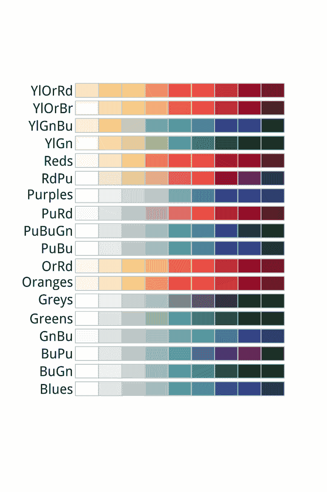 图 8.4：RColorBrewer 的顺序调色板。

 图 8.5：RColorBrewer 的分散调色板。

## 8.1 利用颜色优势

你首先应该根据其表达你正在绘制的数据的能能力来选择颜色调色板。例如，像“国家”或“性别”这样的无序分类变量需要颜色区分明显，不易混淆。另一方面，像“教育水平”这样的有序分类变量则需要某种从少到多或从早到晚的分级颜色方案。还有其他考虑因素。例如，如果你的变量是有序的，你的刻度是否以中性中点为中心，向每个方向都有极端值，就像李克特量表一样？再次强调，这些问题都是关于确保在将变量映射到颜色刻度时准确性和忠实度。务必选择一个反映你数据结构的调色板。例如，不要将顺序刻度映射到分类调色板，或者为没有明确中点的变量使用发散调色板。

除了这些映射问题之外，还需要考虑具体选择哪些颜色。一般来说，ggplot 提供的默认调色板在感知属性和美学品质方面都选得很好。我们还可以利用颜色和颜色层作为强调的手段，以突出特定的数据点或图表的某些部分，也许可以与其他特征结合使用。

 图 8.6：RColorBrewer 的定性调色板。

我们通过`scale_`函数中的`color`或`fill`来选择用于映射的颜色调色板。虽然通过`scale_color_hue()`或`scale_fill_hue()`调整每个颜色的色调、饱和度和亮度，可以非常精细地控制你的颜色方案的外观，但在一般情况下，这并不推荐。相反，你应该使用`RColorBrewer`包来提供一系列命名的颜色调色板供你选择。当与 ggplot 一起使用时，你可以通过指定`scale_color_brewer()`或`scale_fill_brewer()`函数来访问这些颜色，具体取决于你映射的美学。图 8.7 展示了你可以这样使用的命名调色板。

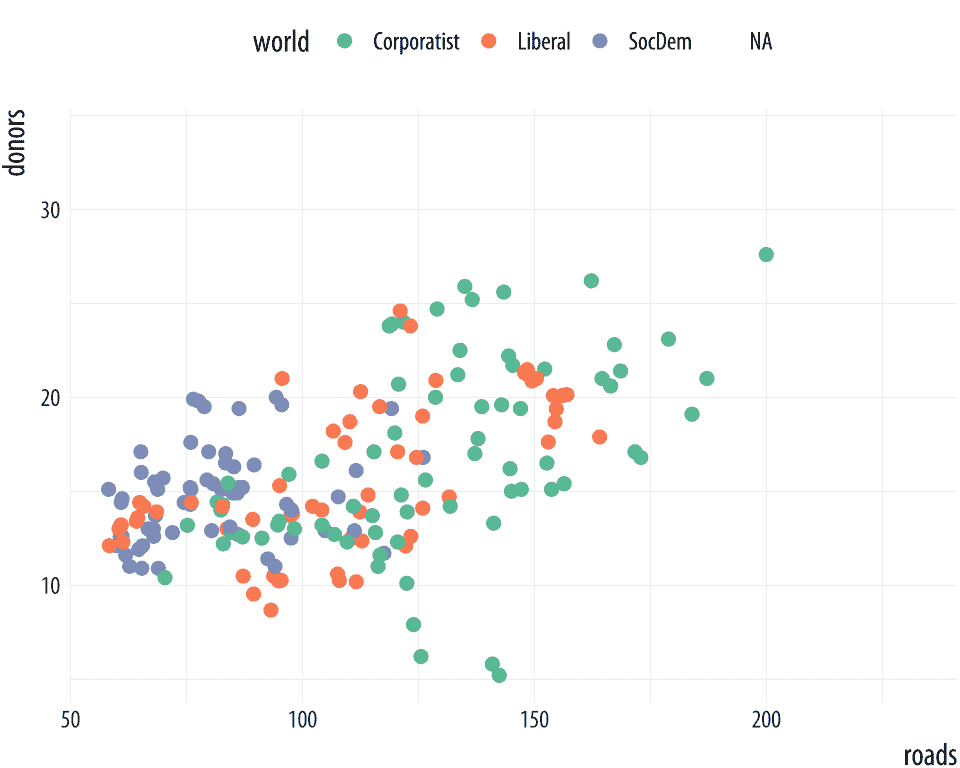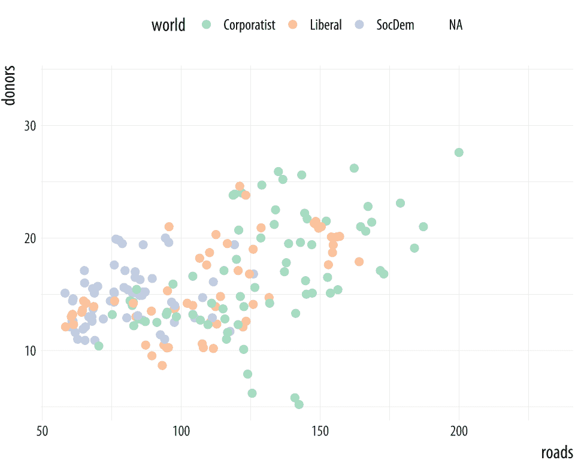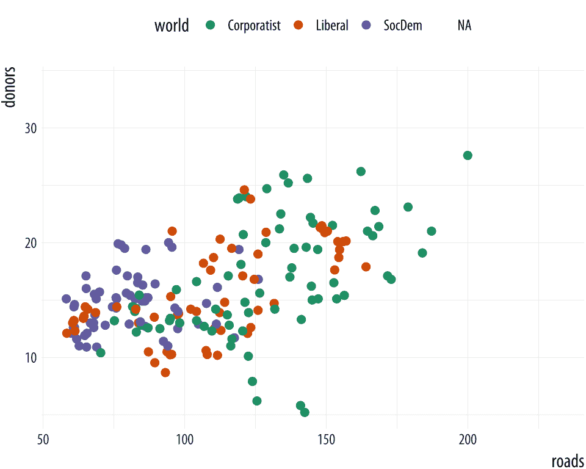 图 8.7：一些可用调色板的使用示例。

```r
p <-  ggplot(data = organdata,
 mapping = aes(x = roads, y = donors, color = world))
p +  geom_point(size = 2) +  scale_color_brewer(palette = "Set2") +
 theme(legend.position = "top")

p +  geom_point(size = 2) +  scale_color_brewer(palette = "Pastel2") +
 theme(legend.position = "top")

p +  geom_point(size = 2) +  scale_color_brewer(palette = "Dark2") +
 theme(legend.position = "top")
```

您也可以通过 `scale_color_manual()` 或 `scale_fill_manual()` 手动指定颜色。这些函数接受一个 `value` 参数，可以指定为 R 所知的颜色名称或颜色值向量。R 知道许多颜色名称（如 `red`，`green`，和 `cornflowerblue`。尝试 `demo('colors')` 获取概述。或者，可以通过它们的十六进制 RGB 值指定颜色值。这是在 RGB 颜色空间中编码颜色值的一种方式，其中每个通道可以取从 0 到 255 的值，如下所示。颜色十六进制值以一个井号或磅字符 `#` 开头，后跟三组十六进制或“hex”数字。十六进制值是 16 进制的，字母表的前六个字母代表数字 10 到 15。这允许两个字符的十六进制数字从 0 到 255 范围内变化。您读取它们为 `#rrggbb`，其中 `rr` 是红色通道的两个十六进制代码，`gg` 是绿色通道，`bb` 是蓝色通道。所以 `#CC55DD` 在十进制中转换为 `CC` = 204（红色），`55` = 85（绿色），和 `DD` = 221（蓝色）。它给出了一种强烈的粉红色。

以我们的 ASA 会员图为例，我们可以手动引入 Chang (2013) 的调色板，该调色板对色盲观众友好。

```r
cb_palette <-  c("#999999", "#E69F00", "#56B4E9", "#009E73",
 "#F0E442", "#0072B2", "#D55E00", "#CC79A7")

p4 +  scale_color_manual(values = cb_palette) 
```

图 8.8：使用自定义调色板。

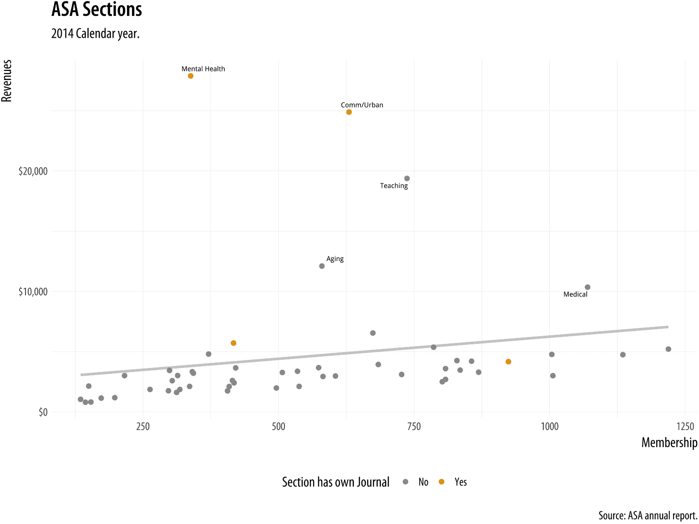

如常，这项工作已经为我们完成了。如果我们认真考虑为色盲观众使用安全的调色板，我们应该调查 `dichromat` 包。`colorblindr` 包具有类似的功能。它提供了一系列安全的调色板和一些有用的函数，帮助您大致了解您的当前调色板可能对具有几种不同类型色盲的观众看起来如何。

例如，我们可以使用 `RColorBrewer` 的 `brewer.pal()` 函数从 ggplot 的默认调色板中获取五种颜色。

```r
Default <-  brewer.pal(5, "Set2")
```

接下来，我们可以使用 `dichromat` 库中的一个函数将这些颜色转换为新值，以模拟不同类型的色盲。

```r
library(dichromat)

types <-  c("deutan", "protan", "tritan")
names(types) <-  c("Deuteronopia", "Protanopia", "Tritanopia")

color_table <-  types %>%
 purrr::map(~  dichromat(Default, .x)) %>%
 as_tibble() %>%
 add_column(Default, .before = TRUE)

color_table
```

```r
## # A tibble: 5 x 4
##   Default Deuteronopia Protanopia Tritanopia
##   <chr>   <chr>        <chr>      <chr>     
## 1 #66C2A5 #AEAEA7      #BABAA5    #82BDBD   
## 2 #FC8D62 #B6B661      #9E9E63    #F29494   
## 3 #8DA0CB #9C9CCB      #9E9ECB    #92ABAB   
## 4 #E78AC3 #ACACC1      #9898C3    #DA9C9C   
## 5 #A6D854 #CACA5E      #D3D355    #B6C8C8
```

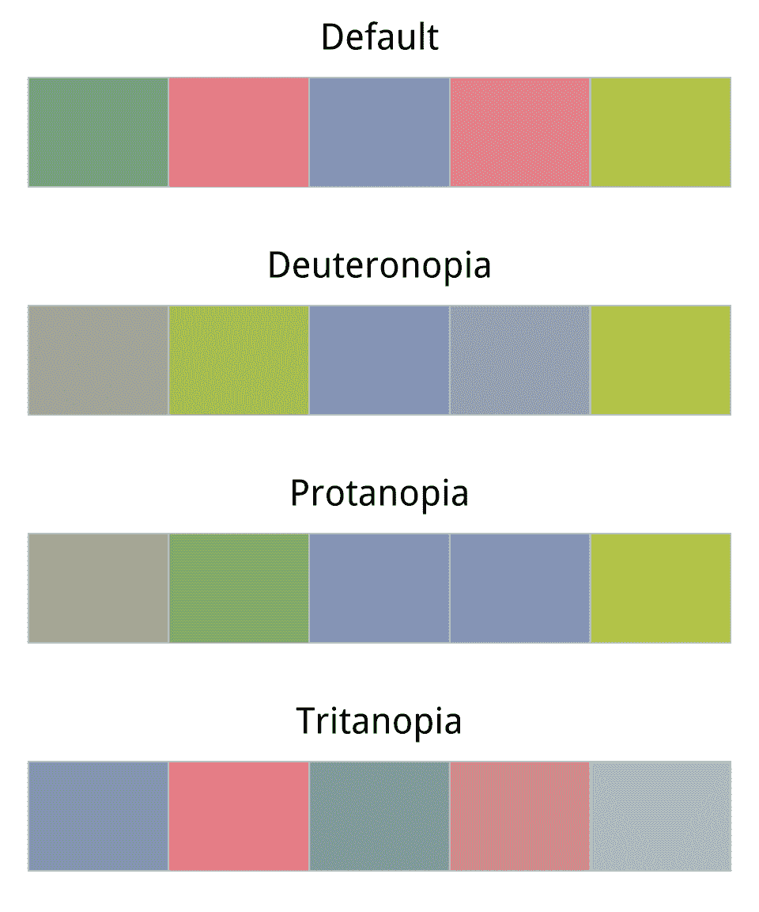 图 8.9：比较默认调色板与具有三种不同色盲类型的人看到的相同调色板的近似效果。

```r
color_comp(color_table)
```

在此代码中，我们创建了一个`dichromat()`函数所知的颜色盲`types`向量，并给它们赋予了适当的名称。然后我们使用`purrr`库的`map()`函数为每种类型创建一个颜色表。管道的其余部分将结果从列表转换为 tibble，并将原始颜色作为表的第一列添加。现在我们可以使用`socviz`库的便利函数来绘制它们，以比较它们。

手动指定颜色的能力在类别本身具有强烈颜色关联时非常有用。例如，政党往往有官方或准官方的党派颜色，人们会与它们相关联。在这种情况下，能够以（感知上平衡的！）绿色呈现绿党的结果是有帮助的。在这样做的时候，值得记住的是，一些颜色与类别（尤其是人物类别）相关联，可能是出于过时的原因，或者没有很好的理由。不要仅仅因为可以就使用刻板化的颜色。

## 8.2 层颜色和文本一起

除了直接映射变量之外，当我们要挑选或突出显示数据的一些方面时，颜色也非常有用。在这种情况下，ggplot 的分层方法可以真正发挥我们的优势。让我们通过一个例子来分析，在这个例子中，我们既为了强调也由于它们的社会意义而手动指定颜色。

我们将构建关于 2016 年美国大选的数据图表。这些数据包含在`socviz`库中的`county_data`对象中。我们首先为民主党人和共和党人定义蓝色和红色。然后我们创建图表的基本设置和第一层。我们筛选数据，只包括`flipped`变量值为“否”的县。我们将`geom_point()`的颜色设置为浅灰色，因为它将形成图表的背景层。并且我们对 x 轴的刻度应用了对数变换。

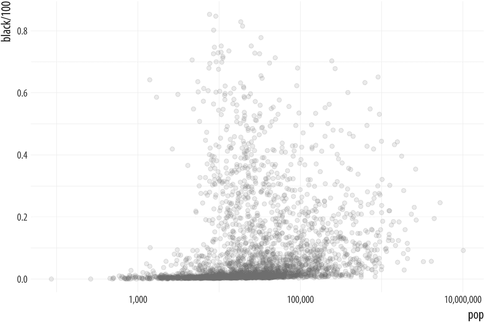 图 8.10：背景层。

```r
# Democrat Blue and Republican Red
party_colors <-  c("#2E74C0", "#CB454A")

p0 <-  ggplot(data = subset(county_data,
 flipped == "No"),
 mapping = aes(x = pop,
 y = black/100))

p1 <-  p0 +  geom_point(alpha = 0.15, color = "gray50") +
 scale_x_log10(labels=scales::comma) 

p1
```

在下一步中，我们添加第二个`geom_point()`层。这次我们从相同的数据集中提取一个互补的子集。这次我们选择`flipped`变量上的“是”县。`x`和`y`映射相同，但我们为这些点添加了一个颜色刻度，将`partywinner16`变量映射到`color`美学。然后我们使用`scale_color_manual()`指定一个手动颜色刻度，其中的值是我们上面定义的蓝色和红色`party_colors`。

 图 8.11：第二层。

```r
p2 <-  p1 +  geom_point(data = subset(county_data,
 flipped == "Yes"),
 mapping = aes(x = pop, y = black/100,
 color = partywinner16)) +
 scale_color_manual(values = party_colors)

p2
```

下一层设置了 y 轴的刻度和标签。

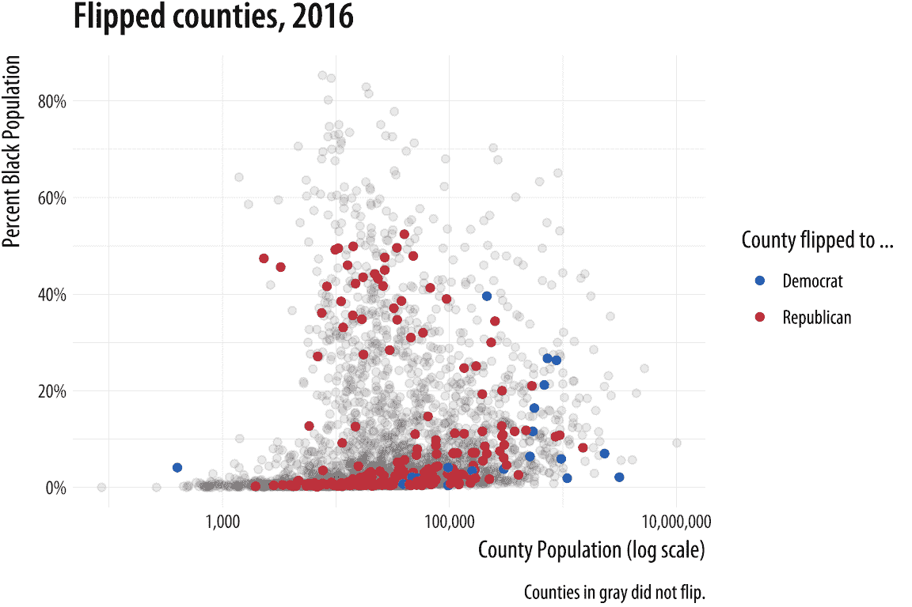 图 8.12：添加指南和标签，并修复 x 轴刻度。

```r
p3 <-  p2 +  scale_y_continuous(labels=scales::percent) +
 labs(color = "County flipped to ... ",
 x = "County Population (log scale)",
 y = "Percent Black Population",
 title = "Flipped counties, 2016",
 caption = "Counties in gray did not flip.")

p3
```

最后，我们使用`geom_text_repel()`函数添加第三层。再次提供一组指令来对数据进行子集化，以便为这个文本层。我们感兴趣的是拥有相对较高比例非裔美国居民的翻转县。如图 8.13 所示，这是一个复杂但可读的多层图表，巧妙地使用了颜色进行变量编码和背景。

```r
p4 <-  p3 +  geom_text_repel(data = subset(county_data,
 flipped == "Yes" &
 black  >  25),
 mapping = aes(x = pop,
 y = black/100,
 label = state), size = 2)

p4 +  theme_minimal() +
 theme(legend.position="top")
```

当在 ggplot 中生成这种图形或查看他人制作的优秀图表时，应该逐渐养成不仅看到图表的内容，还要看到其隐含或显式的结构的习惯。首先，你将能够看到构成图表基础的映射，挑选出哪些变量被映射到 x 和 y 轴，哪些被映射到颜色、填充、形状、标签等。使用了哪些几何对象来生成它们？其次，如何调整了刻度？轴是否进行了转换？填充和颜色图例是否合并？第三，特别是当你练习制作自己的图表时，你会发现自己正在挑选图表的**分层**结构。基础层是什么？在其上绘制了什么，以及顺序如何？哪些上层是由数据子集形成的？哪些是新数据集？是否有注释？以这种方式评估图表的能力，将图形语法应用于实践，对于**查看**图表和思考如何**制作**它们都很有用。

## 8.3 使用主题更改图表外观

我们的选择图表已经处于相当完善的状态。但如果我们想一次性改变其整体外观，我们可以使用 ggplot 的主题引擎。可以使用`theme_set()`函数打开或关闭主题。它需要一个主题名称（它本身也将是一个函数）作为参数。尝试以下操作：

```r
theme_set(theme_bw())
p4 +  theme(legend.position="top")

theme_set(theme_dark())
p4 +  theme(legend.position="top")
```

在内部，主题函数是一组详细的指令，用于在图表上打开、关闭或修改大量图形元素。一旦设置，主题就会应用于所有后续的图表，并且它将保持活动状态，直到被不同的主题所取代。这可以通过使用另一个`theme_set()`语句或通过在每个图表的末尾添加主题函数来实现：`p4 + theme_gray()`将暂时覆盖`p4`对象上通常活动的主题。你仍然可以使用`theme()`函数来微调图表的任何方面，就像上面将图例移至图表顶部所看到的那样。

ggplot 库自带了几个内置主题，包括`theme_minimal()`和`theme_classic()`，默认为`theme_gray()`或`theme_grey()`。如果这些不符合你的口味，可以安装`ggthemes`库以获得更多选项。例如，你可以让 ggplot 的输出看起来像是被《经济学人》或《华尔街日报》或爱德华·图菲的书籍页面所采用。

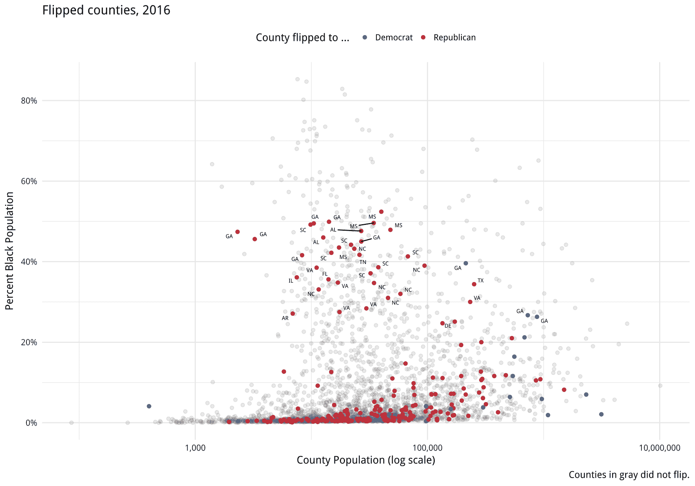

图 8.13：2016 年县级选举数据。

使用某些主题可能需要根据需要调整字体大小或其他元素，如果默认设置过大或过小。如果你使用带有彩色背景的主题，在映射到`color`或`fill`美学时，你还需要考虑你正在使用的颜色调色板。你可以从头开始定义自己的主题，或者从你喜欢的主题开始，并在此基础上进行调整。

```r
library(ggthemes)

theme_set(theme_economist())
p4 +  theme(legend.position="top")

theme_set(theme_wsj())

p4 +  theme(plot.title = element_text(size = rel(0.6)),
 legend.title = element_text(size = rel(0.35)),
 plot.caption = element_text(size = rel(0.35)),
 legend.position = "top")
```

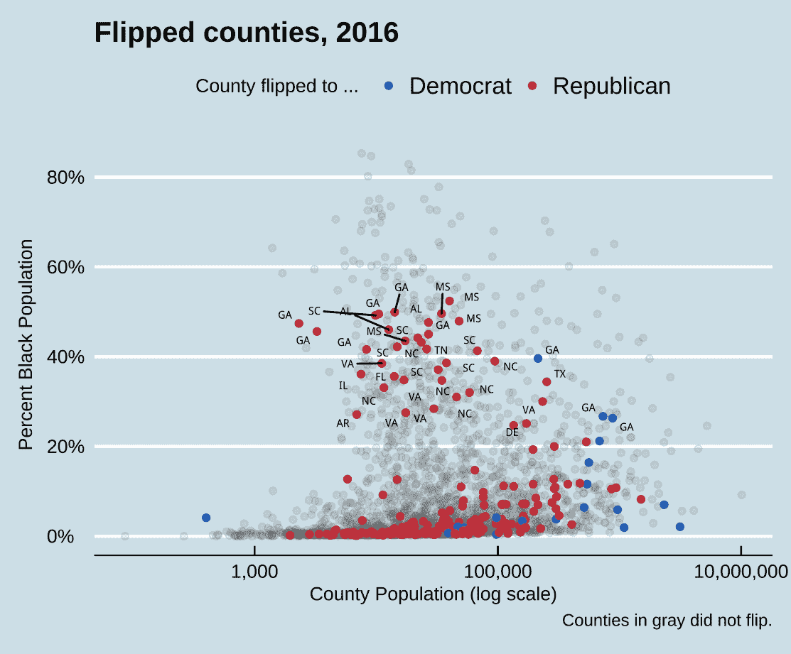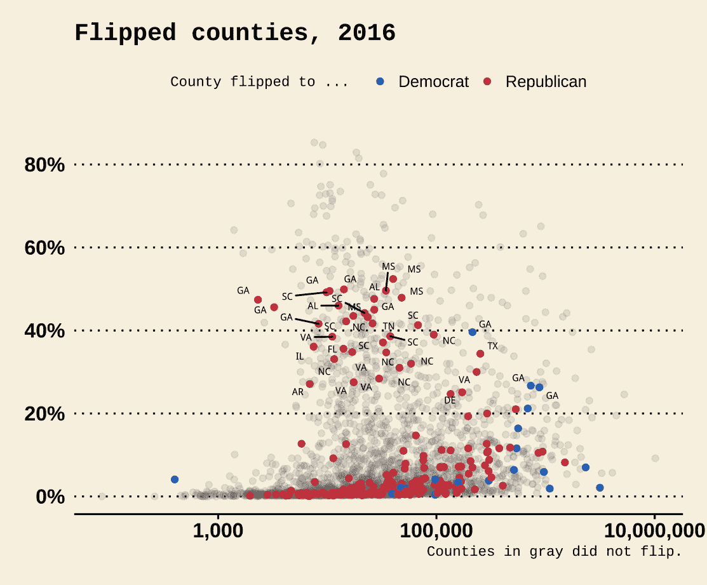

图 8.14：经济学家和 WSJ 主题。

通常来说，带有自定义字体的彩色背景主题最适合用于制作单次图形或海报，当准备要整合到幻灯片演示中的图表，或者当需要符合出版物的内部或编辑风格时。请仔细考虑你所做的选择将如何与更广泛的印刷或显示材料相协调。正如在选择美学映射调色板时一样，一开始最好坚持默认设置或持续使用已经解决了一些问题的主题。Claus It also contains some convenience functions for laying out several plot objects in a single figure, amongst other features, as we shall see below in one of the case studies. O. Wilke 的`cowplot`包，例如，包含了一个适合最终目的地为期刊文章的图表的成熟主题。Bob Rudis 的`hrbrthemes`包，同时，具有独特且紧凑的外观和感觉，利用了一些免费可用的字体。两者都可通过`install.packages()`获得。

`theme()`函数允许你对图表中所有各种文本和图形元素的外观进行非常精细的控制。例如，我们可以更改文本的颜色、字体和字体粗细。如果你一直在编写代码，你会注意到你制作的图表与文本中显示的不完全相同。坐标轴标签的位置与默认设置略有不同，字体不同，还有其他一些小的变化。`theme_book()`函数提供了本书中使用的自定义 ggplot 主题。这个主题的代码在很大程度上基于 Bob Rudis 的`theme_ipsum()`，来自他的`hrbrthemes`库。你可以在附录中了解更多信息。对于这个单独的图表，我们通过调整文本大小进一步调整该主题，我们还通过命名并使用`element_blank()`使它们消失来删除许多元素。

```r
p4 +  theme(legend.position = "top")

p4 +  theme(legend.position = "top",
 plot.title = element_text(size=rel(2),
 lineheight=.5,
 family="Times",
 face="bold.italic",
 colour="orange"),
 axis.text.x = element_text(size=rel(1.1),
 family="Courier",
 face="bold",
 color="purple"))
```

图 8.15：直接控制各种主题元素。

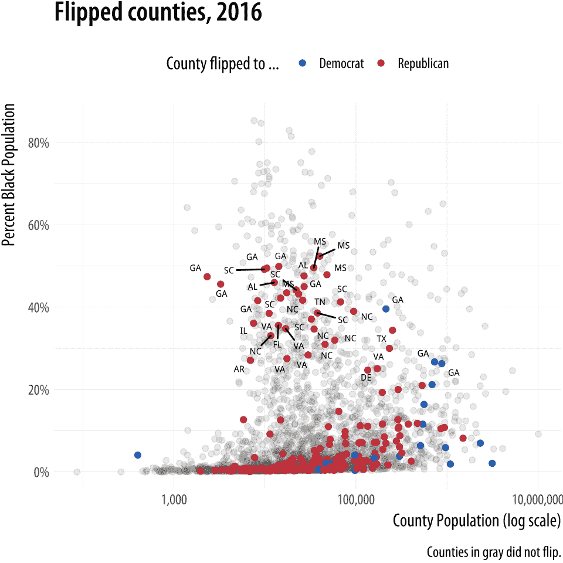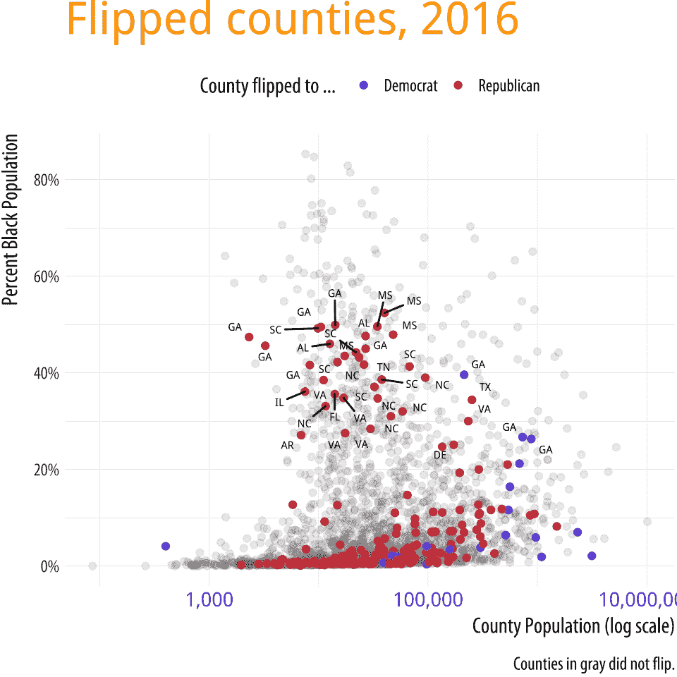

## 8.4 以实质性的方式使用主题元素

将主题用作固定设计元素的方式是很有意义的，因为这意味着你可以随后忽略它们，而专注于你正在检查的数据。但也要记住，ggplot 的主题系统非常灵活。它允许调整广泛的设计元素，以创建自定义图表。例如，根据 Wehrwein（2017）的一个例子，我们将创建 GSS 受访者年龄分布的有效小倍数图。`gss_lon`数据包含有关自 1972 年以来调查中所有年份的每个 GSS 受访者的年龄信息。图表的基础是一个缩放的`geom_density()`层，类似于我们之前看到的，这次按`year`变量分面。我们将用深灰色填充密度曲线，然后添加每年平均年龄的指示符和标签层。在设置好这些之后，我们调整几个主题元素的细节，主要是为了移除它们。和之前一样，我们使用`element_text()`调整各种文本元素（如标题和标签）的外观。我们还使用`element_blank()`来完全移除其中的一些。

首先，我们需要计算每个感兴趣年份受访者的平均年龄。由于 GSS 自 1972 年以来存在了大多数（但不是所有）年份，我们将从开始每隔四年查看一次分布。我们使用一个简短的管道来提取平均年龄。

```r
yrs <-  c(seq(1972, 1988, 4), 1993, seq(1996, 2016, 4))

mean_age <-  gss_lon %>%
 filter(age %nin%  NA &&  year %in%  yrs) %>%
 group_by(year) %>%
 summarize(xbar = round(mean(age, na.rm = TRUE), 0))
mean_age$y <-  0.3

yr_labs <-  data.frame(x = 85, y = 0.8,
 year = yrs)
```

当我们想要将年龄作为文本标签定位时，`mean_age`中的`y`列将非常有用。接下来，我们准备数据和设置几何形状。

```r
p <-  ggplot(data = subset(gss_lon, year %in%  yrs),
 mapping = aes(x = age))

p1 <-  p +  geom_density(fill = "gray20", color = FALSE,
 alpha = 0.9, mapping = aes(y = ..scaled..)) +
 geom_vline(data = subset(mean_age, year %in%  yrs),
 aes(xintercept = xbar), color = "white", size = 0.5) +
 geom_text(data = subset(mean_age, year %in%  yrs),
 aes(x = xbar, y = y, label = xbar), nudge_x = 7.5,
 color = "white", size = 3.5, hjust = 1) +
 geom_text(data = subset(yr_labs, year %in%  yrs),
 aes(x = x, y = y, label = year)) +
 facet_grid(year ~  ., switch = "y")
```

 图 8.16：自定义的小倍数图。

初始的`p`对象通过我们选择的年份对数据进行子集化，并将`x`映射到`age`变量。`geom_density()`调用是基础层，通过参数关闭其默认的线条颜色，将填充设置为灰色阴影，并将 y 轴的刻度设置为 0 到 1 之间。

使用我们的汇总数据集，`geom_vline()`层在分布的平均年龄处绘制一条垂直的白色线。两个文本元素中的第一个标记年龄线（白色）。第一个`geom_text()`调用使用`nudge`参数将标签稍微推到其 x 值的右侧。第二个标记年份。我们这样做是因为我们即将关闭通常的面板标签，以使图表更加紧凑。最后，我们使用`facet_grid()`根据年份分解年龄分布。我们使用`switch`参数将标签移动到左侧。

在确定好剧情结构之后，我们便按照想要的风格对元素进行设计，通过一系列指令来调用`theme()`。

```r
p1 +  theme_book(base_size = 10, plot_title_size = 10,
 strip_text_size = 32, panel_spacing = unit(0.1, "lines")) +
 theme(plot.title = element_text(size = 16),
 axis.text.x= element_text(size = 12),
 axis.title.y=element_blank(),
 axis.text.y=element_blank(),
 axis.ticks.y = element_blank(),
 strip.background = element_blank(),
 strip.text.y = element_blank(),
 panel.grid.major = element_blank(),
 panel.grid.minor = element_blank()) +
 labs(x = "Age",
 y = NULL,
 title = "Age Distribution of\nGSS Respondents")
```

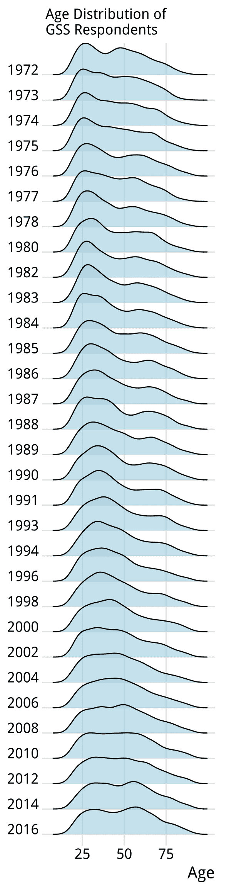 图 8.17：年龄分布图的脊图版本。

ggplot 的开发者社区令人愉悦的一点是，它经常将最初以一次性或定制方式完成的绘图想法推广到可以提供为新 geoms 的程度。在编写了图 8.16 中 GSS 年龄分布的代码后不久，`ggridges`包就被发布了。由 Claus O. Wilke 编写，它通过允许分布垂直重叠以产生有趣的效果，提供了一种对小型密度图的另一种看法。它特别适用于在清晰方向上变化的重复分布度量。在这里，我们使用`ggridges`中的一个函数重新绘制我们之前的图表。由于`geom_density_ridges()`使得显示更紧凑，我们以显示每个 GSS 年份的分布为代价，牺牲了显示平均年龄值。

```r
library(ggridges)

p <-  ggplot(data = gss_lon,
 mapping = aes(x = age, y = factor(year, levels = rev(unique(year)),
 ordered = TRUE)))

p +  geom_density_ridges(alpha = 0.6, fill = "lightblue", scale = 1.5) +
 scale_x_continuous(breaks = c(25, 50, 75)) +
 scale_y_discrete(expand = c(0.01, 0)) + 
 labs(x = "Age", y = NULL,
 title = "Age Distribution of\nGSS Respondents") +
 theme_ridges() +
 theme(title = element_text(size = 16, face = "bold"))
```

`scale_y_discrete()`中的`expand`参数稍微调整了 y 轴的缩放。它具有缩短轴标签与第一个分布之间距离的效果，并且还防止了第一个分布的顶部被图表的框架切掉。该包还附带了自己的主题`theme_ridges()`，它调整标签以使它们正确对齐，我们在这里使用它。`geom_density_ridges()`函数也能够重现我们原始版本的外观。分布的重叠程度由 geom 中的`scale`参数控制。你可以尝试将其设置为低于或高于一的值，以查看对图表布局的影响。

在 ggplot 文档中可以找到关于通过`theme()`函数可以控制的各个元素名称的更多详细信息。以这种方式设置这些主题元素通常是人们在制作图表时想要做的第一件事之一。但在实践中，除了确保你的图表的整体大小和比例正确外，对主题元素进行的小幅调整应该是你在绘图过程中最后做的事情。理想情况下，一旦你设置了一个对你来说效果良好的主题，它应该是一件你可以完全避免的事情。

## 8.5 案例研究

糟糕的图形无处不在。更好的图形在我们触手可及。在本章的最后几节中，我们将通过一些现实生活中的案例来探讨一些常见的可视化问题或困境。在每种情况下，我们将查看原始图表并重新绘制它们的新（和更好的）版本。在这个过程中，我们将介绍一些 ggplot 的新功能和特性，我们之前还没有看到。这也符合实际情况。通常，面对一些实际的设计或可视化问题，迫使我们不得不在文档中寻找解决问题的方法，或者即兴想出一些替代答案。让我们从一个常见的案例开始：趋势图中双轴的使用。

### 8.5.1 两个 y 轴

2016 年 1 月，查尔斯·施瓦布公司首席投资策略师 Liz Ann Sonders 在推特上关于两个经济时间序列之间的明显相关性发表了评论：标准普尔 500 股票市场指数和货币基础，后者是衡量货币供应量的一种度量。S&P 是一个在感兴趣期间（大约是过去七年）从约 700 到约 2100 的指数。货币基础在同一时期从约 1.5 万亿美元到 4.1 万亿美元不等。这意味着我们无法直接绘制这两个序列。货币基础如此之大，以至于它会使标准普尔 500 序列看起来像底部的一条水平线。虽然有几个合理的方法可以解决这个问题，但人们通常选择使用两个 y 轴。

因为它是被负责任的人设计的，R 使得绘制带有两个 y 轴的图表变得稍微有些棘手。实际上，ggplot 甚至完全禁止这样做。如果你坚持的话，可以使用 R 的基础图形。图 8.18 显示了结果。这里我不会展示代码。（你可以在`https://github.com/kjhealy/two-y-axes`找到它。）这主要是因为基础 R 中的图形工作方式与我们在这本书中采用的方法非常不同，所以这只会让人困惑，部分原因是我不希望鼓励年轻人参与不道德的行为。

图 8.18：两个时间序列，每个都有自己的 y 轴。

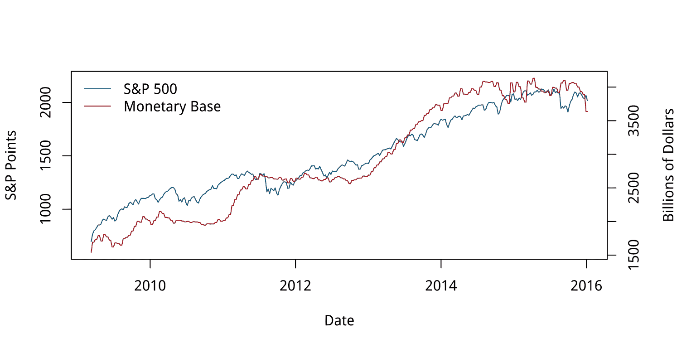

当人们绘制带有两个 y 轴的图表时，大多数情况下他们希望尽可能地将序列对齐，因为他们怀疑它们之间存在实质性的关联，就像这个案例一样。使用两个 y 轴的主要问题是，它使得比平时更容易欺骗自己（或其他人）关于变量之间关联程度。这是因为你可以调整轴的缩放比例，使它们相对于彼此移动，从而在某种程度上移动数据序列。在图 8.18 的前半部分，红色的货币基础线在蓝色标准普尔 500 指数下方，在后半部分上方。

图 8.19：两个 y 轴的变化。

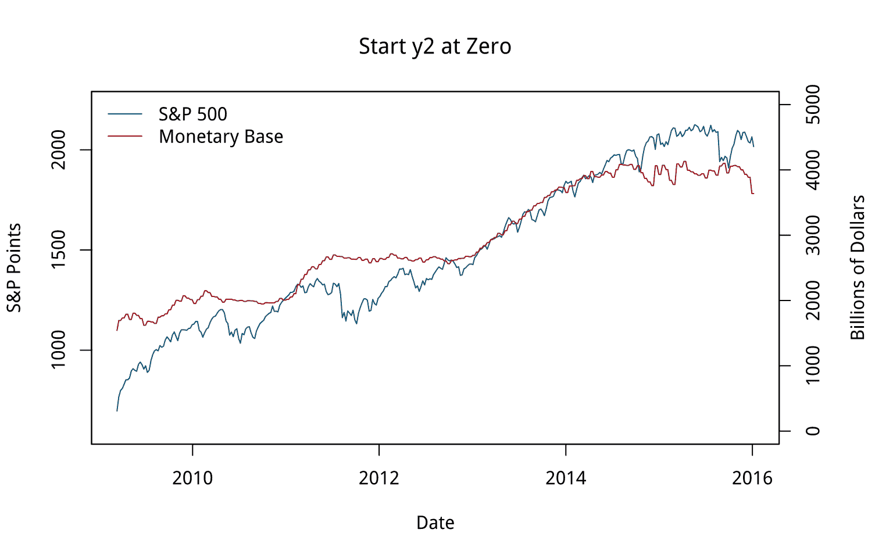

我们可以通过决定将第二个 y 轴的起始点设为零来“修复”这个问题，这将使货币基础线在序列的前半部分位于 S&P 线之上，而在后来位于其下方。图 8.19 中的第一个面板显示了结果。同时，第二个面板调整了轴，使跟踪 S&P 的轴从零开始。跟踪货币基础的轴开始在其最小值附近（这是通常的良好实践），但现在两个轴的最大值都约为 4,000。当然，单位是不同的。S&P 侧的 4,000 是一个指数数，而货币基础数是 4,000 亿美元。这种效果是大大平缓了 S&P 的表面增长，大大减弱了两个变量之间的关联。如果你愿意，你可以用这个故事讲述一个完全不同的故事。

我们还能如何绘制这些数据呢？我们可以使用分割轴或断裂轴图表同时显示两个序列。这些图表有时可能很有效，并且它们似乎比具有双重轴的叠加图表具有更好的感知特性（Isenberg，Bezerianos，Dragicevic，& Fekete，2011）。它们在您绘制的序列属于同一类型但量级非常不同的情况下最有用。但在这里并非如此。

另一种妥协方案，如果这些序列不在相同的单位（或具有很大差异的量级）中，是对其中一个序列进行缩放（例如，通过除以或乘以一千），或者选择在第一个时期的开始时将每个序列的指数都调整为 100，然后绘制它们。指数数列可能有其自身的复杂性，但在这里，它们允许我们使用一个轴而不是两个轴，并且还可以计算两个序列之间的合理差异，并在下面的面板中绘制出来。在视觉上估计序列之间的差异可能相当棘手，部分原因是因为我们的感知倾向是寻找其他序列中的*最近*比较点，而不是直接在上面的或下面的点。遵循 Cleveland（1994）的方法，我们还可以在下面添加一个面板，跟踪两个序列之间的运行差异。我们首先制作每个图表并将它们存储在一个对象中。为此，将数据完全整理成长格式，将指数序列作为键变量，它们的对应分数作为值，将会很方便。我们使用 tidyr 的`gather()`函数来完成这项工作：

```r
head(fredts)
```

```r
##         date  sp500 monbase sp500_i monbase_i
## 1 2009-03-11 696.68 1542228 100.000   100.000
## 2 2009-03-18 766.73 1693133 110.055   109.785
## 3 2009-03-25 799.10 1693133 114.701   109.785
## 4 2009-04-01 809.06 1733017 116.131   112.371
## 5 2009-04-08 830.61 1733017 119.224   112.371
## 6 2009-04-15 852.21 1789878 122.324   116.058
```

```r
fredts_m <-  fredts %>%  select(date, sp500_i, monbase_i) %>%
 gather(key = series, value = score, sp500_i:monbase_i)

head(fredts_m)
```

```r
##         date  series   score
## 1 2009-03-11 sp500_i 100.000
## 2 2009-03-18 sp500_i 110.055
## 3 2009-03-25 sp500_i 114.701
## 4 2009-04-01 sp500_i 116.131
## 5 2009-04-08 sp500_i 119.224
## 6 2009-04-15 sp500_i 122.324
```

一旦以这种方式整理了数据，我们就可以制作我们的图表。

```r
p <-  ggplot(data = fredts_m,
 mapping = aes(x = date, y = score,
 group = series,
 color = series))
p1 <-  p +  geom_line() +  theme(legend.position = "top") +
 labs(x = "Date",
 y = "Index",
 color = "Series")

p <-  ggplot(data = fredts,
 mapping = aes(x = date, y = sp500_i -  monbase_i))

p2 <-  p +  geom_line() +
 labs(x = "Date",
 y = "Difference")
```

现在我们有了两个图表，我们希望将它们布局得很好。我们不希望它们出现在同一个图表区域中，但我们确实想比较它们。使用分面图是可能的，但这意味着需要进行相当多的数据处理，以便将三个序列（两个指数以及它们之间的差异）都放入同一个整洁的数据框中。另一种选择是制作两个独立的图表，然后按照我们喜欢的样子排列它们。例如，让两个序列的比较占据大部分空间，并将指数差异的图表放在底部的一个较小区域中。

R 和 ggplot 使用的布局引擎，称为`grid`，确实使这成为可能。它控制着图表区域和对象在 ggplot 以下层面的布局和定位。直接编程`grid`布局比单独使用 ggplot 的函数要费一些功夫。幸运的是，有一些辅助库我们可以使用来简化事情。一种可能性是使用`gridExtra`库。它提供了一些有用的函数，使我们能够与网格引擎进行通信，包括`grid.arrange()`。这个函数接受一系列图表对象以及我们希望它们如何排列的指令。我们之前提到的`cowplot`库使事情变得更加简单。它有一个`plot_grid()`函数，它的工作方式与`grid.arrange()`非常相似，同时也会处理一些细节，包括在不同图表对象之间正确对齐坐标轴。

```r
cowplot::plot_grid(p1, p2, nrow = 2, rel_heights = c(0.75, 0.25), align = "v")
```

图 8.20：使用两个独立图表显示的带运行差的索引序列。

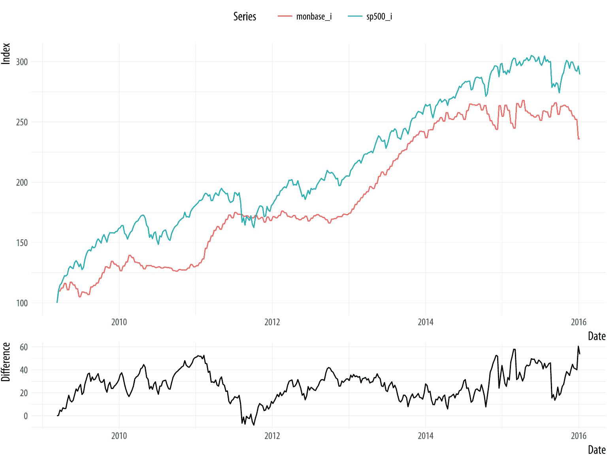

结果如图 8.20 所示。看起来相当不错。在这个版本中，标准普尔指数几乎在整个序列中都位于货币基础之上，而在原始绘制的图表中，它们是交叉的。

这种类型双轴图表的更广泛问题是，这些变量之间看似的关联可能是虚假的。原始图表正在满足我们寻找模式的需求，但从实质上讲，可能这两个时间序列都在趋向增加，但它们之间并没有任何深刻的联系。如果我们对建立它们之间真正的关联感兴趣，我们可能会天真地尝试将一个回归到另一个。例如，我们可以尝试用货币基础预测标准普尔指数。如果我们这样做，一开始看起来绝对棒，因为我们似乎只通过知道同一时期的货币基础的大小就能解释大约 95%的标准普尔指数的方差。我们将会变得富有！

很遗憾，我们可能不会变得富有。虽然每个人都知道相关性不等于因果关系，但在时间序列数据中，我们面临的问题更为严重。即使只考虑一个序列，每个观测值通常与它之前立即的观测值或之前某个固定数量的观测值非常接近。例如，时间序列可能有一个季节性成分，我们在对其增长做出断言之前需要考虑这个成分。如果我们询问什么*预测*其增长，那么我们将引入另一个时间序列，它将具有自己的趋势属性。在这种情况下，我们几乎自动违反了普通回归分析的假设，从而产生了对关联的过度自信的估计。当你第一次遇到这种情况时，结果可能看似矛盾，但大量时间序列分析的工具实际上是在使数据的序列性消失。

就像任何经验法则一样，总是可以找到例外，或者说服自己相信这些例外。我们可以想象一些情况，在这些情况下，审慎地使用双 y 轴可能是向他人展示数据的一种合理方式，或者可能帮助研究人员有效地探索数据集。但总的来说，我建议不要这样做，因为已经很容易展示虚假的，或者至少是过度自信的关联，尤其是在时间序列数据中。散点图可以做到这一点。即使在单个序列中，正如我们在第一章中看到的，我们也可以通过调整纵横比来使关联看起来更陡峭或更平坦。使用两个 y 轴给你提供了额外的自由度来玩弄数据，而在大多数情况下，你真的不应该利用这个自由度。这样的规则当然不能阻止那些想用图表欺骗你的人尝试，但也许可以帮助你避免欺骗自己。

### 8.5.2 重绘一个糟糕的幻灯片

在 2015 年底，许多观察者都在批评 Marissa Mayer 作为雅虎 CEO 的表现。其中之一，Eric Jackson，一位投资基金经理，向雅虎董事会发送了一份 99 页的演示文稿，概述了他对 Mayer 的最佳反对意见。（他还公开了这份演示文稿。）幻灯片的风格是典型的商业演示风格。幻灯片和海报是非常有用的沟通方式。根据我的经验，大多数抱怨“PowerPoint 之死”的人并没有经历过足够多的演讲，演讲者甚至懒得准备幻灯片。但看到“幻灯片集”如何完全摆脱了其作为沟通辅助工具的起源，并演变成一种独立的准格式，这确实令人印象深刻。商业、军事和学术界都以各种方式受到了这种趋势的影响。不必花时间去写备忘录或文章，只需给我们提供无穷无尽的要点和图表即可。这种令人困惑的效果就是不断总结那些从未发生过的讨论。

图 8.21：一个糟糕的幻灯片。


在任何情况下，图 8.21 重现了演示文稿中的一张典型幻灯片。它似乎想要说明雅虎员工数量和其收入之间的关系，在梅耶尔担任 CEO 的背景下。自然的事情是制作某种散点图来查看这些变量之间是否存在关系。然而，然而，幻灯片将时间放在 x 轴上，并使用两个 y 轴来显示员工和收入数据。它将收入绘制为条形图，将员工数据绘制为通过略微波浪形的线条连接的点。乍一看，不清楚连接线段是手动添加的还是有一些原则在背后支撑着这些波动。（它们最终是在 Excel 中创建的。）收入值用作条形内的标签。点没有标签。员工数据延伸到 2015 年，但收入数据只到 2014 年。一个箭头指向梅耶尔被任命为 CEO 的日期，一条红色的虚线似乎表示……实际上我不确定。也许是一个员工数量应该下降的某种阈值？或者也许只是最后一个观察到的值，以便允许跨系列进行比较？这并不清楚。最后，请注意，尽管收入数字是年度的，但某些较晚的员工数量每年有多个观察结果。

我们应该如何重新绘制这张图表？让我们专注于传达员工数量和收入之间的关系，因为这似乎是其最初的动力所在。作为次要元素，我们想要说明一下梅耶尔在这个关系中的作用。这张幻灯片的原始错误在于它使用两个不同的 y 轴来绘制两组数字，如上所述。我们经常在商业分析师那里看到这种情况。时间几乎是他们唯一放在 x 轴上的东西。

为了重新绘制图表，我从图表上的条形中提取了数字，以及来自 QZ.com 的员工数据。在幻灯片中存在季度数据的地方，我使用了员工的年末数字，除了 2012 年。梅耶尔在 2012 年 7 月被任命。理想情况下，我们希望所有年份都有季度收入和季度员工数据，但鉴于我们没有，最明智的做法是除了关注的那一年（梅耶尔作为 CEO 到来的一年）之外，其他年份保持年度数据。这样做是有价值的，因为否则，她到来之前立即进行的大规模裁员将被错误地归因于她的 CEO 任期。结果是，数据集中有 2012 年的两个观察结果。它们有相同的收入数据，但员工数量不同。这些数据可以在`yahoo`数据集中找到。

```r
head(yahoo)
```

```r
##   Year Revenue Employees Mayer
## 1 2004    3574      7600    No
## 2 2005    5257      9800    No
## 3 2006    6425     11400    No
## 4 2007    6969     14300    No
## 5 2008    7208     13600    No
## 6 2009    6460     13900    No
```

重绘过程很简单。我们只需绘制一个散点图，并根据梅耶是否在那时担任首席执行官来着色点。到现在你应该知道如何轻松地做到这一点。我们可以更进一步，通过制作散点图同时保留商业分析师所喜爱的时序元素。我们可以使用`geom_path()`并使用线段来“连接”按顺序的年度观察点的“点”，并为每个点标注其年份。结果是显示公司随时间轨迹的图表，就像蜗牛在石板上移动一样。再次提醒，我们有两个 2012 年的观察数据。

 图 8.22：将数据重绘为连接散点图。

```r
p <-  ggplot(data = yahoo,
 mapping = aes(x = Employees, y = Revenue))
p +  geom_path(color = "gray80") +
 geom_text(aes(color = Mayer, label = Year),
 size = 3, fontface = "bold") +
 theme(legend.position = "bottom") +
 labs(color = "Mayer is CEO",
 x = "Employees", y = "Revenue (Millions)",
 title = "Yahoo Employees vs Revenues, 2004-2014") +
 scale_y_continuous(labels = scales::dollar) +
 scale_x_continuous(labels = scales::comma)
```

这种看待数据的方式表明，梅耶是在收入下降一段时间后，紧随一次大规模裁员之后被任命的，这是大型公司领导层中相当常见的模式。从那时起，无论是通过新招聘还是收购，员工人数略有回升，而收入持续下降。这个版本传达了原始幻灯片试图传达的信息，但表达得更加清晰。

或者，我们可以通过将时间放回 x 轴，并在 y 轴上绘制收入与员工数的比率来让分析师社区满意。这样我们就以更合理的方式恢复了线性时间趋势。我们开始绘制时，使用`geom_vline()`添加一条垂直线，标记梅耶成为首席执行官的时间点。

```r
p <-  ggplot(data = yahoo,
 mapping = aes(x = Year, y = Revenue/Employees))

p +  geom_vline(xintercept = 2012) +
 geom_line(color = "gray60", size = 2) +
 annotate("text", x = 2013, y = 0.44,
 label = " Mayer becomes CEO", size = 2.5) +
 labs(x = "Year\n",
 y = "Revenue/Employees",
 title = "Yahoo Revenue to Employee Ratio, 2004-2014")
```

图 8.23：绘制收入与员工数比率随时间的变化。


### 8.5.3 拒绝使用饼图

作为第三个例子，我们转向饼图。图 8.24 展示了来自纽约联邦储备银行关于美国债务结构简报的一对图表（Chakrabarti, Haughwout, Lee, Scally, & Klaauw, 2017）。正如我们在第一章中看到的，饼图的可感知质量并不好。在单个饼图中，通常比应该更难估计和比较显示的值，尤其是当有多个扇区，并且有几个扇区大小合理接近时。克利夫兰点图或条形图通常是比较数量的更直接的方式。当比较两个饼图之间的扇区，如本例所示时，任务变得更加困难，因为观众不得不在每块饼的扇区和垂直方向的图例之间来回切换。

图 8.24：截至 2016 年美国学生债务结构的数据。


在这个案例中还有一个额外的复杂性。每个饼图分解的变量不仅属于类别，而且从低到高是有序的。这些数据描述了所有借款人的百分比和所有余额的百分比，这些余额按照欠款的大小划分，从不到五千美元到超过二十万美元。使用饼图来显示无序类别变量的份额是一回事，例如，比如由于披萨、拉斯角和烩饭等带来的总销售额的百分比。在饼图中跟踪有序类别更困难，尤其是当我们想要比较两个分布时。这两个饼图的扇形是有序的（顺时针，从顶部开始），但并不容易跟随它们。这部分是因为图表的饼状特性，部分是因为为类别选择的调色板不是顺序的。相反，它是无序的。颜色允许区分债务类别，但无法挑出从低到高值序列。

所以这里不仅使用了不太理想的图表类型，而且还让它做了比平时多得多的工作，并且使用了错误类型的调色板。正如饼图经常出现的情况一样，为了便于解释而做出的妥协是显示每个扇形的所有数值，并在饼图外添加一个总结。如果你发现自己不得不这样做，那么值得考虑是否可以重新绘制图表，或者你干脆直接展示一个表格可能更好。

这里有两种我们可能重新绘制这些饼图的方法。像往常一样，这两种方法都不完美。或者说，每种方法都以略微不同的方式吸引人们对数据的关注。哪种方法最好取决于我们想要强调的数据部分。数据在一个名为`studebt`的对象中：

```r
head(studebt)
```

```r
## # A tibble: 6 x 4
##   Debt     type        pct Debtrc  
##   <ord>    <fct>     <int> <ord>   
## 1 Under $5 Borrowers    20 Under $5
## 2 $5-$10   Borrowers    17 $5-$10  
## 3 $10-$25  Borrowers    28 $10-$25 
## 4 $25-$50  Borrowers    19 $25-$50 
## 5 $50-$75  Borrowers     8 $50-$75 
## 6 $75-$100 Borrowers     3 $75-$100
```

我们第一次尝试重新绘制饼图使用的是两个分布的分割比较。我们提前设置了一些标签，因为我们将会重复使用它们。我们还为分割面制作了一个特殊的标签。

```r
p_xlab <- "Amount Owed, in thousands of Dollars"
p_title <- "Outstanding Student Loans"
p_subtitle <- "44 million borrowers owe a total of $1.3 trillion"
p_caption <- "Source: FRB NY"

f_labs <-  c(`Borrowers` = "Percent of\nall Borrowers",
 `Balances` = "Percent of\nall Balances")

p <-  ggplot(data = studebt,
 mapping = aes(x = Debt, y = pct/100, fill = type))
p +  geom_bar(stat = "identity") +
 scale_fill_brewer(type = "qual", palette = "Dark2") +
 scale_y_continuous(labels = scales::percent) +
 guides(fill = FALSE) +
 theme(strip.text.x = element_text(face = "bold")) +
 labs(y = NULL, x = p_xlab,
 caption = p_caption,
 title = p_title,
 subtitle = p_subtitle) +
 facet_grid(~  type, labeller = as_labeller(f_labs)) +
 coord_flip()
```

图 8.25：分割饼图。

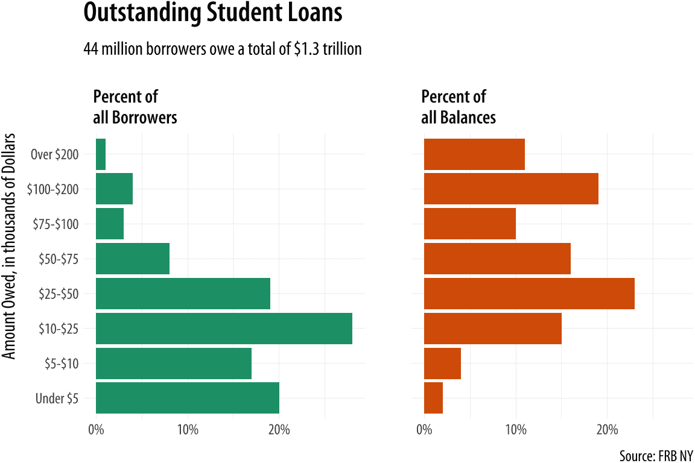

在这个图表中，有相当程度的定制化。首先，在`theme()`调用中，将面元的文本设置为粗体。图形元素首先被命名（`strip.text.x`），然后使用`element_text()`函数进行修改。我们还使用自定义调色板进行`fill`映射，通过`scale_fill_brewer()`。最后，我们使用`labeller`参数和`facet_grid()`调用内的`as_labeller()`函数，将面元重新标记为比其原始变量名更有信息量的内容。这是通过设置一个名为`f_labs`的对象来完成的，它实际上是一个小型数据框，将新标签与`studebt`中的`type`变量的值相关联。我们使用反引号（位于美国键盘上“1”键旁边的角度引号字符）来选择我们想要重新标记的值。`as_labeller()`函数接受这个对象，并在调用`facet_grid()`时使用它来创建新的标签文本。

在实质上，这个图表与饼图相比有何优势？我们将数据分为两类，并以条形图的形式展示了百分比份额。百分比分数位于 x 轴上。我们不是用颜色来区分债务类别，而是将它们的值放在 y 轴上。这意味着我们只需向下看条形图，就可以在类别内进行比较。例如，左侧面板显示，在拥有学生债务的 4400 万人中，几乎有五分之一的人债务少于五千美元。跨类别的比较现在也更容易，因为我们可以在一行中扫描，例如，可以看到，尽管只有大约百分之一或更少的借款人债务超过 20 万美元，但这个类别占所有债务的 10%以上。

我们也可以通过将百分比放在 y 轴上，将欠款类别放在 x 轴上来制作这个条形图。然而，当类别轴标签很长时，我通常发现它们在 y 轴上更容易阅读。最后，虽然用颜色区分两个债务类别看起来不错，也有助于区分，但图表上的颜色并没有编码或映射数据中的任何信息，这些信息已经被分面处理。`fill`映射是有用的，但也是多余的。这个图表可以很容易地用黑白颜色呈现，如果它是的话，也会同样具有信息性。

在这样的分面图表中，没有强调的一个观点是，每个债务类别都是总金额的份额或百分比。这正是饼图所强调的，但正如我们所看到的，为了这一点，我们必须付出感知上的代价，尤其是在类别排序的情况下。但也许我们可以通过使用不同类型的条形图来保留对份额的强调。我们不是通过高度来区分单独的条形，而是可以在单个条形内按比例排列每个分布的百分比。我们将制作一个只有两个主要条形的堆叠条形图，并将它们侧放以进行比较。

```r
library(viridis)

p <-  ggplot(studebt, aes(y = pct/100, x = type, fill = Debtrc))
p +  geom_bar(stat = "identity", color = "gray80") +
 scale_x_discrete(labels = as_labeller(f_labs)) +
 scale_y_continuous(labels = scales::percent) +
 scale_fill_viridis(discrete = TRUE) +
 guides(fill = guide_legend(reverse = TRUE,
 title.position = "top",
 label.position = "bottom",
 keywidth = 3,
 nrow = 1)) +
 labs(x = NULL, y = NULL,
 fill = "Amount Owed, in thousands of dollars",
 caption = p_caption,
 title = p_title,
 subtitle = p_subtitle) +
 theme(legend.position = "top",
 axis.text.y = element_text(face = "bold", hjust = 1, size = 12),
 axis.ticks.length = unit(0, "cm"),
 panel.grid.major.y = element_blank()) +
 coord_flip()
```


图 8.26：以水平分段条形表示的债务分布。

再次强调，这个图表有很多自定义选项。我鼓励你逐个选项地将其剥开，看看它是如何变化的。我们再次使用`as_labeller()`与`f_labs`，但这次是在 x 轴的标签上。我们在`theme()`调用中进行了一系列调整，以自定义图表的纯视觉元素，通过`element_text()`使 y 轴标签更大、右对齐并加粗；移除轴刻度标记，并通过`element_blank()`移除 y 轴网格线。

更实质性地，我们在图 8.26 中对颜色非常讲究。首先，我们在`geom_bar()`中将条形的边框颜色设置为浅灰色，以便更容易区分条形段。其次，我们再次使用`viridis`库（正如我们在第七章的小倍数地图中所做的那样），使用`scale_fill_viridis()`来设置调色板。第三，我们非常小心地将收入类别按照颜色的升序排列，并调整图例，使数值从低到高、从左到右、从黄色到紫色依次排列。这通过将`fill`映射从`Debt`切换到`Debtrc`来实现。后者的类别与前者相同，但收入水平的顺序是按照我们想要的顺序编码的。我们还通过将其放在标题和副标题的上方来向读者首先展示图例。

其余的工作是在`guides()`调用中完成的。到目前为止，我们除了关闭我们不想显示的图例之外，并没有太多使用`guides()`。但在这里我们看到了它的用处。我们向`guides()`提供了一系列关于`fill`映射的指令：反转颜色编码的方向`reverse = TRUE`；将图例标题放在键的上方`title.position`；将颜色标签放在键的下方`label.position`；略微加宽颜色框的宽度`keywidth`，并将整个键放在单行上`nrow`。

这相对来说是很多工作，但如果你不这样做，图表将难以阅读。再次强调，我鼓励你按顺序剥离图表的层和选项，以了解图表是如何变化的。图 8.26 的版本让我们更容易看到欠款金额类别如何作为所有余额的百分比分解，以及作为所有借款人的百分比。我们还可以直观地比较这两种类型，尤其是在每个刻度的末端。例如，很容易看出极少数借款人占有了不成比例的大量总债务。但即使进行了所有这些细致的工作，估计每个单独部分的大小在这里仍然不像在图 8.25，即分面版本的图表中那么容易。这是因为当我们没有锚点或基线尺度来比较每个部分时，估计大小更困难。（在分面图表中，那个比较点是 x 轴。）因此，底部条形图中“低于 5”部分的大小比“$10-25”部分的大小更容易估计。即使我们尽力使它们变得最好，我们关于小心使用堆叠条形图的告诫仍然有很大的影响力。

## 8.6 接下来去哪里

我们已经到达了引言的结尾。从现在开始，你应该有足够的能力以两种主要方式继续前进。第一种是增强你的编码信心和熟练度。学习 ggplot 应该会鼓励你更多地了解 tidyverse 工具集，然后通过扩展来学习 R 语言本身。你选择追求什么（以及应该追求什么）将（并且应该）由你作为学者或数据科学家的自身需求和兴趣驱动。接下来最自然的文本是 Garrett Grolemund 的`r4ds.had.co.nz/`和 Hadley Wickham 的《R for Data Science》（Wickham & Grolemund, 2016），它介绍了我们在这里使用但未深入探讨的 tidyverse 组件。其他有用的文本包括 Chang (2013)和 Roger 的《R Programming for Data Science》（leanpub.com/rprogramming Peng，2016）。特别是，ggplot 的详尽介绍可以在 Wickham (2016)中找到。

推进使用 ggplot 进行新型图表的制作，最终可能会达到 ggplot 无法完全满足你的需求，或者无法提供你想要的特定几何形状的程度。在这种情况下，首先应该查看 ggplot 框架的扩展世界。在本书中，我们已经使用了一些扩展，例如 ggrepel 和 ggridges。扩展通常提供一两个新的几何形状来使用，这可能是你需要的。有时，就像托马斯·林·佩德森的`ggraph`一样，你会得到一个完整的几何形状家族及其相关工具——在`ggraph`的情况下，是一套用于网络数据可视化的整洁方法。其他建模和分析任务可能需要更多定制工作，或者与正在进行的分析类型紧密相关的编码。Harrell (2016) 提供了许多清晰的工作示例，主要基于 ggplot；Gelman & Hill (2018) 和 (Imai, 2017) 也介绍了使用 R 的当代方法；(Silge & Robinson, 2017) 提出了一种整洁的方法来分析和可视化文本数据；而 Friendly & Meyer (2017) 对离散数据的分析进行了彻底的探索，这是一个视觉上往往具有挑战性的领域。

你应该推进的第二种方式是观察并思考他人的图表。由 Yan Holtz 运营的 R Graph Gallery`r-graph-gallery.com`是一个有用的示例集合，展示了使用 ggplot 和其他 R 工具绘制的多种图形。由 Jon Schwabish 运营的 PolicyViz`policyviz.com`网站涵盖了数据可视化的多个主题。它定期展示案例研究，其中可视化被重新设计以改进它们或为展示的数据提供新的视角。但不要一开始就只寻找带有代码的示例。正如我之前所说，ggplot 的一个真正优势是其背后的图形语法。这个语法是一个你可以用来观察和解释*任何*图表的模型，无论它是如何产生的。它为你提供了一个词汇表，让你可以说出任何特定图表的数据、映射、几何形状、尺度、指南和层可能是什么。而且因为语法作为 ggplot 库实现，从能够分析图表结构到能够草拟出你可以自己复制的代码的轮廓，这是一个很短的步骤。

尽管其基本原理和目标相对稳定，但研究的技术和工具正在变化。这在社会科学领域尤其如此（Salganik，2018）。数据可视化是进入这些新发展的绝佳切入点。我们为此提供的工具比以往任何时候都更加灵活和强大。因此，你应该审视你的数据。看并不是代替思考。它不能迫使你诚实；它不能神奇地防止你犯错误；它也不能使你的想法变得真实。但是，如果你分析数据，可视化可以帮助你发现其中的特征。如果你诚实，它可以帮助你达到自己的标准。当你不可避免地犯错误时，它可以帮助你找到并纠正它们。而且，如果你有一个想法和一些支持它的良好证据，它可以帮助你以引人入胜的方式展示它。

## 8.1 利用颜色优势

首先，你应该根据其表达你正在绘制的数据的表达能力来选择调色板。例如，像“国家”或“性别”这样的无序分类变量需要独特的颜色，这些颜色不会相互混淆。另一方面，像“教育水平”这样的有序分类变量则需要某种从少到多或从早到晚的分级颜色方案。还有其他考虑因素。例如，如果你的变量是有序的，你的刻度是否以中性中点为中心，向每个方向都有极端值，就像李克特量表一样？再次强调，这些问题都是关于确保在将变量映射到颜色刻度时准确性和忠实度。请务必选择一个反映你数据结构的调色板。例如，不要将顺序刻度映射到分类调色板，或者为没有明确中点的变量使用发散调色板。

除了这些映射问题之外，还需要考虑选择哪些特定的颜色。一般来说，ggplot 提供的默认颜色调色板因其感知属性和美学质量而被精心挑选。我们还可以使用颜色和颜色层作为强调的手段，突出特定的数据点或图表的部分，可能与其他功能结合使用。

 图 8.6：RColorBrewer 的定性调色板。

我们通过`color`或`fill`的`scale_`函数之一来选择颜色调色板。虽然通过`scale_color_hue()`或`scale_fill_hue()`调整每个颜色使用的色调、饱和度和亮度，可以非常精细地控制你的颜色方案的外观，但通常不推荐这样做。相反，你应该使用`RColorBrewer`包来为你提供一系列命名的颜色调色板，并从中选择。当与 ggplot 一起使用时，你可以通过指定`scale_color_brewer()`或`scale_fill_brewer()`函数来访问这些颜色，具体取决于你映射的美学。图 8.7 显示了你可以这样使用的命名调色板。

 图 8.7：正在使用的一些可用调色板。

```r
p <-  ggplot(data = organdata,
 mapping = aes(x = roads, y = donors, color = world))
p +  geom_point(size = 2) +  scale_color_brewer(palette = "Set2") +
 theme(legend.position = "top")

p +  geom_point(size = 2) +  scale_color_brewer(palette = "Pastel2") +
 theme(legend.position = "top")

p +  geom_point(size = 2) +  scale_color_brewer(palette = "Dark2") +
 theme(legend.position = "top")
```

你也可以通过`scale_color_manual()`或`scale_fill_manual()`手动指定颜色。这些函数接受一个`value`参数，可以指定为 R 知道的颜色的名称或值的向量。R 知道许多颜色名称（如`red`、`green`和`cornflowerblue`）。尝试`demo('colors')`以获取概述。或者，可以通过它们的十六进制 RGB 值指定颜色值。这是在 RGB 颜色空间中编码颜色值的一种方式，其中每个通道可以取从 0 到 255 的值，如下所示。颜色十六进制值以一个井号或磅字符`#`开头，后跟三组十六进制或“hex”数字。十六进制值是 16 进制，字母表的前六个字母代表数字 10 到 15。这允许两个字符的十六进制数字从 0 到 255。你读它们作为`#rrggbb`，其中`rr`是红色通道的两个数字十六进制代码，`gg`是绿色通道，`bb`是蓝色通道。所以`#CC55DD`在十进制中转换为`CC` = 204（红色），`55` = 85（绿色），`DD` = 221（蓝色）。它给出了一种强烈的粉红色。

以我们的 ASA 会员图为例，例如，我们可以手动引入 Chang（2013）的一个调色板，这个调色板对色盲观众友好。

```r
cb_palette <-  c("#999999", "#E69F00", "#56B4E9", "#009E73",
 "#F0E442", "#0072B2", "#D55E00", "#CC79A7")

p4 +  scale_color_manual(values = cb_palette) 
```

图 8.8：使用自定义颜色调色板。


正如通常情况一样，这项工作已经为我们完成了。如果我们认真考虑为色盲观众使用安全的调色板，我们应该调查`dichromat`包。`colorblindr`包具有类似的功能。它提供了一系列安全的调色板和一些有用的函数，帮助你大致了解你的当前调色板可能对具有几种不同类型色盲的观众看起来如何。

例如，让我们使用`RColorBrewer`的`brewer.pal()`函数从 ggplot 的默认调色板中获取五种颜色。

```r
Default <-  brewer.pal(5, "Set2")
```

接下来，我们可以使用来自 `dichromat` 库的函数将这些颜色转换为新值，以模拟不同类型的色盲。

```r
library(dichromat)

types <-  c("deutan", "protan", "tritan")
names(types) <-  c("Deuteronopia", "Protanopia", "Tritanopia")

color_table <-  types %>%
 purrr::map(~  dichromat(Default, .x)) %>%
 as_tibble() %>%
 add_column(Default, .before = TRUE)

color_table
```

```r
## # A tibble: 5 x 4
##   Default Deuteronopia Protanopia Tritanopia
##   <chr>   <chr>        <chr>      <chr>     
## 1 #66C2A5 #AEAEA7      #BABAA5    #82BDBD   
## 2 #FC8D62 #B6B661      #9E9E63    #F29494   
## 3 #8DA0CB #9C9CCB      #9E9ECB    #92ABAB   
## 4 #E78AC3 #ACACC1      #9898C3    #DA9C9C   
## 5 #A6D854 #CACA5E      #D3D355    #B6C8C8
```

 图 8.9：比较默认调色板与三种不同色盲类型的人对相同调色板的近似感知。

```r
color_comp(color_table)
```

在此代码中，我们创建了一个 `types` 的向量，其中包含 `dichromat()` 函数所了解的颜色盲类型，并给它们赋予了适当的名称。然后我们使用 `purrr` 库的 `map()` 函数为每种类型制作一个颜色表。管道的其余部分将结果从列表转换为 tibble，并将原始颜色作为表的第一列添加。现在我们可以使用来自 `socviz` 库的便利函数来绘制它们，以比较它们之间的差异。

手动指定颜色的能力在类别本身具有强烈颜色关联时可能很有用。例如，政党往往有官方或准官方的党派颜色，人们会与它们联系在一起。在这种情况下，能够以（感知上平衡的！）绿色呈现绿党的结果是有帮助的。在这样做的时候，值得记住的是，一些颜色与类别（尤其是人物类别）有关，可能是出于过时的原因，或者没有很好的理由。不要仅仅因为可以就使用刻板印象的颜色。

## 8.2 层叠颜色和文本

除了直接映射变量之外，当我们要挑选或突出显示数据的一些方面时，颜色也非常有用。在这种情况下，ggplot 的分层方法可以真正发挥我们的优势。让我们通过一个例子来分析，在这个例子中，我们既使用手动指定的颜色来强调，也由于它们的社交意义而使用。

我们将构建关于 2016 年美国大选的数据图表。这些数据包含在 `socviz` 库中的 `county_data` 对象中。我们首先为民主党人和共和党人定义蓝色和红色。然后我们创建图表的基本设置和第一层。我们筛选数据，只包括在 `flipped` 变量上值为“否”的县。我们将 `geom_point()` 的颜色设置为浅灰色，因为它将形成图表的背景层。并且我们对 x 轴的刻度应用了对数变换。

 图 8.10：背景层。

```r
# Democrat Blue and Republican Red
party_colors <-  c("#2E74C0", "#CB454A")

p0 <-  ggplot(data = subset(county_data,
 flipped == "No"),
 mapping = aes(x = pop,
 y = black/100))

p1 <-  p0 +  geom_point(alpha = 0.15, color = "gray50") +
 scale_x_log10(labels=scales::comma) 

p1
```

在下一步中，我们添加第二个`geom_point()`层。这里我们使用相同的数据集，但从中提取一个互补的子集。这次我们选择了`flipped`变量上的“是”县。`x`和`y`映射相同，但我们为这些点添加了一个颜色刻度，将`partywinner16`变量映射到`color`美学。然后我们使用`scale_color_manual()`指定一个手动颜色刻度，其中的值是我们上面定义的蓝色和红色`party_colors`。

 图 8.11：第二层。

```r
p2 <-  p1 +  geom_point(data = subset(county_data,
 flipped == "Yes"),
 mapping = aes(x = pop, y = black/100,
 color = partywinner16)) +
 scale_color_manual(values = party_colors)

p2
```

下一层设置 y 轴刻度和标签。

 图 8.12：添加指南和标签，以及调整 x 轴刻度。

```r
p3 <-  p2 +  scale_y_continuous(labels=scales::percent) +
 labs(color = "County flipped to ... ",
 x = "County Population (log scale)",
 y = "Percent Black Population",
 title = "Flipped counties, 2016",
 caption = "Counties in gray did not flip.")

p3
```

最后，我们使用`geom_text_repel()`函数添加第三个层。再次，我们提供一组指令来为这个文本层子集数据。我们感兴趣的是具有相对较高比例非裔美国居民的比例翻转县。如图 8.13 所示，这是一个复杂但可读的多层图表，巧妙地使用了颜色进行变量编码和背景说明。

```r
p4 <-  p3 +  geom_text_repel(data = subset(county_data,
 flipped == "Yes" &
 black  >  25),
 mapping = aes(x = pop,
 y = black/100,
 label = state), size = 2)

p4 +  theme_minimal() +
 theme(legend.position="top")
```

当在 ggplot 中制作此类图形或观察他人制作的优秀图表时，逐渐养成不仅看到图表的内容，还要看到其隐含或显性的结构的好习惯。首先，你将能够看到构成图表基础的映射，挑选出哪些变量映射到 x 和 y 轴，哪些映射到颜色、填充、形状、标签等。使用了哪些几何形状来生成它们？其次，如何调整了刻度？轴是否进行了转换？填充和颜色图例是否合并？第三，特别是当你练习制作自己的图表时，你会发现自己在挑选图表的**分层**结构。基础层是什么？在其上绘制了什么，以及顺序如何？哪些上层是由数据子集形成的？哪些是新数据集？是否有注释？以这种方式评估图表的能力，将图形语法应用于实践，对于**查看**图表和思考如何**制作**图表都很有用。

## 8.3 使用主题更改图表外观

我们的选举图表已经相当完善。但如果我们想一次性改变其整体外观，我们可以使用 ggplot 的主题引擎。可以使用`theme_set()`函数打开或关闭主题。它需要一个主题（它本身将是一个函数）作为参数。尝试以下操作：

```r
theme_set(theme_bw())
p4 +  theme(legend.position="top")

theme_set(theme_dark())
p4 +  theme(legend.position="top")
```

在内部，主题函数是一组详细的指令，用于在图上打开、关闭或修改大量图形元素。一旦设置，主题就会应用于所有后续的绘图，并且它将保持活动状态，直到被不同的主题所取代。这可以通过使用另一个`theme_set()`语句来完成，或者通过在每个绘图的基础上添加主题函数到绘图末尾来实现：`p4 + theme_gray()`将暂时覆盖`p4`对象上通常活动的主题。你仍然可以使用`theme()`函数来微调绘图中的任何方面，就像上面所见到的将图例移至图形顶部。

ggplot 库包含几个内置主题，包括`theme_minimal()`和`theme_classic()`，默认为`theme_gray()`或`theme_grey()`。如果这些不符合你的口味，可以安装`ggthemes`库以获得更多选项。例如，你可以使 ggplot 的输出看起来像是《经济学家》或《华尔街日报》的特色，或者看起来像是爱德华·图夫特书籍的页面。


图 8.13：2016 年的县级选举数据。

使用某些主题可能需要根据需要调整字体大小或其他元素，如果默认设置太大或太小。如果你使用带有彩色背景的主题，在映射到`color`或`fill`美学时，还需要考虑你正在使用的颜色调色板。你可以从头开始定义自己的主题，或者从一个你喜欢的主题开始，并在此基础上进行调整。

```r
library(ggthemes)

theme_set(theme_economist())
p4 +  theme(legend.position="top")

theme_set(theme_wsj())

p4 +  theme(plot.title = element_text(size = rel(0.6)),
 legend.title = element_text(size = rel(0.35)),
 plot.caption = element_text(size = rel(0.35)),
 legend.position = "top")
```


图 8.14：经济学家和《华尔街日报》主题。

通常来说，带有彩色背景和定制字体的主题最适合用于制作一次性图形或海报，准备用于幻灯片演示的图形，或者符合出版机构或编辑风格的出版物。请注意考虑你所做的选择如何与更广泛的印刷或显示材料协调。就像选择美学映射的调色板一样，一开始最好坚持默认设置或持续使用已经解决了一些问题的主题。ClausIt 还包含一些便利函数，用于在单个图形中布局多个绘图对象，以及其他功能，正如我们将在下面的案例研究中看到的那样。例如，O. Wilke 的`cowplot`包包含一个适合最终目的地为期刊文章的图形的成熟主题。Bob Rudis 的`hrbrthemes`包则具有独特而紧凑的外观和感觉，利用了一些免费可用的字体。这两个包都可以通过`install.packages()`安装。

`theme()`函数允许你对图表中所有种类的文本和图形元素的外观进行非常精细的控制。例如，我们可以更改文本的颜色、字体和字体粗细。如果你一直在跟随编写代码，你会注意到你制作的图表与文本中显示的不完全相同。坐标轴标签的位置与默认位置略有不同，字体不同，还有其他一些小的变化。`theme_book()`函数提供了本书中使用的自定义 ggplot 主题。这个主题的代码在很大程度上基于 Bob Rudis 的`theme_ipsum()`，来自他的`hrbrthemes`库。你可以在附录中了解更多信息。对于这个图形，我们进一步调整了该主题，通过调整文本大小，并且通过命名并使用`element_blank()`使它们消失来移除许多元素。

```r
p4 +  theme(legend.position = "top")

p4 +  theme(legend.position = "top",
 plot.title = element_text(size=rel(2),
 lineheight=.5,
 family="Times",
 face="bold.italic",
 colour="orange"),
 axis.text.x = element_text(size=rel(1.1),
 family="Courier",
 face="bold",
 color="purple"))
```

图 8.15：直接控制各种主题元素。


## 8.4 以实质性方式使用主题元素

将主题用作固定设计元素的方式是很有意义的，因为这意味着你可以随后忽略它们，转而关注你正在检查的数据。但同时也值得记住，ggplot 的主题系统非常灵活。它允许调整广泛的设计元素以创建自定义图形。例如，根据 Wehrwein（2017）的一个例子，我们将创建 GSS 受访者年龄分布的有效小倍数图。`gss_lon`数据包含了自 1972 年以来调查中所有年份的 GSS 受访者的年龄信息。图形的基础是一个缩放的`geom_density()`层，类似于我们之前看到的，这次按`year`变量分面。我们将用深灰色填充密度曲线，然后添加每年平均年龄的指示符和一个标签文本层。有了这些，我们就调整了几个主题元素的细节，主要是为了移除它们。和之前一样，我们使用`element_text()`调整各种文本元素（如标题和标签）的外观。我们还使用`element_blank()`来完全移除其中的一些。

首先，我们需要计算每个感兴趣年份受访者的平均年龄。由于 GSS 自 1972 年以来存在了大多数（但不是所有）年份，我们将从开始每隔四年查看一次分布。我们使用一个简短的管道来提取平均年龄。

```r
yrs <-  c(seq(1972, 1988, 4), 1993, seq(1996, 2016, 4))

mean_age <-  gss_lon %>%
 filter(age %nin%  NA &&  year %in%  yrs) %>%
 group_by(year) %>%
 summarize(xbar = round(mean(age, na.rm = TRUE), 0))
mean_age$y <-  0.3

yr_labs <-  data.frame(x = 85, y = 0.8,
 year = yrs)
```

当我们想要将年龄作为文本标签定位时，`mean_age`中的`y`列将很有用。接下来，我们准备数据和设置几何形状。

```r
p <-  ggplot(data = subset(gss_lon, year %in%  yrs),
 mapping = aes(x = age))

p1 <-  p +  geom_density(fill = "gray20", color = FALSE,
 alpha = 0.9, mapping = aes(y = ..scaled..)) +
 geom_vline(data = subset(mean_age, year %in%  yrs),
 aes(xintercept = xbar), color = "white", size = 0.5) +
 geom_text(data = subset(mean_age, year %in%  yrs),
 aes(x = xbar, y = y, label = xbar), nudge_x = 7.5,
 color = "white", size = 3.5, hjust = 1) +
 geom_text(data = subset(yr_labs, year %in%  yrs),
 aes(x = x, y = y, label = year)) +
 facet_grid(year ~  ., switch = "y")
```

 图 8.16：自定义的小倍数图。

初始的 `p` 对象通过我们选择的年份对数据进行子集化，并将 `x` 映射到 `age` 变量。`geom_density()` 调用是基础层，带有关闭其默认线条颜色的参数，将填充设置为灰色阴影，并调整 y 轴的缩放范围在零到一之间。

使用我们总结的数据集，`geom_vline()` 层在分布的平均年龄处绘制一条垂直的白色线。两个文本几何图形中的第一个标记年龄线（白色）。第一个 `geom_text()` 调用使用 `nudge` 参数将标签稍微推到其 x 值的右侧。第二个标记年份。我们这样做是因为我们即将关闭通常的面板标签，以使图形更加紧凑。最后，我们使用 `facet_grid()` 按年份分解年龄分布。我们使用 `switch` 参数将标签移动到左侧。

在放置好图形的结构后，我们使用一系列指令对 `theme()` 中的元素进行样式化。

```r
p1 +  theme_book(base_size = 10, plot_title_size = 10,
 strip_text_size = 32, panel_spacing = unit(0.1, "lines")) +
 theme(plot.title = element_text(size = 16),
 axis.text.x= element_text(size = 12),
 axis.title.y=element_blank(),
 axis.text.y=element_blank(),
 axis.ticks.y = element_blank(),
 strip.background = element_blank(),
 strip.text.y = element_blank(),
 panel.grid.major = element_blank(),
 panel.grid.minor = element_blank()) +
 labs(x = "Age",
 y = NULL,
 title = "Age Distribution of\nGSS Respondents")
```

 图 8.17：年龄分布图的脊图版本。

ggplot 开发者社区中令人愉悦的一点是，它经常将最初以一次性或定制方式完成的图形想法推广到可以提供为新几何图形的程度。在编写图 8.16（refineplots.html#fig:ch-08-gssage-real）中 GSS 年龄分布的代码后不久，`ggridges` 包被发布。由 Claus O. Wilke 编写，它通过允许分布垂直重叠以产生有趣的效果，提供了一种对小型密度图的不同看法。它特别适用于在清晰方向上变化的重复分布度量。在这里，我们使用 `ggridges` 中的函数重新绘制我们之前的图形。由于 `geom_density_ridges()` 使得显示更紧凑，我们以显示每个 GSS 年份的分布为代价，牺牲了显示平均年龄值。

```r
library(ggridges)

p <-  ggplot(data = gss_lon,
 mapping = aes(x = age, y = factor(year, levels = rev(unique(year)),
 ordered = TRUE)))

p +  geom_density_ridges(alpha = 0.6, fill = "lightblue", scale = 1.5) +
 scale_x_continuous(breaks = c(25, 50, 75)) +
 scale_y_discrete(expand = c(0.01, 0)) + 
 labs(x = "Age", y = NULL,
 title = "Age Distribution of\nGSS Respondents") +
 theme_ridges() +
 theme(title = element_text(size = 16, face = "bold"))
```

`scale_y_discrete()` 中的 `expand` 参数稍微调整了 y 轴的缩放。它具有缩短轴标签与第一个分布之间距离的效果，并且它还防止了第一个分布的顶部被图形框架切掉。该包还自带一个主题，`theme_ridges()`，它调整标签以使它们正确对齐，我们在这里使用它。`geom_density_ridges()` 函数也能够重现我们原始版本的外观。分布重叠的程度由几何图形中的 `scale` 参数控制。你可以尝试将其设置为低于或高于一的值，以观察对图形布局的影响。

在 ggplot 文档中可以找到关于通过`theme()`函数可以控制的各个元素名称的更多详细信息。以这种方式设置这些主题元素通常是人们在制作图表时想要做的第一件事之一。但在实践中，除了确保你的图表的整体大小和比例合适之外，对主题元素进行小的调整应该是你在绘图过程中最后做的事情。理想情况下，一旦你设置了一个对你来说效果良好的主题，它应该是一件你可以完全避免的事情。

## 8.5 案例研究

坏的图表无处不在。更好的图表在我们触手可及。在本章的最后几节中，我们将通过一些现实生活中的案例来探讨一些常见的可视化问题或困境。在每种情况下，我们将查看原始图表并重新绘制它们的新（更好的）版本。在这个过程中，我们将介绍一些 ggplot 的新功能，我们之前还没有看到过。这也是真实的。通常，面对一些实际的设计或可视化问题，迫使我们不得不在文档中寻找解决问题的方法，或者即兴想出一些替代答案。让我们从一个常见的案例开始：趋势图中使用双轴。

### 8.5.1 两个 y 轴

2016 年 1 月，查尔斯·施瓦布公司首席投资策略师 Liz Ann Sonders 在推特上关于两个经济时间序列之间的明显相关性发表了评论：标准普尔 500 股票市场指数和货币基础，这是衡量货币供应量大小的一个指标。S&P 指数在感兴趣的时间段（大约是过去七年）内从大约 700 点上升到大约 2100 点。货币基础在同一时期内从大约 1.5 万亿美元上升到 4.1 万亿美元。这意味着我们无法直接绘制这两个序列。货币基础如此之大，以至于它会使 S&P 500 序列在底部看起来像一条水平线。虽然有几个合理的方法可以解决这个问题，但人们通常选择使用两个 y 轴。

由于它是由负责任的人设计的，R 使得用两个 y 轴绘制图表变得稍微有些棘手。实际上，ggplot 完全禁止这样做。如果你坚持的话，可以使用 R 的基本图形。图 8.18 显示了结果。这里我不会展示代码。（你可以在`https://github.com/kjhealy/two-y-axes`找到它。）这主要是因为基础 R 中的图形工作方式与我们在整本书中采用的方法非常不同，所以这只会让人困惑，部分原因是我不希望鼓励年轻人参与不道德的行为。

图 8.18：两个时间序列，每个都有自己的 y 轴。


大多数时候，当人们使用两个 y 轴绘制图表时，他们希望尽可能地将系列对齐，因为他们怀疑它们之间存在实质性关联，就像这个例子一样。使用两个 y 轴的主要问题是，它使得自己（或其他人）更容易对变量之间的关联程度产生误解。这是因为你可以调整轴的缩放比例，使其相互之间以某种方式移动数据系列。在图 8.18 的前半部分，红色的货币基础线位于蓝色 S&P 500 线之下，而在后半部分则位于其上。

图 8.19：两个 y 轴的变化


我们可以通过决定将第二个 y 轴从零开始来“修复”这个问题，这将使货币基础线在系列的前半部分位于 S&P 线之上，而在后来位于其下。图 8.19 的第一部分显示了结果。同时，第二部分调整了轴，使得跟踪 S&P 的轴从零开始。跟踪货币基础的轴开始在其最小值附近（这是通常的良好实践），但现在两个轴的最大值都约为 4,000。当然，单位是不同的。S&P 侧的 4,000 是一个指数数字，而货币基础的数字是 4,000 亿美元。这种效果是相当程度地平缓了 S&P 的表面增长，大大减弱了两个变量之间的关联。如果你愿意，你可以用这个故事讲述一个完全不同的故事。

我们还能如何绘制这些数据？我们可以使用分割或断裂轴图同时显示两个系列。这些图表有时很有效，并且它们似乎比双轴叠加图表有更好的感知属性（Isenberg, Bezerianos, Dragicevic, & Fekete, 2011）。它们在绘制类型相同但量级非常不同的系列时最有用。这里的情况并非如此。

如果系列不在相同的单位（或具有广泛不同的量级）中，另一个折衷方案是对其中一个系列进行缩放（例如，通过除以或乘以一千），或者作为替代方案，在第一个时期开始时将每个系列都索引到 100，然后绘制它们。指数数字可能有自己的复杂性，但在这里，它们允许我们使用一个坐标轴而不是两个，并且还可以计算两个系列之间的合理差异，并在下面的面板中绘制它。视觉上估计系列之间的差异可能相当困难，部分原因是因为我们的感知倾向是寻找其他系列中的*最近*比较点，而不是直接在上面或下面。遵循 Cleveland（1994）的方法，我们还可以在下面添加一个面板，跟踪两个系列之间的运行差异。我们首先制作每个图表并将它们存储在一个对象中。为此，将数据完全整理成长格式，将索引系列作为关键变量，它们的对应分数作为值将非常方便。我们使用 tidyr 的 `gather()` 函数来完成这项工作：

```r
head(fredts)
```

```r
##         date  sp500 monbase sp500_i monbase_i
## 1 2009-03-11 696.68 1542228 100.000   100.000
## 2 2009-03-18 766.73 1693133 110.055   109.785
## 3 2009-03-25 799.10 1693133 114.701   109.785
## 4 2009-04-01 809.06 1733017 116.131   112.371
## 5 2009-04-08 830.61 1733017 119.224   112.371
## 6 2009-04-15 852.21 1789878 122.324   116.058
```

```r
fredts_m <-  fredts %>%  select(date, sp500_i, monbase_i) %>%
 gather(key = series, value = score, sp500_i:monbase_i)

head(fredts_m)
```

```r
##         date  series   score
## 1 2009-03-11 sp500_i 100.000
## 2 2009-03-18 sp500_i 110.055
## 3 2009-03-25 sp500_i 114.701
## 4 2009-04-01 sp500_i 116.131
## 5 2009-04-08 sp500_i 119.224
## 6 2009-04-15 sp500_i 122.324
```

以这种方式整理数据后，我们可以制作我们的图表。

```r
p <-  ggplot(data = fredts_m,
 mapping = aes(x = date, y = score,
 group = series,
 color = series))
p1 <-  p +  geom_line() +  theme(legend.position = "top") +
 labs(x = "Date",
 y = "Index",
 color = "Series")

p <-  ggplot(data = fredts,
 mapping = aes(x = date, y = sp500_i -  monbase_i))

p2 <-  p +  geom_line() +
 labs(x = "Date",
 y = "Difference")
```

现在我们有了两个图表，我们希望将它们布局得很好。我们不希望它们出现在同一个图表区域中，但我们确实想要比较它们。使用分面（facet）是可能的，但这意味着需要进行相当多的数据处理，以便将三个系列（两个指标以及它们之间的差异）都放入同一个整洁的数据框中。另一种选择是制作两个独立的图表，然后按照我们的喜好排列它们。例如，让两个系列的比较占据大部分空间，并将指数差异的图表放在底部的一个较小区域中。

R 和 ggplot 使用的布局引擎，称为 `grid`，确实使这成为可能。它控制着图表区域和对象在 ggplot 之下的布局和定位。直接编程 `grid` 布局比单独使用 ggplot 的函数要复杂一些。幸运的是，有一些辅助库我们可以使用，使事情变得更容易。一种可能性是使用 `gridExtra` 库。它提供了一些有用的函数，使我们能够与网格引擎进行通信，包括 `grid.arrange()`。这个函数接受一系列图表对象以及我们希望它们如何排列的说明。我们之前提到的 `cowplot` 库使事情变得更加简单。它有一个 `plot_grid()` 函数，其工作方式与 `grid.arrange()` 类似，同时处理一些细节，包括在不同图表对象之间正确对齐坐标轴。

```r
cowplot::plot_grid(p1, p2, nrow = 2, rel_heights = c(0.75, 0.25), align = "v")
```

图 8.20：使用两个独立的图表，在下面显示具有运行差异的索引系列。


结果显示在图 8.20 中。看起来相当不错。在这个版本中，标准普尔指数几乎在整个系列中运行在货币基础之上，而原始绘制的图表中，它们是交叉的。

这种类型双轴图的更广泛问题是，这些变量之间的明显关联可能是虚假的。原始图表正在满足我们寻找模式的需求，但从实质上讲，可能这两个时间序列都在趋向于增加，但它们在其他方面并没有任何深刻的联系。如果我们对建立它们之间真正的关联感兴趣，我们可能从天真地回归一个序列到另一个序列开始。例如，我们可以尝试从货币基础预测标准普尔指数。如果我们这样做，一开始看起来绝对令人惊叹，因为我们似乎只通过知道同一时期的货币基础的大小就能解释大约 95%的标准普尔指数的方差。我们将会变得富有！

很遗憾，我们可能不会变得富有。虽然每个人都知道相关性不等于因果关系，但在时间序列数据中，我们会遇到这个问题两次。即使只考虑一个序列，每个观测值通常与它立即之前的观测值或可能是在一些常规周期之前的观测值非常紧密相关。例如，一个时间序列可能有一个季节性成分，我们在对其增长做出断言之前可能需要考虑。如果我们询问什么 *预测* 它的增长，那么我们将引入另一个时间序列，它将具有自己的趋势属性。在这些情况下，我们几乎自动地违反了普通回归分析的假设，从而产生了对关联的过度自信的估计。当你第一次遇到这个结果时，它可能看起来有些矛盾，但结果是，时间序列分析的大部分机制都是关于消除数据的序列性。

就像任何经验法则一样，可能会出现例外，或者说服自己相信它们。我们可以想象一些情况，其中恰当地使用双 y 轴可能是向他人展示数据的一种合理方式，或者可能帮助研究人员有效地探索数据集。但总的来说，我建议不要这样做，因为已经很容易展示虚假的，或者至少是过度自信的关联，尤其是在时间序列数据中。散点图可以做到这一点。即使在单个序列中，正如我们在第一章节中看到的，我们可以通过调整纵横比来使关联看起来更陡峭或更平坦。使用两个 y 轴给你提供了额外的自由度来玩弄数据，这在大多数情况下，你真的不应该利用。这样的规则当然不能阻止那些想用图表欺骗你的人尝试，但可能会帮助你不会欺骗自己。

### 8.5.2 重新绘制糟糕的幻灯片

在 2015 年底，许多观察者都在批评 Marissa Mayer 作为雅虎 CEO 的表现。其中之一，Eric Jackson，一位投资基金经理，向雅虎董事会发送了一份 99 页的演示文稿，概述了他对 Mayer 的最佳反对意见。（他还公开了这份演示文稿。）幻灯片的风格是典型的商业演示风格。幻灯片和海报是非常有用的沟通方式。根据我的经验，大多数抱怨“PowerPoint 之死”的人都没有参加过足够多的演讲，演讲者甚至懒得准备幻灯片。但看到“幻灯片集”如何完全摆脱了其作为沟通辅助工具的起源，并演变成一种独立的准格式，这确实令人印象深刻。商业、军事和学术界都以各种方式受到了这种趋势的影响。不必花时间去写备忘录或文章，只需给我们提供无穷无尽的要点和图表即可。这种令人困惑的效果是不断总结从未发生的讨论。

图 8.21：一个糟糕的幻灯片。


在任何情况下，图 8.21 重现了该套幻灯片中的一个典型幻灯片。它似乎想要说明在 Mayer 担任 CEO 期间，雅虎员工数量和收入之间的关系。自然的事情是制作某种散点图来查看这些变量之间是否存在关系。然而，然而，该幻灯片将时间放在 x 轴上，并使用两个 y 轴来展示员工和收入数据。它将收入绘制为柱状图，将员工数据绘制为通过略微波浪形的线条连接的点。乍一看，不清楚连接线段是手动添加的还是有一些原则在背后支撑着这些波动。（结果证明它们是在 Excel 中创建的。）收入值用作柱状图内的标签。点没有标签。员工数据延伸到 2015 年，但收入数据只到 2014 年。一个箭头指向 Mayer 被聘为 CEO 的日期，一条红色的虚线似乎表示……实际上我不确定。可能是某种员工数量应该下降的阈值？或者可能只是最后一个观察到的值，以便跨系列进行比较？这并不清楚。最后，请注意，尽管收入数字是年度的，但某些较晚的员工数量每年有多个观察值。

我们应该如何重新绘制这个图表？让我们专注于传达员工数量和收入之间的关系，因为这似乎是其最初的动力所在。作为次要元素，我们想要说一些关于 Mayer 在这个关系中的作用。幻灯片的原始错误在于它使用两个不同的 y 轴来绘制两组数字，正如上面所讨论的。我们经常在商业分析师那里看到这种情况。时间几乎是他们在 x 轴上唯一放置的东西。

为了重新绘制图表，我从图表上的条形中提取了数字，以及来自 QZ.com 的员工数据。在幻灯片中存在季度数据的地方，我使用了员工的年末数字，除了 2012 年。梅耶在 2012 年 7 月被任命。理想情况下，我们希望所有年份都有季度收入和季度员工数据，但鉴于我们没有，最合理的事情是除了关注的那一年（梅耶成为首席执行官的那一年）之外，保持年度化。这样做是有价值的，因为否则，她上任前立即发生的大规模裁员将被错误地归因于她的首席执行官任期。结果是，数据集中有两个关于 2012 年的观察数据。它们有相同的收入数据，但员工数不同。这些数据可以在`yahoo`数据集中找到。

```r
head(yahoo)
```

```r
##   Year Revenue Employees Mayer
## 1 2004    3574      7600    No
## 2 2005    5257      9800    No
## 3 2006    6425     11400    No
## 4 2007    6969     14300    No
## 5 2008    7208     13600    No
## 6 2009    6460     13900    No
```

重新绘制是直接的。我们只需绘制一个散点图，并根据梅耶是否在那时担任首席执行官来着色点。到现在你应该知道如何轻松地做到这一点。我们可以进一步一小步，通过制作散点图同时保留商业分析师所喜爱的时序元素。我们可以使用`geom_path()`并使用线段来“连接”按顺序的年度观察数据点，每个点都标注其年份。结果是显示公司随时间轨迹的图表，就像蜗牛在石板上移动。再次提醒，我们有两个关于 2012 年的观察数据。

 图 8.22：将重新绘制为连接散点图。

```r
p <-  ggplot(data = yahoo,
 mapping = aes(x = Employees, y = Revenue))
p +  geom_path(color = "gray80") +
 geom_text(aes(color = Mayer, label = Year),
 size = 3, fontface = "bold") +
 theme(legend.position = "bottom") +
 labs(color = "Mayer is CEO",
 x = "Employees", y = "Revenue (Millions)",
 title = "Yahoo Employees vs Revenues, 2004-2014") +
 scale_y_continuous(labels = scales::dollar) +
 scale_x_continuous(labels = scales::comma)
```

这种看待数据的方式表明，梅耶是在收入下降一段时间后被任命的，紧接着是大规模裁员，这是大型公司领导层中相当常见的模式。从那时起，无论是通过新招聘还是收购，员工人数都有所回升，而收入持续下降。这个版本传达了原始幻灯片试图传达的内容，但表达得更加清晰。

或者，我们可以通过将时间放回 x 轴，并在 y 轴上绘制收入与员工数的比率来让分析师社区满意。这样我们就以更合理的方式恢复了线性时间趋势。我们开始绘制时，使用`geom_vline()`添加一条垂直线，标记梅耶成为首席执行官的职位。

```r
p <-  ggplot(data = yahoo,
 mapping = aes(x = Year, y = Revenue/Employees))

p +  geom_vline(xintercept = 2012) +
 geom_line(color = "gray60", size = 2) +
 annotate("text", x = 2013, y = 0.44,
 label = " Mayer becomes CEO", size = 2.5) +
 labs(x = "Year\n",
 y = "Revenue/Employees",
 title = "Yahoo Revenue to Employee Ratio, 2004-2014")
```

图 8.23：绘制收入与员工数比率随时间的变化。


### 8.5.3 拒绝饼图

作为第三个例子，我们转向饼图。图 8.24 展示了来自纽约联邦储备银行关于美国债务结构的简报中的一对图表（Chakrabarti, Haughwout, Lee, Scally, & Klaauw, 2017）。正如我们在第一章中看到的，饼图的可感知质量并不好。在一个单独的饼图中，通常比应该要难得多去估计和比较显示的值，尤其是当有多个扇区，并且有多个大小相当接近的扇区时。克利夫兰点图或条形图通常是比较数量的更直接的方法。当比较两个饼图之间的扇区，如本例所示时，任务变得更加困难，因为观众不得不在两个饼图的扇区和垂直方向的图例之间来回切换。

图 8.24：2016 年美国学生债务结构数据。


在这个例子中还有一个额外的复杂性。每个饼图分解的变量不仅属于类别，而且从低到高是有序的。这些数据描述了所有借款人百分比和所有余额百分比，根据欠款的大小划分，从不到五千美元到超过二十万美元。使用饼图来显示无序类别变量的份额是一回事，例如，比如由于披萨、拉斯角和烩饭等带来的总销售额百分比。在饼图中跟踪有序类别更困难，尤其是当我们想要比较两个分布时。这两个饼图的扇区*是有序的*（顺时针，从顶部开始），但不容易跟随它们。这部分的困难是由于图表的饼图特性，部分是因为为类别选择的调色板不是顺序的。相反，它是无序的。颜色允许区分债务类别，但不会挑选出从低到高值的顺序。

因此，这里不仅使用了不太理想的图表类型，而且还要让它完成比平时多得多的工作，并且使用了错误类型的调色板。正如饼图通常所做的那样，为了便于解释而做出的妥协是显示每个扇区的所有数值，并在饼图外添加一个摘要。如果你发现自己不得不这样做，那么值得考虑是否可以重新绘制图表，或者你干脆直接展示一个表格可能更好。

这里有两种我们可能重新绘制的饼图方式。像往常一样，这两种方法都不完美。或者更确切地说，每种方法都以略微不同的方式关注数据的特征。哪种方法最好取决于我们想要强调的数据部分。这些数据存储在一个名为`studebt`的对象中：

```r
head(studebt)
```

```r
## # A tibble: 6 x 4
##   Debt     type        pct Debtrc  
##   <ord>    <fct>     <int> <ord>   
## 1 Under $5 Borrowers    20 Under $5
## 2 $5-$10   Borrowers    17 $5-$10  
## 3 $10-$25  Borrowers    28 $10-$25 
## 4 $25-$50  Borrowers    19 $25-$50 
## 5 $50-$75  Borrowers     8 $50-$75 
## 6 $75-$100 Borrowers     3 $75-$100
```

我们第一次尝试重新绘制饼图是使用两个分布的分割比较。我们提前设置了一些标签，因为我们将会重复使用它们。我们还为分面制作了一个特殊的标签。

```r
p_xlab <- "Amount Owed, in thousands of Dollars"
p_title <- "Outstanding Student Loans"
p_subtitle <- "44 million borrowers owe a total of $1.3 trillion"
p_caption <- "Source: FRB NY"

f_labs <-  c(`Borrowers` = "Percent of\nall Borrowers",
 `Balances` = "Percent of\nall Balances")

p <-  ggplot(data = studebt,
 mapping = aes(x = Debt, y = pct/100, fill = type))
p +  geom_bar(stat = "identity") +
 scale_fill_brewer(type = "qual", palette = "Dark2") +
 scale_y_continuous(labels = scales::percent) +
 guides(fill = FALSE) +
 theme(strip.text.x = element_text(face = "bold")) +
 labs(y = NULL, x = p_xlab,
 caption = p_caption,
 title = p_title,
 subtitle = p_subtitle) +
 facet_grid(~  type, labeller = as_labeller(f_labs)) +
 coord_flip()
```

图 8.25：分割饼图。


在这个图表中，有一些合理的定制选项。首先，在`theme()`调用中，将分面文本设置为粗体。图形元素首先被命名（`strip.text.x`），然后使用`element_text()`函数进行修改。我们还使用自定义调色板进行`fill`映射，通过`scale_fill_brewer()`。最后，我们使用`labeller`参数和`facet_grid()`调用内的`as_labeller()`函数重新标记分面，使其比原始变量名更有信息量。这是通过`labeller`参数和`facet_grid()`调用内的`as_labeller()`函数完成的。在绘图代码的开头，我们设置了一个名为`f_labs`的对象，实际上是一个小型数据框，它将新标签与`studebt`中的`type`变量的值相关联。我们使用反引号（位于美国键盘上“1”键旁边的角度引号字符）来选择我们想要重新标记的值。`as_labeller()`函数接受此对象，并在调用`facet_grid()`时使用它来创建新的标签文本。

在实质上，这个图表与饼图相比有何优势？我们将数据分为两类，并以条形图的形式展示了百分比份额。百分比分数位于 x 轴上。我们不是用颜色来区分债务类别，而是将它们的值放在 y 轴上。这意味着我们只需向下看条形图就可以在类别内进行比较。例如，左侧面板显示，在 4400 万有学生债务的人中，几乎有五分之一的人债务少于五千美元。跨类别的比较现在也更容易，因为我们可以在一行中扫描，例如，可以看到，尽管只有大约百分之一或更少的借款人债务超过 20 万美元，但这个类别占所有债务的 10%以上。

我们也可以通过将百分比放在 y 轴上，将欠款类别放在 x 轴上来制作这个条形图。当类别轴标签很长时，我通常发现它们在 y 轴上更容易阅读。最后，虽然颜色区分两个债务类别看起来不错，也有助于区分，但图表上的颜色并没有编码或映射数据中任何未由分面处理的信息。`fill`映射是有用的，但也是多余的。这个图表可以很容易地以黑白形式呈现，如果它是的话，也会同样具有信息量。

在这样的分面图（faceted chart）中，没有强调的一点是，每个债务类别都是一个总金额的份额或百分比。这正是饼图所强调的，但正如我们所看到的，为了达到这种效果，需要付出感知上的代价，尤其是在类别有序排列的情况下。但也许我们可以通过使用不同类型的条形图来保留对份额的强调。我们不是通过高度区分单独的条形，而是在单个条形内按比例排列每个分布的百分比。我们将制作一个只有两个主要条形的堆叠条形图，并将它们侧放以进行比较。

```r
library(viridis)

p <-  ggplot(studebt, aes(y = pct/100, x = type, fill = Debtrc))
p +  geom_bar(stat = "identity", color = "gray80") +
 scale_x_discrete(labels = as_labeller(f_labs)) +
 scale_y_continuous(labels = scales::percent) +
 scale_fill_viridis(discrete = TRUE) +
 guides(fill = guide_legend(reverse = TRUE,
 title.position = "top",
 label.position = "bottom",
 keywidth = 3,
 nrow = 1)) +
 labs(x = NULL, y = NULL,
 fill = "Amount Owed, in thousands of dollars",
 caption = p_caption,
 title = p_title,
 subtitle = p_subtitle) +
 theme(legend.position = "top",
 axis.text.y = element_text(face = "bold", hjust = 1, size = 12),
 axis.ticks.length = unit(0, "cm"),
 panel.grid.major.y = element_blank()) +
 coord_flip()
```


图 8.26：债务分布作为水平分割的条形。

再次强调，这个图表有很多可定制的选项。我鼓励你逐个选项地将其剥离开来，看看它是如何变化的。我们再次使用`as_labeller()`与`f_labs`，但这次是在 x 轴的标签上。我们在`theme()`调用中进行了一系列调整，以定制图表的纯视觉元素，使 y 轴标签更大、右对齐并加粗，通过`element_text()`实现；移除轴刻度标记，并通过`element_blank()`移除 y 轴网格线。

在实质上，我们在图 8.26 中非常注重颜色。首先，我们在`geom_bar()`中将条形的边框颜色设置为浅灰色，以便更容易区分条形段。其次，我们再次使用`viridis`库（正如我们在第七章中的小倍数地图中所做的那样），使用`scale_fill_viridis()`为调色板。第三，我们非常小心地将收入类别映射到一个递增的颜色序列中，并调整键值，使值从低到高、从左到右、从黄色到紫色。这是通过将`fill`映射从`Debt`切换到`Debtrc`来实现的。后者的类别与前者相同，但收入水平的顺序是按照我们想要的顺序编码的。我们还通过将其放在标题和副标题下方，在顶部向读者展示图例。

其余的工作是在`guides()`调用中完成的。到目前为止，我们除了关闭我们不想显示的图例之外，并没有太多使用`guides()`。但在这里我们看到了它的用处。我们向`guides()`提供了一系列关于`fill`映射的指令：反转颜色编码的方向`reverse = TRUE`；将图例标题放在键值上方`title.position`；将颜色标签放在键值下方`label.position`；略微加宽颜色框的宽度`keywidth`，并将整个键值放在单行上`nrow`。

这是一项相对繁重的工作，但如果你不这样做，图表将难以阅读。再次强调，我鼓励你按顺序剥离层次和选项，看看图表是如何变化的。图 8.26 的版本让我们更容易看到欠款金额类别如何按所有余额的百分比和所有借款人的百分比分解，我们还可以直观地比较两种类型，尤其是在每个刻度的远端。例如，很容易看出极少数借款人占有了不成比例的大量总债务。但即使进行了所有这些细致的工作，估计每个单独部分的大小在这里仍然不像在图 8.25，即分面版本的图表中那么容易。这是因为当我们没有锚点或基线尺度来比较每个部分时，估计大小更困难。（在分面图中，那个比较点是 x 轴。）因此，底部条形图中“低于 5”部分的大小比“$10-25”部分的大小更容易估计。我们关于小心使用堆叠条形图的告诫仍然很有力，即使我们努力使其变得尽可能好。

### 8.5.1 两个 y 轴

2016 年 1 月，查尔斯·施瓦布公司首席投资策略师 Liz Ann Sonders 在推特上关于两个经济时间序列之间的明显相关性发表了评论：标准普尔 500 股票市场指数和货币基础，这是衡量货币供应量大小的一个指标。S&P 指数在感兴趣的时期（大约是过去七年）内从大约 700 点上升到大约 2100 点。货币基础在同一时期内从大约 1.5 万亿美元上升到 4.1 万亿美元。这意味着我们无法直接绘制这两个序列。货币基础如此之大，以至于它会使 S&P 500 序列在底部看起来像一条水平线。虽然有几个合理的方法可以解决这个问题，但人们通常选择使用两个 y 轴。

由于它是负责任的人设计的，R 使得绘制具有两个 y 轴的图表稍微有些棘手。实际上，ggplot 完全禁止这样做。如果你坚持的话，可以使用 R 的基本图形。图 8.18 显示了结果。这里我不会展示代码。（你可以在`https://github.com/kjhealy/two-y-axes`找到它。）这主要是因为基础 R 中的图形与我们在这本书中采用的方法非常不同，所以这只会让人困惑，部分原因是我不希望鼓励年轻人参与不道德的行为。

图 8.18：两个时间序列，每个都有自己的 y 轴。


大多数时候，当人们绘制具有两个 y 轴的图表时，他们希望尽可能地将序列对齐，因为他们怀疑它们之间存在实质性的关联，就像这个例子一样。使用两个 y 轴的主要问题是，它使得自己（或其他人）更容易对变量之间的关联程度产生误解。这是因为你可以调整轴的缩放比例，使其相对于彼此移动数据序列，从而更随意地改变。对于图 8.18 的前半部分，红色的货币基础线在蓝色 S&P 500 线以下，而在后半部分则在其上方。

图 8.19：两个 y 轴的变化。


我们可以通过决定将第二个 y 轴的起始点设为零来“修复”这个问题，这将使货币基础线在序列的前半部分高于 S&P 线，而在后半部分则低于它。图 8.19 的第一部分显示了结果。同时，第二部分调整了轴，使得跟踪 S&P 的轴从零开始。跟踪货币基础的轴开始在其最小值附近（这是通常的良好实践），但现在两个轴的最大值都约为 4,000。当然，单位是不同的。S&P 侧的 4,000 是一个指数数字，而货币基础的数字是 4,000 亿美元。这种效果是大大平缓了 S&P 的表面增长，大大减弱了两个变量之间的关联。如果你愿意，你可以用这个故事讲述一个完全不同的故事。

我们还能如何绘制这些数据呢？我们可以使用分割轴或断裂轴图表来同时展示两个序列。这些图表有时可能很有效，并且它们似乎比具有双轴的叠加图表具有更好的感知特性（Isenberg, Bezerianos, Dragicevic, & Fekete, 2011）。它们在绘制相同类型的序列但幅度差异很大的情况下最为有用。但这里的情况并非如此。

另一种妥协方案，如果这些序列不在相同的单位（或具有很大差异的量级）中，是对其中一个序列进行重新缩放（例如，通过除以或乘以一千），或者作为替代方案，在第一个周期的开始时将每个序列的指数都调整为 100，然后绘制它们。指数数列可能会有自己的复杂性，但在这里，它们允许我们使用一个轴而不是两个轴，并且还可以计算两个序列之间的合理差异，并在下面的面板中绘制该差异。在视觉上估计序列之间的差异可能相当棘手，部分原因是因为我们的感知倾向是寻找其他序列中的*最近*比较点，而不是直接在上面的或下面的点。遵循 Cleveland（1994）的方法，我们还可以在下面添加一个面板，跟踪两个序列之间的运行差异。我们首先制作每个图表并将它们存储在一个对象中。为此，将数据完全整理成长格式，将指数序列作为键变量，它们的对应分数作为值，将会很方便。我们使用 tidyr 的`gather()`函数来完成这项工作：

```r
head(fredts)
```

```r
##         date  sp500 monbase sp500_i monbase_i
## 1 2009-03-11 696.68 1542228 100.000   100.000
## 2 2009-03-18 766.73 1693133 110.055   109.785
## 3 2009-03-25 799.10 1693133 114.701   109.785
## 4 2009-04-01 809.06 1733017 116.131   112.371
## 5 2009-04-08 830.61 1733017 119.224   112.371
## 6 2009-04-15 852.21 1789878 122.324   116.058
```

```r
fredts_m <-  fredts %>%  select(date, sp500_i, monbase_i) %>%
 gather(key = series, value = score, sp500_i:monbase_i)

head(fredts_m)
```

```r
##         date  series   score
## 1 2009-03-11 sp500_i 100.000
## 2 2009-03-18 sp500_i 110.055
## 3 2009-03-25 sp500_i 114.701
## 4 2009-04-01 sp500_i 116.131
## 5 2009-04-08 sp500_i 119.224
## 6 2009-04-15 sp500_i 122.324
```

一旦以这种方式整理了数据，我们就可以制作我们的图表。

```r
p <-  ggplot(data = fredts_m,
 mapping = aes(x = date, y = score,
 group = series,
 color = series))
p1 <-  p +  geom_line() +  theme(legend.position = "top") +
 labs(x = "Date",
 y = "Index",
 color = "Series")

p <-  ggplot(data = fredts,
 mapping = aes(x = date, y = sp500_i -  monbase_i))

p2 <-  p +  geom_line() +
 labs(x = "Date",
 y = "Difference")
```

现在我们有了这两个图表，我们希望将它们布局得很好。我们不希望它们出现在同一个绘图区域中，但我们确实想比较它们。使用小部件（facet）来做这件事是可能的，但这意味着需要进行相当多的数据处理，以便将三个序列（两个指数和它们之间的差异）都放入同一个整洁的数据框中。另一种选择是制作两个单独的图表，然后按照我们喜欢的样子排列它们。例如，让两个序列的比较占据大部分空间，并将指数差异的图表放在底部的一个较小的区域中。

R 和 ggplot 使用的布局引擎称为`grid`，确实使这成为可能。它控制了绘图区域和对象在 ggplot 之下较低层面的布局和定位。直接编程`grid`布局比仅使用 ggplot 的函数要花费更多的工作。幸运的是，有一些辅助库我们可以使用来简化事情。一种可能性是使用`gridExtra`库。它提供了一些有用的函数，使我们能够与网格引擎进行通信，包括`grid.arrange()`。这个函数接受一个图表对象的列表以及我们希望它们如何排列的说明。我们之前提到的`cowplot`库使事情变得更加简单。它有一个`plot_grid()`函数，它的工作方式与`grid.arrange()`非常相似，同时还会处理一些细节，包括在单独的图表对象之间正确对齐轴。

```r
cowplot::plot_grid(p1, p2, nrow = 2, rel_heights = c(0.75, 0.25), align = "v")
```

图 8.20：使用两个单独的图表显示具有运行差异的指数序列。


结果如图 8.20 所示。看起来相当不错。在这个版本中，标准普尔指数在整个系列中几乎都运行在货币基础之上，而在原始绘制的图表中，它们是交叉的。

这种类型的双轴图表的更广泛问题是，这些变量之间看似的关联可能是不真实的。原始图表正在满足我们寻找模式的需求，但从实质上讲，可能这两个时间序列都在趋向于增加，但它们之间并没有任何深刻的联系。如果我们对建立它们之间真正的关联感兴趣，我们可能会天真地尝试将一个回归到另一个。例如，我们可以尝试用货币基础预测标准普尔指数。如果我们这样做，一开始看起来绝对令人惊叹，因为我们似乎只通过知道同一时期的货币基础的大小，就能解释标准普尔指数大约 95%的方差。我们将会变得富有！

可惜，我们可能不会变得富有。虽然每个人都知道相关性不是因果关系，但在时间序列数据中，我们面临这个问题两次。即使只考虑一个序列，每个观测值通常与紧接其前的观测值或可能是在一些常规数量的时期之前的观测值非常接近。例如，一个时间序列可能有一个季节性成分，我们在对其增长做出断言之前需要考虑这个成分。如果我们询问什么*预测*其增长，那么我们将引入另一个时间序列，它将具有自己的趋势属性。在这些情况下，我们几乎自动违反了普通回归分析的假设，从而产生了对关联的过度自信的估计。当你第一次遇到这个结果时，它可能看起来是矛盾的，结果是，时间序列分析的大部分工具都是为了消除数据的序列性。

就像任何经验法则一样，我们可能会找到例外，或者说服自己相信它们。我们可以想象一些情况，在这些情况下，审慎地使用双 y 轴可能是向他人展示数据或帮助研究人员有效地探索数据集的一种合理方式。但总的来说，我建议不要这样做，因为已经很容易展示出虚假的或至少是过度自信的关联，尤其是在时间序列数据中。散点图可以做到这一点。即使在单个序列中，正如我们在第一章中看到的，我们可以通过调整纵横比来使关联看起来更陡峭或更平坦。使用两个 y 轴给你提供了额外的自由度来玩弄数据，在大多数情况下，你真的不应该利用这个自由度。这样的规则当然不能阻止那些想用图表欺骗你的人尝试，但也许可以帮助你避免欺骗自己。

### 8.5.2 重绘一个糟糕的幻灯片

在 2015 年底，许多观察家都在批评雅虎 CEO 玛丽萨·梅耶的表现。其中之一，埃里克·杰克逊，一位投资基金经理，向雅虎董事会发送了一份 99 页的演示文稿，概述了他对梅耶的最佳反对意见。（他还公开了它。）幻灯片的风格是典型的商业演示风格。幻灯片和海报是非常有用的沟通方式。根据我的经验，大多数抱怨“PowerPoint 之死”的人都没有参加过足够多的演讲，演讲者甚至没有费心准备幻灯片。但是，看到“幻灯片集”如何完全摆脱了其作为沟通辅助工具的起源，并演变成一种独立的准格式，这确实令人印象深刻。商业、军事和学术界都以各种方式受到了这种趋势的影响。不必花时间写备忘录或文章，只需给我们提供无穷无尽的要点和图表。这种令人困惑的效果是不断总结从未发生的讨论。

图 8.21：一个糟糕的幻灯片。


在任何情况下，图 8.21 重现了该套件中的一个典型幻灯片。它似乎想要说明在梅耶担任 CEO 期间，雅虎的员工数量和收入之间的关系。自然的事情是制作某种散点图来查看这些变量之间是否存在关系。然而，然而，该幻灯片将时间放在 x 轴上，并使用两个 y 轴来显示员工和收入数据。它将收入绘制为柱状图，将员工数据绘制为通过略微波浪形的线条连接的点。乍一看，不清楚连接线段是手动添加的还是有一些原则在背后支撑着这些波动。（它们最终是在 Excel 中创建的。）收入值用作柱状图内的标签。点没有标签。员工数据延伸到 2015 年，但收入数据只到 2014 年。一个箭头指向梅耶被聘为 CEO 的日期，一条红色的虚线似乎表示……实际上我不确定。可能是某种员工数量应该下降的阈值？或者可能只是最后观察到的值，以便跨系列进行比较？不清楚。最后，请注意，尽管收入数字是年度的，但某些较晚的员工数量每年有多个观察值。

我们应该如何重新绘制这张图表？让我们专注于传达员工数量和收入之间的关系，因为这似乎是其最初动机。作为次要元素，我们想对梅耶在这个关系中的作用说些什么。幻灯片的原始错误在于它使用两个不同的 y 轴来绘制两组数字，如上所述。我们经常从商业分析师那里看到这种情况。时间几乎是他们在 x 轴上唯一放置的东西。

为了重新绘制这个图表，我从图表上的条形中提取了数字，以及来自 QZ.com 的员工数据。在幻灯片中存在季度数据的地方，我使用了员工的年末数字，除了 2012 年。梅耶在 2012 年 7 月被任命。理想情况下，我们会有所有年份的季度收入和季度员工数据，但鉴于我们没有，最合理的事情是在关注的那一年（梅耶成为 CEO 的那一年）除外，保持年度数据。这样做是值得的，因为否则，在她到来之前立即进行的大规模裁员会被错误地归因于她的 CEO 任期。结果是，数据集中有两个 2012 年的观察数据。它们有相同的收入数据，但员工数量不同。这些数据可以在`yahoo`数据集中找到。

```r
head(yahoo)
```

```r
##   Year Revenue Employees Mayer
## 1 2004    3574      7600    No
## 2 2005    5257      9800    No
## 3 2006    6425     11400    No
## 4 2007    6969     14300    No
## 5 2008    7208     13600    No
## 6 2009    6460     13900    No
```

重新绘制这个图表很简单。我们只需绘制一个散点图，并根据梅耶是否在那时担任 CEO 来着色点。到现在你应该知道如何轻松地做到这一点。我们可以更进一步，制作一个散点图，同时保留商业分析师所喜爱的时序元素。我们可以使用`geom_path()`，并用线段“连接”按顺序排列的年度观察数据点，并为每个点标注其年份。结果是展示公司随时间轨迹的图表，就像蜗牛在石板上移动一样。再次提醒，我们有两个 2012 年的观察数据。

 图 8.22：将数据重新绘制为连接散点图。

```r
p <-  ggplot(data = yahoo,
 mapping = aes(x = Employees, y = Revenue))
p +  geom_path(color = "gray80") +
 geom_text(aes(color = Mayer, label = Year),
 size = 3, fontface = "bold") +
 theme(legend.position = "bottom") +
 labs(color = "Mayer is CEO",
 x = "Employees", y = "Revenue (Millions)",
 title = "Yahoo Employees vs Revenues, 2004-2014") +
 scale_y_continuous(labels = scales::dollar) +
 scale_x_continuous(labels = scales::comma)
```

这种看待数据的方式表明，梅耶是在收入下降一段时间后，紧随一次大规模裁员之后被任命的，这在大型企业的领导层中是一个相当常见的模式。从那时起，无论是通过新招聘还是收购，员工人数略有回升，而收入持续下降。这个版本传达了原始幻灯片试图传达的信息，但更加清晰。

或者，我们可以通过将时间放回 x 轴，并在 y 轴上绘制收入与员工数量的比率来让分析师社区满意。这样我们就以更合理的方式恢复了线性时间趋势。我们开始绘制时，使用`geom_vline()`添加一条垂直线，标记梅耶成为 CEO 职位的时间点。

```r
p <-  ggplot(data = yahoo,
 mapping = aes(x = Year, y = Revenue/Employees))

p +  geom_vline(xintercept = 2012) +
 geom_line(color = "gray60", size = 2) +
 annotate("text", x = 2013, y = 0.44,
 label = " Mayer becomes CEO", size = 2.5) +
 labs(x = "Year\n",
 y = "Revenue/Employees",
 title = "Yahoo Revenue to Employee Ratio, 2004-2014")
```

图 8.23：绘制收入与员工数量比率随时间的变化图。


### 8.5.3 拒绝使用饼图

对于第三个例子，我们转向饼图。图 8.24 展示了来自纽约联邦储备银行关于美国债务结构的简报中的一对图表（Chakrabarti, Haughwout, Lee, Scally, & Klaauw, 2017）。正如我们在第一章中看到的，饼图的可感知质量并不高。在一个单独的饼图中，通常比应该要难得多去估计和比较显示的值，尤其是在有多个扇区并且有多个大小相当接近的扇区时。克利夫兰点图或条形图通常是比较数量的更直接的方法。当比较两个饼图之间的扇区，如本例所示时，任务再次变得困难，因为观众不得不在每一饼图的扇区和下面垂直方向的图例之间来回切换。

图 8.24：2016 年美国学生债务结构数据。


在这个案例中还有一个额外的复杂因素。每个饼图分解的变量不仅属于类别，而且从低到高是有序的。这些数据描述了所有借款人的百分比和所有余额的百分比，这些余额按欠款的大小划分，从不到五千美元到超过二十万美元。使用饼图来显示无序类别变量的份额是一回事，例如，比如由于披萨、意大利面和烩饭而导致的总销售额的百分比。在饼图中跟踪有序类别更困难，尤其是当我们想要比较两个分布时。这两个饼图的扇区*是有序的*（顺时针，从顶部开始），但并不容易跟随。这部分的困难是由于图表的饼状特性，部分是因为为类别选择的调色板不是顺序的。相反，它是无序的。颜色允许区分债务类别，但不会挑选出从低到高值的顺序。

因此，这里不仅使用了不太理想的图表类型，而且还要让它做比平时多得多的工作，并且使用了错误类型的调色板。正如饼图通常所做的那样，为了便于解释而做出的妥协是显示每个扇区的所有数值，并在饼图外添加一个摘要。如果你发现自己不得不这样做，那么值得考虑是否可以重新绘制图表，或者你最好直接展示一个表格。

这里有两种我们可能重新绘制这些饼图的方法。像往常一样，这两种方法都不完美。或者更确切地说，每种方法都以略微不同的方式吸引人们对数据的关注。哪种方法最好取决于我们想要强调的数据部分。数据在一个名为`studebt`的对象中：

```r
head(studebt)
```

```r
## # A tibble: 6 x 4
##   Debt     type        pct Debtrc  
##   <ord>    <fct>     <int> <ord>   
## 1 Under $5 Borrowers    20 Under $5
## 2 $5-$10   Borrowers    17 $5-$10  
## 3 $10-$25  Borrowers    28 $10-$25 
## 4 $25-$50  Borrowers    19 $25-$50 
## 5 $50-$75  Borrowers     8 $50-$75 
## 6 $75-$100 Borrowers     3 $75-$100
```

我们第一次尝试重新绘制饼图是使用两个分布的分面比较。我们提前设置了一些标签，因为我们将会重复使用它们。我们还为分面制作了一个特殊的标签。

```r
p_xlab <- "Amount Owed, in thousands of Dollars"
p_title <- "Outstanding Student Loans"
p_subtitle <- "44 million borrowers owe a total of $1.3 trillion"
p_caption <- "Source: FRB NY"

f_labs <-  c(`Borrowers` = "Percent of\nall Borrowers",
 `Balances` = "Percent of\nall Balances")

p <-  ggplot(data = studebt,
 mapping = aes(x = Debt, y = pct/100, fill = type))
p +  geom_bar(stat = "identity") +
 scale_fill_brewer(type = "qual", palette = "Dark2") +
 scale_y_continuous(labels = scales::percent) +
 guides(fill = FALSE) +
 theme(strip.text.x = element_text(face = "bold")) +
 labs(y = NULL, x = p_xlab,
 caption = p_caption,
 title = p_title,
 subtitle = p_subtitle) +
 facet_grid(~  type, labeller = as_labeller(f_labs)) +
 coord_flip()
```

图 8.25：对饼图进行分面比较。


在这个图表中有很多合理的定制选项。首先，在`theme()`调用中，分面的文本被设置为粗体。图形元素首先被命名（`strip.text.x`），然后使用`element_text()`函数进行修改。我们还使用自定义调色板为`fill`映射，通过`scale_fill_brewer()`。最后，我们使用`labeller`参数和`facet_grid()`调用内的`as_labeller()`函数重新标记分面，使其比原始变量名更有信息量。这是通过`f_labs`对象完成的，它实际上是一个小型数据框，将新标签与`studebt`中的`type`变量的值关联起来。我们使用反引号（位于美国键盘上“1”键旁边的角度引号字符）来选择我们想要重新标记的值。`as_labeller()`函数接受这个对象，并在调用`facet_grid()`时使用它来创建新的标签文本。

在实质上，这个图表与饼图相比有何优势？我们将数据分为两类，并以条形图的形式展示了百分比份额。百分比分数位于 x 轴上。我们不是用颜色来区分债务类别，而是将它们的值放在 y 轴上。这意味着我们只需向下看条形图就可以在类别内进行比较。例如，左侧面板显示，在 4400 万有学生债务的人中，几乎有五分之一的人债务少于五千美元。跨类别的比较现在也更容易，因为我们可以在一行中扫描，例如，可以看到，尽管只有大约百分之一或更少的借款人债务超过 20 万美元，但这个类别占所有债务的 10%以上。

我们也可以通过将百分比放在 y 轴上，将欠款类别放在 x 轴上来制作这个条形图。当类别轴标签很长时，我通常发现它们在 y 轴上更容易阅读。最后，虽然用颜色区分两个债务类别看起来不错，也有助于区分，但图上的颜色并没有编码或映射数据中任何未由分面处理的信息。`fill`映射是有用的，但也是多余的。这个图表可以很容易地用黑白颜色呈现，如果它是的话，也会同样具有信息性。

在此类面版图表中未强调的一点是，每个债务类别都是总金额的一部分或百分比。饼图正是强调这一点，但正如我们所见，为此需要付出感知上的代价，尤其是在类别排序的情况下。但也许我们可以通过使用不同类型的条形图来保留对份额的强调。我们不是通过高度区分单独的条形，而是在单个条形内按比例排列每个分布的百分比。我们将制作一个只有两个主要条形的堆叠条形图，并将它们侧放以进行比较。

```r
library(viridis)

p <-  ggplot(studebt, aes(y = pct/100, x = type, fill = Debtrc))
p +  geom_bar(stat = "identity", color = "gray80") +
 scale_x_discrete(labels = as_labeller(f_labs)) +
 scale_y_continuous(labels = scales::percent) +
 scale_fill_viridis(discrete = TRUE) +
 guides(fill = guide_legend(reverse = TRUE,
 title.position = "top",
 label.position = "bottom",
 keywidth = 3,
 nrow = 1)) +
 labs(x = NULL, y = NULL,
 fill = "Amount Owed, in thousands of dollars",
 caption = p_caption,
 title = p_title,
 subtitle = p_subtitle) +
 theme(legend.position = "top",
 axis.text.y = element_text(face = "bold", hjust = 1, size = 12),
 axis.ticks.length = unit(0, "cm"),
 panel.grid.major.y = element_blank()) +
 coord_flip()
```


图 8.26：债务分布以水平分割条表示。

再次强调，此图表中有大量的自定义选项。我鼓励您逐个选项地将其剥开，看看它是如何变化的。我们再次使用`as_labeller()`与`f_labs`，但这次是在 x 轴的标签上。我们在`theme()`调用中进行一系列调整，以自定义图表的纯视觉元素，通过`element_text()`使 y 轴标签更大、右对齐并加粗；移除轴刻度标记，并通过`element_blank()`移除 y 轴网格线。

在更实质性的方面，我们在图 8.26[refineplots.html#fig:ch-08-studentpie-03]中非常注重颜色。首先，我们在`geom_bar()`中将条形的边框颜色设置为浅灰色，以便更容易区分条形段。其次，我们再次使用`viridis`库（正如我们在第七章中的小多倍地图所做的那样），使用`scale_fill_viridis()`进行调色板。第三，我们仔细地将收入类别映射到颜色的升序序列中，并调整键，使值从低到高、从左到右、从黄色到紫色。这是通过将`fill`映射从`Debt`切换到`Debtrc`来完成的。后者的类别与前者相同，但收入水平的顺序是按照我们想要的顺序编码的。我们还通过将其放置在标题和副标题下方，将图例首先展示给读者。

其余的工作在`guides()`调用中完成。到目前为止，我们很少使用`guides()`，除了关闭我们不想显示的图例。但在这里我们看到了它的用处。我们向`guides()`提供了一系列关于`fill`映射的指令：反转颜色编码的方向`reverse = TRUE`；将图例标题放置在键的上方`title.position`；将颜色标签放置在键的下方`label.position`；略微加宽颜色框的宽度`keywidth`，并将整个键放置在单行上`nrow`。

这相对来说是很多工作，但如果你不这样做，图表将难以阅读。再次，我鼓励你按顺序剥离图表的层和选项，以了解图表是如何变化的。图 8.26 的版本让我们更容易看到欠款金额类别如何作为所有余额的百分比分解，以及作为所有借款人的百分比。我们还可以直观地比较这两种类型，尤其是在每个刻度的远端。例如，很容易看出极少数借款人占有了不成比例的大量总债务。但即使进行了所有这些细致的工作，在这里估计每个单独部分的大小仍然不像在图 8.25，即分面版本的图表中那么容易。这是因为当我们没有锚点或基线尺度来比较每个部分时，估计大小更困难。（在分面图表中，那个比较点是 x 轴。）因此，底部条形图中“低于 5”部分的大小比“$10-25”部分的大小更容易估计。即使我们尽力使它们变得最好，我们关于小心使用堆叠条形图的告诫仍然有很大的影响力。

## 8.6 接下来去哪里

我们已经到达了介绍部分的结尾。从现在开始，你应该能够以两种主要方式继续前进。第一种是增强你的编码信心和熟练度。学习 ggplot 应该会鼓励你更多地了解 tidyverse 工具集，然后通过扩展来学习 R 语言本身。你选择追求什么（以及应该追求什么）将（并且应该）由你作为学者或数据科学家的自身需求和兴趣驱动。接下来最自然的文本是 Garrett Grolemund 的`r4ds.had.co.nz/`和 Hadley Wickham 的《R for Data Science》（Wickham & Grolemund, 2016），它介绍了我们在这里使用但未深入探讨的 tidyverse 组件。其他有用的文本包括 Chang（2013）和 Roger Peng 的《R Programming for Data Science》（2016）。特别是，ggplot 的详细介绍可以在 Wickham（2016）中找到。

推进使用 ggplot 来绘制新类型的图表最终会达到 ggplot 并不完全满足你的需求，或者不完全提供你想要的 geom 的地步。在这种情况下，你应该首先查看 ggplot 框架的扩展世界。我们在书中已经使用了一些扩展。例如，ggrepel 和 ggridges 这样的扩展通常提供一两个新的 geom 来使用，这可能正是你所需要的。有时，就像 Thomas Lin Pedersen 的 `ggraph` 一样，你会得到一个 geom 的整个家族以及相关的工具——在 `ggraph` 的情况下，是一套用于网络数据可视化的整洁方法。其他建模和分析任务可能需要更多定制的工作，或者与正在进行的分析紧密相关的编码。Harrell (2016) 提供了许多清晰的工作示例，大多数基于 ggplot；Gelman & Hill (2018) 和 (Imai, 2017) 也介绍了使用 R 的当代方法；(Silge & Robinson, 2017) 提出了一种整洁的方法来分析和可视化文本数据；而 Friendly & Meyer (2017) 对离散数据的分析进行了彻底的探索，这是一个视觉上往往具有挑战性的领域。

你应该采取的第二种推进方式是观察并思考他人的图表。由 Yan Holtz 运营的 R 图表画廊`r-graph-gallery.com`是一个包含使用 ggplot 和其他 R 工具绘制的多种图形示例的有用集合。由 Jon Schwabish 运营的政策可视化网站`policyviz.com`涵盖了数据可视化的多个主题。它经常介绍案例研究，其中可视化被重新设计以改进它们或为它们展示的数据提供新的视角。但一开始不要只寻找带有代码的示例。正如我之前所说，ggplot 的真正优势在于其支撑的图形语法。这个语法是一个你可以用来观察和解释 *任何* 图表的模型，无论它是如何产生的。它为你提供了一套词汇，让你可以说出任何特定图表的数据、映射、几何形状、尺度、指南和层可能是什么。而且因为语法是以 ggplot 库的形式实现的，所以从能够分析图表结构到能够草拟出你可以自己复制的代码的轮廓，只是一小步的距离。

尽管其基本原理和目标相对稳定，但研究的技术和工具正在不断变化。这在社会科学领域尤为明显（Salganik, 2018）。数据可视化是进入这些新发展的绝佳切入点。我们用于此的工具比以往任何时候都更加多样化和强大。因此，你应该审视你的数据。审视并不等同于思考。它不能强迫你诚实；它不能神奇地防止你犯错误；它也不能使你的想法变得真实。但是，如果你分析数据，可视化可以帮助你发现其中的特征。如果你诚实，它可以帮助你达到自己的标准。当你不可避免地犯错误时，它可以帮助你找到并纠正它们。而且，如果你有一个想法并且有一些支持它的良好证据，它可以帮助你以引人入胜的方式展示它。
