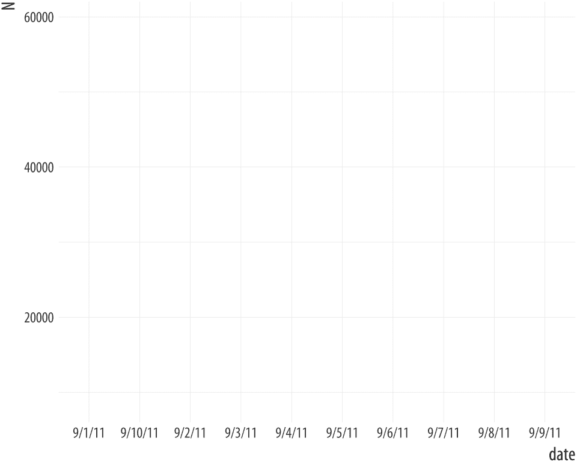
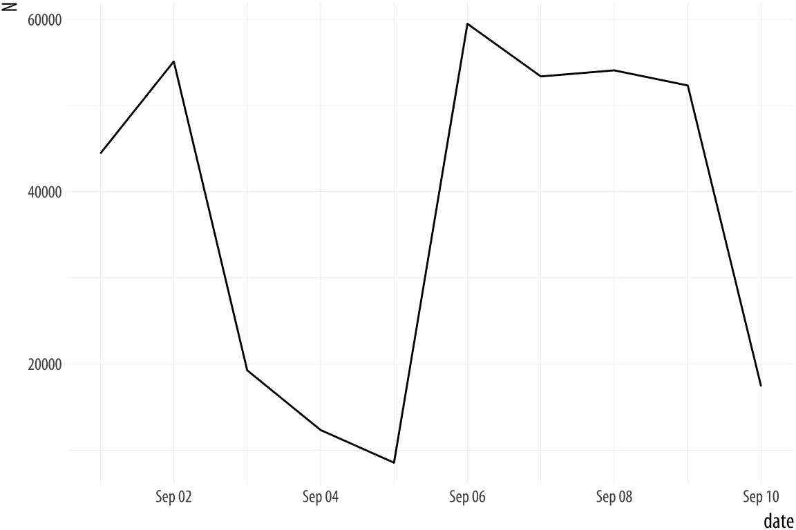

# A 附录

> 原文：[`socviz.co/appendix.html`](https://socviz.co/appendix.html)

本附录包含有关 R 和 ggplot 的各种补充信息，您在使用过程中可能会遇到。您正处于一个发现实际问题的过程中，这些问题是使用软件的必然部分。这通常很令人沮丧。但感到困惑是每个编写代码的人的标准体验。每次您找到解决问题的方法，您就会获得更多关于如何以及为什么事情出错的知识，以及更多关于如何应对下一个故障的信心。

## A.1 关于 R 的更多内容

### A.1.1 如何阅读 R 帮助页面

R 中的函数、数据集和其他内置对象在它的帮助系统中进行了文档说明。您可以通过 RStudio 右下角的“帮助”标签搜索或浏览这些文档。R 的帮助页面质量参差不齐。它们往往比较简略。然而，它们都具有基本相同的结构，了解如何阅读它们是有用的。图 A.1 提供了要查找内容的概述。记住，函数接受输入，执行操作，并返回输出。有东西进去，被处理，然后有东西出来。这意味着您想知道函数*需要什么*，*做什么*，以及*返回什么*。它需要的内容在帮助页面的“用法”和“参数”部分中显示。所有必需和可选参数的名称按函数期望的顺序给出。一些参数有默认值。对于 `mean()` 函数，参数 `na.rm` 默认设置为 `FALSE`。这些将在“用法”部分中显示。如果命名参数没有默认值，您必须为其提供值。根据参数的类型，这可能是一个逻辑值、一个数字、一个数据集或任何其他对象。


图 A.1：R 帮助页面的结构。

另一个需要仔细查看的部分是 *值* 部分，它告诉您函数完成计算后返回的内容。同样，根据函数的类型，这可能只是一个单一的数字或其他简短的输出。但它也可能是像 ggplot 图表或由多个单独部分组成的列表模型对象这样复杂的东西。

记载良好的包通常会附有 *Demos* 和 *Vignettes*。这些旨在描述整个包，而不是特定的函数。一个好的包 vignette 通常会包含一个或多个完整工作的示例，以及一个讨论，说明包是如何工作的以及它能做什么。要查看是否有包 vignette，点击函数帮助页面底部的链接，即可转到包索引。任何可用的演示、vignette 或其他一般帮助都将列在顶部。

### A.1.2 访问和选择事物的基本原理

一般而言，tidyverse 优先的数据子集、过滤、切片和选择方法将使您远离选择和提取向量、矩阵或数据表元素的基本机制。通过像 `select()`、`filter()`、`subset()` 和 `merge()` 这样的函数执行这些操作通常比直接访问元素更安全、更可靠。然而，了解这些操作的基本原理是值得的。有时直接访问元素是最方便的做法。更重要的是，我们可能经常以小的方式在我们的代码中使用这些技术。在这里，我们简要介绍一些 R 的向量、数组和表选择运算符。

再次考虑 `my_numbers` 和 `your_numbers` 向量。

```r
my_numbers <-  c(1, 2, 3, 1, 3, 5, 25)
your_numbers <-  c(5, 31, 71, 1, 3, 21, 6)
```

要访问 `my_numbers` 中的任何特定元素，我们使用方括号。方括号不像函数后面的括号。它们用于选择由其位置索引的元素：

```r
my_numbers[4]
```

```r
## [1] 1
```

```r
my_numbers[7]
```

```r
## [1] 25
```

将数字 *n* 放入括号内将给我们（或“返回”）向量中的第 *n* 个元素，假设有一个。要访问向量中元素的一个 *序列*，我们可以这样做：

```r
my_numbers[2:4]
```

```r
## [1] 2 3 1
```

这种简写表示法告诉 R 从第 2 个元素开始计数到第 4 个元素，包括在内。我们也不受限于选择连续的元素。我们还可以再次使用我们的 `c()` 函数：

```r
my_numbers[c(2, 4)]
```

```r
## [1] 2 1
```

R 首先评估表达式 `c(2,4)`，然后只从 `my_numbers` 中提取第二个和第四个元素，忽略其他元素。您可能会想知道为什么我们直接写 `my_numbers[2,3]`。答案是，这种表示法用于二维排列的对象（即具有行和列的对象），如矩阵、数据框或 tibbles。我们可以通过使用 `c()` 函数创建两个不同的向量，并使用 `tibble()` 函数将它们收集在一起来创建一个二维对象：

```r
my_tb <-  tibble(
 mine = c(1,4,5, 8:11),
 yours = c(3,20,16, 34:31))

class(my_tb)
```

```r
## [1] "tbl_df"     "tbl"        "data.frame"
```

```r
my_tb
```

```r
## # A tibble: 7 x 2
##    mine yours
##   <dbl> <dbl>
## 1  1.00  3.00
## 2  4.00 20.0 
## 3  5.00 16.0 
## 4  8.00 34.0 
## 5  9.00 33.0 
## 6 10.0  32.0 
## 7 11.0  31.0
```

在这些代码块中，您将看到一些由井号符号 `#` 分隔的解释性文本。在 R 的语法中，井号符号用于指定注释。在任何代码行的 `#` 符号之后的文本将被 R 的解释器忽略。它不会被评估，也不会触发语法错误。我们首先按行索引数据框、tibbles 和其他数组，然后按列索引。数组也可能有超过两个维度。

```r
my_tb[3,1] # Row 3 Col 1
```

```r
## # A tibble: 1 x 1
##    mine
##   <dbl>
## 1  5.00
```

```r
my_tb[1,2] # Row 1, Col 2 
```

```r
## # A tibble: 1 x 1
##   yours
##   <dbl>
## 1  3.00
```

我们 tibble 的列有名称。我们也可以使用它们来选择元素。我们这样做是通过在之前放置列索引号的位置放置列的名称：

```r
my_tb[3,"mine"] # Row 3 Col 1
```

```r
## # A tibble: 1 x 1
##    mine
##   <dbl>
## 1  5.00
```

```r
my_tb[1,"yours"] # Row 1, Col 2 
```

```r
## # A tibble: 1 x 1
##   yours
##   <dbl>
## 1  3.00
```

```r
my_tb[3,"mine"] # Row 3 Col 1
```

```r
## # A tibble: 1 x 1
##    mine
##   <dbl>
## 1  5.00
```

```r
my_tb[1,"yours"] # Row 1, Col 2 
```

```r
## # A tibble: 1 x 1
##   yours
##   <dbl>
## 1  3.00
```

如果我们想获取特定列的所有元素，我们可以省略行索引。这意味着将包括我们选择的任何列的所有行。

```r
my_tb[,"mine"] # All rows, Col 1
```

```r
## # A tibble: 7 x 1
##    mine
##   <dbl>
## 1  1.00
## 2  4.00
## 3  5.00
## 4  8.00
## 5  9.00
## 6 10.0 
## 7 11.0
```

我们也可以反过来操作，选择特定行并显示所有列：

```r
my_tb[4,] # Row 4, all cols
```

```r
## # A tibble: 1 x 2
##    mine yours
##   <dbl> <dbl>
## 1  8.00  34.0
```

访问数据框中的特定列的更好方法是使用 `$` 操作符，它可以用来提取各种类型对象的组件。这样，我们将我们想要列的名称附加到它所属的对象的名称上：

```r
my_tb$mine
```

```r
## [1]  1  4  5  8  9 10 11
```

许多其他对象的元素也可以用这种方式提取，包括嵌套对象。

```r
out <-  lm(mine ~  yours, data = my_tb)

out$coefficients
```

```r
## (Intercept)       yours 
##  -0.0801192   0.2873422
```

```r
out$call
```

```r
## lm(formula = mine ~ yours, data = my_tb)
```

```r
out$qr$rank # nested 
```

```r
## [1] 2
```

最后，在数据框的情况下，`$` 操作符还允许我们向对象添加新列。例如，我们可以将前两列逐行相加。以这种方式创建列时，我们在赋值左侧放置 `$` 和新列的名称。

```r
my_tb$ours <-  my_tb$mine +  my_tb$yours
my_tb
```

```r
## # A tibble: 7 x 3
##    mine yours  ours
##   <dbl> <dbl> <dbl>
## 1  1.00  3.00  4.00
## 2  4.00 20.0  24.0 
## 3  5.00 16.0  21.0 
## 4  8.00 34.0  42.0 
## 5  9.00 33.0  42.0 
## 6 10.0  32.0  42.0 
## 7 11.0  31.0  42.0
```

在这本书中，我们通常不通过 `` 或 `$` 访问数据。仅通过索引号访问元素，而不是使用名称，这是一种特别不好的做法。在两种情况下，尤其是后者，很容易出错并选择错误的列或行。此外，如果我们的表格以后改变了形状（例如，由于添加了新的原始数据），那么任何对列位置的绝对引用（而不是对名称的引用）很可能都会出错。尽管如此，我们确实经常使用 `c()` 函数来完成一些小任务，因此了解如何使用它从向量中挑选元素是值得的。

### A.1.3 整洁数据

如果您使用的数据形状正确，使用 R 和 ggplot 将更容易。ggplot 希望您的数据是*整洁的*。关于整洁数据概念的更详细介绍，请参阅 Wickham & Grolemund（2016）的第五章和第十二章。为了了解 R 中整洁数据集的样子，我们将遵循 Wickham（2014）中的讨论。在一个整洁数据集中，

1.  *每个变量都是一个列。*

1.  *每个观测都是一个行。*

1.  *每种观测单位类型都构成一个表格。*

对于你的大部分数据分析，前两点是最重要的。第三点可能有点不熟悉。这是数据库世界中“标准化”数据的一个特性，其目标是使用一系列相关表以最小重复来表示数据（Codd，1990）。数据分析通常使用单个大型数据表，通常在行中有相当多的某些变量的重复。

在总结表中呈现的数据通常不符合这里定义的“整洁”。在构建我们的数据时，我们需要清楚我们的数据是如何排列的。如果你的数据没有整洁地排列，那么你可能会遇到更多困难，也许会有很多困难，才能让 ggplot 绘制出你想要的图形。

表 A.1：一些不整洁的数据。

| 名称 | 处理 a | 处理 b |
| :-- | --: | --: |
| 约翰·史密斯 | NA | 18 |
| 简妮·多伊 | 4 | 1 |
| 玛丽·约翰逊 | 6 | 7 |

表 A.2：相同的数据，仍然不整洁，但以不同的方式。

| 处理 | 约翰·史密斯 | 简妮·多伊 | 玛丽·约翰逊 |
| :-- | --: | --: | --: |
| a | NA | 4 | 6 |
| b | 18 | 1 | 7 |

例如，考虑 Wickham 的讨论中的表 [A.1 和表 A.2。它们以不同的方式呈现相同的数据，但如果我们尝试在 ggplot 中使用它们来制作图表，每个都会带来麻烦。表 A.3 再次展示了相同的数据，这次是以整洁的形式。

Hadley Wickham 指出，数据表通常不整洁的五个主要原因：

1.  *列标题是值，而不是变量名*。

1.  *多个变量存储在一列中*。

1.  *变量存储在行和列中*。

1.  *同一表中存储了多种类型的观测单位*。

1.  *单个观测单位存储在多个表中*。

表 A.3：整洁数据。每个变量为一列，每个观测为一行。

| 名称 | 处理 | n |
| :-- | :-- | --: |
| 简·多伊 | a | 4 |
| 简·多伊 | b | 1 |
| 约翰·史密斯 | a | NA |
| 约翰·史密斯 | b | 18 |
| 玛丽·约翰逊 | a | 6 |
| 玛丽·约翰逊 | b | 7 |

数据总是以杂乱无章的形式出现，这通常是因为以这种方式呈现可以占用更少的空间，或者标签和行元素的重复更少。图 A.2 展示了美国人口普查局关于美国教育成就的表格的前几行。起初，它被组织成一系列沿工作表下方的子表，按年龄和性别划分。其次，感兴趣的底层变量“完成学年的年数”存储在几个列中，同时还包括一个额外的变量（教育水平），也跨越了这些列。通过消除空白行并明确命名子表行，可以不太困难地将表格转换成稍微更规范的格式。可以手动完成这项工作，并将其作为 Excel 或 CSV 文件读取。这不是理想的做法，因为手动清理数据与尽可能编程化处理的承诺相矛盾。`readxl.tidyverse.org` 我们可以某种程度上自动化这个过程。tidyverse 随带一个 `readxl` 包，试图稍微减轻一些痛苦。

图 A.2：来自人口普查的杂乱数据。


```r
## # A tibble: 366 x 11
##    age   sex    year total elem4 elem8   hs3   hs4 coll3 coll4 median
##    <chr> <chr> <int> <int> <int> <int> <dbl> <dbl> <dbl> <dbl>  <dbl>
##  1 25-34 Male   2016 21845   116   468  1427  6386  6015  7432     NA
##  2 25-34 Male   2015 21427   166   488  1584  6198  5920  7071     NA
##  3 25-34 Male   2014 21217   151   512  1611  6323  5910  6710     NA
##  4 25-34 Male   2013 20816   161   582  1747  6058  5749  6519     NA
##  5 25-34 Male   2012 20464   161   579  1707  6127  5619  6270     NA
##  6 25-34 Male   2011 20985   190   657  1791  6444  5750  6151     NA
##  7 25-34 Male   2010 20689   186   641  1866  6458  5587  5951     NA
##  8 25-34 Male   2009 20440   184   695  1806  6495  5508  5752     NA
##  9 25-34 Male   2008 20210   172   714  1874  6356  5277  5816     NA
## 10 25-34 Male   2007 20024   246   757  1930  6361  5137  5593     NA
## # ... with 356 more rows
```

tidyverse 提供了几个工具来帮助您将数据从杂乱无章的状态转换为整洁状态。这些工具大多可以在 `tidyr` 和 `dplyr` 库中找到。前者提供了将宽格式数据转换为长格式数据等功能，同时协助处理那些存储不整洁的变量拆分和合并的业务。后者提供了一些工具，允许在 ggplot 中对整洁表格进行进一步的筛选、切片和分析，正如我们在本书中看到的。

使用我们的`edu`对象，我们可以使用`gather()`函数将教育变量转换为*键值*排列。键是基础变量，值是它对该观察值的取值。我们以这种方式创建了一个新的对象，`edu_t`。

```r
edu_t <-  gather(data = edu,
 key = school,
 value = freq,
 elem4:coll4)

head(edu_t) 
```

```r
## # A tibble: 6 x 7
##   age   sex    year total median school  freq
##   <chr> <chr> <int> <int>  <dbl> <chr>  <dbl>
## 1 25-34 Male   2016 21845     NA elem4    116
## 2 25-34 Male   2015 21427     NA elem4    166
## 3 25-34 Male   2014 21217     NA elem4    151
## 4 25-34 Male   2013 20816     NA elem4    161
## 5 25-34 Male   2012 20464     NA elem4    161
## 6 25-34 Male   2011 20985     NA elem4    190
```

```r
tail(edu_t) 
```

```r
## # A tibble: 6 x 7
##   age   sex     year total median school  freq
##   <chr> <chr>  <int> <int>  <dbl> <chr>  <dbl>
## 1 55>   Female  1959 16263   8.30 coll4    688
## 2 55>   Female  1957 15581   8.20 coll4    630
## 3 55>   Female  1952 13662   7.90 coll4    628
## 4 55>   Female  1950 13150   8.40 coll4    436
## 5 55>   Female  1947 11810   7.60 coll4    343
## 6 55>   Female  1940  9777   8.30 coll4    219
```

之前分散在列中的教育类别已被收集到两个新的列中。`school`变量是*键*列。它包含之前在列标题中给出的所有教育类别，从 0-4 年的小学到四年或更长时间的大学。它们现在堆叠在行上。`freq`变量是*值*列，包含该变量每个级别的唯一`schooling`值。一旦我们的数据以这种长格式排列，就可以轻松地与 ggplot 和相关 tidyverse 工具一起使用。

## A.2 读取数据时常见的问题

### 日期格式

日期格式可能会很烦人。首先，时间和日期必须与普通数字区分对待。其次，有许多不同的日期格式，它们在存储的精度以及它们遵循的关于如何显示年份、月份、日期等约定方面都存在差异。考虑以下数据：

```r
head(bad_date)
```

```r
## # A tibble: 6 x 2
##   date       N
##   <chr>  <int>
## 1 9/1/11 44426
## 2 9/2/11 55112
## 3 9/3/11 19263
## 4 9/4/11 12330
## 5 9/5/11  8534
## 6 9/6/11 59490
```

`date`列中的数据已被读入为字符字符串，但我们希望 R 将其视为日期。如果不能将其视为日期，我们将得到错误的结果。

 图 A.3：一个错误的日期。

```r
p <-  ggplot(data = bad_date, aes(x = date, y = N))
p +  geom_line()
```

```r
## geom_path: Each group consists of only one observation.
## Do you need to adjust the group aesthetic?
```

发生了什么？问题是 ggplot 不知道`date`由日期组成。因此，当我们要求将其绘制在 x 轴上时，它试图将`date`的唯一元素视为分类变量（即因子）。但由于每个日期都是唯一的，它默认的数据分组努力导致每个组中只有一个观察值（即那一行）。ggplot 函数知道这一点，并试图让你知道。它想知道我们是否在映射中未能设置`group = <something>`。

为了看看当不良日期值**不**唯一时会发生什么，让我们看看会发生什么。我们将通过将两个数据副本堆叠在一起来创建一个新的数据框。`rbind()`函数为我们完成这项工作。我们最终得到每个观察值的两个副本。

 图 A.4：仍然错误。

```r
bad_date2 <-  rbind(bad_date, bad_date)

p <-  ggplot(data = bad_date2, aes(x = date, y = N))
p +  geom_line()
```

现在，ggplot 根本不会抱怨，因为每个（推断的）组中都有多个观察值。但图表仍然错误！

我们将使用`lubridate`库来解决这个问题。它提供了一系列方便的函数，用于将各种格式的日期字符串以及各种分隔符（如`/`或`-`等）转换为 R 所认识的`Date`类对象。在这里，我们的坏日期是月/日/年的格式，因此我们使用`mdy()`。查阅`lubridate`库的文档，了解更多关于转换字符字符串中日期组件顺序不同的类似方便函数的信息。

```r
# install.packages("lubridate")
library(lubridate)

bad_date$date <-  mdy(bad_date$date)
head(bad_date)
```

```r
## # A tibble: 6 x 2
##   date           N
##   <date>     <int>
## 1 2011-09-01 44426
## 2 2011-09-02 55112
## 3 2011-09-03 19263
## 4 2011-09-04 12330
## 5 2011-09-05  8534
## 6 2011-09-06 59490
```

现在`filldate_new`具有`Date`类。让我们再次尝试绘图。

 图 A.5：好多了。

```r
p <-  ggplot(data = bad_date, aes(x = date, y = N))
p +  geom_line()
```

### 仅显示年份的日期

许多变量按年份测量，并以四位数字的形式提供数据，而不是日期。这有时在我们想在 x 轴上绘制年份时会引起头痛。这种情况通常发生在时间序列相对较短时。考虑以下数据：

```r
url <- "https://cdn.rawgit.com/kjhealy/viz-organdata/master/organdonation.csv"

bad_year <-  read_csv(url)
bad_year %>%  select(1:3) %>%  sample_n(10)
```

```r
## # A tibble: 10 x 3
##    country        year donors
##    <chr>         <int>  <dbl>
##  1 United States  1994  19.4 
##  2 Australia      1999   8.67
##  3 Canada         2001  13.5 
##  4 Australia      1994  10.2 
##  5 Sweden         1993  15.2 
##  6 Ireland        1992  19.5 
##  7 Switzerland    1997  14.3 
##  8 Ireland        2000  17.6 
##  9 Switzerland    1998  15.4 
## 10 Norway           NA  NA
```

这是一个`organdata`的版本，但格式不太整洁。`year`变量是一个整数（其类是`<int>`），而不是日期。假设我们想绘制捐赠率与年份的关系图。

 图 A.6：以小数点显示的整数年份。

```r
p <-  ggplot(data = bad_year, aes(x = year, y = donors))
p +  geom_point()
```

x 轴标签上的小数点是不需要的。我们可以通过给`scale_x_continuous()`一组`breaks`和`labels`来代表年份作为字符来解决这个问题，这些`breaks`和`labels`表示年份。或者，我们可以改变`year`变量的类。为了方便，我们将告诉 R，`year`变量应该被视为日期度量，而不是整数。我们将使用一个自制的函数`int_to_year()`，它接受整数并将它们转换为日期。

```r
bad_year$year <-  int_to_year(bad_year$year)
bad_year %>%  select(1:3)
```

```r
## # A tibble: 238 x 3
##    country   year       donors
##    <chr>     <date>      <dbl>
##  1 Australia NA          NA   
##  2 Australia 1991-01-01  12.1 
##  3 Australia 1992-01-01  12.4 
##  4 Australia 1993-01-01  12.5 
##  5 Australia 1994-01-01  10.2 
##  6 Australia 1995-01-01  10.2 
##  7 Australia 1996-01-01  10.6 
##  8 Australia 1997-01-01  10.3 
##  9 Australia 1998-01-01  10.5 
## 10 Australia 1999-01-01   8.67
## # ... with 228 more rows
```

在此过程中，今天的日期和月份被引入到年份数据中，但在这个情况下，由于我们的数据最初只在年度窗口中观察到，所以这是无关紧要的。然而，如果你希望为所有观测指定一个通用的日期和月份，该函数允许你这样做。

### A.2.1 为重复性任务编写函数

如果你正在处理一个数据集，你将从中制作很多类似的图表，或者需要定期以重复的方式查看，但不能一次性完成，那么你可能会开始积累你反复使用的代码序列。当这种情况发生时，你可能会开始从一次分析复制粘贴这些序列到下一次分析。我们可以在本书的代码示例中看到这种趋势的一部分。为了使说明更清晰，我们定期重复了代码块，这些代码块只在绘制的因变量或自变量上有所不同。

你应该尽量避免以这种方式重复复制粘贴代码。相反，这是一个编写函数来帮助你一点的机会。在 R 中，几乎一切都可以通过函数完成，编写自己的函数并不太难。这尤其在你开始时将函数视为自动化某些局部或较小任务的方式，而不是完成某些非常复杂任务的手段时更为如此。R 有资源帮助你构建复杂的函数和函数库，就像 ggplot 本身一样。但我们可以从非常小的函数开始，这些函数可以帮助我们管理特定的数据集或数据分析。

记住，函数接受**输入**，执行**操作**，并返回**输出**。例如，想象一个将两个数字`x`和`y`相加的函数。在使用时，它可能看起来像这样：

```r
add_xy(x = 1, y = 7)
```

```r
## [1] 8
```

我们如何**创建**这个函数？记住，一切都是一个对象，所以函数只是特殊类型的对象。在 R 中，所有事情都是通过函数完成的。因此，如果我们想要创建一个新的函数，我们将使用现有的函数来完成它。在 R 中，函数是通过`function()`创建的：

```r
add_xy <-  function(x, y) {
 x +  y
}
```

你可以看到`function()`在两个方面与普通函数略有不同。首先，我们给它提供的参数（这里，`x`和`y`）是为我们正在**创建**的`add_xy`函数。其次，在`function(x, y)`语句之后立即有一个开括号`{`，后面是一段 R 代码，它将 x 和 y 相加，然后是闭括号`}`。这就是函数的内容。我们将此代码分配给`add_xy`对象，现在我们有一个将两个数字相加并返回结果的函数。括号内的`x + y`行被评估为如果它在控制台输入，假设你已经告诉了它`x`和`y`是什么。

```r
add_xy(x = 5, y = 2)
```

```r
## [1] 7
```

函数可以接受许多种类的参数，我们也可以通过在`function(...)`部分指定来告诉它们每个参数的默认值。函数是拥有 R 所有功能的小程序，包括标准事物，如通过`if ... else`语句进行流程控制等。例如，这里有一个函数，可以为 ASA 数据中的任何部分创建散点图，或者可选地对数据进行平滑处理并绘制该结果。定义一个函数看起来有点像调用一个函数，除了我们要详细说明步骤。我们还会指定默认参数。

```r
plot_section <-  function(section="Culture", x = "Year",
 y = "Members", data = asasec,
 smooth=FALSE){
 require(ggplot2)
 require(splines)
 # Note use of aes_string() rather than aes() 
 p <-  ggplot(subset(data, Sname==section),
 mapping = aes_string(x=x, y=y))

 if(smooth ==  TRUE) {
 p0 <-  p +  geom_smooth(color = "#999999",
 size = 1.2, method = "lm",
 formula = y ~  ns(x, 3)) +
 scale_x_continuous(breaks = c(seq(2005, 2015, 4))) +
 labs(title = section)
 } else {
 p0 <-  p +  geom_line(color= "#E69F00", size=1.2) +
 scale_x_continuous(breaks = c(seq(2005, 2015, 4))) +
 labs(title = section)
 }

 print(p0)
}
```

这个函数并不非常通用。它也不特别稳健。但对于我们想要使用的用途，它工作得相当不错。

```r
plot_section("Rationality")
plot_section("Sexualities", smooth = TRUE)
```

图 A.7：使用函数来绘制结果。


如果我们要长时间使用这些数据，我们可以使函数逐渐变得更加通用。例如，我们可以添加特殊的`...`参数（这大致意味着“和任何其他命名参数”），这样我们就可以以我们直接使用它时预期的方式将参数传递给`geom_smooth()`函数。有了这个，我们可以选择我们想要的平滑方法。

```r
plot_section <-  function(section="Culture", x = "Year",
 y = "Members", data = asasec,
 smooth=FALSE, ...){
 require(ggplot2)
 require(splines)
 # Note use of aes_string() rather than aes() 
 p <-  ggplot(subset(data, Sname==section),
 mapping = aes_string(x=x, y=y))

 if(smooth ==  TRUE) {
 p0 <-  p +  geom_smooth(color = "#999999",
 size = 1.2, ...) +
 scale_x_continuous(breaks = c(seq(2005, 2015, 4))) +
 labs(title = section)
 } else {
 p0 <-  p +  geom_line(color= "#E69F00", size=1.2) +
 scale_x_continuous(breaks = c(seq(2005, 2015, 4))) +
 labs(title = section)
 }

 print(p0)
}
```

```r
plot_section("Comm/Urban",
 smooth = TRUE,
 method = "loess")
plot_section("Children",
 smooth = TRUE,
 method = "lm",
 formula = y ~  ns(x, 2))
```

图 A.8：我们的自定义函数现在可以将参数传递给适合不同平滑器的章节成员数据。


## A.3 管理项目和文件

### A.3.1 RMarkdown 和 knitr

Markdown`en.wikipedia.org/wiki/Markdown`是一种松散标准化的纯文本编写方式，其中包含有关文档格式的信息。它最初由 John Gruber 开发，Aaron Swartz 提供意见。目标是创建一个简单的格式，可以包含一些关于文档的结构信息（如标题和副标题、*强调*、超链接、列表、脚注等），同时尽量减少纯文本形式的可读性损失。与 Markdown 相比，HTML 这样的纯文本格式更为广泛和定义明确，但 Markdown 旨在简单。多年来，尽管存在各种弱点，它已经成为一种*事实上的*标准。文本编辑器和笔记应用都支持它，并且存在将 Markdown 转换为不仅仅是 HTML（其原始目标输出格式）的许多其他文档类型的工具。其中最强大的是 Pandoc`pandoc.org`，它可以将 Markdown 转换为许多其他格式（以及*反之亦然*）。Pandoc 是 RStudio 能够将您的笔记转换为 HTML、Microsoft Word 和 PDF 文档的功能背后的动力。

本书第一章鼓励您使用 RMarkdown`rmarkdown.rstudio.com`和（幕后）knitr`yihui.name/knitr`来记录笔记和组织分析。这些是 RStudio 使其易于使用的 R 库。RMarkdown 通过允许您在笔记中穿插 R 代码块来扩展 Markdown。代码块可以有标签和一些选项，这些选项决定了它们在文件处理时的行为。在编写完笔记和代码后，您`knit`文档（Xie，2015）。也就是说，您将`.Rmd`文件输入到 R 中，R 处理代码块，并生成一个新的`.md`文件，其中代码块已被它们的输出所替换。然后您可以将该 Markdown 文件转换为更易读的 PDF 或 HTML 文档，或者期刊要求您发送的 Word 文档。

在 RStudio 的背后，所有这些操作都是通过`knitr`和`rmarkdown`库来完成的。后者提供了一个`render()`函数，它可以将`.Rmd`文件一步转换成 HTML 或 PDF。相反，如果你只想从周围文本中提取你编写的代码，那么你可以“编织”文件，这将生成一个`.R`文件。这种方法的优点是它使得正确地记录你的工作变得容易得多。对于数据分析和撰写报告，只需要一个文件。分析的结果会即时创建，执行它的代码被嵌入到论文中。如果你需要对不同的数据块进行多个但相同（或非常相似）的分析，RMarkdown 和`knitr`可以使生成一致且可靠的报告变得容易得多。

Pandoc 的 Markdown 版本是 knitr 和 RStudio 中使用的版本。它支持广泛的标记格式，并能处理学术写作中的许多基本元素，例如复杂表格、引用、书目、参考文献和数学公式。除了能够生成各种*文件格式*的文档外，它还能生成许多不同类型的文档，从文章和讲义到网站和幻灯片。RStudio 的 RMarkdown 网站提供了关于 RMarkdown 功能详尽的文档和示例，包括如果你希望对其进行自定义的信息。

以这种纯文本格式（如）编写你的笔记和论文有许多优点。它使你的写作、你的代码和你的结果更接近，并允许你使用强大的版本控制方法来跟踪你的工作和结果。数据分析中的错误通常会在产生论文中图表或表格的流程和随后对该输出的使用之间存在的典型差距中涌现出来。在常规的操作方式中，你的数据分析代码在一个文件中，它产生的输出在另一个文件中，你的论文文本在第三个文件中。你进行数据分析，收集输出并将相关的结果复制到你的论文中，通常在途中手动重新格式化它们。这些过渡中的每一个都引入了出错的机会。特别是，结果表很容易与产生它的步骤序列分离。几乎每个写过定量论文的人都会遇到阅读旧草稿的问题，其中包含需要重新审视或再现的结果或图表（例如，由于同行评审），但缺乏关于它们创建情况的信息。即使你一直在努力工作，学术论文也要经过写作、评审、修订和发表的周期，这需要很长时间。不得不返回两年前做的事情以回答评审员的一些问题并不罕见。你不想从头开始做所有的事情才能得到正确的答案。我说作者在相对较短的时间内发现自己难以复制自己的*自己的*工作，这并不是夸张。在计算机科学中，“位腐”这个术语是指一个项目似乎不可避免地经历的过程，仅仅是因为你把它留在电脑上六个月或更长时间。

对于小型和中型项目，依赖于 RMarkdown 文档和这里描述的工具的纯文本方法效果良好。随着项目的扩大，事情会变得稍微复杂一些。（顺便说一句，这并不是纯文本方法的固有缺陷。无论你如何选择组织你的项目，这都是事实。）一般来说，尝试保持你的笔记和分析以标准化和简单的格式存在是值得的。项目最终输出（如期刊文章或书籍）在接近完成时，往往会陷入一系列具体的修复和调整的匆忙中，所有这些都与完全可移植、可重复分析的理想背道而驰。尝试最小化不可避免的最终混乱的范围是值得的。

### A.3.2 项目组织

管理项目是一个很大的主题，而且人们对此有很强的意见。你的目标应该是使你的代码和数据可移植、可重复和自包含。在实践中，这意味着在 R Studio 中使用基于项目的方法。当你用一些新的数据开始分析时，创建一个包含数据和你要工作的 R 或 RMarkdown 代码的新项目。在理想情况下，然后应该可以将该文件夹移动到另一台也安装了 R、RStudio 和任何所需库的计算机上，并成功重新运行项目的内容。

在实践中，这意味着两件事。首先，尽管 R 是一种面向对象的语言，但你的项目中唯一“真实”的、持久的东西应该是你开始时的原始数据文件，以及操作它们的代码。代码才是真实的。你的代码操纵数据并创建你需要的所有对象和输出。在 R 中保存对象是可能的，但通常你不需要为日常分析做这件事。

其次，你的代码不应引用项目文件夹之外任何文件位置。项目文件夹应该是其中文件的“根”或底层。这意味着你不应该使用*绝对*文件路径来保存或引用数据或图表。相反，只使用*相对*路径。相对路径将从项目的根开始。例如，你不应该用这样的命令加载数据：

```r
## An absolute file path.
## Notice the leading "/" that starts at the very top
## of the computer's file hierarchy.
my_data <-  read_csv("/Users/kjhealy/projects/gss/data/gss.csv")
```

相反，因为你已经在`gss`文件夹中启动了一个 R 项目文件，你可以使用`here()`库来指定相对路径，如下所示：

```r
my_data <-  read_csv(here("data", "gss.csv"))
```

虽然你可以自己输入相对路径，但使用`here()`的优势在于，例如，如果你使用 Mac OS 并将你的项目发送给使用 Windows 的人，它仍然会工作。同样的规则也适用于保存你的工作，正如我们在第 @(sec:makeplot) 章节末尾所看到的，当你将单个图表保存为 PDF 或 PNG 文件时。

 图 A.9：简单项目的文件夹组织。

在你的项目文件夹内，一点组织就能走得很远。你应该养成习惯，将项目的不同部分保存在工作目录的不同子文件夹中。更复杂的项目可能有一个更复杂的结构，但一些简单的组织就能走得很远。RMarkdown 文件可以放在工作目录的顶层，有单独的子文件夹叫做`data/`（用于你的 CSV 文件），一个用于`figures/`（你可能保存的），也许还有一个叫做`docs/`的用于你的项目或数据文件信息的文件夹。RStudio 也可以通过其项目管理功能帮助你进行组织。

只需稍微组织一下你的项目，就可以防止你最终在工作的目录顶部拥有大量不同类型的文件。

## A.4 本书的一些特性

### A.4.1 准备县级地图

`socviz`库中的美国县级地图是使用美国人口普查局的 shapefiles 准备的，这些 shapefiles 由 Eric Celeste 转换为 GeoJSON 格式。准备导入的 shapefile 的代码是由 Bob Rudis 编写的，并利用`rgdal`库进行导入 shapefile 和转换投影的重型工作。Bob 的代码从导入的空间数据框中提取（县标识）行名，然后将阿拉斯加和夏威夷移动到地图区域的左下角，这样我们就可以绘制所有五十个州，而不仅仅是下四十八个州。

首先，我们读取地图文件，设置投影，并设置一个标识变量，我们可以在以后合并数据时使用。对`CRS()`的调用是一行长文本，符合技术 GIS 规范，定义了地图编码的投影和其他细节。当我们需要在页面上人工断行时，通常使用反斜杠字符“`\`”来表示长代码行。如果你自己编写这段代码，请不要输入反斜杠。我们假设地图文件名为`gz_2010_us_050_00_5m.json`，位于项目目录的`data/geojson`子文件夹中。

```r
# You will need to use install.packages() to install
# these map and GIS libraries if you do not already
# have them.

library(maptools)
library(mapproj)
library(rgeos)
library(rgdal)

us_counties <-  readOGR(dsn="data/geojson/gz_2010_us_050_00_5m.json",
 layer="OGRGeoJSON")

us_counties_aea <-  spTransform(us_counties,
 CRS("+proj=laea +lat_0=45 +lon_0=-100 \
 +x_0=0 +y_0=0 +a=6370997 +b=6370997 \
 +units=m +no_defs"))

us_counties_aea@data$id <-  rownames(us_counties_aea@data)
```

文件导入后，我们接着提取、旋转、缩小并移动阿拉斯加，在这个过程中重置投影。我们也移动夏威夷。这些区域通过它们的州 FIPS 代码来识别。我们移除旧州，将新州放回原位，并移除波多黎各，因为我们的示例缺乏该地区的数据。如果你有该地区的数据，你可以将它移动到德克萨斯州和佛罗里达州之间。

```r
alaska <-  us_counties_aea[us_counties_aea$STATE == "02",]
alaska <-  elide(alaska, rotate=-50)
alaska <-  elide(alaska, scale=max(apply(bbox(alaska), 1, diff)) /  2.3)
alaska <-  elide(alaska, shift=c(-2100000, -2500000))
proj4string(alaska) <-  proj4string(us_counties_aea)

hawaii <-  us_counties_aea[us_counties_aea$STATE=="15",]
hawaii <-  elide(hawaii, rotate=-35)
hawaii <-  elide(hawaii, shift=c(5400000, -1400000))
proj4string(hawaii) <-  proj4string(us_counties_aea)

us_counties_aea <-  us_counties_aea[!us_counties_aea$STATE %in%  c("02", "15", "72"),]
us_counties_aea <-  rbind(us_counties_aea, alaska, hawaii)
```

最后，我们将空间对象整理成 ggplot 可以使用的数据框，并通过从字符串中删除前缀来清理`id`标签。

```r
county_map <-  tidy(us_counties_aea, region = "GEO_ID")
county_map$id <-  stringr::str_replace(county_map$id,
 pattern = "0500000US", replacement = "")
```

在此点，`county_map`对象已准备好与 FIPS 编码的美国县级数据表合并，可以使用`merge()`或`left_join()`。

### A.4.2 本书的绘图主题及其地图主题

本书使用的 ggplot 主题主要来源于 Bob Rudis 的工作（再次）。他的`hrbrthemes`包提供了`theme_ipsum()`，这是一个紧凑的主题，可以与 Arial 字体一起使用，或者在一个变体中，可以免费使用的 Roboto Condensed 字体。这里使用的`theme_book()`与 Rudis 的`theme_ipsum()`之间的主要区别是字体的选择。`hrbrthemes`包可以通过 GitHub 以常规方式安装：

```r
devtools::install_github("hrbrmstr/hrbrthemes")
```

`github.com/kjhealy/myriad`的书籍主题也可在 GitHub 上找到。这个包不包括字体文件本身。这些文件可以从 Adobe 获得，他们制作了这种字体。

当绘制地图时，我们也使用了`theme_map()`函数。这个主题从内置的`theme_bw()`开始，关闭了在展示地图时不需要的大部分指南、比例尺和面板内容。它可以通过`socviz`库获得。代码看起来是这样的：

```r
theme_map <-  function(base_size=9, base_family="") {
 require(grid)
 theme_bw(base_size=base_size, base_family=base_family) %+replace%
 theme(axis.line=element_blank(),
 axis.text=element_blank(),
 axis.ticks=element_blank(),
 axis.title=element_blank(),
 panel.background=element_blank(),
 panel.border=element_blank(),
 panel.grid=element_blank(),
 panel.spacing=unit(0, "lines"),
 plot.background=element_blank(),
 legend.justification = c(0,0),
 legend.position = c(0,0)
 )
}
```

主题是函数。创建一个主题意味着编写一个包含一系列关于如何修改主题元素及其方式的指令的函数。我们给它一个默认的 `base_size` 参数和一个空的 `base_family` 参数（用于字体家族）。代码中的 `%+replace%` 运算符对我们来说是新的。这是一个由 ggplot 定义的便利运算符，用于批量更新主题元素。在本书中，我们看到了 `+` 运算符的重复使用，用于递增地添加或调整主题的内容，就像我们做 `+ theme(legend.position = "top")` 一样。使用 `+` 向主题添加了指令，调整了指定的内容，而其他内容保持不变。`%+replace%` 运算符做的是类似的事情，但它有更强的效果。我们从 `theme_bw()` 开始，然后使用 `theme()` 语句添加新内容，就像通常一样。`%+replace%` 运算符替换了指定的整个元素，而不是添加到它。在 `theme()` 语句中没有指定的任何元素都将从新主题中删除。因此，这是一种通过从现有主题开始、指定新元素和删除未明确提及的内容来创建主题的方法。有关 `theme_get()` 的更多详细信息，请参阅文档。在下面的函数中，您可以看到使用 `element_blank()` 函数“关闭”的每个主题元素。

## A.1 关于 R 的更多了解

### A.1.1 如何阅读 R 帮助页面

R 中的函数、数据集和其他内置对象在它的帮助系统中进行了文档说明。您可以通过 RStudio 右下角的“帮助”标签搜索或浏览这些文档。R 的帮助页面质量参差不齐。它们往往比较简略。然而，它们都具有基本相同的结构，了解如何阅读它们是有用的。图 A.1 提供了要查找内容的概述。记住，函数接受输入，执行操作，并返回输出。有东西进去，被处理，然后有东西出来。这意味着您需要知道函数*需要什么*，*做什么*，以及*返回什么*。它需要的内容在帮助页面的“用法”和“参数”部分显示。所有必需和可选参数的名称按函数期望的顺序给出。一些参数有默认值。对于 `mean()` 函数，参数 `na.rm` 默认设置为 `FALSE`。这些将在“用法”部分中显示。如果命名参数没有默认值，您必须为其提供一个值。根据参数的类型，这可能是一个逻辑值、一个数字、一个数据集或任何其他对象。


图 A.1：R 帮助页面的结构。

另一个需要仔细查看的部分是 *Value* 部分，它告诉你在函数完成计算后返回了什么。同样，根据函数的不同，这可能是单个数字或其他简短的输出。但它也可能是像 ggplot 图形或由多个单独部分组成的列表模型对象这样复杂的东西。

详尽说明的软件包通常会附带 *Demos* 和 *Vignettes*。这些内容旨在整体描述软件包，而不是具体的功能。一个好的软件包 Vignette 通常会包含一个或多个完整工作的示例，以及一个讨论，描述软件包的工作原理和功能。要查看是否有软件包 Vignettes，请点击函数帮助页面底部的链接，以跳转到软件包索引。任何可用的演示、Vignettes 或其他一般性帮助信息将列在顶部。

### A.1.2 访问和选择事物的基本原理

一般而言，tidyverse 优先的数据子集、过滤、切片和选择方法将使你远离选择和提取向量、矩阵或数据表元素的基本机制。通过 `select()`、`filter()`、`subset()` 和 `merge()` 等函数执行这些操作通常比直接访问元素更安全、更可靠。然而，了解这些操作的基本原理是值得的。有时直接访问元素可能是最方便的做法。更重要的是，我们可能在代码中以某种规律性地以小规模使用这些技术。在这里，我们简要介绍 R 的向量、数组和表的选择运算符。

再次考虑 `my_numbers` 和 `your_numbers` 向量。

```r
my_numbers <-  c(1, 2, 3, 1, 3, 5, 25)
your_numbers <-  c(5, 31, 71, 1, 3, 21, 6)
```

要访问 `my_numbers` 中的任何特定元素，我们使用方括号。方括号与函数后面的圆括号不同。它们用于选择由其位置索引的元素：

```r
my_numbers[4]
```

```r
## [1] 1
```

```r
my_numbers[7]
```

```r
## [1] 25
```

将数字 *n* 放入方括号内将给我们（或“返回”）向量中的第 *n* 个元素，假设存在的话。要访问向量中元素的一个 *序列*，我们可以这样做：

```r
my_numbers[2:4]
```

```r
## [1] 2 3 1
```

这种简写符号告诉 R 从第 2 个元素开始计数到第 4 个元素（包括）。我们也不受限于选择连续的元素。我们可以再次使用我们的 `c()` 函数：

```r
my_numbers[c(2, 4)]
```

```r
## [1] 2 1
```

R 首先评估表达式 `c(2,4)`，然后只从 `my_numbers` 中提取第二个和第四个元素，忽略其他元素。你可能想知道为什么我们直接写 `my_numbers[2,3]`。答案是，这种表示法用于二维排列的对象（即具有行和列的对象），如矩阵、数据框或 tibbles。我们可以通过使用 `c()` 函数创建两个不同的向量，并使用 `tibble()` 函数将它们收集在一起来创建一个二维对象：

```r
my_tb <-  tibble(
 mine = c(1,4,5, 8:11),
 yours = c(3,20,16, 34:31))

class(my_tb)
```

```r
## [1] "tbl_df"     "tbl"        "data.frame"
```

```r
my_tb
```

```r
## # A tibble: 7 x 2
##    mine yours
##   <dbl> <dbl>
## 1  1.00  3.00
## 2  4.00 20.0 
## 3  5.00 16.0 
## 4  8.00 34.0 
## 5  9.00 33.0 
## 6 10.0  32.0 
## 7 11.0  31.0
```

在这些代码块中，您将看到一些由井号符号`#`分隔的解释性文本。在 R 的语法中，井号符号用于指定注释。在任何代码行中，出现在`#`符号之后的文本将被 R 的解释器忽略。它不会被评估，也不会触发语法错误。我们首先按行然后按列索引数据框、tibble 和其他数组。数组也可能有超过两个维度。

```r
my_tb[3,1] # Row 3 Col 1
```

```r
## # A tibble: 1 x 1
##    mine
##   <dbl>
## 1  5.00
```

```r
my_tb[1,2] # Row 1, Col 2 
```

```r
## # A tibble: 1 x 1
##   yours
##   <dbl>
## 1  3.00
```

我们 tibble 中的列有名称。我们也可以通过它们来选择元素。我们这样做是通过在之前放置列索引号的位置放置列的名称：

```r
my_tb[3,"mine"] # Row 3 Col 1
```

```r
## # A tibble: 1 x 1
##    mine
##   <dbl>
## 1  5.00
```

```r
my_tb[1,"yours"] # Row 1, Col 2 
```

```r
## # A tibble: 1 x 1
##   yours
##   <dbl>
## 1  3.00
```

```r
my_tb[3,"mine"] # Row 3 Col 1
```

```r
## # A tibble: 1 x 1
##    mine
##   <dbl>
## 1  5.00
```

```r
my_tb[1,"yours"] # Row 1, Col 2 
```

```r
## # A tibble: 1 x 1
##   yours
##   <dbl>
## 1  3.00
```

如果我们想要获取特定列的所有元素，我们可以省略行索引。这意味着将包括我们选择的任何列的所有行。

```r
my_tb[,"mine"] # All rows, Col 1
```

```r
## # A tibble: 7 x 1
##    mine
##   <dbl>
## 1  1.00
## 2  4.00
## 3  5.00
## 4  8.00
## 5  9.00
## 6 10.0 
## 7 11.0
```

我们也可以反过来操作，选择特定的行并显示所有列：

```r
my_tb[4,] # Row 4, all cols
```

```r
## # A tibble: 1 x 2
##    mine yours
##   <dbl> <dbl>
## 1  8.00  34.0
```

在数据框中访问特定列的更好方法是使用`$`运算符，它可以用来提取各种类型对象的组件。这样，我们将我们想要选择的列的名称附加到它所属的对象的名称上：

```r
my_tb$mine
```

```r
## [1]  1  4  5  8  9 10 11
```

许多其他对象的元素也可以用这种方式提取，包括嵌套对象。

```r
out <-  lm(mine ~  yours, data = my_tb)

out$coefficients
```

```r
## (Intercept)       yours 
##  -0.0801192   0.2873422
```

```r
out$call
```

```r
## lm(formula = mine ~ yours, data = my_tb)
```

```r
out$qr$rank # nested 
```

```r
## [1] 2
```

最后，在数据框的情况下，`$`运算符还允许我们向对象添加新列。例如，我们可以将前两列逐行相加。要以这种方式创建列，我们在赋值表达式的左侧放置`$`和新的列名。

```r
my_tb$ours <-  my_tb$mine +  my_tb$yours
my_tb
```

```r
## # A tibble: 7 x 3
##    mine yours  ours
##   <dbl> <dbl> <dbl>
## 1  1.00  3.00  4.00
## 2  4.00 20.0  24.0 
## 3  5.00 16.0  21.0 
## 4  8.00 34.0  42.0 
## 5  9.00 33.0  42.0 
## 6 10.0  32.0  42.0 
## 7 11.0  31.0  42.0
```

在这本书中，我们通常不通过``或`$`来访问数据。仅通过索引号访问元素，而不是使用名称，这是一种特别不好的做法。在两种情况下，尤其是后者，很容易出错并选择错误的列或行。此外，如果我们的表格稍后改变了形状（例如，由于添加了新的原始数据），那么任何对列位置的绝对引用（而不是名称）很可能都会失效。尽管如此，我们仍然非常频繁地使用`c()`函数来完成小任务，因此了解它如何用于从向量中挑选元素是值得的。

### A.1.3 整洁数据

如果使用的数据形状正确，使用 R 和 ggplot 会更容易。ggplot 希望你的数据是*整洁的*。要更深入地了解整洁数据的概念，请参阅 Wickham & Grolemund (2016)的第五章和第十二章。为了了解 R 中整洁数据集的样子，我们将遵循 Wickham (2014)中的讨论。在整洁数据集中，

1.  *每个变量都是一个列。*

1.  *每个观测值是一行。*

1.  *每种观测单位类型构成一个表。*

在你的数据分析的大部分时间里，前两点是最重要的。第三点可能有点不熟悉。这是数据库世界中“标准化”数据的一个特征，其目标是使用一系列相关的表来表示数据，以最小化重复（Codd，1990）。数据分析通常使用一个大型数据表，通常在行中有相当多的变量重复。

以总结表形式呈现的数据通常不符合这里定义的“整洁”。在构建我们的数据时，我们需要清楚我们的数据是如何排列的。如果你的数据没有整洁地排列，那么你可能会遇到更多困难，也许会有很多困难，才能让 ggplot 绘制出你想要的图表。

表 A.1：一些杂乱的数据。

| 名称 | 处理 a | 处理 b |
| :-- | --: | --: |
| 约翰·史密斯 | NA | 18 |
| 简·多伊 | 4 | 1 |
| 玛丽·约翰逊 | 6 | 7 |

表 A.2：相同的数据，仍然杂乱，但以不同的方式。

| 处理 | 约翰·史密斯 | 简·多伊 | 玛丽·约翰逊 |
| :-- | --: | --: | --: |
| a | NA | 4 | 6 |
| b | 18 | 1 | 7 |

例如，考虑 Wickham 的讨论中的表[A.1 和表 A.2。它们以不同的方式呈现相同的数据，但如果我们尝试在 ggplot 中使用它来制作图表，每个都会造成麻烦。表 A.3 再次显示了相同的数据，这次以整理过的形式呈现。

Hadley Wickham 指出，数据表通常不整洁的五个主要原因：

1.  *列标题是值，而不是变量名*。

1.  *多个变量存储在同一列中*。

1.  *变量存储在行和列中*。

1.  *同一张表中存储了多种类型的观测单位*。

1.  *单个观测单位存储在多个表中*。

表 A.3：整理后的数据。每个变量对应一列，每个观测值对应一行。

| 名称 | 处理 | 数量 |
| :-- | :-- | --: |
| 简·多伊 | a | 4 |
| 简·多伊 | b | 1 |
| 约翰·史密斯 | a | NA |
| 约翰·史密斯 | b | 18 |
| 玛丽·约翰逊 | a | 6 |
| 玛丽·约翰逊 | b | 7 |

数据总是以杂乱的形式出现，通常是因为以这种方式展示可以节省大量空间，或者减少标签和行元素的重复。图 A.2 展示了美国人口普查局关于美国教育成就数据的表格的前几行。起初，它被组织成一系列沿工作表下方的子表，按年龄和性别划分。其次，感兴趣的底层变量“完成学年的年数”存储在几个列中，同时在列中也包含了一个额外的变量（教育水平）。通过消除空白行并明确命名子表行，可以不太困难地将表格转换成稍微更规范的格式。手动清理数据可以达到将其作为 Excel 或 CSV 文件读取的程度。这不是理想的做法，因为手动清理数据与尽可能编程化处理的承诺相违背。`readxl.tidyverse.org` 我们可以某种程度上自动化这个过程。tidyverse 包含一个 `readxl` 包，试图稍微减轻一些痛苦。

图 A.2：来自人口普查的杂乱数据。


```r
## # A tibble: 366 x 11
##    age   sex    year total elem4 elem8   hs3   hs4 coll3 coll4 median
##    <chr> <chr> <int> <int> <int> <int> <dbl> <dbl> <dbl> <dbl>  <dbl>
##  1 25-34 Male   2016 21845   116   468  1427  6386  6015  7432     NA
##  2 25-34 Male   2015 21427   166   488  1584  6198  5920  7071     NA
##  3 25-34 Male   2014 21217   151   512  1611  6323  5910  6710     NA
##  4 25-34 Male   2013 20816   161   582  1747  6058  5749  6519     NA
##  5 25-34 Male   2012 20464   161   579  1707  6127  5619  6270     NA
##  6 25-34 Male   2011 20985   190   657  1791  6444  5750  6151     NA
##  7 25-34 Male   2010 20689   186   641  1866  6458  5587  5951     NA
##  8 25-34 Male   2009 20440   184   695  1806  6495  5508  5752     NA
##  9 25-34 Male   2008 20210   172   714  1874  6356  5277  5816     NA
## 10 25-34 Male   2007 20024   246   757  1930  6361  5137  5593     NA
## # ... with 356 more rows
```

tidyverse 有几个工具可以帮助您将数据从杂乱状态转换为整洁状态。这些工具大多可以在 `tidyr` 和 `dplyr` 库中找到。前者提供将宽格式数据转换为长格式数据等功能，以及协助处理杂乱存储的变量拆分和合并的业务。后者有工具允许在本书中看到的各个分组级别进一步过滤、切片和分析整洁表。

使用我们的 `edu` 对象，我们可以通过 `gather()` 函数将学校变量转换成 *键值* 排列。键是基础变量，值是它在该观测中的取值。我们以此方式创建了一个新的对象，`edu_t`。

```r
edu_t <-  gather(data = edu,
 key = school,
 value = freq,
 elem4:coll4)

head(edu_t) 
```

```r
## # A tibble: 6 x 7
##   age   sex    year total median school  freq
##   <chr> <chr> <int> <int>  <dbl> <chr>  <dbl>
## 1 25-34 Male   2016 21845     NA elem4    116
## 2 25-34 Male   2015 21427     NA elem4    166
## 3 25-34 Male   2014 21217     NA elem4    151
## 4 25-34 Male   2013 20816     NA elem4    161
## 5 25-34 Male   2012 20464     NA elem4    161
## 6 25-34 Male   2011 20985     NA elem4    190
```

```r
tail(edu_t) 
```

```r
## # A tibble: 6 x 7
##   age   sex     year total median school  freq
##   <chr> <chr>  <int> <int>  <dbl> <chr>  <dbl>
## 1 55>   Female  1959 16263   8.30 coll4    688
## 2 55>   Female  1957 15581   8.20 coll4    630
## 3 55>   Female  1952 13662   7.90 coll4    628
## 4 55>   Female  1950 13150   8.40 coll4    436
## 5 55>   Female  1947 11810   7.60 coll4    343
## 6 55>   Female  1940  9777   8.30 coll4    219
```

之前分散在列中的教育类别已被收集到两个新的列中。`school` 变量是 *键* 列。它包含之前在列标题中给出的所有教育类别，从 0-4 年的小学教育到四年或更长的大学教育。它们现在堆叠在行上。`freq` 变量是 *值* 列，包含该变量每个级别的独特 `schooling` 值。一旦我们的数据以这种长格式形状存在，就可以轻松地使用 ggplot 和相关的 tidyverse 工具。

### A.1.1 如何阅读 R 的帮助页面

R 中的函数、数据集和其他内置对象在其帮助系统中进行了文档记录。您可以通过 RStudio 右下角的“帮助”选项卡搜索或浏览此文档。R 的帮助页面质量略有不同。它们往往比较简短。然而，它们都具有基本相同的结构，了解如何阅读它们是有用的。图 A.1 提供了要查找内容的概述。记住，函数接受输入，执行操作，并返回输出。有东西进去，被处理，然后有东西出来。这意味着你想要知道函数*需要什么*，*做什么*，以及*返回什么*。它需要的内容在帮助页面的*用法*和*参数*部分显示。所有必需和可选参数的名称按函数期望的顺序给出。一些参数有默认值。对于`mean()`函数，参数`na.rm`默认设置为`FALSE`。这些将在*用法*部分显示。如果命名参数没有默认值，你必须提供它的值。根据参数的不同，这可能是逻辑值、数字、数据集或任何其他对象。


图 A.1：R 帮助页面的结构。

另一个需要仔细查看的部分是*值*部分，它告诉你函数完成计算后返回的内容。同样，根据函数的不同，这可能是单个数字或其他简短的输出。但它也可能是像 ggplot 图或由多个单独部分组成的列表模型对象这样复杂的东西。

记录良好的包通常会附有*演示*和*示例*。这些旨在描述整个包，而不是特定的函数。一个好的包示例通常会有一个或多个完整工作的示例，以及一个讨论，描述包的工作方式和它能做什么。要查看是否有包示例，请点击函数帮助页面底部的链接，进入包索引。任何可用的演示、示例或其他一般性帮助都将列在顶部。

### A.1.2 访问和选择事物的基本

通常来说，tidyverse 推荐的用于数据子集、过滤、切片和选择的方法会让你远离选择和提取向量、矩阵或数据表元素的基本机制。通过`select()`、`filter()`、`subset()`和`merge()`等函数执行这些操作通常比直接访问元素更安全、更可靠。然而，了解这些操作的基本知识是值得的。有时直接访问元素是最方便的做法。更重要的是，我们可能经常在我们的代码中以小的方式使用这些技术。在这里，我们简要介绍 R 中用于向量、数组和表的某些选择运算符。

再次考虑`my_numbers`和`your_numbers`向量。

```r
my_numbers <-  c(1, 2, 3, 1, 3, 5, 25)
your_numbers <-  c(5, 31, 71, 1, 3, 21, 6)
```

要访问`my_numbers`中的任何特定元素，我们使用方括号。方括号不像函数后面的括号。它们用于选择由其位置索引的元素：

```r
my_numbers[4]
```

```r
## [1] 1
```

```r
my_numbers[7]
```

```r
## [1] 25
```

在括号内放置数字*n*将给我们（或“返回”）向量中的第*n*个元素，假设有一个的话。要访问向量中元素的一个*序列*，我们可以这样做：

```r
my_numbers[2:4]
```

```r
## [1] 2 3 1
```

这种简写表示法告诉 R 从第 2 个元素开始计数，到第 4 个元素（包括），我们不受选择连续元素的限制。我们还可以再次使用我们的`c()`函数：

```r
my_numbers[c(2, 4)]
```

```r
## [1] 2 1
```

R 首先评估表达式`c(2,4)`，然后只从`my_numbers`中提取第二个和第四个元素，忽略其他元素。你可能想知道为什么我们不直接写`my_numbers[2,3]`。答案是，这种表示法用于二维排列的对象（即有行和列的东西），如矩阵、数据框或 tibble。我们可以通过使用`c()`函数创建两个不同的向量，并使用`tibble()`函数将它们收集在一起来创建一个二维对象：

```r
my_tb <-  tibble(
 mine = c(1,4,5, 8:11),
 yours = c(3,20,16, 34:31))

class(my_tb)
```

```r
## [1] "tbl_df"     "tbl"        "data.frame"
```

```r
my_tb
```

```r
## # A tibble: 7 x 2
##    mine yours
##   <dbl> <dbl>
## 1  1.00  3.00
## 2  4.00 20.0 
## 3  5.00 16.0 
## 4  8.00 34.0 
## 5  9.00 33.0 
## 6 10.0  32.0 
## 7 11.0  31.0
```

在这些代码块中，你会看到一些由井号符号`#`分隔的解释性文本。在 R 的语法中，井号符号用于指定注释。在任何代码行的任何位置，出现在`#`符号后面的文本将被 R 的解释器忽略。它不会被评估，也不会触发语法错误。我们首先按行索引数据框、tibble 和其他数组，然后按列索引。数组也可能有超过两个维度。

```r
my_tb[3,1] # Row 3 Col 1
```

```r
## # A tibble: 1 x 1
##    mine
##   <dbl>
## 1  5.00
```

```r
my_tb[1,2] # Row 1, Col 2 
```

```r
## # A tibble: 1 x 1
##   yours
##   <dbl>
## 1  3.00
```

我们 tibble 中的列有名称。我们也可以使用它们来选择元素。我们这样做是通过在之前放置列索引号的位置放置列的名称：

```r
my_tb[3,"mine"] # Row 3 Col 1
```

```r
## # A tibble: 1 x 1
##    mine
##   <dbl>
## 1  5.00
```

```r
my_tb[1,"yours"] # Row 1, Col 2 
```

```r
## # A tibble: 1 x 1
##   yours
##   <dbl>
## 1  3.00
```

```r
my_tb[3,"mine"] # Row 3 Col 1
```

```r
## # A tibble: 1 x 1
##    mine
##   <dbl>
## 1  5.00
```

```r
my_tb[1,"yours"] # Row 1, Col 2 
```

```r
## # A tibble: 1 x 1
##   yours
##   <dbl>
## 1  3.00
```

如果我们想获取特定列的所有元素，我们可以省略行索引。这意味着将包括我们选择的任何列的所有行。

```r
my_tb[,"mine"] # All rows, Col 1
```

```r
## # A tibble: 7 x 1
##    mine
##   <dbl>
## 1  1.00
## 2  4.00
## 3  5.00
## 4  8.00
## 5  9.00
## 6 10.0 
## 7 11.0
```

我们也可以反过来操作，选择特定行并显示所有列：

```r
my_tb[4,] # Row 4, all cols
```

```r
## # A tibble: 1 x 2
##    mine yours
##   <dbl> <dbl>
## 1  8.00  34.0
```

在数据框中访问特定列的更好方法是使用 `$` 操作符，它可以用来提取各种类型对象的组件。这样，我们将我们想要访问的列的名称附加到它所属的对象的名称上：

```r
my_tb$mine
```

```r
## [1]  1  4  5  8  9 10 11
```

以这种方式也可以提取许多其他对象的元素，包括嵌套对象。

```r
out <-  lm(mine ~  yours, data = my_tb)

out$coefficients
```

```r
## (Intercept)       yours 
##  -0.0801192   0.2873422
```

```r
out$call
```

```r
## lm(formula = mine ~ yours, data = my_tb)
```

```r
out$qr$rank # nested 
```

```r
## [1] 2
```

最后，在数据框的情况下，`$` 操作符还允许我们向对象中添加新列。例如，我们可以将前两列逐行相加。要以这种方式创建一个列，我们在赋值左侧放置 `$` 和新列的名称。

```r
my_tb$ours <-  my_tb$mine +  my_tb$yours
my_tb
```

```r
## # A tibble: 7 x 3
##    mine yours  ours
##   <dbl> <dbl> <dbl>
## 1  1.00  3.00  4.00
## 2  4.00 20.0  24.0 
## 3  5.00 16.0  21.0 
## 4  8.00 34.0  42.0 
## 5  9.00 33.0  42.0 
## 6 10.0  32.0  42.0 
## 7 11.0  31.0  42.0
```

在这本书中，我们通常不通过 `` 或 `$` 访问数据。仅通过索引号访问元素，而不是使用名称，这是一种特别不好的做法。在两种情况下，尤其是后者，犯错误并选择错误的列或行太容易了。此外，如果我们的表格在以后发生变化（例如，由于添加了新的原始数据），那么任何对列位置的绝对引用（而不是对名称的引用）很可能都会出错。尽管如此，我们仍然经常使用 `c()` 函数来完成小任务，因此了解它如何用于从向量中挑选元素是值得的。

### A.1.3 整洁数据

如果你使用的数据形状正确，使用 R 和 ggplot 的工作会容易得多。ggplot 希望你的数据是*整洁的*。要更深入地了解整洁数据的概念，请参阅 Wickham & Grolemund (2016) 的第五章和第十二章。为了了解 R 中整洁数据集的样子，我们将遵循 Wickham (2014) 中的讨论。在一个整洁数据集中，

1.  *每个变量是一列。*

1.  *每个观测是一行。*

1.  *每种观测单位都形成一张表。*

对于你的大部分数据分析，前两点是最重要的。第三点可能有点不熟悉。这是数据库世界中“标准化”数据的一个特性，其目标是用一系列相关表来表示数据，以最小化重复（Codd，1990）。数据分析通常使用单个大型数据表，通常在行中有相当多的某些变量的重复。

在汇总表中呈现的数据通常不符合这里定义的“整洁”。在构建我们的数据时，我们需要清楚我们的数据是如何排列的。如果你的数据没有整洁地排列，那么你可能会遇到更多困难，也许会有*很多*困难，才能让 ggplot 绘制你想要的图形。

表 A.1：一些不整洁的数据。

| 名称 | 处理 a | 处理 b |
| :-- | --: | --: |
| 约翰·史密斯 | NA | 18 |
| 简·多伊 | 4 | 1 |
| 玛丽·约翰逊 | 6 | 7 |

表 A.2：相同的数据，仍然不整洁，但以不同的方式。

| 处理 | 约翰·史密斯 | 简·多伊 | 玛丽·约翰逊 |
| :-- | --: | --: | --: |
| a | NA | 4 | 6 |
| b | 18 | 1 | 7 |

例如，考虑 Wickham 的讨论中的表 [A.1 和表 A.2。它们以不同的方式呈现相同的数据，但如果我们尝试在 ggplot 中使用它们来制作图表，每个都会引起麻烦。表 A.3 再次展示了相同的数据，这次是以规范化的形式。

Hadley Wickham 指出，数据表通常不整洁的五个主要原因：

1.  *列标题是值，而不是变量名*。

1.  *多个变量存储在一个列中*。

1.  *变量存储在行和列中*。

1.  *同一表中存储了多种类型的观测单位*。

1.  *单个观测单位存储在多个表中*。

表 A.3：规范化数据。每个变量对应一列，每个观测值对应一行。

| name | treatment | n |
| :-- | :-- | --: |
| 简·多伊 | a | 4 |
| 简·多伊 | b | 1 |
| 约翰·史密斯 | a | NA |
| 约翰·史密斯 | b | 18 |
| 玛丽·约翰逊 | a | 6 |
| 玛丽·约翰逊 | b | 7 |

数据总是以杂乱无章的形式出现，通常是因为以这种方式呈现可以节省大量空间，或者可以减少标签和行元素的重复。图 A.2 展示了美国人口普查局关于美国教育成就数据的表格的前几行。首先，它被组织成一系列子表格，沿着工作表向下排列，按年龄和性别划分。其次，感兴趣的底层变量“完成学年的年数”存储在几个列中，同时在列中也包含了一个额外的变量（教育水平）。通过消除空白行并明确命名子表格的行，将表格转换成稍微规范一些的格式并不太难。可以手动完成这个过程，并将其作为 Excel 或 CSV 文件读取。但这并不是最佳方案，因为手动清理数据与尽可能编程化处理的承诺相违背。`readxl.tidyverse.org` 我们可以某种程度上自动化这个过程。tidyverse 包含一个 `readxl` 包，它试图稍微减轻一些痛苦。

图 A.2：来自普查的杂乱数据。


```r
## # A tibble: 366 x 11
##    age   sex    year total elem4 elem8   hs3   hs4 coll3 coll4 median
##    <chr> <chr> <int> <int> <int> <int> <dbl> <dbl> <dbl> <dbl>  <dbl>
##  1 25-34 Male   2016 21845   116   468  1427  6386  6015  7432     NA
##  2 25-34 Male   2015 21427   166   488  1584  6198  5920  7071     NA
##  3 25-34 Male   2014 21217   151   512  1611  6323  5910  6710     NA
##  4 25-34 Male   2013 20816   161   582  1747  6058  5749  6519     NA
##  5 25-34 Male   2012 20464   161   579  1707  6127  5619  6270     NA
##  6 25-34 Male   2011 20985   190   657  1791  6444  5750  6151     NA
##  7 25-34 Male   2010 20689   186   641  1866  6458  5587  5951     NA
##  8 25-34 Male   2009 20440   184   695  1806  6495  5508  5752     NA
##  9 25-34 Male   2008 20210   172   714  1874  6356  5277  5816     NA
## 10 25-34 Male   2007 20024   246   757  1930  6361  5137  5593     NA
## # ... with 356 more rows
```

tidyverse 有几个工具可以帮助您将数据从杂乱状态转换为规范状态。这些工具大多可以在 `tidyr` 和 `dplyr` 库中找到。前者提供了将宽格式数据转换为长格式数据的功能，以及帮助处理存储不规范的变量拆分和合并的业务。后者有工具允许在本书中看到的分组级别上进一步过滤、切片和分析规范化的表格。

使用我们的`edu`对象，我们可以使用`gather()`函数将学校变量转换成*键值*排列。键是基础变量，值是它对该观测值所取的值。我们以这种方式创建了一个新的对象，`edu_t`。

```r
edu_t <-  gather(data = edu,
 key = school,
 value = freq,
 elem4:coll4)

head(edu_t) 
```

```r
## # A tibble: 6 x 7
##   age   sex    year total median school  freq
##   <chr> <chr> <int> <int>  <dbl> <chr>  <dbl>
## 1 25-34 Male   2016 21845     NA elem4    116
## 2 25-34 Male   2015 21427     NA elem4    166
## 3 25-34 Male   2014 21217     NA elem4    151
## 4 25-34 Male   2013 20816     NA elem4    161
## 5 25-34 Male   2012 20464     NA elem4    161
## 6 25-34 Male   2011 20985     NA elem4    190
```

```r
tail(edu_t) 
```

```r
## # A tibble: 6 x 7
##   age   sex     year total median school  freq
##   <chr> <chr>  <int> <int>  <dbl> <chr>  <dbl>
## 1 55>   Female  1959 16263   8.30 coll4    688
## 2 55>   Female  1957 15581   8.20 coll4    630
## 3 55>   Female  1952 13662   7.90 coll4    628
## 4 55>   Female  1950 13150   8.40 coll4    436
## 5 55>   Female  1947 11810   7.60 coll4    343
## 6 55>   Female  1940  9777   8.30 coll4    219
```

之前分散在列中的教育类别已被收集到两个新的列中。`school`变量是*键*列。它包含所有之前在列标题中给出的教育类别，从 0-4 年的小学教育到四年或更长的大学教育。它们现在堆叠在行上。`freq`变量是*值*列，包含该变量每个级别的唯一`schooling`值。一旦我们的数据以这种长格式排列，就可以轻松地与 ggplot 和相关 tidyverse 工具一起使用。

## A.2 读取数据时常见的问题

### 日期格式

日期格式可能会令人烦恼。首先，时间和日期必须与普通数字区分对待。其次，存在许多不同的日期格式，它们在存储的精度以及关于如何显示年份、月份、日期等方面的约定上都有所不同。考虑以下数据：

```r
head(bad_date)
```

```r
## # A tibble: 6 x 2
##   date       N
##   <chr>  <int>
## 1 9/1/11 44426
## 2 9/2/11 55112
## 3 9/3/11 19263
## 4 9/4/11 12330
## 5 9/5/11  8534
## 6 9/6/11 59490
```

`date`列中的数据已被读入为字符字符串，但我们希望 R 将其视为日期。如果不能将其视为日期，我们将得到错误的结果。

 图 A.3：一次糟糕的约会。

```r
p <-  ggplot(data = bad_date, aes(x = date, y = N))
p +  geom_line()
```

```r
## geom_path: Each group consists of only one observation.
## Do you need to adjust the group aesthetic?
```

发生了什么？问题是 ggplot 不知道`date`包含日期。因此，当我们要求将其绘制在 x 轴上时，它试图将`date`的唯一元素视为一个分类变量（即因子）。但由于每个日期都是唯一的，其默认的分组数据努力导致每个组中只有一个观测值（即那一行）。ggplot 函数知道这一点，并试图让你知道。它想知道我们是否在映射中未能设置`group = <something>`。

为了看看当糟糕的日期值不是唯一的时候会发生什么，让我们看看。我们将通过将两个数据副本堆叠在一起来创建一个新的数据框。`rbind()`函数为我们完成这项工作。我们最终得到了每个观测值的两个副本。

 图 A.4：仍然很糟糕。

```r
bad_date2 <-  rbind(bad_date, bad_date)

p <-  ggplot(data = bad_date2, aes(x = date, y = N))
p +  geom_line()
```

现在，ggplot 根本不会抱怨，因为每个（推断的）组中都有多个观测值。但图表仍然是不正确的！

我们将使用`lubridate`库来解决这个问题。它提供了一系列方便的函数，用于将各种格式的日期字符串以及各种分隔符（如`/`或`-`等）转换为 R 所认识的`Date`类对象。在我们的例子中，坏日期是按月/日/年格式排列的，因此我们使用`mdy()`。请查阅`lubridate`库的文档，以了解更多关于将字符字符串转换为不同顺序的日期组件的类似方便函数的信息。

```r
# install.packages("lubridate")
library(lubridate)

bad_date$date <-  mdy(bad_date$date)
head(bad_date)
```

```r
## # A tibble: 6 x 2
##   date           N
##   <date>     <int>
## 1 2011-09-01 44426
## 2 2011-09-02 55112
## 3 2011-09-03 19263
## 4 2011-09-04 12330
## 5 2011-09-05  8534
## 6 2011-09-06 59490
```

现在`filldate_new`具有`Date`类。让我们再次尝试绘制图表。

 图 A.5：好多了。

```r
p <-  ggplot(data = bad_date, aes(x = date, y = N))
p +  geom_line()
```

### 仅包含年份的日期

许多变量按年份测量，并以四位数字的形式提供在数据中，而不是作为日期。当我们想在 x 轴上绘制年份时，这有时会导致头痛。这种情况最常发生在时间序列相对较短的情况下。考虑以下数据：

```r
url <- "https://cdn.rawgit.com/kjhealy/viz-organdata/master/organdonation.csv"

bad_year <-  read_csv(url)
bad_year %>%  select(1:3) %>%  sample_n(10)
```

```r
## # A tibble: 10 x 3
##    country        year donors
##    <chr>         <int>  <dbl>
##  1 United States  1994  19.4 
##  2 Australia      1999   8.67
##  3 Canada         2001  13.5 
##  4 Australia      1994  10.2 
##  5 Sweden         1993  15.2 
##  6 Ireland        1992  19.5 
##  7 Switzerland    1997  14.3 
##  8 Ireland        2000  17.6 
##  9 Switzerland    1998  15.4 
## 10 Norway           NA  NA
```

这是一个`organdata`的版本，但格式不太整洁。`year`变量是一个整数（其类为`<int>`），而不是日期。假设我们想绘制捐赠率与年份的关系图。

 图 A.6：以小数点显示的整数年份。

```r
p <-  ggplot(data = bad_year, aes(x = year, y = donors))
p +  geom_point()
```

x 轴标签上的小数点是不需要的。我们可以通过给`scale_x_continuous()`一组`breaks`和`labels`来解决这个问题，这些`breaks`和`labels`表示年份为字符。或者，我们可以更改`year`变量的类。为了方便，我们将告诉 R，`year`变量应该被视为日期度量，而不是整数。我们将使用一个自制的函数`int_to_year()`，它接受整数并将它们转换为日期。

```r
bad_year$year <-  int_to_year(bad_year$year)
bad_year %>%  select(1:3)
```

```r
## # A tibble: 238 x 3
##    country   year       donors
##    <chr>     <date>      <dbl>
##  1 Australia NA          NA   
##  2 Australia 1991-01-01  12.1 
##  3 Australia 1992-01-01  12.4 
##  4 Australia 1993-01-01  12.5 
##  5 Australia 1994-01-01  10.2 
##  6 Australia 1995-01-01  10.2 
##  7 Australia 1996-01-01  10.6 
##  8 Australia 1997-01-01  10.3 
##  9 Australia 1998-01-01  10.5 
## 10 Australia 1999-01-01   8.67
## # ... with 228 more rows
```

在这个过程中，今天的日期和月份被引入到年份数据中，但在这个情况下，由于我们的数据最初只在年度窗口中观察到，所以这是无关紧要的。然而，如果你希望为所有观测指定一个通用的日期和月份，该函数允许你这样做。

### A.2.1 编写用于重复性任务的函数

如果你正在处理一个数据集，你将从中制作许多类似的图表，或者需要定期以重复的方式查看，但无法一次性完成，那么你可能会开始积累你发现自己反复使用的代码序列。当这种情况发生时，你可能会开始从一次分析复制粘贴这些序列到下一次分析。我们可以在本书的代码示例中看到这种趋势的一部分。为了使阐述更清晰，我们定期重复了代码块，这些代码块仅在绘制的依赖变量或独立变量上有所不同。

你应该尽量避免以这种方式反复复制粘贴代码。相反，这是一个写一个函数来帮助你一下的机会。在 R 中，几乎所有的事情都是通过函数完成的，自己写一个函数并不太难。这尤其在你开始把函数看作是自动化一些局部或较小任务的方式，而不是完成一些非常复杂任务的手段时更为明显。R 有资源帮助你构建复杂的函数和函数库，就像 ggplot 本身一样。但我们可以从非常小的地方开始，用函数来帮助我们管理特定的数据集或数据分析。

记住，函数接受*输入*，执行*操作*，并返回*输出*。例如，想象一个添加两个数字`x`和`y`的函数。在使用时，它可能看起来像这样：

```r
add_xy(x = 1, y = 7)
```

```r
## [1] 8
```

我们如何*创建*这个函数？记住，一切都是对象，所以函数只是特殊类型的对象。在 R 中，所有的事情都是通过函数完成的。因此，如果我们想要创建一个新的函数，我们将使用现有的函数来完成它。在 R 中，函数是用`function()`创建的：

```r
add_xy <-  function(x, y) {
 x +  y
}
```

你可以看到`function()`在两个方面与普通函数略有不同。首先，我们给它提供的参数（这里，`x`和`y`）是为我们正在*创建*的`add_xy`函数。其次，在`function(x, y)`语句之后，有一个开括号`{`，后面是一段 R 代码，它将 x 和 y 相加，然后是闭括号`}`。这就是函数的内容。我们将这段代码分配给`add_xy`对象，现在我们有一个将两个数字相加并返回结果的函数。括号内的`x + y`行被评估，就像在控制台输入一样，前提是你已经告诉了它`x`和`y`是什么。

```r
add_xy(x = 5, y = 2)
```

```r
## [1] 7
```

函数可以接受许多种类的参数，我们也可以通过在`function(...)`部分指定来告诉它们每个参数的默认值。函数是拥有 R 所有功能的小程序，包括标准的东西，如通过`if ... else`语句进行流程控制等等。这里，例如，有一个函数可以为 ASA 数据中的任何部分制作散点图，或者可选地对数据进行平滑处理并绘制该图。定义一个函数看起来有点像调用一个函数，除了我们在这里详细说明了步骤。我们还指定了默认参数。

```r
plot_section <-  function(section="Culture", x = "Year",
 y = "Members", data = asasec,
 smooth=FALSE){
 require(ggplot2)
 require(splines)
 # Note use of aes_string() rather than aes() 
 p <-  ggplot(subset(data, Sname==section),
 mapping = aes_string(x=x, y=y))

 if(smooth ==  TRUE) {
 p0 <-  p +  geom_smooth(color = "#999999",
 size = 1.2, method = "lm",
 formula = y ~  ns(x, 3)) +
 scale_x_continuous(breaks = c(seq(2005, 2015, 4))) +
 labs(title = section)
 } else {
 p0 <-  p +  geom_line(color= "#E69F00", size=1.2) +
 scale_x_continuous(breaks = c(seq(2005, 2015, 4))) +
 labs(title = section)
 }

 print(p0)
}
```

这个函数并不非常通用。它也不是特别健壮。但对于我们想要使用的用途，它工作得很好。

```r
plot_section("Rationality")
plot_section("Sexualities", smooth = TRUE)
```

图 A.7：使用函数来绘制结果。


如果我们要长时间使用这些数据，我们可以使函数逐渐变得更加通用。例如，我们可以添加特殊的`...`参数（这大致意味着“以及任何其他命名参数”），这样我们就可以以我们直接使用它时预期的这种方式将参数传递给`geom_smooth()`函数。有了这个，我们可以选择我们想要的平滑方法。

```r
plot_section <-  function(section="Culture", x = "Year",
 y = "Members", data = asasec,
 smooth=FALSE, ...){
 require(ggplot2)
 require(splines)
 # Note use of aes_string() rather than aes() 
 p <-  ggplot(subset(data, Sname==section),
 mapping = aes_string(x=x, y=y))

 if(smooth ==  TRUE) {
 p0 <-  p +  geom_smooth(color = "#999999",
 size = 1.2, ...) +
 scale_x_continuous(breaks = c(seq(2005, 2015, 4))) +
 labs(title = section)
 } else {
 p0 <-  p +  geom_line(color= "#E69F00", size=1.2) +
 scale_x_continuous(breaks = c(seq(2005, 2015, 4))) +
 labs(title = section)
 }

 print(p0)
}
```

```r
plot_section("Comm/Urban",
 smooth = TRUE,
 method = "loess")
plot_section("Children",
 smooth = TRUE,
 method = "lm",
 formula = y ~  ns(x, 2))
```

图 A.8：我们的自定义函数现在可以将参数传递给拟合不同平滑器的章节成员数据。


### 日期格式

日期格式可能会很烦人。首先，时间和日期必须与普通数字区别对待。其次，有许多不同的日期格式，它们在存储的精度以及关于如何显示年、月、日等方面的约定上都有所不同。考虑以下数据：

```r
head(bad_date)
```

```r
## # A tibble: 6 x 2
##   date       N
##   <chr>  <int>
## 1 9/1/11 44426
## 2 9/2/11 55112
## 3 9/3/11 19263
## 4 9/4/11 12330
## 5 9/5/11  8534
## 6 9/6/11 59490
```

`date`列中的数据已被读取为字符字符串，但我们希望 R 将其视为日期。如果不能将其视为日期，我们将得到错误的结果。

 图 A.3：一个错误的日期。

```r
p <-  ggplot(data = bad_date, aes(x = date, y = N))
p +  geom_line()
```

```r
## geom_path: Each group consists of only one observation.
## Do you need to adjust the group aesthetic?
```

发生了什么？问题是 ggplot 不知道`date`包含日期。因此，当我们要求它在 x 轴上绘制时，它试图将`date`的唯一元素视为分类变量（即因子）。但由于每个日期都是唯一的，它默认的数据分组方法导致每个组中只有一个观测值（即那一行）。ggplot 函数知道这一点，并试图让你知道。它想知道我们是否在映射中未能设置`group = <something>`。

为了看看当错误的日期值不是唯一的时候会发生什么，我们将创建一个新的数据框，通过将数据堆叠在彼此之上。`rbind()`函数为我们完成这个操作。我们最终得到了每个观测值的两个副本。

 图 A.4：仍然错误。

```r
bad_date2 <-  rbind(bad_date, bad_date)

p <-  ggplot(data = bad_date2, aes(x = date, y = N))
p +  geom_line()
```

现在，ggplot 不再抱怨，因为每个（推断的）组中都有多个观测值。但图表仍然错误！

我们将使用`lubridate`库来解决这个问题。它提供了一系列方便的函数，用于将各种格式的日期字符串以及各种分隔符（如`/`或`-`等）转换为 R 所认识的`Date`类对象。在这里，我们的坏日期是按月/日/年格式排列的，因此我们使用`mdy()`。请查阅`lubridate`库的文档，以了解更多关于将字符字符串转换为不同顺序的日期组件的类似方便函数的信息。

```r
# install.packages("lubridate")
library(lubridate)

bad_date$date <-  mdy(bad_date$date)
head(bad_date)
```

```r
## # A tibble: 6 x 2
##   date           N
##   <date>     <int>
## 1 2011-09-01 44426
## 2 2011-09-02 55112
## 3 2011-09-03 19263
## 4 2011-09-04 12330
## 5 2011-09-05  8534
## 6 2011-09-06 59490
```

现在`filldate_new`具有`Date`类。让我们再次尝试绘图。

 图 A.5：好多了。

```r
p <-  ggplot(data = bad_date, aes(x = date, y = N))
p +  geom_line()
```

### 仅包含年份的日期

许多变量按年份测量并以四位数字的形式提供在数据中，而不是日期。当我们想要在 x 轴上绘制年份时，这有时会导致头疼。这种情况在时间序列相对较短时最常见。考虑以下数据：

```r
url <- "https://cdn.rawgit.com/kjhealy/viz-organdata/master/organdonation.csv"

bad_year <-  read_csv(url)
bad_year %>%  select(1:3) %>%  sample_n(10)
```

```r
## # A tibble: 10 x 3
##    country        year donors
##    <chr>         <int>  <dbl>
##  1 United States  1994  19.4 
##  2 Australia      1999   8.67
##  3 Canada         2001  13.5 
##  4 Australia      1994  10.2 
##  5 Sweden         1993  15.2 
##  6 Ireland        1992  19.5 
##  7 Switzerland    1997  14.3 
##  8 Ireland        2000  17.6 
##  9 Switzerland    1998  15.4 
## 10 Norway           NA  NA
```

这是`organdata`的一个版本，但格式不太整洁。`year`变量是一个整数（其类为`<int>`），而不是日期。假设我们想要绘制捐赠率与年份的关系。

 图 A.6：以小数点显示的整数年份。

```r
p <-  ggplot(data = bad_year, aes(x = year, y = donors))
p +  geom_point()
```

x 轴标签上的小数点是不需要的。我们可以通过给`scale_x_continuous()`一组`breaks`和`labels`来代表年份作为字符来解决这个问题，这些`breaks`和`labels`表示年份。或者，我们可以更改`year`变量的类。为了方便，我们将告诉 R，`year`变量应被视为日期度量，而不是整数。我们将使用一个自制的函数`int_to_year()`，它接受整数并将它们转换为日期。

```r
bad_year$year <-  int_to_year(bad_year$year)
bad_year %>%  select(1:3)
```

```r
## # A tibble: 238 x 3
##    country   year       donors
##    <chr>     <date>      <dbl>
##  1 Australia NA          NA   
##  2 Australia 1991-01-01  12.1 
##  3 Australia 1992-01-01  12.4 
##  4 Australia 1993-01-01  12.5 
##  5 Australia 1994-01-01  10.2 
##  6 Australia 1995-01-01  10.2 
##  7 Australia 1996-01-01  10.6 
##  8 Australia 1997-01-01  10.3 
##  9 Australia 1998-01-01  10.5 
## 10 Australia 1999-01-01   8.67
## # ... with 228 more rows
```

在此过程中，今天的日期和月份被引入到年数据中，但在此情况下并不相关，因为我们的数据最初只在一个年度窗口内被观察。然而，如果您希望为所有观察指定一个通用的日期和月份，该函数允许您这样做。

### A.2.1 编写用于重复性任务的函数

如果您正在处理一个数据集，您将从中制作许多类似的图表，或者需要定期以重复的方式查看，但无法一次性完成，那么您很可能会开始积累一系列您发现自己反复使用的代码。当这种情况发生时，您可能会开始从一次分析到下一次分析复制粘贴这些序列。我们可以在本书的代码示例中看到这种趋势的一点点。为了使阐述更清晰，我们定期重复了代码块，这些代码块仅在绘制的因变量或自变量上有所不同。

您应尽量避免以这种方式重复复制粘贴代码。相反，这是一个编写函数来帮助您的机会。在 R 中，几乎所有的事情都是通过函数完成的，编写自己的函数并不太难。这尤其适用于您开始将函数视为自动化某些局部或较小任务的方式，而不是完成某些非常复杂任务的手段。R 有资源帮助您构建复杂的函数和函数库，就像 ggplot 本身一样。但我们可以从非常小的函数开始，这些函数可以帮助我们管理特定的数据集或数据分析。

记住，函数**接受输入**，**执行操作**，并**返回输出**。例如，想象一个添加两个数字`x`和`y`的函数。在使用时，它可能看起来像这样：

```r
add_xy(x = 1, y = 7)
```

```r
## [1] 8
```

我们如何**创建**这个函数？记住，一切都是对象，所以函数只是特殊类型的对象。在 R 中，所有操作都是通过函数完成的。因此，如果我们想创建一个新的函数，我们将使用现有的函数来完成它。在 R 中，函数使用`function()`创建：

```r
add_xy <-  function(x, y) {
 x +  y
}
```

你可以看到`function()`在两个方面与普通函数略有不同。首先，我们给它提供的参数（这里，`x`和`y`）是为我们正在**创建**的`add_xy`函数。其次，在`function(x, y)`语句之后，有一个开括号`{`，后面是一段 R 代码，它添加了 x 和 y，然后是闭括号`}`。这就是函数的内容。我们将此代码分配给`add_xy`对象，现在我们有一个将两个数字相加并返回结果的函数。括号内的`x + y`行被评估为如果它在控制台输入，假设你已经告诉了它`x`和`y`是什么。

```r
add_xy(x = 5, y = 2)
```

```r
## [1] 7
```

函数可以接受许多类型的参数，我们也可以通过在`function(...)`部分指定来告诉它们每个参数的默认值。函数是拥有 R 所有功能的小程序，包括标准事物，如通过`if ... else`语句进行流程控制等。例如，这里有一个函数，可以为 ASA 数据中的任何章节创建散点图，或者可选地拟合平滑器并绘制该图。定义函数看起来有点像调用一个函数，除了我们详细说明了步骤。我们还指定了默认参数。

```r
plot_section <-  function(section="Culture", x = "Year",
 y = "Members", data = asasec,
 smooth=FALSE){
 require(ggplot2)
 require(splines)
 # Note use of aes_string() rather than aes() 
 p <-  ggplot(subset(data, Sname==section),
 mapping = aes_string(x=x, y=y))

 if(smooth ==  TRUE) {
 p0 <-  p +  geom_smooth(color = "#999999",
 size = 1.2, method = "lm",
 formula = y ~  ns(x, 3)) +
 scale_x_continuous(breaks = c(seq(2005, 2015, 4))) +
 labs(title = section)
 } else {
 p0 <-  p +  geom_line(color= "#E69F00", size=1.2) +
 scale_x_continuous(breaks = c(seq(2005, 2015, 4))) +
 labs(title = section)
 }

 print(p0)
}
```

这个函数不是很通用。它也不是特别健壮。但对我们想要使用的用途来说，它工作得很好。

```r
plot_section("Rationality")
plot_section("Sexualities", smooth = TRUE)
```

图 A.7：使用函数绘制结果。


如果我们要长时间使用这些数据，我们可以使函数逐渐变得更加通用。例如，我们可以添加特殊的`...`参数（大致意味着“和任何其他命名参数”），这样我们就可以以我们直接使用它时预期的方式将参数传递给`geom_smooth()`函数。有了这个，我们可以选择我们想要的平滑方法。

```r
plot_section <-  function(section="Culture", x = "Year",
 y = "Members", data = asasec,
 smooth=FALSE, ...){
 require(ggplot2)
 require(splines)
 # Note use of aes_string() rather than aes() 
 p <-  ggplot(subset(data, Sname==section),
 mapping = aes_string(x=x, y=y))

 if(smooth ==  TRUE) {
 p0 <-  p +  geom_smooth(color = "#999999",
 size = 1.2, ...) +
 scale_x_continuous(breaks = c(seq(2005, 2015, 4))) +
 labs(title = section)
 } else {
 p0 <-  p +  geom_line(color= "#E69F00", size=1.2) +
 scale_x_continuous(breaks = c(seq(2005, 2015, 4))) +
 labs(title = section)
 }

 print(p0)
}
```

```r
plot_section("Comm/Urban",
 smooth = TRUE,
 method = "loess")
plot_section("Children",
 smooth = TRUE,
 method = "lm",
 formula = y ~  ns(x, 2))
```

图 A.8：我们的自定义函数现在可以将参数传递给不同的平滑器，以适应章节成员数据。


## A.3 管理项目和文件

### A.3.1 RMarkdown 和 knitr

Markdown`en.wikipedia.org/wiki/Markdown`是一种松散标准化的纯文本编写方式，其中包含有关文档格式化的信息。它最初由 John Gruber 开发，Aaron Swartz 提供了意见。目标是创建一个简单的格式，可以包含一些关于文档的结构信息（例如标题和副标题、*强调*、超链接、列表、脚注等），同时尽量减少在纯文本形式中的可读性损失。与 Markdown 相比，HTML 这样的纯文本格式更为广泛和定义明确，但 Markdown 旨在简单。尽管存在各种弱点，但多年来它已经成为一种*事实上的*标准。文本编辑器和笔记应用都支持它，并且存在将 Markdown 转换为不仅仅是 HTML（其原始目标输出格式）的许多其他文档类型的工具。其中最强大的是 Pandoc`pandoc.org`，它可以将 Markdown 转换为许多其他格式（以及*反之亦然*）。Pandoc 是 RStudio 能够将你的笔记转换为 HTML、Microsoft Word 和 PDF 文档的驱动力。

本书第一章鼓励你使用 RMarkdown`rmarkdown.rstudio.com`和（幕后）knitr`yihui.name/knitr`来记录笔记和组织分析。这些是 RStudio 使使用变得容易的 R 库。RMarkdown 通过允许你在笔记中穿插 R 代码块来扩展 Markdown。代码块可以有标签和一些选项，这些选项决定了它们在文件处理时的行为。在写完你的笔记和代码后，你`knit`文档（Xie, 2015）。也就是说，你将`.Rmd`文件输入到 R 中，R 处理代码块，并生成一个新的`.md`文件，其中代码块已被它们的输出所替代。然后你可以将那个 Markdown 文件转换成更易读的 PDF 或 HTML 文档，或者期刊要求你发送的 Word 文档。

在 RStudio 幕后，这一切都是通过`knitr`和`rmarkdown`库来完成的。后者提供了一个`render()`函数，它可以将`.Rmd`文件一步转换成 HTML 或 PDF。相反，如果你只想从周围文本中提取你编写的代码，那么你“tangle”文件，这将生成一个`.R`文件。这种方法的优点是它使得正确地记录你的工作变得容易得多。对于数据分析和报告，只有一个文件。分析的结果是即时创建的，执行它的代码被嵌入在论文中。如果你需要对不同的数据块进行多个但相同（或非常相似）的分析，RMarkdown 和`knitr`可以使生成一致和可靠的报告变得容易得多。

Pandoc 的 Markdown 版本是 knitr 和 RStudio 中使用的版本。它允许广泛的使用标记，并且可以处理学术写作的许多基本元素，如复杂表格、引用、参考文献、参考文献和数学。除了能够以各种*文件*格式生成文档外，它还可以生成许多不同类型的文档，从文章和讲义到网站和幻灯片。RStudio 的 RMarkdown 网站提供了关于 RMarkdown 功能细节的广泛文档和示例，包括如果您希望对其进行自定义的信息。

使用像这样简单的文本格式来编写您的笔记和论文有许多优点。它使您的写作、代码和结果更加紧密地结合在一起，并允许您使用强大的版本控制方法来跟踪您的工作和结果。数据分析中的错误通常会在产生论文中图表或表格的流程与随后使用该输出的流程之间存在的典型差距中显现出来。按照常规做法，您将数据分析的代码放在一个文件中，输出结果放在另一个文件中，而论文的文本放在第三个文件中。您进行数据分析，收集输出并将相关结果复制到论文中，通常还需要在途中手动重新格式化它们。每个转换都引入了出错的机会。特别是，结果表很容易与产生它的步骤序列分离。几乎每个写过定量论文的人都会遇到阅读旧草稿的问题，其中包含需要重新审视或再现（例如，由于同行评审）的结果或图表，但这些结果或图表缺乏关于它们创建情况的任何信息。即使您一直在努力工作，学术论文的撰写、评审、修订和出版周期也需要很长时间。不得不返回两年前做的事情以回答评审员的一些问题并不罕见。您不希望不得不从头开始做所有事情才能得到正确的答案。我说作者在相当短的时间内发现自己难以复制自己的*自己的*工作，这并不是夸张。在计算机科学中，“位腐”这个术语是指一个项目似乎不可避免地会经历的过程，这个过程是因为您将其留在电脑上六个月或更长时间而发生的。 

对于小型和中型项目，依赖于 RMarkdown 文档和这里描述的工具的纯文本方法效果良好。随着项目的扩大，事情会变得稍微复杂一些。（顺便说一句，这并不是纯文本方法的固有缺陷。无论你选择如何组织项目，这都是真的。）一般来说，尝试保持你的笔记和分析以标准化和简单格式进行是有价值的。项目最终输出（如期刊文章或书籍）在接近完成时往往会陷入一系列具体的修复和调整，所有这些都在与完全可移植、可重复分析的理想相悖。尝试最小化不可避免的最终混乱的范围是值得的。

### A.3.2 项目组织

管理项目是一个庞大的主题，人们对它有着强烈的看法。你的目标应该是使你的代码和数据具有可移植性、可重复性和自包含性。在实践中，这意味着在 R Studio 中采用基于项目的方法。当你开始使用一些新数据进行分析时，创建一个包含数据和你要使用的 R 或 RMarkdown 代码的新项目。理想情况下，你应该能够将这个文件夹移动到另一个也安装了 R、RStudio 和任何所需库的计算机上，并成功重新运行项目的内容。

实际上，这意味着两件事。首先，尽管 R 是一种面向对象的语言，但你的项目中唯一“真实”且持久的应该是你开始时的原始数据文件以及操作它们的代码。代码才是真实的。你的代码操纵数据并创建你需要的所有对象和输出。在 R 中保存对象是可能的，但通常你不需要为日常分析做这件事。

其次，你的代码不应引用项目文件夹之外任何文件位置。项目文件夹应该是其中文件的“根”或底层。这意味着你不应该使用*绝对*文件路径来保存或引用数据或图表。相反，只使用*相对*路径。相对路径将从项目的根开始。例如，你不应该用这样的命令加载数据：

```r
## An absolute file path.
## Notice the leading "/" that starts at the very top
## of the computer's file hierarchy.
my_data <-  read_csv("/Users/kjhealy/projects/gss/data/gss.csv")
```

相反，因为你已经在 `gss` 文件夹中启动了 R 项目文件，你可以使用 `here()` 库来指定相对路径，如下所示：

```r
my_data <-  read_csv(here("data", "gss.csv"))
```

虽然你可以自己输入相对路径，但使用 `here()` 的优点是，如果例如你使用 Mac OS 并且将你的项目发送给使用 Windows 的人，它仍然会工作。我们在第 @(sec:makeplot) 章节末尾看到，当保存单个图表为 PDF 或 PNG 文件时，这个规则同样适用。

 图 A.9：简单项目的文件夹组织。

在您的项目文件夹中，一点点的组织就能走得很远。您应该养成习惯，将项目的不同部分保存在工作目录的不同子文件夹中。更复杂的项目可能具有更复杂的结构，但通过一些简单的组织，您也能走得很远。RMarkdown 文件可以放在工作目录的顶层，有单独的子文件夹称为`data/`（用于您的 CSV 文件），一个用于`figures/`（您可能保存的地方），也许还有一个名为`docs/`的文件夹，用于您项目或数据文件的信息。RStudio 也可以通过其项目管理功能帮助您进行组织。

只需稍微组织一下您的项目，就可以防止您最终在您的顶层工作目录中拥有大量不同类型的文件。

### A.3.1 RMarkdown 和 knitr

Markdown`en.wikipedia.org/wiki/Markdown`是一种松散标准化的纯文本编写方式，它包含了关于您文档格式的信息。它最初由 John Gruber 开发，Aaron Swartz 提供了意见。目标是创建一个简单的格式，能够包含一些关于文档的结构信息（例如标题和副标题、*强调*、超链接、列表、脚注等），同时尽量减少在纯文本形式中的可读性损失。与 Markdown 相比，HTML 这样的纯文本格式更为广泛和定义明确，但 Markdown 旨在保持简单。多年来，尽管存在各种弱点，它已经成为一种*事实上的*标准。文本编辑器和笔记应用都支持 Markdown，并且存在将 Markdown 转换为不仅仅是 HTML（其原始目标输出格式）而是许多其他文档类型的工具。其中最强大的是 Pandoc`pandoc.org`，它可以将 Markdown 转换为许多其他格式（以及*反之亦然*）。Pandoc 是 RStudio 能够将您的笔记转换为 HTML、Microsoft Word 和 PDF 文档的功能背后的动力。

本书第一章鼓励您使用 RMarkdown`rmarkdown.rstudio.com`和（幕后）knitr`yihui.name/knitr`来记笔记和组织分析。这些是 RStudio 使其易于使用的 R 库。RMarkdown 通过允许您在笔记中穿插 R 代码块来扩展 Markdown。代码块可以有标签和一些选项，这些选项决定了它们在文件处理时的行为。在编写完笔记和代码后，您`knit`文档（Xie，2015）。也就是说，您将`.Rmd`文件输入到 R 中，R 处理代码块，并生成一个新的`.md`文件，其中代码块已被它们的输出所替换。然后，您可以将其 Markdown 文件转换为更易读的 PDF 或 HTML 文档，或者期刊要求您发送的 Word 文档。

在 RStudio 的背后，所有这些操作都是通过`knitr`和`rmarkdown`库来完成的。后者提供了一个`render()`函数，它可以将`.Rmd`文件一步转换成 HTML 或 PDF。相反，如果你只想从周围文本中提取你编写的代码，那么你可以“编织”文件，这将生成一个`.R`文件。这种方法的优点是它使得正确地记录你的工作变得容易得多。对于数据分析和撰写报告，只需要一个文件。分析的结果会即时创建，执行它的代码被嵌入到论文中。如果你需要对不同的数据块进行多个但相同（或非常相似）的分析，RMarkdown 和`knitr`可以使生成一致且可靠的报告变得容易得多。

Pandoc 的 Markdown 版本是 knitr 和 RStudio 中使用的版本。它支持广泛的标记格式，并能处理学术写作中的许多基本元素，例如复杂表格、引用、书目、参考文献和数学公式。除了能够生成各种*文件格式*的文档外，它还能生成多种不同类型的文档，从文章和讲义到网站和幻灯片。RStudio 的 RMarkdown 网站提供了关于 RMarkdown 功能详尽的文档和示例，包括如果你希望对其进行自定义的信息。

以这种纯文本格式（如）编写你的笔记和论文有许多优点。它使你的写作、你的代码和你的结果更接近，并允许你使用强大的版本控制方法来跟踪你的工作和结果。数据分析中的错误通常会在产生论文中图表或表格的流程与随后使用该输出的流程之间存在的典型差距中涌现出来。在常规的操作方式中，你的数据分析代码在一个文件中，它产生的输出在另一个文件中，你的论文文本在第三个文件中。你进行数据分析，收集输出并将相关的结果复制到你的论文中，通常在途中手动重新格式化它们。这些过渡中的每一个都引入了出错的机会。特别是，结果表很容易与产生它的步骤序列分离。几乎每个写过定量论文的人都会遇到阅读旧草稿的问题，其中包含需要重新审视或再现的结果或图表（例如，由于同行评审），但缺乏关于它们创建情况的信息。即使你一直在努力工作，学术论文也要经过写作、评审、修订和发表的周期，这需要很长时间。不得不返回两年前做的事情以回答评审员的一些问题并不罕见。你不想从头开始做所有的事情来得到正确的答案。我说作者在相当短的时间内发现自己很难复制他们自己的工作，这并不是夸张。在计算机科学中，“位腐化”这个术语是指一个项目似乎不可避免地经历的过程，仅仅是因为你把它留在电脑上六个月或更长时间。

对于小型和中型项目，依赖于 RMarkdown 文档和这里描述的工具的纯文本方法效果良好。随着项目的扩大，事情会变得稍微复杂一些。（顺便说一句，这并不是纯文本方法的固有缺陷。无论你如何选择组织你的项目，这都是事实。）一般来说，尝试保持你的笔记和分析以标准化和简单的格式存在是值得的。项目最终输出（如期刊文章或书籍）在接近完成时，往往会陷入一系列具体的修复和调整的匆忙中，所有这些都与完全可移植、可重复分析的理想背道而驰。尝试最小化不可避免的最终混乱的范围是值得的。

### A.3.2 项目组织

管理项目是一个庞大的主题，人们对它有着强烈的看法。你的目标应该是使你的代码和数据具有可移植性、可重复性和自包含性。在实践中，这意味着在 R Studio 中采用基于项目的方法。当你开始使用一些新数据进行分析时，创建一个包含数据和你要使用的 R 或 RMarkdown 代码的新项目。在理想情况下，你应该能够将这个文件夹移动到另一台也安装了 R、RStudio 和任何所需库的计算机上，并成功重新运行项目的内容。

在实践中，这意味着两件事。首先，尽管 R 是一种面向对象的语言，但你的项目中唯一“真实”的、持久的东西应该是你开始时的原始数据文件和操作它们的代码。代码才是真实的。你的代码操纵数据并创建你需要的所有对象和输出。在 R 中保存对象是可能的，但通常你不需要在日常分析中这样做。

其次，你的代码不应该引用项目文件夹之外任何文件的位置。项目文件夹应该是其中文件的“根”或底层。这意味着你不应该使用 *绝对* 文件路径来保存或引用数据或图表。相反，只使用 *相对* 路径。相对路径将从项目的根开始。例如，你不应该用这样的命令加载数据：

```r
## An absolute file path.
## Notice the leading "/" that starts at the very top
## of the computer's file hierarchy.
my_data <-  read_csv("/Users/kjhealy/projects/gss/data/gss.csv")
```

相反，因为你已经在 `gss` 文件夹中启动了 R 项目文件，你可以使用 `here()` 库来指定相对路径，如下所示：

```r
my_data <-  read_csv(here("data", "gss.csv"))
```

虽然你可以自己输入相对路径，但使用 `here()` 有一个优点，即如果你使用的是 Mac OS 并且将项目发送给使用 Windows 的人，它仍然会工作。同样的规则也适用于保存你的工作，正如我们在第 @(sec:makeplot) 章节末尾所看到的，当你将单个图表保存为 PDF 或 PNG 文件时。

 图 A.9：简单项目的文件夹组织。

在你的项目文件夹内，一点组织就能走得很远。你应该养成将项目的不同部分保存在工作目录的不同子文件夹中的习惯。更复杂的项目可能具有更复杂的结构，但通过一些简单的组织，你就能走得很远。RMarkdown 文件可以放在工作目录的顶层，有单独的子文件夹称为 `data/`（用于你的 CSV 文件），一个用于 `figures/`（你可能保存的），也许还有一个名为 `docs/` 的用于项目或数据文件信息的文件夹。RStudio 通过其项目管理功能也可以帮助你进行组织。

只稍微组织一下你的项目，就可以防止你最终在顶层工作目录中拥有大量不同类型的文件。

## A.4 本书的一些特点

### A.4.1 准备县级地图

`socviz` 库中的美国县级地图是通过使用美国人口普查局的 shapefiles 准备的，这些 shapefiles 由 Eric Celeste 转换为 GeoJSON 格式。`eric.clst.org/Stuff/USGeoJSON` 准备导入的 shapefile 的代码由 Bob Rudis 编写，并利用 `rgdal` 库来完成导入 shapefile 和转换投影的重任。Bob 的代码从导入的空间数据框中提取（县标识的）行名，然后将阿拉斯加和夏威夷移动到地图区域的左下角，这样我们就可以绘制所有五十个州，而不仅仅是下方的四十八个州。

首先，我们读取地图文件，设置投影，并设置一个标识变量，以便我们稍后可以将其与数据合并。`CRS()` 调用是一行符合技术 GIS 规范的长文本，定义了地图编码的投影和其他细节。当我们需要在页面上人工断行时，长行代码通常用反斜杠字符 “`\`” 表示。如果你自己编写此代码，请不要输入反斜杠。我们假设地图文件名为 `gz_2010_us_050_00_5m.json`，并且位于项目目录的 `data/geojson` 子文件夹中。

```r
# You will need to use install.packages() to install
# these map and GIS libraries if you do not already
# have them.

library(maptools)
library(mapproj)
library(rgeos)
library(rgdal)

us_counties <-  readOGR(dsn="data/geojson/gz_2010_us_050_00_5m.json",
 layer="OGRGeoJSON")

us_counties_aea <-  spTransform(us_counties,
 CRS("+proj=laea +lat_0=45 +lon_0=-100 \
 +x_0=0 +y_0=0 +a=6370997 +b=6370997 \
 +units=m +no_defs"))

us_counties_aea@data$id <-  rownames(us_counties_aea@data)
```

文件导入后，我们随后提取、旋转、缩小并移动阿拉斯加，在这个过程中重置投影。我们还将夏威夷移动。这些区域通过它们的州 FIPS 码进行标识。我们移除旧州，将新州放回原位，并移除波多黎各，因为我们的示例缺乏该地区的数据。如果您有该地区的数据，您可以将它移动到德克萨斯州和佛罗里达州之间。

```r
alaska <-  us_counties_aea[us_counties_aea$STATE == "02",]
alaska <-  elide(alaska, rotate=-50)
alaska <-  elide(alaska, scale=max(apply(bbox(alaska), 1, diff)) /  2.3)
alaska <-  elide(alaska, shift=c(-2100000, -2500000))
proj4string(alaska) <-  proj4string(us_counties_aea)

hawaii <-  us_counties_aea[us_counties_aea$STATE=="15",]
hawaii <-  elide(hawaii, rotate=-35)
hawaii <-  elide(hawaii, shift=c(5400000, -1400000))
proj4string(hawaii) <-  proj4string(us_counties_aea)

us_counties_aea <-  us_counties_aea[!us_counties_aea$STATE %in%  c("02", "15", "72"),]
us_counties_aea <-  rbind(us_counties_aea, alaska, hawaii)
```

最后，我们将空间对象整理成 ggplot 可以使用的数据框，并通过从字符串中删除前缀来清理 `id` 标签。

```r
county_map <-  tidy(us_counties_aea, region = "GEO_ID")
county_map$id <-  stringr::str_replace(county_map$id,
 pattern = "0500000US", replacement = "")
```

关于合并的更多细节和代码，请参阅 `github.com/kjhealy/us-county` 此点，`county_map` 对象现在可以与 FIPS 编码的美国县级数据表合并，使用 `merge()` 或 `left_join()`。

### A.4.2 本书使用的绘图主题及其地图主题

本书使用的 ggplot 主题主要源自 Bob Rudis 的作品（再次）。他的 `hrbrthemes` 包提供了 `theme_ipsum()`，这是一个紧凑的主题，可以与 Arial 字体或其变体、免费可用的 Roboto Condensed 字体一起使用。这里使用的 `theme_book()` 与 Rudis 的 `theme_ipsum()` 之间的主要区别在于字体的选择。`hrbrthemes` 包可以通过 GitHub 以通常的方式安装：

```r
devtools::install_github("hrbrmstr/hrbrthemes")
```

`github.com/kjhealy/myriad` 书籍主题也可在 GitHub 上找到。此包不包括字体文件本身。这些文件可以从 Adobe 获取，Adobe 是该字体的制造商。

在绘制地图时，我们还使用了 `theme_map()` 函数。此主题以内置的 `theme_bw()` 为基础，关闭了大多数在展示地图时不需要的指南、刻度、面板内容。它通过 `socviz` 库提供。代码看起来是这样的：

```r
theme_map <-  function(base_size=9, base_family="") {
 require(grid)
 theme_bw(base_size=base_size, base_family=base_family) %+replace%
 theme(axis.line=element_blank(),
 axis.text=element_blank(),
 axis.ticks=element_blank(),
 axis.title=element_blank(),
 panel.background=element_blank(),
 panel.border=element_blank(),
 panel.grid=element_blank(),
 panel.spacing=unit(0, "lines"),
 plot.background=element_blank(),
 legend.justification = c(0,0),
 legend.position = c(0,0)
 )
}
```

主题是函数。创建一个主题意味着编写一个包含一系列指令的函数，这些指令说明了如何修改哪些主题元素以及如何修改。我们给它一个默认的 `base_size` 参数和一个空的 `base_family` 参数（用于字体家族）。代码中的 `%+replace%` 操作符对我们来说是新的。这是一个由 ggplot 定义的便利操作符，用于批量更新主题元素。在整本书中，我们看到了 `+` 操作符的重复使用，用于逐步添加或调整主题的内容，就像我们做 `+ theme(legend.position = "top")` 一样。使用 `+` 向主题添加了指令，调整了指定的内容，而其他内容保持不变。`%+replace%` 操作符做的是类似的事情，但它有更强的效果。我们从 `theme_bw()` 开始，然后使用 `theme()` 语句添加新内容，就像平常一样。`%+replace%` 操作符会替换整个指定的元素，而不是添加到它。在 `theme()` 语句中没有指定的任何元素都将从新的主题中删除。因此，这是一种通过从现有主题开始、指定新元素以及删除任何未明确提及的内容来创建主题的方法。有关 `theme_get()` 的详细信息，请参阅文档。在下面的函数中，你可以看到使用 `element_blank()` 函数“关闭”的每个主题元素。

### A.4.1 准备县级地图

`socviz` 库中的美国县级地图是使用美国人口普查局的 shapefiles 准备的，这些 shapefiles 由 Eric Celeste 转换为 GeoJSON 格式。`eric.clst.org/Stuff/USGeoJSON` 准备导入的 shapefile 的代码是由 Bob Rudis 编写的，并利用 `rgdal` 库来完成导入 shapefile 和转换投影的重工作。Bob 的代码从导入的空间数据框中提取（识别县名的）行名，然后将阿拉斯加和夏威夷移动到地图区域的左下角，这样我们就可以绘制所有五十个州，而不仅仅是下方的四十八个州。

首先，我们读取地图文件，设置投影，并设置一个我们可以稍后用于合并数据的识别变量。对 `CRS()` 的调用是一行符合技术 GIS 规范的文本，定义了投影和其他地图编码的细节。当我们需要在页面上人工断行时，长行代码通常用反斜杠字符 “`\`” 表示。如果你自己编写此代码，请不要输入反斜杠。我们假设地图文件名为 `gz_2010_us_050_00_5m.json`，并且位于项目目录的 `data/geojson` 子目录中。

```r
# You will need to use install.packages() to install
# these map and GIS libraries if you do not already
# have them.

library(maptools)
library(mapproj)
library(rgeos)
library(rgdal)

us_counties <-  readOGR(dsn="data/geojson/gz_2010_us_050_00_5m.json",
 layer="OGRGeoJSON")

us_counties_aea <-  spTransform(us_counties,
 CRS("+proj=laea +lat_0=45 +lon_0=-100 \
 +x_0=0 +y_0=0 +a=6370997 +b=6370997 \
 +units=m +no_defs"))

us_counties_aea@data$id <-  rownames(us_counties_aea@data)
```

文件导入后，我们接着提取、旋转、缩小和移动阿拉斯加，在此过程中重置投影。我们还将夏威夷移动。区域通过它们的州 FIPS 代码来识别。我们移除旧州并将新州放回原位，并移除波多黎各，因为我们的示例缺乏该地区的数据。如果您有该地区的数据，您可以在德克萨斯州和佛罗里达州之间移动它。

```r
alaska <-  us_counties_aea[us_counties_aea$STATE == "02",]
alaska <-  elide(alaska, rotate=-50)
alaska <-  elide(alaska, scale=max(apply(bbox(alaska), 1, diff)) /  2.3)
alaska <-  elide(alaska, shift=c(-2100000, -2500000))
proj4string(alaska) <-  proj4string(us_counties_aea)

hawaii <-  us_counties_aea[us_counties_aea$STATE=="15",]
hawaii <-  elide(hawaii, rotate=-35)
hawaii <-  elide(hawaii, shift=c(5400000, -1400000))
proj4string(hawaii) <-  proj4string(us_counties_aea)

us_counties_aea <-  us_counties_aea[!us_counties_aea$STATE %in%  c("02", "15", "72"),]
us_counties_aea <-  rbind(us_counties_aea, alaska, hawaii)
```

最后，我们将空间对象整理成 ggplot 可以使用的数据框，并通过从字符串中去除前缀来清理`id`标签。

```r
county_map <-  tidy(us_counties_aea, region = "GEO_ID")
county_map$id <-  stringr::str_replace(county_map$id,
 pattern = "0500000US", replacement = "")
```

对于合并的更多细节和代码，请参阅`github.com/kjhealy/us-county`。在此点，`county_map`对象已准备好与 FIPS 编码的美国县数据表合并，可以使用`merge()`或`left_join()`。

### A.4.2 本书使用的绘图主题及其地图主题

本书使用的 ggplot 主题主要源自（再次）Bob Rudis 的工作。他的`hrbrthemes`包提供了`theme_ipsum()`，这是一个紧凑的主题，可以与 Arial 字体一起使用，或者在一个变体中，可以免费使用的 Roboto Condensed 字体。这里使用的`theme_book()`与 Rudis 的`theme_ipsum()`之间的主要区别是字体的选择。《hrbrthemes》包可以通过 GitHub 以常规方式安装：

```r
devtools::install_github("hrbrmstr/hrbrthemes")
```

`github.com/kjhealy/myriad`这本书的主题也可在 GitHub 上找到。此包不包括字体文件本身。这些文件可以从 Adobe 获取，他们是这种字体的制造商。

在绘制地图时，我们还使用了`theme_map()`函数。此主题从内置的`theme_bw()`开始，关闭了大多数在展示地图时不需要的指南、刻度、面板内容。它可以通过`socviz`库获得。代码看起来是这样的：

```r
theme_map <-  function(base_size=9, base_family="") {
 require(grid)
 theme_bw(base_size=base_size, base_family=base_family) %+replace%
 theme(axis.line=element_blank(),
 axis.text=element_blank(),
 axis.ticks=element_blank(),
 axis.title=element_blank(),
 panel.background=element_blank(),
 panel.border=element_blank(),
 panel.grid=element_blank(),
 panel.spacing=unit(0, "lines"),
 plot.background=element_blank(),
 legend.justification = c(0,0),
 legend.position = c(0,0)
 )
}
```

主题是函数。创建一个主题意味着编写一个包含一系列指令的函数，这些指令说明了要修改哪些主题元素以及如何修改。我们给它一个默认的`base_size`参数和一个空的`base_family`参数（用于字体家族）。代码中的`%+replace%`运算符对我们来说是新的。这是一个由 ggplot 定义的便利运算符，用于批量更新主题元素。在整本书中，我们看到了`+`运算符的重复使用，用于逐步添加或调整主题的内容，就像我们做`+ theme(legend.position = "top")`时一样。使用`+`会将指令添加到主题中，调整指定的内容，而其他内容保持不变。`%+replace%`运算符做的是类似的事情，但它有更强的效果。我们从`theme_bw()`开始，然后使用`theme()`语句添加新内容，就像平常一样。`%+replace%`运算符会替换整个指定的元素，而不是添加到它上面。在`theme()`语句中没有指定的任何元素都将从新主题中删除。因此，这是一种通过从现有主题开始、指定新元素以及删除未明确提及的任何内容来创建主题的方法。有关`theme_get()`的详细信息，请参阅文档。在下面的函数中，你可以看到使用`element_blank()`函数“关闭”的每个主题元素。
