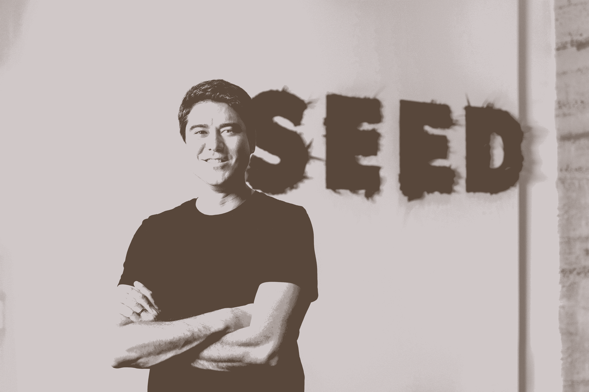

# 寻找创业点子的 12 个框架——给未来创业者的建议

> 原文：<https://review.firstround.com/12-frameworks-for-finding-startup-ideas-advice-for-future-founders>

## 介绍

成功创始人的杂志简介中，这一场景经常被浪漫化:敏锐的观察记录在笔记本上。偶然的对话将拼图拼在一起。想法是一切开始的地方——至少，这是我们被引导去相信的。

这些故事似乎向有抱负的企业家暗示，你所要做的就是等待灵感的灵感，这并不是最可行的策略。但这正是神话般的创业公司 epiphany 的问题所在。在对点燃辉煌成功故事的火花的复述中，从-1 到 0 的旅程中更混乱的部分经常被删减。看似神圣的启示，实际上是几个月或几年与专家的访谈、无休止的争论和大量“那永远行不通”的谈话的产物。

当我们开始讲述这个绝妙主意的故事时，我们掩盖了发掘它所付出的所有努力。

从概述独特的见解，到捕捉客户可能的反应，以及确定你所追求的市场规模，有一个长长的清单。**换句话说，如果你想找到下一个伟大的创业想法，你不能等待众所周知的灵光乍现——你必须做足功课。**

正如[我们已经说过的](https://firstround.com/?question=606 "null")，在创始人开始建造他们的城堡之前，他们必须确保他们选择了正确的土地。为了帮助有抱负的建筑商调查潜在的地块，我们查阅了我们的档案，从首次创业者和重复创业者那里收集了最好的建议。他们在这里分享的 12 个策略为逆向工程这些传说中的灵光一现提供了更具体的技巧，无论你是在完全开放的构思阶段，还是在考虑一个超具体的方向。

这个建议集包含了头脑风暴的框架，帮助测试概念的问题，甚至是关于如何最好地与潜在的联合创始人探索一个新想法的想法。无论你选择只采用其中一个，还是全部采用，我们希望它们能帮助你加速找到要解决的正确问题，并投入到[启动](https://firstround.com/review/starting-up/ "null")的工作中。

# **从正确的心态开始:**

谈到寻找创业想法的问题选择阶段， **[Ayo Omojola](https://www.linkedin.com/in/omojola/ "null")** 有丰富的经验可以利用。他目前是 **[Carbon Health](https://carbonhealth.com/ "null")** 的产品副总裁，是 Square 现金应用银行团队的创始项目经理，之前创办了一家 YC 支持的初创公司，并积极参与天使投资——所有这些都为寻找和评估初创公司的想法提供了独特的视角。

他说:“当谈到一个新想法时，确定或者尽可能确定你正在回答的问题是否值得一开始就问是非常重要的。“当我回想起我的上一家公司时，我是与我的兄弟和一个朋友共同创办的。我们挑选了一个我们认为在技术上非常有趣的问题来解决。他说:“我们辛苦工作了很多年，但这并不重要。

“我从中得到的教训是，我们在实际工作中付出了太多的努力，而在选择工作内容方面却没有付出足够的努力。这对我们的结果是一个更大的决定因素——我们没有选择一个足够大的市场。如果你选择了一个充满机遇的大领域，你的努力程度当然很重要，但你也会获得更多优势。”

Omojola 指出了这种埋头苦干的心态可能是我们学生时代的产物。“我们长大后被教导的是，我们的结果 100%与我们的努力相关。如果我为一次考试努力学习或者努力做一个项目，我会比不努力得到更好的成绩。所以我总是认为，当事情不顺利时，我只需要更加努力地工作，”他说。

选择一个重要的问题，即使你的工作很一般，一般也会比选择一个可怕的问题产生更好的结果，即使你的工作很优秀。

Punit Soni, founder & CEO of Suki

“创业不是一个明智的财务决策。从逻辑上讲，这种情况对你非常不利，没有任何意义。作为创始人投入生活是一个浪漫的决定。这是那种你想要冒险时才会采取的行动。“但这并不意味着你必须跳下悬崖。创办一家公司就像爬一座陡峭的山——你需要花时间准备行囊。

准备工作的一部分包括在出发前检查你的心态。“你必须投入大量的智力去弄清楚你到底想做什么。索尼说:“你需要通过阅读、勤奋、探索不同的空间，专门为这项任务留出时间。“这就像进入一所顶级学校或令人惊叹的公司一样。如果你想有机会创办自己的公司，那就努力去做——不要等到灵感来了再去做。”

索尼最终想到了这个主意，后来成为了 **[【淑熙】](https://www.suki.ai/ "null")** (一种基于语音的医生数字助手)——但这里有一个发掘它的工作的小插曲。索尼想开一家医疗保健公司，但除此之外他没有太多的方向。“我在医疗保健方面毫无经验，所以我花了六个月时间跟踪医生，让自己融入大型医疗系统，以了解他们面临的是什么样的问题，”他说。“没有什么能取代面对面的观察，这是一种了解市场和产品的工具。”

有一次，他认为他可能有一个赢家。“这基本上就是 Slack 为医疗保健所做的事情。医院里有太多的交流，似乎迫切需要这种交流。我知道我可以制造出一个伟大的消费品，”索尼说。

在休息室与一群护士共进午餐时，他提出了自己的伟大想法。“他们看着我说，‘普尼特，我用传真机、传呼机、微软 Outlook、电子病历，除此之外还有纸质文档。我不会使用另一种通信协议。事实上，如果我看到其他人使用它，我会积极尝试阻止他们，”索尼说。

批评很伤人，但很有启发性。“这是一个我个人非常兴奋的想法。但这是一个例子，说明当你想出硅谷的点子来解决用户的问题时，你需要了解他们在经历什么。

“你必须花时间问很多问题，真正倾听，但也要翻译。大多数用户不一定知道他们想要什么，但他们知道什么在伤害他们。**作为一名企业家，你的工作是把伤害他们的东西转化成产品。**

如果你乐于接受挑战，你将有更大的机会创造出用户真正想要的产品——而不是你认为他们想要的产品。

# **蓝天头脑风暴:**

当你从一张完全空白的石板开始时，看起来你好像处在一个有无限条道路的十字路口。 **[萨沙·奥尔洛夫](https://www.linkedin.com/in/sashaorloff/ "null")** 深知这种感觉。在创立 LendUp 并扩大规模七年后，他决定辞去首席执行官一职——没有任何可靠的安排。在随后的间隙，他与创始人、首席执行官和投资者进行了 100 次咖啡聊天，为他的下一步行动收集建议。当然，一个选择是显而易见的——作为一个重复的创始人，寻找另一个创业的机会。

“当你成为一名创始人时，你已经证明你有能力创造一些东西，这真的很令人兴奋。奥尔洛夫说:“成为连续创业者是一种不断创新的方式。“但是，对于‘大二滑坡’的担忧，在那些离开并创办另一家公司的创始人中尤为严重。我承认，无论人们告诉我多少次不要关注那些不合理的恐惧和不安全感，我也感觉到了。对于我的下一次创业，我显然想创造比我的第一次更大、影响更大的东西——大声说出来很吓人。”

Sasha Orloff, CEO & Founder at Puzzle Financial

无论你是第一次吃苹果，还是第二次或第三次吃苹果，奥洛夫建议你通过问自己一系列简单的问题来寻找灵感:

世界上的大问题地区在哪里？

你有什么个人技能、优势或见解能够帮助解决它？

你如何把这变成一个可行的商业想法？

奥尔洛夫举了一个例子来说明他是如何思考这个框架的:“在我休息的时候，我在探索如何运用我在创业、技术方面的背景，以及与美国工人阶级打交道的经验，来实现接触的民主化，并改善他们的生活，”他说。"**如果你已经反复思考了一个商业想法很长时间，这是一个很好的迹象，表明你对它充满热情，至少应该探索以某种方式推进它**"

发现一个不明显的想法的诀窍在于，在任何人之前找到打破传统智慧的东西，并将这个不太可能的想法发展成一家高增长公司——这是投资者、经营者和 *[高增长手册](https://www.amazon.com/High-Growth-Handbook-Elad-Gil/dp/1732265100 "null")* 作者 **[Elad Gil](https://www.linkedin.com/in/eladgil/ "null")** 非常熟悉的东西。为了帮助潜在的创始人找到并挖掘不明显的市场，吉尔挑选了最佳类型:新技术，看起来拥挤但不拥挤，看起来小众。

**新技术:**

“从移动到社交再到加密，有太多的例子表明，人们无法想象几年的复合发展在技术速度提高、成本下降或采用增加方面会是什么样子，”他说。

“我们应该监控哪些因素在快速增长，或者哪些领域的采用在合理快速地增长。证据在于增长率或外推的技术曲线，而不是此刻坐在你面前的数字。你也可以看着技术，问‘这东西每年能快多少或好多少？’然后往下游看。或者反过来问‘如果不是 100 万人做这件事，而是 5000 万人，会发生什么？市场发生了什么根本性的变化？"

**看起来很拥挤，但并不拥挤:**

“繁忙的市场本身并不是一个负面信号。他说:“如果你四处逛逛，你可能会发现它实际上是空的，不管是因为没有人有一个伟大的产品，还是因为有很多没有差异化的玩家。”

即使别人先到，你也能赢。深入挖掘差异，捕捉他们留下的信息。

鉴于许多最有趣的市场看起来总是很拥挤，吉尔提出了一系列问题来寻找开放空间的信号:

评估竞争对手。竞争对手有实力吗？这是一个伟大的团队，能够快速产生追随者吗？他们的品牌有多强？吉尔说:“许多好主意都有糟糕的实施，所以如果你能强势进入并做好，你就能赢。”

**寻找结构上的劣势。**是否存在不公平的分配机制或其他壁垒？“有些拥挤的市场确实拥挤或者不值得。向大型制药公司销售利基软件工具就是一个例子，因为客户数量很少。吉尔说:“教育技术是另一个我认为很难获得关注的领域。“物联网也是如此。大型企业有一个显著的优势，因为他们可以集成和分发，而不是像初创公司那样制造单一的‘智能’设备，无法扩展。”

**苏斯出去是否还有余地。**是赢家通吃还是赢家通吃的市场？还是更多的是寡头垄断结构？“你需要衡量有多少空间。他说:“人们通常认为‘游戏结束了’，但如果你看看支付之类的东西，情况就不尽然了。

**计算** ***潜在*** **客户。顾客真的得到了很好的服务吗？总渗透率是多少，而实际上应该是多少？有多少人真正在使用该产品，真正的潜力是什么？“这些问题可以揭示现有产品并不优秀，”吉尔说。“Dropbox 普及的部分原因是那里有真正的需求。想想看，应该使用云存储解决方案的总人数接近所有在线和使用文件的人。如果你在 Dropbox 出现之前计算一下，看看有多少人实际上在使用某个提供商，有多少人应该使用云存储，你会发现这些数字相差甚远。他说:“这可能是餐巾纸计算的快速回溯。**

**貌似小生:**

当决定一个市场能有多大时，创始人和投资者经常欺骗自己——双方都是如此。"**有时候不是小众，只是无聊。他说:“如果你将这两者混为一谈，你将会错过难以置信的机会。对吉尔来说，这里有四种类型值得再看一眼:**

吉尔说:“我听到很多投资者说‘是的，那里有真正的用途，但它太小了，哪里都去不了。’。“但是‘小’很容易变成主流产品。我记得当优步第一次获得资金时，很多对话都是“他们只会获得很小的出租车市场的 20%。”事后看来，优步实际上解决了一个非常引人注目的关于交通的用户体验问题。"

**太无聊:**“在投资人或创始人本质上不想去想或者他们就是不理解的领域，有一些真正的机会。吉尔说:“像工资单这样的东西并不令人兴奋。“PagerDuty 也是我最喜欢的例子之一。给创业者的一个信号可能是，如果你或你的朋友一遍又一遍地构建相同的内部工具。如果很无聊，就去做吧，因为那可以成为优势。”

**太高端:**“你也听说某些想法超级高端，不可能规模化。但你必须看到更大的图景，想想它会走向何方，”吉尔说。“如果成本随着规模的扩大而下降，它还能如何应用，或者还能为谁服务？想想特斯拉还只是跑车的时候，或者优步最初的宣传重点是黑色汽车。”

**太个人化的陌生:**“作为一个创始人，你应该做你知道的事情，即使别人可能不知道——这样就不会那么拥挤。例如，Katrina Lake 将 Stitch Fix 变成了一家价值数十亿美元的公司。Emily Weiss 创办 Glossier 是另一个令人敬畏的例子。吉尔说:“男性企业家可能没有想到这些市场，投资者可能忽视了它们的潜力，但卡特里娜和艾米丽知道那里有空白空间。“利用你自己的经验或获得不同的观点是一个关键的工具，可以帮助你判断一个机会是真正的利基，还是只是看起来如此，而是一个巨大的市场。”

作为一名教授、前首席执行官、长期投资者和首轮资本的联合创始人，**[霍华德摩根](https://twitter.com/HLMorgan "null")** 看到了区分优秀创始人和伟大创始人的一个习惯:放松约束的能力。

如果想不出框框，就把框框做大。从放松约束开始。

摩根看到经验丰富的和绿色的创始人从一开始就限制了他们的伟大想法。但是在构思阶段，重要的是不要把自己局限于当前的现实——不要羞于参与真正的未来思维。

从技术层面开始。为了建造一些能改变人们生活方式的东西，你需要超越现有的东西来思考。“当我们从 1996 年到 2000 年在 Idealab 建立互联网公司时，大多数人可用的带宽是 56k 拨号上网。“但是要建立有趣的用户界面，你必须假设宽带，”摩根说。同样，2G 的移动带宽不足以处理有趣的数据。所以成功的开发人员消除了这种限制。“他们说，‘如果这种情况消失了呢？我们可以建立全球定位系统。我们可以构建每秒需要数百兆比特的丰富应用程序。"

当谈到为以前无法解决的问题开发解决方案时，创始人也会遇到目前已知或可知的限制。但是在放松知识约束的时候，遵守物理规律还是很重要的。“我们不太可能改变这些，所以反重力或永动机不应该是你计划的一部分，”摩根说。“你还应该明白，50 年后可能知道的东西与今天的初创企业并不那么相关。对于几乎所有创办公司的人来说，思考 3 到 10 年大概就是他们应该做的事情了。

当你考虑创业想法时，这里有几个问题可以帮助你摆脱这些限制:

缺少什么技术会阻碍你实现最终目标？

你现在能做些什么来让你以后实现更远大的目标呢？

你的产品的科幻版本是什么？

你有没有想过什么特别有趣的“如果”呢

当雇佣团队来开发突破性的技术时，问自己:与我想做的事情最相似的是什么？我到哪里去找那些人来放松这种约束呢？

# **擦亮你的眼睛:**

Gloria Lin, co-founder & CEO of Siteline

离开 Stripe 创办了最终成为 **[的 Siteline](https://www.siteline.com/ "null")****[Gloria Lin](https://twitter.com/immunoglobulin "null")**之后，他就专注于寻找合适的人选——无论是从联合创始人的角度，还是从他们将共同处理的想法的角度。“人们从一开始就被一个坚实的公司想法或一个特定的联合创始人所困扰，但我认为你不需要马上就有，”她说。“将空白区域视为尝试合作的机会，同时也是探索有趣想法的机会。”

我们建议在这里采纳她的建议。她寻找联合创始人的[剧本](https://review.firstround.com/the-founder-dating-playbook-heres-the-process-i-used-to-find-my-co-founder "null")是我们见过的最详细、最有意图的过程之一——她用来探究兼容性的 50 个问题是创建二人组的重要工具。(我们在这里重点关注她的过程的第 3 步，但请务必阅读她的完整方法。)

说到创办公司，你可以找到合适的空间去追求，并找到合适的人一起平行解决。两者都不要妥协。

在与一位潜在的联合创始人进行初步合作后，林直接投入到一起解决一个项目中。“通过头脑风暴和轻量级原型，深入探索具体的想法。林说:“我们的目标是在一个想法上取得进展，并获得合作经验，看看一起工作会是什么样子。“第一次或第二次咖啡聊天可能不会告诉你太多。但一旦你开始做某种项目，你就会获得更多关于这个人及其工作风格的数据，”她说。

“对我来说，这是有趣的部分。林说:“你需要亲自动手，挖掘一个空间，弄清楚需求，看看一个创业想法是否有潜力。”。“这也是一个发现你是否真的对某个领域感兴趣的机会。**有几次我以为自己对某个行业充满热情，结果通过动手项目才发现其实并不喜欢。**”

然而，这并不是漫无目的的修补。林建议将这一探索阶段的时间限制在两周左右，以最大限度地提高学习速度和行动速度。至于如何接近这段探索期，她对消费者和企业创业想法的建议各不相同。在调查与潜在联合创始人合作的消费游戏时，林坚信，你必须努力创造一些东西。“这并不意味着您必须构建一个完整的生产就绪型应用程序。林说:“想出最便宜的东西，一两周内你能拿到的最贵的 MVP，看看事情进展如何。”。“这可能是一个真正的 janky 原型，一个小的 Chrome 扩展，或者一个登录页面。你可以把它放到世界上，看看是否有回应。”

相比之下，企业更注重客户发现。“对于企业来说，构建通常不是最难的部分。一切都是为了销售。你需要一条捷径来弄清楚，‘我在做人们想要的东西吗？’与专家或潜在客户进行一系列访谈，找出答案。客户会告诉你他们的问题是什么。如果你听得非常仔细，你可能会找到一个切入点来建立一家公司。下面是林和她的潜在联合创始人在这些客户电话中问的一些具体问题:

您目前如何管理这一流程？

与您的其他棘手问题相比，它对您来说有多大？

如果你可以挥一挥魔杖，让这个问题消失，这会对你的工作或你的客户产生什么影响？

当你在探索企业创业的想法时，你必须走出去与客户交谈。我和我的联合创始人从这些谈话中得到了一些想法，这些想法是我自己在一百万年内也想不出来的。

“我看到很多创始人在创办公司时会说，‘这个领域有机会，我会找到的。’或者，我认识一些刚走出校门的孩子，他们宣布自己“要去创业了”。这最终可能会成功，但这是一件很难做到的事情，因为没有明确的路径，”劳埃德·塔布 说。

“我等了很久才开始 **[Looker](https://looker.com/ "null")** 。回顾过去，我认为我们取得了很大的成功，因为我一直等到我对问题所在有了清晰的论述，然后我们就直接着手解决了。我可能不确定我将如何实现它，但我从一开始就清楚自己的使命是什么:打造一款产品，让组织中的每个人都能通过数据看到正在发生的一切。”

未来的创业者们，从你将要解决的问题开始，写一篇真正强有力的论文。如果你错过了第一个至关重要的因素，最好是让你的公司在低火上构建梦想，同时努力找出一个。

这个论点植根于塔布以前的经历。“几年来，我看到了对 Looker 这样的产品的需求，并不断回归这个想法。在多家公司担任创始角色后，我知道企业需要实时了解他们的数据。我一直在构建这些一次性的定制工具，以帮助其他人查看非常狭窄、特定的数据集，我意识到必须有一种更好的方式来做到这一点，”他说。“如果你在一遍又一遍地做同样的东西，这是一个信号，表明你可能有了创业的想法。”

Sunita Mohanty, Product Lead at Facebook's New Product Experimentation

斯坦福大学研究生毕业后，苏妮塔·莫汉蒂 发现自己正处于第一次创业的中期，一家失败的 K-12 分析公司。“我们陷入了决策圈，无法成功执行或建立影响力。回过头来看，很容易诊断出我们很难专注于首先解决哪个问题，因为我们没有足够好地理解我们观众的实际问题——我们只是假设我们理解了，”她说。

现在，在她作为天使投资人和顾问的工作中(除了她作为脸书新产品实验的一部分的产品主管的日常工作之外)，她看到团队遇到了同样的砖墙，并且总是提出同样的建议:“**做工作以确保你正在构建一个人们会真正发现有价值的产品**。这需要对用户、他们的希望和动机有难以置信的深刻理解，而不是走未经测试的假设的捷径。”

底线是你可以非常容易地构建一些东西，但是为了增加你创造一些解决实际问题的机会，你需要在方法上更加严谨。

为了给自己的工作增添一丝严谨，莫汉蒂开始依赖 JTBD(待办工作)框架。(我们在这里只是强调了相关的部分，但是对于一个适合创业背景的优秀入门者来说，一定要阅读[她在评论](https://review.firstround.com/build-products-that-solve-real-problems-with-this-lightweight-jtbd-framework "null")上的完整的 JTBD 指南。)

更具体地说，Mohanty 依赖于“要做的工作”陈述，它简明地描述了特定产品或服务融入一个人生活的方式，以帮助他们实现以前无法实现的特定任务、目标或结果。她分享了 [JBTD 声明模板](https://docs.google.com/document/d/1NmKemkMOJh4DVLmTMhVUgLjG9i0_-5mqsEdCQcYH6wI/edit "null")，她认为该模板很有帮助，并在脸书和 Instagram 产品团队中广泛使用:

***当我……(上下文)***

***但是……(屏障)***

帮帮我。(目标)

**所以我…..(结局)**

但是，当然，你的产品可以满足很多客户目标，所以专注是最重要的。“从用户访谈中，寻找在要做的工作中出现的主题。你还可以进行调查，要求用户对工作的重要性以及其他应用程序或产品目前对每个工作的支持程度进行排名，以更好地了解市场机会。她说:“这可以帮助你缩小工作范围，优先考虑那些需求最大、缺口最大的工作。

莫汉蒂喜欢在考虑处理哪些工作时使用这个框架:

鲍勃·摩尔 作为创始人的第一次人生经历始于 2008 年——雷曼兄弟倒闭的前三天。自从在动荡时期第一次成为创始人以来，他已经建立了另外两家公司。“有清晰的愿景和没有愿景而得过且过的区别将会改变你的公司的轨迹——我经历过这个硬币的两面，”他说。

以下是他对希望走上正道的未来创始人的建议:“简单明了，这是你需要确定的公式:**这是我们在这里要做的事情，这是我们为什么会在这个非常具体的事情上做得最好，这是让现在成为正确时机的顺风**，”摩尔说。

“我们现在在我目前的初创公司 **[横梁](https://www.crossbeam.com/about/ "null")** 看到了这一点。我们创办这家公司时，有一个非常具体的愿景，那就是当这个数据协作问题以尽可能最好的方式得到解决时，世界应该是什么样子，而不是像“合作是一种痛苦，让我们去解决它”这样的泛泛之谈"

我们要做什么？背后有什么我们独特的眼光？这是建立一家有弹性的风险投资公司的先决条件。即使在最好的市场有最好的团队，如果没有这些因素，你也会遇到瓶颈。

# **评估一个想法是否可行:**

Todd Jackson, Partner at First Round

托德·杰克逊说:“除了选择你的联合创始人之外，在创始人做出最重要的决定后，确定正确的市场，这是一个太容易出错的决定。”。作为第一轮的搭档，杰克逊从他的职业生涯中有很多模式可以借鉴。他曾是 Dropbox 的高管，谷歌和脸书的项目经理，还是自己的创始人(2014 年被 Twitter 收购的 Android 初创公司 [Cover](https://www.wired.com/2014/04/twitter-cover-buy/ "null") )。

一个陷阱是，产品经理出身的创始人往往会直接进入执行模式。“他们想到一个想法，很快就开始建造一个原型，然后有时动力和建造的兴奋会占据上风。他说:“虽然作为项目经理，你获得的运营重点和纯粹的执行力是巨大的优势，但你最好先退一步，想想你选择的市场和你要解决的问题是否足够大。”

但是，你如何判断一个创业想法是否值得追求呢？当杰克逊在 2012 年离开脸书时，他遇到了同样的问题。“我和我的联合创始人埃德·何(Ed Ho)知道我们想要创业。我们知道，从在谷歌的时候起，我们就合作得很好，我们对相同的消费者领域非常感兴趣。但我们最终追求的——成为 Android 封面的——实际上是我们的第三个想法，”杰克逊说。

“我们的第一个想法是在体育领域。我们设计了一些东西，与一群从事体育相关工作的企业家交谈，我们意识到这是一个很难竞争的市场。我们的第二个想法是一个照片分享应用程序。当时，Instagram 很流行但并不占主导地位，Snap 几乎不存在。我认为那里还有很多有趣的事情要做，但最终我们被投资者说服了，他们说，“即使这是下一个伟大的照片应用，你如何说服任何人呢？”不仅仅是用户，还有你需要招聘的工程师等等。"

为了对这些想法(以及最终被淘汰的想法)进行压力测试，杰克逊和他的联合创始人依赖于以下框架——直到今天，他仍在指导未来的创始人。**如果你是一个有抱负的创始人(或者只是在你的 Notes 应用程序中保留一份公司想法的运行列表)，根据以下标准评估创业想法**:

**功能需求**:它是否解决了用户明确的功能需求？这通常是他们尝试的原因。

情感需求:它解决了用户的情感需求吗？这通常是他们会告诉别人这件事的原因，这开启了至关重要的病毒式口碑增长循环。

十几亿美元的市场:这是一个巨大的、服务不足的市场吗？还是在一个可以变大的市场？这影响到方方面面，从你的融资能力到谁有兴趣收购你。

**突破 UX** :用户体验有什么新奇或独特的地方吗？用的时候是不是感觉有点像魔法？最后一个不是绝对必要的，但它非常有用，许多成功的产品在发布时都有它。

“我接触过的大多数创始人都没有如此深入地思考过他们的想法。他们有一个想要解决的高层次问题，但还没有将其映射到客户的功能和情感需求。杰克逊说:“这项练习迫使你说出需求的名称，然后通过压力测试这些需求是迫切的，还是仅仅是有求必应。

如果你在坐在一个大市场上，利用突破性的用户界面，想出同时满足人们功能需求和情感需求的点子，那才是真正好公司的秘诀。

“写你知道的”是一条常见的写作建议。同样，创始人听到一些变化，告诉他们解决他们亲身经历的问题。 **[纳特·特纳](https://twitter.com/natsturner "null")** 有一种不同的方法，以前有过两次成功经验——他的第一家公司 Invite Media 于 2010 年被谷歌收购，还有 2018 年被罗氏以 19 亿美元收购的 Flatiron Health(这两家公司都是他和联合创始人[扎克·温伯格](https://twitter.com/zachweinberg "null")一起创办的)。

特纳的整个过程可以浓缩成这些关键步骤。最重要的是，**他不再只是研究想法，或者在空间里与他人随意交谈，而是立即开始推销——不是为了获得投资，而是为了获得反馈**。

从感兴趣的领域开始，寻找任何想法的种子

在行业中疯狂地建立关系网，并且非常认真地对待介绍

创建一个平台，开始向你能找到的任何聪明且相关的人推销这个特定的想法——一定要做细致的笔记并跟进

在每次会议之间调整一下桌面，拼凑一个演示，然后开始推销(预售现在还不存在但将来会有的软件)

找到一个值得信赖的顾问团队，讨论从现场学到的重要知识并获得反馈

继续尽可能快地重复你收到的反馈

特纳回忆起邀请媒体的早期:“我们向每个人推销。我们向潜在顾问、投资者、潜在客户、朋友和所有人推销。我能记得我们开的数百次会议。”在开始推销这个想法后，特纳和温伯格以及他们的另外两位联合创始人尽快制作了一个演示，因为人们对产品的反应比抽象的概念更容易。在无休止的推销视频广告创作产品的会议之后，他们收到的反馈开始形成他们可以采取行动的模式。

当特纳和温伯格评估一个想法时，他们寻找几个关键特征:

这能成为一笔大生意吗？在这个领域有机会建立一个十亿美元的公司吗？

这是可持续的吗？这种想法能变得有粘性并持续一段时间吗？

这有多大的可扩展性？这项业务的规模有多大？它是如何非线性增长的？

“在我们最初的视频广告创作想法的四个月内，我们意识到，基于与人们的交谈，获得足够的广告库存和扩大需求将非常困难，”特纳指出。然后，他们开发了一个与广告相关的脸书应用程序，并向更多人推介，经过又一轮反馈后，该应用程序演变成了一个展示广告的通用购买平台。

他们像建造 Invite 一样开始建造熨斗的过程:选择一个普遍感兴趣的领域，在这个例子中是健康。特纳解释说，“我们的第一个想法是第二意见网站，第二个想法是临床试验匹配工具，第三个想法是商业智能工具。”

这种强化推销和倾听的方法面临的挑战是，你会得到大量的反馈。市场会告诉你很多事情:有些是对的，有些是错的。作为一名企业家，你的工作就是把信号从噪音中分离出来。特纳解释道:“如果你想成为一名成功的企业家，最重要的事情就是能够接受来自所有这些人的相互矛盾的反馈，其中许多人厌倦了或者有坏习惯，还有一些人说得很对。你必须能够坐在那里，从这些信息中提炼出有价值的东西。”

难的是想不出点子；它是对你所有的信息进行提炼，其中 90%将是垃圾，最后找出什么是好的 10%，认识到好的 10%可能会根据行业的不同而迅速变化。

Irving Fain, founder & CEO of Bowery Farming

2014 年开始 **[Bowery Farming](https://boweryfarming.com/ "null")** 的时候， **[欧文费恩](https://www.linkedin.com/in/irvingfain/ "null")** 之前从未从事过农业。虽然他可能是室内农业领域的新手，但他对担任首席执行官和创始人的曲折经历并不陌生。在帮助建立 iHeartRadio 后，他在 2009 年开始联合创立 CrowdTwist 集合了百事可乐、索尼音乐和迈阿密海豚等创始人梦寐以求的大 logos。但该公司的成功不足以让 Fain 继续受到企业软件的激励，他在 2014 年辞去了首席执行官的职务(CrowdTwist 最终将在 2019 年被甲骨文收购)。

这就是为什么在创立 Bowery 的早期，Fain 特别严格地用长远眼光来评估想法。“SaaS 农场是一项伟大的事业。精准农业是另一个伟大的产业。但是他们没有抓住我的激情，我的想象力和我的热情。费恩说:“当你创办任何一家企业时，这个组成部分都非常重要，因为创建一家公司是一个漫长而艰难的过程。

他并不是唯一一个感受到创始人倦怠之痛的人。我见过朋友们对一个想法变得异常兴奋。他们出去筹集了一些钱，然后兴奋感很快就消失了。**现在你被困在创建这家公司的路上，你对这家公司的兴趣不大**。当我在观察和评估不同的想法时，即使我越来越兴奋，我也会调整自己的节奏。费恩说:“不断翻转其他岩石至关重要。”**你应该问的核心问题是，‘三年后、五年后、七年后，我会对此感到兴奋吗？**

我想确保人们对这个想法的兴奋感随着时间的推移而增长。无论是在伟大的时代，还是在困难的时代，我对问题和事业的激情、热情和真正的热爱将会持续下去。

*封面图片由 Getty Images / seb_ra 提供。*