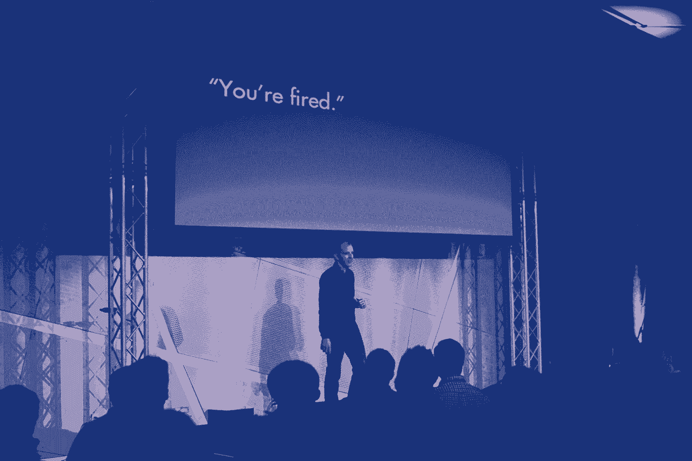

# 2013 年给创业者的 30 条最佳建议

> 原文：<https://review.firstround.com/30-Best-Pieces>

它始于市场的一个缺口。

科技写作有多种形式。它可以像《纽约客》一样冗长而抒情。它可以是一口大小的——只要有足够的新闻就可以拿走。我们发现的是缺乏战术性的故事讲述，需要引人注目的长篇写作，为读者提供他们可以立即部署的工具和技巧，以建立更好的业务。我们的回应是[首轮审核](http://www.firstround.com/review "null")。

迄今为止，我们已经介绍了从[杰夫·韦纳](http://firstround.com/article/the-management-framework-that-propelled-LinkedIn-to-a-20-billion-company "null")到[德鲁·休斯顿](http://firstround.com/article/How-to-Win-as-a-First-Time-Founder-a-Drew-Houston-Manifesto "null")到[亚伦·列维](http://firstround.com/article/Aaron-Levie-on-How-to-Scale-10x-as-a-CEO-Built-a-Billion-Dollar-Business "null")的首席执行官，像亚马逊[詹姆斯·汉密尔顿](http://firstround.com/article/Head-of-Amazon-Web-Services-on-Finding-the-Next-Great-Opportunity "null")这样解决世界上最大技术挑战的工程领导者，像 Medium[杰森·施蒂曼](http://firstround.com/article/How-Medium-is-building-a-new-kind-of-company-with-no-managers "null")这样的大胆思想家，以及像 [Mint](http://firstround.com/article/Head-Designer-of-Mint-on-Why-Great-Design-isnt-about-Making-Things-Pretty "null") 和 [Gmail](http://firstround.com/article/Top-Hacks-from-a-PM-Behind-Two-of-Techs-Hottest-Products "null") 这样可爱产品背后的杰出设计师。我们这样做的目的只有一个:**帮助优秀的企业家分享他们的见解和专业知识，这样下一波创业者就可能成功**。以下是我们今年公布的 30 条最佳建议的综述。把它带到 2014 年，你可能会成为下一个独角兽。

至于我们，我们才刚刚开始。

**1)** **[查参考文献为真实](http://firstround.com/article/What-Scott-Cook-Wished-He-Knew-About-Being-a-CEO-When-He-Founded-Intuit "null")** **。**

Intuit 的联合创始人斯考特·库克对他雇佣的人非常挑剔。30 年后，他将其归结为一门科学——包括如何从证明人调查中获取真相。现实情况是，人们都想表现得好一点，所以几乎每个人一开始都会说候选人有多棒。库克的建议是完全忽略这个开场反馈。当他们完成后，问这样一个问题:“在你见过的这个职位的所有人中，如果用 0 到 10 分来衡量，这个人排在第几名？”如果对方说 7，马上问为什么他们不是 9 或者 10。“然后你将最终开始了解这个人的真实想法，”库克说。他还会在每次通话结束时，询问对方是否有其他人能对候选人的表现发表看法。你离提供的参考文献越远，数据就越有价值。

**2)** **[你不一定要率先上市才能成功。](http://firstround.com/article/How-to-Win-as-a-First-Time-Founder-a-Drew-Houston-Manifesto "null")**

[Dropbox](https://www.dropbox.com/home "null") 创始人兼 CEO [德鲁·休斯顿](https://www.crunchbase.com/person/drew-houston "null")应该知道。等到他申请 [Y Combinator](http://www.ycombinator.com/ "null") 的时候，云存储已经是一个拥挤的空间了。但是他没有被吓住。虽然许多企业家认为他们必须首先进入市场才能在一个类别中获胜，但事实几乎从来不是这样。看看谷歌如何打败 Alta Vista，雅虎，问问 Jeeves 就知道了。“事实是，第一名有一个问题，”休斯顿说。“你创造了一个市场，如果你做得太早，你实际上是在身后敞开了大门，让别人做得更好。”所以他拒绝了反对者，2 亿用户之后，Dropbox 领先了。

**3)****用股权创造真正的忠诚。**

Andy Rachleff 是 [Wealthfront](https://www.wealthfront.com/ "null") 的创始人兼首席执行官，在此之前是 [Benchmark Capital](http://www.benchmark.com/ "null") 的联合创始人兼普通合伙人。在观察了多年不同的策略后，他制定了[财富前沿公平计划](http://firstround.com/article/The-Right-Way-to-Grant-Equity-to-Your-Employees "null")，将公平与员工对公司成功的贡献挂钩。该计划的原则是:避免悬崖，将股权与杰出表现(而非里程碑)挂钩，投资于年度常青树基金，将长期任期和努力工作与所有权股份挂钩。拉赫勒夫建议:“鼓励员工考虑通过成就来增加他们选择的价值，而不是在完成任务后要求更多。”Evergreen grants 使授权过程变得平稳，因此员工永远不会走到悬崖。“悬崖让人们抬起头来，考虑他们的替代方案。应该不惜一切代价避免。”[点击此处查看计划幻灯片](http://www.slideshare.net/wealthfront/wealthfront-equity-plan "null")。

**4)** **[战斗就像你说得对](http://firstround.com/article/Fight-Like-Youre-Right-Listen-Like-Youre-Wrong-and-Other-Keys-to-Great-Management "null")** **。** **[听起来好像你错了](http://firstround.com/article/Fight-Like-Youre-Right-Listen-Like-Youre-Wrong-and-Other-Keys-to-Great-Management "null")** **。**

斯坦福大学工程学院教授兼管理专家鲍勃·萨顿认为，这是成为一名优秀老板的关键之一。但最重要的是意识到你自己和你的行为。当你掌权时，人们开始密切关注你所做的一切。与此同时，你开始因为公司的表现得到比你应得的更多的赞扬和/或责备。这被称为“放大效应”——它如此强大，以至于尽管数据显示领导者往往要对大约 15%的结果负责，但他们通常会得到 50%的责备或赞扬。正如萨顿所说:

当你变得成功的时候，就是你要特别警惕你将要变成白痴的时候。

**5)** **[激励一个团队，讲好一个故事。](http://firstround.com/article/Top-Hacks-from-a-PM-Behind-Two-of-Techs-Hottest-Products "null")**

“然后把它分解成一个执行计划，”Todd Jackson 说，他是 Gmail 和脸书 News Feed 的首席产品经理之一，现在是 Android 创业公司 [Cover](https://www.coverscreen.com/ "null") 的联合创始人。为了让他的团队支持功能变化，他会制作展示未来可能会是什么样子的模型，并用它们来讲述一个故事。为了获得重新设计新闻源的支持，他将产品个性化。“你的朋友发布了这么多精彩的内容，”他告诉他们。“如果我们让它看起来非常好，人们每天会看两倍的故事，会怎么样？如果发生这种情况，人们会在网站上花两倍的时间。人们会得到两倍的赞，我们会得到两倍的收入。这是用户会喜欢的东西。这是你的朋友和家人会喜欢的东西。”杰克逊说，如果你让工程师对可能发生的事情感到兴奋，他们就会努力工作去实现它。

**6)** **[摆脱运气。](http://firstround.com/article/Theres-a-00006-Chance-of-Building-a-Billion-Dollar-Company-How-This-Man-Did-It "null")**

“当你走运时，那是因为你不知道会发生什么。推论是，如果你知道会发生什么，那就没有运气。没有不确定性，也没有风险。”气候公司的创始人兼首席执行官大卫·弗里德伯格总是偏爱确定性而非运气——今年他以 10 亿美元的价格卖掉了自己的公司。当然，每项业务都有一定程度的风险。你不知道你的市场走向，你的竞争对手在计划什么，甚至不知道人们是否会购买你的产品。但是你能识别的不确定性越多，就越容易把它们从桌子上拿掉。“识别未知，减少未知，”弗里德伯格说。"只有这样，你才能实现你想要的结果，并增加公司的价值."

**7)** **[注意人不是问题。](http://firstround.com/article/How-Medium-is-building-a-new-kind-of-company-with-no-managers "null")**

传统管理从未完全认同杰森·施蒂曼的观点。事实上，在博客平台 [Medium](https://medium.com/ "null") ，他正在帮助创造一种没有经理的文化。但在此之前，他在 Twitter 上运营自己的工程团队，并发现了一些自己的领导技巧。“我听说我团队中的某个人与另一个团队中的某个人发生了问题，导致一切都陷入了停顿——仅仅是因为他们不喜欢对方。我想，如果我只是让他们在一个房间里，我们谈论一切，除了手头的问题？当我们这样做时，我们进行了一些随意的交谈，他们发现了一些相似之处，在一个小时结束时，他们谈论了如何解决他们的问题。这是一场让我夜不能寐的冲突，一旦有空间让他们像人一样交流，冲突就解决了。我想，天哪，这是一种超能力。”

**8)** **[深挖技术面试。](http://firstround.com/article/The-anatomy-of-the-perfect-technical-interview-from-a-former-Amazon-VP "null")**

亚马逊和 Zynga 的前技术副总裁尼尔罗斯曼说，好的面试问题集中在候选人的贡献、行动、决定和影响的具体例子上。他针对候选人提到的每个项目或成就提出了以下问题:

你当时工作的背景是什么？

你被分配了什么任务？

你采取了什么行动？

你测量了什么结果？

为了达到最佳效果，只让那些参与过对他们之前公司有重大意义的项目和产品的人加入，即使他们没有成功。“你想要在重要团队工作的员工，”罗斯曼说。"像微软这样的公司确保在最高端的产品上得到最好的人才."

**9)** **[你就是你的信息，你的信息就是一切。](http://firstround.com/article/why-most-startups-dont-get-press "null")**

[Brew 媒体关系公司](http://www.brewpr.com/ "null")的创始人布鲁克·哈默林，已经成为一个备受媒体关注的初创企业代言人。如果她有一条建议，那就是:找到你公司的故事，并坚持下去。为了帮助她的客户明确他们的信息，她将利益相关者分开，并向他们提出关于产品的问题:“你是什么？你为什么？你是谁？你在解决什么问题，为什么人们现在要关心这个问题？”每个人说什么？区别在哪里？重叠在哪里？这就是一个故事是如何组成的。但一家初创公司可以在没有代理或沟通团队的情况下实施这一策略。哈默林说:“提出你自己的想法，比较笔记，一起开发它。”"你可能会在你没有预料到的地方结束."

Brooke Hammerling, Founder, Brew Media Relations.

**10)** **[分享一切。](http://firstround.com/article/42-Rules-to-Lead-by-from-the-Man-Who-Defined-Googles-Product-Strategy "null")** **[什么都不隐藏。](http://firstround.com/article/42-Rules-to-Lead-by-from-the-Man-Who-Defined-Googles-Product-Strategy "null")**

[乔纳森·罗森伯格](https://www.crunchbase.com/person/jonathan-rosenberg "null")定义了谷歌近 10 年的产品战略。他为伟大的管理者制定了许多规则，但领导力的基础需要是透明度。“在谷歌，我们的默认模式是共享所有信息，”他说。“我们努力赋予每个人平等的权利。在互联网时代，权力来自分享信息，而不是囤积信息。”员工喜欢被信任，讨厌被惊讶。完全透明的政策满足了这些需求。罗森博格的经验法则:

用数据备份你的头寸。你不能通过说“我认为”来赢得争论。你说‘让我演示给你看’就赢了。

**11)** **[当心复杂性成本。](http://firstround.com/article/The-one-cost-engineers-and-product-managers-dont-consider "null")**

Yammer 的工程副总裁 [Kris Gale](https://www.crunchbase.com/person/kris-gale "null") 说:“好的工程就是为问题找到最具成本效益的解决方案，无论是用金钱、时间、士气还是失去的机会来衡量。“但有些成本没有其他成本那么明显。最危险的未被考虑的成本是复杂性成本——为了解决问题而使功能或技术复杂化所累积的债务。”一个做 20 件事的应用程序总是比一个只做一件事的应用程序更难重构，所以对它的代码的修改会花更长的时间。在软件工程中，产品设计和实现都引入了复杂性成本，但是项目经理、质量保证和开发人员在看到复杂性成本时都应该做好准备。如果他们不这样做，成本就会转嫁到用户身上，你可能会因为增加太多而最终失去他们。

**12)** **[雇佣创造你想要的文化。](http://firstround.com/article/You-arent-born-knowing-how-to-be-a-CEO "null")**

“没有比雇佣谁更好的方式来强化文化和价值观了，” [BazaarVoice](http://www.bazaarvoice.com/ "null") 的联合创始人兼前首席执行官 Brett Hurt 说。你选择带入团队的个人很有说服力，突出了被认为对组织最有价值的特质。这同样适用于射击。“如果你解雇了优秀的混蛋，这是在对所有人说，‘这是不可原谅的。’他说:“如果你雇佣的是真正有激情、热爱你的职业的人，这种激情就会自动产生。”

**尽早快速做出决定。** **[特别是说到人。](http://firstround.com/article/The-Best-Approach-to-the-Worst-Conversation "null")**

Palantir 公司人事运营主管迈克尔·洛普说:“某人为你工作的时间越长，就越难改变他们的行为。”。“你越久不处理某件事，你就越不可能解决它。”博客圈称他为 Rands，Lopp 已经成为管理绩效和知道何时解雇员工的专家。他的第一条建议是:“一看到情况不对劲，就马上解决。”最后，表现不佳的人最终会让你付出比你想象中高 3 到 5 倍的代价——包括你作为领导者的可信度。

如果你领导一个团队，你的工作就是你的人。

Michael Lopp speaking at First Round's 2013 CTO Summit.

**14)** **[思想的多样性不是绝对的好](http://firstround.com/article/the-trick-max-levchin-used-to-hire-the-best-engineers-at-PayPal "null")** **。**

麦克斯·拉夫琴因许多事情而闻名，其中之一就是在 PayPal 建立了科技史上最好的工程团队。他反直觉的观点是:当速度是创业公司最有价值的武器时，思维的多样性会让它们慢下来。“单干是最有效的运作方式，”他说。因此，当你开始成长时，保持团队规模小、步调一致是保持这种精神的唯一方式。“当软件团队浪费时间争论使用哪个版本的 Python 时，它就失去了敏捷的优势。”为了尽早建立这个志同道合的团队，莱佛青听取了联合创始人彼得·泰尔的一些建议:他写下了他在大学里认识的每一个优秀的人。“结果是一份大约 30 人的名单，我们最终雇佣了其中的 24 人，”他说。“然后，这个团队被迫写下每个聪明的人，他们知道他们绝对有信心我们永远不会雇用他们。我们像女妖一样追赶他们，他们最终会崩溃的。”

**15)** **[避开混蛋、英雄、狂热者。](http://firstround.com/article/why-firing-brilliant-assholes-is-required-to-build-a-great-engineering-culture "null")**

“很多人说不要解雇伟大的工程师，但他们错了，”T2 Digg T3 的首席架构师、SimpleGeo 的联合创始人乔·斯坦普 T1 说。"只需要一个混蛋就能摧毁整个团队。"他说，你应该立即解雇他们。在那之后，接受有英雄综合症的员工。“你知道，那个家伙周五离开，周一回来，喊着‘嘿！我重写了整个网站！“当英雄们离开去做他们自己的事情时，他们会耗尽精力或者破坏团队动力。Stump 规定强制休假。最后，你有技术狂热者。”那些认为每个螺丝都需要用栏杆拧紧的人。如果你允许你的工程师成为狂热者，这将迫使你走上只雇佣专家的道路。你不会想卷入关于技术宗教的争论。对于任何给定的问题，你都希望使用最好的工具。“警惕狂热，需要灵活性。

**16)** **[没事做事情不要秤](http://firstround.com/article/How-design-thinking-transformed-Airbnb-from-failing-startup-to-billion-dollar-business "null")** **。**

[Airbnb](https://www.airbnb.com/ "null") 差点不是。早期，他们有一堆上市，但没有人上钩，增长停滞，他们不知道为什么。就在那时，联合创始人 Joe Gebbia 发现了一个模式:照片都很糟糕。“你甚至看不清你要支付的是什么，”他说。解决方案(来自顾问保罗·格拉厄姆的建议):去纽约，租一台昂贵的相机，取代业余摄影。没有数据支持这个决定。他们照做了，一周后结果出来了:改善图片使公司的周收入翻了一番——这是他们在近一年内看到的第一次改善。Gebbia 说，最初，团队认为他们所做的一切都必须是可扩展的。只有当他们允许自己尝试一些不可扩展的东西时，他们才达到了一个转折点。

**17)** **[你需要使命和愿景。](http://firstround.com/article/the-management-framework-that-propelled-LinkedIn-to-a-20-billion-company "null")**

大多数人交替使用这些术语，并且除了口头上的执行之外，没有执行它们。但是 LinkedIn 首席执行官杰夫·韦纳确信，清楚地定义这两者并每天遵循它们是该公司超过 2 亿用户的关键。“愿景就是梦想，一个公司的真北。这是你需要不断追求的，”他说。他将 LinkedIn 定义为“为每个专业人士创造经济机会。”另一方面，使命需要用具体的目标来表达，公司可以也应该衡量它实现这些目标的情况。沿着这些思路，LinkedIn 的使命是“连接世界上的专业人士，使他们更有生产力和更成功。”许多创业公司只有这样或那样的东西，但没有参考公司实际做什么的愿景是脱离现实的，将无法激励和组织在那里工作的人。

**18)** **[发掘伟大的天赋，给新秀一个机会](http://firstround.com/article/Keith-Rabois-on-the-role-of-a-COO-how-to-hire-and-why-transparency-matters "null")** **。**

前首席运营官的基思·拉布瓦(T21)说，当大多数人开始招聘时，他们寻找的是相当于三垒手的人，他的击球率为 0.32，击出 40 个本垒打，120 分打点，并赢得了金手套。“如果你认为你会在初期就雇佣这样的人，那你只是在自欺欺人。这意味着你需要雇佣那些不太成熟的人。如果你认为有人有一天可以打. 320，但没有机会，雇用他们。因为一旦他们做了 bat .320，你很可能就不行了。”拉布瓦在 Square 招收了一大批第一批实习生，从而将这一点付诸实施。他说，在招聘的 17 名实习生中，有 4 名可能与全职员工中排名前 10%至 20%的人不相上下。整个项目都是值得的，只要能接触到那个天才。

Keith Rabois (left) in conversation with Rob Hayes at First Round's CEO Summit.

**19)** **[野战一队配合互补技能](http://firstround.com/article/Lessons-Learned-from-Bill-Gross-35-IPOs-and-40-Failures "null")** **。**

作为 [IdeaLab](http://www.idealab.com/ "null") 、[的创始人，比尔·格罗斯](http://www.idealab.com/about_idealab/management.html "null")已经为 100 多家公司提供了支持和建议，并监督了 35 起成功的首次公开募股和收购。他说，要想到达希望之乡，你需要建立一个由四种不同实力的人组成的团队，最好是大规模团队:

**企业家:**有想法的人，他们探索如何获得地下的想法。

**生产者:**推动项目前进并完成项目的实干家。他们制造产品，销售产品，并回答顾客的问题。

**管理员:**计划、组织、设计协议的过程构建者。随着您的成长，他们会让您的组织平稳运行。

**整合者:**帮助每个人相处的情感中心，即使他们看待世界的方式不同。

在重大决策过程中，你希望四个人都在场，你的管理团队也是如此。格罗斯说，至少，你希望这些特征都能在你的公司得到体现。

**20)** **[懂得如何渡过难关](http://firstround.com/article/Founder-of-Pandora-on-lessons-from-near-dot-com-bust-to-billion-dollar-IPO "null")** **。**

第一年年底，潘多拉就已经没钱了。创始人蒂姆·韦斯特格伦(Tim Westergren)运气不佳，参加了一个又一个推介会议，公司 50 人的核心团队两年多来没有固定工资。回想起来，韦斯特格伦将这种坚韧归功于几件事:每个人对产品的纯粹热爱；无论事情变得多么糟糕，对他的团队完全透明；仔细招聘那些在危机中团结一致而不是四分五裂的人；并且知道，作为一个领导者，他需要每天第一个到，最后一个离开。这不仅仅意味着长时间工作——他甚至用自己的信用卡支付工资。如果你是一名苦苦挣扎的创始人，你有机会对牺牲做出积极的评价。

**21)** **[你需要为工作与生活的平衡树立榜样。](http://firstround.com/article/How-Dave-Goldberg-of-SurveyMonkey-Built-a-Billion-Dollar-Business-and-Still-Gets-Home-By-5-30 "null")**

SurveyMonkey 首席执行官戴夫·戈德堡表示，促进工作与生活的平衡有其好处，包括降低招聘和运营成本，以及向更大、通常更有经验的人才库开放你的公司。它可以防止员工精疲力竭和被挖走，而且当你到了那个时候，雇佣有家室的优秀、经验丰富的高管会容易得多。为了让这成为现实，戈德堡必须言行一致。今天，他下午 5:30 下班。“如果你想塑造一种文化，建立一个多元化团队的工作场所，你需要用行动来证明这一点。”

**22)** **[让好变得足够好。](http://firstround.com/article/What-to-Do-When-Youre-the-Only-Designer-Theyve-Got "null")**

“记住，‘现在好’为以后‘伟大’赢得机会，”Betable 的首席设计师杰弗里·卡尔米科夫说。创始人、设计师和产品负责人都准备好了追求完美，但这种态度可能会碍事。为了继续前进，团队需要养成承担“设计债务”的习惯——这是一系列调整和待办事项，最终可以使现有功能变得更好。当你以创业的速度前进时，最重要的事情是拥有所有的特性。

做得比完美还要好。不存在没有产品比产品更好的时候。

**23)** **[在高速增长中保持高招聘标准](http://firstround.com/article/Aaron-Levie-on-How-to-Scale-10x-as-a-CEO-Built-a-Billion-Dollar-Business "null")** **。**

亚伦·李维在许多方面都与困难抗争——他是一位年轻的创始人，在不损害文化的情况下，成功地将 Box 的规模扩大了 10 倍，成为一家价值 10 亿美元的企业。他将这一成功在很大程度上归因于保持高招聘门槛，无论填补一个职位的需求有多迫切。为了不惜一切代价限制“绝望雇佣”，李维建立了他所谓的 10 人测试。“对于你雇佣的任何人，你会希望他们成为你公司的前 10 个人吗？”他问道。“如果你雇佣了第 400 名员工，你还是会希望这个人在你最初的 10 人中。你没有理由放松自己的标准。人们这样做是因为需要速度和增长，但如果你建立了正确的流程，你就不必这样做。”

Aaron Levie speaking at GigaOm's annual conference.

**24)****雇用女性，雇用方式不同。**

许多研究表明，如果 50%的参与者是女性，人们在数学和科学活动中会表现得更好，这使得性别分布成为一个关键的优先事项。Etsy 的情况绝对如此，这家公司在一年内增加了 500%的女性工程人员。它的主要策略是:为女性提供资助，让她们进入黑客学校，这是一个为期三个月的强化培训项目。很快，来自女性的申请激增，该公司仅去年一年就雇佣了八名员工。Etsy 首席技术官 [Kellan Elliott-McCrea](https://www.crunchbase.com/person/kellan-elliott-mccrea "null") 表示，这些资助大大有助于公司更欢迎女性。如果你对创造一个性别更加平衡的劳动力感兴趣，他有以下建议:

严肃但有吸引力。明确表示标准仍然很高。

冒险聘用更多拥有广泛技能的初级工程师；高级女工程师很难找。

清楚地表明面试过程是要一起构建东西，而不仅仅是证明你有多聪明。

**25)给人的** **[“周日考”](http://firstround.com/article/How-Stripe-built-one-of-Silicon-Valleys-best-engineering-teams "null")**

[Stripe](https://stripe.com/ "null") 如果不符合公司的工程文化，即使是最优秀的应聘者也不会录用。直截了当地回答这个问题，首席技术官格雷格·布罗克曼使用了周日测试:“如果这个人周日独自一人在办公室，你会更愿意还是更不愿意进来和他们一起工作？如果答案不是明确的“是”，那么就不要雇佣。从短期来看，你可能会错过一些真正伟大的人，但你必须从长计议。”

雇用坏蛋会影响你未来雇用顶尖人才的能力。

**26)** **[与您的公司一起调整您的安全措施。](http://firstround.com/article/Evernotes-CTO-on-Your-Biggest-Security-Worries-From-Three-Employees-to-300 "null")**

与 Square 或 Dropbox 这样的公司相比，一家小型初创公司有着非常不同的需求。为了调整安全策略，[Evernote](https://evernote.com/ "null")CTO[Dave eng Berg](https://www.crunchbase.com/person/dave-engberg "null")提到了三倍法则。基本上，当你的公司从 3 人增加到 10 人，或者从 30 人增加到 100 人时，整个趋势都变了，会有很多新的考虑。在每个阶段都有一些聪明的方法来保护公司的数据，但 Engberg 特别推荐了一条规则来确保你的努力是正确的:“只有当实施安全措施的成本低于你要防范的风险时，才采取措施。”否则，很容易滥用你应该投入到产品开发中的宝贵资源。

**27)** **[用这些简单的招数进行快速移动测试。](http://firstround.com/article/Matt-Brezina-YC-Alumnus-and-Sincerely-CEO-on-rapid-app-development-techniques "null")**

去年，[真诚地](https://sincerely.com/ "null")推出了五款成功的产品，之所以成为可能，是因为它实际上发布了近 15 款产品——其中一些只是幕后产品。高速发展使公司能够更多地了解客户想要什么，以及如何以更低的成本交付产品。但是，正如首席执行官[马特·布雷兹纳](https://www.crunchbase.com/person/matt-brezina "null")建议的那样，达到这样的速度需要一些黑客攻击。首先，他建议测试非品牌产品。创建一个单独的开发人员帐户和船舶产品。你会看到人们如何在没有官方发布的情况下使用一款应用。在将产品推向主要市场之前，我们甚至在加拿大进行了测试，以充实我们的想法。第二，在为 iOS 构建之前，先在 Android 上测试。“一个 iOS 应用程序获得批准需要相当长的时间，这是一个障碍，”布雷兹纳说。“使用 Android，你可以在几个小时内在 Play Store 中拥有一些东西。因此，在你的 Android 应用中测试一些小的变化，然后在 iOS 上实现它们是值得的，如果它们有效的话。”

**28)** **[不要回避短期招聘。](http://www.firstround.com/article/What-founders-need-to-know-about-building-management-teams-before-its-too-late "null")**

前 [RockMelt](http://rockmelt.com/ "null") CEO(现任雅虎产品副总裁) [Eric Vishria](https://www.crunchbase.com/person/eric-vishria "null") 有着现实的期望。他知道几乎不可能找到全面完美、令人惊叹的候选人。即使你做了，雇佣他们也是一种冒险。“相反，你应该在眼下对你的业务最重要的几个领域雇用有实力的人——在对你影响最大的领域雇用世界级的人，”他说。“当你寻找人才时，考虑你的短期需求。不要想两年后你需要什么。12 个月后，这个人可能会扩大规模，你的业务可能会改变，你可能不得不换掉他们。这些都是生活中的事实，但如果你不这样做，你甚至不会活到 12 个月。”

**29)** **[记住，你的董事会为你工作。](http://www.firstround.com/article/The-Secret-to-Making-Board-Meetings-Suck-Less "null")**

2013 年对杰夫·邦福特(Jeff Bonforte)来说是重要的一年，这位经验丰富的公司创始人刚刚将他的最新产品 [Xobni](http://address.yahoo.com/xobni "null") 卖给了雅虎。他的董事会帮了大忙，但他花了好几年才学会如何有效地利用董事会成员和会议。他的第一条建议是:不要浪费时间感到害怕，让你的董事会为你工作。“一旦我知道董事会是来提供帮助而不是评判的，我就变得更善于提出要求。”他开始给董事会成员布置家庭作业——从介绍资助者到招聘顶级员工的所有事情。令他惊讶的是，他们实际上抓住了有用的机会。邦福特说，要大胆。“你可以告诉董事会你需要的人才，然后让他们去帮你找到。”

**30)** **[庆祝你的胜利。](http://www.firstround.com/article/Dear-startup-CEOs "null")**

“确保你和你的团队庆祝胜利，即使是很小的胜利，”SinglePlatform 创始人兼首席执行官 Wiley Cerilli 说。“我知道作为首席执行官压力很大，但你必须和你的团队一起庆祝。尽早设定你可以达到的目标，以建立团队对他们实现目标的能力以及你正确设定目标的能力的信心。”考虑到这一点，Cerilli 每周向整个公司发送一封电子邮件，详细说明每个部门的目标。如果他们被满足了，团队就会庆祝。他们去开卡丁车。他们在办公室敲锣。它周围有仪式。为了说明这一点，他引用了魔术师约翰逊的话:

不在于你能否成功，而在于你能帮助多少人成功。