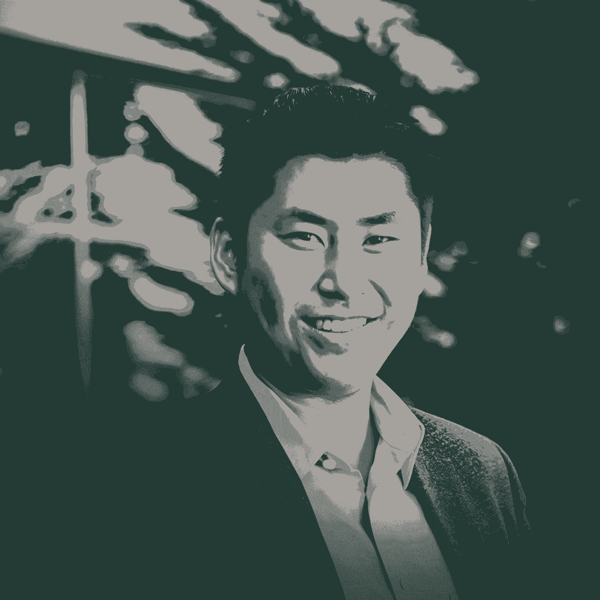

# 我们所知道的一些最敏锐的人最喜欢的 40 个面试问题

> 原文：<https://review.firstround.com/40-favorite-interview-questions-from-some-of-the-sharpest-folks-we-know>

在第一轮，我们总是在寻找那些被忽视或没有被分享的建议，希望找到那些公司创建者甚至不知道要翻过的石头。

无论是通过面对面的活动，在 First Round Network(我们内部的 Quora 式平台)上的在线讨论，还是我们在这里分享的关于审查的文章和采访，我们都有一个雄心，那就是为创始人和初创企业领导人创造交流“[被困](https://firstround.com/review/manifesto/ "null")知识所需的空间。

在这些空间里，我们一次又一次地看到，谈话如何不可避免地回到一个单一的话题。无论是[快速通道](https://fasttrack.firstround.com/ "null")导师结对，亲密的[联合创始人论坛](https://medium.com/@firstround/apply-to-first-rounds-first-ever-co-founder-forum-ebf0634a6896 "null")晚宴还是[首席技术官非正式会议](https://firstround.com/review/the-best-advice-we-overheard-at-first-rounds-cto-unconference/ "null")，**招聘似乎总是最受关注的**。

从[寻找规模](https://firstround.com/review/how-gusto-built-scalable-hiring-practices-rooted-in-tradition/ "null")的招聘实践到[引进新的高管](https://firstround.com/review/assembling-an-executive-leadership-team-is-daunting-let-thumbtacks-ceo-help/ "null")再到[找到优秀的内部招聘人员](https://firstround.com/review/Asana-Head-of-Talent-on-the-secrets-to-finding-a-great-startup-recruiter/ "null")，从这些挑战中受益匪浅。然后就是面试了。

当你快速扩张，以极快的速度前进，并且坐在几个招聘小组里，面试看起来就像是你必须完成的任务。但是值得停下来想一想的是，雇佣一个人的决定是一个昂贵且影响深远的决定。既然你不得不在(最多)相处几个小时后做出决定，那么在这宝贵的几分钟里尽可能多地了解候选人就变得更加重要。

当然，我们在过去的评论中分享了大量的面试最佳实践。(我想到了两个特别的必读书目:[帮助你雇用一名顶级员工的七个特征](https://firstround.com/review/hire-a-top-performer-every-time-with-these-interview-questions/ "null")和之前分散在评估档案中的[面试问题的汇总](https://firstround.com/review/the-best-interview-questions-weve-ever-published/ "null"))。

但是考虑到每一次招聘的高风险性质，面试技巧总是需要提高的。这意味着我们寻找一个非常好的面试问题的努力永远不会结束。我们总是被每个人口袋里的查询表深深吸引，这种查询表让你想把它偷出来放在自己的招聘工具箱里。

# **为此，我们在过去几个月里联系了我们网络中一些最聪明、最有想法的运营商，提出了一个简单的问题:**你最喜欢的面试问题是什么，为什么？

我们得到的回应是一流的。接下来是一份 40 个面试问题的独家清单，由我们见过的或完全钦佩的最敏锐的人发给我们。有些问题(看起来)简短而甜蜜，有些是试探性的和出乎意料的，有些则取决于有针对性的跟进。按主题分类，他们处理了从候选人如何理解角色和处理反馈到他们的第一份暑期工作、最差老板以及他们最后一次改变主意的所有事情。最重要的是，这些不可思议的创始人和公司创建者分解了*为什么*他们依赖这些问题——以及在你听到的答案中寻找什么。

我们希望这个集合作为一个丰富的起点，你可以在设计自己的流程时利用它，无论你是从头开始构建它，还是在加倍招聘时希望给它一个更新。让我们开始吧。

***得到一个自己最喜欢的面试问题？在 Twitter 上告诉我们或者*** ***[分享到这里](https://firstround.typeform.com/to/gnJSAU "null")*** ***。我们将整理出最好的投稿，与*** ***[第一轮评论简讯订阅者](https://firstround.us5.list-manage.com/subscribe?u=dbca87c0c0a96a01ae10f5a13&id=d9bb43e05b "null")*** ***分享。***

# 有助于解开 PIVOTAL 过渡的问题:

# 1.你想在下一个角色中做些什么不同的事情？

当他问这个问题时， **Instacart** 联合创始人 **[Max Mullen](https://www.linkedin.com/in/maxmullen/ "null")** 通常会看到两种回答——最好的候选人通常属于一个阵营。

“我发现最好的答案强调了他们正在朝着*前进的方向*，而不是他们在当前工作中从开始*前进的方向。如果他们开始谈论他们不喜欢老板或当前公司的地方，那会告诉你很多。它测试他们是否是一个积极的人，以及他们如何处理逆境，”马伦说。*

“我还可以经常了解他们对我们公司的具体兴趣，并了解他们做了多少研究。最后，它涉及到动机——如果他们提出他们如何寻找更具挑战性的机会，你可以探究他们希望如何产生影响，或者他们喜欢解决的问题类型，”他说。

# 2.想象一下三年后的自己。与现在相比，你希望自己的哪些方面会有所不同？

**[朱莉卓](https://www.linkedin.com/in/julie-zhuo/ "null")** 是我们的最爱是有原因的。脸书公司的产品设计副总裁写了一本关于初任经理如何组建团队的书。她以前也曾在评论中增色不少，分享了她对招聘设计师的独到见解，以及每个经理都应该问的基本(也是独特的)问题。

Julie Zhuo, author and VP of Product Design at Facebook

她在书中写道:“在一个成长中的组织，招聘好员工是你能做的最重要的事情。”。“关于招聘，要记住的最重要的事情是:**招聘不是一个需要解决的** ***问题*** **而是一个为你的组织打造未来的机会**。”

最近，我们采访了卓，在[招聘了数百名应聘者](https://www.linkedin.com/pulse/ive-hired-hundreds-people-facebook-here-how-i-do-julie-zhuo/ "null")之后，她最喜欢的问题是什么，她的回答也同样关注未来。“让应聘者描述一下她对自己未来三年发展的愿景，有助于我了解应聘者的抱负，以及她是如何以目标为导向和自我反省的，”卓说。

# 3.对于你最近待过的几个公司，带我过一遍:(一)你是什么时候离开的，为什么离开？(二)你加入下一个的时候，为什么选择它？

**[凯文·韦尔](https://twitter.com/kevinweil "null")** 喜欢用独特的镜头穿越候选人的近期职业史。“我喜欢这个问题，因为它有助于我理解他们如何思考重大决定，”Libracryt currency 的联合创始人兼脸书 Calibra 产品副总裁说。

韦尔发现，通过剖析人们离开和加入公司的原因，他学到了很多关于潜在动机的东西。“他们在哪些方面进行了优化，使职业发展最大化？他们是在寻求安全，还是渴望冒险？”他说。“他们是在努力发展新技能，还是完善现有技能？他们的目标是扩展他们的管理经验，还是回到执行中去弄脏自己的手？”

韦尔建议特别注意应聘者是如何拼凑出答案的。“观察他们是将答案编织成一个叙事弧线，还是勾勒出一系列不同的决定，这很有趣，”他说。“他们想的是大局吗？他们很会讲故事吗？”

转场也是 **[分公司](https://branch.io/ "null")** CEO **[亚历克斯·奥斯汀](https://www.linkedin.com/in/ajaustin/ "null")** 最喜欢去的地方挖矿。他说:“我发现，在工作间隙，人们必须完全独立地做决定。“没有任何团队成员可以让他们窃取荣誉，或者为他们工作。在他们的职业生涯中，这是唯一一次你可以非常深入地了解他们的想法和动机的机会。然后，你可以根据你认为该角色成功所需的特征来评估他们的答案。”

让求职者告诉你工作之间的转换，而不是每一个。这是一个更好的窗口，让我们了解他们重视什么，以及他们如何做出决策。

# 找出动机的问题:

# 4.在你共事过的人中，你最欣赏谁，为什么？

从表面上看，这个问题似乎不是为了揭示动机。但这正是朱尔斯·沃尔特在采访中提出的问题。

Jules Walter, product lead for monetization at Slack

作为[天使投资人](https://angeltrack.firstround.com/meet-the-angels/jules-walter "null")、Slack 增长和货币化团队的产品负责人和[CodePath.org](https://codepath.org/ "null")的联合创始人，Walter 一直忙于追求他所关心的事业——他有兴趣了解更多推动人们加入他的团队的价值观。

“我想发现一个候选人的价值观，但我发现直接问这个问题没什么效果，”他说。”这个问题以一种更微妙但诚实的方式引出了那些司机。他们欣赏别人的什么能告诉你很多他们认为重要的东西。”

问一问应聘者她欣赏谁，你会对她的价值观了解得更多。这是对她努力培养自己的品质的有力一瞥。

# 5.告诉我一次你意想不到的主动。追问:能再讲一个吗？

布莱恩·罗森伯格是一位成长大师。作为 Eventbrite 的前增长副总裁(也是 defy.vc 的现任投资人)，他的[分享了最棘手的增长问题的答案](https://firstround.com/review/answers-to-your-tough-questions-about-growth-learned-while-scaling-eventbrites-5b-growth-engine/ "null")和从零开始一直到 IPO 的屡试不爽的策略[。](https://firstround.com/review/from-zero-to-ipo-how-growth-needs-to-evolve-at-every-startup-stage/ "null")

因此，毫不奇怪，他的面试问题有助于他发现那些推动个人发展的候选人。“我发现你团队中最优秀的人总是采取主动，即使他们没有被期望这样做，”Rothenberg 说。"**但在他们给出一个主动行动的例子后，关键是要接着问另一个例子。我希望看到一种模式，无论是在工作场所、学校还是其他任何地方**

# 6.你现在或以前的工作有什么了不起的地方？为什么？

bethanye McKinney Blount 是公司建设智慧的源泉。在她的职业生涯中， [Compaas](https://www.compa.as/ "null") 的联合创始人兼首席执行官(以及 Reddit 和脸书的前工程负责人)分享了从[排除创业文化中的麻烦制造者](https://firstround.com/review/reddit-and-facebook-veteran-on-how-to-troubleshoot-troublemakers/ "null")到[引入公司透明度](https://firstround.com/review/opening-up-about-comp-isnt-easy-heres-how-to-get-more-transparent/ "null")的各种见解。

bethanye McKinney Blount, founder and CEO of Compaas

“在面试中问这个问题告诉我两件不同的事情，”布朗特说。“首先，我了解人们喜欢和重视什么——对他们来说什么是重要的。其次，他们几乎总是用一个限定词来跟进，”她说。“他们经常会说‘但这并不能弥补……’之类的话，所以他们也会告诉我一些他们不喜欢的事情。我觉得第二篇很有教育意义。这有助于我理解他们在哪里感到不舒服、不受支持或总体上不开心。”

# 7.你工作的动力是什么？

这一条来自比特币基地公司的前高级工程师总监 Varun Srinivasan(在那里，他坐在公司的前排，从另一边走过来，带来了一系列宝贵的经验教训)。

“从表面上看，这是面试官要问的一个简单问题。但这需要受访者进行大量的思考和自省，”斯里尼瓦桑说。“我发现它的不对称性质引发了有价值的讨论。**优秀的候选人将能够清楚地表达他们的内在激励因素，并反思他们之前为什么在初创公司工作，或者回想他们为什么想要进入这家公司。不那么优秀的候选人不会陷入这种自我探究。**他们会提供表面的答案，比如“我喜欢硬技术挑战。”"

联合创始人兼首席执行官 **[波特·布拉斯韦尔](https://www.linkedin.com/in/porter-braswell-7a097560/ "null")** 选择了一个类似的开放式问题:**成功对你意味着什么？“我发现问这样的问题会让应聘者停下来思考，”布拉斯韦尔说。“这有助于推动更有机、更自由的对话，让我了解受访者，以及与浏览简历相比，是什么在更深层次上推动她。”**

# 8.回顾过去五年的职业生涯，有什么亮点？

据 **[迈克尔沃恩](https://www.linkedin.com/in/michaelvaughan/ "null")** 说，这个问题比看起来更厉害。“它告诉我他们是什么类型的人，对他们来说什么是重要的，以及他们是如何思考的，”Venmo 的前首席运营官和 Oak HC/FT 的现任 EIR 说。

“例如，如果他们告诉我一项个人成就，那么我知道个人职业发展是一个巨大的关注领域。如果他们告诉我直接下属或团队的成就，那么我知道他们关心员工的发展，”沃恩说。“如果他们告诉我一个公司的成就，那么我知道他们将自己的成功与公司的成功联系在一起——这是一种度过创业初期的良好心态。”

# 关于他们是否适合该角色的问题:

# 9.你真正擅长什么，但再也不想做了？

[VSCO](https://vsco.co/ "null")公司的首席商务官布莱恩·梅森很喜欢这个问题，因为它让应聘者做三件事:

Bryan Mason, Chief Business Officer at VSCO

反思他们对自己的了解。

测试他们谦逊地谈论自己“擅长”某事的能力

谈论那些你可能在他们的简历上发现有价值的东西，事实上他们不再想做的事情。

“令人惊讶的是，人们经常回答说，他们从来没有想过做我招聘的这个职位，”他说。

有不可思议的候选人擅长于你招聘的工作。问题是他们不想再做了。

# 10.在你的角色中表现出色的人和杰出的人有什么不同？

在面试 LendingHome 的候选人时，联合创始人兼首席执行官马特·汉弗莱(Matt Humphrey)希望敏锐地了解 A+表现和他所说的“A++”之间的区别。

“我总是接着问:‘你能给我一些你职业生涯中这方面的具体例子和你看到的结果吗？’“我寻找他们如何回答问题，就像寻找答案本身的内容一样，”他说。最好的候选人几乎可以立即回答，甚至可能带着一丝苦笑，因为他们确切地知道我在说什么，他们为做了一些真正超越的事情而自豪。"

# 11.你是如何准备这次面试的？

当他问这个问题时， **[乔纳·格林伯格](https://www.linkedin.com/in/jonahgreenberger/ "null")** 正在测试三样东西:主动性、足智多谋和激情。

“这些品质对几乎任何职位都至关重要，”Bright(第一轮融资公司)的首席执行官说。“我也喜欢这个多用途问题如此开放。这为候选人展示自己的简洁、创意和清晰提供了空间。”

# 12.你认为在我们这里，你能在个人或职业上取得什么样的成就，而在世界其他任何地方你都做不到？

**[希瓦·拉贾拉曼](https://www.linkedin.com/in/shivarajaraman/ "null")**(**[WeWork](https://www.wework.com/ "null")**的首席技术官，Spotify 的前产品副总裁)通常会在面试周期的最后问这个问题。

“我喜欢它，因为候选人在一个回答中揭示了他们的个人动机、创造力和对我们使命的承诺，”拉贾拉曼说。“通常，他们没有真正深入考虑我们的公司或能力。这里的答案可以揭示我们是否真的是最合适的。这也有助于巩固我们是一个特殊的地方，让人们茁壮成长。最重要的是，如果候选人能够清晰地表达自己的抱负，以及我们如何帮助她实现这些抱负，我们就离接近她更近了一步。”

关于为什么有人想在这里工作并承担这一特殊角色的问题可能看起来很平常，但却非常重要。通常，候选人都在逃避其他事情，还没有深入思考自己接下来想要什么。

作为 **[Looker](https://looker.com/ "null")** 的企业沟通经理，一家[的公司在引进新人方面投入了巨大的思想和精力](https://firstround.com/review/the-inside-story-of-how-this-startup-turned-a-216-word-pitch-email-into-a-2-6-billion-acquisition/ "null")， **[塔玛拉·福特·约翰](https://www.linkedin.com/in/fordtamara/ "null")** 同样建议挖掘是什么让候选人对他们面前的特定机会充满激情。“我总是问应聘者，‘为什么要在这里工作’*****？为什么你觉得自己会擅长** ***这个*** **的职位？她说。*****

***“我发现，为什么有人会被你的公司吸引，并相信他们会在某个职位上取得成功，这一点往往被忽视。令人难以置信的是，我见过多少次在面试中回答这些问题时人们摔倒了。”***

# ***13.这个函数最重要的三个特征是什么？在这些特质中，你会如何从最强到最弱排列自己？***

***当杰克·科劳兹克为 WeWork 的产品团队招聘员工时，他寻找的候选人既要对自己的职能有深刻的理解，又要对自己仍需改进的地方有所认识。***

***“我在招聘产品经理时会问这个问题，但它也适用于其他职能部门，”他表示。“我发现，这迫使求职者进行自省，并举例说明自己是这门手艺的学生。”***

# ***14.说说你理想中的下一个角色？从责任、团队和公司文化的角度来看，它有什么特点？它没有什么特点？***

***

Square's Alyssa Henry*** 

***作为**[Square](https://squareup.com/us/en "null")****[的卖方和开发商业务部门的负责人，艾丽莎·亨利](https://www.linkedin.com/in/alyssa-henry-0905692/ "null")** 忙得不可开交，因此在招聘过程中快速发现一致或不一致的能力至关重要。她发现，与其直接询问候选人对某个特定角色的兴趣，不如抽象出他们理想中的下一个角色，一个抓住他们真正追求的场景，这很有帮助。***

***这个由两部分组成的问题有助于确定对这个角色的期望是否匹配。她说:“特别是当你听到他们不是在寻找什么的答案时，有时你会意识到候选人实际上更适合不同的角色。“但我最喜欢的部分是，它给了你在接近候选人时需要抓住的卖点。你已经知道他们看重的是什么，这让你更容易调整自己的推介。”***

# ***15.现在是 2020 年 9 月 5 日。自从你加入以来的一年里，你对公司产生了什么影响？***

***联合创始人兼首席执行官 **[Jay Desai](https://www.linkedin.com/in/jdesai01/ "null")** 在为 [PatientPing](https://www.patientping.com/ "null") 招聘时，希望让求职者谈论未来，一旦他们得到这份工作，安顿下来并开始产生影响，这个世界将会是什么样子。***

***

PatientPing's Jay Desai*** 

***以下是他从这个问题中学到的东西:***

***德赛说:“我发现，这能让人们了解候选人认为事情应该花多长时间。“来自大公司的人认为事情比他们应该做的要花更长的时间，而来自更小、更激进的初创公司的人可能希望比他们应该做的更快。”***

***他们关注的焦点在哪里:“你可以从他们如何描述假设的影响中学到很多。它们是否以结果为导向，用数字来描述它们的影响？”德赛说。“也许他们更注重过程，用他们成功建立的系统来描述他们的影响。更加以人为本的候选人会谈论组织将如何成长，团队将如何发展。”***

*****对角色的理解:**如果候选人在描述他们希望实现的目标时，与你的预期相差甚远，那就是在用不同的方式表达。德赛表示:“这测试了他们对这一角色的内在化程度，以及公司要求他们解决的问题。”。***

***一旦候选人正式加入团队，消除对职位和招聘经理期望的其他误解的工作就不会停止。为了继续加强关系和相互了解，德赛依靠一个令人难以置信的战术框架，为富有成效的员工/经理关系提供了基础— *[点击此处](https://firstround.com/review/the-indispensable-document-for-the-modern-manager/ "null")* *了解更多信息。****

# ***关于与他人合作的问题:***

# ***16.告诉我你与你的经理意见相左的一次经历。你做了什么让他或她相信你是对的？最终发生了什么？***

***当我们调查我们的深思熟虑的创始人和经营者网络时，一些人提到这是他们最喜欢的面试问题。由于他们每个人都有不同的重点和要点，我们在这里结合了一些观点来强调为什么这个问题如此有冲击力。***

***

Stripe's Cristina Cordova*** 

***先说 **[克里斯蒂娜·科尔多瓦](https://twitter.com/cjc "null")** 。她加入 **Stripe** 成为第 28 名员工，也是第一名业务拓展员工。除了加入第一轮的[天使跟踪计划](https://angeltrack.firstround.com/ "null")之外，她还领导了多个团队，涉及业务发展、金融合作伙伴关系、合作伙伴工程和多元化&包容职能——这意味着她已经完成了招聘工作。***

***由于一些原因，这个问题成了她在面试中的必答问题。“它向我展示了一个人为了做他们认为正确的事情可以走多远，”科尔多瓦说。“候选人选择讲述轶事的方式也向我展示了他们如何在困难面前说服他人。他们使用数据吗？他们会从别人那里获得支持吗？”询问最终发生了什么也特别能说明问题。她说:“他们如何谈论不按自己的方式行事，可以告诉你很多关于他们是否愿意不同意并承诺执行的信息。”***

*****[Opendoor](https://www.opendoor.com/ "null")** (以及 Yelp**[的前销售 SVP)的现任人力和开发主管 Erica Galos Alioto](https://www.linkedin.com/in/erica-galos-alioto-9140832/ "null")** 也倾向于这个问题。“我想看看候选人如何处理工作环境中的冲突，”她说。“他们会公开解决这个问题，并将意见分歧视为一种优势吗？还是他们看不到对方的视角？他们是试图解决它还是默默地让它困扰他们？这告诉我很多关于他们有效沟通的能力，以及他们将如何处理工作中与他人的分歧。”***

***前 **Airbnb** 工程副总裁 **[迈克尔·柯蒂斯](https://www.linkedin.com/in/curtismike/ "null")** 也热衷于探究应聘者如何处理面试中的分歧。“我喜欢这个问题有几个原因，”柯蒂斯说。“首先，很难给出一个简单的答案。我还发现，它在许多方面给了我候选人性格的重要信号，它提供了有用的数据点，可用于以后的背景调查。”***

***柯蒂斯通过有针对性的后续调查更深入地探讨了这个话题，深入了解了与老板的分歧是如何发生的:***

***你的经理的推理是什么？***

***你认为支持这个决定的有说服力的论据是什么？***

***你反对的理由和最有说服力的论据是什么？***

***你最终是对的吗？***

****除了分享他更多的关键问题(“想一想你不得不在一个项目上偷工减料，以一种你并不引以为豪的方式在截止日期前完成的时候。你是怎么处理的？”)，柯蒂斯在这篇评论文章中列出了将面试重点放在文化和性格上的技巧，以及在官僚主义开始之前打破官僚主义的建议。****

# ***17.说说你职业生涯中遇到过的最好和最差的老板。有什么不同？***

***作为 four square**[的首席执行官，Jeffrey Glueck](https://www.linkedin.com/in/jeffglueck/ "null")** 发现应聘者通常不会为这个问题做准备。“他们经常透露是什么让他们在答案中打勾，”他说。“虽然最好的答案很有意思，可以让我了解如何让他们获得最大的增长，但我经常发现，最差的老板答案更有意思。你可能会发现，他们对微观管理反应强烈，非常独立，或者非常注重个人薪酬。”***

***关键是促使候选人变得具体。“不要用含糊的回答让他们离开，”Glueck 说。“当然，他们不必指名道姓，但你需要坚持让他们谈论具体公司的两位具体老板，而不是泛泛而谈。”***

# ***18.你希望将前一家公司文化中的哪一部分带到下一家公司？你希望*而不是*找到哪一部分？***

*****[Ben Kamens](https://www.linkedin.com/in/ben-kamens/ "null")**,**[Spring Discovery](https://www.springdisc.com/ "null")**的创始人兼首席执行官(同时也是 [Khan Academy](https://www.khanacademy.org/ "null") 和 [Fog Creek Software](https://glitch.com/about/fog-creek-is-now-glitch/ "null") 的校友)发现，这个问题是一个有效的方法，可以探查候选人在与他人合作时是否考虑周全，揭示他们对团队动力和文化如何相互作用的理解。***

***“他们会不成熟地抱怨过去队友的失败吗？他们是否深思熟虑地考虑了为什么会存在某些问题，成熟地讨论了他们之前的公司必须做出的权衡？”他说。“他们能思考为什么一个公司或行业的问题或文化可能不适用于另一个公司或行业吗？”***

# ***关于从错误中学习的问题:***

# ***19.你上一次对重要的事情改变主意是什么时候？***

***对于[东岩资本](http://eastrockcap.com/ "null")董事总经理莎拉·费特来说，这个面试问题都是关于进化的。***

***“它让你看到候选人的信仰体系或核心价值观是如何改变的，以及是否发生了改变。一个强大的经历或有影响力的人是如何改变候选人的世界观的？”她说。“接着问更多的问题，了解他们在被挑战之前、之中和之后的感受——这将告诉你很多东西。”***

# ***20.你从同龄人身上学到的最重要的东西是什么？你是如何在日常生活中运用这些教训的？***

***这个出自 **[丹石板](https://www.linkedin.com/in/dslate/ "null")****[财富前线](https://www.wealthfront.com/ "null")** 产品管理总监。他说:“我在寻找一个候选人的能力，即识别他们周围的人身上的超能力，他们希望改善自己的能力。***

***“我喜欢这个问题，因为它让我能够评估他们的自我反思和成长心态。根据他们给出的答案，这也可以成为一个很好的窗口，让你了解他们有多谦卑。”***

# ***21.告诉我一次你真的把事情搞砸了。你是如何处理的，你是如何解决这个错误的？***

***前 Etsy 首席执行官查德·迪克森(Chad Dickerson)在 Reboot**Reboot**公司担任首席执行官的顾问。***

***

Chad Dickerson, coach at Reboot and former CEO of Etsy*** 

***他指出，这也提供了对以前角色的责任范围的更深入的了解。迪克森说:“一个人的范围越大，错误就越大，对这些错误的补救就越复杂。”***

# ***22.告诉我你犯错误或失败的一次经历。你从这次经历中学到了什么？你能给我举另外两个例子吗？***

***作为 Glossier 的校友，陈·扎克伯格倡议和产品搜寻， **[科利·休斯](https://www.linkedin.com/in/corleyhughes/ "null")** 有很强的团队建设能力。招聘时，她喜欢关注应聘者是如何从失败中吸取教训的——但她发现只问一次是不够的。***

***询问三个例子让我对某人的行为和自然的工作方式有了更好的了解。每个为面试做好充分准备的人口袋里都有一个关于从失败中学习的排练过的答案，”她说。***

***“那些能指出自己搞砸了三次的人表明，他们有一个良好的习惯，即客观地看待一种情况，并公开谈论他们会采取不同的做法。我发现这些人倾向于自然地自我纠正，不断学习，并愿意快速分享坏消息，这是我团队的必备条件。”***

***在听答案时，她特别关注候选人是否能够:***

***坦然公开地谈论错误。***

***反思并应用他们所学的知识。***

***证明他们不会把自己看得太重。***

***每个候选人的口袋里都有一个从失败中学习的现成答案。能举出三个不同例子的人是真正的不断学习者——也是你团队中需要的人。***

# ***23.你职业生涯中什么时候情绪最低落？你意识到你当时的感受了吗？你是如何回应的？***

***[Codeacademy](https://www.codecademy.com/ "null") 联合创始人兼首席执行官 **[扎克·西姆斯](https://www.linkedin.com/in/zacharysims/ "null")** (他之前在评论中分享了他的[筹款智慧](https://firstround.com/review/Zach-Sims-of-Codecademy-on-lessons-in-raising-125-million-for-the-first-time/ "null"))正在用这个问题寻找坚韧。***

***“我们在寻找那些知道职业生涯有很多起伏的人，”他说。“你能泰然自若地处理这些问题，与你的团队一起度过低谷，并有希望随之上升吗？有过这种经历的候选人通常能比其他人更好地安然度过初创公司。***

# ***暴露自我意识的问题:***

# ***24.你的同事对你有什么误解？***

***[保护伞公司](https://www.askumbrella.com/ "null")联合创始人 **[山姆·格斯滕藏](https://www.linkedin.com/in/samgerstenzang/ "null")** 曾经[写道](https://qz.com/434516/the-21-management-tricks-i-learned-at-imgur/ "null")不是弱点的存在，而是没有认识到弱点通常会阻碍人们前进——因此，他的面试问题围绕着自我意识。***

***他告诉我们:“我发现这个问题有助于打开候选人的思路。”。“通过询问误解，而不是同事不知道的事情，面试官通常会了解到更重要、更有启发性的真相，同时也能理解应聘者与同事的关系。”***

***根据 Gerstenzang 的经验，误解往往是候选人希望自己或多或少拥有的东西，这有助于理解他们的潜在动机。“一个不太好的答案通常表明自我意识不发达，或者与同事沟通不畅，”他说。***

***询问误解是一个强有力的工具。它既说明了你对自己的看法，也说明了你对他人如何看待你的理解——这两点都很重要。***

# ***25.你比大多数人更擅长什么？你的超能力是什么，你将如何利用它来影响这家公司？***

***花小蕾·萨克森纳有一些非常有见地的面试问题。 **[Brex](https://brex.com/ "null")** 的现任首席客户官(也是 Clever 的前收入副总裁)之前曾[向《评论》谈到，她如何寻找适应力和优先顺序](https://firstround.com/review/practical-frameworks-for-beating-burnout/ "null")来寻找那些有能力战胜倦怠和压倒性压力的候选人。***

***她最喜欢的另一个问题同样跨越了两种品质。她说:“通过询问他们的超能力以及这种超能力将如何具体帮助他们胜任这一职位，你可以了解到候选人的自我意识以及他们准备得如何。如果他们可以根据我们团队关注的内容以及他们如何增加价值来定制他们的回应，我知道他们已经做了功课——无论是对我们公司还是对他们自己。"***

***

Lenny Rachitsky, former Airbnb product lead*** 

*****[莱尼·拉奇斯基](https://twitter.com/lennysan "null")** 也是一个要求候选人分享自己超能力的粉丝。“作为一名经理，重要的是帮助人们发挥他们真正擅长的东西，而不是仅仅试图改善他们正在努力的领域，”他[在他最近关于处理绩效评估的建议](https://firstround.com/review/the-power-of-performance-reviews-use-this-system-to-become-a-better-manager/ "null")中指出。***

***以下是这位前 Airbnb 产品负责人在回答这个面试问题时特别希望得到的答案:***

*****变得深思熟虑和具体**。“最好的候选人会花时间停下来，认真思考一下，”Rachitsky 说。“对我来说，如果他们跳到听起来很老套的答案上，那就是一个危险信号。我希望他们能找到重点，而不是模糊的东西。”***

*****表现出谦逊和真实。**“他们能诚实地指出好与坏吗？我觉得他们是真实的吗？他说:“我在寻找对这个人的优点和缺点的真实见解。“这就是为什么我经常加上这样一句话:‘如果我让你上一份工作的同事告诉我你的情况，我会听到什么？’我发现它总是能触及真正诚实的东西。"***

****Rachitsky 分享了他对超级能力在绩效评估中的作用的看法，强调经理有责任描述其下属的优势，以及如何进一步发挥这些优势。* *[在这篇评论文章中获得他的战术建议(以及非常有用的模板)](https://firstround.com/review/the-power-of-performance-reviews-use-this-system-to-become-a-better-manager/ "null")* *绩效评估如何帮助经理从优秀提升到卓越。****

# ***26.如果我去和那些对你评价不高的人说话，他们会怎么说？***

***这个问题显然是为了探究候选人自我意识的深度。但是 T21 也在寻找另一种品质:移情。***

***自我意识不仅仅是了解自己的缺点。对不喜欢你的人产生同理心——否则你会陷入辩解和逃避中，很难真正将批评内化。***

***

Gabe Otte, co-founder and CEO of Freenome*** 

***“当我向候选人提出这个问题时，我总是希望看到他们对不喜欢他们的人有多少同理心，”Otte 说，他是 **[Freenome](https://www.freenome.com/ "null")** 的联合创始人兼首席执行官(也是第一轮医疗合作的[合伙人)。“他们是回避还是试图证明人们不喜欢他们的原因？还是他们在否认，认为没有人不喜欢他们？”](https://medium.com/@firstround/introducing-the-healthcare-co-op-a-new-resource-for-the-next-wave-of-healthcare-founders-95a7b35f850 "null")***

# ***了解他们如何回应反馈的问题:***

# ***27.你收到的反馈中最难听到的一条是什么？为什么会很难？你是如何处理这些信息的？你对自己了解多少？***

***作为**中型**的人事主管，**[Pema Lin-Moore](https://www.linkedin.com/in/pemalin/ "null")**通常会在面试的职业历史部分问这个问题。“这让我得以一瞥一个人如何回应与他们如何看待自己或他们希望如何被人看到不一致的反馈，”她说。“你可以感受到一个人的自省能力有多强，他们的适应能力有多强，以及他们所处的环境类型。”***

***诺兰·丘奇 也同样建议探究候选人如何处理困难的反馈。 **[Carta](https://carta.com/ "null")** **的首席人事官说:“从这个问题中，我对一个人的了解比我问的任何其他问题都要多。“它让我深入了解需要发展的领域，他们如何回应反馈，以及他们的自省、脆弱和谦逊程度。”*****

***除了提出第 11 个问题，LendingHome 联合创始人兼首席执行官马特·汉弗莱(Matt Humphrey)还提交了另一个非常好的问题，也适合这里，并稍微做了一些改动:“我总是说'**我们会在推荐信中询问这个问题，但我也很想听听你的意见:非常具体地说，你最近收到的关键反馈是什么？他说。*****

***对他来说，问题的前言尤为关键。Humphrey 说:“我发现加入‘推荐人’的评论很重要，因为这往往会带来更诚实的回答。”。“我实际上是在寻找他们了解何时和如何的本质，而不是空洞或抽象的回答。因此，让候选人知道，如果他们打垒球，我在做证明人调查时可能会听到一些不同的声音，这很有帮助。”***

# ***28.想办法在面试中给应聘者反馈。***

***这个问题更少，更有针对性，但它对招聘经理来说是如此有价值的面试建议，我们不得不把它放在这里。是由**[Nova Credit](https://www.linkedin.com/in/nickygoulimis/ "null")**的联合创始人兼首席运营官**[尼基·古利米斯](https://www.linkedin.com/in/nickygoulimis/ "null")** 建议的。***

***

Nicky Goulimis, co-founder and COO of Nova Credit.*** 

***“在每一次面试中，我都试图找到一种方法给候选人建设性的反馈，并观察他们的反应，”她说。“我们如何应对艰难的对话对于我们未来如何合作至关重要，因此测试非常重要。”***

***对于求职者来说，这总是独一无二的，所以很难给出一个放之四海而皆准的建议，但是这里有两个她用来创造一个建设性反馈机会的策略:***

*****对练习的反馈:**“我们的商业面试过程通常包括一个带回家的环节，我们有候选人在场，”古利米斯说。“我们总是在最后为候选人鼓掌，以表达我们的感激之情，但面试小组的每个人都会四处分享反馈，既有积极的，也有建设性的。看到候选人将反馈内化，并在那一刻做出回应，令人难以置信地具有启发性。”***

*****关于他们潜在适合度的反馈:**“在向候选人汇报时，我也会分享建设性的反馈。她说:“我坦率地谈论真正令我兴奋的事情，以及我仍有疑问的地方。“除了展示我对透明度的承诺之外，这也为他们提供了一个机会，在他们仍在被考虑的时候，对这些领域做出反应或提出解决方案。”***

# ***将激情放在首位的问题:***

# ***29.你最讨厌的一件事是什么？***

*****[肖恩·阿什顿](https://www.linkedin.com/in/shawneashton/ "null")****[mindbodygreen](https://www.mindbodygreen.com/ "null")****【以及佐拉公司前业务运营总监】级别这一条在候选人处作为最后一道题。“这有助于我了解这个人是否是一个终身学习者、主动者、天生的好奇心，以及能够自学他们感兴趣的新东西，”她说。“通过强调这不一定要与工作相关，我发现除了他们的直接工作经验之外，我还能对这个人有更多的了解，并以有趣的方式结束面试。”*****

*******[新贵](https://www.upstart.com/ "null")****[的战略和合作伙伴运营主管辛迪·史密斯](https://www.linkedin.com/in/cindy-smith-39a4aa21/ "null")** 问了一个类似的问题，稍微有点曲折:**告诉我一个你主动去了解的话题。史密斯说:“我想听他们谈论一些他们没有接受过正式培训的事情。“它显示了对学习的好奇心和毅力，它帮助我衡量一个人如何应对艰难的话题和新的挑战。”*******

# *****30.你对工作之外的哪些事情充满激情？*****

*****虽然这个问题看起来像是一个标准的了解你的问题， **[劳拉·伯伦斯·吴](https://twitter.com/LauraBehrensWu?ref_src=twsrc%5Egoogle%7Ctwcamp%5Eserp%7Ctwgr%5Eauthor "null")** 将它作为一个深入探究候选人动机的机会。*****

*****

Laura Behrens Wu, co-founder and CEO of Shippo***** 

*******[Shippo](https://goshippo.com/ "null")** 的联合创始人兼首席执行官说:“我在寻找有内在动力的人，而爱好通常是这种动力的一个出口。”。“这些年来，我发现内在驱动的人通常在工作之外有其他的激情，他们以一种痴迷的方式追求这些激情。例如，如果一个候选人告诉我，他们把每天跑 10 英里作为一种爱好，那就是一个强大内在驱动力的信号。”*****

# *****31.你的第一份工作是什么，简历上没有，你从那段经历中学到了什么？*****

*****这个问题是 Maryann Kongovi 的最爱之一。Algolia的运营副总裁说:“这会让应聘者放松下来，并带来关于暑期工作的有趣对话。但这背后也有意图。“我总能更好地洞察他们的价值观和对工作本身的看法。”*****

# *****抛出曲线球的问题:*****

# *****32.为什么我们不应该雇用你？*****

*****Romy Macasieb 发现这个问题是一个有用的(也是意想不到的)挖掘候选人仍有发展空间的工具。“它比你的标准‘你的 3 个改进领域是什么？’要深入得多沃克&公司的创始项目经理和现任产品副总裁说。*****

*****“我喜欢这一点，因为它允许受访者同时扮演两个角色。麦卡西布说:“他们可以强调他们缺少的技能，或者为什么他们可能不是我们想要的，比如说‘如果你想找一个只懂定量分析的人，你就不应该雇用我。’”“但是他们也可以把焦点转向为什么你可能不适合他们。我听到过类似“如果你有开放式办公室平面图，你就不应该雇用我”这样的回答。"*****

# *****33.我们的团队应该做哪些不同的事情来获得 10 倍的改进？*****

*******[梅卡·阿松耶](https://angeltrack.firstround.com/meet-the-angels/meka-asonye "null")** 在 Stripe 领导初创公司& SMB 销售组织，这是一个为风投支持的公司提供商业、货币化和扩张战略建议的组织。“我在寻找那些偏爱行动、能像老板一样思考的人，”他说。"除了他们申请的工作，他们还能从首席执行官的角度思考问题吗？"*****

*****有时候，这个问题会暴露出一些真正的问题。“我们实际上正在考虑试行最近一位候选人提到的一个想法。Asonye 说:“我还采访了一些人，他们提到了一些我们认真考虑过但由于各种原因而放弃的事情。*****

*****但是，当答案不尽如人意时，候选人往往会出错:*****

*******野心不够大**。“我经常听到 10%的改进，而不是 10 倍。Asonye 说:“诱惑可能是提供无争议的、微小的调整过程。*****

*******想不出** ***任何*** **的建议。Asonye 说:“这对我来说是一个很大的危险信号，因为我倾向于在第二轮或第三轮面试中看到候选人，而候选人已经见过 5 到 10 个人了。”。“到那时，他们应该对我们的公司和产品相当熟悉了，所以这通常是他们没有做足功课的迹象。”*******

*****为了解决停滞不前的对话，Asonye 提供了以下指导性问题:*****

*****为什么我们可能无法筹集下一轮资金？*****

*****为什么有人会选择与我们最大的竞争对手合作？*****

*****我们可以介绍哪些对我们的核心客户有价值的产品或服务？*****

# *****34.教我点东西。*****

*****这个开放式的令人惊讶的提示是娜塔莉·麦格拉思在比特币基地担任人事副总裁时的面试工具箱的一部分。“它可以告诉你一个候选人的思维过程，”麦格拉思说。“他们如何通过一个问题进行沟通和推理？它们是从基本原则开始的吗？另一个好处是，我经常能看到他们感兴趣的东西，还有机会亲自学习新东西。”*****

*****凯文·莫里尔 也是这种采访方法的粉丝——多年来，他在问了几百次这个问题后，在这个方法的基础上又进行了彻底的思考。莫里尔是 [Quizlet](https://quizlet.com/ "null") 的工程经理， [Mattermark](https://mattermark.com/ "null") 的前首席技术官，也是 [Buried Reads](https://buriedreads.com/ "null") 的作者，这是一份引人入胜的时事通讯，是我们收件箱里的必读书目。(他与妻子丹妮尔·莫里(Danielle Morrill)合著了这篇文章，丹尼尔·莫里是 Mattermark 的前首席执行官和联合创始人，现任 GitLab 的总经理)。*****

*****当我们问他为什么在采访中喜欢这种方法时，Morrill 已经准备好了 **[这份详尽的谷歌文档解释](https://docs.google.com/document/d/1YRszVlHrB2bE5g_p2y-OB3VX05STECJrrr5H42HLu1k/edit?usp=sharing "null")** **他称之为“五分钟沟通问题**”*****

*****它是这样运作的:莫里尔要求候选人为他分解一个话题。它可以是任何东西——一个爱好，一本书，或者一个项目——但是他们只有五分钟的时间让他从一个初学者变成一个理解这个主题最重要的东西的人。以下是他在他们的解释中寻找的东西的预览:*****

*******感同身受。**作为提出这个问题的面试官，关键是要保持面无表情，尽量减少插话。“一个明星候选人会注意到这一点，并问我是否理解了，”莫里尔写道。“这些人和我们雇佣他们的人一样，同情客户，在他们的所有工作中都考虑到这一点。”*****

*******打比方。**用捷径来解释概念是候选人技能的一个明显标志。“有人在教我扑克基础知识时，我听到的一个例子是利用我玩过西洋双陆棋这一事实，尽管我没有玩过扑克。他谈到了在双陆棋中，棋盘上的所有棋子都暴露了双方都能看到的信息，但在扑克中，你有隐藏的信息，”Morril 写道。“这些类型的解释非常有助于快速简洁地传达一个具有各种含义的想法。”*****

*******花时间停顿。Morril 写道:“一旦好战型候选人开始行动，他们头脑中就没有任何想要表达的东西的列表或大纲。”“最令人难以置信的是，它预测工作中无组织和无目标的行为有多准确。”*******

*****令人惊讶的是有多少考生在一头扎进面试问题之前不会预谋。那些花时间停下来，仔细思考并有一些清晰观点的人是我共事过的最好的人。*****

# *****探究他们思维方式的问题:*****

# *****35.如果你明天接任当前公司的首席执行官，并且必须提高公司当前的增长率，你会投资哪三个领域？*****

*****Jeanne DeWitt 负责 Stripe 的北美收入&增长，因此她最喜欢的问题自然也有增长倾向。但通过让候选人扮演 CEO，她发现了一种用几个不同的变量来评估他们的有效方法。*****

*****

Jeanne DeWitt, Revenue & Growth for Stripe***** 

*****“我发现这给了候选人一个突出自己优势和战略思维的机会，”她说。“但这也为他们提供了一个锻炼同情心的机会。如果他们开始思考自己作为首席执行官的假设行为会如何影响团队，这表明他们对自己的工作方式会如何影响同事或下属有了一定的思考。*****

# *****36.你会如何为正在寻找公寓的人打造产品？*****

*******[Bangaly Kaba](https://www.linkedin.com/in/iambangaly/ "null")**(insta cart 的产品副总裁，Instagram 的前增长主管)给候选人 45 分钟时间在白板上完成这一项。这是项目经理面试过程中[产品感觉](https://medium.com/@jackiebo/five-exercises-to-practice-product-sense-57b9104ef8da "null")部分的一部分——他发现这个看似平凡的假设可能非常困难。*****

*****这就是为什么这是他在面试中最喜欢问的问题之一:*****

*******没有正确答案**。Kaba 说:“作为面试官，当谈到确切的产品解决方案时，我是不可知论者。“我关心的是候选人方法的严谨性、思考的深度和产品结果的连贯性，以及实现这些的框架。”*****

*****与每个人都相关。他说:“许多产品感问题是小众的，与你面试的公司有关，这带有偏见，因为面试官和应聘者之间存在信息不对称。”"但是寻找住房是一种普遍的需求."*****

*******游戏很难。Kaba 说:“即使你事先知道问题，我也可以提供新的约束或变化，类似于项目经理每天面临的即时变化。"它检验受访者是否能从整体上对产品理念进行透彻的思考."*******

# *****37.加快达美乐披萨外卖速度的 10 种方法是什么？*****

*****在比特币基地招聘早期职业项目经理时， **[Max Branzburg](https://www.linkedin.com/in/mbranzburg/ "null")** 喜欢抛出这种意想不到的、与披萨连锁店相关的问题。*****

*****“没有一个正确的答案，但我喜欢这个问题的是，几乎每个人事先都有相同的背景，”他说。“良好的回答表明有能力提出澄清性问题、构建思路、具有创造性和分析性，并考虑技术和运营解决方案。另外，不可否认这很有趣。”*****

# *****颠覆剧本的问题:*****

# *****38.关于在这里工作我能告诉你什么？*****

*****几年前，在我们的首席技术官峰会上，**[Kellan Elliott-McCrea](https://www.linkedin.com/in/kellanem/ "null")**给了[一个令人难以置信的演讲](https://www.youtube.com/watch?v=w4LExVkv4Pw "null")，讲述了 Etsy 如何在一年内将女性工程师的数量增加了 500%([见此处的评论文章](https://firstround.com/review/How-Etsy-Grew-their-Number-of-Female-Engineers-by-500-in-One-Year/ "null")。)所以我们并不惊讶他对采访的理解同样深刻而有见地。*****

*****Blink Health 的前 Eng SVP 和 Etsy 首席技术官发现，我们在科技行业进行面试时使用的基本模式是错误的。"**它假设我们正在为一些宝石挑选一批高性能的技术专家。埃利奥特-麦克雷说:“这在以前可能是真的，但现在已经不是我们生活的世界了。"软件是一个简单的技术项目，但却是一个困难的社会、文化和操作项目."*******

*****以下是他对面试官应该关注什么的看法:*****

*****把面试当成一次协作，确保角色合适是首要任务。确保候选人有积极的经历是第二要务。其他一切都是美好的。*****

# *****39.如果你处在我的位置，你在招聘这个职位时会考虑什么样的品质？*****

*******[NerdWallet](https://www.nerdwallet.com/ "null")** 联合创始人兼首席执行官 **[陈永正](https://www.linkedin.com/in/tim-chen-1722b9/ "null")** 最近分享了他从[如何从新手创始人转变为经验丰富的高管](https://firstround.com/review/nerdwallets-ceo-on-navigating-the-shift-from-first-time-founder-to-seasoned-exec/ "null")的总结，其中浮现出一些关于招聘的特别有趣的见解，包括他如何改进他面试高管的方法，以及他为什么在 NerdWallet 团队达到 200 人之前面试每一个人的惊人诚实的原因。*****

*****

NerdWallet co-founder and CEO Tim Chen***** 

*****当我们追踪他，问他最喜欢的面试问题时，他又提出了另一个有趣的策略:问如果他们在桌子的另一边，候选人会寻找什么。*****

*****“他们列出的一些属性令人惊讶，”陈说。“这有助于你以不同的方式思考这个角色。我还发现，候选人往往会突出自己的优势，所以这给了你一个了解他们的窗口。你还可以了解他们是否擅长将招聘等模糊问题分解成关键驱动因素。”*****

# *****40.我有什么没问你的吗？*****

*****“这个问题让几乎所有人都感到惊讶，”Houzz 的行业营销副总裁 Liza Hausman 说。(这是一个完美的结尾。)*****

*****“我喜欢它，因为它告诉我他们认为什么对他们的技能或经验是重要的。这也让我知道他们是否有自己的面试策略，如果他们打算组建一个团队，这可能会很有用。”*****

********得到了一个自己最喜欢的面试问题？在 Twitter 上告诉我们或者*** ***[在这里分享一下](https://firstround.typeform.com/to/gnJSAU "null")*** ***。我们会整理出最好的投稿，分享给*** ***[首轮评论简讯订阅者](https://firstround.us5.list-manage.com/subscribe?u=dbca87c0c0a96a01ae10f5a13&id=d9bb43e05b "null")*** ***。********