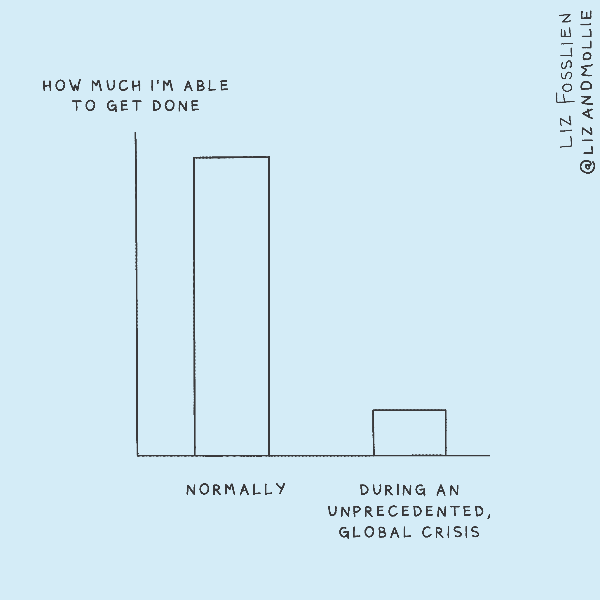

# 处理工作中情绪起伏的 6 个小步骤

> 原文：<https://review.firstround.com/6-small-steps-for-handling-the-emotional-ups-and-downs-at-work>

在一家初创公司，计划和优先事项可能会随时改变。这并不完全是一个突破性的声明——这是一个很好理解并且经常讨论的概念。但很少有人关注的是，每个支点如何带来相应的尖峰，不仅是对创业公司的运营节奏，而且是对参与实现这些壮举的所有人的情绪。

虽然专注和生产力技巧比比皆是，但情绪管理技巧很少在工作场所讨论。因为[在](https://firstround.com/review/weathering-the-emotional-storms-of-a-crisis-a-tactical-guide-for-individual-contributors-and-managers/ "null")打卡时间到了，没有一个整洁的盒子来隐藏你的感受，这可能会产生可怕的后果——特别是在初创公司，声波转换来得很快，所有人都能感觉到。在这些快节奏的工作环境中，情绪会很高，舒适区是一个不常去的地方。

事实是，如果这个话题以前没有被优先考虑的话，现在它占据了中心舞台。**在情绪征服你之前管理和驾驭情绪一直是一项有用的技能，但它从未如此重要。**

也许你是一名创始人，肩负着带领公司度过全球危机的重担。或者是一个负责[转向虚拟事件](https://firstround.com/review/dont-just-throw-together-a-webinar-the-virtual-events-crash-course-you-need/ "null")的营销人员。或者是一位经理努力[支持你的团队度过混乱的时期](https://firstround.com/review/the-managers-guide-to-inclusive-leadership-small-habits-that-make-a-big-impact/ "null")，同时努力[培养健康的远程习惯](https://firstround.com/review/struggling-to-thrive-as-a-large-team-working-remotely-this-exec-has-the-field-guide-you-need/ "null")。或者更普遍地说，你每天都面临着在混乱的外部世界和颠倒的家庭生活中挣扎，这是你工作的背景(现在是变焦背景)。无论如何，你感受到的每一种情绪都在你的办公桌旁，无论你是否意识到。

在这篇评论中，我们已经做了稳定的工作，从经验丰富的创业老手和心理学专家那里收集见解，他们分享了如何更好地管理工作中的情绪。不要害怕——前方没有开始冥想的一般建议。相反，我们将根据我们的专家提供的真实例子，列出一些可以依靠的战术步骤。据他们说，有一件事是肯定的:**你可以采取许多小而有目的的行动来帮助你和你的团队管理情绪，感到精神振奋，从而真正照顾好自己。**

虽然这些建议中有一些是围绕管理团队展开的，但对于任何希望在工作中更有效地弥合情绪和行动之间的差距的人来说，也有很多建议。值得注意的是，这些步骤的目标并不是完全消除情绪——毕竟，我们只是人类。取而代之的是识别和命名它们，以一种积极的方式引导它们，并采取措施更有效地监管它们。

当然，说起来容易做起来难。但是成功校准你的情绪的回报是巨大的。正如我们的专家都同意的那样，良好的情绪管理不仅仅是建立健康的心态和避免精疲力竭。它带来了一种胜利的态度，反过来，随着你周围的世界以闪电般的速度发展，你和你的团队能够更好地合作。

为了找到你今天就可以开始实施的最有效的步骤，我们从一些我们最喜欢的管理情绪的评论文章中收集了一些要点。我们希望——不管你是什么角色——你会发现这些及时的提示既有用又具体。

作为一名心理学家，同时也是 **[Coa](http://joincoa.com "null")** (一家专注于精神健康和社区的初创公司) **[艾米丽·安哈尔特](http://dremilyanhalt.com "null")** 博士、Psy 的联合创始人。d 既是指导创始人驾驭情绪的专家，也是处理所有需要整理的复杂情绪的创始人。长时间的工作、快速做出决定的压力以及寻找资金的压力只是冰山的表面，在混乱的水域中只会显得更大。她对处理这些不适的建议？去健身房——也就是情绪健身房。

安哈尔特认为，就像去健身房加强和保持你的肌肉和身体健康一样，你需要去情感健身房滋养你的心理健康。如果你等到受伤后才拿起哑铃，你会感到困难得多，在危机中认真对待心理健康也是如此。“预防保健至关重要，”她说。

疲惫中工作的能力可以让你从 A 点到达 B 点，但这是不可持续的。不要等这种紧急情况过去——现在就开始你的自我保健。

她所说的自我保健是指提高你的情绪健康程度，以应对这一系列无休止的不适。虽然安哈特专门针对创始人，但她的建议在高层以下也普遍适用。当团队中的每个人都情绪健康时，最强大的公司就会形成。在对心理学家和企业家进行了 100 多次采访后，安哈尔特确定了当你努力变得情绪健康时要体现的关键特征。就我们今天的目的而言，有一点很突出:

## 留意

Dr. Emily Anhalt, Psy.D

安哈特博士的定义是:情绪健康的领导者能够忍受和处理不舒服的事情。他们能够进行艰难的对话，对令人不快的信息保持透明，分享复杂的反馈，并耐心等待问题的解决，直到问题得到充分考虑。

她把这比作瑜伽练习，在瑜伽练习中，你有时会以尴尬的姿势保持身体，这可能会让你暂时感到不舒服。但是在你拿出瑜伽垫开始练习这个棘手的动作之前，花点时间评估一下当你开始觉得自己站不稳时的反应。

有些人在不舒服的时候会责怪其他人。有些人变得内向，对自己非常失望。她说:“了解你对不适的反应会给你更大的力量去改变那种对你不利的反应。

当你坐下来面对自己的不适(并抑制下膝跳反应)后，安哈尔特推荐了四种应对策略。

反思一件你对自己过于苛刻的事情。原谅自己。

想一件本周人们可以为支持你而做的小事。自讨苦吃。

写下你欣赏三个你爱的人的地方。发给他们。

安排一个“焦虑时间”在你的日历上划出一个时间段，在这段时间里，你想怎么担心就怎么担心。

最后一个给我们留下了特别深刻的印象。安哈尔特说:“这听起来有点老套，但如果你安排时间去担心，这意味着你能够在一天的剩余时间里更加专注，而不是不断被焦虑的浪潮所淹没，焦虑的浪潮会影响你与他人的互动。”“当你发现自己变得焦虑时，也许会在凌晨 2:00 在床上辗转反侧，轻轻地对自己说，‘这不是我现在的问题，这是‘下午 6:00 我的’问题。到时候我会担心的。"

你经常犯这样的错误，让自己陷入明天的担忧，而不是处理当下的挑战。你不必要地承受未来的痛苦。

一次又一次，安哈尔特看到她所谓的“预期创伤”使人们陷入情绪失控。她说:“对未来的[情景规划和试图找出如何处理与尚未发生的事情相关的情绪是有区别的。”。“这与问‘如果我们今年的预计收入减半，我的现金跑道是什么？’是不同的以及‘如果我的公司在六个月后倒闭，我该如何应对？’](https://firstround.com/review/the-founders-field-guide-for-navigating-this-crisis-advice-from-recession-era-leaders-investors-and-ceos-currently-at-the-helm/ "null")

你可能会觉得这种焦虑让你更有准备去处理一件棘手的事情。“事实上，这让人们陷入了一种没有实际用处的混乱状态，”她说。她说:“相反，这是关于信任未来的自己——比现在的自己更有能力、更有经验和智慧解决问题的那个自己。”。“我最喜欢的一句表达这个想法的名言是:**‘你只能看到车灯那么远，但你仍然可以这样走完整个旅程。’"**

相信有一个版本的你会更有资格处理任何现在让你焦虑的潜在未来场景。

在这里阅读更多安哈尔特博士关于建立情绪健康的见解。

即使是情绪健康的人也可能会失去立足点——不要把这些工具想象成带你飞向高空的蹦床，而是更多的降落伞，以减缓下降速度，缓冲任何岩石着陆。在像初创公司这样的风险环境中，事情可能会很快失控，在你意识到这一点之前，你会发现自己的情绪直线下降。尽管这很正常，但我们被训练在登录工作前在虚拟门口检查这些情绪。

Liz Fosslien, bestselling author and Head of Content at Humu

输入 **[莉兹·佛斯莲](http://fosslien.com "null")** (如果这个名字听起来很熟悉，你可能会偶然发现[的诙谐漫画](https://www.instagram.com/lizandmollie/ "null")，她是互联网上最受欢迎的二人组[莉兹+莫莉](https://www.lizandmollie.com/ "null")中的一员)。 **[Humu](https://humu.com "null")** 的现任内容负责人和 [Genius](https://genius.com/Genius-founders-rap-genius-is-back-on-google-annotated "null") 的前执行编辑在这里纠正这样一种说法，即情绪最好被视为一封电子邮件，你可以留在收件箱里供以后使用。“我们认为，‘这些是不好的，可怕的，所以我们应该关闭它们’，这延续了围绕情感的有害神话。她说:“事实是，与你的情绪保持一致会让你总体上更聪明。"意识到情绪，以及它们所包含的信号，可能是一种巨大的力量."换句话说，当你在工作的时候，他们不应该被抛弃，而是应该被认可。

关于如何度过危机中的情感风暴，更多具体的建议，请看福斯林今年春天为我们整理的指南。然而，今天我们将关注她去年与我们分享的一个战术花絮。从她的书《没有痛苦的感觉:拥抱工作中的情绪的秘密力量》中，佛斯林提出了一些策略来帮助个人和管理者认识到，*拥抱*并克服我们倾向于回避的情绪——比如螺旋式上升。有时，负面情绪开始时是微小的、无关紧要的刺激。然而，如果不加以控制，它们会溃烂并发展成完全的螺旋状。但是你如何辨别螺旋式上升和普通的烦恼或沮丧呢？

如果你发现自己在想这些极端的词，比如“总是”、“从不”、“灾难”，这通常表明你陷入了消极的思想漩涡，让你把情况搞得不可收拾。

冷静地认识到螺旋的第一波涟漪，可以防止它变成更大的情绪波动。“在你犯了一个错误之后——比如说，你在群发邮件中发送了一个错误——不要想，‘我总是把事情搞砸，我是一个可怕的人。’相反，你可以说，“下次我会更加小心，并以此为契机，展示未来的进步，”她说。

下面是 Fosslien 的逐步指导，让你从这些螺旋中解脱出来，在一个我们大多数人都非常熟悉的例子的背景下——当你的一个团队成员在截止日期前建议一个大的改变时:

**注意困难的情绪。多亏了这个新的曲线球，不要生气地对你的同事发火，停下来观察这种感觉。**

**给每种情绪贴上标签。**描述复杂感受的能力，区分棒极了和开心、满足、激动的能力，被称为情绪粒度。有了团队项目的情感粒度，您将能够意识到，当您最初认为“我感到恼火”时，您真正的意思是“我担心我们没有时间做出这些改变。”在这种时候，佛斯林建议再退一步。“提醒自己:‘这可能与某个特定的人或工作环境无关。发生这种情况是因为我对未来感到焦虑和恐惧。"

了解每种情绪背后的需求。一旦你给每种情绪贴上标签，转换你的视角，明确说出你想要的感觉。问问自己“我想感受什么？”如果你想感到平静和有所准备，而不是焦虑和慌乱，弄清楚你需要做什么来成功放松。这可能会确保稳定性:您希望项目保持在正轨上。

**表达你的需求。**不要说:“我对这种在最后一刻做出改变的要求感到恼火。”试着说，“你的编辑很好，但是因为我们已经到了最后期限，稳定性和可预测性很重要。我们有时间做什么编辑？我们怎样才能做到这样，让我们都开心呢？”

*[在这里阅读佛斯林关于将“致命”情感重新定义为超能力的其他见解。](https://firstround.com/review/these-seven-emotions-arent-deadly-theyre-your-secret-career-superpowers/ "null")*

“在这个过程中的某个时候，人们会认为，要想在办公室里受人喜欢，有一种特定的方式和行为。你本质上是在弄清楚如何以一种对自己不真诚的方式让人们喜欢你，在“工作的你”和你认为自己是什么样的人之间制造距离。这就是为什么我很久以前就决定不戴着这个面具去工作，”Vanessa Tanicien 说。

Vanessa Tanicien, Leadership Trainer and Facilitator at LifeLabs Learning

她指出，随着我们适应远程工作，我们保持这种伪装的能力现在比以往任何时候都更具挑战性。“这是由于一种叫做 **[的东西对](https://www0.gsb.columbia.edu/mygsb/faculty/research/pubfiles/6421/phillips_multiple_roles.pdf "null")** 的整合。你们的身份之前是物理分割的。你过去常常离开家，步行去火车站或坐进你的汽车，然后到达办公室，突然你就“工作了”。然后你下了班，回到“家你”这些界限现在变得模糊了，”她说。

作为 Slack、Peloton 和 Warby Parker 等 700 多家公司的首选培训项目，Tanicien 和 LifeLabs Learning 的团队依靠研究来简化我们在工作场所(尤其是虚拟工作场所)需要的一些最重要(也是最复杂)的人际技能。

“现在保持这些情感障碍要困难得多。当没有更多的线索让大脑知道它在一个地方而不是另一个地方时，维持这种分裂需要大量的精神能量。这种新的融合水平促使人们变得更加真实，并以他们在 T1 之前从未有过的方式出现。作为领导者，你必须为此做好准备。这是你展示真实自我在这里受欢迎的机会。Tanicien 说:“邀请真实不仅能增加参与度，还能让你满足人们的真实需求。”

我们现在共享的这个环境的一线希望是，人们被迫脆弱地联系，实际上进行真正的对话——我们无处可藏，伙计们。

为了获得更多的策略，LifeLabs 的团队概述了一些他们最喜欢的技术，为围绕情绪的更有成效的讨论创造空间——无论是你自己的还是你的团队的。

## 早点放弃，这样感情就不会蔓延

与你的团队保持深度联系而不跨越到 TMI 的领地意味着在开放和自由卸载之间取得微妙的平衡——这是一条棘手的走钢丝。善意的领导者需要注意情绪传染——领导者的情绪被团队中的其他人“感染”的趋势。“作为人类，我们是彼此的生物反馈机器。我们感受到别人的感受。[情感标签研究](https://www.sciencedaily.com/releases/2007/06/070622090727.htm "null")表明，当你把你的感受用语言表达出来时——无论是在你脑海中默念还是大声说出——它会降低你和他人的情绪强度，**生命实验室的联合首席执行官塔妮娅·卢娜**说。

Tania Luna, Co-CEO of LifeLabs Learning

Tanicien 表示同意。“我不主张领导人在没有意图的情况下变得脆弱。添加额外的背景是至关重要的，尤其是当我们[在这个虚拟场景](https://firstround.com/review/struggling-to-thrive-as-a-large-team-working-remotely-this-exec-has-the-field-guide-you-need/ "null")中远距离工作的时候。否则，人们可能会对你选择做或分享某件事的原因做出否定的解释。她说:“这是汉伦的剃刀在起作用。

“一开始就用意图陈述告诉人们原因。使用这样的短语，“我分享这个是因为，”或者“这就是为什么我认为你需要知道这个。”例如，不要只是说“对不起，我今天有点心不在焉”，而是说“我今天有点心不在焉，我告诉你这些是因为我想确定我的行为没有引起任何焦虑。或者你可以直截了当地说，“我今天感觉很低落，我把它分享出来，这样就很清楚了，我们所有人都有不好的日子，这没什么。”"

## 询问扩展问题，以确定问题所在并寻求您的支持

Massella Dukuly, Leadership Trainer at LifeLabs Learning

当涉及到业务时，领导者可能是挖掘数字的专家——但当涉及到量化团队的感受时，这种度量驱动的方法通常会止步不前。“作为领导者，我们倾向于问一些非常宽泛的反馈问题，比如‘事情怎么样？’你需要非常非常具体。特异性将允许我们准确定位问题所在，并了解我们如何补救。LifeLabs 的领导力培训师 Massella Dukuly 说:“我很喜欢 LifeLabs 的一个战术练习，我们称之为扩展问题。

您可以应用扩展问题来促进更具体、可操作的对话，这些对话涉及经常影响我们日常工作的模糊情绪。这里有一个例子:如果你的直接下属看起来不知所措，问问他们的压力有多大，从 1 到 10。假设他们回答 8。使用这些扩展问题来确定您可以如何提供帮助:

什么能让你从 8 分变成 7 分？

10 分看起来怎么样？1 怎么样？

是什么让成绩不差？

上一次配乐感觉好是什么时候？那次有什么不同？我们今天如何应用它呢？

当我们假设我们的团队会要求所有的事实或铁定的计划时，我们低估了他们。人们通常只是在寻找关爱文化的迹象——我们会在他们身边，如果有什么不对劲，我们会为他们创造一个分享的渠道。

*[了解更多 LifeLabs 团队关于对包容性领导产生重大影响的小习惯的建议。](https://firstround.com/review/the-managers-guide-to-inclusive-leadership-small-habits-that-make-a-big-impact/ "null")*

“更快乐的人更成功，更有创造力，更有活力，更有韧性，” **[快乐脑科学](http://happybrainscience.com "null")** 创始人 **[斯科特·克拉布特里](https://www.linkedin.com/in/sccrabtree/ "null")** 说。纵观 Crabtree 在游戏和软件行业的职业生涯，他最终在英特尔领导了自己的工程团队，他发现了他最快乐的同事之间的一个共同点:**他们也是最有生产力的。研究证实了他的观察。**

我们经常错误地认为幸福仅仅是我们是或不是的某种东西。我们没有考虑我们可以采取的具体步骤。那么*我们如何*驾驭这种在办公室内外给我们带来诸多益处的特殊情绪呢？Crabtree 的建议很简单:**优先考虑人。**

“根据对幸福的大量研究，对绝大多数人来说都是如此——当你把时间和注意力放在你的人际关系上时，它们会改善，从而提高你的幸福度。你也提高了应对能力，因为你有了更多的支持。**底线:温暖的关系比我们发现的任何其他单一因素都更能增加幸福感。**

我们幸福的头号因素是我们人际关系的质量。

根据克拉布特里的说法，“快乐是会传染的”这句陈词滥调实际上包含了很多真理。多亏了我们大脑中的镜像神经元，你身边的人可以改变你的情绪。“这些神经元是共情的生理基础。我们天生就能理解彼此的感受和意图。”

这使得士气管理在一家公司变得极其重要，因为一个不开心的人会波及整个团队。类似地，在整个组织中战略性地安排一些满意的高绩效人员可以传播积极性并产生更好的结果。但是，这如何渗透到一个比以往任何时候都更加遥远和孤立的组织中呢？为了实践快乐并促进快乐在整个公司的传播，Crabtree 建议遵循这些简单的步骤，这些步骤在我们基于缩放和松弛的环境中仍然适用:

**练习宽恕。**“有一种说法是，心怀怨恨就像试图用毒药杀死别人，这是真的，”克拉布特里说。“当你原谅某人对你的所作所为时——也许他们让你失望了，或者在某些方面让你失望了——这对两个人都有好处，但你会感受到影响，几乎立刻变得更快乐。所有的关系，如果它们是真实的并且足够长久，都会经历一些坎坷。伟大的关系是那些找到克服这些障碍的方法的关系。这就是你希望你的团队在工作中做到的。”

**庆祝好东西。**“我们都知道在困难时期互相支持是件好事，事实也的确如此。如果有人告诉你他们今天过得很糟糕，而你说，“对不起，我得走了”，这对一段关系是有害的。但事实证明，当事情进展顺利的时候，我在那里更重要。所以如果你说，‘哇，我今天过得太棒了！我说，‘太好了，我得走了’，这更伤害了我们的关系。另一方面，当我准备好击掌并选择和你一起庆祝时，这加强了我们之间的联系。"

**把事情写下来。无论是承诺对你的同事更友好，还是采取切实的步骤来加深甚至是遥远的融洽关系，写下你的意图的行动都令人惊讶地有效。你更快地将信息内化，并且能够更好地回忆起它。“说出你打算何时何地做某事，因为当你说出何时何地时，研究表明你更有可能坚持到底并真正去做。写下之后，大声对别人说出来。有异曲同工之妙。”**

**表示感谢。“这是科学发现的提升情绪的最简单的方法之一，”克拉布特里说。“当你说谢谢时，你增加了自己的快乐。无论你需要做什么来提醒自己在工作中说积极的话，都是值得的。你的同事会受益，你会更快乐、更成功。”**

我认识一位高管，他每天早上都会在左口袋里放 10 便士。每当他感谢某人或表达感激之情时，他就把一分钱挪到他的右口袋里。直到他的左口袋空了，他才会回家。

了解更多克拉布特里关于提高工作幸福感和人际关系的建议。

广受欢迎的高管教练 **[卡蒂亚·韦里森](https://www.linkedin.com/in/katia-verresen-574251 "null")** 在创业界以其有益的[头脑风暴](https://firstround.com/review/The-Brain-Hacks-Top-Founders-Use-to-Get-Stuff-Done/ "null")和战术建议而闻名。在与**脸书**、**斯坦福**、 **Airbnb** 和 **Twitter** 合作的整个过程中，韦里森一直在推动客户采用**丰富的思维**——这种思维赋予你实现愿景的创造力和勇气。韦里森认为，有了它，你的身体、精神和情感能量水平会大幅提升。(请参见下面的便捷图表以获取快速参考。)

关键是当你情绪低落的时候，要变得富足。尽管有很多方法可以达到她所描述的心态，但有两种低提升练习很突出:**注意**和**启动**。

## 训练自己注意更多。

“富足实际上是你在生活中看到更多的能力:更多的选择，更多的选择，更多的资源。这要从注意更多开始。“问题是我们的生理机能是*而不是*来注意事物的，”韦里森说。“只是我们的大脑被设计成能看到它已经在寻找和相信的东西。例如，如果你的信念是‘这是不可能的’或‘我做不到’，那么任何与你相矛盾的东西都会被扔出去。”

像最好的习惯一样，注意需要经常锻炼。最佳养生法:当你感到匮乏时，问自己以下开放式问题:

如果我以不同的方式经历这种情况，我会注意到什么？

我有什么选择？(注意:这不是质疑你是否有选择，而是承认你肯定有。)

如果我在这里发现了一些有用的东西，会是什么呢？

如果这个看似不可能的任务实际上是可能的，我的下一步逻辑行动是什么？

在这种情况下什么是正确的？

我想知道那会是什么样子...(填写一个似乎存在于可能性范围之外的动作。)

我可能有哪些我还没有发现的资源？

## 准备好你的思想来定下基调。

启动是参与任何提升你情绪和精神能量的活动。当然，正确的睡眠、良好的饮食和锻炼是其中的一部分，但它可以比这更具体——就像花五分钟看让你开心的照片一样简单。“如果你的态度实际上决定了你的眼睛能够看到的信息(或者你的大脑认为他们看到了什么)，那么你必须准备好你的精神状态才能看到更多，”Verresen 说。

这是早上最重要的一件事，但也是你感觉自己进入稀缺模式的任何时候——当你的身体收缩或心脏开始跳动的时候。当这种情况发生时，能够快速换挡会让你的幸福和创造力大不相同。

启动让你控制自己，决定你想成为哪一个版本的自己。

她说:“我辅导那些经营大公司的人，他们依赖‘权力板’——他们把巅峰经历(最好是过去的胜利)的照片堆在手机上，这给了他们所需的精神休息，并把他们的精力转移到正确的方向上。”“这听起来不太可能或不自然，但有时你不必相信魔法会起作用。”

但是，不要在长途跋涉后从山顶上拿出你最喜欢的照片，或者只是在道路变得崎岖不平，你感觉你失去了对方向盘的控制时才看祝贺邮件。以下是韦里森认为效果最好的一些启动练习:

**幽默。阅读或观看一些你知道会让你发笑的东西。在工作中，幽默和创造力之间有一种已被证实的科学联系。)**

**回忆。**这就是电源板派上用场的地方。你有经历和你爱的人的照片吗？或者它可以记录过去的重大胜利——一些看似不可能的事情被完成了。任何带你去一个快乐的地方，并提醒你在更高层次上你所重视的东西。

**配乐。**有些歌曲或声音必然会让你产生积极的联想。当你情绪低落的时候，玩玩它们，你会感觉到改变。

**运动。**起床。走到哪里都行。呆在一个地方会让你陷入同样的思维模式。

**对于外向的人来说。**找一个能提供不同观点的思想伙伴。和一群让你感到快乐和支持的人在一起。

**适合内向的人。找一个安静的地方休息一下，远离喧嚣。呼吸并享受这份宁静。**

要开始养成这个习惯，试着在你的日历上增加一些短时间，提醒你要么快走，要么播放你最喜欢的歌曲。韦里森提出了这些有研究支持的一天中的时间:**“上午 11 点和下午 4 点往往是精力下降的时候，这些在这些时候变得特别有用，”她说。**

在她看来，灌注很像白天回到大本营充电。“要明白，感到疲惫或绝望不是你的错——这只是一种情绪——没什么大不了的。放下自己的案子，专注于做下一件有建设性的事情。”

在每一个瞬间和互动中，你都有选择自己想要成为什么样子的自由。一个真正优秀的领导者知道——没有任何情况或现实迫使他们以某种方式行动。这给了他们自由。

*[点击此处了解更多关于韦里森情绪管理的技巧。](https://firstround.com/review/the-remarkable-advantage-of-abundant-thinking/ "null")*

管理不善的情绪往往是一种慢火，如果不加以控制，会导致我们都想避免的事情:爆发。当锅烧开时，争斗接踵而至，每个参与其中的人都不得不事后收拾残局。著名的心理治疗师埃丝特·佩雷尔 每天都在剖析这种冲突。作为一名著名的夫妻治疗师，她还将目光转向了另一种不同(但同样重要)的关系类型——联合创始人——在全球范围内为公司和初创公司担任首席关系官的[。在她的热门播客“](https://www.wsj.com/articles/esther-perel-is-bringing-therapy-to-the-corner-office-11573813809?mod=searchresults&page=1&pos=1 "null")[工作怎么样](https://howswork.estherperel.com/episodes/prologue "null")”中，她深入探讨了这些棘手的动态

Esther Perel, psychotherapist, bestselling author, TED speaker and podcast host

无论是关于权力和控制、尊重和认可的争吵，还是缺乏亲密感，佩雷尔都对成长中的公司突然出现的情感冲突——以及如何努力解决这些冲突——有着独到的见解。尽管她的策略是针对共同创始人的，但它们适用于所有形式的关系。“当我们不同意或试图给出负面反馈时，我们往往会诉诸最糟糕的冲动，”她说。“这种趋势让我们面临着将小规模争吵演变成全面战争的风险。”

现在澄清一下——佩雷尔并不提倡完全避免争吵或分歧。在创业公司的运营或工作中，几乎有数不清的决策会与职位描述发生冲突。她指引我们的是重新构想我们如何在这些冲突的时刻战斗——进行温和的对打，而不是试图结束一场 TKO 拳赛。

对 Perel 来说，这是关于在保持情绪控制的同时，找到应对冲突的战术方法。方法如下:

注意什么在起作用。要打破消极心态——不断寻找缺点和不足——开始每天记录你的同事做的所有积极的事情。提升他们做对的事情，而不是关注他们做错的事情或者让你烦恼的事情。他们为你欣赏的公司做了什么？没有他们，你将无法完成什么？做一周的清单。

不要用厨房的水槽砸它。处理冲突的典型方式是不断抱怨，但一点用都没有。这就是为什么有人开会迟到会升级为一场关于他们没有尽到自己职责的大吼大叫。这是一种想法，当一场战斗开始时，我会把我一直反对你的一切都扔进去。就是这种感觉，你甚至不记得当初是怎么开始争吵的。不要开始谈论过去三年你所经历的一切。一次专注于解决一个问题。

**避免人物被暗杀。**消极归因理论的近亲:如果我做错了什么，那是间接的，与某个情况有关，比如因为堵车而迟到。但如果我的同事也这样做，我会把它与他们的性格联系起来，看他们作为一个人的表现——就像他们对公司不那么投入。尽可能经常地为你的共同创始人的行为考虑暂时的和间接的解释，就像你为自己的行为所做的那样，从而跳过这些类型的争吵。

**弄清楚你是战斗、逃跑还是冻结。我们处理冲突的方式各不相同。一些人变得暴躁并猛烈攻击，而另一些人则向内退缩并退缩。也许你越守口如瓶，这个人就越会生气，因为你已经十分钟没说一句话了。如果你建了一堵更大的墙，这可能会让你的联合创始人拿出一个更大的火箭筒来推倒它。了解你们各自的冲突管理风格，并在下一次冲突爆发前就此展开对话，这样你们就能更好地合作。**

不要用范畴来说话。像“你总是”或“你从不”这样的陈述应该从你的词汇中剔除。我们倾向于将我们的经历和感受与事实混淆，并将指控作为事实而不是你的经历呈现。相反，你可以说，“你可能不知道，但是此时此刻，感觉你一直在做这件事。”

**启动 10 秒拍摄时钟。**霍华德·马克曼(Howard Markman)的预防和关系增强项目(PREP)研究强调，当人们处于冲突中时，他们在开始反驳之前不会听某人的论点超过 10 秒钟。当你一口气说出一打投诉时，你可能会意识到这一点，但你的同事只锁定了一个投诉。所以，尽量保持简短。然后暂停。然后让他们向你反映你刚才说的话。

佩雷尔说:“当关系恶化到极点时，就会发生冲突。不要回避棘手的话题，也不要等到紧张局势升级。”。

我们公开的论点没有那些情节背后更广泛的主题重要。不要理会你们争吵的噪音，深入挖掘，找出表面之下发生的事情。

*[在此了解更多关于 Perel 辅导数百个人和职业关系的第一手经验。](https://firstround.com/review/how-to-fix-the-co-founder-fights-youre-sick-of-having-lessons-from-couples-therapist-esther-perel/ "null")*