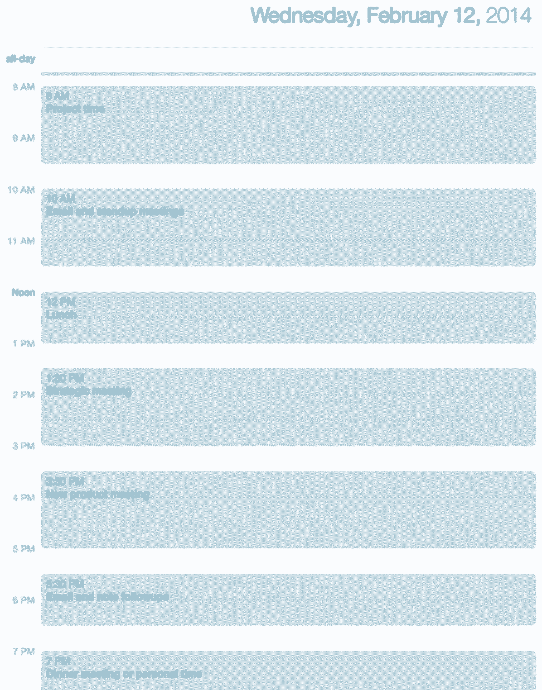

# 70%的时间可以更好地利用——最佳 CEO 如何充分利用每一天

> 原文：<https://review.firstround.com/70-of-Time-Could-Be-Used-Better-How-the-Best-CEOs-Get-the-Most-Out-of-Every-Day>

科技公司首席执行官平均每年工作 300 天，每天工作 14 个小时。一年就是 4200 个小时。大多数其他科技领袖和初创公司员工的数据也相差不远。听起来时间很长，但对大多数人来说，这还不够。将近 30%的时间花在电子邮件上。另外三分之一的时间花在会议上——研究表明，其中一半的时间完全被浪费了。

看看一个典型的首席执行官的时间表，整整 70%的时间是次优的，我会用我自己的经验来证明这一点。在作为合伙人加入第一轮之前，我曾担任三家公司的联合创始人兼首席执行官，包括 [LiveOps](http://www.liveops.com/ "null") 。今天，我每周会见几十位创始人，帮助他们壮大团队，从他们自己和他们的同事那里获得更多的生产力。他们知道他们应该利用每一个小时来推动他们的公司前进，创造伟大的产品，达成交易，雇佣最好的候选人。许多人就是找不到时间。那么，我们如何变得更好呢？

今年，在我们的年度 CEO 峰会之前，我花了几周时间，采访了一些我认识的在管理时间方面做得非常出色的人。我的目标是捕捉他们使用的工具、技巧和窍门，让每一个工作时间都有价值。下面，我分享了对他们和我都有效的八个策略，所以我们都可以停止浪费时间和错过机会。

# 1.说不。

随着你的公司变得越来越突出，你只会得到更多的东西。越来越多的人通过 LinkedIn、电子邮件、联系邀请、去喝咖啡、寻求帮助。是被剪纸害死的。不可避免的是，一个 20 年前儿时的熟人，你几乎不记得他，会要求你介绍你在脸书所有有影响力的朋友。这时候你必须说，“不。”

拒绝太难了。这很难，因为你想向前支付。这么多人帮过你。你也想这么做。但你必须在某个地方划清界限，有办法让它变得更容易。

尝试说“不”的模板——在你发现自己说“不”的所有常见情况下的固定回答。[我第一次听说这个想法是从企业家和投资者马克·苏斯特那里得到的](http://www.bothsidesofthetable.com/2010/05/17/learning-to-say-no-to-meetings/ "null")，它为我节省了不可估量的时间和焦虑。这里有一个例子:

嗨，比尔，

很高兴接到你的电话。希望一切都好。幸运的是，我的公司正在起步，我面临着实现一些宏伟目标的巨大压力。很遗憾，我现在无法连接。

最好的，乔希

这可以让你把时间和注意力投入到精心准备的回应中。你不必每次都这么做。最重要的是你关上了进一步沟通的大门。以如实解释情况的方式做得很好，但不要让事情没有结果。

当你有了一批模板，你可以对销售人员说不。当你没有筹集资金时，对投资者会议说不。投资人做很多介绍。你不必把它们都拿走。董事会成员会随机提出要求。你不必同意所有的建议。为每一种情况写一个模板，包括 LinkedIn 上的消息。甚至是你失散多年的朋友发来的想要见面的邮件。最终，你会需要它的。

# 2.做一个邮件忍者。

对于那些没有看过 SaneBox 的人来说，我是他们的超级粉丝——这太简单了。这就像谷歌优先邮箱，超级增压，与你的 iPhone 配合良好。它设置了一个批量文件夹，将所有的批量邮件从收件箱中取出。任何不需要你亲自阅读的东西，你永远也看不到。它既准确又节省大量时间。

另一个最近产生巨大影响的工具是[超人](https://superhuman.com/ "null")，它帮助我和我认识的许多人在 50%的时间里查看收件箱。产品非常注重性能和键盘快捷键，整体速度比 Gmail 快。你也可以打开一个设置，让你一点击发送就将邮件存档，让你在一天结束时拥有一个更整洁的收件箱。

我认识的大多数非常高效的首席执行官都优先考虑零收件箱。请想一想邮政邮件。你会拿起你的信，看一封又一封，然后再放下，只是为了一次又一次地拿起又放下吗？这就是精神错乱的定义。然而，这正是我们大多数人处理电子邮件的方式。我观察过电子邮件忍者使用三种方法:

**整天。**你的收件箱总是开着的，你可以随时处理收到的邮件。你反应极快，但很难专注于需要深入思考的项目。

**批次**。你每天看两到四次邮件，然后浏览所有内容。

**援助。你可以得到一个全职或虚拟助理的帮助，他可以帮你整理邮件，标出哪些是真正重要的，哪些需要行动，哪些不需要。当然，你需要建立一个私人收件箱，但这会让你的整个生活加速。**

如果没有助手，我推荐批量路线。它可以让你在需要的时候专注于电子邮件，并给予其他任务应有的关注。不断的上下文切换会让你在任何事情上都很平庸。

另一个让你的电子邮件技能更上一层楼的方法是安装一套插件。像 [Asana](https://asana.com/ "null") 这样的任务管理器通常都有，允许你将电子邮件移入和移出任务管理器。这是一种快速将邮件从收件箱中删除的方法，但不会影响你的注意力。

**经验法则:**如果你能在两分钟内回复或处理任何邮件，那就立即去做。如果它需要超过两分钟，把它移到你的任务管理器中稍后处理。当你这样做的时候，你就有能力区分任务和邮件的优先级，你的收件箱不再拥有你的时间。

最后，也许你能做的最有用的事情是使用 [TextExpander](https://smilesoftware.com/TextExpander/index.html "null") 或其他快捷工具。它允许你用速记打字，然后让它神奇地用准备好的短语填写一封电子邮件，只需快速击几下键。

# 3.管理你的能量。

不久前，普通人每天走 12 英里。现在我们坐下。我们经常坐在一起。我们坐了这么久。它对我们如此有害，以至于《哈佛商业评论》称之为我们这一代人的吸烟。如果你在技术行业工作，你平均每天坐着 9.3 个小时。这比你睡的还多。作为人，我们注定要移动。它对我们的健康至关重要，也是我们高效工作的能力。以下是该部门的三个快速窍门:

[七分钟锻炼。这是经过科学证明的。《纽约时报》已经表态。你在 7 分钟内做 12 个练习，这很有效。](http://well.blogs.nytimes.com/2013/05/09/the-scientific-7-minute-workout/?_php=true&_type=blogs&_r=1 "null")

**参加步行会议**。几乎每个人都有一对一的会议。建议散散步，而不是坐在会议室或咖啡店里。

要求一张立式办公桌。现在大多数办公室都满足了这些要求。事实证明，它们可以降低心脏病和癌症的风险，提升情绪和警觉性。如果你真的致力于日常运动，试试步行桌。

管理你的能量不仅仅是身体上的。这也是关于理解你的心理节奏。我们都知道睡眠节奏，深度睡眠和健康快速眼动周期的重要性。但是我们也没有注意到这些节奏是如何贯穿我们一天的。为了利用 upcycles，你需要像短跑运动员一样制定你的时间表。在你最清醒的时候划出一到两个小时，用它们来完成你的三件头等大事。

这里有一个 CEO 日程表的例子:

他们安排早上做最有创意的项目。研究表明大多数人在早上最有创造力。之后处理电子邮件和站立会议，然后在一天结束时处理电子邮件。请注意，在这些计划的块之间有中断，以便在其间保持最佳聚焦。

当你需要休息的时候，你真的需要休息。去散步。听舒缓的音乐。做一些与工作无关的事情。与你办公室的人交谈，发现他们与工作无关的事情。

# 4.构建行动手册。

对于任何你做三次以上的事情，详细写下你的过程。制作可以交给其他人的剧本，这样他们就可以完全按照你的方式来执行。永远不要被那些询问下一步是什么或者应该向谁询问流程的人所阻碍。

这就是为什么[优步](https://www.uber.com/ "null")发展如此之快。他们已经发展到 70 多个城市，并且在所有的城市都消灭了它。他们是怎么做到的？带着战术手册。他们有一个列表，列出了他们在每一个城市发布时要做的事情，并有轻微的地区调整。他们练习过这个方法，测试过，并且都写了下来。所以现在他们只是执行，就像转动钥匙一样。

把做出惊人之举的人写下来。创业公司做得还不够。

我见过的在规模化方面最成功的创业公司是那些在早期将他们的共同行动和核心程序系统化，并在成长过程中养成习惯的公司。

# 5.在外部会议上表现出色。

你遇到过多少次对你的生意很重要的人，却没有带走你可以用来发展关系的知识？这可能是任何人，从业务发展伙伴到客户。可能很难听到，当你走出去的时候，你会失去很多他们告诉你的东西。你为他们提高表现的机会很小。

要打破这种模式，你需要了解他们的职业挑战。

如果你没有，你就要问他们。如果你在 B2B 领域，你的客户的客户要求什么？你如何帮助他们应对这些挑战？

我们中有多少人能列出客户面临的三大职业挑战？

要真正从会议中获得最大收益，你必须将个人和职业联系起来。不一定要很深。这可能就像问他们是否马上要去度假一样简单。当他们回答这样的问题时，记下来。在会议之外，给自己一个再次接触的机会，通过个人接触来建立并加深这种联系。例如，如果一个联系人喜欢骑自行车，给他们发一条你发现的很棒的自行车路线。这带来了革命性的变化。

# 6.在内部会议上表现出色。

创业公司往往会开很多会。太多了。少吃点。最容易干掉的一个就是状态会议。你不需要经常和你的团队开会来提供一轮更新。让他们写下来。把它放在谷歌文档里，让每个人每周读一次。

在你决定会议结果之前，永远不要离开。

在决策会议上，快速做出可逆的决定。初创公司的大多数决策都是可逆的，但我们为此痛苦了太久。当你们走到一起，得到正确的数据和正确的人，并朝着一个决定前进。

对所有决策会议都这样做，除非它真的是一个不可逆转的决定。花更多的时间，进行更多的对话，让你的顾问和董事会参与进来。否则决定并执行。作为一家初创公司，你最大的优势是能够在以后快速改变，因为活动的部分很少。

# 7.利用助手。

技术能让我们更有效率，但它也有局限性。与助理发展关系是值得的，无论是在办公室还是远程帮助你。

像 task rabbit 这样更专注于特定任务的虚拟助手和服务可能非常强大。但是，他们不能拿走你脑袋里面的东西，替你做判断。

如果对你来说可能的话，雇佣一个和你在同一栋楼的全职助理。这可以扩展你的能力，超出你的想象。除了有足够的背景来代表你做决策，他们还可以协调其他服务来做更多的事情。如果不可能有全职助理，那就试试虚拟助理。有很多便宜的服务，比如 Prialto，它们可以帮你减轻很多负担。他们可以订购和发送礼物，记录口述，同时安排许多会议，等等。

尤其是听写，不应该被低估为生产力的重要来源。推荐你安装一个叫 [Voxie 的 app。](https://itunes.apple.com/us/app/voxie-pro-recorder/id294895817?mt=8 "null")你可以打开它，直接说，“给克里斯写封电子邮件”，然后大声说，“嗨，克里斯，很高兴今天早上见到你。谢谢你赶上了。”你的虚拟助理可以很容易地记录下来，当你回到收件箱时，它已经在你的草稿里了。你只需要点击发送。

跟进会议可能会产生巨大的影响，但你实际上多久做一次呢？

现在你可以在离开会议的几秒钟内起草跟进邮件。

# 8.给你的团队带来优势。

我最近采访的一位最有成效的首席执行官对“走动式管理”深信不疑。这正是它听起来的样子。他在办公室里走来走去，一整天都停下来和他的团队成员进行一对一或小组讨论。他问他们:

是什么阻碍了你完成更多工作？

你的阻碍因素是什么？有没有我可以帮你消除的瓶颈或障碍？

什么样的资源或流程会让你以你想要的速度前进？

所以我建议你，找到这些问题的答案，然后为你的团队去做。如果你想让他们模拟速度，你需要自己模拟速度。给他们所需的帮助，让他们在创纪录的时间内完成最好的工作。响应是关键。你仍然可以用一个叫做 [AwayFind](https://www.awayfind.com/ "null") 的工具批量处理你的电子邮件和捕捉紧急请求。每当有人发送高优先级邮件时，您将收到提醒，而不必整天打开收件箱。

很多时候，你会听到人们只是被卡住了。他们对部署一项功能或给一个重要的联系人发电子邮件感到紧张。当一个更大的项目停滞不前的时候，他们正在努力修复一个小错误。当这样的事情阻碍了他们时，你可以问的最好的问题是:失败的代价是什么？如果两百万人中只有两个人会看到一个不完美的新功能，你就不需要在它上面花太多时间。为他们降低风险。当你是一名经理时，这通常是你时间的最佳利用。

在你做的每一件事上都要展示 80/20 法则。这意味着花 80%的时间在重要的工作上，只花 20%在小事情上。让你的团队不再追求完美。所以很多创业公司的员工，尤其是工程师，都希望第一次就把一切都钉得完美无缺。但这不是你想要的。你想要速度。

如果你实现了这些简单的技巧，你就可以把 70%没有最大化的时间收回来。你可以花更少的时间在会议和收件箱上。最重要的是，你可以重新开始领导、激励、达成交易和改变世界。作为一名创始人、经营者、顾问和天使投资人，Bill Trenchard 已经帮助数十家公司启动、管理并取得成功。在加入第一轮之前，比尔带领 LiveOps 实现了 1 亿美元的销售额和数百名员工。他在*[@ btren chard](http://www.twitter.com/btrenchard "null")**发微博。*