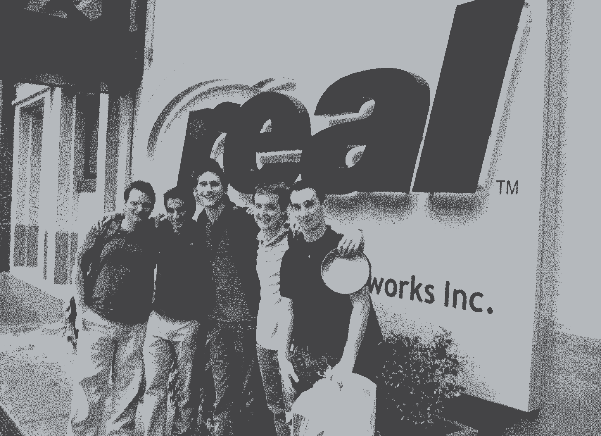

# 90%的反馈都是废话:如何找到下一个大的创业想法

> 原文：<https://review.firstround.com/90-of-feedback-is-crap-how-to-find-the-next-big-startup-idea>

*编者按:这篇文章写于 2013 年。Flatiron Health 于 2018 年被罗氏以 19 亿美元收购。*

当你问成功的企业家如何发现下一个伟大的创业想法时，许多人建议解决你经常面临的一个问题——建立一些“挠自己痒痒”的东西 T2 熨斗健康中心的联合创始人纳特·特纳有一种不同的方法。他建立了一套独特的方法来系统地寻找下一个伟大的东西，而不是他所谓的“有远见的创始人”

这种方法以前已经成功过一次——他的第一家公司 Invite Media 在 2010 年以 8000 万美元的价格卖给了谷歌[。现在他又回来了，创办了他的第二家风险投资公司——熨斗健康公司。他最近筹集了第一轮 800 万美元，由第一轮](http://allthingsd.com/20100609/googles-final-price-tag-for-invite-media-81-million/ "null")(即美国)和[谷歌风险投资](http://www.gv.com/ "null")牵头。

# 特纳的整个过程可以归结为几个关键步骤:

从感兴趣的领域开始，寻找任何想法的种子

在行业中疯狂地建立关系网，并且非常认真地对待介绍

创建一个平台，开始向你能找到的任何聪明且相关的人推销这个特定的想法——一定要做细致的笔记并跟进

在每次会议之间调整一下桌面，拼凑一个演示，然后开始推销(预售现在还不存在但将来会有的软件)

找到一个值得信赖的顾问团队，讨论从现场学到的重要知识并获得反馈

继续尽可能快地重复你收到的反馈

希望你足够聪明和优秀去实现它

# 建立知识网络

2007 年，特纳在大学二年级时在 VideoEgg 实习。在一次销售会议上，一位来自潜在广告客户的高管说:“我们想在 VideoEgg 上做广告，但我们没有大型制作公司来制作视频广告。”那天晚上，他和他的联合创始人扎克·温伯格(Zach Weinberg)坐下来，开始思考如何帮助公司快速、经济地制作视频广告。

但是，他们并不只是研究这个想法，或者在在线广告领域与他人随意交谈，而是立即开始推销——这是特纳寻找伟大想法的方法的核心要素。特纳回忆起邀请媒体的早期，“我们向每个人推销。我们向潜在顾问、投资者、潜在客户、朋友和所有人推销。我能记得我们开的数百次会议。”重要的是，这些不是获得投资的推介，而是获得反馈的推介。

在开始提出这个想法后，特纳和温伯格以及他们的另外两位联合创始人尽快制作了一个演示。他们意识到，带些有形的东西给人们看几乎总是更好——因为人们更容易对产品做出反应，而不是抽象的概念。在无休止的推销视频广告创作产品的会议之后，他们收到的反馈开始形成他们可以采取行动的模式。

每次特纳和温伯格研究一个想法时，他们总是在寻找一些关键特征:

这能成为一笔大生意吗？在这个领域有机会建立一个十亿美元的公司吗？

这是可持续的吗？这种想法能变得有粘性并持续一段时间吗？

这有多大的可扩展性？这项业务的规模有多大？它是如何非线性增长的？

“在我们最初的视频广告创意产生的四个月内，我们意识到，基于与人们的交谈，获得足够的广告库存和扩大需求将非常困难。像 YouTube 这样的地方正在变大并控制他们的库存。与小企业合作也很困难——小企业是制作视频广告有问题的客户。这只是一个艰难的过程，”特纳指出。

第一次尝试失败后，两人开始寻找下一个想法的萌芽。大约在这个时候，脸书刚刚发布了他们的开发者平台——这激起了他们的兴趣。纳特和扎克开发了一款与广告相关的脸书应用，并向更多人推介。他们再次采取了尽可能快速地建造和投掷的方法。他们的推销对象之一是 Brian O'Kelley，他现在是 T2 AppNexus 的联合创始人兼首席执行官，之前是 Right Media 的 CTO。

几分钟后，O'Kelley 推翻了他们的想法，并解释了为什么行不通。他们的计划依赖于修改脸书的广告平台。奥凯利告诉他们，脸书永远不会让他们做他们想做的事。但是，他为一个更好的新想法埋下了种子。O'Kelley 认为,“展示广告中的广告交换有很大的机会，将有不止一个，广告网络有自己的库存，出版商有自己的库存，代理商可能有自己的库存。有这么多库存，需要有人来搞清楚这一切。”

那次会议之后，特纳和温伯格推出了新产品:展示广告的通用购买平台。他们再次制作了一个演示，并开始向任何愿意听他们的人推销。

Invite Media's early team from their first summer in 2007.

# 俯仰和迭代

这种强化推销和倾听的方法面临的挑战是，你会得到大量的反馈。市场会告诉你很多事情:有些是对的，有些是错的。作为一名企业家，你的工作就是把信号从噪音中分离出来。

要成为一名优秀的企业家，你的头脑中需要有一百个相互矛盾的数据点，并且仍然能够做出决定。

这就是天赋。特纳解释道:“如果你想成为一名成功的企业家，最重要的事情就是能够接受来自所有这些人的相互矛盾的反馈，其中许多人厌倦了或者有坏习惯，还有一些人说得很对。你必须能够坐在那里，把这些信息提炼成有价值的东西。困难的部分不是想出点子；它是对你所有的信息进行提炼，其中 90%都是垃圾，最后找出什么是好的 10%，并认识到好的 10%可能会根据行业的不同而迅速变化。”特纳和温伯格专注地寻找有价值的 10%，构建一个演示，推销它，然后尽可能快地重复迭代过程。他们甚至在会议间隙的几个小时里调整演示和幻灯片。每次特纳参加一个新的会议，他都会用上一次会议的新反馈来更新会议记录。他目前的公司，熨斗健康，是在甲板上版本号 30(与工作软件现在！).

他们像建造 Invite 一样开始建造熨斗的过程:选择一个普遍感兴趣的领域，在这个例子中是健康。Turner 解释说，“我们的第一个想法是第二意见网站，第二个想法是临床试验匹配工具，第三个想法是商业智能工具。在过去的一百天里，它已经改变了一百次。”

# 不是所有的介绍都是一样的

持续推销想法的基本要素之一是找到合适的人来推销，然后以有意义的方式与他们联系，使他们的动机与你的一致。特纳专注于寻找最有价值的人来推介(他在 Trello 和 Asana 跟踪了这一点)，然后做艰苦的研究工作，努力获得高质量的介绍。在实际的会议中，特纳和/或温伯格在他们的 Moleskine 笔记本上记录了细致的笔记，然后将它们转移到 Evernote 上(特纳发现在会议中让电脑开着太分散与会者的注意力)。会议结束后，他们会进行一次事后分析来分析推介。他们从中提取最有价值的信息，并开始处理会议中的所有行动项目。

除了会后下载，特纳还热衷于跟进。在会议期间，每个行动项目都标有星号，以确保没有任何遗漏。“在 24 小时内，你必须回复你安排会面的那个人，感谢他们抽出时间，尽可能让他们更容易地提供价值，比如介绍。令人惊讶的是，有多少人就是不遵循这个简单的步骤。”当有人主动提出为他做介绍时，特纳会发送一封简洁的电子邮件，很容易转发给他们的目标，如果合适的话，附上一页纸，让跟进变得简单。他还使用 Boomerang 来确保如果没有收到回复，他会得到提醒。“如果你努力跟进，”特纳说，“你会比 90%的创业者更有效率。”

# 信任圈

在会见数百人的过程中，特纳和温伯格利用了一组值得信赖的顾问。他们不是那种典型的“有名无实”的顾问，他们的名字被扔进一张宣传牌里吹嘘一番。更确切地说，这些顾问在这个想法提炼过程中充当了一个探测板。

在邀请媒体的案例中，布莱恩·奥凯利、大卫·布鲁辛(Monetate 的创始人兼首席执行官)、乔希·科佩尔曼和其他几个人都在早期扮演过这个角色。每隔一周，特纳都会与这群密友非正式地联系，分享来自市场的新信息，并获得对所暴露的重大战略问题的反馈。他们用股权来补偿这个顾问圈子(如果这个人还不是投资者的话)，以使他们的激励与新公司一致。在整个公司建设过程中，重大的战略问题都被记录在谷歌文档中。特纳和温伯格还在谷歌文档中跟踪他们谈话中出现的任何产品功能以及任何未解决的问题，以便随时参考。

# 领域专长被高估了

特纳和温伯格的最后两家公司都位于他们在创业之初所知甚少的领域。你经常从投资者那里听到“领域专业知识”的重要性，但特纳并不真的相信。他发现，虽然一点经验——大约不到几年——会有所帮助，但大多数时候这实际上是一种伤害。特纳说:“举例来说，如果你是一名医生，我认为你很可能会成为一名有问题的企业家，因为你太习惯于行业的约束、整个系统的运作方式和激励机制，以至于你无法看透混乱的局面。你还花了 5 年多的时间获得了过量的特定技能，而不是创业所需的多样化技能。显然也有例外，但这更像是一场硬仗。”

Turner 的方法是投入大量的时间来了解一个领域，通过推销知识渊博的顾问，创建轻量级但精致的演示，并不断改进过程，这是一种收集有用的领域专业知识的方法，而不会积累在一个行业工作几十年的偏见。相反，你可以利用数百年积累的集体经验，走出去，去推销，去推销，去获得最好的知识。