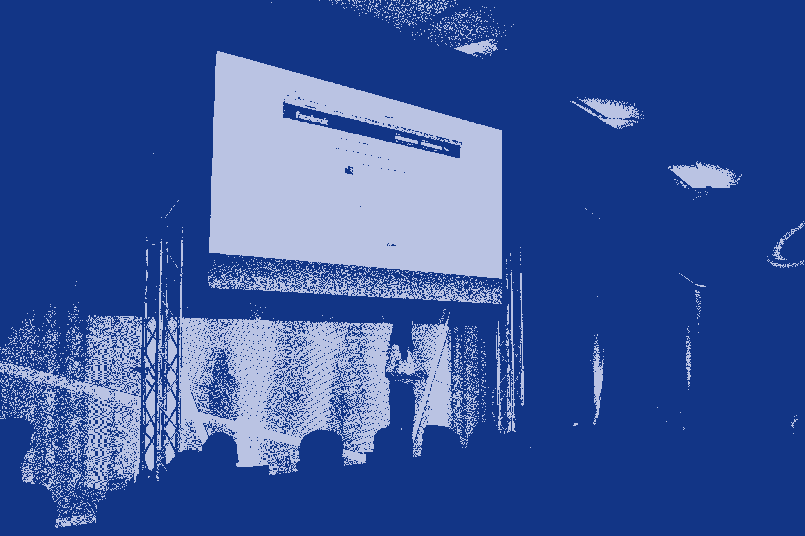

# 脸书雇用设计师的方法内幕

> 原文：<https://review.firstround.com/An-Inside-Look-at-Facebooks-Method-for-Hiring-Designers>

大约八年前，22 岁的朱莉·卓(T1)开始在脸书(T3)工作。当时，她不知道自己将从事什么工作，也不知道公司将何去何从。但她喜欢它的能量，喜欢每个人一起向前突破的方式。如今，作为[的产品设计](https://www.linkedin.com/pub/julie-zhuo/22/113/35b "null")总监，她觉得自己能够与公司一起成长——结果，塑造了几个让脸书独一无二的流程。

其中一个决定性的过程是雇佣一些世界上最好的设计人才来思考人们在网上进行的复杂而微妙的互动。卓已经看到了硬币的两面:如何为一个成熟的公司雇佣设计师，以及从一开始就应该寻找什么。

“在一家初创公司，你需要你的第一个或两个设计师是多面手——多面手，”她说。“他们不仅需要深刻理解和思考产品战略，还需要有良好的互动能力和良好的视觉感受，因为他们将做从设计 UX 到思考品牌再到设计图标的一切事情——他们需要拥有多样化的技能。”

在这个独家采访中，卓分享了如何发现、采访和保护非凡的设计师——包括那些难以捉摸的瑞士军刀个人谁可以做到这一切——以及任何规模的初创公司如何应用这些原则来建立自己的防弹设计武库。

卓认为，找到符合你需求的理想设计师需要两个步骤。首先，你得找到有前途的候选人(她贯穿了三个具体步骤)。第二，你需要决定他们是否适合你的团队——这可能比看起来更棘手。

# 第一阶段:寻找优秀的候选人

**做侦探**

“这就是我们如何聘请我们最早的设计师，”卓说。

她建议从整个团队中寻找喜爱的应用和产品清单——不仅仅是那些商业上成功的应用和产品，甚至是那些具有伟大视角的小应用或想法，选择那些展示你正在寻求建立的相同技能和交互的应用和产品。

“阅读产品上带有你喜欢的元素的小字——比如一个特别有效的 UX，或者一个创新的功能，或者一个非常精致、做得很好的导航系统，然后在谷歌、LinkedIn 和 AngelList 上搜索，直到你找到它们背后的人。”这样做之后，关键是不要太害羞而不敢伸出手。人们喜欢收到粉丝的来信，不管他们做什么工作。

**接入设计网络**

“即使是现在，设计社区仍然相对较小，”卓说。“事实上，它如此接近和连接可以对你有利。”例如，每当一个新的设计师加入脸书，她总是会问:“你过去和谁一起工作过？你愿意和谁再次合作？”

在某些情况下，尤其是如果你在一家初创公司，你很有可能会与你在像 [Dribbble](https://dribbble.com/ "null") 或 [Behance](https://www.behance.net/ "null") 这样的网络上找到的人签订设计合同。一旦你找到了你喜欢一起工作的人，但你不能全职雇佣他们，他们可以成为你进入更广泛的设计师网络的入口，这些设计师更有可能理解你的设计语言和目标。

**建立关系并保持耐心**

一个好的搜索需要时间和人际关系的能量。当你在招聘那些主要根据激情项目和学习机会来做决定的设计师时，尤其如此。

“有时候，我们会接触一位我们非常喜欢其作品的设计师，开始一段随意的对话。这就是你了解别人的方式。这不仅仅是:好吧，你想和我们一起工作吗？因为有时候人们正在做他们当时真正感兴趣的项目，”卓说。“但如果你有这种联系，以后时机成熟时，你可以让他们加入。”

# 第二阶段:面试过程

**看货**

在招聘过程的早期，脸书将潜在的候选人带到现场，向设计团队成员展示他们的作品。亲眼目睹作品是重中之重。

不看作品就谈不上设计。

卓表示:“我不会根据有关技能组合的谈话来聘用任何人。”她仍建议进行一到两次电话筛选，以确保从文化或经验的角度来看，招人是值得的。“你必须看到他们做了什么，这样你才能亲自解剖它。”

出于这个原因，empahsis 更多地被放在候选人的背景上，而不是面对面的测试、脑筋急转弯或白板上。

至关重要的是，你的招聘团队要仔细审查设计师作为其作品或以往工作经验的一部分而开发的应用、网站或产品。候选人和工作都要能承受。为了确保他们看得透彻，卓向她的招聘团队提供了一份清单，以分析所提交工作的质量:

**想法:**“他们为什么从事他们所从事的工作，背后有坚实的理论基础吗？它是否发现了一个真正的问题并试图解决它？”

**可用性:**“好用吗？设计是否考虑周全，是否清楚该产品的工作原理？设计师是否很好地掌握了常见的模式和交互？”

**工艺:**“设计师是否为端到端产品的所有细节，无论大小，都付出了汗水？有没有一种最终产品制作精良的感觉？我们要找的不是功能性的东西。我们希望产品能让人们感觉到它的制造者关心他们和他们的个人体验。高品质和工艺对我们来说极其重要。”

“我们不想让这些演示太正式，就像他们在一大堆人面前演讲一样——这更像是，嘿，我们很想了解更多关于你的背景，你是如何走到现在这一步的，以及你告诉我们的这个项目让你兴奋的地方。你最引以为豪的是什么？”卓说。她看到人们把精心制作的主题演讲放在一起。但是她也有一些人带着他们过去工作的文件夹来这里，并就此进行讨论。

“在一些最好的情况下，候选人会附上他们工作的早期草稿或草图，这样他们就可以谈论他们考虑过要做的不同事情，以及为什么他们最终会这样做。”

所有这些都可以告诉你很多关于未来同事的事情。“你要保持事情的开放性，而不是试图让人们抓住问题或‘对或错’的问题，”她说。“这样你会更了解一个人。”

如果他们的工作信号是积极的，你就找到了一个非常有前途的候选人。脸书甚至在收购设计师团队时也应用了这些原则:当谈到将软件设计团队[沙发](http://www.madebysofa.com/ "null")和基于位置的应用 [Gowalla](http://en.wikipedia.org/wiki/Gowalla "null") 引入内部时，“这是因为我们真的很欣赏他们的产品。”

Julie Zhuo presenting at CTO Summit in 2013.

**雇佣一个人，而不是一个程序**

虽然确实从名牌大学和顶级设计项目中招聘人才，但卓强调这只是他们搜索标准的一个方面。重要的是要记住，对于每一个从正规项目毕业的天才设计师来说，都有另一个同等能力的人在独立学习。

“有时候，没有受过传统训练的设计师拥有一种你通常看不到的独创性，”卓说。“我们真的只是在寻找具有极端主动性的人。即使他们去了一所很好的学校，他们也应该有在课堂内外的项目中拓展自己的经验。优秀的候选人会主动尝试、设计和构建自己的产品。”

产品和设计经理想要淘汰那些有着优秀血统的乏味、缺乏创造力的候选人，应该在他们的投资组合中寻找积极行为的指标。

你想要一个在自己生活中寻找机会的设计师:需要解决的问题。本可以更简单的事情。

“你希望有人看到有问题，并想知道为什么没有人想出一个黑客来修复它或一个工具来使它变得容易。然后他们去设计工具。他们在他们的专业意见中包括这一点吗？如果他们这样做了，这是一个好迹象。”

**模拟团队动态**

团队动力不足对任何规模的公司来说都是一个问题，但它能迅速决定一家创业公司的成败。一个超级明星设计师可能不值得一个超级明星自负的潜在致命麻烦。一个害羞但有才华的设计师可能不会经常分享他们的观点，或者主动去做那些需要做而没有被告知的事情。

最后，“你需要那些乐于接受反馈，但也能提炼反馈，对正确的发展方向有自己的看法，包括不同建议的利弊，并能以每个人都能理解的方式表达所有这些意见的人，”卓说。

确定这种性格的最佳方法是在面试过程中模拟团队成员的经历，然后评估候选人的表现。

“我们通常让这个人与团队中的三四个不同的设计师交谈，”卓说，“我们试图尽可能地让它真实，以近似实际合作的感觉:互相帮助，互相看对方的作品，得到对方的反馈和批评，并进行彻底的讨论。”

卓和她的团队要求潜在的设计师在开放式的对话中回顾他们的工作和故事，以了解每天与他们一起工作会是什么样子。在这部分过程中，性格暗示和他们的职业履历一样重要。当候选人不知道谈话的方向时，就很难提供排练过的答案，也更容易陷入他们真实的日常习惯和信仰。

这不仅有助于卓和她的团队评估文化契合度，还澄清了这个人将如何管理和处理问题——包括意外情况。

你可以从设计师的过程中了解到很多，他们是如何开始的，他们是如何奋斗的。

她还建议，让候选人谈论他们熟悉的设计会有所帮助:“你最喜欢在手机上使用什么应用？请告诉我们你为什么认为这款产品设计精良？或者你认为该产品可以如何改进？”

谈到在团队中工作，“这不仅仅是关于最终产品，”卓说。“这也是实现目标的过程，”听候选人谈论他们如何与过去的团队一起完成项目，可以让他们的潜力大放异彩——你可以感受到他们的职业道德和自我意识。

**观察他们的思维方式**

设计师必须具备高层次的分析能力。卓说，合适的候选人应该“有很强的观察能力，而且注意力集中……她真的会批判性地思考你给她的任何产品有哪些地方可以做得更好”。

她建议向候选人提出一个非常大的假设性问题。“假设我们要求你设计一个通用界面，比如厨房炉灶或微波炉。现在，你实际上不会在 30 分钟内想出一个完整的厨房炉灶的设计——但这只是一种看待你如何处理一个大问题的方式:你如何分解它？你如何开始设计？”

一般来说，你不希望应聘者立即进入回答模式。你需要这样的候选人，他会询问并欣赏这些限制，根据他们观察到的人类行为提出独特的建议，并对他们所有的决定给出合理的论据。你希望有人问很多问题，认真倾听，权衡相互矛盾的回答，得出答案。

**扭转局势**

给你的候选人一个机会来评估你的团队到目前为止做了什么——并阐明他们会保留什么，他们会改变什么，以及为什么。

“如果有一种方法可以让设计师使用已经制造出来的产品...看看它目前的状态，然后看看他们有什么要说的，”卓敦促道。“他们会对改变感到兴奋吗？他们认为可以如何改进？他们将如何与您合作来找出最佳设计和解决方案？让他们对你的产品进行评论。这是理解这是否真的非常合适的最简单的方法之一。”

**还有最重要的品质……**

体贴。

真正伟大的设计师的标志是他们所做的每一个决定都是有目的的，有意图的。

为了弄清楚一个人是否真的具备这种品质，卓问了几个她最喜欢的面试问题:

在你的投资组合中考虑一个长期项目。“如果你有两个多月的时间来做这件事，你会有什么不同的做法？你会添加或继续完善什么？”深思熟虑的候选人是那些如此执着于一个项目的人，他们已经思考了很多很多次如何才能把它做得更好。“偶尔你会遇到一些人，他们会说他们最后得到的东西是完美的，他们不会改变任何东西，或者他们会建议非常小的外观变化，这不会给人留下非常周到的印象。”

你在大型团队中工作过吗？“如果一个候选人说是，那么你需要弄清楚他们在这个团队中实际做了什么。问他们:你直接负责哪些决策？对自己的价值和贡献有清晰认识的合作者通常是团队的优秀补充。”

让他们选择一款他们喜欢的应用或产品。“让他们分析为什么他们认为设计它的人做出了他们所做的决定，以及他们是否同意。我们希望有人能够挖掘自己真正热爱的东西，但同时也能看到他们本可以做得不同的地方。”

卓说，最后一个问题特别好，因为它暴露了应聘者的价值观——而这应该是你面试的最终目标。当你让某人评价他们或其他人的工作时，他们肯定会特别关注某件事——它的外观和感觉是否优雅，核心思想是否是一个好主意，或者不同互动的方式。

“我们有很多人问类似的问题，因为你想了解什么对一个人真正重要。这才是关键。”

朱莉卓从斯坦福大学毕业后，于 2006 年开始在脸书担任产品设计师。如今，她管理着新闻订阅、内容、导航和核心移动体验方面的设计和研究团队。她在 [@joulee](http://www.twitter.com/joulee "null") 发推文。