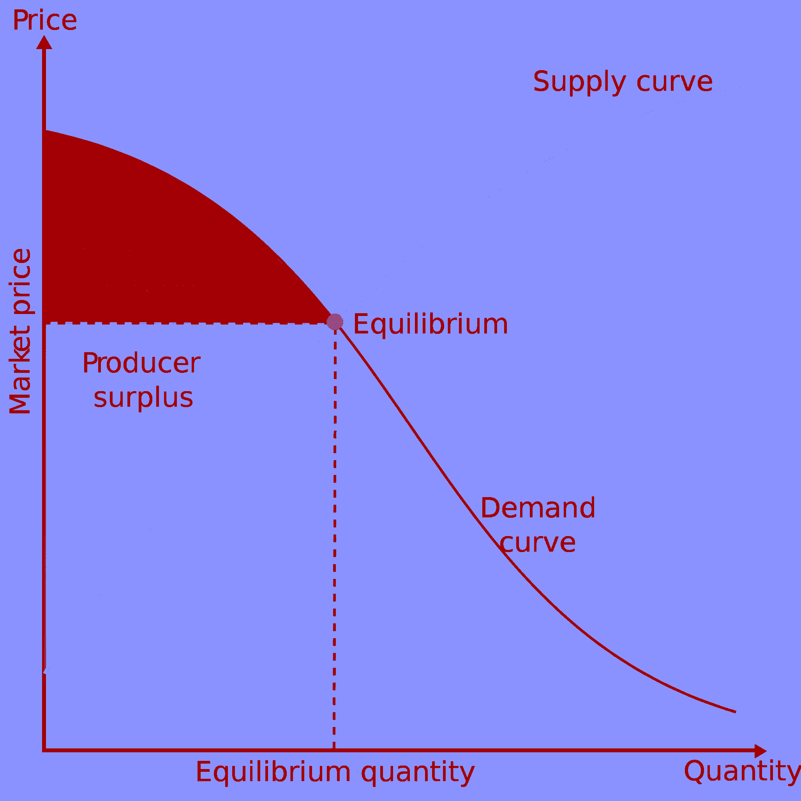
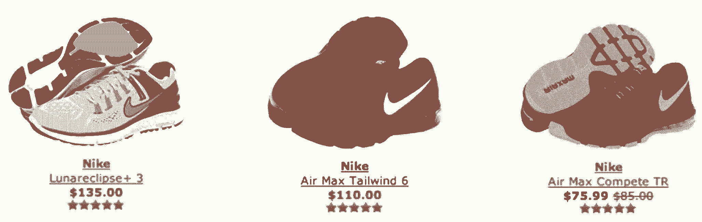
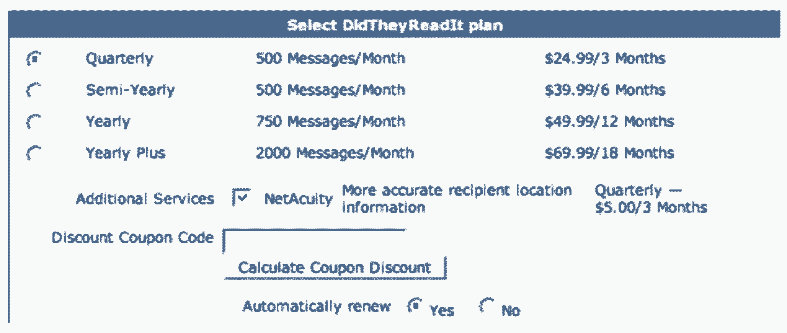
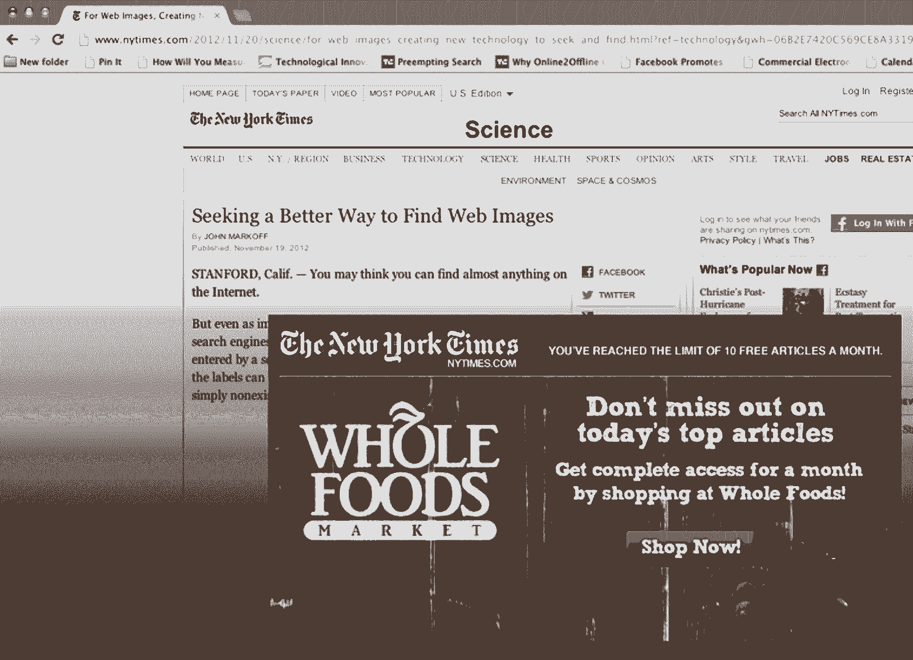

# 不要把钱留在定价速成班的桌子上

> 原文：<https://review.firstround.com/Dont-Leave-Money-on-the-Table-with-this-Crash-Course-in-Pricing>

亚历克斯·拉姆佩尔在他 11 岁时编写并出售了他的第一个软件，但他不知道该向客户收取多少费用。支票刚刚出现在他家，是他产品的许可证，他开始以 5 美元出售。

幸运的是，在他实现每周 1000 多份软件许可证销售的同时，他还在学习高中微观经济学，学习需求弹性。他白天在教室里学到的东西，在晚上立即应用到他的业务中，最终将他的产品价格提高到 18.95 美元。

对于许多初创公司来说，尽快确定完美的价格似乎是一项至关重要的任务。但是，根据替代支付初创公司 [TrialPay](https://www.trialpay.com/ "null") 的现任首席执行官拉姆佩尔的说法，真正的教训是你不能，也不应该。**一个价格意味着你会留下很多钱。在 First Round 最近的 CEO 峰会上，他解释了这到底是为什么，以及如何逃脱定价陷阱。**

# **通过多种价格优化收入**

学过经济学的人都知道这个图表。你有向下倾斜的需求曲线和向上倾斜的供给曲线。当你给产品定价时，图上的关键区域叫做“消费者剩余”

这个图表告诉你一些重要的事情，比如:

有些人愿意为你的产品支付比你目前要价高得多的价格。

有些人现在不会买，因为价格太高了。

吸引最多顾客的均衡价格。

产品与市场的契合是所有早期创业公司的圣杯。但是你要更快地到达那里(并确保你的商业模式有效)，不仅仅是通过找到理想的价格，Rampell 说，而是通过细分你的客户和销售不同的产品来优化你的全面收入。

这并不意味着提供儿童或老年人折扣。它需要根据一个特征对客户进行细分:他们购买各种产品的意愿。

**以耐克跑鞋为例。消费者可以在三种非常相似的型号中选择:135 美元的高端 Luna Eclipse，110 美元的中档 Air Max Tailwind，以及 75.99 美元的入门级 Air Max competition。它们几乎是同一款鞋，但它们都吸引了不同敏感度和欲望的消费者。**

“我拥有很多不同的鞋子，”拉姆佩尔说。“我买了 250 美元的鞋子。我买了 50 美元的鞋子。我曾经穿过别人的鞋子，那是我在更衣室里找到的。不管怎样，我还是以同样的速度跑着。”

**关键在于人们自我选择。**

这并不是说他们正在进行非理性的购买。毕竟耐克 Eclipse 可能好一点。比赛的质量可能会低一点。但两者的材料成本差别大概不是 60 美元。它可能是几美元。没关系。通过允许顾客在他们感觉最舒适的地方分组，耐克正在尽可能地获取最大的收入。

优步对同样的概念提出了类似的观点。有些人愿意花钱开着 SUV 在城里兜风，因为他们买得起，也想要这种奢侈品。更多对价格敏感的消费者可能会选择 UberX，因为他们更看重省钱。但优步和耐克是特例。

**当初创公司没有实体产品时，他们如何细分自己的定价？**这是事情变得复杂的地方，也是创始人需要变得灵活和有策略的地方。

定价差异可能基于许多不同的因素。例如，你的公司可以按比例收费，或者以一种价格提供某些功能，以另一种价格提供其他功能(免费增值模式利用了这种策略)，或者你可以提供升级的支持。这听起来很简单，但是将这些因素结合起来，以一种分层定价并仍然吸引用户的方式可能会很棘手。

**拥抱(有限的)复杂性**

与直觉相反，引入复杂性实际上可以帮助你更快地找到产品/市场契合度。

作为哈佛大学的本科生，Rampell 和商学院的学生(现在是投资者/企业家) [Chris Dixon](https://www.crunchbase.com/person/chris-dixon "null") 推出了一款名为“DidTheyReadIt”的实验产品。收费的话，他们会在客户发送的电子邮件中嵌入追踪像素。当收件人打开电子邮件时，像素会渲染并报告邮件被阅读的准确时间。

很快，他们开始吸引公司和个人的业务。产品定价需要大量的试验，他们最终决定提供不同期限的订阅，以实现收入最大化。

尽管几乎一半的客户选择了年度订阅选项，但他们在较小的细分市场上赚了最多的钱:拥有更高终身价值的季度客户。

“这就是定价的有趣之处，”Rampell 说。“你必须不断测试一种结构，这种结构能在最初获得客户之外实现价值最大化。永远不要只设定一个价格。”

细分的产品供应——如银、金或白金会员——在获取消费者剩余方面做得很好。总收入不仅仅取决于一个产品在购买时的价格。

“测试你如何细分是非常有价值的，”Rampell 说。结果往往会让你大吃一惊。例如，当他摆脱了电子邮件跟踪初创公司的月度计划时，大多数客户只是升级到了季度计划。他几乎没有失去任何人，尽管他认为他会。

**明智地使用交易**

Rampell 基于一个想法创立了 TrialPay:结账页面不仅仅是一个出口。他们可以通过增加额外的选项来留住客户和增加收入。

以电影院为例。票房收入远不足以支付影院购买房地产和电影许可证的费用。以 10 倍于成本的价格出售爆米花、汽水和零食，这才是电影经济的真正运作方式。这种交叉销售策略对电影院来说至关重要(没有它，就不会有有利可图的产品市场匹配！).拉姆佩尔说，但这也适用于许多其他可能不这么看自己的企业。这里有创业公司可以学习的宝贵经验。

为了证明这一点，他引用了[苹果](http://www.apple.com/ "null")——作为一家拥有几款主打产品、靠配件赚钱的公司的例子。

“如果你去任何一家苹果零售店，都可以清楚地看到他们销售高利润产品赚了多少钱，比如其他公司生产的手机壳，比如 [Speck](http://www.speckproducts.com/?mkwid=sP4VWzQ3h_dc&pkw=speck&pmt=e&pcrid=35060671634&gclid=CPKk-uv1-70CFUNhfgod4ogAiA "null") ，”他说。

除此之外，苹果将与网络提供商的交易纳入其移动产品的价格中，以降低成本。如果你还记得的话，iPhone 的销售只是在该公司将价格从 600 美元降至 300 美元时才开始起飞的。

“问题是，苹果实际上根本没有降低价格。他们只是说，如果你注册了美国电话电报公司的计划，你的手机会更便宜，”Rampell 解释说。“美国电话电报公司会向你收取更多的钱，但拥有一部 iPhone 的感知成本下降了。”

在许多情况下，优化收入就是用额外的选项来构建交易，这样人们就不会认为他们支付了更多的钱，而是关注你为他们提供的便利、价值和体验。

**像电话公司一样思考**

苹果与美国电话电报公司的交易可以推广和效仿:只需将激励与经常性计费产品捆绑在一起。当你这样做时，消费者实际上是在降低你产品的价格(你产品的折扣是一种激励)。

当你把自己的产品和别人的产品结合起来时，你最终会赚得更多，同时需要开发的东西也更少。你只是交叉链接和利用你的结帐页面房地产。

这种策略对那些根本看不到用户付费的初创公司尤其有用。事实上，TrialPay 就是这样开始的。这种方法适用于 99%的顾客不愿意购买产品的公司，不管他们是如何细分的。它所做的是替代一种不同的产品，这种产品会吸引需求，然后公司可以利用这种需求。

最好的例子之一是纽约时报。无论报纸试图收取多低的费用，大多数读者都不会为在线内容付费。因此，TrialPay 在其订阅流程中嵌入了一个更好的优惠:访问全食超市的在线商店，你可以免费在线阅读《纽约时报》。

不出所料，大多数 NYT 读者也会购买食品杂货，而且需要食品杂货的人比需要阅读新闻的人多。与此同时，全食超市愿意为新客户推荐付费。通过扮演中间人的角色，报纸可以在不吸引更多消费者购买其产品的情况下扩大收入——他们可以购买其他东西。

# **对奖励和折扣要有选择性**

[亚马逊](http://www.amazon.com/ "null")通过为所有超过 25 美元(现在是 35 美元)的订单提供免费送货服务，极大地提高了其购买量。但是，对于不提供实体产品的现代创业公司来说(在这种情况下，免费送货毫无意义)，等价的报价是多少呢？

**Rampell 观察并测试了许多不同的选项，但发现三种策略特别有效:**

永远不要向别人索要“优惠券”代码。并在结账流程中去掉“优惠券”字段。如果你让他们去谷歌上搜索优惠券代码，你会失去客户和收入。(稍后将详细介绍这一点。)

如果你能得到联系方式，它就有长期价值。为了获得其他客户的更多数据(例如电子邮件地址)，关闭一些用户是值得的，这些数据可以帮助您对他们进行细分。

如果你没有任何东西可以作为奖励，找一个互补的伙伴，你可以和他一起提供一些独特的东西。

免费送货是一个有吸引力的激励措施，因为它对任何收到邮件的人都有吸引力。为了激励推动更多的转换，他们必须与你的受众相关。

“在一次测试中，我们告诉顾客，如果他们用 PayPal[付款，他们会得到 Gap 或其他公司的礼券，”Rampell 说。事实证明，公司会很乐意赠送礼券(如果合格的话，比如花更多的钱购买)来换取新客户。**结账率从 15%增加到 25%** 。](https://www.paypal.com/home "null")

一个绝对不值得的激励是索要促销代码。

当你向你的用户索要优惠券代码时，你基本上是在给他们做智商测试，问他们‘你是傻到愿意付全价还是愿意少付一些？’

如果他们认为他们可以找到一个只需点击一下的打折机会，他们就会冒险去打猎。拉姆佩尔说，玩这种游戏不仅会用不必要的折扣稀释你的收入，还会让人们离开你的结账流程，他们可能会分散注意力，完全放弃这个过程。

尽管如此，折扣本质上并不是坏事。事实上，如果你把它们放在正确的位置，它们会非常有效。例如，不要询问促销或优惠券代码，而是在你的结帐流程中提供一个标记为“礼券”的字段或一个推荐字段，在那里你可以询问人们是如何听说你的公司的。

“通过这种方式，你仍然可以申请折扣，但你不会让人们主动去寻找他们，”Rampell 说。

当他和迪克森推出他们的 DidTheyReadIt 电子邮件追踪器时，只有大约 1%的用户转化为付费用户。所以他们分批测试折扣，提供 20%的折扣，然后逐步升级。

“对于边际成本接近于零的产品，以极低的价格获得客户没有任何坏处，”他说。“我们会提供非常非常大的前期折扣，但当服务开始重复出现时，就会是全价。”这最终工作得非常好。

最后，只要有可能，鼓励你的客户提供尽可能多的联系方式和个人信息。这可能很有挑战性——你可能会失去至少一部分观众——但它可以带来巨大的回报。为了让他们更容易接受，让他们自愿提供这些信息，以换取一笔令人满意的奖金，奖金可以来自你的公司，也可以来自你的合作伙伴。

“这对企业软件公司来说很常见，”Rampell 说。“你可以向客户提供免费试用，然后说如果你给我们你的电话号码或地址，我们将把试用期延长两个月。这将非常有力地为他们提供更好的服务，并在未来向他们销售更多的产品。至少，你可以更频繁地联系更多的客户。”

最后一句话关于激励:永远不要提供太多。

“看看像 GoDaddy 这样的东西。他们的结账流程充斥着各种附加产品和交叉销售，你要花大约 20 分钟来付款，”拉姆佩尔说。“这里有一条很细的线。你可以说，‘哦，我们是一家纯粹的公司，不交叉销售或追加销售’，但有时你这样做也无法弥补你的成本。”如果操作得当，就像在电影院一样，顾客会更喜欢爆米花和饮料，影院会赚更多的钱。

有两个极端，你必须弄清楚你的公司在光谱上属于哪里。你没有必要拒绝所有的合作和捆绑销售的机会来表现出纯洁和真诚。你也不必为了进行全面的实验而满足于杂乱的结账体验。

“真正的关键是测试足够多的策略，让你最快地知道什么可以收费，什么不可以收费——这不会赶走客户，”Rampell 说。“你抛出的每一个定价选项都应该旨在获得更多关于客户是谁、他们想要什么以及他们愿意支付什么的信息。”