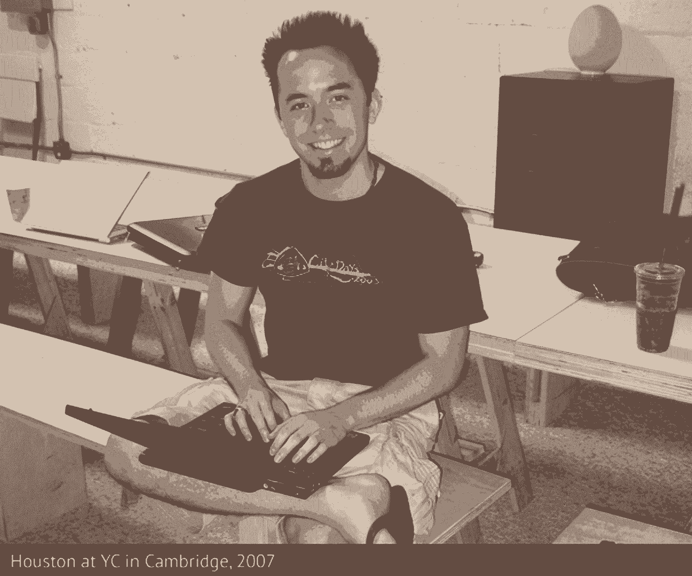
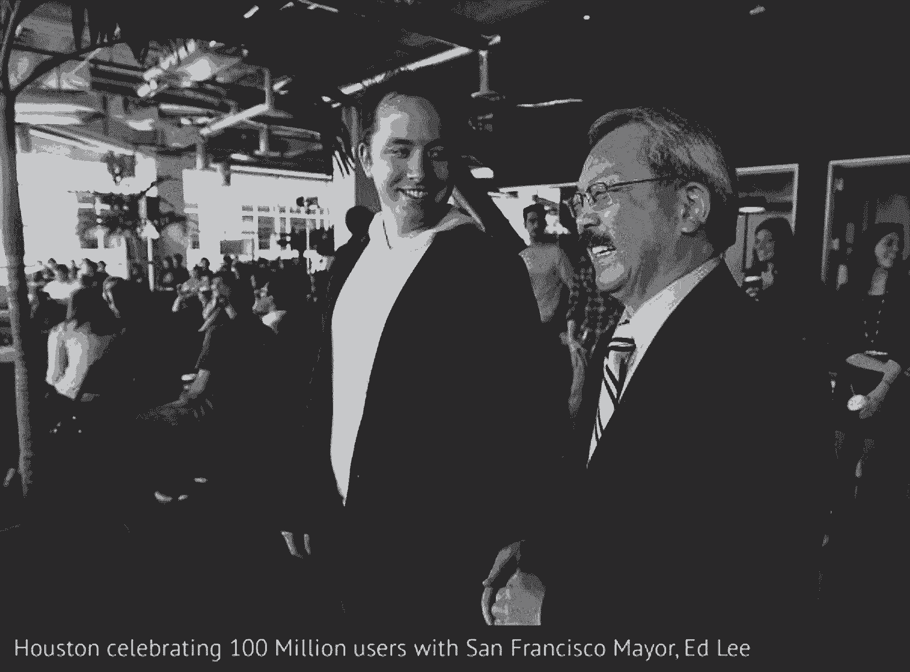

# 德鲁·休斯顿从黑客到高速增长的首席执行官的转变

> 原文：<https://review.firstround.com/Drew-Houstons-morph-from-hacker-to-hyper-growth-CEO>

德鲁·休斯顿很沮丧。在一次有一大堆工作要做的长途汽车旅行中，他忘记了带着所有文件的拇指驱动器——在云出现之前，那曾经意味着“游戏结束”几分钟后，他编写了问题的解决方案。七年时间，2.57 亿美元的资金和超过 1 亿的用户， [Dropbox](https://www.dropbox.com/ "null") 被广泛认为是 [Y Combinator](http://www.ycombinator.com/ "null") 最成功的校友。在第一轮 CEO 峰会上，休斯顿分享了他是如何从一个程序员成长为众人瞩目的 CEO 的。

# 学会放手

“总有第一行代码，”休斯顿说。事实上，大多数创业公司都是这样开始的:从代码开始，从编写代码的人开始。绝大多数创始人都有技术专长，其余的必须边走边学。对于休斯顿来说，这是一个专注的过程，几乎是一门艺术，因为 Dropbox 已经从一个人的表演发展成为硅谷 300 多名最聪明的人。

最艰难的转变是从直接从事产品到不从事产品。

“坐下来解决问题，当问题解决好了，又站起来，这是一种快乐。创建公司或管理人员从来都不是简单的事情。”在最初的几年里，休斯顿直接致力于该产品。但随着扩展成为重中之重，情况发生了变化。“我从自己编写所有代码过渡到完全不编码。因此，你过去擅长的事情在日常生活中变得越来越不重要，当代码成为人们的后院时，你需要擅长的所有事情都会让他们感到非常不舒服。”

早期，作为一个孩子开始编程的休斯顿有着创造和决定什么最适合 Dropbox 的最终自由。他自己制作了前两个 3 分钟的演示视频，在 Hacker News 上发布了第一个视频——热烈的反馈激励他辞去了日常工作——并在 Digg 和 Reddit 上发布了第二个视频，其中充满了有趣的“复活节彩蛋”。反响欣喜若狂。一天之内，视频#2 在 Digg 上排名第一，休斯顿的等候名单从 5000 增加到 75000。

“我只是在想，这是一个初步采纳者的受众，那么他们在哪里闲逛呢？像 Digg 和 Reddit 这样的网站是流量和社区的巨大来源，在那里人们为了新技术而尝试新技术。除了知道在哪里找到他的观众，他还知道他们想要什么。“我加入了所有这些小东西，所以不管他们是否对 Dropbox 感到兴奋，他们可能会注意到一些对 XKCD 或奥巴马竞选活动或不同事物的引用。这真的引起了共鸣，对这个行业来说太疯狂了。它在短时间内大大缓解了我们的临界质量问题。”

在很大程度上，Dropbox 保留了这种性格——友好、机智、平易近人。但在一开始，这并不是故意的-这只是休斯顿做事的方式。随着公司的发展，他不得不放弃对创造性决策的控制权。“我们设法雇佣了一群聪明的人，他们可以帮我解决问题，他们需要我专注于其他事情，建设公司的其他领域。”

# 绘制不熟悉的领域

编程一直是休斯顿的强项，但在许多其他领域他毫无经验。“我对商业中真正重要的其他东西了解不多，从营销到销售再到管理，”他说。所以，当 Dropbox 开始腾飞时，他的首要任务就是阅读。很多。

“阅读一本关于管理的书不会让你成为一名优秀的经理，就像一本关于吉他的书不会让你成为一名优秀的吉他手一样，但它可以让你思考最重要的概念，”休斯顿分享道。开发有知识的资源也成了一个主要的指令。“这是各种不同事物的混合，比如导师——有经验的人，经历过这个过程很多次——和同龄人。我的一些最好的朋友是 Y Combinator 的创始人，我们都在同一时间经历了同样的事情。”Dropbox 的早期董事会也帮助他识别模式，并让他知道自己应该思考什么。最终，他的态度被证明是最重要的资源。

“我的建议是习惯事物，”休斯顿说。“走出你的舒适区，即使是像公开演讲这样简单的事情。这是一种思维模式——花大量时间去思考自己不知道的事情。这些是要问的问题:“我需要什么？公司需要什么？从现在开始的 3 个月、6 个月、12 个月、24 个月，我们应该做些什么。如果你能把它备份到今天，这可能是一个有用的镜头来找出你需要发展的技能。"

休斯顿的技能之一是定义和维护公司文化。最初的团队沉浸在麻省理工学院的黑客传统中，但随着员工的多样化，这种情况是否会继续或是否应该继续还不清楚。休斯顿甚至不确定它是否需要他的关注。“我真的不明白为什么文化很重要，”他说。但当 Y Combinator 向他介绍一位创建了数百家公司的首席执行官时，他的看法发生了转变。“我真的很渴望学习，心想有人知道他在做什么，我应该担心什么。他说，我确定公司的使命和价值观，并确保文化真的很好，这真的很重要...我对自己说，好吧，这不会让代码出门。”

尽管如此，这次谈话的某些内容还是引起了共鸣。加班，在这种文化中，不仅仅是让员工开心，而是关乎公司未来的运营。

像文化和共同愿景这样的东西是分散决策的工具。

“当你的公司成长时，沟通开销变得如此之大，那么你如何开始让人们按照类似的框架来做决定呢？随着时间的推移，我开始明白这些部分是如何组合在一起的。”展望未来，当 Dropbox 拥有 1000 名甚至 10000 名员工时，核心价值观在员工中得到认可将是至关重要的。“我们告诉人们，‘你可能上周才刚刚加入，但迟早你也会成为一名老派的拳击手。所以现在记住你喜欢这个地方的地方，因为你有责任确保这些东西留在这里。"

# 接近快速增长

这就是休斯顿现在的状况，设想一个比现在规模更大的公司。他可能不会等太久，因为 Dropbox 继续以疯狂的速度招聘，特别是为了充实业务开发和其他非产品部门。但他的技术背景并非完全无关紧要。“这是一条弧线，从你或你的创始团队编写所有代码或设计代码和算法系统，到设计大型系统的人，”休斯顿说。"在每个阶段，你都在为这个更大的组织构建种子晶体."

在这个高速、高影响力的环境中，预测成功的未来需要面对当前的艰难处境。公司文化可能会变得不稳定，因为招聘速度比严谨更重要，开始时很优秀的人后来可能就不那么优秀了。这些问题与在宿舍里独自编写代码相去甚远，但休斯顿证明了解决方案可以在工作中学习。

他已经注意到了所有这些问题，并且第一个承认他在这个过程中收获了很多。第一个野兽——招聘——是他最近特别关注的领域。“如果你对你雇佣的人放松了警惕，或者失去了注意力，那就很难控制住，”他说。“我们对带入公司的人非常谨慎。他们显然很聪明，充满求知欲，但他们也必须对我们正在做的事情感到兴奋。”

虽然所有这些品质在早期团队中都是真实的，但不是每个人都能与公司同步发展，无论多么有才华。在这种情况下，休斯顿建议实用主义:“如果你要让一个人来管理一群现有团队，你可以做一些事情。让团队参与到这个过程中来，让它不那么令人惊讶...帮助人们理解这对公司和他们都有好处，我们所有人都有机会向这个人学习。如果你没有引入能够激励现有团队的人，那么你可能引入了错误的人。”