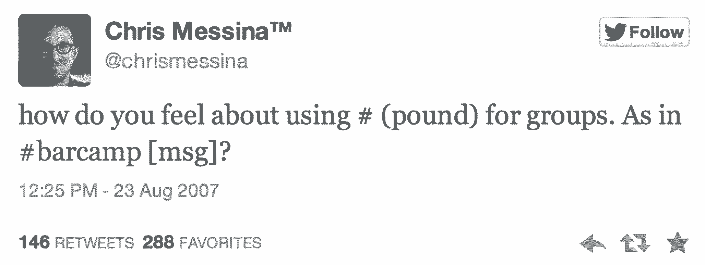
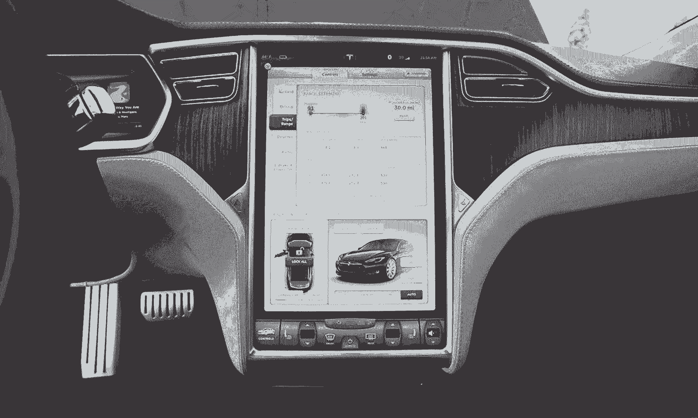
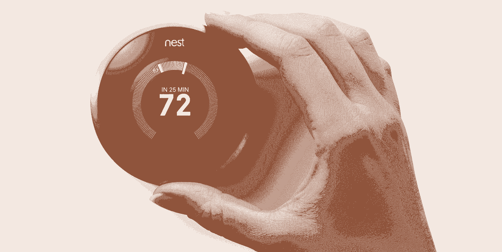

# Dropbox 的设计主管在个性化产品的黎明

> 原文：<https://review.firstround.com/Dropboxs-Head-of-Design-on-the-Dawn-of-Personalized-Products>

近十年来，Soleio Cuervo 一直在思考如何为用户量身定制技术。他有一个非常独特的优势。作为[脸书](https://www.facebook.com/ "null")的第一批设计师之一(据说是著名的“喜欢”按钮的创造者)，他在脸书早期产品和功能的创造中发挥了重要作用。现在，他在 [Dropbox](https://www.dropbox.com/ "null") 领导设计，他花时间思考产品的新方法，以实时了解我们的需求。

Cuervo 说:“我们现在看到的个性化信息流无处不在: [Twitter](https://twitter.com/ "null") ， [Instagram](http://instagram.com/ "null") ， [LinkedIn](https://www.linkedin.com/ "null") 。这还没有深入到像 [Google Now](http://www.google.com/landing/now/ "null") 这样的预测技术的新运动中，这些技术甚至在你知道你需要它之前就提供了信息。但是个性化不一定是大公司的起源。**初创公司可以利用同样的原则来构建极具吸引力的体验。**

经过多年的第一手工作和观察，Cuervo 发现了推动个性化产品的四个因素。在 First Round 最近在旧金山举办的 **Design+Startup** 活动中，他解释了每一个项目，以及新公司和小公司如何将它们整合在一起，不仅能打造出优秀的产品，还能加速每个人的进步。

**今日个性化**

Cuervo 坚信，在你决定去哪里之前，你需要知道你去过哪里。在这种情况下，对于创始人来说，了解计算领域的产品个性化是如何发展的，以及今天的情况是很重要的，这样他们就可以决定他们的下一步应该是什么。

可能很难相信个性化的概念与个人计算本身一样古老，但这就是早期麦金塔电脑上 skeuomorphic design 的全部内容:文件夹和文件的外观和操作都与现实生活中的相似，以方便早期采用者进行数字工作。很明显，从那以后有了一个巨大的飞跃。

在过去的十年里，消费技术已经知道了我们的名字，我们的位置，我们感兴趣的东西，以及我们和谁有联系——无论是社交上的还是隐性的。正是在这种转变的开始，Cuervo 进入了舞台，加入了脸书，因为算法使给个人用户量身定制的体验成为可能。

早期的脸书看到的是一个系统的开端，随着人们越来越多地使用它，它能够自我完善。“随着越来越多的人加入进来，随着越来越多的人以新的方式参与到产品中，随着我们改变用户界面以适应他们的使用，良性循环开始了。现在，新闻订阅似乎是一个老主意了。”

但他说，还有很长很长的路要走。“世界各地每小时都有数千部 iPhone 被生产和发运，但每一部都提供了基本相同的入职流程——每一位 iPhone 新用户都经历了相同的首次体验，无论他们是谁。”在未来，他相信每一个设备在被打开的那一刻都会符合你的身份(就像电影《Her》中的操作系统一样)。

那么，公司如何利用所有这些过去的经验，重新组合它们，并推动它们进一步创造出超越 feed 的范例呢？Cuervo 说，创业生态系统已经为个性化提供了新的机会，而且数据和技术在很大程度上已经存在。**这就是他的四种成分**的来源。如果一家初创公司能够将它们恰当地整合到他们的路线图中，他们就有机会做一些事情，改变数百万人与他们的产品以及彼此之间的交互方式。

**身份**

在这个新时代，你的身份是任何个性化体验的核心。它超越了您的姓名、个人资料图片和您在帐户中填写的信息。它是一个强大的实体，随着您在多种设备和平台上做出决策和采取行动而不断发展。

为了澄清和定义人们的身份，脸书调整了现有的产品，并推出了专门为此设计的新产品。例如，当他们第一次引入照片标签时，这个功能本来就是社交的，不仅为上传照片的人创造了价值，也为这些照片中被标记的主题创造了价值。一张贴有多人标签的照片不仅有助于作者的形象，也有助于拍摄对象的形象；它还为每个收到照片中被标记的通知的人创造了一个教学时刻。朋友们有机地向朋友们传授这个功能——这只是脸书鼓励人们联系和表达自己的众多方式中的一个例子。

“当人们能够随着时间的推移对你的产品建立起认同感，他们就会对它形成一种天然的忠诚。”

作为一家公司，投资于与用户的关系至关重要。“个性化软件就是要弄清楚如何帮助人们使用该服务培养认同感，然后构建让他们自然实现这一目标的功能。”

同样重要的是要认识到，人们在网上不像在现实世界中那样只有一个身份。数据显示，人们对自己的定义有时在不同的服务中非常不同——他们在 LinkedIn 上的角色与在 Instagram 上的角色不同，在脸书上的角色也不同，等等。有时他们想突出自己的职业身份。有时，他们想展示一种艺术的、创造性的身份。**你的产品必须迎合最符合你公司目标的身份**。

在 Dropbox，Cuervo 是团队的一员，致力于为工作和个人环境提供身份服务。在推出面向消费者的服务后，该公司通过 [Dropbox for Business](https://www.dropbox.com/business "null") 大规模进军企业。这意味着用户需要能够区分他们的个人帐户(和个人身份)和他们的商业帐户。这也促使 Dropbox 思考人们职业身份的要素。

“人们的商业身份是由他们为之工作的公司、他们在那里的角色、他们合作的团队、他们合作最多的人、他们在工作中需要知道的信息塑造的，”他说。“业务协作有一种完全不同的节奏，组织有自己的身份和需求，我们必须学会满足这些身份和需求。”

对于创业公司来说，关键是你应该积极地管理人们的身份，鼓励你想要的行为——无论是让人们买东西，彼此交谈，还是分享媒体。路线图上的特性应该尽可能地展现用户身份的这些方面。如果参与是你的目标，你的产品应该从人们如何在你的平台上有机地识别自己中得到线索。

“只要看看人们试图在 Twitter 上脱颖而出的所有方式——从 at 回复到转发再到标签，一切都是从用户群中涌现出来的，”Cuervo 说。“该公司意识到，人们使用这些东西来培养价值，并最终在服务上形成一种身份，使他们成为早期社区的一部分。然后，Twitter 开始将所有这些功能融入到服务中，以加强吸引他们的行为，并使该平台如此成功。”

The first hashtag ever tweeted.

**图表**

当人们听到“图形”这个词时，他们会立即想到他们的个人社交网络。这个术语被广泛用来描述每个人的关系体系，将其视为公共资产。你的社交图谱不仅仅属于你，它属于其中的每一个人。Cuervo 说，加入这个网络的人越多，这个图就越有价值。

今天，在许多不同的平台上有许多图表。就像人们在数字世界中有各种身份一样，他们也是越来越多的团体、社区和网络的成员，这些团体、社区和网络可能与他们在现实生活中认识的人无关。他们属于兴趣小组，关注名人([金·卡戴珊在 Instagram](http://instagram.com/kimkardashian "null") 上有 1590 万粉丝)，与专业人士联系，利用媒体资源获取他们的新闻，等等。所有这些结构化关系系统就像图表一样，可以用来为个人提供量身定制的体验。

你可能不会这样想，但即使是你在 Dropbox 上分享文件的人也代表了一个新的图形；在 Pinterest 上重新发布你分享的图片的人也会这么做。“随着越来越多的图表被建立和推广，人和数据之间的关系变得越来越密集和流动，”Cuervo 说。“每天都有更多关于人们的信息，他们想要什么，以及他们如何实现自己的愿望。”

为了利用这些数据，脸书推出了[脸书连接](https://www.facebook.com/notes/facebook/facebook-across-the-web/41735647130 "null")，允许用户使用他们的脸书凭证登录完全不同的服务和产品。“这个想法是，现在你可以带着你所有的友谊，和他们一起在网上旅行，看看他们在第三方服务的背景下做什么，”Cuervo 说。

一些重要的例子包括像 [Runkeeper](http://runkeeper.com/ "null") 、 [Lift](https://www.coach.me/ "null") 和 [Duolingo](https://www.duolingo.com/ "null") 这样的应用程序，它们可以让你导入你的朋友，看看他们是否也对跑步、自我提高或学习新语言感兴趣。如果是这样的话，这些应用程序可以让你一起跟踪你的进展，竞争和分享——基本上让你更深入地参与进来。

“最好的图表是那些与您想要为您的用户创造的价值相一致的图表。”

**作为一名企业家，你希望选择对你的产品最有意义的图表。Instagram 的发展势头很大一部分归功于名人效应。Cuervo 说:“能够创造独特、有价值的图表的公司，能够为他们的用户创造真正新颖的体验。”“如果你能为用户构建一个引人注目的图表，它可能是差异化、用户获取和保留的主要来源。”**

**上下文**

移动电话为这一组合增加了一个全新的层面。智能手机和平板电脑让用户可以广播他们在哪里，在旅途中进行通信，并在各种不同的环境中使用产品。突然间，仅仅提供一种产品是不够的——你必须为每一种有意义的情境创造独特的体验。

Cuervo 说:“很快，一种服务在多种设备上看起来都一样是不够的。“当然，人们想要无缝的体验，但真正的意思是，他们希望你的产品在任何时候都易于使用，他们希望它能最大限度地方便他们。基本上，你的产品或应用需要越来越了解每个用户拥有的设备，以及他们如何在每种设备类型上形成习惯。”

在当今所有的个性化策略中，这可能是最重要的，因为大规模的移动迁移仍在继续。“首先，我们只有智能手机和电脑，现在我们将有眼镜和手表，以及其他许多可穿戴设备，我们的汽车和电视——这个清单还在继续。”

Touchscreens like the one in Tesla's Model S will become increasingly common and customizable.

“出现的设备越多，你的产品就需要越细致入微。”

“你可以看看当今最成功的公司，它们在多个平台和设备上做着令人兴奋的事情。”作为汽车领域的早期进入者，Pandora 是一个很好的例子，它也专注于创造不同的网络和移动体验。他说，同样，企业领域的赢家将是那些接受人们跨多种设备类型建立工作流程的人。

“所有这些服务为每个人每个设备积累的数据量是惊人的，”Cuervo 说。“很快，无论人们身在何处，我们管理他们注意力的能力将变得不可思议。人们已经开始对他们不在的时候，他们的移动设备如何收集通知感到恼火。他们不想通过滚动来寻找在那个时刻对他们真正重要的东西。**新一波的创新将是在给定关系、位置和设备的情况下，在正确的时间呈现正确的信息**。

能够以一种看似自然的方式过滤人们大量涌入的信息的创业公司和应用程序，在当今的环境下注定会取得成功。“如果你的产品可以区分坐在电脑前的人和开会迟到的人，你也将有无数的机会在正确的时间披露正确的信息，”Cuervo 说。“这对于未来十年情境广告将如何为客户创造合法价值有着巨大的影响。”

除了获得更多的收入，你还可以学习无数的方法来改善你的用户体验。“只要看看我们的新奇就知道了。当你叫一辆车时，你会被告知他们还有多少分钟的路程，你实际上可以跟踪车辆的接近。所有这些都使用户能够决定是叫车还是等公共汽车，或者在司机到达之前溜进咖啡店购物，等等。这是一种更丰富的体验，让他们在非常有意识地管理注意力的同时，感觉自己在掌控之中。”

这可能听起来无边无际，令人生畏，但我们才刚刚开始这一趋势。**希望推出个性化产品的初创公司应该关注一天中不同设备上的任务和需求是如何变化的。**

“人们将如何在手腕上接收电子邮件？在他们的巨型电视上？在他们的车里？”

“软件制造商将需要对每种设备类型以及它们在给定用户生活中的功能有更深入的了解，”Cuervo 说。“如果你的用例不适合某种设备，不要强迫它，它不会飞起来的。”

**行为**

用户行为对于上面讨论的属性来说有点包罗万象。人们的身份、图表和不同的环境都会影响他们的行为和使用产品的方式——这就是事情变得非常有趣的地方。**“你可以开始问，‘好吧，基于所有这些事情和行为史，这个人下一步可能会做什么？”**

Cuervo 给创业公司最有力的建议:**不要害怕对你的用户应该如何表现发表意见。**你创造了一个产品，让他们去做一些事情。让他们去做。“在推动特定类型的行为时，要有目的性——对于人们应该如何使用你提供的服务，要有非常强烈的观点。”

“每时每刻都要敢于坚持对你的用户重要的东西。”

Cuervo 说:“ [Nest](https://nest.com/ "null") 是训练用户界面的一个极好的例子。“这是一个恒温器，随着时间的推移，它会学习一个人的行为。当你在家或不在家时，它会很快形成模式。很快，在你进门的前几分钟，空调就打开了。它通过建立一个行为模型来做到这一点，该模型说，“她有 95%的可能性会在晚上 8 点前到家，我们知道她大多数晚上喜欢 72 度，所以我们现在就开始降温。”这种模式对于未来任何高度个性化的体验都是必不可少的。"

网飞是另一个有趣的例子。它逐渐从传统的导航转向精确计算电影推荐的用户界面。“这对他们来说是一个重大的战略举措，”Cuervo 说。“但他们知道自己的用户何时会对某个特定类型或演员感兴趣——基本上是说，‘鉴于你过去的消费模式，我们相信这是你此刻想看的东西。’最终结果将是一个更干净、更精简的服务，感觉毫不费力，完全适合普通网飞用户。"

像这样的经历被贴上了“**自动医疗**”的标签——当预测技术如此物有所值，以至于你甚至不知道自己想要什么就能得到它。但并不是所有人都同意。正如脸书在 2006 年推出 News Feed 时被投诉淹没一样，看起来太聪明或太有先见之明的新技术让一些人望而却步。**对在这一领域工作感兴趣的企业家将需要能够解决和缓和这些态度。**

“决定你的产品应该有多自动化是个性化的另一个机会，”Cuervo 说。“最好的软件形式将是那种让人们能够自己决定何时获得算法体验或何时决定控制的软件——类似于‘嘿，我想去手动’这样的东西。请不要再为我换挡了。但是如果不给产品体验带来太多的复杂性，这是一个很难达到的平衡。"

他的建议是，开发一种产品，开始时非常固执己见，具有指导性，但仍然可以根据人们的反应进行调整。“找到合适的零星的、上下文相关的机会来提示用户确认算法响应。就像在电子邮件客户端的环境中一样，你可以问:‘你经常存档这个人的电子邮件。您想自动存档来自该发件人的电子邮件吗？最重要的是，让他们觉得自己对你的产品有掌控感。你想定制他们的未来用途，但只能以符合他们需求的方式。"

**混合配料**

“打造极度个性化的产品，始于你的设计过程。”

你投资了什么工具来让你在原型制作时个性化你的产品体验？你如何与同事和利益相关者分享设计以获得反馈？

“分享一个快速截屏不会让事情持续太久。确保你可以创建原型来获取利益相关者的图表数据，并为他们提供个性化的体验。这样他们就能真正从用户的角度来看待体验，”Cuervo 说。在脸书和 Dropbox，当他的团队向同事推出一项新功能进行内部测试时，他们会为他们创建个性化的沙箱，以查看该功能在野外的实际工作情况。这是你获得最佳反馈的方式:**当利益相关者通过他们个人的镜头体验原型时。**

此外，利用其他公司已有的工作。像脸书连接这样的资源和 API 可以在个性化领域给创业公司一个巨大的推动。在这里，Cuervo 指出了一个叫做 [Timehop](http://timehop.com/ "null") 的令人愉快的应用程序，它可以连接到你的脸书、Twitter、Flickr、Instagram 和 Foursquare 账户，为每天建立一个个人时间胶囊。通过从其他地方获取所有的照片和内容，它允许用户无缝地重温旧的时刻。

Cuervo 说，只要记住外面有几十个数据消防队，捕捉你需要的活动的方法可能是依靠别人。不要认为依赖这些平台中的一个或多个会阻止你构建一些特别的东西。

最后一个开发原则:“**记住你不是在和其他服务竞争。你在和人们的习惯竞争。真正破坏事物的公司是那些打入人们习惯的公司。他们会说，‘你过去常常走到街上拦出租车。“现在有了优步，你可以在办公桌前叫车，所以打破离开大楼的习惯吧，”当你在创造你的产品时，总是在想人们目前在做什么，你如何有目的地围绕你的服务创造一套新的习惯。这就是保持——帮助人们围绕你提供的效用建立一个惯例。**成功的科技公司建立在他们帮助形成的新习惯之上。"****