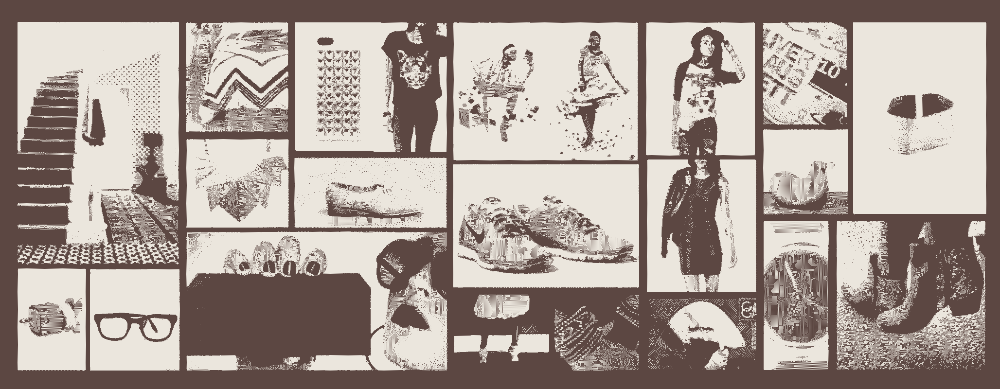

# 不要在批评面前跳舞，用 Airbnb 体验设计总监的建议来运用它吧

> 原文：<https://review.firstround.com/Give-Criticism-that-Makes-a-Difference-With-These-Tips-from-Airbnbs-Head-of-Experience-Design>

“批评可能基于观点，但这正是它的价值所在。这让我们体会到为什么人们最终会喜欢或讨厌我们的工作。”

这是  **[凯蒂莳萝](https://www.linkedin.com/pub/katie-dill/3/68b/791 "null")****[Airbnb](https://www.airbnb.com/ "null")**的体验设计负责人。此前，她在 [Greenstart](http://dev3.greenstart.com/ "null") 帮助创始人塑造产品和 UX，并在 [Frog Design](http://www.frogdesign.com/ "null") 从分析师晋升为创意总监。她还在 CCA 教授研究生工业设计课程。不用说，她已经无数次在设计和产品反馈的给予和接受端——但她认为这个过程几乎总是会好得多。

什么更好？更好的结果。批判并不存在，所以人们可以发表他们没有根据的观点。它的存在是为了让你能够加速获得最好的产品。也就是说，许多人已经被侮辱或不集中的批评烧伤，所以他们已经停止这样做——错过了改善的重要机会。

“如果批评做得不对，那就是侮辱。迪尔说:“你不会对做更多的工作或做得更好感到兴奋。

在第一轮的最后一次[设计+创业活动](http://designplusstartup.com/ "null")中，她分享了对许多设计师和商业领袖的采访，深入探讨了批评的具体细节，什么是有益的，以及如何提出批评，从而真正为用户带来改变游戏规则的结果。

# 基础知识

很多人认为设计师垄断了所谓的“评论”但是这个过程的核心比这更具可扩展性和适用性。首先，迪尔打破了一些神话:

批判是解决许多问题的有力工具。“这不仅仅是设计的问题。你可以用它来制定更好的商业计划、营销策略或更好的法式吐司。”

批判是开始的好方法。“当你处在试图解决问题、试图解决什么问题、或者想寻找什么机会的模糊领域时，批评可以帮助你摆脱这些噪音。”迪尔说，在将想法推向市场的整个过程中，应该正式和非正式地使用它。

**批判是提炼的好方法。**“好的评论可以创造更多的想法，或者帮助你在众多伟大的想法中做出选择。它让你找到你真正热爱的想法，给你能量去调整它、润色它、整合它，然后把它运出去。”

**批判必须是双方面的。这似乎是显而易见的。对于每一条反馈，都有给予者和接受者。但是当你真的在那里，在过程的一端，这可能很难记住。当迪尔在艺术中心设计学院上学时，她的启蒙老师用红笔在一张早期的纸上写满了字，“这样别人就不会看到它了。”她将这种坚韧的爱归功于将她锻造成今天的设计师，但她承认这对大多数人来说可能有点太苛刻了。**

为了理解如何运行更好、更有效的评论，迪尔将这两方面分开，并为每一方提供了战术建议。根据下面的建议，你可以在保持高昂的情绪和动力的同时，变得挑剔和直接。

# 拿

**1。设置上下文。**

如果你在工作中接受反馈，你可能就是做出反馈的人。你对它了如指掌，而你能做的最糟糕的事情之一就是假设评论你作品的人也知道同样多。作为演示的一部分，你必须让人们跟上进度。

“例如，你正在做一个针对老年用户的项目，他们有一定的需求，也有一定的限制。迪尔说:“让批评你的人知道这一点。“最重要的是，让他们知道产品成功的标准是什么，这样他们就可以帮助你确定你是否真的达到了这些标准。”

不久前，迪尔正在为一家大型科技公司设计一款可穿戴产品。目标用户是一位时尚节俭的女性，但提供反馈的大多数利益相关者是穿着卡其裤和蓝色衬衫的中年男性。

“他们没有得到用户，这没关系——这不是他们的包。但在反馈会议期间，他们很难脱离现实，”她说。“‘为什么它没有键盘？’他们会问，”她要怎么在手腕上的那个设备上写字？这些事情不断出现。"

为了设置环境，Dill 和她的团队需要让团队沉浸在终端用户的身份中。他们不得不谈论她，就像她是一个真实的人，有兴趣，有烦恼，有生活方式。因此，他们向他们展示了普通终端用户的形象，以及该设备将如何融入她的日常生活——“人物角色和用例。”

当这个小组明白他们想要接触的是谁，在使用这个设备之前她在日常生活中是如何互动的，以及她可能如何使用它来改善她的生活时，他们就知道为什么设计师会做出非直觉的决定。

The collage Dill and her team used to introduce stakeholders to the "fashionable and thrifty" woman they were trying to reach.

**2。明确范围。**

迪尔说:“房间里的批评者必须知道你处于流程的哪个部分，这样他们才能给你正确的反馈。“如果你刚开始时一切都很混乱，你会想谈谈你可以选择的所有不同的方式。当你离发布还有一周的时候，你会想要有针对性的反馈来帮助你完善它。“太大而无法实现的反馈在最后阶段不会有用。”

同时，一定要清楚地定义你的批评者在房间里的角色。“如果你邀请某人来看你的作品，可能是因为你觉得他们有一些有价值的东西可以分享，或者有独特的视角。让他们知道你想从他们那里得到什么，这样他们就能提供独特的意见，而不会被其他事情分散注意力。让他们知道，‘嘿，这是给狗的产品，我们请你来是因为你是个狗语者。’"

让人们知道他们带来了什么，这样他们就可以利用他们的专长给你你需要的反馈。

**3。分享旅程，而不是瞬间。**

迪尔说:“当你展示你的作品时，不要只展示一个屏幕或一个放在架子上的产品草图。“如果你在设计时考虑到了用户，那么你就要考虑他们会如何在时间和空间上体验你的产品——这是一个旅程。为了帮助你的批评者像用户一样理解你的产品，分享这段旅程。”

例如，如果你正在建立一个网站，考虑用户将采取的途径。“当你的用户使用你的网站时，他们想解决什么？为了实现这一目标，他们必须经历怎样的旅程？为了确保您的设计满足他们的需求，并且每个屏幕都设计得很好，请并排构建和评估屏幕。看看从一个地方到另一个地方的感觉如何，以及内容和布局如何方便用户的旅程。”

当迪尔和她的设计师团队在设计一家美国大银行的自动取款机的外观和感觉时，他们必须考虑人们与它们之间所有不同的交互。

“在评估这种体验时，对我们来说非常重要的是把它画在故事板上，这样每个人都可以看到人们是如何从一步走到下一步的。这不仅仅是关于屏幕。它是在想象一个人实际上是如何到达自动取款机的。也许她正和她的朋友一起走过来。她带着一个钱包。”即使是最小的细节也能改变方法，你要向批评你的人展示你已经考虑过他们了。

“故事板是发现你的故事中是否有漏洞的好方法。用户做某事有意义吗？舒服吗？有流量吗？”为看你设计的人回答这些问题将有助于他们做出更好的评论。他们会知道您已经解决了什么问题，以及您仍在寻求解决什么问题。

**4。让它变得有形。**

不呈现幻灯片。把它们打印出来，贴在墙上，这样人们就可以在上面写字并四处移动。

迪尔建议，你应该尽一切努力让你的陈述充满活力。当你提供一些静态的东西时，它缩小了可能的反馈范围。人们无法同时想象你展示给他们的一切，除非他们能同时看到所有的东西。允许他们与你的内容互动，并给他们空间和可见性，这样做只会改善你的结果。

“能够看到一个经历的整体非常重要，这样你就可以思考它作为一个系统是否有意义。”在你张贴所有东西的同一面墙上，一定要包括你最初用来达成设计的框架和指导原则。作为一个整体，这创造了连贯性，并给你的批评者一个导航你决策的指南针。

“当你把所有的东西都展示在一起时，你不仅能让人们更快地跟上进度，还能让你有机会问一些重要的问题:我们是否在做我们计划要做的事情？我们是否达到了我们说过的目标？”

**5。立即制作原型。**

“如果它在墙上，太好了。如果你能使用它，那就更好了，”迪尔说。这有助于把你的批评者直接放到你的用户的立场上，并给出更多相关的反馈。

很多人害怕原型的想法，因为它感觉像一个承诺。他们认为这需要时间。但也不一定。

“有很多不同的方法和工具可以很容易地建立原型，”她说。“例如，我是 [PopApp](https://popapp.in/ "null") 、 [Keynotopia](http://keynotopia.com/ "null") 和 [Flinto](https://www.flinto.com/ "null") 的忠实粉丝。这三种方式都是数字化的，是快速制作产品模型的好方法。”

**[PopApp](https://popapp.in/ "null")**旨在让 iPhone 原型制作变得简单。迪尔解释说:“你只要在笔记本上拍一张照片，几分钟内就可以把它变成一个交互式的原型。”“你可以看看这个东西是否有效，然后当你把某人带进你的评论时，你可以把你的手机递给他们，然后说‘试试看’。”这就是你获得有针对性和具体的反馈的方式。"

**[Keynotopia](http://keynotopia.com/ "null")** 是一个界面元素库，包括按钮、滑块和输入栏，帮助您快速轻松地在 Keynote 或 PowerPoint 中制作模型。

**[Flinto](https://www.flinto.com/ "null")** 聚合了你现有的任何屏幕设计，并让你以任何方式链接它们，这样你就可以模仿你的实际应用程序将会做什么以及它将如何运行。

这样做的目的是帮助你在过于投入某个特定方向之前发现问题。通过这种方式，快速原型实际上帮助你减少了承诺。

你为自己的产品、设计或计划搭建的舞台越好，反馈的质量就越高，就能让你更上一层楼。搭建舞台的最佳方式:在最少的时间内让它尽可能接近现实。

# 给予物

批评的另一面是提供反馈的批评家。他们也有工作要做。批判不能像任何旧的对话一样进行。

**1。感同身受。**

再说一次，这看起来很老套，但是你会震惊于有多少人没有花时间站在制片人的角度考虑问题就提出批评。无论“接受者”如何设置背景并展示他们的设计或产品，“给予者”有无限的机会让谈话变得不舒服，并强加一个无用的观点。迪尔说，捐赠者有责任不这样做。

**移情不是一维的。**评论家必须对作品的制作团队和用户都感同身受。当您提供反馈时，您需要引导终端用户的身份，并考虑他们可能想要什么。你有责任带着这个想法走进房间。特别是如果你被邀请参加对你专业知识的评论，你应该帮助制作人团队更好地了解他们试图接触的人。

迪尔说:“你可以利用用户和他们在寻找什么来过滤你说的话。”用户的最佳利益是批评家和生产者之间的理想桥梁。它提醒双方的最终目标，并给他们共同点，以同情对方。因此，如果你是一个对设计师或制作人缺乏同情心的反馈者，你可以引用用户的需求。团结他们为那个人尽最大努力。

**2。放大。缩小。**

当人们非常接近他们的工作时，他们很难有足够的视角来看到他们的不足之处或他们应该改变什么。“当你是进来提供第二种意见的批评家时，你就有机会缩小视野，只见树木，不见森林，从整体上思考这个系统。”

首先，缩小。一切都协调一致地一起工作吗？不同的旅程和经历对观众来说有直观的意义吗？

“然后放大细节，”迪尔说。“沿途所有的小像素都有助于传达他们想要传达的信息吗？一切都是有原因的吗？”

放大和缩小是你给别人一个全新视角来看待他们工作的机会。

**3。慷慨地赞美。**

“你在评论中选择的词语真的很重要。你想实话实说。你不想粉饰任何事情或改变你的反馈。你希望能够以真正积极的方式提供哪怕是非常苛刻的反馈。”

迪尔建议的公式是:赞美三明治。她知道这被普遍鄙视，但她不敢苟同。“有一些人讨厌它，但没关系。它仍然有效。”在领导多个不同项目的团队后，她一次又一次地看到了它的工作。对于那些不熟悉的人，策略是这样的:

“非常好的真诚的赞美——必须是真诚的，否则不会有效果。告诉他们他们的页面真的是白色的，他们的胶带是粘性的，这是没有用的。你必须真诚周到。”

“接下来是一条批评——或者两条，或者三条，或者任何需要的批评。”

c .**c .**“最后，真诚地感谢他们所做的一切。”

“这一点如此强大的原因是，如果你只是批评，他们不会知道他们做了任何正确的事情，这是多么强大的力量？”

谁愿意在被告知自己的工作糟糕透顶后重新开始？

给他们积极的反馈可以让授权成为可能。你不想泄气，你想兴奋。“实际上，如果你不告诉别人他们做得好，他们可能再也不会这样做了。迪尔说:“在下一次迭代中，他们也可以删除这一点。“因此，指出什么是好的，什么是有效的，并帮助他们建立这些。”根据她的经验，这是一个人前进的唯一方式，不仅因为他们必须前进，而且因为他们想要前进。只有后者才能产生最好的结果。

就你提供的批评而言，你需要完成两件事:

**具体一点。当你只是说你不喜欢它或者“它不流行”或者“它不够苹果”时，这是不起作用的这到底是什么意思？我们必须更加具体。展示你的意思的其他例子。“如果你能直观地展示你正在谈论的内容，你的反馈更有可能被消化，下一个版本也更有可能与你正在寻找的内容相似。**

**提问。不要只是指挥或告诉人们该做什么。提问是尊重他人的，也是提供反馈的一种更有帮助的方式。这不是你有多聪明的问题。通过问“你试过了吗？”或者“你还看了什么？”或者“你认为用户对此会有什么反应？”你让他们觉得自己是负责人，有动力让设计变得更好，你已经引导他们了解了未来可能需要改变的地方。"**

问许多深思熟虑的问题和把你所有的幻灯片贴在墙上的目的是一样的。它给人们机会和空间去戳戳戳，真正全面地、连贯地考虑事情。

最后，说到表扬，只有一个主要原则:慷慨大方。不要退缩。在每一个评论过程中，你都有一些机会激励人们，让他们多走一英里，多花一小时，把最后几个像素移动到完美的位置。不要浪费它们。

“我之所以如此关注如何做好批评，是因为从本质上来说，这真的很有帮助。迪尔说:“这让我们得以一窥顾客的想法。“通过搭建舞台，并对彼此和用户产生共鸣，你可以创造一个地方，让各种观点真正茁壮成长并付诸实践。”

凯蒂·迪尔在青蛙设计公司工作了五年，为一些世界上最大的品牌创造产品、体验和环境。如今，她确保 Airbnb 用户拥有无缝、令人惊讶和愉快的端到端体验。