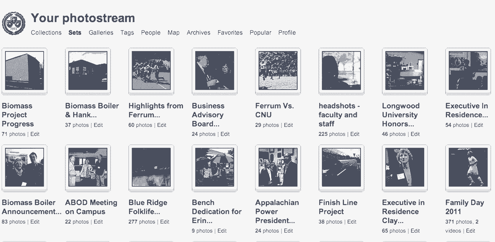
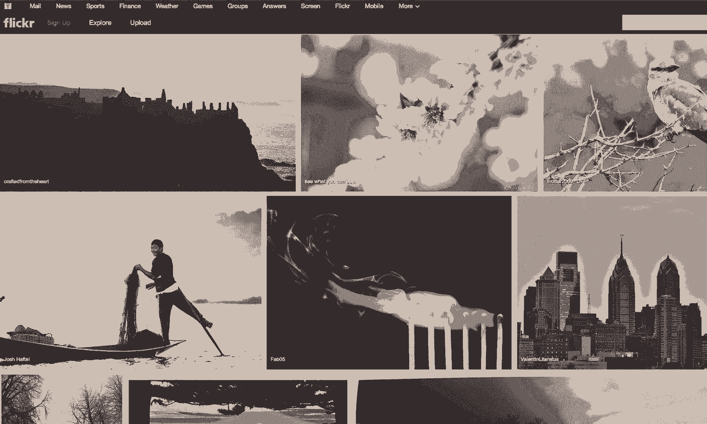

# 设计师如何赢得一席之地

> 原文：<https://review.firstround.com/How-Designers-Can-Earn-a-Seat-at-the-Table-2>

15 年来， [Phil King](https://www.linkedin.com/profile/view?id=2706556&authType=NAME_SEARCH&authToken=Rjzu&locale=en_US&srchid=87031101406042548409&srchindex=1&srchtotal=763&trk=vsrp_people_res_name&trkInfo=VSRPsearchId%3A87031101406042548409%2CVSRPtargetId%3A2706556%2CVSRPcmpt%3Aprimary "null") 一直在证明设计应该在领导层占有一席之地——与产品、业务和工程高管在战略和优先责任方面拥有同等的权重。在担任 [Flickr](https://www.flickr.com/ "null") 的用户体验和设计总监之前，他在[易贝](http://www.ebay.com/ "null")晋升，他认为成功的企业建立在精心设计的客户体验之上，最好的设计领导者永远不会为了产生最好的结果而放弃自己的根基。

在领导了世界上最大的摄影爱好者社区之一(拥有超过 1 亿名成员)进行了一次大规模的密切关注的重新设计后，King 对于领导团队创造用户会喜欢的产品有很多话要说。在这次独家采访中，他谈到了设计师如何成为强大的设计领导者，并在各种规模的公司中做出改变。

**在餐桌旁找到你的座位**

在初创公司做了几年设计后，金于 2004 年加入易贝，作为一名对交互设计感兴趣的个人贡献者，不到 18 个月后进入管理层。作为一家大公司，易贝的文化鼓励专业化。交互设计师专注于事物如何工作。视觉设计师关注的是事物的外观。作为一个多面手，这是一个艰难的环境，但这是吸引金进入领导角色的品质之一。

“我认为我作为一名多面手设计师的背景，加上我在交互设计上花费的时间，帮助我更全面地看待产品和设计挑战，”他说。“建立同理心、将复杂问题联系起来以及帮助团队应用设计思维的能力是设计师能够带给领导团队的关键技能。”

他努力将易贝团队中的专家聚集成一个团队，帮助项目团队无缝地形成、理解和解决设计问题。作为一名多面手设计师，提高技能，特别是寻找机会运用广泛的设计思维来支持你的团队，是作为一名领导级别的设计师的关键步骤。

**你可以通过几种方式在你的团队中展示这种兴趣和能力:**

深入了解设计团队的其他成员都在做什么，并与他们分享你在做什么。促进协作可以加强团队内部的工作和联系，即使面临艰难的截止日期。

主动征求同事的反馈，而不仅仅是经理的反馈，并在你将他们的建议付诸行动时提醒他们。我们都喜欢和那些不断学习并感激支持的人一起工作。

发现成为导师的机会。当有人寻求帮助时，做那个自愿的人。证明你的存在是为了让每个人都做得更好，包括你自己。

不要回避学习新技能。保持一个有能力的多面手有助于设计领导者与他们的整个团队和工作保持密切联系。

吸收、记录和分享。当你学习新事物时，进行观察，观察最佳实践，做笔记。坐在白板前的人通常有最好的机会来引导和影响对话。

**建立富有成效的关系**

你花越多的时间真诚地倾听和理解团队中每个人在做什么，分享你的想法，你就越容易进入领导角色。如果你是从团队中提拔上来的，你会赢得他们的尊重，因为你是一个倾听他人意见并值得他人倾听的人。

兴趣催生信誉。了解他人角色的来龙去脉不仅重要，你还应该努力理解人们面临的各种压力。谁在最具挑战性的时间线上工作？谁在试图冲击严格的产品要求？谁对他们试图设计的东西缺乏(或丰富)反馈感到沮丧？金说，通过问这些问题，你不仅能获得解决这些问题的前排座位，还能对不同的情况产生共鸣。

“你想要创造一种透明、开放的文化，同时保持尊重。”

这样的对话越多，你可以在团队中分享的知识就越多。你可以成为一个渠道，将人们与解决方案、建议和其他可能拥有有用专业知识的队友联系起来。过一段时间后，你增加的价值将变得有据可依——大多数设计领导者都有良好判断和成功结果的良好记录。

“强调团队共同成功的重要性，以及团队中个人成功的重要性，”金说。真诚地关心人们在做什么，因为你希望他们成功。"**即使在你成为经理之前，辅导也会磨练你的技能，让你更顺利地过渡到领导层。他说，管理的主要部分是能够引导人们找到正确的答案或资源。在易贝，在我升职之前，我的人际关系是建立在信任的基础上的，到了那里之后，我努力保持这种信任。"**

将团队中关于优先级和兴趣的知识汇总起来，可以让你对产品有一个更好的整体感觉。“作为一名交互设计师，我非常关心每个功能如何协同工作，以及客户如何体验，但一个好奇的多面手可能会更有影响力，”金说。“专业化的一个问题是，你往往无法从更广阔的视角中获益。优秀的设计领导者重视观察一个产品是如何端到端地组合在一起的，包括设计它的人。”

在易贝，与极其多样化的客户群建立共鸣需要许多领导者可以用来理解和影响他们团队的技能。“易贝的产品和设计团队投入了大量时间来了解买家和卖家的整个生态系统——提出问题，观察人们如何使用我们的产品，并倾听，”他说。对你自己的团队进行类似的向内关注可以帮助建立信任、协作，并最终获得更好的结果。

**用心成长你的团队**

在大多数初创公司，第一个设计雇员成为设计主管。突然间，他们有责任雇佣一个团队，而这从来不是他们技能的一部分。如果你在这种情况下，你从哪里开始？国王的建议:和自己在一起。对你个人拥有的技能做一次彻底的审核。无论你有什么，找一个有的人。

当金在 2008 年加入 Flickr 时，这个小型设计团队已经深深扎根于产品定义过程中。他花时间了解每个设计师最喜欢他们工作的哪些方面，他们在哪里有最好的结果，以及他们希望发展哪些技能。模式开始发展，使得可视化团队哪里最强，哪里存在差距成为可能。随着团队的不断壮大，雇佣人员来填补技能缺口并保持环境的新鲜和创造性是他的首要任务之一。

“招聘是为了填补网格上的弱点。”

“我总是在脑海中保留我团队的地图，”他说。“就像，她真的很擅长互动，他更注重视觉，这两个人更专注于写作和开发内容，那个人更专注于用户研究——我不仅根据天赋，还根据他们的兴趣和他们想在哪里发展来规划团队。这是关键。”

金建议，除了对你的团队进行彻底的盘点，你还需要尽可能地向前看。“为了达到你的目标，明年你需要完成什么？对你的团队或整个企业来说，什么样的机会即将到来？从现在起的三个季度内，根据你将要做的工作和你需要的技能进行招聘。”

除了建立一个面试流程来帮助团队评估候选人的设计技能， **King 说还有其他步骤需要考虑:**

**让团队参与进来。**如果你正在发展一个现有的团队，已经在团队中的人也应该对新人的加入感到兴奋。让团队参与评估某个领域需要额外力量的地方。一个积极参与、有自知之明的团队可以改进从定义新角色到入职的整个过程。

**衡量自我意识和谦逊程度。**面试候选人时，注意让他们承认他们加入了一个完整的团队。即使当时只有一个团队，他们也应该表示愿意了解你已经使用的组织和流程。设计候选人应该会见工程师、产品经理和其他团队成员，并对他们经常合作的人感到好奇。

**为协作而优化。作为一名领导者，你不仅仅希望你的团队每个人都卓有成效。一个设计团队需要有效地评论和支持彼此的工作。首先要了解团队中不同的成员目前是如何一起工作的，并考虑候选人如何加入现有的项目团队并使其更强大(或不强大)。**

**发现趋势和引导变化**

2012 年，Flickr 开始了大规模的重新设计，彻底改变了这项服务的外观和使用方式。鉴于玛丽莎·梅耶尔于当年 7 月接任 Flickr 母公司雅虎(Yahoo)的首席执行官，人们可能会猜测这一转变是换帅的一部分。事实上，Flickr 的团队几个月来一直在进行重新设计。

这是它之前的样子:

这是它现在的样子:

“设计团队应该被授权去探索想法，即使是在挑战最后期限的时候，”他说。“到 2011 年底，我们所有人都意识到，在照片领域不断增长的背景下，有必要重新设计 Flickr。”这包括脸书日益上升的统治地位，Instagram 等照片共享巨头，以及越来越多的摄影爱好者借助 Lightroom 和 Aperture 等工具鼓起勇气。重新设计的想法和草图开始在团队每周的评论会议上流传。

“理想情况下，所有重大变革都来自自下而上的方法，团队中的每个人都对做不同的事情感到兴奋。这里主要的领导挑战是组织和引导这种能量与 Flickr 团队的其他成员进行协作，”金说。

当时，Flickr 已经达到了一个复杂的水平，设计团队有义务构建更多的功能来服务更多、更多样化的受众。同时，他们需要保持用户习惯的界面的简单性和直观性。最重要的是，设计团队希望重新投资，让照片成为 Flickr 体验的核心。他们有机会彻底重新思考如何实现这一承诺。

在项目开始之前，King 的工作是帮助团队考虑每一个细节——这包括让公司的其他人参与实质性的改变。

为了获得大项目的支持，他有以下建议:

要有策略。从一开始，产品经理和工程师就加入设计团队，帮助确定重新设计的关键优先事项和流程。这包括设计重新推出产品的整体战略，并帮助团队最有效地集中精力。

要包容。自由地与任何询问的人分享你的过程(即使是那些没有询问的人)。您希望跨部门的同事有时间熟悉新概念。Flickr 设计团队打印出他们所有的探索，并张贴在一个中心位置。这使他们能够收集每个人的反馈，提出问题，引发对话，并给整个公司一种包容的感觉。整个团队都乐于质疑、戳漏洞或彻底推翻想法。优化参与有助于收集最佳反馈，并尽早解决问题。

将想法呈现为想法。如果你的想法是一成不变的，当你分享它们时，你就是在为自己的失败做准备。当想法仍然具有可塑性时要清楚，并通过鼓励团队成员解释他们的担忧来建立共鸣。确保你把你得到的信息记录下来并折叠成可供选择的想法，你也要展示出来，让人们感觉被倾听。你可能会得到更好的结果。

一旦你有了一系列的选择，并从广泛的领域中获得了反馈，是时候挑选出最相关的想法并对它们进行优先排序了。当你打这种电话时，你必须首先确定你是在正确的公司里。

对于 Flickr 的重新设计，King 和他的团队与来自工程和产品部门的核心人员(在这种情况下，前端工程师领导和产品负责人)一起工作。让他们参与对话可以让他们各自的团队确信他们的优先事项和关注点得到了解决。

“我们一起做的很多事情是试图围绕照片组织每一次互动，删除表现不佳的功能，并简化产品，”金说。“即使我们在过去的一年中实施了一些东西，这种体验也会被仔细检查。”

你不能对过去的决定抓得太紧。接受事物变化很快的事实。

正是因为这个原因，让工程和产品在场尤其重要。最终出现在剪辑室地板上的每一个特征都得到了对此有强烈感受的人的支持。在许多情况下，是工程师或产品经理，对于他们来说，有一个论坛来提供背景并解释为什么以及是否仍然重要是很重要的。“在某些情况下，功能比我们最初认为的更重要，或者我们能够以更有意义的不同方式使用它们，”金说。

设计领导者的工作不是拥有所有的答案，但是他们的工作是帮助团队找到答案。

**平衡结构和过程**

为了解决重新设计的问题，Flickr 组织成“豆荚”，每个豆荚代表一个不同的领域或功能，包括移动、上传、分享等。每个 pod 都有一名产品经理、一名设计师和几名工程师，他们负责充分理解并按照积极的时间表开发项目中他们的部分。

金发现，围绕问题而不是技能来组织人们可以培养更多的创造性思维、全面的假设和最终的设计计划。与此同时，它需要一个重大的转变。在 pod 结构之前，所有的设计师都坐在一起，而不是与基于项目的团队在一起。“突然间，他们不再坐在和他们想法一样的人旁边，”他说。尽管设计团队继续定期会面，但这并不是一个顺利的转变。“我不得不鼓励人们在互动中更多地表达设计。”

最终，pod 结构产生了积极的结果 King 将其归因于更高的专注度和更快的沟通。当你可以转向你旁边的人，检查并立即提供反馈时，一切都更容易建立。虽然 pods 可以自由地在内部组织他们的工作，但强调一些简单的设计过程可以提高产品和团队的实力。

过程中的每一点都像敌人一样让人觉得无法进步。你必须把它精简到最基本的部分。

在 King 的案例中，他专注于三个关键流程来增强团队的能力:

1)频繁签到。他确保与分配到一个单元的每个设计师会面，以了解手头的实际工作和单元内的人际关系。设计师有灵感吗？参与设定优先级？被任何问题阻止？他会问这些问题，以确保吊舱按计划顺利运行。他说:“我想确保他们感觉到，他们是在培养自己的技能，而不是在专注于或教授他们的东西。”。

2)安全空间会议。金会召集他的设计师们，这样他们就可以展示他们的作品，解决问题，互相鼓励。“我努力制定议程，确保每个人都知道其他人在做什么。我会要求演示包含更多的细节。分开坐有它的好处，但它给设计的一致性带来了更大的压力。金说:“通过电子邮件和 Dropbox 分享东西最多只能保证被动消费，无法取代通过设计进行面对面的交流。”。“定期会议保留了我们的团队文化，并保持事情协调一致。”

这些安全空间会议成功地实现了跨吊舱的更协调的设计。当然，每个人都知道网络和移动用户会期望以同样的方式体验 Flickr 品牌，但如果设计师之间没有持续的沟通，这一点就不会体现出来。作为一名领导者，金的工作是确保这种交流在每个人之间公平进行。“通过轮流与同事分享他们的作品，演示者可以参与到讲故事中，并看到他们的设计与项目的其他部分不太匹配。这在发布前非常有价值。”

3)向高级职员演示。“我希望 pod 中的每个设计师都对自己的工作负责，这需要提高技能来展示设计并在高管评审中收集反馈。选择正确的细节水平，让利益相关者了解关键的考虑因素，以及预测在评审过程中会出现什么样的问题，这些都是设计师的关键技能，我希望团队能够自如地向任何人展示。”定期的个人和小组评论会议创造了练习的机会，也为金提供了必要的指导。

**确保影响**

在金在 Flickr 的近五年时间里，公司经历了巨大的变化——通常伴随着巨大的设计影响。在许多方面，他的工作量和责任类似于一个初创公司的设计主管。对于任何召集人们实现大愿景的设计师来说，他有两条建议:“提供自主权，坚持问责制。”

当脸书、Twitter 和许多其他公司大举进军移动领域时，Flickr 采取了行动，雇佣了一名拥有丰富移动经验的设计师。因为这是公司的一个新领域，设计师本质上负责创建设计策略和执行计划，但也与 King 和团队的其他成员一起审查和迭代。

“只要有可能，我希望设计师们真正拥有自己的领域，并能驾驭它。这就是你如何看到人们非常深入地参与一个项目，”他说，并强调检查设计师的工作与微观管理非常不同。“作为一名设计负责人，你应该随时提问，影响方向，而不是给出解决方案。”

领导者鼓励团队投入到他们的任务中，并承担推动项目前进的责任。

在责任方面，设计领导应该尽早并经常要求查看工作，并需要能够提出有教养的、有见地的问题，以使产品变得更好。“问为什么事情是这么回事。就需求而言，他们从团队的其他成员那里听到了什么？他们反对什么要求？他们此刻试图解决的最大问题是什么？”他说。

“你希望人们有自主权，但不是独立工作的自由。领导者的存在是为了将团队重新聚集在一起，并确保每个人努力实现的最终产品都会产生影响。最终，每个人都想要那种影响。”

正如金所说，在开发过程中，设计领导者可能是产品最重要的客户。他们是一个应该不断地与团队中不同成员带头开发的功能进行交互的人，检查这些功能是否符合公司的优先事项和客户的需求。“基本上，你是确保功能和设计师相互交流的人，让产品设计朝着一个方向前进，”他说。

确保对你的团队产生影响的第二部分是向公司的其他人很好地展示它——成为一个直言不讳的倡导者。

设计团队有时会被消极地认为是那些在最后突然出现，在其他人努力构建的东西上涂上一层油漆的人。设计领导者应该尽一切努力打破这个神话，从一开始就为设计师创造参与的空间。

设计思维在每个发展阶段都是必要的。

为了做到这一点，他建议去参加每一个你可以贡献自己的会议，即使你没有被明确邀请。做一个积极的参与者。非正式地促进跨职能领域的对话，将设计思维融入他们的问题解决过程。

“促进产品评审或战略会议类似于为你的产品进行头脑风暴或可用性会议。金说:“一个设计领导者可能最有能力确保桌子周围的每个人都平等参与，如果你感觉到房间里有不同意见，就寻求澄清，并帮助团队专注于手头的任务。”

最重要的是，提出问题并提出建议，展示如何更早地考虑设计将使产品更强大。如果你能做到这一点，你会吸引所有人的注意力。“让公司的每个人都认识到设计在确保产品成功中的作用，这是你的目标。”