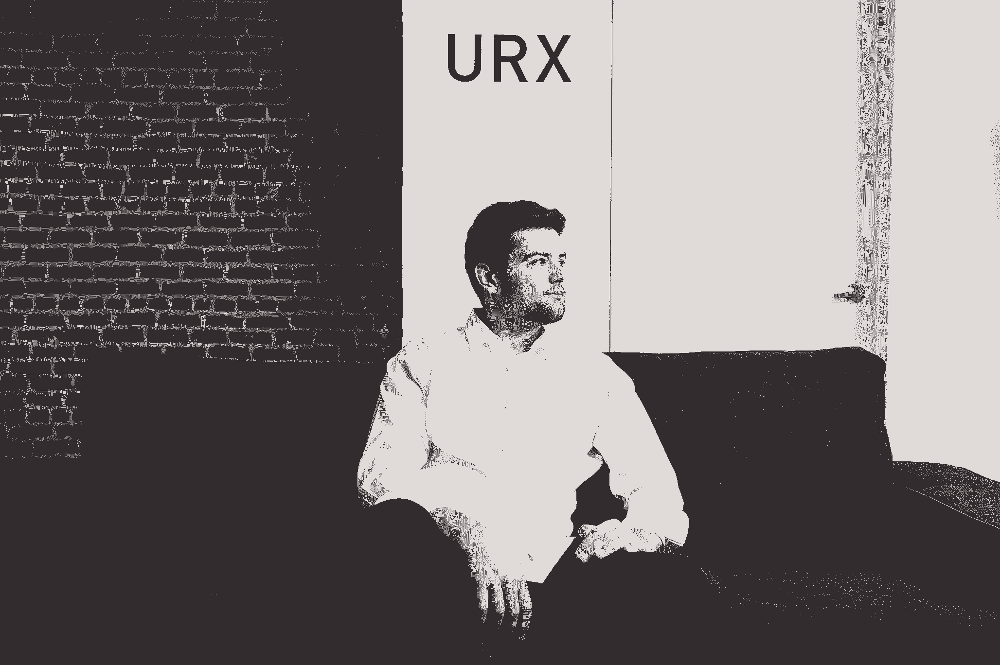

# 快速成长的初创公司如何在内部沟通中断前修复它

> 原文：<https://review.firstround.com/How-Fast-Growing-Startups-Can-Fix-Internal-Communication-Before-It-Breaks>

URX 已经被 Pinterest 收购。约翰·米利诺维奇现在是 *[柏拉图](https://www.useplato.com/ "null")* *的创始人兼 CEO。【2015 年初， [URX](http://urx.com/ "null") 是一家相对不知名的初创公司——一个拥有非常技术性的产品的小团队。这种情况在今年春天发生了变化，它宣布了 1200 万美元的首轮融资，并获得了来自 TechCrunch、华尔街日报和其他公司的一系列好评。如今，该公司正迅速成为一种新趋势和术语的代名词——[深度链接](https://en.wikipedia.org/wiki/Deep_linking "null")——将用户链接到应用程序内任何页面的能力(随着越来越多的人使用手机和平板电脑做任何事情，这一点至关重要)。*

从那时起，该团队已经扩展到近 20 名员工，并处于突破性增长的边缘。但是是什么让首席执行官约翰·米利诺维奇夜不能寐呢？确保 URX 的内部沟通旨在帮助它在发展过程中成为一家更好的公司。科技行业充斥着阻碍有希望的开端的沟通障碍的例子。突然事情闹大了，大家都不知道怎么回事，产品也遭殃了。米利诺维奇决心躲开这颗子弹。

为了在事情破裂前解决问题，他一直在会见他的支持者和导师——经验丰富的企业家——以找出如何保持沟通的方法。他的观点是:如果人们能够专注于自我提升，公司也可以。随着 URX 的发展，他部署了四种策略来实现这一目标。

# 逆势办公时间

从一开始，约翰和他的联合创始人就优先考虑雇佣那些对给予和接受反馈持开放态度的人。这是他们在面试过程中努力去发现的，通过创造机会提供评论，深入产品，有争议。他们想知道谁会对他们的工作提出批评，谁会建设性地接受批评。但他们需要一个论坛，让整个公司也这样做。每个人都在不停地快速工作，没有时间去思考什么是对的，什么是错的。

其结果被称为逆向办公时间。每周五下午，整个团队会聚在一起，邀请每个人分享想法，诉说不满，提出问题，并坦率地说出他们认为事情应该以不同的方式来做。选择“反向投资者”这个词是为了引出争论和热点话题。用米利诺维奇的话来说，“它创造了一个安全的空间，在这里人们不仅可以把事情搞混，还可以明确地说出事情的真相。这也让人们不要把事情看得太重。”

从 URX 是否应该与某个特定客户合作，到股票组合和福利，再到休假政策，反向操作的办公时间一直被用来解决各种问题。允许人们公开谈论他们的感受，这既有助于他们团结起来，也有助于他们接受对公司的所有权。

“最好的组织是那些不仅征求建设性反馈，而且实际上用它做一些事情的组织。”

“我们告诉我们的员工在门口检查他们的自我，所以作为一个公司，我们需要做同样的事情，”米利诺维奇说。协议的一部分是，URX 的领导层将接受任何抛给他们的东西，并做出有意义的回应(即使这需要额外的研究或产品变革)。

“我们希望人们知道，当他们在办公时间进入那个房间时，他们可以表达他们的感受，但没有人受到人身攻击。他说:“这一切都是为了尽可能打造最好的公司。”。“例如，我们有一个人说他们觉得休假很尴尬，因为创始团队从来不休假，我们没有明确的要求。接下来，我们询问了其他有同样想法的人，并与他们一起制定了具体的政策。这让我们有了对问题最有热情的人来提出解决方案。”

该会议的时间限制为一小时，因此鼓励有问题或意见的人提前分享，有答案的人受到激励，如果他们可以，可以迅速解决问题，或者离线处理更复杂的问题。

领导团队实际上使用[谷歌主持人](http://www.google.com/moderator/ "null")提前收集问题和话题，以便他们能够准备真实、全面的答案，并预算如何使用时间。“如果我们知道我们有 10 个问题，我们会注意在 5 到 6 分钟内回答每个问题，”米利诺维奇说。

在反向操作办公时间提出的每一个问题都会被记录在 URX 的内部维基上——这是一个寻找答案、采取行动并让人们对做出改变负责的强制功能。随着事情的完成，它们的状态被更新，并最终被标记为完成。这是公司内部每个人都能看到的。无论您是谁，您都可以看到谁被分配到特定的行动项目，以及他们是否做了他们应该做的事情

逆向办公时间也在促使新员工接受 URX 反馈驱动型风格方面发挥了重要作用。新员工被要求在第一周参加，米利诺维奇说他知道这有预期的效果，因为“刚加入的人马上就开始参与。令人难以置信的是，看到一个有着新鲜眼光的人走进来，并坦然地问为什么事情会是现在这个样子。当这一切开始发生时，我们知道这将成为并保持我们文化的基石。”

同样重要的是，逆势交易会以庆祝大大小小的胜利而告终。米利诺维奇很快意识到，以一种积极的、鼓舞人心的方式结束一周是多么必要。不管前一个小时有多糟糕，这给了人们一个分享个人成就、祝贺同事和认可优秀工作的机会。他表示，将批评和质疑如此紧密地叠加在一起，产生了一种复合效应:它让透明度变得有益。

# 技术讲座

URX 的一个核心原则是终身学习。这个想法是通过结合知识来创建一个大于其各部分总和的公司，并利用它来激励人们扩展他们的个人能力。

“我们对学习的看法不仅仅是如何更好地完成工作，或者从错误中学习，”Milinovich 说。“这是为了知识而学习。”

一周几次，通常在午餐时间，整个团队都会被邀请参加他们所谓的技术讲座。这些总是由团队中的另一名成员教授，可以是与他们正在进行的项目相关的内容、演示，或者仅仅是他们感兴趣的相关主题。仅在过去两周，会谈就包括 Python 的介绍，使用谷歌眼镜的演示，以及基于跨越鸿沟寻找早期采用者的讨论。尽管这些讲座完全是可有可无的，Milinovich 说这种形式鼓励了健康的出席。

这种策略更鼓舞人心的一面是看到和你一起工作的人同时担任老师。许多人愿意花时间准备讨论材料，并且在向不太熟悉的人描述他们了如指掌的话题时非常耐心。对于在特定职能领域工作的人来说，展示、教授和指导的能力给了他们一套额外的工具，他们可以在职业生涯中应用，无论是在 URX 还是在未来。

“我们希望鼓励对团队工作的深入理解——无论是重大的技术挑战还是整合来自市场的反馈，”Milinovich 说。“技术讲座将整个团队聚集在一起，并展示人们如何拥有多种不同的才能。”

这些讨论也促进了公司工程和业务方面的交流。这些人在工作项目上没有太多互动的机会，所以谈话代表着他们在同一间屋子里谈论同一话题的少数几次机会之一。对整个公司的挑战有一个宽广的视野会产生一个有趣的视角，即技术、产品和销售过程如何结合在一起来取悦和服务客户。在许多情况下，提出的问题会给公司带来新的想法。

“我们将我们团队与生俱来的好奇心视为一种竞争优势，这将有助于创造一个新的市场。”

# 对 1:1 的承诺

“我最重要的工作是成为一个反馈环——我们的产品和市场之间的反馈环，以及团队的反馈环，”Milinovich 说。“这就是我们如何建立正确的文化，让我们尽可能快地到达目的地。”

这表现在一对一的形式上。他和公司的每个人都有一个计划，他承诺在可预见的未来保持这种状态，即使 URX 超过 100 名员工。他说，这可能需要一些创造性的日程安排，但它仍将是他和公司的核心价值。

除了与米利诺维奇会面，URX 技术团队的每个成员还会与首席技术官兼联合创始人 Andrew Look 进行一对一的会面。目前，这种情况每两周发生一次，Milinovich 每周与业务团队的每个成员会面。

“总会有一些人们不会在社区论坛上提出的问题，这些问题仍然非常重要，尤其是在它们变成更大的问题之前，”他说。“对我和安德鲁来说，确保每个人都知道一对一是一个安全、保密的地方，他们可以在这里谈论办公室内外困扰他们的事情，这一点至关重要。这是他们的时间，他们想怎么用就怎么用。”

John Milinovich, Co-Founder & CEO at URX

“开始一对一的最好问题通常是，‘你的头在哪里？’"

“你会对这个简单问题的回答的广度和深度感到惊讶，”米利诺维奇说。“有时候，人们希望非常具体地钻研他们一直在做的事情。有时，他们会因为生活中或人际关系或健康方面的一些事情而对最近的工作表现不佳感到焦虑，我们会给他们机会坦诚地谈论这些。很多时候，人们只是不知道如何克服某个困难或摆脱常规。如果是这样，我们希望他们毫无保留地告诉我们发生了什么，这样我们才能提供帮助。”

他说，大多数时候，人们只是想知道他们是否在做正确的事情，以在公司取得成功——还有谁比首席执行官或首席技术官更适合提供建议，他们可以鸟瞰整个运营，需要什么，以及人们可以如何提供帮助？“这就是为什么与每个人见面对我来说如此重要，这样他们就可以检查并把握整个公司的脉搏，看看他们在哪里适合我们的发展方向。”

“没有人想在一个他们必须保持警惕的地方工作。我们的目标是让他们尽早放弃。”

Milinovich 说，让人们敞开心扉的最好方法是你自己去模仿他们的行为。无论某人在组织中处于什么位置，他都坚持对自己的生活、他所面临的问题以及他对业务的担忧非常开放和诚实。

他说:“当 URX 只有 9 到 10 个人时，我学到的第一课就是整个组织倾向于反映我的情绪。“如果我感到压力很大，人们会过来跟我说他们也有同样的压力。我经常被提醒，我的感受会影响到其他人。”

这是一个很多领导者都没有意识到的普遍现象——[最微小的手势、滴答声甚至语调都会在公司内部引起焦虑、不安全感和混乱](http://firstround.com/article/asanas-justin-rosenstein-on-the-one-quality-every-startup-needs-to-survive "null")。一对一的谈话给了米利诺维奇一个机会来坦率地谈论这个问题，并确保他的言行清晰地传达出来。“如果我对我们正在做的事情没有太多信心，这一点尤其重要，”他说。“这给了我一个以更细致入微的方式解释事情的机会，并重申我在这里与大家一起解决这些问题是多么兴奋。”

在一对一的谈话中，当人们带着具体的问题或顾虑来找他时，Milinovich 说他会采取一种疾病对症状的方法。“很容易看到事物的症状——这是表面上实际发生的事情，但需要更多时间才能真正理解潜在的原因。与人相处的时间让我有机会更深入地挖掘和诊断问题的根源。那我们就有机会解决它。”

例如，如果有人说他们感到特别有压力或紧张，但他们不知道为什么，他会说得更细。“我会问他们一些问题，比如一天中的哪一段时间这种感觉最强烈。然后，我们可以确定触发因素，无论是会议、人员还是特定类型的工作。”

他说，等式的另一部分只是倾听。“有时候，你能做的最有效的事情就是全力以赴，让他们明白这是他们的时间，不管我还有什么事要做，也不管我有多忙。”作为副产品，这段时间让他对自己的员工有了独特的见解，以及是什么让他们有所作为。正如他所观察到的，“有些人从不准备，只是想即兴谈论一些东西，其他人则带来详细的项目列表来讨论。对人们的这种了解让我知道他们如何最有效地工作，甚至知道他们最擅长什么样的项目。”

他说，90%的时候，他试图把这些会议变成散步(URX 位于南方公园)。“这让一切都不那么正式，感觉更像是一种对等关系，人们也更容易敞开心扉。环境切换让这种不同类型的互动变得更加清晰，在这种互动中，他们可以从埋头工作中休息一下，做回自己。”

作为一名首席执行官，让人们交谈并与每个人交谈会带来巨大的好处。“我有机会从所有这些会议中汇总所有这些信息，然后模式开始出现，”米利诺维奇说。“我会开始从不止一个人那里听到同样的事情。例如，不久前，三个不同的人问我关于我们如何宣传一个产品，我意识到我在重复我自己。我突然想到，这是一件需要在整个公司广泛传播的事情。仅仅因为只有三个人问，并不意味着他们是唯一不知道答案的人。”

当然，这听起来很棒，但是当 URX 进入高速增长期，而他又负担不起每周两位数时间的一对一辅导时，米利诺维奇打算怎么做呢？他的解决方案是双重的，旨在保持这样一种感觉，即每个人都可以直接接触到高层决策者:

**培养像他一样专注于一对一的经理。**特别是当公司增加新的管理层时，新的领导者抽出时间与团队的每个成员会面，并且他们分享倾听人们关于他们选择的任何话题的价值观将是至关重要的；诊断问题的根源，而不仅仅是治标；让人们清楚地知道，他们可以自由、安全地分享他们个人和职业生活中的事情。“目前，Andrew 就是一个很好的例子，为整个工程团队提供了一个可以依赖的后盾。”

“我肯定会继续和大家见面。”大胆的话，但他有一个随着公司发展而错开会议的计划。根据他与人们工作的密切程度，或者他与人们工作的相关程度，他会每周、每两周、每月、每季度与人们见面。他说，这可能需要一些大师级的安排，但这是一个足够高的优先事项，值得投入时间。最重要的是，如果真的没什么好讨论的，他不会要求一对一的，这样也能节省时间。“人们将与他们的经理保持最稳定的关系，但如果他们愿意，可以随时保留与我交谈的选项，我会挤出时间，”他说。

# 记录所有的事情

米利诺维奇从一对一的会议中获得的模式识别让他想到了 URX 不断自我完善的第四个策略:挑剔的内部文件。“你会遇到一个非常复杂的问题，或者你会多次看到相同的问题，以至于你需要把它写下来，这样新来的人就可以不用你告诉他们就能知道，而且每个人都在同一页上。”

它始于安德鲁写的一篇五页的文章，内容是关于自公司成立至今所做的所有产品变化。它不仅列举了产品中的所有变化，还包括了它们背后的推理和基本原理，以防人们想知道为什么做出选择。

今天，这个和更多的过程和创始文件生活在 URX 的维基上，任何人都可以访问，评论或编辑。也就是说，为了保持其有用性，这个中央知识库不能是免费的。

“我们放在维基上的所有东西都必须符合一定的标准，”米利诺维奇说。**“它必须是这样的，当一个新员工开始阅读时，他们会希望阅读它，并因此对公司有更多的了解。”**

让信息容易被发现是另一项首要任务。“随着我们向组织中添加越来越多的数据、人员和复杂性，我们需要确保所有东西都以有意义且易于查找的方式添加和归档，”他说。“有些事情每个人都需要知道，有些事情只有特定群体的人才需要知道。我们正在创建我们的文档，以便人们可以随时访问与他们最相关的信息。”

例如，对于工程团队的成员来说，有用的代码片段可能更容易显现，而对于业务开发团队的成员来说，客户线索列表更容易看到。Milinovich 说，随着公司的发展，架构将继续发展，但这些原则将保持不变。

URX 使用 GitHub 运行其 wiki，这使得团队不仅可以呈现当前的信息，还可以呈现之前的所有迭代，因此，如果有人真的想深入了解公司和产品的发展，他们可以追溯他们的步骤。

这个项目是 Milinovich 日常工作的重要组成部分，他说，大约 10%到 20%的时间花在写东西上。公司所有专注于不同领域的联合创始人也是如此。

“我们正在打造一项市场上从未有过的业务和产品。没有先例，”他说。“我们花了很多时间来阐述它是什么，为什么它有价值，它能为人们做什么。能够在一个任何人都可以贡献想法的地方写下来，我们可以看到事情如何随着时间的推移而变化，这将是至关重要的。”

“记录你的公司和建立自我意识是一回事。”

米利诺维奇花了很多时间思考自我提升的策略，并认为在公司层面也可以做到这一点。

“我认为建立一家有自我意识的公司是可能的。他说:“这在很大程度上与建立所有这些反馈循环有关，与不断检查并了解你在哪里有关，与建立机制使所有这些顺利运行而没有大量监督有关。”。"当你这样做的时候，成长和持续的进步就有可能同时实现."

*约翰米利诺维奇在**[@ jmilinovich](https://twitter.com/jmilinovich "null")**发推文。URX 在**[@ urx tech](https://twitter.com/urxtech "null")**也是如此。*