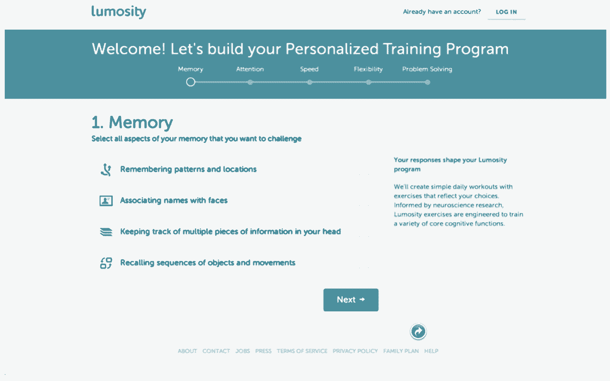
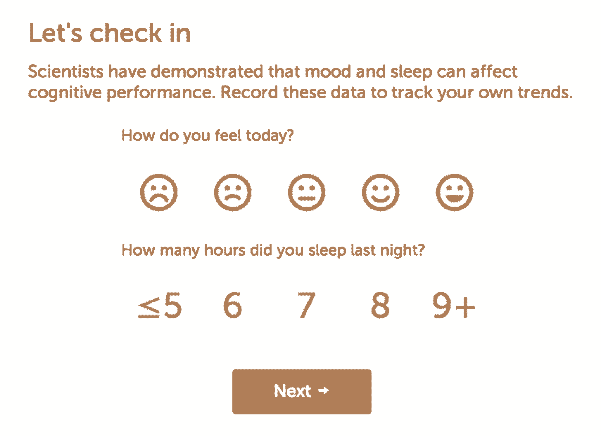

# Lumosity 如何通过复杂性而非简单性将活跃用户数量提高 10 %|

> 原文：<https://review.firstround.com/How-Lumosity-Spiked-Active-Users-10-with-Complexity-Not-Simplicity>

当 [Lumosity](http://www.lumosity.com/ "null") 在 2007 年推出帮助人们通过智力游戏增强大脑时，它运用了一个普遍的理论:你的注册过程越简单，你带来的用户越多，你的发展就越快。在很大程度上，他们是对的。**但接下来发生的事情让他们大吃一惊:**随着注册变得更加复杂，用户实际上变得更有价值了。

在 First Round 最近在旧金山举办的[设计+创业](http://www.designplusstartup.com/ "null")活动中，Lumosity 的产品设计总监 Sushmita Subramanian 分享了如何为产品增加摩擦有时是一个好策略，可以增加它所吸引的用户的长期价值。她有很多数据可以证明。Lumosity 进行了广泛的实验，以在简单和复杂之间取得正确的平衡，其反直觉的举措有助于推动该公司在其领域的前沿。

**减少摩擦的神话**

起初，对于 Lumosity 团队来说，他们显然需要尽可能轻松地制作产品。锻炼大脑就像锻炼身体一样。这对你有好处，但也需要意志力和纪律，这是大多数人所缺乏的。让人们定期训练将是一个挑战，不管他们把游戏做得多么有趣。至少，他们认为可以通过简化流程让人们注册。

Subramanian 说:“我们在网站上的游戏和训练系统上下了很大功夫，我们真的希望尽快让用户参与进来并接受训练。”。“如果你看看其他应用程序和网站，似乎大多数都要求最小量的数据——人们只需点击一下就可以连接。”

真正的问题是这些用户明天还会回来吗？大多数情况下，他们不会。

渐渐地，随着他们更多地了解他们的用户以及他们如何体验该产品，Lumosity 测试了不同的注册流程。他们增加了调查问题，要求更多的人口统计信息，等等。**“我们发现，有时摩擦可以帮助你获得真正相信你的产品的客户，他们希望与你的公司建立长期关系**，”她说。

当你催用户进门的时候，很容易错过这些机会。让事情慢下来会带来意想不到的好处，你只需要确保你是在正确的地方为了正确的理由而做这件事。

**找到你最有价值的用户**

Subramanian 说:“随着越来越多的人注册，我们意识到我们拥有真正广泛的受众——从学生到专业人士，再到老年人。“为了给他们每个人创建个性化的培训，我们需要了解他们对产品的目标和期望。”

为了收集这些数据，他们在注册流程中添加了几个调查问题，包括关于他们认知目标和工作行业的问题。在用户有机会注册并开始玩游戏之前，这种情况持续了好几页。

最初，该团队认为这将降低注册率，但从长远来看，帮助他们了解更多的用户是值得的。他们的发现不仅有益于他们的研究——他们发现用户实际上完整地回答了额外的问题。他们对结果感到惊讶，决定将这些问题作为注册体验的一部分。

在登陆 Lumosity 主页后，感兴趣的用户首先被引导调查关于他们认知训练兴趣(即记忆、注意力、解决问题)的问题。在用户有机会注册并开始玩游戏之前，这种情况持续了五页。

每一步，Lumosity 都进行 A/B 测试，并与客户交谈，以验证他们是否在正确的轨道上。

“我们用没有调查的流程测试了五页的调查，我们发现前者实际上确实稍微降低了实际注册的人数。但是那些成功的人更有价值——他们愿意投资我们的产品，愿意付费订阅，愿意继续使用更长时间。”

分析这些结果，Lumosity 团队提出了两个理论:

个性化:询问人们的兴趣给了他们独特的机会去影响他们将要使用的产品。是的，这需要大量的前期投资，但他们可以相信他们正在改善未来的体验。

教育:像大脑训练这样的东西并不为很多人所熟知或理解。更长的注册流程让 Lumosity 有机会解释更多关于大脑训练的内容，为什么它很重要，以及该产品如何有所帮助。

这些都是积极的结果，但必须有一种方法来捕捉相同的影响，同时提高注册率。

The first of five survey questions Lumosity tested against a simple sign-up flow.

**用摩擦优化**

为了在教育和个性化原则上加倍努力，Lumosity 重新设计了其核心内容，以强调这两者。他们在主页上增加了更多的教育内容，突出了支持他们游戏设计的科学研究。他们还向用户明确表示，他们第一天的训练会影响他们未来的游戏体验。

所有这些都准备就绪后，他们决定再次对注册流程进行 A/B 测试，看看情况是否有所变化。结果基本相同:**更多的用户没有参加调查就注册了，但是那些参加了调查的用户最终的订阅率提高了 10%。**

Subramanian 说:“我们对此有点困惑，因为我们认为我们已经在体验的其他部分掌握了教育和个性化的原则。"这让我们想到了第三个原则:反思."

该团队从神经科学研究中得知，在分享自己的信息之前，促使人们进行自省会激活大脑中与奖励相关的部分——就像食物、性、金钱一样。他们开始考虑如何将这一点也融入到产品中。

在此基础上，Lumosity 的团队决定使用以下三个核心原则来看看他们可以引入多少摩擦:

教育:帮助用户更好地理解产品更大的图片价值。

个性化:让人们定制和改善他们对产品的未来体验。

反思:允许人们反思和分享关于自己的信息。

他们玩弄了人们在每个调查问题中必须做出选择的选项数量——七个被证明是太多了；四个刚刚好。他们甚至增加了更多的调查问题。

“我们继续增加体验的摩擦，我们发现添加越来越多的问题有助于我们了解更多信息，而丝毫不会损害我们客户的价值。Subramanian 说:“实际上，我们看到参与度和订阅率都略有上升，约为 2%。

Lumosity 继续测试和试验注册体验。例如，他们最近测试了在流程的早期移动注册字段，发现人们对桌面和移动网络上的订购有不同的反应。

**让人们再次光顾**

凭借大量的注册实验，Lumosity 希望应用同样的知识来提高产品的参与度。他们希望人们真正使用他们设计的游戏并从中受益。

Subramanian 说:“在很大程度上，我们希望让人们直接进入我们的游戏，这样他们就可以训练，所以我们不确定在产品的日常使用中增加摩擦是否有意义。”“当人们来锻炼时，我们绝对不想妨碍他们。”回顾他们在注册流程中提出的三个原则，团队考虑了这些原则如何应用于培训:

教育:Lumosity 认为，当人们定期来培训时，他们可能有足够的背景。他们不想浪费任何时间教用户更多关于产品的知识。该网站为那些想了解更多核心体验之外的信息的用户提供了大量的信息和研究。

个性化:Lumosity 还想给人们更多的控制权，让他们可以玩什么游戏，如何设计训练课程。“这是一种进步，但当我们为人们量身定制训练时，我们看到了最佳表现。Subramanian 说:“这样，他们就可以全力以赴，专注于培训本身。

反思:在 Lumosity，他们听到很多用户表示好奇，他们生活的其他部分如何影响他们的大脑训练。因此，他们在用户开始玩一天中的第一个游戏之前添加了两个简单的问题，询问他们感觉如何以及他们睡了多久。然后，在最后，他们询问警觉性和能量水平，用户可以添加注释。

当团队 A/B 测试问这些新的反射问题与不问时，他们很高兴地看到额外的摩擦没有造成任何损害。事实上，它在参与度和订阅率方面帮助更大。

从质量上来说，用户似乎感觉到了与产品的联系。他们在社交媒体上发帖，分享故事，发邮件给 Lumosity，讲述大脑训练如何影响他们的非常私人的故事。

Lumosity 的核心是一家神经科学研究公司，确定和利用摩擦产生影响的三个领域使他们能够更多地了解他们的用户，进而为他们多样化的用户群创造个性化的大脑训练体验。如今，Lumosity 拥有超过 6000 万注册用户，他们的目标是继续学习更多关于认知训练的知识，提供最好、最容易实现的大脑训练计划，并为他们的用户提供更多关于他们自己的见解。

Subramanian 说:“减少摩擦仍然是一个有效的策略，但是在你让出一条路，让人们快速浏览一个体验并加入进来之前，你可能想一想问问题和增加复杂性可能有助于与你的客户建立对话的地方。”

**自问:**潜在用户对你的产品了解到足以采取行动吗？她建议浏览你的用户流，关注关键的下载点。“创建 A/B 测试，了解如何在可以帮助人们做出正确决策的时刻提供额外的背景信息。”

**秘诀:**不要因为担心失去客户而回避更多地了解他们。有明显的证据表明，人们希望甚至期望他们计划长期使用的产品是根据他们的具体需求量身定制的。

“给你的用户一个机会告诉你更多，无论你是使用反馈调查还是产品本身的其他机会，”Subramanian 说。“给他们一个机会来思考他们对你的产品的体验。它可以帮助你的公司创造有价值的关系和价值。”