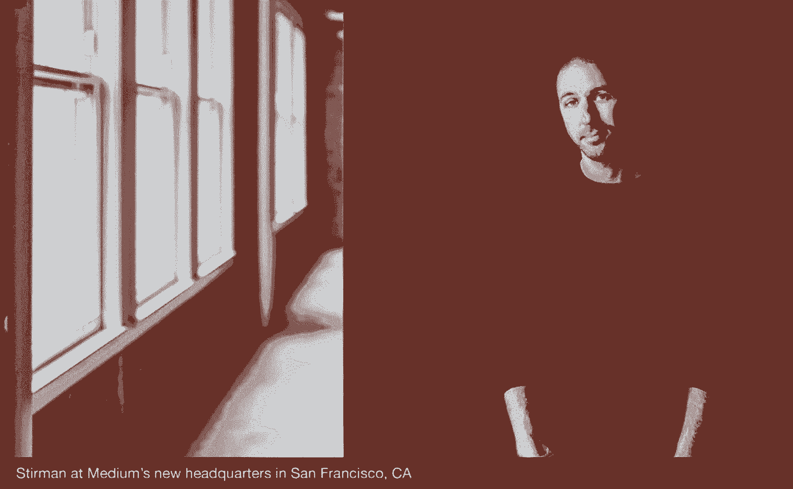

# 如何打造一家没有经理的新型公司

> 原文：<https://review.firstround.com/How-Medium-is-building-a-new-kind-of-company-with-no-managers>

***编者按:*** *随着规模的扩大，Medium 已经改变了它管理组织的方式。你可以在这里* *阅读他们现在是如何管理的* *[。](https://medium.com/the-story/management-and-organization-at-medium-2228cc9d93e9#.dbliza3ee "null")*

在 Ev Williams 开始在 Twitter 上工作后，他联系了德克萨斯州的 Jason Stirman。“你必须到这里来，”威廉姆斯说。“Twitter 正在发展，我们希望你能加入我们。”但是施蒂曼并不容易被说服。“我告诉他，‘你要我为了 140 个字符和一个按钮而搬家？我不这么认为，”施蒂曼说。“我永远不会忘记这一点。Ev 看着我的眼睛说，“如果我们做得好，这将完全改变世界交流的方式。”我心想，‘我喜欢你，但你疯了。”他几乎立刻就后悔了自己的决定，18 个月后，当 Twitter 的员工人数达到 50 人左右时，他决定跳槽。

下一次施蒂曼有机会追随威廉姆斯时，他没有犹豫。在 Twitter 工作了几年后，他意识到创始团队已经不在了，退到他们在 [Obvious Corporation](https://medium.com/obvious "null") 的老巢去策划他们的下一个重大突破。他想加入。“我辞掉了工作，走到他们面前说，‘好了，伙计们，我们在做什么？’伊夫看着我说，“我不知道。想重建互联网？“施蒂曼当时不知道他是什么意思，但听起来很大。听起来不错。结果是 [Medium](https://medium.com/ "null") ，一个承诺再次改变人们交流方式的内容平台。

但是，Medium 不仅仅是对数字出版采取了革命性的方法，它也正在改变公司的运营方式。作为 Holacracy(一种全新的公司结构理论)最狂热和最忠实的采纳者之一，Medium 正在尝试一种完全无管理的环境，专注于完成工作。他说，施蒂曼对结果感到无比兴奋:自由、动力和生产力都是无与伦比的。但是公司不一定要全押在 Holacracy 上来获取利益。如果说他从 Twitter 到 Medium 的转变教会了他什么，那就是总有更多的策略可以让事情变得更好。下面，他分享了自己从这一飞跃中获得的经验。

传统管理就是不适合我。

两年来，Stirman 在 Twitter 上管理着一个团队，但从来没有感觉到这是对的。做他们的老板和做他们的同事之间总是存在矛盾。他阅读了所有关于管理的“正确”书籍，并牢记其中的建议:不要太亲密，向你的团队隐瞒他们不需要知道的任何事情，要求他们找出前进的障碍，平等地奖励他们。他讨厌它。

“管理视角将报告视为资源——比如你如何从这个人身上获得最大价值，”Stirman 说。“但当我想到资源时，我会想到天然气或煤矿。以这种方式思考一个人的生活似乎真的很不人性化。”

由于对糟糕的结果感到沮丧，他决定放弃剧本。他开始在一对一的会议上与他的报告谈论他们的生活，而不是他们的任务，生产力飙升。“当你坐在某人的桌子对面时，问他们‘你的生活中发生了什么事？’这总比问他们“是什么阻碍了你的工作”要多得多。”他说。

每当问题出现时，我会完全忽略它们，关注那些有问题的人。突然间，所有这些问题都消失了。我发誓这就像是绝地武士的思维把戏。

他开始带着他的报告出去吃午饭，喝酒，喝咖啡，看看发生了什么。他们的妻子对她的新工作适应得怎么样？他们新房子的托管完成了吗？施蒂曼说，这是人们带进工作中，但从不谈论的东西。你一问，压力就开始消散。

这种更人性化的方法也开始在其他意想不到的方面得到回报。“我听说我团队中的某个人与另一个团队中的某个人发生了矛盾，导致一切都陷入了停滞——仅仅是因为他们不喜欢对方。我想，如果我只是让他们在一个房间里，我们谈论一切，除了手头的问题？当我们这样做时，我们进行了一些随意的交谈，他们发现了一些相似之处，在一个小时结束时，他们谈论了如何解决他们的问题。这是一场让我夜不能寐的冲突，一旦有空间让他们像人一样交流，冲突就解决了。我想，天哪，这是一种超能力。”

施蒂曼试图保护他的团队免受外部戏剧和政治的影响，但又碰壁了。“经典的管理建议，我所有的导师都告诉我，让你的团队与外界隔绝，让他们不会担心，会让他们更有效率、更快乐，”他说。“但他们只是变得愤怒、困惑和疏远。我不断审查所有这些信息，当他们知道一切时，他们会更开心。”

有了这些发现，施蒂曼想测试其他管理理论。“从来没有人质疑有更好的方法来做事，一切都与谁向谁汇报紧密相关，”他说。“但我本质上是个工程师。我开始像对待大型 A/B 测试一样看待管理，目标是做出更多数据和结果驱动的决策。”在寻求新的实验的过程中，他偶然发现了《你的大脑在工作》这本书，这本书支持所谓的围巾方法。

围巾代表 **s** tatus、 **c** ertainty、**a**autonomy、**r**elantity、 **f** airness。“基本上，当一个人对自己诚实时，他们最受这些品质之一的激励，”Stirman 解释道。“作为一名经理，你可以找出哪个人激励哪个员工，并相应地奖励他们。许多经理会看着他们的团队，心想，‘我们应该增加一轮薪酬，因为每个人都工作得很努力’，但这并不是对每个人都最好的激励，”它看起来是这样的:

**地位**导向型员工可能会因为头衔的变化，或者自己的名字与更重要的项目联系在一起而受到激励。

以确定性为导向的员工只是因为确信他们的工作很重要，而且他们表现出色而受到激励。

以自主为导向的员工可能需要在家工作的能力，或者干脆戴上他们的耳机，不去理会其他人。

与同事交往的机会——快乐时光、垒球比赛等——让以关联性为导向的员工充满活力。

以公平为导向的员工希望知道竞争环境是公平的，他们没有被剥削或欺骗。他们需要持续不断地听到它。

“事实证明，有些人真的在乎其中一个，而不是真的在乎其他的，”施蒂曼说。“一旦我让我的团队对他们的优先事项进行排序，我就确切地知道如何实现它们。所有的小问题和性格冲突都开始消退。”

这种打破与企业智慧等级的意愿为施蒂曼进入 Medium 奠定了基础，在 Medium，清晰的沟通、激励和责任是保持组织航行的无形电线。

# 从零开始

大约一年前，Medium 采用了 Holacracy 模式。施蒂曼称之为“毫无疑问，这是我所知道或见过的组建和运营公司的最佳方式”。他尤其被该战略清晰的极简主义和逻辑所吸引。“它基本上是您组织的一个操作系统，所以我这个工程师喜欢它。事实上，Holacracy 组织刚刚发布了其章程的 4.0 版本，所以我们的公司正在升级——就像你升级到新的 iOS 一样。”

# 以下是 Medium 信奉的一些关键原则:

没有人事经理。最大自主权。

有机膨胀。当一项工作变得太大时，雇佣另一个人。

张力解析。找出人们面临的问题，写下来，系统地解决它们。

让每件事都清晰明了——从休假政策到每个领域的决策者。

分散决策权，不鼓励寻求共识。

消除所有让人们担心的无关因素，这样他们就可以专注于工作。

“这种结构完全是围绕公司实现其目标所需的工作来构建的，”Stirman 解释道。“我们没有人的等级制度，我们有圈子的等级制度。”例如，阅读和发现(RAD)圈，包含致力于网站阅读体验的角色，嵌套在产品开发圈内，正如创作和反馈圈一样，都是关于内容创作过程的。在这种情况下，产品开发圈可以回顾嵌套圈的结果，以将产品导向特定的方向。圈子里的每个成员都有一个目标，这个目标与更广泛的圈子的目标相联系，而更广泛的圈子的目标又与公司的目标相联系，所以每个人总是被拉向同一个乐土。

“在 Twitter，目的改变了几次，从建立一个很酷的产品，让它受欢迎，使它成为一个可持续的业务，并在那里改变世界，”Stirman 说。“我最终感觉我的工作与更高层次的目标非常脱节，我知道我团队中的其他人也有同样的感觉——很难将这些点联系起来。”

为了帮助解决这个问题，我们不再关注员工，而是关注角色。每个圈子都有一个“领导环节”,他决定这个圈子需要什么角色以及如何分配角色。事实上，如果带宽和专业知识允许，一个人可以担任多个角色。施蒂曼既是人员运营主管，也是单词大师(在标点符号和大写字母以及其他基于单词的难题上拥有最终决定权)。通过这种方式，人们可以为自己构建多才多艺的角色，这些角色体现了他们的全部技能，而不仅仅是一种能力。

这个以角色为中心的组织还优化了尝试的想法和策略的数量，同时还严格控制了发布的内容。例如，有一个名为“产品战略”的角色，目前由 Ev Williams 本人担任，该角色决定哪些功能上市。但是，像 RAD 这样的团队可以决定哪些想法可以被原型化和构建。

一旦某个特定的角色有太多的工作要做，它就会演变成一个由多个成员共同承担的循环。“在传统公司，结构不会根据工作而改变，”施蒂曼说。“你会看到很多公司试图将现有的工作强加到现有的结构中，这可能会变得很混乱。”

这种对有机增长的强调有一个分配权力的附带好处。在 Holacratic 系统中，个人在没有经理的情况下运作，因为他们中的许多人在特定领域拥有决策权。因为每件事都尽可能明确，所以组织中的每个人都知道谁对什么有权力。施蒂曼解释说:“让权力尽可能广泛地分布会好得多，这样更多的人可以做出更多前进的决定。”。“这种结构更倾向于快速行动，尝试新事物，并根据需要进行调整。你不必等着每个人都爬上梯子来签字。这可能需要几周或几个月的时间，当 Holacracy 说，“你知道吗，我们将雇佣我们认识的最好的人，并相信他们会为我们做决定。”人们整天都在做决策，拥有公司的一部分，并据此行动。这创造的动力远远超过某人做了一个错误的决定。你也有动力迅速改变路线。"

通过在会议上表达“紧张情绪”,可以进一步帮助和加快决策。施蒂曼广义地定义了张力的这种用法，称之为“是什么和可能是什么之间的任何差异。”从这个意义上说，紧张可能是负面的(例如，我没有时间做那个项目，我的椅子不符合人体工程学，等等。)或积极的(例如，我对我们应该创建的功能有一个愿景)。紧张在战术会议中解决，每个与会者要么分享紧张，要么通过。这样，鼓励每个人在遇到问题或看到机会时畅所欲言。

“Holacracy 和传统管理的区别在于，当你有底层的人和顶层的人时，总是顶层的人试图找出他们的紧张关系，然后他们让底层的人解决它们，”Stirman 说。“没有人考虑底层人民感受到的紧张、想法和问题。他们整天都在解决他们没有的、甚至可能不理解的紧张关系。”

在战术会议中，一个训练有素的主持人会列出人们向团队抛出的紧张关系，剩下的时间用来尽可能地解决它们。这并不意味着解决重大问题。它是关于确定解决方案的下一个正确步骤。“如果我是一个说按钮应该是绿色而不是红色的人，在一个典型的会议中，这个对话可能会持续几个小时，几天，几周而没有明确的行动，”Stirman 说。"对我来说，一个可行的小办法是安排一次和我们视觉设计师的会面."

对施蒂曼来说，甚至在他听说 Holacracy 之前，紧张关系总是容易识别，但不容易解决。“一旦你意识到什么是紧张，你就能从肩膀和耳朵里感觉到它。你知道你在担心什么。现在，当我发现紧张时，我会记下来。如果我自己解决不了，我就把它带到我圈子的下一次战术会议上。通过这些会议，你总能让事情变得更好。”

# 如何看待荷兰

施蒂曼认为，与经典管理框架相比，Holacracy 有很多令人喜欢的地方。他有第一手经验。“当我想到我在 Twitter 担任经理的角色时，我一直都很紧张。我的团队甚至没有那么多问题，”他说。“尽管如此，在他监管的所有团队中，我的经理总是在灭火。没有人有时间或兴趣来解决我的紧张。现在，通过我们使用 Holacracy 的方式，人们真的更快乐了，他们感觉被倾听，并与组织建立了联系。”

对于那些希望通过在现有模式中注入 Holacracy 精神来获得这些好处的公司，Stirman 有一些重要的建议:

他在 Twitter 上专注于倾听人们关于他们的个人生活和问题就是一个最好的例子。它非常类似于一个空气紧张的安全空间。事实上，他希望他能把自己更个人化、人性化的方法正式化，这样人们就会知道他们可以自由分享，而不是带着他们的问题到处走。

Holacracy 鼓励人们解决他们的紧张情绪和问题，如果可能的话，可以在会议之外单独解决。鉴于公司环境中会议的激增(以至于有些会议会开得太多)，这是一个越来越重要的提示。紧张会议被定义为提出在其他地方无法解决的问题的机会。人们应该只在需要其他人参与或帮助找到前进方向的情况下，向小组成员提出话题。

建立相互问责制可以让层级高的工作场所感觉更平坦，更吸引人。除了向他的报告报告整个公司发生的事情，Stirman 希望他能与团队成员分享他自己的任务和关注点列表。这样一来，他也会对他们负责，让他们觉得不那么受管理。“在 Twitter，有一种共同的权力动态，我的下属觉得要对我负责完成他们的工作，我也觉得要对我的上级负责。如果能更主动一点就好了。”

大多数时候，你知道你的经理要对解雇你负责，也知道你能拿到多少工资。我希望我能坐下来，拿着我的报告说，“你知道吗，这就是在 Twitter 当经理的真正含义，这是我有权做出的决定的清单。我希望我能打破这种权力格局，并因此成为一名更好的领导者。”

与此同时，通过你的报告来分析一些你自己的问题，看看它们是否有价值，这是一个很好的主意。“在 Twitter，我经常被团队的问题所困扰，我认为大多数经理都是如此，”Stirman 说。“我希望我能让我的团队解决他们自己和我的问题。我希望我能问他们更多的问题，更有创造性地提出问题让他们解决，让我们的工作做得更好。每当我的报告问我一些问题时，我发现自己害怕告诉他们“我不知道”，事后看来，我有一个由聪明能干的人组成的了不起的团队，他们通过解决问题而充满活力。事实证明，个人贡献者喜欢被寻求帮助。他们中的很多人都想投中那个致命一击。他们想成为最后一个到达本垒的人。这给了他们一个成为英雄和展示肌肉的机会。最终，它会让人们更加信任我这个领导者，因为我不会过滤掉我无法回答的问题。”

# 在荷兰招聘

鉴于 Holacracy 普通员工的决策权，你可能会认为面试过程会相当独特，或者至少是激烈的。但是施蒂曼说，这与平均水平没有太大的不同——使得更典型的公司以跨文化的方式招聘成为可能。

“当你面试某人时，很容易看出他们是主动解决问题还是承担项目——或者他们只是更擅长被告知该做什么。两人都是很好的人，但我发现大多数人都属于这一类或那一类。“我通常会问，‘告诉我一个你真正感兴趣的项目。’主动型员工会谈论他们发现的一个问题，以及他们是如何解决的。没有的人会说，'我的经理来找我，说你能建…？'你马上就能看出来。对于我们这样的组织来说，被告知该做什么并不合适。"

不要低估招聘中的文化契合度。这是施蒂曼怎么强调都不为过的事情，尤其是如果你想采用一种更为理性的思维方式。“你要确保只雇佣那些你不介意被困在机场的人，”他说。“很多人都落入了这个陷阱，雇佣不符合文化背景的高技能人才。我认为这是最糟糕的雇佣方式——甚至比技能差的人还要糟糕。如果他们像你认为的那样熟练，他们会获得权力和影响力，并对你的技术、流程和产品更加着迷。然后，当你的理由的蜜月期结束，现实开始时，你就会被这个人牢牢缠住。”

# 丢失的那块？

“理论上，Holacratic 系统应该比传统组织的规模大得多，因为圈子可以仅仅根据需要完成的工作无限扩大和划分，”Stirman 说，承认这确实只是一个理论，因为 Medium 目前只有 40 人。

事实上，Medium 团队已经发现了系统中缺少的东西:表扬和反馈。“经理通常负责给人们反馈，指导他们，告诉他们好的工作，所有这些事情对健康的环境都非常重要。施蒂曼说:“当你努力工作的时候，你需要有人叫你出来或者认可你。

即便如此，Medium 的创始团队还是决定采取一种折中的方法来解决这个问题。“我们创造了几个负责给人们定期反馈的角色，”他解释道。“这就是我们开始绕开人事经理的地方，因为这听起来的确像是管理，但这些角色并不对人们的工作负责。与其说是管理关系，不如说是导师关系。”

这些角色被称为“领域领导”，由设计和工程等不同领域的经验丰富的成员担任。除了指导，他们还主要负责招聘和解雇。他们与“领导环节”密切合作，这些“领导环节”定义并填补他们圈子中的角色，以评估绩效。“领域领导对人负责，而不是对工作负责，”Stirman 说。“这是我们正在尝试的东西。”

为了从积极的方面补充这一策略，该公司还推出了一种“击掌机”——一种任何人都可以在其中写下并表扬同事的仪表盘，在办公室内流动。这是一个诞生于 Holacracy 的发明，产生于这种系统创造的独特需求。

“我们已经学到了很多，我很高兴我们正在尝试，”施蒂曼说。“没有人知道未来，但现在当我听到事情应该这样做，或者有人说‘这是一直以来的做法’，或者任何管理 101，我就像‘去他妈的。’我们有时可能只是为了与众不同而以不同的方式做事，但这也让我们能够接受如此多的新事物。"

(摄影:海伦娜·普莱斯