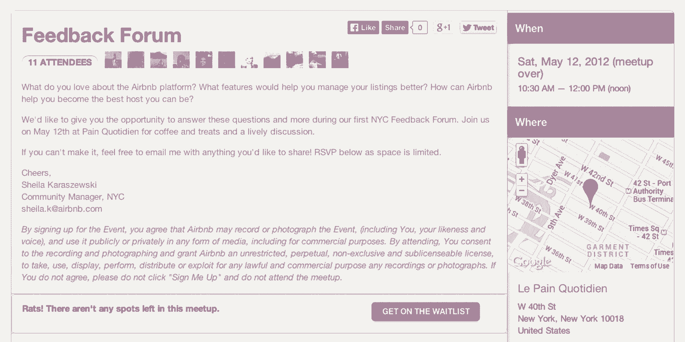
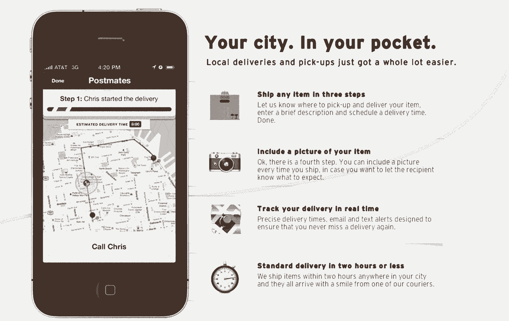
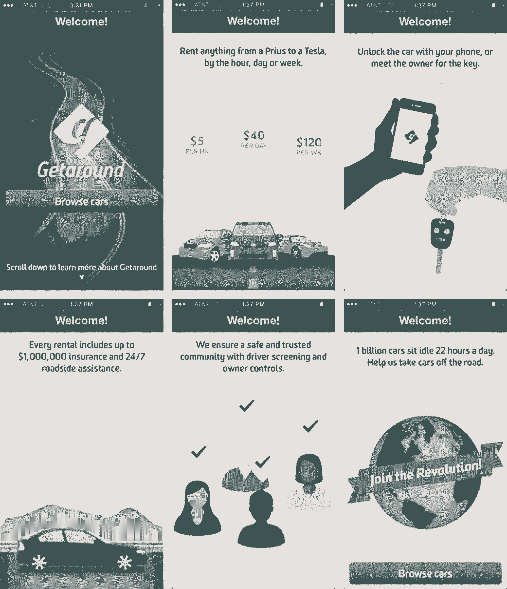

# 优步和 Airbnb 等现代市场如何建立信任以实现流动性

> 原文：<https://review.firstround.com/How-Modern-Marketplaces-Like-Uber-Airbnb-Build-Trust-to-Hit-Liquidity>

*本文由 Threadflip 前产品负责人**[Anand Iyer](https://www.linkedin.com/in/anandiyer "null")**撰写。他在* *[@ai](www.twitter.com/ai "null")* *发微博。*

2009 年，Airbnb 因每周 200 美元的收入而濒临破产。从那时起，超过 900 万人使用它来寻找临时住房。Etsy

这些进入市场空间的人逐渐取得了巨大的成功，这为 **[【优步】](https://www.uber.com/ "null")** 和 [Lyft](https://www.lyft.com/ "null") 的突破性增长铺平了道路，市场模式的初创公司也出现了爆炸式增长: [Postmates](https://postmates.com/ "null") 、 [Getaround](https://www.getaround.com/ "null") 、 [Taskrabbit](https://www.taskrabbit.com/dashboard "null") 等等——迅速超越了以 Craigslist 为代表的老牌公司。

市场初创公司是独一无二的，因为它们不仅仅服务于一个客户群。他们连接买家和卖家，服务提供商和消费者。他们必须确保用户彼此之间以及他们的公司都有良好的体验。作为时尚市场 **[Threadflip](http://www.threadflip.com/ "null")** 的产品负责人，这在很大程度上取决于我们激发和保持信任的能力，这一点对我来说非常重要。虽然“信任”听起来像是一个主观的术语，但建立信任却是高度策略化的。

# 创建托管环境

让我们仔细看看 Craigslist。作为一名消费者，你进行搜索，你给卖家或供应商发邮件，你跟踪你发邮件的对象，你安排取件时间并亲自监督交易。尽管有很高的匿名性，很差的移动界面——忽略了移动参与的高峰——并且没有保证，你还是做了所有这些。为了节省时间和获得保证，您愿意多付多少钱？这是市场创业公司寻找机会的地方。

然而，一家市场初创公司要想获胜，[它需要尽快获得流动性](http://techcrunch.com/2012/08/19/how-to-structure-a-marketplace/ "null")。流动性是如此强大的力量，这就是为什么大多数市场，更一般地说，像 Craigslist 这样的[网络效应企业，不容易被扰乱。也就是说，越来越明显的是，买家和卖家正在寻找更好的结构。](http://thegongshow.tumblr.com/post/345941486/the-spawn-of-craigslist-like-most-vcs-that-focus "null")

更多的用户希望平台为他们做所有的工作。这就是为什么高度**垂直化的游戏**对投资者越来越有吸引力。当你专注于一个非常具体的领域时，就像 [Homejoy](https://www.homejoy.com/ "null") 专注于房屋清洁，你就有[更好的机会服务于该市场的所有需求并与众不同](http://cdixon.org/2012/11/23/some-problems-are-so-hard-they-need-to-be-solved-piece-by-piece/ "null")。作为一名创业领导者，你的工作是确保你的客户相信你能满足并不断超越这些需求。

为此，管理良好的市场优先考虑以下特征。

**可操作的评级系统。**

大多数公司都在交易过程中为买卖双方建立了星级评定系统。例如，优步、[飞轮](http://www.flywheel.com/ "null")和 Lyft 要求司机和乘客在一次旅程结束时评价他们的体验。然而，为了让这些数据变得有价值，公司不得不在几乎察觉不到的情况下使用评级来过滤掉不良用户，并不断改善服务。

优步用户不想花时间筛选司机的评级和评论。你希望公司已经从系统中删除了评级低的驱动程序。在优步，你永远不会看到低于 3 星级的车手，因此，很少有车手担心会有糟糕的体验。由此得出的推论是，司机可以依靠该系统来剔除辱骂或欺诈乘客。对双方来说，评级有助于人们相信他们会得到他们所期望的。

精心策划的内容。

这么多选择，用户对任何有问题的内容都没有耐心。对我们来说，这意味着 Threadflip 上列出的受损或过度使用的衣服，但也包括 Airbnb 上的破旧公寓，甚至是网站上笨拙的结账流程。顾客会去别的地方，而且很快。

作为一名市场管理者，你必须做两件事来防止这种情况发生:你需要雇人不断地寻找和展示你最好的内容，并降低或消除不良内容。您还需要创建面向社区的工具，以便您的用户可以做同样的事情。

Airbnb 就是一个最好的例子。虽然背阴公寓可能会上市，但它们极难找到。一般来说，最好的列表首先出现，这是人工和算法监管的结果。作为一家市场公司，手册或编辑许可是留住用户的一大杠杆。

[Airbnb 发现了这一点，它用漂亮、专业质量的照片取代了用户生成的公寓照片。](http://firstround.com/article/How-design-thinking-transformed-Airbnb-from-failing-startup-to-billion-dollar-business "null")尽管这一策略没有扩大规模，而且现在大多数照片实际上是用户生成的，但它帮助他们为人们列出公寓创建了有用的指南，给了他们所需的提升。

**像机器一样学习的人类系统。**

所有这些市场可能都是由技术驱动的，但它们都是由人驱动的。这意味着两件事:用户期望服务快速、可靠并持续改进——很像软件——但他们不希望品牌是机器人式的；他们想知道真正的人类在那里工作并关心他们。

在 Threadflip，我们的团队了解到，人们不希望为从某人处订购的产品等待超过 10 天。这是我们通过观察自然人类模式定义的阈值。人们通常在工作期间没有时间运送东西，所以他们等到周末。这给了卖家 7 天的宽限期来邮寄包裹。但是一旦 10 天过去了，买家开始报告糟糕的经历。

收集这些数据后，我们采取了快速、精确的措施来缩短发货时间。现在，我们不仅向买家和卖家发送电子邮件，明确列出 7 至 10 天的预期。我们还向卖家邮寄运输标签，这样他们只需将标签贴在统一费率的盒子上就可以发送他们的产品，并鼓励他们在 10 天的窗口内这样做。

Lyft 是另一家采取行动打造更人性化体验的公司。虽然拼车变得越来越自动化，有人可能会说越来越机器人化，但 Lyft 的回应是为司机配备手机充电器，这样他们就可以让乘客有机会在运输途中充电。他们还建议，如果车手愿意的话，司机们可以和他们交谈，当然，还可以提供标志性的撞拳。这种让客户感觉自己是社区的一部分的努力是该公司建立信任举措的一个支柱。

最重要的是，当任何一方的期望被违背时——买家被晾在一边，或者卖家从未收到付款——公司应该部署一个非常以人为本的客户服务战略，严重依赖员工的电话和个人沟通。例如，当糟糕的体验被报告时，Homejoy 会通过电话和折扣进行跟进。

就我个人而言，我会永远记得有一次我给了一个拼车司机一个三星级的评价。几乎就在同时，我收到了一封来自一位具名客户服务代表的电子邮件，询问有关此次体验的更多信息，并明确表示她会将我的反馈传达给驾驶员运营团队，以做出改变。由于这种人性化的体验，我今天仍然是一个快乐的顾客。

**关注供应。**

为了取得成功，市场公司需要专注于他们的供应商——平台上的卖家和服务提供商，使他们的产品成为可能。对于许多专注于取悦传统终端用户的初创公司领导者来说，这可能是违反直觉的。

但对于买家来说，实际上很少是不寻常的。大多数人习惯在网上购买甚至订购服务，无论是从亚马逊还是易贝。另一方面，越来越少的人习惯于运送产品、提供出租车服务或把自己的房子交给其他住户。

出于所有这些原因，至关重要的是，市场首先要专注于为供应商设计一种优雅的、有指导意义的、最重要的是简单的体验。

就像 Lyft 为其司机提供手机充电器和如何成为一名优秀礼貌的司机的[剧本](https://www.lyft.com/drive/help/article/1229200 "null")一样，我们在 Threadflip 的团队将向卖家发送运输用品，如箱子，甚至免费的人体模特，以帮助他们展示二手衣服。(**有趣的事实**:比起真人，人们更有可能购买他们在人体模特身上看到的二手衣服——这些数据是 Threadflip 收集并发布的，以帮助其卖家建立基础。)通过为卖家制作可消化的包容性材料，我们已经能够激发忠诚度，并将卖家转化为我们品牌的传播者。

另一个最佳实践是**建立论坛或社区空间，卖家或服务提供商可以直接联系，分享挑战和最佳实践。**例如，Airbnb 主办反馈论坛，让主持人可以谈论他们的房源中哪些地方做得最好，以及如何尽可能成为最好的主持人，包括提供新毛巾或一冰箱的零食。

在 Threadflip，我们实际上开始更专注于买家体验，但当我们看到买家和卖家的净推广分数之间存在巨大差异时，我们改变了策略。卖家显然需要更多的支持。

作为回应，我们建立了仪表板来跟踪顶级卖家在过去 7 天、30 天和 90 天里赚了多少钱。这有助于我们密切关注我们所有的顶级卖家和有影响力的人，这样我们就可以征求他们的反馈，并建立更牢固的个人关系。

对于那些一直出现在所有这些榜单上的顶级卖家，我们的领导团队会定期进行一对一的电话拜访，了解他们对这种体验的满意程度，以及我们可以采取哪些不同的做法。每当一个新的畅销品出现在我们的视线中，我们都会尝试打电话询问可以立即改进的新想法。

除了收集反馈，我们还努力为卖家提供他们需要的分析，以了解他们行动的投资回报率，并做得更好。通过紧密结合产品运营和客户服务，我们能够立即对卖家反馈做出回应。将供应方作为核心价值所带来的产品变化最终将我们的卖家净推介值提高了 70%。

# 投资于你的界面

市场初创公司可以在三个领域投入更多精力来获得巨大收益:移动开发、支付处理和用户介绍流。这些应该是你的产品和工程团队的首要任务，如果他们还不是的话。

**移动命令式**

正如 Benchmark Capital 的 [Bill Gurley](http://abovethecrowd.com/about/ "null") 在他的文章“[中所写的，所有的市场并不都是平等的](http://abovethecrowd.com/2012/11/13/all-markets-are-not-created-equal-10-factors-to-consider-when-evaluating-digital-marketplaces/ "null")，”移动技术有巨大的机会来增加价值和增强用户体验。设计良好的移动应用可以大大减少参与者的工作量，并增加转换到另一个平台的成本。

最重要的是，新市场的大部分用户是千禧一代，他们中的大多数人通过智能手机访问他们专用的应用程序。如果你是这些创业公司中的一名技术领导者，你的团队的核心重点应该是开发一个简单的应用程序，以满足供应商和消费者的需求，无论他们有多精通技术。

同样，在这个领域，销售者和服务提供商往往是事后才想到的。我曾经用一个 app 找了一个打杂的来修家里的一些东西。原来这家公司通过发送数字代码向其勤杂工传达工作。例如，4 可能是一个非常严重的问题，但也可能是管道问题或电气问题。代码没有指出勤杂工需要携带的工具，导致双方都有不好的用户体验。该公司有机会更好地利用 SMS，但没有这样做。

另一方面，送货服务 Postmates 通过提供一个易于阅读的地图来显示送货人的确切位置和他们正在完成的工作阶段，从而利用了移动平台。通过借用人们已经习惯的熟悉的移动格式(地图),这对巩固信任大有帮助。同时，通过 Postmates 订购的人可以随时给快递员打电话或发短信。

**无摩擦支付**

Craigslist 在新市场面前节节败退的最大原因之一是，支付没有整合到产品体验中。大多数人用现金支付，价格上下浮动，双方都没有保证。

像优步和 TaskRabbit 这样的公司通过让人们足够信任他们来存储他们的支付信息，使每笔交易绝对无缝，从而取得了胜利。从来没有人担心某种形式的支付会不被接受，或者会在最后一刻出现某种问题。越多的技术可以让支付成为一个看不见的过程，就越好。

当亚马逊推出一键式支付时，它的年收入估计增加了 24 亿美元。人们只需输入一次信息，就再也不用担心了。现在，像 [card.io](https://www.card.io/ "null") 这样的公司让这变得更加容易，他们允许用户简单地拍摄他们信用卡的照片来获取数据。支付公司 [LevelUp](https://www.thelevelup.com/ "null") 在整合 card.io 基于扫描的结账体验后，销售额跃升了 13%——但创新可以在这个方向上更进一步。

**良好的第一印象**

一个应用要想成功，用户需要立刻明白为什么它对他们有价值。营销不应该是关于为什么一个产品是好的，它应该是关于买方/卖方双方用户的利益。这就是为什么快速、机智、简短的介绍是如此重要。

可以说，为你的移动应用赢得一个保留的既得用户比开发产品本身更难。但是有几件事可以让用户轻松进入漏斗顶端。例如，Getaround 并不是一个最简单的概念——它让其他人的汽车可供租赁。然而，当你第一次下载应用程序时，它会带你通过几个非常简单、有指导意义的屏幕来讲述故事，并把你带到一个容易上手的地方。

请注意“信任”一词的直接使用通过让用户对你的产品产生第一次接触，你不仅在他们和你的品牌之间建立了稳固的关系，而且在他们交换商品和服务时彼此之间也建立了稳固的关系。不要回避直接或强调这一点。

# 提供社会证明

最终，市场是社会企业。它们依赖于关系和网络效应。这就是为什么你可以大幅降低新用户的进入门槛，并通过利用社交证明来增加转化率——基本上是促进许多其他人使用和喜欢你的产品。

正如 Aileen Lee 所说，在社交网络时代，社交证明是“相对未开发的”金矿。它可以有各种形状和大小。这不仅仅是关于有多少人在使用你的服务——用户的质量更重要。当涉及到任何社会问题时，质量等同于你对一个人的了解程度。

例如，Airbnb 使用脸书数据来显示用户在某个特定的酒店可能与主人有多少共同的朋友。这是巧妙的设计，让用户觉得自己认识主持人，或者是同一类型的人。他们更有可能去租房子。

接下来的问题是，如果你的市场太年轻，没有大量的用户，该怎么办？你如何从零开始建立社交证明？答案是:不要低估一些推荐和正面引用的力量——尤其是如果你能突出那些被关键社区认为有影响力的人。

最好的办法是把这些支持的话语和真人的脸联系起来。对人们照片的认同让社交证明更上一层楼。这就是脸书巩固其用户保留策略的方式，在登录按钮下展示用户可能认识的人的面孔。在这条线索的指引下，Threadflip 的产品团队将人们的面孔整合到我们的移动应用程序的欢迎流程中。

对于市场来说，重要的是要认识到社交证明不仅仅影响买方用户的获取。事实上，它更能向卖家和服务提供商展示，像他们一样的其他人正在从你的平台上获取大量的价值。他们更有可能走出自己的方式或尝试新事物。

你越能利用其他用户的故事来证明你的市场是多么容易和有利可图，你的供应就越安全。最后，供应是流动性的关键。

*Anand Iyer 是 Threadflip 的产品主管。此前，他是 Hitpost 的联合创始人兼首席技术官，该公司被雅虎收购，并在 IGN Entertainment 和微软管理产品。*