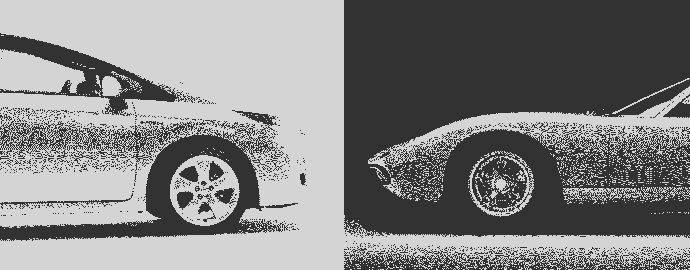

# 旧杂志和兰博基尼如何影响 Flipboard 的设计过程和方法

> 原文：<https://review.firstround.com/How-Old-magazines-and-Lamborghinis-inform-Flipboards-design-process-and-approach>

在加入 [Flipboard](https://about.flipboard.com/ "null") 之前， [Didier Hilhorst](https://www.linkedin.com/in/dhilhorst "null") 共同创立并设计了 [IntoNow](http://www.intonow.com/ci "null") “电视的 Shazam”，并在 [IDEO](http://firstround.com/article/ideo.com "null") 担任交互设计师。现在，希尔霍斯特是 Flipboard 产品设计团队的一员，他在那里帮助打造地球上最受欢迎的应用程序之一。第一轮资本团队很高兴能在我们的[设计+创业](http://www.designplusstartup.com/ "null")系列活动中接待 Didier，在那里他与其他 160 名出席的设计师分享了 Flipboard 的设计理念。

# 不仅仅是设计师

虽然您的设计团队将在很大程度上负责实际的设计实施，但要让公司的每个人都参与进来，从工程师到支持人员。你想让你的公司的 DNA 贯穿于你的产品中，唯一的方法就是让设计过程变得包容。在 Flipboard，这种心态无处不在:每个人都参与进来，每个人都明白产品是什么。

# 建立情感联系

不管你是在 B2B 领域还是在开发消费产品，作为一名设计师，你的工作就是创造能形成情感联系的产品。想象一下 1971 年的兰博基尼米乌拉。这是一辆客观上漂亮的车，你甚至可以说“它尖叫着做爱。”然而，比这辆车的原始情感更令人印象深刻的是它的细节水平:当你打开汽车的前门时，它们看起来像公牛的角。虽然这种类型的设计通常增加很少的功能，但它设法让人们格外高兴。最好的设计师，无论是数字还是非数字的，都要确保他们的产品能唤起这种快乐。

另一方面，普锐斯是由数据和效率驱动的“反汽车”。虽然说它没有建立情感联系是不公平的，但它背后的原理是完全不同的。尽管米乌拉可能会唤起一种极端的情感，但你与普锐斯的联系肯定会更加实际。

# 从实物中获取产品灵感和设计理念

Flipboard 的产品灵感和设计理念部分来自印刷之美。

报纸和杂志布局精美，仍然是一种令人惊叹的设计形式。但就像许多实体产品一样，它们并不总是能很好地转化到数字领域。在浏览器、复杂的菜单和令人生厌的广告之间，网站曾经很糟糕。当你把杂志和它的网站相比时，这是一种完全不同的体验。

iPad 打破了这一局面:突然间你可以触摸内容了。在 Flipboard，这意味着该公司最终可以以这样一种方式进行设计，即它可以将印刷的美丽与数字世界允许的一些功能相结合。

当你拿起一本杂志，没有手册。它没有按钮，没有注册流程，没有脸书连接。Flipboard 从这一点得到了启示。当你打开应用程序时，首先要做的也是唯一要做的就是翻转。布局和文章也是如此。Flipboard 设计了漂亮的交互方式，减少了导航，让使用该产品成为一种体验。

版画是一种灵感，但不是客观呈现的一种复制。更确切地说，它是把印刷品的最佳品质以一种真实的方式带到一种新的媒介中。

当你设计时，特别是对于内容密集型的应用程序，有些 UI 元素在打印布局中是没有意义的。有些东西仍然是列表，有些东西需要用户界面。

Flipboard 的目标是将这两个空间分开，因为如果你试图将两者结合起来，效果不会很好。这延伸到汽车的比喻:如果你试图把兰博基尼和普锐斯结合起来，你可能不会得到一辆好车。作为一名设计师，你必须决定何时何地应用更传统的 UI，哪里有功能，哪里有启示。在 Flipboard 的例子中，它来自印刷世界，但对于您的组织来说可能会有所不同。

# 从“旧东西”中获取灵感

就拿最早的宝丽来来说，那是一部非常成功的电影。你可以在几分钟内抓拍一张照片，并与朋友分享。它是瞬间的。这是社交。它可能是第一个真正的社交摄影产品。Instagram 从这项发明中得到了启示，不仅提供了出色的过滤器。Hipstamatic 向我们展示了你可以在 iPhone 上创建很棒的滤镜，但 Instagram 意识到与朋友分享照片，然后围绕这种互动设计他们的产品才是真正酷的。

“电视节目的 Shazam”into now 也有同样的现象，它从老派电视中获得了很多灵感。每当该应用程序处理音频以试图找出你正在观看的内容时，它都会显示一个有趣的屏幕，让人感觉你并没有真正在等待。

能够从传统产品中获得灵感并围绕它创造有趣的元素是产品开发过程中的一个关键因素。虽然有些人不重视这些小细节，但最好的设计师认识到它们对创造情感联系的产品体验是多么重要。