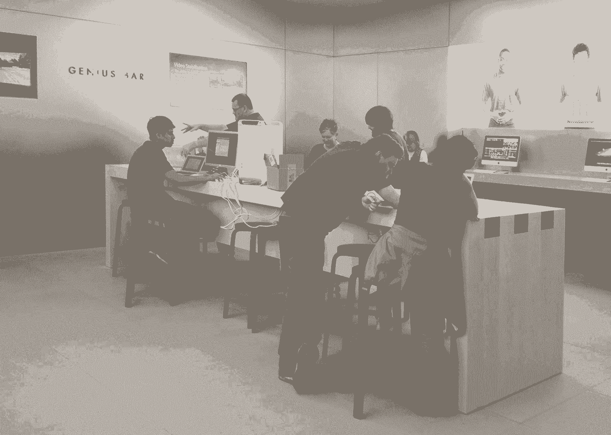
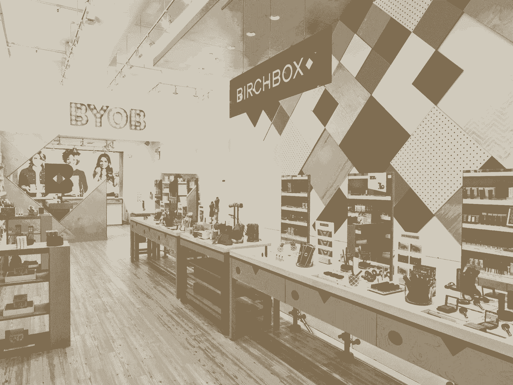
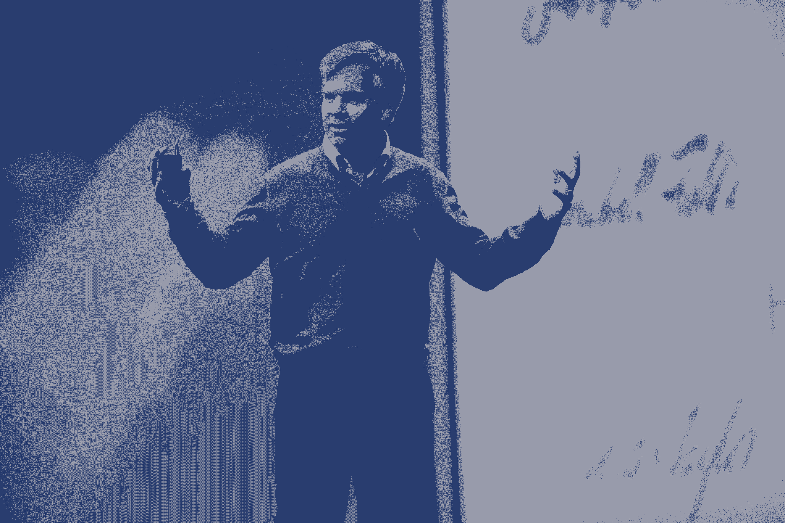

# 从苹果商店的发明者看创业公司如何做零售

> 原文：<https://review.firstround.com/How-to-Do-Retail-Right-from-the-Inventor-of-the-Apple-Store>

当苹果准备开设第一家零售店时，[罗恩·约翰逊](http://en.wikipedia.org/wiki/Ron_Johnson_(businessman) "null") —该项目的总设计师——意识到公司正在犯一个大错误。当他们驱车前往发布会时，他告诉**史蒂夫·乔布斯**，设计是错误的。该公司正在从专注于单个产品转向跨越电影、音乐等的整体生活方式——但这家商店没有反映出这一转变。他们需要重新开始。

几分钟后，乔布斯宣布他们将从头开始重新思考他们的商店策略。约翰逊在很大程度上实现了这一点，他的成果从根本上改变了科技零售业。在加入苹果之前，他领导了塔吉特百货的成功品牌重塑。从那以后，他没能为彭尼创造同样的奇迹。可以肯定地说，谈到零售，他什么都见过。

随着更多像 [Birchbox](https://www.birchbox.com/ "null") 、 [Bonobos](https://bonobos.com/ "null") 和 [Warby Parker](https://www.warbyparker.com/ "null") 这样的初创公司尝试展厅，零售最佳实践正在演变为拥抱混合模式。在斯坦福大学商学院最近的一次演讲中，约翰逊解释了实体战略如何适应消费科技经济，并分享了初创公司打破数字壁垒的策略。

初创公司需要明白的最重要的事情是，销售和创造体验之间有很大的区别。除了弹出式商店和营销噱头，创造一个持久的商业空间还有一个深远的优势，人们希望在这里度过他们的时间——而不仅仅是他们的金钱。

“我们生活在一个高度接触的世界，”约翰逊说。“我们都是群居动物，喜欢参与其中。尽管互联网正在改变商业，但零售将永远有一个实体部分。”虽然电子商务正在增长，但它在美国零售总额中的占比仍不到 7%。

他说，在创业领域重塑零售颠覆了基本的销售剧本。如果你要创造一个伟大的客户体验，“你清单上的一切都需要反直觉。”以下是他如何利用反直觉策略创造独特零售品牌的分析。

**加大赌注重新定义你的市场**

如果你开始真正创新，你将不得不愿意盲目飞行。现有的数据只能告诉你如何改进你和其他人现在正在做的事情，而不是如何在未来做一些全新的事情。给予直觉更多的权重会给领导者更多的空间来选择一条意想不到的道路。

“如果你依赖数据，它会驱动你的决策——大多数公司也会采取同样的方法。”

在约翰逊看来，数据驱动的策略会让你的企业沦为商品。如果其他人也能处理同样的数字，他们很有可能比你做得更好。

“任何时候你想象一些事情，你都会陷入与现实过滤器的斗争——关于你的公司或行业中的业务的假设，”他说。

作为塔吉特百货公司的销售副总裁，约翰逊推行了一个不太可能的想法——推出迈克尔·格雷夫斯的高档艺术家居用品，并将其标榜为“为每个人设计”这不仅开启了他的职业生涯，也改变了美国第二大百货零售商。但这不是一朝一夕的事。

约翰逊说，这个想法起初并没有被很好地接受。其他高管没有认出设计师的名字，并质疑他们的客户是否会重视更高设计的产品。因此，他们关注的是为什么这个想法会失败，而不是认识到业务差异化的机会。

“我们可以为美国中部带来巨大的价值，”约翰逊告诉他们。他的想法不仅仅是以更高的价格进行追加销售——他想象着消费者对塔吉特百货的认知和联系方式会发生翻天覆地的变化。最终，他说服了高层，让他们为格雷夫斯的收藏冒险一试。当他们这样做的时候，他不只是把产品放在商店的货架上，他还在纽约的惠特尼博物馆举办了一场时髦的发布会，把新产品放在伟大的艺术作品的背景下。

“我们邀请媒体来看看什么样的设计适合日常生活中的人们，这是有联系的，”他说。

投资大创意不仅仅意味着在华而不实的举措上赌博——约翰逊对塔吉特百货的计划完全是为了从根本上链接零售商与其服务对象的关系。他认为这种优先顺序的转变对每一个零售企业都有帮助，从科技创业公司到传统百货商店。

**重新思考客户的需求**

当史蒂夫·乔布斯决定将公司的声誉(和大量资金)押在开店上时，他知道苹果产品仍然可以从在线零售商那里买到——这些零售商可能会更快更便宜地处理订单。但人们涌向每一家开门的苹果店。为什么？因为他们提供了人们需要的东西，约翰逊说。

随着技术发展如此之快，人们需要帮助和支持。**在这个世界上，购买前后建立的联系甚至比销售本身更重要**——也就是说，如果你在乎长期的市场支配地位的话。

“你把创造者和顾客联系起来了，”约翰逊说。你建立这种关系的方式将决定你获得的客户的终身价值。一家零售创业公司的平台必须不仅在各种设备上令人愉快，而且在线上和线下都令人愉快。你必须找到一种特别的方式，让人们选择你的界面而不是别人的。

“每天光顾苹果商店的人中，只有 1/100 会买东西。想想看——如果你去全食超市，75%的人会买。在任何服装店，25%到 30%的人会买。在苹果商店，只有一个人购买，但它是商场中最繁忙的商店。这是怎么回事？”

当苹果在 2000 年聘请约翰逊担任零售业务高级副总裁时，其产品被视为专为富有、注重设计和精通技术的人设计的。约翰逊希望它的商店比这张图片更受欢迎。他希望爱好者能够极客，但也给新手他们需要的支持，以设置新设备，了解新应用程序，并通常逗留和玩产品。

**为了设计和营造这种温馨的氛围，Johnson 重点做了三大改变:**

**1)改造销售漏斗:**随着时间的推移，苹果发现顾客可能会在网上购物，但仍然会去苹果商店，反之亦然。销售发生在哪里并不重要。重要的是最终导致每位顾客平均购买近 60 美元的关系。约翰逊不认为实体零售可以或者应该胜过电子商务。相反，实体游戏应该增强在线体验，而不是与之竞争。

**2)理解商店不是仓库:**人们可以在网上买到更便宜的苹果产品，但他们仍然会去商店。这有力地证明了消费者在购物时想要的不仅仅是速度和便利。

约翰逊说，传统商店——那种专注于销售、促销和纯粹的库存转移量的商店——可能会成为过去。“像公共仓库一样的商店不是量身定制的，不是个人的。它们没什么特别的。”

“这个世界将变得越来越个人化。”

这意味着创业公司不能使用上一代的零售剧本。正如他们在网上所做的那样，现实世界中的零售创新者需要投资于复杂的支付处理，并开发客户关系管理系统，该系统可以无缝跟踪从线下浏览到移动参与和电子商务购买的所有接触点。例如，苹果公司已经迅速转移到移动解决方案，在他们的商店里结账。顾客可以[下载一个应用](https://itunes.apple.com/us/app/apple-store/id375380948?mt=8 "null")然后真正地自己结账，这样他们就不用排队了。

Warby Parker 是另一个相关的例子。这家时尚的眼镜销售商密切跟踪店内顾客流和偏好，以及在线行为，在一个地方汇编该公司端到端的顾客互动。电子邮件营销、网站浏览和账单信息被整合在一起，以便公司能够跟踪客户的旅程，并了解何时何地进行优化。

现实世界的陈列室提供了一个亲自利用这种关系历史的机会——但它需要新型的互动。苹果天才吧(上图)是重塑店内互动的主要模式。沃比·帕克的几家商店都配备了照相亭和其他与众不同的惊喜。在 Birchbox 位于曼哈顿的全新商店，浏览者可以做指甲、头发或化妆，此外还可以构建自己的生活用品盒。

**3)销售体验:**当约翰逊和乔布斯一起设计第一家苹果商店时，他们有一个共同的标准:必须提供出色的体验。像 Genius Bar 和互联网接入这样的功能可能离销售只有一步之遥，但它们巩固了服务的标志性高标准。

“这是一场纯粹的比赛，”约翰逊说。“真的没有妥协。即使是今天，你走过苹果商店，看到人们觉得他们属于那里。”

毫不奇怪，不妥协会带来严重的风险。当约翰逊加入苹果公司时，它只占有 3%的市场份额，而且还在亏损。设计(然后重新设计)零售店是一个未知的领域。很快，苹果已经多次被宣布为世界上最有价值的品牌。[曼哈顿标志性的玻璃立方体商店现在是纽约的地标](https://www.apple.com/retail/fifthavenue/ "null")。

这如何适用于下一波不一定拥有优质产品的技术公司？

“高科技和高接触必须结合起来，”约翰逊说。这听起来可能违反直觉，但技术要求一定程度的亲密。“技术是很难的——如果你也想向某人学习，你希望能够与他们面对面交谈。你必须想出如何创造更多亲密、更好的关系。”部分原因不是强迫，甚至不是建议人们在这个时候购买。

**为不在销售中结束的面对面接触做准备。约翰逊说:“没有人喜欢佣金推销员——你想要的是能看透你内心，而不是你钱包的人。”。建立一支员工队伍，教导顾客充分利用他们的产品。在商店的时间应该是教育和娱乐，而不仅仅是购物。**

去你的客户已经在的地方。“你去斯坦福购物中心，你可以看到世界在你眼前发生变化——购物中心将继续存在，但现在它是餐馆，它是 SoulCycle，它是各种各样的参与活动，商店越来越少。”苹果公司确保其商店位于混合用途空间的中心。它们也不仅仅是陈列室。它们是游戏空间、沙箱、修理店和教室。

**追求知名度，而不是市场份额。**在 Target 的 Graves 实验之后，Johnson 的 CEO 谨慎地建议他们用三种以设计为导向的高成本产品试水。相反，约翰逊掷骰子，推出了 140 种不同的商品，放在整个商店的显著位置。也许他们不会出售一件高档商品，但逻辑是顾客会开始以新的眼光看待商店的所有产品。这让塔吉特成为了一个与众不同的低成本、高格调的选择。

**重新审视定价——但要小心行事**

标准的创业智慧认为，客户想要更多的定价选择，而不是更少，每次互动都应该有助于转化。然而，在零售业，这种方法失败了——约翰逊说，这可能是应该的。

“在从苹果到星巴克的公司——我们今天购物的大多数地方——你知道价格是多少。还有诚信。”

他艰难地认识到，这种策略在真空中不起作用。当他介入领导 J.C. Penney 的新零售战略时，他无意中掀起了一场价格战，不是与竞争对手，而是与客户。他取消了优惠券、限时抢购和大多数清仓定价。结果，对价格敏感的客户纷纷逃离。

“我们在执行上失败了，行动太快了，”约翰逊说。

但这能否定他的定价理论吗？他的书里没有。谈到定价(以及其他)，他说，“在与公司的关系中，每个人都应该得到真相。我想找一家有 109 年历史的公司，看看我们能否找到一种方法让它在未来 100 年取得成功。”

“事后看来，我们最大的错误:我们走得太快了。对我们的董事会来说太快了，对我们的客户来说也太快了。”

他在 J.C. Penney 的经历让他对零售领导者一开始就需要运用的策略有了新的认识。

**尽早买入，让它决定你的节奏**

约翰逊开始推动百货公司的重大变革，认为自己获得了广泛的支持。“许多人安于现状，”他说。“最让我吃惊的是，人们不会告诉你他们实际上相信什么。我认为，作为一名领导者，我建立起来的信任和社会资本会转移。事实是，你必须自己去争取。不能想当然。”

但是，赢得认同是推动变革所必需的，这一观点也有好处。这也给了那些有充分理由的创新者从群体中领先的机会。你只需要早点开始，和有影响力的人建立正确的关系，他们会在适当的时候支持你。

“你不一定要在一家公司里身居高位才能有影响力。”

“我在塔吉特百货是一个冉冉升起的中端市场的人，”约翰逊说。“我们做了我们认为正确的事情，这影响了整个公司。**最佳的领导力是视情况而定的。你不能在生意场上坐以待毙，等着别人做大事。**”

到目前为止，约翰逊已经两次被认为在零售业开发了“下一个伟大的想法”。但他并不是凭直觉在塔吉特百货和苹果公司取得重大突破的。他必须像其他任何人一样，有策略地学习一项技能，从而培养良好的直觉。

“我是从默文的地板开始的，”他说。“在最初的几个月里，我们甚至不被允许会见客户。我卸了三个月的卡车，我变得非常快。”但是那段时间不仅仅是用来搬箱子的。

“艺术就是你正在学习的东西——如何销售商品，良好的包装，如何在拖车上组织起来，如何有效地储存，如何确保货物到达地面？”

正如 Homejoy 首席执行官 Adora Cheung 通过全力以赴擦洗客户的家而深入了解清洁行业一样，Johnson 也了解了装卸码头和收银台后面的零售细节。

“学习几乎任何事情的方法都是通过做。”

“这给了我一生的知识，”他谈到这份早期的体力劳动。“现在，我可以穿过一家商店，看到一些如果我不这样做就不会发现的东西。”

约翰逊的“自下而上”方法正好相反。他说，有时候，你会在你的计划上投入大量资金，然后需要把它扔出窗外——即使这真的很尴尬。

**愿意重新开始**

那次与史蒂夫·乔布斯(Steve Jobs)的尴尬乘车之旅——也就是约翰逊宣布商店重新设计的惊人消息的那次——现在已经成为他的零售战略的核心部分，由他的朋友兼导师指导。

在商店设计团队同意放弃他们的计划并重新开始后，乔布斯打电话给约翰逊提出了一条建议。

“你让我想起了我和皮克斯合作的每部电影中所学到的东西，”乔布斯告诉他。几乎每部电影，就在上映前，制片方都会意识到剧本的某些部分可以做得更好。要么是结局不太对，要么是角色没有凝聚在一起。这意味着推迟发布日期。这意味着其他变化的巨大连锁反应。尽管如此，做得正确更重要。

“你只有一次机会拍电影，”乔布斯告诉他。“你只有一次开店的机会。关键不在于你做得有多快，而在于你绝对做到最好。”

今天，约翰逊回应了这些观点:“这与上市速度无关。你必须愿意重新思考事情，有勇气重新开始。”

*[点击此处](https://www.youtube.com/watch?feature=player_embedded&v=e_HByVsugQY "null")* *观看斯坦福大学商学院的演讲原文。*