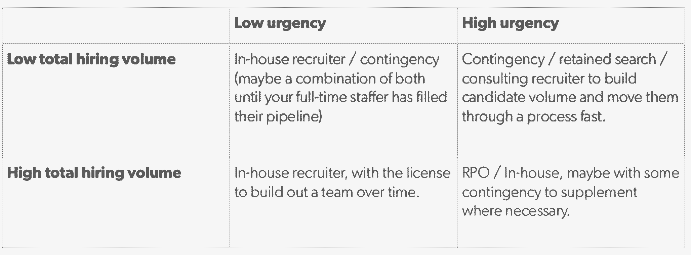

# 我和数百名招聘人员合作过——以下是我学到的东西

> 原文：<https://review.firstround.com/Ive-Worked-with-Hundreds-of-Recruiters-Heres-What-I-Learned>

*本文由* *[彼得·卡赞吉](https://www.linkedin.com/in/kazanjy/ "null")* *联合创始人 TalentBin 撰写。*

当你经营一家软件招聘公司时，你最终会收到其他刚开始招聘的创始人提出的许多问题。我得到的第一个问题是:我怎样才能找到一个优秀的招聘人员？

这是当务之急，理由很充分。如果你做得对，招聘是你最耗时耗力的任务之一。[这就是你如何在一开始就找到最优秀的人。但当你遭遇高速增长，或者你的领导层需要在产品上做文章时，这并不总是现实的。很容易落后。一个匹配良好的招聘人员不仅能赶上你，还能帮助你通过巨大的步骤变化推动你的创业。](http://firstround.com/article/Mine-Your-Network-for-Early-Stage-Hiring-Gold "null")

那里的操作部分是“配合得很好”如果你最终和一个不了解你的公司或你的使命的招聘人员一起工作，或者他不具备他们需要的全套技能，你可能会在你最重要的发展领域停滞不前。这是高风险的。我在 TalentBin 工作期间，见过数百家各种阶段公司的招聘关系。我见过它是如何与内部招聘人员、代理机构、顾问等合作的。以下是你需要知道的。

# 首先，你需要什么？

大多数“创业建议”最糟糕的一点是，它不是针对特定阶段的。它解决了一种体验，但是你的痛点可能会完全不同，这取决于你的公司有多老，你的领域，你有多少资金等等。所以，与其让我提供一堆没有针对性的智慧，不如让我们来定义一下你的招聘需求到底是什么。然后才能找到正确的药方。

**你可以将招聘需求分为以下几类:**

**招聘人数:**你要招聘多少人？十个市场开发代表？一个安卓工程师？工程副总裁？列一个清单，并预测不久的将来。

**角色类型:**你是在像 iOS 工程这样人才紧缺的市场招聘吗？销售、市场营销、客户服务和其他非技术职能的角色会给你带来更多供应的好处。你在找初级的人吗？领导力？画出你想要的雇员在这两个光谱上的位置。

你多快需要一个人？你需要多快才能坐到座位上？最有可能的是，这是一种混合——你立即需要三个人，然后在接下来的三个季度里每个季度再需要三个人。有一个时间表是很有帮助的，这样你就可以看到这是否真的会根据你的业务需求来调整你的资源。相应地计算人数。

**你的资金情况如何？**也就是说，就招聘费用而言，你能支付多少，你是否能够为你希望获得的人才支付市场价格？你是在自举吗？你唯一的资源是你自己的劳动和股权吗？或者你有流动现金吗？

这些答案既要反映你目前的痛点，也要反映你未来的目标。提前三个季度做计划是安全的，至少是脆弱的，这样你就不会因为没有你需要的人来执行近期目标而陷入困境。

**例如:**销售是否在上升，预计会持续吗？你目前的客户服务团队是否已经不堪重负(除非你有所行动，否则这种情况还会持续下去)？如果是这样的话，您现在就需要 CS 代表，并且您需要开始为他们建立一个渠道。

你是否正在为你现有的 iOS 应用开发一个 Android 版本，以测试它是否适用于那个市场？那么你现在可能只需要一个单独的 Android dev，你可以等着看发货时会发生什么。

是不是刚筹了 A 轮，你的 6 人团队就要跳到 16 了？你可能需要一个工程副总裁来领导这项工作。你将需要一个高管猎头，然后进行认真的渠道建设。

在你做任何事情之前，把你的具体情况写清楚。

什么使招聘人员成为招聘人员？

现在你对自己的需求有了很好的认识，让我们来谈谈如何解决它。

招聘是技能和资产的结合——根据你的需求(如上所述),其中一些对你来说或多或少很重要。知道你的团队应该具备哪些技能，以及哪些技能可以降低优先级，会让你找到合适的招聘人员(或者你根本不需要)。

顺便说一句，招聘人员得到了很多废话。但它正迅速成为一个独立的行业，有自己的实践和工艺。过去，进入该领域的门槛很低。糟糕的招聘人员可能会做出糟糕的行为，结果，他们给许多优秀的招聘人员带来了坏名声。最重要的是，鉴于技术人才的供需严重失衡，招聘人员经常在人们不找新工作的时候出现在他们的收件箱里。当他们工作表现不佳时，他们制造的噪音比信号还多。更不用说，在黑客新闻中抱怨招聘人员有点时髦(“哦，我的上帝，我不敢相信这个人想给我加薪。呀！”).这是销售代表得到的垃圾的近亲，而且没有生产力。

这是千真万确的:招聘人员让招聘市场运转起来。他们进行人力资本交易。如果你对你的老板很生气，或者你觉得报酬过低，招聘人员是天赐之物。如果你失业了也一样。如果你是一名招聘经理，打算在未来六个月内招聘 1000 名新客户，那么能帮你招聘到你需要的 20 名 CS 代表的招聘人员将成为你最好的朋友。

“如果你认为脸书、谷歌和推特是在没有招聘人员的情况下建立的，那你就自欺欺人了。”

这三家公司都需要几十个人专门去寻找最优秀的人来编写代码，接近客户，并在事后让他们开心。这是没有人愿意谈论的最佳实践。

最重要的是，它有不同的形式:

原始劳动:在最基本的层面上，招聘人员是原始的、可替代的劳动，在整个过程中推动候选人前进。他们安排面试。他们监控日历，这样招聘经理就不会错过这些面试。这不是世界上最高技能的劳动力，这是招聘工作流程的一部分，如果有必要，你可以自己做。

*当你需要这样做的时候:*当你有太多其他对你更有价值的事情要做的时候，在这方面获得支持就变得很关键。你可以自己做这项工作，但是如果你把时间花在安排面试上，而这些时间本可以花在产品或销售上，你需要重新考虑请人来帮忙。如果你为了收入或产品市场契合度而牺牲机会，那就更是如此。

**熟练劳动力:**有一组招聘技能更为稀有。他们通常很难找到或自己做。许多招聘人员都有专业知识，可以确保你仔细寻找最优秀的人才。这包括筛选简历，撰写职位描述，预先确定候选人，寻找资源，高影响力，高容量的电子邮件外联。这些招聘人员熟悉能够提升他们搜索技能的工具——[LinkedIn 招聘人员](https://business.linkedin.com/talent-solutions/products/recruiter "null")、[talent bin](https://www.talentbin.com/ "null")ATS systems。他们在电话推销、电话筛选和背景调查方面经验丰富。有些甚至提供面试指导。其他人会帮你为职位空缺制定广告预算，并分配你的开支。

*当你需要这个*:当你自己没有做过很多招聘的时候，一个熟练的招聘人员会比你有很强的优势。你需要这种类型的人——尤其是在销售或工程团队中。

网络/渠道招聘:这是招聘人员比你更有优势的地方。擅长网络招聘的人，每天一天到晚和人打交道。这是他们的谋生之道。他们的潜在候选人网络会让你相形见绌，可能会包括他们之前安排过或非常了解的候选人。他们也有可能为你想要填补的许多职位提供一个预先储备的渠道。这意味着他们可以很快让某人站在你前面进行面试。这是与招聘人员合作进行应急搜索的优势之一。这可能很昂贵，但他们有巨大的影响力。

*当你需要这个的时候*:在与许多不同的人共事多年后，你可能有一个强大的人际网络，但是如果你需要大量的雇佣，这会耗尽你自己的社交图；如果你需要招聘在你的人际网络中没有得到很好代表的职位；或者，如果你想抓住已经在行动中的优秀候选人，你就需要利用这种资源。

组织敏锐度:这是在你当前招聘的背景下帮助实施强有力的流程的能力。一个具有组织敏锐度的招聘人员可以进来，评估你的需求，并为各种角色创建独特的渠道，你可以在加快招聘时复制这些渠道。我们的想法是，无论这位招聘人员是临时的还是加入你的内部团队，你都要记住这一点。可以把这想象成雇佣基础设施或“雇佣文化”这包括良好的电话筛选流程、面试流程、推荐招聘计划、面试结果文档，甚至是帮助招聘成功的有效入职。

*当你需要这个*:对于一次性雇佣，这个就不那么重要了。如果你还没有达到通过管道输送数百名候选人来填补几十个职位的阶段，那么投资这种招聘方式很可能是浪费时间和金钱。如果你能负担得起，这是很好的学习，但不是必须的。如果你正在大规模招聘，但在大规模招聘方面经验不足，那么这些技能对于保持你的候选人高成交率非常重要。让别人为你设计流程可以确保你预先确定了候选人，你的招聘经理问了正确的问题，你没有低效地占用管理层的时间，你对人才的要求很高，并且你控制了每次招聘的成本。

可以说，这些是你可以用来堆放你的橱柜的各种工具，并且应该定义你要找的招聘人员的类型。考虑这些“特性”中的哪些对您今天所处的业务至关重要，这一点非常重要。

**我们去市场吧！**

既然我们已经讨论了你的需求，你也很清楚哪些招聘人员会给你带来什么，那么让我们来谈谈你如何获得这些技能。

内部招聘人员:这可能有点用词不当。这意味着你已经雇了一个人全职从事招聘工作。一个更好的思考方式是“雇佣一个为招聘经理工作的招聘人员作为他们的主要利益相关者。”

内部招聘人员的好处是，他们的激励与你的组织而不是候选人一致。虽然应急招聘人员手中的候选人的目标是最大限度地提高他们的工资(进而提高他们的费用)，但内部招聘人员希望以低成本确保高质量的招聘。

尽管作为招聘人员，他们有自己强大的网络，但他们通常不会有“流动中的管道”，如果你需要立即流动候选人，这可能会成为问题。也就是说，一旦他们产生了一批候选人，这就成了你公司的财产。你也可以用应急招聘来补充他们，直到他们的渠道运转起来。是的，从技术上来说，这是双倍的工资，但仅限于第一次雇佣，对于高管级别的大规模雇佣来说，这是非常值得的。

从成本结构的角度来看，内部招聘人员通常以固定的比率获得报酬——按小时、合同期限或全额雇佣，在此过程中可能会也可能不会获得公平。这消除了绩效工资，这是应急招聘人员的标准。让一个人雇佣许多候选人和雇佣一个人的成本是一样的，这非常有帮助。

此外，作为与你的公司关系密切的人，这位招聘人员可以敏锐地思考，开始建立你将长期使用的流程，并且可能会比任何其他类型的招聘支持更好地阐述你的使命和价值观。他们理解故事、使命和愿景。他们知道你在寻找什么样的人才，他们是团队的一员。

**有几种方法可以实现这一点:**

**1。全员招聘:**如果你在很长一段时间内都有大量的招聘需求(比如一年 10 个)，那么你应该找一个全职招聘人员。从每次租用成本、租用质量和基础设施的角度来看，这种解决方案无与伦比。

“你能做的最好的一件事就是雇佣一位对在公司内部工作感兴趣的前招聘人员。”

尤其是在技术领域，机构招聘人员有着与初创公司需求相匹配的运营节奏和执行能力。他们不是“张贴并祈祷”的类型——他们出去寻找最适合这份工作的人。所以，如果你能找到一个已经在一家机构工作了至少几年的人——最好是在高压力的环境下工作——把他们全职加入你的团队是一个很好的选择。找到一个人，他对从一个孤独的猎手转变为一个想要发展组织并最终领导团队的人感到兴奋。

唯一的缺点是，如果你只雇佣一个人，他们的人力仍然有限。一个人很难独自在一个季度内雇佣 10 名工程师，不管他们有多精明。当然，这取决于你要招聘的职位的难度(工程将比其他职能更加劳动密集型)，以及你补充应急或机构招聘的能力。

如果你真的找到了全职的招聘资源，[并做好了招聘工作](http://firstround.com/article/Asana-Head-of-Talent-on-the-secrets-to-finding-a-great-startup-recruiter "null")，你不仅会找到一个专门从事人才招聘的人，还会找到合适的流程和文化，这些将会让你受益多年。

**2。咨询/合同:**如果你要雇佣的人数较少，在 3 到 10 人之间，而且这种情况会持续一段时间，那么就不值得雇佣一个全职职位。然而，找一个承包商作为权宜之计是个好主意。

你可以与某人签订合同，让他在有限的时间内全职工作(例如，三个月或四次雇佣，以先到者为准)，甚至兼职工作(例如，三个月内每周工作三个半天)。

这些人可以获得与内部招聘人员相同的许多好处(激励匹配、管道建设、组织敏锐度)，但没有长期承诺。期望在单位时间的基础上支付更多，但是记住你仍然在节省雇佣一个正式员工的成本。

你可以在 LinkedIn 上找到这些类型的招聘人员，这将让你了解他们的网络有多大，他们擅长什么。此外，如果你的公司是由一家内部有招聘人员的风险投资公司投资的(现在越来越多的公司有招聘人员)，请他们帮忙。像全职招聘人员一样，他们有着非常好的关系网，可能在他们的后口袋里会有一份优秀候选人的名单。

**3。RPO(招聘流程外包):**如果你有大量的招聘工作要做(这么多的招聘，一个内部招聘人员不足以完成)，RPO 可以帮你。

例如，如果你已经筹集了 A 轮融资，需要在三个月内雇佣 10 个人，然后计划暂停，RPO 可能是一个很好的选择。通过像 [Binc](http://www.bincsearch.com/ "null") 或 [Talent Fusion](http://www.talentfusion.com/ "null") 这样的 RPO，您可以在一段时间内租赁招聘资源。当最初的招聘项目完成后，这些类型的公司甚至可以雇用你一名全职招聘人员在他们完成后留下。

从成本角度来看，RPO 是只有资金雄厚的公司才能实现的。在同样的时间内，成本将是一个合同招聘人员的两倍、三倍或四倍。听起来很夸张，但好处是快速增长和交钥匙人力资本，这将符合你的公司的利益，而且在每次雇佣成本的基础上仍然比纯粹的应急费用更便宜。

这可能不像雇佣全职员工那样划算，但是你为速度和数量支付了额外的费用，这是一个招聘人员无法比拟的，尤其是如果他们刚刚进入你的公司。

**4。按需招聘资源:**这一类别的服务包括从寻源、日程安排到预先筛选等。这样做的好处是，你可以迅速扩大候选人流量，创建一个渠道，并立即利用熟练劳动力。例子包括像 Sourcery 这样的钟点工服务，按需招聘市场 [RecruitLoop](http://recruitloop.com/ "null") ，甚至自由职业者市场 [oDesk](http://recruitloop.com/ "null") 。

有几个缺点。首先，你不会通过这种方式建立任何机构知识。和你一起工作的人会有他们自己的流程，你可能无法访问其中的任何一个。第二，质量有很大的可变性(尤其是像 oDesk 这样的服务)。一旦你看到质量下降，你需要采取行动。但除此之外，按需选项对于扩大你现有的招聘资源来说并不是一个坏主意。

**5。办公室经理:**这个行业有一种常见的诱惑，诱使创始人将招聘工作交给未经培训的办公室经理或行政助理。不惜一切代价避免这种情况。如果你想要最好的，招聘需要是某人的实际工作和责任。

这种策略能够奏效的唯一方法是，如果你试图将你的办公室经理转变为全职招聘角色，并且如果你愿意投资培训，他们将需要做得很好。如果是这种情况，最好的方法是让他们与能够打好基础的签约或咨询招聘人员配对。起初，你的员工可以添加非熟练劳动力，通过钻探和渗透，随着时间的推移可以成为熟练工人。

“如果你发现自己在说，‘哦，我让我的办公室经理来做吧’，那就马上把钱还给你的投资者吧。”

**6。应急:**这是初创公司最普遍使用的招聘资源。他们总是有一个候选人的过程中，使他们成为快速招聘的完美人选。当然，你需要为这种便利支付额外的费用，通常是以招聘费的形式支付被雇佣者第一年工资的 15%到 25%。

*同样重要的是要注意*:他们的忠诚度和激励 100%取决于他们的候选人。应急招聘人员有一份名单，上面的人告诉他们，“我对寻找其他机会感兴趣，”他们的工作就是把这些机会介绍给任何可能适合他们的组织。招聘人员希望给候选人一个薪水最高的职位，他们可能会在那里呆三个月以上(标准保证时间)。所以不要试图低球他们。不要认为你很聪明，把他们的费用降低到 10%或 15%。他们将向那些签约支付 25%的人展示他们最好的候选人。他们不会告诉你的。你会觉得自己很聪明，其实是在害自己。

应急招聘人员也有动力让他们所有的候选人在某个地方找到一个职位，而且要快。这意味着如果你不积极主动地管理他们，他们会用简历淹没你的收件箱。这没什么帮助。这是噪音。为了防止这个问题，你需要清楚你的要求和你的品质标准(具体点，举例说明你想要什么样的人)。

“如果招聘人员提交的候选人不符合你的标准，那就狠狠地解雇他。”

如果你不这样做，而他们认为他们可以填补你公司的一个席位，他们就会欺负你，浪费宝贵的时间。

**尝试简历“一进一出”策略。告诉你的招聘人员，他们一次只能给你发一份简历，直到你回复了那份，就这样。通过将这个过程序列化，你可以激励他们首先展示他们最好的候选人，你也可以保护自己不被淹没在垃圾简历中。同样，不要同时和太多的应急招聘人员一起工作。你可能会想，如果有一个很好，那么来自不同公司的四个会更好。这只有在你严格控制简历提交量的情况下才有好处。否则，你会不知所措。**

作为最后一条建议，要积极回应。如果你的应急公司的客户经理认为你不认真，或者你在招聘过程中没有提供任何帮助，或者你看起来不像会雇佣某人，他们会解雇你这个客户。快速回复简历。不要错过手机屏幕。现身吧，做好你该做的。

应急招聘是一个强大的工具，如果你不小心就会被滥用。但是如果你昨天需要一个 iOS 工程师，而你没有其他资源可以支配，这是你目前最好的选择。这些招聘人员还可以帮你争取时间，让你在内部培训或雇佣员工。时间和速度往往与黄金同等重要。

7 .**。风投招聘人员:**你的投资者的内部招聘人员可以非常有助于提供候选人流和建立渠道，但他们不是来照看你和安排面试的。他们技术娴熟，人脉广泛，见识广博。充分利用这三种品质会让你受益匪浅。利用他们的关系网，让他们做热情的介绍，让他们预先接近重要的候选人。他们通常在所有这些方面都很敏锐，同时也在构建你可以继续使用的流程。

如果你确实有一个办公室经理或人力资源专员，你想把他变成招聘人员，风投团队可以帮忙。他们中的一些人甚至提供剧本来帮助你实施良好的招聘卫生和协议。他们也可以教你先进的概念，比如如何提供一个很好的候选人体验，以及为什么这很重要。他们中的许多人会来到你的办公室，听你说出你的需求，并尽力而为(只要他们有你的认同和积极参与)。总的来说，他们很优秀。

**8。保留搜索:** [这是招](http://firstround.com/article/What-You-Want-in-a-VP-Eng-from-the-Recruiters-Behind-Twitter-and-LinkedIn "null")的黑钻石峰。如果你想找工程副总裁、首席技术官、产品负责人、销售副总裁等。，您就进入了保留搜索的领域。这不会很容易，也不会很便宜。在任何给定的地理区域，有才华的工程副总裁候选人的总数都不多。进入这个网络不是任何一个创始人可以自己获得的。你必须进入专业招聘人员的精英梯队——门票可能会花费你 5 万到 10 万美元。但是你会得到一个有保证的结果。

如果你有一个杀手级的内部招聘人员，他在加入你的团队之前在一家机构完全占据主导地位，他们可能能够完成这种规模的事情。你不想让任何一个人碰碰运气，所以仔细考虑一下。**如果你符合以下任何一条，我建议你走保留搜索路线:**

你刚刚提出了一个想法和一套幻灯片，你需要一个技术合伙人。这是一场微妙的比赛。你需要引进大人物。

你的产品符合市场需求，需要一个工程副总裁来管理你的五人开发团队，并将其扩展到 20 人。

你正在聘用你的第一批高管，他们很可能在某个时候取代你，保持你年轻团队的脆弱化学反应至关重要。

这就是你潜在的武器库，被整齐地列举和解释。你创造的组合将完全取决于你在本文开头概述的需求，你希望从招聘人员那里获得的所谓的“特征”或技能，当然还有财务限制。但是为了给你一个更清晰、更明确的方向，请考虑下面的规则:

