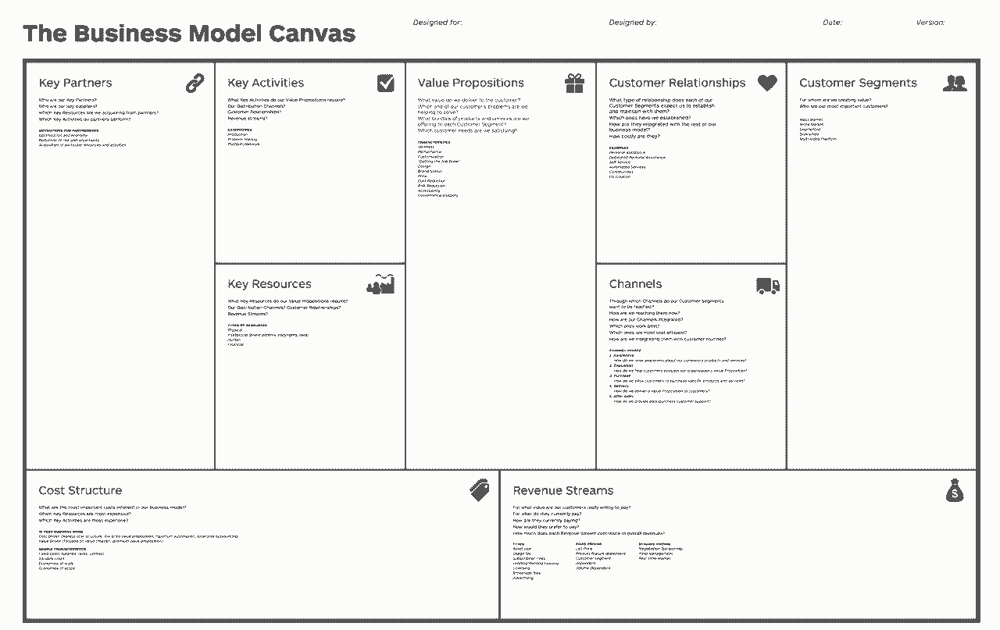

# 在所有错误的地方寻找爱情-如何找到联合创始人

> 原文：<https://review.firstround.com/Looking-for-Love-in-All-The-Wrong-Places-How-to-Find-a-Co-Founder>

史蒂夫·布兰克(Steve Blank)作为初创公司首席执行官的最大失败是在[火箭科学运动会](http://en.wikipedia.org/wiki/Rocket_Science_Games "null")。因为商业模式和创始团队不匹配，团队损失了 3500 万美元。当他环顾高管人员时，没有一个创始人是游戏玩家。更糟糕的是，没有一个人来自游戏公司。董事会里也没有有这种经历的人。最终，它制造出了看起来很漂亮，玩起来却没什么乐趣的产品。

也就是说，如果有可能解读硅谷成功的不可言喻的魔力，[史蒂夫·布兰克](http://steveblank.com/ "null")已经做到了。他的书《顿悟的四个步骤》被认为是精益创业运动的奠基之作之一。他在加州大学伯克利分校、哥伦比亚大学、NYU 大学和 UCSF 大学教过一代创始人。甚至美国政府也使用 Blank 的创业模式将国家科学基金会、国家卫生研究院和能源部的科学家的工作商业化。

然而，对于经常向他寻求建议的学生和创始人来说，布兰克最大的资历就是他自己已经在 8 家初创公司工作了几十年，其中 4 家是联合创始人。据他自己承认，有过很多挫折，也有过全垒打——一路走来，他和 16 位联合创始人一起工作过。当谈到理解科学、商业和心理学的微妙结合塑造了最成功的创始团队时，他是最接近大师的人。

在这次独家采访中，现任斯坦福大学工程学院咨询副教授的布兰克解释了如何使用一种名为[商业模式画布、](http://www.businessmodelgeneration.com/canvas/bmc "null")的工具以及他在此过程中学会的其他策略来寻找最佳联合创始人。他透露，当谈到适合时，找到正确的技能组合和个性可能还不够——这只是他在 21 年与团队合作以获得伟大想法的过程中所学到的经验之一。

**使用业务模型画布确定你需要谁**

创始人 CEO 做出的最早也是最关键的决定之一，就是让谁来帮助实现他们的愿景。布兰克说，设想从头开始建立一个团队是令人畏惧的，但这里有一些好消息:如果你熟悉商业模式这幅画布，你可能已经知道你的联合创始人应该是谁。

但是让我们倒回去。由企业家[亚历山大·奥斯特瓦尔德](http://alexosterwalder.com/ "null")和瑞士学者[伊夫·皮涅尔](http://www2.hec.unil.ch/wpmu/ypigneur/bio/ "null")创建的商业模式画布[是精益创业公司](http://firstround.com/article/To-Go-Lean-Master-the-Business-Model-Canvas "null")(以及越来越多寻求激发新想法的财富 500 强企业)的首选工具。通过将商业模式的元素提炼为九个构建模块(安排来表示它们如何相互影响)，这个令人惊讶的简单网格向领导者提出了挑战，以确定他们成功运营业务所需的一切。如果存在资源缺口或逻辑缺陷，它们很快就会全部显示在一张纸上。

**下面是它的样子:**

对于如何使用它的更深入的描述，[查看这个视频](https://www.youtube.com/watch?v=QoAOzMTLP5s "null")。

当创始人从画布上起步时，他们往往会关注正确的一面。毫无疑问，空白票据——这是产品/市场契合度展开的地方。但是，画布上经常被忽视的左边将告诉你你的创始团队应该是什么样子。在一幅成功的画布上，两面应该相互镜像；右边的都是关于客户的，左边的告诉你需要什么才能接触到他们。

填充在画布上就是一级。但是理解这些盒子的相互作用会把你带到第二个层次。这就是你的画布从清单变成战略的时候。

找到合适的联合创始人是这一战略中最重要的部分之一。从仔细查看你的**关键活动**框开始。在画布上的九个模块中，它最大程度地定义了您需要做什么来构建您的产品并将其成功交付给消费者。然后跳到下一个标有**关键资源**的框中，在那里你将列出执行这些活动需要什么。你需要的东西和你自己带来的东西之间有差距吗？这个 delta 揭示了你需要在你的联合创始人身上找到的专业知识。

例如，考虑任何移动应用程序的启动。在这一点上，可以理解的是，这个领域的创始团队应该包括三个人:黑客、骗子和设计师。这是一句朗朗上口的格言——而且很快就能被商业模式画布解释清楚。

首先，想象一下该公司的关键活动框。让一个移动产品起飞几乎肯定需要三件事——软件开发、用户界面设计和需求挖掘。很明显，对这家初创公司来说，最关键的资源将是人:开发人员，也就是黑客；一个设计师；一个天生的好色之徒，他能领导团队，激发兴趣和销售，在大多数情况下，还能创造资本。

布兰克说:“任何人都可以通过这一练习获得自己的需求——找到自己版本的黑客、骗子和设计师。”“当你考虑引入一位联合创始人时，仔细审视你的活动。你需要谁来完成这些任务，他们是你现有团队中缺少的吗？”

事后看来，在 Rocket Science，显而易见的是，他们需要一位铁杆游戏开发者作为联合创始人，而不仅仅是一名员工。他们需要一个能与现有团队面对面交流的人，告诉他们他们不明白的地方。

这并不是说你在关键资源框中列出的所有东西都需要由一个创始人拥有。例如，你可能会发现，在自由职业者或承包商等第三方合作伙伴的帮助下，执行某些活动会更有效率或更划算。(您可以在画布的**关键合作伙伴**框中捕捉到这一点。)但当涉及到对你公司的 DNA 或成功不可或缺的活动时，千万不要外包。

**以一个经常被引用的建议为例，非技术型创始人需要找到一个技术型联合创始人。**虽然布兰克承认，一如既往，有一些边缘案例证明这句格言是错误的，但他也同意。

创建一个完全由非技术团队组成的科技创业公司，就像开一家没有厨师的餐馆。

“你能和一群不知道如何烹饪或欣赏食物的餐馆老板一起成功吗？也许吧。你可能会很幸运，以后会雇到一个很棒的厨师。但如果你曾经当过厨师，或者有经营餐馆的经验，那肯定会有所帮助。”

**关注正确的里程碑**

对于一家早期创业公司来说，投入关键活动和资源可能会让人感到力不从心。很难知道你需要什么来保持你的公司长期繁荣。但是布兰克有令人放心的消息:你不需要。当你的创始团队还在一起的时候，把注意力放在如何启动业务上，而不是三年或五年计划中的所有里程碑——甚至是未来一年。

相反，选择一个早期目标——这可能意味着制定一个收入目标，达到目标用户数量，或者获得监管机构的批准。你需要什么才能到达那里？“有些创始人会说，比如，‘我需要一个世界级的销售和营销副总裁。’不，你不知道。总有一天你会的，绝对会。但这可能不是你度过头六个月所需的资源之一，”布兰克说。

因此，在审查一位联合创始人时，你的第一个想法应该是:这个人是否拥有从第一天起就对我的企业成功至关重要的技能和知识？我需要他们把这东西弄离地面吗？

本质上，你的第一个问题是，没有这个人我还有公司吗？

也就是说，你不会想给一匹只会一招的小马同等的股份。那么，你如何知道你是否已经找到了一个可以作为联合创始人与你一起成长的候选人，或者你是否已经找到了你的第一个员工？“你的下一个问题是:**这个人能一直付出吗？**”布兰克说道。同样，这并不意味着你需要预见到随着公司的发展你将采取的每一步。但你需要相信，一个潜在的联合创始人会与公司一起成长，他们要么拥有能够长期持续的知识和技能，要么能够学习这些知识和技能。

在这里，商业模式画布也是一个独一无二的有价值的工具，不仅因为它提出的问题，也因为它提出问题的精神。画布的宗旨之一是无常。从本质上来说，它是一个建立和测试假设的工具——一种创业公司快速迭代、了解客户需求并做出相应调整的方式。事实上，这幅油画的创作者主张用可移动的便利贴来完成它。没有比这更好的方式来快速、轻松地更改答案，并观看它们在网格中荡漾。所以玩你的画布吧。想象一下，你的一个客户群消失了，或者你增加了一个新的分销渠道。一边走一边调整你的关键活动和资源盒，看看你未来的联合创始人是否还能在这些场景中充实团队。

**第一次约会，以优化良好的团队动态**

尽管画布的效率和灵活性很高，但当谈到评估选择联合创始人的下一个关键因素时——**的个性**——你需要把它抛在脑后。

我得说，三分之一到一半的初创公司在获得资金之前就因为团队动力而垮掉了。

面对 Blank 公司发人深省的统计数据，创始人如何才能避免灾难性的性格冲突？

他没有这方面的图表，但他有几十年的创业经验。他还了解到，你想问的许多问题听起来很像你如何谈论个人关系:

这个人怎么打，他们怎么解决矛盾？

它们是如何工作的？他们和你一样努力工作吗？

他们有洞察力吗？教条主义？

为了弄清这些核心特质，他建议任何潜在的联合创始人“**先和**约会。从一个黑客周末，或者其他需要大量决策的紧张活动开始。随后至少有 30 天的临时工作时间。

“就任何有意义的条款达成一致——例如，你们都可以保留代码——但在完全承诺之前，要给自己一些时间。**你即将结婚生子，在这里离婚的后果会毁掉整个事业，”布兰克说。**

然而，所有这些关系的类比仅仅是类比。布兰克很快提醒道，你的联合创始人不一定也是你的朋友。事实上，他们可能不应该。“你可能会和朋友在酒吧里玩得很开心，但这并不等同于五年的承诺，”他说。“我们在一起过得很愉快”和让一家初创公司运转和成长所需的团队合作和技能之间有着巨大的区别。**Blank 说:“我见过很多创始团队因为天真而失败，他们不知道如何将自己的想法从一个周末的编码变成一个可行的产品。”。**

**尽管这听起来很难，但请记住人多力量大。**

**但是，那些害怕职业“约会”的想法，并自信自己能搞定所有关键活动的创始人呢？Blank 对别人问:我能做 solo 创始人吗？**

**“一个创始人就像一只手在鼓掌，”他说。他见过规模从 1 到 10 的创业团队，并承认成功企业的图表无疑会形成一条钟形曲线。布兰克说:“最佳时机在 2 到 4 岁之间。”。因为在一天结束时，有效的团队动力归结于人性——大多数人在有陪衬的情况下会变得更好、更聪明，与他们一起争论和磨练想法。**

**除非你 100%确定自己是能够单干的局外人(并愿意冒这个险)，否则寻找联合创始人是值得的。坚持下去。请记住，创业实际上是一项正在进行的工作，是一个测试假设的孵化器，直到你汇聚到一个可扩展的想法。随着时间的推移，你的产品很可能会发展，你的商业模式将不可避免地转变。一个坚实的创始团队能让你敏捷地重复，让一个好想法变得伟大——它能确保你拥有一套全面的技能。**

****选择创业心态(即热爱混乱)****

**所以，一旦你找到了，比方说，你需要的王牌程序员——和你想要的思想伙伴——搜索就结束了吗？布兰克警告说，不一定。创业文化是一种不同于任何其他商业环境的野兽。当谈到适合时，如果你停止在个人的协同作用上，你就停止不前了。你还需要考虑你未来的联合创始人，简而言之，是否适合创业生活。**

**为了评估候选人的真实感受，你可以创建自己的“创始人测试”**

**布兰克说，尽管有很多关于成功企业家的虚构故事，但创业界还没有为潜在创始人提供任何真正的测试或自我评估，以确定他们是否适合这份工作。**

**训练有素的创始人可能来自一个不正常的家庭，当过陆军排长。**

**他解释说，在一个功能失调的家庭中，一个人必须排除一切，专注于生存——换句话说，这个人必须学会在混乱中运作。那个排长呢？他或她没有时间在战斗中阅读作战手册；没有敏锐的战斗本能，领导者的军队将会失败。“没有明确的方法来衡量一个人成为优秀创始人的潜力，但我可以告诉你，你在寻找什么样的人:你需要在混乱的情况下表现出强烈的专注，在面对少量数据时表现出敏锐的决策技能，不屈不挠，敏捷和好奇心。”**

**空白图片是一种职业类型的光谱，一边是创始 CEO，另一边是将在数十亿美元的公司中表现最佳的员工。他鼓励创始人拿出白板，开始自己理解这些区别:一家初创公司的创始人或联合创始人需要什么样的一般技能或敏感度？那和后来成为那家创业公司的员工有什么区别？他们和在大公司工作的人有什么不同？布兰克说:“在去寻找团队的其他成员之前，创始人需要花时间了解成为初创公司的创始首席执行官或联合创始人的重要性。”**

**布兰克知道他自己的白板可能是什么样子。“创始人都是疯子，”他说。“他们更接近艺术家，而不是工程师或营销人员。一个伟大的、世界级的创始人拥有创造前所未有的东西的远见和激情。”他认为，如果你没有这种动力，你最多只能算是一名联合创始人，还可能想成为一名早期员工。“我从来没有这个想法，”他说。“我总是站在他旁边说，‘哇，再说一遍？让我们这样做吧。那是我的角色，而且我很擅长。他认为，商业中的技能组合有等级之分，在填补这些关键的早期角色时，发展自己的模式识别技能对创始人有利。**

**找到合适的联合创始人不仅仅是这些特征的组合，而是他们过去的经验证明他们也有这些特征。因为文化冲击是真实存在的。**

**如果你正在考虑与刚从一家老牌公司出来的人合作，比如谷歌或脸书，那么评估文化契合度还有另一层含义。布兰克说:“创业公司比世界上任何其他组织都更有紧迫感。“正因为如此，初创公司的决策过程会让大公司的大多数员工感到震惊。”早期风险企业与其他企业有着本质的不同，从未经历过这种生活的人并不总是知道该期待什么。**

**“当我成为一名企业家时，这个庞然大物就是 IBM，”布兰克说。“传统的观点是，你不想从 IBM 雇佣人。你等到其他创业公司雇佣并解雇了他们，然后你把他们抢走了。”当然，这并不是说从一家更大、更成熟的公司出来的联合创始人不合适，这只是另一个值得考虑的重要因素。**

**“在创业初期，你不是在执行。布兰克说:“你认为你是，但实际上你在寻找一种商业模式。这是一个与大公司非常不同的环境，在大公司里，员工执行一个既定的业务模式，包括流程、程序、关键绩效指标和激励措施，所有这些都围绕执行来组织。“搜索技能与执行技能有很大不同。对于工程来说也是如此。创业公司专注于敏捷开发和最小可行产品；公司写规格，做瀑布式开发，两年后推出产品。”**

**有些人可以顺利地从公司生活过渡到混乱的初创企业，但对大多数人来说，一段时间的适应是关键。布兰克指出:“当你做出这种改变时，你所知道的一切都是错的，从如何写备忘录到如何驾驭公司政策。”。不要回避与联合创始人候选人讨论这种激进的文化转变，如果适用的话，在你 30 天的面试期间密切关注它。**

**无论你考虑的是一位大公司的元老，还是一位从未踏进过办公室的人，你的联合创始人都需要是一位能在一个管理混乱的环境中帮助你打造产品——和团队——的人。决策需要迅速。没有时间收集所有的事实。您将不可避免地发布不完美的架构或代码。**

**初创公司独特地受到时间和资源的限制。幸存下来的人明白燃烧速度是一个滴答作响的时钟。**

**“成功的初创公司需要是仁慈的独裁政府，在任何时候都有一个明确的决策者。布兰克说:“你需要一个理解这一点并能跟上的联合创始人。**

****基于人的音高****

**在你觉得自己找到了理想人选之后，还有一个重要的步骤——因为如果你不能说服那个候选人加入你，你的分析有多准确也没用。他们可能不认同你的想法，或者认为你值得这个巨大的职业承诺。布兰克表示，要找到合适的联合创始人，你的首要任务是了解你的受众。是什么驱使这个人？什么会让他们答应？**

**布兰克自己也吸取了这个教训，有一天他差点没能为自己的上一家公司 E.piphany 招募到至关重要的第三位联合创始人。他们需要将想法变成现实的优秀工程师，但他们差点错过了这个机会。**

**格雷格·沃尔什(Greg Walsh)刚刚成为候选人，我们知道他很快就会被招进来。所以我带他出去吃饭，给他画了一幅很棒的画。我告诉他所有关于钱、规模和顾客的事情。布兰克说:“他非常礼貌地倾听，并说他会考虑一下。“我还没到家，就接到了我的联合创始人本·韦格布雷特的电话，他听起来很惊慌，问道，‘你对格雷格说了什么？他决定不和我们一起工作。"**

**布兰克不知道发生了什么事。他到底说了什么错得离谱的话？幸运的是，Wegbreit 再次尝试，这次采取了不同的角度，沃尔什第二天就在船上了。**

****什么变了**？“本告诉他解决这个特殊问题的所有架构挑战，技术上有多难，以前没有人做过，”布兰克说。“我告诉了他所有他不关心的事情。这是一个很好的推介——但我招聘的是销售或营销副总裁，而不是我面前的工程师。”**

**布兰克解释说，一个成功的创始 CEO 能够为他们真正想要的候选人创造尽可能大的现实扭曲场。**

****“创业公司的目标之一是让人们做真正不自然的事情——说服客户购买一个未完成的、有缺陷的产品，或者诱使风险投资家掏钱买一个滑梯，”**他说。任何一位经验丰富的创始人都知道，你不可能只用一次推介就做到所有这些。追求联合创始人也没什么不同。“你的现实扭曲力场需要与你所追求的人的激情相匹配。要深思熟虑，考虑他们的动机，告诉他们为什么你的公司是最适合这样做的地方。”**