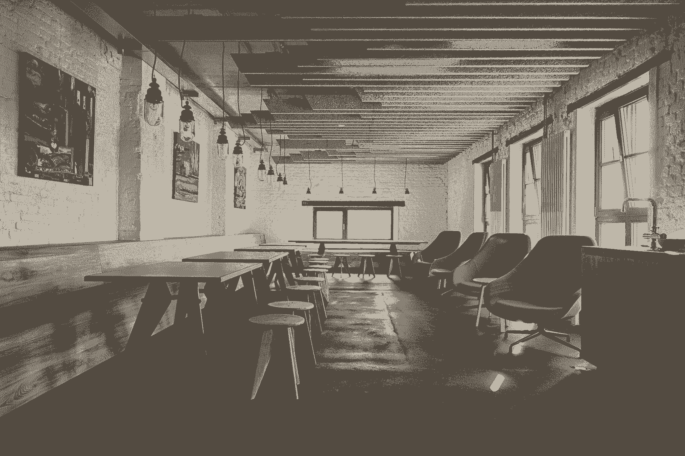
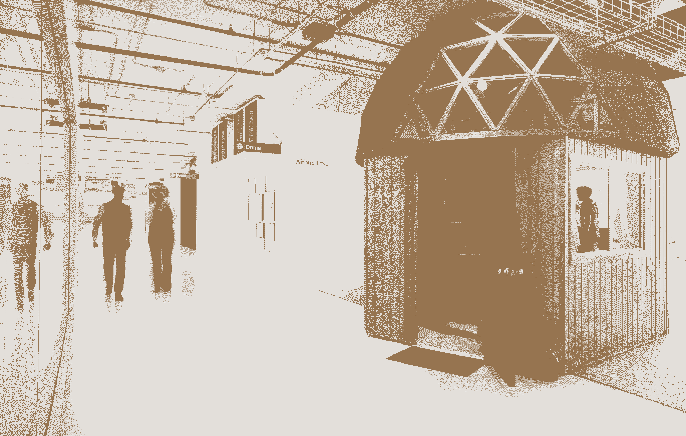
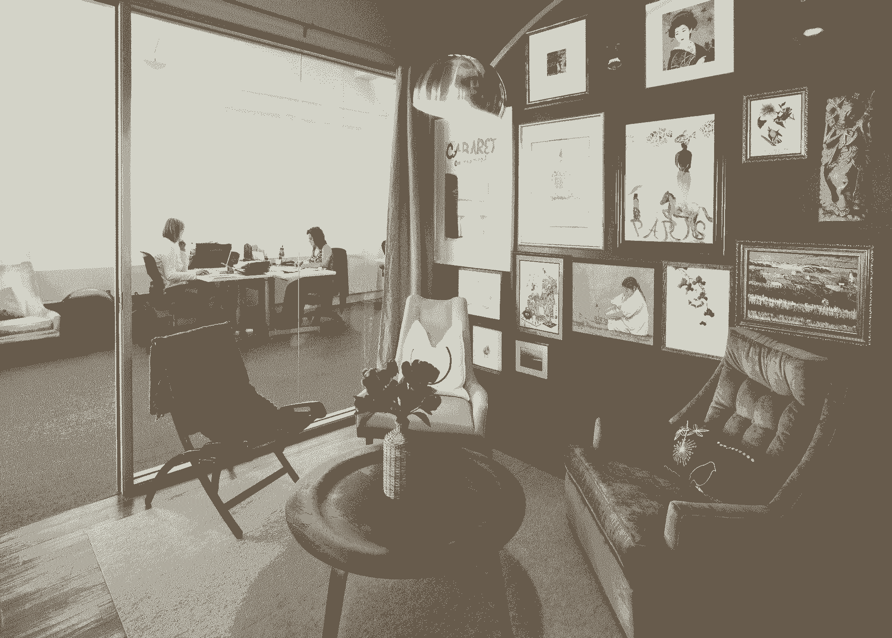
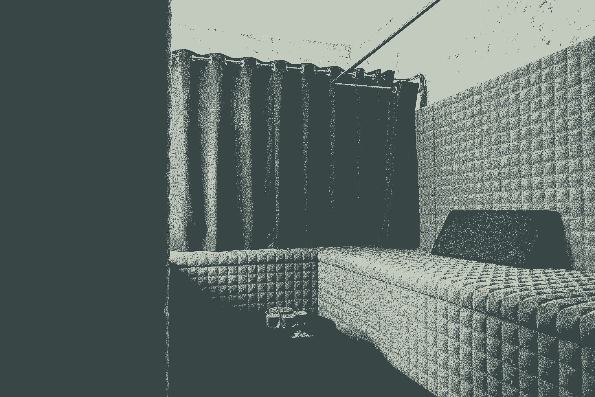

# 充分利用你的空间 Airbnb 和 SoundCloud 背后的职场设计师的秘密

> 原文：<https://review.firstround.com/Maximize-Productivity-with-This-Advice-from-the-Office-Designer-Behind-SoundCloud-and-Airbnb>

设计师凯利·罗宾逊 在她的简历中有超过 50，000 平方英尺的广受赞誉的办公空间。BuzzFeed 将她的两个项目列入了他们的“ [22 个你希望在](http://www.buzzfeed.com/peggy/gorgeous-start-up-offices-you-wish-you-worked-in#.skV9043a9B "null")工作的华丽创业办公室”SoundCloud 首席执行官 Alex Ljung 对她创建的新柏林总部非常满意，他开始在那里举办更多的活动和会议，雇佣更多的员工，增加透明度。当谈到创造现代的、鼓舞人心的办公室时，罗宾逊是这个领域的巨人。

“每样东西都有它的位置。她说:“每个地方都有自己的目的。这句意味深长的话出自某个人之口，他塑造了从生机勃勃的初创公司到不断扩张的科技公司，再到 200 英尺长的游艇等各种空间的特征。

凭借这种专注的设计方法，Robinson 创造了帮助人们成就伟业的环境。在这次独家采访中，她解释了如何规划出你办公室的每一平方英尺，让它满足你的需求(无论它是大是小)。她赞美灵活、移动空间的优点——它能让人们更加协作、高效，甚至更加健康。从墙壁颜色到小吃选择，她分享了一些小技巧，即使是在一个房间里创新的创始人也可以利用这些技巧来充分利用他们的工作空间。

# 为合作和创意而设计

首先:如果你想让你的团队的想法流动，你需要给他们合适的容器。从设计出有意图的空间到巧妙处理他们的情绪，罗宾逊分享了她设计创意办公室的四个关键步骤:

*创造有目的的空间*

你应该知道每平方英尺你想要完成什么。“你办公室的每一部分都服务于某种目的，”罗宾逊说。“但如果你不用心指定这些用途，整个空间就会变成吃饭、开会、合作和专注工作的公平场所。结果是一种令人困惑——甚至可能令人沮丧——的氛围。”

她鼓励领导者仔细考虑他们需要什么样的空间，以正确的比例建造它们，并向组织清楚地传达基本规则。“你的桌子不是餐桌。她说:“一边看着电脑屏幕，一边往嘴里塞食物是不健康的。它也不是一个会议室，也不是一个适合大声打电话的地方。但是你也不需要占用一个六人会议室来接听 Skype 电话。"

如果你的大部分员工需要安静的时间专注于编写代码或内容，那么你应该有等量的空间来反映这些需求。如果你有一个销售团队，团队中的销售代表互相激励，那么你应该让他们很容易打电话，但要立即转向同事分享成功或询问问题。

特别是，有一个目的是创业公司必须计划的:**自发性**。你的办公室应该包括可以容纳走廊谈话的空间，这些谈话可以变成天才的闪现，无论是一个大的中央空间还是较小的活动角落——最好两者都有。“大多数谈话不需要关起门来进行。他们只是需要一个地方，参与者不必担心因为声音太大而被打断、踢出去或被责骂，”罗宾逊说。

不要忽视空间之间的空间*——它也有用途。“考虑人们如何在你的办公室里走动是很重要的。罗宾逊说:“在太空中旅行的经历不能令人沮丧，也不能令人不快。像过度安全的门和无菌、幽闭恐怖的走廊这样的障碍，从字面上和比喻上都阻止了创造力的流动。*

*营造氛围*一旦你为组织的需求划分出合适的空间类型，就有四个关键因素可以塑造他们的氛围(是的，房间可以有氛围)。这些是让每个空间各司其职的最具活力的工具:

**1。显然，这对 SoundCloud 来说是一个大事件。“我们请来了一位声学工程师，测量了当时的空间；然后，我们选择我们想要达到的特定分贝水平来营造每个空间的氛围，”罗宾逊说。例如，自助餐厅的声音更大，而且总是充满音乐，以鼓励联系和偶然的互动。通过在这个区域工作，人们可以发出他们可以被打断的信号。另一方面，在主工作区，分贝水平大大降低，以使开放式平面图真正发挥作用。**

一般的创业跑道容不下一个声学工程师，但是任何人都可以实现这种思路。“这就像图书馆，”罗宾逊说。“当人们走进来时，他们知道他们不能太大声。我们将声音构建成某种方式，为行为设定某种预期，人们自然会遵从。”你可以通过这种方式构建不同的线索，从被认为是喧闹或安静的空间中引入影响。

At SoundCloud, this open, communal work area signals that people are open to conversation.

**2。照明**暴露在自然光下，或人工照明的亮度设置，是操纵情绪和传达给定空间目标的另一种关键方式。调暗灯光，营造更柔和或更体贴的氛围。让空间充满自然光，营造更加开放、协作和充满活力的氛围。

**3。颜色**不同的颜色激发不同类型的情绪。“蓝色超级镇定；罗宾逊说:“橙色和黄色让人们摆脱自我，并刺激他们变得更加外向。有大量数据可以证明这一点。

**4。从办公室的其他地方可以看到多少空间——外面的风景是什么样的？“一个高度开放的公共空间将会有一个与休息室非常不同的基调，休息室应该是私人的和隐蔽的，”罗宾逊说。**

当你设计办公室时，也要考虑每个空间如何与外界相连。“对我来说，一个好的或开阔的视野是与创造力最大的联系。罗宾逊说:“能够看到远处有助于理清思路，缩小视野，思考大局。传统上，高层管理人员有一个可以看到风景的角落办公室，这是有原因的。但她说，这种观点应该对所有人开放，而不仅仅是高管。如果你办公室里有一个完全看不到风景的空间，不要用它来做创造性的工作；它更适合专注的、面向执行的工作。

办公室里有多少种对话，就应该有多少个空间。

在任何一天，你都可能有头脑风暴会议、严肃的谈判、战略会议和面试。“真正好的办公室设计的一部分是根据特定的功能来定制空间的每一部分。你希望人们能够进入一个空间，让他们在任何情况下都能发挥出最佳水平，”她说。

*用心填满每个空间*

罗宾逊是一个肩负使命的女人——一个根除不必要的东西的使命。“你能为培养创造力做的最重要的事情，是我看到公司最失败的一件事:它们太杂乱了。她说:“杂乱与创造力是对立的。

想象一下每个创业公司最喜欢的工具，白板。因为空白所以有效。它邀请头脑风暴者用新鲜、清晰的想法来填充空间。另一方面，杂乱会让人分心。太压抑了。而且，正如任何童年卧室脏乱的人都记得的那样，这造成了恶性循环。

另一方面，你不希望你的办公空间看起来单调乏味，给人一种充满规则和限制的印象。“用雅致的艺术品、舒适的家具和鲜艳的色彩来平衡干净的空间，是让人们感到放松和自由创作的最佳方式，”罗宾逊说。杂乱也不等同于创造性的混乱，她小心翼翼地注意到。“一些极富创造力的人需要一个更加混乱的环境，因为这有助于他们感到更加自由和不受束缚。”

简单来说，如果你可以没有一件物品而生活，你或许应该这样做。这是一个紧缩的启动预算实际上能有所帮助的领域。抵制社会认为你需要更多小玩意和小摆设的信息。明智购物，只买你需要的东西。

简单的比较好。杂乱会扼杀流动。

*永远留下良好的第一印象*

罗宾逊发现许多工作场所长期忽视的一个领域是什么？接待处。这是一个大错误。“我认为许多公司没有意识到在办公室的第一次经历有多重要，”她说。无论是对员工还是访客来说，电梯门打开时的景象都是一种印象，他们会带着这种印象走过其余的空间。“让这种体验真正受到欢迎。让它变得伟大。”

Robinson 的项目包括几个关于周到的接待区能做什么的杰出例子。首先，她是 [Airbnb](http://www.airbnb.com/ "null") 以前办公室里著名的**蘑菇圆顶**背后的女人(如下图)。基于一个真实的加州小屋，可在网站上租赁，圆顶作为几个独特的会议室之一。然而，也许更重要的是，它定下了一个基调。

The famous Mushroom Dome at Airbnb's first HQ. Courtesy of Chad Riley / www.chadriley.com.

“当你走出电梯，看到一个巨大的、史诗般的蘑菇圆顶复制品时，你马上就知道这不是一个普通的办公室。“Airbnb 是一个任何人都可以在世界各地找到独特空间的地方，我们立即传达了这一点，”罗宾逊说。

她在 SoundCloud 采取了类似的方法，不仅创造了接待空间，还创造了接待体验，展示了公司的一切。

“我们模仿了苹果的天才吧”她说。“那里总是有两个人，它不仅是对客人的欢迎，也是员工的信息中心。立刻就有了交往。客人不会觉得自己被困在大堂里；此刻他们感觉自己是 SoundCloud 的一部分。协作、跨界、创意混合——SoundCloud 的办公室欢迎人们进入它的存在理由，并为他们在那里度过的时间设定节奏和基调。

# 健康设计

对于罗宾逊来说，设计办公室只是第一步。一旦你解决了你的空间的骨架，同样重要的是要深思熟虑地管理它，并确保员工感受到他们与环境的联系。最终，它是活生生的人使用办公室的方式，可以增强你的团队的创造力、快乐，也许最重要的是，健康。

对于一个物理空间的设计者来说，有点令人惊讶的是，罗宾逊是无常的强烈倡导者。

工作文化正朝着流动性发展，这就要求尽可能地建立灵活性。

技术变得越来越小，越来越轻；再也没有理由被拴在桌子上了。让人们感到充满活力的空间利用这一事实给员工提供动力并帮助他们的健康。这可能意味着建造一个需要来回走动的空间，沿途有舒适的休息站；楼上楼下资源不同；召开会议，充分利用空间让人们动起来。

如果你在设计你的每一寸空间时都有明确的目的，人们可以四处走动，而且他们也想这样做。“如果有人想坐在真正符合人体工程学的地方，他们可以去办公桌。但不一定是他们每天坐的那个。如果他们想开会，他们可以去咖啡馆，喝杯咖啡，然后在那里见面，”罗宾逊说。

甚至越来越受欢迎的站立式办公桌也让人们呆在一个地方——不动对身体不好。运动让人们一天都保持健康。当团队在不断变化的配置中一起工作时，它使沟通更加健康。此外，它还能让地球更加健康。“灵活性更具可持续性。罗宾逊说:“我最近了解到，普通办公室大约有 60%的空间是闲置的。“想想那些人们实际上并不需要的电力、照明和空调空间。你要确保他们需要所有这些。”

她说:“你的组织健康与否取决于你最不健康的员工。在一个设计良好的空间里，健康开始到位:你的团队可以根据他们一天的自然节奏在办公室里走动。他们的基本需求得到了满足，比如通风良好的空气、自然光和大量的过滤水站(水合作用比你想象的要大得多)。他们有机会——也有权利——休息、呼吸，如果你能找到任何户外空间，享受户外散步。

这是 Robinson 鼓励公司展示产品开发的不同阶段的主要原因之一，无论是在墙上以初步图纸的形式展示，还是在接待处的架子上以最终形式展示。“你的办公室可以用物理方式讲述这些故事，”她说。“关注开发的所有阶段会让你的团队感觉与他们正在做的事情更有关联。”当谈到改善心理健康，减轻压力，让人们在工作中投入更多的精力时，没有什么比这更好的了。

Airbnb 非常重视其平台上出租的房产，以保持员工与公司命脉的联系。从本质上来说，Airbnb 让你无论身在世界的哪个角落都有宾至如归的感觉。通过将实际存在的酒店元素带入他们的办公室(以会议室和模型的形式)，团队不断提醒打开他们家大门的主人和寻求惊人、独特体验的旅行者。这让在这些会议室里所做的所有工作都充满了意义感，而且[有很多证据表明，带着目标感工作会让人快乐和健康](https://www.psychologytoday.com/blog/out-the-darkness/201411/sense-purpose-means-longer-life "null")。

One of Airbnb's conference rooms based on a real property in SoHo for rent on the site. Interior design by IDF Studio. Photo courtesy of Chad Riley / www.chadriley.com.

# 多元化设计

然而，除非你团队中的每个成员都有同样的机会在他们的工作环境中追求健康，并以此为荣，否则这项工作还没有完成。

为多样性而设计意味着世界上的每一个人都能够在同一空间内拥有相同的奇妙体验。

“人们在其中的感受，他们如何使用它——这不会因不同性别、国籍、年龄、性取向和体能的人而改变。这是最理想的，”罗宾逊说。

多样性的一些定义比其他定义更明显，但有一个关键的类别可能不会出现在一般的清单上:包容内向和外向的人。“一个好的办公室设计可以确保不管一个人的性格如何，不管他是什么动物，他都有地方可去，”她说。为此，她设计的每一个项目都包含了健康、有创意的工作空间的两个要素:

**安静的个人空间。罗宾逊说:“每间办公室每层楼的每一侧都应该有一个冥想、舒适的空间。这是一种她以多种不同形式实现的信念:午睡室、阅读角、打电话的电话亭(或者干脆藏起来)。专注工作的领域——或者仅仅是不受干扰的独处时间——是至关重要的。**

它们从一开始就很重要。“不管公司的规模有多大，在早期迎合内向的工作对于让每个人都感到舒适并尽可能多地鼓励生产力是至关重要的。”许多新的开放式平面图不满足这一需求。但是不管你雇佣了多少外向的合群者，每个人都需要一个地方来隔绝噪音，喘口气，深入思考而不被打扰。不把这一点考虑到你的办公室设计中，不仅仅是目光短浅，也是对你能力的短期改变。

One example of a quiet room at SoundCloud.

**一颗公共的心。大多数情况下，初创公司的第一个空间是一个公共中心。“当一家公司很小的时候，在同一个房间里一起工作有很多好处，”罗宾逊说。“这个团队就像一个家庭，重要是要清除等级制度，建立一个强大的核心。”然而，随着公司的发展，每个团队开始像自己的家庭一样运作，每个人坐在一起就不那么重要了，鼓励动态联系更重要。**

一个更大的办公室的公共中心是一个机会，可以重新获得它的单间起源的所有最好的部分。通常围绕食物和社交活动组织，如全体会议，这个中心聚集空间容纳了更多的社交人士，并为内向者提供了一种更容易与同事互动的方式。根据定义，应该只有一颗心。

我从不做多个小厨房。我觉得他们是 BS。他们扼杀了很多东西，包括运动和互动。

办公室的中心应该是任何人都可以去吃午餐或喝杯咖啡的地方，并且知道他们正在向互动敞开心扉。应该播放音乐来补充能量和提升情绪，任何公司提供的零食都应该新鲜和有营养。“通过创造这种心脏，你解决了两件事:过度社交的人需要联系，内向的人需要被哄出他们的私人空间，”罗宾逊说。

至关重要的是，这个中心要位于空间的中心(这样它就不会被浪费)，而且要成为全公司聚会的场所。“当人们在这个空间一起吃饭和交流时，等级制度就消失了。当你共享一顿饭或一杯咖啡时，没有实习生或首席执行官。“人就是人，”她说。“突然间，这个空间成了交流的公共场所；它成为真正的对话和富有成效的问题的容器。因此，当你在那里召开全体会议时，它充满了协作的能量。”

简而言之，灵活的办公空间不需要在开放式平面图和隔间墙之间做出选择。提供两种模式的优点，让个人用自己的时间在它们之间移动。

当然，多元化不仅仅是工作风格。当你在你的空间里建造无障碍设施时——从新妈妈的哺乳室到坐轮椅的团队成员的坡道——罗宾逊的建议很简单:

不要只是满足规章制度。创造一个让每个人都感觉良好的空间。

这是她在 SoundCloud 办公室工作时学到的一课。柏林充满了富有挑战性的老建筑，但对轮椅的要求很低——让 Robinson 自己想办法。她致力于确保无障碍，并尽可能小心翼翼地修建坡道。正如她在整个经历中所看到的，当你创造一个普遍舒适的空间时，你让事情变得更加平等。当权力动态平衡时，思想更有可能在人与人之间自由流动。总是值得的。

“我相信世界上最有才华的人正在觉醒，对不道德的商业和自私的领导越来越不宽容，”罗宾逊说。“最成功、最进步的工作场所将继续朝着更灵活、更透明、更少层级、更可持续、更多样化和更具社会影响力的方向发展。你工作的空间可以反映这一切。”