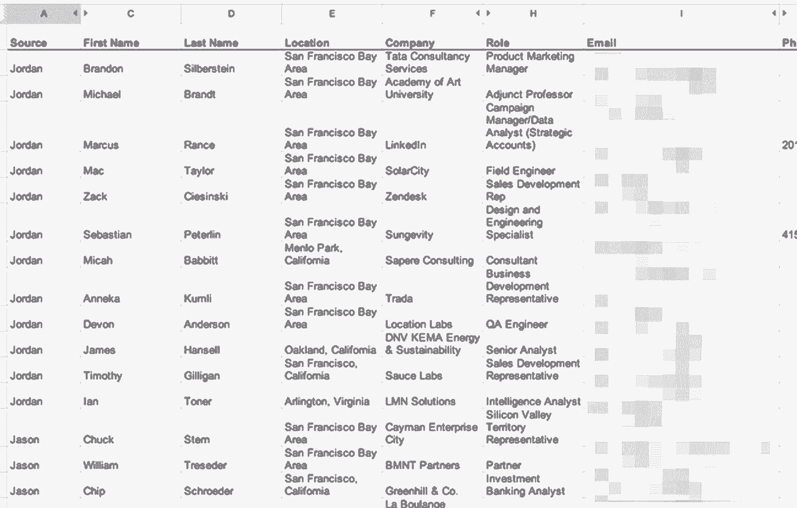
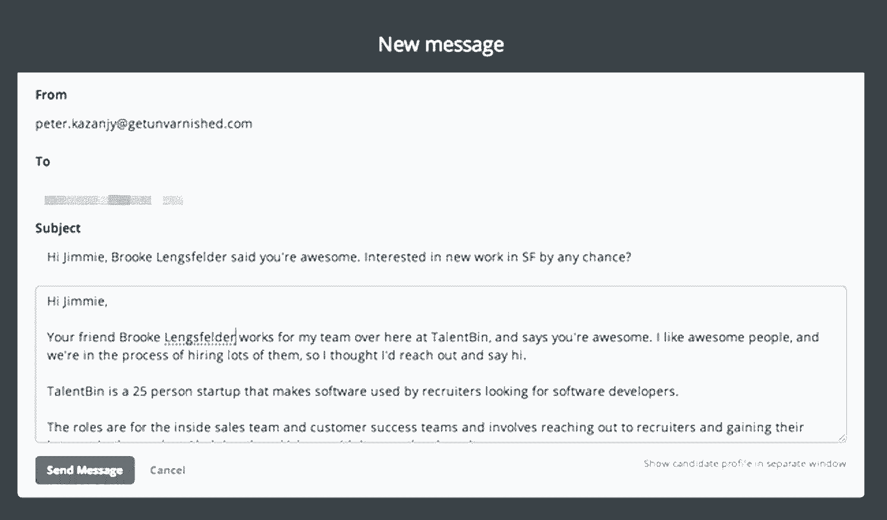

# 最好的雇员就在你的眼皮底下——使用这个系统，再也不会错过他们了

> 原文：<https://review.firstround.com/Mine-Your-Network-for-Early-Stage-Hiring-Gold>

*本文作者是去年被 Monster.com 收购的 TalentBin 联合创始人* *[彼得·卡赞吉](http://kazanjy.svbtle.com/ "null")* *。*

99%的时候，你最好的雇员将来自你的员工的联合网络——你可能已经知道了。但是，你知道如何有条不紊地挖掘这个网络，从而获得最大收益吗？大概不会。作为人才发现初创公司 [TalentBin](https://www.talentbin.com/ "null") 的联合创始人，这是我的饭碗。

这篇文章是关于如何主动挖掘你能接触到的所有人际网络，从而在招聘初期获得成功。作为一名初创企业的领导者，获得优秀的第一批员工至关重要，因为这是你下一批员工的来源。很多人都在谈论这一点，但他们很少会详细说明如何去做。关键:**积极的推荐招聘。**

传统的推荐招聘看起来是这样的:你的员工*知道你有什么职位空缺，他们*知道他们网络中谁可能是合适的人选，他们*在不做实际工作的时候会考虑这个问题。但事实是:这种淡化的系统仍然会产生一些惊人的招聘。***

所以想象一下当你在这个过程中注入一些火箭燃料时的结果。

关键是要让某人的全职工作成为: **1)** 主动挖掘员工关系网， **2)** 从员工那里提取关于他们关系网的声誉信息， **3)** 对浮出水面的潜在候选人进行有规模的拓展。

有句老话说，“如果这是每个人的工作，那就不是任何人的。”这非常适用于这里。如果你把寻找优秀人才作为自己的工作，或者雇佣一个专门的招聘人员，你就能完成任务。不管你提供多大的推荐奖金，把它留给那些没有招聘意识的人都不是成功的秘诀。

相反，把它当成一场销售活动。你会得到结果的。根据我的经验，当你以严谨的 B2B 销售心态处理招聘等问题时，你会得到好的结果。

# 屡试不爽的方法

高层招聘负责人以各自的方式贯彻这一理念。Patrick Burke——现在在 [Pebble](https://getpebble.com/ "null") ，但之前在 [Apple](http://www.apple.com/ "null") 、 [Square](https://squareup.com/ "null") 和[Houzz](http://www.houzz.com/?m_refid=us-sem-brand_main&kw=houzz&pos=1t1&device=c&gclid=CLaZ1YrH8r0CFQlgfgodEigAAg "null")——举行团队推荐招聘会议，之后是个人汇报。蒂姆·迪斯(Tim Diss)曾供职于基因泰克(Genentech)公司(T12)，现在供职于脸书(Bernstein)公司(T15)，他经营着一个他称之为“忍者狩猎”的流程，专注于主动从现有员工那里获得推荐。以前在 Chegg 工作的蒂姆·文泽尔曾经举办“招募马拉松”活动，包括巧克力喷泉和比萨饼，让人们自愿提供他们有才华的联系人。而 [Threadflip、](http://www.threadflip.com/ "null") [Asana](https://asana.com/ "null") 和 [Stripe](https://stripe.com/ "null") 的 [Theresa Singh](https://www.linkedin.com/in/nextgenerationrecruiting "null") 则热衷于在一个共享的谷歌电子表格中把各个群体的名字(以及 [LinkedIn](https://www.linkedin.com/ "null") 个人资料)放在一起。

在 TalentBin，我改进了自己的方法，为最优秀的人剥离采矿网络。归结起来有三点:

通过深度网络挖掘产生大量线索。

利用社会证明的直接招聘推广。

一遍又一遍地重复这个过程。

# 销售线索生成:寻找最佳

这些技术可以用来在从工程到客户服务到设计的任何功能领域找到独角兽。在过去的一年里，我一直专注于扩大销售团队，所以我将把它作为我的主要例子。

挖掘员工的人际网络到底意味着什么？这不仅仅是要求他们传递他们认识的人的名字。

如果你的组织是为了成功而成立的，你的员工会很乐意介绍他们最有才华的朋友和同事。

你绝对应该提供推荐招聘奖金。具体情况各不相同，但一般来说，非工程人员的薪酬为 1，000 美元至 2，000 美元，优秀工程师的薪酬则高于市场水平。

很明显是交换条件。你的员工会向你(或你指定的推荐招聘人员)展示他们最好的联系人，如果候选人在招聘漏斗中排名很靠前，他们会帮助推销这个职位。如果这个人被录用了，你的员工会得到奖金，和一个有才华的人一起工作，并通过获得高质量的人力资本来加速公司的价值。他们几乎不需要自己做任何工作。听起来很划算，对吧？确保他们也知道这一点。

当你做这个引导练习时，要强调你不只是在找那些积极找工作的人，或者那些可能很快会换工作的人。那太局限了。你应该关心提取的唯一数据是:“这个人符合我们的招聘标准吗？”

所有其他信息可以在其他地方收集，但是这些信誉数据——由您内部的可靠来源验证——在其他任何地方都不可用。这是整个过程中最有价值的部分。

我特别提醒那些我们正在挖掘其人际网络的员工，关于我们反复寻找的标准。你想问每个人同样的两个问题:

你会因为有这个人做同事而骄傲吗？让他们在这里工作你会兴奋吗？

**例如，当我们为 TalentBin 的销售团队招聘时，我们提供了以下基本规则**:“我们招聘高智能人才(一般智能)；高数字拉屎能力(街头智慧)；以及很高的磨工商数(在不愉快的情况下完成工作的能力)。”您希望在任何网络挖掘会话开始时展现这些品质。

运行这样的会话平均每人需要 30 分钟。这听起来可能很多，但你最终会得到一份优秀人才的黄金名单，推动你的招聘漏斗。这是一个糟糕的手工任务，但是值得。所需要的只是时间、一些努力和谷歌文档。

以下是如何与你的员工一起挖掘他们的关系网的纲要。

# 如何处理您的销售线索

在 TalentBin，我们开发了一些内部浏览器插件，以帮助我们的 lead gen 团队轻松地从档案中提取元数据，但最起码需要一个带有几个关键字段的谷歌电子表格。

第一，推荐人是谁？这在以后变得很重要。您还想捕捉到候选人 LinkedIn 或脸书个人资料的超链接，以供日后参考，以及他们的电子邮件地址。根据需要，考虑包含注释和状态更新字段。这里有一个粗略的例子:

# 如何标记合适的人

让你的员工登录 LinkedIn，进行“一级关系网”搜索，返回他们所有的直接关系。[这是该搜索](https://www.linkedin.com/reg/join?trk=login_reg_redirect&session_redirect=https%3A%2F%2Fwww.linkedin.com%2Fvsearch%2Fp%3FopenFacets%3DN%252CG%252CCC%26f_N%3DF%26orig%3DFCTD "null")的链接(如果您或您的员工点击此处，它会自动为您填充该搜索)。

您应该会看到一个搜索页面，搜索结果的数量与此人的联系人数量相同。

一旦你有了这个列表，你和你的员工应该仔细检查每一个结果，应用你精心创建的选择标准。

我发现一个一个地大声读出这些名字对保持事情进展非常有帮助。“杰夫·威廉姆斯？”“桑杰·帕特尔？”你会发现开始会很慢，但你会进入最佳状态。我再说一遍:你需要不断提醒你的同事你的选择标准，因为他们不可避免地会陷入一种“嗯，我不知道那个人是否在寻找……”你想要的不止这些。

当你开始收集那些确实符合你的招聘要求和工作描述的人的时候，抓取他们个人资料的超链接，放到你的谷歌电子表格中。不要担心其他细节，如姓名、电子邮件等。只是暂时的。您可以稍后填写所有这些信息，而无需占用您员工的更多时间。

在这个过程中，人们不可避免地会提供额外的元数据，如:“哦，是的，他讨厌他的工作，完全是在寻找，我们很幸运能得到他。”在你的注释栏中记录所有的定性信息。请记住，最重要的目标是抓住你的员工认识的所有高素质的人，不管这些人有多少“求职意向”。

典型的员工会有几百个 LinkedIn 联系人，你可能会抓住其中的 5%到 10%。我最近回去看了看我们的练习，并将它们与 LinkedIn 连接计数进行了比较。它们都在这个范围内。

在半个小时内，你可以筛选出 500 个联系人，最终得到一份 25 到 50 名优秀候选人的高质量名单。

**所以，那就是 LinkedIn。现在我们要对脸书做同样的事情。**

你会问，为什么是脸书？LinkedIn 人脉不就是你要找的“专业”人脉吗？是啊，算是吧。但人们不擅长在 LinkedIn 上记录他们的完整社交图。只有销售和招聘部门的人才擅长这个。你的大多数员工都不会。相信我。想想你的员工在大学和以前的工作中遇到的所有优秀的人。这些人更有可能成为他们的脸书朋友。当你放弃这些潜在的候选人时，你是在自担风险。

让你的员工调出他们的朋友列表，重复同样的过程，你就坐在那里系统地浏览他们的联系人。就像你以前做的那样标记好的。根据我的经验，普通员工在脸书上大约有 250 个朋友，所以这个阶段需要的时间应该差不多。

如果你的同事有很多联系人，你可能会忍不住举手说，“天哪，太多了！”抵制这种诱惑。巨大的社交图是一个福音。根据社会学家和斯坦福大学教授马克·格兰诺维特的说法，人们对即使是最薄弱的关系也有固定和有益的看法，这使他们变得强大。不管你的员工多久前认识一个人，他们可能都知道这个人是否足够有才华，或者是否有你想要的那种火花。

当你完成了这个阶段，你将会有一个你的员工认为很棒的联系人列表。您将拥有他们的社交资料的超链接，并且您将拥有在此过程中收集的所有元数据。这些都是高质量的线索。为过程的下一部分做好准备。

# 挖掘联系信息

现在是玩侦探游戏的时候了，为这些名单上的每个人找到电子邮件地址。电子邮件是迄今为止最有效、可扩展的接触潜在客户的方式。让你的员工尽可能多地在他们的列表中填写电子邮件联系数据，这是一项家庭作业。

你还能在哪里找到这些信息？对于 LinkedIn，如果你和他们有联系，电子邮件地址实际上可以在他们个人资料页面的“联系信息”标签后面找到。

对脸书来说，获取电子邮件地址更让人头疼，但它们可能就在你员工的 Gmail 中，甚至是几年前的。最坏的情况是，你可以使用脸书消息和 LinkedIn InMail 作为退路。不过，要尽可能避免这种情况。对于招聘来说，直接邮件总是更好的(稍后会有更多的介绍)。

当你做完这些，给自己一个鼓励。你成功地从你的一名员工那里获得了热门线索。现在去为其他人做同样的事情，你会有一个激烈的潜在客户名单。

如果你的员工有重叠的关系网，而他们最终推荐的是同一批人，那就更好了。这给了你更多的声誉验证，最好的候选人迅速上升到顶端。

那么，当你和每个人都谈完后，这个列表应该是什么样的呢？大概是这样的:

这样的名单里有金子。现在我们去拿吧。

# 规模化推广:把你的信息带到街上

创造销售线索很重要，但光靠它是不够的。我们必须执行流程的出站部分。

假设你的团队有 5 个人，包括你自己。这个练习完成后，你的招聘渠道中应该会有 250 人左右。

# 模板:发送什么？

将这些人介绍给你的公司需要利用社交证据(也就是说，他们认识的推荐人已经和你合作过)的电子邮件拓展。但最终，这都是关于直接的、模板化的和重复的接触。

你应该创建一个模板信息，指向你要招聘的职位空缺，并着重强调推荐人的隐性认可。以下是我屡试不爽的沟通系列:

**1。第一次外展:**一句简单的“嗨，你好吗？”这涉及到他们的朋友与你一起工作的事实，并包括关于你的公司正在做什么的高层信息。这条消息肯定需要提供工作发布的超链接，以确保他们可以看到更多，并为您注册一个“点击”来衡量兴趣。打开并点击的人，尤其是多次点击的人，都在表现出感兴趣的行为(即使他们没有马上回复)。你应该注意到他们是谁，并对他们投入更多的注意力。

**2。跟进:**一首“嘿，如果你错过了我的第一个音符”的歌曲。同样的要求，只是对第一段做了一点小小的改动，承认这是第二个接触点。

**3。当他们感兴趣时:**如果你得到了这个回复，立即发送一组有趣的书面筛选问题。如果他们努力回答这些问题，你就知道他们对寻找是认真的。这也是一个比直接电话筛选或面试更低的准入门槛。这也减少了你的工作量。

**4。当他们不感兴趣时:**当有人回复“谢谢，但不用谢”时，一定要问他们把你的空缺职位的详细信息传给他们的朋友和同事。你想让你的信息沿着推荐路径传递给他们同样高质量的朋友。

# 怎么发？

当我在寻找市场开发和客户成功代表时，这个系统工作得非常好。

在我的例子中，所有这些模板都存放在我的 TalentBin 帐户中，所以我可以使用集成的电子邮件系统来跟踪打开和点击。下面是一条普通消息的样子:

有了邮件合并工具，所有这些都变得容易多了。但是你也可以在 Gmail 上使用类似 [Yesware](http://www.yesware.com/ "null") 的东西(我喜欢 Yesware 的打开和点击跟踪功能)。如果你做不到这一点，谷歌文档和你的模板以及 Gmail 也能帮你完成任务。

当你开始发送电子邮件时，一定要通知你的员工。这使得他们可以根据自己的意愿发送某种外联信息(他们不应该必须这样做，但如果你的员工愿意参与，这是一种奖励)。此外，他们可能会从他们的联系人那里听到“嘿，你的同事 Pete 联系了你。那边怎么回事？”你不想让他们措手不及。当他们准备好了，他们可以帮助销售职位。总是给他们提个醒。

# 处理响应和第二遍

现在，去发送那 250 条信息。放一些快节奏的音乐，一口气把它们全部听完。在你的 CRM 或电子表格上标记为“试图联系”,这样你就可以监控回复的状态。这就是你如何让伟大的人不被埋没。

在这一点上，你已经做了一些真正的猎头工作。

如果你的信息是可靠的，社会证明是有影响力的，你会得到很多感兴趣的回复。先处理那些。有人可能会说，他们是“最接近金钱的人”。使用您的模板将他们推入流程的书面筛选部分。对于所有的负面回应，把要求抛给他们，与他们的网络分享。

不要低估回应拒绝的重要性。TalentBin 最近的一次招聘是我把我的模板发给一个人，他说，“谢谢，不用了，”然后这个人把模板传给了斯坦福的一位教授，他管理着一份创业工作清单。他把它发给了一群人，我们最终得到了一些感兴趣的候选人和一个雇员。向不感兴趣的人发送“哎呀，谢谢，你能把这个传下去吗？”确实很感人。我们正在扼杀它，人们真的很喜欢我们的产品。

如果他们满足了你的要求，你会看到第二波入境兴趣。不管怎样，你都要被人踢到座位上了。

这当然很好，但是仍然会有一些潜在客户根本不会回复你。如果你用的是 Yesware 之类的东西，你仍然可以看到谁打开并点击了链接，但没有回复。对于这些人，使用你的“跟进”模板。这可能需要一些疯狂的复制粘贴，但你会很快完成。

你会惊讶于一个简短的跟进有多大的帮助。它给你机会证明各种事情:

你不只是一个路过的电子邮件。作为候选人，你对他们是认真的。

你有毅力和进取心，这不仅说明了你，也说明了你的公司及其领导层。

你清楚地表明你真的对他们感兴趣，所以你的行为支持你的信息。你不只是说说而已。

你越能通过行动巩固你的故事，就越好。确保推荐候选人的人知道你也在发送跟进邮件，这样他们就能证明你的公司不只是垃圾邮件，他们是特别的。

# 你能外包这个吗？

如果你想在几天后给所有没有回复的人发一个“我要和你分手/我猜你只是没那么喜欢我”的模板，那就加分。如果你做得好，总会得到一些笑声和回应。

是的。你可以让别人替你做所有这些工作。事实上，如果你正在扩大你的销售团队或工程团队，并且有一个内部的合同招聘人员，运行这个系统应该是他们的首要任务。

# 冲洗，重复

他们可以与每个人坐下来，他们可以做领导一代，最重要的是，他们可以像你一样执行外联。大多数招聘客户关系管理系统都允许你授权沟通，这样招聘人员就可以发送看起来像是来自你的工程副总裁或首席执行官的电子邮件。那些总是得到较高的回应率。句号。

上面概述的过程不是一次性的事情。想想吧。你从这个系统中得到的每一个新员工，他们都会带来大约 500 个新的联系人，你也可以从中挖掘和招聘。这是一直给予的礼物。

这也不应该是你现有员工一次性的事情。我建议每季度或每年两次重新审视人才挖掘流程。你的团队经常在外面遇到新的、很棒的人，并在脸书和 LinkedIn 上方便地与他们联系。确保持续挖掘这些增量。

# 发布

是的，灌输一种“永远在招聘”的心态是很好的，这样无论什么时候员工遇到优秀的人，他们都会跑向你。但这在现实生活中是不会发生的。他们有自己的工作，你希望他们专注于此。

我上面建议的都不太复杂，但是我发现把它写下来并画出来很有帮助。

在你的人际网络中找到最好的候选人是一件苦差事。你必须坐下来，分清主次，有条不紊地从头到尾完成一项不太愉快的任务。一次又一次。但你会很高兴你这么做了。

我已经用这种方法为 7 名非常优秀的市场开发代表配备了员工(还有 6 名可能最终被录用)。他们都来自我们现有的工作人员网络。

**要点:**一旦你有了团队的扩展网络，尽你最大的努力利用它作为最有价值的资产。