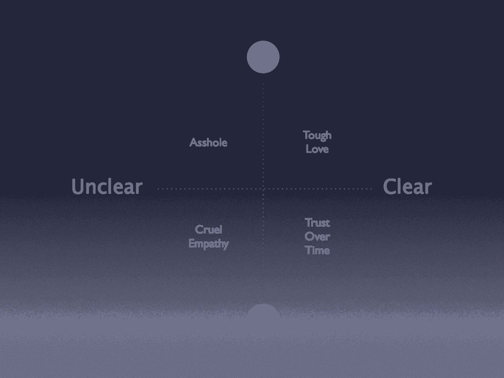
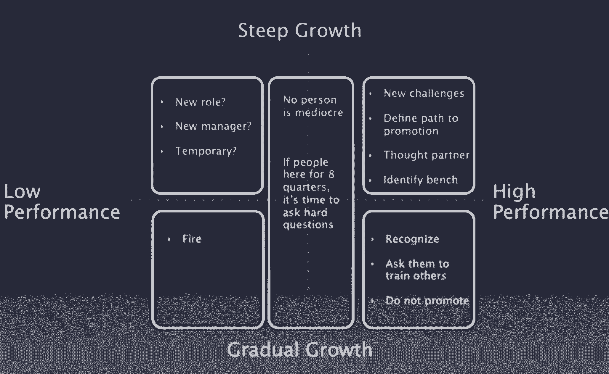

# 我从三个失败的创业公司——谷歌、苹果、Dropbox 和 Twitter——学到的管理经验

> 原文：<https://review.firstround.com/My-Management-Lessons-from-Three-Failed-Startups-Google-Apple-Dropbox-Twitter-and-Square>

**[金斯科特](https://www.linkedin.com/pub/kim-malone-scott/1/403/255 "null")** 那天有一件事要做。她打算给她的产品定价。那是 2000 年，她是 Juice 软件公司的创始人兼首席执行官，她花了整整一个上午来做这个决定。

她一走出电梯，就遇到了一个又一个需要和想要与她交谈的同事——一个是关于健康问题，另一个是关于他的孩子在学校表现优异，还有一个是关于正在破裂的婚姻。她依次安慰、庆祝和倾听每一个人。然而，她没有给产品定价。

“有那么一会儿，我想，这就是混蛋们真正拥有优势的地方，”斯科特说。“但这也不对。好的管理者会在乎。”

这只是斯科特在过去 20 年中发现的一条建议，她在世界上一些最大和最有影响力的科技公司担任领导职务时一直遵循这条建议。最近，她建议 **[Dropbox](https://www.dropbox.com/home "null")** 和 **[Twitter](https://twitter.com/ "null")** 。在最近的首轮 CEO 峰会上，她分享了她认为自己学到的最重要的管理经验。

# 在乎是什么意思

“成为一名经理最令人惊讶的事情是停止关心的所有压力，”斯科特说——她不是指关心工作，而是指关心人。“我对(果汁)的产品和机会感到兴奋，但我也对建立一个真正关心彼此、喜欢一起工作的团队感到兴奋。”

她在定价决策上分心的那个早晨也不例外。找时间专注于“工作”而不被打断是一个持续的斗争。她甚至打电话给当时的首席执行官教练，问道:“我的工作是打造一个伟大的产品，还是我真的只是一个纸上谈兵的精神病医生？”她的教练毫不夸张地对她吼道:“这叫管理，这是你的工作！”“每当我想停止关心时，这些话总是在我耳边回响，”斯科特说。

管理是一件深深地、深深地个人化的事情。

“你必须是一个人。有些人认为关心他人和感同身受是一种人格特质——但它是可以学习的。尤其是当你雇佣大量大学毕业生时，这些人很有才华，他们会在职业生涯中快速成长。你需要花时间教给他们。”

良好的管理是关于深厚的人际关系，当你只想快速发展时，这可能很难接受。正如斯科特所言，关于管理，最难的教训可能是它无法扩展。这没关系。

**战术:**

“最简单的关心策略是推动你的经理与他们的员工进行职业对话，”她说。“这不是为他们规划晋升之路，而是真正了解他们的为人。”实际上是两个对话:

随着时间的推移，他们做出了哪些改变？当他们告诉你他们的历史时，拿出他们的核心价值观，他们的动机是什么，他们真正关心什么？写下三到五条经验，然后和那个人核实:“所以我听到你说你关心自由——时间的自由，而不是金钱可以买到的自由。我说得对吗？”斯科特建议，一定要理解它们。

**他们的未来**。“问他们:他们真正想成为的三到五件事是什么？没有人知道自己想成为什么样的人——但对于自己在生活中真正想做什么，他们可能会有三到五种相互矛盾的想法。”把这些放在桌子上，鼓励对方诚实。愉快地谈论它。

“一个和我交谈过的人告诉我，他真的很想经营一个牧场，”斯科特说。另一个人想每天花八个小时骑他的山地车。除非你问，否则你可能永远也不会知道你的人民的这些事情。如果你问，你就能知道他们的目标和价值观——自由、努力工作、学习等等——如何与你希望他们在未来 18 个月里做的工作联系起来。”

# 残酷的移情

“有一则俄罗斯轶事，讲的是一个人非常爱他的狗，以至于当兽医告诉他需要剪掉狗的尾巴时，他不能一下子全剪掉，所以他一次剪掉一英寸。不要做那种管理者。”

给出不明确、不频繁的反馈也有同样的效果——尽管没有那么激烈。你最终会更加伤害收到反馈的人，即使你只是在做你父母总是告诉你的有同情心的人会做的事情:如果你没有什么好的话要说，就不要说。

斯科特说，这是她见过经理们犯最多错误的地方。“没有人会在他们的反馈中不明确，但事情总会发生变化。你担心伤害对方的感情，所以你退缩了。然后，当他们因为你没有告诉他们做错了什么而没有改进时，你最终会解雇他们。毕竟不是那么好……”

为了给人们需要的反馈，让他们变得更好，你不能在乎他们是否喜欢你。“给出反馈是非常情绪化的。有时候你会被吼。有时你会流泪。这是非常非常艰难的对话。”

Scott 将反馈分为四个象限。横轴表示不清楚到清楚的反馈，纵轴表示从开心到不开心的预期情绪范围。反馈越温和，就越不清晰。这就是残酷的移情象限。你想要的在右上方——即使是坏消息也很清楚。

严厉的爱是你建立信任最快的方式。

“当你对某人很严厉，但他们真的能听到你的话时，那就是你逐渐建立信任的时候，”她说。“他们会有情绪上的反应。你所能做的就是感同身受。不要试图阻止或控制某人的感情。”

**战术:**

**直接说**。“很多管理培训会让你陷入困境，试图把事情说得恰到好处。就让它去吧。直说吧。可能会好的。私下说，马上说。批评有半衰期。你等得越久，情况就越糟糕。”

**不吝赞美**。管理者倾向于期望表扬比批评容易，但这可能会出错。“如果你称赞某人的地方错了；如果不了解详情；如果你不真诚；对这个人来说，这实际上比什么都不说更糟糕。公开表扬，但前提是你知道自己绝对正确，而且是真心实意的。否则人们会看穿你的。”

作为经理，征求反馈也很重要。但这并不像听起来那么简单。很多经理就是忘了问。很少有人想或愿意向他们的经理提供真实的反馈。斯科特对此也有一些建议:

**每个季度为您的每份报告预留一个特殊的一对一时间。提醒他们这是他们给你反馈的会议。然后让他们轻松地开始对话。问他们:“我可以开始做什么？我应该停止做什么？我应该继续做什么？”无论它是什么，想出一个公式，使它更容易让球在开始滚动。**

**拥抱不适。要让人们敞开心扉，你必须让他们感到不舒服，否则他们会说你做得很好，并试图继续前进。“试着静静地坐在那里。想办法让人们不可能不告诉你他们的真实想法，因为如果他们可以不告诉你你做错了什么，他们会的。”**

**奖励真相。如果某个为你工作的人有勇气告诉你他们的真实想法，尊重他斯科特曾经接到投诉，说她在开会时总是打断她的一份报告。她知道这是真的，但也知道这不是她能在一夜之间改变的——她从小就被告知她会打断别人。“我想让他知道我没有忽视他的反馈，所以我开始在手腕上绑一根橡皮筋，告诉他，‘每次我打断你的时候，就把橡皮筋弄断。’我们的关系是这样的，他开心地拍了照片，这很有帮助。尽管我没有立即停止打断他，但他知道我听到了他的话，我在乎，我愿意采取行动。"**

# 提供方向

“我学到的关于提供方向的最重要的事情是，你用你的耳朵而不是你的嘴来做，”斯科特说。“我和其他经理犯过的最大错误是，我们和团队开会时说，‘这是我们这个季度或今年要做的事情’，而人们会说，‘不，这不是我们应该做的事情。’事实证明，我们没有倾听人们想要什么，认为我们应该做什么。"

所以，首先你要倾听。

接下来，你要决定。为了确保每个人的声音都被听到，你需要一个辩论和澄清的循环。“辩论和澄清，辩论和澄清，”斯科特说。“这可能会让人感到乏味和政治化，但你必须经历它才能做出正确的决定。把这一点教给你的经理团队，这样就不会有人在没有经历过这个循环的情况下，走进一个房间说‘这就是我们正在做的事情’。”

然后你要沟通。“但不要花太多时间交流，因为如果你是一个优秀的沟通者，人们会告诉你他们不同意的地方，是时候重新开始倾听了……”

**战术:**

**重大决策会议。** Scott 在认识到员工会议上的所有焦虑后，创造了这个。每个人都想被包括在内，因为他们觉得那里正在做出重大决定，但这几乎从未发生过。她说:“在员工会议上少做决定，明确地开第二次会议来处理重要的决定。”"将这些决策委托给更接近信息的人."

考虑利用员工会议为重大决策会议设定议程。确定那一周需要做出的三个最重要的决定，以及谁应该做出这些决定。谁最接近相关工作？“这就是你把决策变成事实的方式，”她说。

她引用詹姆斯·马奇的书[决策初级读本](http://www.amazon.com/Primer-Decision-Making-Decisions-Happen/dp/1439157332 "null")，建议管理者尽可能不要参与重大决策。“不知何故，人们的自我会被投入到决策中，”斯科特说。“如果他们被排除在外，他们会觉得几乎丧失了人格。所以你得到的是基于自我的决定，而不是基于事实的决定。你越是将自己和你的经理排除在这个过程之外，你的决策就会越好。”

最重要的是，不要让决策被推高。“很多时候，你会看到决策被踢到更高层，因此决策是由碰巧坐在某张桌子周围的人做出的，而不是那些知道事实的人。不要让这种事情发生。”

**利用有报告的会议将报告投入到公司的发展方向中**。在一对一的情况下，让你的员工设定议程。“不要让它只是一个更新，他们可以通过电子邮件告诉你。相反，先问后听:他们想做什么？他们没有做什么？他们觉得自己应该做什么？”

每周为每份报告留出整整一个小时。你不必填满时间，但是如果他们需要或者想要的话，他们应该知道时间就在那里。试着在吃饭的时候或者在一个更随意的环境下开会。**“这就是为什么把每位经理的报告限制在五到七份是很重要的。**这种时间和注意力是不成比例的，”Scott 说。

如果你要成为一名伟大的经理，你不能有太多的报告。

她建议，除了一对一的会面，每季度与你管理的每个人开一次绝对没有议程的会议。“出去走走或喝一杯。只谈人生。这是你学习重要知识的地方。”

# 定制您的领导力

在《源泉》这本书里，有两个角色:注定要改变城市面貌的建筑师，和他最好的朋友，电工——给城市带来生命的无名英雄。对斯科特来说，他们代表了两种主要类型的高绩效员工:处于陡峭增长轨道的人和处于更平缓增长轨道的人。

“在太多的公司，处于渐进增长轨道的人被视为二等公民。这是一个错误，”她说。

处于急剧增长轨道上的人需要以一种非常特殊的方式来管理。“你需要确保你在推动他们接受新的挑战。确保你正在定义他们的晋升之路。让他们成为你的思想伙伴。不要因为他们是独立的就忽略他们。不要因为不想对他们进行微观管理而忽视他们。”与此同时，这些员工可能很难伺候。他们不太可能在一个地方呆很久。

斯科特说:“处于更为渐进的成长轨迹上的人，他们会在一个角色中呆一段时间。”“你必须为他们所做的伟大工作向他们致敬，因为他们经常得不到认可。”

**战术:**

**给每个表现出色的人打高分。**即使在一些最好的公司，拥有宝贵技能但不太可能“统治世界”的人也经常被评为符合预期，因为经理们会给他们将要提拔的人保留较高的评级。这就形成了一种不健康的迷恋升职的文化。

**把逐渐成长的成功者放在可以培训他人的位置上。利用他们的依赖性、细心和对公司的奉献精神。他们将是你最好的老师，这是一种让他们走上舞台的方式，即使他们回避聚光灯。“不要提拔他们，”斯科特建议道。“他们不想被提升。如果你让他们成为经理，你会毁掉一项资产。”**

**不要忽略中间。很少有人真正平庸。“如果有人已经在某个地方工作了两年多，而且一直都达到了预期，那么是时候问自己一个尖锐的问题了:如果他们不在那里，你能雇佣一个更有可能表现出色的人吗？**

**评估表现不佳的技术人员。如果有人在自己的岗位上做得不好，但很有才华，那么是时候照照镜子了:你是不是把这个人放在了错误的位置上？你的管理风格是否不适合这个人？这个人是不是遇到了暂时的个人问题？**

做出艰难的决定。如果某人的工作确实很糟糕，而且他们不太可能有所提高——这是关键——你必须解雇他们。“不要把它关掉。斯科特说:“这样做只会惹恼你的优秀员工，让他们筋疲力尽。”。“这可能看起来很苛刻，但让你的优秀员工为表现不佳的员工承担责任也很苛刻。”

要求所有经理花 15 分钟时间将他们的报告填入上面表格中的五个方框之一。让他们在象限中写下名字，并让他们每年写一次。敦促他们对结果采取行动。

“确保每个象限的每个人都在做正确的事情，”斯科特说。