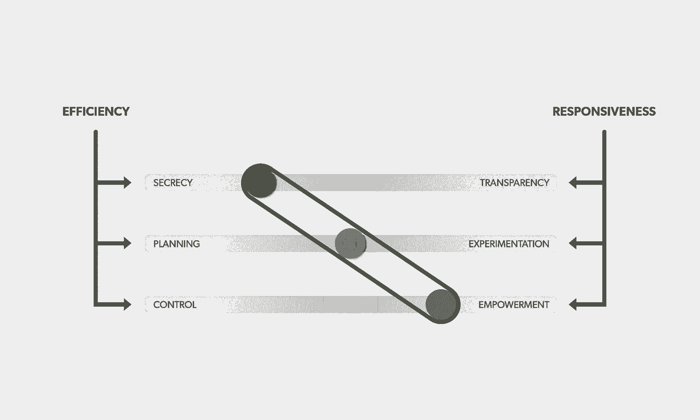
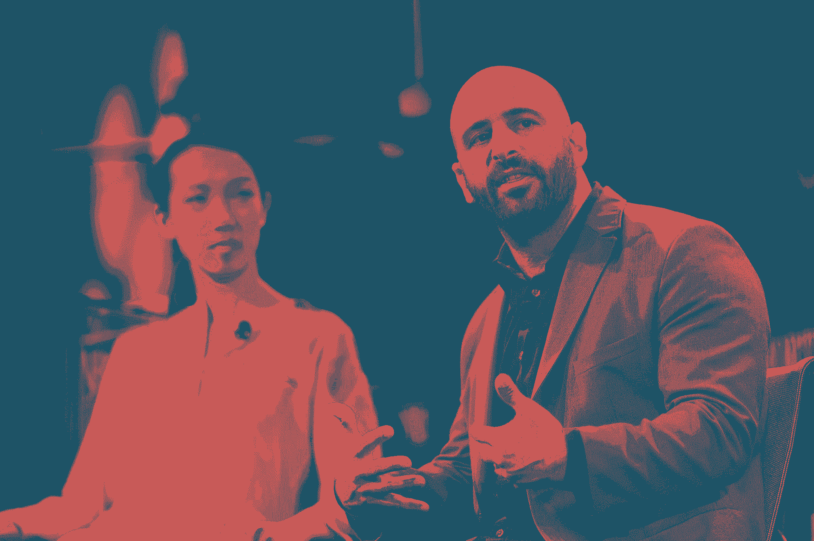

# 放弃效率可以加速您的公司——以下是如何

> 原文：<https://review.firstround.com/Responsiveness-New-Efficiency>

[亚当·皮索尼](https://www.linkedin.com/pub/adam-pisoni/1/40b/123 "null"),[Yammer](https://www.yammer.com/ "null")的联合创始人兼首席技术官，与许多科技领袖谈论如何建立反应更敏捷的组织。但他的成功故事不是关于一个手机应用程序或一个热门的 SaaS 产品。是关于一个汉堡的。在一次特别重要的会议上，他需要传达公司灵活、快速适应的价值观——一句话，反应迅速。所以他讲了一个关于连锁餐厅红罗宾的故事。

“他们在几家餐馆发布了一种新型汉堡，Tavern Burger，并允许服务器与 Yammer 上的产品创作者直接即时交流。皮索尼解释说:“这使得厨房能够根据顾客的意见，在同一天内对汉堡进行迭代。随着沟通方式的改变，公司提高了员工的能力，对客户的反馈立即做出反应，提高了他们的试验率，降低了失败的成本。他们在四周内就推出了这款新汉堡——而推出一款新产品通常需要 18 个月。皮索尼的故事是一个扣篮，他得到了关于为什么组织应该为敏捷性而构建的点头。

# 顺便说一句，那次会议是与比尔·盖茨。

在这次独家采访中，皮索尼分享了更多响应运动先锋的故事，并解释了向透明、实验和授权的文化转变如何使任何规模的公司更加成功。

# 传统模式被打破

皮索尼说，大多数组织，包括最懂技术的初创公司，都在使用一个百年的框架，而他们甚至不知道这一点。

第一批现代公司是像东印度公司这样的官僚巨头，他们的做法仍然盛行。当你经营一个帝国时，效率——而不是创新——才是王道。在历史上的大部分时间里，公司只需要尽可能快地向尽可能多的人提供产品和服务。竞争变得关乎效率和规模，我们今天仍在使用的管理层级出现了，将有想法的思想者和执行想法的实干家区分开来。“你希望实干家的灵活性和权力越少越好。他们不应该做决定；他们应该尽可能高效、可预测地执行任务。”

皮索尼说:“如果你能做长期规划，效率是很高的。”。“如果你知道自己要长期做什么，你就能真正了解如何有效地做这件事的具体细节。”但是因为效率，从设计上来说，锁定了角色、流程和实践，这也使得改变变得更加困难。

未来变得不可预测的那一分钟，效率可以成为你的敌人。

快进到 2015 年，未来比以往任何时候都更加不可预测。我们在过去十年中实现的互联互通改变了一切。皮索尼说:“我们从一个信息稀缺的世界走向了一个信息无处不在的世界。”消费者正在更快地学习、分享、适应和改变他们的期望。“这个世界形成了一个巨大的网络。这加快了变化的步伐，达到高潮。”

尽管如此，数量惊人的公司被设计成不能随着消费者需求的变化而改变。“组织面临的根本问题是他们无法再跟上客户的步伐。皮索尼说:“等级制度和网络正在相互碰撞，各种各样的组织都跟不上它们所服务的人们的步伐。考虑一下像 **Tower Records** 这样的老牌公司。他们通过在零售环境中提供各种各样的音乐来传递价值；他们没有把自己的使命定义为尽可能最好地传递音乐。因此，当 MP3 开始流行，他们开始看到猖獗的 CD 盗版带来的更高的第二天退货率时，Tower 只能在现有的模式下工作:他们调整了退货政策，不再接受开放式包装。

"一旦未来变得不可预测，效率就会成为你的敌人."

“认为该公司内部没有人预见到数字革命的到来或倡导创新是幼稚的。但他们公司的结构将他们锁定在传统零售业，”皮索尼说。这最终导致了他们的灭亡。

# 响应:新模式

今天，几乎每一位首席执行官都同意公司需要反应灵敏、敏捷、灵活。皮索尼会见了很多商界领袖，在这一点上他很少遇到阻力。皮索尼说:“但是，简而言之，敏捷性所要求的改变是非常困难的。”。从效率模式到响应模式的转变是一种文化转变——这意味着摒弃一个世纪以来的遗传本能。

皮索尼一次又一次地看到，领导者的第一直觉是以大局观念应对这种转变。皮索尼说:“公司希望用他们一直以来解决大问题的方式来解决问题:通过一个项目、一个创新部门、某种大规模的规划。”。

在联合创办 Yammer 之前，皮索尼曾在 Geni、Connexity、Cnation 和 Shopzilla 担任工程主管。Yammer 于 2012 年被微软收购。

这种从效率到响应能力的超级转变需要一个新的框架来进行日常决策。

为了帮助领导者入门，皮索尼分享了一个思考这个新框架的简单方法。想象一下三个频谱，每个都用一个滑块“调谐”(就像在音乐混合板上)。您的公司属于这些范围中的某个范围:

**保密与透明:**在效率模型中，角色是有规定的，没有人需要执行他们那部分计划所必需的信息之外的信息。如果你希望你的组织响应更快，你的团队需要环境——他们需要知道你的公司和市场正在发生什么(想想红罗宾酒馆汉堡的设计师直接与服务器对话)。跨职能团队的兴起要求团队成员之间共享信息，以最大化组织的价值。

**计划与实验:**效率源于长期计划——如果出了问题，那是因为你无法预测和计划它。在一个要求你利用不可预测性好处的时代，你需要创造一种假设检验的文化，并根据结果迅速改变路线。

**控制与授权:**在效率模型中，人们被雇佣来获得一套技能，被赋予一个角色，然后被告知如何执行。创新不是首要任务；领导者只是希望员工执行一个已知的计划。现在情况不再是这样了。“当我们说‘授权’时，并不意味着团队成员被授权做他们想做的任何事情。每个人都有自己的角色。但在响应模式中，他们有权创新如何传递他们的价值，”皮索尼说。

他展示了这一切是如何与一个简单而持久的问题联系在一起的:**旅行预算**。在效率模型中，当旅行成本需要下降时，你的直觉可能是依靠政策和控制。如果你在旅行上花费太多，那是因为你无法预测接下来会发生什么——所以你需要做更多的计划。也许旅行有太多的选择，所以你会想要控制它们，用一个只对某些航空公司和酒店有效的内部旅行预订门户来控制它们。

现在，让我们从响应度的角度来看看差旅预算。在一个你无法预测会发生什么的世界里，你必须放弃一些控制权:例如，像 Airbnb 和旅游聚合器这样的新选择每天都在涌现，如果让你的团队成员自己选择，他们很可能会找到更便宜的选择。皮索尼认为，所以授权他们这样做——但要确保他们互相分享旅行信息。也许他们可以分享 Airbnb(或者至少一辆出租车)。皮索尼在 Yammer 的团队尝试了这种方法——将三个滑块都推到最右边——并将旅行成本降低了 40%。

不过，他第一个承认，迅速向光谱右侧移动可能会非常不舒服。你正在颠倒你的决策框架，你的“正确的”解决方案最初可能感觉是错误的。这需要练习。

皮索尼说:“首先，我总是让人们选择一个问题，然后拿一张纸:在左边，想象你可能如何以最大限度的保密、规划和控制来解决一个问题。”“然后在右边，想象推动透明度、实验和授权的边界来解决同样的问题。”

创造持久的改变就是改变日常的决定。

# 行动中的响应模型

皮索尼重点介绍了客户支持，这是一个生动的例子，说明了向响应能力的转变是多么有效和相对简单。在一个网络化的世界里，没有哪个部门比前线的团队更受保密、计划和控制的束缚。皮索尼说，想想客户服务代表面临的是什么。在一个任何客户都可以立即访问互联网上有价值的信息的世界里，许多客户支持团队仍然在使用管理层传下来的受限脚本。

保险巨头 [Nationwide](http://www.nationwide.com/ "null") 在客户体验方面投入了大量资金，所以他们知道他们需要找到另一种方式。“他们允许客户服务团队接触公司其他部门的人员。他表示:“他们可以在网上与产品部门、支付部门的人进行对话。抛弃刻板、公式化的脚本，他们能够去寻找客户问题的答案，无论这些问题是什么。

“他们告诉我的最好的故事之一是关于一个客户的房车在度假时抛锚了，”皮索尼说。"当地的经纪人告诉他，他不在保险范围内，所以他打电话给全国保险公司."这是一个复杂的问题，客服代表不知道如何解决；在旧模式下，这个案子需要几天时间。“该代表在内部公布了这个问题，让索赔和产品部门的同事参与进来，他们发现这个人不仅得到了保险，而且还有资格获得紧急资金。三个小时后他就上路了，没有一大笔账单。”

Nationwide 同时试验了一个流程，授权给一个团队，并打破了透明度的障碍，展示了响应模型的关键过去:**再看一看那些滑块，你会发现它们都被一个形象化的“橡皮筋”连接起来**

“三个滑块不是连续的；他们是紧密相关的，”他说。当公司试图只移动一个，它几乎总是失败。“比方说，你的公司一直在最左边，完全高效，有一天你决定让事情完全透明。你把滑块推到最右边——但只能是那个。皮索尼说:“现在，公司里的每个人都可以看到所有的问题，但他们没有能力或资源来解决这些问题。

这是皮索尼经常看到的另一个例子:一家公司决心做更多的实验，但不碰其他滑块。现在你有一种情况，团队成员被要求创新，但不能真正承担风险——事实上，当实验失败时，他们会受到惩罚。他说:“由于一路保密，没人知道发生了什么实验，他们也没有最佳实践。”。"每个人都向不同的方向走去，没有交流."想象一下，只要移动一个滑块，橡皮筋就会把它弹回到它应该在的地方。

皮索尼说:“你必须一致地移动滑块，而不是把所有东西都移动到最右边。”。“这是一点一点地逐步前进，找到有效的方法，并接受这对每个人来说都是非常不舒服的。”

# 从头开始构建响应能力

Adam Pisoni, Co-Founder and Former CTO of Yammer at Fortune Brainstorm

那些还没有明确思维模式的新公司怎么办？“大多数初创公司一开始不会考虑如何建立自己的公司。他们专注于产品，这是一个错误。他说:“当你只有三个人时，这可能行得通，但当你有 50 个人时，就行不通了。”他看到同样的错误犯了很多次。一家早期创业公司完全摒弃流程，然后成长，意识到它需要更多的结构，然后完全转向旧的组织思维模式。

初创企业领导的工作是从一开始就将响应结构分层，并深入考虑他们将采用的框架。“问问你自己，‘我怎样才能让我的公司变得完全敏捷，完全响应？’”皮索尼说。两者的关键都是迭代。

大多数创业公司都相信自己产品的迭代。现在，他们需要将同样的思维应用到他们的组织中。

“2015 年，如果你对你的员工说，‘我们的产品是一个大实验。“我们总是在尝试，”他们不会感到惊讶。但是你也必须说，‘组织也是一个实验，所以如果它改变了，不要感到惊讶。我们正在为此共同努力。"

尽管如此，皮索尼并不提倡大规模的改变——它是关于逐渐改变你对每一个决定的态度，不管它是什么。首先，只需确定一个问题，挑选一个参与该过程的团队，并让他们尝试一些新的东西。皮索尼说:“大多数初创公司在授权方面没有问题，但它们非常不透明——所以看看当你让沟通变得更加透明时会发生什么。”这可能意味着尝试一个私人社交网络，比如 Yammer 或 [Slack](https://slack.com/ "null") ，或者定期举办全体会议或黑客日。

“初创公司非常熟悉黑客时代——你能完成很多工作，对吗？那么，如果你尝试一个为期五周的‘黑客日’项目，会发生什么？”皮索尼问道。选择一个你的公司认为重要的目标，召集必要的团队成员，建立目标而不是过程。让他们以响应度为指导来找出答案。

# 响应的价值

许多初创企业的领导者可能会厌恶脱离效率的想法。它破坏了许多组织所认为的竞争优势。投资实验会失去优势吗？皮索尼的回答是响亮的“不”。他说:“明确地说，我并不反对效率。”。“我反对长期规划效率的想法。”当我们无法预测未来时，效率不再能驱动决策。

皮索尼最喜欢的一个成功响应模式的例子是服装连锁店 Zara，以“快速时尚”闻名。他们的价值主张是以低廉的价格提供前沿趋势。要实现这一点，响应能力至关重要。考虑一个传统的服装公司。它由多个部门组成，从制造到设计再到分销，新产品在这些部门中按顺序流动。一件新外套将从设计团队开始，而消费者在商店里看到它可能需要好几个月的时间。

Zara 颠覆了这一模式。“他们说，‘当我们想设计一件服装时，让我们从每个部门挑选一个人，把他们放在一个团队里。’皮索尼说:“当然，他们来自设计或分销部门，但在那段时间里，他们在做那件衣服，那是他们的团队。这些跨职能团队可以跨越组织边界快速创新——这也是 Zara 能够在两周内将一件衣服从草图到上架的原因。

但这并不止于此。有了这些灵活的团队，Zara 的领导层可以用一种新的方式招募他们的一线员工。“现在他们可以对现场的销售人员说，‘看，如果你听到有人几次想要一件红色外套，告诉我们。两周之内，我们可以给你一批红色外套，看看有没有销路。“Zara 建立了一个渠道来倾听顾客的声音，并迅速做出回应。

皮索尼指出，该公司还违背了制造业的宗旨。他们不会 100%利用他们的工厂。他们意识到，以 80%的速度运行它们意味着他们可以在短时间内将项目推进管道，并最终卖出更多。皮索尼说:“在某些情况下，你的效率越来越低，但这没关系，因为你可以通过更积极地响应来赚更多的钱。”。

通过打破等级制度，进行更小规模、更便宜的实验，你可以极大地降低失败的成本，并最终使你的过程反应更快、效率更高。

皮索尼说:“最好的消息是——因为我们仍在研究这种反应模式——我们正处于低挂水果阶段。”这可能在下一个十年都不会发生，但是现在，即使建立一个人们可以谈论汉堡的团体也会产生变革性的结果。微小的变化，在许多情况下是非常简单的变化，会推动指针前进。“这还不是最难的部分。人们害怕是因为他们只知道增加控制或计划。现在，困难的部分是尝试一些不同的东西，看看会发生什么。”

他将其比作教育的老生常谈:孩子们生来就想学习，但随着时间的推移，他们会因为传统教育体系的官僚主义、过程和僵化而失去学习的欲望。

人天生具有创新精神。他们看到了问题。他们通常有解决方案。但是公司打败了他们。

从许多方面来说，响应模型不是灌输新的东西，而是消除障碍。给你的团队提供信息、实验工具和执行角色的自由，你将释放出无尽的意志力、大胆的想法和品牌定义的创意。“这通常不难。这其实很简单。许多公司都会犯错，因为“容易”是违反直觉的。但实际上，这只是一个信念的飞跃，”皮索尼说。

所以祝你愉快。尝试新的内部沟通工具。或者实施皮索尼所见过的最具变革性的变革之一:领导层和团队其他成员之间的公开对话。

他工作的许多公司已经开始定期举行与首席执行官的问答活动。“在任何情况下，员工都喜欢它。首席执行官也被他们获得的洞察力所震惊。这太简单了。就是一周一次一小时的时间。”向响应性的转变主要是重新定位你的心智模型，从等级制度转向网络。

“只要走一步，”皮索尼敦促道。"有些事情做起来比说起来容易。"