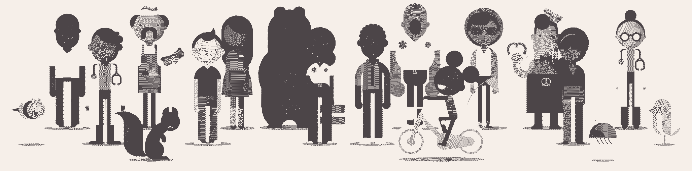
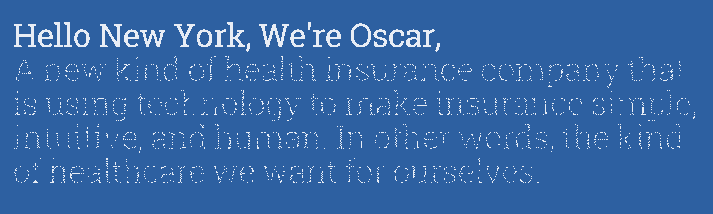
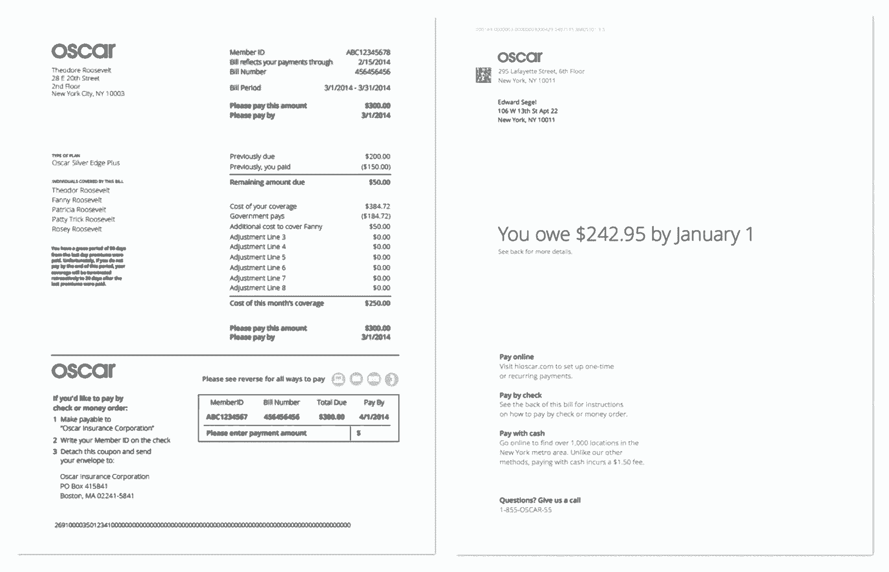
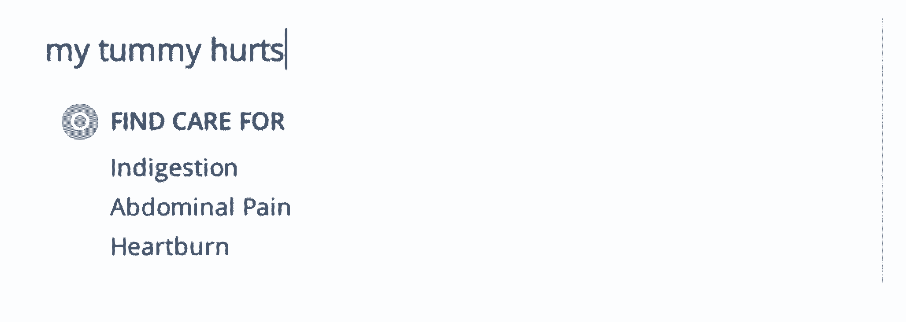

# 简单的设计是你需要的，而不是你想要的

> 原文：<https://review.firstround.com/Simple-Design-is-What-You-Need-Not-What-You-Want-1>

当患者保护与平价医疗法案去年成形时，三位纽约企业家看到了一个巨大的机会:4000 万人正处于选择自己的健康保险的边缘——这是人类已知的最令人困惑的过程之一。任何能使这一过程变得简单易行的人都有可能赢得大奖。**所以他们推出了** [奥斯卡](https://www.hioscar.com/ "null") **奥斯卡就是这么做的。**

从纽约市开始，奥斯卡的创始人认为医疗保险行业需要彻底改革，以提供更好的客户体验，以人为本的设计将引领潮流。

作为产品负责人， [Eddie Segel](http://designplusstartup.com/ "null") 和奥斯卡团队正在将这一愿景变为现实。凭借客户友好的数据可视化和简化的交互设计，Segel 正在帮助 Oscar 使健康保险变得有效和轻松。在 First Round 最近在纽约举办的[设计+创业活动](http://www.designplusstartup.com/ "null")上，他概述了 Oscar 为向真正需要的人提供这一独特品牌服务而部署的四项战略。

**“健康保险最差”**

“这是一个非常复杂的行业，”西格尔说。“你必须与医生、医院、药店、银行、监管机构打交道——这让消费者更加困惑。”

作为 15 年来第一家进入纽约的新商业健康保险公司，Oscar 的目标是与众不同。虽然它的核心产品是基本的——它从会员那里收钱，并在他们需要时为他们的护理付费——但该公司直言不讳地表示要利用技术和设计从根本上重新构想这个系统。

设计让我们把复杂的事情变成更简单的故事。

重要的是，奥斯卡让健康保险变得平易近人的策略不仅仅适用于这个行业。任何想要面对一个巨大的、破碎的市场或者承担一个复杂的社会问题的创业公司都可以从 Segel 的建议中受益。他们只需要四个重要因素来指导他们的工作:

**一:知道简单是什么样子。**

成功撼动行业的创业公司是那些剥离了层层繁文缛节和细则，为消费者提供清晰易懂的价值的公司。 [Mint](https://www.mint.com/ "null") 用个人理财做到了。Wealthfront 自动化投资和资金管理。而且 [Getaround](https://www.getaround.com/rent?utm_expid=81461574-29._k8ZurDWSguPLmaCS4kHmQ.1&utm_referrer=https%3A%2F%2Fwww.google.com%2F "null") 让租车变得轻而易举，无需所有的文书工作。像所有这些公司一样，Oscar 将三个简单原则放在首位:

非正式和简短的语言。

直观的引导式导航。

清晰、有限的行动号召。

语言不仅仅是单词。

你必须找到一个品牌的声音，对你试图接触的观众说话，这是对你试图解决的问题。在 Oscar 的案例中，这意味着让以前从未接触过医疗保险的人更容易理解医疗保险，同时保持知识渊博和值得信赖。

为了达到这种平衡，Oscar 开发了一种语言，使用时尚的卡通来欢迎用户并向他们介绍 Oscar 产品

“我们的品牌必须友好和平易近人，”Segel 说。"让人们开怀大笑，享受健康保险——这在以前从未发生过。"

这些漫画是为了应对这一挑战而精心制作的，同时也传达了奥斯卡的可用性和价值。这些图形体现了该公司“简单而人性化”的设计理念，代表了纽约健康保险消费者的典型代表，强调了多样性、友好性和可及性。

当奥斯卡使用词汇时，它会保持简短和非正式。没有比它的登录页面更好的例子了，它会马上向用户打招呼，就像一个人在说话一样:

第二句话有双重含义。因为网站的访问者不知道“我们”是谁，他们用自己来替代——每个人都希望自己和他们所爱的人得到最好的医疗保健。本质上，这就是奥斯卡所希望的。然后，就在那下面，用户被提示“看看我们是如何与众不同的”，引导他们走上一条清晰的道路，这将解释他们如何与保险机构的其他人不同。

**一步一个脚印地引导人们。**

一个产品的友好语气必须延续下去，成为用户友好的导航。“用户应该总是知道会发生什么，他们有什么选择，”Segel 说。当人们面临太多选择时，这一点尤其重要，比如在相互竞争的健康计划中进行选择。

Oscar 明确了如何选择计划，向用户提出了三个关于自己的问题，以缩小选择范围。这包括他们在纽约九个南部县的居住地，他们是否结婚或有孩子，以及他们一年的大致收入。最重要的是，Oscar 让这变得很容易，就像在句子中填空一样(就像健康保险库)，然后点击一个可能的按钮:“获取报价。”

当潜在客户填写完这些信息时，Oscar 可以向他们提供个性化的推荐，而不是塞满与用户无关的选项的页面。

奥斯卡甚至选择一次展示一个潜在的保险包，以保持人们的注意力，并确保他们不会被淹没——这也发生在主页上，以便用户可以在需要时追溯他们的步骤。“如果你去其他保险网站，甚至是政府网站，只需要花 30 分钟就能算出你要买的东西要花多少钱，”Segel 说。

有了 Oscar，一旦他们立即生成报价，用户仍然只有两个主要的行动要求:查看其他潜在报价，或选择他们面前的计划。当人们有太多选择时，他们更有可能放弃一个过程或需要帮助。一次一个选择让他们参与到这个过程中，并驱使他们去注册。

**信息越少越有帮助。**

这似乎有悖常理。即使你问别人，他们也会告诉你他们想要尽可能多的事实。尤其是如果这关系到他们的健康或者他们要付多少钱。这就是为什么健康保险和细则如此长久地被挂在嘴边的原因之一——但对大多数人来说，它变得更令人头疼而不是有所帮助。

“我们隐藏了很多信息，直到用户真正想要挖掘更深层次的东西，”Segel 说。“这样，作为一个用户，你就能获得做出决定所需的信息，而不是更多。我们可能会向您显示价格，然后允许您展开下面的部分，进行更详细的细分。在比较医生时，当你选择特定的人时，我们只会透露他们的医学院或医院附属机构等信息。”

通过在过程中显示越来越多的数据，Oscar 指导用户完成整个过程。总会有一些用户想要快速决定套餐，尽可能快地进入和离开。总会有一些用户想在采取行动之前尽可能地了解一切。无论情况如何，网站的设计都强调了公司会提供帮助。

隐藏细节，直到需要的时候。这就是同一个设计可以同时为所有用户服务的方式。

**二:在合适的地方展现胸围的复杂性。**

“设计需要数据和分析来工作，”Segel 说，他在去商学院之前获得了符号系统硕士学位。“通过真正理解事物的复杂性并将其分解，你就能专注于真正重要的事情。”

数据在奥斯卡重新设计医疗保险账单中发挥了至关重要的作用，这是每个病人都害怕收到的东西。“很明显，我们需要考虑的不仅仅是更好的字体和布局。我们需要考虑哪些信息对用户来说是重要的，剔除不重要的信息。”

参与计费产品的每个人都必须成为健康保险和消费者行为方面的专家，才能从正确的角度来看待这个项目。

你需要深入了解你的业务，然后才能简化你的产品。

“消除所有的噪音，”西格尔说。“当人们收到账单时，他们关心两件事:欠多少钱和截止日期。”

考虑到这一点，Segel 和他的团队把左边的例子变成了右边的最终产品。

关键是现在专注于主要用例，同时几乎每天都推出附加功能。这不仅仅是美学原则的问题，即使留白确实有所帮助，这也是关于投资分析，以了解人们真正如何使用东西以及他们真正想要什么。

**三:让数据为用户服务。**

最简单的网站也必须是最聪明的网站。

当你访问[谷歌](https://www.google.com/?gws_rd=ssl "null")时，只有一个框，你可以在那里描述你正在寻找的东西。这是可能的唯一原因是因为在表面下存在大量的分析和算法复杂性。同样，在 Oscar，为了让用户方便，网站的简单性必须得到一个智能系统的支持，该系统用于解释症状、拼接费用、建议医生和跟踪患者。

“我们想把了解医疗保健系统的负担从顾客身上转移到我们的肩上，”Segel 说。“我们需要成为那些从里到外了解一切的人，以便很好地指导他们。他们应该能够在没有医学术语的情况下搜索最基本的东西，并获得他们需要的信息。”

这就是为什么 Oscar 的搜索功能被设计为基于日常描述来识别条件。“就像如果有人输入他们无法停止喘息，我们可以立即识别出这可能是哮喘，并建议他们去看呼吸专家，”Segel 说。

所有这些都需要大量的数据收集和分析。该公司已经重视从许多不同的来源获取信息，并将普通人谈论健康的方式与医学词汇和诊断进行交叉索引。这包括在需要时尽快将会员与真正的合格医生联系起来。

“我们创建了一个名为‘随叫随到医生’的功能，按下一个按钮，委员会认证的医生就会在几分钟内给你打电话，”Segel 说。“关于那次通话的所有信息都会实时显示在我们的网站上。我们正在建立机密的健康记录，记录人们账户上发生的所有事情，包括他们什么时候开处方、看医生或去急诊室。我们的会员可以在网上看到他们的整个护理史。”

当你达到这个级别的数据收集，你允许用户识别模式，你可以通过你的服务或网站给他们更多个性化的途径。

**四:设计你需要的，而不是你想要的。**

“每个人对网站应该是什么样子都有自己的看法，”Segel 说。“我的工作是对十个人中的九个人说不，不管他们是同事、投资者还是朋友。要成功保持产品的简单，你必须保持专注。”

专注很难，但如果你不坚持你的优先事项，你将一事无成。

在某些方面，奥斯卡将焦点的概念发挥到了罕见的程度。

“一些早期的设计充斥着各种功能——甚至团队成员都不知道点击哪里，”Segel 说。

为了回到正轨，奥斯卡团队把所有东西都精简到只有几个基本功能。然后 Segel 让他们从零开始朝着他们的基本目标重新设计。

他说:“奥斯卡创立时的确有很强的愿景，但也有大量的机会。”。“一旦我们都明白作为一家公司我们需要完成什么，就很容易创建你今天看到的网站版本，用户总是知道下一步该做什么。”

设计从一开始就为公司设定了方向。在很长一段时间里，包括 Segel 和创始人在内的一个小团队把网站和服务的设计视为一张白纸。当他们与投资者、潜在雇员和监管者会面时，他们带来的设计模型是最有说服力的商业案例。

专注于展示它们与现有保险产品的不同之处的设计成为了公司的一盏明灯，并帮助领导层迅速确定哪些引起了共鸣，哪些没有。

**“工程永远耗时。商业运作永远需要时间。塞格尔说:“设计可以跟上你的思维。”**

通过将设计作为其颠覆性战略的核心，Oscar 使自己成为一个以消费者为中心的健康计划。正是这些原则将有助于改变美国其他未参保人群的医疗保健期望。