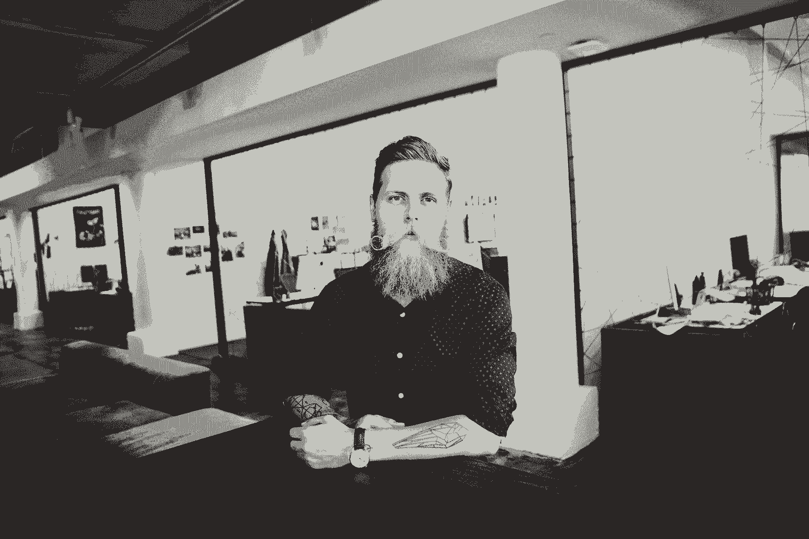

# Spotify 的设计领导关于为什么边项目应该是愚蠢的

> 原文：<https://review.firstround.com/Spotifys-Design-Lead-on-Why-Side-Projects-Should-be-Stupid>

Tobias van Schneider 的生活就像一个大项目。如今，他在纽约为 [Spotify](https://www.spotify.com/us/ "null") 设计和制造新产品，但当他 15 岁辍学去奥地利一家电脑商店当学徒时，他根本无法预料到这一点。当他申请研究生院和设计学校，并被反复告知他没有足够的培训或天赋来建立职业生涯时，他不可能预测到这一点。即使当他通过开设自己的工作室将自己对视觉和产品设计的业余爱好变成一份全职工作时，他也无法预测到这一点。他不知道会发生什么。但从那时起，副业就像面包屑一样标记了他的道路，引领他到今天的位置。

随着范·施耐德的成长，他在下班后和周末自学新技能，“兼职项目”的想法成了科技界的一个基本神话。像 Gmail、Craigslist 甚至便利贴这样的产品可以追溯到在业余时间发现和开发的工作。因此，黑客马拉松和其他策略已经成为大公司甚至初创公司的标准做法，以培养这种精神，并保持技术人才的参与。

范·施耐德说，这很好，但如果这变成了陈词滥调，那就不好了。他的观点是:**为了让副业真正成功，他们必须变得愚蠢**。以下是他的意思，以及如何帮助你的公司保持创造力和竞争力:

# 让自己变傻

范·施耐德说:“副业成功的唯一途径是，如果人们允许自己想得简单，改变想法，失败——基本上，不要太认真。”“当你认为某件事很愚蠢时，你会乐在其中，不会给它设置太多的结构。你可以享受不同类型的成功。”

仔细想想，我们认为取得巨大成功的大多数附带项目从来都只是实验。兼职项目包括员工在正常工作时间之外做的所有事情，或者如果他们在一家为员工留出独立探索时间的公司工作，他们在工作时间之内做的所有事情(想想谷歌著名的 20%时间规则)。在某个时间点，谷歌大约 50%的新项目都诞生于这个时间点。新的公司也出现了，第一次创业的人，比如火炮公司的首席技术官伊恩·兰沃斯，把周末和朋友的实验变成了全职工作。在所有这些项目开始的时候，没有人有一个宏伟的计划来把它们变成大规模的盈利项目。正如范·施耐德所说，“如果你这样想，你就失去了魔力。”

“副业很棒，因为你不需要知道任何事情。你可以成为一名初学者，因为没有人在关注你，也没有人对你抱有期望，”他说。“如果你没有主意，不要为此感到压力，去做点别的事情就好了。正是这种无所谓的态度让我们受到鼓舞，只做我们真正想做的事情。”

听起来很棒，但正如 van Schneider 指出的那样，让副业项目保持愚蠢可能真的真的很难——尤其是在一个每个人都在谈论资金、规模和数据驱动的决策的行业。如果你不小心的话，你可能会忘记你当初为什么想要做某件事。以下是公司和个人都可以从愚蠢的副业项目中学到的宝贵经验。

# 一步一步来

副业很简单。

van Schneider 沉浸在纽约的创业场景中，周围都是从事无数兼职项目的人，他也不断被新想法吸引。他给自己和他人的建议是，尽可能长时间地保持最基本的东西。

“想想你要实现你的想法的第一步，”他说。“我认为，当人们从事‘愚蠢’的副业时，他们会花更多的时间这样思考。你必须挤出时间来完成你的日常工作，所以你总是在想你能做的最少的事情来推进这个项目。你会考虑下一步要做的非常小的事情。”

这样做的好处是，你可以避免过度思考和扼杀你的热情。当你做某件事是因为你觉得你必须做，而不仅仅是因为你想做，就会有不自量力的倾向。

“很多人问自己问题，直到他们对未来如此恐惧，以至于他们永远不会做任何新的事情。”

**这些问题可能听起来很熟悉:**

我该如何衡量这个东西？

我真的能为此找到融资吗？

我有很大的成功机会吗？

“哦，我的上帝，有人在做完全相同的事情！现在怎么办？”

谁比我做得更好、更快、更聪明？

“所有这些怀疑都在起作用，使事情变得过于复杂，并扼杀了本可以有所作为的项目，”范·施耐德说。“当你专注于迈出第一步，或下一个正确的步骤，让事情继续发展时，你不会问自己所有这些问题。”

我的第一条建议就是他妈的去做。

有一个著名的史蒂夫·乔布斯采访，他谈到他意识到世界是由不比他聪明的人定义和建造的那一刻。就在那一刻，他知道自己可以自由地创造一切。

“我喜欢那次面试，因为大多数人在学校里不是这样学习的，”范·施耐德说。“我们从一开始就被教导，我们必须坐在那里，向比我们聪明的人学习。当然，可能有人更有经验，但他们也必须学习，但却没能达到目标，而我们往往看不到这一点。我认为，一旦你接受了这个现实，那么多的大门就会打开，失败不再重要。”

免于失败是成功的副业项目的另一个标志。因为你的生活不依赖于他们，所以你有失败的奢侈，可以喊‘重来！’当事情进展不顺利，没有什么坏事会发生在你身上。

“如果你能消除所有的恐惧，一步一步来，你会找到指引你前进的东西，”范·施耐德说。“你将学习新事物，吸收新信息，结识新朋友，获得反馈，看到不同领域的需求——新的大门将为你敞开。”

他说，当他与那些已经成功完成兼职项目的人交谈时，他们大多告诉他同样的事情:**“我只是在生活，做我喜欢的事情。当我看到事情发生时，我有所反应，但我没有强迫。”**

# 抛弃你对增长的痴迷

副业不在于快速扩大规模。

范·施耐德是另一位企业家的粉丝:[索菲娅·阿莫鲁索](http://en.wikipedia.org/wiki/Nasty_Gal "null")，在线时尚商店[的创始人](http://www.nastygal.com/?gclid=CIyBq72Zgb8CFZNffgodYn4Aag "null")。今天，该公司雇佣了数百名员工，每年带来超过 1 亿美元的收入——这是从爱好开始的。阿莫鲁索喜欢收集复古服装，并在易贝出售。很有趣。个人挑战。当她意识到人们愿意为她的一些产品支付相当高的价格时，她逐渐增加了库存，重新安排了生活的优先顺序，直到她全职经营公司。但这些都不能解释她当初为什么要开始。

很多人都在谈论“做你喜欢的事情”的重要性，但重要的是“爱”这个词的全部含义，范·施耐德说。爱不仅仅是空谈或表面上的激情。这是艰苦的工作。这是在非正常时间的专注奉献，尝试新事物，知道传统的成功机会渺茫的每一步。保持身材很好。“你这样做是因为你很享受。在这种情况下，看不到成长就不放弃；当你不放弃时，任何事情都可能发生。”

他说，记住，成功也来自于学习新事物、结识合适的人、个人成就感。你不知道接下来会发生什么。也许你的副业会引导你找到下一份工作，你的配偶，或者一种能让你自由探索的可持续生活。

现在有这么多创业成功的故事，人们认为一定有一个如何实现数百万美元退出的秘诀。事实上，许多博客文章、书籍和演讲者都支持他们发誓会有效的公式。但是范·施奈德不同意。“当我看到像索菲亚和讨厌的女孩这样的例子时，我不能写下一个计划，交给别人，让他们重复，”他说。"即使取得了最大的成功，情况也不会如此."

副业只会在你希望的时候变大。

“有时你的项目可能会增长，以至于你的工作量超出了你自己的能力，尤其是如果你还有一份全职工作的话，”范·施耐德说。“在这种情况下，你有机会想想成功对你来说是什么样子。只有在你愿意的情况下，你才能让别人和你一起工作。”

作为一个副产品，你也可以更仔细地考虑你把谁带进你的圈子。当你热爱你所做的事情时，你会希望和与你志同道合的人一起工作，他们和你一样相信这个项目及其潜力。

# 多相信自己

副业让你成为老板。

“当你感受到对一个项目的真正所有权时，你会对自己的决定更有信心，”范·施耐德说。“你可能会改变计划，这没关系。当这是你的项目时，你总是对的。”

当你采取这种态度，并开始相信自己和自己的技能时，你就更有可能在你所做的事情上取得成功。当你回避风险并怀疑自己的能力时，有前途的项目就夭折了。凡·施耐德是一个 100%自学设计的人，他亲身经历了这一点。尽管他收到了很多来自研究生项目的拒绝信，但他没有让自己气馁。他还是开了自己的工作室。

“当有人告诉我我不能做某件事时，我会说，‘谢谢，现在我肯定要去做。’"

“当你在做一个副业项目时，你有时间和选择来投资学习新的东西，”他说。“你也可以对你接受的反馈更加挑剔。如果你真的接受了，那是因为你真的想在某方面做得更好。”

很多人在工作中面临负面反馈，无论是来自经理或同事的评价，还是时间不够用的焦虑。“如果你采取‘旁门左道’的心态，你可以把它转化为建设性的能量，”范·施耐德说。“考虑一下。如果你热爱你的副业，即使有人说它是狗屎，你仍然热爱它。所以，接受反馈，找出它如何能让你变得更强，然后照着做。”

在他开设自己的工作室两年后，他开始与其他三名设计师合作，并被不久前拒绝他的一所大学聘用从事一项工作。“那一刻，我意识到一直相信自己是多么重要。”

# 公司如何支持愚蠢的副业项目

范·施耐德说，初创公司要保持其创新优势，并让最有才华的员工继续为公司投资，最好的办法就是为愚蠢的副业留出时间和空间。虽然像谷歌和苹果这样的大公司可以定期将这一点纳入人们的工作中，但越来越多的初创公司以黑客周和黑客日的形式提供时间。

“在 Spotify，我们举办为期一周的黑客马拉松，这基本上是带薪假期，在此期间，人们可以攻击任何他们想攻击的东西，”范·施奈德说。“很多东西都是从挫折中获得的——人们希望产品做的事情，或者他们一直想让之成为可能的事情。”

这是一个相当经典的叙述。他引用了设计博客和工作室[瑞士小姐](http://www.swiss-miss.com/ "null")的创建者[蒂娜·罗斯·艾森伯格](http://www.swiss-miss.com/about/hi-i-am-tina "null")的例子，她创建了网站 [Tattly](http://tattly.com/ "null") 出售有品味的、制作精良的临时纹身，因为她的小女儿从学校回家时手臂上有一个拙劣的复制品。“她从来没有想过，我要疯狂地扩大规模，变得富有，”范·施耐德说。作为一家公司，你希望吸引那些只想做一些酷的事情和填补空白的人。

“公司低估了给员工时间和空间去倾听他们的心声，探索他们感兴趣的事物的重要性，”他说。“这是一种无法衡量的东西，这让很多人对这个非常数据驱动的行业望而却步。但当你看到像《讨厌的女孩》中的索菲亚这样的人时，你就可以看到其中有多少感情。”

“人类是如此努力地去衡量一切。我们必须抵制这种态度。”

“在 Spotify，我们非常努力地建立这一理念。通过我们的黑客马拉松，我们尽最大努力告诉人们要相信自己，要疯狂——我们绝对不在乎他们的成果会变成什么。我们试图让这一点非常清楚。”

由此得出的推论是，一家公司需要有一个系统来获取黑客马拉松产生的想法，并利用它们做一些有成效的事情。一般来说，Spotify 选择前三个想法，并委托创造这些想法的团队将它们变成现实。没有什么比说‘哦，你为此努力了一个星期’更令人沮丧的了？很好，现在回去工作吧。即使你告诉他们你将把它存档，以后再回来看，那也是值得的。"

最重要的是，公司需要感谢黑客马拉松参与者的努力，以及他们对这些项目的热情。感恩对保持人们的满足感和全心投入工作大有帮助。范·施耐德说，你会惊讶地发现，有多少人在黑客活动中提出了想法，但在得不到支持的情况下，他们决定自己去实现这些想法。

目前，Spotify 正在开发最近一次黑客马拉松中的一个项目。负责这个想法的三个人有整整一年的时间来充实和实现它——他们拥有端到端的所有权。

“这是最好的情况，因为你知道这些人对他们正在做的事情超级有热情，”范·施耐德说。“我们在产品路线图中为这些想法留出了空间。我们冒着可能失败的风险，但我们清楚地表明，如果我们失败了也没关系。对我们公司来说这是值得的。我们会付钱给三个人，让他们用一年的时间探索有风险的东西，因为这种文化和态度对我们来说非常重要。当你这样做时，人们会留在你的公司，他们的动力会变得有感染力。”

他经常看到这种事情发生。员工们看到 Spotify 已经投资开发员工的创意，他们突然迫不及待地想要举办下一次黑客马拉松。“当你有这种精力时，你想告诉人们，他们不必等待下一个黑客日的机会。允许他们每天抽出一两个小时，在你付钱给他们的地方进行创新，追求他们想做的事情。建立让人们与他们的同事和经理分享这种工作的方式。让他们觉得得到了回报，否则你可能会失去他们。”

“如果人们找到时间并有伟大的想法，他们无论如何都会去做。他们会消失的。”

极有才华的人最先抵制被锁在任何环境里。范·施耐德指出了创建初创公司 [FiftyThree](http://www.fiftythree.com/ "null") 的团队，该公司生产铅笔笔和纸 iPad 应用程序。“他们中的许多人从微软出来，厌倦了他们正在做的事情，他们没有自由将他们的产品提升到一个新的水平。他们的大部分工作都被搁置了，”他说。“你必须告诉人们，这样他们才会相信你:‘你知道吗，在我们公司，你可以完全按照自己的方式做事。给予他们信任和责任，消除他们的恐惧。这些是伟大项目的主要成分。"

脸书是一个很好的反例。他们还有一个想尝试不同事物的天才团队。结果是[脸书论文](https://www.facebook.com/paper "null")，一个试验新概念的新应用，但并不打算取代当前的移动应用。公司给了这个团队资源来把它变成真实的东西。“当脸书的人们看到这样的事情发生时，他们也会受到鼓舞，有动力去追求新的东西。他们的项目不必是独立的产品或财务上的成功，公司会支持他们。只要你的公司里有有创造力的人，就有回报和高影响力。”

# 创造“副业”文化

正如一切与文化相关的事情一样，这始于雇佣合适的人。正如范·施耐德所说，有两种类型的雇员: **1)** 你可以把他们安排在一个房间里，让他们离开自己的方式，他们会在几乎没有监督的情况下创造出非凡的东西；还有 **2)** 当人们不知道下一步该做什么或者对他们的期望是什么时，他们会感到紧张。

“当你告诉一些人他们可以做任何事情时，他们会完全僵住，”他说。“在面试中问一些好的问题来确定人们在这个范围内的位置。这就是雇佣一个需要被给予目标的人和一个想要自己创造目标的人之间的区别。”后一类通常更加雄心勃勃。

关键是要弄清楚候选人的主要驱动力是什么。“他们想和你合作的主要原因是什么？是因为钱吗？是他们的长期目标，还是你的公司如何融入他们的职业生涯？他们的计划来自其他地方吗？他们过着别人的生活吗？他们父母的生活？他们朋友的生活？很多人都是。这些东西很容易被数据、头衔和股权所掩盖。”通过在面试中问更多的私人问题，对人们在工作之外的生活方式感兴趣，观察他们会选择什么样的薪酬方案，可以挖掘出很多这样的信息。

“说到底，人最伟大的旁门左道就是自己和自己的事业。”

未来最成功的公司将是尊重这一点的公司。范·施耐德把 Spotify 算作他们的一员。

典型的例子:他通过一个他非常热爱的副业项目的关系找到了现在的工作。[他重新构思并广泛撰写了一种他命名的新型 Mac 电子邮件客户端。Mail](http://theindustry.cc/2012/07/10/mail-redesigning-email/ "null") (点邮件)，完全重新思考邮件应用程序如何处理附件、日历邀请等等。

“我只是把这些想法放在那里，它到处都有特色。[快速公司](http://www.fastcodesign.com/welcome.html?destination=http://www.fastcodesign.com/1670282/actionsteps-a-simple-idea-that-could-revolutionize-email-and-save-you-time "null")正在写这方面的文章，他们称之为电子邮件再造。它就像病毒一样传播开来，”他说。“这让我着迷，因为在我发表它之前，我给很多朋友看了它，他们说他们不认为它有什么特别的，我只是决定，你知道我无论如何都要做它。”

突然之间，他被《连线》和其他主要出版物所关注。在谷歌、雅虎和微软运行大型电子邮件客户端的人找到他，问他是否想要一份工作。他与他们中的许多人建立了关系，至今仍保持着这种关系。最终，这让他选择了 Spotify，并有机会彻底改变人们在网络和移动界面上与音乐互动的方式，这是一个迫使他接受的挑战。

讽刺的是。邮件是如此多的人问，甚至恳求他或其他人建立他在文章中描述的模型，虽然他对它进行了一段时间的黑客攻击，但他最终放弃了它。他说:“我意识到我热衷于思考问题，但并没有真正解决问题。

“我建造它不是因为它不再有趣了。它不再愚蠢了。”