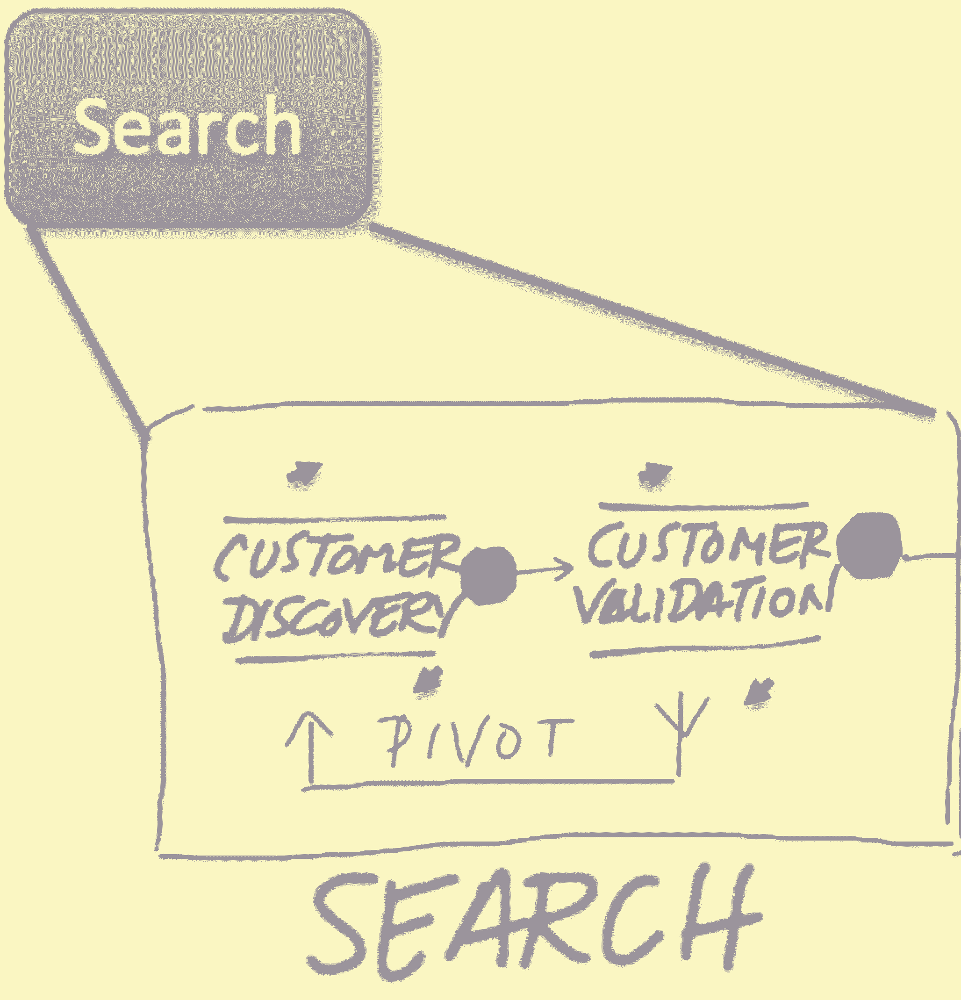
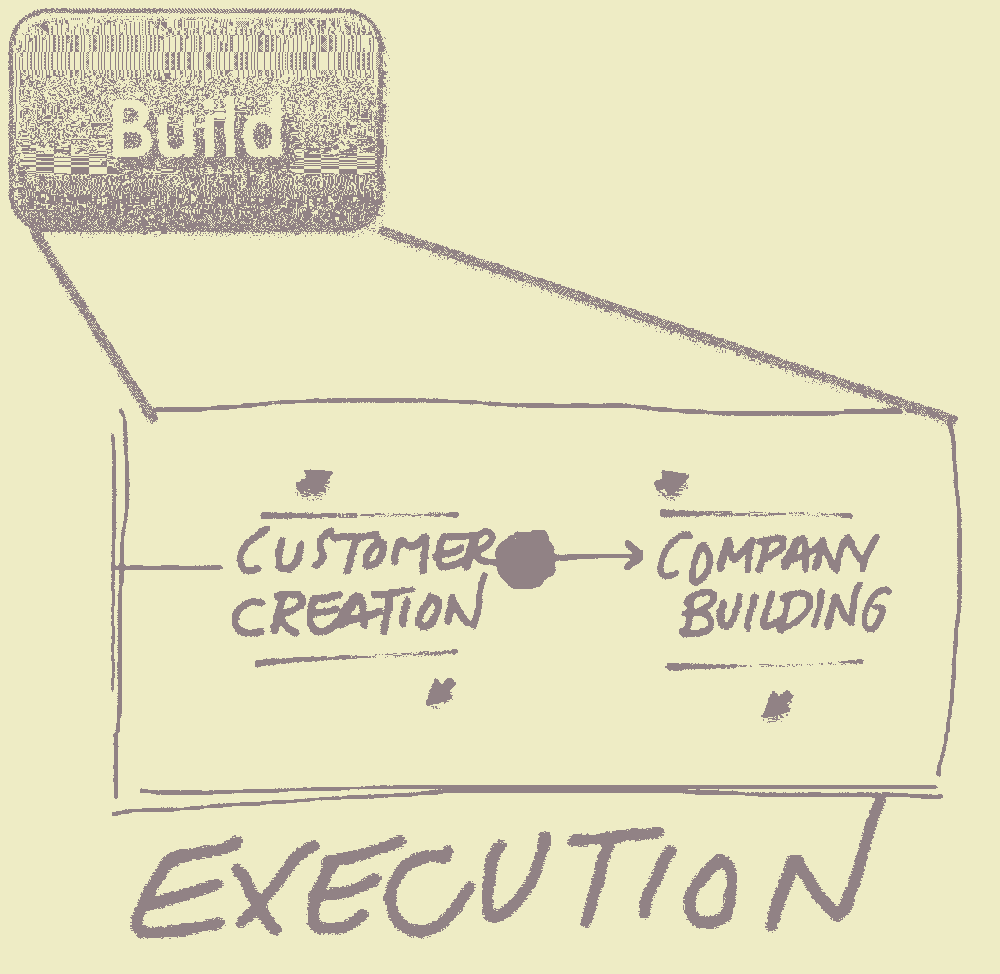

# 史蒂夫·布兰克的建议让你在高速增长中生存下来

> 原文：<https://review.firstround.com/Steve-Blank-on>

*本文由* *[史蒂夫·布兰克](http://steveblank.com/ "null")* *撰写，企业家、作者和精益创业运动的创始人之一。*

最近，我接到帕特里克的电话，他是我八年没听到消息的前学生。他现在是一家公司的首席执行官，想谈谈他承认是“第一世界”的问题。吃早餐时，他向我讲述了他自上学以来的最新生活(在初创公司担任过两个非首席执行官的角色)，但他想谈谈他的第三家初创公司——他和其他两位联合创始人最近创办的那家。

“我们现在有 70 人，今年我们将实现 4000 万美元的收入，本季度应该可以实现现金流盈亏平衡，”他说。听起来他活在梦里。我想知道我们为什么要见面。但后来他告诉了我所有关于艰难的决定，支点和解雇他最好的朋友，这是他必须做的事情。简而言之，他历尽艰辛。

“我已经走到这一步了，”他说。“我的董事会希望我能扩大规模。在接下来的 3 个季度里，我将把员工人数增加一倍。问题是战术手册在哪里？有很多关于创业应该怎么做的书，也有很多关于如果我在经营一家大型上市公司应该怎么做的建议，但没有一本描述如何处理公司发展问题的书。我感觉我只是在没有路线图的情况下开车。我应该读什么或做什么？”

我向帕特里克解释说，初创公司在成为大公司之前会经历一系列步骤，而他正好处在两个大公司的中间。

**搜索**

在这第一步，创业公司的目标是寻找一个可重复和可扩展的商业模式。通常需要多次迭代和转向才能找到产品与市场的契合度——你所生产的产品与购买者之间的匹配度。

当您获得客户确认时，您将知道您已准备好退出搜索阶段:

你已经找到了一个与客户购买意愿相匹配的销售渠道，并且了解使用该渠道的成本。

销售(和/或多边市场中的客户获取)变得可以通过销售力量(或网络效应或病毒式传播)实现，而无需创始人的巨大努力。

了解客户获取和激活，并且可以估计未来 18 个月的客户获取成本(CAC)和生命周期价值(LTV)。

大多数创业公司都死在这里。

**构建**

一家员工超过 40 人的公司需要转变为一家能够随着客户、用户或付费用户的增长而扩展的公司，其增长速度应能使公司:

实现正现金流(赚的钱比花的钱多)和/或以可以货币化的速度产生用户。

该构建阶段通常从大约 40 名员工开始，将持续到至少 175 名员工，在某些情况下会达到 700 名员工。在这个阶段，风险投资支持的创业公司通常会进行 C 轮或 D 轮或更晚的融资。

**成长**

在成长阶段，公司获得了流动性(首次公开募股，或者被更大的公司收购或合并以退出)，并通过可重复的过程成长。一整套关键绩效指标(KPI)、流程和程序已经到位，以保持发展势头。

**幸运的是你不是前任首席执行官**

我向帕特里克指出，他正处于从 search 到 Build 的转型过程中，我表示，作为一名 21 世纪的初创企业创始人，他很幸运遇到了这个问题，而不是在一二十年前。

过去，当风险投资资助的初创公司告诉投资者，他们发现了一种有利可图的商业模式时，风险投资会做的第一件事就是开始寻找“运营高管”——通常是 MBA，他会充当指定的“成年人”，接管从搜索到构建的过渡。当时的看法是，大多数创始人无法足够迅速地获得必要的技能来带领公司度过这一阶段。如今的好消息是，风投公司开始意识到让创始人留任的价值。

我提醒帕特里克，现实是初创公司天生混乱。作为创始人，他让公司进入了建设阶段，因为他能够创造性地独立思考。当地的情况变化如此之快，以至于最初深思熟虑的商业计划变得毫无意义。

他管理这种混乱和不确定性，并采取行动，而不是等着董事会的人告诉他该做什么。他的决定使他的公司免于死亡。

现在帕特里克将不得不调整自己和公司。在这个构建阶段，他必须专注于如何深思熟虑地开始建立他在搜索阶段认为理所当然的东西。他必须建立组织培训、招聘标准、销售流程和薪酬计划，同时打造一种仍然强调员工价值的文化。

Patrick 做了一堆笔记，说道:“你知道，当我在寻找一个商业模式时，我读了《创业业主手册》和《商业模式生成》,但是这个阶段的书在哪里？想一想，在搜索阶段，有孵化器和加速器，甚至你的精益启动平台/I-Corps 课程，给我们实践。有什么资源可供我学习如何在构建阶段指导我的公司？”

**交新朋友的时间到了**

我意识到帕特里克一针见血。尽管初创公司的搜索阶段非常混乱，但你永远不会孤单。有大量的建议和资源。但在过去，建筑阶段被视为大型公司的缩小版。投资者雇佣的运营高管使用他们在商学院或大公司学到的工具。

我建议帕特里克考虑四件事:

阅读关于这一阶段的稀疏但可用的文献。比如[顿悟的四个步骤第六章](http://www.amazon.com/gp/product/0989200507/ref=as_li_tf_tl?ie=UTF8&camp=1789&creative=9325&creativeASIN=0989200507&linkCode=as2&tag=wwwsteveblank-20 "null") *公司大楼*，本·霍洛维茨的[关于硬东西的硬东西](http://www.amazon.com/gp/product/0062273205/ref=as_li_tl?ie=UTF8&camp=1789&creative=9325&creativeASIN=0062273205&linkCode=as2&tag=wwwsteveblank-20&linkId=KYWF4Y65PKCUI4O6 "null")(系列散文)或者杰夫·摩尔的经典[跨越鸿沟](http://www.amazon.com/gp/product/0062292986/ref=as_li_tl?ie=UTF8&camp=1789&creative=9325&creativeASIN=0062292986&linkCode=as2&tag=wwwsteveblank-20&linkId=OABYX3BYINAM6TRY "null")。

如果他已经有一个顾问委员会(正式的和/或非正式的)，加上经历过这个阶段的首席执行官。如果他没有顾问委员会，那就成立一个。

找一个一对一的[首席执行官教练](http://www.josephdinuccicoaching.com/ "null")或者加入一个[首席执行官同行小组](http://www.vistage.com/ "null")。

可能也是最困难的是，考虑升级他的董事会，把那些专业知识只植根于研究阶段的董事会成员转移出去。