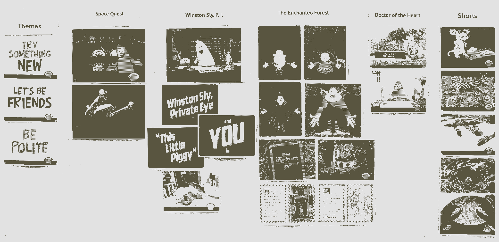

# 使用这些讲故事的技巧，让你的筹款从平庸变得令人难忘

> 原文：<https://review.firstround.com/Tell-Stories-Like-This-to-Take-Your-Fundraising-Pitch-from-Mediocre-to-Memorable>

**[柳文欢雅各布](https://www.linkedin.com/in/orenjacob "null")** 成长于一个说书人的家庭。他的父母是教师，他们经常接待来自世界各地的家人、朋友、同事和路人——每个人都有自己的故事要讲。因此，他围绕引人入胜的故事建立自己的事业并不令人惊讶。

他在 **[皮克斯](http://www.pixar.com/ "null")** 工作了 20 年，从事革新视觉媒体的电影，现在他是 **[ToyTalk](http://www.toytalk.com/ "null")** 的联合创始人兼首席执行官，这是一家互动娱乐公司，让孩子们能够与动画人物交谈并向他们学习。事实上，该公司今天刚刚发布了《温斯顿秀》的第二季。

所有这些工作都需要持续和创造性的推销。在皮克斯，这是关于开发 1 亿美元的批准邮票的电影宣传。现在，在 ToyTalk，Jacob 已经帮助筹集了超过 1600 万美元，使他们开创性的愿景成为现实。

在所有这些情况下，讲故事一直是让营销令人难忘和产生共鸣的关键部分。无论你谈论的是你的产品还是你的公司，Jacob 都推荐了几个具体的讲故事策略，既能吸引初次听众，又能打造成功的长期关系。

**伟大的故事被实践**

首先要知道，没有一个音高是静止的。它会根据你在和谁说话，你在哪里，你需要传达什么而发展。

“你有你的一分钟版本，你的十分钟版本，你的一小时版本，”雅各布说。“有些人认为这意味着将同一个故事编辑成不同的长度，但你不能这么做。不可能的。没有办法把一个小时的材料压缩到一分钟，仍然以同样的激情发言。对于每一种情况，你都必须有一种新的方法。”

最重要的是，你的推销必须适应不断的学习。每天你都有新的信息要处理。你对你的市场有更好的感觉，有新能力的新员工，刚刚浮出水面的想法。你的推销必须和你的创业本身一样充满活力。“每一天的每一分钟，都不是同一件事。”

出于所有这些原因以及更多的原因，你能做的最重要的事情就是练习——不断地、持续地、适应性地练习。这听起来像是常识，但实际情况比大多数人想象的要复杂得多。在创办 ToyTalk 之前，Jacob 是八月资本的 EIR，在那里他看到了无数的创业项目。“脱颖而出的是那些感觉自然的，因为这个人对材料非常了解。”

一个音高就是一场现场表演。你必须非常了解它，以至于它看起来是自发的。

你不能只是一遍又一遍地练习一分钟、十分钟或一小时的推销。雅各布说，你必须考虑阅读一个房间，阅读投资者的肢体语言，吸收当时的真相，并做出相应的调整。

“你的推销必须充满人性，”他说。“最好的单口喜剧演员会练习他们的套路一年，练习的次数如此之多，以至于他们可以让一群人来来回回，把套路移到他们需要的任何地方。如果有人大喊大叫，他们会处理并继续前进。当你能即兴做出很好的回应时，你才是最有人情味的。”

在皮克斯，这意味着在一个剧本上工作了很长时间，以至于动画角色实际上看起来像是在即兴创作 ToyTalk 将这一概念发展得更远。在一次筹款活动中，Jacob 努力做到既排练好了，又能自如地回答任何问题。如果他不能立即知道答案，他可以简单地说他会跟进，而不强求答案或慌张。

**为了达到这个水平，Jacob 有几个建议:**

他说:“在一个获得你热情但对你公司的实际技术、财务或商业细节知之甚少的人面前练习。”“这可能是你的丈夫、妻子或没有参与其中的密友。开始推销，告诉他们，到第 2 张幻灯片时，他们必须打断并问一个与第 12 张幻灯片相关的问题。让他们不断地问你一些没有顺序的问题，这样你就可以练习将对话从你想要和需要提出的不同观点转移开来。只有在关键点前后进行转换，你才能真正掌握各种桥梁，从而达到你在对话中需要达到的位置。”

企业家在筹资会议上可能面临的最棘手的事情之一是在谈话中途卡住。房间里的一个投资者问了一个问题，你发现自己掉进了一个兔子洞，没有清晰的路线回到你的叙述。

“在这种情况下，你真的必须非常坚定地说，‘嘿，我还有两分钟的时间来讨论这个问题，但是我明天可以给你更多的信息，’”Jacob 说。“你必须保持足够的清醒，认识到对话正在远离你，并知道你需要去哪里。做一个瞬间的内部审核来思考，好的，我们在第五张幻灯片上，我还有 10 分钟。如果你练习得足够多，你应该可以自己检查并进行实时编辑。不要把所有东西都塞进去。你可能会对自己说，“好极了，他们在谈论市场规模，这与参与度非常自然地联系在一起。”"

**伟大的故事是有结构的**

一场推介会应该有一种自然的节奏，像电影剧本一样。

“你需要带领整个房间一起踏上旅程，”雅各布说。“这意味着必须有一个有开头、中间和结尾的叙事弧线。当你掌控你的材料时，创造这种结构就在你的掌控之中。”

最好的会议是那些在房间里的风投们想要和你一起踏上旅程的会议——为了确保这一点，你必须达到他们预期的所有目的。“一开始就为他们铺好地图:‘我要谈订婚；我要谈谈货币化。“我将谈论我们的团队和特点以及潜在的竞争对手，”雅各布说。

你可能带着 12 张幻灯片参加会议——他推荐 12 张——并计划按顺序逐一介绍。但通常情况下，投资者会要求跳过第二张幻灯片，或者直接跳到第八张幻灯片。

“你可以控制如何讲述你的故事，但你也需要阅读房间。如果他们试图把你拉向一个话题，听他们的话，做相应的调整，但要保持故事的结构完整。你设计这个故事是为了让他们得出结论:他们必须投资于你。无论如何，你都必须立案。”

雅各布欣然承认，他通常从 60 到 70 张幻灯片开始，非常痛苦和深思熟虑地将他的演示文稿调整到 12 张。在他的团队觉得他们抓住了公司的精神和意图之前，他所有的推销都不得不经历多次重写。

他说，如果你无法精简你的演示文稿，那就回家对着镜子做。“如果你真的对自己诚实，你会碰到那种不太管用的滑梯。你会更好地了解如何在不包含幻灯片或章节的情况下建立自己的结论。”

This is how ToyTalk storyboards its work. Mapping out your narrative visually like this can dramatically improve the flow of your fundraising pitch.

当你设计你的演讲时，你要确保强调那些能让人们相信他们应该支持你的观点的要点。如果你认为市场机会是你必须分享的最有吸引力的东西，那就花更多的时间在它上面。如果你认为你的团队是无与伦比的，花点时间深入了解他们的简历和经历。你想建立你的演示和幻灯片，这样你的论点只会越来越强，越来越有动力。

“你可能在附录中有 10 张无聊的图表幻灯片，可以用来回答问题，但你的故事应该浓缩到你根本不会看幻灯片的程度。”

从不看你的幻灯片。如果你发现自己这样做，你已经输了。

雅各布说，从战术上来说，不计划一整小时的材料也很重要。你应该能够在短短 20 分钟内，以一种令人信服的、详细的方式讲述你的整个故事。“这几乎总是会扩大到填满整个小时。你会被打断的。你要回答问题。在那一刻，你会决定让某样东西更有血有肉，或者给某样东西添加更多细节。你会感觉到房间里有人想更多地讨论产品结构或这个统计或那个统计。你不想最后耗尽时间

雅各布说，与此同时，你希望把一小时又一小时的乏味细节藏在脑子里。“通过练习，你会对省略这些细节越来越有感觉，但如果谈话是那样的话，必要时你可以把它们放在最前面。举一些众所周知的小故事作为例子——例如，一个喜欢你所做的事情的用户。这些可能是对一般问题的有用回答。当你讲述这样的故事时，你可以想办法把话题转移到你想触及的其他问题上。”

重要的是把这些话变成你自己的。“你应该能够在不使用幻灯片的情况下进行推介。“冷，”雅各布说。“击中你想要的每一个关键点，不超过 20 分钟。就像投影仪灯泡爆了几次一样练习，确保那时你还能做到——不要等到前一天晚上。能够在一分钟之内在白板上重现你的任何想法。给轴标上标签，并在图上标出三到四个临界点，这些临界点代表了你要表达的观点。”

**伟大的故事都有背景**

ToyTalk 的一大部分叙述是为什么它在 2011 年推出是特别的。这需要雅各布生动地设置场景。随着不同的技术领域变得越来越拥挤，竞争对手越来越多，让这一点在你的推介中占据更大的比重——借助夏普当前的英特尔——是非常明智的。

你为什么相关？为什么是今年？为什么是这十年？那是两个非常不同的问题。回答这两个问题，给出不同范围的上下文。

当雅各布在 2011 年参加 ToyTalk 的种子期时，他获得了来自 [Greylock Partners](http://www.greylock.com/ "null") 、 [True Ventures](http://www.trueventures.com/ "null") 和 [First Round](http://www.firstround.com/ "null") 的融资。他从他的小但非常令人印象深刻的团队开始，然后扩大到谈论娱乐的趋势，为什么公司是相关的，为什么时机是正确的。

“我们讨论了娱乐领域的家庭市场，以及讲故事的发展方向，”他说。“我们讨论了在那一点上技术已经提供了什么，这在几年前是不可能的。我们谈到了我们首先是一家家庭娱乐公司，而不是一家技术公司。我们想讲述这样一个故事:打造一款与家庭需求和行为如此同步的产品，以至于这项技术会退居幕后。"

ToyTalk 的假设是，技术将变得更加以人为中心，人们将寻找那种自然主义和轻松的感觉。

“我们能够将 ToyTalk 置于几种趋势的交汇点——寻找创造角色和讲述故事的新方法的想法；内容以如此多的新形式出现，尤其是以我们可以互动的形式出现。事实上，就在我们在几次会议上讲述了这个故事之后，我们很幸运，苹果公司推出了 Siri。所以我们想把 ToyTalk 放在这个更大的全球故事的背景下。”

一年前，当该公司筹集更多资金，将查尔斯河风险投资公司纳入旗下时，很多这样的预测都变成了现实。有证据表明雅各布和他的团队正朝着正确的方向前进。语音识别刚刚成为一个严肃的焦点，更多的公司正在扩展到一个可以粗略地称为“家庭技术”的类别——对孩子友好，对父母舒适。

“机会来自于这种开放，”雅各布说。“当你把这些成分转化成新的东西时，这是一项有趣的潜在投资。人们以前没有尝试过，但它能生长吗？会是一个很大的市场吗？突然之间，在市场其他领域正在发生的事情的背景下，这些问题变得有意义了。”

**伟大的故事都有鼓舞人心的主角**

Oren Jacob at ToyTalk HQ in San Francisco.

当被问到时，柳文欢·雅各布会第一个告诉你，他很乐意在未来 20 年经营 ToyTalk。他对这个领域和他的公司充满信心——这让他与投资者的对话变得更加容易。

“当他们问我是否可以考虑用我的一生来制作这个产品时，我的回答是‘当然可以！’”他说对我来说不仅仅是商机。我上一份工作干了 20 年，所以我不会带着几年后飞来飞去的想法来到这里。当我这么说的时候，我并没有夸大自己，因为这是事实。"

对于 Jacob 和 ToyTalk 来说，相关人员是他们价值的重要组成部分。

人类天生渴望可以信任的关系。

“它们会随着时间的推移而成长和演变，但这正是你希望投资者做到的。你要和他们结婚。你不能和他们离婚。这是一个严肃的承诺，”雅各布说。当你打造这样一种债券时，你希望投资者知道，他们把赌注押在了一个故事中有才华、有能力、令人信服的主角身上，每个人都支持他们获胜。

雅各布说，这就是为什么精心策划一个有趣的、鼓舞人心的团队故事如此重要。“到目前为止，对我们来说最重要的幻灯片是我们推介中的第 3 张幻灯片。这是一个说“嗨，我们是玩具，这是我们的第一轮，这是我们正在做的。”"

当时，这个团队由雅各布本人、[马丁·雷迪](http://firstround.com/article/lessons-from-pixar-why-software-developers-should-be-story-tellers "null")、[蕾妮·亚当斯、](http://www.toytalk.com/about/team/renee/ "null") [布莱恩·兰格纳](http://www.toytalk.com/about/team/brian/ "null")、[迈克尔·钱恩](http://www.toytalk.com/about/team/michael/ "null")和其他几个人组成——他们中的大多数人都在皮克斯和其他有影响力的软件公司呆过很长时间，这些公司只雇佣最优秀的人。

在一些会议中，这个臭名昭著的第三号幻灯片如此令人信服，以至于投资者告诉雅各布在那个时候关上他的笔记本电脑——他们已经进来了。不要低估你故事中人物的力量。

“这个团队直接应对了眼前的挑战，”他说。“这引起了共鸣。我们都有一种明显的激情。”

**伟大的故事是意想不到的**

雅各布说，最好的故事是把一堆熟悉的拼图拼起来，组合成新的有价值的东西。

“你可以找到有创造力的人。你可以找到语音识别专家和有才华的移动开发者。这些元素中的每一个都是可靠的投资，以前在其他方面也发挥过作用。”

当你以不同的方式洗牌时，你会得到非常独特的东西。

“人们可能拥有这些元素，但他们没有我们拥有的那种文字——所以这让我们与众不同。我们来自皮克斯的背景表明，我们可以做得很好，我们可以为此招募人才。我可以为我们的每一块拼图辩护，我可以为以投资者从未见过的方式部署它们辩护。”

还有一个很多投资者如今很少期望看到的因素:

“你必须让他们相信你有多相信它，你有多想和他们一起踏上旅程——即使你们两个都不知道它会变得有多大，”雅各布说。“当你在推销时，你应该说明你的理由不是为了筹集资金，而是因为你对自己可能实现的目标非常兴奋。”

*摄影由* *[迈克尔乔治](http://home.michaelgeorgephoto.com/ "null")* *。*